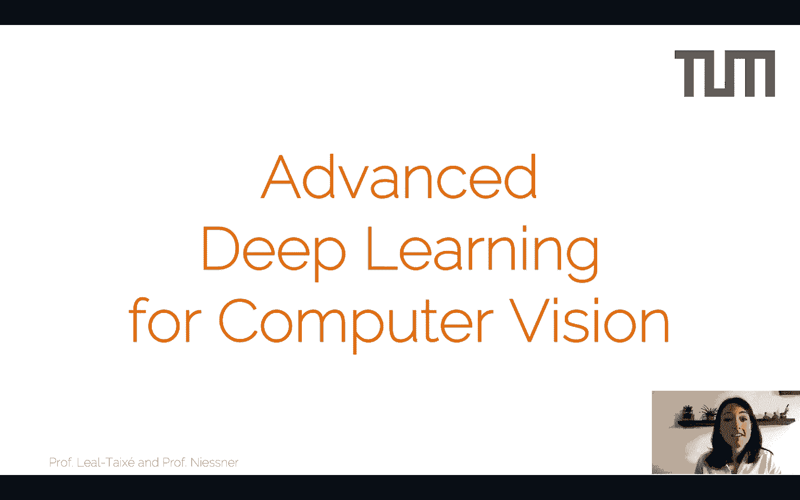

# P1：L1 - 深度学习计算机视觉介绍 - ShowMeAI - BV1Tf4y1L7wg

Welcome everyone to the first lecture on advanced deep learning for Comp visionion so this is an introductory lecture and since we have this unusual situation with the virus we decided to start by recording all the lectures so this is the first one welcome and first let me start by introducing the team so we are two professors myself and Professor Nisner we are both going to teach this lecture so that we can offer a bit of variety in the topics that we will actually present and these variety will stem from the research that we're both doing in computer vision and deep learning。

We also have a diverse set of tutors， so Dave G， Tim and Maxim are going to help us and are going to help you guide you through the research projects。

 which are a very important part of this lecture， as you will see today。

So let's see what is this course about so the theoretical lectures are going to be a presentation of advanced deep learning methods with a heavy focus on computer vision tasks so you already did the introduction to deep learning you have these strong foundations on the theory and also quite a lot of practice on the basis introduction to deep learning so now we're going to take all of these techniques step further and step quite a lot into the field of computer vision。

Now we're going to focus quite a lot on new methods， so this is a research oriented course。

 so we're going to be present in methods that have been invented some of them only this year。

 so really recent stuff。There's going to be plenty of references。

 so if you want to read the research papers that we're proposing you。

 if you want to expand on your knowledge， this is the right course for you。And as I said。

 this is a very research oriented course。So while we will go over these new methods in the theoretical lectures。

 you will actually have to come up with your own ideas to solve a specific vision problem。

 so this is essentially a practical course with some theoretical lectures that are going to provide you some tools to actually solve a vision problem that you're interested in。

So there's a very strong focus on the practical side。

And this is in the form of a semester long project where you can actually put all the knowledge that you learned in introduction to deep learning and especially in the lectures of advanced deep learning。

 you can actually put it into practice so you can actually code up some of these methods。

 train your first big neural networks to solve a real specific computer vision problem。

Now it is very important that you actually dedicate time to these projects。

 so we have been told semester after semester that this project is very time consuming。

 we are fully aware of this， but we find that this practical experience is actually very very valuable。

 so we find that this project is going to give you a lot for your future for your career。

 but it's also very time consuming。Now the project will be done in teams of two。

 which means that if at the beginning you create the team and you commit to another person to do this project up until the end。

 and suddenly you draw mid semester， this is really bad for the other student of the team who has suddenly been left alone。

So we really want to avoid students dropping mid semester。

 so we already tell you from the beginning that this project is very time consuming。

 so if you decide to move forward with this lecture。

 make sure that this semester is on the light side and that you can actually dedicate a lot of time for ADL4 CV if not please consider taking this course in the next semester you will most likely still be accepted if you make the cutD this semester。

Okay， so let's move towards course organization， so there's going to be in the beginning we thought around 12 lectures。

 this could be reduced this semester to about eight lectures we have to see and a difference that we're going to introduce this semester is that we're going to condense these lectures。

So we want to actually make this or present you with all these theory。

 with all these tools of advancedive learning in a condensed way at the beginning of the lecture。

 so that then you have all these tools you have learned all these tools and you can actually apply them through the project。

Otherwise， what happened to some people is that they have， for example。

 a gun based project and guns are not introduced until five weeks after the first lecture and the project has already started by them so they don't really have time to take full advantage of this introduction to G lecture so we're going to have lectures every Monday and every Friday。

We're going to upload them online so all the lectures are going to be recorded and every Monday and every Friday one of the lectures is going to be uploaded so look at Moodle for new lectures that are going to come at the beginning and the end of the week。

Now from the practical side， the project is going to be done in groups of two and this is nonnegotiable。

 groups of one and groups of three are not possible unless there is a problem that we are not an even number of students。

 but in principle a project has to be done in groups of two and there's going to be presentations during the semester about the progress of the project。

 we have to see how we do this whether this will be online or this will be already physical presentations that are going to happen at the seminar room on Fridays。

And finally， there's going to be a final poster presentation while you'll be able to present your results to both me and Matta's research group。

Now there's going to be an exam， so the exam counts for one thirdd of the grade the date is still not set。

 there's going to be the classic two review sessions so you can go see what you did well and what you didn't do well in the exam。

 but again the most important part of the lecture is actually the practical part which counts for two thirds of the grade。

Now the project a little bit talking about already about deadlines for the project。

 so next Friday we're going to have a project presentation and project presentation means that we will actually present you with possible projects that we are interested in that the tutors。

 TAs are actually interested in research wise it's related to their own research that they're doing for the PhD。

you will be able then to take a look at the projects。

 read related works and find out whether you actually like any of those projects now on Monday the 4th of May we're going to the project assignment so this will most likely happen live we will try to do this live even though we might have to do it online。

And on the 11th of May you will actually deliver a one page abstract of your idea for the project。

 so following the project assignments and following the project description that the TAs will present on the 24th you will actually develop kind of a research plan。

 which will be this one page abstract and until the 15th we will evaluate actually this project。

Now two notes on the actual projects， one is that of course this is advanced learning for computer vision so the projects are mostly revolving around computer vision this doesn't mean that we not interesting in projects that are maybe natural language processing projects or related areas that where you actually still use deep learning。

 but of course then we cannot offer the guidance the expertise that we have in computer vision so if you have any ideas of your own for projects。

 please pitch them to us， please talk to the Ts we can still make those happen and we can still evaluate whether those projects would be actually do in one semester in ADL4 CV but of course we have a strong preference for the projects that we' are proposing and for projects in Comp visionion nonetheless please be creative if you have any idea just pitch。

To us， just drop us an email。Okay， so the project evaluation is going to be separated into presentations and poster presentation so we will have two sets of presentations now on the 8 and 12th of June。

 we're going to have presentation separated into two groups and these groups we will let you know to which group you actually belong for this first presentation you just have to present first results。

 first challenges that you had what kind of data sets did you find for your challenge。

 how did you set up these data sets all of these things maybe the first neural network。

 the first baseline that you actually trained already。

And it is mandatory to attend to these presentations。

 so everyone needs to attend and we actually welcome questions from other members of the group。

 so we actually want everyone to participate in these presentations。

 we want everyone to ask questions， we have to learn from each other's projects。

Now the second presentation is going to happen in July and you will have had a month from the first presentation to the second。

 so here you have to present almost final results， so what are the things that you tried what worked what didn't work and what are the results that you have up to this point。

And I said almost final results because on the 24th of July。

 there's going to be a poster presentation and this is the absolute final presentation for your project。

So see， you're going to have roughly from the 6th or the 10th of July until the 24th to finalize the code。

 finalize the report， finalize the results， and present them on the 24th。

Now all the results have to be there already on the 20th which is the final deadline for the report。

 so at noon on the 20th of July you're going to hand in a report which is going to be maximum four pages including images including all the results including everything that you tried using a template that we will actually provide you and then you will have four days essentially to prepare for the final poster presentation。

Now the grading， as I said， there's going to be an exam is going to be one thirdd of the grade and it's going to be based on the lectures that we will actually be giving during the semester。

 but the practical part is going to be the bulk of the grade so two thirdhirds of the grade is going to be the practical part Now the presentations the two or presentations during the semester and the poster presentation count for one thirdd of that practical part the final report is another third and the code submission and in general evaluation of what was the quality of the project this is the remaining one thirdd。

Now in order to follow up with the projects。You will be assigned to a TA to one of the four tutors。

 Dave G， Tim and Maxim and they're going to help you out and they're going to monitor your progress。

 so please make sure that you have weekly or by weekly office hours with them that you discuss with the progress with them now they're not there to actually help you coding something that you cannot figure out but of course if you have a problem if something is not working if a network is not training。

 you should actually contact them， you should talk to them so that you're sure you're making progress every week。

And the TA assignment， the tutor assignment will be announced after the projects。

 so you will be already by then ready to start talking with them and start organizing your semester long project。

Now the lecture will be entirely online for now， so this is the plan to actually record all the lectures and the Moodles should be already set up。

 the slides will be posted there， they will also be posted on the website that you see here。

As well as the link to the video recordings for these lectures。

Now any questions regarding the organization of the course you have a dedicated email address。

 unfortunately we cannot answer emails to our individual addresses because we just would have too many emails and too many unorganized emails。

 so for any question you have regarding the course， please use the official ADL for CV email。

Now it is very important that the projects happen in Teames of two。

 so if you already know your partner that's great otherwise please use Moodle so have a chat you know after these introductory lectures after you have taken a look at the projects that you present on Friday which one do you like and then post on Mole your preferences you know I'm in favor of doing this type of project who is interested who doesn't have a team so try to find the let's try to make these themes happen on Moodle。

Now this is an overview of the project timeline so that you have an idea that you will start roughly the project on the second week of May。

And then you will have roughly three， four weeks until the first presentations then another three。

 four weeks until the second presentation， and finally around 10 to 15 days until the deadline for the report and the course presentation。

Okay so thank you very much for being here in this first lecture。

 we're really looking forward to this new mode of doing lectures which will happen online。

 we will try to keep up with the new challenges that come with actually recording lectures and doing almost all of the teaching online so we will also open up lines of question on Moodle for each of the lectures so you can ask all the questions that you want there then we will try to answer you on time so that you have this kind of live feedback。

And please stay tuned for the new lectures and again make sure that you make time for this lecture。

 this is quite a time consuming lecture， but it's also a lot of fun。Good。

 then see you at the next lecture。

