# 【双语字幕+资料下载】慕尼黑工大 ADL4CV ｜ 计算机视觉深度学习进阶课 (2020·全10讲) - P2：L2 - 可视化与模型可解释性 - ShowMeAI - BV1Tf4y1L7wg

Welcome to the lecture on Visization and interpretability。

So why do we actually have a electron visualization Well it turns out that there's several ways that one can actually visualize Comnets and all of these ways are actually a great way for debugging your CNN so you can visualize the features that you get after training a CNN。

 you can visualize the activations， you can visualize the gradients。

 there are certain visualizations also to see whether your neural network is making accurate predictions is' making predictions that actually make sense。

For example， like TN visualization。And it turns out that it is a really powerful way of analyzing your convolutional neural network so often it is hard to see what is happening inside a covenet some people say this is more like a black box and you don't really know how the component is making decisions and actually using visualization tools is one way one step forward towards understanding what is happening inside these covenets so let's see what type of visualizations we actually have。

So in order to visualize and understand CNNNs， we can start actually by visualizing in the image space so for example here we have a really simple convolution on neural network。

 we have this image that acts as an input and then we have for example the first layer。

 five by5 convolutions with strip1 which gives you this output of size 2828 by6。

 then you have an average pullinging operation another 5 by5 operation etca。

 etc until you reach these two series of fully connected layers that give you your classification。

So in order to visualize things in the image space， you can pick a unit in layer one。

And then what we will do is we will find the nine image patches。In your dataset。

 so you will train your neural network with a given training dataset set。

 and then you will find the nine image patches amongst all of the image in your dataset that actually maximize this unique activation。

So in this case， let's say I pick one of the convolutional filters。

 one of these five by five filters， and I actually want to observe。

All the image patches that maximized the activation of this filter。

So here I have my maximal response。And now what I can do is I can actually map this response to the image。

 right I can say this particular image patch was the one responsible for maximally activating my unit there。

And if we actually do this， we can visualize in the image space。

 which means these are actually real patches extracted from the images， and we can see for example。

 for a feature map one of layer one the nine image patches that provide the highest activation are these patches that we're actually showing here so you can see that they all depict this kind of diagonal。

Trend here， which means that actually this particular filter was activated by this diagonal shape。

So if we actually observe second feature for again， the first layer。

 we see that the shape has of course changed， so this filter is actually focused on a different type of geometrical shape。

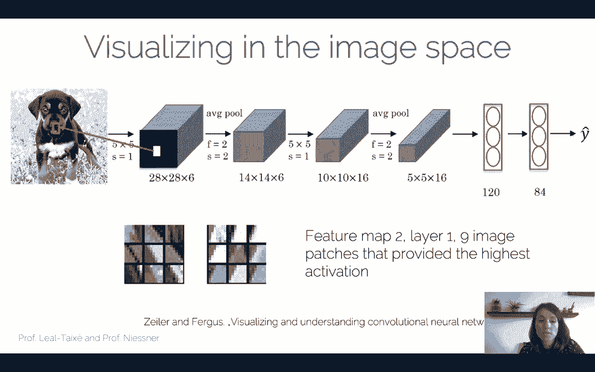

So as we can see in layer one here， for example， we plot these nine patches that mostly activated each of these nine filters in layer one。

 so ranging from filter one all the way to two，3，4 and filter nine and you see that some filters are activated by just like green patches。

 no edges present there， we have diagonal edges in both directions， we have different colors。

 so each of these filters is responsible for detecting a different geometrical pattern。

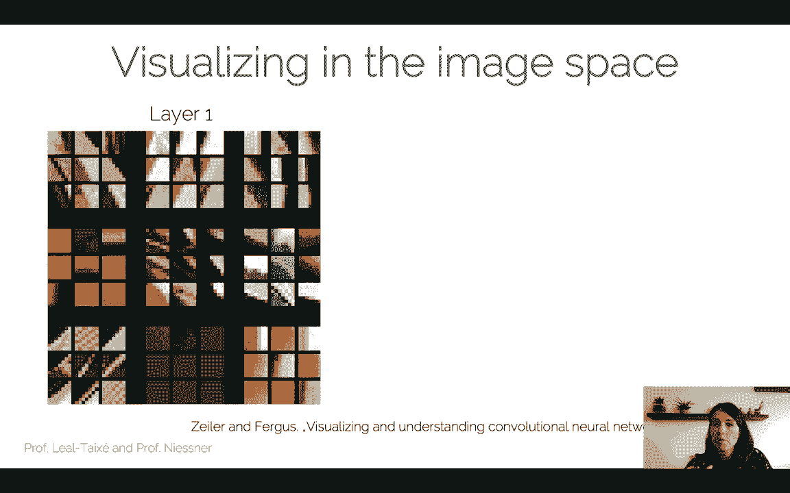

So when we go to layer2， we start see more interesting things， so remember then in layer one。

 the convolutional filters from you as you have seen in I2DL。

 these are mostly responsible for actually detecting geometrical shapes detecting edges vertical horizontal while in layer2 we start already seeing some more complex patterns。

 so for example， for the case for this filter we see that the patches that Maximally activated are patches that show mostly eyes or these round shapes we see also some interesting horizontal textures here。

So we can already start seeing some more interesting shapes appearing when we actually observe what maximally activates the filters in layer2。

And so here we have an example of these eye shapes that I was talking about are these round shapes that maximum activate this filter。

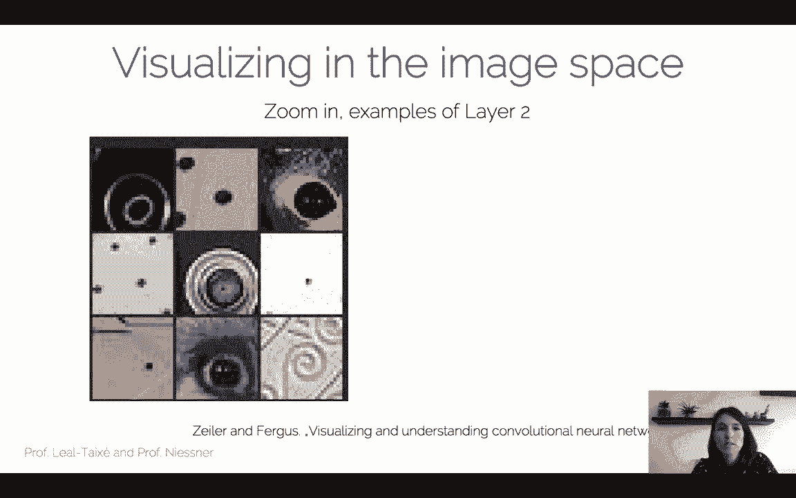

Or these kind of vertical stripes， these repetitive structures that activate the filter of layer2。

In layer5， of course， things get even more interesting because we start to see parts of an object right so we see filters that are responsible for detecting these kind of shapes that we can see in keyboards or we can see in coffee machines。

 for example， while，This filtering in layer5 is actually responsible for detecting logos。

 for example， so really interesting to actually visualize what are the patches in image space that maxim activate the filters in different layers。

And of course， then we have other filters that are focusing on flowers。

 filters that are focusing on dogs， so things become more and more specialized as we move deeper into the network。

So this was visualizing an image space we can also of course， visualize the importance。

Of a certain part of an image。So for this， what the authors of this EC14 paper proposed was what is called the occlusion experiment。

 so in this experiment what we do is we actually so we have again our trained convolutional neural network which we will depict by this orange shape here。

And this number exchanged for the task of classification。

 so in this case it's pretty sure with confidence 0。96 that this is actually the image of a dog。

So the occlusion experiment， what it consists of is you actually take your image and you block different parts of the image。

And then what you want to see is you want to see how this classification score actually changes。

So let's look at this with an example。So let's assume that I actually put a gray patch on top of the lower left corner of this image。

 so this patch is' not really blocking the image of the dog。

 it's blocking mostly the grass so as we can expect the classification score is not going to change too much so the neural network is still able to say with high confidence that this is actually a dog。

Now what happens if we block the face of the dog right so the nose of the dog cannot be seen。

 the eye of the dog cannot be seen， one ear is partially blocked。

 so now almost all the phase of the dog is covered。

And what we're going to observe actually is that the confidence of this neural network。

 the confidence in saying that this actually do has dropped significantly， so from 0。95 to 0。35。

So now the network is really not confident that it is a dog。

So of course this tells us something that is obvious for us right and it tells us that for example。

 the face of the dog is more important for classificationification than the grass beneath the dog because a dog could be sitting on grass could be sitting on a wooden floor could be sitting on tiles could be sitting anywhere。

 so the floor or the background is not important to actually classify the dog。

So with this occlusion experiment， what we can do is we can actually create a map now we can create a map or an image where each pixel actually represents the classification probability if an occlusion square is placed exactly on that region centered on that pixel。

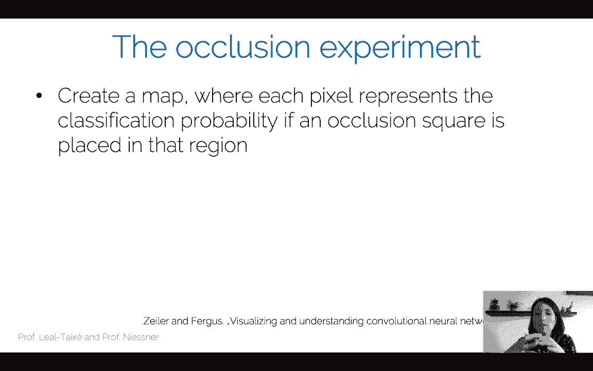

So just to make things clear， so this is the map that we would obtain for this image。

And specifically what it says is that in order to obtain the value of the map on this pixel here。

 where the gray square is center。We actually what we need to do is we need to place a gray square center around this pixel。

 we need to compute the classification probability and then put the classification value on this pixel in the map。

So what we can see as a result is kind of the importance of parts of the image， so for example。

 this part of the image which coincides with the face of the dog is much more important for classification for the neural network because all of these values here are very low。

Which means that if we actually place a square centered around one of those pixels。

 the classification score for this do is going to go down significantly。

So this actually gives you a lot of information of the content of an image and how actually a neural network sees the image。

 so of course if we actually want to classify for example the car wheel as it is for this image this part of the image where the car wheel is visible is going to be the most important if we want to classify Afghanhound in this image。

 the region where the dog is is actually the most important and we can expect that if we actually wanted to classify people then this regions would become more important so it is important to see that actually this map is unique between one image but also one classification label so we need to pick both and for each classification label we will obtain a different map。

And again， the pixels with the lowest value are actually the most important pixels for the classification of this particular class for this particular image。

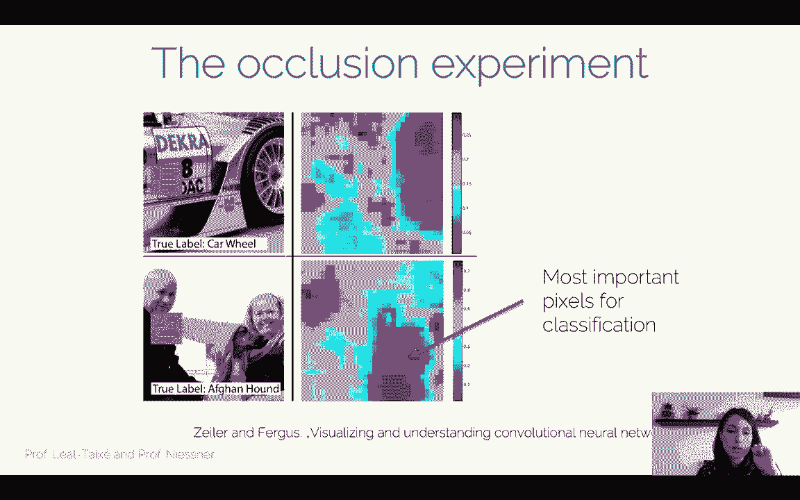

So move on now towards visualizing the actual features， so visualizing these convolutional kernels。

 what are these convolutional kernels really looking at in the image？In in order to do this。

 what we actually so one of the ways of doing is the method called Bovnet。

And how this method actually works is the main idea is to map the neural network activations back to the image base and then see what we get out there。

 so we want to somehow visualize these activations by projecting them back to the image base。

So how does it work so at the top row we have a classic conve right so we have our image that goes through the CNN which is depicted in orange。

And from this image we actually obtain a feature representation， we obtain， for example。

 a vector that represents this image， and with this vector we do， for example， image classification。

Now， the idea of a decomnet is to do the opposite， to go from the image from the feature representation sorry。

All the way back to the image。So this is just for the purposes of visualization right so we're not going to go into the mentality of our1 colorsrs just yet。

So the idea here is slightly different the idea is that。

We're going to use this decovNe to actually do feature visualization。And for this， of course。

 the first thing that we have to do is we have to decide what kind of layers so which of the layers of my CNN do I actually want to visualize right。

 which of these filters am I going to visualize？So we're going to do an overview of the processes we have this component we put the image in。

We process it with pass it through a CNN until a certain layer。

 the layer that we actually want to visualize。And then we jump。

 we jump to the decomnet that it's going to bring our features all the way to the image space。

So again， we're not going to get into the whole mentality of the auto encoders in which we want to obtain。

 for example， a semantic segmentation as an output， no。

 here we want't use the decomNe to visualize the features of a certain layer。

So how this works is we first choose an input image， we forward pass it through the network， we say。

 okay， I decide that I want to observe filter 15， for example， of the third convolutional layer。

 because I know this is highly activated by this image。

So what I'm going to do is I'm going to zero out all the other filters。

 so only this filter 15 of the third layer will actually have the features that I've obtained by passing the image through the CNN。

And then I will take this block of features， which contains the features of filter 15 and all the other filters filled with zeros。

And I will pass this through the Vicom F that will take this representation and blow it back to the image space。

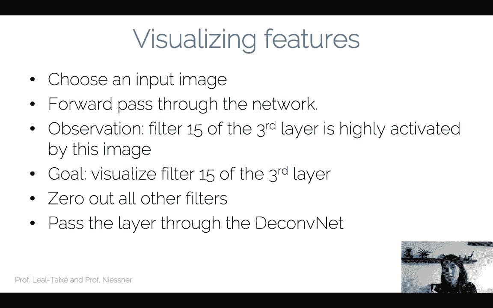

So let's look at a bit more in detail how the Dcomnet actually does this right so here you can see the Comvnet and decomNenet actually interacting with each other so I have the COVnet that processes that or let's say the processes that the operations of the conVnet are depicted here on the right and the operations of the decomvNe are depicted on the left。

So what we do as a process is we take an image， we it， process it through the confNe。

 all the way going up， then we switch to the decomNe。

 then we go down through the operations of the decomfnet all the way into the image space again。

And so you can see here the plastic operations of the conve， right like convolal filters。

 some nonlinear activations， some res， for example， some pulls， et cetera， et ceter。

 and what we will have is mirrored operations that we'll describe now。

 which are present in the decomvenet。So let's start with the first operation。

 which we call unpooling。So in a con one of the key operations。

 one of the well knownn operations is the max pooling operation right so you have your feature map which is for example。

 four by four and with the max pooling operation you can reduce it to a size of two by two。

By taking out of four numbers， taking only the maximum one。Right so this is depicted， for example。

 in here where we have this four by four feature map and for each of these colored regions in here。

 for each of these two by two regions what we do is we pick the maximum value and this is the value that will be passed onto this max pulled map。

So from this format representation， we will obtain a2 by2 representation。

Now what this does is it reduces the spatial size， which is something really common as we go deeper and deeper into convolution neural networks as we go from one layer to next。

But now for the decom men， we need to have the opposite operation and this is what is called the unpoolling operation。

Now the unling operation， what it does is it needs to bring this two by representation into a4 by4 representation。

So this is depicted all the way here at the bottom。

 you see this unpooling actually goes from this two item representation to this four by four。

And so what it has to do is essentially it has to make a decision what kind of values am I going to put in this 4 by4 representation。

 because it's not so obvious where to put certain values of the two weight representation and what to do with the other positions。

 should I put it zero， what should I do？So the unpling operation in thecomNe。Actually。

 is about putting these maximum locations that we obtain from this operation。

Exactly where the maximum location came from from the pooling operation。

RightSo what I'm going to do is during the pulling operation of the decom。

 I'm going to record exactly in this max location map where the maximums came from。

 so which position in the pool in the sorry in the original map。

 which was the position that contained this maximum value that was later passed to this pool map so you can see this four locations here。

Now in the unpoling operation what I'm going to do is I'm going to take these locations。

And I'm going to say this maximum here should be put in the location where the maximum came from。

 same for the maximum of the green region， same for the maximum of the right region。

 so you see that I've now located these four maximum values in these four locations that I obtained from the pooling operation。

Now the second operation is the RELello right so in the con we have these on activations usually these are RELs for convolutional neural networks and now the idea is what kind of non nonlinear operation shall I have in a decomnet well it turns out then you can still use the RE loop because you're still interested in having positive features for visualization you're interested in killing off all the negative value so RELello is going to do just fine。

So I mentioned this operation， right， I do this。I do this processing of my convolutional features。

 I still eliminate the negative ones so I'm going to be left with really strong positive activations。

 which I'm then going to visualize in the image space。

So now one note that I forgot about this about this pooling is that its actually why do we actually do this。

 right？So the whole idea here is that if I had an activation in the co， this user representation of。

 for example， an edge or something like this， so it was an important part of the image。

I want to keep it when I do the iron pulling right this is all about visualization so I want to keep the structures that I killed in these pulling operations right because when you do these pulling operations you kind of kill a little bit the structure of the image right at least the details so I want to go back to the image phase and I want to recover this details I actually want to recover them in the right positions right I want to recover these edges in the right position where the edge was。

 especially if I do a lot of max and pulling， I want to put the information exactly where it was in the original image。

So that's the intuition behind this type of onepoing。Okay， now the third most important operation。

 right？So what we actually want is we want to mirror the convolution operation right and again this is so you don't have to go into the mindset of how to encoders right this is not a transpose convolution。

 theres nothing like that。It's actually a deconvolution operation。

 it's actually we want to do the opposite operation that we did in the confNe， right？

And in practice what we're going to do， we're going to come off with that transpo of the filter that we learned in this component here。

And in the paper and here we use transpost a little bit。

 so we kind of overuseed this word because it's literally vertically an horizontally flipped version of this learned convolutional filter。

So importantly thing here， the convolutional filter that we're going to use in the decomNe is not learned。

 is merely this transpose version of the learned filter。

 the filter that we learned when we train this combat。So let's look at why is this transpose， right？

This is because again， we don't want to reconstruct any type of output here with our becomenet right like we wouldn't how to encode。

 but we actually want to find out。Which of the inputs really influence my outputs and by how much right so imagine a convolutional filter it's going through an image now each of the of the operations of weights being multiplied by the pixels of the image means that you will give certain importance to each of the pixels right and you actually want to find out what was this importance。

That you get to that pixel when you pass it through your company。

So let's look at this with an example right so we have this MY7 input right。

 we do this convolution operation which gives us now this five by5 output。

And we can do another combV operation， for example。

 this 3 by3 filter which would give us again another reduction so here we're not using padding or anything of the sort。

 so from ourem7 an input with a couple of convolution operations we reach this 3 by3 output。

And we see， for example， depicted in this case this3 by3 filter that gives us one output。

 one pixel of this 3 by3 output is actually computed from this three by three convolutional operation。

So for one of the output pixels right in this three by three map is actually connected to nine input pixels。

 so it took nine input pixels。It took those values multiplied by nine ways and he created this one output pixel。

Now， when we actually apply this deconvolution right。

 it means that we're not going all the way down to this 3 by3 output。

 but we're actually stopping at the5 by5 and then we're applying this deconvolution operation。

Now we're going to do the same thing that we did before with the five by5 input that created the three by three output。

But now our three by three convolutional filter depicted in green here is going to create this black pixel output。

 so it took those nine pixels to actually generate the black pixel output。

Now each of these pixels had a different influence on the black pixel output depending on the value of the weight of this convolutional filter。

 for example， the red pixel had a different influence than the orange pixel into the final value of this black pixel of the5 by5 map。

So。We know that there's this different contribution to the value of the black output pixel。

And actually what we want in the deconvolution is to keep that contribution when we reconstruct the input right in this case。

 of course， the contribution is the waste。So we want that the relationship between this pixel here and this pixel here is still kept when we do the deconvolution right so see that this red location here is the same red location here。

For the case of the green pixel， again， it's the same。

 we want that whatever operation we do in this peakconvolution， in this peakcom net。

 we actually end up at the same location of the green pixel in the same by7 output。So。

Of course this might seem obvious right， but we have to have a convolutional operation that keeps this relationship here。

 and therefore we have to shift our convolutional kernel to keep this condition here。

So if we have this convolution  three by three kernel， right。

 we have our weights a with different colors here。The question is。

 how can I express this decomvolutional operation still as a convolutional operation？

And still obtain the relationship between the black pixel and the red pixel as it was when I did the convolution operation。

Right so so the question is， what kind of shape， what kind of weights does this the convolutional kernel need to have so that when I slide it through the image。

 I will have exactly。The red weight。Connecting these two pixels from the5 by5 input to the 7 by7 output。

So let's see it better with， let's go pixel by pixel， see if we understand this concept。

So let's talk about the red pixel。Right， so the question is。

What kind of operation do I have to do on the five by5 input to actually get thread red pixel。

 So let's forget for a minute about the pixels here in the border， right？

Let's just look at this pixel here。If I look at this pixel here。

 in order to generate this pixel with a convolutional operation means that I have to place my  three by three convolutional filter in this position right this will take these nine values and it will generate one pixel value that will be put at the center position。

 which is this one here。Now， the question is。In which position is the black pixel within this red square。

 it is in this position now。So if I put。The red weight in here of my convolutional filter right in my deon filter。

 I have to put it in this position so that when I slide it through the image when I am in this position。

 it will interact with the black pixel in order to generate this output pixel here。Right。

So let's look now at the blue peaks， for example。So in order to generate the blue pixel。

 this is where I actually have to place my three by three convolional kernel or decon kernel。

And now again I ask the same question， so where is the black pixel here。

 so the black pixel is in this bottom middle position。

 which means that if I place the blue weight in this position it will be multiplied by the black pixel when it has to generate the blue pixel。

So I keep asking this question， right， I keep generating the purple pixel， the dark blue pixel。

 etc cetera， et cea， and what I will obtain in the end is this socal transpose filter。

So you see that what I've actually done is I've taken my convolutional filter and I've flipped it horizontally and vertically。

So if I now take my decom three by three kernel and I convolulve it through my five by five into input。

I will obtain my seven by 7 output and the relationship between the black pixel and all of these pixels will be still this one。

 which is what I was interested in， so the relationship will be kept between convolution and theconvolution。

And again， here， I'm not talking about the outer pixels， of course。

So this is the reason why we need this transpose filter。

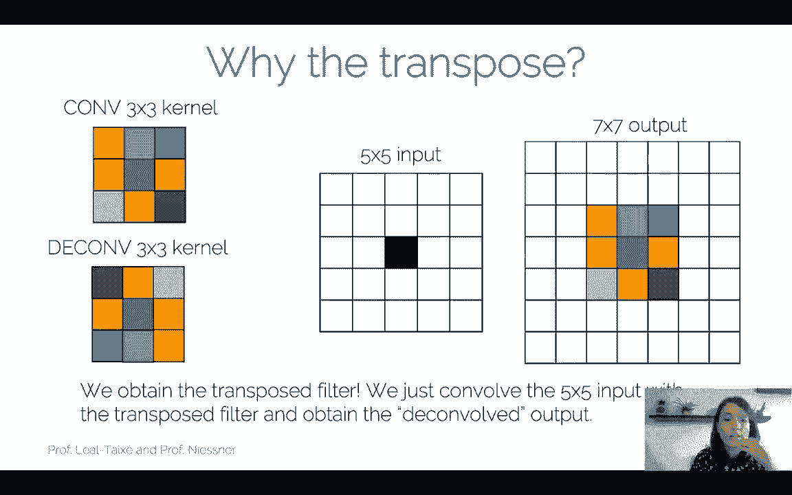

So again， the important thing here is that we're not actually learning these convolutions in the decomnet。

 but we're simply mirroring the operation that happened in the confnet。

So what we're going to then now is we're going to visualize。

 okay what happens when I do this operation， this convolutional operation first。

 then switching to a decomNe and going back to the image base。

So what I obtain are a representation like this， so here in the bottom I have my image patches that I had from the previous visualization and here I have the visualization of these features so in this case this filter corresponds to these nine image patches and these filter corresponds to these nine image patches。

And you see quite a nice correlation right so you see these edges for example。

 in this direction and the image patches in fact show edges in this direction。

 same for edges in this direction， patches or edges in this direction。And。😊。

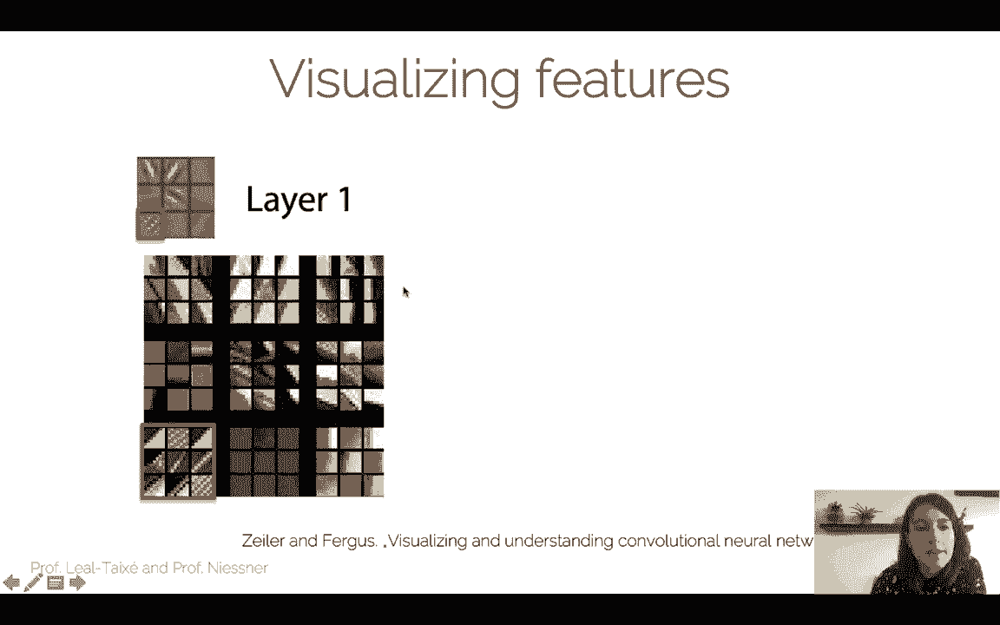

Again， as I go as I visualize all the features in layer one。

 I can see some interesting geometrical shapes here so I can see all these round shapes。

 all these vertical stripes， which is what I would expect or what by that point everyone found out that actually convolutional neural networks are doing。

 and that was that in the first layers， they were looking at geometrical features， these edges。

 these blos。

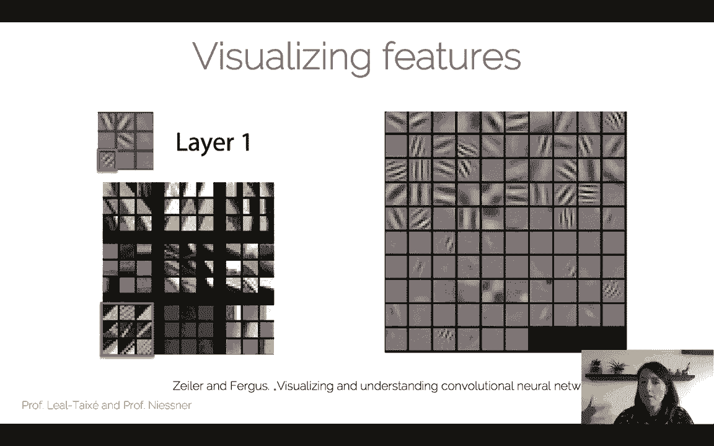

And as we go into deeper layers， for example， layer three。

 we start seeing all these patterns than we actually like we start seeing car wheels。

 we start seeing faces， more complex geometrical shapes， a lot of insects。

 a lot of cats and dogs also。And another interesting thing that we can do is we can actually visualize these features。

 we can visualize the evolution of these features as we train our network longer and longer。

And what we see especially here in layer  three is that at the beginning。

 there is not much to see right so these features， these layers are still being trained。

So these features are quite blurry and they become more and more， let's say specialized。

 more and more salient all of all of these visualizations and they really show how the network is learned so here for example it was focusing on the face of the dog then it became a bit more general probably to incorporate its other type of dogs so from this you can actually see whether your neural network is straining properly or not。

嗯。Now there so one thing that we didn't discuss was or or let's say the only operation that we didn't change on the decom was the REL。

 we said we're going to use the Relu in the same exact way， well there are ways of inverting the reL。

 there are several ways that have been proposed in the literature and for this we will point you to this paper that explains several ways of inverting this relu and what are the effects of these several ways of inverting the re。

The most important thing is that actually visualization helps preization helps training your neural network。

 so for example， on the AlexNe CNN they actually found through visualization that the first layer had an unhealthy mix of low and high frequency information。

 so essentially all the MI frequencies were ignored。

And so they propose this solution to change from 11 by 11 convolutions to 7 by7 convolutions Nowaday。

 neural networks contain mostly three by three convolutions， 5 by5 convolutions。

 it's really rare to find such large convolutional filters。

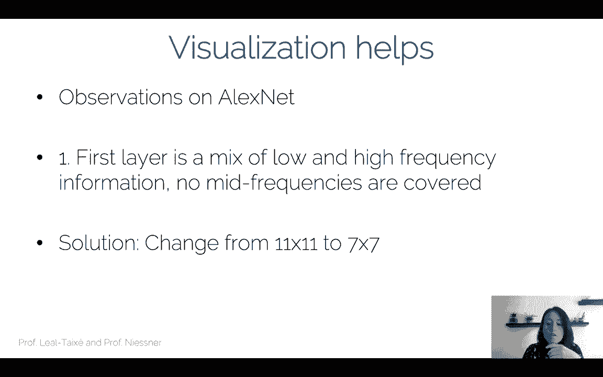

And actually， if you visualize your neural network when trained with 11 by 11 filters。

 you actually see that a lot of the filters are kind of inactive。

 so you can see here a lot of filters that contain no clear response to edges or blocks。

 therefore you can consider them to be kind of inactive。While if you switch to the seven by7 filters。

 you see that all of them are active， all of them show clearly the response to these edges in different directions to the blobs to different colors also。

 and the inactive filters are reduced quite a lot。So you can see through visualization。

 what is the best configuration for your neural network？

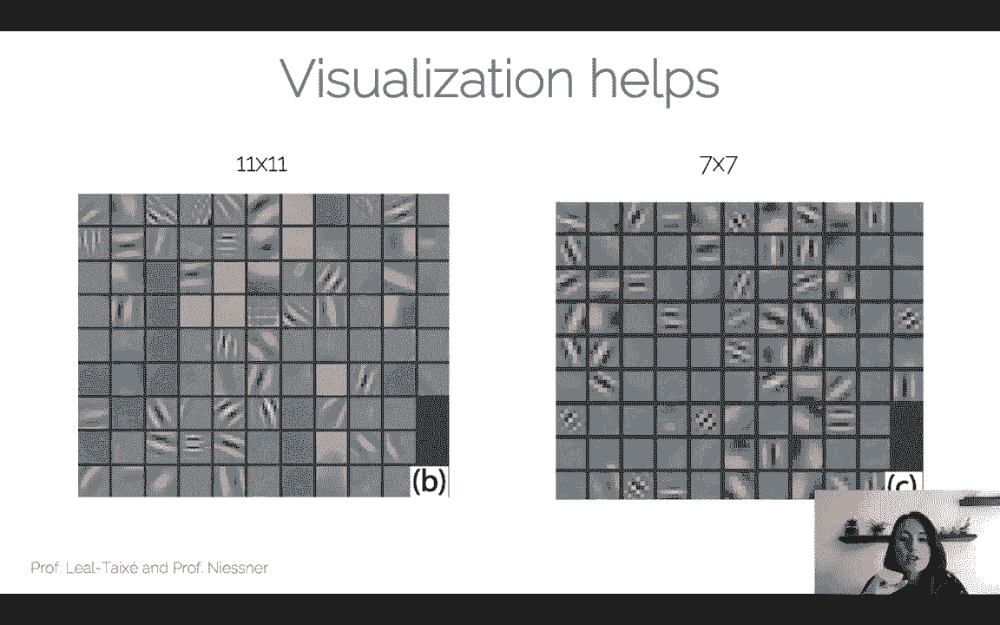

Now a second observation they did on AlexNe it was that on the second layer the observed some allliaing artifacts and this were essentially caused by the large strides so again AlexNe uses a st of4 in order to heavily reduce your feature map for computational reasons nowadays using a Str of4 is again really rare so we can see actually through visualization what happens when we switch from a Str of4 to a Str of 2。

So you can see on the left what happens if you're using a st of4 and you can see clearly the allliaising artifacts。

 so you can see here these kind of blocky responses which are clearly artificial you can see it in several filters while if you use the two by twom sorry the Str of two you have much more natural responses for the filters so you can see this on the right side。

Now the best part is that the filters are looking better when you actually make these changes from 11 by 11 filters to7 by7 filters and from Str of 7 to Str2。

 but also the classification score is improved by two percentage points。

So please actively use visualization to debug your CNS， this is a really strong。

 powerful tool that aside from making you understand or let's say。

 bringing you closer to understanding what happens inside convolutional neural networks。

 it's actually a really good tool to debug your CNNNs。

Now we have seen one way of visualizing the features and this is using the decomnet as we have explained now。

 to visualize the features at a certain layer， but there is actually a second way to visualize your features and this is through gradient ascent So what you want to do there is you want to generate the synthetic image that maximally activates a filter and you're going to do this with the opposite operation that we use for training our neural network which is gradient asscent we're now going to use gradient ascent。

So let's see how this works out actually so your goal is to find an image I that maximizes the score for a particular class。

 so you want to now generate an image so this is sort of a generative process you want your output is actually I。

And you want to generate this I that maximizes the score for a particular class。

And the score is actually taken before the softmax layer。

 so it's the direct output of the fully connected layer。

And this is represented by C S underscore C of I， so this is actually this score that you want to maximize and you also have an L2 norm to actually avoid having only very few large pixels。

 so some regularization is needed here in order to create an image that actually represents this score that you want to observe。

Another question is how do I generate this image right so the process goes you get first of all a trained CNN right so you have to have a pretrained CNN for whatever classification problem you want。

And you actually pass a zero image through this CNN。And this zero image is。

 you can actually observe it here。RightSo if in your CNN。

 the mean of the training image was subtracted to all images。

Now the zero image is kind of the mean for the CNN。

So all the images that have passed through the CNN have made zero。

 and so now what we do is we pass these zero image through the CNN and we obtain a score for class C。

 one class that we have randomly decided。Now the third step。

 what we want to do is want to maximize this score， right， so we want to change。

Not the weights of the CNN， but we want to change the image， but we can still use back propagation。

 we can still use all the optimization that we have learned at I2 theL。

 but instead of changing the weights with our gradients， we're going to change the initial image。

So we're going to go from。The score for C， which we actually want to maximize。

 since we want to maximize these， we're going to do gradient ascent。

We're going to do back propagation and we're going to make a small update on the image based on the gradient。

And now this is an iterative process， so we have to repeat this process of changing the image。

 making a small change on the image， passing it through the CNN， comparing the score。

Doing gradient ascent all the way by to the image and making another small change Now if we iterate。

And now we do is add the training image， we obtain these beautiful images here。

So on the left we can see an image if we have trained to maximize the score of bell pepper。

 and you can roughly see that we can see some of these bell pepper popping out same for lemon in the middle image or husky in the image on the far right。

Now you might say， well， these images look okay right。

 but I can still improve them right so they still don't bring out these lemons for example。

 in a really salient way。And there' is actually a way to improve visualization with a better regularization。

 so the L2 regularization is good， so it brings out some of the characteristics of these bell peppers。

 these lemons， but they can actually use a different type of regularization。

So what we can do is we can use a scusian blur the image。

 we can clip the pixels with small value to0。And at the same time。

 clip the gradients with small value to0。So essentially what we're doing is we're saying anything that is not really a strong response。

 we just clip it to zero and the same goes for the gradients。

So we actually do this what we're going to do is we're going to exaggerate these features。

 we're going to exaggerate these lemons and bell peppers and we're going to obtain essentially nicer images。

 So you can see here for the flamingos we have all these nice flamingos coming up now in the picture。

 same for the pelican， the ground beetle and the Indian Cobra So you see now that by clipping these small values。

We bring， so all of of these objects are now more salient and we can really see the characteristics of all these animals。

Now I welcome you to actually visit this site， so it's really it's really fun to play around with this visualization。

 you can visualize at different layers you can see what is the effect of。

Of these visualization on different layers and you can kind of play around to understand how a neural network actually sees the different images and the different classes。

Yeah。So okay， there's something。Kind of a fun work that was developed in 2015。

 which is called Deep dream， I'm sure you all heard about it。

And it is related to the visualization that technique that we saw right now。

So until now what we did was want to synthesize an image to actually maximize a specific feature or a specific clause。

So what we're going to do now in deep dream is we're going to do a slightly different operation。

 we're going to actually amplify the feature activations for some layer in the network。

So this is going to work like this， we're going to fit an image to the network。

 any image to the network。We're going to choose a layer and actually ask the network to enhance whatever was detected。

So if in that layer I actually detected some dogs because there was a dog in the image and actually the layer that is responsible for the dog detection was activated quite nicely。

 what I'm going to do is I'm going to ask my network to amplify these activations。

So if the network is seeing dogs。I want the network to see more dogs。

 and I want the image to reflect more dogs。So how this goes is I do this forward pass of the image up to a layer L。

Now what I do is I set the gradient of the layer。To have the same value as the activations。

 So intuitively， how this works is。If I have my dog filter， that has large activation。

 so it's really activated by this image。If I equal the gradient to the activation。

 I will also have large gradients。During back propagation。

 right so if I now use this gradients to make a change in the image。

The image will be changed to show more dogs。So what I do is I set the gradient of the layer to this activation。

 I have the large activation so I'm going to have a large gradient for this dog filter。

 I'm going to back propagate and I'm going to update the image， same as we did in the1 before。Now。

 if I iterate this process， what I'm going to do is I'm going to make small changes to the image。

According to a specific layer。Right so we already know that the low layers are responsible for detecting these basic features these geometrical features。

 so if I do the forward pass only until the first layers。

 when I change the image according to these layers。

 what I'm going to do is I'm going to enhance these geometrical features so for example this is this one example that we can observe here where all these geometrical features。

 these edges are enhanced in this image causing this effect that we observe here。

Now if I go towards the deep layers， so my forward passcode towards the deep layers。

We know that there we already start detecting parts of the objects。

 we already start detecting full objects in some cases。

 so if I now do this whole operation with the layers of a neural network。

 I'm going to start to see whole objects appearing in my images so we can see for example the image of the sky。

I do the forward pause。And for some reason all these objects start to appear when I do the deep dream optimization。

 so apparently these are the features that are maximally activated and therefore we start seeing all these objects appearing Now of course this depends heavily on how you train your neural network so this neural network was strain with quite some bias on animals so we see usually a lot of eyes。

 a lot of heads， bird heads appearing here and there if you have an image that is strain only to detect cars or person。

 then you will have a different response。And of course。

 then we can start doing art with deepbri and creating really pretty images。

You can see that there's quite a lot of bias in having all these eyes appearing。

So this is quite a quite a fun thing to do and of course you can do this for videos right so you can do this in this case it's just a video of someone strolling through a supermarket and you can see how these images are changed to have all kinds of。

Funny dog head appearearing。So this is actually quite a fun experiment。Okay。

 so moving on now to another visualization technique， TS&E。

 so this is a very popular visualization technique it's it's in most of the。

In most of the frameworks for training neural networks。

And essentially what TSNE gives you is the possibility to visualize， for example。

 the last fully connected layer， so of course if we look at AlexNe， for example。

 the Alexnet architecture only the last fully connected layer has dimension 4096 so visualizing 4096 vector is not so easy these 4096 dimensions right？

So what we have to do is we need a technique that actually brings this to a lower dimension that we can actually plot。

So the first thing that we need to do is we need to do forward possible the images and get their 4096 representations。

And one thing that we can do of course， is do nearest neighbor visualization right so you take these representations。

 you compute the L2 distances between all of these 4096 representations and then you observe what are the closest images to for example。

 a test image in feature space so you can see that this works pretty well for a train neural own network right so if I put the image of a flower I get a bunch of images of similar flowers。

 same happens for elephants dogs， ships， etc。So this is one way to actually visualize your feature space。

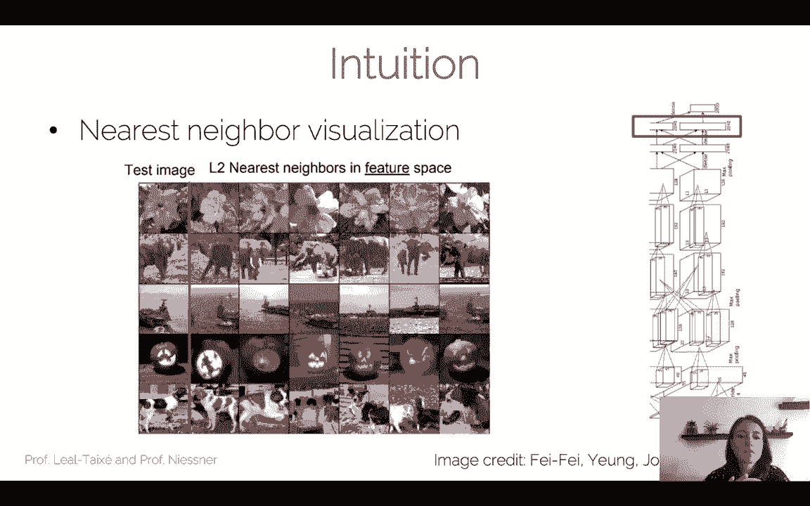

But what I would actually like to visualize is all of these clusters。

That are appearing right so if I put a flower and I get all kinds of flowers for the images that are closer to this image of the flower in feature space。

I can imagine that all of these clusters exist in that 4096 feature space and actually want to visualize these clusters right so what I want to do is I want to map this high dimensional embedding。

 this 4096 embedding to a 2D map。That actually preserves the paraay systems of the points。

RightSo the image of the elephant is really far away from the image of the flower in feature space。

I still want that when I actually project this 4096 I mentioned into my 2D map so that I can actually plot it and observe it。

 this elephant and this flower are still far away。And actually。

 this mapping is what we're doing with Teny。

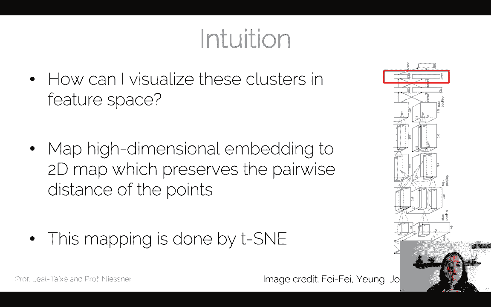

So this was actually proposed。Some time ago， and if we actually visualize the M data set。

 which is one of the easiest data set to visualize， so this is the date set of numbers。

 you have 10 numbers from  zero to nine。And when you actually train a neural network to detect these numbers and then perform TSE visualization on top。

 you can actually see all these clusters appearing。

So you can see all these clusters in the different colors that we have here。

And these are actually the different classes， so from zero to nine。

 and you can see they are relatively well separated。

 so what we did was we projected this high dimensional feature space into this2D and we can now see a clear clustering for the different classes。

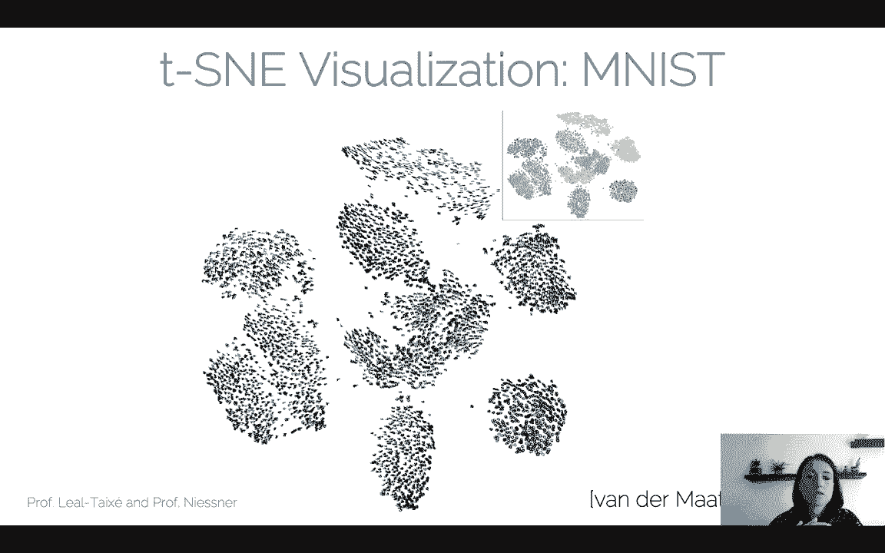

Of course things get more interesting if we actually visualize imageNe right so the visualization gets a bit more complex but we can see roughly that you know there are some images here with Sky that are clustered together images of animals。

 especially dogs are clustered together at the bottom right。

 there are some keyboards here on the top left， there are some food on the bottom left etc etc so visualization TS and you really have to see all the clusters that are formed when I actually train the neural network for a specific task。

And you can do other stuff， you can apply it on ShapeNe。

 which is this neural network that detects different shapes in 3D， so you can see the chairs。

 for example， here， the tables here， these are all nicely clustered in this feature space。

So TSN is actually worth using if you want to debug your neural network right so you have trained your neural network another question is is this neural network going to classify going to do its job correctly right so one thing that you can do is you can actually observe。

What these feature space and see whether the clusters actually make sense。

And this is especially good for actually visualizing the clusters created by a Sis network。😊。

So there's tons of more visualizations， I recommend this couple of papers that you can read to get deeper into different types of visualizations and these are always helpful to understand what is happening during training of your neural network。

 so is it network training properly， is it learning the concepts properly or not。

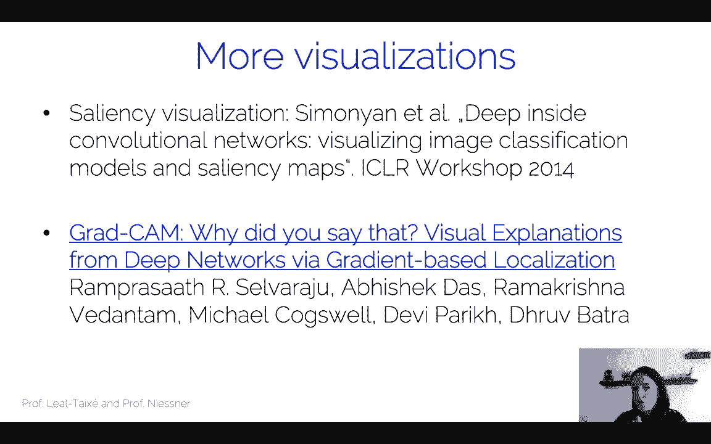

Okay so this was all for the lecture on visualization and interpretability。

 hopefully this will give you some tips on how to use these visualization techniques to actually debug your neural network and understand what your neural network is doing and how is it approaching the task that you're asking it to do thank you and see at the next lecture。

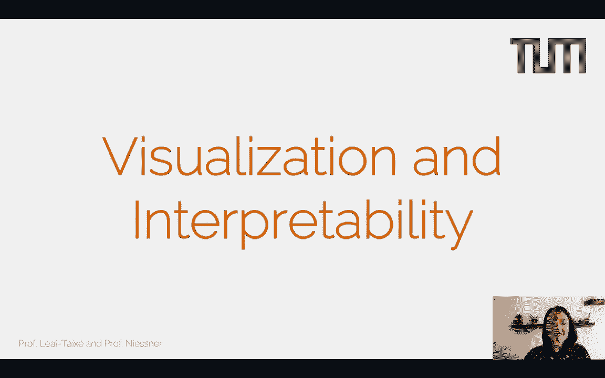