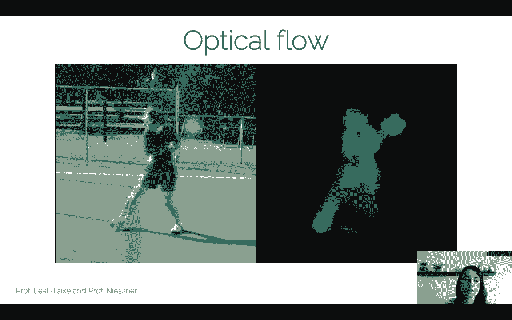
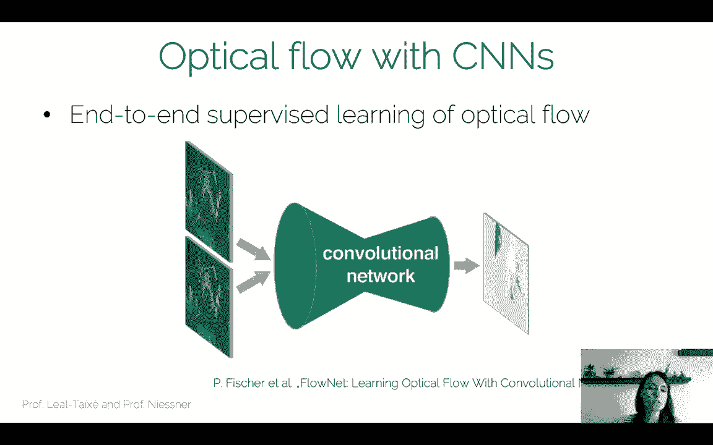
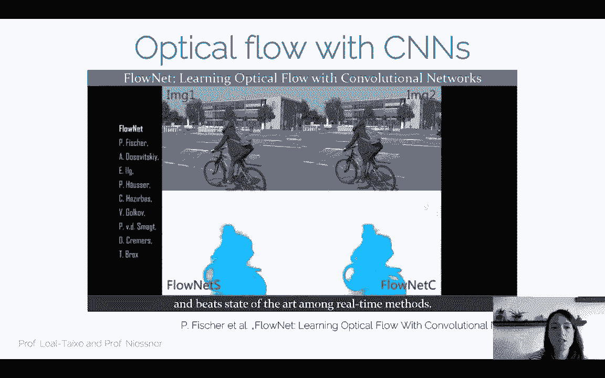
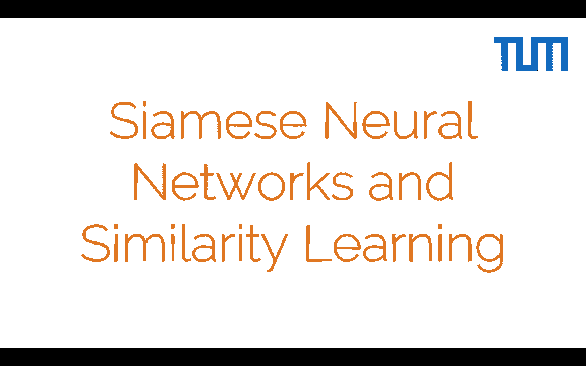

# 【双语字幕+资料下载】慕尼黑工大 ADL4CV ｜ 计算机视觉深度学习进阶课 (2020·全10讲) - P3：L3 - 孪生网络与相似度学习 - ShowMeAI - BV1Tf4y1L7wg

Welcome to the lecture on semi's neural networks and similarity learning。So so far。

 we have seen at I2DL， but also at the beginning of ADL4 CV。

Several problems that we have tackled with machine learning and in particular with deep neural networks。

So machine learning is actually really good for classification problems and we have seen the kind of the standard problem in computer vision which is image classification that is you have as an input an image for example this image showing a cat。

 you pass it through a neural network and this neural network gives you the label CA so in this case it classifies the whole image with a label of what kind of object is this image representing。

So this a classification problem right， there's a certain fixed number of classes for which we have train our neural network and at test time we have an input image and the neural network picks one of these classes as an output。

Now we can do this at a really large scale right so on IageNe we can actually tackle the classification problem on thousands of categories。

 so this is not really a restricted problem， but it can actually solve and classify and understand a bunch of images。

 a bunch of categories up to thousands。Now in this graph。

 we can see the actual performance of neural networks on the imageNe dataset。

Now the size of the blocks indicates a number of parameters。

 and we can see here at the bottom left corner， the AlexNe architecture。

 kind of the starting point for computer vision scientists to realize that deep learning was actually really powerful for the task of image classification and beyond。

And you can see that since AlexNet， there have been a lot of architectures that have been developed。

 GoogleNet， ResNet， a bunch of architectures that we saw also at I2DL。

 and these have been increasing steadily the accuracy on the INe classification challenge。

Now there's another type of problems that we can actually tackle with machine learning with dim neural networks and these are regression problems。

 so in this case we don't have a fixed number of outputs， for example， a fixed number of classes。

 but what we want is an output of our neural network is a continuous value。So for example。

 the task of post regression would be a regression problem， so in this case we would have as input。

 an image。And this would be processed by a neural network。

 you would return an embedding and from this embedding， you would actually predict the pose。

Of the camera from which this image was taken and the pose is actually parameterized by a position。

 the center of the camera and a quaernion which actually indicates the orientation of the camera Now these two values are continuous and therefore they can take any any value so there is no fixed predetermined number of values that our neural networks is actually choosing from like with a classification problem but we have an output which takes a continuous value。

Now we can divide， in our mind， the neural network in two parts。

 the feature extraction part in which we process the image， and we return this embedding。

 in this case， this 2048 dimensional embedding that represents the image and the lineargressor that actually projects this embedding into the output space that we're interested in。

Now the regression problem can also help us to tackle， for example， the tracking problem。

 so in this case what we want is to track this face that is kind of moving around so imagine that you're trying to track my face so you're trying to put this bounding box around my face。

And so。How the authors of this paper， this 2016 paper actually pose this problem is by comparison。

 so they actually have two frames， the current frame and the previous frame and what they want to do is they want to compare these two frames。

 hence these two frames are processed in parallel。And then these three fully connected layers what they do is essentially they solve。

 they map this comparison into the regression into the output that we're actually interested in。

 which is actually the predicted location of the target so in that case the input would be。

The search region， so I assume that my target is in the search region。Here on the bottom head。

 we would have actually the object that we're interested in。

 kind of the template that we're looking for， so the face in this case。

 we would compare these two and finally we would get a bound box that tells us what is the most likely location for this face that we actually wanted to track。

And you can see here already interesting things like for example， these two heads。

 so there is one processing pipeline here at the top that processes one image and the other that processes the previous frame。

 another image and these two actually run in parallel and we will see today a lot of examples like this because this is in fact a AamE network architecture。

Now there is a third type of problems and these are the problems that we will tackle in this lecture。

And these are the problems of comparison， so let's assume that we have these two images of myself and Professor Lisner。

 now a classification problem with actually analyze these two images。

So there is a third type of problems that we can actually tackle with deep learning and this is the problems of comparison。

So in this case we would have these two images， AMB， which depict myself and Professor Nisner。

 if we were to actually analyze these images from a classification pro perspective。

 we could actually say that both of them are person， both of them depict the face。

 A depicts a female， B depicts a male， etca， et ceter。

 all the characteristics that you can actually think of， that you can actually train for。

But the question that a classification problem cannot answer is actually the question of is this the same person right so I'm really looking into categories into all of these definitions person face female male and then comparing and then deciding whether this the person is the same person or not。

 but actually want my neural network to directly answer this question。

And so the idea is that we need to have a way to train our neural networks for similarity learning。

 to actually compare to images， to actually rank two images。

So let's assume the user case in which we have this application of unlocking your iPhone with your face。

 so nowadays most of the phones can be unlocked with either a fingerprint or a face。

So how can we actually do this with neural network so first of all。

 what I have to do is I have to collect a training set。

 so a bunch of images that actually depict my face。And ideally。

 this would be at different illumination conditions， wearing glasses without glasses。

 hair with different indi hair styles。So all the type of diversity that you can actually think of。

And then what I would do is I would actually train my neural network with all of these images and at test time there would come two persons in front of my iPhone。

 there would be me image A and Matias in image B。And at test time what my iPhone would then say is it would solve a classification problem right so it would compare the images that it has been trained for and at test time we would say。

 well， image A does belong or is similar to the images that I've seen before。

 therefore I classify it as yes， this is the same phase and image B I classifiedify as no。

 this is a different phase。So for this particular application。

 we could actually solve it as a classification problem。

Now let's assume that we want to do the exact same thing。

 but instead of recognizing only my face because this is my iPhone。

 therefore it has to recognize only the face of one person。

I actually want to train a face recognition system so that students when they're entering an exam room。

 I can directly know the ID of these students which without actually needing a manual ID check。

 you know so as soon as they enter， camera analyzes the face and immediately identify them。

Now what I could do is I could collect my training set。

In the same way that I did before right so I know which students are actually registered for the exam and so I asked them to send a bunch of images of themselves。

 so I collect the images for student one， I collect the images for student three。

 two and I collect the images for student three。So I collect images for all these students and now I train a classifier right so instead of having the output yes and no this binary output。

 I will have the output of person 1，23，45 and as many students as I have in the exam。

 as many students as I registered in the exam。Now， of course what is the problem with this approach and now I would actually ask you to pause this video and think about this yourself。

 come up with a series of problems and see if you were right by playing the video after a while。

So the main problem with this approach is actually scalability right so every time that a new student registers to the course or register to the exam。

 I actually need to retrain my neural network。So let's imagine that I've trained my neural network for 99 students and one minute before the exam if this was allowed。

 actually another student registers of course he or she has the right to enter the exam but what happens is that now I don't have time to retrain my neural network for 100 students instead of 99 so there's clearly a problem with scalability。

And at the same time， every semester， what I would need to do is I would need to ask the students for a bunch of pictures of themselves。

 retrain my neural network and do this for every course and every semester。

 so this method is clearly not scalable。So the question that I actually want to solve here is or the question that I want to answer is。

 can I actually train only one model and use it every year for the purpose of face recognition？

So it turns to actually Ken， and for this， instead of posing the problem as a classification problem。

 I'm going to pose the problem as a similarity learning problem。So again， I have my images A and B。

 and now what I want to do is I want to train neural network that when the images A and B depict a different person。

 in this case， me and Matias，The neural network would give me a low similarity score。

And when the two images are depicting the same person， I would get a high similarity score。

So notice that we're not training for classification， we're not training for yes and no。

But we're training the neural network to actually output a continuous value right low similarity score can be a range of scores。

 high similarity score again can be a range of scores。

 so this similarity score is going to take a continuous value。

So a test what I do is I would actually have my neural network train， I would get these two images。

 and I would say if the distance between two images is larger than a threshold。

 then it means that it's not the same person。If the distance between two images is lower than a threshold。

 then it means that it's the same person。And you can actually make the same argument。

 but instead of distance using the similarity。So another main question is how do you actually train a neural network to learn this similarity function？

And this is where Siamese neural networks come in handy。So the first thing that we need to do。

It's actually we need to process the two images in parallel and we need to process them in the exact same way。

This means that I'm going to take my image A， I'm going to pass it through a CNN and obtain my embedding。

 so this embedding actually represents the phase depicted in image A。

So let's assume that now what I can do is I can take any image and I could compress it in 128 values。

Now what I want to do is I actually want to process any image that I want to compare with A。

 I want to process it in the exact same way， so I want to obtain also for image B。

 this 128 factor representation， and I want to obtain it of course with the exact same CNN。

So now what I can do is I can start comparing these two representations since two embeddings。

 F of A and F of B， and see how similar they are。Now。

 the interesting thing here is that I have processed the two images A and B in parallel。

And therefore， this architecture is actually called a Siamese network because it has these two branches that actually process the information in parallel。

And the interesting thing is that they actually have the shared weights。

 so they are the exact same two neural networks with the exact same weights processing images A and B。

Now。Since we have used the same network to obtain an encoding of the image F of a and to obtain an encoding of the image F of B。

Now the only thing that we need to do is to actually compare these two encodings and remember that if A andB depict the same person。

 we wanted these encodings to be very similar and if A andB depict a different person。

 then we want these two encodes to be very dissimilar。

And so what we can actually do is we can train for that right so the first thing is that we define a distance function。

 D and B， which directly compares the embedding F of a with the embedding F of B and in this case we use for example the out norm。

No。A train time what I want to do is I want to train my neural networks。

 I want to learn the parameters of the neural network such that if A andB actually depict the same person。

 then be small。And if A and B depicts a different person， then D is large。And I can actually。

Nicely express this in my loss function。So let's take a look for example。

 at what happens for a positive pair， so I know that A andB depict the same person。

 so I want D to be small。So I can define a loss function that is exactly the alter norm between the embeddings f of A and F of b。

 so I know that if these two depict the same person。

 then I can minimize these loss and I will automatically be minimizing D。

Now what happens with a negative pair right so in this case I know that A andB depicts a different person。

 so I want D to be large。So in this case， I'm going to use not directly the L2 norm。

 but I'm going to use a hinge loss。And the idea here is that I want to separate F of A and F of B。

I want to keep separating them until we hit a margin M。And the idea is that。

It makes no sense to actually push F of A and F of B further and further and further apart if they are already as far as the margin M。

And this is why we're going to use the hinge loss。So if the two elements F of A and F of P are already really far away。

 I'm not going to spend any energy in pulling them even further away。

 so this loss is going to become zero when F of A and F of P are far apart enough。

So that I put both things together， I come up with a formulation of what is called the contrastive loss。

 so in this case I'm going to have my positive pair so I know that my level y is going to be one because I know that A andB represent the same person。

And when y is actually one， what I want is to minimize the distance between these two embeddings。

And therefore， I have the distance here depicted as the L2 norm of F of A and F of P。

When I have a negative pair， so when1 minus y is actually one。

I actually want to apply the hinge slots。So I want to bring the elements F of A and F of B further and further apart up to a margin M。

So if I put both things together， I come up with a contrastive loss to train my Siamese neural network。

So how do we actually train these semi neural networks？Well， first of all。

 the weights for each of the channels， for each of the branches have to actually be updated。

 right and you have the two branches that are in parallel actually processing the information。

And you get a loss for each of the branches， then what you can do is actually update the weights for each of the channels independently and then average them。

Now。With this contrastive loss， this this kind of the simplest loss for similarity learning， right。

 so we have actuallyual learned to bring positive pairs together。

And we have learned to bring negative pairs apart。But the question is。

 can we actually do better or let's say， what are the problems with the contrastive laws？

So this is how basically we came to the formulation of the tripleoli loss。So in this case。

 what the tripleE loss allows us in contrast with the contrastive laws is that we can actually learn a ranking。

 so it's not only about similarity being close together or being further apart。

 but now we actually want to learn how much closer am I compared to another image。So in this case。

 in order to do this， of course you can no longer train with pairs of images。

 but you actually have to train with triplets。So you have what is called an anchor image。

 then a positive image which actually depicts the same person and a negative image which depicts a different person。

And now what you actually want to do is you want to bring the embeddings or the anchor and the positive image closer together。

And in this case， it's not infinitely closer， but you actually want to bring it close so that the distance between anchor and positive is smaller than the distance between anchor and negative。

So essentially， if my anchor and positive images are more similar than the anchor and the negative images。

 then I'm going to be happy like this， so the loss is not going to be further improved。

So in order to actually express this condition in a loss function。

 we actually have to shift a couple of things around， so I take here the comparison。

 the L norm between f of a and f of n， and I bring it to the left side of the equation。

 leaving a zero on the right side。And actually， I'm going to now also use a margin here like I did for the negative pairs in the contrastive loss。

 just because of course， I don't want to be rigid about my decisions。

And so essentially now I can express the triplet loss。U a function that takes an anchor。

 a positive image， and a negative image。And actually is trying to optimize this function here。

 so this is going to be again a hinge loss type of function we're going to have this maximum zero。

 we're going to have the margin just like we had before。And so essentially。

 what I'm saying with this triple loss formulation is that I'm going to bring together the embeddings of AMP。

Until the distance between F of A and F ofP is smaller than the distance between F of A and F of V。

All the way up to a margin。So the idea is that I'm not making the distance between F of A and F of P infinitely smaller。

 I'm just making it small enough so that A andP are closer than A and N in the embedding space of my neural network。

So now of course the first question probably that you have is what if I choose APNN in the wrong way such that for example。

 A&P are obviously the same person and so these task is very easy What is going to happen is that my neural network is not really going to learn much because from the beginning A&P are going to have a smaller distance than A&N。

So what I can do actually to boost the performance of my neuro network train with a triple loss is to do what is called hard negative mining。

 which means training with the hard cases。So I'm going to train a neural network with randomly selected triplets for a few epos。

And then what I'm going to do。As I'm going to look at the cases where the distance between A&P is very。

 very similar to the distance between A and N， and I'm going to choose only these cases to further refine to further fine tune my neural network。

 so I'm going to describe all these cases and focus only on training on the hard cases。

And we're going to see a little bit more about choosing the triple platets in a few slides。

So essentially what the Trit loss is going to do。It's even the beginning。

 the distance between my anchor and the negative image was smaller than the distance between anchor and positive image。

After training， what is going to happen in the manifold of my neural network is that the positive image will come closer to the anchor。

And the negative image will become further away from the anchor。

So this is kind of visually the intuition of what happens with the triplet loss。And again。

 note that in contrast to the contrastive loss， actually the positive image and the anchor don't come infinitely together and the neural network is spending a lot of time in training so that the anchor and the positive image have a distance of zero in the end。

And at the same time， my negative image is not going further and further and further apart。

So the only condition that the triplet loss is actually fulfilling is that positive and anchor are closer than anchor and negative。

And this's actually enough to learn the ranking。So now a test time is very easy。

 right one can just do nearest neighbor search， so I have my query image， for example， in this case。

 this bird in a certain pose。And now I have a bunch of images。

 I actually compute the embeddings of all of these images。And I actually plot the top four images。

That have an embedding that is closest to the embedding of my query image right so F of a F of my query image。

And now I compute embeddings of all my test images， and I pick the top four。

 the four that are closest to my query image in this embedding distance。

And it turns out that a neural network trend with the triple loss can work relatively well。

 so you can see that for example， the owl is retrieved properly。

 the cup is mostly retrieved properly and of course there are， for example。

 in this case of the lamp there are cases in which you have different types of lamps that are also retrieved。

Now of course this regular loss is not perfect right so one of the challenges that we have briefly mentioned is that random sampling of3+ actually does not work。

So the number of pro triplets is actually huge， so imagine your training set is a thousand0 image。

 you can actually compute how many triplets you would have with this small training set。

So if you want to actually explore all possible triplets， you need to train this network for a very。

 very， very long time。And if you actually do random sampling of the triplelets。

 it could happen that the hard cases are not actually sampled and therefore you never see these hard cases where you have one positive and one negative image that are very。

 very similar both to the anchor and your neural network never gets to see this case and gets to betrained for this case。

So random sampling is strictly for the attribute loss。And even with high negative mining。

 you can actually get stuck in local minimum。So in order to actually further improve singularity learning。

 there are several approaches that have been presented。

So there are several ways of improving the way you train your neural networks for similarity learning。

 we have divided them into four categories that we want to briefly discuss。

 and then we provide a lot of references so that if you want you can go deep。

 you can read these different works that improve the way you train neural networks for similarity learning。

So one of the ways clearly is to improve the loss so we have already seen the contrastive loss versus the triplet loss and how actually the triple loss is superior because it leads not only to the similarity value yes and no close or far away。

 but it leads to a sort of ranking。And also training with a triple loss is much more efficient and actually leads to better results for similarity learning。

But there are three other ways in which you can actually improve the way you train neural own similarity learning one of them is sampling we have also briefly talked about that how if you actually choose all of the tree plates for your training set。

 this is computationally impossible。So sampling is a way to actually choose the best triple to train your neural network with。

And in this case， the main intuition is that you need to sample the space wisely。

 so you need to sample the diversity of the classes。

 and at the same time sample the hard cases so that you can keep improving。

 you can keep refining these decision boundaries that your neural network is being trained for。

Now the other is ensembles， so instead of making all decision with one neural network。

 you actually use several networks and each of them is strained with a subset of triplets。

 for example。And finally， we will see a list of words that actually use a classification loss for similarity learning。

We will not further discuss or present works that deal with the definition of different losses for similarity learning。

 but we do recommend that you read these two papers on angular loss and correcting the triple selection bias for triples。

 which are very interesting works that deal with actually the definition of the loss for similarity learning。

And we'll jump directly to sampling methods， so in this case we will present and overview the intuition of one sampling method called the chierarchical triplet loss。

And in this case， the idea is that you actually want to build a keraraical tree。

where the leaves of the tree represent the image classes， so you can see， for example。

 in this example， you have eight classes of different birds and at the level zero of the tree。

 you have one node for each of these eight classes。

And now the idea is that you recursively merge most similar classes until you reach one single root note。

And you can already see the intuition behind this hierarchical representation。

 so of course in this hierarchical representation， classes one and two are more similar are closer together in this feature space then classes1 and three and at the same time classes three and four are closer together than classes three and6。

So how you actually build this tree is by first of course defining a distance function right so you do have to define a distance between classes and the intuition is that if the distance is small。

 then two classes will be merged earlier in the tree so they will be merged for example。

 at the next level of the tree。So if classes three and four are close together。

 maybe at level one they already merge。If classes two and five are further apart。

 then maybe we need to wait until level three to actually see the merge of these two classes。

And the way you define the distance between two classes is by using the feature embedding。

 so this RI and RJ， so you get this al norm of the deep features of your neural network。

And then you basically normalize them by the current enality of classes P and Q。

 so NPs essentially how many samples do we have for class P？

So once you have defined your hierarchical tree based on these distances， right。

 we don't go into details onto when do you actually merge two nodes。

 but let's assume that we have a systematic way of merging notes and we have built this hierarchical tree。

Now what we want to do is want to find the anchors。

 we want to find these images that are going to be used to actually build our triplets。

And what you do is you start level zero， the level where we have all of the classes。

 and you randomly select L prime nodes。So you randomly select LPnk classes。

Now the idea behind this first step is that you actually want to preserve some kind of class diversity in the mini batch so you don't want to sample all of the anchors from class4。

 for example， so the first thing you do is to sample L prime classes。Now from this Alheim crisis。

 what you're going to do is still at level zero。You're going to select M minus1 nearest classes。

So for each of these nodes that you have selected， let's say you have selected Note four。

Based on the distance to the other classes at level zero， you select M minus1 nearest classes。Now。

 the idea behind this step is that。So you have to keep in mind our final goal。

 right to perform this similarity learning。And at the same time。

 you want to select these hard cases right so now you sample class four， which is one type of bird。

And you look at all the other birds and select the most similar one。

And the idea is that we actually want the model to learn these discri features， right。

 we want the model to separate class four from all the other birds which are very， very similar。

So we actually want to sample from these very similar classes right so step one is to sample diverse classes。

 step two is to sample similar visually similar classes to the classes sampled in the first step。

And finally what you do is you actually collect images right so up until now we have only sample classes and now what we want to do is actually sample images so we sample T images for each of the classes that we have collected and this sample is going to happen randomly so you're going to select T random images within from each of the classes。

So in the end， what you end up with is a mini batch which contains T times M times L prime images。

And other ideas well we have to construct the triplets right so what we do is actually we construct all triplets so in this mini batch we have these T times M times L prime images and we're going to construct all the triplets。

With this number of images。And the interesting thing about the loss formulation of the hierarchical triplet loss is that not only is a way to actually sample images in a clever way。

But actually， it also allows you to define a margin in this case， this alpha Z。

That depends on the distances computed on this hierarchical tree。

And the idea actually is that it makes no sense to have this fixed margin。

 so in the case before for the normal triplet loss we have M。

 which was a fixed margin for all triplets。But the idea is that since we have an idea of how similar two classes are。

 we can also use this idea to adapt the margin right so that the loss is going to adapt to the class distribution and it's going to adapt to the differences of the samples within these classes now it's not important what is the exact formulation of this alpha but if you're interested in it。

 I recommend that you read the paper on the hierarchical triplet loss。

So there's a bunch of other works， the one that I would definitely recommend you to read is the first one。

 this ICCV 2017 on sampling matters for metric deep metric learning。

Wwhich is kind of the original paper that actually propose a sampling methods to sample diverse and hard cases。

 but there's also a bunch of other work that try to improve further the training of neural networks for。

Pmetric learning by using more and more clever sampling methods。Okay， so after sampling。

 we turn into ensembles。So the idea behind ensembles is the idea of divide and conquer。

 which you might have seen in other lectures in computer science。

And so the idea is that we have many， many classes。

And we actually want to learn distance function between all classes at the same time。

And this is just too much for a neuro。So the idea is， okay。

 I'm learned to take it one step at a time， and I'm going to first of all。

 divide my space intoque clusters。And have one learner focus。On one cluster。

 so I'm going to have in this case， K learners， K， for example， neural networks。

And each of the neural networks is just going to focus on performing similarity learning inside。

The classes of the case cluster。So in the first step， in the divide step。

 you actually divide the space into these K clusters， divide the cluster into K clusters。

 and in the con step， you actually train the neural networks for each of the clusters。

So we can see this in more detail how the divide and conquer methodology actually works。

So first of all， we have our neural network， which already provides us with a representation for each of the images and each of the classes。

So it's already trained and what we're going to do is we're going to use these features to actually divide the embedding space into K classes。

 and we're simply going to do this with Kenyons。Now。

 the idea that now what I want to do is I want to build these can dependent learners。

But instead of having a completely different neural network trained for each of the K clusters。

 what I'm going to do is I'm going to have a backbone。

 I'm going to have a CNN that is going to be shared by the key independent learners and I'm going to have a series of fully connected layers which are going to be separate。

 so K different sets of fully connected layers。And these are going to constitute actually the decay learners。

 and these are going to be trained each for one cluster。Now， within a cluster。

 what were going to do is we're going to train our learner by sampling a mini batch， randomly。

 sampling， for example， triplets randomly。And then updating these fully connected layers。

And so once our network has converged， what we can do is we can。Put everything together。

 so use all the learners at the same time and fine tune our network with all the training set。

So first you divide the problem into small chunks， K clusters， you train your another for that。

 once you have reached a stable point， then you fine tune your network for a few epos。

With all the training set for the full problem。So this is the divide and conquer scenario。

And then you can go back to one and repeat several times and so on and so forth。Now for ensembles。

 you can also have， for example， separate networks that have different architectures or they all have the same architecture。

 so they are actually different ways of using ensembles and these are some of the words that we actually recommend you to read if you want to get a little bit deeper into ensemble work。

And finally。We actually want to present this kind of funny idea that we could actually use a classification loss for similarity learning right so this seems to contradict the beginning of the lecture where we said you know there's this classification problem and similarity learning。

 two different problems and we need a different way to train both。But as it turns out。

 latest works have actually shown that you can train your neural network for classification。

 so with a classification loss， for example， cross entropy。

And still obtain an embedding that is good for similarity learning and these are some of the works including our own at the end that actually show that you can use these classification losses。

And then still obtain embeddings that are significant enough that are good enough to actually perform similarity learning so these type of works you can see that these are very new right it started roughly in 2017 but then theres several works in 2019 and from this year that actually push for this concept of using classification laws for similarity learning so very interesting new research that is happening on this front。

Okay， so let's see some results， so these are three of the data sets that are commonly used for this problem。

 the CAP cars and ST for online products。If you want one of the best methods。

 the method that performs the best， you can check this HORDE method published in ICCV 2019。

 so very recent stuff。And one of the metrics that is most important for similarity learning。

iss the R1 metric or recall one and this actually means that in the test scenario that we saw before where I have my query image and I order all of my training images。

According to， for example the。The feature embeddings。I actually get the match。

 the best match so the actual correspondence that I want to find I find it already in the first image。

 so recall one means that the first image is the one that I was looking for so I immediately make the correct assignment。

 recall two is that the correct image is within the first two nearest neighbors recall8 it means that it's in the first eight nearest neighbors so this is why you see that the accuracy actually grows from recall one to recall8。

And here we see some methods that are comparinging loss plus sampling methods。

 we have also some teacher student method that we haven't talked about。

For example loss was ensemble and here I just want to show you that the exact same method which is called RLL when you're actually using one network。

 you get a recall  one of 57。4 when you use three networks so when you actually use this power of ensemble you actually boost the results all the way to 61。

3 for recall one so just by using instead of one network using three exact similar networks。

Train with different triplets， you actually can boost the performance。

 so you see that this divide and conquer idea is actually very powerful。So okay。

 so after all this software， you might be asking， well， okay。

 I'm interested in having a model for similarity learning， what kind of model can I use。

 what kind of method can I use to train my network for similarity learning， right？

So it turns out that in a paper that has been published recently this year called the metric Learning Real Check。

Turns out that when you train all of these different methods， all of these different losses。

 the different sampling methods， when you use the same backbone means the same CNN architecture。

 ReSNe， Alex，Net， VGG， whatever you want。When you use the same embedding space， the same dimensions。

 when you don't use extra tricks for boosting results。It turns out that for all of these methods。

 the difference in accuracy is not really large。So something that happens quite commonly in research is that sometimes results are not directly comparable。

 so for example， one method uses a different backbone。

 which means that the expressive power of your neural network is completely different compared to other methods。

 and therefore your methods cannot be really compared。

So it turns out that these studies that actually take all of these methods and compare them in a fair way are very useful and sometimes give us surprises like this where we actually find out that all of these methods perform very。

 very similarly。But some tricks that you can actually use， first of all。

 use the simple baseline so even contrastive loss， triplelet loss。

 and classification losses can perform really well when they're trained correctly。

Sampling is actually very important， so every method can be boosted if you actually have an intelligent sampling strategy。

And furthermore， you can use other tricks that you will find in the references that we have provided。

 temperature for soft masks， freezing batchome layer using multiple centers。

 so these are all kinds of tricks that can actually be used to boost further your neural network training for similarity learning。

And further tricks are that if you use naive ensemble。

 so simply copying your neural networks three times instead of one training with different triplets。

 you can actually significantly boost performance so this kind of an easy way even though it's expensive because now you have to train three neural networks instead of one。

 but you can boost your results in an easy way。And we actually would recommend two good out of the box choices。

 one is proxy NCA， the other one is soft triplet loss because they perform really well out of the box。

 they do not require massive hyperparameter search and the most important thing they do have code online so if you want to include any of these techniques for similarity learning。

 we recommend this to where you can just download the code quickly train your neural network and get this in results。

Now one thing to note that the contrastive loss and triple loss further give a similarity score in addition to the feature embedding。

 while for example， if you use a classification loss。

 then the only thing that you can do is you can focus on your feature embedding and you can simply do。

 for example and and search and order。The images that are， for example， closer to your query image。

 while the striplet loss would give you immediately also a similarity score。And of course。

 the stronger the backbone， for example， dense nets， the stronger are going to be your results。

Now let's see some of the applications of Siamese neural networks in Comp visionsion。

So the first thing that we can immediately see is that SiIS neural networks in particularly trained for similarity learning can be actually used for clustering。

 so in this case we see this image where we see clustering happening on the MIS dataset that is the dataset set of numbers from zero to9 and you can actually see that if you train a Siese network for similarity learning。

 you obtain this nice 10 clusters so you can see each of the numbers from zero to9 color coded so express with one color and you can see the nice cluster of colors so you can effectively say that Siamese neural networks can be used for clustering。

Now another thing that we can use them for and this is something that a lot of works are focusing on is using them for image correspondence。

 so the image correspondence problem has been one of the oldest problems in computer vision and in this case the idea is that you want to find interesting points in the image where we can actually find a direct correspondence in another image that is roughly similar so in this case you see all these correspondences which are marked by these red arrows where actually depict the exact same point in one image and the other。

And this is used for example， for panoramas teaching so when you do this panoramas with your phone effectively what the phone is doing is that it's extracting all these features from the consecutive images that they're taking。

 it's establishing correspondence between images and then it's computing。

 what kind of warp should I do， what kind of transformation should I do from one image to the other so that actually the two images fit together like we can see here in this picture。

And this， as I said， is quite a fundamental problem in computer vision and it's used in a bunch of computer vision applications such as image teaching or image alignment。

 as we have seen， also object recognition， instance recognition， 3D reconstruction， object tracking。

 image retrieval， you name it。So。😊，Many of these applications actually are now being targeted or let's say we're doing research on targeting these applications directly with neural networks and we will actually see some of these applications further along in this course。

So I just want to quickly go over the classic pipeline for establishing image correspondences so that you can see that it doesn't differ too much from what a neural network is actually internally doing。

So what we would do in a classic image correspondence pipeline is to actually extract manually designed feature descriptors。

 so you would define a bunch of descriptors that would be useful for creating correspondences you would then extract the features from the two images。

And these features can be， for example， the famous Sift descriptor， sift key points， serve。

 even Harry's corners， so most of these are based on image gradients。

 and they extract locally image properties that you can then find in the other image。

Of course they do have some problems， they suffer under extreme illumination changes。

 they suffer when the viewpoint is changed a lot。And it's further， very。

 very slow to extract all of these features for each pixel of your image。

So once you have this manually designed featured descriptors。

 when you have extracted them for both images， now what you have to do is you have to match these descriptors from the two images。

And many of these descriptors are very similar right so remember that we're just looking at very local gradient properties of a small page。

 so for example you would see this kind of edge， this kind of tilted edge here。

There can be many places in your image where this edge is actually happening。

So the first thing that we need to do is we need to filter out possible double matches and keep only the matches that are very。

 very reliable， so this is already a process that usually goes right but it can go wrong especially under these extreme illumination conditions。

And with this you can do really cool stuff， like for example。

 this ICCC 2009 paper calledBuilding Rome in a day in which you actually gathered a bunch of pictures of the city of Rome and you would get a 3D reconstruction of the city by just using these images and these image correspondence method。

So this is really powerful computer vision that we have right here。

Another question is can we actually do this with neuro networks right so let's start small。

 let's start by just establishing image correspondences between two patches so in this case we have this patch one patch two。

And what we want this one to use is ce's neural network right so process these two patches in a similar way。

 then have a series of fully connected layers that are going to tell you how similar are these two patches。

 right？So this is a classic architecture that we have been discussing in this lecture。

 and you can actually use it to train neural network to actually judge patch similarity。

And so this is of course， end to end learning for patch similarity， right。

 you go directly from patch to a similarity value。And it is really fast to actually allow dense extraction。

 so for each patch in the image you can obtain one similarity value。

 so for each pixel even in the image you can obtain a similarity value to the other pixel。

And you can actually train it so that it's invari to a wider array of transformation。

 illmination transformations， viewpoint transformations， etc cetera， et ceter。And of course。

 at the core of this method is a Siamese neural network。So in the classic semi architecture。

The idea is that there's a series of shared layers that simulate this feature extraction and these shared layers actually are the ones that contain。

 for example， the convolutions that're analyzing our images in parallel。And in the end。

 you would have one decision layer， one common decision layer， which is， for example。

 a series of fully connected layers that actually made the decision or predict this similarity value。

嗯。Now we switch the problem of image retrieval， so in image retrieval。

 the idea is that you take a picture of anywhere， let's say， a famous building。

And you want to know exactly where you are so we have a data set of all famous buildings and now what you want to do is you want to compare these famous buildings so you can already start seeing where similarity learning comes into play here right we want to bring all the pictures of the same famous building really really close together。

And at the same time we want to separate the images that show different famous buildings。

 so this is one work that actually uses the contrastive laws for that and creates this descriptor for the building that is exactly train so that a test them you can use simply nearest neighbor search to determine which famous building are you actually looking at when you take the picture。

Now we can also do other cool stuff with semi neural networks like for example unsupervised learning。

 so unsupervised learning is when you actually do not have labels。

 but you still want to train your neural network for a specific task。

And so here the idea is that we're going to use videos and we're going to track the objects in the video。

 and this tracking actually provides the necessary supervision to train our neural network。

So it is unsupervised because we have not manually labeled this object。

But since we have a method that allows us to track this object。

We can now obtain sort of an automatic label for these videos。

 and this automatic label is what we're going to use to actually train the neural network。

So the main idea is that if you have a video， for example， of this biker here。

 this is showing the biker in different poses and we have pretty robust methods to track these biker so we can actually obtain a bounding box around the biker。

And now you have these other videos that， for example， depict dogs， depict other types of bikers。

 etc cetera， et cea。And what we want to do is want to train a neural network that brings all of the images of the biker closer together because we know that is the same object。

And brings the image of the biker further apart from all the other images of the other videos， cats。

 dogs， whatever the other videos are depicting。And this is because I am sure that if I track one object through a video。

 all of the instances that I obtain in all the frames of the video。

Are going to be of this same object。And therefore I can use these pairs for similarity learning。

 I can use them as positive samples and I can use all the other pairs as negative samples。

 so this is exactly what this work is proposing for learning from videos in an unsupervised way using similarity learning and in this case a similarity neural network with a triplet loss。

Now， another very interesting application is that of optical flow。

So optical flow is also one of the classic problems in computer vision。

And the idea here is that you have two consecutive images， let's say， from a video。

And you want to determine what is the displacement of every pixel from one image to the other。

So in this case what you actually want to have as an output is the perceived 2D motion right it's not really the real motion of the object in 3D。

 but it's the projected motion in the camera space。

And how this actually looks like is something like this。

 so in this case we have this spiker that is moving to the left。

 therefore the optical flow would predict all these arrows that are pointing left。

 these blue arrows that are pointing left。While you have the two pedestrians that are moving right。

 so the optical flow would be all of these tiny arrows that are pointing to the right。

 so for each pixel you actually predict the displacement from one image to the next and usually of course this displacement is small because these are two consecutive images。

Now you can see here another representation of the optical flow in this case on the left you have these two superimposed images you see how for example the leg of the tennis player has moved quite a lot from one frame to the next and also the racket and here we have a color representation of the optical flow where the color。

 the hue from green to blue actually represents the direction of motion。

While the saturation of the color represents how large this motion is。

 so essentially the length of the vector of the optical flow。

And so one thing that you can do is you can actually train a neural network to directly predict optical flow。

So as I said， the input is to be two images， so immediately we're thinking about a Siamese architecture here。

And indeed， you can actually train neural networks to compute optical flow almost in real time。

 so these are really fast， they obtain quite good results。And they're actually trained。

Mostly with synthetic data， so I do recommend you to read this paper flownet quite a milestone for optical flow prediction with neural networks。

And so the architecture， there's two types of architecture that are proposed in this work。

 the first one is not a Siese architecture， but actually propose that you take both RGB images and you stack them and this is now going to be your input。

So your input instead of being an RGB image with three channels， it's two RGB images。

 therefore are six channels， the rest of the computation with the convolutional neural networks stays the same。

And the second architecture is more similar to the architectures that we have been discussing in this lecture。

 which are actually Siamese architecture where you process the two images in parallel with these Siamese branches with share weights and in this case there's a fair amount of parallel computation and then at some point the two feature maps are fused together and then a few convolutional layers are used on these  fused representation。

And now I want to draw attention to one， or let's say two key design choices。

 but especially one of them， which is actually the operation that they use to combine the information from both images。

 and this is actually an operation that is very interesting and very much used in neural networks。

So what they propose to use is actually what is called the correlation layer。

And this correlation layer is very， very simple， it contains no parameters to be learned。

 so it's kind of a fixed operation， doesn't add parameters to your neural network because it's a fixed operation。

And simply what it does is it takes two feature maps， F1 and F2。

 and what it does is it multiplies a feature vector with another feature vector。

And if you multiply all of the feature vectors of F1 with all of the feature vectors of F2。

What you have in the end is a matrix。Which actually contains all the matching scores of the features of F1 with the features of F2。

So just to be more precise。What I have here is a flattened version of F1。

Where each FiI is a representation for each of the pixels of my image。When I say each of the pixels。

 of course， this representation comes from applying a series of convolutions to the image。

 so it's not going to be exactly one representation for each pixel but actually the reduced version after all the convolutions and poems so now my image is represented by this feature。

A representationation of height H and with W and for each of these positions。

 which of course represent a patch in the original image。

 I actually have a feature F that represents this position。

And now what I want to do is I want to multiply each location F of F1 with each location of F2。

 and this is exactly what is happening here with this operation。

 this is simply the multiplication elementwise multiplication and then summing up to obtain the score SIJ。

And this score actually represents how similar these two locations。

 I and J of feature  one and feature two are。So this correlation layer is actually very powerful when we want to compare two images。

 when we want to compare the embeddings of locations in one image and locations in another image。

And again， the important thing is that this is a fixed operation right I just did this multiplication。

 dis sumation， there are no learnable weights here。

 so I'm going to be able to back propagate through this operation but I'm not going to update any weights here。

 so very cheap operation to include in your neural networks。

And the matching score will represent actually how correlated two feature vectors are。

 and this is a very powerful representation。So this was first presented to actually find image correspondences。

 right the problem that we were talking about where we want to find correspondences between these two images。

 in this case we want to find semantic correspondences right like front wheel with the front wheel of the other motorbi。

 you can actually train a same' neural network with a correlation layer to actually output these correspondences。

And。With these corresponds， now what you can do is find the transformation from image A to image B so that you can see whether this transformation actually makes sense。

And this actually gives you really nice semantic correspondences between， in this case， the bird。

 the wine， the car， so you can actually train it for a variety of objects。Okay。

 thank you very much for attending the lecture on Siamese neural networkss and similarity learning。

 stay tuned for the next lectures。

