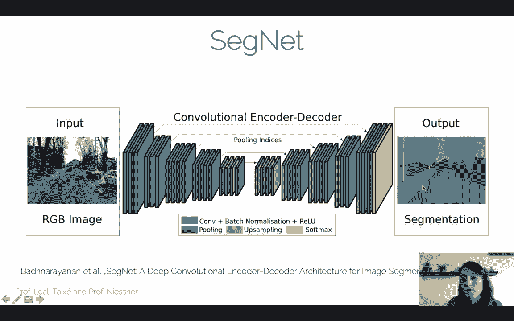
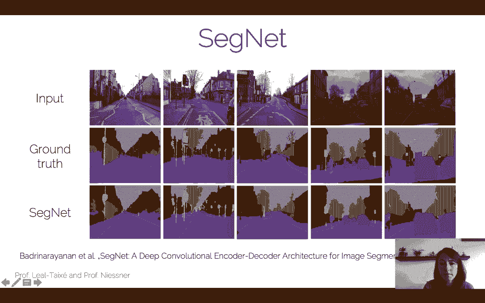
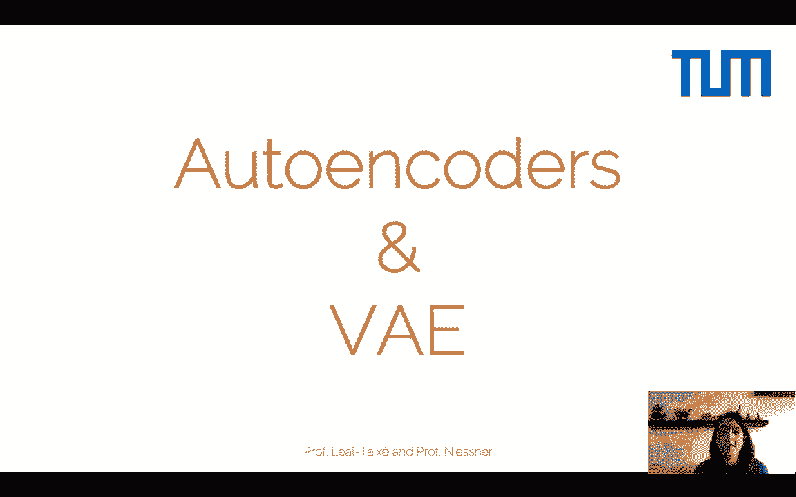

# P4：L4 - 自编码器, VAE和视觉风格迁移 - ShowMeAI - BV1Tf4y1L7wg

Welcome to a new lecture of advancedanced deep Learn for Comp vision Today we're going to cover the basics of auto to encoders and variational auto to encoders and also briefly discuss style transfer。

So we start by looking at the two paradigms in machine learning， one is supervised learning。

 the one that you are most familiar with， the one that we have covered at I2DL and also here at ADL4 CV and there is the one where you actually have the labels or the target classes for your particular task and your goal is to learn a mapping from the input for example。

 images to the labels， whether those are detection or classification labels for semantic classes。

 whether the labels are continuous values for a regression problem。

 these are all problems or tasks that fall inside the supervised learning paradigm。

So in the case of image classification， we saw at I2DL that we had these images of cats and dogs and our goal was actually to put a label on top of them。

 so image classification task。But for unsupervised learning， the task changes lightly。

 so now we don't have access to the labels to the target classes， right。

 we just have access to the input to the images and of course now we cannot go ahead and tackle the task of image classification because we have just the images but not the labels and so we are not able to find this mapping between images and labels。

So all that we can do in un supervised learning is actually to find out properties of the structure of the data。

 for example， perform clustering， and you might have had other courses in which you discuss clustering methods such as K means or principal component analysis。

 these are all ways to find structure in the data。So once this clustering is done。

 then we might find ourselves with two cluster， two separate clusters of images。

 but now these images don't have a semantic meaning it's not cat versus dog， but it just for example。

 purple circles versus orange crosses so the only thing that we have lost here is actually the semantic meaning that the labels actually give us。

So in deep learning we can actually perform unsupervised learning with auto to encoders and this is the start of the lecture today。

 so our motivation for using auto to encoders。So actually what we want from our auto to encoder is to give us a proper way of learning a lower dimensional feature representation from all the training data for which we have access only to the images。

 but we don't have access to the labels。So this is our approach towards performing and supervised learning。

And in order to do that， how you use actually an now to encoder is you take an input image。

And then you pass it through what is called your encoder。

 which is a series of convolutional layers and pooling operations， so your basic CNN architecture。

Until you reach our representation feature embedding， which is called the bottleneck layer。

Now the interesting thing is how do we actually get to this bottleneck layer。

 so the encoder is only the first part of our neural network and the other part is actually kind of the opposite operation。

 so a decoder that actually goes from the bottleneck layer all the way up to the output image which has the exact same resolution as the input image。

So you can imagine this operation as being just a reconstruction operation。

 so we get an image and the input， we compress it all the way to the bottleneck layer。

 and then we try to reconstruct the exact same image at the output with our decoder。Now。

 of course what we can see here is that we don't need any labels to perform this because the reconstruction loss is just an L1 loss or an L2 loss on the input image。

 so we don't need any extra label here。So from the input images that we can see here at the top right of this slide。

We can see that when we actually perform this outto encoder operation so we bring the input image X all the way to a bottleneck layer。

 so of course the bottleneck layer has a latent space Z with a dimension that is of course lower than the dimension of the image right。

 otherwise it would not be a dimensionality reduction and so of course when you reconstruct the image from the bottleneck layer with a decoder。

 it's only fair that you actually get these blurry images that you can see here in the set of reconstructed images。

Now again， the important thing here is that this is completely unsupervised training right you require no labels because the only thing that you want to do is to reconstruct your input。

 therefore you can use an L1 loss and L2 loss as your reconstruction loss and there is no need to have any more labels than that。

So what this allows you to do is actually to cluster your data。

 to find these patterns in the data that we were discussing before。

 so let's imagine that we use the out to encoders for self-reconstruct of the MNS dataset set so this is the data set with the digits from zero to9 and the only thing that I'm trying to do here is that if I get a four in the input。

 I want my out to encoder to reconstruct the exact same four。

And so what happens when you actually train your auto to encoder with in this unsupervised way with the L to loss。

 for example， when you get us output if you actually plot this bottleneck layer are these nice clusters of all the numbers so the numbers are represented by different colors as we can see in the legend。

And we can see actually， that the numbers are fairly well clustered。

 so you can see the zero is fairly well clustered here。In the bottom left corner of the graph very。

 very separated for example， from the nine， which is close to the three etcter， etc ce。

 so of course there are some outliers here and there。

 but in general even for an unsupervised training which means no labels whatsoever。

 we get actually a pretty decent cluster。So one can use is actually for what is called pre training。

 so this is very， very useful， for example， for medical applications。So in medical applications。

 let's assume that we're not going to use natural images， but we use， for example， CT images。

And what happens usually in medical applications is that you have a huge set of unlabeled data that means a bunch of CT images from different patients。

But only a small set of these data is actually labeled and this is because it's very。

 very expensive to have actually a trained doctor that is labeling data for you， for example。

 for diseases or to actually localize some part of an organ in the CT image。

 so the labels in medical data are actually really expensive。Another question is。

 can I actually use our to encoders to use this large set of unlabeled data so to do unsupervised training？

And one might say， well look， I mean why can we not do as we do for any computer vision application which is actually take a network that is pre traineded on IageNe and this is kind of the motivation for using the unlabeled data on CT images so the thing is that the statistics of natural images which are the images present on the imageagenet data are very。

 very different from the statistics of CT images so if we take a network that is pre traineded on imageNe and we actually want to use it for medical applications to analyze CT images。

The pre training is not going to help us too much。So the question here is。

 can we actually use auto to encoders to do pre training specifically for CT images？

And so essentially， what we can do。As we can actually pretrain our network using an auto to encoder that just learns the type of features that we see in CT images right so what we want to do is we want to use the large set of unlabeled data to do a pre-training which would be similar to the imageNe pretraining that we use for many computer vision applications。

 but in this case do it to learn specific features which are present in CT images。

And so what we're going to do is we're going to use the power of how to encode to do unsupervised training。

 so we're going to get our CT images input and we're going to use an out to encoder to learn a reconstruction of the input image so again this is completely unsupervised We don't need any labels for this。

And once this is done， then we go towards step two， we use the supervised training。

 we use the label data， just maybe a few training samples because we don't have a lot of label data but now it's going to happen is that my network already knows the features of CT images it had already learn what kind of features。

 what kind of edge detectors it has to actually learn for CT images。

 and so now it can actually use those features for the supervised training for the task that you actually want to train it for。

And for step two， of course， now you want unless you want to do you want to have a pixel white output。

 what you're going to do is you're going to throw away the decoder， for example。

 you want to do classification you know disease versus not disease as seen from the city image。

 so the only thing that you need to do is throw away the decoder。

And then create whatever architecture you need to get the label that you want as output。

RightSo you're going to go from your input image X to your bottleneck layer to your dimensionality。

 reduction representation z。And then from Z， you can get to your label Y。

And using the ground truth labels that you have for very， very few training samples。

 maybe you can actually do the classic supervised training with whatever loss function you need。

Now the interesting thing here is that the encoder doesn't need to learn from these very。

 very few labels， all the feature extraction， all the statistics of CT images again。

 this has already been learned in step one of the unsupervised training。And of course， like this。

 you do back propagation as always， so the classic supervised training that you have been doing so far。

So it courses， first of all， are very useful for pretraining so these you can do for any type of image that you have or any type of signal that you have actually and it's very very cheap because you don't need any labels it's just input image an output image I want the exact same image in the output as in the input so you can do L2 loss L1 loss。

And this actually is very useful to teach the encoder what kind of features can be found in that image modality。

So this is the first use that we have for our two encoders。But there is another use。

 and there is the one where we actually don't throw away the decoder。

 but we keep it to actually get pixelix wise predictions as output。So for example。

 I want to go from image to a semantic segmentation that is for every pixel I want to have the semantic label that that pixel represents。

 you know whether it's a car， whether it's a road or a tree。

 or I want to go from a lower resolution image so a high resolution image。

 or I want to go from an image to a depth map。So so far we have been talking a lot about getting labels as output which are of a much lower dimension than your input image。

 so you have your input image and now I want to output for example。

 a classification score for 1000 classes you go from a really high dimensional image to 1000 classes of output。

But here without two encoder， what we're going to do is we're going to have a representation in the input which has some dimensionality。

 and I want to get exactly the same dimensions as output。

So let's take a look at how can we use out encoders for pixel wise predictions？

Now we saw at I2DL the fully convolutional network FCN that perform semantic segmentation semantic segmentation is the task of assigning to each pixel on the input image。

 a semantic glass， for example， in this case we would have the semantic glasses of dog。

 cat and sofa and we actually want to find exactly which pixels are depicting the cat。

 which pixels are depicting the dog and which pixels are depicting the sofa。Now， in 2015。

 how researchers proposed to do that was to get a basic network CNN for image classification。

And at the end of the CNN， once your spatial resolution has been reduced quite a lot。

 so you see here that with the convolutions and poolings， our spatial resolution is reduced。

What we would then do here is just upscale this representation So of course this was not perfect。

 This led to smooth boundaries， but it was already a first good approximation。

And the question here is， can we actually do better。

 can we do this upsembling this upscaling in a better way to get more precise predictions？

So actually how we can do this is by using an out encoder type of architecture。

 we would have the classic encoder that reduces the spatial size and increases the depth。

And then we would have a decoder that does exactly the opposite operation。

 but instead of jumping from the bottleneck representation with a really tiny special resolution all the way to the output image resolution what you would do is you would do this step by step just upscaling the resolution in different steps So you see here a depiction of these architecture you have your convolutions and pulling operations that reduces the image size until you reads the bottleneck representation and after this what you would essentially have is a series of up sampling layers。

Plus， a series of convolutions after it。 So what you would do is upsemble your representation。

 then correct it with a series of convolutions， ups sampleble， correct， upsemble。

 correct until you would reach the end where you would have simply a soft match for each pixel that would give you the output semantic segmentation。

So this was the convolutional encoder decoder architecture that was proposed in Sgnet in 2016。Now。

 as I said， Senet is composed of two parts， the encodeder which has this normal convolutional filters plus pooling that reduce the spatial size and the decoder。

 and the decoder is exactly the opposite， it's the upseling plus convolutional filters。

Now it's important to note that the decoder part has not only the upsembling。

 but also these convolutional filters after it。And essentially the intuition here is that we're going to do a rough upsembling of our feature map。

 and then we're going to have a chance to correct it through a series of convolutional layers。

And these convolutional layers are trained like the convolutional layers of the encoder using back propagation。

 so these are regular convolutional filters。And again。

 the goal of these convolutional filters is to train them so that they actually refined the up samplingling that we did。

Now recall the notion of transpo convolution that we also saw and this was exactly this idea right so you wanted to go from an input of three by3。

 which is depicted here by the blue samples at the bottom all the way to an output of 5 by5。

And how you would actually do it is you would first perform unpoling of the input。

 so you see how you're actually spreading the samples of these three by three input that you have here。

And then what you would do is you would take this convolutional filter and you would slide it on top of this spread it out unpolled input in order to produce the Phi by5hi output Now all of this operation unpooling plus convolutional filter that is also learned with back propagation is called the transpose convolution。

Now this can also be called up convolution， but remember never to call it decoconvolution and we saw already in this series of lectures what is actually a decoconvolution？

Some of question is， can we do better our up sampling than just you know unpooling and just spreading around your samples？

Well， it turns out that with unpoolling what you do is exactly this operation here。

 you spread your green samples all across a broader feature map。But you leave all the other values。

 all the other white squares actually empty， you basically put a zero there if you're doing unpoing。

Now， there are other ways of actually dealing with these empty spaces。

 and the question essentially boils down to what kind of value am I going to put on these empty spaces？

And one solution is actually interpolation。There are several ways of interpoolating an image。

 for example， if you want to interpolate this tiny image 10 times you can use nearest neighbor interpolation。

 which is essentially for each pixel that is empty， you look at the nearest neighbor。

 the nearest neighbor in space， and you simply copy its value。Now， of course。

 this creates these kind of blocks from just taking the values from the nearest neighbors。

You can do a little bit better if you do biline interpolation。

 which actually means not only taking the value of the nearest neighbors。

 but looking at all the neighbors around you and then Dunne awaited some of their values。

Or you can even go ahead and do by cubic interpolation。In any case， for any of these interpolations。

 you're going to have a better estimate of what kind of output do you want to have at this resolution？

Compared to just doing and polling where all the values in the middle are actually zero。

So this of course， has more of a soft output than just when I'm pulling。

 so you're going to tend to have fewer artifacts in your output。Now。

 the other way of doing this is actually what we saw doing fixed o pullinging。

 plus putting a series of convolutions on tops。And at first one thought that interpolation was a better way to go。

 but in 2017 they showed that if you have enough data。

 actually all you need to do is do transpose convolution。

 fix and pulling plus a series of convolutional layers on top。

It's also very efficient because you don't have to compute any interpolated values for the white squares。

And there is a third wave， which is actually unpooling aD con。

So if you remember what the decomNe did to actually perform the anpoing。

Remember that it kept the locations where the maximum came from。FromFrom the pooling operation。

 so once we do the max pool operation， we have these four maximums which are going to be passed to the next level to the pool map。

And these four locations are the ones that are going to be saved here in these max location switches and are going to be used later for the unpooling operation to actually know where to place your values。

And the rest of the map is kept at zero。So this is also something that you can do， right。

 you can actually do the pooling operations， save the locations and do the unpooling。

By keeping the locations where the maximum came from。

Now remember that in the decocomnet we were convolving with the transpose of the learned filter。

 so the full decocomnet architecture is completely different with what we're proposing here in which we're actually learning the convolutional filter。

 so it's very important to differentiate between the full decomnet architecture and just doing the decocom type of vanpoing。

So as we said already in the decomNe， this type of unpoing was helping to keep the details of the structures。

 to keep actually the edges in the right position in the original position。

 so this is going to be exactly the same as what's going to happen when we use it inside out to encoders to perform the unpoing。

Now there is another element in auto to encoders that is very， very crucial to get good results。

 good pixel wise predictions， and these are S connections。

So S connections are part of what is called the unit Architecture。

 which was proposed in 2015 for medical applications。

And what this architecture is is essentially an encoder decoder architecture。

 so you see it here depicted in a slightly different way where you have all the encoder on the left side。

 you reach the bottleneck layer。And then you have the decoder on the right side。

 so hence the name unit。And now this encoder again is a series of convolution plus pullinging operations。

 the decoder is up convolution， transpose convolution operations。

But there is an element that is interesting。 and these are these gray arrows here in the middle。

 These are essentially representing skip connections。So the idea here is that。

You want to have all kinds of high level information that is being decoded in the decoder。

 and this comes essentially from the bottleneck layer。

So what is happening effectively in the encoder is you're getting your special resolution down to a really。

 really small presentation。But you're actually compressing all the information。

 you're really understanding the whole image and putting all this information in the depth channels。

So there is really a lot of high level information compressing the bottleneck layer。

When you go up and up through the decoder， what you're doing is you're trying to create more and more detail。

And even though the high levelve information that is coming from the bottomneck layer is really important。

 you also need lowle information， you need to know where the edges are located because you need to know where to put。

 for example， the end of your mask in the case of a semantic segmentation output。

 you need to know exactly where the cat ends and where the dog begins and for this you need lowle information。

And if high level information is encode in the bottleneck。

 low level information tends to be lost as we do convolutions and pollings。

 right that is the whole idea of doing convolutions and pollings。

And so what the S connection does is essentially it combines the high level information that is coming from the bottleneck layer with the low level information that is coming from the initial layers that still maintain a high spatial resolution。

And essentially what we do is we combine them， we concatenate both feature maps。

 the low level information feature map and the high level information feature map。

 and we do a series of convolutions to process both informations together。

So recall the idea of ReNe right this has a similar intuition right you want to have some of these residual connections that allow you to send information directly and not have to go through all the network。

And you can do several things there are several ways of combining this low level information in that style of information in this case。

 what we do is basically concatenation， what here they call copy and crop。

And what they call it crop is actually because the two dimensions at the encoder and the decoder do not match each other。

 and so they have to do a little bit of cropping there。

 so usually what you would have is exactly the same spatial dimension in the encoder and the same spatial dimension in the same level of the decoder。

So we can look at a zoomed in version where we can see here the bottleneck layer。And actually。

 one of these skip connections， how we actually combine this low level information with the high level information that has gone all the way down through the bottleneck layer。

 so what here what happens here is simply we're concatednating these two feature maps。

 which means that the spatial dimension remains and the depth is the only thing that is larger。Now。

 since we're going to apply a convolution on top of these concateninated feature maps。

 we can use this first convolution to reduce again the representation from 512 in this case。

 which is double the size， the two feature maps together all the way to 256。

 which is the depth that we want to have in this case for this architecture。

So you have here 256 channels， 256 channels put together。

 and then a convolution reduces it again to 256。So S connections are used actually in many architectures。

 for example， for depth prediction， having skip connections is extremely important to get the details to really get these edges where the object ends and therefore the depth changes with respect to the background and you can put these skip connections in several layers so here for example three types of skip connections in three different levels are depicted。

And the three different levels are different types of low level information。

 so of course the lower you go， so CC1 for example。

 is going to have more low level really going to look at edges type of information than if you go for example to CC3。

So S connections are pretty much everywhere when you use this encoder decoder type of architecture。

 if you want to get an output that is really pixelwise precise， you need these S connections。

But at what level these keep connections are needed， it actually depends on your problem。

 so this is a bit of a trial and error。So let's look at how auto encoders can be used in practice for computer vision applications。

 So the first autoto encoder architecture that we have seen segmentnet is actually for semantic segmentation So as I said the task of semantic segmentation is that for every input image pixel we get we get a label that actually tells us whether this pixel is representing the road car trees building etc So it gives semantic meaning to the pixels in the image And of course you can imagine that this auto encoder architecture is perfect to first of all。

 capture the highlel scene description in the bottleneck layer right we need to know roughly if this is an outdoor scene and therefore I'm going to look at road at cars。

 a trees or if it's an indoor scene and I'm going to see table sofa etc。

And then we're going to have these skip connections with here they call pulling inices to actually give us detail。

 to give us these really precise boundaries that we see， for example， in the case of the road。

Now Se gives actually pretty good results， so you can see here on the first row the input image。

 the second row is the ground truth and the third row is the segment output。

So of course there are details that are lost even with the skip connections， like for example。

 traffic signs here and here。Are not well defined as they are in the ground truth。

 but overall the classes are quite correct and the details are quite nicely preserved。

So another interesting task is the task of monocular depth prediction。

 so traditionally in computer vision， in order to estimate the depth of a point。

 you actually need two cameras because you need to actually see that point from two different viewpoints to triangulate the depth。

Otherwise， if you just have one camera， you cannot really know the depth。

 the real depth of the objects， this is also why we have two eyes so that we have the perception of death by triangulating from two eyes。

But of course， one can do monocular depth estimation if one knows roughly the depth of the scenes in general。

 so one has some prior of the typical depth of scenes。

 and this therefore is perfect to actually use it or to actually tackle it with deep convolutional neural networks。

So the idea here is that we're going to take first of all， very similar looking scenes。

 so I have to say that usually monocular depth estimation methods are very。

 very tailored to a specific scene so in this case is autonomous driving scenes and you can already imagine that an autonomous driving scene has this depth that always goes towards the center of the image like the road goes in this direction and it gets deeper and deeper and then you have all of these objects placed around usually cars or maybe pedestrians so the structure of the death map is very similar。

So we can actually take advantage of this by learning this prior structure with a CNN。

And the interesting thing about this work is that they actually propose to use classic computer vision。

 classic stereo vision to train this network in a completely unsupervised way。

So you actually do need two cameras and you do need to know the transformation between the two cameras。

So what you would do at train time is you would get your image。

 pass it through a CNN and predict your depth map This is what you would do also a test time。

 but at train time what would happen is that you would use the right image as your supervision for the depth prediction so essentially you would look at a pixel in your death predicted map。

And you would check whether it actually fits with the pixel on the right image。

RightSo in classic computer vision， if we know the depth of a point。

 we can then back project it to the right image。And you can actually see whether this image。

 whether all of these points。Actually represent the points that are seen in the left image。

So essentially what is done is you take the depth map。

You warp the right image using the depth map using this transformation and you see how well it fits the left image。

So essentially， the reconstruction error is the only thing that you need to compute your loss。

So this is actually very interesting because you are using in fact， the stereo images for training。

 but at test time， the only thing that you need to do is get your left image pass through CNN and directly obtain the depth map。

So another application that I really like is the application of image super resolution。

 so imagine that you have an image in low resolution， send for example。

 through the internet and now you want to recover it in high resolution。Now。

 one of the main problems of image super resolutionolution with CNNNs is that you actually need to train your network for different contents of an image。

 so whether you're doing super resolution of a phase or of an outdoor scene， for example。

 for autonomous driving or an indoor scene for 3D reconstruction。

 the network actually needs to be aware of the content of the image。And this is， of course。

 very expensive， right because you would need to train for several contents。

But what they proposed here is actually， why don't we skip the content of the image and just learn to perform the basic task of image super resolution？

So that is。If I already have the low resolution version of my image that I can find here。

Why don't I upsampble it？However you want， you can do basic interpolation as we saw before。

And then what my neural network has to learn is only the residual that I need to sum to my low resolution representation to get a high resolution representation。

So essentially what this does is it takes out from the network all the burden of learning the content。

 the content is going to pass through this connection here。Through the low resolution connection。

 this is going to carry out the content。And here the CNN is going to focus on learning with a series of convolutional operations。

 only the residual。So of course it is much easier to learn the residual only than to learn the full image with all the content and also usually if you want to do super resolution of one specific class like for example。

 faces， then it's okay to include the content because you learn to do super resolution for a very。

 very specific task and of course doing super resolution on the eye area or on the cheeks is going to be very different because you need more attention to the eye area。

But in the case of general super resolutionution， it's much easier to actually pass the content with an interpolated low resolution representation and just learn the residual on top with the CNN。

So from this we actually move a little bit towards generative models。

 so we're going to have a series of lecture in the next weeks about generative adversarial networks。

 but today we're going to cover other types of generative models。

So first let me introduce you what I mean by generative models。So given a set of training data。

 for example， the real images that we can see here on the left。

I actually want to generate new samples and the key here is on new。

 so the images that I'm generating are actually completely different from the images in the training data。

The key is also that they come from the same distribution。So there are different images。

 there are new samples， but they do come from the same distribution。So for example。

 if all my real images would contain faces， then all my generated images would be faces。

 but depicting different people， for example。So there are a lot of generative models and here's the taxonomy of generative models as it was presented on the tutorial on generative adversarial networks by Ian Goodfellow。

And as I said， we will see guns in the next few lectures and also actually Pixel RNN and CNNN。

 but for this lecture we're going to focus on variational autoto encoders and as the name suggests。

 these are based on autoto encoders which is what we have seen up until now。

So in variational of encoders， what we're going to do is essentially we're going to give a meaning to the lateland space right。

 so I've already said that we're working here towards generative models。

And what generative models have to do is they have to create new samples。 and in this case。

 the new sample is going to come from the decoder。But of course。

 I have to sample something so that I can generate this new image。

And how we're going to do the sampling in variation of encoders is we're actually going to sample from the bottleneck layer。

And so essentially I have to give some shape to this bottleneck layer so that I actually sample from it。

 sample from this latent distribution and generate new outputs。Now in this representation。

 I'm going to have my encoder depicted here in yellow as one neural network and my decoder depicted here in orange as another neural network the encoder goes from input image to later representation and the decoder goes from later representation to the generated new output。

So I decide for variation output encoders is that my latent space is going to be now a very well defined distribution。

 and specifically it's going to be a Gaussian。So it's going to have its mean and its covariance。

 we're going to create this Gaussian， and from this very well structure latent representation。

 I'm going to be able to sample different vector Z that I'm going to fit to my decoder to actually generate new outputs。

And so of course， now the question is， well， first of all， how do I parameterize my distribution。

 my latent space， I'm going to do this with the mean and the diagonal covariance。

And this is also what the encoder has to give me in order to create this variational auto to encoder。

 So now instead of going from an input image to a vector Z。I'm going to give this space。

 this latent space， this bottleneck layer a little bit more structure by predicting only mean and diagonal covariance and filling the rest with a Gaussian distribution。

Now test time what I want to do with my variational decoder is actually just sample from the latent space。

 so I have my latent space which is constructed with this Gaussion。

 I sample a vector Z and I pass it through the decoder to generate the new image。

At training time however， what I do is I actually approximate the learning of this latent distribution Z with an encoder。

 so of course the space， the latent space， the bottleneck space could be any Gausian and to know exactly the perfect Gausian to generate good images I actually want to extract it from data。

So what I do is I build an encoder that it's going to encode all my images into this latent representation with a Gausian shape。

And I'm going to be able to use the encoder and the decoder both at train time in order to train a proper Z distribution。

Again， my final goal is actually to estimate the parameters of my generative model。

 but I do need the encoder to construct this latent space Z so that I can properly sample from it。

So remembering this formulation， I'm now going to go a bit into more details in the loss function。

So in the last function I'm going to have this representation for each data point。

 remember that theta is actually the network that represents my decoder。

And this operation here is actually the operation of drawing samples from the latent variable Z that has been created。

 generated with my encoder file。So this is actually the loss function that I want to compute right for each data point。

 I want to see what happens when I sample from my latent variable Z and I want to see what happens when I actually decode this Z into an actual image。

Now， the first thing that I want to do is I want to acknowledge that my decoder actually is not just taking is not just generating sample X I。

 but it's going through the structure of the auto encodeder。

 so it's going to actually use this latent variables Z。

And what I want to do is I want to include now this Z in the formulation。And for this。

 what I'm going to do is I'm going to use the base rule here。

In which essentially what I'm doing is I'm replacing the denominator of the variousus rule。

 so in this case this element is exactly this element here。

 and so if I put it on the left side and I bring this ptheta of Z given x to the denominator then I get exactly the expression that I'm depicting here。

So again， I did nothing else that applying the base rule so that now I have my generative process。

 the process of actually using Z to obtain the output X。

 I actually have it also in the loss formulation。Now the second trick that I'm going to do to compute the final VAE loss is actually to use a constant to add this constant here。

 which represents the generator。And this might seem random at first。

 but we will now take this final expression and see how we can actually understand this expression and see that each of the elements is going to be actually very intuitive。

So again， we take this expression and it turns out that。

I can divide this expression in a very useful way in three terms。

And we're actually going to explain each of the three terms。

And in order to also create each of these three terms。

 I have applied the logarithm to each parts of the group， the pink group， the orange group。

 and the blue group。So that I could obtain these three expressions here。Now。

 the interesting thing is what do these three colored expressions mean and why did we actually separate these three expressions？

Well， it turns out that the second two can be seen as schoolback library divergenceencies to actually measure how similar the distributions are。

 so we're measuring how similar this distribution is with respect to this distribution and how similar this distribution is with respect to this distribution。

Now remember that Phi represented the encoder and Theta represented the decoder。

So we're going to exchange this expression with Covaakivva divergncies just so that we get a bit of a cleaner formulation。

And now finally， we're going to analyze these terms。

So the first term is essentially a simple reconstruction loss。

So I had as input exc and I went through my variational out encoder and the same as for the out encoder。

 what I actually want is I want to see how well can I perform reconstruction。

So this reconstruction loss is going to go through the encoder， then we're going to do the sampling。

 and from the Z we're going to recreate the output Xi with the decoder。

And the reconstruction loss measures exactly how well have I reconstructed my sample Xile？

So this is what the first term represents and this would be roughly what we would have in a normal out encoder。

 but now we have these other two terms which are specific for variational out encoders。Now。

 the first term actually measures how good my latent distribution is with respect to my Gaussian prior。

So essentially my distribution has been created by the encoder。

This is the encoder that has been created from a data point you have actually created the latent distribution。

 and now I'm seeing how well this fits to the distribution that I actually wanted to have from the beginning。

 which was this Gaussian distribution。And here， the only thing that I'm doing is measuring。

 how well have I recreated this Gausian prior？Of course， if I don't have this term。

 then I'm not imposing any structure in the latent representation of the variational out encoder。

So the first term is the reconstruction loss and the second term imposes structure into the Z space。

my final term is something that I still cannot express。

 I cannot really express the shape of this distribution。

 but I do know that the Colvali divergence is larger or equal to zero。

So what I'm going to do is I'm going to assume that I actually have a term。

 the orange term which is larger or equal to zero， and therefore the pink and blue terms are a lower bound of my loss function。

So essentially the value is going to be larger or equal than this lower bound for the loss function。

 and in the end what I'm going to do is I'm going to use only the pink term and the blue term as a loss function。

So essentially what I want to optimize is the encodeder phi， the decoder theta。

 so as to minimize this loss here。The reconstruction loss and the loss that gives structure to the latent space of my variational out encoder。

So let's take a look one more time at how training would look like for a variation auto encoder。

So you would have your input image that would be encoded and the encoder would actually give away the mean and covariance for our Gaussian distribution。

Now， the first thing that you need to do is you need to make sure that the posterior distribution is close to the prior。

 close to the unit Gaussian distribution that we want to define。

 This would be by using the blue part of the loss。Then what you would do is you would generate discussion distribution。

 you would sample from it， this vector Z is the sample from discussion distribution。

 and finally you would use the decoder to reconstruct the output image。

And now would you do with this output image？Is also parameterized。

 also parameterized into a Gaussian。And the actual final image is another sample from this output distribution。

 so you do have two parameterization， one in the latent space and also one in the output。And finally。

 once you have created this sample， you can actually maximize the likelihood of reconstructing the input。

Now， for more details on， first of all， why do you also parameterize the output？

The reparmatization trick and other details on the mathematical derivation of variational Al course。

 I would actually recommend you to read the ICLR 2014 original paper。

So another question is how does the generator data actually look like for a variation of its encoder？

Well， it turns out that since we can sample from the Gaussian distribution。

 we can really control and get a smooth output。And this is actually a representation where you have all of these generated data。

And we can see that for each direction， we actually encode a different feature， for example。

 in the case of using Ms to actually train your variation out andr。

You start from the bottom with these sevens and one and as you go up。

 you generate nines and 6s while if you look in the other direction of the latent space and you smoothly change and walk through this latent space。

 you see， for example， that the seven changes to one。

So now the cool thing is that not only you can generate data。

 but you can actually see patterns by changing smoothly in your latent space。

So with numbers it's not super interesting， of course， but when you start to move， for example。

 to faces， you see that each element of the latent space is going to give you a different characteristic。

 for example， you can change the degree of smile or you can change the head pose。

And all you have to do is actually sample from your latent distribution in a continuous way。Now。

 if you compare the variational auto encoder output with the auto encoder output。

 you also see that it's much sharper。And this is because the out to encoder where it does， in fact。

 is it creates some sort of a mean representation of all the numbers in the bottleneck layer。

 and so when you actually reconstruct it， you get this kind of blurry representations and there's also not a lot of variability within these representation。

But in the variation of encoder， since we have now given some structure to the latent representation。

 we can sample from it and each of these samples is going to be a very precise number that is actually going to be also quite sharp。

 so there are a few samples that don't quite work， you can see here or here but the rest of the numbers actually look quite good。

So as an overview， we can see different applications for out1s and variation of1rs Out1 cores are good for unsupervised learning。

 the latent space features are also useful。But a variation allowed to encoder is actually the way to go if you want to have an interpretable latent space。

 if you want to sample from the latent space and actually generate some output。

So now that we have talked a little bit about image generation。

 I want to cover the topic of image synthesis， which means generating a completely new image。

 but still not going into the gun territory。So essentially what we want to do is， for example。

 go from a semantic segmentation representation to the real image。

So we have been using our to encoders now to go from real image to a semantic segmentation representation。

 and now we want to do the same， but in the opposite direction。And of course， here we have。

 for example， the road which usually always looks the same in most cities。

 so it's easy to reconstruct。But when we start looking at things like cars， for example。

 cars can have different appearances， they can have different colors， they can have different shapes。

So it's not so straightforward to actually know how to generate an image。

 given only a semantic representation of what should be in there， what content should be in there。

And again， we want to do this with our generative adversarial networks and the question is。

 can we actually do this？Well， it turns out that several words have now been using what is called the perceptual loss to achieve very high quality results when generating images without generative adversarial networks。

So the question is why can I not use the normal L2 loss for image reconstruction for example。

 so in an autoto encoder you would have the semantic segmentation as input。

 you would go through the autoto encoder， then you would have an L2 loss。

Even if you have the brown truth image that corresponds to that semantic map。

Let's imagine that in that ground truth image， you would have a black card。Now， of course。

 a semantic map for a black car and a white car is the same， but when you do the reconstruction。

 you're penalizing if you actually reconstruct the white car because the ground truth in the ground root image would be a black car。

So the L loss puts penalty on things which are actually realistic outputs that you would like to have so you can it's not really suitable to do this kind of image generation where several outputs。

 for example， several car colors are actually plausible。So several years ago。

 there was a new loss introduced called the Perceptual loss。

 which actually measured the content of the image， so the perceptual loss would be very similar for a black car and a white car。

 and this is exactly what we want to have for image synthesis。

So perceptual loss was actually not created initially for image synthesis， but for style transfer。

 and this is what we're going to cover here in the last part of the lecture。So first of all。

 let's introduce what this perceptual loss is， also called content loss。

 also called feature reconstruction laws。So the cool thing about this loss is that we're actually going to use a network。

 a neural network to compute the loss， so the loss is not going to be an L2 and L1。

 but you're actually going to need a separate network。

 a separately trained network to compute the loss。So how this works is essentially you take usually a VGG network。

 so usually these content losses are computed by using a rather simple VGG network which is traineded on imageNe for image classification。

Now you pass the generated image and the ground truth image through the network， both images。

And essentially what the content loss is doing， it's comparing the feature maps。

So this is a formulation of the loss。And essentially what we're doing here is we're getting the feature maps of the generated image at some layer J。

And you're comparing them with the L2 loss with the feature maps of the ground truth image at layerer J。

And this layer can， for example， be the third layer， the fifth layer of a VG。

 this is something that one has to decide。And essentially what you're doing here is。

You're trying to see how the VGG network looks at the generated image。

What kind of features does it detect in that generated image and are these features similar to the ground truth image？

So the main idea is that a neural network sees in the same way a black car and a white car because both are semantically a car and therefore both are going to have to be classified as a car and therefore。

If you generate a black car or if you generate a white car。

 it doesn't really matter you would get a similar representation for this particular layer。

And if the Grworth image contains a red car， this would still lead to a similar feature map representation。

So the idea here is to actually compare feature maps， not compare pixels。

 but compare feature maps as seen as given by a pretrain VGG network。

Now it is important to note that the network that generates the image is not the network that you use to compute the content loss。

 so the content loss uses this VGG network and there is a completely different network that generates the image。

And just for clarity， this term here is a normalization with feature map size。

 number of channels height and width， but it's essentially a normalization term。So again。

 it's important to grasp the intuition behind content loss。

 so the idea is that if there was a car in the original image。

We want actually to have a generated image that triggers very similar features to the car features right so as we know a convolutional neural networks is all about feature extraction from basic features all the way to object parts all the way to objects and depending on which layer we're actually comparing the features。

 we will have similar low level features， similar high level features and this is what the content loss is exactly comparing。

So ideally， what the generated image should give us is。The rough content of a car。

But without specifics， for example， we're not specifying the color of the car。

 we're not specifying the exact shape of the car， so as long as the features that the VGG sees represent a car。

 the content loss is going to be fine with it。And it turns out that this content loss was actually not introduced for image synthesis。

 as I said， but actually for style transfer。And what cell transfer is is essentially the task of getting a content image。

 for example， each image here with the nice houses。A style image， for example， this fun painting。

And then performing style transfer that is getting the content of one image。

 the style of the other image and creating a new image that has both so you can see here roughly how you have the content of these houses that we have here。

 but now with this new style。And you have probably already seen online a bunch of these images that are actually generating different content with different styles and there's a lot of fun that we can have with these type of networks。

But the interesting thing here is how do we actually perform cell transfer and why do we actually need to use the content laws？

So remember that the content loss measures the similarity between the feature representations。

 and there's also another loss that we're going to use for style transfer。

 which is kind of the opposite， which is the style loss。And the style is actually。

Is going to measure not the content， but only this style。

And it's going to do this by comparing gram matrices So essentiallyly。

We're going to take again for the features of layer J as we have obtained from the neural network VGG pretrain。

 we take our Groo image， we pass it through the VGG。

 we get to layer J we extract the features and now instead of comparing these features with the features of the generated image。

 we compare gram matrices。So again， how the style of is computed is you take the same VuG network as before。

 it has been pretrained for image classification， you pass the generated image in the ground truth through the network。

And you compute ground matrices that a certain layer。Now our gra matrix。

 what essentially is doing is it's comparing different channels。

Of of this feature representation at layer J。But what does that mean exactly So the intuition here is that the style loss。

 this comparison of gram matrices is going to capture the information about which features tend to activate together So now it's not about comparing the full feature map This would be the content loss but it's actually about comparing different channels。

 So you can see here how this is the feature map representation at layer J。

We have certain hidden width for this representation。

 and then what we're doing is we're comparing one channel with another channel， so for example。

 channel 1， def one with channel 20。And this is what we're going to compare when we actually compute this grand matrix between channel C and channel C prime。

And so the idea behind this is that by comparing which features tend to activate together。

 you are not looking at the actual continent of the image。

 but you're looking at the stylistic features。So essentially you're saying if there are vertical edges that tend to activate together with kind of curly edges。

 which is something that is very， very specific for Vano paintings。

 then I actually want to keep this style。All the way through the generated image。So again。

 comparing direct feature maps for the content loss。

 comparing different feature channels and how channels tend to activate together。For the style lawss。

And so of course， once you have this。You can apply the content loss to your content image。

 you can apply the style loss to your style image so that your generated image is kind of a mix of both。

And how you can do this is by starting with a wide noise image。

And keep updating it with these two losses。And what you can see happening is essentially is that this image starts to add content from the content image from these houses and at the same time adds this content with the style of the style image。

Now another cool thing that you can do is of course you can play around with a balance between these two losses if you place more weight to the content loss。

 then you're going to have all these nicely defined features of the content image。

 this face in this example， if you put more weight on the style loss。

 then you're going to have this abstraction which comes from the style image a bit more accentuated。

So of course， this method of starting from a wide noise image and kind of doing several passes to finally generate your cellus image is kind of slow。

 you have to do several forward backward passes， you have to pass the VGG compute several losses。

And so there is actually a fast way of doing this fast neural style transfer。

 and the idea is that you can actually train a neural network to do the transfer。

 but the cave at is that with a previous method you could do any cell and with a fast neural transfer。

 you need to train a neural network for each of the styles。

So the idea of fast transfer is that we're going to train this outenr type of architecture using multiple content image by using only one static image to compute the loss So again the idea is that I pass my content image through the network。

I compute the reconstructed output， I measure the content loss between the reconstructed output and the content image。

 this is the content loss。And then I compute also the style loss between the style image and the generated output。

And if I actually train the neural network in this fashion。

 what I now have is a neural network that can take any content image and generate a vanco style of picture。

And again， this is fast， of course， because one forward passes enough。

 I don't need to iterate over and actually generate the image in this iterative fashion as we saw before。

 but again， the bad thing is that you're going to have to use one style。

 you're going to have to use one network per style so you're going to have to train one different network for each of the styles that you actually want to generate。

Okay so this is the end of the lecture on auto to encoders， variation out encoders。

 a peek into generative networks and finally style transfer and perceptual loss which can also be used for image synthesis stay tuned for the next lecture。

