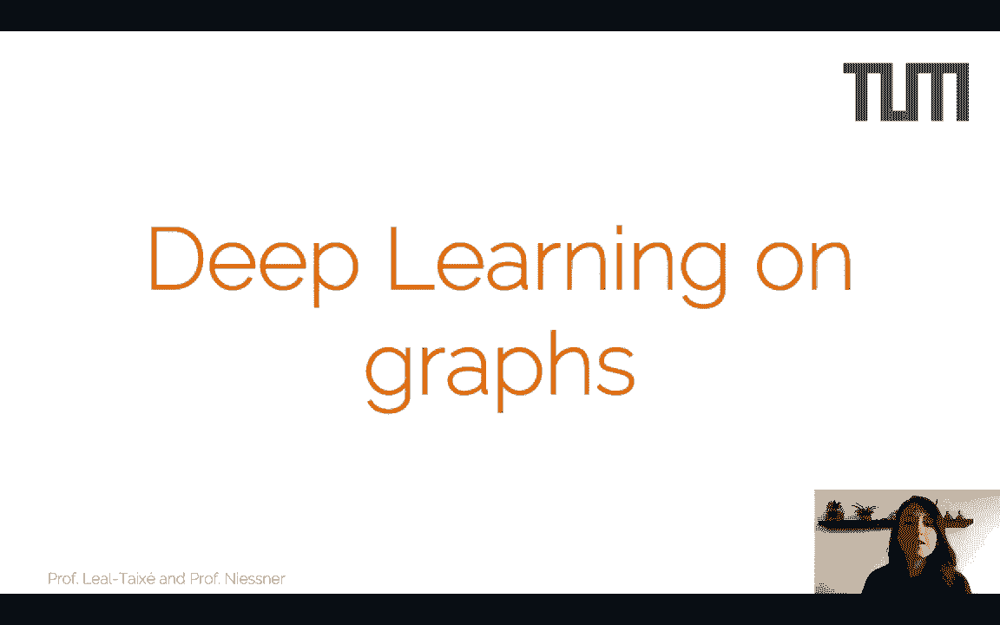

# P5：L5 - 图神经网络与注意力机制 - ShowMeAI - BV1Tf4y1L7wg

Welcome to the lecture on deep learning on graphs so today we're going to move a little bit away from the domain that we have seen so far so so far we have worked a lot on images and this is a very regular domain right so the order of the pixels is really important it is important whether you have for example the eye and the nose at a certain location or whether the eye is really far away from the nose so there is a certain regularity first the neighbors are always placed on the same positions。

And second， the order is also important。So why am I mentioning this Well。

 I'm saying this because when we actually try to apply our convolutions on top of the image。

 so essentially when we want to train a convolutional neural network。

 what we do with each convolution filter is that we slide it through the image。

And this convolution filter has a certain shape。And therefore it imposes a certain structure。

 so the relationship of the weights that you can see here depicted in different colors is always the same and what we're trying to find here with this convolution filter is exactly this relationship of weights also in the image。

And we can do this because our domain， our image domain is actually regular。

So what happens when we jump into a new domain， for example， point clouds？

So point clouds are very rich in information， we have the 3D point location of objects。

 we can even have point locations of entire cities that we can reconstruct。

We can also assign semantic information to a point cloud。

 we can also have RGB values coming from an image which we can also assign to a point cloud。

So there's a lot of information that point clouds can contain。

 but there is one caveVab and this is that point clouds are irregular， so first of all。

 if we now take this rabbit with this point cloud representation and for example we rotate it so we make a transformation to the point cloud。

The rabbit will still stay the same。 It will still be a rabbit。

 but now we will see the points in a completely different location。

Another important thing is that the order of the points is not relevant at this point。

So there is a certain permutation invariance that we would like to have on any operation that we actually apply to the point Club。

So I don't care if I actually analyze first the point at the nose of the rabbit or the point at the tail of the rabbit。

 I should always reach the same conclusion that for example。

 this whole point cloud representation represents a rabbit。

So you can see that this new domain is very different from the image domain that we're used to。

Another domain that is very， very different would be， for example。

 a domain that is represented by a graph as we can see here in the image。

 and this would be for example， a social network or a citation network where each node is actually a paper and each connection is a citation。

So we can actually represent lots and lots of concepts with these graphs where the nodes represent one concept。

 for example， a friend in your social network or a paper that you're actually citing。

 and the edges represent connections between these concepts。And actually， recommender systems。

 social networks all have a representation that is based on these graphs。And as you can see。

 these graphs are also irregular and we cannot readily apply convolutions， for example。

 on top of these graphs。So if we actually want to perform any kind of deep learning。

 if we want to do learning on top of these new domains on top of point clouds or on top of citation networks。

 we need to come up with new tools for that。So let's start by defining what is a graph so as I've said a graph contains nodes and edges。

 these nodes represent concepts for example， friends in your social network。

And the edges represent the connections between these concepts， for example。

 whether you are really friends with another note that represents another person or whether you're not friend yet。

So it turns out that there has been a lot of work on deep learning on graphs。

 and these are essentially generalizations of neural networks that can operate on these domains that will now have a different structure that will now have a graph structure。

And the main idea is that we need to actually face two challenges， so first of all。

 we're going to have variable sized inputs so before in the images we had rather regular inputs that you can actually have any image size。

But of course the convolution has always the same shaped and thanks to the sliding window。

 it can be applied to multiple input sizes。But now we have a different challenge Now。

 the thing is that a social network can contain 10 node， for example， for 10 people。

With a series of edge connections or it can contain 100 people。

 and we need to define operations that can operate on the graph with 10 nodes and 00 edges and the graph with 100 nodes and lots of edges。

And also we need to have invariance to node permutation。

 so it doesn't really matter which node we're analyzing in the graph。

 we need to treat it the same way as all the other nodes。

So the general idea of graph neural networks is that we're going to represent our concepts with a graph。

And we're going to start by building this graph with optionally but most likely we're going to have a series of node and edge feature vectors。

 these are essentially embeddings that contain certain information that you're interested in processing and we will actually see quite some examples on what kind of information can you put in there especially in the context of computer vision。

Now in the second step， what we're going to do is we're going to perform a series of information propagation steps。

And these are essentially separated into several iterations。

And the key idea here is that you can consider each update step or each of these information propagation iterations。

As a layer in common neural networks。And so essentially what that means is that in the first hidden layer and this is again not actually a layer as we understand in CNNs。

 but rather an information propagation step， so in the first one all the notes are going to connect to the neighboring notes and are going to gather information。

Then we're going to move to the next layer to the next information propagation step。

 and the same is going to happen。Of course， now your neighboring node has collected information already from the first step of its own neighboring node。

So in practice， what happens when we reach the second information propagation step is that you are receiving information from a note that is two steps away。

So the idea is that the further you go in your information propagation steps。

 so the more hidden layers you have in your graph neural networks。

You're actually connecting with nodes that are further and further away。

And when I actually say that you have established a connection with a faraway note。

 what I mean is that you receive some type of information through these information propagation steps。

 and this information is always in the form of an embedding。So after this iteration。

 after these information propagation steps， what you actually have in the output is a graph which has updated context aware node and also possibly edge feature vectors。

Which essentially means that I haven't really made any decision here yet。

 all I have done is actually update the feature embeddings of my nodes and of my edges with information from my neighbors。

And so another the interesting part of course is the information propagation step。

 so how does this actually happen and how can I overcome the key challenges that I saw before。

 so namely that I can deal with an arbitrary amount of nodes and edges and second that my operations are actually permutation imvariant。

So let's introduce some notation， as I've said we will start always by working on a graph and the graph G has a set of vertices V。

 which are the nodes and the set of connections or edges which are E。

Now we're going to denote the embeddings of our nodes and of our edges with the letter H。

 so H is for the embeddings。And these embeddings again can come from any network。

 it can be an embedding that you have manually defined。

 it can be an embedding that comes from a CNNN that passeses information of an image。

 it can be an embedding that comes from an RNN， anything at all that can be represented with a vector。

And so we'll have the embeddings of our nodes， which are H and the embeddings of our edges。

 which are represented by H comma J。So here we will denote also。The step。Of these embedding。

 so zero means that these are the initial embeddings as soon as we perform a message passing or an information propagation step。

Then this embedding is going to be updated to step one， for example。

So this is what we represent by H superindex L， this means that actually the node embedding for our node I has been updated L times。

 so there have been L message passing steps that have updated the node embeddings with information from the neighbors。

And again， the idea is that we're going to iterate through a series of information passing or neural message passing steps。

 so essentially what's going to happen is that my nodes are going to connect to my edges。In one step。

 and in the second step， the edges are going to connect to the nodes。So at every iteration。

 what is going to happen is that my node is going to receive the features from the neighboring node and this is going to happen through the edges so here let me play this again for you。

 this is a neural message passing step where the note actually collects the information from the neighbors。

And so now the idea is that you have a varying number of neighbors could be that a node has three neighbors like the node depicted here。

 but for example， the node here at the bottom has only two neighbors。

And if I actually want to define a deep learning architecture that works for all the nodes in the graph。

I need to have a feature aggregation operation that is actually first of all。

 order invariant and second of all， it can take any number of inputs。嗯。

The other interesting thing is that of course we need to put some learning into the pipeline right so aside from the aggregation of information that the node does aggregate the information of the neighbors。

This aggregation step needs to also include a learnable function right I want to know how to aggregate this information and I want to know how to process it and this needs to happen through of course a learnable function that I'm going to learn through by propagation。

So let's take a look in more detail at what is exactly a neural message passing step？So first of all。

 what we need to create is a message for each node so in this case we're creating the message for node V for step L plus1。

 so I want to move from step L to step L+1。Now the first thing that I'm going to do is that I'm going to take my node V and I'm going to look at my neighbors and these neighbors are represented by this letter U。

 these are the neighbors of V。And so what I'm going to do is essentially I'm going to gather the information of the embedding of my neighbors。

 my own embedding。And the embedding of the ages， right this is this aggregation step that we were discussing。

And then I'm going to put a learnable function on top。

And this learnable function can have any shape could be， for example， an MLP。

 this is represented by this letter M。Now the interesting thing here is that for all the nodes in the graph。

 this function is going to be exactly the same， so all the nodes in the graph are going to be processed exactly in the same way。

So the thing is that I'm going to process this information， I'm going to process these embeddings。

And then of course， I have to do the aggregation step。

 so I have to actually collect all of this information into one single message。And for this。

 I have to do an operation which is permutation invari。

And which actually can work with any number of nodes， which are neighbors to my node V。

And what I do in this case is I just do a summation， so I send all the information of my neighbors。

 so it doesn't matter how many neighbors I have。And it also。

It doesn't matter the order of my neighbor， so there is no natural order in the neighbors that I actually want to impose。

 I just sum all of their embeddings。And what I'm going to do， I'm going to create this message。

 which is now kind of anating aggregated embedding information。

So after this what I'm going to do is I'm going to update my own embedding right so I'm a nodeV and I want to update my embedding with the information that I've actually captured from my neighbors with this message that has actually gathered all this information。

And for this what I'm going to do is I'm going to take。My own embedding at step L。

 I'm going to take the message， this aggregation of information。

 and I'm going to pass it again through a learnable function。And again。

 it's important to note that this renewable function first of all， can have any shape could be。

 for example， an MLP could be a convolution。And that it has shared weights across the entire graph。

 so all of the nodes are going to be processed by the same function U。

And so the interesting thing now is that we have separated neural message passing into two steps。

 the first step which is the construction of the message， which is actually this aggregation step。

This looking for information of your neighbors and aggregating them into a message。

And in a second step， updating your own embedding， that is looking at this information from the neighbors。

 looking at your own embedding， passing everything through an MLP， for example。

 and updating the embedding of the nodeV。Now the interesting thing is that there's a lot of graph neural network types。

 a lot of models we have graph convolutional neural networks， message passing networks。

 but most of them can actually be seen as a specific example of this formulation and we're going to see a couple of these examples in this lecture。

So let's see a first example with a specific definition for the message passing steps for the operations that will actually be performed on our embeddings。

So the first one is this creation of the message。So the idea here is that。There is an node V。

And the note V looks at the neighbors， which are represented by the letter U。

And looks at all the embeddings of the neighbors， these are represented by these embeddings here。

And essentially what it does is it performs an average operation again， permutation invari operation。

 and I don't care how many neighbors do I have because I'm going to perform a normalization step here So if I have 30 neighbors。

 I'm going to take all of their embeddings and I'm going to average them。And with this operation。

 I've now created the message for my No。Now the second operation is the update。

 the update of the embedding of Note V。So the idea here is again that I need to combine the new message that I've actually retrieved。

 so all the information of my neighbors with my own previous embedding and this was the embedding at step L。

And how I'm going to basically combine these two sources of information is actually with learnable matrices right I don't want to actually decide whether the new message is more important than the previous embedding to compute the new embedding。

 but I actually want to perform an operation with learnable weight。And for this。

 I'm going to have these tool learnable matrices， W and B。

 and these matrices are going to multiply the new message and are going to multiply the previous embedding respectively。

To actually create the new embedding。And on top of this， of course， I'm going to have a linearity。

So look at the similarities already， for example， with an MLP or with a convolutional operation。

 so what I'm doing is I'm getting from the previous layer certain information。

 I'm processing it with learnable ways which is what we do for any of the operations inside an MLP or inside the CNN and then I pass it through a nonlinearity。

 same thing here。And so the really cool thing about this formulation is that it's very general。

 right so these ways that we're actually multiplying with our message and with our previous embeddings。

Could be anything could have any shape。 We could have an MLP。

 or we could have a recurrent neural network。 We could have any kind of operation we want in there。

 depending on what is the shape of our message and what is the shape of our embedding。And again。

 the important thing here to note that， for example， if we use an MLP， like in this case。

 MLP1 is going to act on all the messages of all the nodes in the graph。

So this is going to be an operation that is going to be applied for all nodes。

 so it's going to have a huge amount of share weights and the same happens for MLP2 so it's really important this is really an important characteristic of neural message passing networks or graph neural networks and that is that all the operations that are applied on a node or they're applied on an edge are exactly the same for all nodes and edges of all the graph。

So it's like huge Siamese network for all nodes and edges。So let's look at another example。

 let's look at the famous graph convolutional networks。

 so what are really graph convolutional networks and we will actually see that graph convolutional networks can also be written inside the formulation that we have presented at the beginning。

So let's start as always with the aggregation step， with the creation of the message。

So what we're doing right now is we're looking again at node V。

 we're looking at the neighbors of node V， which are you， but we're also looking at the node itself。

So before what we did was when we created the message， we ignored the embedding of the node itself。

 we said the message will just contain information of the neighbors and then I will put it together with my embedding later on。

So are we doing graph convolututional networks？Is we also take into account the node itself。

 so there is this notion of a self loop here that there is a connection between the node and the node itself。

And of course， now we have to really change a little bit the notion of normalization。

 so normalization is also going to take into account its own node。

And so we're going to have a per neighbor degree type of normalization。

 but essentially it is the same as we did before， just an aggregation step where you gather information from your neighbors and in this case from yourself。

And so now the idea is that instead of having。Two matrices。

 one that acts on the message that is on the neighbor information and one that acts on your own embedding。

 your own node embedding， you can have one single matrix right because we have already taken into account the embedding of the own node V so now we need only one matrix which is going to be the same learnable matrix for self loops for the own node connection and for the regular neighbors that are connected to the node。

But essentially the idea is the same， I'm going to perform an operation which multiplies weights by my messages and then passes it through a non linearity。

And so this matrix of weights is going to have size。

 number of channels that we want in the output multiplied by the number of channels that we want in the input。

Again， it doesn't really matter how many nodes are connected to the node V right so the number of connections doesn't really matter。

 the only thing that matters is that I have a certain embedding representation with certain number of channels and now I want to convert it with an embedding representation age which can actually fit as the embedding of my node V。

And so essentially， what you want to do is you want to collect information from your neighbors。

 this is the aggregation step。And you want to transform it through a learnable function into a new embedding。

So this is not really much， much different from what we do in normal convolutional networks right so we also have certain embedding certain feature map。

 which we want to transform into another feature map。

But here the trick is that unlike normal image convolutional filter。

 the neighbors are again not regular right so the image space is regular so we can define convolutions that are for example。

 three by three and we know that we will be able to apply them all over the image。

But here we don't know how many connections and node text。

So what I first have to do in order to apply a convolution type of operation is， first of all。

 I have to do this aggregation step， I have to do this permutation invariant operation so that then I can apply my set of weights and I can apply it to a certain specific embedding size。

So again。The operation is first， the aggregation of information。

 which allows us to have and to deal with any number of connections。

 and the second is an operation that mimics the convolution operation。

So so far we have talked only about updating the node embeddings， right。

 we haven't really done anything with the edge embeddings。

And it is true that the framework that we have presented so far is only suited to actually learn node ems。

 but the question is what if we're actually interested in the edge features。

 what if the information that we want to recover is in the edges and node in the nodes。

 so this of course depends on what you want to get from your graph neural network。

But if you want to learn node embeddings as well as edge andbeddings， you have at least two options。

 so first of all， to work on the dual graph so that you're actually updating the edge embeddings instead of the node embeddings。

Or a formulation that we will present now， which is actually more general。

 where you can do alternating node updates and edge updates。

So let's see what this new formulation is about。So the more general framework consists in actually two steps。

So we start from the initial graph that we had already before with the no beddings in yellow and the edgeium beddings in green。

And now what we do is instead of doing an aggregation step where the node collects information from neighboring nodes。

What is going to happen is we're going to divide this propagation process into two steps The first step is a node to edge update that is the node communicates with the edges that is connected to and passes along the information of the embedding。

And in a second step， the edge。Context， the node that it's connected to。

So now we have basically divided this propagation process into two steps so that both node embeddings and edge embeddings are actually updated。

And so essentially， what is going to happen now at every message passing step？So first of all。

 we're going to do the node to E update and the node E update basically means getting the embedding of node I for the previous message passing step。

 right so I'm looking at the node I。Then I'm looking at the embedding of the HIJ。

 which is actually the embedding that I'm interested in updating。

 and I'm looking also at the embedding of the node J in the previous message passing step。

So essentially for an edge。IJ。Wwhichch is connected to node I and node J。

 What is going to happen is it's going to look at its own past embedding。

 the embedding of the neighboring node and the embedding of the other neighboring node。

And it's going to gather all this information and it's going to pass it through a learnable function。

 which again can take any shape。So this is the step where actually the nodes。

Make contact pass information to the edge， so we are passing information from the yellow node embeddings all the way to the edge embedding and the only thing that we're updating in this step are the edge embeddings。

Now again， it is important to note that we're going to do this update information by passing it through again。

 a learnable function， and this learnable function updates actually all of the edges in the graph。

So after one round of node to edge communication， the edge embeddings have been updated。

 so now essentially the edge embeddings contain information about the pair of incident nodes right we have taken the information from IJ and we have passed it to the edge IJ which actually connects these two nodes。

So now I go for the E to note update in this update。

 the edge embeddings are going to be used to update the notes， so the opposite operation。

So in this case， of course， we have the same problem as we had before in the first formulation。

 and that is that I don't know how many nodes， how many edges are connected to a node。

So if I have to update the embedding of node I， I have to look at all the connected edges。

And this could be of an arbitrary number， could be three edges， like for example， is in this case。

 but it could be also two edges， like for this note here on the bottom left。So again。

 I need to define an order invariant operation that can take in any number of nodes。

So I'm going to take the embeddings of all the connecting edges。To my note， I。

And I'm going to perform this order invari operation to create again， the message of node I。

And once I have this message same as before， I can， for example。

 concatenate it with the hidden state of the note in the previous time set。

 pass it through a nonlinearity， and then update the embedding。So again。

 this aggregation step and this passing through the nonlinearity what it's going to do is's going to update the node embeddings and it's going to add contextual information about the neighbors。

So this is very similar in spirit to what we had before， just and now we' divided into two steps。

 first updating the edges， then the edges update the node。

So just a few remarks to kind of settle some important ideas here。First of all。

 the main goal when we're actually performing this message passing steps and we're actually training our neural network。

 our graph neural network。Is that we want to obtain node and edge embeddings that contain this context information。

That basically implicitly encode， first of all， the graft topology， so who is the neighbor of who？

And that it actually contains also neighbor feature information。So if I'm a note， first of all。

 I want to learn about my immediate neighbors。And I want to encode their features。

 I want to know what are they actually seeing and what are they actually processing。

And the only thing that we do when we actually perform the message passing steps of a graph neural network is to pass along the information in the graph。

So after doing the node and edge updates， for example， for L steps。

 and this is something that you have to define， how many steps do you want to do。

 how many message passing steps do you want to perform？So after all of these steps。

 each of the nodes and also each of the edges， it's going to have an embedding which contains information about all the other nodes which are at distance L and this is important right so again we have this notion of layers inside a CNN and going deeper and deeper。

And here each layer consistsd of one message passing step。

So each time we perform one message passing step we go a little bit further and we gather information from nodes which are one step further away。

 so if we perform L steps we will have received information from notes which are at the distance help。

And all of the operations that we have defined are differentiable。

 this is really important because actually we can train these architectures in an N2 fashion。

 we can actually perform back propagation so we can train this as we train any other CNN or any other MLP。

So as a last important point， there's actually a really large literature on different types of graph neural networks。

 different models， different operations that you can do for each of the update steps。

I would recommend actually for you to take a look at the paper that we have cited for an extensive review of a lot of these models。

 so if you want to actually see what type of MPN models。

 what type of message passing network models there are out there。

 I would recommend that you actually read this paper。

So let's actually see how we can use message passing networks in computer vision and what kind of tasks can we actually tackle？

And so we'll start by the task of multiple object tracking。

 which actually means to detect and follow track over time multiple objects usually of the same type so you can see here。

 for example， a scene that we usually work on in the DVL group。

Wwhich is actually quite challenging right so there are heavy olusions。

 the appearance of the different objects is usually very similar and what we want to do is we want to detect these objects and we want to track them over time without mistakes。

Of course， thing can get really crazy， so the field of multiple object tracking is actually a very interesting field with lots of challenges。

And we will start by looking at one of the ways of actually tackling this multiple object tracking problem and that is actually using graphs。

So in the multiple object tracking problem usually what we do is we divide the problem into two steps。

 the first step which is actually object detection。

 so you run your favorite faster CNN Yo architecture any architecture that you want on your image and you detect the objects of interest so of course this object detection is not going to be perfect especially for the extremely crowded scenes so you're going to have for example some false positives and false negatives spread all around the frames of the video。

And what you want to do in a second step is to actually link this detection so to actually know that this pedestrian here is the same as this pedestrian here in the next ray。

And if you actually link the detections from frame to frame， you will obtain complete tracks。Now。

 one way of actually representing this second step， this data association is actually with a graph。

A graphical model where each detection is represented by a node in the graph and a connection represents a possible link between these two detections。

 so the possibility that these two bounding boxes represent the same person。

And so finding one path through this graphical model means actually finding a trajectory means actually linking the bounding boxes from frame to frame that actually represent the same person and creating a trajectory out of these boxes。

And if we do this for all theions in the graphical model。

 we will actually have solved our graphical model and we can obtain all the trajectories of the objects in our video。

So again， multiple object tracking with graphs means dividing the task into two steps。

 the first step， object detection， the second step， what is called data association。

Another question is， can we actually bring some learning into the data association step by using the message passing networks？

So this is what we actually propose to do in one of our most recent papers presented at or will be presented actually at CPPR 2020。

 and this is actually how to leverage message passing networks for the task of multiple object tracking。

And here the idea is that you have your detections， your bounding boxes as input。

And the first thing that you do is you construct a graph。

And you actually encode appearance and seen geometry cus into the node and H embeddings so again。

 these node and H embeddings which are just these factors， they can come from anything in our case。

 they come from a CNN representation that encodes the information of the detection。

And we also have some syn geometry views， like for example， encoded in the edgees。

 how far away are two detections in the image space？So once we have created this graph。

 once we have decided what is going to be the initial embeddings for nodes and for the edges。

We do a series of message passing steps and as we have seen these message passing steps essentially means that node communicate with edges。

 edges communicate with nodes and essentially all of the information of the different bounding boxes。

 the different detections is propagated across the entire graph。And once this is done。

 what we can do， is we can directly put， for example， an MLP on top of each edge。

 and we can actually start by classifying edges， so we classify edges into active connections。

 which means that actually the two nodes that is connected belong to the same trajectory or inactive connections。

 meaning these two bonding boxes have nothing to do with each other。So essentially。

 in the first step， we have constructed the graph， we have then passed along the information。

 detections have been connected to other detections。And in a third step。

 now we are able to robustly classify the edges into active connections or not。So essentially。

 if we want to map it to traditional CNN， let's say view。

 we can consider the graph construction and the feature encoding as sort of a feature extraction step。

And the neural message passing image classification as a learnable data association step。

So let's look a little bit more into detail at how do we actually perform these feature encoings。

 right？So what we want to do is， first of all， we want to encode appearance information。

An appearance information is directly linked to a node。

 each node represents a detection and therefore what we want to do is we want to take that patch of the image that represents a pedestrian who want to pass it through a CNN and we want to obtain an embedding that we're going to put into the node。

So we're going to do this for all the notes in the graph which represent all the detections that we have detected in our step one。

And then we're going to put some geometry information on the edge。And by geometry information。

 we mean， for example， what is the distance in time between the two bounding boxes？

What is the relative box size， what is the relative box position？

Now the idea here is that a pedestrian moves in a smooth way from one frame to the next in a video。

 so it is not really realistic to assume that the pedestrian will have moved from the top left of the image to the bottom right in just one frame。

So this is a little bit the type of information that we're trying to encode here。

 we're trying to give the graph neural network this information so that it can make the appropriate decisions so that if it sees two detections which are。

 for example， one frame away， but really， really far away in the image space。

 then it knows that it's not very likely that these two detections belong to the same pedestrian。

Now again， important thing here， the concept of shared weights。

 so the CNN that is going to extract the information for the node is going to be the same for all nodes。

And the MLP that is going to process the geometry information is going to be the same for all edges。

 so again， very important characteristic of graph neural networks。

So once we have defined our initial embeddings， now the goal is to proagate these embeddings with the message passing steps that we have seen before。

 with a notes to edge updates and with the edge to note updates。

So essentially the new embeddings what they're going to contain is they're going to contain higher order information among detections right you're going to look at detections which are several friends away and you're going to decide whether these actually represent the same person as you as the node or they represent another person。

And by looking several frames ahead and several frames behind。

 you can actually make a much more informed decision。

Now in the paper we also include a new type of message passing step。

 which we call timeware message passing step。So you can see on the left the classic message passing step depicted。

 which actually takes a note that we're analyzing in this case note V。

Looks at all the neighbors in the future and the past。

 collects all this information right does this aggregation step。

 and then passes it through a series of learnable functions。

So this is the normal message passing step。But what we actually propose to do is we propose to treat past connections and future connections in a different way。

So intuitively， the connections between frame T and t minus1 should be treated separately than the connections of frame T and T plus 1 so the idea here is that for this note here。

 you will actually have one neighbor at frame t minus1 which is going to represent the same person and one neighbor at T plus1 which is going to represent the same person。

So you want to separate the two operations。So essentially what we do is we perform a different aggregation for the past connections。

 that connections between t and t minus1， and the connections between T and t plus1。

And by doing this operation， we allowed the network to have a notion of time。

 to have the notion that the connections to the past and the connections to the future should be treated separately。

So now we going to the last step right we haven't really discussed this in the lecture。

 we have just discussed the message passing steps so it's very nice to pass log information。

 it's very nice that now your node embeddings and your edge embeddings contain this high order information。

 this information of the neighbors， but it's now time to actually target our task to actually perform。

 for example classification。And in the case of multiple object tracking。

 what we're interested in doing is classifying edges。

 so we want to know whether the connection between two nodes is actually an active edge。

 which means that these two nodes represent the same person and therefore you want to create that trajectory。

Or the connection should not be active， which means the two notes represent two different people。

So essentially what we want to do is we want to perform edge classification into active and inactive nodes and for this we can easily train with a binary cross entropy function like we have seen for most of our classification problems。

 but now what we're classifying our edges， so we're looking at these updated edge embeddings after all of these message passing steps。

And from here we want to obtain a decision with an MLP， we want to obtain a classification。

 yes or no。And these are going to be essentially the edge predictions that we're going to get。

 for example， from a sigmoid， a iteration L。So of course。

 first we need to perform the message passing steps and at the end of the message passing steps。

 we look at the embedding and we make a prediction。And in our case， we also have this weight。

 which actually balances active and inactive edges。

So we have the problem that of course most of the connections are inactive and there are just very few connections which are active。

 and this is actually a weight that we need so that we give enough important to active edges so that the message passing network can be trained properly。

And finally， what we're going to do is we're not going to only compute the prediction loss at the last step。

Of the message passing， but we're going to predict we're going to make this edge classification for each of the last。

 for example， L message passing steps。And we're going to aggregate these predictions。

So essentially what we do is we perform a total of 12 steps， for example， 12 message passing steps。

 so after seven message passing steps， what we're going to do is we're going to start to make edge predictions。

And we're going to accumulate these edge predictions。Step。Seven， step 8， 9， 10， 11， 12。

 we're going to accumulate all these predictions and sum them up in the loss。

And this is essentially to get a stronger signal for learning。

But we actually have to differentiate the training procedure。

 which means accumulating predictions for the last L steps with the testing procedure and the testing procedure what it simply does is it performs 12 message passing steps。

 and at the end we make the prediction。So okay， once we have obtained this edge classification。

Of course， what we're going to get from our classifier is a prediction， which is between zero and1。

But actually what we want is not a value between zero and1， but it's actually a hard decision。

 either zero， we cut the connection or one， we keep the connection and we create the trajectory。

So what we're going to have to do is we're going to use this very simple rounding scheme to obtain the final edge value 0 and1。

 which actually mapped the trajectories。And during this operation we have to make sure that certain constraints of the graphical model are fulfilled。

 for example， that one detection at time T is not connected to two detections at time T plus1 because of course a person cannot be in two places at the same time。

 so there are certain constraints that we actually have to make sure that they are fulfilled。

It turns out that with our formulation， most of constraints are fulfilled anyway from the start。

So this actually shows the power of message passing networks to tackle the problem of multiple object tracking。

And also， the overall method is actually reasonably fast， so it goes at six frames per second。

It achieves state of the art on the mod challenge benchmark and it actually outperforms the other methods by a significant margin。

 so actually believe that this is a very nice foundation for true and to un learning methods for multiple object tracking so before a lot of effort was devoted into obtaining learnable features into obtaining。

 for example or performing reidentification performing this this between two detections by using。

 for example， CME network， analyzing the two detections and saying whether these belong to the same person or not。

 so a lot of processing through CNNs but no one had really mapped the actual data association operation into a learnable function。

 into a function that you can actually backproagate through and where you can actually learn these data association。

So now we turn into another computer vision problem and there is the problem of video object segmentation。

So in this problem， our goal is actually to generate accurate and temporal consistent pixel mask for the objects in a video sequence。

 so you can see here some of the examples of the annotations and the types of objects that we want to segment throughout the sequence。

So it turns out that you can also use graphph neural networks to model this problem and the main idea is that we're going to model only the temporal consistency through a graph neural network。

And essentially what this means is that we're going to represent each frame of the video as a note。

And we're going to pass information among the frames in order to obtain a consistent mask Z。

So now the notion of a node changed a little bit before we could have several nodes per frame。

 which thennoted the several detections。Now in this formulation for this ICCV 2019 paper。

 each note is going to represent the whole frame。And the idea is that we actually want to find one object and we want to segment one object on each frame。

 so this is why we can represent each note as we can represent a frame as a note。

So here's a depiction of their whole pipeline let's break the different steps so first you have your video which you're going to process so you're going to process each frame of the video and you're going to have a node that represents each frameram of the video。

Then the first thing you do is you create your initial embeddings and in this case the initial embeddings have to contain information of all the frame right you have to condense all the frame into an embedding for one OneNote so what the authors propose to use is actually use deepB version3 to do this feature extraction so really powerful feature extraction here。

And this is what is going to give you the initial embedding。

 so which note is going to have a very powerful initial embedding for the frame that it represents。

Then what you're going to do is you're going to start with the message passing steps and you can see here that the message passing steps actually have this compf grew。

 so essentially convolutional recurrent networks。Because what you actually need is you need to preserve the special information within the frame。

 right you still want to obtain pixelwise outputs， you still want to obtain whether a pixel in the input train actually belongs to the object that we're interested in cementing or not。

So we need to somehow preserve the spatial information so message passing networks are so flexible that you can put any operation in the message passing step and in this case it's a convolutional recurrent neural network。

So this is just to show you another view on what can nodes represent and how can you actually adapt the message passing step according to the needs that you have and according to what a node represents。

So there is another ingredient that they use in the ICCE 2019 paper。

And that is that each pixel in the frame is not equally important right so there's a lot of pixels in the background that are not really important。

 so they propose to do is they propose to use attention。

And what I want to do in the next few slides is actually to introduce this concept。

 but more importantly， to link it to the concept of message passing network。

So let's see what attention is。So attention was first introduced for machine translation。

 so the problem of translating one sentence into another。And here。

 the main problem was that for very long sentences。The score。

 the accuracy score for machine translation， which is depicted here in the X axis。

 actually really went down after 30 or 40 words。So the algorithm。

 which was based mostly on recurringcurren neural networks was translating properly。

 but after 30 or 40 words， it essentially forgot what was said in the beginning and so the accuracy started to go down。

So there was this notion of performance degradation。

 which goes hand in hand with the idea that recurrent neural networks have a memory problem。

 so after a while they forget the information that they have processed。

And so what they proposed to do in order to solve this problem was to use what they call attention。

And with this attention， what they could actually obtain is that even for very long sentences。

 the score was kept high even after 30， 40， 50 words。

So let's first remind us what is the basic structure of an RN as we saw in the I2DL lecture and what kind of problems does it present and what kind of problems does attention try to solve？

So in a recurrent neural network， what we want to do is we want to have this notion of time or this notion of sequence。

So we want to actually process every element that we have in the input in this case， Xt。

With the same operation。And just process the element T with， for example， this small neural network。

 which we would call a and predict an output， for example。

 we have as input an English word and as output the translation in German。

And we actually know that our input has this sequential notion。

 so after one word comes another comes another。And the order is actually important。

 and this is what we actually capture by essentially performing this operation of processing the input with the same neural network with the same learning block A for all the time steps in a recurrent fashion。

So essentially how this can be represented is。With our input Xt。

 which is processed alongside with the previous hidden state of our recurring neural network。

So we're processinging both the current time step as well as everything that we did in the past until the time step deep。

And essentially， we're going to process this with two parameters。

 with two learnable weights that we're going to by propagate and of course we're going to learn。

And what this actually gives us is a new hidden state 80。Now again here。

 the important thing is that for each time step， we're going to actually use the same parameters to perform our update steps。

 so essentially the parameters that I use to treat my input that I used to treat my previous hidden state and that I use to create my output are going to be exactly the same for each time step。

And this is important， of course for generalization。

 right this is the basic structure of a recurring neural network。

So everything becomes a bit more clear when we actually unroll our recurrent neural network where we can see actually the sequential nature of the processing。

 so here we can see how we start with the first word of the sentence， which is our first input at x0。

 we process it through our neural network and then we produce an output， we produce， for example。

 a translation。And this translation， whatever processing we did for the input zero。

 is going to have an impact on how we actually process time step one。

And both are going to have an impact on how we process time step two， et cetera， et cetera。

 all the way towards the end of the sentence。So again， important thing。

 the hidden state is exactly the same for each of the time steps。

 so this is how we achieve actually generalization。

But where is the problem of recurringrent neural networks？

The first problem is that when we're actually trying to process the output for time step two。

We have to look at several variables right， we have to look first of all at what was the input at time step two。

But also， what was the input at time step one？And what was the input at time step zero？

So for time step two， this is still manageable， for time step T where t is 100。

 I have to look at far too many variables to actually decide what where to output as a translation。

So essentially neural networks， recurrent neural networks have the well-known problem of long-term dependencies so when you're for example translating a sentence and you say at the beginning of the sentence I moved to Germany then you explain several things and after a couple of sentences。

 you went by saying so I speak。A certain word fluently。

If you actually have to decide what this word is， what this language is。

 you of course have to go to the beginning of the sentence， so if I had moved to France。

It is most likely that what I'm actually saying is that I speak French fluently。

 if I move to Germany， then it is most likely that say that I speak German fluently。

 so there is a very strong dependency in this case between the word at T plus1 and the word all the way to the beginning of the sentence at time step zero or at time step1。

So in order to solve this， what researchers have proposed is， how about we use attention？

And attention in this case， what it means is。You're going to decide which hidden states。

 which time steps are more important to actually predict my output。And so for example， in this case。

 what you want to generate is you want to generate some sort of context variable。

And this context variable will actually process the different time steps in a different way。

With different weights。So for example， in this case。

 what you're actually aggregating in this context is the importance of the input at time set T plus1 when you want to predict the output at time set T plus1。

And in a similar fashion， you can encode with another weight with another alpha with another attention variable。

The importance of time step T when you're trying to predict the output at time step T plus 1。

And you can do the same for all the time steps in your reren neural network。

So essentially what you're evaluating is how important are all these different words。

 are all these different hidden states to actually predict my current output。

And so the architecture for actually using attention， for using attention， for example。

 for machine translation。WouldWould be an encoded decoder type of architecture。

So the decoder would actually process the information to create， for example。

 the translated sentence。And it would take， of course， the previous decoded hidden state。

 so we still have this idea of a recurrent neural network。

It would take also the previous output because of course。

 if you want to create a sentence that makes sense。

 you have to see what is the word that you said before。

And it would also take the information of the NCO。And the encoder now has been is represented by our letter A。

 right， this is a small neural network that processes our input。

But instead of passing directly the hidden state of the encodeder to the decoder。

 we actually pass it through a series of attention weights。

 so you're actually going to measure the importance of the different hidden states。

 the importance of the different time stepss。And so again， in this case。

 alpha 1 comma t plus 1 would indicate how much the word in position 1 is important to translate the word im position t plus 1。

And again， this connection is direct right you don't need to go through all the steps of the recurrent network。

 but there is actually a direct connection between step1 and step T plus one。

And this allows you to kind of bypass the memory loss of the recurrent steps and directly say if that word was very。

 very important， then really take a look at that hidden state。

So this context variable then what it does is it aggregates all this attention information right it takes the first of all。

 the attention variables， these alphas， but it also takes the hidden states。

 so in our case the hidden state of the encoder was represented by a so here we have all the A's which are actually these embeddings which are actually these encodings for for the input sentence。

So essentially what we're doing is awaited sum of embeddings。

And this is what is called soft attention because all of these attention mask actually sum up to one。

So another question is how do I actually compute this attention mass。

 how do we actually compute these alpha values Well it turns out of course。

 that we can train a small neural network to do the job。So in our case。

 if we want to predict the alpha value between the first word and the output T plus1。

 what we do is we create this small neural network。And we feed the hidden state of the encoder。

At time step one， right so this is the encoder， the hidden state of the encoder at the first time step。

 so after it has processed this input this first word。

And the previous state of the decoder at time T， so essentially this is I want to check what is the relationship between the input in the first place and the output that I want to generate at T plus1 so I actually look at the input at time1 and I look at my previous output to see if what do I have to output at T plus1。

So in both of these， I can actually train my neural network to output this value F。

 which we're then going to just simply normalize in order to obtain the alpha value。

 so it is important that all these alpha values actually sum up to one in the case of soft attention。

And so for example， let's look at one very famous model for machine translation。

 which is the sec to sec。And essentially what this model proposes is， first of all， to use attention。

But second of all， it is important to first read the whole sentence in one language and afterwards。

 once you have processed all the sentence， then you start translating the sentence in the other language so this is kind of one the of the things that is proposing sec to sec。

Not to actually translate word by word as the word in language one comes in。

 we output the word in language too， better to first read the whole sentence in language one and then translate the whole sentence in language too。

And in this case， attention is going to have a very important role。

So this is how the architecture can be depicted right first we have this encoder。

 this meaning of reading sentence in language1。Then you have this information。

 which is essentially an embedding that is passed to the decoder。

 which actually starts translating the whole sentence in language too。So another question is， okay。

 in this architecture， can I actually use attention？Of course if the sentence is very long。

 we will have forgotten what was said at the beginning of the sentence。

 especially because we are processing the full sentence in language one before we start translating so here attention has actually a bigger role to play。

So the role of attention is actually to take notes of the keywords as we read the sentence in the first language。

And these keywords are going to be marked by really large attention waves。

So how this is actually working practice？So you have your encoder。

 which is actually processing the full sentence and at each time step you actually output an encoder hidden state which is represented here in green。

And you also have the decoder hidden state， which is represented in red。And so let's see。

 how can we place this attention layer in between the encoder and the decoder？

So essentially what is going to happen is first， you're going to have to establish a score。

And a score actually represents a relationship between the encoder。

 hidden state at one time step and the decoder hidden state。

Now here we have depicted the scores for all possible encoder hidden states at the different time steps with respect to the decoder hidden state at this time step。

 let's say time step one here。So this is the relationship between the output at time step one and the input process at the different time steps。

 and what this gives us is actually an attention value， an attention mask。

So we perform the normalization。And then what we do is we multiply the encoder hidden state by this score。

 so essentially we weight the encoded hidden state depending on its importance and its importance is given by the attention score which is depicted in blue。

So once this has been done， we create the context factor。

And this is what we can actually feed into our decoder alongside with the previous output of the decoder in the previous time step in order to predict the current output。

So once we have seen the side to said， once we have seen the attention。

We still have this feeling that the recurrent architecture is posing somehow a problem。

So the memory problems of recurringcurren neural networks have not fully disappeared。

 so attention made things better， but the question here is。

What if actually I can get rid of the recurrent architecture？

So what if I don't have any recurren neural networks， any convolutional neural networks。

 I just use attention for the task of machine translation。

And it turns out that by just using attention， you can reach state of the art in natural language processing。

 and this fully attention based model is actually called a transformer。

So I'm just going to present briefly the intuition behind transformers。

 and especially I'm going to put a special attention into the relationship with B neural networks。

 which is what we wanted to do from the beginning。So essentially。

 transformers change the notion that we actually need to use the rerent neural networks for machine translation。

 network prediction， or any natural language processing related tasks。

And so instead of processing the sentence word by word in a recurrent fashion。

 which is how we actually depict processing here at the top。

What they propose to do is they propose to use an transform architecture。

 which essentially means that every word is connected to every word through an attention mechanism。

And essentially what this means is that all the words can be connected to all the words doesn't matter how far away in the past they are。

 and you're not going to have this memory problem of recurringcurren neural networks because you're going to have a direct connection between the first word and the last word。

So this is essentially the notion， the basic notion， the basic intuition behind transformers。

But wait a second this actually reminds you of something right so we have started the lecture on graphraph neural networks by actually explaining this notion of a graph and explaining how you can actually create these concepts which you can represent as notes and then represent these connections which are essentially relationship between the concepts。

So if you now consider that your words are the nodes in a graphra neural network。

And these connections represent these attention values。

 then essentially you have a graphra neural network。

 so you have represented the transformer as a graph neural network。And so broadly speaking。

 we can say that transformers are based on graph attention networks。

 so essentially this is a graph neural network where we replace this aggregation operation。

 this notion of all neighboring node communicating with a node。

 which in classic graph neural networks was for example， a summation。

 we replace this operation by a weighted sum， which is essentially an attention mechanism。

So of course， there are a lot of details that we will not explain in this lecture about transformers。

But I want to get this notion through that。Attention mechanisms and transformers are actually not so different from the concepts that we have been seeing in graphraph neural networks。

 and so I would actually recommend you to read the original paper calledAttention is all you need to actually get more of a deeper feeling of how transformers actually work。

But let's move now into a few applications， so how can we actually use attention in computer vision applications？

So first of all， when we're actually looking at images we face a question of why do we actually need attention so for machine translation it was pretty clear different words have different impact to the translation and it turns out that maybe a word was setting one language at the beginning is placed at the end of the second language so attention is perfect for that purpose but for the purpose of for example image classification。

 why do actually need attention。Well， it turns out that。If we want to， for example。

 classify this image。And we want to classify with a labeled B。

 we will pass the full image through a CNN， we will then pass it through a fully connected layer that will give us the last label。

 the labeled B。But not all of the image represents the bird。

 so some of the pixels are completely useless for this classification of the class bird。

In particular， the pixels around the actual object are the important ones。

 and the rest are completely interchangeable， so if the bird is flying over an ocean。

 flying over a grass or is flying over a building， we don't really care we're always going to classify it as bird。

So this is essentially why we can use attention in the image before we had few pixels that were not depict in the bird。

 but in this image there is a lot of information in the image that is completely useless for our classification task。

And so we would really like to focus on the part of the image that is actually important for our task。

 we would actually like to put all the computational effort into this part of the image where the bird is depicted。

So this is particularly important for the task of image captioning and image captioning means from an image we actually want to generate a sentence that explains what is happening in the image。

And usually how this is done is by first processing the image with your usual convolutional neural network and then putting a recurringcurrent neural network on top of your convolutional feature map。

And this RnN can have， for example， attention over the pixels of the image to know in which pixels one has to focus in order to generate the different words of the sentence。

So again， the input is going to be an image， the output is going to be a sentence that describes this image。

And in our case， the encoder is going to be our CNN that is going to give the features of what is the actual content in the image。

And the decoder is going to be an intention based recur neural network。

 so basically at each time step， the decoder is going to compute an attention over the entire image over the pixels of the image。

 and it's going to decide on which regions should would actually focus to generate the next sentence。

 the next word。So it will receive this context vector and this context vector is going to be the weighted average of the component features。

So again， the encoder decoder might change from CNNN to RNN。

 but the whole idea on how to use attention and how to actually。

Communicate the encodeder and the decoder par stays exactly the same as we have presented before。

So here's the depiction of how this process can actually work。So conventional captioning。

 so captioning without attention。Actually means that we have this CNN as an encoder。

 which give us the embedding age。And this embedding is past exactly the same， just one embedding。

To all the steps of the LSTM that actually generates the sentence。So the encodeder is the CNN。

 the decoder is SAa Eusteia。Now the NSTM just sees the image once。

 right so it receives this embedding H and it has to generate the full sentence。

Now a better way to actually do this is to use the attention mechanism。

 so if we have this image and we want to generate the sentence。

 a girl is throwing a frisbee in the part。Wouldn't it actually make more sense？

To look at the parts of the image that are important to generate the different words， So for example。

 at the time step where I'm generating or I'm supposed to generate the word girl。

 I want to focus on the part of the image that actually depicts the girl。

When I'm generating the word Frisbee I want to look at another part of the image。

 and when I actually want to know what kind of scene am I actually seeing to generate the last part of the sentence in the part。

 I actually want to look at a completely different part of the image。

So attention is going to be very useful for this particular task。So basically。

 how this is going to work is I'm going to go from the output of my encoder。

 so my image feature is coming from the CNN。This still retains spatial information right I haven't put any fully connected layer there。

 so I have processed the image with several convolutional layers， several pullingings。

 so the spatial resolution has been reduced， but I still retain special information。

And so from this what I can do is I can compute my attention on each of these regions right so I can decide on which spatial region to actually focus in order to generate the next word。

And so how does this attention model actually look like in detail？

So we're going to have the same operations as before。

 we're going to have the past hidden state depicting as this variable C。

And we're going to have our visual features。And from this essentially。

 what we want to do is we want to compare the Paki state with the current visual features from one to end and decide which visual feature is more important to generate the next work。

And this is what is going to create these values M， which are my scores。

 which I'm then going to normalize。And obtain basically what we had before。

 what we had depicted as the alpha values， right these attention masks。Now again。

 I'm going to weight each of the visual features y with my alpha score。

 and I'm going to create the context vector that is going to be the output attention。So again。

 it is important to pay attention of what these feature discretescriptors are。

 so this feature discretescriptors represent an image patch and this is because we have processed our image with a series of convolution and poolings but we still have a notion of a spatial location。

 so I know that whatever information is depicted for example in this pixel of the feature map actually represents the information of this original patch in the image。

 so it is very important for this particular attention model that we still retain the spatial information。

And so we're going to have then a tannnage for the initial scores because were want to have a bounded output。

 so this is simply a way of achieving that。Then we're going to have， again。

 a soft Maxs to create the attention values between zero and 1。And finally。

 we're going to have this multiplication with the image features essentially weighting the image features by importance。

So this is a soft attention model， but another thing that we can do is we can choose a hard attention model。

 so we can simply say that instead of having a score a weight and alpha value that is between 0 and1。

What I can do is I can actually sample from the probabilities。

 so use alpha as probabilities to sample from and just sample one value， one of the elements of y。

So essentially， instead of having the context。Ebedding。

 which is essentially awaited some of the different visual features weighted according to the alpha values。

 to the attention values， what I can do is just speak one of them。

And pick them by essentially sampling from the probabilities alpha。

So soft attention means actually having a deterministic process means having a process in which we can do back propagation easily。

 hard attention on the other hand is a stochastic process that is this sampling in the middle so the gradient is going to have to be estimated through for example Monte Carlo sampling so much much easier to train the mechanism of soft attention。

Now if you actually visualize the different types of attention so a heart attention。

 we can see certain differences， so here we have the image of our bird。

 we have the soft attention on the top row and the heart attention on the bottom row。

And for each of the words that the decoder wants to generate。

 the words of the sentence a bird flying。We can see that the attention changes。

 so when we actually have to generate the word bird。

 the soft attention clearly focuses on the object， heart attention is placed on the top right。

 which is a bit of a weird choice。But when we actually have to define， for example， water。

 we have to generate the word water， the soft attention is going to look around the bird where this water is actually present。

And the hard attention is also going to look at the water area。

So you can see how the attention changes as we generate the different words in the sentence。

So with this mechanism， actually we can improve image captioning by quite a large margin by using attention。

 and we can see also an interpretation of the different parts of the image and how they relate to the sentence。

 so we can see clearly that when we're generating the word Frisbee。

 the attention is focusing on the frisbee part of the image when we're generating the word dog。

 the attention is focusing clearly on the part of the image where the face of the dog is etc， etc。

And the interesting thing is that the attention focuses on foreground objects， for example， dog。

 as well as on the background， for example， when we have to generate the word trees。

 the attention looks really at the background and completely ignores the object in the middle。

So it's really interesting actually to use attention and to see what a it has。

 how it links this notion of the image， a spatial location， and the actual words of the sentence。

So this is the end of the lecture on theBing on graphs。

 we have seen how can we work with other domains， other domains that are not images。

 and you will see in future lectures actually how to use graphra neural networks for point cloud processing。

 for example。Then we moved on towards applications in computer visions such as multiple object tracking。

 video object segmentation， and finally we draw a parallelism between transformers which use attention and graph neural networks。

Thank you very much for listening to this lecture and stay tuned for the next lectures。

