# P7：L7 - 生成对抗网络(下) - ShowMeAI - BV1Tf4y1L7wg

Hello， welcome everybody to the next lecture of the Advanced deep Learning for Computer visionsion Co。

In the last lecture， we have talked。The first time about generative models。

 specifically we've been talking for quite a while about GNs。

 generative factorarial networks and today I would like to continue the discussion and the first thing I would like to talk about are common G architectures and there's of course a large variety of different architectures。

 we have seen a couple of them already， we have seen the DCgan。

 the deep convolutional G that's a very well basic architecture that's a good starting point whenever you're starting to train again。

 this is probably one of the architectures you would like to get started with。However， there are。

Many architectures of course and by no means I can go over all of them and one important concept about GNs I would like to address though is how do you scale them amount to bigger resolution so the challenges for most parts is that again can generate very well the distribution locally and I mean that's kind of obvious because we having convolutional kernels and these convolutional kernels have always a local context there's a receptive field in locally speaking they can help you to produce good detail。

 but a global structure is pretty challenging for GNs and this problem becomes more challenging when the resolution of the images becomes higher and this traditionally know since people have been playing around with GNs and there has been a lot of research was one of the core challenges how do you generate higher resolution images。

And one of the things that people have been adopting is very related to multiscale optimization so what people are doing there is like the optimizing a problem on different scales and then using the respective initializations for the next level and this is something that and people are doing for GAsza as well in this case what you can do is you can start here and basically on a lower resolution so the idea is you you have a generator in this case here it takes random variable Z here is input right。

 generates a low resolution image。It then ups samplesles that one。

It has another generator that adds some detail now on top of that image。It ups samplesles again。

 adds more detail on it， adds more detail on it on and so on and what you have here is you basically have multiple scales of generations right you have one generator here G3 takes random vector Zs input G2 G1 and G0 and the idea is that you essentially have the structure given at the lower levels and then you have a learnable lab you have an upsseling and then you have a learnable another learnable generator that adds the detail to that in order to match that resolution and'm not arguing here about the specific quality of these images again keep in mind that these image this work has been already published five years ago。

 so this was still in the beginning phases and。GNs have been developed much further by now。

 but the core idea is still very relevant， right， you basically go ahead， you generate。

Things at a lower resolution first with a generator that sees kind of the global context。

 but it doesn't know about the diesel so much right so that's what this guy here is doing。

 And then you can ups sampleble， ups sampleble ups sampleble。

 ups sampleble and eventually you're going to get a higher resolution image。😊。

Now the idea here is of course we have a lot of generators in this case we have four different generators。

 what we want to do is we also want to have a discriminator at every level and the idea is pretty straightforward right we' doing the same thing what we've done for the generators and it's just saying oh。

 this image that has been generated here right？So the image that has been generated here is being discriminated。

 the image has been generated here is being discriminated and so on right so every resolution you're gonna have a discriminator so we have here G0 G1 G2 G3 and we're gonna have discriminationriminators D0 t1 D2 and D3 that can do the discri of every little and that is exactly2 and what I've said is basically here you discriminating oh is that is that detail enough and here is basically more is the structure enough So you have different ways to do that this specific paper herepot at all what they're doing is they're doing the discrimination essentially。

On these deelta images， you can do it this way， you can also do it on the original images。

 so they have been verbs that do it either way but I think the core concept what's very important about this one is I feel you can actually do this at different scales。

And because of that， you have the advantage that you can force the network to focus either on global structure。

On the cos levels， right， or you can focus on the fine scale vision。And。Again。

 I mentioned that these images might be not too impressive at this point， but again。

 be aware this is a paper that was published five years ago。

 But the reason why Im mentioning in many of the recent works have actually built up on that。

 And one of the very notable works is the progressive growing GNs。

 This was a paper that in video published in 2017。 and it has a very very similar concept。

 And here you can already see that these images are already much， much， much higher quality。 In fact。

 this was one of the papers where where people thought， yeah， GNs， okay。

 they don't quite work so well。 And then these guys published a paper and then it realized， okay。

 it looks pretty good。 they're still a way to get GNs to work。😊。

It doesn't make the game training a lot easier， but there the least there's like proof that you can。

 this experimental validation that you can actually generate for a good image。

And the idea of this paper is very similar to the previous one。

 except they don't keep all the multiscale discriminators and generators around in the same way。

 but they naturally grow both generator and discriminator at the same time So what they do they have a generator here that goes from a lant code generates a 4 by4 image。

Gives gives you an image4 by4 right straightforward has 16 pixels。

 you have a discriminator here and it checks if this4 by4 image is real or is it not real。

And you train this for a while until you get a reasonable distribution here and of course4 by4 you won't see a whole lot right。

 but assuming you train this on faces， you actually yeah you can train this much easier than if you have a high quality in which because the distribution here is much easier to satisfy。

😊，Now， once。This generator and this discriminator is trained jointly and quote unqu produces good results Then what you do is you expand your network。

 So what you do is you take the generator and youend another layer here in the middle。

And another block of layers for the discriminator you do the same thing。

 you also have another block here， so the resolution here in the middle becomes8 by8 instead of4 by4。

 but the core idea is that these lower resolution or these networks and these four by four and the four by4 generating discriminator。

 these ones they're actually going to stay there for a second。

 so the network this bigger network now is being initialized with the pre-trained version of these ones and then the whole network here is traally。

So the idea is in a sense that oh this 4 by4 generator produced kind of reasonable results。

 this 4 by4 generator was kind of okay at discriminating 4 by4 images。

Let let's have another up and wing block basically。😊，And。

Then we getting it by images and the is of course that this stabilizes the training a lot right because you have already network weights in the lower solutions that knows how to generate the global structure and then it produces kind of the fine scale detail later。

And this is being actually this training process， this progressive growing training process is being repeated until you end up at 1024 square images so it goes basically HD images almost right。

 and it takes， of course， a long time right instead of having a single training process。

 you know have many， many training processes at every resolution however。

Each training process is already being initialized with the previous layers， right？

So yeah is yeah that is one interesting thing， so basically yes you have more training processes。

 but each training process in principle takes not so much time because you already have good initializations in the first layers。

😊，嗯。Yeah， so they train this。 they basically have a fixed schedule when to append the next layer and at the end of the day they can actually produce pretty good results。

 I want to go quickly into a few details here， So one thing that is not so easy to understand is how do you append this。

 So what's important is that you append or expand the network both generated and discriminator at the same time。

 of course， if the generator gets bigger I also need a bigger discriminator。😊，Now。

 that is something you have to be very careful how to do that。

But let's have a look at the quick details so the generator in this case。

 its a4 by4 sorry it's a 4 by4 image that you're generating。

 you're taking this4 by4 image this is actually a feature map right now， this is an important thing。

What they do， like the problem， what you're going to do is you not actually this four by four network here is not generating an image by itself。

But what it's doing it's actually generating a feature set。

 and then what you do is you have a two RGB layer， so to say which is basically a series of one by one convolutions。

 it's actually three by by one convolutions right that converts these features here。

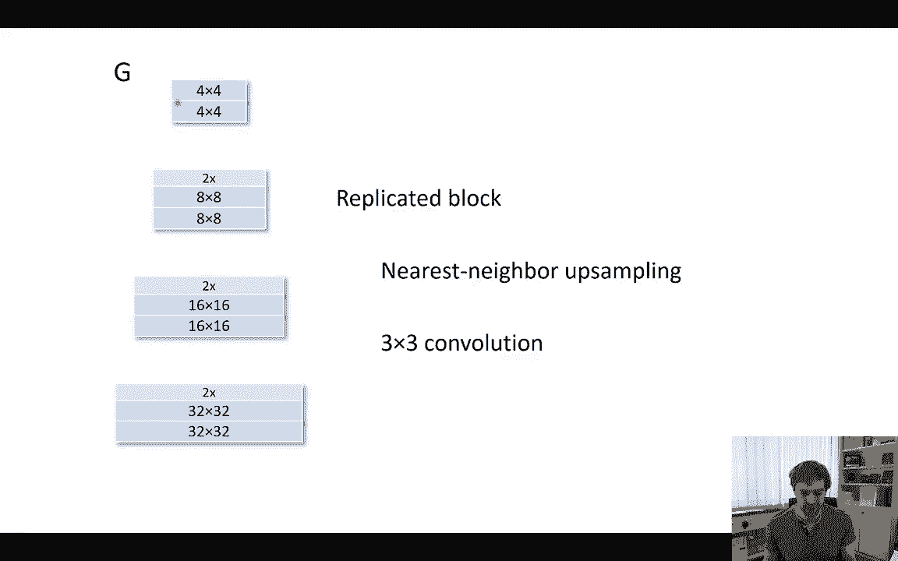

Into an R T image。And now this RTB image is the output of the generator at this 4x4 resolution。

Now the advantage of that is when you're now appending the next block。

 you're simply doing an upseling here and having the8 by8 blocks here。

 but now you're not taking the RGB values here or the assemble。

 but rather you're taking the features of this 4x4 block that you assemble and then again once you have here feature map you're doing another two RGB operator and you're getting the 8 by8 image。

So the quality is you actually can maintain the feature maps here。

 but you can still have a two RGB operator that gets you at the current resolution to the RGB image right and you do this before you do it for8 by8 and so on you just do it all the way down in this multiscale hierarchy。

The second thing what you're doing now is， let's say we trained this party here first。

 the four by four part， and we are pending like this party here afterwards。

This would be a very rapid change， right， and the problem would be。

That suddenly you're getting a whole new loss and this whole new loss is going to potentially destabilize your training process。

So what these guys are doing， they're suggesting oh， let's do a linear crossph。

 so we don't just have like a hard transition here。

 but we have a linear crossf between how to take the losses from here and how to take the losses from here and then you just gradually you gradually include this part for training basically right so this helps you a lot because then it's not like oh now suddenly you have like another layer and we kind of make the training very unstable。

 but like the step by step you're getting more weight to the higher resolution。And anyway。

 and then you basically you continue that right， you go to the next level。

 go to the next level and so on。The discriminator trained in the exact is doing exact same thing right。

 and the discriminator just you have a from RGV operator that basically takes this image again。

 goes to an 8 by8 feature map。Downs it4 by four and so on right but same idea so there's two key concepts you can just append another layer to the you can just generate an RGB image and then absent the RGB image。

 but rather than that you want to take the feature maps。And the second thing is。

 you actually want to go ahead and。Yeah， you actually to want to go ahead and do this linear crossph that makes like a smooth transition right you have a linear blending function basically between the two levels。

Yeah， that's the core idea， but the principle of again is still very similar to before。

And the nice thing is with that now， you can train it and you have a relatively stable process to produce。

😊，Higher resolution results or relatively high resolution results。

So let's have a look at the training process here。😊。

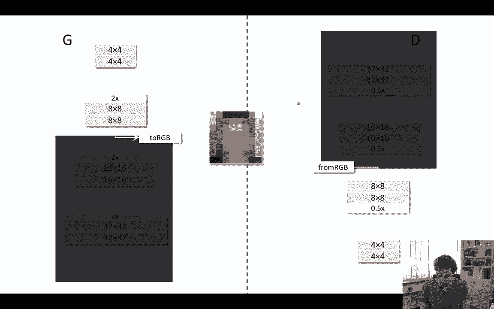

This is the the training process that is being visualized here So here we have yeah we have the progressiveive growing shown on the right hand side and here we have the final resolution as the output right So here we see it's still relatively low resolution now comes the next level。

Now comes another level， and so on。And you see it's you know it's getting sharper and sharper and sharper training process is a little bit funky。

 but as you continue training， it gets better and better and this is an output here about the 34 hours。

 35 hours of training， you have to be aware this is an network they trained I think on a DTX which is an HGPU high end machine。

 so that's actually quite some computational effort behind it in order to produce these results。

But you can already see well， I mean， the results here， they look actually pretty decent right。

 sure you have some artifacts like here。But globally speaking， you actually you're getting very。

 very， very good results here。What is interesting， once you have trained that network。

The really cool thing is you have this manifold that you've got right。

 so you can go from latent space to an image。And what's fun about it is when you're training again and you train it successfully。

 you can take this latent space and interpolate in this lant space in order to you know kind of do all kind of funky operations and this is what these guys have been doing here too。

😊，So they do。1024 times 1024 resolutions output， and now they do linear interpos in the latent space。

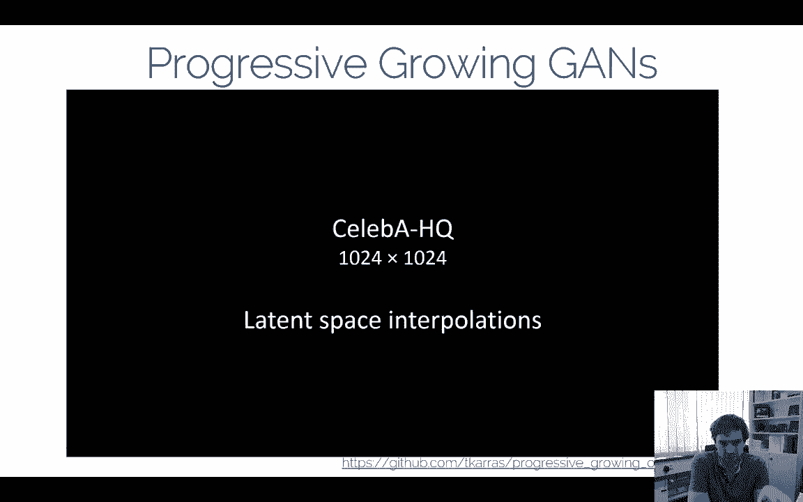

And it's kind of funny like how the transitions between one and another image。Happens here。

 but again， these are simply take a bunch of random vectors right and then like interlate and traverse the latent space here and it's kind of mesmerizing how things transition between the different between the different photos of people you can also see of course not everything is perfect So you see for instance here when you look at the hair like this part on the side is always always a bit tricky like how they grow hair and so on。

 how the mouth changes right。😊。

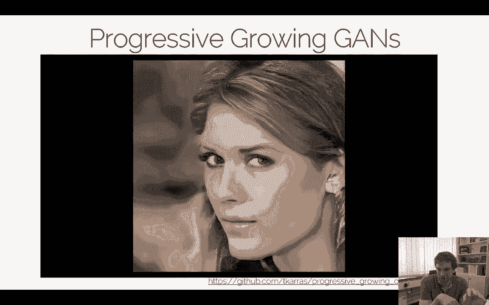

But it's pretty impressive compared to all the previous scanned papers we have seen。

 this is one of the papers that， you know， showed really viable results at a higher resolution that most other papers have been showing before。

 admittedmittedly， they did use a lot of GPs。😊，But I think the results look pretty stunning。

 so I mean I'm a big fan of this paper because it also has a nice kind of intuition behind it like they use this multiscale training right and they can grow the network and can do this kind of classical multi scale optimization what people typically use。

All right。So I wanted to show you a couple of these results just to see what is possible with currentgans。

Of course， we can't cover all the G papers right now in this lecture。

There's a lot of variations right What I would like you to understand is a bit more is like what are the trends right。

 what can you do。There's， there's a lot of different things in terms of the loss functions， and。

The one thing is， I don't think the loss functions make the biggest difference。 I mean。

 most people still use a heuristic loss or a wasachestein loss。

 These are the two kind of dominant losses that have so far emerged， I think。But yeah。

 there's a lot of papers that do different losses， but in practice。

 I think they don't make such a big difference。The big challenge is still that the GNs are really hard to evaluate right and mean of course。

 if you see a results like this one from the progressive G。You're going to get pretty。

It's pretty impressive， right， it's like this is what an AI can generate today， it's not too bad。And。

One of the big challenges that is always hidden in research papers is there's， of course。

 a lot of engineering that went into the respective hyperparrameterid optimization。

And I wanted to say a few things about that one is basically， for instance。

 the progressive game paper， they proposed this nice theoretically progressive growing and at this time they produced the best results。

😊，嗯。But one thing is also clear， right， They spend a lot of engineering efforts， for instance。

 on the data。 They created a new data set just specifically， you know。

 to make the training work here。 And by new data， you have to basically make sure that the images are all relatively aligned。

 that the nose and the eye regions are relatively aligned they have a specific procedure how to generate the data and so on。

 So there's a lot of data engineering also going into that in order to produce good results。

 And that is a very。😊，A very， very important thing that is worthwhile looking at。嗯。😊，Of course。

 when you're reading a research paper， one thing I would like you to do is be a bit cautious about it like what made the big breakthrough happen and there was a pretty funny paper actually this was from Google Brain and what these guys said is basically well the papers called agans are create equal and what they did is they just ran an evolution on a bunch of different G methods and what they found is the loss functions。

 design choices and stuff like that。😊，Didn't matter too much。 So， well。

 to say it a bit more provocative is basically， it didn't really matter what Gny used as long as he knew how to optimize it。

 you always could produce good results。 You know， some were harder to optimize。

 Some were easy to optimize some。More prone to more collapse and stuff like that。

 others were less prone。 But in principle， all these G papers kind of could do the same thing。

 and that us to the interesting question， do we have a fundamental way of training gamess right I did try in the last video in last lecture video Try to tell you a little bit what the Gant tricks are right what people can do But nonetheless。

 I mean we have to be very clear， It is still very， very tricky to train the GNs。😊，And but tricky。

 what that means and practice is often you train it。

 it just collapses and you don't know why or it just doesn't produce better results。

 So you don't know why。 then you change some stuff like learning rate。 It still doesn't get better。

 right That's kind of the thing what happens when I'm saying， oh， it's hard to train。There's again。

 there's a lot of theories now behind it， but practically it's still very。

 very difficult to train gamess。Good， so I hope I gave you a reasonable overview view of you what current Gs are and kind of the high level trends of G architectures。

The one thing what we have been doing now is we have been always assuming we have a fully generative model。

 meaning that we have a la vector Z and from this La vector Z we want to create an image we have only focused on the image domain with a later focus on other things but the one thing I would like to talk about right now is the conditional case。

Conditional generative adversarial networks， This doesn't count only for GNS。 In principle。

 you want to have a conditional case for all generative models because you would like to have some control of the input right。

 I just don't want to have a single latent vector Z that is just give me random variable。 Tell me oh。

 here is a great image。That's not so interesting， but what's more interesting is if you can actually use these GNs for real world applications。

And there's modelling applications such as give me a sketch， make a real limit out of it。 All right。

 add semantic meaning to the manifold， generate me specific faces that smile at laugh， that。

 you know， have a certain appearance， certain shadow or certain reflection， stuff like that。

 And I think without these kind of additional controls。😊，The GNs are not so useful。

 so we have to figure out how to input that in order to make them useful for their respective purposes。

And this is what conditionalgans are So the big question is how do we make them conditional？😊。

The second thing is domain transfer for instance you have like labels you want to transfer that's very relevant for training standard networks Do transfer is still a very tricky and challenging story we have to see if you have time in this class over that I want to fit it in or not but that's also a similar thing right if you have images from day and you want to transfer them to the night and then we train a selfdra car it that is also a case where you would want to have a conditional again but for now we want to talk more about modeling things which I think is pretty interesting for you know entertainment industry and stuff like that there is of course a lot of yeah cool things happening。

😊，And in that space， especially in the last few years， we had tremendous progress there。

Now what we have done and I'm basically just reiterating the last lecture is we have training data right and with this training data training a manifold and this manifold means oh。

 give me random vector Z from this random vector Z draw samples and generate images out of it right and this is what the G manifold is giving us so this manifold is kind of spanning ideally it's representing a distribution of real world images and these images are taken from the training set of course they're not all kinds of real world images this is only the domain we did fit or we did put into our in our training set。

Yeah， what we haven't done so far is we haven't thought about what do any of the variables in Z。

 how do they impact the image generation process？We saw a little bit in the progressive growing Gs。

 right when you do this gain iniplation， you go from one image to another image。

You get different images in between， you get these transitions。

 but there's no semantic meaning yet behind it， right， There's no like oh。Yeah， I wantna。

 I want to generate a person with blonde hair。 I want to generate a person with longer hair。

 I want to change the gender and stuff like that， right， These kind of things。

They are probably somewhere in this manifold maybe。

 but we never explicitly enforce them if they are there。

 they have been there because of the data distributions and they also never leveraged it so far。

 so we didn't try to force it， oh， make this hair blond or something。

But what we love to do is something like that actually， right， we would love to go ahead and say。

 oh yeah， we're gonna have manifold， we're gonna have latent codes， we have ABC。

 so we have we have images here instead set of images with sunglasses we have。😊。

Male images without sunglas and appear female images。嗯。With outside sunglasses。 and ideally。

 we would like to do some sort of latent space vector arithmetic， which is kind of， you know。

 we have kind of， oh， we know there's some semantic meaning in the image。

 we just don't quite know how to express it。 But if we said， oh。

 we want to have this type of image with sunglasses。嗯。L which is a right。

 so we want to have sunglasses。 We subtract male from it， so we make it kind of neutral。

 and then we add the female face to it。 We would like to get。😊，You know。

 female faced with sunglass out of it。That's kind of the high level idea。You can already see。

 well the result here looks O。I should say again， this is a little bit of an older paper。

 I'm not talking about high quality manifolds here right Again， you could argue oh。

 if we had a better manifold， we trained as long as we would probably get higher quality outputs。

 but in fact， this manifold training is pretty difficult when we want to add these kind of arithmetic operators。

 semantic operations and so on so。😊，Yeah， that is unfortunately a very， very tricky problem。

 but it's also super interesting right， if you're saying， oh。

 we have kind of all this manipulation efforts like what Photoshop was doing by hand， right。

 we could kind of do by just saying， oh， we take a little bit of that image a little bit of that image and then we get a photoistic output。

😊，And here we see yeah another example again manifold right here we see basically oh。

 we can get images with and without sunglasses by that right so we can take these tricks to get some results here。

😊，Yeah if you're going further， I already mentioned this part in the progressive GNs when we do latent space interpolation right so what we can do is we have la code Z0 we have a latent code Z1 and we just linearly interpolate between that lant code and generate all the images in between that was what they have been doing when they interpolate between the faces together。

And it's just the linearippolation， so you just have Z0。

 Z1 right and you just do this linear manipulationippolation and you can generate all the intermediate images of output。

Now for semantics， this is kind of interesting already because if I have something attached to this one right。

 and if I have some labels attached to this one， I know how to interpolate between the labels。

If you're getting good intermediate results。😊，That will depend on the manifold right this depends how you trained it and so on so that's still yeah。

 you can ignore it of course。That's what these guys have me doing here， they get something。

 but you see already oh okay。There's not too much control in it yet right Also again。

 the quality here is still relatively low。 This was a paper from 2015。

 This was from the Redford table this very popular paper if you don't know it， have a look。And。Yeah。

 the quality is not so high again you could argue if you have like progressive growing and these kind of things you will get better results。

 but for simplicity what's interesting to us right now is how can we deal with these la codes This is one thing you can do in diplomaations。

But still at this point we still don't have any conditioning right we generate stuff from a random code。

 but we' the generator doesn't know about anything we want to tell them。

 the only thing we want to do is we want to say oh， here's a late go produce an image。Now。

 conditional GNs， in a sense， what we would love to do， instead of having a random code。

 we would like to take some conditionless input。So let's say if we want to take an input image of a cat here。

 there is a sketch， I would love to use a generator that generates an output image。

And that isri and tells me hey， this is a real image you're done great。

 So but what I would love to do is I would love to have some correlation between what I put in and what I generators output right So in other words。

 in this case I would have to have to sketches of the hat。😊，And I would like to get the cat。

 the real world image of the cat as an output。And yeah。

 that's what the conditional gang should do for us。

you could design an architecture like that which is relatively straightforward we could go ahead and say well we're feeding in this image。

 maybe have an encoder first， we get a latent space out of that one and then we have decoder which is our generator right that generates a real open image and then we have a discriminator that tells me is is a real image on it right？

So I can design a network like that and you can train the network like that in practice what you will get is。

😊，You will run into a simple problem。And the simple problem is this discriminator here。

Just tells you， is it a real cat or not。It doesn't tell you any correlation to this one here。

 So if my generator now decides， I'm going generate。A different output image。

My discriminator would still say it's a real image， which is great。However， the output image is real。

 but it doesn't have anything to do with the input。😊。

So you can try this very simple case here in this case you will quickly realize that this input is pretty much being ignored it's just being used to create like a random initialization or a random vector Z but the semantics or the content here will most likely be ignored because the discriminator doesn't know about this input image right so that's a challenge by you can't just design a conditional ga like that you can't just go ahead and say oh。

 we don't even take this as input here the generator and then generate an output because there's no guarantee that these two things have anything to do with each other。

😊，So I'm going to start with one of the first verbs in that space and。This is still very relevant。

 even though it was trained on a very simple manifold。😊，And the idea is。

What we would love to do is we would like to take a photo， and。We would love to figure out。

A latent space Z by basically project this photo onto the manifold that we have learned with again。

This is called an eye game paper interactiveactive GNs it wasn't this is still a very popular paper。

 it was published in 2016 and this photo here。Can be projected onto the manifold by saying， oh。

 what is the lant code Z the best， best expressed this image。

This is an operation by the way we'll talk about right now a little bit and in in though this was published in 2016。

 this is still super relevant today， this is what a lot of people do right now for manipulating latent spaces and so on。

😊，But the idea is， well， if you could do that， I could go ahead and do some editing here， right？

And I can basically modify the shoe size in this case and stuff like that I can you know do latent space andation editing and then what I could do is I could basically figure out。

 oh， what did I change here in image space and I'm going to yeah repro this editor transfer the original image。

😊，What's I mean， the reason why they do like this reproion here is because at this point they didn't have strong manifold here to produce photoalistic results I mean。

 I want to talk about more about this step here This step is more interesting right now I mean sure you can back project the two and can use these basically you can figure out like some sort of analogy right。

 How was this image edited， is just edited in the same way and you can formulate this as a non nonlinear optimization probe I'll mention it briefly。

 but that's not the main part， I want to focus on this part here。

 I want to focus on how do we take an original photo。

 how do we project it on the manifold and this is a very interesting operator because the question what we have now is we have a real image X。

😊，We have a pretrained G。 So the manifold is fixed right now。 right。

 I'm not training the G G is again is G is given to me。

 I have trained again from a random variable Z that produces a certain output， right？

 What you want to do is you want to go ahead and say， give me for this waterfall image。😊。

Give me the la code Z。And the way you can do this is you can formulate as an optimization so you can say。

 well。Let's say we have a reconstruction loss L here。We have a generative model G。

 we have a random vector Z。 This is our optimization variable。 This is what were try to find。

 and this is our real image。So I would like to figure out find a generated image that is close to my query image。

Find the respective or the optimal Z for that Again， this is the generative model pretrained。

 I'm not trying the generative model here and then I have a reconstruction loss。

 which is you know an L1 loss also an L2 loss， whatever you want to use I'm not arguing this is the best loss here。

 but this is just something you can use for the false simplicity And again this is an optimization that tries to minimize tries to find a Z that minimizes the distance between the generated image and the query image。

😊，And this is what this one is doing here right so I'm feeling in this waterfall here。

 I'm optimizing this is a I don't know it goes new an optimizer or so whatever they used and you're going to get a la code Z and if you generated the image with Z you're going to get an image that looks like that and I think these ones are the distance metric so this is like 0。

196 away from the original image。😊，Same thing， very image。

Generine target query image generate target and this is kind of cool right So now we have a pretrain network and what we can do is we can find with an optimization procedure we can try to find what is the closest query image what is the best optimal Z and project this image under the manifold right。

😊，Yeah， it turns out neural networks are quite highly nonlinear， well this is a thing， of course。

 by design choice， but it turns out this optimization here is actually very much nonlinear。😊，And。

Whenever we have optimizations are' nonlinear and we don't know how to solve them properly because you could argue well these ones don't look so similar。

 maybe we didn't find the right global optimum here。

 maybe we can find a better optimization procedure。

 well we could think about making the optimization better or we could do the naive thing and say oh。

 we don't use an optimization at all anymore we just train a neural network does the same job for us。

😊，And this is the alternative way。In this case， what you want to do is you would like to train a neural network P and this network P takes the input image and predicts a lant vector Z。

Right。嗯。Well， how do you get that？ Well， you in fact。

 can just generate the train data for free for you because originally when you train your manifold。

You you basically or when you have lant variable Z right。

 you know the ground truthth pairs because so this network is easy to train because all you're doing is you're feeding in random random variable Z generating some stuff as output and then what you're training is you're training the opposite network through inverting the network and saying。

 oh now for this Z， what was the sorry for this X， what is the Z you fit in。

And I can train an a if I have a pre traineded network。嗯。A pret can network。

 I can generate this training pairs pretty much for free， right I just feed in random variables Z。

 random random random random， generate images， and then I'm training a network that takes the images and produces the respective these。

As output， right， so I have z is the ground truth for my giving input X， right？嗯。

And these two things do the same thing， right？And in this case。

 what we're doing then is instead of using this optimization。😊。

What we're doing is we' using this network to do that for us。

 so were feeding in the network here that produces the Z and then we' just generating the respective output。

 right？In this case， we're getting resolved that look like these ones。😊，哎呀。

This one is it's a simple auto encodeder with a fixed decoder G right when you train it like the G is fixed。

嗯。That's the thing， like you're training the whole thing then and that's very straightforward。

And now what you can do is you can just take the image X here again， get a Z as output。

 and you're going to get some target here and you see already if you do that。

 you're getting kind of similarish results。Sometimes looks a bit better。

 sometimes looks a little bit worse and you see it the distances here are also felt relatively relatively similar。

 so we didn't necessarily get better results here， but we got an alternative way and if you're doing these two things you will see that the Z and the Z you would get here theyre actually quite different so even though they produce similar results you're still getting different Z's。

😊，So what they have done then is said， well， you know。

 inverting the network gets you kind of into the right local minima and then you do a fine tuning optimization after it。

And this is kind of this high hybrid method。 So you say use the network as an initialitization。

 use this one first， and then follow up by the optimization。 And if you do that。

 you get actually quite better results。 right， You see now the error goes a little bit down from like。

0。196 to 0。153 here， and you see the images match it a little bit better。嗯。

I'm not arguing right now like how to weight this and how to precisely train this network here。

 but the key things I feel that are worthwhile remembering here is there's two options we can go ahead and say give me an image in a fixed manifold that is pretrained I can optimize foruzz Z with a standard classical optimization approach I can also train a network that does the same thing by taking the data that I generated beforehand。

And I can also combine these two things right， and this kind of gives you a bunch of tool sets。

 how to go from one to the respective other， right？Okay。

 and I think this this part I feel is like super cool because now we can go ahead and we can we can basically do。

 yeah， we can project things on the manifold。 And this is what this editing operator is doing now。

 And yeah， I found this pretty cool because now we can go ahead and use sketches to find lant variables Z that merge to the sketches right so。

😊，So let's have a look。 We have here some sketches that we're going to do now。

 This is our guidance quote unqu。😊，And we then get let code Z from that。And that produces our。

And our respective image。The term here for the optimization is a little bit modified here in this case what we are saying is well we have a generator we have the user guidance here。

 this is the guidance the guidance vector this is our sketch。

 we'll see this in a second what this means。😊，We have here our generative model right。

 we have here some loss that compares these two images together， whatever we generated。

 and whatever we compared here。And。This is our data terms so we want to make sure that whatever we're generating is close to what we have fedest input and now there's a manifold smoothness term saying that oh。

 you initialize this whole thing with a C0， let's say this is our initial vector that we used and then we making some edits so we don't boly jump back and forth in the manifold space but we saying oh stay relatively close to the original image and just do some local edits there So we have a smooth traveral of the manifold right Yeah this is our constrained violation loss but now what we can do is we can have these guide strength right now we can have oh I'm going go ahead and do some drawing。

😊，More drawing here， right， more drawing here， more drawing here， more drawing here。

 more drawing here。 And basically this is what you're getting as an output here。

 So you're still producing shoes by producing shoes， our sketches don't look like it。 well。

 because our。Yeah， our pre trained manifold is basically trained on shoes。

 so whatever we're feeding in here is going to produce shoes。But。

The manifold protection that we're doing with this optimization will now find like edits thatvo best reflect according to this loss function here what we're doing in terms of edits this loss function here I mentioned it you could take an L1 loss you could take an L2 loss you could also use feature losses like Lnet features and stuff like that there's a couple of variations I'm not arguing for one of the other but I think what's cool about it is that with these sketchs you can now get this protection to the late space Z and then you can do the edits。

Yeah， I think this is very fascinating and this is a thing that。Again。

 this is a paper that has been published in 2016， but there's actually papers nowadays where they just use the exact same strategy。

 but they may be using a bit of better manifold they trained， right？

So that's something I feel that is like super cool， super interesting。Okay yeah， this paper。

 this is the interesting thing I feel this paper also this other thing what I mentioned they go then oh they're learning these transitions here。

 so they're doing basically if I go quickly back， they're doing this part of the user interaction right and then what they do is they project they're trying to form a nonlinear optimization because they say。

 oh well these G generated edits， they're not looking perfect but what you can do is you can learn how these things edited。

😊，And you can formula an optimization problem to protect these edits here on top of the original images now I'm not well I maybe explaining very briefly but the ideas is relatively easy。

 So there' like this integral it's going to be disctized， of course we're going to say。Well。

 this is our input image that we want to manipulate， this is what our again gives us。

 this is our target in the latent Space Z， these are our latent ins。

Could be an edit could be also linear nelation for simplicity。

 this is a linear manipulationlation and now the idea is that how was this guy here edited to here。

 we just want to do the same edit to here right and again。

Same edit from here to here right we want to do from here to here and so on and we're just gonna continue with through it and the way these these edits like these arrows here are being optimized with this term here So there's a color regularization term meaning that oh the color should behave similarly there's a spatial regularization term saying that this should be the distortion should be similar and then it's the data term that says oh。

 the edits you're applying from here to here had an operator that should be applied in the same way from here to。

Again， this is maybe not the core of the learning part right now。

 but you can see how you can kind of clearly combine learning techniques on this end and then you would also be able to reproject them to the actual edits but again I want to say this in my opinion is still an artifact that the G results here are not so perfect at this point if we had perfect results here at this point we could go ahead。

Didn't need this step because everything here would be already photoistic This is actually our main final goal as a community you not quite a right still like it's still tricky。

 but that's our final goal at the end of the day。😊，But nonetheless。

 I think this paper was really cool and it's still really cool because they they did this manifold project。

 This is something I really liked about this paper。 So they have these user edit here， right。

 They have these sketches， and then they can generate various images here as output。 Yeah。

 and the nice thing is also this， this kind of stuff work interactively。😊。

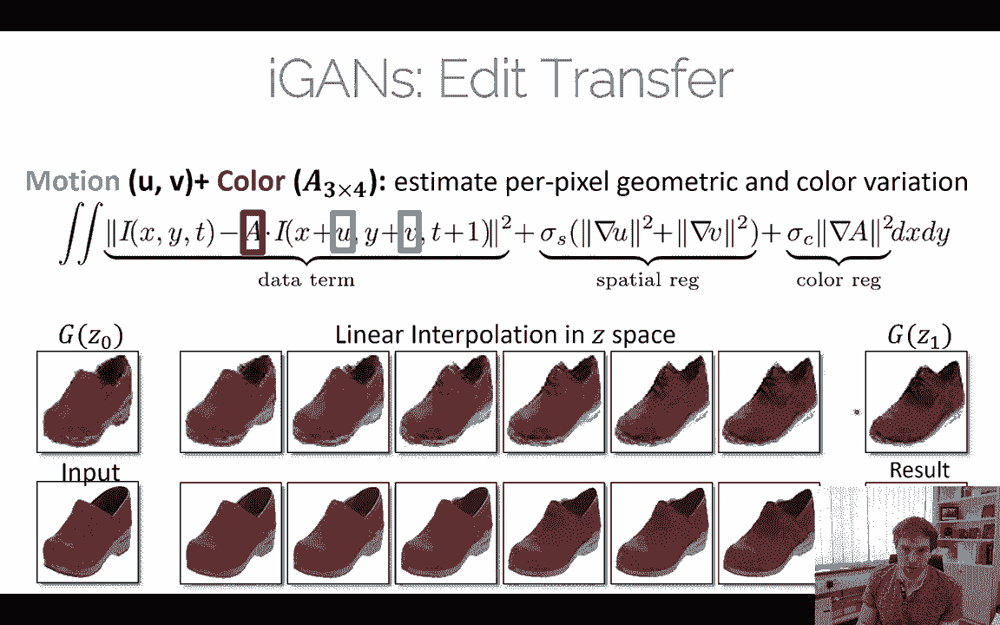

And so， you know， they had a live demo， which kind of would cool。

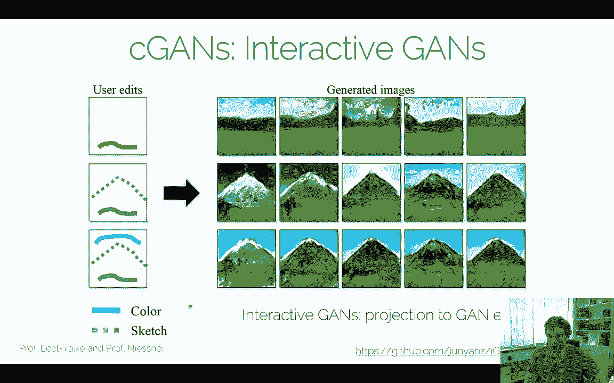

Yeah here's another example， here's again original inputs。

 here's the reconstruction via optimization， this projection what I just mentioned。

 this is via the network and this is the hybrid one。😊，They look similar in a sense。

But the hybrid one consistently give lower error that's why they used it at the end of the day。

Good yeah， let's have a look at the interactive part again。 This was。

 I think something I liked a lot。 So what they did now is they have this user interface right they have some sketches here And here you see the intermediate result that the networks would do right and now you can go ahead and inter between the source and the target with with the optimization。

 This is what the network is doing and this what they see here is then the reproion with this optimization。

😊。

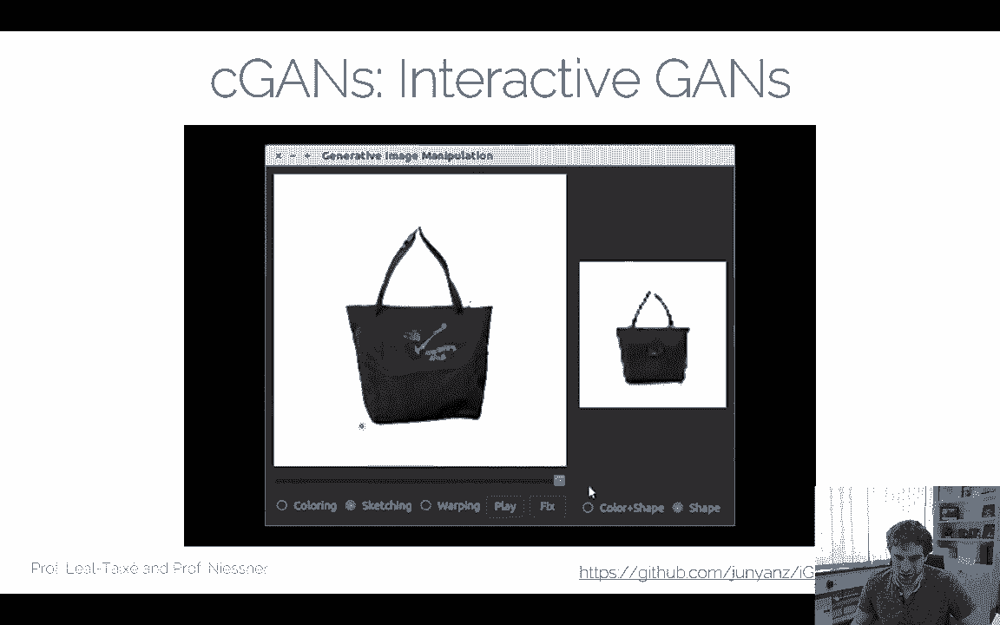

So pretty cool was done 2016 quite a while ago in modern ages， that's already an eternity but。😊。

These these concepts still exist right so this idea of protecting back to the latent space is still super。

 super relevant today and we will use it later on and I'll show you a couple of examples with things like progressive GNs and so on。

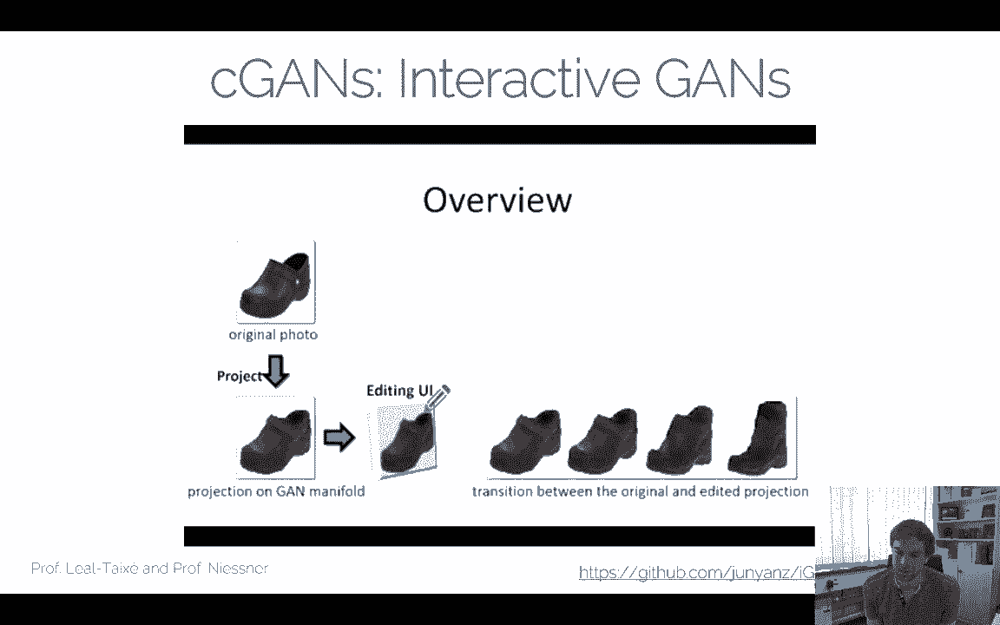

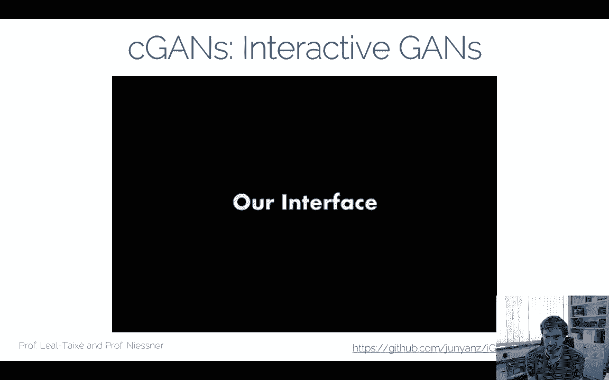

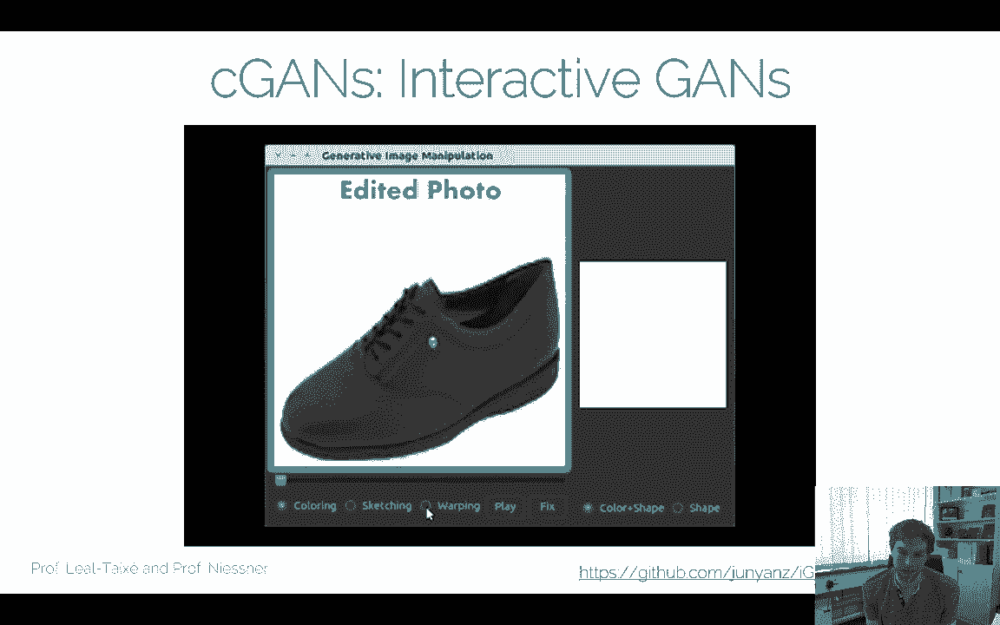

Good， I should mention， though。Like mapping in lant space is very difficult。

So what we have been doing right now is we ignored conveniently the problem of semantics and。😊。

We basically went ahead and said， oh， I have an image。 I first used that image to project the code。

 and then I used that for editing right So I'm kind of I circumvented this problem of oh。

 this conditional G problem。 I't I didn't train a conditional G yet。

 right it's just I circumvented it by traversing the manifold。

And that the problem right now is still that in the latent space， we still don't have any semantics。

 right。The pose for instance， the presence of the glass and stuff like that there was a pretty cool paper info again。

 you should have a look at it they're kind of proposing how you can learn this in a very efficient way if you don't have labels for instance。

😊，Yeah in most cases you don't have labels available that's a big problem so you need some sort of unsupervised disentanglement of the representation and the way you do this in practice is you just do some clustering that's what we always do already if you don't have data we do some clustering traditionally we've always done it with a PCA yeah nowadays you would use an order encoder or something like that and then say oh what are youia clusters in your latent spaces and so on。

😊，RightBut yeah， nonetheless， mapping semantics to the latent space is very。

 very tricky and yeah still an unsolved problem， of course。Okay。

 but I'm going to quickly discuss that part a little bit。 the labels labels is a big problem。

 of course， and there's no difference in the conditional case because。😊。

We have kind of these two settings now， we have settings where we do have paired data and we do have unpaired data。

And this is this terminology of paired versus unpaired is something you might want to remember in the paired setting。

 we could go ahead and train like a network that maps me from this cat to that cat。

We have the sketches and the cat image。 this is a pair。Right。

 and we have all kind of pairs here between the sketches and the images。

Theres also an unpaired version， but we don't have that if you have horses in zebras。

 this is an unpaired setting。And。Most of the time we're in the setting actually but often we can make shortcuts and kind of fall back to the paired setting so if we have paired data a lot of things get easier but often we don't have it in the following I would like to take yeah I would like to present two of the methods that people have been doing for either cases so I wanted to look at the paired setting first a big question is how do we get to the paired setting。

A parent setting means yeah， I know， like how do I， how do I， how do I know when I have a sketch。

 how do I get to the cat？RightDo I do I have to draw a sketch and then go to the internet and search the real ver image Yeah no of course not you would do it the other way around right I'm gonna go ahead and start the cat。

 start the filter that gives me the edges right That's how you do it and paired settings for the most time doesn't mean that we annotated them manually paired settings for the most time means that we can in a selfsvised way in further labels。

嗯。Most time， not always。 I wanted to show a couple of examples。 And this is a paper。

 This is this ps to Ps paper， image to image translation。 This is a paper that。

Precisely focuses on the parent setting， right， they want to consider specifically these cases。And。

Yeah， they have a couple of examples actually they have quite a comprehensive set of samples here and what they do is they have labels they have image generation measures that go from labels to scenes。

NowIn this case， they。Take semantic labels on cityscapes there's a data right and they're turning a network to turn this one into that one in this case they have actual annotations so there's people that have annotated cityscapes they have semantic labels for it and yeah there's basically a one to one mapping between those two。

😊，And there's other things like aerial mapps。 This is from Google Maps here you're gonna to have the satellite photos versus the you know the abstractions from the maps visualizer here you have it implicitly given because at some point probably Google Maps also has a method that goes from a satellite image and produces these ones So for that one。

 we have a lot of free data available right this is also free。😊，嗯。Da night images。 in this case。

 you have to make sure you have the cameras are being aligned。 So the images taking the same stuff。

 And then you have one to one maps and you just take the images a different time。

 Black and white is grayscale images right， and color image is super easy。

 I'm just gonna take a color image。 I'm gonna convert it to gray scale。 I have these pairs。

 And then I can train a network that goes from gray scale to the other side。

 sketches we mentioned right， you take typically that one has input。

 you convert it to a sketch this way per。 the other way runs a bit harder。😊，Okay。

 but let's have a look at this one here。Yeah， I wanted to go back to this case。

 what we discussed before， how would we train these conditional networks here？

And if you're looking at the traditional formulation but Godfe right。

 we have in here what we're trying to do， we have a discriminator。

 we have a generator trying to maximize a discriminator and minimize the generator right so these two they fight each other。

😊，We have a binary cross entropy loss right again we want to make sure our generator here produces stuff that he thinks is speeding the discriminator and the discriminator wants to make sure he' is always right right that these are the two things that come fight each other we've done this for random variable Z we've fed this into a generator。

 got an image out of it， have a discriminator discrimin tells us it real isn not real。Again。

 this one gives us a manifold and we've discussed like manifold traersal and stuff like this。

 but the problem what we had is， well， when we are feeding in here。😊，Okay。

 so same formulation here when we're feeding in here。

 this sketch of a bag have a generator that takes this maybe through an encoding as input。

Generates a real output here， discriminator says it's real effect say it's real we're going to have this issue that no matter what we generate here each of these ones will be true right and the reason is the discriminator just checks just whatever we're doing here as an output is that part of our distribution right。

😊，Of the real distribution。 But the discrimator doesn't care about whatever you're feeding in here。

 So in other words， if you're training this。The generator eventually will maybe use that for random seed。

 but not it will not cover the ets or semantics or whatsoever， right。

 Well why would you wouldn't want to do that？Okay， the core idea is that the core problem here is that this discrimator doesn't know about this guy。

This is something we have to fix and the easiest way to fix it。

 we just make the discriminator aware of it。😊，And that's what we're gonna do now。

 We're gonna take this input， and we have two images。 now。

 One is what we generate here with our generator and what we have。What we have fed as input。

And now we have the discriminator takes the pair here' input， this is why it's a pair setting by way。

 this is where the term comes from。 Now we have a pair between the sketch and the generated output。😊。

And。The discriminator needs to decide， is this pair？Good together or not。

 it's not just is that a real image， but it's also。

 is it a real pair that would exist in the training set？In this case。

 well this is what our fake pair right this is our fake pair。

 our discriminator takes now x is the image， sorry x is the conditional image。

 x is the conditioning and G what we generate in this pair。

 both of them is fed into the discriminator。😊，嗯。Yeah。

 this is the fake pair and of course we have a real pair here too。

 and this is why we need ground truth here。 This is why we need the paired ground truth data。

 what we've previously discussed right The discriminator now needs to get both X and Y S input。😊。

Drimator checks is this real of course， but it also checks， is it belonging to that sketch here。

 these two things need to work because our generator doesn't do anything here。

 this one will be of course true this is always a real one。

 but this case we want to make sure that we're generating something that matches to this one here。

Yeah and now what our G is learning this is now a true conditional again because it's conditioned on x and it wants to generate something that matches to x right in this case we want to match the joint distribution right we want to make sure that the distribution of real pairs matches the pairs what we are just generating。

Okay， yeah， that's the the whole idea。 basically。 But very importantly。

 we need to make sure that the discriminator is aware of。Of these pairs， right。

 that the conditioning needs to be fed into the discriminator， otherwise。

Theres no way of making sure that our pairs whatll be generating are actually real person or good person。

And this is what this pixel top paper is doing and I think again this is a very important paper because they introduced this concept of conditioning the discriminator with it right。

 and what we're doing here is again we have here X is our conditioning。

 we have a generator practically generates the encode a decoder architecture。

 takes this image here as input， goes to latest space， goes back to decoder。

 generates something as output。This one is just being forwarded。

 Discriminator takes these two hair input and has a binary cross entropy is it real always This one is typically an encode architecture of course right and it's just a classifier。

Again， we have to make sure it's scminated and generally roughly the same size。

 but in this case we compared against a real world pair。

 so we have here Y and X are being compared to each other。这。

Yeah so I think this is really cool and this is of course now the first time where we're training a manifold that is conditioned on pairs in this case we have this paired setting right so what we need we need these pairs in the ground truth data this is what we need for training we need these pairs for images to edges yeah there's this data set by she2。

😊，Basically you have these pairs that's what they trained it on practically what you do is you would start here from the image generate the edges that when you can probably do algorithmically or you hire a bunch of artists that would do like sketching for that both as an option ideally you want to do selfsvis you don't want to hand annotate it right。

Okay， this one goes from edges to images。嗯。Yeah， the pair setting is kind of a very popular one。

 It's great when we have free data I like to call it self supervised in practice the paired setting is always self supervised right you really want to want to annotate like a specific setting but yeah。

 think about these settings I think this is cool I think this one we've just shown you right the sketches to images。

😊，That's an easy one， there's a couple of data sets like these。嗯。Yeah。

 anyway there's many of these ones and the selfsupvised case I mentioned like gray scaled like and white and stuff like this is interesting。

 there's a cool there's a cool demo actually you should go to this website a find layer do co Ps S are we and here you can basically go ahead and do your sketches run Ps to picks that just wrap the Ps to picks model and then you get exam outputs right here you have a cat。

 the model is random cats on cat pairs， you're gonna get this as output。😊。

You can try pretty cool things。And looks like that you can try yeah， to have arbitrary shapes here。

 your p to pixel model will try to fit these arbitrary shapes in here。😊，I think it's cool。

 I think you can play around with it。 This is an interactive demo you can just go to the website and try it out yourself。

😊，Yeah looks like that right you first draw the cat you get this as an output you can get pretty funky shapes if you're doing various things I have tried the two in the previous lectures I did this live my drawing skills are pretty bad but I think you should try it out it's kind of fun to do it。

😊，Okay， this is fors to ets to cats right this was a model that was trained specifically in cats there's models sell civilvised data from Google I mentioned that you can take Google Maps。

 you have the satellite images， you can train models that go from here to here Yeah interestingly enough。

😊，This is the ground truth。One thing you will see very quickly is in these cases。

How do you expect this is an undercontrain problem， I think in practice， right。

 Like you don't really know。Yeah， I don't know。 You don't necessarily know like what are the。

 what are the， what is the ground truth there， but probably multiple multiple solutions that would give you a good image for that input here。

 right。嗯。Looks plausible。With you swimming in， you will see there a lot of artifacts。

 but on the high level， it looks pretty pla。😊，Okay。

 you have the grayscale stuff that when I mentioned input here trend the output。

 you get actually kind of good results but again grayscale is also under constrain。

 you don't know for sure how they really look like。😊，嗯。But yeah I think it looks， pretty cool。

 There's a few ideas behind Ps to pixels I wanted to mention。😊。

And it's not just this conditional again that we've just said in practice。

 what they do is you're training also L1 loss， right？You have a lambda parameter that says。Yeah。

 go from this image， go to this target， this would be an El1 dose。

 typically you have some weight on this one and this weight is actually still a dominant weight。

What you can do is you can actually get rid of the generator at the discriminator loss。

 just have the generator with L1。And then successively make this weight here。

 sorry successively reduce this weight here， right。

 this is one thing that makes ps to picks more constrained and probably that's why it works relatively well。

嗯。They have a unit architecture， they have skip connections to preserve the structure in the generator。

 makes sense for some cases， for other cases you wouldn't want to do it。

 but for these cases we've just seen here it make a lot of sense， like for grayscale images。

 totally makes sense you want to preserve the structure makes sense。

There's a few interesting things about picks to picks。😊，There's no latent variable Z in this case。

 they use dropout for noise， so you just have a dropout variable。

 you run the network multiple times to get different results。One problem。

 what always happens if you train ZGNs， if you're feeling in a vector Z。

 it tends to ignore this random variable， that's what I said already before。

 if you don't have a paired setting and you're just feeling in the sketch and have a generator。

 you will just ignore the input， it's just not going to consider it。Yeah。

 the noise is pretty important here because you still want to have a probabilistic model for many cases。

 not for all cases。 It depends a little bit how constrained your problem is。 if you。

 if you having an overconstrained problem， meaning that theres there's a specific solution you would expect for that for that input。

 But you have things like sketches。Well， or this Google Mapss images， right。

 like there's many solutions that are probably okay。 So in this case。

 you always want to have a probabilistic model。 Otherwise。

 your network will just take the average right If you just take the average then here。

 but it doesn't look so great， so。Typically， you want to have a probabilistic model here。Yeah。

 Ps to picks had a few other ideas。One of them is that the L1 or L2 laws， in this case。

 the use in L1 loss is good for the low frequency details。And。

Then the idea is that the again kind of locally on a per patch level figures out the high frequency details。

 So what they did is also they introduce a patch scan version。

 So this model that I' just shown you is actually fully convolutional right so both discriminate and generator are fully convolutional The reason why this works is because you don't have a latent vector right so you can whatever input you're feeling in it is the same size as the output So it's fully convolutional only operators but the generator。

Produces basically patches， sorry。The discriminator is basically only being applied to certain patches。

 you have a patch size， like how much the generator discriminator actually sees。😊，嗯。

It won't help you to generate global structure。 But since it's a condition problem。

InThe structure you can simply preserve with an El1 or L2 loss。En with the skip connections。

Because of that， this patch game makes a lot of sense。

And it's a lot easier to train than generating a higher resolution output from scratch。

 you can take a higher solution input， you have the patches and a smaller resolution and again tells you is this a reasonable patch with reasonable amount of detail and stuff？

Yeah。Yeah， I should say。Whenever you're doing a thesis or like guide research or stuff like this or project。

 I would always recommend start with this Pix to Pix code for generative models。

 This is a really clean code base。 These guys spend a lot of effort in making it actually usable。

 This is a very， very popular Github page， I would recommend I always recommend people to start with that。

 this is always a very good baseline， even if though results don't look perfect。

 but it's relatively easy to use。😊，Yeah， there's been a lot of work already on as a follow up one work is Ps to Ps HD now they're saying。

 oh yeah， we're trying to do similar ideas like multi resolution and stuff like that。

 a multi scale on top of Ps to picks， the idea now is you have of course defined generator。

Don't just have a single patch， but go ahead and say go course first and then go into more details。

 same thing for the discriminator The idea is that the generators and discriminators are the same。

But since they operate in different resolutions， they get different receptive fields。Yeah。

 in practice， it looks something like that。 So you have here。

Yeah F generator goes from semantic labels， right？Produces。Some feature maps。At the same time。

You can downsble the import again， have a bunch of resonnet blocks。Produces some feature maps。

 Now you have the decoder that goes to the resulting image at the lower solution。嗯。

These features at the lower resolution are now concateninated to the features of the higher resolution。

 You have a bunch of residual blocks here， and you go up to the original image right So you have kind of a network in a network here。

 like in between the network， we have we have another residual block。

 It's very similar to progressive growing， actually， it's a very similar idea。

 except it's a conditional network now and you have now you have conditions at this level and you have conditions at this level。

 right。😊，So， that is also helping。To make it easier in this case。

 Ps to Ps HDD is using multi scale discriminators in this case they're using three I think this is pretty arbitrary in a sense I think they just did it because that's what they fit best in their GP。

😊，So。Yeah， theres basically。Various combinations of stacking， discriminated and generator。

 I'm not arguing this is the best version， but these guys spend a reasonable effort in getting good results。

 right， so。So there has a lot of optimizations you can still do。

 but it's still similar to this progressive G idea right so you say you have low resolution and then upsemble and go to high resolution There is an interesting question though。

 is basically you' quickly going back。😊，You have。A very interesting thing that a lot of people often don't mention。

 So in a sense， what you do is right you're designing your architecture subject that fits more or less on your GPU。

😊，So now you're having two options， one option is I'm going to say I have a single hierarchy level and I'm going to put all my weights into the single hierarchy level。

The second option is， I have multiple hierarchy levels， but each hierarchy level will have。😊。

A smaller number of weights， because no matter what I have fixed budget of weights or of capacity that I can fit on my GP P。

 the argument is now that by having this multi resolution， a multi scale hierarchy。

 it's more efficient to use the weights。 That's eventually going to be the high level argument we have to make。

And this is what they are showing and it seems pretty reasonable for their setting again。

 they're using three levels they have basically three discriminators。

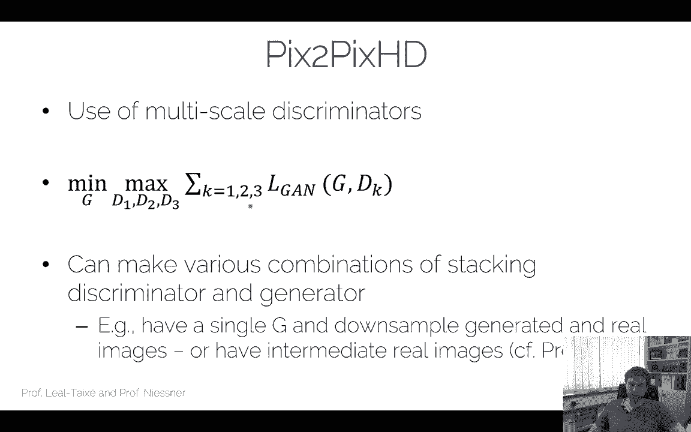

And re generators there， right？Okay， take a results that look like this。

This is a synthesized image already from again， this is cityscapes image。 Yeah。

 looks looks pretty decent， right， I mean， look looks not too bad。From a detail。

 you can't zoom in here， but I think the number of signs are still pretty blurry。

For the better for the first， but you can see thats it's not quite perfect。

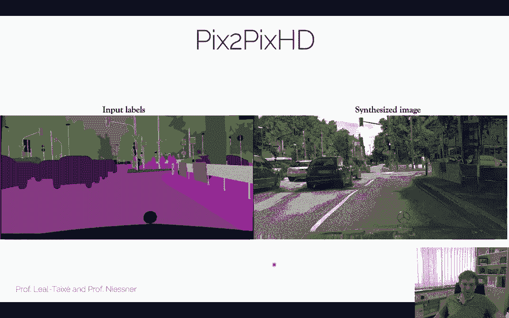

They have done it on faces， so here use a face mask as input right。

 and then they're synthesizing different results for the faces again。

 it doesn't look perfect like the teeth here or so and not perfect。I looks looks pretty。

Here's another example。 this's an interactive one so they running multiple times for the same image right so they're getting。

Different results here。 You can look at the number plates。 It looks kind of fine。 Tex is super hard。

 right， I mean， painted like a lot of small scale detail of of these signs here， right。

 they also it's not perfect， Not perfect， but it's getting there， right， Just give it。

 give it a few more years to be getting better。😊，Yeah， anyway， this is one of the latest papers。

 There's there's a few more papers， of course， but this is one of them like this pixels to pixels line。

 I think is pretty， pretty popular。 and I I can highly recommend looking at that one。😊，Good， so far。

 we have looked at the paired setting。And I already mentioned we need to get the parents， right。

 we need labels and so on。And it is expensive to collect the pairs。 However。

 there's also scenarios where it's virtually impossible to collect pairs。

 So let's say we want to convert our horses intozebras。Right， how does our horse look as zebra， I。

 this is very difficult。 Do you want to go ahead and catch a bunch of horses and paint them in zebra stripes。

Might be difficult to get enough training data like that right， so that's a very difficult problem。😊。

So this leads us to the unpared it。Again picks to picks and these kind of things。

 conditional Gs for paired settings， but now do we do conditional GNs in the unpaired setting？right。

So and that is actually a very common case， but we'll see this later。

 there's a couple of interesting scenarios where this happens。😊。

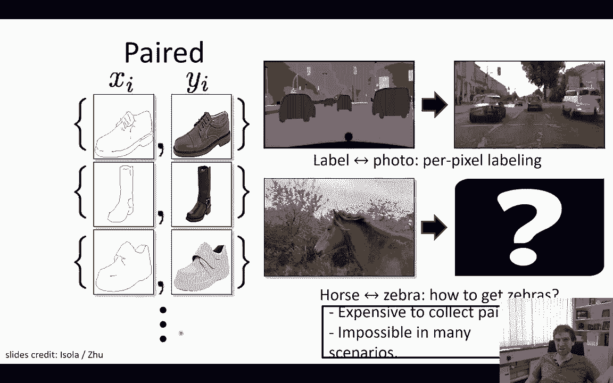

A couple of times。 So in the unpaired setting。You， stuff like that， right。

 You have a bunch of images of of horses。 You have a bunch of images of zebras。

 But between those two， there is no， theres no direct correlation， right。

 I don't know how this horse would look as a zebra。

 I also don't know how this zebra would look as a horse。 Again， I can't paint them so easily。

 I can't go ahead and paint this guy the zebra。So I have a source domain X。

 and I have a target domain Y。I know which one is which。

 but I don't have one to one maps and this is the unpaired setting。So。

How could we formulate a conditional G in the unpaired setting？Well。

 what you can do is let let's do the same thing startna E right let's say we start with an image from the domain X right。

 this is a horse we feeding into a generator。😊，嗯。And then we have all discrimininated right our discriminator takes now this guy here。

 it wants to generate this one year， but it doesn't have the input output prepared right。

 And this one should say real and not real。So what you could do is you could simply go ahead and say。

 oh， let's ignore this part at all again and let's say our generator generates something that sorry our discriminatorator says is this from the Cbra domain I'm just going to go take horse feeding the generator。

Produce anything from the target domain zebra。And the discriminator says， is it fromzebra。

So it's real， we're going to have the same problem what I discussed before in the parent setting already like this in this case。

It's both real， this screen and will say great， both look likey bra us， you're all good to go。

So the again does not force any correlation here between those two。

 same thing what we've discussed with the cats， same thing for horses and zebras， right？

Now the question is how do we figure out there's some correlation between these。

 That is the big question。And well。One idea。 What you could do is you could say， well。

 I have a bunch of horses here。And I train this network that I just described。

The most likely output you would actually get is you would get some odd collapse because everything would map to the same target and everything here would be part of our real domain in the target。

Now， how do we， if we had a way to figure out。To force that this guy here。

If we had a way to figure out to avoid more collapse。In other words。

 if we had a way to say this image， this image and this image should all map to a zebra image。

 but these images must be different。So in other words， we want to have a byche mapping。

 we want to have a mapping that goes from here to one image， this one goes from one image to here。

 this one goes to one image to here， and precisely only one of them goes here。

And the ideas of a pie checkive mapping that we have a month to one map from here to here and from here to here。

 So if we had a piecheive mapping， we could force avoid the mod collapse。

And the idea to do that is a cycle consistency approach。So the idea is we have images from X。

 we have images from y。The idea is that if I map from x to Y。

 I have a discriminator who tells me hey， I'm from Y。

And the idea now is that be taking that same image and mappingping it back。

And this is the original image again。And this is actually a thing that people have been doing for language credit。

 but there's actually this famous approach for Mark Twain right， where you're saying。😊。

If youre translating from language A to language B。You should， and then from B back to A。

 you should get the same result。Right， and this is literally enforcing a byche if mapping if you're doing that。

Right， again， if you're translating from， in this case。

 English to French and then from French back to English。

 you hope that you get the same sentence as output。 If not something went wrong。

 Something got lost in the translation。 Sam thing for the image。 This is image translation。

 but unfairpair。And the way you're doing this。😊，It is the cycleconency loop。

 So what we do is we have again， we have domain x here， horses here。

 We have a generator that maps this guy to zebra。 So this generator takes x this image here's input and produces Y hat。

Gener takes X input produces by head， discriminator here tells us I'm a zebra or not a zebra。Okay。

 so x match to y。 And then what we're doing is we're mapping this one back。

 Now we have another generator， F， I again， note the F and G。At both generators。

This man maps my head back to exit。And then all we're doing is with checking the same input delete the same result of the fitted。

Please case you can just use an L one more right you literally want to have the same image again。

 so again feeding x in， mapping the domain y， mapping back to domain X should give you the same image。

😊，That's the core idea of the cycle consistency。 And it's forcing a by checkive weapon。嗯。

And you don't know necessarily what why was， but the idea is。

 if you're doing this over a large distribution。It forces that note the same image X maps to the same image in y。

In other words， if you're doing this one here again。

 so this is what I mentioned with the mod collapse。So let's say here we have horses here。

They could all map to the zebras。Right， and。If all of them map to the zebras to the same zebra image here。

 right if all of them map to the same thing。I would go back with this F generator and I would get the same image here as output。

Now my cycle loss will tell me， hey， this one looks great， and this image is the same。

But my psychoos will tell me this to this and this to that。They don't look very good， right？

 So we have a bit of a problem here。 This is a high loss。

 And that's good for us because what we want to do is we want to split these apart。 We want to say。

 oh， they cannot map to the same image because if they do that， these losses here will be very high。

 And this is good for us。 Sos consistency makes sure we have a true project mapping。

 or at least we trying to have a true project mapping。😊，Okay。

Yeah we're doing it the other way around two of course， we're doing it in both directions。

 so now if we have a zebra and we're mapping it to a horse with our F generator F goes from zebras to horses。

 were getting X hat here， we have a discriminator that tells us， oh， it's a horse。😊。

And then we're mapping it back with G。And she gives us by hat and this is a zebra again right again note that this generator and this generator here is both the same。

 these two are trained at the same time。And when we're mapping it back here。

 we comparing again is that image again the same as this image right this one here and this one these should match。

 this is our cycle。So in this case， again， we do a simple reconstruction error saying if we're feeding thezebra of y in。

Applying F。Now we have a horse and now we're applying Chi again， now we should get a zebra again。

 we should get the very same image again。What we fed in here in Ne。

And these two losses we train at the chain at the same time， right this is two cycles。

 we go both ways and note again this F and this F is the same， this G and this G is the same right？

And the lower case X， lower case Y， other respective training samples， right， D Gs。

 the discriminator tells me， oh， it's a verse and Dy tells me， oh， it's azebra。Okay， yeah。

 that's pretty much it。 And now were train all of them together we can already see how many losses do we have right。

 we have one cycle loss in this direction， one cycle loss in that direction and we have the two discriminators。

 that's basically what we have。😊。

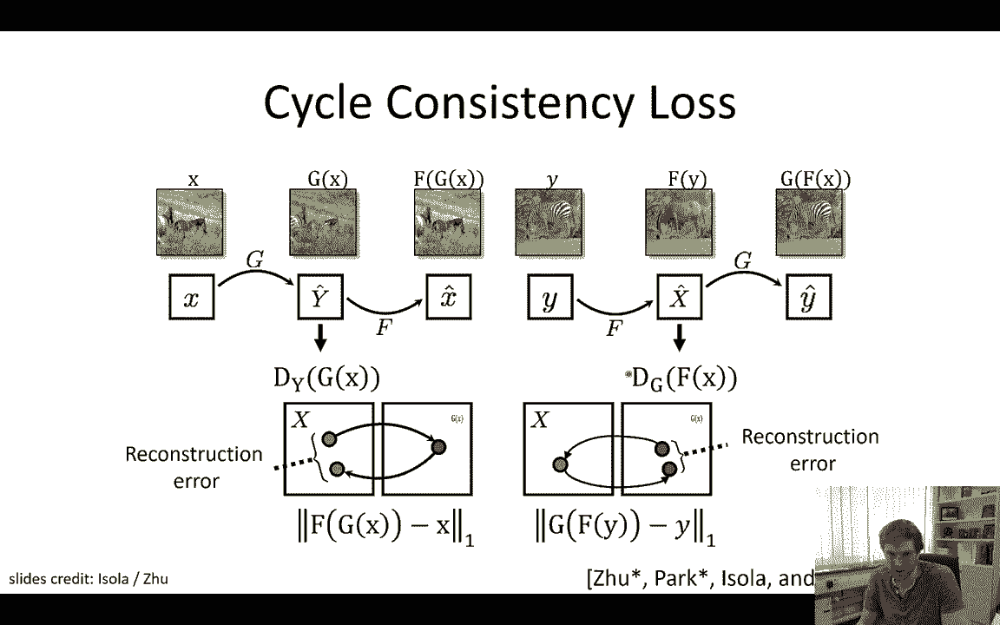

Okay， well， now we have generated that goes from A to B。This one here， and we have generator。Okay。

 there's another A2 B。 There's two A to Bs here。 I'm not sure why the slide has two A to Bs anyway。

 but if you're doing this， we're getting results that look like these ones。 a little bit funny。

 this looks funny right now， we have this horse that is a zebra。 This horse is also zebra。

 And this is kind of the results you're getting。😊，You can do this with horses and zebras。

 you can do this with painting styles， here are Monet paintings。They can be mapped to real photos。

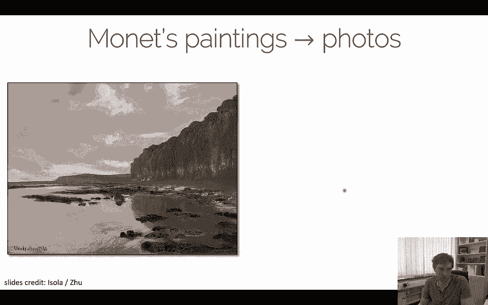

This is a real photo now from Monet pending， we can do another monet painting to another real photo looks like that。

We can do。Photos here as input， we can change， I think the seasons， I think， right？Youre going here。

 what you mean。

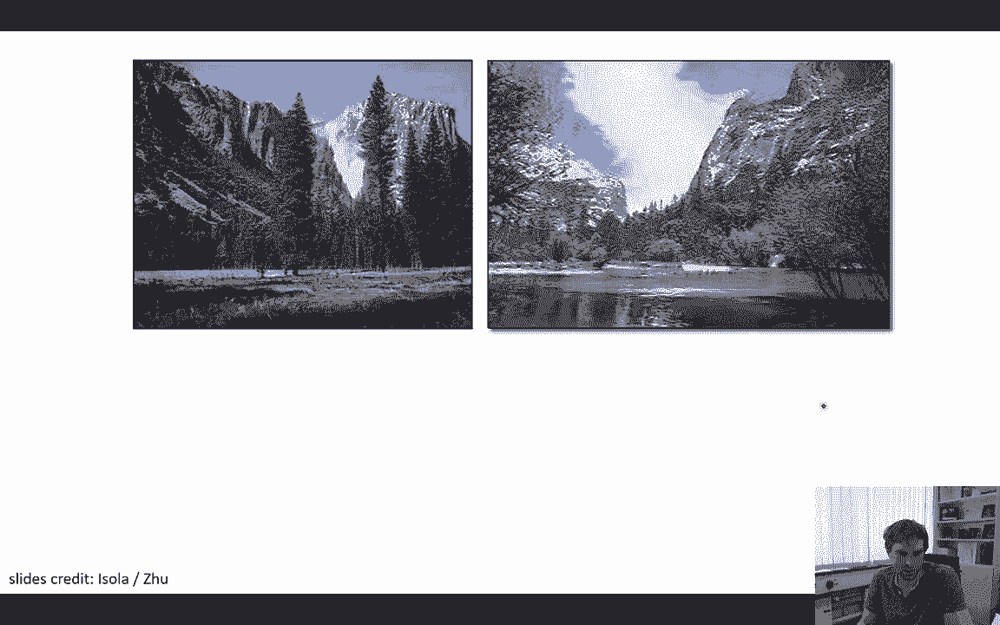

Seasons， we can go here the other way around。This one actually don't remember what they trend it on。

 but you get the idea right， you basically have oranges。

 you want to make apples out of them or you have oranges or you want to make apples out of it。

That's the corner deal。嗯。Yeah， I think that was mainly one I wanted to go through in this lecture。

 we have talked a lot right now about。Conditional GNs， we have talked about architectures for GNs。

I think this is really interesting because now we have actually control over again and we can do something with them。

 right， We can turn horses into zebra。 I think that's amazing。😊，And。

There are still a few things that we haven't discussed yet。 generatively speaking。

 we can do stuff on images。 One thing I would like to talk about。

 especially in the next lecture is videos right how do we go and make no videos out of it This is also something that my group does quite a bit and we do a lot of stuff in normal rendering and 3D deep learning So these are the things we're gonna cover in the next lectures So yeah I hope you still have fun working on the projects and please take the opportunity to spend your effort with it。

😊，Yeah， let us know if there's any questions and so on。Yeah， otherwise， stay safe， stay healthy。

 See you for the next lecture。 Thanks a lot。😊。

