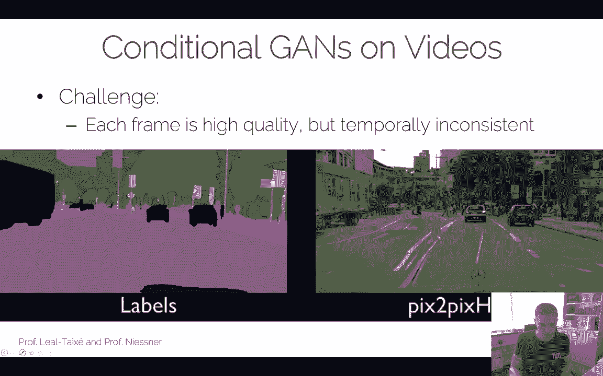
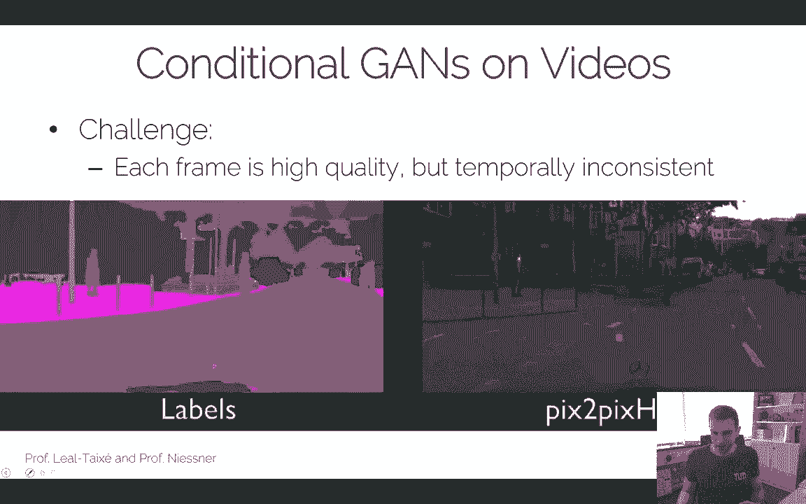
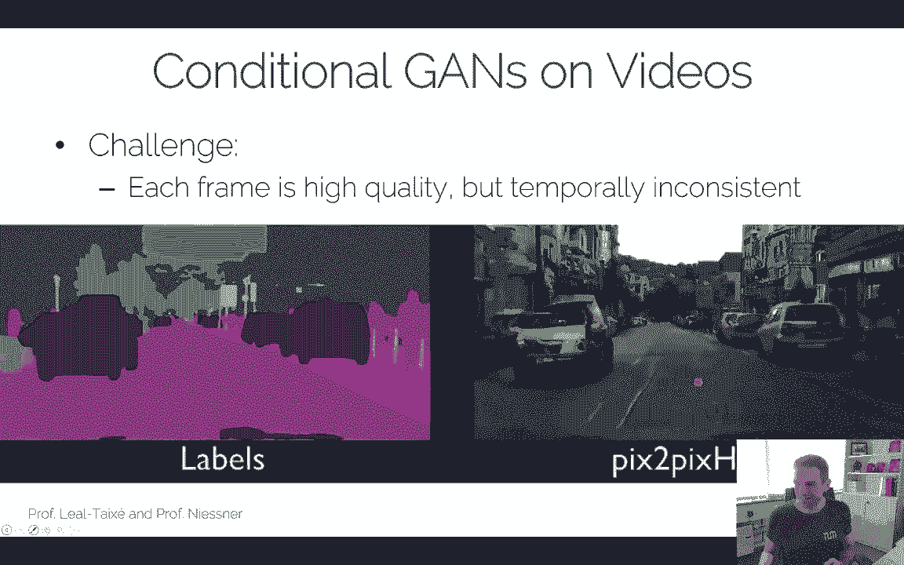
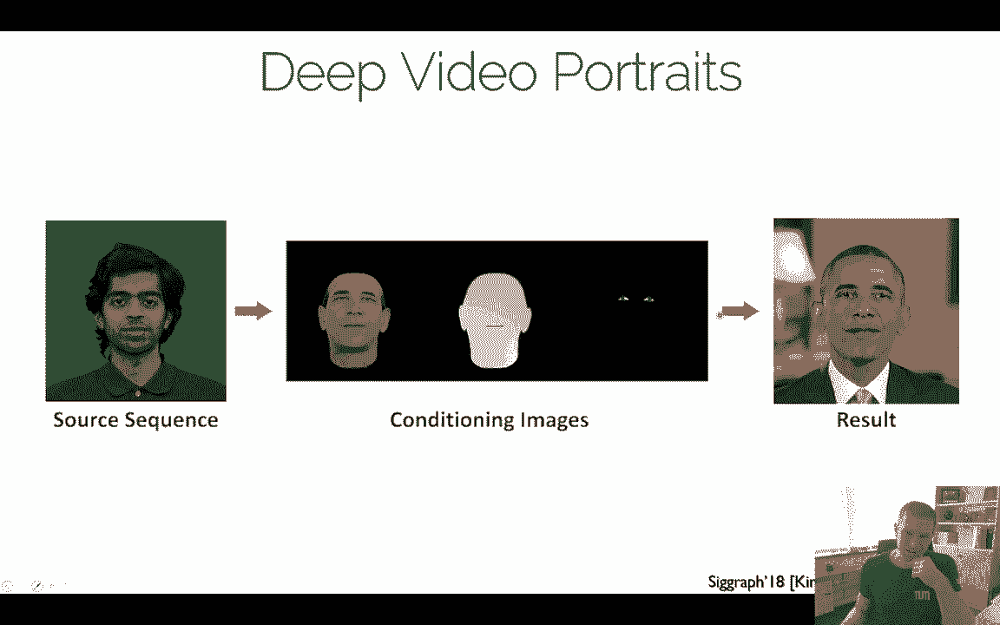

# 【双语字幕+资料下载】慕尼黑工大 ADL4CV ｜ 计算机视觉深度学习进阶课 (2020·全10讲) - P8：L8 - 视频处理与回归建模 - ShowMeAI - BV1Tf4y1L7wg

Hello， welcome everyone to the Advanced team Learn Liature。

In the previous lecture we have talked now a lot about generative model。

 we also have talked a lot about GNS。And。In this lecture， I would like to。

Have a few additions in terms of Gs like one of the very recent state of the art。

 style Gs is a very popular paper that a lot of people probably have seen we had one of the invited speakers last year。

In the introduction to deep learning course。And I would quickly want to mention that。

 I would also like to go afterwards over autoag models like as an alternative paradigm to GNs。

 but finally I think we want to go from images to videos and want to see how we can actually generate and sequences of frames。

😊，Now。Yeah， last thing we stopped was we had different architectures and one of these architectures we discussed actually in the last lecture was the progressiveive growing architecture。

So the idea was be having a discrimator and a generator and we're growing each of these layers and we're adding layer by lever in the layer in this blending based fashion so we can get relatively higher solution outputs while still managing to avoid things like mod collapse and so on。

So stylekin is， in a sense， very similar， so it builds upon traditional。

You know these generators and discriminators that are trained with progressive can fashion and well if I'm looking at a traditional latent space base scan here。

 this is a again that takes here this lant vector to Z right and what it's doing is it has here generator right？

And this one is well it has first fully connected layer has a bunch of cons upsemble con ups sampleble con ups and flaps and gl so on so this whole thing here is a traditional generator right and at some point we have a discriminator at the end but what's happening here is that everything that we're feeding in here in Z will determine the output of the generated image right so for one given Z we will get a specific output image at the end of the day。

Now the challenge there is， of course I similar with the conditionalgans and we have seen that this Z here doesn't have too much control right we can really control and manage to generate things that we wish like to right I mean。

 of course there's things like semantic n and stuff like that infofog where you can basically make sure that this latent vector Z corresponds to some to some semantics and so on。

 However it's still pretty tricky and controlling C and making sure that you can generate images in a specific way So the idea of stylegan now is。

A little bit different。 So the idea here is。And what we do， we have， on one hand。

 we have a La vector Z。 We have basically a couple of fully connected layers and these fully connected layers they form a mapping network。

 right， So this is kind of one network by itself that maps this fully。

With these fully connected layers maps the latent vector Z to some sort of indepreable style vector that we can feed into the generation network。

And。The idea is that the Gene network is actually pretty similar to progressive growing again。

 They pretty much build it in the same architecture。 maybe a few tweak like。😊。

I'll go into the second they basically you have moved traditional inputs， they add noise inputs。

 the mixed regularization， stuff like that， but essentially it's still a progressively growing based generator and what they do is。

😊，They essentially， on one hand， they're feeding some noise after every few layers in。

 so in this case they have one， two， three， four， four points here where they're feeding in different noise vectors。

And in addition to that， they're also feeding the style output from the latent vector Zn。

 so we have here different vectors that are being basically added。😊。

To the current feature maps right so and the way they're being added is with this error and I mean this is the details here。

 it's not so important how they're being added right now。

 of course they tried a lot of different things， but the key insight here is that you having this progressively growing based can that you can train like that however now what you do is for every resolution so to say you're feeding in a noise vector and addition you're feeding in a style vector that youre adding to the noise and to the current feature map right and youre training this whole thing end to end and the idea is that this mapping network here will produce style vectors that are then being used for the synthesis part and the hope is that because these things here。

 they operate on different resolutions that we essentially have style vectors and lower resolutions。

 we have some of them admit resolutions and some of them at higher resolutions So some of them are more like structural elements some of them are more like for medium。

😊，Detail and some of them are fine scale detail right so you have kind of this multiresol control of the image in other words。

 if I'm going ahead and changing these style vectors here。

 I should get different well depending on which one I'm changing I should get a different behavior right and that's kind of the idea of stylegan and again these people they this is this team in Finland and NviDdia and what they they have really a lot of expertise in terms of training this scan so they tried a lot of fiber parameters and so on the architecture I mentioned is very similar to the progressive game they made a couple of changes so。

😊，They have a few different things they change， they have different tuning。

 they have a bilinear up and down sampling instead of just a nearest neighbor up and down sampling。

 they have this mapping of the styles， theyre removing the traditionalal input。

 they have noise input and they have this regularization。嗯。This is an evaluation on FIT scores。

Basically gets a little bit better than the progressive gain。

 but my point here that I wanted to make I don't well I mean it's nice to get better results of course。

 but the really interesting thing is that now what they adding with style again is this explicit control off the again it's similar to a conditioning right it's similar to the way things like Pixto picks have been trained except if you're going back here that here we have this mapping network that essentially generate these style vectors that we can then add to the feature vectors of the generator right so we have the synthesis network G and we have the mapping network F and these two things they interact with each other by having the style vectors being added to the feature vectors。

And in practice。😊，They can generate results to look like these ones。

 And the reason why I'm showing them is because these results look really， really impressive。

 So what they have is they have course styles right they have this at a very low resolution。

 They have middle styles from 16 to 32 squared and they have fine styles on 64 squared to 1024 squared。

 And the idea is what you can do now is you can here feed in images that generate U these styles so we can use that image to get a style vector。

 we can use that image to get a style vector， we can use that image to get a style vector And depending on where at which resolutions we're feeding it in。

 we gonna get a different effect of the respective output and this is the generated output then you we can see that this is a very high quality result also a relatively higher resolution。

 I think this is still 1024。😊，And now the idea though is because we have this multi resolution separation of the styles。

 we can now go ahead and can change the styles。😊，every resolution independently so I can go ahead and change the styles only this resolution。

 I will have a specific effect here， I can change here the minute resolution again。

 I will get a certain specific effect here and so right so let's have a look how this looks like in practice。

😊，So in this case， the course styles are being changed right。

 so this change is kind of the high level。Appearance of the face， right。If you change the mid styles。

 you see well that the corese style of the face is roughly the same right the shape is more or less there and then like the finer you go。

 the more you're changing the local the high frequency appearance but the global part the global structure is already been fixed right and this one is mostly the most control is basically here and then the fine scale control is basically here well I mean depending how fine you go right？

😊，嗯。And I think that's pretty interesting。This's still not quite at the point where you can say， oh。

 I'm having like specific semantic features that I can change at different resolutions。

 but this one has actually already some interesting control that you're having by having these different resolution levels。

 And I think that's a very cool thing。 Well， aside from the fact， of course， that the outputs here。

 if you again， if youre starting this video again， right， they look really， really impressive。

 I mean， this is one of the state of the art papers here。😊。

That can do these kind of high quality images it takes a lot of training， takes a lot of GPUs。

 and a lot of expertise in terms of tuning the hybrid p。Specifically to going up to this， yeah。

 relatively。Relatively high resolution I think that's one of the yeah， that's one of the keys right。

 I mean， the high resolution is something that is very tricky to achieve and but in the sense you know this supports it that you have these different resolution levels okay。

嗯。This， so this is a paper that has been published 2019。 It was actually a very popular paper。

 like everybody liked it because， you know， obviously the results here are pretty good and the same group actually。

They published another paper on top of that the style can too this is actually a 2020 paper right now and they basically still they have a lot of analysis how they can still improve on the style can right so they have really a detailed series of experiments in terms of oh what hyperparameter had which effect on they're not of course claiming that they know oh。

 this is the only gmination hyperparameters。😊，But based on the original sin model。

 they still show certain improvements， sometimes they have these speck artifacts and stuff like this。

 and that is something they can actually they did。😊，They did analyze very。

 very well and the results are pretty good actually。😊，This is another evaluation here。

 this is also an FD course they basically train you know the like eight。

 nine days right you see there's still a difference in terms of the quantitative evaluation here so Stgan1 and Stgan 2 Stcan2 with all of these hypoparmeter optimizations they're making gets still a bit better an interesting high level change they're making is they don't use the progressive growing anymore so for whatever reason they found a way to train it without that I'm not arguing here for one or the other but what's interesting is like it seems to be there's kind of you know a series of islands in these GN models。

are good hyperparameters right so you have a bunch of good settings that go together and these ones they produce pretty good results and as soon as they deviate from them。

 it's problematic， but there are other islands of hyperparameters that are also good。

 but it seems the challenge is to make the connections between those This is probably still one of the most tricky things I would really encourage you to have a look at this paper this is a really nice paper to read and look at specifically the reason why I think it's nice is they also have their models online and they have a really well-trained lightnt manifold space right So what you can do now is you can do things like take this pre-trained manifold with this paper which is very tricky to do they train also on faces and what you can do now is you can basically in this space have a parameter search that finds you good images and do things like image animation and so on right so you can basically in the latent space。

😊，です。Try to find good animation parameters， which means just change the lant space Z to animate things like the phase and zone。

 and it's a very nice separation sometimes in terms of shape， pose and zone。

 they have also a bunch of really cool scripts online so they have already optimization scripts that help you find these latent space parameters they have a couple of piecessis actually in our lab right now they work with that if you're interested in Gs this is definitely a must paper to look at's it's very reason it's pretty cool demos that they have and you can really do cool research on top of it by using their pretrained models and doing things like I don't know we're trying to do stuff like oh give me audio signal。

 try to look up the animation for the phase and stuff like that。

 So this is kind of nice you can do a couple of pretty interesting things here。😊。

Okay obviously the again research， as you see， this is a 2020 paper is still super。

 super relevant and it's super super interesting right， I mean。

 this is like nothing really works when you start， but then you know after some time it gets better and better so it's kind of an interesting research trajectory。

😊，In addition to GNs， I wanted to also mention what auto aggressive models are doing。

Our aggressive models and GNS is kind of these two generative models that we mostly use in practice。

Network wise often similar， but paradigm wise very different。

So if you're talking about auto aggressivegressive models or let's say if we have GNs right what we did with GNs。

 we just have a data set and what we're doing is we're hoping that our model learns this implicit distribution of this data right so the hope is I'm going to give you I don't know。

 like a few hundred thousand images right of faces and I'm going to train again。😊。

And then I'm going get a model that replicates the distribution of these faces。

 and based on these hundred000 faces， I can go ahead and generate another millions or tens of millions of different faces that look realistic that match this original distribution but I actually not part of the training set anymore right but in this training process of the GNs there's no explicit notion of ever saying oh。

 this has to follow a certain distribution。 Yeah this is also a problem， of course。

 because that makes the trainings so tricky I can't verify is it actually fulfilling the distribution and so on。

 The only thing what I can do is I can do things like I can use use Varsstein losses that tell me oh how close are the distributions matching and so on。

 So there's a couple of ideas we've looked at but nonetheless modeling the distribution。😊。

In this implicit fashion is very difficult so autoreggresssive models kind of do the elevator way round so in this case what you're doing is you basically have a loss function that models the distribution right so the output are probabilities for instance with a softmax and because you have a softm right you make sure that this is a probability that models your distribution right and this is governed by a prior imposed by the model structure。

😊，Ader aggressivegressive models are very， very popular still they state of the art methods on images。

 of course， I'll show a few。 they produce pretty good results。

 The early results I would say in auto aggressivegressive models had very similar problems than ga results but again this is not about like I don't want to just talk about oh this paper route this good results this doesn't I think what's very important is to see kind of high level trends and concepts in order to figure out you know what are the next steps for new and good research and what are the things。

That are worthwhile looking at in the future。嗯。Yeah。

 I should also say auto aggressivegressive models are very。

 very popular still in are probably most popular versions for other domains than images too。

 like audio and so on。 we'll see this probably in one of the future lectures when I'm be talking about things like waveveNe so there has been a a lot of work on that and one of the differences there is probably that you have instead of images right you have like a few。

😊，Few quot for pixels and we're like audio， so you would have a smaller dimension right you only have a one dimensional signal。

 but you have more samples still。Okay， so one of the first papers there I would like to mention is Pix RN。

And Pixel La N is kind of a yeah， one of， I mean， it's not the first of ho aggressive papers that have been papers before。

 of course， and there's a long history of that。 but Pixel La N was one of the papers that did this successfully。

 I would say on on natural images。 So the idea is。The only thing you're feeding into this model is also a set of images。

And basically， what you want to do is you want to model the distribution by a sequence of pixels。

 right。 So what you're doing is you interpret the pixels。

Often image as a product of conditional distributions， right， So in other sense。

 if I look at the first pixel right。So I have a data set right。

 and I'm just looking at the first pixel I'm just checking out and trying to fit a distribution with a network。

 of course， that can predict what color this pixel has， the very first pixel。Right。

 if I'm looking at the second pixel， now what I'm going to do is I'm going to check。

And the conditional probability， what the first pixel was。Based on the dataset set。

 what is the most likely color for the next pixel？And I'm going to go and continue that so I'm doing the third pixel right taking the first two and so on。

 so I'm going to successively add more and more pixels in this conditional probabilistic formulation。

 right？And essentially it maps down to a sequence problem so modeling an image is just a sequence of predicting pixel by pixel by pixel by pixel in practice you also predict pixel one at a time and the pixels are determined by all previously predicted pixel so it's a conditional probability you have right pixelix RNAN suggests。

Based on the name， what it already says， right， use a recurrentin neuralal network。😊。

In order to model this probabilistic prediction， right， this conditional sequence here， right。

 in practice， it looks like that。 Let's say we have an N image， right， So we have here and。

Pixels here and we have here n pixels so we have n pixels and rows and pixels in the column and what we would like to do is we would like to go ahead and predict。

The color， the probability of the color of this pixel here right and the way you're doing is you're just looking at all the past at all of these in the past at all the pixels here and here and here and here and you're multiplying based on the previous predictions。

 what is the most likely probability for a given color on the current on the current pixel right In principle。

 it's very easy the easiest way to think of it if you look at the first pixel right this doesn't have any predecessors。

 So this is literally just modeling the distributions of the very first。😊，Pixels in all the images。

And you can see here that this can actually get quite long right， Well its in this case。

 it's n squared pixels。 So you can already guess about doing this for higher solutions is。😊。

It's at least challenging， right because you have a very long sequence in this RN model。嗯。

In this case what we're doing is we predicting a single pixel color per pixel in practice when you have something like RGV。

 you simply expand your sequence and for every pixel you're going to have three sequence steps right so you're saying first you predict R then G and then which is again this conditioned on all the previous pixels and it's conditioned on the two previous colors whereas r is always only conditioned on the previous pixel and so on。

So in this case， this product just becomes three times the length because you're predicting RB and G values independently。

It makes the sequence longer， but in principle， the theoretical part of the。

Of the model is not changed right， it's still the same idea。

 you still have this R&N that goes over all the pixels and all the colors then too right？

Quest is still how do we model the predictions in one pixel pixel r and n， as I said。

 it's an explicit distribution and the way it's modeled this is a softmax。

 so you're saying for one pixel value， youre having 255 you have basically a bit right so you have。😊。

I had 255 different values。In this case we have a softmax formulation。

 so we're treating each of them equally and all you're doing right now is you're feeding in your again。

 let's look at the first pixel here right， you have your training set and all you're trying to do is predict what is the probability of a certain color to be coming for that pixel right？

If all my training images were green then my probability would be pretty high to have green right if not if it's mixed then it would basically give a different distribution right so that's kind of the high level idea of what we're having here in the RTB case I would simply have three times 256 ways of mees right that's ignored here but it's pretty straightforward so you train it by simply going ahead and saying oh I'm just looking at my training data I have all my images and all I'm trying to do is I'm trying to x。

😊，Forulated based on the data set and based on the previously predicted pixels。

 what is the most likely next prediction， right， And it's， of course。

 it's all completely selfsupvised， right， I don't need any labels。

 All I have to do is I have to look at the images。 and I have to figure out what is the most likely next prediction in this model。

Now the tricky thing about Pix RN of course， is the sequence is very long， right？😊。

it's a pretty big issue there's two things why this is problematic first of all for training it's an issue I have to basically train this whole RNN right that's challenging I might have vanish ingredients in my RNN and it might take some time to train it right the other thing though is。

😊，It might also take quite some time to evaluate because what I have to do at test time。

 I have to basically run one network。For every pixel right， again。

 what I'm doing is I'm running one network to evaluate one of these probabilities。

That basically how it's being formulated in the naive version。

 And so I have to run the network first for this pixel then for that pixel。

 then for that pixel and so on， right， So there's not a lot of parallelism going And at this point now。

This was a paper that was published 2016 and after that people thought yeah。

 what are the variations of that and what can we do with it and the interesting thing is the methodology people were really excited about so what they thought is maybe there's different ways of how we change the ordering here in terms of dependencies so one variation of this we can use a row LSTM model architecture So the image is processed row by row we have a hidden state of a pixel and that depends on three pixels above respectively。

😊。

So the idea is we have something like this， so if we're having this pixel that is being predicted right now。

 right， we basically depend on these pixels here at the top respectively， right？

Not the previous pixel， right， that's the difference from the naE version of the pixel on And right if I took this pixel I would again。

 I would have all this this pyramid here that。😊，That respectively。

 I only take the three previous months here， right？

So the advantage here is the sequence length is a lot shorter that's one big advantage right。

 I don't have to basically go through here then through here and then through here to predict that pixel but instead I can only I can take this one。

The other thing that's pretty nice is I can compute pixels in one row in apparel。

 so this pixel here and this pixel here can be computed in parallelel in principle， right？

which is pretty nice in this case I can basically implement it on a GPU I basically start multiple kilo cons at the same time and I'm predicting that at the same time。

So that is that is pretty nice， That's a big advantage of this LSTM model and it kind of makes it actually practical。

😊，The downside is we have now this pixel here is not being used as input to that pixel anymore。

 so every pixel in Monroe would get independent predictions so we kind of have incomplete context for this one pixel。

Could say that's okay， right？😊，And in practice it might be okay right。

 but there's this thing you have to keep in mind that basically you don't condition it anymore on the previous pixels in onero right so you would only take the ones that are above。

And and that what happened was pretty funny。 A lot of there were a lot of different variations now being proposed。

 This is a row LSDM model right， and then people tried a diagonal by LSDM model right？

 So in this case。😊，You basically start here right， you basically condition this。

 so this guy's condition on that one， this guy's condition on that one。

 this kind condition on these two， this guy's condition on these two， and so on， right？

The advantage here is， again， I have a much shorter sequence length than the naiveve Rnn right because if get in this one I only need to go here。

 If I go here， I also need to go one here， one here right So that's a lot easier and based on this pattern here。

 I'm solving was incomplete context problem what I had in this row-based LSTM I'm again making sure that all my previous predictions at some point influence some future predictions。

 which is what you want to have right So in this case right。

 this guy here is actually being influenced by every pixel here。😊，Before， right， which is nice。

 That's what we want to have。So the hidden state of the pixel of a specific pixel when you do this in practice depends on two previous pixels。

 namely this one and that one， which is nice and。😊。

The good thing is you can actually still do the processing in a diagonal way right I could also so this so let let's see this pixel here only depends on that pixel right that one I can process。

嗯。This pixel here depends also on that pixel and on that pixel。And this pixel depends on that pixel。

 So this， this and this pixel， I can process in parallel。This pixel， that pixel。

 that pixel and that pixel。Doesn't depend on each other but one I can also process。

 so we have this diagonal parallelism that we can do right， which is nice。

 so we have some parallelism and we're solving incomplete context problem。😊。

So this is a thing that people have been basically doing when this pixelix alarm and Heva came out。

 it solved this incomplete comics problem while still allowing for some parallelism to be processed。

 right？Yeah in the pixel R an architecture the idea to implement it and in practice was you had these mask convolutions so only previously predicted values can be used as context right so in other words we have basically different masks so here whatever was previously processed we have Rg and B and basically what you want to do is right in order to get the respective next one you cutting off the connections here right so here the context is not being used for these ones and here basically this be's cutting off for that one right and in this case we have two different masks we have one mask that during the first conf that restricts the context that's what's happening here so this context is not being used here and we have a mask B for the subsequent confs right and masking is simply done by setting the respective values to0 and and by this way by。

these masks， you can enforce that the network is just not forwarding whatever the current image has seen right So the reason why we need the mask is basically we seeing an image and the way we training it is were simply masking out the current pixel and based on the previous predictions or based on the previous pixel that we have in this image。

 we're trying to predict the current pixel right That's why but in order to do that。

 we need to mask out the current pixel Otherwise you would just forward it right So there would be no learning going on。

 So in this case， the network is being forced with these masks。

To learn based on all the previous pixels， what is the probability of the current pixel color， right？

m，Okay。So this is Pixel RN。Again， this was one of the first papers that did it basically on images in this autoaggressive fashion and they got a results to look like these ones。

 again， dont don't judge the quality maybe too much at this point。

 this was the paper in 2016 this was trend image now。

 so it's a pretty difficult dataset set you see you know it's challenging it's not not that high quality what we have seen like the things like style againnesa right now but it also is not at the same hyper parameter level。

 but at the time the this was consider to be an interesting alternative to GNs and it showed actually quite some some promising results。

 So people thought， yeah it's a pretty cool idea we can probably use it now the one thing。😊。

What I mentioned already is this dependency causes a couple of issues， right？

With pixel Las you have this issue that you have to go through this like you have to have an LSTM architecture to model and sequence right that's the challenge it's not just challenge from a training perspective。

 but it is also challenging from a evaluation perspective so in practice。This becomes very。

 very costly。And there's been kind of a follow up version by a similar set of authors also from now Deep Minind。

And in this case， we wanted to think about can we use convolutions there instead of this CNN。

 so we're using kind of a mask version of convolutions。嗯。

But lets let's have a look again right So the problem is this row in diagonal LTM。

 They have this issue of this potentially unbounded dependency range right which depends obviously learn the pixel on the image size right so that's a big problem。

 And this is computationally rather challenging。 We'll see this later on also when people do it in audio like these first wavening models that took a really long time to elevate And people had to think about you know doing something potentially a little bit smarter there。

😊，Okay so pixel CNN， the idea now is we're using standard convolutions to capture a bounded receptive field。

 so one layer has a bounded receptive field we can set the receptive field to a specific size。

 so for one given layer you see only in the past to a specific size。And because of that。

 all pixel features can be computed at once during training and during testing it' very similar。And。

But basically during training this is a massive speedup right and in practice it's going to look like that。

😊，You're going to have an architecture that looks roughly like this。We have here input RGB。

 we have hiddenened width， right， we have this mask a convolution。

Similar to the mask we've seen before， but this is now a 2D convolution here， right。

 we have a reite block， relo con freelo conf and thenof Max， right？Okay。

 and the idea now is this mask what it's doing。It's simply for the current prediction is at the center of the mask。

 you're masking out the entire future context including the pixel itself right it doesn't see the pixel itself。

 it doesn't see anything of the future。And the idea is if you apply this mask to every pixel。

 you're naturally getting a similar pattern than what the pixel on end would be doing， right？😊，So。😊。

Yeah， you're simply masking out the future vlogs here， right？And that is much nicer to do now。

 that is because this model here preserves the spatial dimensions。😊，And the mass convolutions。

Can be simply。They to mimic the same behavior of the sequence right they simply avoid you don't see the future context。

 you still basically conditioning the current pixel predictions or the current feature generation based on the previous pixels right？

And。So they have these gated pixel CNNs。 They have these gated blocks。 Basically。

 they're using these masks， right， And another thing they're doing is they they realized。😊。

If they just used the mask with P CNN and Pix learning N， the P CNN didn't perform so well。

 And one hypothesis was that the。The the LSDM。With with with the sigmoid in the 10h functions。

 they actually held。 They didn't quite， you know， it was not quite clear Y。

 but basically the expectation was that the sigmoid in the 10 h functions， they were better。

 So now what happened with gated pixel CNNs， this gated blocks basically they're using also the 10 h and sigmoid functions and then you have an element wise product。

 So again， what's happening here is you have the K layer， right， these are the weights。😊。

These are the weights， you're feeding in the current input， you have a sigmoid， you have a 10 h。

Then you have an element called， and then you're getting the current output of this block。

And the idea was by replacing the res with a skated block of sigmoids and 10 Hs。

 it's kind of very similar what the LSDM is doing right And if they did that， they noticed， oh， okay。

 if we're getting better。Better performance outputs again in this case， right？

And this is kind of the high level idea of the pixel CNNNs right in this case。

 this is literally this gated block is basically mimicking what the pixel RnN is doing。

 but now the difference is it's computationally much much more efficient。😊，It has one downside。

And there's a blind spot actually， if you're looking closely so let's say we have here a 5 by5 image right in this case we have a 5 by5 image and let's say we have a  three by3 convolution What we want to do right is we basically in order to go from here to the next layer we are now applying this three by three conf at all valid locations right so you know we're just sliding this three by three image here through until we get here to the middle right So this is the last one and when you're seeing the last one here。

 you notice very quickly that in order to compute this output here you're never going to see this pixel here is input right。

😊，If I'm going you to the respective next one， I have the same issue。

 so if I' going if I'm applying the filter kernel here， it doesn't take this pixel here。

 this pixel here is missing right now， right？So okay。Start over， it starts here。

 this pixel here is never being used。Right。Here it's masked out and then it's not used， right。

 This one here in the next row would also not be used。嗯。And that is this blind spot。

 so basically this pixel here is unseen context and this blind spot this goes all the way through the image actually。

 right？😊，And that's a bit of a problem because now you're having the situation where you have kind of this unseen context that is not being used for the respective future predictions。

 right？😊，Yeah the question is how can you avoid this with a series of convolutions。

 there's a relatively simple idea behind it， you just have to apply the convolutions and modify the kernels a little bit。

😊，And this blind spot can be evaluated by splitting the convolutions in two stacks。

 So you have a horizontal stack and you have a vertical stack， right， So in this case。

 you have in here the vertical stack。😊，And you have a horizontal stack here of convolutions and the idea is you first run the vertical stack and then you're running the horizontal stack right so that's kind of the high level idea in this case this vertical stack makes actually sure that you're taking all of of the inputs。

Here in and it's a very simple idea it comes a little bit of overhead because now we have two。

Two steps basically， and that makes it a little bit harder to do。

For whatever reason my window just decided to open let me see if I can actually close it again。

Of course it doesn't work。Whatever， let's just go ahead and let's see if I can。그。Okay， all right。

 so we can eliminate the blind spot。This is really exciting， actually。All right， I'll leave it on。

 think computer science building。Well， if anybody complains about the video quality now。

 please send an email to our custodians not to automatically remove the blind when the sun is like really burning here。

嗯。Okay I。Yeah， so we're eliminating the blind spot。

 we can also do relatively simple things like conditional pixel CM。😊。

Basically what we can do is when we applying these blocks here like this one here， right。

 we can do conditional image generation by simply appending a vector here and here respectively to the weights that are multiplied with the respective inputs。

 right？😊，This is simply a latent vector that is used for the conditioning right in this case you can use a class vector so let's say I have a classifier from network right I'm using these class specific features and I'mending them here to indicate oh。

 this is a specific class right？😊，And this gives some control。

 it's actually very similar to things like picks to picks where you basically have also some sort of Y the discriminator sees the different conditionings。

 in this case we simply have this condition lant vector here。😊，Okay。

 if youre running this model we getting results that look like these ones。

 so this one is on coral reefs and and horses right so you see well you know you're getting getting realistic images here as output right？

😊，You have these horses， they look like horses if you're looking closely you will see the resolution not so high。

 but again you have to make a fair comparison here。

 this is a model that was that was trained 2016 right it's already quite some time ago。

 but the pixel scene and model is actually something people have been working on and they have improved it it also got better hyper parameters。

and yeah， the results I think got also better over time。

 I show you in a sec like what the state of the art can do here。

But I think it's a very interesting question of what generative model you want to use right。

 do you want to rather use auto aggressivegress models？😊。

Or do you rather want to use scans The big advantage of autoregressive models is this explicit。😊。

Modeling of the probability dens gives you much more stable training。 like training a pixel CNN。

 I mean， again， it's comp also costly， right， but it's not gonna be like this crazy hyper parametera tuning。

 like what you have to do for gen， right that is， that is a really， a really big advantage。

 So I would say the training is much much easier。 It's much more stable。

 And this is something that is worthwhile doing。😊，It can be applied to both discrete and continuous data as long as you can model a probability many times what you see is。

😊，People go ahead and discretize the data and use something like a soft mix to model it。

 we'll see in the next lectures。 Also a few more examples of these cases where auto aggressivegressive models have been very。

 very successful。 So one case I've mentioned is the audio case， Another case will be shape modeling。

 There was a very popular paper polygen that came out only a few weeks ago that is also fallen into this auto aggressivegressive category。

 So from a pure theoreticalical standpoint from your toolbox of deep learning tools yeah auto aggressivegressive models are very。

 very important actually Yeah， the advantages of Gs。😊。

Empirically people think oh you know they can produce higher quality images I think you know the community is developing in certain ways。

 sometimes these are a bit better， sometimes these it is indeed true that the GNs currently produce better results。

 they're also faster to train they're faster to train but they're much more difficult to train right so this is kind of the pros and the caveats what we're having about these models。

😊。

I also wanted to show this is one of the very recent results on auto aggressiveive models this VQ VE2 it's basically variational autoencoder and they have a very they have a vector quantized formulation and these results are pretty impressive right and if you're looking closely they might not quite be at the same level you know what style gain is doing these days but still very impressive also high resolution also takes a long time to train but but super impressive results right it's very it's very interesting so if you're interested in this results look at this paper this is also 2019 paper very active research area there's still a lot of improvements that can be made you know like how to quantize things。

😊，What encodes do use， what losses are you're using and stuff like that。

 So there's a lot of interesting design choices still in the architectures here。

Okay good yeah with that I would like to well more or less conclude the generative models and images。

 but now I want to see how can we do things on videos and as you can imagine。

 you know like going from an image which is already a higher resolution going to videos which is a much。

 much much higher resolution is a very very challenging endeavor。

 and I would say theres still two different categories， one categories。😊。

Like what again is doing a purely gener model go from a latent vector to video。

But then there's also methods that go from。More like this conditional game case right so you have some guiding and then you can go there but let's go to the first case first right I want to go ahead now and basically say。

 well， give me one of multiple random vectors and generate generate a video as the output。

And let's have a very simple version first， let's go back to GNs for a time being and let's imagine how would we do this on videos if you had to design your own GAN model。

 what are the options， how would you design your architecture very naively right like without thinking too much。

嗯。If you're looking at。At Gs， right， we know we have a latent code Z。

 and basically there's two options， right， One thing I can do is I can say I have a single random variable。

😊，That is used to generate and determine the entirety of the video right so one single vector determines every single frame that comes out of it right in this case。

Well， the output is very highly dimensional， of course。The question is basically， how do I know？

Weant to stop。So if you did this past。Part here， what you could do is I can go ahead。

 have agan that gives me a la code Z。 I could do something like an LTM， right， and I could predict。😊。

In the first frame from letting vector de Z， I predict one image， right， that one。

 something I can do。 Now， if I want to predict the next frame。

And only condition that one frame on the previous frame。

You're going to have this issue that for this one frame。

 you're always going to get the same next frame。And you will see that this is already fundamentally a challenging issue because。

If I'm going do that。I like if if I'm in a real scenery， right， of course， for a give still frame。

 I can have multiple future predictions where this video will develop。😊。

So if I used the late code Z only to predict the first frame and then only use the first frame to predict the next frame。

 the next frame to predict the very next frame and so on。

 I would not have a lot of variety in the video like how the motion would go right I would only keep basically the current frame and this is the challenge now if I only have a random Z this Z needs to be also input in some way to the next frame。

Right。Because again， otherwise you're going to have this issue that if you only predict in the previous frame。

 you always will get the same motion in practice you get no motion in practice this is just going more collapse so you have to have a way to get the Z to the very next frame propagated in one way or another either the feature maps right or the Z directly by itself。

😊，嗯。Yeah， so future frames deterministic given the past right， that's a big。

 that's a big challenge we have to address here。 So this， this is this thing。

 if you have a single vector Z， that's a problem， right。😊，The second option is。

What you can do is I can go ahead and have a random variable。That generates me frame A。

The first frames generated with， with one random seed。I'm going to have another random vector z。😊。

I'm going to generate the next frame， and when I have another random vector generates the very next frame。

So by doing that。😊，I can throw basically independent frames with inencies if I have trained again now the challenge is。

 of course， if I want to have a video， I need to have in addition to that some conditioning to each other。

😊，嗯。And。Well， what you can do now is generate the first frame。

 wouldn't have any previous conditioning， right， It has has it has no past frames。

 The next frame would get as input。A single rate vector again for the current frame as well as the previous image。

 so the task in this case would be take previous frame plus take new rate in code Z。

 generate the next frame that corresponds to each other。

And you can do that so basically what I just described is you need this conditioning for the future from the past。

😊，But the big challenge you're going to get now when you train this。

 how to get the combination of pass frames plus the random vectors during training right So if I have a given video。

😊，I gave this one a la vector Z and I'm generating the next frame with another la vector Z in my training sample in this video I combined I have some implicit correlation between the frames right。

😊，But I don't have a correlation between the lant coats。And that makes it very tricky to train。

 because how do you get this combination right between training and test？

 So this is very tricky here to get to work。If you try this naively。

 often what happens is simply ignores the latent vector of the previous of the future frames， right？

So this is very challenging here， so we're having two options and both of them have problems， right？

😊，And theres channel issues， the channel issue is how do we make sure we get temporal coherency。

 right， how do we make sure we know jumping around again if I'm just having a gun and drawing two frames or generate two images。

😊，There are going to be two frames right that's just going to be random stuff so that's a big issue how to get the temporal coherency in practice I need to have some part in my discriminator that tells me oh don't flicker be smooth be a real video and stuff like that right？

😊，The second problem what you're going to have is there might be some drift over time and often what happens if you're running these video generation methods that exist right now。

 they often collapse to an average frame right the first few frames are fine and then we have longer sequences they drift away and you're going to have a pretty interesting problem also to deal with when you're training it。

😊，What you do is let's say you have a sequence model that predicts frame by frame。

 If you have a sequence model for frame by frame， you're taking the previous frames as input。

Now your training obviously on ground truth frames here is input here， but when you're testing。

 you're having the previous predictions， so suddenly with previous predictions。

 you're not in the ground truth anymore and the further you go。

 the more you drift away what is ground truth， in principle that the quality will degenerate at some point。

 So this drift possibly more collapse to a mean image is very is a very problematic case for videos。

😊。

Yeah I wanted to show one architecture this is a paper from Deep Mind DVD G this is a paper also from 2019 you can see videos are very challenging still what they do is basically I don't want to go into all the details because there's a lot of variations of there's a lot of the stuff is crazy hyper parametermeter tuning they have a random distribution here right they have one hot class vector and what they're doing is they're basically saying ohre using this one vector。

 youre distributing it in one way or another to multiple frames you have for every frame you have basically a generator then but it's determined by this one random vector so this one guy determines all of them at the same time and the discriminators what they're doing is basically they're taking the stack of this stuff in and they're telling you is it again a reasonable。

😊，Right？😊，Again， I don't want to go into detail， but the interesting thing is what you see is here。

 the discriminators， they can't just look at a single image， of course， right。

 they need to look at more stuff at the same time in order to make sure is it a video。😊。

So this is one of the state of the arc papers you typically get results that look like these ones。

 you have few different resolutions this is 256 this here is 128 and this one is 64 you see very quickly the sequences are not so long you're going to get very short sequences because longer sequences the drifting problem is a massive issue。

😊，嗯。You can see you get some results that look reasonable here you have this server video right but you can already see the quality of these videos is significantly lower than whatever people have been doing with things like Staion and Z right So doing this from Sp is challenging and again this one was the state of the art example so most of the time these things are trained on the kinetic data sets。

 this is kinetic 600 right they train it up to 48 frames 48 frames is like less than two seconds probably if you assuming like 30 frames a second So you see this is still a pretty this is a challenging problem right the output is pretty hard。

😊，It's pretty interesting。 The one thing what I should say there's a bit of a cheat you can do for video generation。

😊，One thing you could do instead of training this completely from scratch。

 you could go ahead and take something like style again， take the manifold。

 and you just try to figure out in this manifold what would be the next space。

 What would the next frame。 And this is something that works surprisingly better， actually。

 But but generating the frames completely from scratch is is still very difficult。 Again。

 this is a really impressive paper。 And this guy， they really know what they're doing。

 This is like they've been working on this for quite a while。

 This this is not straightforward to get these to these results。😊，But it is， of course。

 very interesting to do this ideally， we would want to also have better operators。

 not just 2D convolutions， maybe some video based。😊，Convolutions。

 right that would consider the whole context at the same time。

So doing this from scratch is very difficult。 I mentioned you want remedy possibly using a pretrained manifold。

 there's another potential remedy and it turns out conditional GNs are much better for videos。😊。

This is a paper， this is Ps to Ps HD here， this is run simply on a frame to frame basis。

RightWhat you're doing here is you're taking the semantic series input。

And you're running this ps to Ps model from the semantics to get to here。

Again， of course it's flickering this， but in the network here there's absolutely zero temporal coherency right there's no temporal constraints between the different frames。

 The only temporal coherence we're getting here is based on these labels。😊。

The assumption is if these labels are temporal consistent。

You will also get temporal consistent output。 The next assumption is if this input is overconstraining the output enough and is deterministic。

 meaning we have enough information and would always produce the same result。

 which in practice you don't， of course， But if it did， you would also get better predictions， right。

And I would say if I' playing this again， it's actually not too bad， right？ Yes， it is flickering。

 it's not perfect， but the car is here always is there。 Of course it's here too。

 there's a bit of inconsistency here in the labels， maybe if these ones are not there。

 it would be better， but this one is already pretty good， I think right。😊。

So the conditional case is very encouraging because that is much easier than doing it from scratch。

 there is still a challenge to get this one temporarily consistent。😊。

And there's also a follow up paper from Pix to P space that leads called w to w it's basically using a sequential generator right。

 So the idea what you have is you have the past L generated frames。

 they wrote this down as this like nice formula but in practice they said L to2 So these two of the two of the past frames。

 the last L source frames， right。😊，Again， El said to too。

 it's like basically taking the last two frames。😊，And then it's a conditional probability on the previously generated frames and the previously conditioning frames。

 right， These two are being fed in to generate the next frame here as output， right。

 That's what we want to do。😊，And of course， this is a sequence。

 so we also we have to multiply these probabilities together， so we have a sequential generator。

 right？😊，That's the high level idea of doing bit tobit video to video synthesis in this case there's also two discriminator。

 one discriminator DI is trained to say， is it a real image？

And another discriminator D is telling you is is temporarily consistent what these guys are doing roughly is this D here is just checking the flow right so you extract the flow from an image and you're telling it oh whatever you generate is that corresponding to flow what you would expect in the real video。

 So is the motion kind of smooth is consistent stuff like that。

 that's something this discriminator would be would be doing。

 So the full objective here is basically we have the loss from the image here right。

 this is li D and you have F and D right So you train these two jointly which is which is pretty good I can say however。

 this paper has a lot of finict details it's very tricky to train and probably also trends around the week even for the simple data sets but the results look really impressive that's why I wanted to show it So this is an example here。

😊，Where we see here again the input labels we see here Ps to Ps HD this' is another baseline and here is picks here's bit to width basically right and now if you're running this we can run this here。

😊，If you look in here this one actually looks if you're looking at it very closely。

 I think this looks really amazing actually I did a couple of funny things like the road here。

 this line markers it's not quite clear what's happening there right but if you're just looking roughly at at the motion here it looks actually pretty good right So this one I would say is' probably state of the art and compared to the purely generative case。

 this conditional case is significantly easier to train I don't think that's cool right I mean you get pretty good results of that。

😊，So yeah， if you're looking again at the key ideas here， we need two discriminators right。

 we need to figure out is it a real image and also is it a good sequence， this one is very important。

😊，In this case， it's based on optical flow。 There's probably other versions how to do that。

 You need to consider the recent history of previous frames。 in this case， the 72。Well， I mean。

 they wish they probably wanted to say it something larger。

 but I think at some point you just run out of GPU memory， right。

 that's that's the practical that's the practical issue。Yeah。

 we have to basically consider the recent history and then we train all these things jointly that's kind of the the key idea yeah so which is super nice so this conditioning makes the whole problem of video generation very tractable。

😊，That's also something that we've been doing in the con of faces。

 this was a collaboration with the MP together， the video pottery paper I would say it's relatively popular paper what we had is kind of building on these blocks too so the idea is you can say well we want to condition basically we want to generate the conditioning on the fly in order to control the respective video output。

😊，And the video portrays， the idea is what you want to do is you want to take a face here of Obama。

 you want to take this video and you want to control and animate the face here， right？

It's a very interesting thing what you can do here， right in this case。😊。

What the conditioning of the network is only this right hand side。

This is essentially it's essentially a version of pixelixs to picks。

 It's a bit of a more fancy version it uses multiple frames at the same time as input and predicts only one output so it it sees the temporal context didn't make the biggest of a difference but the key insight what I want to say here is we have a bunch of synthetic rendering of faces here。

 ignore the left-hand side right now just look at this party in the middle This party in the middle is a bunch of synthetically rendered faces in this case it's just RTP values these are 3D coordinates of the model and it's a bit hard to see these are the eye locations here。

😊，And all of these are all of these three from one frame， are stack together。

They have fed into this pixels to picks， it's a unit version of pixels to picks right。

 and this network is being trained to generate realistic images。From this one video sequence。

 this ps to p here is only trained on one Obama video。

It's the only trained in this one video it's maybe 1 thousand0。

2000 frames it's not so much right so this network will make sure that whatever I'm feeding in here is correlated with whatever the Obama video is looking like so please take this and make an Obama frame out of that again it's also taking multiple frames here I think we took five frames so a window of five frames。

😊，Took all of them as input and predicted only the middle frame。

 so the network sees the future in the past， but it didn't make the biggest of a difference。

 and I'll tell you in a second why it doesn't make such a big difference。

And the reason now is here how we generate this conditioning the conditioning now what you can do is you can take the original video。

 you can run a face tracker the face triggerer gives you a bunch of parameters like illlimination identity pose expression in I right basically all of these things here you can control with a 3D model。

 you can use a graphics method right now， take a GPU renderer。

 take these parameters here as input and rerender them。😊。

So this re renderndering is of course not a realistic video because these parameters doesn't have stuff like the background on the shadow yeah and the material parameters and so on also not super accurate。

 this is just a high level representation basically。😊。

But the nice thing about this presentation is that it's fully controllable so we can go ahead and change these parameters as we wish right we can just change the pose。

 we can rotate the head， we have an absolute notion in how to rotate the head。😊。

The ability if we don't have yet here on this part it's just a forward GPU render。

 it looks kind of like a video game from the 80s so say， right？But in the combination now。

 is we can have the control here in our track model。

And then use the network to make realistic videos out of it again。 So in other words。

 we can control this space。And。The reason why this works is。

This trackingre here is pretty accurate like this is a per pixel based tracking it's based on methodology wise it's similar to the face to face method。

 right， you can track a per pixel error here， you're getting very good fits of the face。😊。

And this makes it relatively easy for the network to learn the correlation between this motion of the face here or these pixel of the face here and respectively here。

😊，But now what we can do is， of course， we can do edits。

 You can take a different source sequence to take a bunch， track the sequence。

 take a bunch of parameters here and recombine the parameters here and then render。Well。

 and then change basically， for instance， things like post expression and I in this rendering and then the networkbu again will make sure that we're getting a realistic Obama again so in practice looks like that。

😊。

We have here the target model here of her， so we took her video， we reconstructed her face。And。

Here are the positions of the 3D model， here the eyes。

 and now what we do is we have a source sequence， that source sequence is being used only to control the synthetic 3D model here。

And then the neural network converts these three images again to a realistic phase。

And if you're running that， you can resolve the look like this。

So you're seeing the motion here it's transferred to the synthetic model and then the network makes sure that this one is yeah。

 it's basically recreated to a target video of her and it's pretty interesting in the shadow here is moving around right in this model there is no shadow。

 but the network learns whether the head goes left and right。

 the shadow also moved left and right It doesn't have a correct illumination model or whatsoever。

 but it's just a very easy example because it's a portrait video and then it learns how to translate that right。

😊，It's a few more examples， here's he's controlling the virtual phase of Obamama here and the video is basically making sure that you can generate a realistic output here at the end。

 right？😊，嗯。Yeah the eyes are very important， you need a special image otherwise the eyes are being ignored otherwise they're too small of a region on and the loss to be considered right that made this one to work you can do manual editing you don't have to take a source sequence you can go ahead and take an arbitrary video or image and you can basically specify how should the post here of the person look like you can change the smiling parameters in this case that's part of a PCA if you're interested in that yeah you have to look at what the parameters these face models are but the interesting thing is part of this class here is really。

😊。

By controlling the synthetic 3D model， we can generate a video out of it with an neural network and again this pixel to pixel model doesn't have a lot of temporal coherence。

 yes it sees a window， but the reason why this works is because we are seeing multiple frames at the same time。

The reason by averbs is because our trackingre is temporally consistent right So the only temporal coherence。

 well aside from this window， what we're getting is based on the training data。

 here have a few more examples。😊。

嗯。We have here Ya。We just have a lot of fun of it， of course。

 right you can basically change and edit videos now in a pretty arbitrary arbitrary fashion。Okay。

 there's a couple of cool insights that I wanted to talk about。

 And the one thing which I think is super surprising is。😊。

Well the synthetic data for tracking is a great anchor right basically this eliminates the swift problem that the standard GNs would have for videos。

 you having basically a sequence of synthetic inputs that you just want to convert and translate to different domain。

 but they serve as a great anchor if they are temporarily stable the output will be also temporarily stable and that's pretty nice right so that's a pretty good thing。

😊，嗯。The overfitting on small data sets for this kind of stuff work surprisingly well， right。

 We have maybe a few thousand frames of the video， potentially get with a few hundred。

 but a few thousand is probably better， but it's not like hundreds of thousands。

 right compared to like styleganner。 So you need like hundreds of thousands of training frames in a lot of augmentation。

 much easier here， right， much easier problem statement。😊。

And can generate temporarily consistent videos right admittedly of course you need the conditioning right this is a big challenge。

😊，Yeah， the one thing you need to do is you need to stay within the training set， in other words。

 you cannot expect that this network generalizes to a sense thatm yeah I don't know the person suddenly turns around。

 you have never seen the back of the head， so of course you would never get any realistic results there right？

So you have to stay within the training set with respect to motion， with respect to elimination。

 with respect to poses and stuff like that， right？😊，So that's the thing now。In a sense。

 what's pretty interesting about it， I would like to make you think a little bit about what is learning actually。

 right？😊，So learning this case means in this training sequence that they're giving the network。

 we can interpolate。 We can also extrapolate to some degree。

 but not too much right there's no learning going on。 It's just an optimization problem now。

 how do you recombine this existing training set and how do you encode it in the model with STD So it's kind of the neural networks is more like an optimization framework。

 And I think that's the thing that to me sounds very， very appealing。

 I think this is a super cool research direction for the future This is something if you interest in research。

 This is something you should think about right like how can we kind of leverage the advantages of deep learningaring frameworks for various optimization problems because they work so well。

😊，So this is something what we've done on faces， but you can do this on other things too。

 you can do this on bodies， there's the super cool paper everybody dance now。😊。

This is a paper that was done at Berkeley by Chaand Al and what these guys are doing is a very simple idea except to do it for human bodies so what you do here is you taking as training。

😊，You basically have a p to Ps model right， So what you do is you have here why is the input image you have。

😊，An extractor here that gives you a human skeleton。

The human skeleton is generated in this case with I think open pose also it's just a standard deep learning library that figures out how to get the poses here。

 This one is I think iss not even entrain， I think this is just the preprocessing step basically that generates you the skeleton for this video so you have the kinematics basically now you take a generator that learns how do you go from here。

To the to the underlying video again。And then the discriminator takes the pair of human skeleton with respect to the generated output and tells you is it real or is is it fake And the real example is just。

 well， you do the same thing for the real image just track the skeleton and check oh these this is a pair that matches right So these two things say。

 oh， this is a real pair and this is the fake pair And you know。

 the discriminator generator same way Ps to picks fights each other。 they also use。A VTT laws here。

 they're basically saying， well whatever you're generating here in feature space should match what you had originally right so you want to make sure you're generating realistic images。

 they don't use an L1 loss here they use a VTT loss。

And this one actually works to little bit better than the L bundles。

 right it doesn't have to solve a smoothing problem and so on。😊，But in this case。

 of course it's super easy to get the ground truth the too right what you have to do is you just take a video。

 you run your skeleton tracker， you have these pairs， you have the pairs here for the Bgioss。

 you have this pair here for the skeleton and you have here the ground truth pairs respectively right and again this network here this generator learns to only generate videos from this one given target sequence it doesn't have to generalize between many sequences it's pretty cool right and the transfer then works by simply saying well now what he's doing is you simply can animate this skeleton。

😊，Because you don't want to animate it by hand， you're just taking a different source sequence by prime。

 you're running the skeleton tracker here again using that skeleton。

 and then you're feeding this one into the network。

What they did is they normalizedize the skeleton because one thing they realized is if you take one video。

 this skeleton has a certain height depending the person on the person， of course。

 so there's some normalization step， there's a bit of augmentation step in how the deal with the skeleton but the quality is pretty straightforward right the quality is you just take this input image。

 track it， fit in the generator generator makes it really image out of it again right。😊。

Sounds pretty easy and they get pretty cool results I would really encourage you to check out their video they also spend a lot of time in putting this video online。

😊，It's artistically， I think it's very well done。 This is also why I've got a lot of attention。😊。

You can see that so this is a source， this is a target these political training sequences。

And now they're using the source and em mapping the motion of him to her。Right。I mean。

 you see that the hands are not perfect， but you know it looks I think it looks pretty cool actually right and again this is trying only basically human one sequence。

😊，Yeah， I think we should we should watch it a bit。 I think it's it's a cool video。

 I'm always pretty excited because I think they did also a really good job in terms of you know。

 using the artistic content。😊，Okay， so you see， I mean of course this is still a very simple setting right。

 the camera points always front facing， same with like the video portrait is always is very front facing。

😊。

But it works surprisingly well for the simple setup。😊，They are still。I mean。

 the nice thing is here this works on different input。

The problem what you're seeing here often is if you're looking at the arms。

 the arms here are pretty broad。And of course kind of I picked this example here where it doesn't work so well。

 the reason why I wanted to show that specific example is the reason why it doesn't work so well is because the tracker is not 100% accurate。

😊，If you had perfect trekking， I would expect this to work much better for the faces。

 you would not see that but the face trackingre is a bit more accurate than the bodies。

 but bodies I mean the human skeleal。 The reason why it's challenging is， well。

 if you have an arm like this right You're gonna have this issue Where exactly is my bone here in the middle I just don't know it right There's no notion where the bone is。

 you don't even have ground truth data for that right you can do an x-ray like antiate stuff and so it's tricky right And this one makes this for body still a bit more challenging And you see the resolutionals on the face is not not that high。

😊，But the direction is really cool right， so you can think about if you got possibly better trekking。

 you would probably also get。😊，Better results here。

Another thing we're seeing right now is this network here has no notion of 3D， same4 video potter。

 same idea right you have basically you have some conditioning。

 you get a 3D proxy that renders stuff here in this case the Sckelelon T video porter is both the face。

😊，But there's no explicit 3D notion right in the network itself。

 the network is just a series of 2D commvolutions。 and I think that's in a sense。

 a pretty bad design choice。 So we'll go into this in the next lecture。

 but this is something I think that is still a draw here。😊。

But the insights I think here is the conditioning by tracking is super cool right I mean it's just so much easier and you can do so much more cool stuff than generating stuff from scratch。

😊，So the conditioning case of of the Gs for videos， I think is super exciting。

 I think that's a really nice and nice direction。 And we's just started right。

 if doing a bunch of stuff on faces， people have done a bunch of stuff on on bodies now。

 but you know you can basically create virtual reality things。

 You can do computer graphics now with neural networks and stuff like that。

 So that'' that's interesting。 It's surprisingly simple right you just track the human skeleton and run it。

 in this case， they run open pose， I think it's not so temporarily stable。😊。

coCould make this a bit better。 And so the tracking quality is everything here right The fun fact was also after this paper came out。

 they have a couple of other papers they tried the same thing or they did similar things。

 similar ideas， of course， different hyper parameters。

 but this conditioning was kind of in the same spur。😊，Okay， that's all I wanted to say today。

 In the next lecture， we're gonna to talk about the shortcomings here。

 We're going to talk about the facts that。We want to have a 3D notion in the network actually。

 and this is what basically what neural rendering is like this is also kind of neural rendering。

 what I've shown you right now， but I wanted to introduce what neural network。

 what neural rendering is， go a little bit into 3D deep learning later。

 And I hope that's gonna be cool thing for you to look at because that's something I'm very personally very excited about。

 This is also what a lot of research you're doing right now in my group。😊，Okay。

 I hope you're still having fun on the project， otherwise see you for the next lecture。😊。

