# P11：L8- 问答系统 - ShowMeAI - BV1BL411t7RV

All right， so I think。We are live， and。Yeah， so apologies again， for。

Forgetting to post the topic of the lecture。Today I decided to focus on a specific class of NLP tasks and go over how this class question answering was approached prior to the introduction of models like Bert and then also go over how we deal with。

These tasks in the modern paradigm of transfer learning using models like BRT。

 So I hope to emphasize in this lecture how simple the。

 the task of question answering has become from a modeling perspective。

We really don't have to do anything beyond the。The usual feed are a question into B along with some external info and add a classifier on top to predict the answer。

 so later on in this lecture we'll go over some more complicated types of question answering tasks that don't nicely fit this paradigm and that'll be a kind of precursor to following weeks in which we'll go over more complicated models that are suitable for those tasks。

Wop okay， so before we start， I wanted to go over some stuff from last time。

 so we published the homework0 grades Finally， everyone did grade。

 the average was super high so good job on that homework one we're finishing up it's been as you'll see it's fairly extensive coding homework。

 So there's still some final tweaks to be made so you can look out for that sometime in the next few days。

 Also we hadn't actually covered all of the content for homework one which relies heavily on Bert and also some topics from next Monday's lecture that。

That'll be useful。 So yeah， we'll give you two weeks， maybe a little more to complete homework one。

 but you can expect it to be far more coding intensive than homework0 was。Okay。

 so we've also got all your project proposals。We're aiming to give you all pretty detailed feedback sometime over the next couple of weeks and hope to get all of that out by early October so you'll have some information from myself and the TAs as to what you can improve or things you should watch out for when you're actually working on your projects so yeah you can look out for that and also the exam I realized on the schedule we had scheduled it for October 5th that's。

Based on the pace at which we're covering material just way too soon to get to any of the more interesting stuff that we'll be talking about over the next couple weeks。

 so I decided to push the exam back to the end of October where we'll have a lot more topics potential questions to ask and yeah so you can expect to hear more about that towards the end of October we also do or have done in the past have a review day like the class before the exam is scheduled so I can plan to do one of those if that would be of interest to all of you I'll also sometime in the next couple days。

 put old exams from previous iterations of related NLP classes up on piazza so you can check those out but like I said at the。

In the first lecture of this class， the exam that you all are going to get will probably look very different from previous exams because we have to account for the whole remote aspect of it and you know we'd obviously like to minimize cheating as much as we can so yeah more details on that soon and finally thanks to whoever the anonymous person was that posted all these tips on how to improve notability usage on the anonymous form I did see those I'll try and take those into account when I'm using the iPad in the future。

All right， and like usual， if you have any questions about logistics or the material that we'll be covering in this lecture。

 please post them in the chat box。Alright。So let's move on to our topic of the day。

 which is question answering。 So I wanted to first go over at a very high level how this task used to be approached before neural networks kind of took over NLP and the way in which we used to solve these tasks is we would design a bunch of different modules that are each responsible for a small subcomponent of the overall tasks So if I had this question who wrote the song kiss from a row。

 I might first do some sort of low levell analysis of this question So I could convert it to a part of speech tag sequence。

 I could get a parse of this sentence that tells me its syntactic structure I could detect all the entities in the sentence in the question So a kiss from a row I might want to know that that's a named entity so I can。

Maybe look it up in some external knowledge base and so I would do all these lowlel processing tasks and once I've had extracted all the information。

 I think is important from this question， I would then get to query formulation stage so if you assume that you have access to some external database or source of document and you want to simply query this external source of knowledge with whatever representation you've derived from your question。

You you can have a separate module that turns this text question into a properly formatted query for this task and you can then use that query to search over some knowledge base or something like Wikipedia。

 doing string matching or some more complicated stuff to find a bunch of candidate answers。

So once you have some answer candidates and this could be a very noisy process。

 I might be left with hundreds or thousands of candidate answers after this stage。

 I might want to go back and try and retrieve evidence for each of these candidates。

 So maybe I have a candidate like the Beatles。 And so I'm now going to reformulate my query to say something like a kiss from a rose a song by the Beatles and then query my knowledge source again for pieces of text that support that particular query。

 So this is one way in which I could kind of resco all these candidates given the question。

A second type of processing that I might want to do is figure out what the answer type is of this question right so that's very important when I'm trying to rescore candidates in this case。

 I might predict that the answer type of this question is a band or a music artist and so anything that was generated in this candidate answer generation phase that is not fitting that answer type can be filtered out and using all of these different modules working together。

 I can form a final ranking which hopefully will eventually produce the correct answer but the thing to emphasize that each of these modules。

 these boxes here and this is again， a very simplified version of what something like IBM Watson used to solve jeopardy questions。

 they had many， many more modules， each module is its own component that needs to be tuned separately and know improve。

One of the modules may cause some issues higher up in the pipeline。

 so it's a very delicate process of tuning these QA systems。And yeah， this is。

 this was the state of QA， even you know， when IBM Watson was developed and for a few years after that。

 so it really relied on a lot of engineering to optimize all these modules separately and also together as a single system。

😊。

So when deep learning kind of came along， researchers started to wonder how many of these modules can be replaced with a neural network that you can learn to perform the functions of these modules without being explicitly designed to have a certain functionality and eventually the goal became going completely end to end。

 meaning I have a question， I have a neural network and I have an answer。

 there are no other modules external modules in in the system and my neural network。

 the parameters are learned through the loss function that I get when it makes a prediction of an answer and it's wrong。

 it gets an error signal that's back propagated into the parameters of the neural network。

So this conceptually is much easier to maintain， right。

 I have a single neural network and I don't have to you know try and tinker with various subcompons of this network I just have a single model that I can optimize and make my QA performance better。

 On the other hand， an issue with neural networks is that they're not very interpretable so I can't just look at the millions or billions of weights in my model and come to an understanding of why it's predicting a particular answer。

 whereas in this case， I have intermediate outputs at each one of these stages that I can use to kind of interpret why the model decided to predict a particular answer。

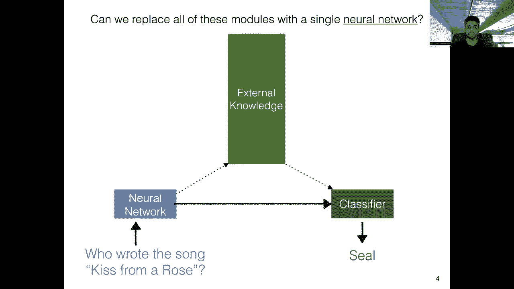

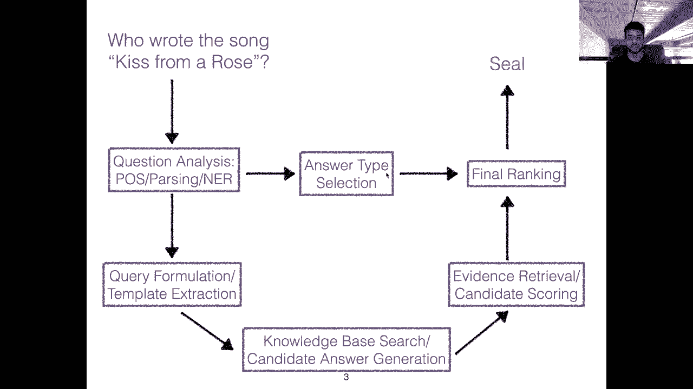

So there is a tradeoff but practically speaking， the neural network models started to produce much better results than the traditional QA pipelines。

 and so people have kind of built off this direction moving forward over the past five to10 years。

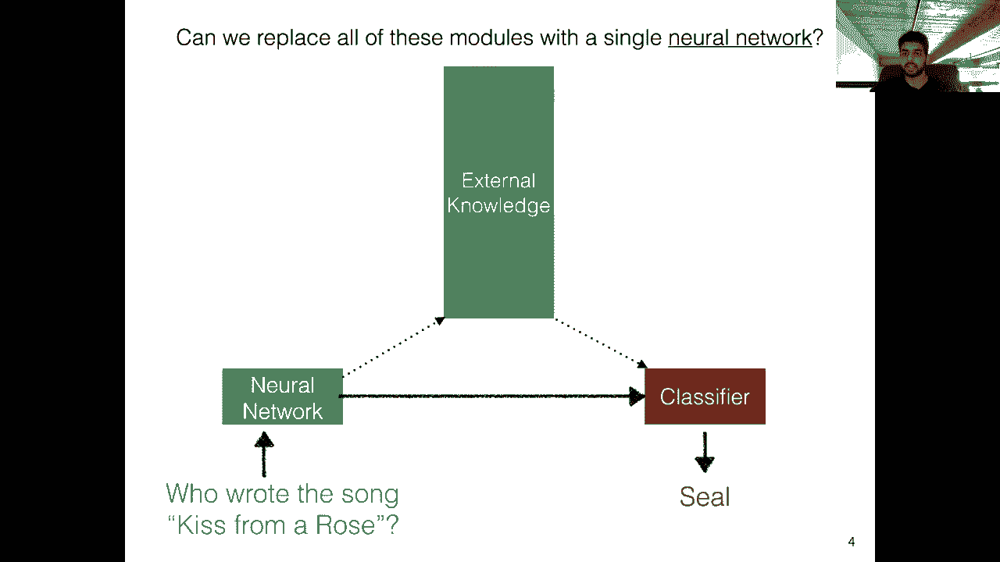

So so far I've been discussing QA like a pretty general task， but there's really many。

 many subtask that are distinct within the umbrella of question answering that require different kinds of modeling decisions and actually have different completely different formats。

 So the one that we just saw like who wrote the song kiss from a rose。

 that's an instance of factoid question answering where the answer to the question is a single entity or numeric。

 right。😊，These are most jeopardy style questions or trivia questions look like this。

 and these are important if in use cases where you know a user might want to just refresh their memory or learn a fact。

 but they don't encompass more complicated questions that require a greater deal of reasoning on the part of the model and also require the model to actually produce an answer that is maybe a sentence long or multiple sentences。

In contrast to factoid QA， we have non- factoid QA where the answer is not just a single entity。

 but it's free text right so an example of this is why is Dracula so evil right and so you can't just answer this with one entity that doesn't make sense you might want to answer it with a couple sentences or a paragraph or so on。

 And so this style of QA is much more difficult we will be covering some instances of these tasks and also what kind of models we currently use to handle them in a couple of weeks。

So so these are like very two high levell categorizations。

 but even within a QA within either one of these types there are many subtypes of question answering so one is semantic parsing question answering in which you might have a database like a SQL database of facts or triples and you want to kind of ask questions about that database so if I had you know some sort of ridiculous database that had information about people and how many victims they bit then I could ask a question like how many people did Draculaula byte and maybe this question would be converted into a sort of SQL statement executed over the database and an answer is returned。

So the modeling framework for semantic parsing QA is a little different than normal factoid QA in particular because you can't really treat this as a supervised classification problem like you can do with many instances of factoid QA。

 you actually in most cases don't have any supervision in your training data over the ground truth logical form or SQL statement。

 so the machine learning behind semantic parsing is more interesting from a research perspective。

Today in this lecture， we'll cover reading comprehension QA in quite a bit of detail as this is the subtask of QA that's kind of dominated NLP research over the past couple of years。

 it's resulted in many modeling advances which kind of culminated in Bt and Bt style variant and will sort of go over a history of these these models in this lecture。

 but in reading comprehension， you're given a document and you're asked a question specifically about that document and the assumption in this set of tasks is that the answer is a span of text within that document。

And so there are other types of QA， like community QA。

 if you look at Yahoo Aners or Qorra or something， those are instances of community based QA tasks and there's also visual question answering where you have a question about an image so yeah these are the some different types of question answering there have since been many other types of QA tasks proposed in the community。

Alright， so before I jump into reading comprehension， we have some questions。

 What are the different answer types， are these some standard categories who decides them。

 That's a great question。 It really just depends on who is designing the system and what kind of supervision they have。

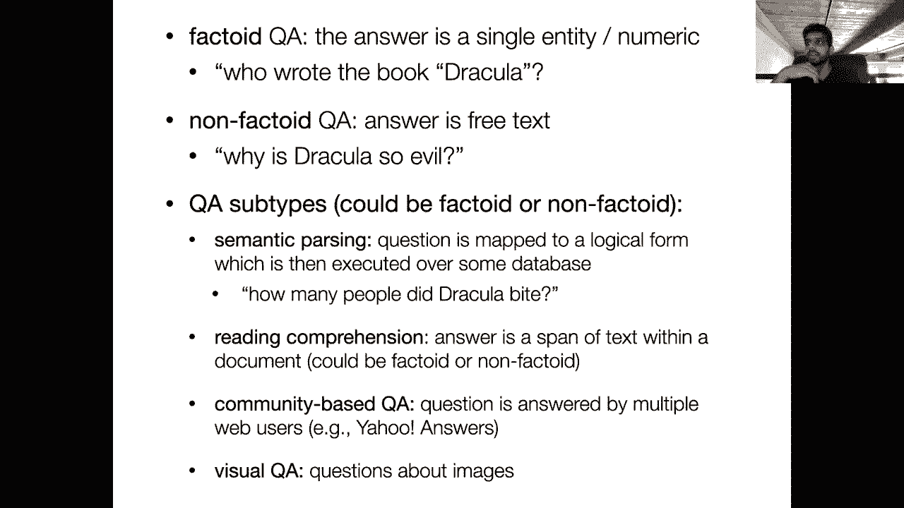

So in a kind of factoid QA case where you know about many of your answers will be entities。

 it makes sense to use categorization of entities like people， places， organizations。

 objects or whatever， but different data sets have different levels of this kind of categorization and different granularity and we'll look a little bit more of this when we talk about co-reference data sets and what kind of categorization co-reference and named entity recognition data sets used for giving us some information about the entities。

 but yeah， it really depends on who is designing the system。

 how many resources they have and how much effort they're willing to put into labeling the answers。

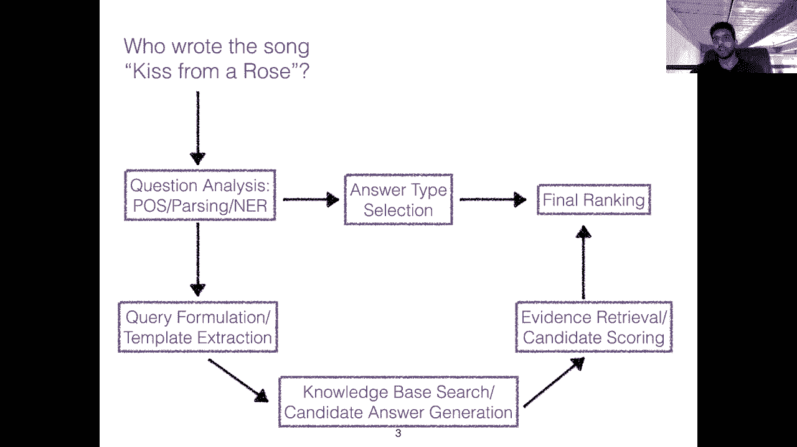

Okay， so another question， how would the objective function for non factoid QA look Yeah。

 so we've actually seen the common objective for non factoid QA。

 It's essentially treated as a language modeling problem right so I have an input question。

 I have say a paragraph or something that's my answer。

 I'm going to train a conditional language model， much like the machine translation systems we've seen to generate left or right each word of that answer in my ground truth training data set。

😊，There are issues with the setup which we'll talk more about when we get to open domain long form question answering。

 but that's the base objective， so you already have seen the objective function that's used for all of these tasks that require you to actually generate text。

What is the use case of the language model in communitybased question and answering again。

 if your task requires you to generate an answer as opposed to just select an answer from existing text like retrieve a spin from a document or something like that or just you know train a classifier to predict a particular entity out of a large set of entities if your model requires you to generate text。

 then you're going to need to use a language model to do that so that's probably the main usage of language models that setup up。

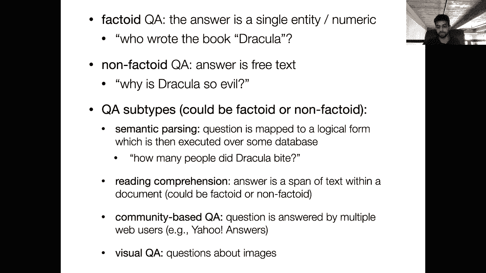

Okay， so let's now focus on reading comprehension， as I mentioned before。

 this has been by far the most influential in terms of model development and even just popularizing neural network models within NLP beyond simple text classification tasks like sentiment like in the examples we've been looking at up till this point。

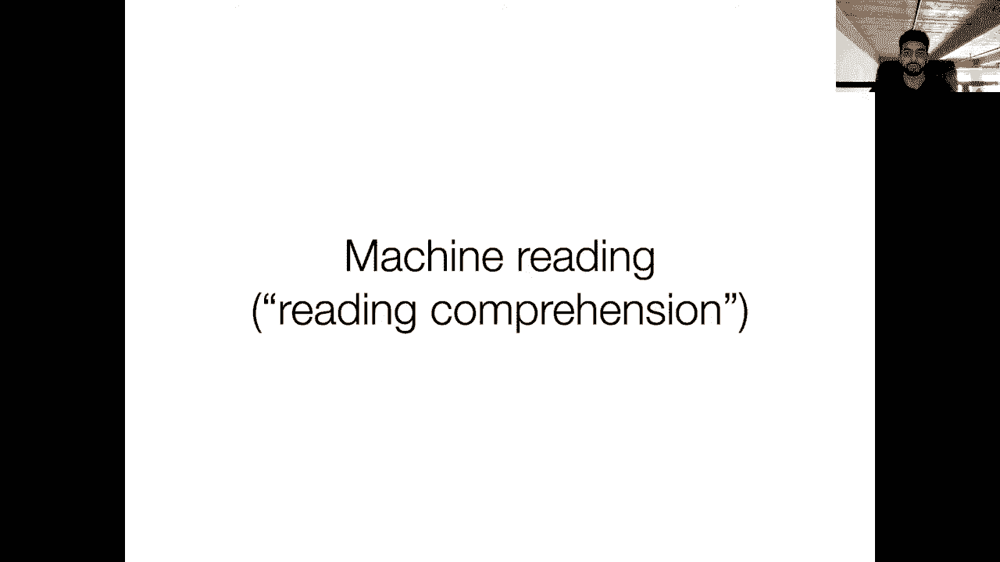

So the main dataset set， the very not the first one。

 but the first one that really attracted a lot of attention from the research community and got many people interested in building questionaning models was squad the Stanford questionansing dataset and in this data you have a short paragraph from Wikipedia like the one here。

 and you also have a question about that passage， and it makes one more assumption that the answer to this question is a span of text within that paragraph。

 So this is you know very constrained compared to the general case where if I did not have this paragraph at all。

 and I asked this question， that would be much harder for a model because then it would probably have to retrieve some evidence text and then do this kind of span selection from that evidence to produce。

An answer or generate the answer itself， but the squad data is really focused on given a small evidence document。

 can we figure out what part of that document is most relevant to the answer to the question and it assumes that the answer to the question occurs in the paragraph。

 so there's no instances of questions that are unanswerable from the paragraph。

 we'll talk a little bit more later on about the second version of S which did address directly this concern。

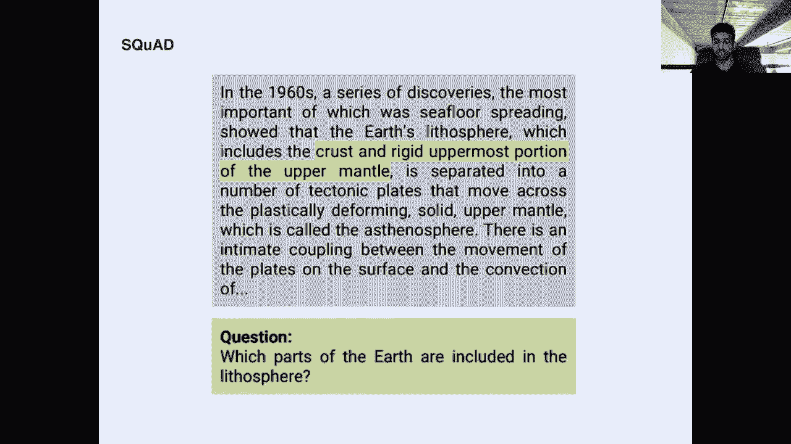

Okay， so I wanted to take you through at a high level。

 one of the prebitRT models that was used to solve this data set just to give you an introduction as to what kind of modeling setup is used to predict the answer in these span based tasks because we're going to be using the same setup in Bt just with a different architecture and a lot more parameters shared。

So again， we have a paragraph， we have a question， and our answer is a span of text within that paragraph。

And really， what we're going to do at a high level is consider all possible tokens in this passage as either the start point or the end point of the answer spin。

 So you can think of this as for every single word in this paragraph。

 I'm going to make two predictions using a softm layer。 So have two separate softm layers。

 One is going to predict is this word super the start of this answer span and the second classifier will predict is this word super the end of the answer spin。

😊，And so I'm going to make these two predictions for every single one of the words in this passage。

 for all of the words that are outside of the answer span in our training data。

 we're going to predict no， right， this token is neither the start nor the end of the answer span。

 but when we get to Denver， our start span classifier is going to have supervision to predict this is the start of the answer span。

 And when we get to Broncos， we're going to predict that this is the end of the answer span。

So this is how training works。 And if you think about it at a pretty high level， how。

 how we actually estimate these probabilities is we first get a vector representation of our question。

 So we've looked at a number of ways in which we could do this， right。

 So given this question which NFL team represented the AFC at Super Bowl 50。

 I could do a number of things。 I could put an R N over this question and take its final hidden state as the。

😊，The representation of that question， I could simply element wise average the word embeddings for all of the words in this question。

 I could run Elmo over this question and take its token level representations and somehow compose those。

 And yeah， I could run this thing through Bt right and look at the Cs token。

 and maybe that's a good representation of the question。

 So we've seen many different ways of getting a representation for a given piece of text。

 And in this equation， you can use any one of those to get some vector Q that represents the question。

😊，Next we have a vector representing each of words in the paragraph。

 so here that's called the query text and represented by P subi and so we have some vector representation of every word we could again if you go back to here we could run an RNN over this entire paragraph and take each hidden state of the RNN as a representation of that token we could ignore the RN completely and just think of the word embeddings of these words as the P subs in this equation of course that has an issue right the issue is that the paragraph hasn't been composed together so one word embedding is ignorant of all of the other words in this paragraph which is why we would like to use something like an RNN。

But yeah， we've also seen how we can go beyond just training RNNs from scratch as composition functions。

 we could use something like ElLmo to get contextualized or representations of every word。

 we could use something like Bt and look at its final hidden states to get representations of these words and so on。

 so the same kind of thing applies to getting both of these P and Q vectors。😊。

And then they just had a weight matrix， W sub S and W sub E。

 which you can think of as the weight matrix in your softmax layer。

 It's projecting this kind of paragraph word and query representation the dot product into。

Some space where you can measure whether it's actually the start of the answer span or not。

 so you get just a single scalar score for each of the words in the paragraph。

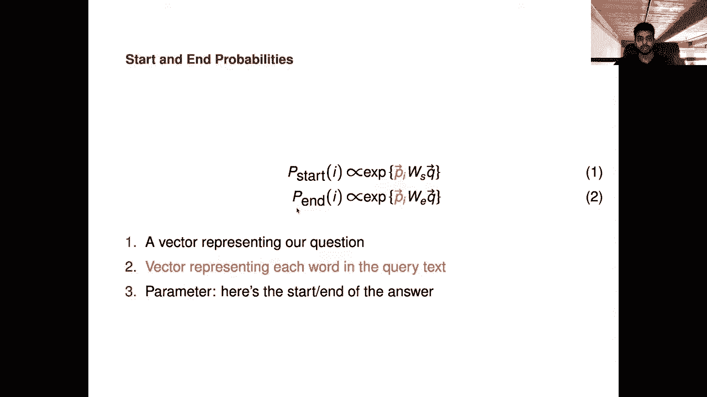

So， right， And one important thing that you might be wondering at this point is what exactly do I do at test time。

 right， Because currently the way I've set this up is that I have two separate classifiers。

 and their predictions are independent of each other， right。

 There's nothing in this estimation of P substar that relies on the position of the the end of the answer。

 right， And similarly， P N does not depend on the starting position of the answer span。

So what do we do at test time one easy way we could think of solving this is just treat the probability separately so I can run the start classifier over every single token in the paragraph。

 I can take the token that had the highest probability for the start token and I can just consider that as a start of my answer spin。

 and then I can do the same thing for the end token right so I can look at all of the tokens in the paragraph。

 look at the probability predicted by the end classifier and then pick the one that has the highest probability out of all the tokens in the paragraph。

But this approach has some major issues right So at this point， I would like ask the class。

 but I guess I'm not going do that here because of the annoying stream delay。

 but the issue is that I could run into situations where the end spin。

 the end token is predicted to be even like before the start spin that was predicted right since these are completely independent。

 I could have invalid answer spins the same token could have the highest probability for start and end and I could have all sorts of weird issues here。

 So what we generally and also like I want to avoid cases where you know the start spin is the first word of the paragraph and the end span is the last word of the paragraph which effect means the entire paragraph is the answer to the question right so I might have some knowledge prior knowledge about what these answers look like maybe they're on average very short they're like two or three words names of people said。

So I don't want to have huge answer spins。So in practice。

 what we do is we look at every single span thats you can， you can make in the。

In the paragraph and you multiply the probability of that span。

 having the start probability and the end probability associated with the start and end positions of that span and you can make this faster by just filtering out the spans that are too long that you think are way too long to be an answer to these questions so you could。

 for example， set a limit that my answer spans can be more than a sentence long or something。

 So then you just consider all spans up to a certain length and multiply the start and end probabilities associated with the boundary words of that span and a test time you pick the span with the highest product of these start and end probabilities。

Okay， so this general approach of solving these reading comprehension QA tasks is exactly the same approach we're going to look at when we move to models like Bert。

 We're just replacing the way in which we get the representation of the paragraph in the query。

 and we're importantly not going to learn these from scratch like all of these previous models are doing。

 but we're going to fine tune our Bt like we discussed last last video。😊。

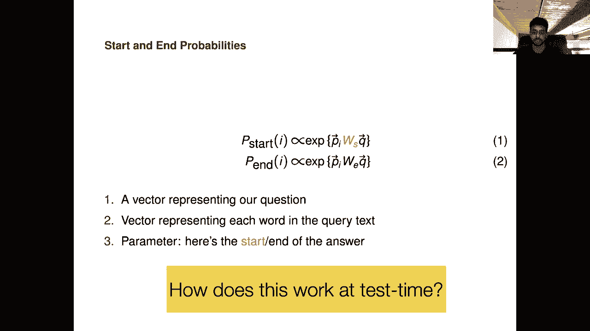

So before we get to how we use BRT for this task， I wanted to just show you an overview of a couple different architectures that had been proposed prior to the advent of transfer learning that just so you can get a sense of how complex this kind of modeling subar was in this model。

 the Stanford attentive reader we have an LSTM here on the left。

 a bidirectional LSTM for getting a representation of the question were taking a weighted sum of the hidden states to get a single vector。

 we're doing some attention between this set of LSTMs and another set of LSTMs that we're using to encode the passage there's a lot of information like lowlevel linguistic information parts of speech。

 named entities we see here Beyonce is marked with this person tag all of these things are。

Edied passed through RNNs， LSTMs， we have finally some combination at the top。

 and we have our start and end classifier at every token。

So all of the parameters here are being trained from scratch other than the word embeddings。

 which are initialized with pre trained word embeddings from G or word Def or something like that。

But overall there are a lot of things being learned from scratch。

 the whole composition process is being learned from scratch here with these LSTMs。

 these recurrent connections and as we've discussed in the prior lectures。

 we generally want to avoid， as much as possible learning things from scratch from our downstream data set because those are always going to be smaller than the amount of unlabeled data that we have and we know that language models learn very powerful representations of text without having any additional labels。

 so why do we want to force our QA model to learn how to all these general properties of language as well as how we actually extract question I mean。

 answers out of these passages。😊。

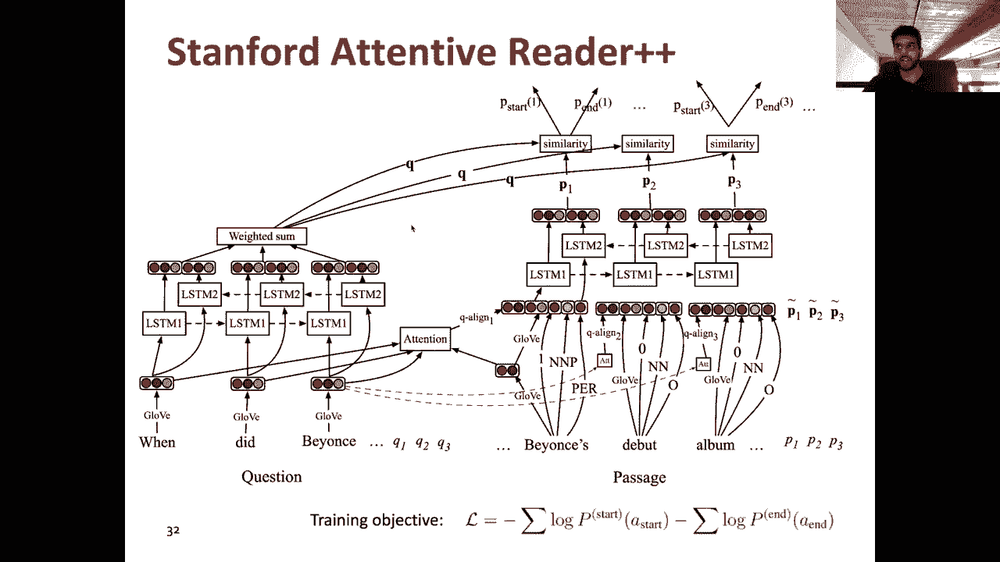

Another model that was commonly used for the squad style question answering was by DAF essentially these models are focusing on adding as much attention as possible within the question and the paragraph so here you see there's two types of attention we're using the query。

 the question representation to augment the context， the paragraph。

 the word embeddings in the paragraph we're also using those vectors from the paragraph to get a more contextualized query representation then we pass this through several recurrent layers and finally at every token we predict the start end span so the same concept of predicting start and end at every token we're just changing the complexity if the model that's used below these final two classifiers。

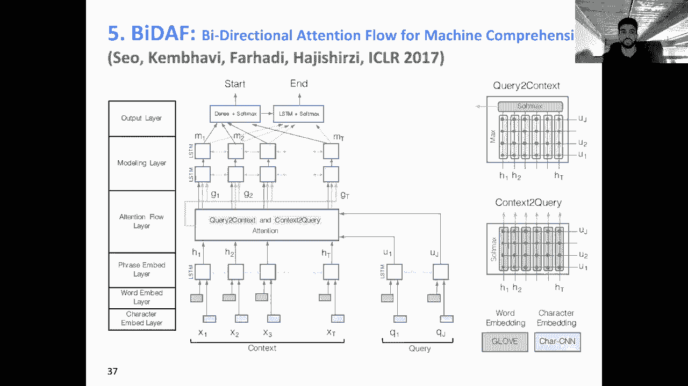

There's even more， there's this co attention encoder that was proposed， all of these。

The advances pre Bt were mainly focused on how can we develop the most powerful attention mechanisms to link the question and the paragraph as closely together as possible。

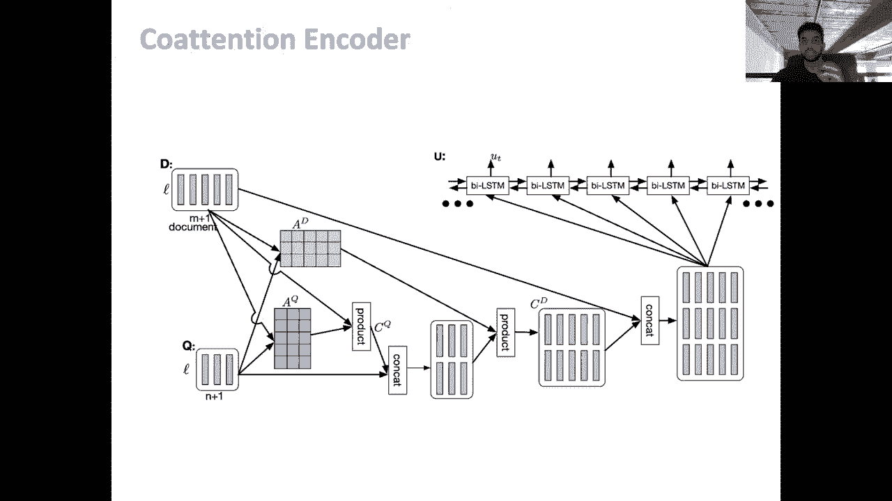

And so by the end of 2016 we had several different models that were proposed to solve the squad task。

 you can see here oh， I should mention how we evaluate these things so assume that I have a model and my model produces some answer span given a question in a passage and I also have a ground truth answer for that particular question so let's say it's like in my test set what we do to get this F1 score is we look at the word level F1 from comparing the model's predicted answer to the ground truth answer so basically like how many words in the predicted answer were in the ground truth answer intuitively's something like that。

😊，So you can see that human performance on this task is really high。

 almost always humans produce an answer that's either exactly identical to or very similar to the ground truth answer。

 the EM's column here is exact match so how often does the human in this row produce an answer that has the exact same tokens in it。

 the exact same span as the ground truth answer？😊，So they do this 82% of the time。

And we see that these models are they're not great， right， We have a logistic regression baseline。

 which was in the original paper that introduced the squad data。

 This one doesn't have any neural network components at all associated with it and it has an F1 score of about 51 and all of these subsequent models are using more and more complicated neural networks。

 they get to 6773 and so on and importantly all of these models are trained from scratch on the squad data。

 The only thing they might be transferring over is using pre-trained word embeddings。

 but all of the composition function parameters， like the recurrent parameters of the RNNs or LSTMs。

 all of these things are being trained from scratch using the squad error signal。😊，Okay。

 so now let's move to how we use BRT to solve this task in actually a very clean manner with as few external parametersmeter that are initialized randomly entrain from scratch as possible。

 it is very simple。 So I essentially just concatenate the question and the paragraph together into a single sequence。

 and they're separated by this special separator token。 So if you look down here。

 you see token1 through N。 these are from the question。

 and we have token1 through token M that are from the paragraph。

 and we have this special separator token to help the model distinguish them。😊。

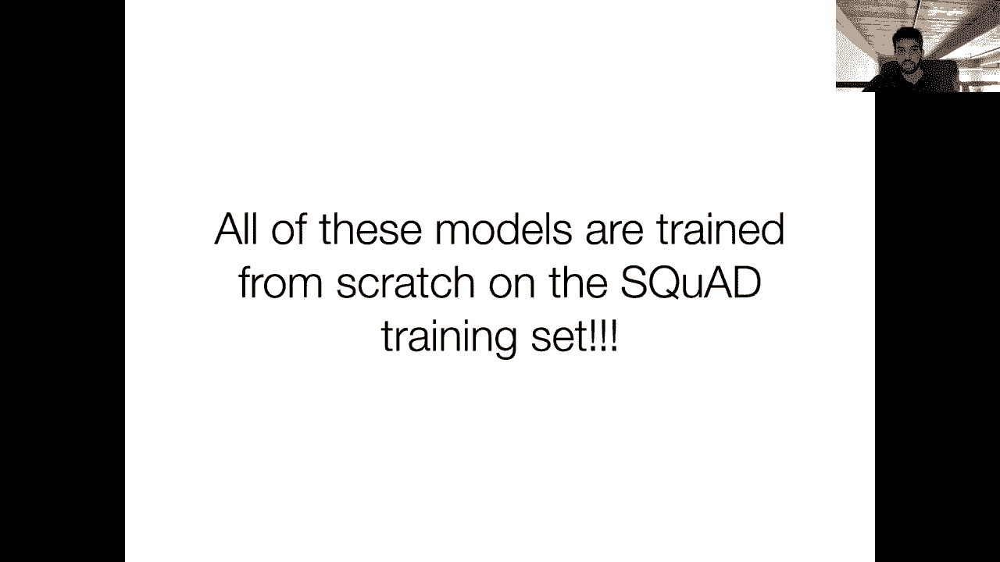

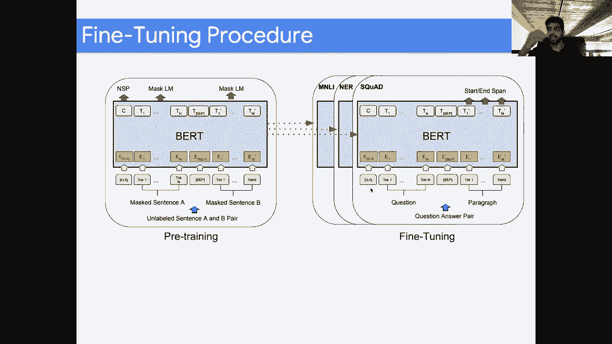

Okay， so now we just feed this entire concatenated sequence into Bt。

 so we get our you know our transformer layers， we have 12 or 24 layers in between this yellow part and this green part and then the final layer of Bt gives us a single representation for every single word in this concatenated sequence。

And we really only care about the paragraph， right。

 because we know that the answer to this question is somewhere within this paragraph。

 So we simply just put our start and end classifiers on top of every single one of these final token representations that come from Bert。

From the paragraph and we do the exact same thing that we just went over from the previous models。

 we predict for every token is it the start token or is it the end token and at test time we do the exact same thing of picking the span that has the highest product of start and end probabilities。

But you can see here that what have we actually transferred over from the pre training phase。

 literally everything in this blue box， right all of the burnt parameters have been transferred over to our squad task。

 We're not learning any of these composition parameters from scratch。

 the only thing we're learning from scratch is the two classifiers。

 the softmax layers to predict start and end of spin。😊，And you might be wondering， well。

 how does the model know like what the question is， right？

 How does it do attention between the question and the paragraph， But Bert naturally does this。

 right， It's a transformer。 It uses selfat。 So every representation of the paragraph is attending over every token of the question remember。

 and we have multiple heads。 They're able to look at different types of information。

 We have multiple layers。 We're stacking this attention。 So Bert already is a very。

 very powerful composition function。 And this simple setup。

 just applying Bert to the squad task gives massive gains on squad， as we'll see here。😊。

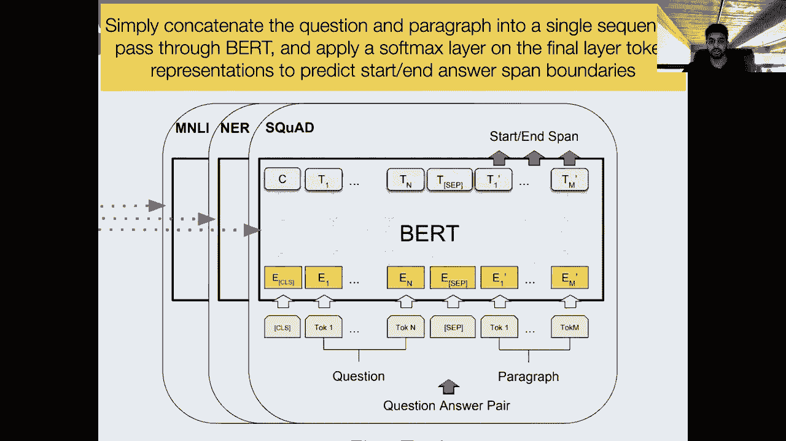

So on 2019， when Bert came out and was applied to a bunch of different tasks。

 you see the new leader board。 So here's the same human performance of 82 exact match in 91 F1 and the single model of Bt got even higher exact match than humans。

 So it was 85% of the time。 It gave you the exact same answer span as what was in the ground truth。

And you can get even higher performance by enssembling many different birdt models together。

So that means you just train up a bunch of bes that start from different random initializations and you ensemble their predictions together。

 meaning you basically just average the token level predictions of start and end span before you figure out what the final answer span is。

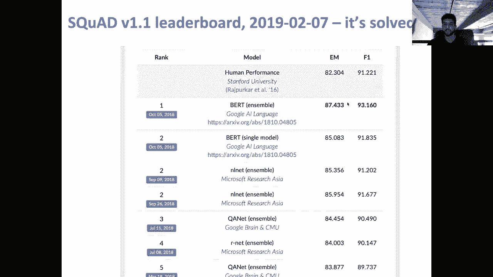

So this is super impressive， right， We went from 2016 end of 2016。

 we were in the 60s and 70s for exact match in F1 to superhuman performance。

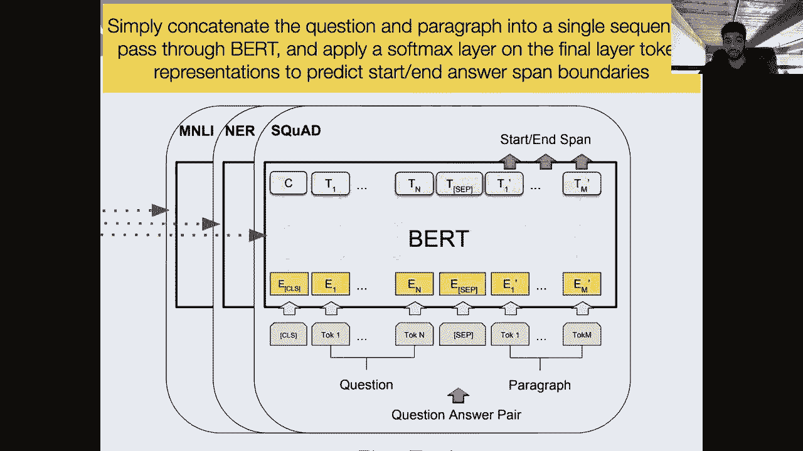

Of course， there's a lot of hype with this result people。

 there were some uninformed reporters writing articles like neural networks are better at answering questions than humans。

 but now we should think back to the limitations of this data set right it assumes that the answer to the question is in this paragraph somewhere。

 it also assumes that the paragraph， the documents are it's like short paragraphs and the types of questions in it are not particularly interesting。

 they're mostly related to entities and relations of those entities。

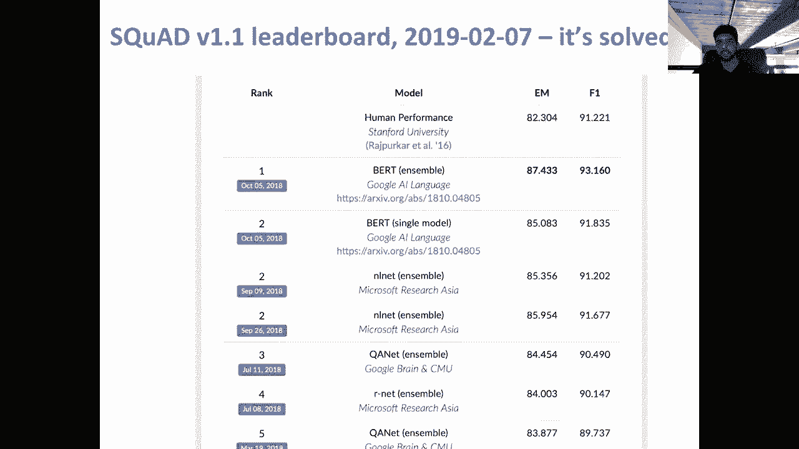

But still it's an impressive technical result right。

 we without doing any sort of QA specific modifications to the architecture。

 we made all of these fancier QA architectures that have been proposed previously like all of these types of models with their numerous LSTM modules and attention modules。

 all those don't really matter once we have something like Bt。

 which has been pretrained on an insane amount of unlabeled data and its architecture is good enough to just solve squad without like all we're doing is concatenating the question in the paragraph together and passing it through Bt。

 There's nothing being complicated about this on the downstream side， but yeah。

 it achieves significantly better results。😊。

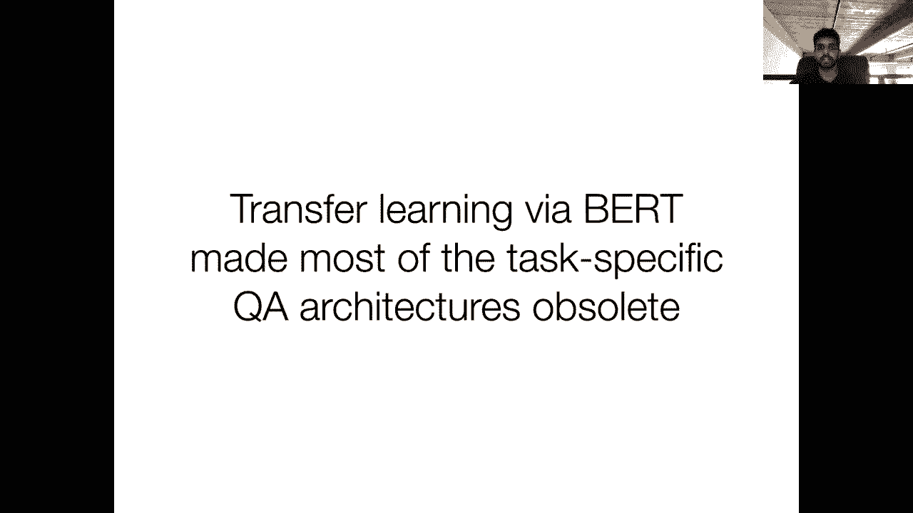

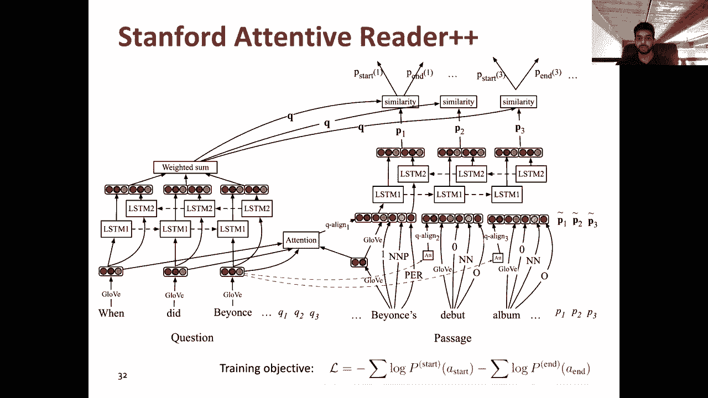

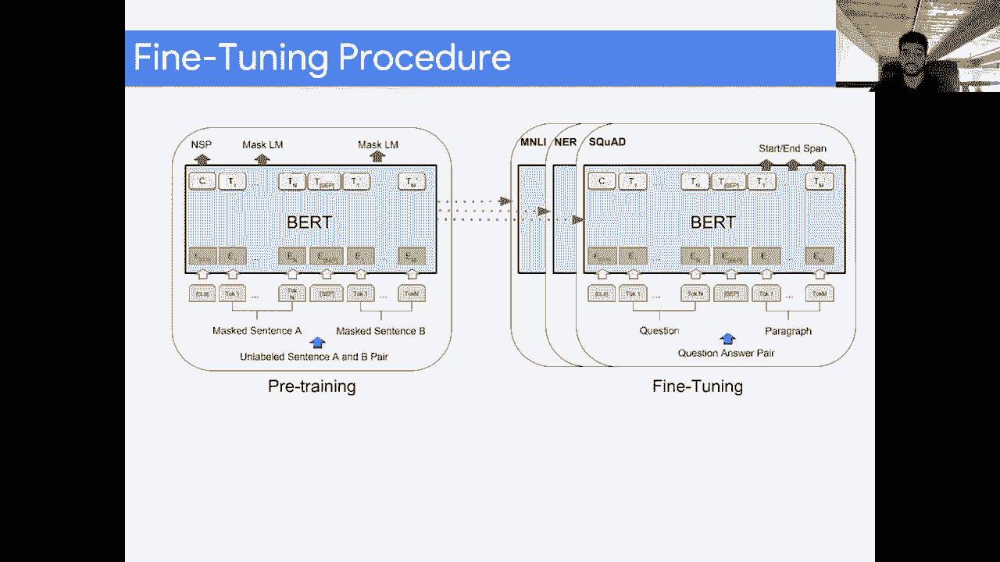

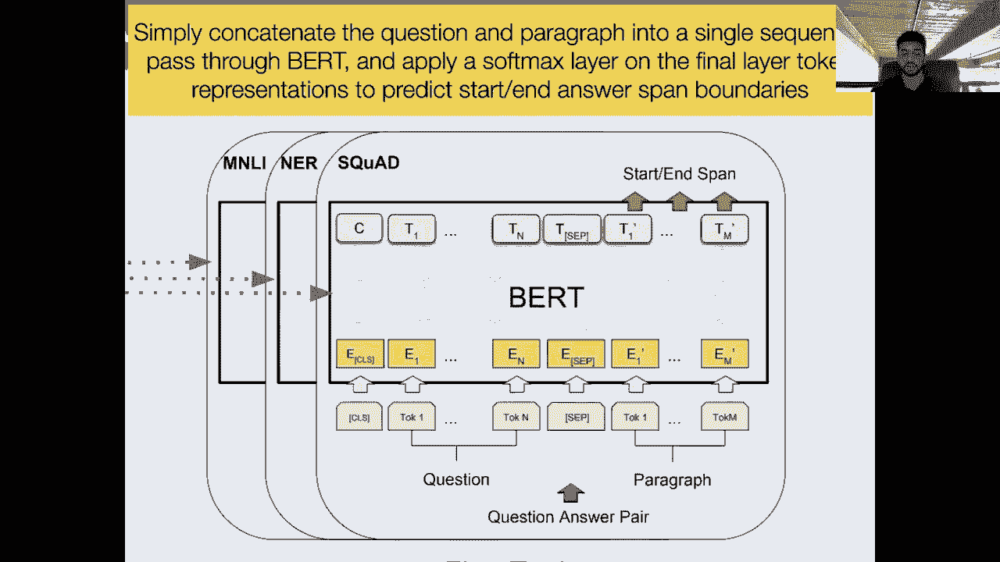

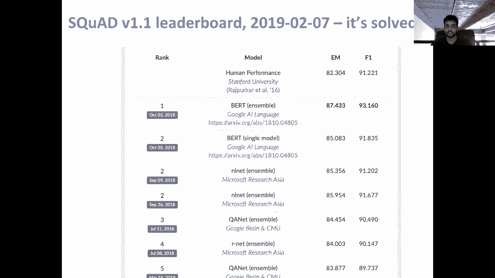

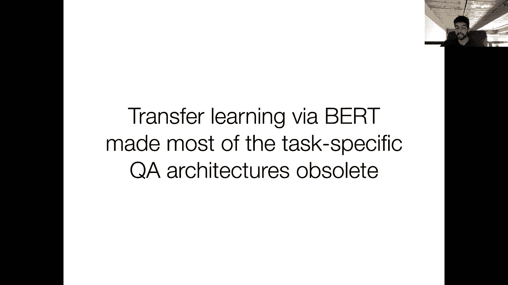

So now let's move on to a more challenging case and we're still going to use our same squad setting。

 We have a question the answers and we have a paragraph， but in Squa 2。0。

 there is an additional quirk that some of the questions are unanswerable from the paragraph。

 So here I have this paragraph and my question when did Genghis Khan kill Great Khan that question is not answered by this paragraph。

 And so we would like our model to predict no answer。😊。

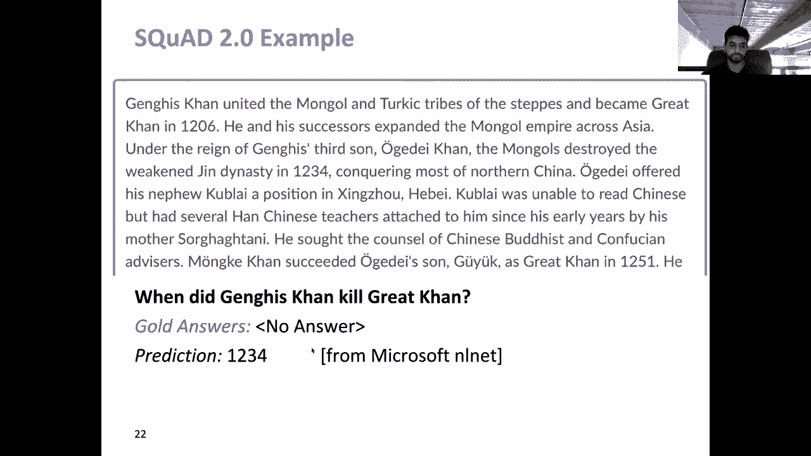

And if you use an existing squad model， like one of these Bt models。

 because it was trained in a way that it has to produce the some answer span， right。

 It has no way of telling you that the question is unanswerable。

 this Bt model would produce some sort of answer。 So like in this Microsoft and Elnet。

 which is some burnt like model， is probably alsot based on Bt that was done by Microsoft。

 not Google， This model predicted 1234， which is， you know， a pretty reasonable prediction。

 given this paragraph， right， at least it gave us a year a date。

 But this year is not associated with this question。

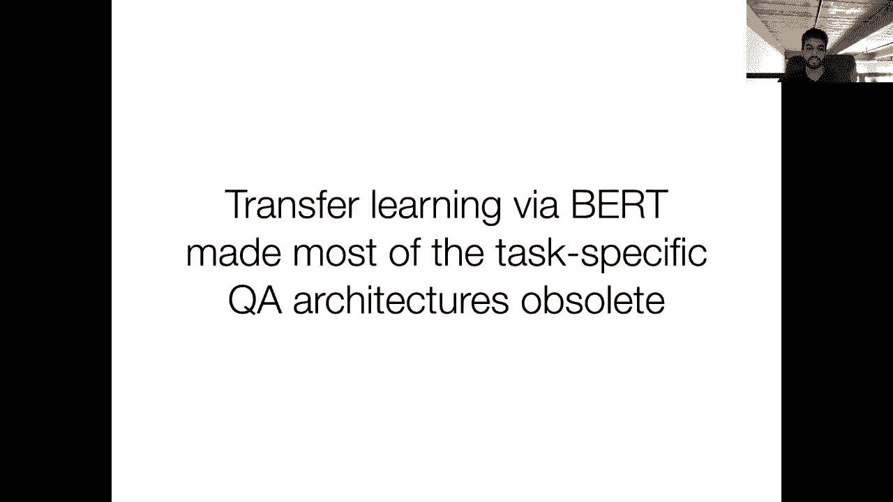

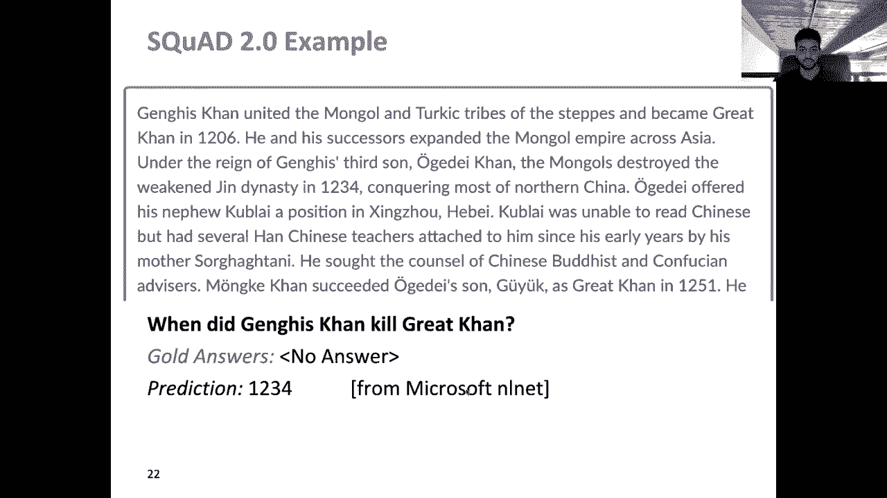

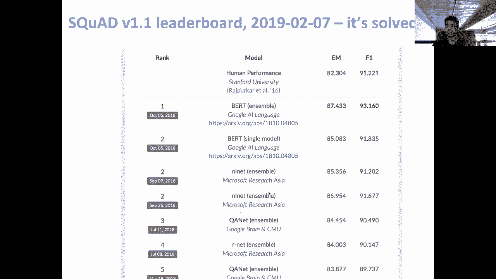

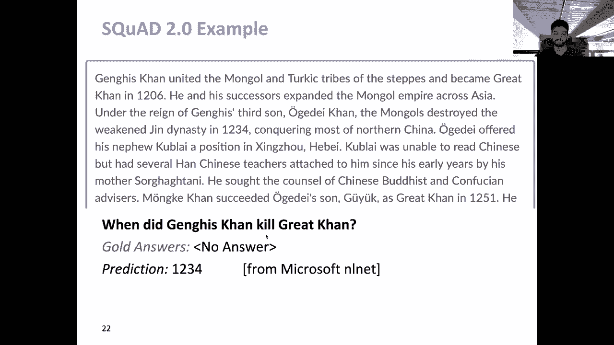

So even BRT can be kind of very easily modified to support this NOA answer functionality。

 you could even just consider adding a NOAA answer token to your input and forcing the model to just predict that that token is the start and end of the answer span you could also do things like if your span probability the one that you find that test time is low is lower than some threshold。

 then you can deem the answer to be the question to be unanswerable。So here again， before Bert。

 so we see all of these entries on the Squa leaderboard from 2018 Before Bert。

 we had all of these models that on Squad 2。0 were getting F1s and somewhere in the high 60s。

And it was that that， you know， this task might be challenging for Bert， right。

 It has to now learn whether or not a question is answerable or not。

But it turns out that it's not so challenging After all。

 I'm sure nowadays if we go to the Squa2 leaderboard。

 I actually should have done this and updated this slide。

 but I think we're probably past human performance on this new task as well。

 But just look at the top five or six models on this page literally all of them are using Bt in some some way。

 right， So this just kind of underscores how influential this paradigm of transform learning with large scale transformer language models has been to NLP。

 and these are huge improvements，85，87 compared to just a year prior。

 these were all the state of the art on this data set at some point。

 you even see the ElLmo results here just much worse So the combination of。😊。

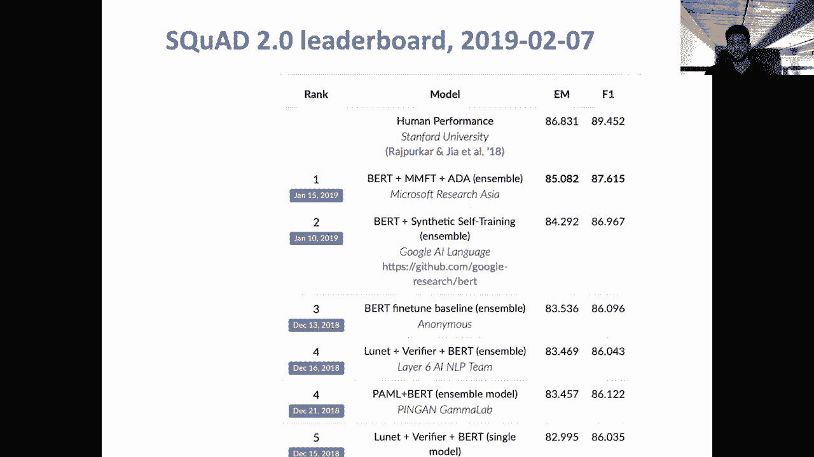

Pre training on a huge amount of data with a huge scale model is basically the recipe for success。

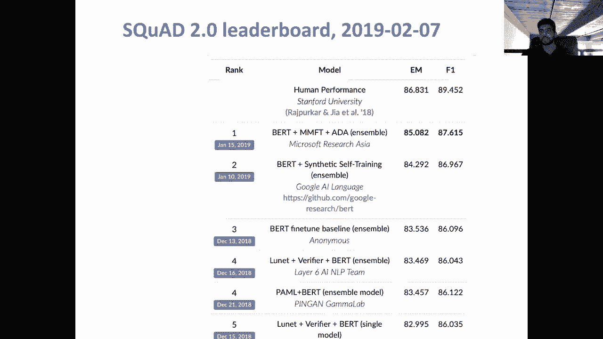

Okay， but， I mean， yeah， what does it actually mean to be better than humans， right。

 Is it really superhuman performance， And， no， it's not。 And anyone who says so is just uninformed。

 all these systems， even the burnt ones make still make dumb errors。 So here。

You have this question about Chinese dynasties。 and it asks what dynasty came before the Yuan。

 And here we see in our paragraph in official Chinese histories。

 the Yuuan dynasty bore the mandate of heaven following the songng dynasty and preceding the M Ming dynasty。

 So the question is what dynasty came before the Yuan。

And the the answer says it was preceded by the Ming dynasty， which is the answer to this question。

 But you notice that the wording here is slightly different， right。

 It doesn't explicitly say before the Yuuon， it says the Yuan precede， preceded the Ming dynasty。

 So it kind of swapped the order of the the two words。 and this confuses the model。

 the model predicts the song dynasty as the the number one answer here， even though that's the。

The dynasty that， oh god， this the sentence is now confusing me。嗯。Following the。喂。呃。Oh， sorry。

 I completely switched around the right。 So the correct answer is the song dynasty because it， okay。

 wow， I'm glad this was live。😊，Yeah， so I completely misread this sentence， but yeah。

 the correct answer is a song dynasty and the model predicts just like I stupidly did the Ming dynasty。

 So maybe this isn't such a dumb error。 It's hard for me to even read this sentence honestly。

But anyway， it makes errors like this， which are based on things like synonyms and syntactic structure differences between the question and the text and the passage and these models rely heavily on string overlap between the question and the paragraphs so for questions that are more vague that are maybe paraphrasing some text and the paragraph。

 those tend to be harder for these models。

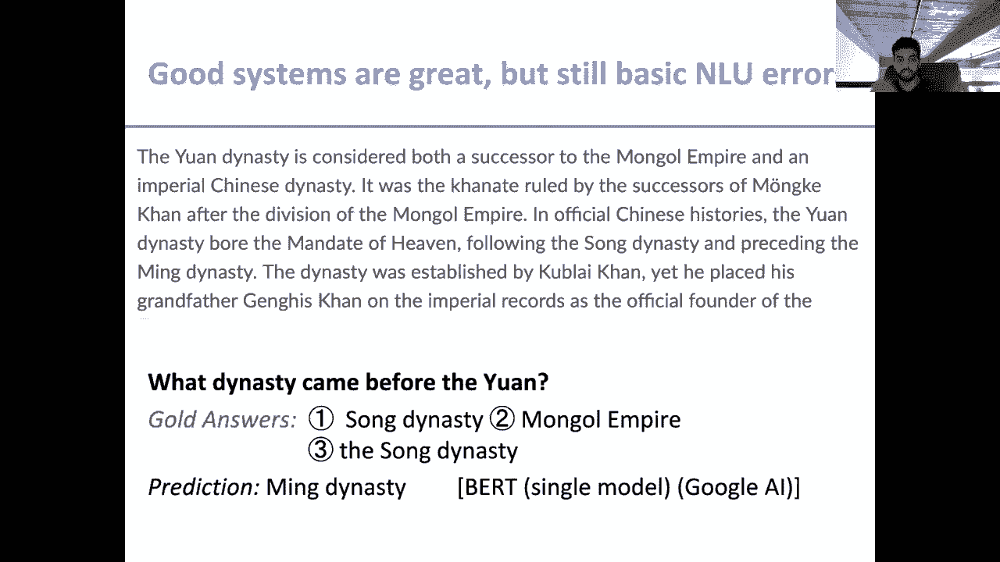

Okay， so let's think about some other limitations of this data set of course all of the answers are span so you can't ask any questions like yes or no questions or having a model count up different instances of a particular example or you know ask why something happened unless that's easily answered by a span also and we'll talk more about this later too how do you actually create a data set like Squa Squad was created through Amazon mechanical Turk so a bunch of crowdworkers were given these Wikipedia passages and asked to write questions about them So it wasn't a case where the people writing the questions actually wanted to know the answers they were specifically told look we're creating this QA data we needed to write questions about this paragraph but it's not a genuine need on the part of the person writing the question。

That they wanted to know the answer。And some other data sets that we'll talk about a little later tackle this issue of the type of reasoning required to solve these squad style questions is very。

 very simple， so you barely need to model things beyond just a single sentence in the paragraph。

That said， it's still been very useful of course， at developing models。

 validating the effectiveness of models like BRT， and so on。

 so it is a very influential data set in the grand scheme of not only just QA research but also NLP research as a whole。

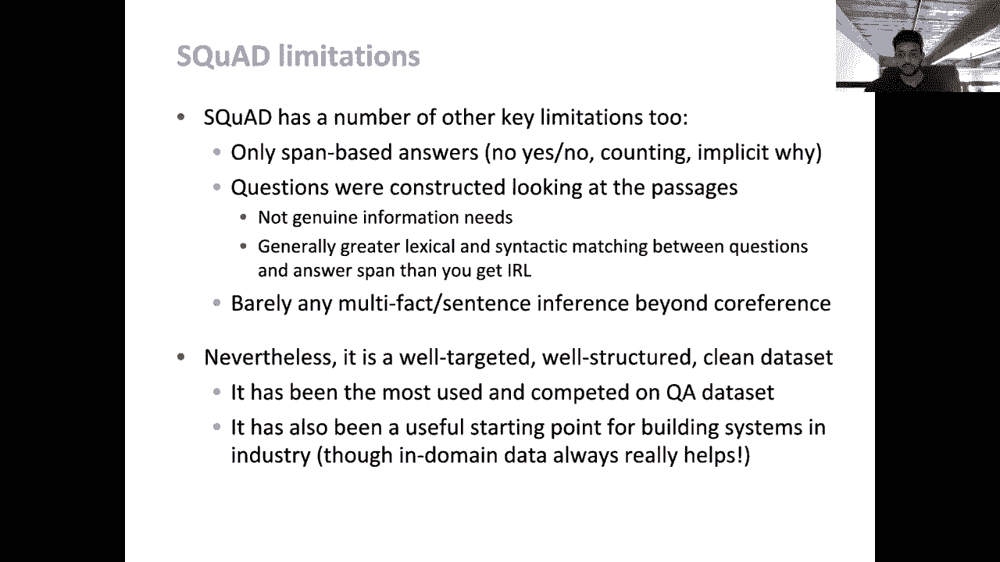

Okay， so now we're going talk about a couple variants of the squad style setup that kind of address some of these limitations and one of them is conversational question answering。

 So here and this is more getting to the application of say a conversational agent like an Alexa or something where you you ask the agent a bunch of different questions and they're all kind of related and getting the same overall topic or something like that and you might want to as the person asking these questions refer to previous answers or previous questions when you're asking them。

 So in this example， this is from the quack data which I actually helped collect these are dialogues that two mechanical Turk workers had about a Wikipedia articles。

 So this one's about the origin and history of Day。

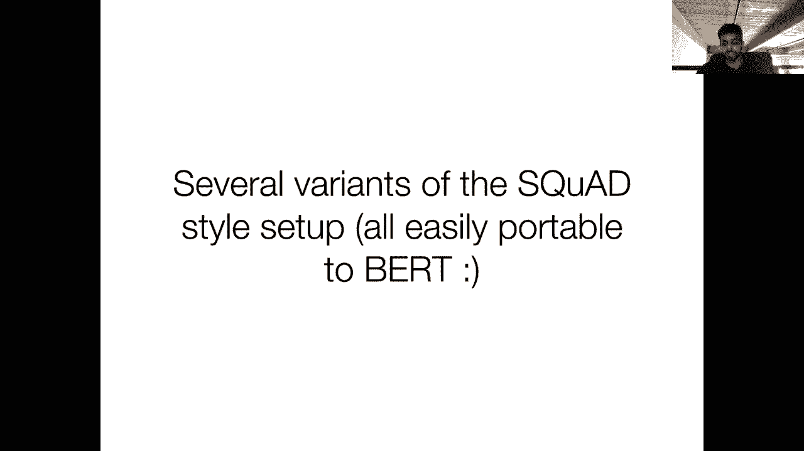

And we might have questions like what is the origin of Daffy duckuck What was he like in that episode so you can see that the second question this word he here is referring to Daffy D。

 it's a coreference it's referring to something that was talked about in a previous question and yeah you can see here why did they add the list。

 this list is a reference to the answer from the previous question this question is pretty interesting is there an unofficial story。

 it's in response to the previous answer revealing that there's an official story in quotes which kind of implies that there's there's an unofficial story So this kind of data can also be solved by Bt style models and the very naive。

 simple way that's also quite effective is just to stuff your context with previous question and previous answers so you can imagine instead of included。

Just the current question in my input to BRT I can concatenate the current question with all of the previous questions and their answers of course this doesn't scale to settings where I have a very long dialogue and yeah it's also not very satisfying from a modeling perspective。

 maybe you want a model that can more intelligently retrieve answers and bits of previous questions but B style models still kind of dominate this conversational QA paradigm and there are many other data sets that we can check out to that you can check out if you're interested in this。

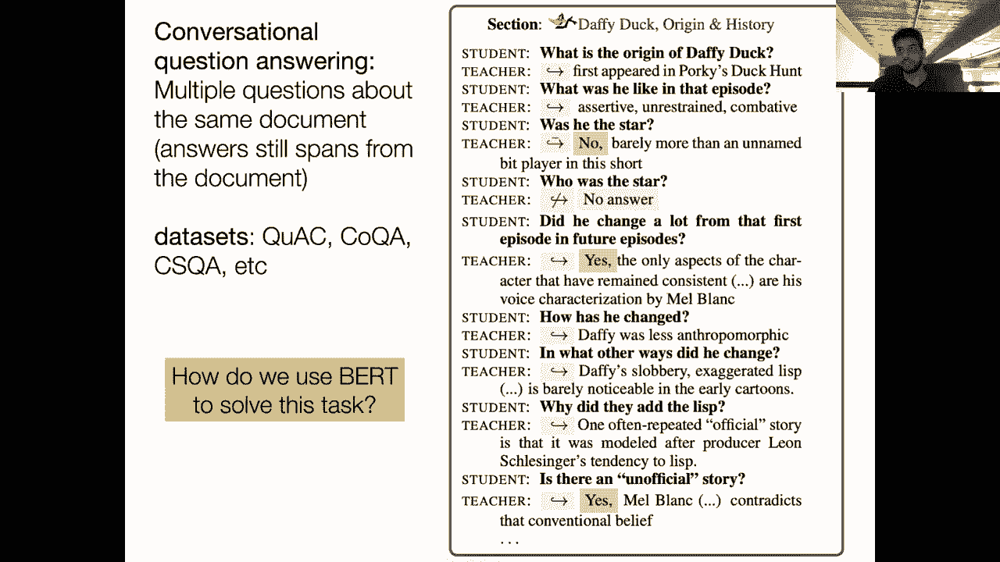

Another type of QA data that has been proposed kind of after Bt solved Squa is to get at the aspect of reasoning。

 so whatever your definition of reasoning is， it's kind of safe to assume that S did not require a lot of complicated reasoning and so data sets like hotpot QA and。

Kangaroo， I don't know how you're supposed to say that kangaroo。 they。

 they're specifically built for multi hop question answering。So I might have this paragraph here。

 these two paragraphs where a model needs to kind of represent both of these green highlighted spins of text and learned to make the inference that Jane Eyre is the novel that's being discussed here。

 and it was published under this pen name and Jane Eyre is also what this Tellella Nola is based on。

Oh， sorry。 the reverse。 The Tele Noella is based on Janeer。

 So when you get a question like this telelen Noella was based on a novel published under what pen name。

 the model has to integrate information from both of these green spans。

 It can't answer this question based on just one of them alone。

So that was the original motivation of these data sets since then。

 people have shown that datas like hotpot QA aren't actually multihop。

 like you can even get a model that produces solid answers without having access to one of these paragraphs。

 but the intuition is there， right like you want to force the model to kind of make these multihop inferences rather than just kind of retrieving a single sentence。

And again， not to belabor the point， but your standard Bt style architecture can easily be used to solve this kind of task too。

 right， you can just concatenate both of the paragraphs together with the question and feed it through Bt and this is still your same span style start and end prediction task。

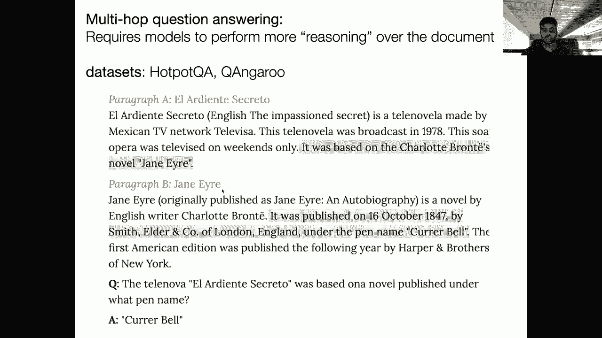

Okay， so some more interesting QA tasks， at least from my perspective， our long form QA。

 where the answers must be generated and not extracted from a document。

 So in these settings like the previous the question that was asked before。

 we're not predicting a start or end span of the answer we're rather trying to generate in a language modeling setting the words that make up the answer so。

This example here is from the E L I 5 data set that Facebook released。

 which if you've gone to the explain， like I'm 5 subreddit。

 all of these questions and answers are from there。 So here you get a question like。

 how do jellyfish function without brains or nervous systems。

 And the data set also include some supporting documents， although they're different settings。

 So you can have models that don't have any access to supporting documents and must just from the question alone。

 generate an answer。So this is an answer from the ELI 5 subreded。

 but they provide these supporting documents so that you can also design models。

 conditional language models that can access the ground truth supporting documents to help them generate this answer。

So we'll talk a little bit more about this kind of setup later on when we're talking about conditional text generation tasks。

 but in the open domain setting， this is probably the most interesting future direction of question answering research is the model doesn't have access to any sort of supporting documents like small set of supporting documents。

 so like in Squa， we have a single paragraph in this data we have a small collection of supporting documents。

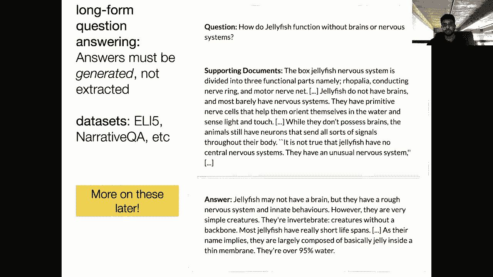

But imagine you're given this question and your model is asked to just produce an answer。

 So you might want to。Retrive relevant evidence over some large source of documents like Wikipedia or the common crawl。

 but in contrast to the sort of pipeline system that I described earlier in this setting we might want a neural network to learn to retrieve relevant documents and we'll talk about several interesting variants of this neural retrieval setup to help with answer generation later on。

Okay， so I think since it's been 57 minutes， I will stop here。 I had a couple more fun slides。

 but they're not super important。 So I wanted to also briefly mention what we're going to be talking about on Monday。

 So I've this time， at least managed to put the readings out for， for next times lecture。

 but we're going to be talking about。嗯。Wait， where's the next slide here？

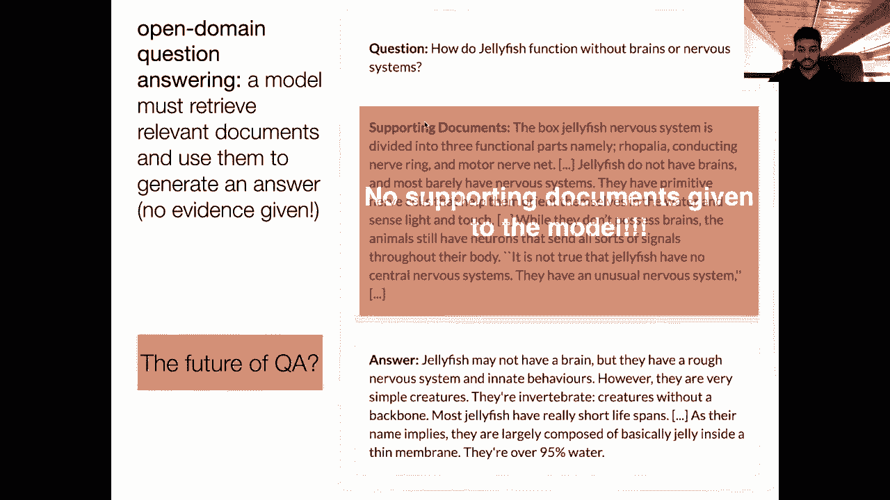

We're going to be talking about how so I've just described like a ton of different Q way data sets and tasks and at their core。

 they're kind of similar they require a model to understand a question。

 understand a collection of documents retrieve relevant information from those documents and either extract and answer or generate and answer。

 but you can imagine that a lot of the same kinds of reasoning is required to solve all of these tasks and in general this doesn't just apply to question answering。

 it could apply to text classification problems， maybe the same style of reasoning that's used to perform sentiment analysis can also help models that are trained like opinion mining or deception detection or various other text classification tasks and so one very interesting。

Very new also line of work is。Not only transferring information from our language model to the downstream task。

 but also transferring information from models trained on other data sets in the same class as the current dataset set to the dataset that we actually care about。

 So what this means is if I have my target data that I want to maximize my performance on is S And I also have a model trained on hotpot QA。

 Can I use my model trained on hotpot QA to get better performance on S So this is like another level of transfer learning beyond just transferring from language models or mask language models。

😊，And this is a very promising direction moving forward because we now have many。

 many different QA data sets and classification data sets， sequence labeling data sets。

 can we share information across all of these things to improve our performance so that's what we'll be focusing on for next time and I will conclude there I guess there were no more questions if you have any more please ask them on。

😊。

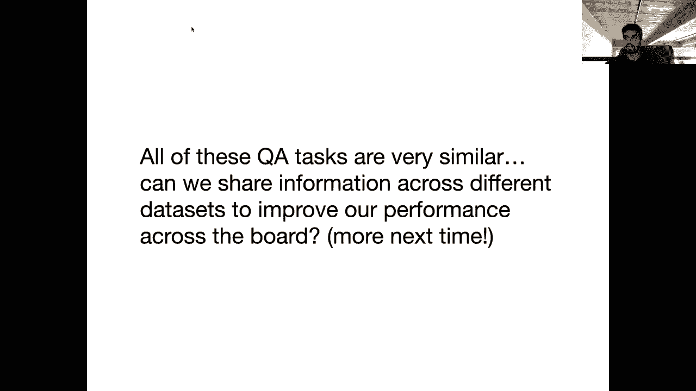