# P12：L9- 下游任务迁移学习 - ShowMeAI - BV1BL411t7RV

Okay， Henry I think we're live， please， if you're watching this type something in the chat box。

 so I know that it's on Also last time my chat box wasn't not updating for some reason， so。嗯。

I actually did not get a chance to look into why that was happening。

 Hopefully it doesn't happen again。 All right， I see one person。Two people。

 I'm just going to assume it's working。Okay， if I notice any periods where。

Like there have been suspiciously few questions， then I will。Try to like。

 I actually don't know what I'm supposed to do。 Maybe refresh the。YouTe thing or something。All right。

 so what are we talking about today hang on let me make sure this iPad is working。Okay。So。

 today's topic is intermediate。Task。Fine， tuning。And what I'm going to do is give a bit of intuition first on the iPad。

 and then I'm going to switch over to some slides to talk about some very recent research that actually one of the Ts tou has done in this line of work as opposed to all of the previous stuff that we've learned this direction is incredibly new。

 and it's seeking to build on top of selfsupervised pre-training using things like language modeling and mask language modeling。

 but here it's trying to take advantage of other labeled data sets， not just the downstream data set。

So before we start， I wanted to briefly go over maybe the most obvious way in which we can incorporate different downstream tasks into the same model to benefit a particular task that you care about。

 so let's just set this up。Imagine。I am trying。To optimize。Performance on squad。

So remember that S is the Q A data set that we talked at length about last time。 and in S。

 you have like a passage。 you have a question about that passage and you're trying to。

Train a model to figure out what that span， the answer span is。嗯。But so far。

 we've just assumed that we have access to a large unlabeled data set for pre training。

 and we also have access to our downstream training data set， like the squad training data set。

 right， So to draw this out， it would look something like。

And this was basically a figure from one of our earlier slides， we have lots of unlabeled data。

We feed this into squad， sorry tip Bt。Right， and we pre traineded Bert using the mask language model objective。

We'll call this the pre training step。 And then we have access to our squad。Training set。

This is going to form our source of supervision， which we're then going to use to fine tune。

The B language model into a， let's call it a squad specialized。Model。Right。

 so this is the paradigm that we've talked about to this point， right。嗯。We start with Bert。

 and then we fine tune it to get the downstream model。

So what this ignores is that I also have access to numerous different labeled data sets that could potentially be helpful at increasing my performance on S。

One obvious example which kind of ties into what we talked about last time is there are numerous different QA data sets right so there's hotpot QA quack news QA。

 lots of other dataset sets that we discussed last time and you might imagine that having access to some of these other QA data sets can help further boost my performance on S。

So one question。Can we leverage。Other。Q， A data sets。To improve。Our squad。Test time。Herform。

And so there are many ways you could think about doing this。

 The most standard way is to use multi task learning， so。Wenwei。Multi task。3y。

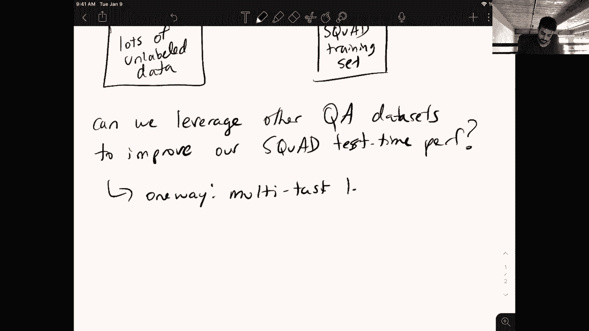

So， here。

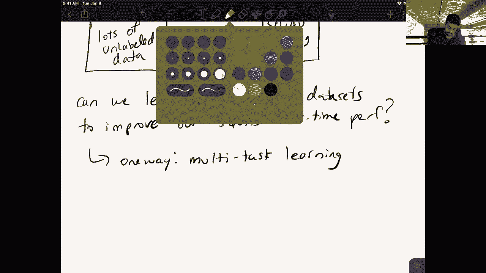

We're just going to during this fine tuning process。

 include examples from other data sets into the fine tuning process。

 So if I take the same setup here。Can you just copy this。

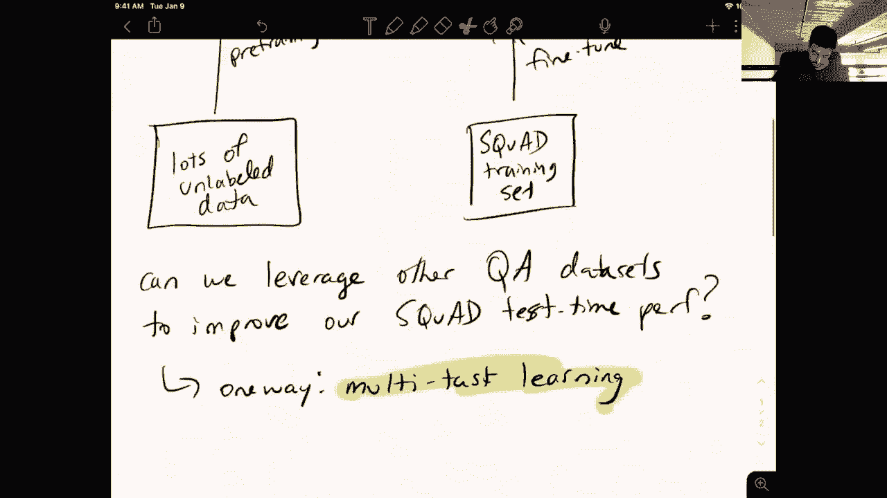

And paste it down here。Okay。

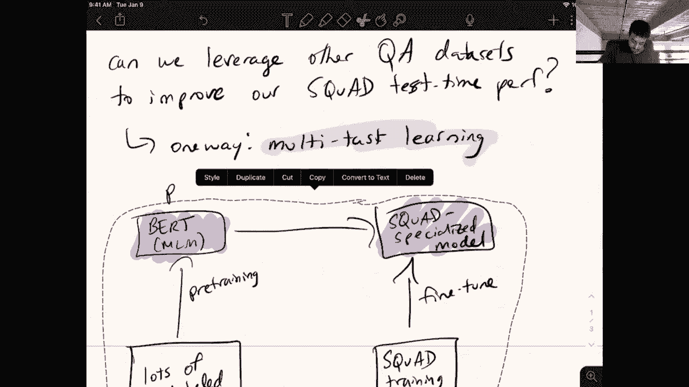

Where did this？Here I can， instead of just having access to the squad dataset set。

I'm going to have access to squad， plus。Hot pot Q A plus news， Q A。Plus， so on right。

 I can just add as many of these dataset sets as I want into the fine tuning step and the nice thing about these QA data sets is that they all follow the basically the same format right you have a question about a passage and the answer is a span of text within that passage so。

That is that makes it such that I can just concatenate all these data sets together。

 and then hopefully I'm leveraging information from these other data sets that will be useful when I eventually evaluate this sunqua。

So that's the idea but remember that in this setting we only care about our performance on S。

 we don't care about our performance on hotpot QA or news QA or so on。

 and so the loss function that we might want to use in this multitask setting looks a little different than the standard cross entropy loss over all of the training examples。

So in particular， let's just say we in the simple case， assume we train。OnS。Plus， hot pot， Q， A。Okay。

 I see that there is a question， I will get to these right after I finish explaining the current concept。

But good to know that this， this chat thing is actually working。 Okay。

 so let's just assume we train on these two data sets。 So in multitask learning or MTL。

 I'm going to use the following loss function， which basically weights the loss coming from the squad examples。

😊，With some particular lambmbda and then waits the hotpot QA。Loss with1 minus lambda。

So in this setting， right， if I only care about my squad performance。嗯。If I care。About。Squad。Maybe。

I use a high lamb。Here so here， of course， lambda is between 0 and 1。 it's basically saying。

 you know， if I set lambmbda to 0。8， that means 80% of my fine tu loss will come from S and 20% will come from hotpot QA。

 So because I want to maximize my performance on S， I might want to up my lambmbda here。

 and I would hope that having some loss come from hotpot QA is going to get important information from hotpot QA into the model that maybe S didn't have and is going to eventually boost my performance S。

So the issues with this setup are mainly in how do we choose these lambmbdas， right？

And this is because if I just naively set these things to 5050， in many cases， I don't see。

 you know any corresponding gain。 So in one of your assigned readings today。

 which was the stilts paper， they tried the naive multitask setting where they basically just concatenated all of the data sets together and had this kind of equally weights for each task and it didn't really result in any improvements so choosing the lambmbda is an art。

 you might want to adjust this lambda through training to maybe start with focusing equally on both data sets and then towards the end of training。

 focus more on squ you might want to learn the lambmbdas。

 So there's lots of methods proposed to deal with this stuff。 but in general。

 multitask learning is really hard to get right。 And there haven't been many positive examples of it in NLP。

So that kind of motivates this other direction that we're going to be talking about today。

 but before we get into that， let me take these questions so the first question since we are already using squad for fine tuning。

 what do we mean by squad test time performance are we dividing squad into training and test Yes。

 of course so we always are going to be dividing the data sets that we're that we eventually care about into training。

 validation and test right so the reason is because if we train on all of the data then we don't have any way of evaluating how well we did right？

We need to have a held outset for test time so that we don't cheat and test our model on things that it's already seen during training。

嗯。Okay so next question， we need to have the same type of objective function as well as label data for all these data sets That is not actually true。

 That's just what I've shown in this example， so you could potentially multitask with many different types of tasks and objectives but you can imagine this makes this weighting process even harder right not it's not very clear how I'm going to assign a weight to a completely different type of objective function and yeah you can imagine that as I add more and more tasks into this setup。

 it becomes harder and harder to decide how to weight the different tasks properly another way that people do this is instead of explicitly weighting the tasks。

 they subsample different data sets with certain probabilities but yeah all of this is it's just very。

 very difficult to figure out a setting that actually works。

And generalizes to multiple different downstream tasks。Okay so why is it called multitask learning。

 the task is still fixed， which is to find the spin of task for all these data sets right so that's a good question but but the difference is that squad and hotpot QA are not the same task they might have the same format。

 but hotpot QA is data collection process was designed explicitly to avoid the types of simple string matchbased reasoning that squad you solved by。

 So you might imagine that having some of that higher level reasoning that hotpot QA at least theoretically forces a model to learn can help a squad model on harder examples that are not necessarily solvable by string matching So there is a difference between the task format and the data set itself right so S and hotpot。

😊，QA have the same format， but they actually are fairly different in terms of what kinds of reasoning the model needs to learn to solve them。

And that's the intuition。Okay， so let us continue。 What we're going talk about here is a different process。

 which is， I guess， a little less flexible in that it does not require any sort of learning weights or anything like that。

 but it's also it requires another phase of training essentially。

 So if we take our maybe I'll just copy。This one。So we're going to start as usual。

 with this pre training。I maybe yell and a separator thing。Okay， so we're going to start here。

 and eventually we're going to end up here。But instead of just going directly from pre training to fine tuning。

 we're going to add an intermediate stage。 And so here we're gonna have this。Intermediate。A modelel。

And we're going to get this intermediate model by using a different data set。 so we could say。

 just use the hotpot QA training。Data set。And we do one round of fine tuning。

 and we take the resulting model and then fine tune that completely on squad。

 So this is kind of analogous to doing multi taskask learning， but。😊，Oh， was it buffering。

For' almost half a minute， all right， hopefully that was resolved。Okay， that's not great。Sing on。

 let me try。Reducing the bit right， or is it better now？It seems to be better。

 so I'm just going to proceed and hope that this is working。Okay， so yeah。

 we have this intermediate model that we're adding into this pipeline and as I was saying。

 this is kind of analogous to having the multitask learning set except we are adjusting the lambmbdaAs dynamically to have like 100% of the weight on hotpot QA and then after convergence。

 we switch to 100% of the weight on squad。 So if you look at it in that way you can kind of formalize it in the same manner as the multitask learning setup。

Okay， so this approach removes a lot of the variables for multitask learning。

 because we have essentially fixed these lambdas to occur at certain points during training。And it。

 it forces the model to first completely specialize to hotpot Q A before re specializing to squad。

So that's actually like the high levelve overview of the method that we're going to be discussing today。

 It's very straightforward。 It just takes another data。

 another label data and inserts it as an intermediate task into this process。

 So a couple of questions aren't the outputs for these tasks different。

 are we replacing the final layer between tasks， yeah， good questions。 So in this case。

 the output format is the same so we could actually share the final softmax layers across both of these different QA tasks。

 but in practice， I could put like sentiment analysis in as the intermediate task right And so if I did that。

 then of course my softmax layer is no longer useful first squad So I throw it away and just initialize a new softmax layer for the beginning of the spin and the end of spin prediction。

😊，but the important thing is that the weights of Bt right those are also being fine- tuneuned in both of these processes and so after after this intermediate stage。

 I have a new set of weights of Bt that have been they've taken the mask language model stuff that's been learned during pretraining。

 those weights and then they've adjusted them to make them better for hotpot QA and finally we're going to readjust them to be better for squad。

So that's kind of the intuition。 Does the ordering of the intermediate models matter。

 This is a great question。 So in all of the methods that we gave you for reading and that have been tried so far。

 there's only been one intermediate task inserted If you go to multiple different intermediate tasks。

 then we start running into the issue of how do we know what order optimizes our downstream performance。

 these are very expensive experiments to run right because we have to try all possible orderings to find something that might generalize to new downstream tasks its it's very difficult So so far。

 yeah， it's hard to say if I have multiple intermediate tasks how I should order them。

 maybe there' are some simple heuristics like data set size or similarity to the downstream task that you actually care about。

😊，That can influence this， but currently those are all unknowns。

Definitely interesting to explore in the future。I should also say that multitask settings that use more than one secondary objective。

 it's basically analogous to the problem of finding optimal weights being harder and harder as I add more tasks here。

 it's just the order of the training of the intermediate fine tuning。

For a very small dataset set can intermediate model health。 That's a great question。 Actually。

 the second paper you had to read shows that the results。

 the improvements that you get from intermediate fine tuning increase when the downstream task is small。

 like when the downstream data is small。 So we did this experiment on only and we only had access to 1000 squad training examples。

 this intermediate process provided we choose the right tasks helps a lot a lot more than if you have the full data。

 So yeah， this is definitely something that is very useful in low resource settings。😊。

If we repeat this process multiple times how much would the squad performance vary。

 I think you need to specify a couple things here， like what is being kept consistent across multiple iterations。

 if you repeat the entire process keeping the intermediate task the same and of course your downstream data the same it really depends a lot on the size of both the intermediate and the downstream data sets。

 So if they're small， you of course will expect higher variants。

 but if they're both large then the experiments we've done to this point show that there's much lower variance。

 but yeah this method is only really useful on or I shouldn't say that it's significantly it results in significantly improvements when you have small downstream data sets and the experiments also show that intermediate fine reduces the variance。

Of the downstream task when you train it with a couple different trials， so yeah。

 the benefits include better performance and lower variance。

 which is of course what you want in the end。Okay， so is this fine tuning based on backpro， if yes。

 then how do we handle the differentials because they may be different for the different models？

 Of course， all fine tuning and pretraining， etc cea is based on backpro。

 that's how we're you know calculating the gradients that we're using to update the models。

 And remember that the core model here， the Bt model is is the same architecture in all three of these these phases。

 So the gradient updates are going to the same set of base parameters that come from the original Bt model right So the only differences could be the output layer based on what your intermediate task is but that's a really small part of the model right Bert。

 you know， 24 layer transformer most。😊，So the parameters are shared across all three of these phases here。

Okay， so what else did I want to say before I move to the slides， Right。

 So I just wanted to highlight some interesting questions and note that a lot of these are not answered to this point。

 but。This is kind of， I think， a useful thing to think about when you're you know thinking about BerRT and whether just scaling up mask language modeling or language modeling。

 the bigger and bigger data sets is the best way to see improvements。

 this provides an alternative to that where we actually leverage some of the label data sets that we have to get more improvements on top of BRT。

So the most interesting question， possibly is， how do we know。What。Intermediate task。Will result。In。

The biggest。Downstream improvements。So you might have a many different hypotheses for why a particular task is better than another one when it's used as an intermediate task here right like if I told you that hotpot QA results in like a5 F1 gain when it's used for intermediate fine tuning for squad and fine tuning。

 doing intermediate fine tuning on sentiment analysis actually hurts the model and results in like a minus 10 F1 on squad。

 you might intuitively think， oh that's obvious right， because hotpot QA is a QA data。

 it tests a lot of the same kinds of reasoning as squad。

 and so that's why hotpot QA is better than sentiment analysis for this intermediate task because sentiment and squad share very little in terms of what the model is expected to learn。

So it would be nice， of course， if that was always true。

 And there was like an interpretable reason why a particular data set work better than another。

 But there are many different factors， right， So one is like task similarity。😊，And so this is like。

QA。QA， so this is the intermediate task。Maybe I'll highlight these to make them more clear。

 to the screen through。

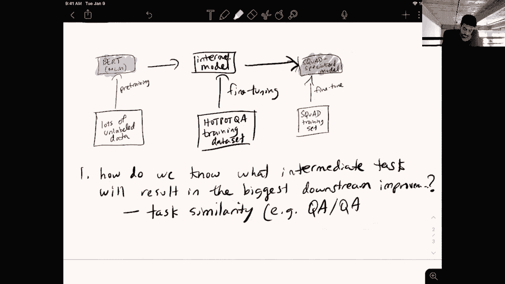

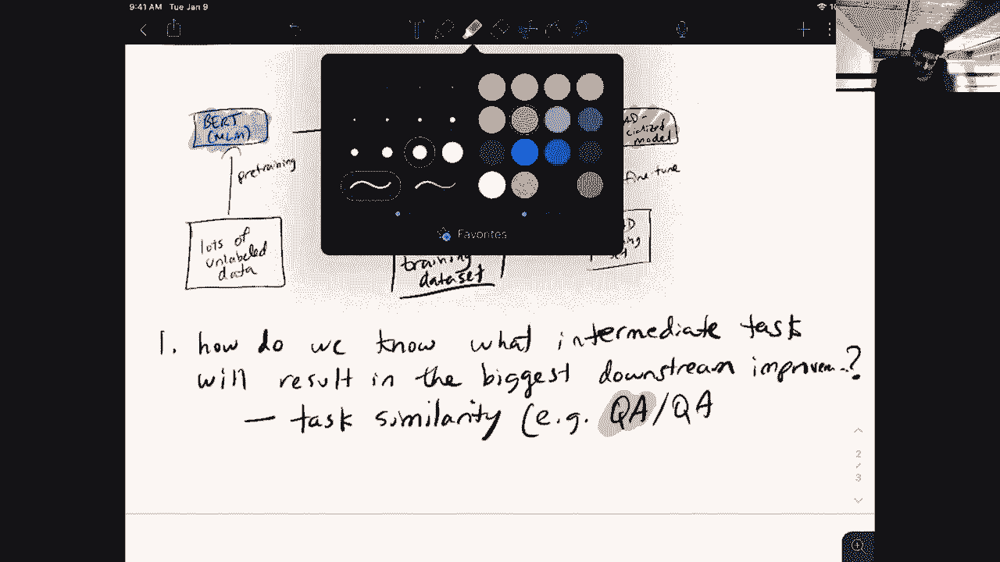

So this is QA for the intermediate task and then QA for the downstream task。

 like hotdpot QA and squatter both QA tasks sorry。Versus。Sentiment。

So this this could be one possible way to choose， another is size of intermediate data set。Right。

 maybe we expect a bigger data set to be more useful than a smaller data set for intermediate fine tuning。

 So what happens if I have。100 Q A A。Examples。Versse。100000。Sentiment。Right。

 another thing we need to consider。Here are both the intermediate task。

Another thing is domain similarity。So remember that squad is constructed from Wikipedia articles。

 right？ So what if I have。Q， let's say。Make the data set size the same，10，000 QA examples。From。

 I don't know。 What is a complicated domain specific data set， maybe like some。For medical journals。

 first。Something highly specific to a single field versus 10000。Sentiment。Examples。From Wikipedia。

Right， so there are so many different factors when you think about。

Why a particular data set is more useful than another for intermediate fine tuning。

 and it's hard to know in any particular case which of these factors is going to be the most significant。

So that kind of motivates the question。Can we predict。Which。Task。Out of。So finite。Set of tasks。Will。

The most。Useful。As。Inmediate。Tk。Given。嗯。Given a specific。Downstream data set。

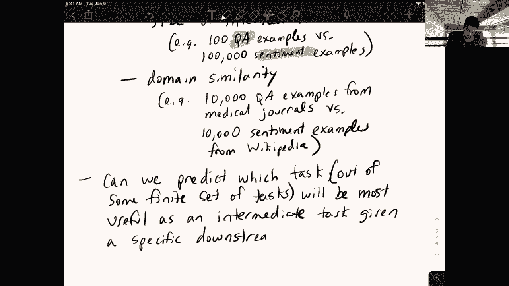

Okay， so。

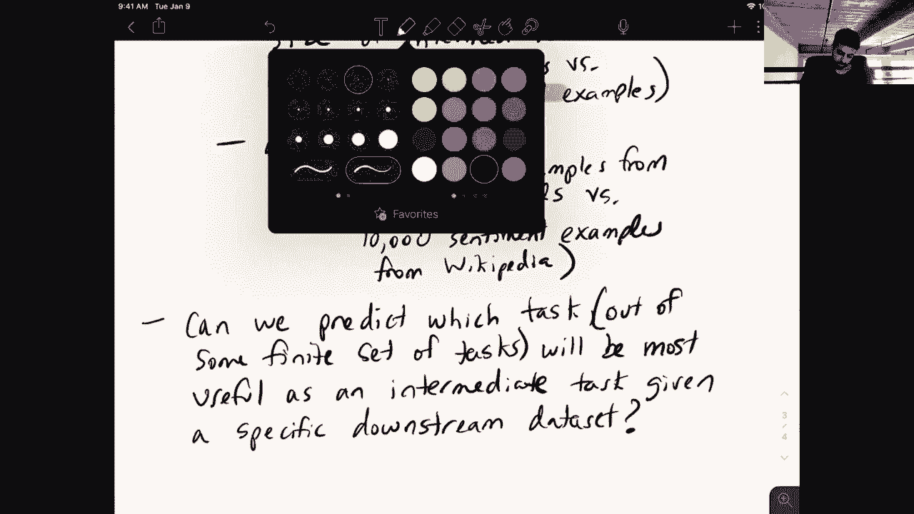

Make that more clear。

Okay， so at this point， I think I'll switch over to slides。

And we can talk a little bit more about like some methods that we can use and how they work in a kind of a high level of detail。

But before that， can you explain in the given examples which one will work better or are these still questions Yeah。

 so I kind of meant this as these are some of the factors that you need to consider when deciding what task to use as an intermediate task there have been methods that are proposed like the ones in your reading kind of get to some level of predicting which task will be better。

 but these are still mainly open questions they're unsolved， at least in a general setting。

 it's yeah， there's no method that'll tell you for sure what is the best task to use for any given downstream data set。

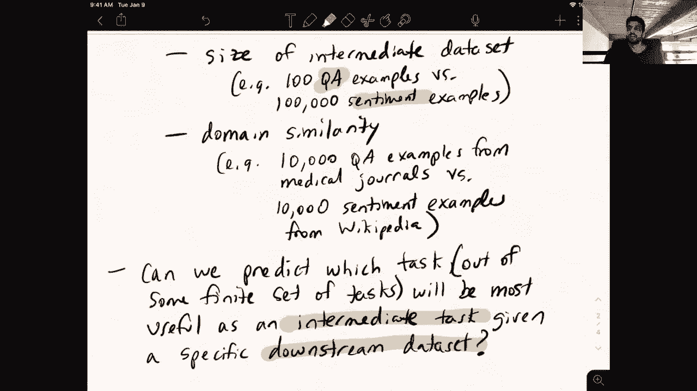

If we have a pair of data sets that we know work well， can we use them in any order？

So in in all of these settings， I'm assuming that you have one task that you care about right That's the one in red here。

 the downstream task。 So in this example， it's squ。

 And you have a bunch of other tasks and you're going to use maybe one of them for intermediate fine tuning。

 And so you're trying to pick which one task you're going to use。 there is， of course。

 the extension of this， which is maybe I can pick a sequence of many different tasks to use here。

 but no one really knows what happens in that setting， you can imagine， though， if you。😊。

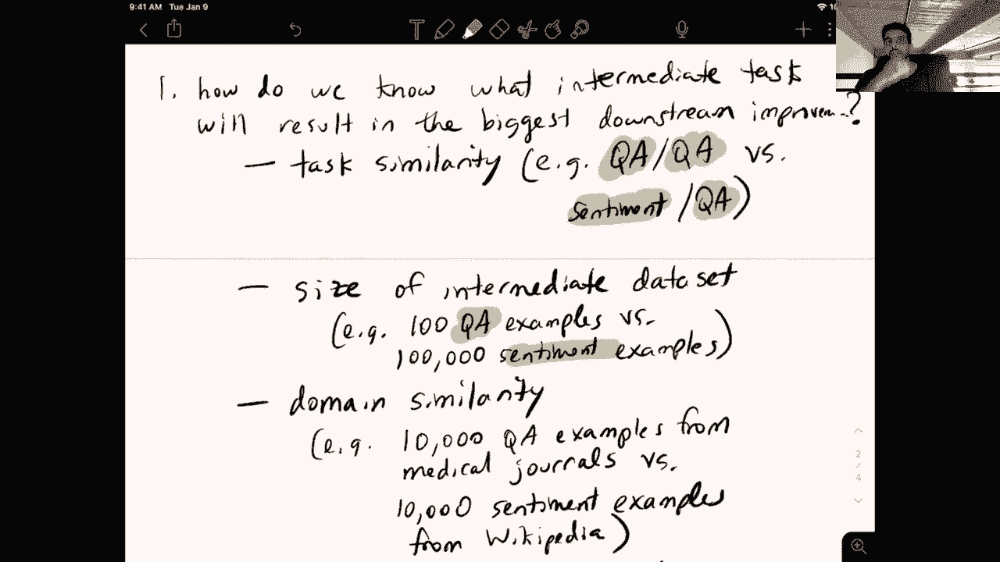

Maybe I can't。This is a bit of a diversion because I'm not actually sure what happens in this setting。

But if I do this and instead of immediately going to the downstream task。

 I just like repeat this for N intermediate tasks。Before getting to the downstream model。

 this could potentially help， right， Maybe I find like a nice sequence of tasks that specializes enough useful information into the model before eventually getting to the downstream data set。

 but it could also really hurt， right， because with each one of these new intermediate tasks that I add here。

 I kind of forget some of the information that I learned from my Bt pretraining， right。

 And that's really bad because note that the Bt pretraining phase was the one that had access to the largest training data set。

 right， we could use unlabeled data so we have potentially infinite pretraining data versus for each intermediate task we have only a small amount of label like a relatively small amount of label data。

 right， so。😊，The the pre-training phase is definitely the most important and if we get too far away from the pretraining phase。

 then our model might forget a lot of the useful information that could potentially benefit our downstream squad model。

 but that said， I'm not actually sure what happens here， it's also unclear if using a sequence。

 the sequence ordering is best or maybe we can do some sort of joint training or train all of the fine tune and all the models directly from BRT separately and then do some sort of aggregation lots of open questions in this area。

 but I just wanted to kind of introduce the possibility of leveraging other downstream tasks to help on a particular down data set。

Okay， apartpart from the same task for a particular downstream task。

 how do we measure the similarity between different tasks。

 we'll get to this when we go to the slides or at least one method for doing this Can't we use beam search to greedily choose the best task No so。

It。Like， if you had， you know， like 50 different tasks and you wanted to find the best one。

Remember that the only way in which you can evaluate how good a particular task is is to do this entire fine tuning stage for every single of these 50 possibilities right so I could of course try out every single one of my 50 tasks in this process and pick the one that's best so that's not really scalable right if I come up with a new task。

 I don't want to wait you know several days for for this process to finish for each of the 50 different task so you really need a way to approximate the information that is preserved after fine tuning on a particular task and then do some sort of reasoning over this approximation of a task to figure out which one is best So it's not really possible at least now to to。

😊，Do some sort of search without actually going through the full fine tuning process which is very expensive so all of the methods we'll be discussing here look for a way to encode a task into a low D representation that we can then do some sort of reasoning over so with that I will switch over to the slides wow。

 so's not've been 36 minutes。😊。

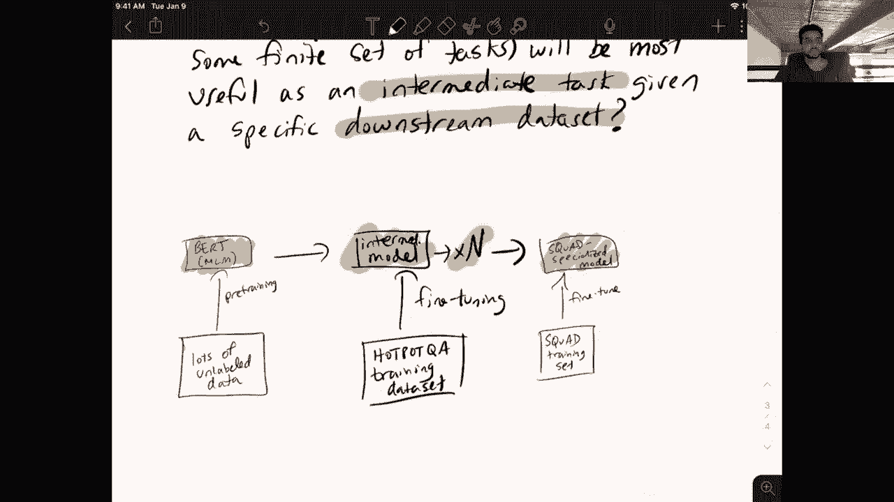

Doing good here。Okay， so。I'm upseting you。

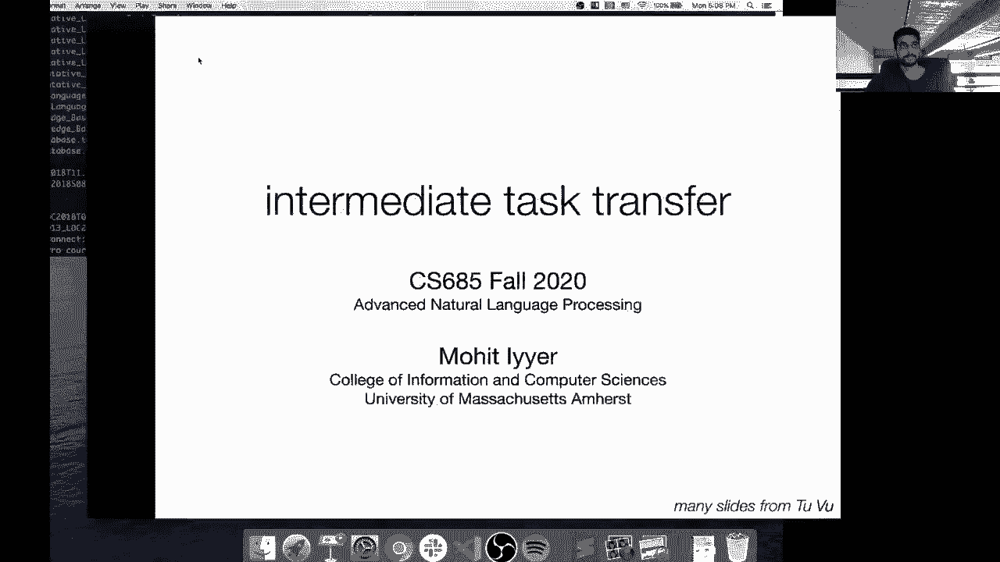

All right。嗯。So yeah， we're still talking about this intermediate task。

 fine tuning stuff here we'll get a little more concrete in methods that we can use to choose a particular intermediate task before we do that there is some stuff from last time that I will talk about here so we got to comment on the anonymous form about we were signing too many readings so I apologize for that I just figured that most of you aren't doing the readings anyway so if people are actually interested in learning more about the things that we talk about in the lecture you can check out the readings。

 but at this point I would say that you know the readings are just for people who are actually super interested in the material and we'll be covering all the important concepts in the lectures the readings now have become like very recent research papers so it's totally understandable。

If you're unable to understand all of them completely， in fact。

 like neither myself nor the TAs are able to you know completely understand most of these papers by just reading them so don't feel bad about that a lot of it is just due to poor writing but yeah。

 I think several papers assume a lot of background knowledge about related work that you have to then go and check out to understand what they're talking about。

 so it's actually a long process to understand a research paper， but。

We'll try and cover most of the important concepts from each paper in the lecture。

 so specifically I think for next class I've assigned a ton of different papers and yeah， again。

 don't feel obligated to read all of them completely at least make sure you check out you know the abstract introduction。

 maybe some of the results and those are generally written at a high enough level for people who are familiar with basic NLP and machine learning concepts to understand。

😊，The other thing no one has complained about maybe unsurprisingly。

 which is homework one still hasn't been released is basically all on me at this point。

 the T has completed a draft of it and I'm still kind of tweaking things to make it more informative and useful for your final projects for those of you who are using Bt like models and neural language models in your project so yeah。

 it will be out very soon and actually some of the I know I've been saying that hence the mythical homework it will be coming out at some point in the semester and homework will include a bit of stuff on intermediate fine tuning as well so we've now covered that also this past week we posted an extra credit assignment which。

😊，I think anyone can do regardless of time zone you don't have to attend these talks live。

 you can watch the recorded versions， but basically there's three or four or five talks this semester that are related to NLP or some of the concepts we've been discussing in this class and so these are you know like researchers。

 faculty， PhD students that are giving talks about their latest research so yeah the assignment is essentially to write up a summary answer some questions about their their talk and it's not a very。

And。Complex assignment or it shouldn't take that much time。Yeah。

 I think that's all I wanted to say about this Oh yes also exam I'll be putting out the exams from previous semesters later this week and I'll put them up first without solutions so you can try them out and then the following week I'll put up the solutions but note that many of the things especially the most recent lectures that we're covering was't not present in previous iterations of this class so there will be questions that are on topics that you haven't seen before also there are sorry that aren't in the practice exams is what I'm meant to say there are also topics in the practice exams that we haven't covered in this class so you can ignore those I'll also mention you should ignore all the multiple choice questions we not going to have multiple choice on this exam and yeah I'll highlight particular questions。

😊，That are going to be more like the things that you will see on the exam。 So more on that on Piaz。

Okay， so I've been using this word task a lot in the when I was going over things on the iPad。

 I just wanted to be a little more specific about what we mean when we talk about a task。

 right we're choosing a task to be this intermediate fine tuning and also for our downstream training。

 And so we're gonna consider a task to have know a description。

 it's gonna tell you what the task is actually doing。 And also a task is associated with a data set。

 right， So for all of the cases we'll be considering these are labeled data sets。

 So we have these x's， which are our inputs and our Y's。

 which are the labels sometimes these x's could be a little more complicated， right。

 So in the case of squad， the input is。😊，The the question as well as this associated passage and the whys are the indices of this answer span in the passage。

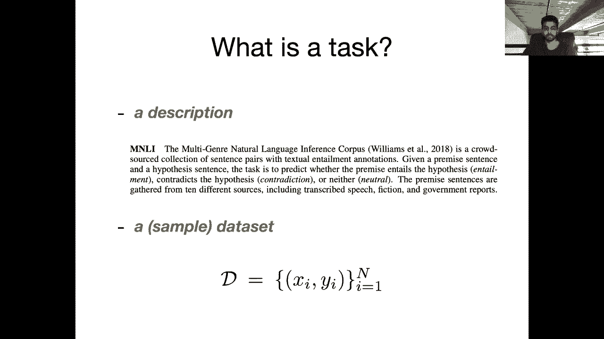

So as we've seen or actually we haven't seen this yet， but as I've implied。

 you can use different tasks to help each other to improve performance on a particular task and there's a lot of prior literature on this right so one of them that was assigned in your reading this Fo at all paper showed for classification tasks that you first start with your pre-training objective on language modeling then you do intermediate fine tuning on all these different task as well as reduced variance。

😊，So there's this other paper that we did not assign in this for this lecture by Nelson Lu that shows that。

Using more related tasks， so if my downstream task is QA pre training or doing intermediate fine tuning on another QA task is more helpful than doing just language model pretrain without this。

And yeah， people have shown that in the QA setting。

 you can get some boosts when you pretrain or sorry。

 do intermediate fine tuning on other QA data sets before fine tuning on your target one。

 so these are three pieces of evidence that you can leverage other label data sets to help out with your current one。

All right， so whoops。呃。I wanted to say that if we have a way to kind of encode the unique identifying properties of each individual task。

 then we might be able to come up with some way of measuring the similarity of different tasks to each other and also maybe measure how beneficial doing intermediate fine tuning on one task is to another task and all of these these kinds of works have practical applications because maybe I don't need to collect such a big label data for my specific downstream task I can leverage bigger existing data sets that are kind of related in some way to the one I want to solve。

Okay， so right， there are obviously real world use cases for this kind of thing。

 right I think one that's particularly interesting for。

 say a company is if you have a user that's able to submit a completely new task right so they provide maybe a description of what this task is and some sample data of you know X Y pairs。

 input output pairs and the company responsible for training some sort of model on this data the company can kind of leverage their existing knowledge of all of these different tasks that have already been submitted to you know return either a single intermediate task or a sequence that can maximize the performance on the end user's task。

😊。

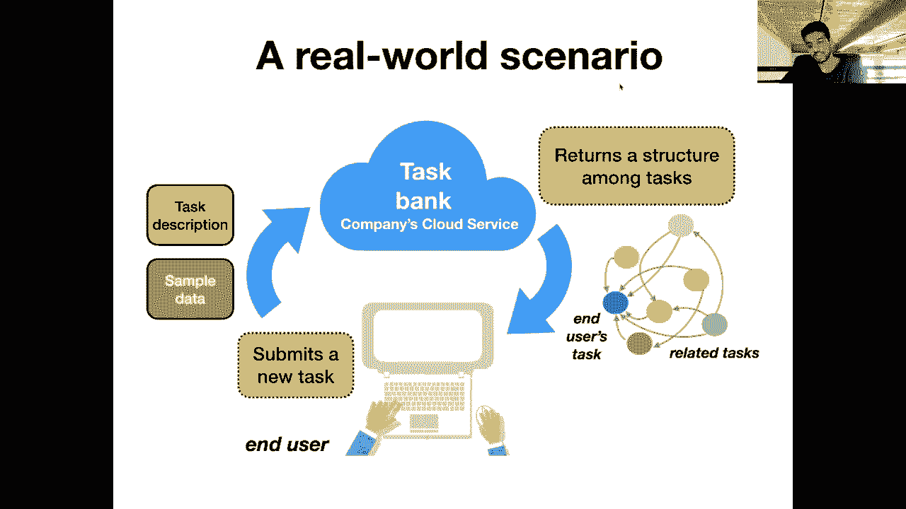

Okay， and within NLP， I know we haven't talked about a lot of different downstream data sets。

 but I just wanted to make it clear that there are a lot of different labelable data sets that have been created over the years。

 right， So this table is only a small fraction of all of the data sets。

 I'm sure many of you while browsing through the AL。

 ELP proceedings noticed how many new data sets are proposed at every conference。

 to test some new linguistic property or type of reasoning that hasn't been tested before， right。

 And so this mass of tasks just taken together is a huge set of resources that we can use to further optimize our performance on the task that we care about。

😊，嗯。Right， so if you look at the machine comprehension column here， you can see just a list of many。

 many different QA data sets， many of which we haven't even discussed so far。

 there's just way too many to go into any level of detail at all， but yeah。

 you can see how this paradigm of leveraging existing label data sets can be useful because of the sheer volume of these dataset sets。

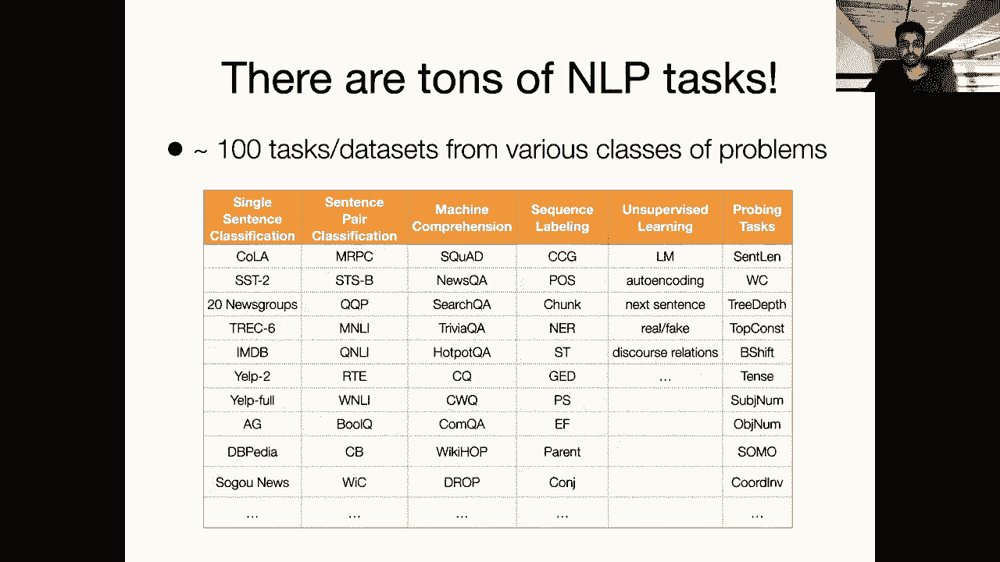

Okay， so computer vision research has in these kinds of ways been ahead of NLP。

 you know it was of course ahead on the whole deep learning thing。

 which you know the first advances were really in computer vision with convolutional nets and then shifted over to NLP with recurrent neural networks a couple years later。

 but in computer vision， we also have a bunch of different tasks that are basically leveraging the same core architecture of a convolutional neural network that's been pretrained on the imageNe data set。

And there's this paper， which was assigned as optional reading called Taonomy。

 It'd actually won a best paper award at CVPR， which is one of the or I guess the top computer vision conference。

 which showed that you can learn these relationships between tasks to maximize your performance of a target task。

 So in this example， it's showing that。😊，Having a model that's kind of fine tuned for this task of。

 I guess detecting surface normals and also detecting 3D edges benefits these other tasks like reshading or point matching。

So we would， we would like to do that for NLP as well。Okay， as an aside。

 I haven't seen any questions in a while。I will assume that no one has had a question。

 but if that persists， then maybe I'll refresh。Okay， so in this paper。

 they had 26 different computer vision tasks， and these were， you know。

 roughly in different classes of like 2D modeling versus 3D modeling， focusing on like segmentation。

 etc cetera。 and they were able to discover these kinds of task relationships。😊。

So we would like to do the same thing for NLP and one approach that we could use is to embed each task in our know vast collection of tasks in a low dimensional space similar to how we've thought of embedding words or sentences or documents。

 we can also think about just embedding an entire data set。So what does this actually mean。

 I'm going to get a single vector that represents a particular task。

And I would hope that the vector space is kind of interpretable in that if I look at the nearest neighbors of any given tasks representation in this vector space。

 I get tasks that are related either in terms of the kinds of reasoning that's required to solve them or maybe the size of the data set or the domain。

 you know， all those properties that we discussed before。

So people have looked at this before they've looked at， for example。

 in the context of sequence labeling tasks， so these are things like part of speech tagging。

 I have a sentence and I want to predict the part of speech for each of the words in that sentence there are other sequence labeling tasks like named entity recognition。

 So I have a sentence and I want to for every word in the sentence。

 annotate is an entity or not at a high level。 So all these tasks follow the same format I'm making a single prediction at every token of the input and you can show that some tasks benefit others more。

 but some tasks have more benefits for a particular downstream task than others This work。

 this binle and sogar work was looking at this in the context of multitask learning so with the different weights for each task。

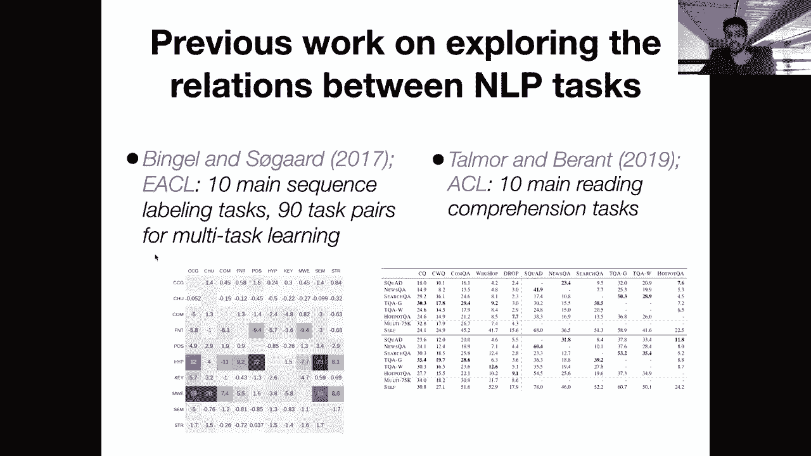

Okay， so you can imagine a very simple approach here being if I am provided a description of a task。

 So we looked at this here， right for this task， M NLI I have a paragraph describing this task。

 right？ So one kind of interesting way， I could go about getting a task embedding for this task is to pass this description of the task into Bt and then take。

 you know， it CLS vector or an average。😊。

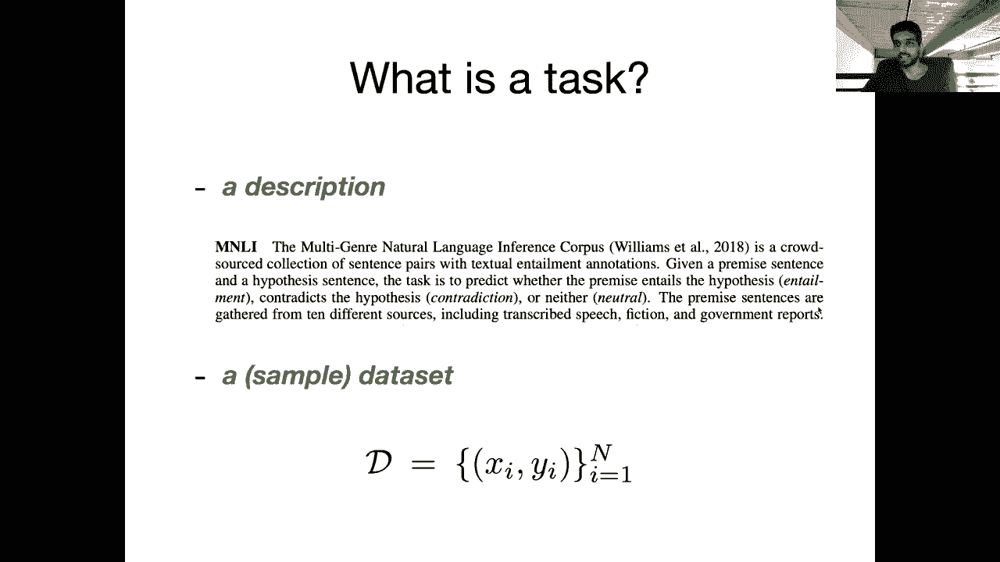

Okay， sorry about that。 It looked like my。Internet just disconnected there。嗯。Okay。

I think its it's working， but I will wait for a message before continuing。Okay， great。

 it's working now。Yes， so I was saying that we might want to have a clearly formatted and consistent format for this description across different tasks and one way you could think about doing this as for every paper that's associated with a particular data like maybe extract its abstract or introduction or something and embed those and BM。

 you have a task embedding space， but no one has actually tried this， it's unclear if first of all。

 there are embedding methods like BerRT that can learn useful representations of descriptions of highly specialized technical data and second。

 it's not clear that the description of a task is the best way of representation it because this ignores a lot of interesting information about the data set itself it could potentially。

😊，Ignore the size of the data set or even more low level information like。

What parameters in BRT are kind of specialized when you do the fine tuning process to。

 to solve this task versus what parameters are left unchanged。

 So there's a lot of useful information going on in the fine tuning process that we might want to encode here。

okay， so a question for comparing sorry for comparing the task embeddings。

 note these tasks need to be embedded in the same way like by using the same technique。 Yes， yes。

 so here in this simple approach that we're not going to explore any further。 we for every task。

 have a paragraph long description of the task and we pass it through Bt like the pretrain burnt model to get a single representation of it。

 But yeah， this way is undesirable for for all of those reasons。

 So we might want a method that distills this task embedding from the actual fine tuning process itself。

😊，Okay， so in particular， I can use some information about the gradients of the model during the fine tuning process to get some information about the task itself so here in our pretraining setup right we have our base network。

 which in the case of NLP is Bt in the case of computer vision is the imagenet CNN。

 and then we have our task specific classifier layer which you know for S is the start and end predictors for sentiment its just the single softmax to predict positive and negative or so on。

😊，So we could do this without fine tuning by simply passing our entire data set like whichever one we want to get a task embedding for through this network and then kind of measuring the gradients during the backpro phase and what that means sorry in more specifically is what actually do we want to extract from this process so if you read the second paper that was assigned on task embeddings we were using the empirical fissure information matrix which at a high level is measuring how important or how much the loss changes when I change a particular parameter。

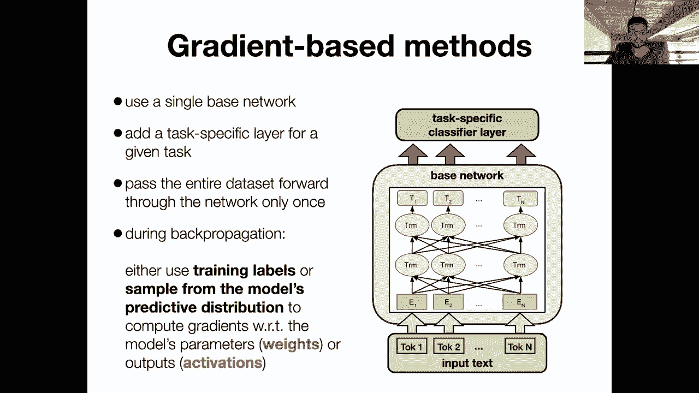

And so in Bt， I have so many parameters， right， I have 24 layers。

 Each layer has you know the query key value projections。

 It has a feed forward layer we have our embeddings our token embeddings， we have our softm layer。

 So we have a ton of parameters and we can calculate this fiser information matrix to tell us which of these parameters impact the downstream predictions the most intuitively。

 So we're not going to get into too many more of the details here。

 but just imagine you can extract that kind of information for all of the different types of parameters in the Bt model right So for every single feed forward layer or every single query key value projection during the fine tuning process which ones of these result in are changed in the most during the fine tuning process from what they were。

😊，In their in the pre trained BRT representation。So again。

 there's even within the each transformer block， there are many different feed forward layers。

 the query key value projections。 so we have lots of different parameters here。

 and using the fiser information matrix we can get and we can even do some sort of dimensionality reduction on this at the end of the day to make it smaller or you know some sort of averaging whatever。

 but we will use this technique to basically get some information from each of Bts different layers and we're going to aggregate all those things into a single embedding。

 So this is the first stage。😊。

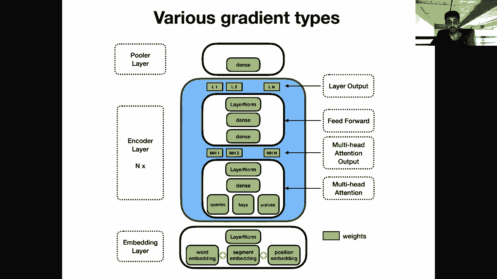

And then the second stage is we can now do this for a bunch of different other tasks in our task library。

 So this could be like hundreds of different tasks。

 So here let's say I have some input task it gets associated with this red dot here。

 and then I have all these other tasks in my embedding space。

 Now I'm just going to look at the task that's closest to this one in the task embedding space。

 So it turns out to be this wki hopop data set， which I guess is some sort of multihop QA data。😊。

And so now I'm just going to proceed with intermediate fine tuning。

 Now that I've identified the single task that's the closest in this task embedding space to the one that I care about。

 I'm going fine tune Bert on Wiki Hop。😊，And then I'm going to fine tune the resulting model on my target task。

 So we're essentially using these task embeddings as a way to figure out which of the all of the existing tasks should I select for intermediate fine tuning。

And what I've described at a very high level is just one way in which you can embed a task。

 there are many others that haven't yet been explored， so you know。

 potential side projects for anyone who's interested。

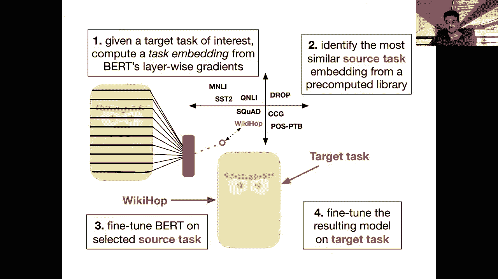

So in the paper there is this plot of here's 33 different tasks that are divided into three different classes。

 so the red tasks here are classification tasks， the blue ones are QA tasks and the green ones are sequence labeling tasks。

And so the model， you know， the task embeddings， they have no idea of what type of task a particular task is right the only thing that is taken into account when computing the task embeddings are the information about the gradients So it's pretty cool to see that the model can learn in this nearest neighbor space that you know all the red tasks。

 the classification ones are pretty close together。

 also like between different instances of the same class， like MNLI and SnLI。

 these are both textual entailment data， so they have a strong connection between them also you see like these two part of speech tag datasets are fairly close to each other and there are also some interesting cases of classification task like this coA data being kind of closer to sequence labeling。

😊，Daets they are。 than it is to maybe some of the other classification data sets。

 So both intuitive and unintuitive results when you， when you look at this。

So I wanted to conclude with just looking at one of the figures in this paper to maybe make the point more clear that we're not。

 we're still a little unsure why a particular task helps another one。And so in this plot here。

 we have on the X axis the target downstream task。And so this is the task that we actually care about and this is called a violin plot so each of these columns here。

 each dot inside one of these violins represents the performance on the test set of the associated target task when we fine tuned with a particular intermediate task so each dot represents different intermediate task so let's zoom in and see what kinds of results we or what kinds of intuitions we can take away from this。

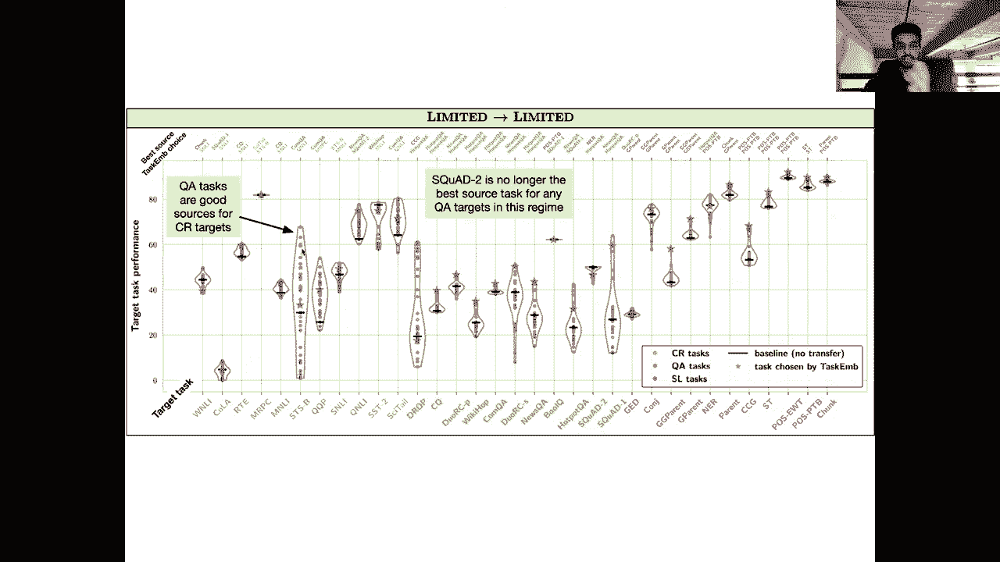

So these blue tasks here are all classification dataset sets。

 And it turns out kind of weirdly that the best intermediate tasks for many of these classification data sets are actually QA tasks。

 So here these orange dots are when we do intermediate fine tuning with a question answering dataset set。

 So this could be squad or multi sorry， hotpot QA or news QA or something like that。

 And you can see that the other the blue dots， the ones that correspond to other classification tasks are below these orange dots。

 This black line corresponds to what happens when you do no intermediate fine tuning at all。

 So for this particular task， SSB， which measures how similar are two sentences to each other semantically。

😊，We see that without any sort of intermediate fine tuning， we get around 30% or so。 But when we。

Fine tune with these purple intermediate tasks， which are associated with sequence labeling tasks。

 Our performance actually drops below this baseline。

 So this is just emphasizing that some of these intermediate tasks actually hurt the downstream performance。

 So you have to be careful。 this is not a method that always works。 but on the other hand。

 doing intermediate fine tuning with other tasks like this one result in huge gains。

 So here we have a gain of we get up to like 60 or 70 on this。 I forget what the actual metric is。

 I don't think it's accuracy， but maybe it is。😊，So there's a lot of room for improvement and this set of experiments has controlled for things like the data size of both the intermediate and the downstream tasks。

 so they all have the same number of fine tuning examples and this is also in a low data setting so assuming that you don't have that many labeled data points。

😊，Yeah， so the star here represents the task that is chosen by the task embedding。

 so you can see that here the task embedding method。

 the closest task in the space does give you some boost over the baseline but it's very far away from the best task right and that kind of makes sense right because for this particular task STSB。

 the QA datas are not as closely tied to that as some of these other classification tasks。

 so there's still a lot of work that needs to be done and a lot of room for improvement to you know take full advantage of the other labeled data sets。

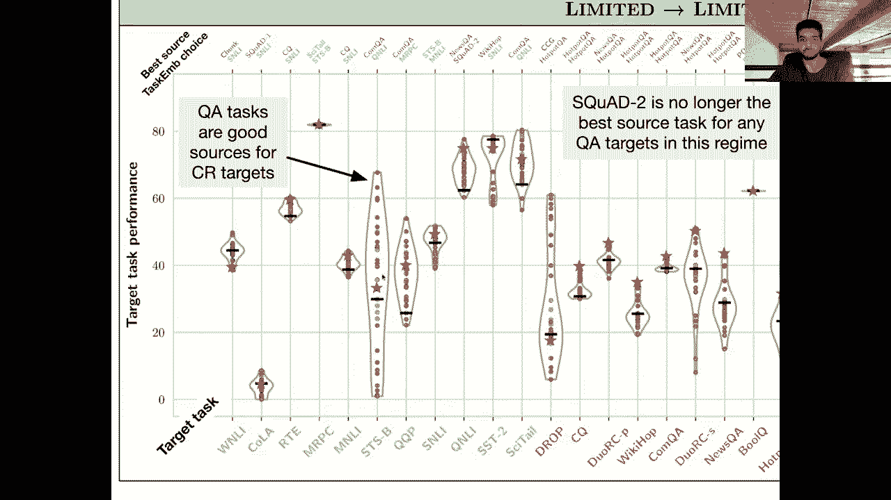

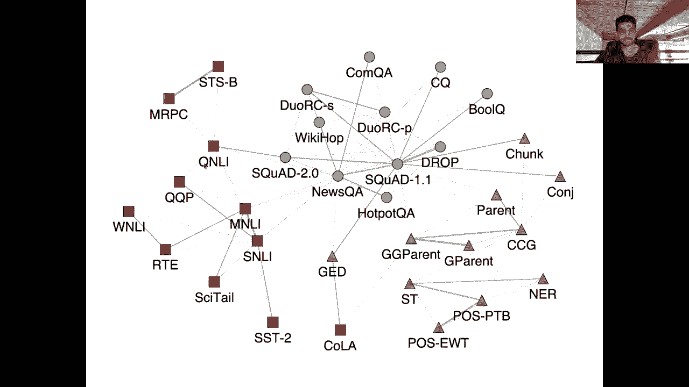

So when we look at the QA dataset sets， so these are the orange target tasks here， the top one here。

 the best tasks that improve the most with intermediate fine tuning， are other QA dataset sets。

 so here at least the results are more intuitive and we see that again using the sequence labeling tasks。

 the purple ones hurt you， they drop you below the baseline。So these are some。

 basically the takeaway here is that we don't really know anything about why a particular task is helpful。

And the models are predicting things that are kind of intuitive so far。

 like QA data sets are close to other QA datas。 But for some of these unintuitive cases。

 it's very hard to figure out why a particular task is so useful one very interesting thing here is that I mentioned for all of these QA tasks that other QA tasks tend to be most helpful。

 except for this one task drop where the most helpful tasks by far were sequence labeling tasks。 Oh。

 I see there's a question about this。 Yes， so this is a good question why why are these sequence labeling tasks helpful only for drop and they actually hurt for most other data sets。

😊。

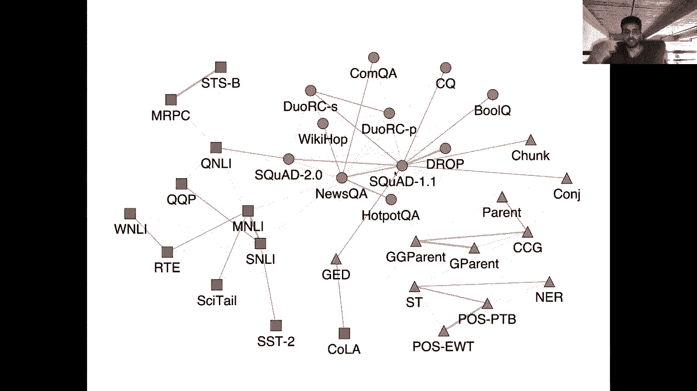

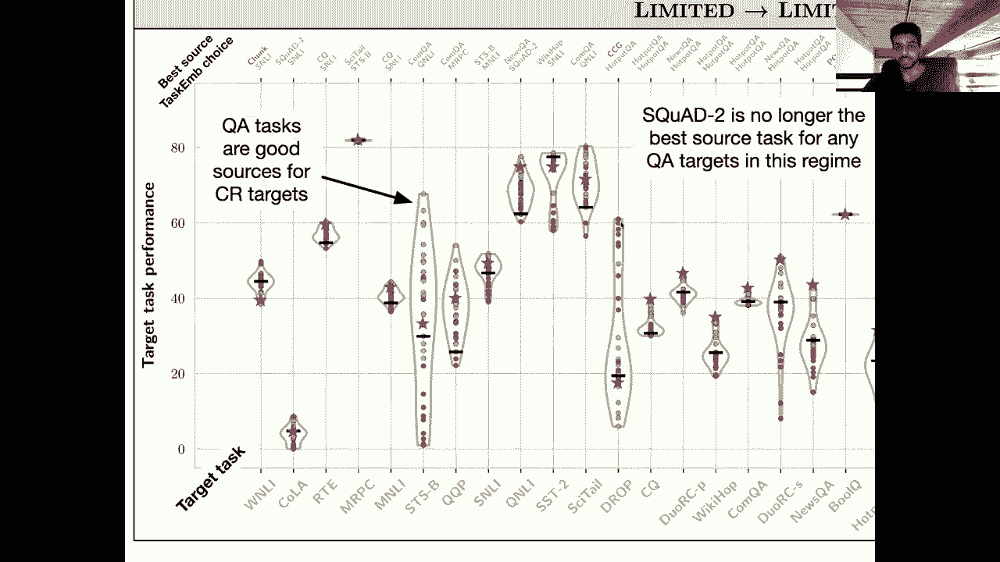

We have tried to understand this but have failed so far。The reason that is given in this question。

 perhaps because it was created to be adversarial。Yeah。

 we're not really sure how that ties into sequence labeling tasks being much。

 much better than having no intermediate fine tuning at all。So yeah。

 it's kind of an unknown at this point。 And you can see also that the star here。

 the task embedding model selects a task that does even worse than the baseline for drop。 So yeah。

 it's it's pretty， pretty strange。Okay but overall。

 just some high levelvel takeaways are these plots make it clear that for most tasks for basically every task。

 there is some intermediate task that will boost the performance compared to just the standard pretrain and then fine tune on your downstream data。

 we have some idea of methods that we can use to predict what the intermediate task should be。

 but they're not perfect and in some cases they might actually be worse than not doing any intermediate fine tuning at all like in this particular case。

 but for those of you who are using models like BRT in your final project and you have relatively small downstream datas。

 which I assume is many of you who are resource constrain and are only using collab or something like that you might want to check check out some of these or just doing some sort of intermediate。

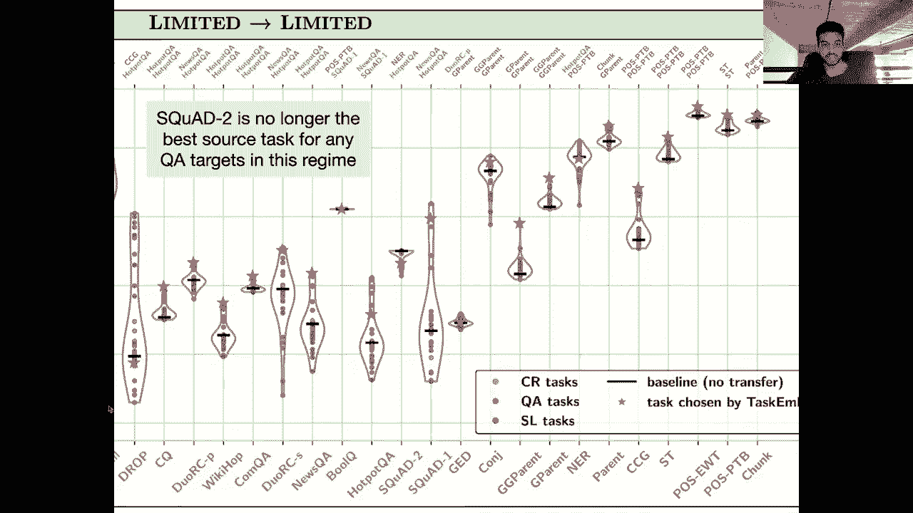

Tuning isn a possibly easy way to improve your results。嗯。Okay。So。Right， oh。

 I see I missed a question。 Are we intuitively looking at how close the parameters are to the maximum likelihood estimates yeah。

 so intuitively like we're looking at how basically for any two tasks when we get these aggregated task embeddings。

 their embeddings will be similar if the same parameters were changed most in the fine tuning process within the base BRT model from the pretrain model。

 So I guess that's kind of the intuition， although it's a little hard to extend to the case where you know we have all these different layers and we're doing some sort of aggregation over them。

 But yeah， that's the high level idea， at least but I think as these results should show this is not a perfect method or maybe even the best way to do this and we probably will see many better methods。

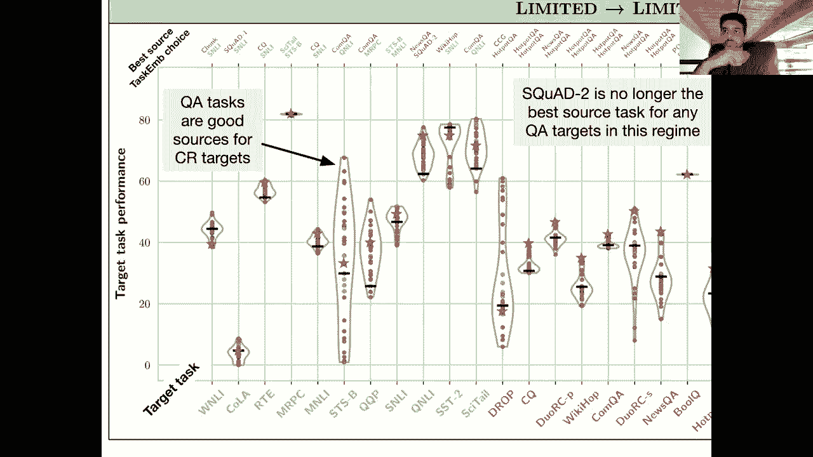

s over the next year。 So it's a very， very new thing。Oh。

 another thing I should mention before concluding this lecture is that and maybe something to think about is whether this idea of doing intermediate fine tuning will even be required in the future when we get bigger and bigger pretrain models right so if I have a Bt that's been pretrained on say1 trillion words instead of 3 billion words。

😊，Maybe a lot of this room for improvement that we see with these intermediate tasks goes away and the use of actual explicit labeled data sets becomes lower and lower So that is a plausible direction for research in NLP to proceed well see what happens I there any good open source code based on either the papers。

 yeah， so the homework will contain some cells that you can use to get started So yeah。

 be on the lookout for that。 All right， I'll conclude here next time we'll be talking about different variants of Bt So things like ExcelNe。

 Roberta， Albert and so on that have been proposed that to address some of the limitations of Bt and。

😊。