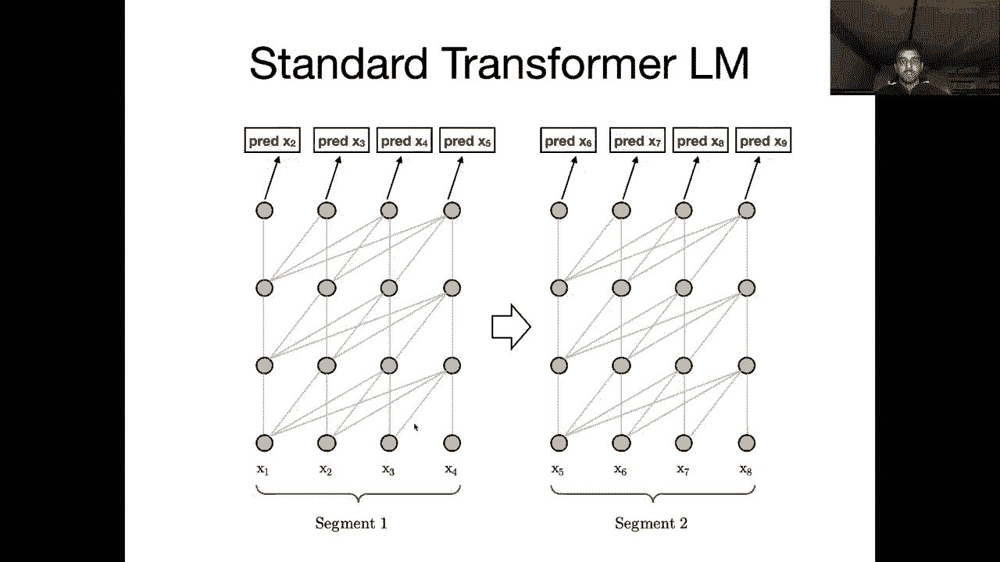
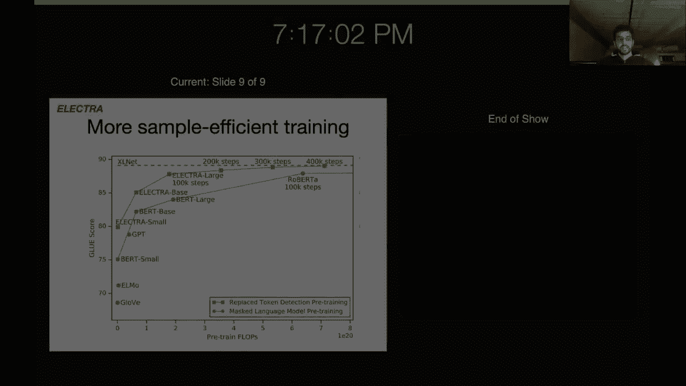

# P13：L10- BERT变种 - ShowMeAI - BV1BL411t7RV

Hey everyone， today we're going to be talking about better BRTt。

 so these are recent papers that have improved over Bt in a number of different areas and so we're going to be switching back and forth between the iPad and some slides which are essentially just taking figures and tables from the papers to make the results and models more clear。

So let's get started。Provements on B。So there are four specific improvements that I want to discuss today。

 the first are kind of small training improvements。And also in combination with more data。And these。

2。Features of the Roberta paper， which was in your assigned reading。The next is longer sequences。

 so we know that during pretraining BRT takes in sequences of 512 tokens each and remember that each input to Bt is actually two distinct segments that are separated by the separator token and the CLS vector is as to predict does a second segment follow the first segment。

 so really like if those are two noncontiguous segments， you only get 256 tokens that are contiguous。

So not that much text， it's going to be hard for you to model a very long document or a book using Bt because it can only model such small sequences at a time。

So one way that you could think about tackling this is using a mechanism like the one in the XL net paper。

 which relies on the transformer XL。And I had you read the Excelnet paper。

 but I think I should have made you read the transformformer Excel paper where X stands for extra long。

 So this improvement allows the model to condition its predictions on much longer sequences of context。

 but it still has a practical limit of the amount of text that it can look back and models。

 so it's not perfect， but it is an effort in this vein there have since been other improvements proposed that do this better than the transformer Excel。

 but this was basically the first or one of the very first attempts to integrate this long context modeling into the transformer model。

The third thing we're going to talk about is more efficient objectives。And so we've seen in Bert。

 right the pretraining objective is a mask language model， I take my input。

 I mask out 15% of the tokens at random， and then I have the model feed everything through a transformer and predict each of those mask tokens。

 what was the word that should have gone into that mask。

But we look at the electro model which proposes a much simpler objective function that's far more efficient and achieves the same results。

 so a big win for those of you who are interested in pretraining your own models the E paper has a small model that they said they trained on one GPU in four days so that's you know pretty awesome maybe something to look into。

Okay， and finally， we have smaller models and this was the Albert paper。

Although I guess their best results were with models with roughly equal parameters to BRT。

 but it's very interesting how you can add more parameters in BRT。

 it's not necessarily adding more layers， but rather you can get away with sharing parameters at each individual transformer block。

 but just making the hidden states much larger， so very interesting result in that paper as well。😊。

So we have basically four different。Model architectures and strategies that we're going to be covering today。

 and let's go ahead and get started with Robert first。Okay。

 so Roberta doesn't just have like one single advance that it proposed。

 but actually there's like four or five different things that are proposed in the Roberta paper that when taken together result in pretty significant improvements over Bt and all of these modifications are at the service。

 very simple so very simple。😊，Collection。Of modifications。

But this is the kind of paper that you really need a lot of resources to run right a lot of GPUs Roberta was done by Facebook AI so it's not the kind of paper that you can do with you know your collab notebook so even though it's very simple。

 a lot of compute went into getting these results and hopefully they're you know generalizable to people who want to build upon them So the first modification that was made in the Roberta paper is to train with bigger batches。

So remember that to train these kinds of models we usually use mini batch training right so in Bt each batch consists of a bunch of these 512 token sequences and in Roberta。

 they showed that you can actually train with a larger batch size and kind of see the same number of examples but do fewer updates right so if I do a smaller number of batches。

😊，With larger batch size。嗯。This actually results in better performance than having a smaller batch size and a larger number of。

Gradient updates。So one thing that you might be thinking of here is well。

 it's not easy for you to use a bigger batch size right。

 you would like to train with the biggest batch size that you can。

 but the issue is that you're limited by your GPU at the end of the day right so your GPU might。

Only allow you to train with a batch size of 10。 and you know。

 the models in this paper are trained the batch size of like 8000。

 So how are you with your single GPU going to be able to train with a larger batch size and one like really simple way of doing this in a memory constrained setting is gradient accumulation。

To bypass。GPu memory。Requirements。So the observation that using larger batch sizes results in better performance is not a novel contribution of the Roberta paper。

 it has been shown previously to be true in neural machine translation and not only in NLP but also in some vision applications so gradient accumulation is really。

 really simple， all you have to do is oh sorry this shouldn't say requirement， it should say。😊。

Limitation， I don't know。 I requirement。So the way you do this is let's say you want to train with a batch size of 8000。

 but your memory GPU memory can only fit in maybe say。

 I don't know 800 examples per batch at a time so what you do is you feed in 800 examples and instead of updating so you compute the gradient through batch crop like you normally would for these 800 examples but then instead of actually applying the update remember we talked about multiplying the gradient with the learning rate and then taking a step in the direction of the negative gradient instead of doing that at the end of seeing these 800 examples I'm just going to store that gradient and I'm going to see the next batch of 800 examples and then I'll accumulate the gradient from the new batch using by just adding it to the gradient from the old batch that I have。

😊，And now I can just do this 10 more times until I've seen 8000 examples and then I will finally do my update so effectively I've done an update with a batch size of 8。

000， but I've just taken 10 passes through the GPU to get to this point so really simple trick。

 but it lets you kind of simulate the large batch setting even if you have a tiny GPU。😊，Okay。

 so the first contribution was that training with bigger batches improves your downstream performance the second one is a simplification。

 so it's no next sentence。Prediction。So remember that in Bert。

 we have these two segments and the next sentence prediction is a classifier put over the Cs token to predict whether the second segment follows the first。

 In Roberta， they find out that you don't actually need this for any downstream gains。

 And instead of doing this， you can just have a single contiguous 512 token long segment as input instead of these two distinct segment。

 And you just don't have the next sentence prediction on top of your Cs token。

 and it doesn't seem to hurt you at all。 So this was pretty interesting because the Bt paper kind of makes a big deal that the next sentence prediction is helpful for a lot of tasks。

 but。😊，Perhaps in combination with many of the other improvements proposed in the Roberta paper。

 this really isn't a big deal， and it is kind of curious why the Bt authors defaulted to the next sentence prediction task without first trying it without next sentence prediction and with a single contiguous segment。

 I feel like they had something in their paper that did this ablation。

 but I'm not remembering clearly at the moment what the conclusions were。

So the downstream performance here is unaffected。And it's actually， in some cases， slightly improved。

 And a consequence is the CLs token。Gets no pre training。So the CLS token is never masked。

 it's not really used in pretraining for doing anything and maybe that was some of the intuition behind the original idea in the bird paper which was maybe we need to have some sort of classification task on top of the CLS token so that when we fine tune it it's already you know learn to perform some classification task on the sequence so it can be more easily adapted to other classification tasks this intuition might be supported by some of the results with the intermediate fine tuning that we talked about sorry last lecture。

😊，But despite the fact that the CLS token has no pretraining。

 it's still used in the computations right， the forward pass includes the self-attention computation at the CLS token in every layer so it's still contextualized representation of the entire rest of the sequence and maybe you don't need to actually put a classifier on top during pretraining。

 the fine tuning process could be sufficient to force the CLS token to specialize to a particular downstream task。

😊，Okay， so that was the second advance， the third advance was we're going to pre train。On。More data。

So in particular they do this experiment where they take 16 billion token oh sorry 16 gigabytes of tokens。

 I wish more papers would just report the。Exact number of tokens in their data set rather than the size of the data set。

 but they scale from 16 gigabytes， which was used in the bird paper to 160 gigabytes of pretraining data for this mask language modeling this data in the 160 Gb setting comes from a filtered version of the common crawl as well as this data set that was constructed by looking at or basically downloading all web pages that were linked linked to from Redddit posts。

So URLs from Reddit。The choice to use this kind of data is pretty interesting。

 I guess you could say that if a URL has been linked from a Reddit post to maybe with some number of upvoats。

 then it likely contains some useful or interesting information and that is the kind of stuff you want to pretrain on。

 but I'm not sure there's probably some better intuition behind the choice of data。

At the scale though， it's more just like can I get as much data as possible and maybe this was a good way to do that。

Finally， the last contribution here was pre train for longer。So like more batches， epochs。

So they actually do 500 k steps， I think a step is equivalent to a batch here or maybe like an every time you do an actual gradient update。

 so it might not be equivalent to a batch if you're doing gradient accumulation。Okay。

 so these were the four main improvements and so maybe we'll switch over to the slides now just to look at the results of each one。

Okay， cool， so first of all， let's move to the the first point which was the bigger batch size is better。

 And so here you can see three different batch sizes， 256。

200 and8000 and so they're controlling for the same number of examples seen by the model so you can see that the number of steps has decreased as the batch size increases so you can run a pretty controlled experiment And if you look at the downstream performance here。

 So we have MnLI， which is a classification task and SST。

 which is a sentiment classification task you'll see that。😊，The results aren't super conclusive。

 but it looks like using a batch size of 2000 yields the best performance。

 maybe these results aren't that impressive， but overall at this scale。

 even an improvement of less than a point is kind of significant。

So increase batch size that's the first thing。 Second thing is removing next sentence prediction。

 So in this table they if you just look at the first four or I guess six rows here。

 they have a perfectly controlled experiment where they take their model。

 they add the next sentence prediction loss， this NSP loss and then they have the same thing without the NP loss and they evaluate it over squad。

 the QA data set MNLI entailment sentiment and race actually embarrassingly forget what race is I think it might be a coRA data set anyway。

 so the results show if you compare them that without the next sentence prediction task you're getting maybe a better F1 on squad you're getting slightly better on MNLI maybe a little worse。

😊，Comparable， I don't know on sentiment and better on race。 so it it's not like a huge deal。

 but if it's not conclusively improving your performance across the board。

 then it makes sense to get rid of it right and just simplify your model。

Okay so that was the next sentence prediction they also had this third contribution of pretraining on more data and also pretraining longer so this table was pretty cool Roberta with books and wki is their kind of analog to the BERT data said it has 16 gigabytes of text and you see its performance on S and then lion SST and then they add additional data so this is going from 16 gigabytes to 160 gigabytes using the common crawl and those redit linked web pages they kept the number of steps and the batch size the same here and you see that there's maybe a slight improvement across the board but of course you've kept the number of steps the same so the model maybe hasn't got a chance to properly leverage this huge collection of data because it's definitely taken fewer passes through the entire data。

😊，さ。So we have pretrain longer， which increases the number of steps to 3000 and you see a slight improvements and if you pretrain even longer。

 this extremely scientific term here， to 500，000 steps then you get to 89。4 F1 on S oh， yeah on S 2。

Okay， I assume these are F1s and 90。2 accuracy on MMLI 96。

4 on sentiment and just comparing this to Bt large。

 so these models have the same architecture the same size you can see that all of these improvements now we're combining the no net next sentence prediction with the bigger batches and more data pretrain for longer all of these incremental games tend to add up。

 So now we've gone to from 89。4 F or F1 on squad2 compared to 81。

8 with Bt large and you can see that the improvements are more significant for the other two data sets as well。

 So in conclusion all of these small they might seem like pretty minor improvements。

 but when combined together they do make ro。😊，A powerful model and I mean， of course。

 adding more data is not something that is easily measured。

 like what happens if you pretrain Bt large with 160 gigabytes of data for 500 k steps that would have been interesting to see。

 but of course you can only do so many so many experiments。 So anyway， yeah。

 that's all I wanted to say a Roberta。😊，And the pretrain model for Roberta is available in Huging face。

 it will be part of your homework one， so you will get a chance to play around with it。

Okay， so for the next part， I'm going to switch back to the iPad。

And now we're going to start talking about the second improvement over Bt， which is the。嗯。

The limited context size that it has。 So we'll switch now to the transformer X L。

Which is the base component of XL net。And so the the motivating question behind transformformer Excel is that Bert。

Has。A fixed。Tokened。Limit of 512。For its inputs。How can we model。Longer sequences。是。

And one issue with just naively applying the transformer to， you know， instead of 512。

 why don't we do 1024， or why don't we do 50，000， is that you quickly run up against the or memory limitations of your GPU。

And， you know， if you're doing like， I don't know，50000 token sequences。

 you probably can't even fit a batch size of one on your standard GPU。

 So this brute force way of just increasing the token in the number。

 sorry increasing the sequence length isn't going to work。

 So you might need to make a modification to your architecture。

 And that's where the transformer Excel comes in。 its idea at a high level is to add a recurrent。😊。

Mechanism。That connects。Adjacent segments。And so you might be thinking， well。

 doesn't that just effectively increase or double our sequence length。

 so isn't this going to also run into these memory issues， but they get around this by。

Not back propping into the previous sequence。 So there's no gradient flow。To the previous segment。

All the hidden states from the previous segment are cached。

So we don't even do another forward to compute them。

 we basically just take these cached hidden states that we computed from the previous batch and we cache them and we have a recurrent mechanism that allows our model at the current time stepss that it's a to attend over parts of the cache representations as well as do the normal self-attention over the sequence that you're predicting over。

So this was again one of the first approaches to try and extend the context size of the transformer。

 but it's not perfect， it does not let you just attend over context of arbitrary size， practical。诶。

Limit。To this extended context window。And this。The effective context window here in the transformformer Excel scales linearly with the number of layers in the model。

 so you need to make it deeper to make it effectively attend over longer sequences in the transformer Excel paper。

 they say that the effective context size is 900 words。So you know Bert is 512 words。

 transformformer Excel is 900 words， it's almost doubled but it's still like not maybe the scale that we would like to have if we're modeling like very large inputs。

 so when we get to generation we'll talk about some other models that leverage retrieval to attend over huge data sets。

 this is kind of in a different vein because it ignores large portions of the context。

 but it allows you at least to first do some retrieval to get important things into your context and then use a standard transformer self-attend over all of those things in the context。

Okay so I don't want to go into too much detail about how the transformer Excel's particular mechanism works。

 there have been numerous papers since then that have proposed different ways in which you can increase the context size but I just wanted to give some intuition over how this works。

 so let's switch back over to the slides。😊，So in the Transformer XL paper which I should have assigned but didn't。

 they give the following figures， so this is their depiction of the standard transformer language model。

 and I think this is instructive because it shows you what actually is happening when you want to predict tokens that are in different segments of the same document。

So here the segment length， the max sequence length for any input is four just for demonstration so you can think of this as analogous to the 512 token limit in Bt So if I have a document that's eight tokens I'm going to split it into two segment of four tokens each and I'm going to run my language model over each segment completely independently of the other one so if I have x1 through x8 here I'm going to do my standard thing run the transformer with the masked attention right so my first token position is not cheating and attending over future words and at every position I'm trying to predict the next word。

😊，So this is how it works。 And then when I get to X sub 5。

 right So x sub 5 is actually part of the next segment。 So in the vanilla transformer。

 I have no knowledge of what came before this。 And so I'm restricted to just attending over myself。

 I have no context and a master predict X sub 6。 So， of course， this is not desirable。

 I'm losing out on all this context to make this prediction of X sub 6。

 And even my prediction of X sub 9 right has no idea about the words that preceded X sub 6。

 So this is the particular problem that the transformer X sets out to solve。

 It tries to connect these two segments。 So I have a larger effective context size。😊。

So here is the second figure from the paper that kind of depicts the model that's proposed by the transformer Excel。

 so this gray out box here corresponds to segment1 and at this point in the computation this has been precomputd so I've already passed this first segment through a batch I've gotten all the hidden states at each of these circles through my transformer and I've cache them so I have them I can attend over them therere in my memory。

😊，So when I go to predict X sub6 note in the previous vanilla transformformer。

 I can't attend over any context， but here I have these recurrent computations that allow me to access information from the cached hidden states of the previous batches input。

So I have access to all of these hidden states that are depicted by these circles and these green lines represent the connections between each layer and these cached hidden states so in the transformer Excel they set it up such that each layer of the current thing that you're predicting attends over cache representations at the previous layer。

 so you can see this kind of downward flow and the way this is set up is essentially this cache representation the cache representations are kind of concatenated with the query in value representation that you get at this sequence and then that kind of is the way that the cache representations influence the computations of this new segment so predicting X sub6 now I have access to all of this information I'm not just blindly making a new prediction。

😊，So theoretically you could imagine just if I connect all adjacent segments together。

 then my prediction at say x sub9 will be fully contextualized and it will be aware of the entire sequence。

 but practically this isn't true， this mechanism actually does have a specific limit on the number of context tokens that say x sub 9 can condition on sorry when you're predicting x sub9。

😊，So if you're interested in the specific mechanism you can look in the paper for more details。

 but this is just the high level intuition， so the idea is you cache these hidden states。

 no gradient information flows to them and you attend over a specific subset of the hidden states at every layer so you don't completely blow up your memory computation for sorry you don't completely blow up your GPU memory with this mechanism。

Okay， and yeah， just to further demonstrate， if you wanted to now predict the next segment。

 say X sub9 to X sub 12， you're now going to do this recurrent connection to the previous segment that you've computed here。

Okay， so this is just one way in which you can think about extending your window size。

 the transformer Excel。And now let's go back to the iPad for a discussion of the next improvement over Bert。

 which was。🤧Electtra。And in Elect， we were looking at a cheaper objective function。

And so I think this one will be easy if I just draw it out。 So let's say we have the。The sentence。

 Jane。Goes to。Mask。Practice。And so here in my standard Bt architecture。

 right I'm going to have some embedding of each of these words。

I'm going to feed them all into a transformer。It's going to spit out。

Some contextualized representations of。Each word at the final layer。

RightAnd then for this masked word here， I'm going to predict the correct word that should have gone in there。

 which maybe was baseball。So one issue with this setup that the authors of the E paper noticed was that I'm only getting a prediction signal here for the word that's masked。

 right， so all of these tokens I'll highlight them in red。The tokens that are unmasked。

 there's no prediction on top of them， there's no classifier right the ground truth words we're not trying to predict anything here and so if we're only masking 15% of our input sequence。

 our 512 token input sequence were not being very simple efficient because the majority of predictions。

 85 sorry， the majority of tokens， 85% of them don't have any sort of classification layer over them。

 those tokens are of course contributing to the contextualized representations。

 but we might not be getting enough signal out of this entire sequence that we would if we actually had a prediction over every single token in the sequence。

😊，So the intuition of the electro model is。Pretty straightforward。

 So I'm just going to copy this whole thing。And paste it down here。

So we're not going to change our model architecture at all。

But we are going to get rid of this mask token。I don't know if I can delete these highlights， whoops。

 that's a bad idea。Okay， whatever。Ex sorry。Oh。Okay， that was cool。 Alright， so I have this。

 but instead of introducing this mask token， this explicit mask token in the vocabulary like Bert does。

 I'm instead going to replace the things that I would mask with fake tokens like other words from the vocabulary。

 So here I might say， I don't know， it's a random word。😊，3e。Jane goes to tree practice。

I guess tree practice is not a thing， so now the model is going to do this prediction。嗯。

At every single token。Predict。Real， because this was a real token， predict real， predict real。

 And once it gets to the fake token that I've created， it's going to predict。

So we've replaced this softmax classification over the entire vocabulary that like we were doing in BERT with this simple binary classifier of fake versus real that's applied to every single final layer token representation of this transformer so this is more sample efficient as they show in the paper。

 but one thing that I should note is there's some interesting questions to ask about how exactly you get these fake words right so。

😊，How do I decide。Which。Words。Fake。Which。In words are。呃。Sorry。IS thinking when I was writing this。

How do I decide which words to replace。And with what。

So the electro paper takes a kind ofgan inspired approach so for those of you familiar with the generative adversarial networks in that it has a separate generator network and a separate discriminator network。

 so in E our generator。😊，Is going to be responsible for。Coming up with。Faake words。Now， of course。

 if I have a model and I instead of putting in tree here， put in the word and or something like that。

 this is gonna to be very easy for the model to detect that and is fake right because it's not even grammatically correct to add in this in this context So and even adding in the word tree is kind of dumb right because like there's no such thing as tree practice maybe there is for like lumberjas but。

Okay， but you can imagine some other word that makes literally no sense。

 but is grammatically correct and that that would also be easy for these models right so you might want to give it a challenge to force it to learn to model more properties。

 more linguistic properties of the input。So how do you come up with challenging fake words and what they do is they essentially train a small BRT model。

And they use its predictions as candidates for fake values。

 so you can imagine I put the following through Bt。Jane goes to mask。Practice。And my BERT model。

 after training predicts a couple of different values for this mask， maybe it predicts football。

 maybe it predicts basketball。Baseball， which is the ground truth。

 So I'm just gonna sample from this distribution。 And so maybe I sample football。

 And so in given just the single sentence， maybe it's impossible to disambiguate， right。

 All three of these choices make sense。But you can imagine if it's surrounded by 512 tokens of context。

 it's probably much more， there are many more constraints on what could go in here and so sampling football when the context just clearly about basketball is probably。

 you know， it gives a model some way of distinguishing that this is not the correct word here。

So you train a small bird model that your generated， that forms your generator and then sampled。

Words。From generator。For。Fake。Words for E。So E is primarily the representation learning part is the discriminator。

 so this model here which is making these binary real fake predictions。So the important thing。

Every single。Token。嗯。Is associated。With。A prediction。Of real fake。

So the model has to figure out not only which tokens are fake。

 but also all tokens are all of them either real or fake。

 so we're not just putting this classifier over 15% of words。Okay。

 so now if we switch over to the slides， I wanted to just go over some of the advantages of this setup。

And most of the advantages can be summed up by this plot。

 so on the y axis here you have the glue score which is an aggregate score over I think eight or nine different text classification tasks and so you can see that first we have ElLmo down here at above 70 on this average metric Bt small at 75 so the x axis here is the number of flops required for pretraining and so the larger this value。

 the more compute is required to reach the particular glue score on the Y axis。😊。

So we have Bt small and Bt large is up here， it gets close to 85 glue score。

 but it takes many more flops than something like Elmo。

So the red line here is the E training curve and you can see that E small is getting about 80 or over 80 glue score same size as the BRT model but many fewer I mean a bigger gain here and similarly we have electro base is also showing a consistent advantage and then you can look at the difference here between electro large and Roberta Roberta with 100000 steps takes a lot of flops E large is far more efficient and it reaches a similar or maybe even slightly higher average glue score so E very sample efficient and takes less compute is much more feasible if you want to implement a pretrain。

😊，Moel yourself from scratch， you should go with this route and do not go with the mask language modeling like we have in BRT。

As an aside， it would be interesting to see what happens if you get rid of the generator here completely and just randomly sample fake words I suspect that might be might not result in as good performance but would still be not terrible。

 even though the predictions would be mostly easy to determine if something is a fake cell or not。

 but maybe they could be restricted like you sample a fake cell with the same part of speech as the ground truth word so it doesn't rely on some underlying burntlike model to generate these fake candidates anyway some interesting things to think about。

😊，All right， so whoops。

Sorry。

Oops。诶。Go back to the iPad。So the last thing I wanted to do was tuck。

Very quickly about the final paper， Albert。I guess by now。

 many of you are probably tired of all these Bt related names。

Hopefully the thing that finally supplants Bt will have no part of its name associated with any sort of Sesame street character。

Okay， but the intuition behind Albert is that more。

Parameterters doesn't necessarily meanops better model。

And so in the general trend of Bt related research。

 we make a model bigger by simply adding more layers on top right so Bert base as a 12 layer transformer Bt large is a 24 layer transformer and you've you know made the model much bigger。

 you can also increase the hidden states of each layer to make the model even bigger。

 but you know maybe common wisdom is that it's needed to add more parameters at every layer at a new set of parameters。

 but Albert kind of bucks that assumption， it proposes to do cross layer parametermeter sharing。😊。

So what are the parameters at every layer of a transformer， right。

 you have your query key value projection matrices。And you have the。

W matrices associated with the feed forward layers。And basically。

 these are the new parameters that you introduce at every layer or every transformer block that you add。

And so in Albert， these things are shared。Across。All layers。

 So there's only one distinct query projection matrix， only one key。

 only one value projection matrix。 the feed forward layer matrices are all shared across all layers。

 And so here just adding more layers doesn't doesn't actually increase the number of parameters in your model。

 So I guess I should。😊，Make the explicit comparison that they give in their paper。

 so they show that birdt large。Has 334 million parameters。And Albert largege or whatever， Alberts。

Whatever they call it Tward large I guess， which is the same exact architecture but does parameter sharing has only 18 million parameters。

 so that's a huge reduction in the number of parameters。

 Most of these 18 million parameters are likely in the token embeddings right so the word embeddings of the model。

😊，And the Albert paper also proposes a way to reduce the number of perimeter that are contained in the embedding layer。

 but we won't discuss that here。So if you have 18 million parameters， that's great。

 And if you look in their paper， it shows that this model， Albert performs slightly worse than Bt。

 but it's still very impressive， but there is another way to scale this Albert setting， right。

 So you only have one set of parameters， but。😊，What if。Be make。Or。Shared。Set of parameter is bigger。

And so they propose。The cleverly named Albert X， X， L， which has 235 million parameters。Um。

 even though， you know， it's still sharing parameters at every layer。

 but it's using a really big hidden dimension of 4096。And they show that this outperforms。

Without Perth forms。Bt。Arge。Which still has more parameters， right， 334 million versus 235 million。

 But this model where you're sharing the same set of parameters at every layer outperforms Bt large on the downstream tasks like glue and so on。

 So this is a pretty cool result， it kind of ties into some more theoretical work that has been proposed in just general machine learning conferences like the universal transformer who also show that you can share parameters at every layer of the transformer And yeah。

 it's an interesting question if the same strategy works for other types of model architectures or maybe the self attentionten here is doing a lot of work and you can get away with sharing these projections。

 But yeah， pretty interesting paper。 So， yeah， I guess that sums it up。

 Those were the four variant that I wanted to discuss。 And I think with this lecture。

 we also conclude the。😊，Pretraining and fine tuning part of the semester so we've discussed a bunch of different variants of BRT。

 we've discussed how to apply BRT to downstream tasks。

 we've discussed even methods to do more intermediate fine tuning and so on so starting next week we'll start focusing on text generation tasks where we have you know some sort of input and we want to generate some text conditioned on that input so a lot of the models we've seen all these conditional language models just a transformer language model all of those are going to be playing big roles here but there are many different tasks and cool methods proposed that are kind of specialized to each task that we can take a look at so immediately our next lecture we be focusing on open A。

I set of three language models GPT， GPT2 and GPT3， and yeah also briefly talk about what the future of that line of just brute force scaling is。

So yeah， you can look forward to that， all right。