# P19：L16- 基于检索增强的语言模型 - ShowMeAI - BV1BL411t7RV

Okay， looks like we're live。 so hopefully today my。

Internet doesn't completely die like it did last time， although I already see some。

unfortunatefor signs， but hopefully it goes smoothly today。Okay。

 so today's topic is going to be retrieval augmented language models and。

Like with basically every other lecture， I will try and keep it short。

 but hopefully this time I'll succeed。So this is a very interesting and also very new topic that's just kind of come up in the last few months。

 it's a really nice way of not forcing your language model。

 your BRT or GPT or whatever to encode all of the world knowledge and common sense and stuff that it picks up from its pre-training data not it doesn't force it to encode all of that information in the weights of the model itself。

 but rather enables the model to interact with a large external collection of text。All right。

 so let's proceed here。So this is a slide that we saw from last time right we have a standard language model Bob went to the mask。

 get a buzz cut and our BRT eventually learns to produce a probability distribution over the vocabulary where words that are reasonable within this context。

 get a higher probability so in order for Bert to learn such an informative probability distribution it needs to encode a lot of knowledge about this relevant event getting a buzz cut that happens at a barber shop right so that information has to be stored somewhere in the parameters of the model and of course we can't really interpret where exactly in the model this knowledge is being encoded。

 but we know from the predicted distribution that the model is。😊。

We that barber shops are a reasonable place to get buzz cuts， right？So in this setup。

 which is the same setup that we've seen for all of the models that we've talked about to this point。

 we assume that the knowledge that BERT has picked up or the model has picked up from its data is implicitly encoded in its parameters。

So the first assigned paper that we had for today is called REm retrieval augmented language models。

 and they list out a couple of different issues that might arise if you continue scaling up these models in this way and now GPT3 came out after this realm paper was released。

 possibly a challenges many of the assumptions in this paper。

 but intuitively this is still an attractive idea， so of course first we don't know exactly what is stored in the parameters of burden nor do we know where to look for those parameters for that knowledge second of all。

 our storage space is now bounded by the size of the model the number of parameters if we know that the only place that the model can store knowledge is in its parameters and so if we want to continue increasing the amount of knowledge that our model can learn。

😊，We need to keep scaling and scaling and scaling up the model size。

 which of course is slow and expensive， as we've seen with GPT3， you can do this anyway。

 but maybe there are alternatives to this bruod force scaling。

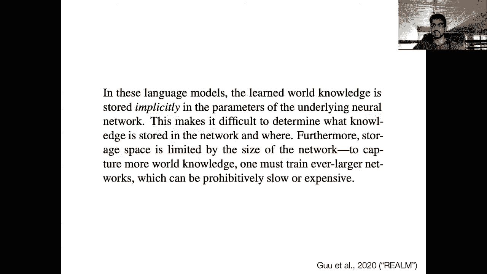

Okay so one of the topics that people or at least someone mentioned wanting to learn more about in this class was about knowledge graphs。

 so we're not going to have an explicit sorry a separate lecture about knowledge graphs but there will be a guest lecture still working out how to actually do that in the live stream but maybe we'll have like a zoom call or something in stream that but we're gonna have one on similar topic of common sense reasoning but you could imagine that you have your BRT model and it has in addition access to these explicit structures called knowledge graphs so if I had to ask a question or make a recommendation of you know what songs are similar to the song shape of you I can sort of traverse a knowledge graph to find out that oh this。

😊，Song was written by Ed Sheeran， who is pop singer。

 and so maybe I should suggest some similar looking songs or similar sounding songs。

So this might be a better way for a song recommendation model to come up with plausible reasonable songs that a person might be interested in however。

 it requires that you actually have this explicit knowledge graph to begin with right and so that is actually the main challenge here。

 so of course， if you have all of this knowledge that's in this graph encoded in the parameters of Bt。

 then maybe Bert is able to make these similar kinds of jumps across the graph。

 it's implicit graph and figure out that it should recommend the same songs however you need to have these graphs in the first place if you're going to use them and they're very expensive to produce right so if you're manually creating them you have。

😊，all the costs associated with you know having people actually annotate and create new links and new nodes in this graph。

 if you wanted to go a different route， you might use some methods for automatically inducing knowledge graphs from unstructured text。

 but this is not a solved problem， there are many errors and issues with even the current state of the art processes。

 oftentimes you need kind of domain specific schema of like what are the relations that I'm going to encode in my graph and what gets qualified as an you might actually end up missing a lot of information that actually is present in real text。

Okay， so that's， you know， the pros of knowledge graphs are that they're easy to traverse once you actually have this structure。

 but the cons are kind of greater， oh I see that I'm buffering。 all right， hopefully it picks up。嗯。

I it back。Okay， it looks like it's working again。I don't see any comments。

 so let me maybe refresh this page。Okay， so it should be working again。Yeah， again。

 apologies about this。Actually， whoops。Okay， it seems to be better， but if it happens again。

 maybe I'll try adjusting my。Video resolution or something。Okay。

 so we were talking about knowledge graphs， but there's another source of language or sorry knowledge which is just unstructured text right so here I don't have this explicit graph structure instead maybe I have a paragraph about Ed Sheen or maybe I have many different paragraphs about Ed Sheen and the song shape of few and from those I can make inferences about similar songs。

😊。

So compared to knowledge graphs， I don't have to do anything really to get a lot of unstructured text right we've already seen that standard language models are trained over huge amounts of unstructured text so we already have methods of encoding the information that is present in text such as using BRT you know looking at the CLS vectors and so on。

 of course these methods may not scale to larger units of text so we know that BRT and the company have fixed token sizes for the amount of context you can fit into them and they're probably harder to extract the relevant information from just text than it is from something like knowledge graphs provided the information you want to extract is in the graph in the first place。

😊。

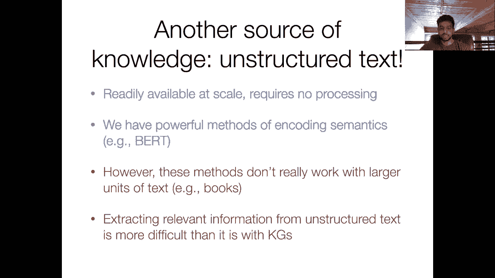

So the realm paper is of documents and this is going to form your knowledge base。

 it's not going to be in any sort of structured format。

 it's just text but in a sense it acts as huge knowledge base that a model can use to retrieve relevant documents that contain facts that might be useful for a particular task。

So let's take a look at how this realm model works you can view it as sort of a variant of Bt except there's a retrieval step in the middle of it。

 so the task is exactly the same as the pretraining task of Bt we are trying to do mask language modeling so here I have the mask at the top of the pyramid and that's the input to my model and I'm asking the model to predict what goes in the mask token。

😊，So instead of simply passing this entire thing through my giant transformer and then just looking at the softmax output at the mask token position。

 which is what we would do in BERT， we're going to have this intermediate step first where we take some representation of this mask token and we use it to query a large collection of documents and this is going to be done through this neural knowledge retriever。

 so we're going to retrieve some documents Z that are hopefully relevant to filling in the mask token in our objective。

So get we'll go through the details of this a little later。

 but let's assume that our document retriever， our knowledge retriever retrieves this document that says theyraid the parayramidion on top allows for less material higher up the pyramid。

 So this document that we've retrieved contains the exact word that we would like to fill in with this mask token right So you can see that in this process we're not forcing Bt to encode the fact that parayramidions are at the top of pyramids。

 we're allowing this knowledge to be present in the document that we retrieved and the role of Bt is now more so to integrate information that it's retrieved into the predictions that it's making。

 So this is a kind of different paradigm than the standard mask language modeling objective that we've seen to this point。

😊，Okay， so the general concept here is that we take the retrieve documents that so it might not just be one document there could be many documents retrieve and we essentially just concatenate these to our original input。

 the masked input， so you can see here that I have my standard CLS token。

 I have the mask at the top of the pyramid， I add a separator token and then I put in the text of the document that I retrieved。

So if that document was Z and my original input was x。

 now I have a joint x comma Z in my input for the final part of this model。

 which is this knowledge augmented encoder， is the standard mask language modeling objective。

 it's predicting the word that was masked， but instead of doing this just based on X。

 which was the original input sentence， it's now doing it condition on both X and the document。

So that's the general way in which this whole system works。

 and we're training both of these components， the retriever as well as the encoder through backpro。

 so we've already seen of course， the training algorithm here。Allright。

 so that's a high levell summary。 And one thing that you might be wondering here is how do we train the retriever right because it seems like the retriever is actually making some discrete decisions right we have this huge collection of documents and we're retrieving maybe one or small number of documents and then sticking them into our input context。

 So if we're making such a discrete decision it's kind of difficult to see how we would efficiently train the retriever。

 So that's what we're going to talk about next， I see there's a question。

 what is a source of retrieved documents So in this paper it's Wikipedia I think the specifics are they took like small windows of Wikipedia articles so maybe like every 512 tokens or something and so they chunked up these articles and encoded each。

😊，Into a vector representation so they had like millions of these chunks from the entirety of Wikipedia and that formed the retrieval corpus。

 but in practice this could be anything right it could be much larger than Wikipedia。

Okay， so let's look at this a little more in a little more detail one thing that I like about this paper is that it's very clearly written and so this equation here basically the variables are y is the word that we're trying to predict for the mask token so in this case it would be this paramidian being the mask token X again is the original input and Z is some retrieved document or documents。

😊。

Okay， so they basically are going to train the retriever remember that was the challenge that we described before by marginalizing over every possible document in the in the huge collection of documents so you see here the summation or somethingming over all documents Z from the set of this capital Z which is the knowledge corpus so if we're doing this。

 this is obviously hugely expensive if I have millions of documents and for every single mask prediction I'm going to be doing this summation over documents you're just not going to be able to train this model。

 but luckily theres some nice tricks that you can do to make this more efficient。😊。

But just to be clear， this first term in the product， P of Y given Z and X。

 this is the standard mass language modeling objective that we've seen in BRT right。

 the only difference is that now we're conditioning it on some additional retrieved text the second part the probability of Z given X。

 which is you can the probability of any document from the knowledge corpus being relevant to the original input X that probability is modeled by the retriever。

😊，Okay， I see another question is this still language modeling if we have additional information yeah。

 it's still a mask language model however， so you can see that you can get the probability of Y given X by summing out the the term that comes from the knowledge corpus。

 so again mask language modeling is not exactly the same as language modeling。

 but yeah it's basically the same thing you do have additional information here but that doesn't affect what you're actually trying to predict in the end。

😊。

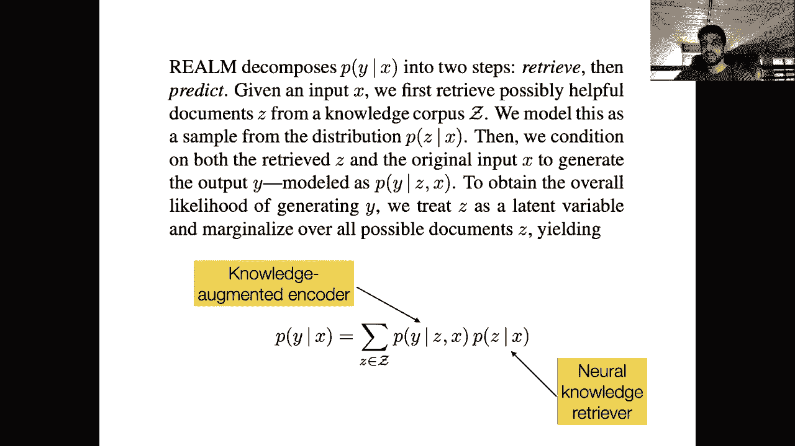

Okay， so let's look at these two components， the retriever first and then the encoder so the retriever operates pretty straightforward in a pretty straightforward manner we basically are going to assume that we have a vector for every single document in our knowledge corpus so this is going to be embed doc Z That's what we're going to call our representation for a particular document in the corpus and this could be any function we've seen so many at this point that can produce a single vector out of from a sequence of vectors we'll go over their exact implementation a little later。

😊，So assume that I have this embed doc Z for every document in my knowledge corpus is's just a single vector for each document。

 I also have embed input X， which is going to be an embedding for the particular input that I have。

 So here it would be the mask at the top of the pyramid that would be kind of squeezed into a single vector and then used to compute this relevant score。

 So the idea behind this F of x comma Z is for every document we want to score how relevant is that document to the particular input that we have in our mask language modeling framework。

 So I would want documents Z that are about pyramids to be higher scored than documents that are about like cats or something。

😊。

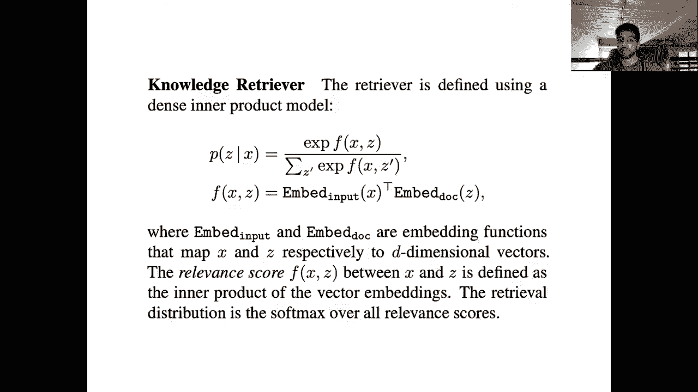

So we're going to be training both of these functions in order to make this kind of more relevant documents get higher scores。

And so once we have all of the scores for all of these relevant scores for all of the documents in the knowledge corpus。

 we can just apply a softmax to normalize this into a probability distribution。

So in many ways it's similar to the attention computations that you guys have seen in the past。

 we're going to be doing basically just a dot product of two vectors and once we have all of our scalar scores。

 we're going to normalize them using the Somax。Okay。

 is neural knowledge retriever basically just a different way of expressing a QA task in this case it seems to be answering the question what is something that is the top of the pyramid？

So one important difference here is that this is a completely unsupervised setting。

 so the model doesn't know that it needs to retrieve documents that are similar to that are about pyramids right it's just that through this whole training process it's going to learn that if I'm going to do a good job predicting pyramidian that's the selfsupvised signal that I have。

 I'm going to want to retrieve documents that help me make this prediction。

 and so since we're actually modeling the score of the retrieve documents in this mask language modeling objective we're hopefully going to be upweighting those documents that are actually helping us but yeah。

 the task is certainly more similar to a language modeling setup that said they do evaluate this model over a bunch of open domain question answering tasks where。

😊。

You would expect this ability to retrieve things from a corpus to actually help you。

 but before you can do that， of course， there's a fine tuning phase as well to better adapt this pretrained system to the task。

but yeah， I think this is more general than just question answering。

 you could imagine the retrieval helping you in many different instances。

 even just standard language modeling as well。Okay so what exactly is used as this embed function that we've seen here so we get one embedding for the input and one embedding for each document they're just going to use Bt。

 so they initialize their embed function with a pre-trained Bt and then fine tune it through backpro but yeah it's pretty straightforward you're just going to encode your input using like the CLS token of what you get when you pass in the CLS followed by the input and a separator token you're going to input encode a document by taking the CLS token of passing in the title of the document followed by the text of that document so these are the two functions that they use they additionally have some projection matrices to I assume make the dimensionality of these vectors smaller but。

😊，Yeah it's pretty straightforward we know that we can use the CLS token of BRT to get a representation of the entire input and that's essentially what they're doing so this is the Bt CLS token of that you get when you put in the mask at the top of the pyramid and this embed doc Z is the CLS token of what you get when you put in this whole document along with its title。

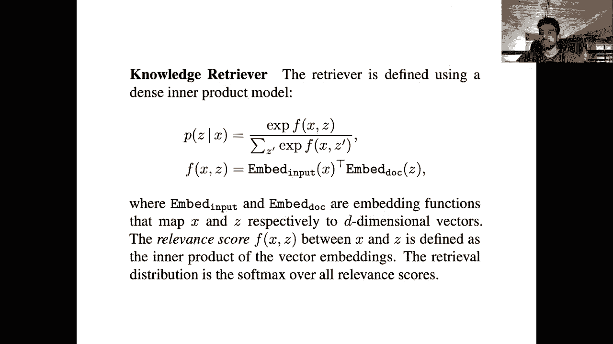

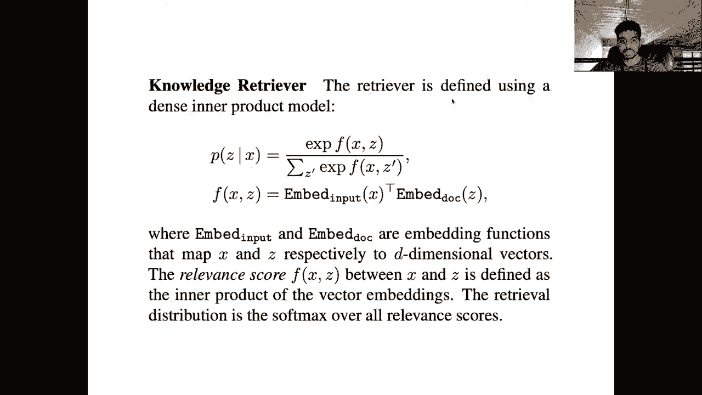

Okay so we've talked about how we get these scores for each document and now we're going to talk about how we actually condition the mask language model prediction on the retrieve document So here again we're just going to be sidestepping the issue of well we have so many documents and doing the marginalization over the full knowledge corpus is expensive we're going to get to that later。

 but just assume that we've retrieved a single document Z the one with say the highest score as output by our knowledge retriever how are we going to use this to predict the token that goes in the mask and this is also very simple once you have this document you're just going to essentially concatenate the original input with the retrieve document and then feed it into a separate burnRT model。

😊，That's going to actually be doing the mask token prediction。

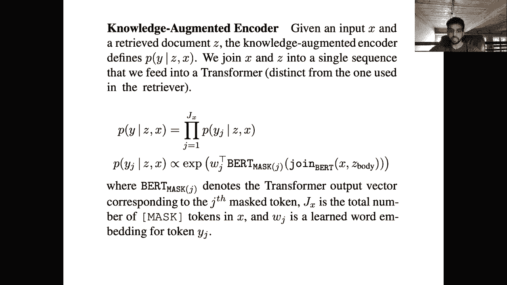

So yeah it's exactly what you see in this picture here we've retrieved this document now we're just going to append it to original input and note that you should understand how this simple concatenation of a retrieved document can influence the model to change its prediction for the mask token and this is because the self-atten in Bert is going to operate over this entire sequence right so the mask token here has no information about the retrieved document however the mask token here is allowed to do self-atten over all of this text and will be able to attend over pyramidian which hopefully will make it predict that word it'll make it easier to predict that word。

😊。

Okay。So on to the biggest challenge of this whole process which is training the retriever right so in the equation that we showed we are marginalizing over the entire knowledge corpus so they just do a very simple trick to get around this in and so instead of doing this summation over all of the millions of documents。

 they just take the top K documents where K is some smallish number and they only do the normalization over that。

😊，So they say that this is a reasonable thing to do if most documents have a near zero probability right。

 so if you imagine back in this equation here， if P of z given x is close to zero。

 then this is gonna to have very little impact on what I eventually end up predicting right so maybe I can only consider the documents that have a higher probability here。

 however， it is a little unclear if that's actually true and if the vast majority of documents do have near zero probability or if these distributions are maybe not as sparse and all of the documents or some large majority have significant probability mass。

 but the fact that this works at all indicates that their assumption is it probably holds at least for setup that they tried。

😊。

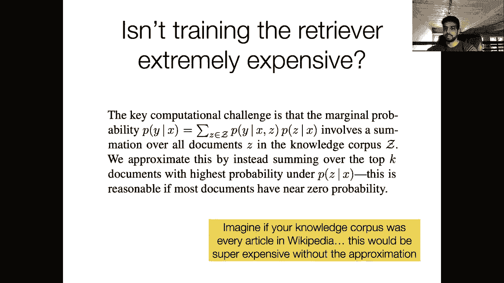

Okay so I see another question， can we use the retriever submodel as a standalone model to do general information retrieval Yeah that's a great question yes you can so I know that actually one of our Ts Colp has been working with this model and related models and has noted that the retriever behaves as kind of an Ngram matching or entity matching that's basically the strategy that it uses in most cases which is what you would maybe expect right to solve this task this particular example。

 you have such little information that like it seems very unreasonable to retrieve documents that have nothing to do with pyramids right however。

 if you have a more complicated task where you might want to retrieve like documents for many different sources and then。

😊。

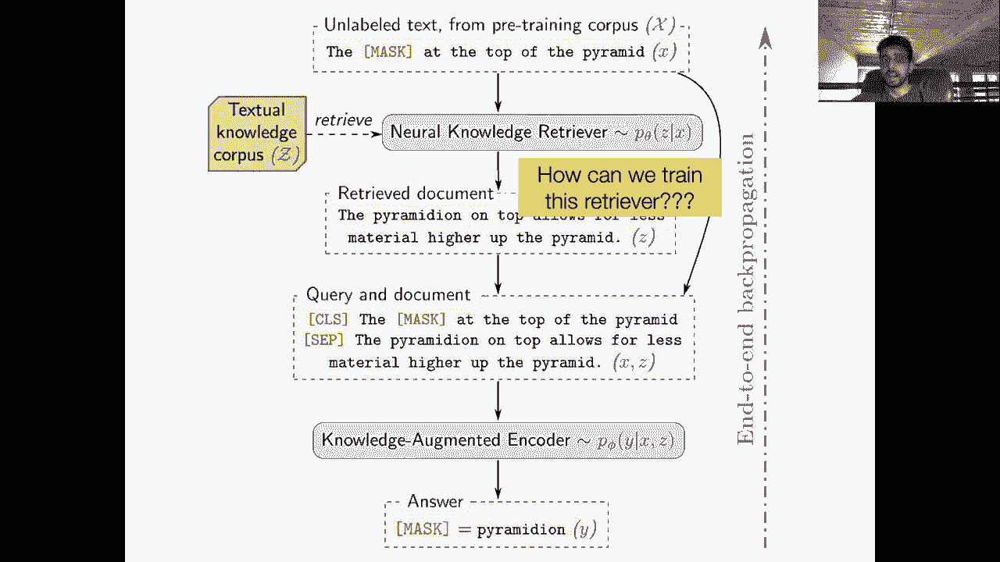

Kind of synthesize their information together。 that's a lot harder。

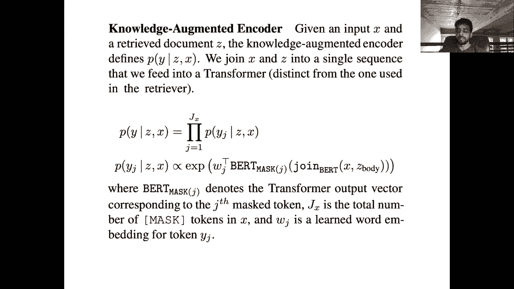

This realm style retriever doesn't actually work for those purposes but depending on what you want to use this retriever for。

 if it's something simple like Ngram or entity matching， then yeah。

 this will probably work pretty well。

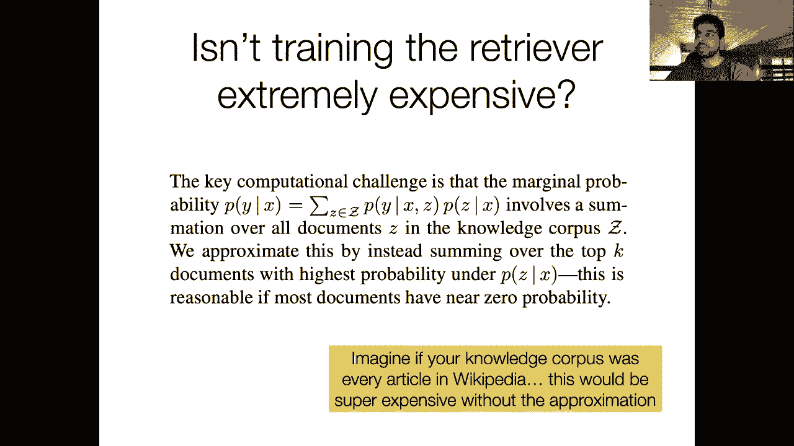

Okay， so they're going to use these top K documents right。

 but this is still kind of slow naively right because it requires that。

 you know if I'm going to do this just using you know standard pietorch。

 I'm going to have to given the embeddings for my input and all my documents。

 compute this entire dot product with every single document， then compute the softmax over this。

 that's going to be really expensive if I have to do this for every mask token。😊。

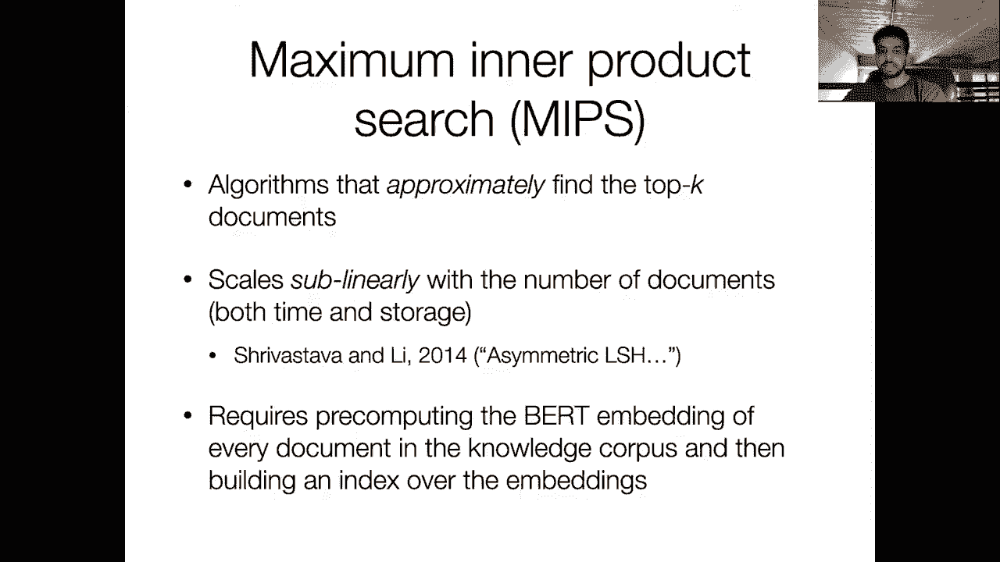

So instead the realM authors take advantage of sort of machine learning advances in fast inner product search and so these algorithms they are not going to give you the exact top K documents that have the highest inner product with the embed sorry embed input X。

 but they're going to give you an approximation of that and so what you gain from giving up the exact top K going to this approximation is that the computation scales sublinely with the number of documents so you can do this much faster than if you just naively computed everything。

😊，However， there is kind of also a drawback of this method which to get the speed up from this maximum In product search。

 you're going to have to precompute the document representations for every document in your knowledge corpus and then you're going to have to build an index over those embeddings as well。

 so this is what kind of makes the speedup possible but it comes at a cost to our training process so I'm not going to go over this algorithm in detail if you're interested you should check out this Nips paper which proposed the general algorithm that's used here。

 but the important thing to know here is that because I have to pre-compute this index over embeddings。

 it's very expensive to build this index and I don't want to be doing it for every single mask token or after every single gradient update。

😊。

So remember that we're actually training the parameters of the retriever and that includes the embedding function for each document right that this is like a burnt model that's embedding every document So every time I do a gradient update to my retriever。

 my index is now out of sync with the current state of the model right because I've changed the parameters of my retriever。

 so ideally I would have to recompute the embeddings for all of the documents using my new parameters for embed doc。

 the embed doc function。😊，So this issue is essentially that the search index that we have becomes stale。

 right， it's outdated， it's been computed from a model that was using an older set of parameters than the current one and the only way to make it not stale is to recompute the entire embeddings for every document in the corpus after every single gradient update。

😊，So this is going to be very slow and they had to do a bit of engineering， probably not a bit。

 but I would say maybe a lot of engineering to get this to work where they kind of agree that it's infeasible to update the retriever sorry refresh this index after every gradient update but they think it's acceptable to maybe refresh this index every few hundred gradient updates to the retriever。

 which means that you will be dealing with a stale retriever for sorry a stale index for some number of iterations。

 but every now and then you refresh all of the documents in the index and you're going to be back to I guess。

😊，Some embeddings that are produced by a model that is better than the older model。

And they do this asynchronously so they have one process that's kind of doing this mask language modeling objective and updating all the models。

 they have another process that takes a snapshot of the parameters of the retriever at some point and computes the embeddings for all of the documents in Wikipedia and then builds this index and once that's done it updates the index that the other process is using for the gradient update of the model so this process kind of looks like this you have one process which is the index builder and you have another process which is the mask language modeling trainer right so that's responsible for doing all the gradient updates and so you start out with the mass language modeling trainer it gives you a set of parameters you send that over to this index builder process and keep in mind that at this point the mass language modeling trainer is doing more and more and more。

😊，updatesates so it always has the latest set of parameters。

 the index builder gets an already stale set of parameters。

 builds its index and then kind of sends it over to the mass language modeling trainer and this happens asynchronously。

😊，Okay， so I think that's basically what I wanted to say about the high level modeling process again。

 if any of this was confusing， please do ask questions in the chat box。

So there are two other things that I wanted to discuss the first is that realmM introduces a couple of other tricks to make this process work better and one of them is something that we've talked about a bit before which is more clever span masking strategy so you can imagine that if you're going to use this kind of retrievalbased language modeling。

 you might want to mask out spans of text that would benefit from retrieval right so if I were to mask out the names of people or dates right these are things that I might expect to be able to retrieve from a corpus like Wikipedia and so it might be helpful in training the retriever and also having this model focus more on like facts that are world knowledge that's in the corpus if I use this more selective span masking strategy。

😊，So that's one of the tricks that they use， they basically run a named entity recognizer to detect all of the named entities in the training data。

 and then they mask those out and then the retrieval process clearly will help with predicting the named entities。

 they do the same thing for dates as well。Another thing they do is within a set of the top K retrieve documents。

 they always include an empty document and so this allows the model to kind of also store world knowledge and stuff implicitly in its parameters instead of always relying on the retrieve documents for this knowledge so the intuition behind including the null document is that the model can either choose to rely on the retrieve documents or it can just rely on the knowledge that it's already encoded in its parameters if particular prediction is you know fairly trivial for that model。

😊，Okay， so whoops now onto the evaluation which I think Joshua gets closer to your question。

 it seems like a model like this would be really good for question answering tasks that are specifically open domain question answering so this is different than the squad style QA in S right we have the knowledge source。

 our knowledge corpus is just a single paragraph from an article。

 so we know that there's not really much other information that we need in order to make these predictions。

😊，In open domainoma QA we're only given a question。

 we don't have a supporting document and that supporting document is not guaranteed to contain the answer。

 so there's a big retrieval component here right in order to answer these questions I might need to access a huge knowledge source。

 do retrieval over this knowledge source and then extract the answer from the retrieve documents。😊。

So they use this REm model which has been pretrained on this mask language modeling task and then fine tuned on various different open domain QA data sets and I just wanted to give some highlights here the NQ here is natural questions which is a popular data set and you can see that thet baseline model for this task was giving us a score of about 26。

5 and the realm model here which includes this retriever with a knowledge source of Wikipedia is hitting about 40 so note that BRT here has no knowledge source this is just what it would predict。

😊，Oh sorry， it has a I shouldn't say that it has a knowledge source。

 but it isn't learning a retriever so it's using something like TF IDF or Ngram matching over a huge set of articles to do this task。

 whereas in Rome we're actually learning the retriever during both pre-training and fine tuning which is making is contributing largely to the improvement here。

Okay， so yeah， it's a pretty impressive improvement。 And also， you know。

 apart from all the engineering tricks that are needed to train this model。

 it's intuitively pretty straightforward right， The modeling is is simple。

 It's using existing components that we've seen things like Bt the。😊。

The scores of the documents are just a simple dot product between embeddings of the input and embeddings of the documents。

 So overall it's conceptually fairly straightforward。

 So just as an example of how this retrieval helps here we have a question or sorry。

 an instance of a mask angle is easily constructed using a straight edge and compass because three is a blank prime。

 And so here if you're going to predict what goes in this blank Bert gives the probability of Vermont being the mask token here。

 a very low probability and this is without any retrieval。😊。

So they do another experiment where they kind of like manually inject a document that contains the relevant knowledge。

 so if you add in this document conditional probability with 257 is blah， blah， blah， Vermont prime。

 thus a regular polygon blah， blah， blah is constructible with compass。

 if you add in this document to the context here Rem gives you 100% probability of this token being Vermont。

And finally， if you use the learned retriever that is retrieving， I think。

 eight yeah eight documents here， and you marginalize over those top eight documents。

 you get a much higher probability than the original BRT model without any retrieval of about 13%。

 which is pretty high considering your vocabulary here is you know tens of thousands of subwords。

Okay， so that's all I wanted to say about RealM， it's a very recent advance， but something that many。

 many people are building on at the moment and I think it has a lot of potential to advance many downstream tasks and not just question answering but also text generation tasks。

 for example。Okay， so I wanted to conclude here with brief intro to another work that is even simpler than realm actually doesn't involve any training at all。

 but also has the same principle of retrieval augmented language modeling。And so this。

 this paper was the second one assigned for reading。

 It introduces this concept of nearest neighbor machine translation。

 So now we're going to switch gears instead of talking about mass language modeling or。😊，嗯。

Question answering we're going be talking about machine translation。

 So here let's start by assuming that I have some sentence that's written in French。

 And remember in machine translation， we have an encoder and decor。

 So I'm trying to generate the English translation here and remember that I decode word by word right So so far I've produced I have and I'm trying to produce the next word。

😊，So remember that in the decoder at every time step of my decoder。

 I have a representation of that time step， right， whatever model I have。

 transformformer or LSTM or whatever I have you know some representation final hidden state that I can get at parent time step。

😊，So here， given that I have this representation， I want to use it to predict the correct next word and normally what we would do is we would take this representation and we would feed it to a softmax layer over the target vocabulary to predict the next word。

 but in this model we do something different so we take this representation。😊。

And we use it to query a data store of sentences and pre sorry， partss。So here。

 instead of just feeding this to the Softmax directly。

 I'm going to use it to query this data store over things that I've cached in my training data set。😊。

Oh， it's not working again。Yeah。But it is going on okay， it is now back。Okay。

 I think it's now maybe working again。嗯。呵。Okay。Hopefully it holds up this time， sorry about this。

I just have like a few minutes left， so hopefully I can get through this。Okay。

 so I'm just going to assume it's working。So imagine in my training data set I have a bunch of sentences and English decodings and at every point during decoding during training time also I have these hidden states so my knowledge store from REM was a bunch of representations of documents here it's going to be a bunch of representations from the decoder in my training data。

So I'm going to cache all of these hidden states that I observed during training。

 and then I'm going to just do the same inner product using the fast inner product search to before I predict what word goes here。

 I'm just going to retrieve the most similar representations from the training data。

So once I do this， I might use some sort of distance metric of like an inner product or something。

 and I observe that for this sentence here， the representation is very similar to the one that I have at test time。

And so I'm going to do my fast nearest neighbor search。So for this example。

 which was the closest in my training data to the one that I currently have。

 the next word was my and there were these two examples which are also pretty close the distance of4 and3 in the next word there was been so I'm going to take these top K most similar representations look at the next word that they predicted and I'm going to kind of just weight these these nearest neighbors by the distance so my here is going to be given a higher score than bin but since I have two examples of bin I'm going to aggregate over both of those and see that with the K andN Lm that's what we call it the K nearest neighbors language model it gives me a score of 60% for bin being the next。

😊，and 40% for my being the next word and importantly。

 this information is coming just from the training data and what words were predicted next by the or sorry。

 what words were in the ground truth next in this model。😊。

So this is pretty interesting that you can actually use just this model if you wanted to predict the next word for your heldout data。

 and this would only work of course， if you have a retrieval corpus that's expressive enough and diverse enough to cover all of the use cases that you might observe at test time。

Okay， but of course you may not have this right your retrieval corpus could be small or it could be out of domain or something like that。

 so you might also want the model to have its own softmax layer to predict the next word in the case that the retrieved prediction is irrelevant based on you know faulty retrieval or not enough data in the retrieval corpus so the final objective here when I'm predicting a word in my decoder is I take the distribution that I get from this KNN thing and I interpolate it with the predicted distribution that my decoder gives me So this is just like a weighted average with a hyperparameter lambmbda here that you determine by looking at your validation performance。

😊。

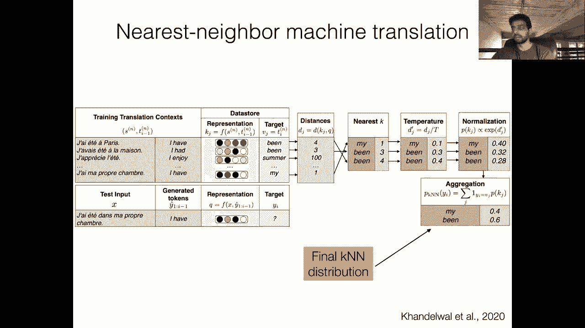

All right， so the interesting thing about this method compared to REM is that it requires no training at all here we're assuming that we've cached all of these training hidden representations and we know that what the ground truth next word is。

 we're just doing this aggregation over the K nearest neighbors and retrieving one of their or like using the distribution after aggregation as our predicted distribution sorry my voice is dying from retrievetd corpus。

😊。

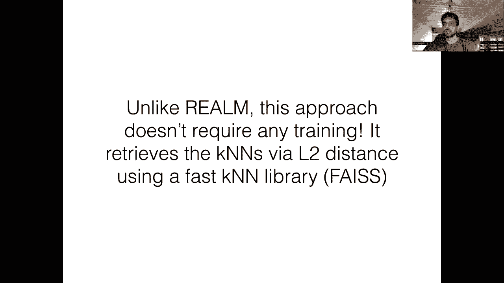

Um， so we don't have to train a retrieval model because the retrieval model is actually just the train translation model itself。

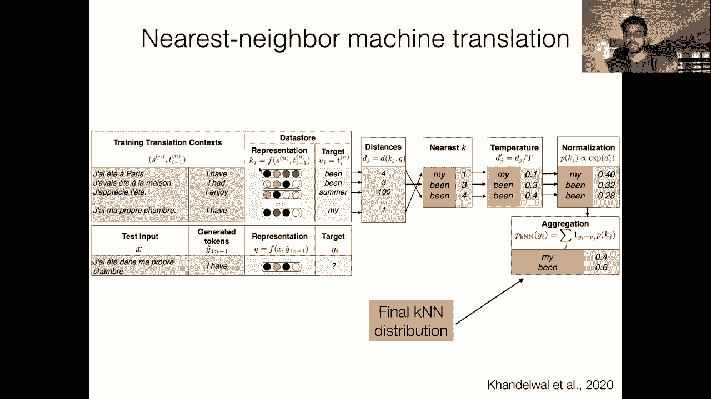

So this is an interesting twist on the idea with realm。Okay。

 so the one issue with this is that we're doing this retrieval at every single time step of the decoder。

 so this is super expensive even with the fast nearest neighbors algorithm and they mention in their paper that it's two orders of magnitudes modules so you're sacrificing a lot of speed for improved translation on the other hand you do get significantly improved translation so they try this over many different language pairs you see here the base machine translation system and what happens when you add the K nearest neighbors representation and retrieval to this you get blue score improvements of one to three and in all cases I think it's better than the baseline so。

😊。

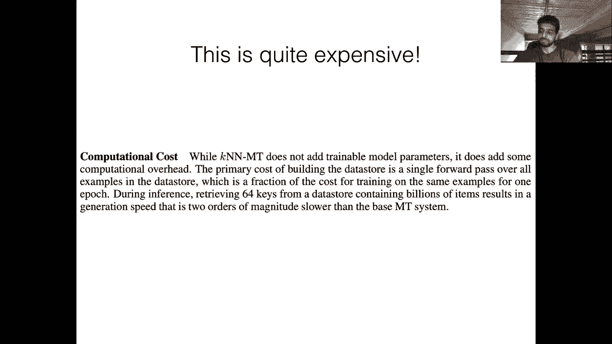

You can see also the data store size I think this is relevant to Andy's question won't the index be huge Yeah。

 it is so here you have for German to English 5。5 billion different representations in your data store or your retrieval corpus so yeah your if it's worth it depends on your particular use case。

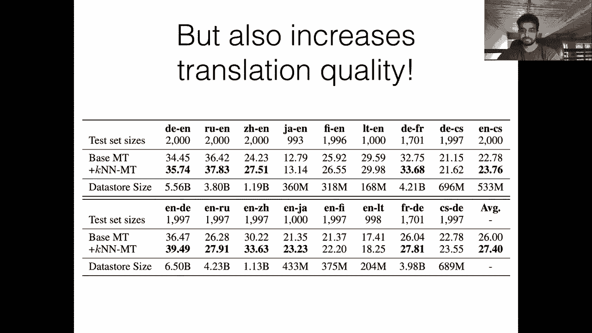

However， they do an analysis of like how big the data store needs to be to get these performance improvements and you can see that here this is。

 I think the blue line is English to Chinese and the red line is Russian to English you get an improvement on English Chinese by increasing the size of your data store to some huge amount I guess they have it here。

 what is this English to Chinese which is 1。13 billion examples but most of the improvement comes within say the first like 100 million or so and you get decreasing gains。

 although this curve looks like it's still increasing on Russian to English it looks like you don't actually get any improvements beyond some point so if you're interested in speed up you could consider using a smaller representation in。

😊。

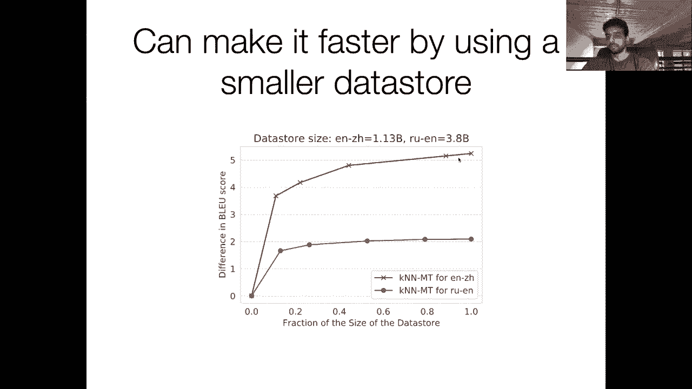

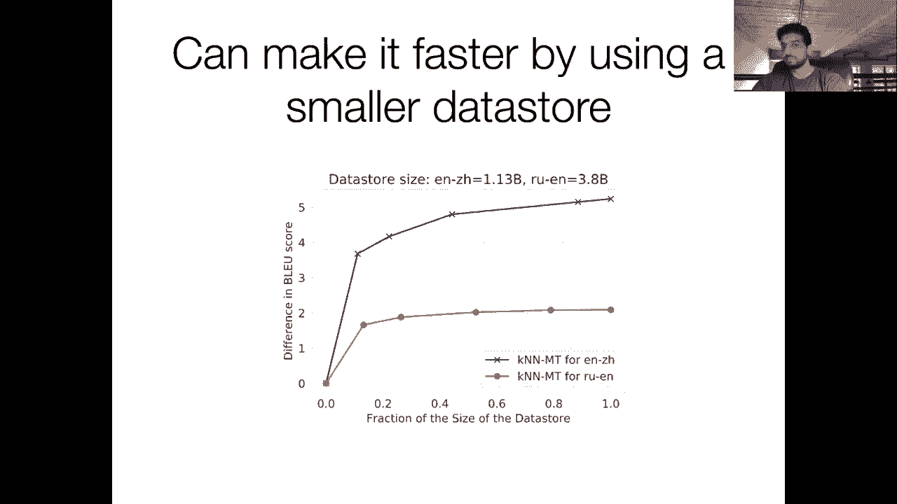

やつ？Okay， so yeah， I think I'm， I'm pretty excited about this research direction。

 I could see it being more and more popular over the next few years and。😊，Yeah。

 I think that's all I wanted to say about that for next week we're going to start on Monday by doing an implementation of the transformer for a generation task and then we're going to look at on Wednesday the intersection of computer。

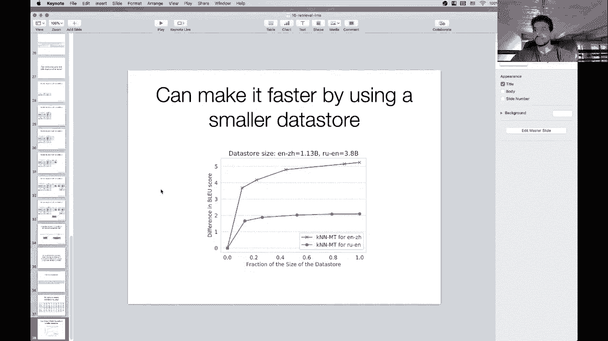