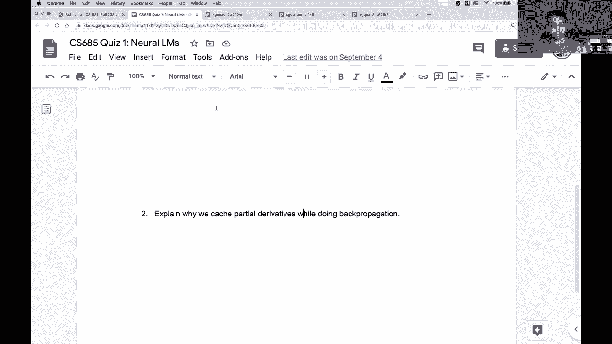

# P22：考试复习课 - ShowMeAI - BV1BL411t7RV

嗯。All right， hey everyone， so today we're basically just going to spend time going over previous quizzes。

 homeworks and exams。Also， feel free to post questions in the chat log。

The chat box sorry and also if you have more detailed questions。

 feel free to come to my office hours tomorrow morning。

 I'll try and extend them for however long they are maybe like one extra hour if there are people who have lots of questions。

But okay， so of course our focus for the day is the exam and one other thing is that on Wednesday we won't have class that you can spend more time preparing for the exam。

All right， so before we start going over things like previous quizzes and exams。

 I wanted to give you a rougher idea of kind of a rough idea of what's going to be on the exam since we've covered quite a few topics maybe to help you focus your studying a little more so the exam is maybe 75% done at the moment still have to write another problem but now we roughly know what's going to be on the exam so in particular one thing that is definitely going to be on the exam is a kind of higher level question asking you here's a new task how do you go from getting the data for this task to training a model that can output predictions on this task and it's it's a pretty。

😊，General question that encompasses various different aspects of stuff that we've learned over the semester。

 so you're basically going to be asked to fully specify a model from you know the data preprocessing steps to the model building steps to what happens at training time and test time。

 etc so there's really no like existing practice question on any of these exams that's like that so I wanted to give you a heads up that you should expect something like that and maybe it can help you focus your studying。

Okay， so the other questions are all， I guess a little more open ended than the stuff that you have in the practice exams there will not be questions like。

😊。

Well， let's see if I can find。Sorry， I opened up all these practice exams。

嗯。Yeah， they it。There won't be questions like this one。

 I know like most of the practice exams have this kind of question。

 but this is something that you could easily implement yourself on a coab notebook to get the right answers。

 so it's not really something we can ask about the questions will be more in line with a couple of the previous exam questions。

 So we'll go over that。When we get to the exam part， okay。

 so how much time will the exam reasonably take， can it be done in a single sitting， Yeah。

 so it's going to be five problems possibly for but likely five problems each with multiple parts。

 it's going to look very similar to the the practice exams in terms of length and those were intended to be done in one and a half hours or one hour 15 minutes I would say that you should be able to do it in like a two hour sitting and it certainly won't be taking 48 hours。

 So the two day period is just so you can you know。

 pick what time you want to work on it but and be kind of flexible with your schedule， but yeah。

 it definitely is not going to take two whole days。

What should we know about data pre processingces I mean we've we've talked about some methods of going from raw text to you know a format that you can put into your models right so there's the tokenization there's maybe you want to I don't know do some filtering on your vocabulary there's also like how do you decide what examples in your training data are reasonable and what aren't so there's there's lots of things that fall into the preprocessing category。

 It's basically anything that you might want to do to your data to make it cleaner and easier to model I probably shouldn't say any more than that it is you know oftentimes specific to a particular problem or end task right so there is also a coding question。

 I mean， it's not really a coding question， It is something that you could answer without。Any coding。

 but there will be a question within associated coab notebook and it's there for you to you know use it to do some analysis if that。

Is is useful for your answer， but it's， it's not like you have to implement an entire model in a coab notebook or anything like that。

 We'll basically give you。A large amount of scaffolding code。

 and you might want to make some small tweaks here and there to analyze what's going on in that code。

嗯。Yeah， this coding question is one of the things that we can actually feasibly give you in a remote exam that we couldn't in an in- personson exam。

 so there's not really a practice problem for that as well。

 but I'll go over some of the similar ish and conceptually at least practice problems on the previous exams。

How detailed if an answer is expected for designing model for the task Yeah， so of course。

 we don't want you to be writing like pages and pages of stuff but basically every single important design decision that you're going to make in this process from going from data to model output at test time that's what you're going to need to describe and for every single one of these decisions you need to justify why you decided to go this route So I don't know。

 maybe a couple paragraphs it would be best to format your answer in a kind of list of here are the things I did and for each thing why did I do this thing So sorry that's a kind of vague answer but yeah in general。

 most of these questions can be answered and no more than a couple of paragraphs and many of them are just a few cents。

😊，like you saw in the practice exams， I know my answers are usually very brief。

 but some of those complicated questions can be answered in like a single sentence， so yeah。

 don't write huge amounts of text that's just going to make it painful for us to grade and we'll be annoyed at those kinds of responses。

😊，Okay， so let me get into the review of previous questions and let's go ahead and get started with some quizzes so we had five quizzes so far this semester we might have one more after the the week after the exam but yeah all of the quiz questions are relevant to topics that may or may not be on the exam。

😊，So starting with quiz one， and I think this is also a good review of the stuff we covered this semester。

 so quiz1 is dealing with a couple of different things it asks you to compare。

 oh sorry this might be too small。😊，It asks you to compare ngram models to neural language models and so this first question you're given an unsmoothed five gra model so remember we talk briefly about smoothing in particular add one smoothing as a way of kind of getting some probability mass into unseen ngrams that are maybe occur at test time but don't occur in your training data set and you don't want to give those test sentences zero probability just because you didn't observe a certain ngram at training time right so that was the intuition of smoothing but here we have an unsmthed ngram model which means that any ngrams that it didn't observe at training time is going to have zero probability at test time right and so if you see the prefix we gave you here rabbits flap their wings。

😊，kind of unlikely to be observed in a training data set right Rabbits that don't have wings。

 obviously so you would only write this maybe in some sort of creative storytelling type task so you might expect your five gra model to have never seen this prefix before in which case this probability will just be zero and yeah this is of course not going to be a reasonable estimate because this is a grammatically valid sentence and also it's certainly possible in some sort of fictional world so the fixed window neural language model doesn't have these issues with unobserved prefixes because each of these words is modeled by a dense real valued embedding so rabbits is similar in the space kind of to birds。

And to other animals， so your fixed window language model is going to be able to give you at least some sort of reasonable prediction given this prefix。

😊，So that was the general intuition here The second question。

 why do we cache partial derivatives while doing backpro if you don't understand this you should rewatch the backpro lecture and go through those notes。

 but in general， if you're going from the topmost layer to the bottom。

 you're going to be computing when you take the gradient of each parameter with respect to each parameter。

 you're going to be recomputing a lot of terms， especially bottom at the bottom of the network and so you don't want to be you know doing all those computations again and again at every layer because they're shared across all some of those computations those partial derivatives are used over and over and over again so you want to cache them to avoid unnecessary computation。

😊，It's， it's one of the fundamental properties of the back prop algorithm is this caching， right。

 So yeah， that was for this quiz question。 Maybe at this point， it' would be good to look over。

Just briefly， some of these。

Yeah， this question in particular。 So this is from the。呃。

5852018 exam problem3 and this question actually I should say。

 is probably not a very good exam question。 I think only one person in the class got this right so definitely not the difficulty that we were aiming for but it does test a couple of different concepts that are related to Ngramham language modeling。

 So here we have a trigram language model， we're using add alphapha smoothing。

 So we talked about where Alpha can be a different value。

 not just one because remember if we if you do add one smoothing。

 you're stealing away a lot of probability mass from stuff that you've observed in your training data set So here it says that you're training this language model on Wall Street Journal articles from 2003 and you're testing it on Wall Street Journal articles from 2004。

😊，So the first question says plot the shape of the probability， probability。

 note probability not perplexity of your training data set under the engram model as this alpha term increases from zero to infinity and so this is the standard plot that you would see when you're applying smoothing without any smoothing。

 you have maximized the likelihood of your training data you're going to be assigning a really high probability there。

 but as you add smoothing as you make alpha larger。

 you're stealing away probability mass from the engrams that you've observed in your training data and putting them on unseen engrams。

 remember the zero terms that were in the count matrix that we covered at the beginning of the semester so we're gradually going to be decreased。

The overall probability of our training data because we're kind of taking away the mass and putting it on unobserved items and you should also think about what happens if alpha goes to infinity right that means that all tokens will be equally likely right all engrams will be equally likely because that alpha term dominates the counts that we observed at training time so this eventually converges to some low probability。

So at test time here since this was a kind of tricky part these articles are from 2004 the training data was 2003。

 so you would expect new entities and ngrams and so on to show up in this test data set right and so initially with no smoothing when alpha is0 you're going to have a zero probability of your test corpus just because of all these unobserved ngrams that you're going to see a test time Now the whole point of adding smoothing to your Ngram model is to increase the probability of held out data and get around this problem of well there's unobserved engrams right so if you add a little bit of smoothing to the unobserved engrams you can still take advantage of the training statistics that you got from your training data set so that explains this。

😊，When you add a little bit of smoothing， you get an increase in your test probability from zero to some nonzero probability。

 but then the same thing happens that happens at training time after adding too much smoothing you're going to kind of even out the probabilities of all the ingrams and。

that's just going to make this converge to some value And finally。

 the third question was really easy here。 It's asking you to plot the perplexity and perplexity is just the inverse of the probability right so you just invert this curve to get the perplexity and remember that perplexity is the lower it is the better your language model and I see there's a question about the perplexity Like I said it's essentially the inverse of the probability so it's directly a function of the probability of whatever data you're evaluating over but we talked about briefly perplexity as having these connections to information theory specifically the branching factor of the model and the data that you're looking at so there is an example you can。

😊，Go back and look at it from the language model lecture where we looked at this simple task where you had a language model of digits and they kind of randomly occur and your branching factor is like you have 10 different digits。

 they all occur with equal probability so you get a perplexity of 10 which corresponds to the branching factor。

😊，But yeah， in general， it's the basic metric that you use to evaluate language models。Okay。

So let me。So sorry there's a bump because referring to this plot because when you add a small value of alpha as as smoothing then you're not like stealing too much probability mass away from the statistics that you've got the counts that you've got at from your training data set right so Wall Street Journal in 2003 is going to be talking about a lot of the same things as 2004 not only that but your training statistics have encoded a ton of low levelve like syntactic information like what is likely to follow a noun or what is likely to follow a noun phrase or this punctuation mark or so on right so that's all important information encoded in your training data set and you would expect it to carry over to your test data as well right it's still written in English。

😊，So that's where the bump comes， you're going from zero probability because of these unobserved engrams to a pretty reasonable estimation of the probability of the test set with a low level of smoothing。

 but then the thing the probability slowly declines because as you add more and more smoothing you're washing out those training counts that you estimated on your training dataset set。

嗯。Why do the test why does the test set from 2004 start from zero。

 it's because we expect there to be ngrams in the 2004 data that are not seen at training time right so with no smoothing if you observe an Ngram that isn't in your training set you're just going to have a probability of zero for the entire test set。

 which of course you don't want right so that is the entire issue with unsmooth language models and that's why we are adding smoothing in the first place。

So yeah。Again， this question is it was not a very good exam question。

 so I don't want to spend too much time on it， but yes， just to answer the last question here。

 there are certainly ingrams in common to both the training and test data set and that's why we expect to see this bump right because we expect the training statistics to be a pretty good model of the test set as well。

 it's just that the smoothing helps us out with the small potentially small set of unobserved engrams。

😊。

Okay， so let us move on to quiz two now oops， I did not mean to close that exam。

Sorry， let me open it again。

All right， so in quiz2 we were talking about attention mechanisms and so question one here is essentially just did you watch the lecture or do any of the readings but the bottleneck in the RN here specifically we're talking about the RNN's hidden state is tasked with encoding information about the entire prefix that it's seen up till that point right so all of that information is getting stored in a single vector and this can be pretty bad for a number of reasons right if you have a very long context then you're asking a lot of this model to store all the important semantic and syntactic and discourse level information into a single lowdisal vector。

😊，The second thing is that we know these RNNs just through the nature of their computation of a recency bias。

 which means they have more information about tokens that occurred recently and less information about tokens that happen well in the past so this is kind of related to the issue of forcing all of that information into just a single vector。

 some of the tokens will be advantaged more than others。

 and so attention lets us get around this by essentially allowing us to access all of the hidden states in the past。

 not just the immediate last one so you don't have to store all of the relevant information in just the last hidden state of the RNN。

😊，This question I think I answered on Piazza but I will restate the answer here why are the query and key projections important in the transformer self-atten it's because you want the you want to allow the attention to be somewhat flexible and not have the same score when particular word as a query and another word is a key versus when the situation is flipped so having these different projections allows you to have asymmetric attention based on whether a word is a query or a key and in practice you might observe that having the same projection so just having the same embedding used as query and key will put a higher weight on the word itself rather than other words in the sentence you can think about this as if you normalize the dot product right if you take the dot product of。

😊，Vectctor by itself and take like the cosine similarity with the normalization it's going to have a similarity of one right so this is kind of some intuition on why if you have just the same projection you'll be。

😊，Putting perhaps more weight than you might want on the word itself。

 whereas in an attention mechanism， flexible attention mechanism。

 you might want to allow it freedom to focus on any other word in the sentence and even ignore the current word。

Note here that we didn't talk about the value vectors。

 the intuition behind the value vectors is kind of less clear。😊，We've've sorry， I it。🤧う。Okay。

 we my student and also TA Sung has done some analysis experiments removing the value vectors from transformers and doesn't really affect the performance on translation or language modeling so yeah practically speaking the value projections probably just a way of adding more parameters to the model。

 but maybe not super important。😊，All right， so let's move on toquiz3 here。Okay。

 so again question one here， pretty simple if you understand what a recurrent neural network is doing。

 but remember that the recurrent update equation has a dependency on the previous time stepss hidden state right that's the part of the update equation the H subt minus1 so just by definition we cannot compute the hidden state at time step T without having already computed the hidden state at t minus1 so this prevents us from parallelzizing across like the entire sequence at training time but the transformer we can do this right because there's no such dependency this is each time step we're just attending over the stuff we've seen in the past and so through the mask that we've seen。

😊，Now in a couple lectures， also in the coding lecture last week。

 that mask allows us to parallelize the self attention computations at training time。

 and this is the main implementation advantage of the transformer is that it's much faster to train than a recurrent model of similar depth because you can do all these computations at parallel and this is probably the major reason why people don't use recurrent neural networks as much in NLP anymore because it's much easier to train these deep transformers。

Okay， the second question here was kind of interesting。

 So this was testing your understanding of like model size essentially in the tunable parameters in a model so here we had a sentiment data set that contained only 10 labeled examples。

 So this is an incredibly small training data set right most of the data sets we've observed in this class like S or NI they have on the order of 100000 training examples。

 So here we have 10 which is basically nothing。😊，So what else do we have。

 we have a pretrained transformer language model， so possibly something like BRT or GPT or something like that。

 and this has been pretrained on a ton of data and so now we have two different scenarios in the first scenario we have a downstream model which is a deep recurrent neural network and it's randomly initialized。

 we're training it from scratch but it takes as input these contextualized word embeddings that are derived from the pretrain language model。

However， all of the parameters of this recurrent neural network are trained from scratch using just the 10 labeled examples。

In scenario B we have very few parameters associated with our downstream model。

 first of all the composition function here is just the average of the word representations you get out of the pretrain transformer and the only parameters that are learned on the training the downstream training data set of 10 labeled examples is the softmax matrix which is going to be projecting the average embedding down to to a two dimensional vector for the binary sentiment prediction。

😊，So here of course， you have far fewer parameters to train from scratch。

 just the weight matrix for the Somax， the language model parameters are not fine tuneuned note that in scenario A we're also fine- tuunning the language model parameters so in general scenario A is going to have orders of magnitude more parameters than scenario B and when you have very small trading data set you want to limit to as much as you can how many parameters you're training from scratch and how many parameters you're actually updating using this small data set so scenario B is definitely to be preferred here。

😊，Because and that's not to say that scenario B will work。 scenario B probably won't work。

 but it has a better chance of working than scenario A in which you're very quickly going to overfit the 10 labeled examples and there's no way this model is going to be able to generalize to any held out data set there's just far too many parameters for that generalization to happen you're going to overfit very quickly and your function that you learned is not going to be useful that's probably going to happen in scenario B as well。

 but the chances are definitely higher that there will be some generalization。😊，Okay。

 so that was quiz3 Again， if you have any questions， feel free to ask in the chat。

 let's move on to quiz4。嗯。So in quiz4， the first question here。Is talking about the electro model。

 So remember this is one of the advances over BRT that we talked about。

 the other models that we talked about here were Roberta and Albert and also the transformer Excel or Excel net and each one of those had a couple of differences from the normal BRT model improving on certain dimensions like whether it be able to adapt to longer contexts or able to be trained faster or just some small tweaks like Roberta that when combined together result in pretty significant improvements。

 So you should know all of those models and generally what they what their main contributions were。😊。

But this question in particular is focused on E， which used the objective of sampling。

 instead of mask language modeling， we're going to replace some words and an input with other words。

 fake words， and then ask the model to do this binary classification task of given each word in the sentence。

 was it part of the original sequence or was it a fake word that was added in。😊。

So in this question we are asking about a different strategy of getting the fake words right in the normal electro model we have a generator model that looks like Bt basically that gives us fake candidate words that are kind of similar to the word that we're replacing。

 maybe similar in semantically or also syntactically and the question asks us if we just randomly sample fake words from the vocabulary instead of using this generator model what is going to happen。

😊，And so here the answer is just that if you randomly sample words， fake words。

 your task is going to be incredibly simple most of the time right so if you take this sentence。

 imagine if the fake words did not come from a generator model and let's say I decided to replace the word come with cat。

Right， just some random word。 Now， I have the sentence。

 Imagine if the fake words did not cap from the generator model。

 If I have a discriminator that's trying to predict if a word is fake or real。

 this word is clearly out of place here， right， it's。Syntactically out of place， right。

 it's not a verb， semantically it doesn't really make sense with the context here。

 And so the model doesn't actually have to learn all that much about the sentence and the meaning of it in order to decide that that cat doesn't belong here if I actually used a discriminator a generator model and maybe this word would be something like I don't know。

 follow which still seems a little strange， but is is much closer to the original meaning right So the model actually has to you know。

Better model what is going on linguistically in the input to predict that follow is a fake word here。

So we would expect downstream performance， of course。

 to tank to decrease if we randomly sample words because our model isn't going to be learning as much about language。

All right， so for a question two here we had downstream sentiment task。

 we had access to a BRT model and this question was about the intermediate fine tuning process that we talked about in one of the lectures so remember in intermediate fine tuning。

 we start with our pretrain self-supervised task like Bt mask language modeling and then we finet this model on intermediate tasks using labeled data sets like NI or S or other data sets that we've talked about in this class and then eventually we fine tune it on our downstream data set。

😊，And so depending on a bunch of factors， like how related are these intermediate tasks to the downstream task。

 how complex are they， how large are they， if you choose the correct intermediate task。

 you can further increase your performance on the downstream task。

So here we had a sentiment task and we decided to finetune this model sequentially on Squa。

 then on hotpot QA and then on MMLI， and then eventually after all of that we fine tune it on our sentiment data set。

And we found that this model is far worse than just a baseline where we fine tune Bt on our sentiment task。

 So there's a couple things going on here。 One is that none of these tasks are explicitly focused on sentiment。

 So they might not be very related to the downstream task。

 But the more important thing is that here we're sequentially fine tuning on three different intermediate tasks。

 So each time you do this intermediate fine tuning。

 you're going to be forgetting some information from your pretraining tasks， right。

 and we know that the pretraining in in Bt is the largest contributor to our increases in downstream performance。

 It's the thing that allows us to encode the most linguistic like generalizable linguistic knowledge。

 right。😊，And so if we specialize our model to QA tasks and then also specialize a resulting model to entailment。

 we're going to have forgotten a lot of important information from our pretraining which might have been useful for sentiment and so this is why you don't want to kind of chain these intermediate tasks together like this。

 every time you do fine tuning， you lose information from the pretrain task and if you do it too much you're going to lose a lot of information and thus decrease your downstream performance。

😊，Any intuition for why intermediate fine tuning might lead to better performance on small data sets so it really depends on the relationship between the intermediate task and your tiny downstream data set but。

😊，Yeah， I mean， in general。Yeah， I mean， I don't think I have a good answer。

 like general answer to this this question， it really does depend on the relationship between the intermediate task and the downstream task。

Because you see huge variances at small downstream data sets right some tasks really tank the performance。

 other tasks increase it a lot， so I don't know if there's any general finding here。

 It's just that on small dataset sets， your variance is going to be much higher and so if you can get a good intermediate task that is kind of related in the types of reasoning that's required for the downstream task or is related in the domain of the data or something like that that can help offset some of the the issues associated with the smaller data set。

 but yeah， it doesn't always help so。Sorry， that was an unsatisfying result， but it's just not known。

 I guess， at the moment。All right， moving along here。

 final quiz this was on text generation The first question here was more of kind of open endeded opinion maybe rather than a real problem。

 but it was talking about GPT3's few shot learning performance specifically on these arithmetic problems so they showed that GT3 can learn addition to some degree especially with smaller numbers。

 then they did this experiment to search for whether they had observed a lot of these examples in their training their massive pretraining data set they found that 17 out of the 2000 edition problems occurred in this format in their data。

😊，嗯。Personally， I think that there are likely many other formats in which addition could be described in the training data set。

 there could be many paraphrases of these kinds of templates and I think there's likely far far greater or far more examples of addition problems in their data than what they could find with these simple regular expressions。

 so I'm not personally convinced。😊，But you could disagree。So yeah。

 this problem is not like anything you're going to see on the exam it was more of an opinion The second question though is is more relevant so here we had a new task of paraphrase generation a model received a single sentence as input and is asked to generate a paraphrase。

😊，So again， a paraphrase is a sentence that kind of maintains the semantics of the original sentence。

 the meaning of that sentence， but it's the surface form like the words and structure could be different。

So the question ask why might you want to use a samplingbased decoding algorithm instead of beam search here and in this case。

 if you want to generate a paraphrase， you likely want some modification of the words or the structure right otherwise you're going to just decode the same sentence So if you use beam search。

 you're very likely to copy significant portions of the input sentence in this task and you're not likely to get much diversity when you when you decode using beam search right what is like the highest probable paraphrase of a sentence well its it's going to be usually something that's very。

 very close to the original sentence， if not identical， maybe you just flip a word here and there。

 but if you use sampling because of the randomness that's in the sampling strategy。

 you're going to have a much higher chance of getting different words from the input much more diverse。

😊，Paraphrases and this could be very useful for many downstream sentiment sorry downstream tasks like if you're using paraphrase for data augmentation as you did in your homework here you might want diversity rather than copying your input so that's a concrete case of where diversity is important in this paraphrase setup up。

😊，Okay， so I see a question in the homework， my model work better when finet on Mli than when finet on Yelp。

 but I expected Yelp to be more relevant as it was a sentiment data was this expected。 Yeah。

 that's interesting So I think first of all， there shouldn't really be expectations with with these kinds of methods。

 there are very new and unexplored and it's very possible that if you finet on Yelp。

 you're not adding much more information to your downstream tiny SST data set right you're capturing a bunch of sentiment related words and terms and keywords in the Yelp data set。

 but maybe you were already doing a good job of that with your pretraining right MI on the other hand。

 if you fine tune on that， you might have a better model of the semantics of the sentence in general。

 right MIs testing essentially semantic understanding。😊。

So that could be much more helpful for your in terms of what you're missing from both pretraining and from the tiny SST downstream task than just the Yelp data set where the model might be focusing on sentiment related keywords and their associations to particular labels。

 but yeah， I mean again， this was a very open-ended question depending on how you set this up and your random seed and so on。

 you might have observed different results and you can explain you can come up with a reasonable explanation both ways。

 but it was just trying to get you to think critically about your results。All right， so wow。

 45 minutes gone by， let me move on to the practice exams and just go over some of the problems here so starting with the 585 midterm。

So we did not cover word devec or static word embeddings in this class。

 so there won't be any questions like this that ask you to compare different word embeddings together like Elmo versus word devec。

😊，So we didn't cover HMs， we didn't cover the Viterbi algorithm This is a nice problem about perplexity in Ngram models yeah so I see there's a bunch of variance in results on this homework problem in the chat box and the final message here。

 tiny SST is tiny so maybe by luck as well is a huge factor here it's such a small data set that literally any outcome is within the range of possibility and it's why like if you can do just one thing in a downstream task to improve your performance。

 the best thing you can do is just collect more training data that's always going to be most helpful if it's possible and all of these other things like data augmentation intermediate fine tuning。

😊，Those are only techniques that you should resort to if it's really hard or expensive to get any more labeled training data for your downstream task。

All right， so this question is just asking what is true a true statement about perplexity in Ngram language models and so if you look at choice A。

 given a large enough training data perplexity increases as the prefixize the order of the Ngram model to n increases this is false of course。

 your perplexity you would expect a decrease as you add more and more information to the context。

 of course at some point without proper smoothing you might expect the perplexity to start increasing again。

 but from going from like a bigram to trigram to a for gra pgram model given enough data you should expect to see perplexity decreasing so this is false statement B is also false you can only use perplexity to compare models of the same order。

 this is not true right all of these models are giving you a probability。😊。

OfOf whatever data set that you're applying it to and those are comparable。Stment C。

 applying add1 smoothing to an Ngram model results in increased heldout perplexity compli so we didn't talk about absolute discounting so we can ignore this statement if your heldout data contains ngrams that are unseen at training time your perplexity will be undefined unless you apply some form of smoothing this is true smoothing is what helps you get around the zero probability and remember perplexity is the inverse of the probability。

😊，All right， we did not cover logistic regression or naive bays I think for this exam。

 it is important to understand at least how we solve these problems。

 you should be able to come up with these answers even though I'm telling you that you're not going to see a problem like this exact like here's a network compute these partial derivatives the problem that you will see on the exam requires basically the same level of understanding so you should be able to solve this kind of problem。

😊，Okay， so this problem， wait， was this the right。Sorry， this is a 20191。

 I'll come back to the 2018 one in a bit。 This problem is maybe more indicative of the type of problems that you'll see on the exam。

 So here we're giving you a new task text infilling was not a task that I covered during the semester of this this class。

 sorry， the 585 class that this exam is from。 I also didn't cover this in this semester either。

 So this is an example of a new task that requires you to generalize some of the knowledge that we've discussed so far to something that you haven't seen before。

 So in this task， you were basically given a sentence and some number of blank words in the middle of the sentence。

And you're asked to fill in the blank。So in the first part of this question we're given a pretrained left to right recurrent language model。

 so we're not given something like BRT where we can mask out these tokens and predict them here we're given a left to right language model so if we're given a left to right language model how am I going to use it to solve this problem and the key point here is that computational efficiency is not a concern so we can use any algorithm regardless of how expensive it is and the problem asks us specifically to produce the token the missing token sequence with the highest probability so this is saying that we can't use an algorithm like greedy search or beam search right because those are just approximations right they don't give you the exact org max。

😊，Of what is the highest probability continuation？Here we're specifically asked at the highest probability continuation。

 So the only way to do this with our language model is to try every single combination of words in the blanks we don't even know the size of the blanks so we have to try all combinations of one word。

 two words， three words for words so on up to whatever k is and for each completion we have to measure the probability that is given to that completion by our left or right language model so we know how we can use the language model is to measure the joint probability of a sentence right we just multiply the conditional probabilities together as per the chain rule and then once we've exhaustively enumerated all of the possible completions here。

 we're gonna to pick the one with the highest probability。😊。

So essentially here this was a kind of combination of the decoding algorithm has to produce the highest probability completion。

 so you have to enumerate everything because all the decoding algorithms we've seen in the class are just approximating that AGmax。

😊，Now the second question kind of follows from the answer of the first question。

 obviously enumerating all possible completions is going to be way slower than greedy decoding right the advantage of greedy decoding is it's fast I'm going to be predicting just taking the AGm at every time step and using that as the model's prediction。

 I'm not actually going back and trying to revisit previous token predictions and I'm not considering the entire space of possible completions or outputs。

😊，And this problem， question 3。3 is also related to the question on the homework one where we had you actually basically try this out with a BRT model。

So here we were trying to use Bt for this infilling problem。

 so to do this you would replace the blank with mask tokens right so Sarah went mask mask mask and put on her safety goggles this problem is actually asking you to do the same thing that you did in homework one where you take the Argmax prediction at each of these mask tokens and used them to get your completion。

So and now that I'm thinking about this， if you had read this practice problem in solution。

 you could have just copied it for homework one。 So anyway。

 hopefully you guys actually understand why this is the answer each of these predictions is happening independently of the others right。

 so I don't know if I predict two here in this mask token and I'm trying to predict what's happening here。

 I am not conditioning this mask prediction on the fact that I predicted too for this mask token。😊。

So I don't have any internal coherence between any of the mask tokens in this approach。

 And so if I wanted to fix this， I would do one prediction at a time。 right。

 So maybe I give this input。 and I just predict the word at the first mask token。

 So maybe I predict two。 So then once I have my new sequence。

 Sarah went to mask mask mask and put on our safety goggles。

 I would feed this into Bert again and predict what happens at the mask token for this mask。

 So maybe I get So then I feed in Sarah went to the mask mask and get the prediction for the third mask token and so on。

 And in this way， I allow the model to condition on its previous predictions。

 So I would expect to have some internal coherence between the mask sequence。😊。

So that was the answer to this question and moving on to question four here， this was also。

 I think a relevant question here we're focusing on attention mechanisms applied to recurrent neural networks。

😊，And specifically， we're focusing here on target side attention。

So we discussed the target side attention mechanism for recurrent neural networks。

 essentially it's the same mechanism that you use attention mechanism that use for recurrent neural language models。

 so this was just laying out the equations of standard encoder decoder model。😊，You have your encoder。

 RNN， your decoder， RNN， your softftmax layer。And here our softmax layer is going to be taking in as input。

 the current decoder state at whatever time step we're at， the representation from source attention。

 which we've already defined in this this problem statement， the model has source attention。

 which means the decoder able to look at all of the tokens in the all of the hidden states of the encodeder。

 but now we have this target side attention representation。

 which means we're going to have basically the allow the decoder to focus on previous words in the target sequence。

So why would you want to do this and we know since this problem is focusing on RNNs that the RNN language models have this recency bias。

 so adding this target side attention could help on longer sentences where we don't want the decoder to forget about things that it's decoded at the very beginning of the sequence。

 it could also allow us to focus more on like names。

 we talk briefly about the copy mechanism as a way of kind of copying rare words that we've seen before because we're maybe more likely to produce them again。

And the second question is very straightforward， it asks you if you're going to implement target side attention。

 what should be the keys because we know in source attention。

 the keys are all of the hidden states of the encodeder。

 but in target side attention the keys are going to be all of the hidden states as the decoder up to and including the time step that we're currently at so that's the the D variable here is referring to the decoder is hidden states。

😊，And so the probably trickiest question here was question 4。

3 not a lot of people got this one correct， but it was asking if you can parallelize the target side attention computation and if you look at this equation。

 this is stating that the target side attention is computed and only affects the prediction in the softmax layer right it's concatenated to the decoder time step and the source attention but it does not influence the decoders computation right there's no usage of the target side attention term in the decoder update equation。

😊，So that means that I can compute all of the hidden states of the decoder using my decoder update equation as I would normally。

 and then I can compute all of the target side representation attention representations at one shot using the lower triangular mask like we've seen in the transformer so in the exact same way I can compute these attention representations in parallel because I've already computed all of the decoder hidden states and so I have all of those so all I have to do is apply this mask to make sure that I'm not cheating and looking at things that come in the future。

😊，So this is a pretty tricky question， but yeah， it's basically the answer is the way it is because the target side attention representation is not included in the computation of the decoder's time step。

😊，Okay， and finally， in question 4。4， we were looking at you build the above model and deploy it and your boss tells you that it's too slow。

 so your boss askeds you to remove the encoder R&N completely。If you do this。

 then you're left with just the word embeddings of the source words on your encoder side。

So the question asks why this model is not producing good translations。

And it additionally asks you to give one solution to improve it without adding any learned parameters so here if you remove the RNN encoder the theres no longer any positional information among the source words right you just have a sequence of embeddings。

 but when you do source attention， there's no way for the model to tell that this is the first word。

 this is second word and so on。😊，So remember in machine translation it's oftentimes if you're producing the first word in the target sentence。

 you're likely to be focusing your attention on the first word of the source sentence right because theres these common word alignments between languages and so you lose all of that ability if you get rid of the encoder RN。

 there's no positional information among these embeddings and so one solution without adding any learned parameters is to just add these kinds of parameter- free position embeddings like the sinusoidal function of the transformer there are no learned parameters associated with that。

 it's just a fixed function and that could help you get some positional information on these word embeddings。

😊，Okay， so just moving along because this is already one hour we didn't talk about hidden Markov models or log linear language models。

 So that that does it for this practice exam moving on to the 6，90 D practice exam。😊。

Here， some of the multiple choice questions are relevant。

 we didn't talk about the importance of the scale dot product too much in this class。

 but essentially I think there was probably one slide on this that as you get higher dimensional vectors。

 the average magnitude of your dot product is going to be higher and higher which can make the extremely large values dominate even after the softmax and so adding the scale helps prevent this problem。

So we're not going to be asking you， there are no multiple choice questions on this exam and we're not going to be asking you questions that you can easily look up like this。

Okay， so here there were theres a question about models that are sensitive to word order， Of course。

 the fixed window language model is sensitive to word order right。

 This is the one where you concatenate the word embeddings of the past end words together and then put them into a feed forward layer and then a softmax to predict the next word。

 but here like you have a separate set of parameters for each position essentially so you do a model word order。

wow， a new subscriber How nice Okay， so obviously Engram language models also model a word order right。

 if you think about a trigram model， I'm modeling all combinations of bigrams as a prefix so all two word prefixes and so I'm taking into account the order of those words in the prefix。

😊，And when I do something like an element wise average， I'm not I'm throwing away the word order。

 right， That's one of the downsides of doing these element wise computations。Okay。

 so here's a question about beam search。 we did talk about beam search basically when we're doing text generation beam search is oftentimes a better solution than greedy search and so here it it's a like which are true and which are false beam search results in slower training time than greedy search is obviously false we don't use either these decoding algorithms in training time so there's no impact beam search usually leads to higher blue scores in machine translation than in greedy search this is true greedy search has a number of weaknesses you're not modeling the probability of multiple paths you're just if you make a wrong decision early on you're going to be。

😊，You're going to have a bad translation， there's no way to recover from that。So this is true。

 beam search terminates after a fixed number of time stepss or if all paths end with an end of sequence token。

 that is true， those are the termination conditions of beam search and beam search is likely is guaranteed to find the highest probability target sequence we know that this is false beam search as a search algorithm it's going to find you an approximation to the highest probability sequence。

 but it does not enumerate all possible output so it does not give you the it's not guaranteed to find the highest probability sequence。

All right， moving on here， this was basically asking you to like what is the difference between a model that does not handle word order and the input versus models that do so an LSTM is an instance of a recurrent model that is able to obviously handle the order of the words in a sentence。

So here there were sentences with negations。 So here we see like here was the first part of the sentence was negative。

 Of course， it was predictable and poorly put together。

 but the overall sentiment of the sentence is positive right the film nonetheless。

 despite all of these flaws， made me feel happy。 So here if you just averaged all of these words。

 you have negative words like predictable predictable and poorly and maybe one word happy you might not expect a bag of words model to get this right。

 but an LSTM could learned that this is kind of negated by the second part of this sentence。😊。

And the same kind of thing happens here here you have a but a contrastive conjunction。

 which is kind of also negating what happens afterwards where you have all this negative stuff right clunky dialogue。

 lapses in logic， but it moves fast enough to overcome all of that。

 So this is a complicated sentence that bag of words model would struggle with。😊，All right。

 this question is talking aboutcurrent recurrent neural language models here you and this is， again。

 one of the things that you might expect to see on your exam where you have this hypothetical situation of you're training your model and you notice something weird about it and you're trying to explain it。

So here you observe that the training perplexity of your LSTM language model is increasing after every training epoch why is this happening and the reason is because the learning rate is too high out of all of these reasons this is the only one that makes sense and we talked about what happens if your learning rate is too high right if you remember that simple gradient descent visualization if your learning rate is too high you might overshoot the minimum of the function and go to somewhere else in the loss surface where you might actually have a higher loss so tuning your learning rate is important to avoid these kinds of phenomenon。

😊，All right， another back question we'll skip over you should know how to do this This question was very tricky This is again an instance of a question that you might expect to see on your exam here you're given basically an averaging embedding model for sentiment classification you have this composition function which averages all the word embeddings of the input then applies the re function which remember makes everything that's negative zero and then is the identity function for all positive values and you feed the resulting vector a to a softmax layer to predict the sentiment。

😊，So this is a very， very synthetic task obviously there's only one training example。

 the movie was awful which is paired with negative sentiment。

 so you would never want to do this in practice， but it's a good exam problem So you're training your model on just the single training example。

 the movie was awful negative and you're training it from scratch using random initialization of your' embeddings and your weight matrix。

😊，And so here we give you the random initialization and unfortunately the model never converges and is never able to overfit the example。

 and the reason here is because I mean it's testing your understanding of these activation functions if you average all of these vectors associated with the words in this sentence。

 the resulting value for every dimension of the average vector is going to be negative。

 which means that this a vector is just going to be a bunch of zeros and that means that no gradient is going to be flowing through the a vector to your w matrix。

 so nothing sorry to your your word embeddings are never going to be updated because there's no gradient flowing through them and so this means that these are never going to change which means average will always be negative which means a will always be zeros which explain。

😊，Why you're never able to overfit the single training example。

 so this question tested both your understanding of activation functions as well as gradient descent and backP。

😊，And yeah， very， I guess a small percentage of the class got this right。

Okay and the second part of this was just how can you ensure that this doesn't occur without changing any aspect of the model itself and the way you do this one way at least was to just change the initialization so you randomly initialize your model and then just add the minimum value in the embedding matrix to every element。

 which ensures that all of the embeddings are positive， which means that this issue won't happen。

 at least for a while during training， although it certainly could happen at some point in the future。

 but at least you would be able to get some updates to your parametersters in。Okay。

 and now this question， this one you should definitely understand you I guess I can say now there there will be some question related to masking and the decoder of a transformer right is this is very important to understanding why the transformer is so popular today and this problem again was was very difficult for the class。

 but here you're doing machine translation and this question is essentially asking you what happens if you use a modified decoder mask So here all of this modification is happening at the decoder we're going to add an extra beginning of sentence token in the。

😊，And indeed the input to the decoder to ensure that the output and input are the same size and now the decoder mask is modified from the standard lower triangular mask that we've seen in the transformer to this mask which you can see the rows here。

 every other rows different but adjacent rows are the same。 So here。Oh， okay， here。

 the the first two time steps are masking out the exact same tokens in the decoder。

 the third and fourth time steps are also masking out the same words and the fourth and fifth time steps are also masking out the same words。

 So let's take a look at what is actually happening here。

 since we've added this extra beginning of sequence token。

 if you look at the first and second time steps here， I'm predicting the word sum and the word cats。

 And I'm doing this with if you look at the mask。 the only tokens that are unmask are the two beginning of sequence tokens。

 So based on that， I'm predicting sum and then based on。😊，Same unmasked input I'm predicting cats。

So if you think about this compared to my normal decoder mask when I predict cats I no longer have access to the word sum right and that's the key difference between these two masks for the second prediction here where I'm duplicating the same mass sequence as the previous row I'm missing a word that in the standard case would have access to So let's take a look at what happens when I'm predicting R and fluffy So here I have access to the first four tokens beginning of sequence beginning of sequence sum and cats and that's fine when I'm predicting R right but what happens when I still have access to the exact same sequence of unmasked tokens。

😊，Did reconect？Okay， I think it's working again， sorry about that。嗯。

Please let me know if it's buffering or something。 I don't know why the connection just died。 Okay。

 so the solution here is just stating what I said before。

 decoding is now proceeding in these two word groups where each word is depending on all the previous groups。

 but there are no ingroup dependencies。 So it's kind of similar to the issue that we discussed with the the infilling problem。

 which I guess was not on this exam where there's no coherence between token predictions in the same group because I don't have access when I'm predicting fluffy to the immediate preceding word。

😊，U。And now there were a bunch of questions about the effects of doing this As an aside。

 this kind of decoding is called semi autoregressive decoding in case you want to read about it。

 it is actually something that is done if you want to speed up your decoding。

Is the mask also applied during cross attention， no。

 this is only applied to the decoder side self attention。

 we don't apply masks during cross attention right because we have access to the entire source sentence it's not cheating to look at the whole source sentence。

It's only cheating to look at words that we're going to predict in the future， of course。

 and that only happens in the target language。Okay。

 so let's look at these questions do you think Alice's model will improve translation quality。

 we already discussed that it will actually decrease translation quality because we're breaking some of the dependencies between words and we're losing the coherence between words that are in the same group。

😊，Can this new factorization be used to speed up training time The answer to this is no。

 if you look at it， we're actually probably increasing the training time because of the added tokens here。

 we've added the beginning of sequence token and a padding token。

 so we're still doing the exact same computations。 We've only changed the mask that doesn't affect our training time at all。

😊，The key question here is can this be used to speed up test time decoding and this was the trickiest part of this problem This factorization does actually allow you to speed up test time decoding and why is that that's because if you notice you only you can actually decode two words using the exact same input here。

 So you no longer have to wait before let's say I'm predicting fluffy normally I would have to predict some cats R before I could predict fluffy right。

 so due to this factor due to this new masking strategy I'm predicting fluffy conditioned only on beginning of sequence beginning of sequence some cats right I no longer depend on the word R to predict fluffy So that means I can predict both R and fluffy and parallel because they depend on the same tokens。

😊，Which means that I'm actually predicting two tokens at one time step which dramatically。

 I mean it speeds up my test time decoding right because now I can predict two tokens using the same mask and so I'm going have fewer decoding time stepss as a result right I'm going to have half the number of decoding time stepss in this example so that was a tricky problem required a pretty solid level of understanding with what was going on here。

😊，Okay， and we'll skip this one since it's all about comparisons to Word devek。

And finally， I just wanted to look at the last exam。

 I don't think there's too much that was relevant here。

 a lot of this was about stuff that we didn't cover in the class。

There's one question about the bottlene problem in sequence to sequence。

 There's a bunch of false statements here right the vocabulary size of the decoder is obviously not increased if you add an attention mechanism。

 they don't allow you to interpret things by。😊，I mean。

 so you you do you are able to look at the attention weights。

 but that doesn't help you solve the bottleneck problem right。

 these two things are orthogonal to each other。 They don't increase the size of hidden layers as well。

 So the correct answer is that all of the encoder hidden states are incorporated into the decoders at every time step。

Alright， so we'll skip this one is irrelevant。Here's one that is relevant to our course materials。

 so Jill trains a deep averaging network that's just element wise average followed by some feed forward layers for sentiment。

And her network has four layers， each of which has 256 hidden units。

 but she only has 500 training sentences， This problem was another example of overfitting as we've seen in some previous questions。

 she had a very large network and a very small number of training examples so she could make her network smaller to avoid overfitting。

 she could initialize her network or use things like Bert to get rid of the number of parameters she's training from scratch。

 she could get more training data， she could regularize her network。

 these are all valid solutions for Jill， fairly straightforward problem as long as you're able to recognize that her network is overfitting。

 which is the cause of the problem。😊，Okay， this is the problem that we went over from before。Yeah。

 and none of these other problems are relevant。 Alright， so regarding the homework， homework  one。

 the I open that up。 But I think I only went over， I went already went over the most relevant problem here。

Definitely do not want to click this。

All right， so let's go to the homework solutions。I mean， most of this homework was implementation。

 so of course it's not going to be useful for the exam。

 but this question in particular with the multiple mask tokens in a row was something we already saw in the text in fillinging question so this one was definitely。

😊，For relevantlevant。And I think all of the other questions were more empirical。

 so less likely to be useful oh sorry I can just navigate here， why am I doing this？😊，Yeah。

 so this one is asking you for like basically to create examples where the model was getting it wrong。

 you might have you know created some instances with negations or longer sentences or so on。

 hopefully that gave you an idea of where these models struggle and where they go at。嗯。Al。Yeah。

 and same with the Q A task。I think the paraphrase one through back translation was。

Kind of important so hopefully you found something that worked and you were able to recognize that having some diversity in the output of the back translation process was beneficial for getting some improvements on the augmentation。

But I mean， some of you might not you might have found strategies where your back translation outputs were very similar to the or identical and you even got improvements so yeah。

 you can't really take much away from these things they're very empirical but。

Okay so I guess that concludes the review if you have more specific questions feel free to come to my office hours or any of the TA's office hours to ask them oh。

 I should also mention I mean this will be when also specified when I release the exam but regarding asking questions during the exam about the exam period about specific problems。

 we're going to enforce that all of your questions be asked as private piazza posts and if any of them are relevant to the broader class like maybe there's tyypo or something then we will broadcast those answers to the entire class。

 but keep all of your questions private to begin with also of course this should go without saying but don't ask for like oftentimes when。

We give these exams， people raise their hand and they're like is this the correct answer and they just like read out their solution so we're not going to answer those kinds of questions。

Since you have access to the internet and all the lectures and videos and notes and practice exam solutions and so on。

Yeah， I mean， you should only ask a question if you have some fundamental misunderstanding with the problem and no there will not be office hours during the exam period。

 that just would disadvantage people who can't make them and the TAs will not be able to answer questions about the exam all questions should be through Piazza。

All right， so again， no class on Wednesday， sorry this took an hour and a half and good luck with your eggs ims。

