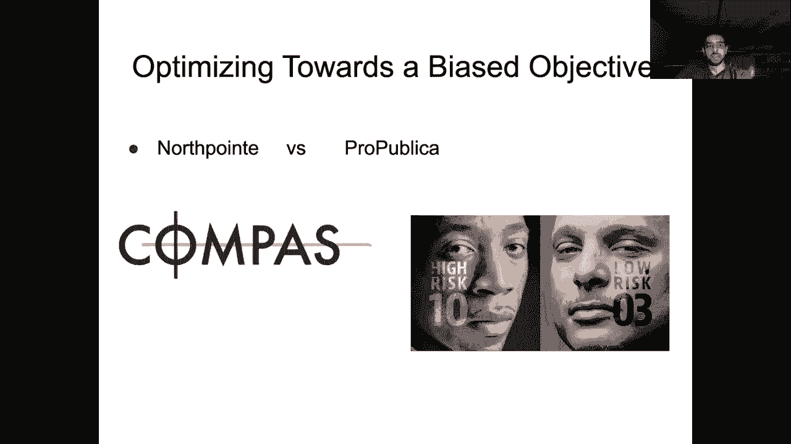

# P23：L18- NLP 伦理学 - ShowMeAI - BV1BL411t7RV

Okay， hey everybody， so today we have a couple of things to do one I'm just going to briefly go over the answers to the midterm questions。

And then we're going to talk about ethical considerations in NLP。

 which are growing increasingly more important as our systems get more powerful and are applied to a greater variety of tasks。

😊，Before we get started with these exam solutions， I just wanted to say that。

Grading is going to be pretty slow for this exam。Mainly because the questions were pretty open-ended。

 there's a bunch of ways of getting partial credit and so we actually have to spend a lot of time reading your answers so you can expect to have grades back towards the end of the month homework one will be starting grading relatively soon so you should be able to have those grades within a week or two。

 but the actual exam will be graded towards the end of the semester sorry at the end of the month and then your final reports are due early December and those will also take a while to grade so yeah don't make annoying piazza posts about exam grading they're not going to be done till the end of the month。

Okay， so let's go over these questions the first one actually one of the Ts went through a couple maybe like a bunch of different responses here and estimated that maybe only 20% of you got it correct so。

So it turned out to be much more difficult than intended。

 but the issue with this decoder mask is that remember that this is a multi layer transformer model right so it has 16 layers and if the mask was set at this at just the first layer and it was a single layer model then this would work perfectly it would actually be a trigram model in that each time steps prediction is only looking at the previous two words the problem is when you go to multiple layers because then your mask is being applied on the output of the previous layers or representations。

 so that means that at layer2， when I mask when I unmask this representation this thing already has information about the previous two words so gradually as you go up in the network even though your mask。

😊，I only allowing you to see the last two representations at the previous layer you're going to be increasing your receptive field so by 16 layers you've probably have looked at quite a few if not all of the tokens in your context just because the mask is applied to the previous layers or representations not just the original word embedding。

 so in effect this is leaking information about the words that you've seen in the past beyond just the past two words and this is why this model is not anywhere near as bad as Sarah expected here that's because the model has access to many。

 many more context tokens， not just the last two So this turned out to be a pretty tricky problem the solution to this problem is very straightforward there's actually a couple solutions that we'll accept the one。

😊，We're thinking of is you just reshape your input data so that every single sequence is only three tokens and you only do the prediction at the last time step sorry it could be two tokens and you do the prediction at the last time step so this way there's no the language model doesn't have any ability to cheat and look at tokens that are more than two words in the past because your input is such that it has no way of looking at that。

And another implementation could be you keep Sarah's normal mask at the first layer and then at layers 2 through 16 you use just an identity matrix where you only have an unmasked position on the current time step and zeros everywhere else note that this is not the same as the reshaping the input data approach from before because here the upper layers of the transformer are not actually doing self attentionten over a three word window。

 they're just doing it over a one representation window， but it will still accept that solution。😊。

So this question depends on your response to the previous one if you do the data modification。

 the input size modification， you should note that you're going to have way more training examples if you cut off each batch to just include three words and it turns out that this dominates the time that you save for making your self-at computations less because of course you have shorter sequences。

 but we'll accept answers that at least mention both of these two major contributors to the training time if you do the mask modification then the training time will be the same so yeah this depends on what you wrote。

All right， so this one， I'm not going to go over in detail because there's many possible answers。

 I think what we were looking for mainly with your modeling approach was that I mean the most reasonable thing to do is treat this as a text generation problem just because these questions are very unique。

 it's rare to see questions like these just in the wild and so if you chose to treat this as a retrieval problem。

 you would need to heavily justify like what your retrieval data set looks like。

 because some of these questions， they're just so weird and complicated that you would never observe a relevant response in even something like the common C。

So yeah， I mean， any sort of sequence to sequence model trained on this data would be good if you incorporated pretraining into your decoder thats that's good too and yeah so of course there's many other aspects of this problem that you could have considered like what do you do with multiple responses to the same problem sorry to the same question maybe you do some sort of filtering during preprocessing to remove some of them maybe based on upboats or whatever but。

😊，Yeah， this was a very open ended problem。 We will take off points if you decided to for some reason。

 treat this like a squad task， an extractive question answering task because that makes no sense。

Okay， so for the evaluation， mainly we were expecting you to write about human evaluations here。

 if you wrote something about blue score or Rouge or something like that。

 it doesn't make sense for this particular task because the task is very unconstrained so you might have justified this in some way。

 maybe with some examples from the data， but in general。

 there's no way blue is going to be a reliable evaluation metric for such an open-ended task。

 Engramham overlap with the answer with a single ground truth answer is yeah。

 it's not a viable indicator here， if you did something with using multiple references。

 we can take that into account and give you partial credit but really the only way to evaluate this is through a human evaluation and there's many different ways in which you could have devised this evaluation so yeah。

😊，We'll grade these on a case by case basiss。嗯。Okay so this question again turned out to be trickier than expected。

 so this was basically testing your understanding of backpro gradient descent optimization and what would happen in this scenario So the key insight to this problem is that the word embeddings are trained as part of the model and so what does this mean it means that this loss function has a trivial solution right if all the embeddings are set to zero then I trivially make my loss zero without actually learning any sort of useful representation of the task right and this is in fact what does happen when you set up these autoencoderrs and have all parts of the model be trainable unless you design your loss function in a more clever way to avoid these kinds of degenerate solutions So yeah again we will。

😊。

I mean some of you said things like the word embeddings will become identical。

 which is kind of almost there， but yeah， and I think others of you said things like the activation function was saturated。

 but I mean we didn't specify what the initialization of these parameters was。

 it could be the case if we had a really really bad initialization that the TNH would be saturated but this is very unlikely and not the major issue with this problem。

 this will happen regardless of the initialization。

 so we will give some partial credit for those other types of solutions。Okay。

 so finally this last question， there were many things wrong with this setup。

 but the major issue with question 4。1， regardless of whether or not Bert is able to memorize the Social security number or not is that this number is going to be split up into multiple subward tokens using Bert's tokenizer right so it's never going to be able to produce this entire number with just one mask token so yeah that's basically the answer to that。

And here we were， I mean there are many possible answers。

 one of them could be that you modify the masking strategy of your BRT model to only mask out numbers and contiguous spans of sub wordss so thats that's another I mean there could be other possible solutions here。

 so we'll again look at each of your answers， there are many。

 many reasons why this is not generalizing， but if you said something like it just memorizes this specific sequence and is not generalizing to the semantic meaning of the sentence that's perfectly fine。

 you might be able to solve this with some sort of paraphrasebased augmentation， but maybe not。😊。

So anyway， there are lots of potential issues that you could have pointed out and we'll make sure to give full credit whenever it's due。

Okay， I see a question I tried to code this example I never get the word weight of word embeddings to all zeros。

 but the embedding does appear to be identical Oh interesting Okay。

 so yeah I guess we'll give give full credit to anyone who said that the embeddings are going to be identical。

😊，Yeah， just anecdotally， I've coded up several instances of these kinds of autoencors and encountered this degenerate solution many times。

 not with such a simple setup， though， I mean， no one would ever implement this kind of autoencoder。

 but yeah， that's interesting to know that it converges to identical embeddings that are not zero。

It's kind of unexpected。Okay， so that's those are the answers。

 hopefully that gives you a rough idea of how you did。 But again， grades will be coming much later。

 Let's switch over to our topic for the oh yeah，s that's a good point。

 That's actually what I was I forgot to mention。 but yeah， it would have to go to zero。

 maybe the implementation of yang， Tommy used identical sentence lengths in which case that wouldn't be a constraint。

 But yeah， if you had variable like sequences I agree that does seem like a big problem。

 So maybe you can check your implementation。😊。

All right， so we're going to be talking about ethical issues in modern NLP now。

 so this is kind of a departure from our more technical topics from the before。

 but it is of course increasingly important， especially what things like GPT3 where we're not really even sure how they're being used。

 how they can be used and what the implications of their usage in a variety of real world situations are。

😊，So you know， maybe like 10 or 20 years ago， this wasn't such a huge deal because NLP was。

 you know our systems weren't that great， they could only solve pretty either synthetic tasks or tasks that were kind of far removed from real worldorld applications。

 but now you know we have actual systems deployed as conversational agents that might be you know talking to customers and there's actually you know some integration of machine learning methods into systems that make real decisions about people's lives like judicial system or hiring decisions or immigration and so on there's lots of different ways in which NLP and machine learning affect us nowadays and the ethical questions now are。

Growing increasing weed gra。So that's， yeah， what is said by this slide。And there is actually。

 in fact， at CMU， a course， an entire course on ethical concerns in NLP。

 I forget what exactly the course is called but it's actually linked on the course page。

 so you can check that out， as many of the slides that I have here are from that course。

 it's taught by Uo SpedCOv。😊，So some questions that I mean。

 some of you have actually asked in the anonymous form。

 as we've covered things like GPT3 and other you huge scale models is what are the you know。

 chances of various types of bias creeping into these models？

And whenever we build something now nowadays， it's usually important to think about what are the benefits and who benefits from the thing that we're building and also what are the potential harms and this this latter question probably doesn't get thought get thought about as much as it should be。

So as an example， this is just from a few weeks ago， there's this article。

 someone let a GPT3 bought loose un Reddit and it didn't end well。

This is one of the issues with the way that Open AI has released GP3 is like they chose a couple different applications and they allowed these these applications to access the GP3 API。

 which means that they can you know feed in context to GP3 and have it generate some output。

 and so there is this one application called like the philosopher bot or something which generated like philosophical text。

 I forget exactly what it did， but it was you know like a pretty innocent application。

But the problem is that people started taking the output of this philosopher bot。

 which is coming from GT3 and then like posting it into Reddit and that also might seem fairly innocent on the surface right Reddit is just like mostly well。

 I don't actually know， but I imagine it's mostly like informal conversations。

 but there are some subredits that are。😊，More serious in terms of subject matter so this post on this page comes from the ask Reddit subredit。

 which is where your exam question was from and the question was about like for those of you that have had suicidal thoughts what helped you get better and this response was generated by GPT3 so it brings up a lot of questions right do we want models that and you know we talked about with large scale language models do they really understand meaning if they're only trained on form right remember the octopus test example by Emily Bennder that we went over do we really want models that we know are limited in these ways to be you know posting advice to people who believe that this is actually a real person。

Behind that username and not some weird huge language model that doesn't really understand what it's saying。

 so I don't think the people who created the philosopher bot ever foresaw such a use case where their bot was like posting advice to depress people on Reddit。

 but，Yeah， I mean， we probably don't want this to happen， right， But this is something that was hard。

 maybe hard to foresee when open AI was creating this language model。 But it's something that we。

 we should think about now。 And in general， I think these kinds of unconditional language models that just are capable of generating text based on some input words there the benefit to harm ratio at this point is probably not worth it right。

 because the the models are still flawed and deploying them in the real world like in the wild with no checks can can do a lot of harm like possibly in cases like this。

 I think this is probably why the G3 paper was framed as a kind of few shot learning advance。

 because that is really cool and has a lot of promise， but G3 is also in。😊。

credibly powerful language model， which yeah， the risk to reward trade off is probably not there yet。

Okay， so what are some sources of some of these ethical issues in NLP and one big one is the data that we use to train our models as you know as we've been talking about through the course of the semester we really benefit from a huge amount of training data right we've seen many instances where we didn't change much about our model if anything we just you know increased our data by an order of magnitude and got got a lot more gains right I mean the Roberta paper essentially does this and you know where is this data coming from it's coming from normally the common crawl right or these social media forums and who really is posting or writing on these pagess we need to be aware of that if we're and you know like what kinds of stereotypes exist in this。

😊，Data if we're just using it as a general representation of。

 you know English or some other language， it's not that right it's the the data on the internet is a function of who is able to spend enough time on the internet to actually create all of that content。

😊。

And so some examples in computer vision it's far easier I think to find these things。

 but this is an instance from Google Iage search where you can see the clear difference if you search for three black teenagers versus three white teenagers here you see all the white teenagers smiling。

 playing sports and on this side you see fewer smiles and fewer activities so obviously if you're creating some sort of image labelbeling data set using Google image search you might run into this kind of bias and then your models are going to learn from the data that you've given it and maybe they learn to associate on smiling faces with you know black people or something like that so even if that's not your original intention just the way in which the data presents itself is going to have a huge impact on what kinds of biases here model。

😊。

Lears。We see this is also true with things like doctor right so in 2017 if you just Google image search doctor。

 you're going to get mostly men and mostly white men as a result。😊。

Whereas if you Google image search Nur， you're going to get mostly women。

And you see many other instances of this kind of bias， so again。

 it's just a historic example of what happens when you're unaware of the kinds of information and stereotypes that are in your training data right CEO。

 you just get a bunch of white men。😊。

So again， if your data is biased， your models are going to be biased and there are some ways in which people have proposed to fix these kinds of issues。

 there's been a lot of work on debiasing specifically regarding word embeddings that we'll touch on a little bit later but there's also work on filtering or getting rid of problematic data and not really messing with the model too much。

 so many different strategies that you can go to kind of mitigate some of these issues but there's also several interesting questions about what you actually want to accomplish through all of these debiasing methods and。

😊，You know how far do you want to go down that direction and what does it really mean to remove you know。

 all stereotypes from your data is that even possible all of these things are open questions。So yeah。

 I mean there is gender racial bias on the web， this is certainly in the common crawl which GPT3 and other models have been trained on。

 probably also manifests on Reddit， so yeah， it's important to at least be aware of these things before you deploy models trained on them。

And there's been a lot of work within NLP on various types of bias and deicing strategies。

 so we'll take a closer look at some of this work in a bit。😊。

This is an example of gender bias and coreference systems so co-reference is a task that we haven't talked about too much in this class。

 it actually is a task where the models are still interesting and not just completely birdified although maybe that's happened recently and I haven't been aware。

 but here so basically the task is given a pronoun。

 find which entity the pronoun is referring to so here the physician hired the secretary because he was overwhelmed with clients。

 that he here is referring to the physician and if you just change the pronoun to she。

 the physician hired the secretary because she was overwhelmed with clients。

 the model will now predict that she is referring to the secretary instead of the physician even though we haven't changed anything else about this sentence。

😊，So this is an instance of the data that we're feeding into these models。

 probably had a lot of examples of male doctors， and that is kind of overriding the world knowledge in this example that's required to make the proper connection。

Okay， so we've already talked about bias in data， but there's also sampling bias in even like labeled data sets that people are creating for various tasks like sentiment analysis。

 so for example， if I'm creating a sentiment data set and I'm going to just crawl Yelp。

 I might want to know what are the demographics of people that post on Yelp right because I might be only collecting reviews that are written from a particular subset of the population and maybe that's not representative of the overall population which I am most interested in modeling。

So if you look at the US demographics of Yelp users， the majority of them， 60% are college educated。

 50% of them make more than 100 k a year， and you you should be aware of this when you're training a model based on Yelp。

All right， so then there's also reporting bias this is important for many different phenomena that you might want to capture if you think about things like common sense right people aren't just going to say things like you know if I drop this cup it'll fall to the ground right this is kind of implicit in everyone's understanding of the world and so we don't have to talk about these things maybe we're going to talk more about things that are surprising or controversial or things that we find interesting and so you know that that might play a factor in what kind of data that that we're collecting。

😊，There's also you know some sort of system bias on the part of who's actually maintaining these online。

 you know social media sites or web forums and who what kind of algorithms go into various search functionality and so on and at some point we're not even going to be able to know what's going on in the background right we don't have access to any of these algorithms we just have to trust the providers and it's unclear what kinds of factors they're using to tune and improve their algorithms and whether those are the same as the ones that we have in mind when we're building a system。

😊，And finally theres kind of dialectical and associate economic influence in various kinds of linguistic communities and we'll talk a little bit more about that in a bit there's also just the dominance of English in data sets like the common C versus any other language that and also in the research community in general right you know all of the papers that we've read and all of these conferences require you to submit conference papers written in English。

 the vast majority of NLP research focuses on English language data sets。

 some of the methods that we're building may not even scale even though they work on English because we have so much data。

 they may not even scale to other languages for which we just don't have as much data this is a plot of the number of Wikipedia articles as。

😊，Of the number of speakers of a language so you see that English here you have by far the most Wikipedia articles and you have roughly 400 million speakers and you see something like Hindi down here where there's way fewer orders magnitude fewer articles。

 Wikipedia articles on Indian Wikipedia then there is on English Wikipedia。

 but you know the number of speakers is is huge， so it's really know if you're training something on Wikipedia。

 even if you take the union of all different languages， Wikipedias。

 which is what the multilingual Bt did， you're not getting the same sort of representation of all languages and usually you're just way over representing English。

 which might be to the detriment of other language。😊，Okay。

 so I see some comments and a question has someone tried taking each of the sentences in a data set and swapping gender pronouns and train on 2x data。

 yeah， so I believe that is what is done for some co-reence solutions it might also be done for some of the word embedding debiing stuff。

 but yeah I can't think of a specific work off the top of my head but I'm pretty sure I've seen things that do this so you might want to take a look more closely if you're interested in that and maybe some of the papers that are in these slides very relevant。

So let's take a look at a specific case of where this kind oh another question。

 is there an adversarial challenge data set that focuses on gender or racial bias Yeah there definitely is one for coreference resolution I think the paper that is linked down here and also in these slides both of these introduce a challenge data set for coreference resolution that has these kind of mismatched pronouns and I believe there's another data set as well also about co-reference that has a similar kind of properties so yeah there are a couple that I'm aware of and I'm sure there's a lot more that I'm not aware of so yeah this is becoming increasingly more common as a way of measuring these kinds of biases but yeah actually removing them or mitigating。

😊，I mean， it's also useful to measure your mitigation strategy on these challenge data sets。Allright。

 let me get through these animations again so this example is a language identification task which is a very basic text classification task you get us input some piece of text and you're asked to predict what language it is and you know you might imagine that these systems are very accurate this doesn't really require too much modeling of semantics or syntax a lot of the time you know a particular word is just going to be a word in one language and no other language so it'll be fairly easy for you to make the determination of which language it is。

😊，And people have even gone as far as to say that language identification is a solved problem， right。

 this paper from 2005 says using data obtained from the World Wide Web。

 we achieve accuracy approaching 100% on a test suite comprised of 10 European languages。😊。

So one of the PhD students in the UMass NLP group who recently graduated Suin。

 she had a research project on examining existing language identification models on African American vernacular。

 and she found that these systems degrade considerably when you give them tweets that are written in AAE。

And this actually can have a huge impact on existing systems that integrate language ID language identification since it's close to a solved problem is you know a reasonable component to add in some of these pipeline systems。

 so for example， in health monitoring you might have you some access to a Twitter stream and for each tweet you detect the language ID。

 then you apply some sort of keyword filters to see whether the tweet is indicating whether or not the person is sick or not。

 and then you you can start to address the illness。

 but if you get this language identification part wrong。

 then your keywords are going to be in the wrong language as well。

 which means that you're not going to be able to accurately measure whether this tweet is actually exhibiting some sign of illness or not。

😊，So right， if if you're since this is a component early in the pipeline， if it fails。

 then you're just going to get complete garbage and this is not going to be usable for particular languages so we see in this case we're doing some sort of code switching between multiple different languages which is of course challenging for these kinds of models。

 but it's also very commonly observed on Twitter。Okay。

 so there is a study in 2017 that shows that the accuracy of language identification systems on English tweets is kind of degrades as the human development index of the person whose tweetings origin country gets lower and lower。

 so for example， and this index is a function of things like average education life expectancy in income of the citizens of that country。

 so for a country like India which gets a score of like 0。6。

 you can see that the accuracy for tweets written in English by people from India is much lower than tweets from you know the US or Britain or Australia where the human development index is much higher these systems are like。

😊，not trained on data from all of these different populations。

 but if they're deployed on data that includes examples from people in India or other countries。

 then they're going to fail more often。So how can you fix this， I mean it's very hard。

 but of course you might want to sample your data set better to increase its diversity so you can increase diversity topically or geographically or different types of formality and of course different types of languages。

And so this this graph just shows what happens with a method that accounts for all of this by resampling。

 it seems to do better， but there's still this kind of downward trend。

Okay so another source of issues with NLP is the objective functions that are used and so sorry this example is not an NLP example of the next one I'll show you will be this was a pretty famous case。

 this compass system which was trying to answer this question and so it was a machine learning model that what is trained to predict the probability that a person would commit a serious crime in the future as a function of the sentence that you give them now and the issue with this formulation is that you can't ever get labels for this task right because this is an event that's going to happen in the future so what you're going to do sorry what they did to build this compass system is instead of getting labels for who。

😊。

will commit the crime， they use a proxy for that， which is who is more likely to be convicted so they use convictions as a proxy for committing a crime。

 but of course this has a lot of issues， even though they tried to balance their training data with you know people of all races and they didn't use race as a particular feature in their their classifier there's a lot of biases in the judicial system regarding conviction rate as a function of race and so even though they tried to balance their training data。

 the labels themselves didn't really match the objective that they were trying to aim for and so this system was deployed and it got a lot of pushback and partly because of this。

So as an NLP example， this paper actually was published in last year's EMNLP。

 the goal is given a description of a particular case， predict the charges of that case。

 so predict like what the charges and also what the prison term is。😊，So this is a you know。

 probably something that you would want a judge to be doing and not some kind of machine learning system。

 the authors here built a system and they collected a data set。

 they found that it worked you know like moderately well， but it had a lot of error。

And finally， at the end of the paper there was a quick paragraph about the ethical issues of deploying this system it says the mistake of legal judgment is serious。

 it is about people losing years of their lives in prison or dangerous criminals being released or reoffend we should pay attention to how to avoid judges over dependenceence on the system。

 they're saying if their system was deployed， we don't want judges to depend too much on it in practice we recommend deploying our systems in the review phase or other judges to check the judgment result。

 our system can serve as a checker but you know there was a lot of debate after this paper was published as to whether this kind of work should be done at all was there sufficient consideration of the ethical questions here what would actually happen if this system were deployed it makes so。

😊，man errors that， you know， practically speaking， if it were deployed， no one would rely on it。

 no reasonable judge would consider it if it's， you know。

 giving you the wrong judgment or charge or prison term， 40% of the time， right？

But what if it were better， I think something like judges depending on this or even maybe it replaces the judge that seems。

Yeah， just seems wrong， right。 So yeah， I mean these are these kinds of。

NLP questions are just like as the space of tasks that we're able to feasibly solve increases the number of these kinds of ethically dubious tasks also increases。

Okay， I see some questions。嗯。How would large scale machine translation on English。

 Wikipedia to some other language and then using it in the training data set work， Yeah， there's。

 that's a good question。 There was a recent paper。That was pointed to me about biases in machine translation where machine translation tends to normalize the like stylistic signature of its inputs。

 meaning that there was this experiment where they took a bunch of sentences and they knew you know like the age and gender of the people that wrote those sentences and then they passed them through a machine translation model and it showed that I believe it made the predictions of a classifier that was predicting things like the age or gender of the person that wrote the sentence。

 these things started skewing more towards I shouldn't misrepresent the findings of this。

 I'll put a link to it on Piazza， but yeah， translation definitely does introduce some kind of biases as well。

Do we have a reliable compass about where machine learning model should be applied or some readings regarding this question I think there's probably lots of papers about where and where not these things can be deployed I can't think of any off the top of my head but the reading that was linked for this particular lecture。

 there's a lot of relevant material on that page that you can check out。😊。

the is the tweet model sort of failing because with the HD index the grammar and spelling degrades too。

 I mean， it's not a question of degrades， but rather just that the variant of English spoken in these countries is not represented in the data it's not that like the grammar is more correct in one country in less correct in a different country。

 these are all just patterns of English usage that we need to account for if if our goal is you know to measure something like whether people have the flu or not we don't really care what kind of grammar they're using right we just want a model that's kind of robust to all of these factors。

So yeah。All right， so the next thing that there's been a lot of work on over the past couple of years is bias in word embeddings。

 so I'm going to just briefly go through this since you know things like word tove have been very recently superseded by the contextualized embeddings that we get from things like Bt。

 but there's been a lot of work on this and specifically these kinds of analogies have been found in word embeddings that are trained on massive amounts of data。

 where if you take the embedding for man and subtract from it， the embedding from women。

 women this is like very， very similar to a vector you get by taking the vector for computer programmer and subtracting the vector for homemakers so obviously indicating that some of these stereotypes are baked into the actual word embeddings of our models。

😊，And so you see， you know， if you look at just occupations of people and look at which ones are closest to the she embedding versus the he embedding。

 you see these kinds of stereotypes creeping in here as well。

And so one way you can fix this and one of the standard ways to reduce this problem in word embeddings is to first identify a subspace of gendered words so these are words that actually convey some sort of gender not things like computer programmer and homemaker so you know things like she and he and then you identify words that should be gender neutral so these could be things like computer programmer or homemaker or nurse or doctor right so in this figure here you see some gender definitional words and you also see these gender neutral words and what you want to do is make these kinds of words。

 the ones that should be gender neutral to be far away from the gender definitional subspace。😊。

SoAnd you know， the alternative thing， of course， is that you don't want your transformation here。

 this debiasing transformation to change the embeddings too much right because you know that they contain some semantic information about you know what a doctor is and what a programmer is you don't lose all of that by applying this debiasing strategy at the same time you just want to make these things shift a little farther away from the gender subspace of the model。

So that's like the high level intuition of how you do this。

 and you can do this by just adding some sorts of regularizers on top of your word embeddings。😊。

And I believe people have looked into deicing strategies in contextualized models like Bert and Elmo as well。

Okay， so another thing that's interesting is that so we've talked a lot about data being biased。

 but what happens on the model side right， the model also contributes a lot to the bias and downstream task and many models do something called bias amplification where there might be some amount of bias in the training data。

 but the model just dramatically increases that bias when it makes predictions。

So there's this interesting paper men also like shopping， reducing gender bias amplification。

 and this is a task that kind of builds on the vision and language stuff we discussed the week prior to the exam so here you get as input and image and you're asked to first identify the activity that's going on in the image So here cooking and then also identify all of these different roles that are occurring with this action So here like who is cooking。

 what are they cooking， what container are they using and what tool are they using and you would have to predict each of these things like woman vegetable pots spatula and in addition to predicting that this cooking activity is happening。

😊。

So of course， the way you would solve this just following from our standard vision and language models is we're going to represent the image using a convolutional network and we're going to represent and we're going to just predict these things from the representation that we get out for a CNN so these could be like classification tasks and practice this is actually a structured prediction task。

😊，We use something called a conditional random field， which we haven't talked about in this class。

 but is useful for structured prediction。

Okay， so let's take a look at the activity of cooking in this data set。

 If you take a look at all of the images that are related to cooking in the data。

 33% of them involve men and 66% of them involve women。

 so there is this you know skewew towards more women being associated with the cooking activity in the data set。

😊。

However， once you train a model on this to predict the activity。

 the resulting model predicts that only 16% of examples of cooking are associated with men and 84% of them are associated with women。

 so you see here including examples where there's clearly men involved in the in the image the model learns this bias and amplifies it in its predictions。

😊，So this is a case of the data is biased and the model is even more biased now。

And so when we look at why this happens， I mean there's another example here where these two pictures are almost identical the only difference is that here we have a girl washing her hands and here we have a guy washing his hands and on the left the model predicts that this is a woman cooking and on the right this predicts the there's a man fixing a faucet so I mean literally melting has changed except how the person looks and you get a completely different activity and also you know both of the activities are wrong so this is a case where you know the biases in the data。

 the model is just fitting these biases and not really modeling the semantics of the image。

So this is a big problem with these kinds of bias data sets is that the model can trivially minimize its objective by latching onto these simple biases and just ignoring anything else that might be relevant so yeah。

So you can actually quantify this and I'll go through this pretty fast。

 but basically we are just going to compute the ratio of the actual data set for a particular activity。

 the ratio of like female to male associated with cooking and we can also compute this ratio on the model's own predictions。

And so here you see that we're doing this and now we can compute this amplification right so here you see on the X axis the training gender ratio so I believe this is yeah the number of men associated with cooking over the total so things like cooking and serving and microwaving all have a pretty low training gender ratio and then you see the predicted gender ratio on the Y axis。

😊。

And so if things were pretty balanced between training and prediction。

 then all of these red dots would be on this blue line。

 but the ones that are deviating sharply from the blue line are cases where the model has amplified the bias that was in the training data set。

And so these are cases that we want to avoid and the paper proposes a way of kind of figuring out which things are violating this the training gender ratio by a huge margin and then kind of correcting them。

 so I'm not going to go over the actual method if you're interested in it you should check out the linked paper。

Okay so finally， there are issues with both the data and the models right the data contain stereotypes。

 the models can amplify them， people like researchers and people in industry may not be thinking about all the potential consequences of building new models for new tasks or deploying models to various different types of populations and yeah。

 there's just a need for I mean that's not to say that we shouldn't continue to keep improving our language models right but maybe we shouldn't just make them you know be able to post on Reddit right but they don't really understand language the way that we do and there's potentially dangerous scenarios associated with you know having them give advice for example where they may not even understand what they're giving advice on they're just you know。

😊，doing some sort of fancy pattern matching and maybe some in some cases they give good advice。

 but just the fact that you can't even interpret why they decided to make a prediction or maybe there's some randomness。

 there's a sampling process in the decoder right we've talked about this do we really want that to come into and have an impact on what these models are producing in real world settings？

Yeah， lots of important stuff to think about。All right， so that's all I had for today。

 I see there's some questions and comments。😊。

The model probably doesn't know that the misspelled word is misspelled or does it wouldn't it think it's a new never seen before token Yeah。

 it might think that but it might have also learned from its training if the training data included unseen tokens that those were associated with a particular language or something like that。

 which could cause it to predictings incorrectly。Was there any pretraining done on the model in the model bias paper I'm not sure what model bias paper you're referencing。

 I imagine this one in which case， yeah， the convolutional network was pretrained on Inet and then fine tune on this task。

 which is the case with most vision and language and like vision applications。All right。

 so for next time we're going to be talking about probe tasks。

 so this is an important topic that of kind of left till the end。

 but we've talked about all these huge models and you know there are billions and hundreds of billions of parameters。

 how do we actually know what they've learned or why they're making a particular prediction。

 so this is an unsolved problem but probe tasks are one way in which we can better understand what these models are learning so that kind of interpretation of these models is what we'll be discussing on Wednesday。

😊。

