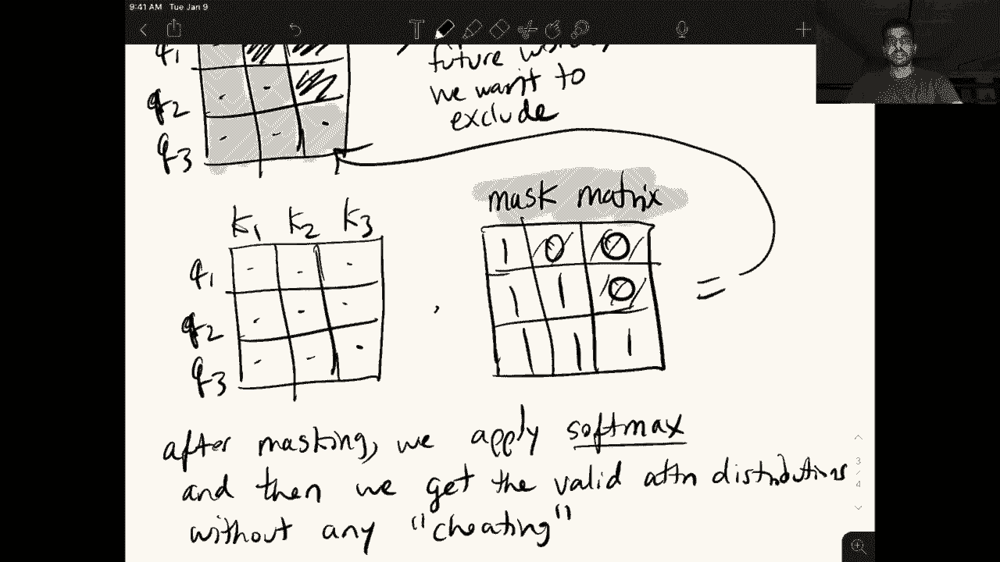
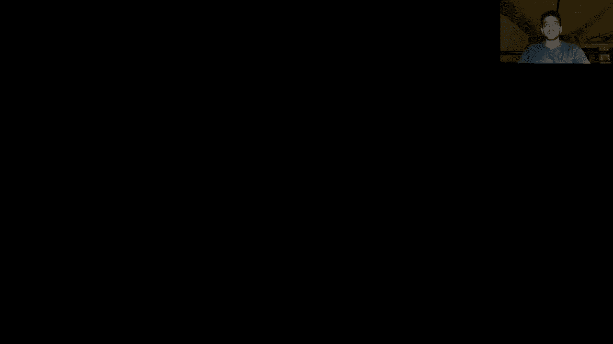
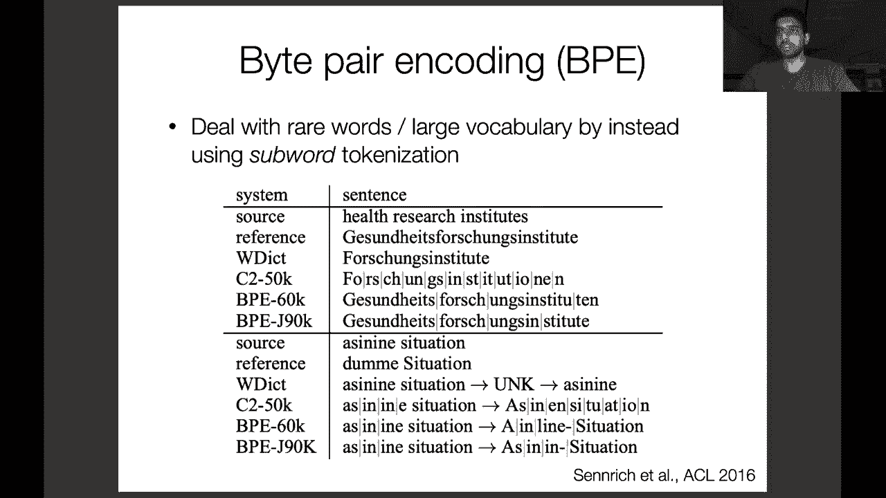

# P8：L6- transformer和序列到序列模型 - ShowMeAI - BV1BL411t7RV

Allright， hey everyone， so today we're going to do two things first we're going to look on the iPad a little more closely at the computations happening in the selfattention paradigm that we discussed towards the end of last lecture we're going to contrast it to the recurrent neural network specifically looking at how we can easily parallelize the computations and self-attention and how that's not possible in the recurrent neural network and so this is a training time and is one of the major reasons why nowadays people have shifted over to using the self-attention powered networks so after we get through this iPad part which hopefully will be fairly brief。

😊，We will then switch over to some slides and talk about the transformer。

 the other components of the transformer other than just self attention。

 and we'll also introduce the sequence to sequence learning paradigm。

 which is very popular for tasks that whose inputs and outputs are both text。 and yeah。

 so let's get started with。This iPad part。So the thing that I want to focus on here is。Parallel。

 oh god， parallel。呃。Of。Self attention。And importantly。

 I want to emphasize that this is happening at training time。嗯。We'll go over。

Once we get to that point， why we can't actually do this at test time。Okay， but before we start。

 let's just briefly do an overview of the difference between RNNs and self attentionten。

 so let's start with the RNN again this should be very familiar to all of you we've gone over this a couple times now。

 let's just stick to our traditional example of students。Opened。There。So in an R and N， remember。

 we have our。Word embeddings， we then。Project these to hidden states。

I'm going to ignore the first initial hidden state。Remember the。

Thing that makes RNNs recurrent is these sequential connections from one time step to another， right。

 so we have these H1， H2， H3。And if we remember our equation， right， H N equals F of。W， H， H， and。

I guess my ends look like H's maybe that fixed it plus WE。LetWe call the C， right。

 So the critical component of this R and N is that。Each hidden state。Is a direct。

Function of the previous hidden state。So let's think about why we actually have this property in an RNN。

 why is it desirable if you think about it， the one of the main reasons is that this sequential processing allows us to model the order of the words in our input right because every time I compute a new hidden state。

 I'm essentially adding one more word to the context that I've seen in the past and so I clearly know that this word came after all of those other words and since this is recurrent。

 this property is true for at least theoretically all of the other words that I've observed in the sequence when I compute their hidden state。

😊，So， let's say， sequential。Computation。In。Rnns。Allows us。To model。Word order。Okay。Unfortunately。

 the sequential computation also means that we cannot compute all three of these representations H1。

 H2 and H3 in parallel because I have to first compute H sub2 in order to then compute H sub3 and so this forms a kind of a cause of training slowdown because I have to wait before I can compute the next time step。

All right， so this is the recurrent neural network。

 let's now take a look at the self attention network。So again， we'll start with our same example。

Or maybe you'll probably need some more room。Start down here。し。Students。Opened。There。

And let's say that I am following the same procedure that we detailed in the last video where we form these query key and value projections and then use them to compute the attention scores and then the attention weighted representation of these words。

So one thing that we didn't discuss in the last video is how we apply this concept of self-atten to the problem with language modeling because you remember that my representation for the word students can't include things that come in the future right it can't include opened or there because my entire goal of this task is to predict the next word and so if my representation for students is a function of the word embedding for opened then I'm cheating right I'm giving the model information about what it's trying to predict so we're going to look at a slight modification of the slides that we looked at yesterday that accounts for this。

😊，But first， let's start by projecting each of these word embeddings into our three different。

Fector spaces the query key in value。 so I guess I can use a different color for each。

We'll say that these green ones are the query vectors。So Q1， Q2。Keep 3， let's say these。

Blue ones are the key vectors。And these purple ones are， our value vectors。Okay。

So remember that we accomplish these projections by simply applying a linear layer on top of the word embeddings。

 and so we apply three different linear layers to get these three different projections。Okay。

 and then remember that the function of these these different projections is the query and the key are used to compute the attention scores while the value vectors are used to form the attention weighted average of the context。

😊，So the thing that we're going to change from last time is I'm not going to draw out those dot products and stuff。

 let's just assume that through the query key product。So we'll just say Q 1 K。嗯。Okay， actually。

 maybe I'll draw this out to make it more clear。So let's start with this third word。

 students open there， so in this setting I want to have an attention over all of the key vectors。

 all three of the key vectors in this prefix so maybe my attention puts some of the probability on the first key vector。

 a lot of the probability in the second key vector and just a little bit on the third key vector。

So this is my distribution and remember how I got each of these right， this is Q3 K1， Q3 K2， Q3 K3。

 and all of these are the distribution is formed by applying the softm on top of all three of these dot products and remember that in actuality we're doing the scaled dot product I'm just showing the standard dot product here for brevity。

😊，Okay， so in this case， I can safely include all three of these words because my goal in language modeling is to predict the word that comes after this。

 right， books。😊，However， for this second token， I can't actually include the representation for the word there because that's the word I'm trying to predict once I see students opened。

 right， So my distribution instead might look something like this。 This is just some random。

Values where this is Q2 K1 and Q2 K2 and note that we don't have a probability for the third key vector here because we're not going to include it in our our attention weighted average right our representation at the second time step has to be completely independent from the word embedding for the next word again。

 if we had some probability on the third word that would be cheating because we're trying to predict that。

And finally， I'm going to put 100% of my probability。

The first key here because I can't look at anything else in this example， students is my first word。

 and so I'm going to focus all my probability on students And remember that I use these attention scores to get a final representation。

😊，Of。Each of these tokens。And so just to be clear， this is formed by， let's say。

 at so what I'm going to call them these， let's call them。Z1， Z2 and Z3 and these Zs。

 these are kind of the analog to the hidden states in the RNN they're formed by taking the weighted average using these probabilities so for z sub3 I'm going to multiply this with my value vector。

 this with my second value vector， this with my third value vector and then。

Sum all of those up to get this and similarly for Z sub 2。

 I'm going to multiply these probabilities with the V1 and V2。Okay。

 so this is how we get token level representations and on top of these Z's。

 we put our softm layer just like we did in the R&N to predict the next word。But importantly。

 in this new formulation with self attention。嗯。They。Is no dependency。Between。

Z sub n and Z sub n minus-1。Exclamation。嗯。And this is important， right。

 because it has some nice implications in terms of how parallelizable this model is going to be。

 we no longer have to compute these in sequence。We no longer。Have to compute。诶。The Zs。1 at a time。

Okay， so this is one of the biggest benefits of the transformer。 Let's take a look at how this works。

Do be。Parallize。The attention， computation。Okay， so let's take a look more closely at the just the query and key dot products。

 because this is the main driver of the attention scores in in our model right。

 the query key dot products。 So we have Q1 Q2 Q3。And we have。呃。🤢，K1， K2 and K3。 And these were。

These factors。Right。And。Just to rewrite the stuff from before， right。

 how did we compute our attention attention scores？嗯。Let's say， a1 is just。Q1， K1。82。Is Q2， K1， Q2。

 K2。And a3 is。った？Just。K2， Q3， K3， so invisible， Yes， all right。

So this is all what we just did and the key insight is that we can just put all of these into single matrix multiplication so at training time because I assume that I have access to the full sequence right this is the training data that I've observed。

 I can actually just do this。😊，So。I now have。Wops。嗯。Three rows in this matrix。

 each row is going to correspond to my query vectors， and let's just transpose the key vectors。

 So maybe they will click this。 I have three columns。嗯。Each cone corresponds to a key vector。

 and when I take this matrix product。What I get is。A3 by three matrix。2， Q3， K1， K2， K3， right。

 and then each thing in here is the corresponding dot product。

So this is good because I have now got all of these computations of these individual dot products into just a single computation right this matrix product and we know that when we're running these things on GPUs。

 we want to kind of get as much computation into as few different matrix vector multiplies as possible to take full advantage of the GPU parallelism。

 so instead of doing computing all of these dot products separately。

We can compute them all at once with this matrix multiplication。Now。

 note that this resulting three by three matrix here includes some dot products that we don't actually want。

 right so。Al right， its now time to use the cut or a copy paste feature of this thing。Okay。

 so if I put this down here。Okay， so this was my matrix， right。

 and what are the things that I'm actually interested in？I want this， right。

 this is going to be the only relevant attention score for the first time step。I want this right。

 this is going to be for the second time step and finally I want all three of these for the third time step right each of these rows corresponds to one of these the attention computations at one time step。

And I don't want these things， right， because these include information about the future。Info about。

F words。We want to exclude。And how do I accomplish this？If I can。This again。So if I take this matrix。

 oh let me era this thing。I can just multiply it by a mask matrix。

 and this is an element wise product。And my mask is just going to look like w，1，1，1，1，1， and0，0，0。嗯。

So'll called this a。Mask。Mattrix。And when we do this， oops。Its not what I want。

We're going to get what we actually want， right， this masked out attention scores。

 So after we do the masking。So after masking。We apply the softm。嗯。And yeah。

 note that we don't actually mask with zeros。 This was just a demonstration。

 We mask with negative infinity， and this is so that when we apply the softm。

 the values that get negative infinity， So these ones here。😊，They go to zero when we compute the Som。

 I just wrote zero here for intuition， but。Okay。So after masking， we apply softmax and then we get。诶。

诶。validad。Attention。Distributions。without。Any。Cheeting。

Where cheating again refers to including representations from words that we see in the future。Okay。

 so this masking thing here was just an example with a single sequence。

 but remember from before we actually do batched training in practice right so instead of having just a single sequence as an input I now have multiple sequences right and each of them is going to be associated with their own mask depending on the length of that sequence and we can actually compute the attention distributions for an entire batch of sequences through just one giant matrix multiplication I mean it's really a tensor multiplication but the same concept right is just a giant tensor product where we have another dimension now for the different examples in the batch but the same exact thing is happening。

😊，Okay， and so this intuitively is why nowadays everyone likes to use transformer models。

 it's not that quality wise they're better than the fancier variants of recurrent neural networks。

 it's more that these are much faster to train because we can take advantage of this parallelism。嗯。

Okay， so I think that's all I wanted to say about the self attention computations。

 Now let's switch over to some slides。 So just give me a sec。对。So I hope to。

これ this。

Co。嗯。Okay。That's too big。So let's。Al right。Great， so yeah， let me put this to the side。

So now I want to do a couple of things first I'm going to introduce the paradigm of sequence to sequence learning and this is mainly just to explain the full transformer model as you saw it in the paper we're going to do a lot more with sequence to sequence learning in a couple of weeks but for now I just want to introduce the basic framework and then we'll switch over to some of the more intricate details in the transformer。

Alright。Whoops， so。Let's start with just an overview of sequence to sequence learning。

 and so this is not that much different than the neural language modeling that we've been looking at up till this point。

So we use sequence to sequence when the inputs and outputs in our task are both sequences of words and so you can think about this mainly in the context of machine translation right I have an input sentence which is in some source language and then my target sentence is obviously in a different language so we're going to look at how we can apply the models that we've just seen to the sequence to sequence tasks and we're going to use French and English French to English translation as a running example for the next couple of slides。

😊，So the goal here is given some French sentence F， it has some tokens， F1 through F sub n。

 we're going to try and produce the English translation E that has tokens E sub1 to E subM。

So going back to what we've been discussing， like you know。

 using language models to compute the joint probability of sequences of words。

 our real goal here is to compute the English sentence that maximizes this probability right。

 P of E given F so that's basically saying given this French sentence。

 we want to find the English sentence that has the highest probability。😊。

And this shouldn't look very different from what we've already seen right So if we decompose this probability P of E given f into the joint probability of all these E sub1。

 E sub2， E sub N， the English tokens， we notice that it's very similar to what we've seen with language modeling right。

 except there's this additional conditioning on the French sentence F but nothing really changes right。

 we still use the chain rule， it we just have this additional F in each of our conditional probabilities。

 right， So instead of this just being the probability the first English token times a probability of second English token given the first English token。

 we are now going to just append that French sentence into the into what we're conditioning on。😊。

And just like before this becomes the product of these conditional probabilities。

 so machine translation is an instance of conditional language modeling right we're only interested in predicting the words and the target language but we're receiving some input that we're using to base our prediction of these tokens on and that's in this case。

 the French sentence。😊，Okay， so sequence to sequence models apply to this paradigm we're basically going to use two different neural networks to model this conditional probability。

 one of them is going to be used to handle the English tokens and the other one is going to be used to get a representation of the French。

😊，So you might also hear about the sequence to sequence framework as the encodeder decoder framework。

 which is also quite intuitive， right， the encoder responsible for encoding the French sentence。

 the decoder responsible for producing the tokens of the English sentence and also modeling the English side of this translation。

Okay so we saw the recurrent neural language model before it's very easy to extend this concept to sequence to sequence modeling so in neural machine translation we have an encoder it could be a recurrent neural network we know that you know recurrent neural networks are a good composition functions for getting a representation of some variable length number sequence of words so in this case these French words again I'm not going to try and pronounce them looks hard this fourth hidden state here corresponds to the entire forward word sequence right it's captured some important linguistic properties of this sequence and now we're just going to condition our decoder recurrent neural network。

 the one that's actually producing the words on this fourth representation。

 the one that captures all。😊，Of the text in the French。

So when we do this and again this the decoder side is exactly what we've seen with the language model right。

 we take in the previous hidden state as input and we produce a word and then we do our recurrent update。

 get the next hidden state get the word embedding at that current time step as input and do a softm layer to predict the next word the only difference is this single connection here which you can see my mouse。

 hopefully mouseing over between the encoder and the decoder So this is the only thing that is telling the decoder RNN what actually the content of the French sentence was what am I supposed to be translating and in this setting you can actually see more clearly maybe some of the impacts of the bottleneck effect that we discussed before right this single vector。

 this red one has to encode all of the information about the。😊，French sentence。

 and then the decoder is conditioning all of these predictions only on that single vector， right。

 So we've crammed the entire French sentence into the single vector。

 We're asking the model to do a lot。😊，So if we were to augment this recurrent machine translation model with attention on the decoder side。

 we would be attending over the French tokens， the tokens in the encoder right these encoder hidden states these four vectors here。

 because these are what's providing us with those word alignments that we discussed last time right。

 maybe the word the if I want to make this prediction。

 I might want to attend over the French equivalent of that word right？😊。

So this is the intuition behind the sequence to sequence model and here we see an implementation with recurrent neural networks。

 but like I said， no one really uses recurrent neural networks for these tasks anymore we've switched over fully to these self-attention based networks。

 but the training proceeds exactly as it did in the normal unconditional language model right。

 we just sum up the negative log probabilities of all the English words that we want to produce and we sorry not sum up。

 we average them to get our loss function for this entire translation。😊。

The only difference is just we're including this encoder part right。

 note that we're not actually predicting any words at the time steps of the encoder。

 all of the word prediction happens at the decoder so you can think about the encoder as just a way of learning some sort of features of the English sentence。

 the input which are useful for making these predictions on the decoder side。Okay。

 so as I mentioned before， we're going to go over this sequence to sequence paradigm and look at many more tasks that follow this in a couple of weeks。

 but I just wanted to go over the basics right now because the transformer model which again was in your reading was originally designed for the sequence to sequence paradigm。

 so it had an encoder and a decoder， both of which are transformers。

 but they look slightly different。So just as a review we've our in the iPad example we're looking just at what is called single head attention right where we just have a single set of queries and keys in the transformer model we have what's called multihead attention in which we have many different projections of keys and queries and values we get many different attention distributions at a particular time step we compute several different attention weighted averages then what happens is we concatenate all of these things together pass it through a feed forward layer and then we kind of just stack these layers on top of each other and so this is essentially the core of a transformer。

😊，Okay， but if you look at the paper， the transformer paper attention is all you need that I linked on the course page。

 you probably saw this diagram， it's from the paper and you were probably very confused it's not it's not an easy to understand diagram at first so we've spent a lot of time talking about this attention component right the self-at。

 these query key and values， how we compute the scores and how we parallelize at training time。🤧。

But there's so many other things going on here in this full transformer architecture。

 so I wanted to kind of break each one of them down and talk a little bit more about the important other things。

 not just the self attention。So first of all， in this picture we have the encoder and then we have the decoder and you can see that the architecture of the decoder is slightly different than the encodeder。

 we'll get to that in a minute， but again， the encoder responsible for in our running example producing representations of the English sentence and the decoder responsible for sorry。

 the French sentence and the decoder is responsible for producing the English words。Okay。

 so right we've talked about all of the self-atten。

 what is all the other stuff going on here so let's start with the position embeddings so that's happening here you can see that we have our input word embeddings and then the very first thing we do is add what a positional encoding or embedding to these word embeddings。

😊，So if you think about the self attention stuff that we've talked about to this point。

We haven't actually come up with a way to replicate the recurrent neural network's ability to handle the order of the words in the sequence if you remember when we were back on the iPad I told you that that was one of the useful properties of the recurrent neural network and it's wide the sequential computation was there to explicitly model the order of the words in the input。

In the selfat computation， there's nothing intrinsically that is separating you know word one from word3 right if words 3 and one were switched around。

 it wouldn't affect the computation at all so what we've described to this point is kind of order agnostic and to get back some information about the order of the words in the sequence we do these position embeddings and so we'll go over a little bit more later。

 some different ways of creating position embeddings。

 the transformer paper has one way there's other simpler ways that have been proposed more recently。

 but you can think about it intuitively as just a way of kind of giving back what we lost when we transitioned from recurrent neural networks to self-at but without losing the benefits of the parallelization that we talked about。

Okay so that's the first thing then another thing you might notice is these arrows here that go from it looks like the input of the attention module to the output and these are called residual connections and what that means is if you think about the input to one of these self-atten blocks is just the word embeddings right and the output are these attention weighted averages so instead of just passing the attention weighted average you know after we feed it through the feed forward layer to the next block we're going to actually add the original word embeddings to the output of this attention block and this has a number of benefits if you're interested you should read the original resonance paper that introduced this building block of neural networks it was originally developed for computer vision in image classification but。

😊，Is obviously useful for many different applications including in transformers。

 intuitively it helps improve gradient flows so if you have these kind of shortcut connections to lower parts of the model just like we saw with attention。

 it gives you a more direct access to those lower layers so the gradient can flow more effectively without vanishing and this is especially important when you have deeper and deeper networks。

😊，Okay so those are the residual connections we have the feed forward layer right so we went over that a little bit before we don't just feed the attention weighted average。

 instead we apply this feed forward layer again this is just a way of getting more parameters into the model have some more nonlinear transformations of the input just things that generally increase the model's capacity。

 especially when we have larger and larger data sets we want to increase our model size and make it more complex so it can handle more complicated transformations between inputs and outputs。

😊，And so finally kind of following along with that， we're going to stack as many of these blocks。

 these are the encoder blocks on top of each other as possible。

 so there are all sorts of concerns when thinking about how big of a model you want to train one major one is well what are your computational like what kind of resources do you have if you just have a single old GPU then maybe you can't train one of these models that with a large number of layers if you're Google and have access to I don't even know how many TUs then you can train or you have hundreds of GPUs。

 you can train huge models using techniques like sharing your parameters across all of the different nodes in your cluster and you can train them on tons and tons of data。

Later on in the semester， we'll take a closer look at this trend of scaling up models， but yeah。

 in general you want to stack as many of these things as possible if you have a big enough data set。

Okay， so let's move on to the decoder the very first thing I guess this arrow is not pointed to the right place and meant to point way down here is to the inputs of the decoder。

 which are actually the outputs， the things that we want to produce of this model right this is the language modeling component we're producing these English words and we want to predict the next word。

 given all of the previous words that we've observed in English as well as the full French sentence which our encoder has learned some representations of。

😊，So these are shifted to the right and what that means is there's the start token essentially where the very first thing that the model sees is the start token and the very first thing it predicts is the word schools so the outputs here are shifted over to include the start token and sorry the inputs to this model are shifted over to include the start token。

 the output the things the words that are actually being predicted here don't include the start token right they start with schools open there。

 so just to be clear。😊，嗯。If we go back all the way to。

This slide we we see this in action with the recurrent machine translation system right so the input to the decoder is this start the poor don't have any money and what's being predicted at this time step is the at this time step pour and so on。

 So this is what it means to have the input shifted over to the right。

 It's to allow us to make a prediction of the next word。All right， great， so now I get to skip back。

A lot of slides， I think I。Did not mean to animate these arrows separately。Knowing blunder。All right。

 so now we get to our masked self attention。Right， so here， unlike in the encoder。

 we're actually going to use the mask。 and you should think carefully about。😊。

W why this is you should make sure that you understand why the masking is only needed in the decoder and not in the encoder。

 And again， the reason is because in the decoder， we don't want to cheat on the words that we're predicting next right So if we include information about you know。

 if I have the input students opened at this time step， and I'm trying to predict there。

 but my attention weighted average includes the word embedding there。

 then I already have a good idea about what words come next and will be it'll be very easy to predict that right。

 So the masking is meant to prevent us from cheating from looking ahead And this attention here is selfatten。

 So it's applied to the English words not to the French words。😊。

So how do we actually connect our decoder to the encodeder。

 how do we give it some awareness of what the French words were？

That comes next and this is called cross attention so here we still do our same multihead thing。

 but the important difference is that this is not self attention this cross attention。

 the keys are not from the same word embeddings as the queries so here the queries come from the English tokens。

 but the keys come from the French representations。😊。

And so here the keys are actually the final attention weighted average。

 the final representations that you get from the encoder of the transformer those form the keys and they also form the values so you're going to have value projections over the encoders representations。

 not the decoder so that's why I recall it cross attention because the queries come from the English side but the keys and values come from the French side and this is kind of analogous to that single connection that you saw in the recurrent neural network between the encodeder and the decoder the important thing here is that we no longer have this bottleneck right since this is a purely attentionbased network。

 the model is attending over all of those token level vectors corresponding to the French。😊。

And it's not just the final one。Okay， and we'll go over these things a little more when we talk in more detail about machine translation。

Allright， so finally， I mean we've gone through all of these unfamiliar things。

 but the last part of this should be extremely familiar to us at this point right is just a softm layer right so we have the linear projection followed by the softm function。

 we get our output probabilities over the predictions of the next English word。😊，Okay。

 before we continue， I wanted to discuss what happens at。Test time because I've forgotten to do that。

 So at training time， we use this mask。 and that's only because we know the ground truth English sequence。

 right， We in our training data， have pairs of source sentences and translated target sentences that someone like a human translator has actually created for us。

At test time we obviously want to use our model to translate new sentences that we haven't seen before right that's the whole point so we don't have a ground truth translation to mask so we can't actually do this in parallel anymore because theres there's no concept of having the words in the future available to us and we just have to mask in them out to avoid cheating at test time we don't know the ground truth translation so at test time we actually have to go use this pretty much the same way as a recurrent neural network where we predict one word then we put it into our model and predict the next word then we put it into our model and predict the next word and so on so we don't actually gain any speed up at test time compared to the recurrent neural network but importantly we do a。

😊，time and this makes a big difference。I should also mention that we will at some point in the semester talk about other ways of decoding from these models that allow us to produce the entire sentence at once a test time。

 so instead of producing each word at a time， but yeah we'll get to that much later。All right。

 so let's talk a little bit more about positional encodings。

I would have spent a lot more time on this and actually when I've taught this in the past。

 I have spent significant time on this， but now it's really not clear how important the more complex methods of encoding positions are and there's been a lot of work on simplifying these so I'll just provide some high levelvel intuition briefly talk about what the transformer model uses for positional encodings and then move on but the essential idea that here we have some French sentence。

 we have three words and we have our word embeddings。

 that's this first layer here and we're going to add， remember from the transformer diagram。

 add these positional encodings to each of the word embeddings in order to encode some information about the order of these words。

😊，And so here and in the transformer， the positional encoding is depicted as a vector。

 but let's step back a little bit。 What is the easiest possible way you could think of to encode the position of a word in a sequence。

 the easiest thing that comes to my mind is just concatenating a fixed value that corresponds to a position of a sequence right so the first word I could just depend a one or some like you know scaled version of one。

2，3，4，5，6 that maybe doesn't mess with the magnitude of rest of the vectors in the model。😊。

But the issue of this is that it doesn't generalize past the sequence length。

 the max sequence length that we see in our training data right so if say my training data only contains sentences of length 1000 of up till length 1000。

 but then a test time I get an input sentence that's 5000 words long。

 how am I going to generalize right my model's never seen the positions 10001 through 5000 before。

 so it's unlikely to know how to handle that right we would hope that a model could generalize to these other positions given just positions  one through 1000。

 but in practice that doesn't happen。😊，We also might want some sort of representation that makes it easy for the model to learn about relative positions right so what is a position that occurred you know four tokens ago or eight tokens ago and so making that kind of information easy for the model to learn would be nice。

😊，And the general idea of the positional embeddings that are in the transformer paper is kind of to use different like frequencies to identify different scales of position differences so here we can just look at a simple binary encoding of the numbers 0 through 15 and you can see that rightmost bit here is alternating every other every subsequent position it gets flipped right from a 0 to1 001 001 so this gives you very local information you can see that the bit right next to it flips every two words。

 the bit next to it flips every four words a bit next to that flips every8 words and so on so this might be a more compact way of representing you know a larger number of positions。

 but in practice we're not going to use。😊，a binary encoding。

 we're going to take the same idea but move from binary to just real valued floating point numbers。

 but have the same kind of intuition that some of the values and these vectors are going to represent more local distinctions and position。

 others are going to represent more global distinctions。

And so in the transformer paper you probably saw this and were like why what is going on here。

 why are they using this very specific function and so they've essentially use these periodic sinusoidal functions to represent the position of a particular word in a sequence so the positional encoding here is a 512 dimensional vector。

 it's the same dimensionality is their word embeddings in the original transformer paper I in this equation is a dimension of this vector。

 so one of these 512 dimensions and yeah， the position is the current position that you're at。😊。

So why this function， as opposed to you many simpler variants。

 they claim in the paper that this function allows the model to easily attend to relative positions which might be useful looking at the position right before this one or you know four words away or 10 words away or whatever。

 because for any fixed offset from the current position K。

 you can represent the positional encoding at that offset as a linear function of the position embedding at the current time step。

😊，Sorry the current position so before I've gone through and actually shown this。

 but you can it's a pretty simple exercise。 you can do it yourself in general it's it's not too important as we'll see later。

 but this is just a visualization of what this particular positional embedding encoding function looks like So this is a 50 word sentence you see on the y axis I guess it's a little small but we are going from the first word to the 50th word and this is just a 28 dimensions of the position embedding you see first of all。

 this very local alternation right so each dimension here is one of the。😊。

Dimenssions in the position sorry each row here is a positional embedding of a particular position so right you see this alternation。

 you see you know word the word at position 50 has a pretty distinct positional embedding from the word that was at the first position but。

😊，This is one way in which you can maybe see how the model can learn to generalize to positions that it hasn't seen before because there is very small changes made from any one position to the subsequent position。

Okay however， these days we've kind of shifted away from these absolute positional embeddings right so importantly this sinusoidal function is not a learned component of the model right it's rather something that the designers of the transformer fixed beforehand。

 there are no parameters associated with this function。

 but yeah these days people kind of just don't care about generalizing the sequences that are not that are longer than those that they see at training time and they use learned positional embeddings so these are just vectors that are randomly initialized。

 they're associated with each position so you might have you know 512 of these vectors if you have 512 words in your training sequences and they can't generalize beyond 512 words but。

😊，just say you know what this is a big deal and you know maybe we can continue scaling up to include larger and larger numbers of positions so as an example。

 open AIs G3 model it has 2048， I believe different position embeddings so it can take in sequences of 2048 words and this is a you know pretty large number of words。

 there aren't that many NLP tasks that deal with larger documents， I mean there there should be。

 but at least in NLP research there aren't and tasks that do include documents that are bigger than that can just be kind of chunked down into smaller segments of text and processed by these models yeah and there's also been many other proposals of how we can implement these positions。

embeddings and encodings so we're not going to get into all of that here but just note that you need some sort of function that lets you distinguish one position from another and it's good if it's also easy for the model to pick up on relative position right so if in the transformers case those positional encodings allow these simple linear relationships between different offsets then it'll be easy for the model to hopefully pick up on those and easy for to learn these relative position encodings。

😊，All right， so I wanted to conclude with some hacks that you need to use to make the transformer work or to squeeze out extra performance from these models。

And so the first thing is the optimizer so we've only talked about gradient descent。

 simple stochastic gradient descent right you take a step in the direction of the negative gradient which the only hyperparameter you have here is the step size right the learning rate In practice the atom optimizer which I think I've mentioned a couple times is more commonly used if you're implementing in pytorrch。

 this is just one line change you change from SGD to atom but yeah it's just a fancier version of gradient descent with adaptive step sizes and different step sizes for every perimeter and so on。

😊，But the transformer optimizer is more complicated than just using at。

 you actually have to change the learning rate of the model according to this schedule。

 so the schedules three different schedules are shown in this plot it basically says that you have to start with a very small learning rate。

 increase it in the first part of training of first few batches to some pretty high value and then slowly decay it as you see more and more batches。

So this is very strange， it's unclear how they even came up with this。

 so the inventors of the transformformer were at Google so they obviously had more than enough compute to try a bunch of different things。

 but yeah I'd be very curious to find out how they even thought about trying this particular learning rate schedule as it certainly wasn't intuitive at the time it came out。

So another thing that we do in language modeling machine translation is apply label smoothing and so we can motivate this by looking at this example or the example that we've been looking at before I went to class and took blank right and so maybe notes is a viable thing here。

😊，I don't know what else would maybe the word would be a reasonable continuation of the sentence。

 right， I went to class and took a nap， Probably what most of you are doing。

 if you made it to this point in the video。 But right。

 there's many plausible continuations of this prefix。

 and we might not want to be 100% confident that notes is the correct continuation。

So remember that as we've set this up with our cross entropy loss。

 our ground truth distribution looks something like this where we're putting 100% of the probability on notes and 0% on everything else。

 but when we apply label smoothing we actually steal some probability masss in this case just 10% away from notes and we uniformly distribute it across all of the other words in our vocabulary So this is basically it's very similar to what we briefly talked about with smoothing ngram models。

 but here it serves a purpose to make our model less confident about what it's predicting and this is important in cases where there's some ambiguity。

So if you take a look， the model now gets penalized for being overconfident。

 so the loss obviously decreases as sorry， it's high if the probability of the target word is you know super low。

 but then it increases of the model is getting too overconfident about the current words prediction。

So this obviously depends on how much mass you steal from the target bird。All right。

 so the last thing that I wanted to talk about and there are many more small things but we won't get into that here is the tokenization so up till this point in the class we've talked about essentially tokenizing on white space right word level tokenization but this really doesn't generalize when we're confronted with things like unseen words people's names or there are many better examples on this slide where。

😊，Right， we might have， you know， part of a word that we've seen before and then some other name or something appended to it that we haven't。

 And so we use what's called sub word tokenization through bite pair encoding to deal with this issue。

 So as an example of this。All right， we have this English to German setting and the reference word here is Gaun Heights Forsung Institute。

I try my best and so this word seems like it could be very rare right。

 but many parts of it are things that we might have seen before maybe institute or gizund Hes and so if we segment this into a sub wordss。

 the tokenization wouldn't just have the single word as a separate you know associated with some embedding。

 but rather it splits it into four words if you're looking at this BE J90K Gazzundheightssin。

 and so maybe you have a better chance of observing some of these sub wordss in your training data even if the full word you haven't observed before。

😊，嗯。And yeah， this is helpful for generalizing the things you haven't seen before。

 also helps you deal with you words like playing， played， plays， you know the same stem， play。

 but different tenses or suffixes， you can have a single representation for the ST and a different representation for the suffix and hopefully help the model generalize that way instead of having it learn you a separate representation for play。

 play， play， plays， and so on。Okay， so that's all I wanted to talk about today and for next time we're going to be finally moving on to transfer learning using neural language modeling。

 which is going to be the core focus so far a class。

 we're going to look at these models named after Mppets。

 Elmo and BRT and all of its variant and BERT specifically is a transformer based variant of a language model。

 so all of this stuff that we've learned up till this point is forming a foundation for getting to these maybe more interesting materials。

😊。

All right。