# P9：L7.1- NLP 的迁移学习 - ShowMeAI - BV1BL411t7RV

嗯。Okay， I think this may be working。If you can hear me。

 can you write something in the chat box to let me know that this is working。嗯。

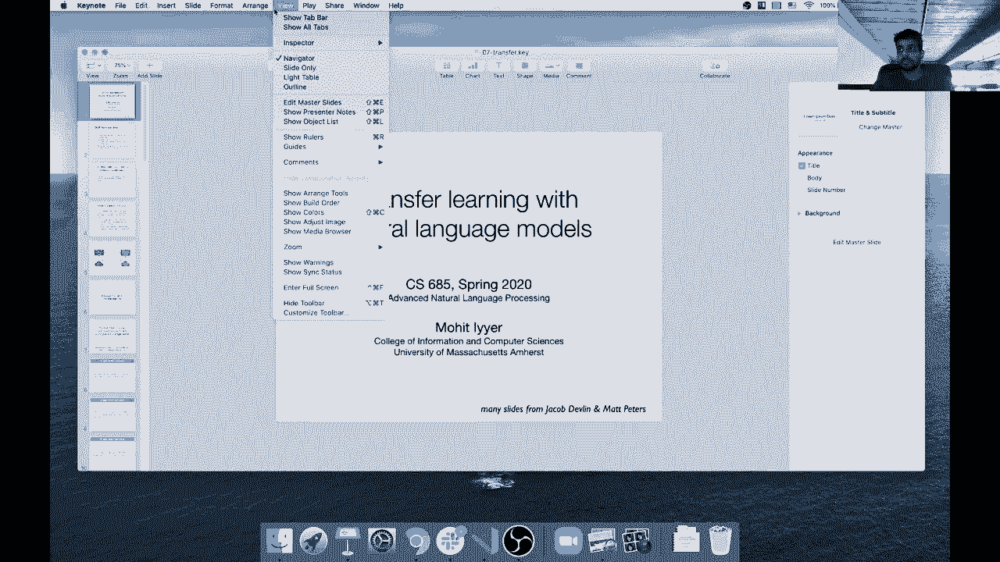

Yes， okay， cool。

Okay， so let's get started。Hopefully， this oh。What just happened。嗯。Okay， I think it's working。Okay。

 please let me know in the chat box。 if like the stream quality is low， we did test this earlier。

 but。And we didn't have any problems， but it just said it like dropped a lot of frames， so。And yes。

 there is a delay of about 20 ish seconds。 So hopefully that won't be too awkward。Okay。

 so let's get started。 today's topic is transfer learning using neural language models。

And in this lecture， we're going to talk about。An intro to concepts underlying the current strategies by which people are using transfer learning。

 we're going to build up from replacing the word embedding component of the models that we've seen with actually sort of pre-training the the model parameters themselves outside of just the word embeddings。

Okay， so before we get started with the material， just some stuff about the class logistics。

 your project proposals are due September 21st the overleaf template is out。

 a lot of you have come to our office hours and you know asking about your projects and we've given some advice if you're still uncertain about the topic that you've chosen please either send us an email or visit one of our office hours before the deadline so you can get some feedback。

 but all the ones that we've seen until this point seem pretty good well thought out and substantial amount of work which is what we're looking for in these projects。

Okay， so other than that， your homework one， there's a bit of a delay on that we're trying to make it such that you get some experience using these large scale models that we are going to be talking about in this lecture in the ones next week but we also want it to not take like five hours to run a cell on coab so there's a balance here that we're trying to figure out still and it'll be out sometime next week。

Okay， so any other questions about logistics or material or anything please put in the chat box。

 I am looking at the chat box now instructor video is quite fuzzy all right I'll try and look into that next time I do one of these streams I'm just happy that it's working at all honestly。

Alright， so our topic for today is， do neural networks really need millions of labeled examples to。

 to solve a bunch of different NLP problems。And so we've been focused primarily this semester on language modeling。

 which is going to form one of the key building blocks of our transfer learning setup and now we're kind of going switch over to the other side of that framework right so we have a task that we care about right like sentiment analysis or something like that。

 how can we actually use our huge neural language models。

 which as you guys know at this point have been trained using these self-supervised objectives can really benefit from a huge number of examples to learn all sorts of important and relevant linguistic properties can we actually use these to help our performance on the downstream task。

So this is the setting for today。And we've already gone over this before。

 but maybe a more specific definition of transfer learning in our particular context is we have a network that's trained on a task for which it's easy to generate labels so in our case this is language modeling right and we're going to adapt it to a different task where it's hard to get labeled examples right so in sentiment analysis。

 I need a bunch of reviews that people have actually written along with the scores that are assigned to these reviews。

Okay， so for those of you who are familiar with， you know， the modern research and computer vision。

 this concept of transfer learning first really got got picked up in the computer vision community。

 So computer vision has this huge data set called Inet。

 which is like on the order of million something images。

 each of which has been labeled with the kind of object that is in those image。

 So like if there's a cat， then you might have a cat label， if there's a dog or a。You know。

 a bed or something， these images would be labeled with those the objects that are the primary focus of that image。

And so for computer vision， what people do is they take the Inet dataset。

 they train a large scale neural network， a convolutional neural network on this data set。

 and then they take the resulting network and transfer its representations and its model parameters to any other computer vision task of interest。

So in our case， we're going to be replacing the image image classifier component with a really large language model。

So just to bring back our。A figure from earlier in the semester。

 we looked at this setup where we take this huge self supervised model。

 which in our case is a language model trained over a bunch of unlabeled text。

And then we transfer over its parameters to a downstream task and we'll go over more the exact terminology In this example we're looking at sentiment right so we have some labeled reviews from IMDB and we perform supervised fine tuning on our giant language model to make it kind of specialized to the task of sentiment analysis。

So in this lecture， we'll go over the the stuff that is required to get this second step to work and some of the important ideas that have been proposed in the field to kind of further this paradigm。

Okay so the first paper that I want to discuss today， so if you actually did the reading。

 which I'm sure many of you didn't， we assigned the Elmo paper which is deep contextualized word representations as well as the Bt paper and both of these are instances of this transfer learning paradigm the Elmo paper kind of introduced the idea of using language models for many different NLP tasks。

 I mean along with some other work， but it was the first one to actually show big improvements by using this paradigm and the Bt paper kind of built on this idea changed the model architecture from a recurrent model to a transformer changed the objective of the model so instead of predicting the next word。

 it predicted a masked word when it was surrounded by context on both sides。And finally。

 it changed the way in which we actually transfer the parameters of the model over instead of just their representation。

 So all of this will become more clear， hopefully later on in this lecture。Okay。

 so I don't see any more questions in the chat box。

 everyone should feel free to chime in there and I will answer the questions whenever there's a natural time to pause and take them。

Okay， so in all of the models that we've been discussing so far。

 the input to the model is you know the sequence of token indices， right。

 the index where each index corresponds to a word type from our vocabulary and then we use those indices as a kind of lookup table to index a specific word embedding that's associated with each index。

 so again， a word embedding is a single vector that's associated with each unique word type in our vocabulary。

So this means that we represent words like play， bank， run each of these with a single vector right。

 and then we've looked at the role of neural networks， recurrent networks。

 you fixed window language models， transformers as a way to compose these vectors。

 these word embeddings over longer sequences so I can take you know four embeddings as input and get a single vector as output that represents that composed sequence of words。

So this approach has some intuitive issues， right So if I have a single word vector。

 a single vector per word， then I run into this issue when I try to go and apply this to a downstream task where some words have many senses and they have many ways in which they're used。

 So if you take the word play for example。 I can use the word play as here like a play area for kids。

 I can use it as a verb like this， where it's kind of more metaphorical play to cozy up to the party base。

 or I could use it in the context of an actual physical play that happens in a sports game。

 It could also be a verb， I could play baseball or something like this。

 and all of these different meanings of the word play are getting squashed into the single。😊。

so if I take a look at a learned word vector space。

 and so this one might be from something like word deve， which we haven't covered in this class。

 but you can just think of it as a way of getting a word embedding space in which words that are similar to each other。

 either syntactically or semantically are close to each other distancewise in this vector space。

 like through the cosine distance。So if you look at the cosine distance from the word embedding of play to the word embeddings of all of the other words in a vocabulary。

 the closest ones are words like playing， games， games， played， players， and so on。

 all of these words。But if you look closely at these embeddings。

 it kind of shows you that there's a lot of different types of linguistic properties that are getting kind of clustered up and mixed together here。

 So we have two verbs as the nearest neighbors playing and played We have nouns， right game， games。

 player， player， football。 And we have some adjectives like multiplayer。And so。

The real meaning of the word play depends heavily on the context that it appears in， right。

 That's very clear。 If I want to differentiate between like play used in as synonym for a drama or theater versus play in the context of football。

 I will know that from the surrounding words and the rest of the words in that sentence。

So this is kind of an issue when we have something that takes a pre-trained word embedding as input right。

 if I have open a bank account and on the river bank。

 the word embedding for the word bank here in both cases。

 the input is going to look exactly the same right， it's going to be the same vector。

 but we know intuitively that these words the word bank here is being used in two different senses and really they probably shouldn't be similar vectors used here。

And so it would be really nice if we had a way of contextualizing these representations such that the representation for the word bank in the first sentence looks completely different than the representation for the word bank in this sentence on the river bank or phrase。

So this idea of contextualizing the word representations is kind of critical to the transfer learning stuff that we'll look into and then towards the end when we start talking about BRT。

 we'll look at not just the embedding level， but also sharing multiple parameters higher up in the network apart from just the embeddings。

Okay， so I see a question about why， why do we use cosine similarity。

 I suppose referring to when we get these nearest neighbors。

 it depends on how this vector space is learned so for example。

 in word deve the dot product is used to in the objective function itself to push words that are similar to each other that occur near each other close by and push words that are just randomly sampled from the vocabulary farther away。

 but you could potentially set up a word embedding algorithm where other distance functions are used and in that case you could use those as well for interpreting this space。

 but it depends on the way in which these vectors are learned and in general。

 the cosine distance and measures built on the dot product are probably like the simplest ones so we tend to stick with。

Those。Okay， so let's see if I can do this。 I wanted to switch over to the iPad to really kind of give some intuition on what。

 what the whole point of this transfer learning and contextualized embeddings are。

 So let's see if I can do this。

Okay， that seemed to work pretty well。Whoops that is not what I wanted to do。Okay， I。Wanted to。

Maximize the。

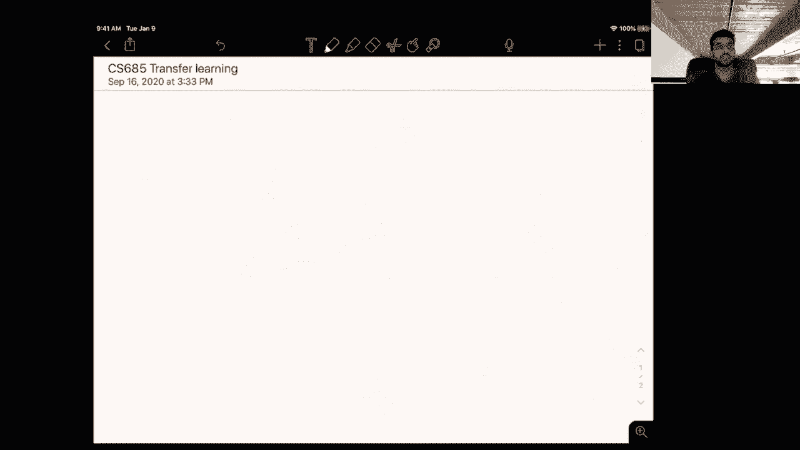

St sheet with this。Okay， I guess this is the best it's going to get。All right， so before I start。

 I will take the next question。 when we create a word embedding using the entire text。

 does it take into account all the context in which the word can be used and give one embedding。 No。

 So oh， it depends on what kind of word embedding you're thinking of so that the old the old like 2013 style word devec approach does do what you say in which a single word is assigned to a single embedding and this embedding is updated using all of the context in which that that word occurs。

 but the newer ones the ones that we're going to go over a little later in this lecture don't。

 And so that'll be more clear later on。Okay， so let me start。

Think you guys can see the iPad with a sentiment analysis example to hopefully make things a little more concrete。

 so。Is this showing up？I'm just going to see this is showing up。How we used to solve。N， LP tasks。

So you can think about this like before the advent of pre trained word embeddings。

 maybe around 2013 ish。嗯。And let's look at the task of sentiment analysis。

So here we've kind of seen examples of this this task before， right， I have a sentence。

 this movie is great。I have a word embedding associated with each of these words。I。

 let's say I'm going to use a recurrent neural network here。呃。

And we've seen recurrent neural networks in the context of language modeling。

 but that doesn't mean we can't use it for any other task。 right。

 I can use it for sentiment analysis using the exact same setup that we use for language modeling。

So remember that in a recurrent neural network， the final hidden state here， this one in the green。

Is then fed to the softm layer。Predict positive in this example。Right， so this was our goal to。

 to get a model that can predict positive or negative， given some input。 And back in 2013， we。😊。

Randomly。Initialize。The model of parameters。So these are W， H， W。E and the word embeddings。 Remember。

 we call these the。C sub Is， and we have as many of these as we have word types in our vocabulary。Oh。

 I forgot our output matrix， the one used in the softmax。And then， we train。sorry。Update。

All parameters。By back prop。Using。Cross entropy loss。From。Labeled。Training set。

So we have a labeled training set and we're going to train all of the parameters of this model from scratch。

 they start with random values and then they get updated through gradient descent using the signal of if the model predicted that the sentence was negative it would get an error signal from softmax。

 and the parameters would be updated to hopefully next time predict a positive label for this sentence。

So this is just using the the same concepts that we've learned throughout this semester。

So then the issue with this is that I'm asking the model to learn all of these parameters from scratch。

And me use a different color。 So all of these parameters are learned from scratch。

All train from scratch。And this setup basically assumes that we don't have access to any other labeled or sorry。

 any other text at all。 right， The model has to learn。 and maybe I'll write this down as well， model。

Has to learn。How。Language works， right。Essential， it has to learn all of the important properties of language。

From。Only a small。Wable data set。So this is really hard， right。

 What if your labeled data set is small， maybe it only contains like， I don't know。

1000 reviews with the sentiment labels。 What do we do then。

 or do we really expect our model to learn you know。

 fairly complex linguistic phenomena from such a small amount of text。

 It seems like we can do better。

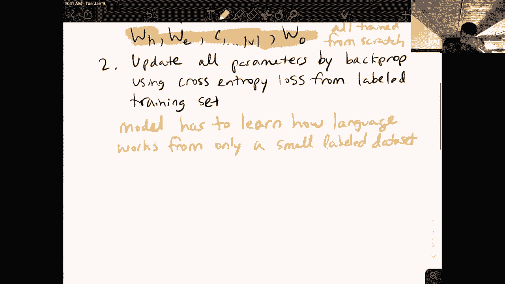

So the next advance in。

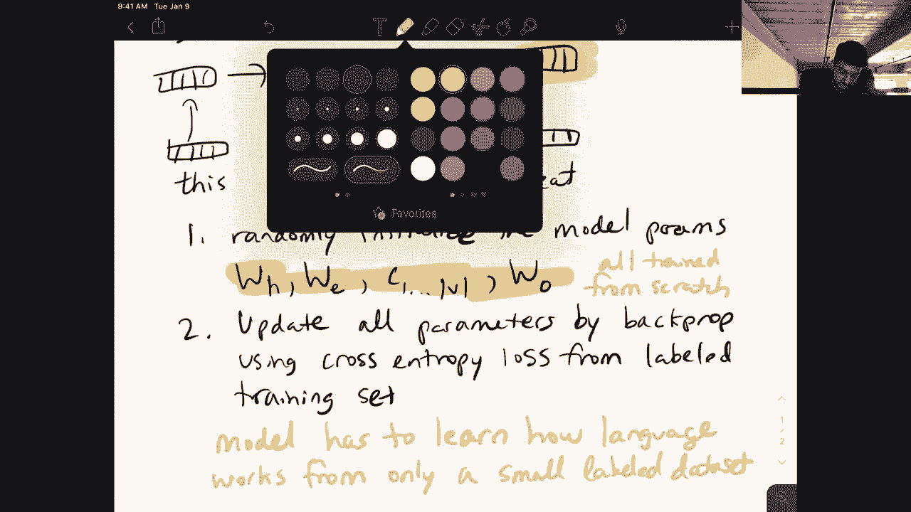

呃。So， around。The years of 2014 is to maybe 2017 was a focus on word embedding。 So people asked。

 why train everything from scratch。And。How can we。Beverage。Lo of。Unlabeled。对的。

And the solution that we。Came up with by we， I mean， the broad N LP community， not。嗯。

You or me personally。Was to take this same framework。Here。

And pre train the embedding part of this model。

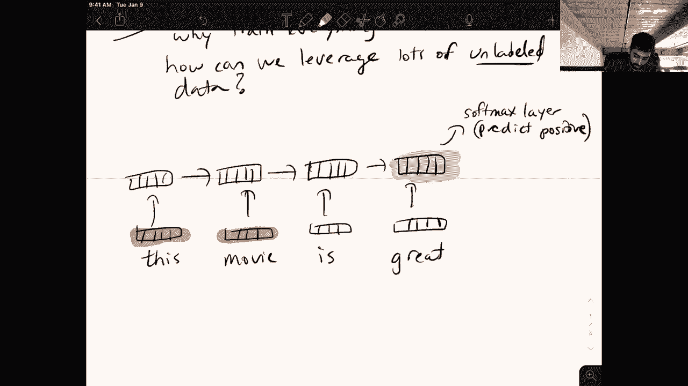

So the thought was， basically。We can。Pre train。The C sub I。With the word embeddings， right。Using。

Another objective。That。Takes advantage。Of unlabeled data。

So this means you know a selfsupvised data set where I can get labels for free from text。

 And so this era of research included things like word devec and glove。

 which you might have seen before we did not cover them in this class and in fact。

 we are not covering lots of things in this class from just even a couple of years ago。

 even things like variance of recurrent neural networks we're not going to cover But I wanted to give some intuition here of how the field has progressed to the point in which which we're at right now。

 so we have these models， word devec and glove， which use self-supvised objectives to learn good single word embedding。

 static word embeddings。 And so here instead。Of starting。With a random。Word embedding space。We start。

From。A pre trained。Space in which。Word。Ebeddings。Capture some。Linguistic properties of the word。

So here， like， we are still training， train。All other parameters。From scratch。So， these are the。嗯。

W H W E W O。 So the important distinction here is that we're giving some information to the model that comes from outside of the current labeled the sentiment data。

 right， the fact that maybe movie appeared in conjunction with the word， I don't know。

 T or something like that a lot of times in some large scale web corpus that should be helpful for learning you know how the word movie should behave in the sentiment data。

 On the other hand， we are not pretraining the actual composition part of this network， right。

 So the recurrent step， the recurrent neural network is still responsible for learning how to compose these pretrained word embeddings into something that represents the meaning of the entire sentence。

 the movie is great。So we were at this stage for a few years where people were。

 you know trying to build up more and more fancy methods for getting better word embeddings and then around 2018。

 we started thinking about some of the drawbacks of this current paradigm and how we can actually extend the self supervised step to the composition function。

So the issues， issues。With。This set。Our word embeddings are static。

 So we already looked at some examples of this from before。A static。Only one vector。Per。Word type。

Regardless of context。So we're actually expecting our composition function to learn how to disambiguate all these different senses of a word。

 like figure out what role the word play is playing in in the current sentence， right？

 and this is a lot to ask if if your other parameters of your model， the W， H， the W E。

 the W O are being trained from scratch on just a labeled data set， right。

So here the rest of the model。In our case。In this example， I mean。

 the recurrent neural network is responsible。For learning composition。From scratch。Given。

Just labeled data。So hopefully you can see at this point how we are asking so much from our model right we wanted to be able to properly learn how to compose different words into a meaningful representation of a sentence but if we only give it you a few thousand labeled examples of sentences it's not going to actually learn more finegrained properties of words or phrases or anything like that。

 it probably is just going to default to the easiest possible thing so in sentiment in our example right we have the movie is great and so this recurrent neural network doesn't actually have to learn the meaning of this phrase in in any way right it can just default to oh I observe the word embedding for great。

 let me forget the entire rest of the sentence and just make my final representation very indicative of the word great because if I do this then it'll be very easy for me to predict a positive label for this。

😊，And so if the model is defaulting to these kind of very simplified strategies。

 then it's not going to be incentivized to learn the meaning of more complicated sentences。Okay。

 so now let's kind of integrate our neural language model that we've been talking about for all this time into this transfer learning framework。

And the idea is， what if。We use the hidden states。Of and neuralral language model， instead。Of static。

Word and embeddings。So what does this mean， Let's say we have the same sentence， right。

 The movie is great。We have also seen how to turn。This into a language modeling problem， right。

 So we have a recurrent neuralral language model。 So I'm gonna draw the hidden states in a different color。

Just to make the。

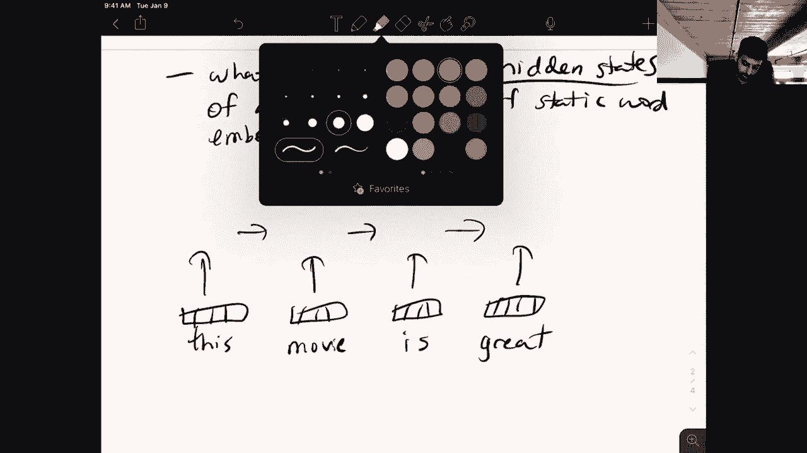

Intuuition more clear。 So here。I have these hidden states。

And I'm using these hidden states in a recurrent neural language model to predict the next word。

 right， So given the word this， I'm going to predict the word movie。

 given the representation of this movie， I'm going to predict the word is。 given the movie is。

 I'm going to predict。Great and so on right。 So I have this recurrent neural language model that I can train on as much text as I can get my hands on to predict the next word。

 and I know that in doing so， these hidden states， the ones in the blue are going to learn a lot of important information about that context that I might not necessarily expect the model to learn from just a small labeled training data set。

 So if I believe that these blue hidden states are capturing a lot of important linguistic information。

 then what is actually stopping me from using these as my word embeddings as opposed to the static word embeddings。

 the important point with these blue hidden states is that they've been contextualized。

 if I consider this hidden state here for great， this is not the same thing as the word embedding for great。

 right it's actually。😊，The entire the context that I've seen up till this point。

 this movie is great is being encoded into this vector and the recurrent neural sorry recurrent neural language model is probably emphasizing the word great in this representation because it's the word that appeared most recently。

 So I know that this this hidden state in blue has some knowledge of the word great。

 but also some knowledge of all of the text that preceded it。

 And so this is a big advantage compared to just using the static word representation for the word great。

😊，So okay， let me maybe move this down a little bit just to demonstrate。Well， that was cool。Okay， so。

 and maybe we'll， we'll take this example again。 the one from above。So， instead of。

Initializing this model with。Pre trained static word embeddings。Oh， wow， it。This app is awesome。

 We're instead， going to。😊，Use these hidden states from the neural language model as input。

So here these blue vectors are the same。 These are the contextualized vectors。

 and now the model doesn't actually have to the parameters that I train from scratch。

 they don't have to deal too much with this process of composition， right。

 because the contextualized embeddings here。Contextualized。Word embeddings。They。

 they already in incorporate a lot of the， the composition that might be useful for this downstream task。

 So in this setting， we still learn。The other parameters of the model， W， H， W， E W O from scratch。

But we're starting with a much more powerful input representation。

 So this is the idea behind the ElLmo work。Okay， so at this point， I'm gonna take some questions。

Okay， so effectively， shouldn't this generalize to all languages it does We'll talk a little bit at the end about things like multilingual birtht。

 where you can apply these same concepts to many different languages That said some languages are I guess more amenable to these kinds of methods than others。

 know languages like Chinese have huge character sets。

 languages like Turkish don't have easy ways of splitting up the word boundaries because like a single sentence might just be a single string of join together segments。

 So yeah， these concepts do generally apply， but to some languages more than others， I guess。Okay。

 so another question was about the bottleneck problem if we're trying to encode the context using recurrent neural networks that's true in this the notes so far。

 we're looking at a recurrent encoder just as an example in practice we are not going to be using a recurrent neural language model but rather huge scale transformer language model where we can get around this bottleneck I just wanted to show a very simplified example using a simple model and not go into the weeds of the transformer right now。

 we'll look at this when we talk about BRT。Okay， another question。

 If we use the hidden states for werenvents， which are initialized randomly。

 Are't we using the randomly initialized values again， Yeah， this is a good question。

 This is very important to clarify， so。Down here， we are training this model。

Maybe I'll use a different color here。This model is trained from scratch。

This is called our pre training step。All prims。Random， we initialized。And trained。

With the self supervised objective。So importantly， here we are using millions。

 potentially or billions of words of text to train these parameters from scratch。

 right so we start with the randomly initialized values in the pretraining phase。

 But then when we move to the actual sentiment training phase， this fine tuning phase。

 we are no longer starting from random embeddings， but rather we're using these much more powerful hidden states that resulted from this huge scale pretraining process。

 So the idea is that we're getting around the fact that we don't have that much labeled data for。

 say the sentiment task by training a language model and as much text as we get。

 So I hope that answers your question， Kaishma But let me know if it's not clear。

 we're not using the randomly initialized embeddings at the。

Point where we're training the sentiment model。嗯。Okay。

 and are we indirectly using the hidden states as the word embeddings in this current setup。

 we are actually just directly using the hidden states as the word embeddings。

 And so if we have multiple hidden states associated with the word， we could have this。 if。

 for example， we have a deep recurrent neural network where we have a representation at multiple layers。

 we'll talk about this more when we discuss the Elmo model in detail。

 But there are some aggregation methods that we can use to aggregate information across multiple hidden states into a single representation。

 But we'll talk more about that in a bit。Okay， so just one more thing on the iPad before we switch back to the。

The slides。Is idea of using language models to initialize the supervised sentiment task。

And one natural question you might ask。 And so this was 2019 was。Can we share。More parameters。

Then just the word embeddings， right， So to this point。

 we focused exclusively on the word embeddings， right， getting better。

 more powerful representations of the word embeddings。What about these other parameters。Right。

 what about in our current example， the W， H and the W E， Can we share those also。嗯。

And the answer is， yes， yes， we， we can。 So how do I wantan to show this。 Let me just copy this。

Language model， example over again。So this was our language modeling phase。

 And note that at every hidden state here， we are using the recurrent update equation， right。

 So these are my H's。And for this language model， I am using this， you know， the standard。F of W H。H。

 N，-1 plus W， E， C， N。Right， so I have my own parameters here。Pms。For language model。

And so what happens if I transfer over these parameters as well， right。

 so this means I'm actually kind of transferring over much more of the composition process than if I just use the parameters of my sorry。

 the hidden states of my model right， so now I'm writing rewriting these arrows in blue。

 which means that I'm eventually going to transfer over all of the parameters associated with these arrows to the downstream task model。

😊，So let's say that I。Initialize。Maai。😔，嗯。Sentiment。R in N。With the。LMs， W， H and W， E。

 What happens here， also， of course， the initial word embeddings。And so now， all we have to do。

Is learn the W O matrix， our output Somax matrix from scratch。All of the。嗯哼。All the other。

Pimeterters。Are transferred。And so in the end， we have something that looks like this。

So hopefully last cut and paste。嗯。So we have something like this， except I'm now going to。Well。

 I shouldn't have even bothered cutting and tastinghu。

So all of the blue vectors here come from shared parameters or sorry。

 parameters that we've initialized from a neural language model。

 And the only thing that we're going to be training from scratch is the softmax layer。

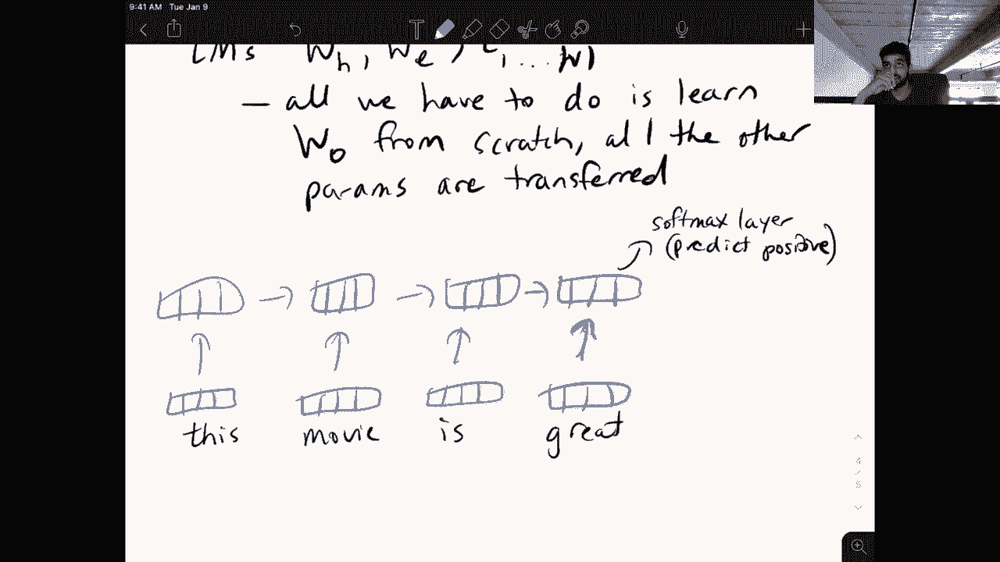

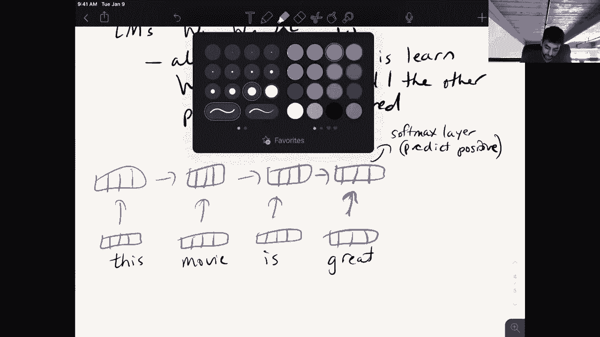

And so this is kind of the current paradigm in N LP research。 It's。This is current。Paraigm。In an LP。

 this was popularized by the Bt model。Which was one of your readings for the week。

And which we'll go over more very soon on the slides。 And so just to summarize here。We in it。

 are sentiment model。With a pre trained language model。

And so remember that this pre trained language model encompasses。Everything right。

 the word embedding parameters， the composition network parameters， like in this example。

 the recurrent update parameters， the W H， the W E And the only thing we randomly initialize is the final classifier in the softmax layer that's going to be projecting the hidden state into the two dimensional space to predict positive and negative。

 So we of course， can't transferred that softmax layer that parameter over from the language model。

 because the language models's outputs are the size of the vocabulary， right。

 that's how many labels I have for sentiment analysis。

 I might just have two right positive and negative。 So I have to learn my own parameter there。😊。

So we unit our model with this pre trained language model， and then。Back prop。Theer。

From a different task。And we call this， you'll hear me refer to this as the downstream task a lot。

That is in reference to this the actual task that we care about and the language modeling task is called the pre training task。

So we back the error from a different task， the downstream task。

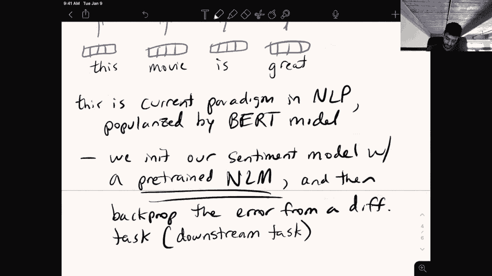

What just happened。No， what did I do。プ。

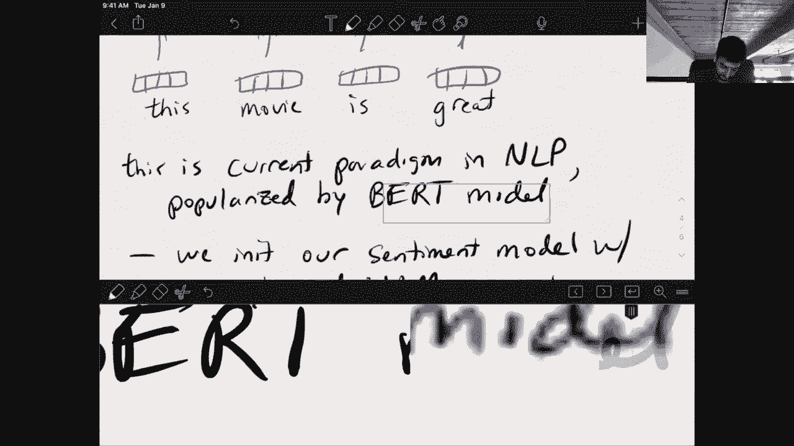

Okay， I don't know what I just did there into the。Prameterters。Into these emitters。

 and this whole process of starting with an existing neural language model and then kind of specializing it for the downstream task is called fine tuning。

So， two important。

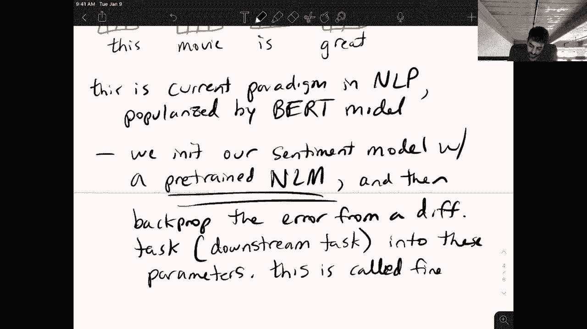

嗯。Terms for you to be aware of are the downstream task， which is in this example。

 sentiment analysis and the process of fine tuning。

 which kind of takes the parametersmeter of the neural language model and specializes them to perform the task of fine tuning。

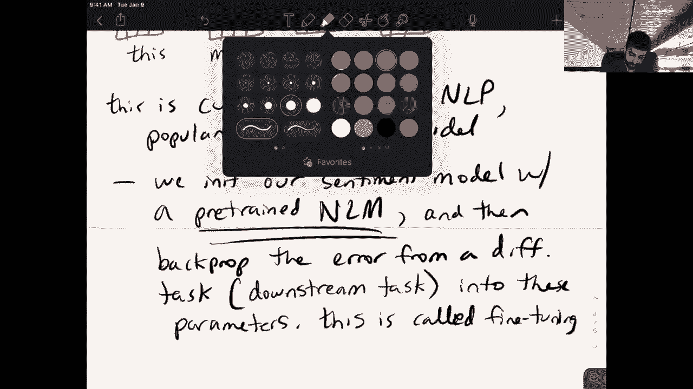

Okay， so some questions。 So basically， we have changed the input of the supervised model where the word embeddings are the vectors。

To， I imagine that means to the hidden state。 this is what's happening in the Elmo model， the input。

 the word embeddings that used to be either randomly initialized or coming from some process like Word deveec are now just the hidden states of a recurrent neural language model。

Okay， so next question， what are some sources of oh sorry。

 how do we choose which hidden state value to be used。

 Is it the output of the pretrain model that we are using as the word embeddings for the supervised model。

 Yes， this is what happens in the Elmo model。 in the Bt model。

 we're actually not doing this like just taking the hidden states。

 but we're rather we're basically taking all of the parameters of the neural language model。

 So it's not just the hidden states， but even the parameters associated with the composition process in the neural language model are being used in the paradigm of Bt So it's not just we're not taking just the hidden states。

 but rather starting from all of the parameters in that neural language model。

Okay a question on the sources of data for pretraining Yeah， so in general。

 as we'll see later on in this lecture， the bigger the data set。

 the better gains that you see from this pretraining process so Wikipedia is very common but nowadays increasingly more people are using the commonCl。

 which is you can go to commonCl。org and check it out。

 it's just like a dump of the internet it has like trillion trillions of tokens of text and so really we haven't hit the limits of the amount of data that we can pretrain on and you can check out something like openaiIs GT3 for the current largest language model in existence。

Okay， so there's a question about Bert， I will answer that later when we get to the Bt part of the slides。

 Do you fine tune the pretrained weight or just the softmax weight， Yeah， this is a great question。

 So in the Elmo paradigm， you only finet tune the weights that are associated with your downstream model and you don't fine tune any of the language model weights in the Bt paradigm we switched right because remember in the Bt method we are actually transferring the other parameters of this model。

 including these composition parameters， not just the hidden states， and so in Bt。

 it is common to fine tune the weights of the model not just the weights associated with the softm layer And so I think that also answers other question。

 So the current state of the art is the pre prelearned or pretrained parameters are not fixed。

 they are also changed through backpro。The fine tuning phase。

 and you will get some experience doing this in homework one。All right， so at this point， wow。

 this has been going on for 52 minutes。Okay， well， let's get to these slides。

 and hopefully we won't take too much more time。

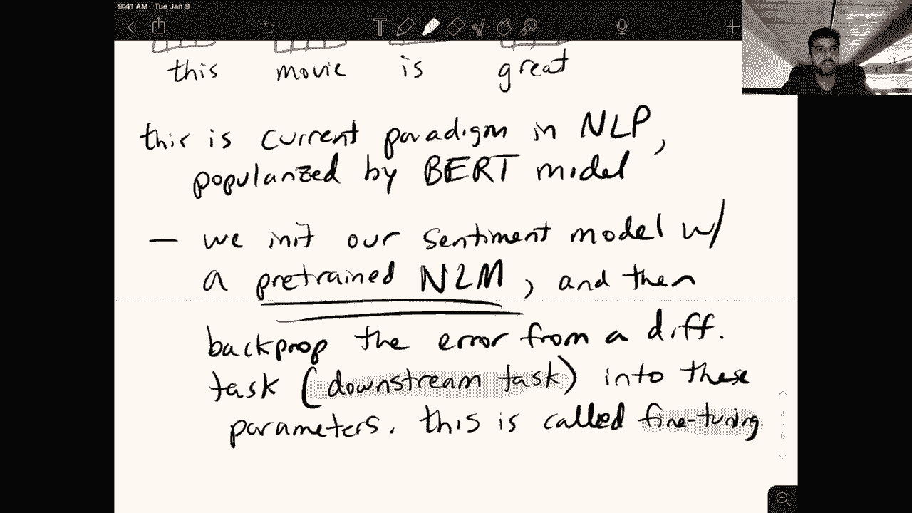

this。I pad away， so。Hopefully， this。The slides are now showing。嗯。Right， so what I've just described。

 hang on， let me。Reduce the size of。Okay， so to this point， I've basically given you a very。

 very kind of simplified example of this how the history of transfer learning and NLP has progressed from 2013 to now and in this example we focused on this simplified sentiment analysis task where my downstream model is just a single layer recurrent neural network and my neural language model is also a recurrent neural network。

So now we're going to get into the actual details of the two papers that were kind of impactful in shaping the direction of this line of research and so the first one of these was this ElLmo paper which actually I was on the team that developed this so yeah was kind of awesome to be a part of that but the whole advantage of this work was to kind of integrate pre-trained neural language models into downstream tasks and really had not been at least shown to work very well before this paper。

So the idea here and one of the things that we haven't discussed is that if I'm using just a recurrent neural language model。

 my model is only aware of the tokens that occurred before the current token right and we went over this right we can't actually incorporate information about future tokens because our whole goal is to predict those tokens right this is the entire point of a language model。

And so to get around this because in most tasks like sentiment analysis。

 I actually want to have a complete encoding of the entire sentence right so this movie is great I want my token for this and movie and is to have some knowledge of the word great right and in a current in a normal recurrent neural language model。

 this isn't happening because I'm proceededing one token at a time。 So in Elmo。

 we actually had two language models we had one that was trained left to right。

 which is the standard one you see an example here of open a bank So given the start of sequence token I'm predicting open given open I'm predicting this is just what we've seen before。

 but we also train a reverse language model， So in this case I'm starting from the last token of the sequence and I'm trying to predict the words backwards。

😊，essentially so given the word open， I'm predicting the sorry this one is starting like over here。

 but in general， when I concatenate the hidden states of both of these left to right and right to left language models together。

 now the hidden state at every time step has some information about all of the other words in this model When we move to Bt we'll see how we can get away without using recurrent model change to the language modeling objective so that we don't have to do these two separate language models。

But again， in ElLmo， we take the hidden states from these models and we use them as replacements for word embedding。

 so we're applying them as essentially pre-trained embeddings and this block here。

 existing model architecture just represents all the parameters that we have to train from scratch using our downstream model。

Okay。So how does this ElLmo model actually work， So basically we start。

 this is just the specific implementation of ElLmo。Oh， I see。 I have。Pop up on YouTube。 That says。

The streaming quality is bad。嗯。Okay， I'm just going to assume that will improve in the future。Okay。

 so， okay， it it went away。 I assume it's better。 So let's say we have this context。

 download new games or play is like part of an existing sentence。

 So I have my word embeddings associated with these。And。

I'm going to do a deep recurrent language model to。So this is actually streaming。Okay。

 please do let me know in the chat box if the streaming quality has degraded to such a point where you can't understand me。

 I'm getting some messages， but I don't know if it's actually impacting the quality。

 So anyway in the Elmo model， we have a deep multilayed recurrent neural language model。

 And so what this means is instead of just having one hidden state per token。

 we actually have multiple hidden states， one associated with each layer of the model。

 We're also using a fancier composition function， not just the recurrent update。

 but also we're using something called an LSTM， which allows us to at least theoretically take better advantage of the context。

 the longer context。 So we talked about recurrent neural networks as having this issue of they have a recency biased towards the most local token。

They forget a lot of the distant ones， the LSTM is a variant of the recurrent neural network that handles these long term dependencies better。

 but we didn't go into that in detail because a transformer is also a way of more effectively encoding the long term context and it's just a better model in terms of training efficiency and so on。

Okay， so I saw a question sorry if I missed it， why are we having models from both left to right and right to left in Elmo。

 so maybe this slide can make it more clear。Sorry， so。

If you're thinking about the the way in which a recurrent neural network builds representations。

 if I have just a left to right recurrent neural network。

 then my hidden state for the word download doesn't include any of the other information for other words in this sentence。

 right， I only have seen download， I haven't seen new games or play。

 But if you think about how you want to use this language model in the downstream task。 right。

 I get a whole sentence as input this movie as great。

 And I'm no longer trying to predict the next word in sentiment analysis， right， I'm just trying to。

 given the full sentence predict whether it's positive or negative。So in this case。

 there's no need for me to have this constraint that every word can only see the previous context and none of the future context and so this is why if I train just a left to right language model。

 each of these representations has seen only the words that happened that occurred in the past。

 but if I additionally train the reverse direction。

 then I have another model that is still in the language modeling setting。

 not cheating by seeing more words than it should but when I concatenate these two representations together。

 I now have a way of representing the fact that download occurs in this context of new games or play in addition to all of the words that occur in this sentence before the word download。

 So essentially both directions are needed to get in。In about the rest of the sentence。

 both the preceding words and the future words into the hidden state for the current time step。

This is more associated with how you want to use these models in the downstream task。

 you want to use them， you get a complete sentences input。

 so there's no need for you to expect your your model to benefit when it's only seen like half the sentence or the prefix up till that point。

I hope that was clear。 It'll become a little more clear when we talk about Bert。

So one question that someone asked before right， how do we choose which hidden state to use if we have multiple hidden states。

 we do this so in this case I have three different layers of this recurrent LO model and note that we've gone from this slide to the previous slide。

 these are now by LSTMs which means that we're incorporating both the left to right and right to left prediction task into this this model。

 so now these representations are kind of fully contextualized with both the past and the future context。

And so now we have these three vectors at every time step for one for each layer。

 and we're just going to take a weighted average of these vectors and the weights are learned through the downstream tasks so these weights are learned parameters that are back propagated into using our downstream task signal。

This is just one way to do this there are many other ways that have been proposed since to do this aggregation。

 you could do some sort of attention， you can think about it that way。

 you could just uniformly average and not learn any weights in our ElLMmo paper we showed that learning these weights is actually helpful and different tasks can learn different weights。

 but yeah all of this is like it's important to understand that general intuition。

 but don't worry if the exact details are kind of fuzzy we're going to spend much more time talking about the BRT model and it's offshoots which are more popular nowadays。

Okay so before we get into that does this mean we can't use the LLmo model for word prediction No so the ElLmo model at its core consists of two different language models that are like glued together so this right to left language model sorry this left to right language model and this right to left language model and so we can use the left to right language model for word prediction if we want if for some reason you want a model that can predict sentences backwards。

 you can also use the right to left language model but yeah you can use these individual components for language modeling。

 but the real point here is not language modeling it's to improve downstream task performance。😊。

So right， these ElLmo representations， unlike the standard word embeddings are now contextualized。

 they have information about the rest of the sentence in addition to just the current word and so you can think about this as instead of having just a single static word embedding associated with a particular word in my vocabulary I now have basically infinite different embeddings for a word because every words or representation depends on its context。

 so if I take the word play and I have10 different context in which the word play occurs using Elmo every single one of those the representation for play in those hundred context will be different from each other and that's kind of the goal of this contextualization process。

Okay， and so do it， this was kind of an impactful work because it demonstrated across。

A wide range of NLP tasks。 So S is a question answering data。 SST5 is a sentiment analysis data。

 we have co-reence resolution， named entity recognition， semantic role labeling。

 all of these different tasks just simply replacing the word embeddings in these tasks with the hidden states from this ElLmo model significantly increased the state of the art across the board。

 So this was kind of a positive result indicating that transfer learning in NLP has a lot of potential。

 and the subsequent work in B and its many offshoots have only since increased these gains。😊。

Okay so actually I think I'll probably stop here considering it's already been over an hour and that way our next lecture on Monday can focus exclusively on BRT so it'll be fairly coherent at this point if there are any questions any final questions about the content that we've covered today。

 so basically the whole idea of transferring word embeddings。

 transferring other parameters of our model using the hidden states of a language model as input to downstream model。

 hopefully the intuition behind a lot of this stuff is now clear。😊，But。Yeah， do feel free to。

Type in any questions that you have next week we'll focus on BRT as well as how we actually apply these things to these specific tasks so S。

 SNLI， SRL on the surface question answering and sentiment analysis are very different tasks from each other。

 but we show that well not we I mean the others of the BRT paper show that all of these can be solved within a single model。

Okay， so I see one question here， having these infinite context for a single word embeing and ElLmo。

 isn't it making the model a little more complicated than needed？的。

I guess one fundamental property of Elmo is that you're not explicitly enumerating these infinite embeddings right so it's not like we have a lookup dictionary of here are all the different contexts in in the that the word play can occur in Let me have a separate embedding for each of these that I store in my memory and look up from the model is actually not very complicated right all it consists of are the parameters associated with the recurrent update equations for these language models。

And in your sentiment analysis example， all I have to add on top of this is a single softmax layer on the final hidden state or the final aggregated hidden state to predict the label。

 So it's the models like yeah， what might be complicated is the fact that we had to pretrain this language model in the forward and reverse directions on a lot of data before we can actually use it on the downstream task。

 but parameter wise it's not very complicated。 And these infinite embeddings are that's just like like if you were to consider the different types of vectors that Elmo produces for a single word。

 they are theoretically infinite of them。 but in practice。

 we're not explicitly enumerating all of obviously we can't do that right And so。😊，Basically。

 we just compute these embeddings on the fly using our language model parameters for from the ElLMmo model。

oh， I didn't see the continuation。 There are possibilities of sentences where words can have the same usage or context。

 Yeah， but in in those those cases， the Elmo would just compute those embeddings on the fly。

 you might consider ways of caching similar contexts， but in general。

 that's probably not going to save you that much time。So， yeah。Okay。

 is there a reason why we don't fine tune the pretrain weights in Elmo。

 The main reason is because we at that point were kind of computationally constrained。

 So these days we have these huge GPUs。 It's very easy to get access to GPUs with a lot of memory。

 but even in 2018， it was， you know。Kind of rare to have these huge scale language models and be able to fit them in memory and fitting the pre trained weights and memory as in in addition to the downstream tasks specific weights。

That really slows things down。 So training becomes a lot faster when you think of that Elmo as just like a fixed feature extractor。

 and you're only learning a small number of parameters on top。

 This obviously went out the window with Bt where you're fine tuning a massive transformer language model。

 But a lot of this field has really benefited from advances in hardware。

 like better GPUus with more memory。 So yeah， I guess it's。😊，It's just how the。

 the hardware was at the time。 And now things have， have really changed。Okay， great。

 So if you have other questions， you can ask them on Piazza or through the form。

 or you can just save them up for the start of next week next week's lecture。😊。

