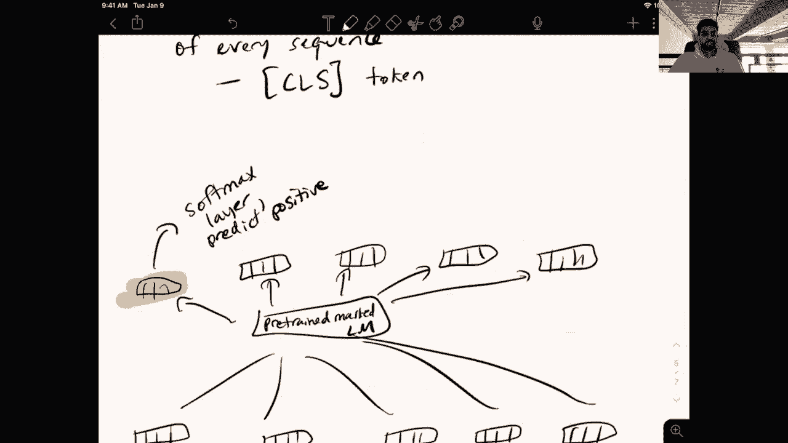
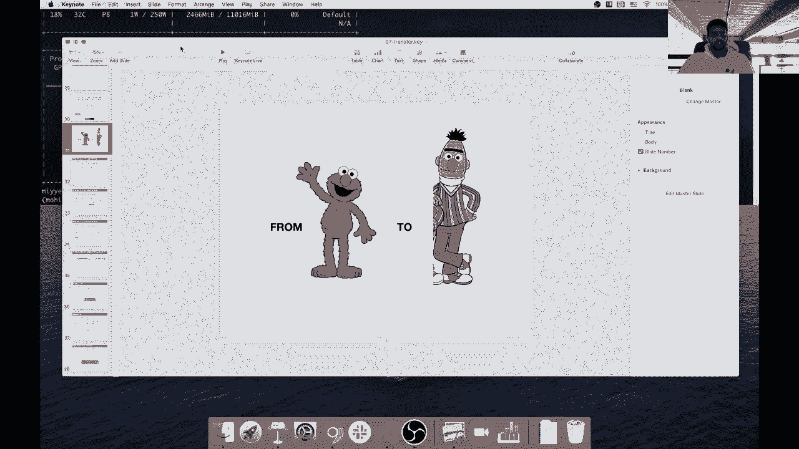
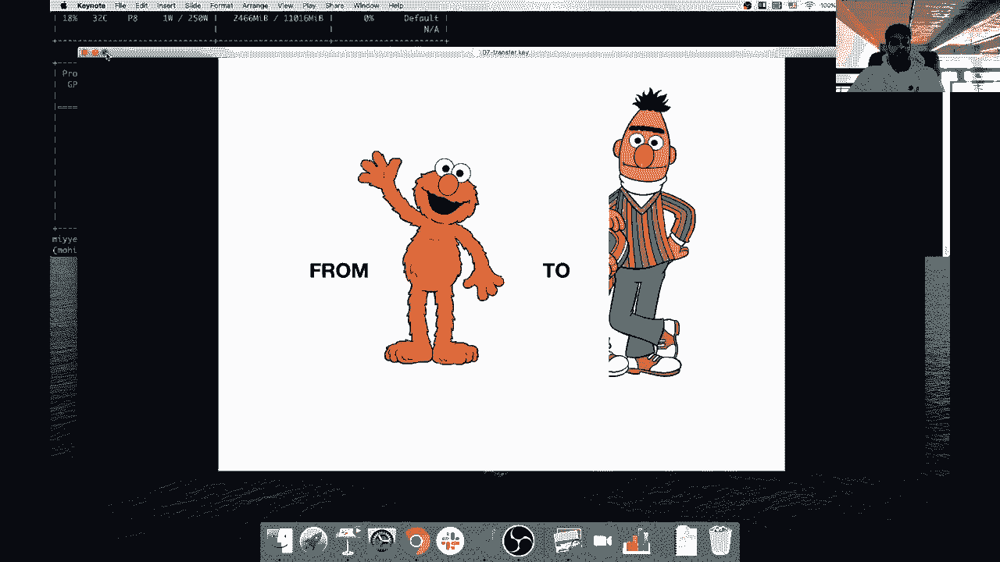
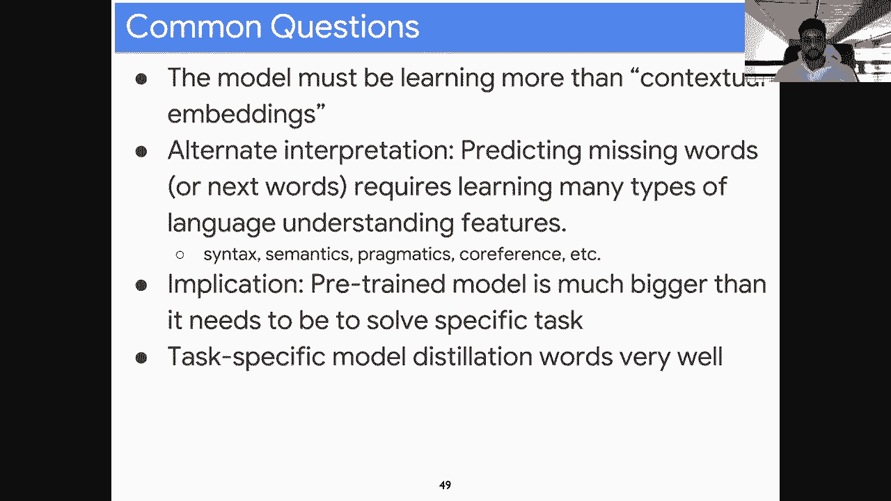
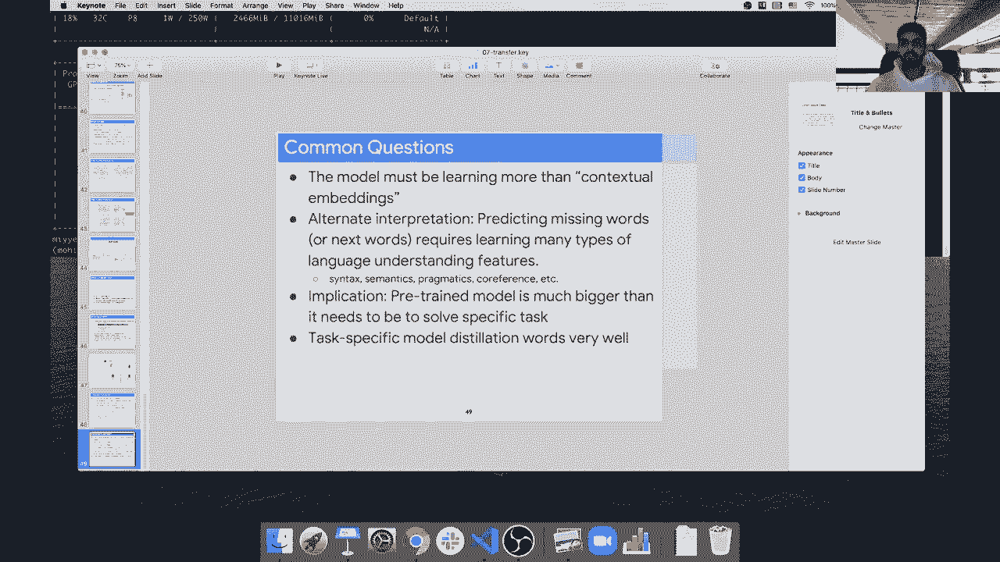

# 【双语字幕+资料下载】马萨诸塞CS685 ｜ 自然语言处理进阶(2020·完整版) - P10：L7.2- BERT - ShowMeAI - BV1BL411t7RV

Okay， hey， everyone， sorry for the delay。 I I thought I was live。

 but I didn't click the go live button， so that was doneme。

It would be really great if someone could just type something in the chat box to indicate that they can hear me okay and that everything is working。

嗯。I'm not sure from looking at the current thing if anyone is watching this。Okay， cool。

 So I'm gonna start。 And unlike last time I'm going to just ignore all of the weird error messages that I'm getting from time to time on my streaming software thing。

 So if at any point you lose connection or I freeze or you can't hear me or things are moving slowly or whatever let me know。

 and I will try and fix it somehow。😊，Okay， so today's topic is Bert。

 so we're going to pick off from where we concluded last time。

 if you remember we spent some time talking about Elmo which had this forward language model and the reverse language model we got a couple of questions on on why exactly we need both of these directions。

 maybe I didn't do a good job explaining properly， so oh there's some freezing lag even now。Alright。

 let me see if I can。Do something about that。Honestly， I。Don't really know what the。

Various settings on this thing do。 but let's go with that。 Maybe that will help。Okay。

 I try to reduce the bit rate， I assume that might help。Okay， so anyway， right。

 today's topic is Bert， So today。From。Elmo to Bert。

And we are also going to be talking about a new training objective to explain this shift。

 And that's going to be from language modeling。To masked language modeling。And as before。

 if at any point， you have any questions about the content of the lecture or even about like course logistics or whatever。

 just let me know and I will answer them from the chat box obviously。Okay。

 so before we get into mass language modeling， I just wanted to kind of reiterate the purpose of this whole pre training phase。

Gal。Of pre training， because I think from some of the questions。

 there was a little bit of misunderstanding as to what the role of these various language models is during pre training。

All right， so our goal of pre training is to use。These。sorry。Big L Ms。As text encoders。

So you'll hear this term a lot the encoder， and what does that actually mean。

 it's referring to getting representations of words and sentences that can then be plugged into downstream tasks。

 so essentially their goal。Is to enable。Downstream models。To focus。On the task at hand， instead。

Instead of learning。Oh， that was cool。Turningearning。How language works。

And remember why we want the separation right， Why do we want our language models to handle the you know learning these basic fundamental linguistic properties。

 it's because if we force the downstream model to handle this。

 it has a very limited amount of training data right so let's say for a sentiment analysis task。

 I might have 10000 sentences that are labeled with positive or negative。

 and this is the extent of the data I have， And so if you expect a model to learn from just 10000 sentences。

 all the various intricacies of English or whatever language your data citizen。

 your model probably isn't going to be able to pick up on all of this right and so that's the whole point of these models like Elmo and BerRT is that we are able to pretrain them on insanely large amounts of language so we can actually reasonably expect the models to pick up。

Properties of language that we expect will be helpful to solve our downstream task。

So in the example from last class， our downstream task was sentiment analysis。

 and our pre training task was left to right and right to left language modeling。

 So just to clarify again， and this is going to be useful when we eventually get to Bt and try and draw some contrasts to Bt in Elmo。

We did the following， right。 We had a sentence。 Let's say， this movie is great。

And we had two recurrent language models that were implemented using this LSTM architecture that。

 again， we're not going to discuss in detail。Should have used a different color for these vectors。

 So anyway， let's call this the， these blue vectors come from a。left。To write。L M。

And let's call the hidden states of this model， maybe HL 1，3。So this is a left to right model。

 And let's think about why we actually need a right to left model as well。

 If our goal is to use this as a text encoder。 So if you'd think about。This hidden state， let's say。

 H L sub is。The， the hidden state associated with the word is， this captures。Information。

About the context。This movie is。But it doesn't include anything about the word great， right， No info。

About。The word， great。And so why does this not include information about the word great。

 You should think about how the model is actually trained， right。

 the pretraining objective is to predict the next word， right， So， okay， the video is very pixelated。

Okay。Let's see if I can change that。Looks like a。Are the slide or is the note part hard to read or is it just the camera part in the corner that's pixelated？

Becauseuse if it's just that part， then it's probably not a big deal。 but if it's the。

If it's the notes， then I should probably change that。It's good for you。O。嗯。嗯。😊，All right。Hingan。

Okay， so for some of you， it's good for others， it's not。That's not a good sign。Okay。

 give me one second。 Maybe I'll just restart。的。The stream， it looks like it's set to low latency。

 So maybe that's the reason。嗯。Oh， it's good now。Okay。

 so I won't restart it if if it turns out to be blurry again， please do complain and I will， okay。

 so it looks like adjusting the bit rate in my streaming thing actually makes a difference。😊。

That's a good note for the future。All right， so back to the notes。

 remember that in a language modeling， we're trying to predict the next word。

 so I can't actually have this representation at the word is incorporate knowledge of the word great because that's the word I'm trying to predict right And so if I want to use this model as a text encoder of the sentence。

 this movie is great， which means I'm going to use it for say some sentiment analysis task。

 There's no reason for the representations of these words to be unaware of other words that come in the future right because in the sentiment analysis task。

 My goal is not to predict the next word of each input sentence，s I'm given an input sentence。

 and then I'm asked to predict its sentiment。 So there's a discrepancy between the pretraining task where I actually need this property of my current context can't see any part of the future and the downstream。

Task， which in our example is sentiment analysis in which I have access to the full sentence。

 and I want to do some prediction at the end。 So this is why in Elmo。

 we have two directions of language models。 And the second direction is intended to get around this issue of the word great here not being represented in this single token representation for is。

So in our left to right language model， you can think about it essentially as just reversing the inputs and then learning a language model。

 so intuitively I just have great is movie there。😊，And I do the exact same thing。

So this is the left or the right to left language model。

 It's just trained to predict the the previous word here。

 I'm just writing it in the exact same format。 And let's just make these vectors green。 So in this。

In this setting， the right to left model。And we'll call this one's hidden states or one through N。

 if you think about。This vector here， the one associated with is。

What information does this vector have？Well， it captures。The context， great。Is。Right。

 so if I were to concatenate both this blue vector and green vector for is together。

 now my vector for is has a representation of both the previous context and the future context。

 and importantly， the pretraining task， the predict the next word， it never has to cheat right。

 because we're still in each of these separate directions， we have a valid language model。

 But when we use this to solve our downstream task。

 we can get around this by the limitation of only seeing the previous words by concatenating the left to right and right to left representations together。

 So let's actually take a look at how we use this in our downstream task。

 So this is a similar picture to the one we had last week， except now since we've learned about Elmo。

 it's a little more。😊，Specific， whoops， this movie is good， right？This movie。

I I should have drawn these out farther， okay。Is good。Is it good， great。Okay。

 I keep forgetting great。So here I'm going to have。呃。These。Concatenated vectors。

 which are the word embeddings， and half of them are going to be the part from the right to left language model。

 and the other half are going to be from the left to right language model。

So here you can see how let me actually make this more clear and write downstream usage。

So now in our pre training task， we're training all the word embeddings and stuff from scratch。

 but in our downstream test， we initialize our word embeddings with these concatenated Elmo representations。

 and then what we do is have a task specific model on top of it。

 So in our example from last time we used a recurrent neural language model。 sorry。

 a recurrent neural network， which does the following。

But I just wanted to make it more clear and show you that this network could look like anything。

 So it takes in the ElLmo representations， and then we know that the final hidden state here。

 this thing represents the whole sentence， This movie is great and we can use it to predict positive and how do we do this softm layer。

 right we've gone over this before。This is just one instantiation of a downstream model。 right。

 I could take these same。Ebeddings here。And I could do I could have a different downstream model。

 which maybe takes the element wise average of all of these vectors。

It's called this element wise average。And then has a softm layer on top of this。

To predict positive right， this could be any composition function。

 this downstream model and the important part with ElLmo is that I'm just basically feeding the word embeddings that are input to this downstream model instead of randomly initializing them。

 I am initializing them with ElLmo and I'm keeping them basically fixed with the exception of this because in ElLmo we're aggregating information across multiple hidden layers。

😊，Okay， so I kind of want to stop here。 And maybe this is a good time to take some questions。

 So let's see the first question。 Could we not just。

Can not consider the ordering here and learn it in the fine tuning stage That way。

 we wouldn't need bidirectional network。 So the order。

 the left or right order of the words in the sentence give us a lot of information about the syntax and semantics of various words and phrases and human sentences。

 right， So one very important property in sentiment analysis is a negation scope。 So as an example。

So。Maybe I should distinguish this from the rest of the notes。In response to question。

Think about the， the sentence。 I don't know。 I love。The acting。But the。Rt。Of the movie。

It was terrible。So in this setting， if for a model that does not consider the order of the words in this sentence。

 I might know that the word butt exists， but I don't know what words actually the word but is applied to right but is a contrastive conjunction。

 So it's kind of affecting a negative over whatever is it follows in the clause that it's used in。

 So here we have but the rest of the movie was terrible right。

 So this is kind of the scope of this conjunction。 and I would love for a model that has information as to the order of these words to pick up that all of the words in this maybe I should have used highlighting for that。

All of the words in this highlighted section are kind of negated through the use of this word。

 but so this is one particular property that's very useful for sentiment analysis， but in general。

 like the order of the words is extremely important for learning rich representations。

 and so we really need to put this into the pre-training phase and not just the fine tuning phase。

Okay， the second question， is it possible to train my downstream task model over a data set after it is being pretrained by Elmo or Bert？

嗯。So， yeah， in the case of Elmo， the downstream task model is completely separate from the pretrain model。

 right， So if you look at these two examples in this first example， the downstream model。Is an RN。嗯。

Classifier。And in this example。Downstream。Model。Is a， I don't know， averaged。Inbedding。

 classifier or whatever you want to call this， actually。This model is usually called a neural。

Bag of words。Because it is not considering the order of the words。

 although the pretrain representations are。 So yeah， to get to this question。

 in the case of the in Elmo， the downstream model is always different from the pre training architecture。

 in Bert， this is not the case。 So maybe this is a good segue to the next part of this lecture。

So yeah， I mean， many of you have you know， expressed some concerns or questions about why do we need to have these two language models。

 right， the ElLmo approach。Of two。Separate。Bms。That earth then。Can catnated together。

Is a little hacky。So what we really want is to accomplish our goal of having representations that are aware of every single other word in the sentence。

 not just the words that preceded it， but maybe we do this in a single model as opposed to having two separate models。

Can we。Accomp。The same goal。Within a single model。And so here is where we're going to move to a different pre training objective。

So， change。Pre training。Objective。From。Language modeling to masked language modeling。

And so we've spent a lot of time this semester on the language modeling objective。Luckily。

 mass language modeling is like very， very similar in terms of how it's implemented all of the different components of neural networks we've seen like softm layer。

 transformer， etc ceter。 those are all useful for implementing mass language models。

 the only thing that changes is the objective function。😊，So in mask language modeling。The。

 the change compared to in， you know， standard left to right language modeling is。

We are given a full sequence of words， not just a prefix。Not just prefix。Where。

X percent of the words。Have been masked out。And instead of the model predicting the next word。

Instead of predicting。The next word。We。Only predict。Masked words。So when I draw this out。

 hopefully it'll become a little more clear as to how this actually。

Helps us in modeling both sides of the context within a single model。

 So let's take a look at our standard language modeling example。

 the students opening their books or or whatever it was。 So we have students。😊，Opened。Their books。

And so。Instead of having the word opened here in our training data， we are going to mask this out。

 So this is going to be replaced with the special mask token。

And so now we're going to just do a standard transformer on top of these the word embeddings associated with this input。

 so note that the mask token here is considered a separate word type in our vocabulary。

 the mask token is also associated with its own word embedding and it's treated just like any other word。

So we know， like， in a transformer。We are going to be projecting these things to， you know。

 query key value。 We're going to do a lot of self attention。

All the fun stuff we've talked about before with transformers。

So I will just summarize all of that into。Tranformer。

Where N here is the number of layers that are in this transformer。 And then at the end of the day。

 I should get more space。one sec。It's true。Yeah， so at the end of the day， I。

After all of the layers of my transformer， I get。A word representation associated with each of the vectors。

 each of the original words in my sentence， right， this is the output of a self attention layer and transformer block。

And so note that this vector here， the one that I will highlight in red。

 corresponds to the mask token。 So instead of doing a prediction at every single one of these tokens token representations。

 as we would in a standard left to right language model here。

 I'm only making one prediction at the position that corresponds to the mask token。

 and I'm going to predict。😊，The ground truth word that should be occurring in this masked position。

And how do we do this prediction？Simp by using this Huffm layer。

 just as we saw in neural language models。So this in essence。

 is mask language modeling and once we switch over to the slides in a little bit。

 I'm going to talk more about specifically different masking strategies。

 what we need to think about when we're preproces our data for this task。😊，But note that the。

 the cool thing about this model is that each of these representations here。Are fully contextualized。

 so。How do I say this？All of the。Final layer。Representations。2。Fully。Contextualized。

This means that they are aware。Of。Words。In the past。

 so the standard prefix that we see in neural language models。As well。As words in the future。

 So this is。This is a difference from。This is the main difference between this setup and the left to right language modeling setup。

 So we can't use mass language modeling to give us the probability of a sentence right because it is breaking our chain rule assumption of the like we can't do this product of conditional probabilities anymore because now every single representation is aware of everything else in the every other word in the sentence。

 both past and future， so use this for many of the applications that we talked about at the very beginning of the semester for language models and it's hard to use this model to actually generate text。

 although we will discuss some models in later weeks of the semester that do use these kinds of models to generate text。

 but for now the important thing to take away from this setup is that it gives us a pretraining。

In which we don't need to have two separate directions because the model here is at every position aware of the words at every other position and it can do this because it's not cheating in the sense that its input is actually masked so it has no idea what the actual word that goes into this mask token is and so that makes it a valid prediction task。

Do we then assign the embedding for mask to the word predicted This is a question No so this is a good question In mask language modeling。

 it generally proceeds as we mask out some percentage of the tokens in a largeish input so maybe like 512 words or so and maybe roughly I don't know。

 like maybe 70 of them are masked we do all of the predictions of the masked words just using a soft mask layer at each position and there's there's no like feeding of the predicted word or the ground truth word back into the model for another round of prediction。

😊，That actually is a strategy that is used by some of these models when they're trying to generate text。

 but that's not used in the pretraining tasks。 So this essentially all these predictions happen at one shot and that's it。

 So unlike Elmo， which is using language models which can technically generate text and give us probabilities of sentences。

 in Bt the entire focus is using this architecture。

 we don't care about getting a probability if a sentence if all we want is powerful representation of the words in that sentence right so this pretraining objective is sufficient to make the model learn important linguistic properties if you just think about this task students mask their books。

To give a good prediction of this mask token， I have to know that it's very likely that a verb will appear here。

 right in this particular context and also I have to know a bit of world knowledge， right。

 I have to know that there are only a certain subset of verbs that are appropriate to predict in this particular context。

 probably associated with students and books and schools and learning and so on。 So yeah。

 you can see intuitively how this objective function。

 very similarly to the original language modeling objective is trying to get the model to pick up important linguistic properties of the text。

😊，What if the masked embeddings are not matching with the actual word embedding that was masked？嗯。I。

 I don't that question。 Maybe you can reword it and I will answer it after that。Okay。

 so just to clarify， same。Training。Procedure。I guess I should say loss。As。N Lms。

So we're still using the cross entropy loss， right， We're minimizing。The negative log likelihood of。

Of the masked。Tokens。Sorry， I should say the。呃。Of the ground truth。Unmasked tokens。so in this case。

 the negative log likelihood of opened here。嗯。Yeah， so all of the stuff you learned from。

Neural language models applies when you're training this， unlike neural with the mask。

 like we did in the transformer language models， remember。

 we had that mask that was preventing the model from attending over future tokens here。

 it's completely allowed to attend over future tokens because the whole point is that the input is actually it doesn't contain the information about what you're trying to predict。

 So we're not cheating in this sense。So when we're going from Elmo to Bert。

We're making two fundamental changes。First， we're going from two unit directional。

L Ms to one masked L M。And second， we're going from recurrent。Models。To transformers。And finally。

 third。Birt。Was pre traineded。On a lot more data。So these are the critical changes when we're going from Elmo to Bt。

 so just to be completely clear。If we take our same example from before， which was what was it。

 the movie is good。The movie is great， okay。So we have the movie is great。

And say I have a pretrained masked language model that I've pre traineded on auto ton of data。

 Then the question is， how do I use this in a downstream model right to get these contextualized word representations。

 and I can just feed this sentence into my pretrained mask language model without masking any of the words in the input So。

Just abstract away here， pre trained。Masked。LM。嗯。And this is going to give me。My contextualized。

Token level vectors。Contextualized。Token vectors。In one。Pass through the model。

So I don't have to actually。Feed it through two separate models and concatenate in in a mass language model。

 I just feed my downstream sentence。 This movie is great without masking any of the tokens and get the representations out of it。

 So this is a much cleaner way of getting these contextualized representations。😊，Okay。

 back to some questions。Apart from using two models verse one model。

 is there any other advantage of using mass language modeling So there are some。

 if you look at the Bt paper， there are some ablation experiments that compare the approach used in Elmo with the left or right prediction and right to left prediction concateninated together versus using a mask language model。

 I think they showed some gains， maybe， but I know there's other work that shows that just simply scaling up the Elmo approach of training these two separate direction models on like the same scale data as Bert was trained on also reach a similar performance。

 but yeah， it's mostly like cleaner， I think to just have a single model to deal with。

 and its I guess a more natural tasks where we don't care about actually generating text or predicting the next word or modeling the problem。

😊，Of a sentence， which are all features of a unidirectional language model that we don't need if our whole goal is just transfer learning。

 So this mask language modeling thing doesn't have those same use cases。

 but it it does do exactly what we want for you know， learning a powerful text encoder。 So yeah。

 I would encourage you to check out the birdt paper for some more ablations。

 And I'll try and put some links to the other papers that I mentioned。Okay， so another question。

 why do prediction at all， why not just use the current architecture to generate embeddings？

I'm not sure what you mean by why do prediction at all。

 So the masked language model needs an objective to learn good parameters of the transformer right so if I did not have this prediction task here of predicting opened。

 then the parameters of this model wouldn't learn any sort of linguistic properties right because I need something to adjust the models's parameters such that it's able to extract all this important information from the text。

 So similarly to how in language models we're predicting the next word here。

 we're predicting the masked word， but they have the same effect of forcing the model to try and at least at some level understand the text。

Are we learning the embeddings alongside the contextualized representations。

 even though they are not used here， Yeah， so with all of these pretraining tasks with with mass language modeling and with language modeling with a large scale task。

 we start all our parameters from scratch the word embeddings and we train them on this huge data set。

 So yeah， we learn those and in the downstream task for Elmo。

 we we basically just throw everything away except the contextualized embeddings。

 we're going to see what happens in Bert， it's actually quite different。

 So maybe I'll move on to that now and I'll take more questions later。

 So the last thing I want to talk about before switching over to slides is how we actually use Bert in a downstream task。

Or how do we use。So here， Bert is the first large scale pre trained mask language model。

 so I'm just using it as a proxy for a pre trained mask language model。For a downstream task。

So we talked briefly about this at a high level last time。

 but I wanted to be more specific this time now that we've covered the different objective functions。

 So remember in Elmo， we do the transfer strictly at the word embedding level， right。

 we still as we saw in。This figure， we still have this entire downstream model here or the downstream model here。

 And all these parameters are trained from scratch。In Bt。

 the pre training model and the downstream model are much more closely linked。 In fact。

 they're exactly the same。Pretrained。Architecture。Is the same。As the。Downstream model。

Or I should say， almost the same。Almost。Okay， so what does this mean。

 Let's move forward and take our same example sentence， this。Movie。Is oh， sorry。

 I want to add one more thing to。 So in Bert。We basically want to。

So let's say our example is sentiment analysis。One interesting thing that you might have noticed from the the Elmo examples is that the role of the downstream model is essentially to compose together all these pre trained embeddings into a single vector and then put a softm layer over that composed vector。

 right， So。😊，In this example， this was the composed vector。

 And here the final hidden state of this RN was the composed vector， but。In Bt， what they do。

 instead of forcing you to come up with this external composition function that is trained from scratch on the downstream data。

 they simply add a special token to the beginning of every sequence during both pretrain and a downstream task。

 So they're going add a special token。😊，And。Beginning。Of every sequence。And in Bert。

 this is called the C， L S token。Which I assume stands for classification or something like that。

So the role of this special CLS token is that。If for a downstream task。

 I want to do a classification problem， I can simply just put my softmax layer over the token representation for the CS token。

 and we know that in a transformer in a mask language model。

 every token representation is contextualized with every other token in this input sentence。

 And so the CS token representation contains some information about the entire rest of the sentence。

 so you can view it as kind of already doing the composition process that in the ElLmo case。

 we would expect a downstream model trained from scratch to be doing。

 and this enables us to share the same architecture between pretraining and fine tuning without adding any external composition modules like an RNN or an elementwise average or so on。

😊，So now to make that more clear。We are adding this C L S token to the beginning of every input sequence。

 And then we have this movie is great。And so just like the mask token， this C。

 LS token is associated with a word embedding。 It has， you know， its own entry in the vocabulary。

And so we do the normal thing。 We have our word embes。They get passed all through the pretrained。

Masked L M。And I get as output， I'm going need to move this。The contextualized embeddings。

So in this case， I have。One extra one， because I have this special C， L S token。 So let me quickly。

Move this down。And the important thing in Bert is that this token here。

 the contextualized CLS representation， I'm just going to put a softm layer on top of this。

To predict。Positive。So there's literally no downstream architecture here right we're using the exact same parameters of the mask language model to perform this composition。

 and we're just going to assume that all of their important information about the sentence regarding its sentiment will be squeezed into the CLS vector once I perform fine tuning so。

Now that I've done this， I back prop。The error signal。From。The sentiment。Classifier。Through。Entire。

Pretrained。Maskked L M。 So I'm actually adjusting the parameters of my mask language model in the downstream task using the signal that I get from this sentiment analysis downstream data set。

嗯。So this process is called fine tuning。Okay， so I hope the difference between this setup and the Elmo setup are clear here。

 there's no external。Downstream model。In fact， the。The only thing we're adding。Only new component。

Is a single。Soft max layer。And this is used to predict the sentiment。

And the second thing is that we're fine tuning this pretraining language model， right。

 We're not leaving it fixed， as we do in in Elmo。 So hopefully at this point。

 you have an understanding of how in this Bt case we're using the same exact model architecture for both the pre traininging task and the downstream task。

 And you have some idea of why this might be good also， right， because。

The pre training task gives us a very powerful composition function that's been trained over。

 you know， billions and billions of words。😊，Why， why would we want to actually sh function on our much smaller label data set as we do in ElLmo。

 it makes a lot of sense to share these parameters across both pretraining and fine tuning。

 and so these are the critical differences here。Okay， so it looks like we have another question。

 Can you have a more complex downstream model in Bert or only the CLS Somax would work。 Yeah。

 that's a good question。 So you can， in fact use the final layer representations in Bt just like you would do in Elmo and use them as word embeddings to some downstream model。

 but in practice， no one does this because you don't see any gains from doing this and yeah。

 it turns out that these huge transformer models are good enough for most tasks that simply putting a softmax layer on top is enough to get great performance。

 So we'll look a little more at the results in a bit。

 but I should also mention that the CS token here is useful for classification tasks。

 but when we move on and we'll do this in the next lecture to other types of tasks like sequence labeling or question answering these other。

😊，Representations here。The other token representations are also useful for putting classifiers on top。

嗯。Okay， so I think at this point， I will switch over to the slides。Oh my god。

 it's already been 50 minutes。Really bad at making these short。

Okay， so yes。So， here。

嗯。This screened。

Okay， so I want to talk more now about the specific implementation of BRT， how it was trained。

 what data it was trained on。 I saw theres a question above on training data as well。 And yeah。

 basically give some more concrete details as to this。

 Another thing I want to talk about is the pretraining method for the C L S token。

 although this has been shown after the Bt paper to be less important。

 But for those of you who actually read the birdt paper， you might be wondering about this。Okay。

 so we talked about this the problem with prior methods like ElLmo， for instance。

 that they use only the current representation only models， the prefix but not the future。

 remember that in language modeling， the pre-training task。

 we need to have this directionality because otherwise we'll be cheating。

 predicting future words we're not going to be able to actually predict these good wellform probability distributions。

 but we don't care about this， if we're only interested in using representations out of the model for transfer learning。

Okay， and yeah， the the problem with just naively porting over language modeling to a bidirectional setting where maybe you don't do the masking of future words is that you're cheating。

 So your model isn't going actually learn anything useful about the input right。

 it can just say that oh， well I have this information already in my input。

 So let me just get the information of the next word and predict it。

 So it's not actually going to learn anything useful。

 So this is the motivation again for the mask language models where we mask out some percentage of the input words and then predict the mask words。

😊，So one good question to ask here is how do I determine how many words in this pretraining task to mask out So in this example。

 the man went to the mask to buy a mask of milk， we can reasonably make some predictions about what these masked words would be right But imagine I masked out every word in the sentence except the word went。

Then the model is going to have no information to predict these mask tokens， right。

 because everything is masked。 you have very little meaningful words to make these predictions。

And so you want to choose a mask percentage such that you have enough context。

 The model has enough context， such that it can make meaningful predictions。

 but we also want to be efficient right so you can think about if I have 500 words in my input and I only mask a single one of them I only get one prediction to backpro through my model and that might be very inefficient when I'm trying to train this over billions and billions of words if in every single example。

 I only get an error signal from one word。 So you basically want to balance out the efficiency of training and how fast your training process is which you can increase by increase the mask percentage with the the context limitations if I mask out too many words。

 then I can't effectively predict the ones that are masked。So in the bird paper they use 15%。

 so 15% of the tokens and the input are masked and predicted。

They also do some like weird other replacements to the mask token。

 so some of the time instead of replacing a word with a mask token。

 they replace it with a random word or some of the time they just replace it with like the same word。

 so it has no effect。And all of these things。 So the bird paper was done by Google researchers who have access to tremendous amounts of compute。

 So I assume they tried many variants of these strategies and found that this one achieved the best downstream performance。

😊，嗯。Okay， so before I get to this question， there's a couple questions in the chat box now。

 What do you mean by backt from the， I guess that means backdrop from the sentiment classifier to the entire pretrain model is it from the softm layer back to the。

 so by sentiment classifier， I'm referring to the softm layer because in the Bt setting。

 the only parameters specific to the downstream task of sentiment analysis are the softm layer。 So。

 yes， those are， that's what I mean。 sorry for the confusion。

How does model fusion work in case of Bt， so many state of the art models are variants of Bt。Yeah。

 we'll get to the different variants of Bert a little later on。

 I still haven't decided which ones to cover， but realistically there have been many models that have come after Bert and the ones that have made impact are not because of any significant changes to the mass language modeling objective or to the model architecture。

 but they are essentially just bigger models that have been trained on more data。

 So I'll probably assign a paper called Roberta， which is a variant of Bt that actually simplifies many of the things in the Bt paper and trains on like much larger amount of training pretraining data and gets better performance across the board。

 so yeah， there have been many variants of BRT proposed。

 but I think the actual impact of those variants and。😊，Con that they offered on top of Bt is。

Generally low， except for just showing that more data and bigger models。Okay so in the Bt paper。

 if you read it， you might have been a little confused about what this next sentence prediction task is and so remember that in Bt we have this CLS token and I haven't actually described how we pretrain the CLS token right do we actually want to mask out the CS token right it doesn't make sense and it doesn't offer us any new information to help our predictions of the masked words。

 So in Bt they actually put a classifier a separate softm layer on top of just the CLS token which is responsible for some sequence level of predictions。

 not just token level of predictions。 so specifically they have this task of next sentence prediction。

 So in Bt's pretraining each input is two sequences of text not necessarily sentences although in this slide it says sentences。

 two sequences of text that are taken from either the same。

Document and follow each other in the same document。

 Or they're just randomly selected two chunks from different documents or yeah。

 different places of the same document。 So the task then for the classifier on top of the Cs vector is can you determine whether the second sequence actually follows the first sequence in the real text or whether the second sequence is completely different and from a completely different document or something like that。

 So in the example here。The man went to the store， he bought a gallon of milk。

 these sentences might have occurred right next to each other， and so this is a positive class label。

 whereas the man went to the store and penguins are flightless。

 this second sentence is a random randomly sampled sentence。

 and so we would expect the classifier on top of the CLS token to predict that it's not the actual next sentence。

So in the Roberta paper which I mentioned before， they actually removed this separate pretraining objective of next sentence prediction。

 They kept the CLS token， but they just didn't put anything special over it and it turns out that it doesn't actually it's not required to get the performance。

 So I would have gone into more detail about this， but it seems like the mask language modeling task is by far the most important thing and all these secondary objectives are not as impactful。

Okay， so this slide just kind of summarizes the input to the original Bt model。

 and it's also a good summary of， again， the inputs to a transformer。 So we start。

 we have this sequence。 starting again with a CS token。 My dog is cute。 The separator token。

 which is， remember， now we have two sequences that are stuck together。 He likes playing。😊。

And note that this token here， the ING， this is an instance of the subword encoding right。

 the stem play and this suffix ING。 So we talk briefly about this before of doing this to reduce the incidence of like unseen words or having a way of modeling words that we at test time that we don't see at training time。

So we have our token embeddings for each of these tokens in the sequence。

 these are analogous to our word embeddings， we also have the position embeddings which we know are necessary in transformers and in BRT we have these segment embeddings that are supposed to help the model reason about the two different sequences in the same input to help with the next sentence prediction。

Okay， and so all of these representations are summed up， these different embeddings。

 and only then are they passed into the transformer for mask language modeling。😊，So in BERT。

 they use the word peace method for achieving the subword segmentation。

 so they have a vocabulary of 30，000 of these words and sub wordss like ING。Okay， and the model。

 we've already seen this。 it's a transformer， It has multiheaded self attention。

 the feed forward layers， this block we've seen before。 So nothing new modeling wise， which yeah。

 is pretty interesting。 The transformer originally proposed for machine translation then port it over to language modeling and mask language modeling and has had success in both of these areas。

😊，So Bert was trained on Wikipedia and also this book corpus。

 which is a data set of unpublished novels， so the total combined number of words in these dataset sets is over 3 billion which is a lot or at least was a lot at that time nowadays we have models like the ones from open AI that are trained on like hundreds of billions of words these numbers might seem small in retrospect。

 but this was a huge number for the time， which was。Again。

 like literally last year or like one and a half years ago。 So things move really fast in this field。

And they trained this on TUs， so not GPUus for four days I think at the time people did the at the time Google did this there were people on Twitter I remember who were estimating how much this would cost like a normal researcher to run on something like AWS。

 and it was like training on a four GPU box for six months or something like that would be the equivalent of this。

 So really something that benefited heavily from the amount of compute that Google has。

And they trained two variants of their model， so one was a 12 layer model that had at each layer。

 12 heads and the dimensionality of the hidden states the thing that we get at each the output of each of these selfat blocks of 768 and they trained out large model。

 Bt large， which was 24 layers， more heads， bigger hidden dimensionality， and that one worked better。

So yeah， I guess I will I talk briefly about how we fine tune these models using the CS token for other tasks。

 like question answering and sequence labeling we do very similar things。

 but use not we don't use a CS token。 we use the other token representations and we'll spend a lot of next lecture talking about those methods。

 So I won't cover these slides here。 I just wanted to shift over to the results to show how much of an improvement this Bt model was for NLP as a whole。

 So the glue benchmark as a bunch of these sentence level tasks that are usually I think all of these are classification tasks。

 So this one is a textual entailment data set。 This I think is a paraphrase data set。

 SST as a sentiment analysis data set and so on。 So there's like these。😊。

8ight or so tasks that are you know pretty well known within NLP。

 and we had these previous numbers on all of these tasks were using unidirectional language models of open AIs GP GPT was trained on a lot of text and it achieved an average score of about 75 across all of these different eight tasks and a model with ElLMmo in it was a little worse at about 71。

But you can see that Bert， especially Bert largege。

 really just achieved the state of the art on all of these tasks and had a pretty huge gain in terms of the average score。

 So this was a really impactful result that has basically changed the the course of research in N LP since its release。

😊，Yeah， and so this plot from the original bird paper。

 or at least from the slide really shows the impact of model size on the downstream performance。

 So how effective this model will have to be。How effective this model will be for transfer learning so you can see that as you increase the number of parameters in your transformer。

 your accuracy on this downstream， these two downstream tasks goes up right and importantly。

 it's not like these curves have plateaued right they're still going up this plot was what the Google researchers were able to do at that time。

 but it shows that by simply just increasing the model size and also the training data we will get better and better performance and the insight from this plot has been borne out by subsequent results showing just bigger and bigger models give you larger improvements。

So for your projects， many of you might be interested in working on languages that are not English。

 so Bert was trained specifically on English Wikipedia and this book corpus was also completely English but soon after the release of the BtRT model of the Google researchers also released multilingual Bt which is very interesting it's a single model that's trained on the union of 104 different language Wikipedias so they did not train a separate model for each language。

 they instead just basically concatenated all of these different Wikipedias together and encoded them using the same vocabulary so like subwords from different languages are all kind of in the same vocabulary and they trained it using this mass language modeling objective and it has some very interesting。

😊，Properties like you can do。You you can solve so actually it also at the time set the state of the art on many tasks。

 even though it was trained in this kind of strange manner。

 but you can also imagine that training in this way allows the model to share information across different languages。

 which is very useful if you have a language whose Wikipedia might have。

 you know only like a couple thousand articles versus English where you probably have millions of articles having this transfer between different languages could be very important。

😊，Yeah。So this is just a picture。 and this picture is outdated， by the way。

 although I think it was made maybe six months or so ago。

 that shows kind of how research in this area has developed since Bt was released。

 So we started out with theseelmo like models。 And there were other models that kind of followed this train unit unidirectional language models。

 But you can see just the number of offshoots from Bt here is tremendous， right。

 So there's a lot of Mppet like names following Elmo and Bt。 there's two different earningsnies。

 There's a grover。 there's probably other things that oh， there's definitely a kermit So yeah。

 is crazy how just this simple paradigm of mass language modeling has been there's been so many variance of it since then。

 So this whole line of work， video Bt V Bt visual。😊。

Images together like maybe images and their captions。

 there's work that's trying to focus on modeling longer sequences so that's in the realm of XL net there's work in the line of Roberta。

 which is just training for more time bigger model， more data and so on。

 So a lot of interesting things will'll cover some of these in future lectures。😊，Okay。

 so I guess at this point， let me look more at the questions here。

 Are we replacing mask words with random words to reduce overconfidence。

 I think that's unlikely because the masked words it's just our random process。

 like which words are masked at every batch。 So it's very unlikely that the model。

 even though it's huge is going to be able to overfit the training data and be incredibly confident on particular predictions。

 And。Yeah， I think replacing it with random words just gives it I guess。

 a little different objective where the model also has to be aware of when a word doesn't make sense in a particular context。

 So I would wager that was more likely the reason the intuitive reason behind it。

 It's very hard with these huge models to judge if your intuition actually matches up with the the results that you're getting。

 though。Is there a constraint on what kind of words are masked。 That's a great question。

 going back to this slide。 One of these Ernies， I think this one did experiment with looking at different like parts of speech and masking them out in particular。

 they found that if you just mask out named entities like names of places or people or objects or whatever。

 you get better performance on tasks that are entitycentric。

 there have since been works that explore masking out contiguous sequences of text。

 So there's things like span Bt that do this。 And that seems to help also on tasks that deal with like phrases。

 But yeah， the original bird paper， just randomly masks words。😊，Okay。

 so I wanted to conclude with some takeaway questions。

 So these slides were actually shared with me by the first author of the birdir paper。

 Jacob Devvelin and。😊，After I've described all of this， I think。

You might be thinking like why did no one ever even do this before right it seems quite obvious that these kinds of pretraining tasks do encode a lot of knowledge about Liby forcing our downstream models to learn everything about linguistics from just a very small pretraining or sorry downstream data and really the answer is that the hardware improved to a point where we could train huge scale models and model size has made a huge impact in in this field so in 2013。

 if I wanted to train a two layer， very small LSTM。

 I might have had to train it for eight hours to get this result and now we're on to something like BurRT which has 24 layers of huge hidden states doing this expensive quadratic self-ten computation at every layer。

😊，And the fact that they can train this in four days on their TPU pods is pretty insane and you know even since the release of BRT。

 we've had better and better GPUs released and it's become more feasible for even academic researchers to build these models and train them in a reasonable amount of time so。

Yeah， that that is basically the main reason we've been driven by advances in GPUs and TPUs to。

 to get to this point where we can scale。

Okay， so I guess I want to end here。 And yeah， if you have any other questions， oh， oh， sorry。

 there is another question。 How can you compare your variant of Bt。To Bert。

 if you don't have the same， this is a great question。 So the， sorry， the question is。

 if I make a new Bt and I don't have access to these same TPU pods as Google。

 how do I compare my variant to theirs and make sure that。

If we scale it up to the same data set and model size that our model is actually better than theirs。

So。In the research community， people generally start from the pretrained BRT model and just fine tune it or add an additional component on top of it and then fine tune it。

 but they share a lot of parameters from the pretrain the models like Roberta。

 which train on more data。 Those were done by industry labs with access to similar resources。

 So Roberta was done by Facebook。 They trained it on like hundreds of GPUs， not TUs。

 but basically same effect。 you can scale up to insane data sets and model sizes。

Yeah this question is very important for academic researchers because even currently we cannot compete at this scale with the industry labs and so it's kind of resulted in this situation where researchers both in academia and at smaller companies that don't have access to these resources just wait for pre-train models to be released by labs like Google or open AI or Facebook and then find clever ways to use them but yeah。

 hopefully that changes in the future with cheaper and more accessible computational resources and also maybe we'll figure out ways to train these models in such a way that they're not so data hungryung and maybe are more perimeter efficient and so we'll talk on in the semester but yeah。

 I guess that's it for this lecture just the fundamentals of Bert and next time we'll talk about。😊。

Actually using BERT to solve many different downstream tasks。

 so you'll get exposure to a broader variety of tasks other than just like language modeling and sentiment analysis that we've seen at this point。

So yeah， you can look forward to that。

