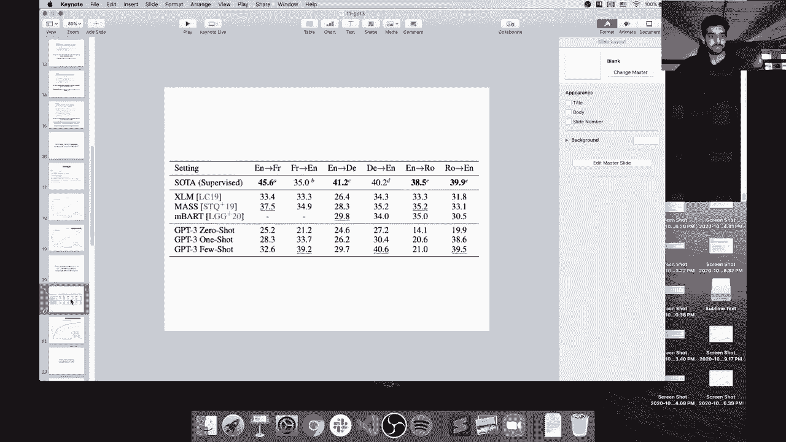

# 【双语字幕+资料下载】马萨诸塞CS685 ｜ 自然语言处理进阶(2020·完整版) - P14：L11- 扩展语言模型规模和 GPT-3 - ShowMeAI - BV1BL411t7RV

Okay， looks like we are live。As usual， if you are one of the 12 current attendees and could say something in the chat to indicate that you can hear me and see the slides okay。

 that would be great。And I will start once I see something。Or maybe I'll just go ahead and start and。

You guys can complain if the connection is bad。 So today we're going to be talking about G 3。

 which is。The latest and greatest neural language model that was just recently released a few months ago by Open AI and their research team and quite interestingly。

 we're not going to be talking about any really new modeling in this lecture。

 we've seen basically all of the components of Transformer based neural language models before。

 and what GPT3 does is just scale this up to a massive level that hasn't been previously approached。

All right， so let's get started。Whatops， I thought I had a slide with。

Questions that people asked Okay clearly I got rid of that slide on accident。

 but there were two questions from the anonymous form that I wanted to answer before going into the topic today and first is someone asked how the CLS token in Bert is pretrained and how it's used during pretraining And so remember that in Bt。

 the CLS token， we put a classifier over that to predict whether the second segment and the input is the one that follows the first segment or not in Roberta。

 we get rid of the next sentence prediction task completely so there's no pretraining objective on top of the CLS token remember that the same exact CLS token is prepened to every single input So it is getting some signal。

😊，part of every input and because a transformer is just multiple layers of stacked self attention。

 the CLS token is contextualized in some way even without the next sentence prediction objective because it's a function of all of the previous embeddings。

 token embeddings in the previous layer and you can map out the attention all the way down to the input token embeddings。

😊，Okay， so a second thing， a second question was in Elmo and Bert， we both have in both cases。

 we have multilayed models right in Elmo， we have this two layer by LSTM in Bert。

 we have a 12 or 24 layer transformer and so how do we decide after pretraining。

 if we want to get a single representation for a particular word in a context we now have representations at multiple layer。

 So how do we choose which one to use So in Bt， the choice is very straightforward。

 we just take the final layer representations。 So if I have 24 layer transformer。

 I'm going to take the representations that are output at the 24th layer and those are my token level representations。

😊，On the other hand， if I'm using ElLmo， then it's a little more complicated。

 my final token level representations are a weighted average of the representations at each of the layers of the BLSTM。

 so these are different approaches either you can aggregate across all layers or you can just choose the final layer representation to use。

All right， so those were the questions that we got from the anonymous form。

 if you have further questions again feel free to put them in the chat box。Okay。

 so getting on to today's topic。We're going to be discussing an alternative to the now familiar paradigm of pretrain。

 a large scale language model and then fine tuning it on some downstream task and intuitively。

 the approach is very straightforward。 we're just going to get rid of the fine tuning phase。

 And so we're going focus all of our effort on pretraining and then just hope that our pretrain model is powerful enough to solve a bunch of tasks without even having。

😊，Any labeled data。So I see a question about any intuition behind these different approaches。

 what approaches are you referring to， the Elmo and Bt stuff or this new topic that we're discussing today。

In the meantime， I will proceed。 So I wanted to give some insight as to the language model in scaling wars。

 which you know， stupid term to describe what's been happening。 So first， we have Elmo and Elmo。

 when it came out in 2018 was roughly 93 million parameters。 and it was a very， you know。

 standard model for that time and not not super large。 It had two layers by LSTM。

 the hidden size here was quite large， but other than that， it wasn't， you know， some enormous model。

 And when Bert came out， the base model was only slightly bigger than Elmo with 110 million parameters is 12 layer transformer and the large model was 340 million parameters and 24 layer transformer。

 note that a lot of parameters here are in the embedding these models， right？ So。😊。

You imagine whatever the size of your embedding dimensionality that your embedding matrix is going to be that size like D by the size of the vocabulary。

 so if you have a large vocabulary， then a lot of your model parameters will be concentrated in the embeddings。

Okay so the question was about Elmo and Bert and how do you choose whether to use the final layer representation or the weighted average of all of the layers and it's essentially just an empirical question what tends to work better keep in mind that in ElLmo we are not fine tuning the language model itself。

 so we put a whole new downstream model on top of ElLmo。

 but in Bert we're actually fine tuning the entire mask language model like all of these 24 layers in the transformers so because we're not actually using Bert as an embedding method。

 but rather the entire model is transferred not just the embeddings it makes sense to use the final layer representations because when we do backpro in the downstream task。

 the error signal gets back propagated down to every single one of those layers and ends up changing the weights all the way down to the token em。

😊，So that's why I in Bert。We are putting our classifiers to solve the downstream task on top of the final layer。

Okay， so I wanted to show a table from GPT3 to just demonstrate how far we've come in terms of scaling up these language models and so this table。

 if you did the reading， I know this paper was very long。

 but it had a lot of interesting subsections。So this table from the paper is showing the model size of a bunch of different variants of GPT3。

 so we are not going to cover GPT and GPT2 in this class you can look them up if you're interested。

 but in essence there are just smaller versions of GPT3 that are trained on smaller data sets。

So here we see that there is comparison a comparable version to Bt base and Bt medium in terms of number of parameters GT3 small is a 12 layer transformer。

 125 million parameters GPT medium is 350 million parameters。

 but then we quickly get you know these models are growing bigger and bigger and bigger until the final version。

 the one that they call GPT3 is 175 billion parameters。

 so this is an order magnitude or two more than what we saw with Bt large and Roberta and those models that we talked about last week。

😊，This has 96 layers and the hidden state size is over 12000。 So I mean。

 it's got 96 heads per layer in the multiheaded attention and they're training using a batch size of 3。

2 million。 So these are numbers that are like inconceivable for anyone that you know just has a single Google collab GPU or even like you know the machines we have here at UMass。

 there's no way we're going to be able to train something like this。

 So there's a huge financial investment in training something with 175 billion parameters。

 there have been various you know blog posts and tweets trying to estimate how much this costs but it's clearly in the millions of dollars。

 So。😊，Yeah， training models at this scale is something that's obviously limited to people who have enough funding to be able to。

 you know just dump millions of dollars into the training of a single model。

 but the fact that they did this is really cool because the capabilities of this huge scale model are certainly beyond the capabilities of language models that we've seen in the past with much smaller model sizes and also trained on less data。

Let's move to the data size part so again we can start by comparing the models that we've seen before Elmo was trained on only only 1 billion training tokens and this was from the 1 billion word benchmark dataset set Bert was trained on 3。

3 billion tokens and this was a combination of Wikipedia and an unpublished novel dataset set。

And Roberta was trained well， as you remember last time there were two configurations。

 one where they trained with about the same number of peri sorry tokens as Bt just to be reasonably comparable and the other with like 30 gigabytes of more data added on so I'm not sure exactly how many training tokens they used in Roberta they only report the size in like gigabytes。

 but it was probably around 30 billion training tokens。And if we look at the data in this paper。

 they use， well， they train their model for 300 billionken total tokens， but their actual data set。

 the majority of which comes from the common crawl is maybe about half a billion sorry 500 billion tokens so yeah it's hard to even conceive of how much text that is the common crawl again is just a dump of internet pages。

 they literally just crawl the internet， there's some filtering and preprocessing done to clean up this data。

 but 410 billion tokens come from the common crawl so yeah it's pretty incredible that they were able to scale up to such a huge data set。

😊，Okay， does GT3 use the mask attention LM if so isn't Bert a better model architecture。

 This is a good question， I guess I didn't go over this so and I certainly should have before GT3 is not a masked language model it's instead just a left to right language model so similar to like the left to right language model in Elmo there's no right to left component and we'll see why in a bit so GT3 is meant to be used differently to solve downstream tasks than things like Elmo Bt or roa in that we are not using the pretraining part as a way of just getting representations for text but rather the pretraining part is meant to also learn to solve all of these tasks without any sort of fine tuning so GT3 I would guess is also probably the best。

😊，Current way of learning or obtaining representations of text。

 but it's not really meant for that so that'll become more clear a little later on。😊，Okay。

 so and yeah， I think for this lecture in particular。

 it'll be good for to have more questions from the 11 of you who are currently watching because this is very new。

 there's a lot of stuff that's unknown here and really if we were in person。

 this will be a great discussion class， but since I can only just read your comments， yeah。

 feel I would encourage you to ask a lot of questions。😊。

And as I say that there are two more questions so does the performance always continue to increase with more parameters or is there some point where we get diminished returns。

 my point is if 100 million parameters work why spend on training 200 billion parameters is yeah this is like one of the open questions so far and we look at the GPT3 some of the tables and plots in the paper。

 many of the plots don't show a plateau so we can keep on scaling up and we haven't yet reach the limits of adding more data and more parameters at least for some tasks and so that kind of motivates continuing on this direction right at some point maybe we would expect to see diminished returns and then we can start working on maybe more clever modeling architectures or better use of the data or so on。

 but I think there's also some。😊，value in this just brute force approach of getting the biggest possible model you can on the most data that you can get your hands on and so far we haven't seen any sign that further scaling up will not improve things compared to what GPT3 has already done。

Is there any measure taken to take care of bias in the data used for training。

 That's a great question。 It's so in this paper， I don't think they， I mean。

 it's very hard to do that at the scale， right， First of all， the if you're， if you have， you know。

4500 billion tokens， you're going to have to。😊，Filter them out automatically right there's no way some human can go in and mark every single web page in the common crawl as you know like what kind of biases。

 these documents be might contain and so you have to use automatic tools and it's not clear that we are at the point where we have automatic tools that can identify bias on many dimensions and also how reliable those things are so yeah。

 there's a section in the I think the supplementary material in the paper that was assigned as reading where they look at the like racial bias since this is a left or right language model it's mainly used to generate text right so you can you know put some stuff in about different races or genders and its prefixes and see what it produces。

😊，And it of course exemplifies racial and gender bias because the data， I mean。

 partially because the data that it's been trained on contains those kinds of biases。 so yeah。

 I'm not sure exactly what they did about this， but if anything。

 I suspect they didn't do much because their entire goal was just to train the biggest train on the biggest possible data set that they could。

But this is definitely a problem moving forward and there are some papers on this line of work like identifying these biases and training your or even evaluating your language models on different data sets that kind of quantify how much bias is encoded by the model。

 I can put some links to that on the webp page after this lecture if I remember to。😊，Okay， okay。

 so lots of other questions。 You mentioned that G3 is not really meant to be fine tuned。

 but can it be fine tuned。 Is there a reason why it would be bad to do so？ That's a good question。

 So they did not provide any fine tuning results in their paper and there is no reason that it can't be fine tuned。

 but in practice， it's very expensive to do so， right。

 And no one except someone that has resources on that scale to even load this model into memory。

 let alone doing gradient updates to it is going to be able to fine tune it。 And。

It's just not like with a model this big， the hardware needs to catch up before fine tuning some a model as big as this is a practical choice for researchers and even other people in industry There's no reason why it would be bad to do so and in fact some of the results we'll look at show that there's a big gap between the abilities of GT3 and the standard pretraining and finet paradigm。

 but I think the point of this paper was not was actually to show the promise of a complete new paradigm that doesn't involve fine tuning and this new paradigm has a lot of advantages compared the pretrain and fine tune approach mainly because it does not have a heavy reliance on requiring a large number of labeled examples for your downstream task so we'll get more into that a little later on。

Okay， when we talk about these huge number of parameters。

 what do these correspond to intuitively So the number of parameters here is the like the combined size the number of like real valued numbers in all of these weight matrices。

 embedding matrices and so on that define the forward computations of these models right so you know in my word embedding matrix for Bt or Elmo right I have a matrix of size d by V where v is a size of the vocabulary So that alone contributes D times V parameters to my model similarly I might have a query projection right and that could be of the hidden dimensionality hidden dimensionality times the hidden dimensionality right that's just a weight matrix So that contributes some number of parameters to my。

😊，UhMy total model parameter account。So yeah， I think the follow up to this question。嗯。

Pameterters are nothing but the features， I think that is not true that the parameters are not associated with the features actually only the you can maybe think of the embedding parameters as kind of analogous to features。

 but the weight matrices are just part of the computations of the model and they do not correspond to features。

Okay。I will answer this other question about GPT3 fine tuning， domain adaptation a little later。

 but I think we should move on。Okay， so this slide is just talking about the amount of compute used to train these different models and if you just look at this plot without looking too closely at the axes labels you might think that oh GPT3 is not that much worse to train than something like ro out large。

 but the Y axis is actually on a log scale， and it's training pet of flops per day， I guess。

I don't know， I mean， obviously the higher the number， the more compute and on this scale。

 like GPT3 takes an incredible amount of compute， far more than any of the models that we've covered in this class。

 like Bt B and Robertt El largege， for example。Okay， so we've covered you know， bigger model size。

 more data， what does this actually mean for our performance on downstream tasks？

So GT3 again is not going to be using this traditional fine tuning pipeline and they have a figure in their paper where they explain how in you know GPT3 terms you would do fine tuning right this is just a left to right language model and so if you were to do something like machine translation you would just combine your source language and target language sentences。

 you would concatenate those two things and a single example for GPT3 would be a phrase or sentence in the source language followed by some like separator token indicating that now you should perform the translation and then followed by the target language sentence so here we have sea otter its translation to French this string is one example of the what we want to predict during fine tuning and again。

😊，Where during fine tuning in a left or right language model we're just concatednating these sequences together。

 the model is still just predicting the next word， and so the idea is that at test time if I wanted to perform translation。

 I would just give the model the prefix C otter and this arrow token and then I would decode from the model by sampling from it or doing taking the argmax or whatever。

 and it would produce ideally the translated version of this this source language sentence so this normally is I have some external data set of you know English to French pairs and I will fine tune my G3 model on this entire data set right example1。

 example2 all the way down to example M。😊，And then finally at test time now that my model has been specialized to translation。

 I will use it to translate some unseen data like cheese into French So this is a standard paradigm we've seen before with Bert and Roberta and Elmo and so on and the only thing that's different here is that we have just a single left or right language model and our model is going to be generating text so for something like S right in Bert we have the start and end span predictor classifiers but in GPT3 we're not going to be doing that we're instead going to have the model actually generate the words that are in the answer So in many ways this formulation is worse for a lot of tasks than what we have in Bert or Roberta right for S it's much easier to predict you know。

Ws in this passage or the start and end of a span， then have the model do that prediction and then also like just copy the words that are in that span into some generated text like it's adding a extra step that's not needed but on the other hand like why might you want a formulation like this is it's very。

 very general I can frame almost any NLP task as input text to output text so sentiment analysis。

 for example， we normally frame it as a classification task where I have a softmax layer that predicts positive or negative in this example。

 I would have you know a sentence like the movie was greatarrow positive So the model is actually generating the word positive and then a test time I would give the movie is great and the arrow and ask the model to generate the next word and if it's doing sentiment analysis properly it would produce。

😊，So it's a very flexible framework， but it might not be perfectly adequate for a bunch of different formatted tasks like question answering or sequence labeling。

😊，Anyway， in G3 we're not doing fine tuning on a downstream data set and so in the zero shot setting which they describe in their paper。

 the model is given just a text description of the task that they wanted to perform so for this translation task they would feed in as the prefix。

 translate English to French colon， and then the word that they want to translate followed by this arrow。

 so translate English to French colon cheese arrow。

 This is the prefix that they feed into their left or right language model and then whatever the model produces as the next word is going to be the translation。

😊，So maybe we should take a step back and think of what this actually means for the model right what does a model have to do to be able to produce a translation of does a model have to do to be able to produce a translation of the word cheese So one thing of course。

 is that it has to understand the description of the task that it's supposed to perform。😊。

RightSo translate English to French。 It has to understand that that is corresponding to some sort of instruction。

 and it has to understand that cheese， the thing that follows next is basically the argument to this translate function that it needs to apply。

 It also needs to have learned how to do translation，s only from its pretraining。

 which is kind of crazy， right， because there's nothing in its pretraining data set that's specific to translation。

 Sure in the common crawl。 It might have seen instances of translated text。

 but it would have seen those in many different formats， not just the clean。

 here's a source sentence。 Here's its corresponding target translation that you get in a standard machine translation data set。

So that's a zero shot learning setting where the model sees no training data from the task itself。

 it basically just sees a command of what the task should be。In the One shot learning setting。

So and again， we're not doing any sort of training or fine tuning here。

 we're basically just doing prefix engineering， we're putting things into the prefix of our language model that can help it predict some unseen or generalize to some input word or phrase that's also part of our input。

 so in the one shot case we have translate English to French， then we have an example translation。

 C otter and its French translation， and then we have the word that we want to translate。

So compared to the zero shot setting here， we've added just one thing to our prefix。

 which is the C otter and its corresponding translation。

 and this is supposedly going to help the model learn better what it means to translate something from English to French。

Yeah， so there's a question about the formatting in the prefix like using the colon or the arrow。

 I think they talk about this a little bit in their paper that they probably tried a number of different ways to format the prefixes and found that this general thing with colons and arrows work best。

 but there's not too many details， but I imagine it's very important right because this is probably the format in which there was most overlap with the pretraining data set and I suspect at least I'm not sure。

But yeah， I do think it's very important how you actually tell the model how to do these various tasks with your specific formatting。

O。And finally their final setting is this few shot learning case where instead of just providing one example we provide many examples and they experiment with up to 100 examples fed into the prefix so that's the few shot learning case and keep in mind that 100 examples is a small fraction of most of the training data sets that we have right S is like 100。

000。😊，QA pairs and so we're not feeding it anywhere close to the full training data it's just a small set of examples。

 but hopefully the model can learn to generalize from there。😊，And so again。

 we're doing no fine tuning， we just take our pretrain language model and we put these things in as a prefix and then see how well it does at solving a particular task that we're asking it to solve。

All right， so let's get into some comparisons which I think will answer some of the remaining questions。

So one of the impressive results in this paper was the result on trivia QA So trivia QA is a question answering task where the answers are they they're all basically like trivia questions so the answers are mainly entities and interestingly for trivia QA。

 these questions here like Miami Beach and Florida borders which ocean， these are paired with。😊。

External documents that a model can go in and extract this answer from so most models for trivia QA are trained on this task where they get the question and they also get some supporting article or document and from both those things they can predict the answer。

In GPT3， they completely remove that supporting document part and so they simply just in the zero shot case。

 say answer this question in the one shot case， they might give just one example QA pair and in the few shot case they might give a couple different QA pairs。

So this dashed line here is the state of the art with the pretrain and fine tuning paradigm and you can see that these three different lines here are the zero shot in blue one shot in green and few shot with 64 different QA pairs in the prefix and the x axises here is the size of the language model in terms of number of parameters so you can see that with smaller language models were very far away from the state of the art right so even with you know 13 billion parameters were not really close and if we go back to a lot of slides here note that even Bt large is only 340 million parameters so if we go back to this slide it's like somewhere over here。

😊，Right， and we might expect its performance on these kinds of zero shot or few shot cases to be really bad。

 But if you see what happens when you get to 175 billion parameters。

 the few shot learning model is actually outperforming the state of the art。

 despite seeing despite not seeing the training data at all beyond the 64 examples that are put into the prefix。

 So this is pretty crazy， right， the model has seen only 64 examples。

 it hasn't even been trained on them。 It's just all due to this huge scale pre training that the model has learned through just the simple next word prediction task how to。

😊，How to answer some of these questions right it's probably seen a lot of these facts before。

 so that's getting into one of the questions， how would giving examples help given the fact that we're not fine tu the model using those examples。

😊，Right， so I mean， the way in which the model can answer these questions。

 obviously it can only answer them if it's seen these facts before ands pretraining right and I think one thing that's hard to even conceive is how large 500 billion training tokens is right that's sorts way more text than any of you have ever read or even all of us combined together have read and this result here is basically a testament to the model's ability to memorize huge number of facts that it's seen in its training data。

😊，Right so how would G3 be able to answer a question like what was the occupation of lovely Rita according to the song by the Beatles。

 maybe it's seen the lyrics to lovely Rita before in its pretraining data。

 maybe it's seen a lot of different articles or blog posts about this song you know with 500 billion training tokens it's very unclear exactly how much information about lovely Rita the model has you know seen before in its pretraining。

 but this result up here indicates that at least with this 175 billion parametermeter model。

 it's actually been able to memorize a huge number of these facts and at least well enough to answer these questions and also note that some of these questions are quite complicated and don't really involve just a single retrieval of one fact。

Right， so at this question， for instance， at which English racecourse did two horses climb the parade during due to electrocution in February 2011 well。

え。Maybe this is not a great example because it has a specific date， but， you know。

 if it didn't have this date， you can imagine that it actually the model has to do a lot of reasoning about maybe it saw something about this event before。

 but not worded in exactly the same way。 And so it has to do some sort of semantic matching to figure out the answer here。

 all in all， the。The model has to have seen these facts for it to be able to answer the question。

 but it doesn't need to be fine- tuned on the actual training data itself to be able to like pick these facts out of its you know massive amount of parameters so going to the question that was just asked yeah it kind of is like this 175 billion parameter model has formed some incredibly large memory and the stuff that you're putting into the prefix is basically a query over this memory。

Or at least that's one way to look at it， but some of the other results we'll talk about later indicate that the model is capable of doing something more than just retrieving。

 So a lot of it is that this model has encoded a lot of facts and it's like an encyclopedia。

 but I think there's some element beyond that which we'll get into a little later。

Would asking for a translation to German after one example of translation to French be considered one shot or would that be few shot So if you give it a translation to German。

 but you actually want it to translate to French， I think that would be zero shot Well， I don't know。

 I'm not sure about the terminology in this case because you're still telling it to translate。

 It's an example of translation， but it's not an example in the the target language that you care about So I'm not actually sure。

What that would be。Is G3 not affected by catastrophic forgetting as in how does it still remember things that had seen way before in the past。

 that's a great question It has an incredibly large model capacity so I think it's just hard to like for me at least I can't really conceive about conceive of how how much。

😊，Capacity has to memorize different facts or like what number of facts it can memorize with such a huge number of parameters。

 It's very， very hard to think about even， but yeah， I guess the general idea that is， of course。

 if the model is capable of reliably predicting the next word in all sorts of different contexts。

 it's required to memorize some amount of world knowledge to do this。

 right So it's going to forget some things， but it's going to remember other things and the balance between like how many times does something need to occur in its training data for it to memorize it that's all very unclear at this scale。

 So like even my own research group we've done experiments at a much。

 much smaller scale about you know， if I put in this random sequence of numbers or words into my language model training data。

 how many times does it have to see it to before it。😊。

s it and people have done similar things with like there's this one paper that put the or actually I think one of the open AI GP GPT2 or GPT1 papers。

 found that the model memorized the Gettysburg address completely and then they looked at Is did the Gettysburg address occur in the training data and it appeared quite a few times but yeah GPT3 clearly has some advanced memorization capabilities。

 I don't know that I can answer that question properly at this point。嗯。

Is finding out how to phrase task to get the best output or what task it can even do a matter of trial and error Yeah so in this case the open AI had access to the validation set of all of these tasks right so how do they even pick you know K equals 64 they mentioned that they tuned this on the validation set so they likely also tuned the formatting and the phrasing of the tasks based on their validation set performance。

😊，So yeah， I mean， this is maybe a new art right in NLP of now that we have this huge scale model。

 how can we squeeze the most performance out of it by without any training at all。

 but by simply just phrasing task and selecting examples differently。

No one can currently do this research other than open AI or other organizations that can actually deal with this model。

 but in the future， maybe that'll be a growing area of research。Okay。

 what kind of tasks can be included in zero shot learning。

 So any task that can be described in text in this way can be framed in this zero shot framework。

 at least the one， proposed here。 So any task that's text to text that can be described by natural language。

 which is I think most tasks right， I could tell it to do I don't know。

 like part of speech tagging right I could say provide the part of speech tag sequence for this sentence colon and then give it a sentence。

 I suspect the model would do very poorly at that， but I could certainly formalize it in this way。

 So yeah， I would say basically any NLP tasks can be included in this setting。😊，All right。

 so that's trivia QA。 Now I also wanted to highlight the translation results。

 so I know we haven't talked about the way to evaluate translation yet and we will be talking about that on Wednesday。

 but I just wanted to highlight kind of how impressive this result is so these are all blue scores。

 which we'll talk about later， but you can just assume that a higher number in this table means that the model is achieving better translation quality and you see the columns here are all different language pairs。

 so translating from English to French from English to German， English to Romanian and so on。😊。

And the first row here is the supervised state of the art on all these translation directions and these three here are some baselines that incorporate。

😊，Fine tuning， sorry pre training， both monolingual and multilingual pre training。

 And here are the GT 3 results。 And so here again， in the zero shot case。

 I'm just saying translate from English to French and then I'm putting in the sentence。

And these are on well establishedablish data sets for each of these language pairs。

 So even in the zeroshot setting， the model is not doing terribly right like and this will be more clear next class。

 but 25 blue is not a terrible result。 It means that the model is clearly producing some French text。

 it might not be grammatical it might not be or it might not be perfectly grammatical。

 it might not be semantically the same as what was fed in as input。

 but it is doing something that resembles translation。😊。

The few shot results though are quite impressive， I mean there's obviously a big gap between these numbers and the supervised state of the art on many tasks。

 but overall some of these results indicate that the model is performing competitively with this supervised state of the art which is really impressive so just describing the task of translation giving a small number of examples is sufficient and I wanted to point out that 7% of GPT3's training data they mentioned in the paper。

😊，Okay， in language， sorry fellow faculty member is happy， I should probably close my slack。

All right。So 7% of its training data is in languages other than English which explains why it's able to translate to all of these directions we seen some training data in other languages before。

 but the kind of crazy thing is that it's very unlikely to have seen a large number of parallel pairs like in on the internet。

 no one really writes a sentence and then says here's a French translation colon in the exact French translation of that sentence right that would be an ideal format for this model but it's unlikely that you'll be able to see this in I think more frequently you will probably see documents that mix French and English together but there might not be exact translations back and forth。

 so the fact that the model is able to do this is quite impressive。😊，嗯。

Okay I think I might have missed it， but can you explain the underlying model for GPT3 Yeah it's just a transformer neural language model。

 so it's predicting the next word， we saw this before when we first went over the transformer。

 they make some small tweaks to the architecture， they add some sparsity and so on。

 but at a high level it's essentially just a transformer language model that's predicting the next word。

 and so even though that's the conceptual idea of the model， it has 96 layers。

 a huge hidden dimensionality and a huge number of heads。

 so it's just a transformer that's been scaled up to an insane degree。😊。

But the objective function is just predict the next word left or right。

 so it's not doing mass language modeling。Okay， so that was translation and I wanted to show one figure here that just kind of makes it clear that。

The improvements are still increasing as we get bigger and bigger models right so these are the blue scores on all of these different directions plotted against the number of parameters in the model and we see that these curves are all increasing。

 although of course they're not increasing at the same rates as they might be down here。

 but still it shows some potential for increasing data and model size。😊，All right。

 so I also wanted to talk about reading comprehension QA we talked about S and stuff a lot so how does this01 and few shot setting with GPT3 do compared to the state of the art so the results here are a little mixed。

😊，So for simpler dataset，al QA dataset， the few shot setting is actually very close to the state of the art using pre-train fine tune on the entire training data so this is a very impressive result but some of the harder dataset sets so like drop and quack require a little more reasoning on the parts of the question asker sorry the question answer and also Squa 2。

0 remember has these unanswerable questions so it's a little more difficult than S1 and you can see that there is a very large gap on all of these other data sets comparing the few shot setting to the fine tune state of the art setting so。

😊，There's a lot of room for improvement here but they do point out that this number on Squa2 is similar to some model that came out like one or two years ago and was probably the state of the art at some point。

 so it's not like the few shot GPT3 is completely just producing random text and random answers when given a question for any questions that actually gets it right and it probably struggles on some of the harder ones。

Is this a gap that can be closed by just pretraining on more data and adding more parameters to the model that is unclear and personally I don't think so。

 but I guess we'll see in the next coming months if there's a bigger language model released and if it's evaluated on all these benchmarks maybe it'll show more improvements。

😊，Okay， so here this was just a comparison on super gluelu。

 which is a benchmark of a bunch of different NLP tasks， including a lot of classification tasks。

 and this is just the average score on all of these tasks in this benchmark data set and so here we see at the bottom the random guessing line and zero shot GPT3 with a very small model size is worse than random or doing about as close as random guessing but as you increase the model size it starts to get better and better eventually for the few shot learning setting outperforming Bt large fine tuned on all of these training sets。

😊，So of course， the state of the art on this benchmark is much higher than these dashed lines。

 so there's a big gap there， but it is still impressive。Okay。

 can we use GT3 for sentiment analysis and yes will it be like cheating if the model has seen the comment review already while pretraining this is a good question so first of all。

 yes， you can use GT3 for sentiment analysis imagine how you would formulate this in the zero shot case right you would just say something like what what is the sentiment of or maybe a better way to framement would be is the sentiment of the following sentence positive or negative right so you specify the labels in the prompt itself and then give it the sentence and see what the next word it predicts is if it's positive or negative。

😊，So yeah you can certainly use it for sentiment analysis but the second part of your question is more interesting what if it's already seen the reviews that you're testing it on during pre-training and this is something they point out in their paper for many of these tasks they can't really control for if the model has observed the data during pretraining or not and they call this like data contamination so in this plot go for a number of data sets they actually look at how much of the data was in their pretraining corpus and so a data set like quack which has been constructed fully from Wikipedia is all of those articles are in the pre-training data set for for this model so it's including the test articles right so of course the questions。

😊，mselves are not actually in the data set， but just seeing the passages alone might be construed as some sort of advantage。

 but this becomes worse maybe for the translation tasks where you might actually see a sentence from the test set and its corresponding translation somewhere in the 500 billion pre-training tokens and so then are we really evaluating the model has learned to translate if it's actually just retrieving the translation of some sentence that it's seen before？

So to measure this， they kind of do some synthetic experiments where are there's like guaranteed to be no overlap or as little overlap as possible。

 you see here all these inagrams and reversed words are close to 100% clean meaning there's no overlap between them and the pre-training data。

😊，So some of those tasks are like two digit edition like what is 48 plus 76 and in the few shot case they give it some examples formatted like this and ask it to answer these questions and these quickly get more complicated and so on。

And here they have even some multiple operations in one question。

So here you can see the results as these tasks get more and more complicated， the few。

 even the few shot setting starts to struggle right with five digit edition。

 I assume these numbers are just accuracy it only gets the correct answer like 10% of the time。😊。

But with a simpler case， it's at 100%。 So what does this mean。

 Maybe it means that it can generalize to some extent， but it's still。

 of course far away from saying that it's learned like the whole concept of addition， right。

 And it's able to generalize this to arbitrary numbers。And how has it learned this。

 it's probably seen， you know a lot of math textbooks or just math problems etc cetera。

 and its pretraining data set So again， that's it's something that's hard to quantify right what exactly is present in its 500 billion training tokens presumably like everything that's ever been written is a candidate right so yeah these experiments although they're kind of synthetic are still still interesting。

😊，They also just the last so I would highly recommend reading the paper for more examples of different tasks that they can solve and so on。

 I wanted to conclude with giving this final example where they make up these fake words and give fake definition of them and then ask as the model to use it in a sentence and so the prefix here is this gray part so they say a w poo is a small furry animal native to Tanzania an example of a sentence that uses the word what poo is we were traveling in Africa and we saw these very cute wt pos。

😊，And so now they want to test out the model's ability to generalize this to new fake words。

 So they say to do a farduddle means to jump up and down really fast。

 an example of a sentence that uses the word far doddle is and the model generates this text in the bold one day when I was playing tag with my little sister。

 she got really excited and she started doing this crazy far doles。 So that is。

 you know a coherent sentence， it's grammatical， it's using the word fardule correctly in the context。

 despite the fact that this is a fake word and it's only been defined here in the prefix in one sentence。

 and it's only been primed to do this task by a single example with this w poo thing。

 So it's pretty crazy that it could generate a sentence like this if you ask the human for example。

 they might produce a sentence like this as well。 And so here on this。😊。

Slide we see several other examples of the model successfully using these fake words in its generated text。

Tangential， but are there any cost estimates publicly available for the price to train GT3 again I'm not sure that openaiI has explicitly said how much it cost to train this model because the costs are not just compute related although certainly costs a lot to train on insane number of GPUs on the cloud but also there's a cost to how many models did they train。

 how many different versions of GPT3 did they actually train because each one might cost million dollars or something like that and how much experimentation did they do with the data itself with different model configurations like how did they select this particular hidden state size and this number of layers and so on and also there's just a cost of like the human cost。

How many researchers were if you look at the author list of this paper。

 there were so many people involved， they each get paid salaries and their primary jobs were to know train this model right so it's probably in the millions of dollars I'm not sure of the exact number。

Okay if the model is huge enough that it is explored almost all possibilities of outcomes then still is it still classified as cheating So I think in this case right you can clearly say that the model is not cheating right because these are words that did not appear anywhere in its training data set。

 they're fake words made up explicitly for that purpose。

 and so the fact that the model is still able to generate text that is reasonable for all of these cases indicates that it's doing something beyond just memorizing and retrieving right it is able to generalized to new stuff that it hasn't seen before but yeah。

 like what it actually means to cheat in this setting is a little ambiguous if a model has seen you know a particular Wikipedia article before is a cheating to ask questions about that article maybe maybe not。

😊，Depends on how you define cheating， so yeah， I don't know。Hard to say。

Seeing this example of the fake words， can we say that G3 can be more useful for text generation like story or summary generation tasks。

 Yeah， it certainly is useful for text generation in fact。

 the fact I mean it is a left or right language model right so its basic role is to generate text。

 All of these tasks are being solved through text generation and there are several examples in the paper of it generating longform text like a whole article。

 even they have an example where they give it a short prompt and ask it to generate a news article and it does a pretty good job。

 There are obviously other cases where it fails and yeah。

 there's been a lot of discussion on Twitter and so on about various prompts that cause the model to behave differently we'll get to this more when we talk about language generation。

 but there are different different ways to decode from language models you might sample。😊。

many different continuations of a particular prefix before you get one that you like and so on。

 but yeah at its core， this model is likely the best current thing for something like story generation。

 although they didn't evaluate it on a task like this， I imagine it would be super useful there。😊。

Okay， wow so I'm already at one hours， I'll try to make this brief。

 but the second paper that we assigned today was basically trying to answer this question of whether NLP can just be completely solved by some huge language model in the future that's maybe like orders of magnitude bigger than GPT3 and trained on you know maybe trillions of words of text right will this just solve everything？

😊，And so in this paper， this bender and color paper that was assigned。

 they make a distinction between the form of a text and its meaning。

 so language models are trained strictly on form meaning they observe in their training data。

 just the characters and words associated with some text right and so form if I'm speaking to you might be like the sounds that I'm making right but in this paper they define the meaning as the meaning of some text as the relationship between the form like the actual words and characters that it comprises and the world outside。

 so something outside of just the form， the language itself and so this is really the problem of grounding right so when we talk to each other we have you know some common reference frame right we have physical objects that are in the world。

😊，We have concepts that we're familiar with， we have experiences that are shared language models don't see any of this right they just see the form of text and it's unclear if like how far we can go with models that just have access to raw text without any sort of other interaction with the world。

😊，So there are several thought experiments in this paper that are interesting。

 I wanted to highlight two of them， so the first one to maybe make this distinction between form and meaning more clear is this experiment where maybe you have a language model that has access to all well-form Java code that's on GiHub but it has only the code itself。

 it has no output it has no understanding of what are unit tests and so on。

 so it just has the code itself。😊，And so then you train your model on this and then you give it as input at test time a program in Java。

 it could even be one from the training data and you ask it to produce the output of executing that program on some particular input so if the model has never seen actual input output pairs before。

 could it solve this task， despite the fact that it's seen all of the wellform Java code that's ever been written so the fact that it hasn't been actually grounded in what does this actual command do if I run it。

 what would happen means that it's very unlikely that you could have a model that can produce the result after after not seeing any examples of input output pairs so in this paper they say that it's impossible there has been a lot of debate since what。

This actually mean you know what if your Java code on GiHub contained examples of input output pairs in the comments or assert equals statements or so on。

 but at its core I think it's a valuable thought experiment。

 but the second one that I want to highlight is this octopus test so this is the main experiment proposed in this paper it's kind of similar to the Tring test but it goes a little further in yeah what we define as actual understanding of language so for those of you who are not familiar with the Tring test it basically is saying that a program is intelligent or understands language if it's able to fool a human into thinking that it itself is actually a human that they're talking to and not a computer but there have been several experiments that show that。

You can have models that have no understanding of language。

 but can still pass the tearring test to some degree because the human participant is able to。

Essentially create meaning out of the utterances of some computer。

 even if there is nothing really there。 Okay， so in this octopus test。

 there's a setup which is essentially there are two people。

 they're stranded on two different islands they can't there's no one else on these islands。

 there's no hope of anyone coming to rescue them。 but luckily there somehow connected there these two islands via some underwater cable。

 so they're able to communicate with each other And so you can imagine you know person A saying I'm stranded here at Sox and person B sayingLuckiily we can talk to each other through this cable and so on。

😊，So then there's an octopus in the ocean who finds this cable and discovers that he's able to listen in on these conversations。

 so this octopus O listens to you know several hundreds or thousands or millions or billions of different conversational turns between A and B。

😊，And so eventually O here， the octopus is able to form a pretty good language model right。

 the octopus might be able to predict what person B is going to say given some response from given some input from person A。

 you know if this octopus is observed enough examples right so here we see O here as a kind of analog to our language model it's been trained completely on the form of the text right it has no way to observe what's actually happening on these islands it doesn't know what the objects or colors or whatever that people are referencing in their conversations are it's basically doing some more intelligent version of pattern matching。

 right。😊，嗯。Okay， so then at some point， this octopus gets bored of just observing these conversations and decides that now that it can kind of roughly predict what a person is going to say given some input。

 it's going to cut this cable and replace all of the messages from the other person with something that it itself has created。

 so neither of these two people A and B are talking to each other anymore。

 they're actually talking to the octopus whos relaying its own responses back to the original person。

 so here like if person A asked， so where are you from， the octopus was it's got great weather。

 but person B never participated in this conversation。😊，So finally。

 then the like main point of this example is what happens when person A produces some text that requires some sort of high levell reasoning of concepts that are way beyond the understanding of the octopus because it's only seen the form right so if it sees something like help I'm being chased by a bear。

 all I have is a stick what do I do the octopus doesn't know what a stick it is。

 it doesn't know what a bear is， so even if it's seen， you know instances of a stick。

 it has to be able to generalize its concept of a stick to this new situation of being chased by a bear which it also just can't comprehend not being grounded in this world and so you can imagine it might pass the turing test of it。

Use something like not sure， sorry right， this is a reasonable response。

 but if person B produced this response not sure so sorry， they would actually have grounded their。

Their response in their previous experiences right they would， I mean。

 they could say something like not sure sorry， but they could also say。

 you know maybe you should use that stick to hit the bear or maybe you should you know run into the or swim into the ocean where it can't get you or something like that but since octopus has no like concept of these words beyond the form itself。

 it's unable to actually give a reasonable response to this test。

 so the generalization from this example to language models is that at some point even if you train this model on trillions and trillions of text。

 it's going to be unable to generalize to new situations that require some level of reasoning beyond just retrieving things。

😊，And it's going to require some actual grounding in the world， or in some definition of a world。

So I know there's a lot of linguistics， PhD students taking this class。

 I probably have butchered various things in this explanation。

 feel free to correct me or offer some more discussion on Piazza。

 I'm sure we would all like to hear from you。But the conclusions of this paper setting O did not learn actual meaning from just the form alone right。

 so it was not grounded in the actual day to day occurrences on these islands and so even though it output something like not sure sorry。

 and A could understand that and A could find meaning through that utterance。

 the octopus didn't actually understand what it was saying or it didn't understand A's。😊。

uttertterance。And so one there is a lot of discussion on this paper at the recent ACL conference。

 some questions ask for what if B didn't know what a bear was either they might give the same response to O but the point is not that O and B would give similar responses in this situation。

 but really that O and B are using completely different processes to produce those responses。

 so B would be grounding their response in their own experience going through all of the things they've experienced and all of the ways in which they could possibly relate to this particular experience O has no even concept of what these things mean and so it's just retrieving like some filler phrase that that it's seen maybe B use a lot when for。

😊，for many different complicated inputs from A， but it doesn't actually try to understand or is even capable of understanding what the actual meaning of A's input was。

So I'll also link to a nice blog post that discusses a bunch of the feedback and other input on this article for those of you who are interested in learning more about it。

 so I see a lot of questions， doesn't this limitation apply to language in general depending on how much experience the person has。

 yeah this is similar to this last point， it's not just what O is producing but also the way in which like gets to the point where it outputs not sure sorry。

 so the type of reasoning and stuff that it's doing is very different than what B is doing because B has this additional grounding and realworl experience that different than what B is doing because B has this additional grounding and real worldor experience。

With all of these different concepts that O doesn't have with only access to the form。

Isn't that similar to what color red and green means to red， green color blind people Actually。

 there's an interesting discussion of something related to this on the blog post。

 so I'll definitely link that on the website after this lecture。

 but yeah there is a follow up experiment proposed by Julian Michael who's anLP PhD student and wrote the blog posts of like what would happen if so oh obviously has no sense of color right and it might have seen you know red。

 green， yellow purple described before in the conversations between A and B。

 but it hasn't actually seen these colors right， but what happens if oh at some point gets bored and goes up to the surface and meets one of these people and finds you know a flower or something and the person says。

 oh this flower is purple。😊，So now automatically based on just being able to connect this particular color to purple。

 it is conceivable that O could learn the meaning of a bunch of other colors right just based on various descriptions of shading or intensity or something like that。

 it might be able to learn like what is black and white for example。

 so yeah there's a lot of gray area here in this experiment， but I think it's still very interesting。

😊，Okay， so is connection to vision or other sense meaning a natural place to go for grounding language models in the real world Yeah。

 so moving forward， we definitely need data sets that are and so so far language and vision has been the most common way of getting this additional grounding like image captioning or video doing stuff with video description or something like that but there's more right there's also actual interaction with things in the world right so now people are doing a lot of stuff with simulations where you have an agent that can actually go in kind of like in a video game environment mess with different things in a particular space and all of those things are you know grounded with language So there's also interesting like navigation data sets where you give an agent you know some。

😊，sort of Google Maps or street view type of functionality and say you drive to the I don't know drive to the laundromat or something and the model has to figure out through both the language and the grounding input that it gets how to do this。

So I think interaction is very important moving forward or actually having these models able to manipulate things。

 maybe even in a simulated environment is going beyond just learning from strictly form。😊。

And finally， like the paper and I kind of also agree with this kind of asks us to take inspiration from human language learning right our children don't learn just from form alone we don't just lock them into a room and say read these 500 billion tokens and only when you're done will you have understood language right。

 they actually learn from much， much smaller total number of words but they have this additional benefit of you know having access to all the different senses and being able to interact with the world and I think that that really cuts down on the number of words that they have to have to see the amount of form that they need to see。

😊。

Okay， so I guess that's all I wanted to say about GPT3。

 it again is very new so it we'll have to see over the next coming years if this zero or few shot learning paradigm is going to be sufficient to replace having actual huge scale labeled training data sets on which to fine two your models。

😊，Personally， I don't think this is going to happen without some advances like the ones that are talked about on this slide with more other modalities and interaction added to the pre training component。

So yeah we'll see what happens then next time we'll be talking about how we evaluate free form generation tasks。

 specifically we'll be looking at the blue score metric that was on one of these earlier slides when we talked about translation yeah this one and some more complicated methods as well。

😊。

