# ã€åŒè¯­å­—幕+资料下载】马è¨è¯¸å¡CS685 ｜ 自然语言处ç†è¿›é˜¶(2020·完整版) - P15：L12- 文本生æˆè§£ç å’Œè¯„ä¼° - ShowMeAI - BV1BL411t7RV

Okay， hey everybody， so today we're going to be talking about some of the components in a text generation pipeline that we haven't yet discussed。

 but which are pretty important if you're going to use any sort of language modeling to generate text and as we saw last time with GPT3。

 we can conceivably turn almost any NLP problem into a text generation problem by feeding in examples or description of a task in as a prefix to a language model and having it generate text that kind of solves the task right so answers in a question answering system or translations in the target language for a machine translation system or so on so it's important to know how we're going to decode。

And also evaluate the quality of our outputs， especially if we're trying to compare a model generated text to some ground truth reference text。

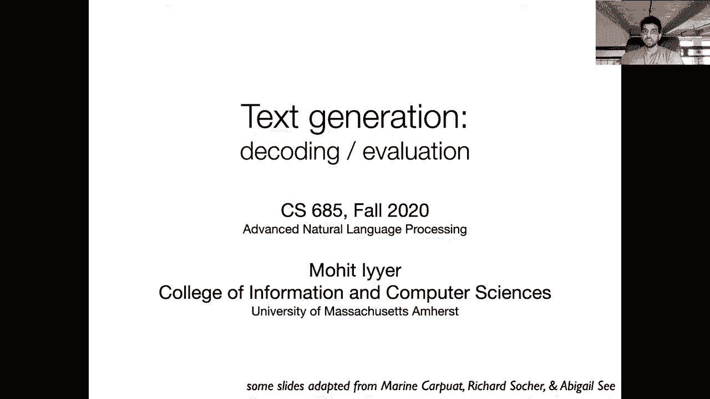

Okay， so before we get into the topic， there's just one question from the anonymous form from last time someone asked for more implementation heavy classes that are less I guess high-le research so I can plan to do one of these maybe sometime in the next couple of weeks where we I don't know。

 implement a model or use something like BERT to solve a task you will also be doing this in your upcoming homework so maybe that will address this to some degree but yeah I do understand we're talking about a lot of pretty complicated models and it'd be good to get some hands-on experience with them。

 so I'll try and incorporate some more coding stuff into my lectures and also I think the homework will be helpful here。

So just a tentative plan on the homework we're just finishing that up it will definitely be released this week I know I've been saying that for the last like five weeks。

 but it is coming and we're going to have it do like a week before the exam so you'll have some time to just focus on the exam reviewing stuff and then yeah we're also planning to kind of drop homework too so we're not going to overload you in the last month of November and give you more time to finish your final projects I should also mention that your project feedback we are finishing that up and it'll be released on Friday so feedback on your project proposals so homework one will be released also hopefully Friday but definitely by the end of the weekend。

And we'll give you two， maybe two and a half weeks to complete it。Hopefully， that'll be enough time。

Okay， as usual， feel free to ask additional questions in the chat box。

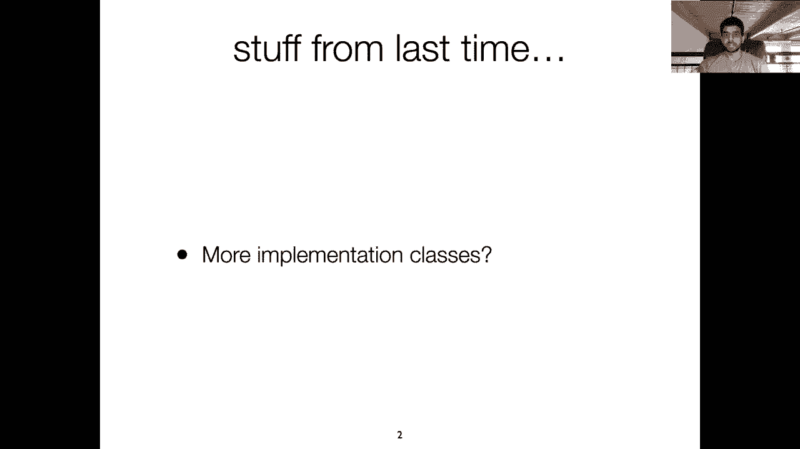

So for most of this lecture， we'll focus on machine translation as the main example of a text generation task when we talk about decoding from models and evaluating machine translation is kind of the canonical text generation task it's been around for many。

 many years and it probably has the most value as you know an industry or even as a benefit to society。

 Google translate used or other translate tools are used all over by many。

 many people and neural networks have significantly improved their quality。😊。

So an important question to ask is so we've covered how to train these models right we've talked about you know training language models。

 training them in the sequence to sequence setting essentially we are just computing the cross entropy loss at the token level and averaging So we've seen the training before。

 but we haven't actually completed the rest of the pipeline from what do we do a test time。

 how do we get a translation for a given input sentence and then how do we know how good that translation is So here in this Chinese to English example。

 we see the systems output is not very coherent it says you know the reporters learned that this ministry plans to build a separate city to solve the basic black and black water up to now blah blah blah these cities were identified to confirm the black and white water。

😊，2082 like this doesn't make any sense right you can see that it does match with some of the numbers that are in the input。

 but the actual meaning of this paragraph is very unlikely I mean it doesn't even make sense So this is a bad translation in general。

 Chinese to English， English and Chinese this is a difficult translation pair compared to something like French to English where there's far more training data and also there's a lot more like just one to one mappings between French word and English word with Chinese you have to deal with the big character set and so on。

 but here you can see， I mean， I don't know French obviously I think all the examples I've had in this class have been French and yeah。

 I clearly don't understand them but if you read the English translation here。

 you can see that it's quite fluent。

It's it's completely grammatical and makes sense compared to this Chinese to English translation here so I have a question wait so the training loss is not the metric we use for evaluation no so we don't use a training loss for evaluation。

 remember to evaluate all models not just text generation models。

 we have some held out data right so in the case of translation we'll have some set of sentences that we have not observed a training time and we're not going to just evaluate our models performance by measuring the loss of the ground truth translation or the probability of the ground truth translation we're instead going to actually decode or generate tokens in the target language from our from our trained model and then we're going to assume that we have access to some reference translation so maybe in this case like I have the ground truth。

😊。

Translation in English as to what this Chinese paragraph translates into。

 And then I'm going to have some metrics that compare the text that I've generated from my model to the the ground truth text。

 So that's how we're going to evaluate in this setting。

And so for machine translation kind of motivating this line of evaluation。

 you really want to measure the quality of text that the model generates and so you have to take into account the decoding process。

 not just the loss or the probability assigned to the ground truth so in machine translation there' are several different use cases that each of them can tolerate different levels of output quality so in assimilation。

 this use case， the reader wants to know what the content is of some text that's in a foreign language so they may not necessarily care of getting a perfect translation or even something that's grammatically correct for they might just want to know like what topics are covered in this source sentence or source document and so the users here are a pretty tolerant of getting translations that are low quality as long as they get the general gist of things。

😊，ã„ã¾ã™ã€‚The other use cases are， of course， communication。

 So maybe you're talking to someone who speaks a different language and you want to use a translation software to understand what they're saying and also communicate back to that person。

 So here， of course， quality is more important even if you make some grammatical errors that can really reduce the ability for your conversational partner to understand what you're saying。

 And finally， if you're talking about， you know， like a publisher who wants to translate some content into multiple different languages and then make that available like publicly or for purchase or whatever。

 you of course， need an incredibly high quality of output translation。

 right So so much so that this task is not done by machines， right it's done by human translators。😊。

And in some cases， translating especially in like fiction， if I want to translate like I don't know。

 crime and punishment， translation itself is kind of an art just like writing the original story。

 so that is kind of far beyond the machine translation systems at this point。

 but just some idea of you know for different use cases of machine translation。

 we might be tolerant of different levels of quality。

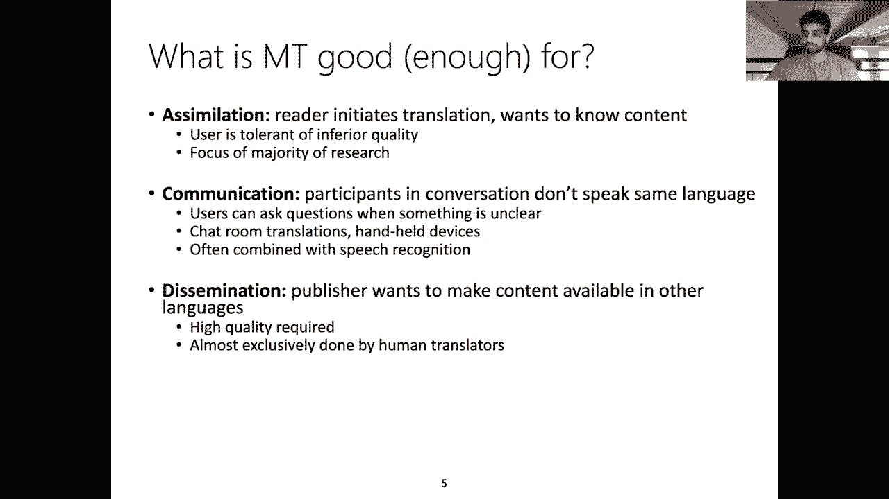

Okay， so again， we're using translation here as an example of a text generation task and we already went over this before but remember in neural machine translation our goal is given some French sorry French is our example。

 given some sentences in an input language and we want to translate it it into a different language。

 our real goal here is to compute the sequence in the target language of words that has the maximum probability when with respect to the input right so we're trying to maximize this conditional probability of E。

 which is in this example an English sentence， given the French input sentence。😊。

And also remember from the first few lectures that werere using our neural networks to directly model this probability by decomposing it into this product of conditional probabilities using the chain rule。

 so all pretty standard stuff。

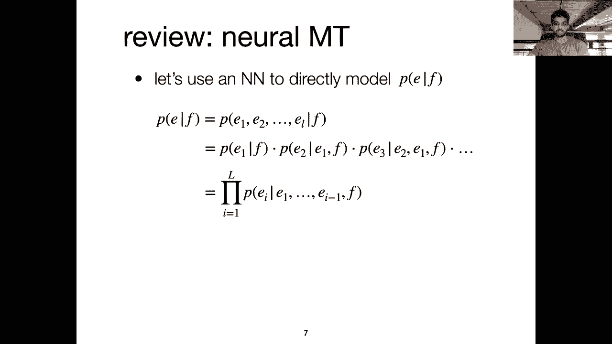

And we've talked about translation as an instance of a sequence to sequence learning problem where we could have two different neural networks to one model the French side。

 the input， the encoder and the other to actually produce the tokens in the English or target language。

And so we've looked at a couple of different cases of this right， we've looked at the RNN to RN。

 the RNN to RNN with attention， and finally the transformer to transformer。

 which is the predominant approach nowadays。

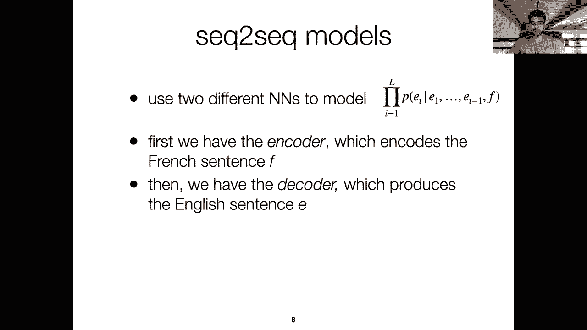

So we've talked about training again， let's switch over to test time usage。

 so how do we actually get some text out of these models at test time that we can then design some metrics to evaluate them。

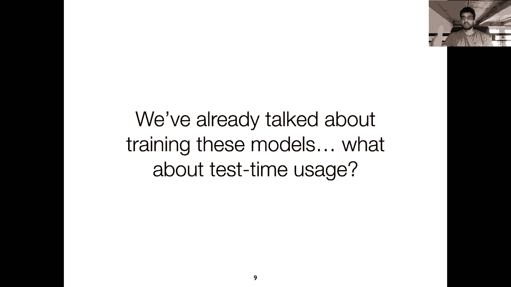

So this process is called decoding， given that we have a trained sequence to sequence model or even some sort of language model in the case of translation。

 our goal is to compute this ArgMax， sorry it is to find the English sentence that has the maximum probability given the input French sentence and so one way you might think about doing this is to just enumerate every possible English sentence that I can construct and then evaluate the probability of each of them under this translation model and pick the one with the highest probability。

😊，But of course， this is not feasible right， First of all。

 I have probably a huge vocabulary of tens of thousands of tokens。

 I don't know what the length of this translation is going to be and enumerating all possible English sequences is just going to be intractable。

😊，So this method doesn't work， the search space is too huge and so we need to switch over to some sort of approximate methods of finding something that is highly probable but maybe not necessarily the most probable English sentence。

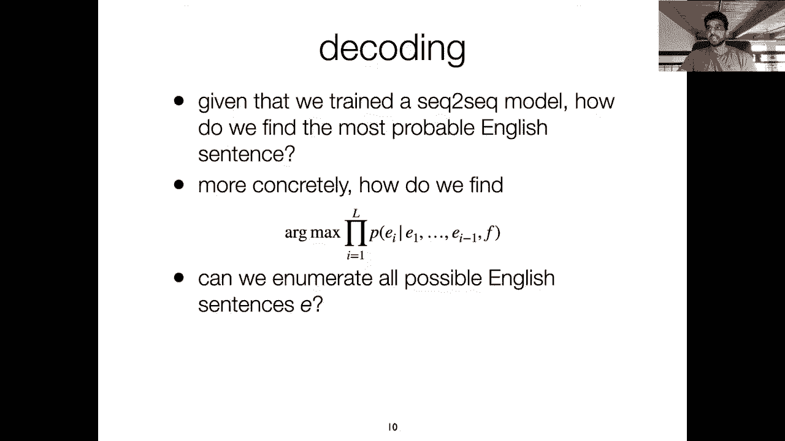

And so I think we discussed this or something similar to this before。

 but the easiest thing to do is greedy decoding and so here in this figure I've only shown the decoder part of the sequence to sequence model you can assume there's some encoder over here that's being fed in here but the English translation is the poor don't have any money So remember that we proceed word by word we produce one word at a time and for each word sorry for each input。

 remember we start with the start token we're going to compute our recurrent hidden state in this example or our transformer hidden state or whatever and finally we get a probability distribution over all of the predicted next words over the entire vocabulary so here in greedy decoding。

 I'm just going to take the word that has a max probability in this。😊。

icted distribution and I'm going to produce that word and so then I'm going to feed that word in as the next time step to my decoder and I'm going to do the same thing。

 I'm going to compute a new hidden state。 I'm going to compute a prediction over the next word and I'm going to take the max probable word as my the word that I'm actually producing。

 So here I produce poor then I go in I do the same thing again I take the max probable word which is don't and so on and I stop decoding when I get to this end of sequence token right that indicates that I have completed the translation。

😊，So there are some issues with this approach right first of all， if I make a mistake early on。

 I don't really have a chance to go back and fix it and it's not guaranteed that the you know a word that I picked at the beginning is going to be correct if I make a poor decision that could really impact my the rest of the words that I predict so we might want a method that allows us to explore more possibilities than just this single am at each step。

😊。

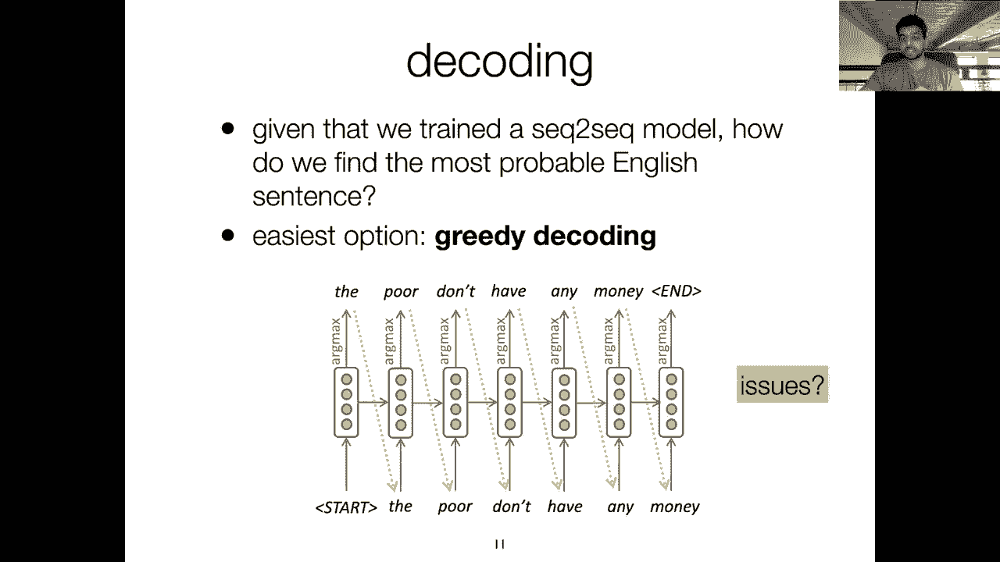

And so that's where beam searcharch comes in so if we want a method that allows us at least some capability of revising the decisions that we've made in the past。

 beamM search is intuitively just allows us to explore several different translations instead of just a single one so in the greed EDding case。

 I only have a single candidate translation and I'm adding a new word to it at every time step right but the intuition behind beamM search is well maybe I keep a couple of different candidate translations in mind and I'm going to add words to each of these translations and at some point I'm going to prune translations that have lower probability to make room for candidates that have higher probability。

😊。

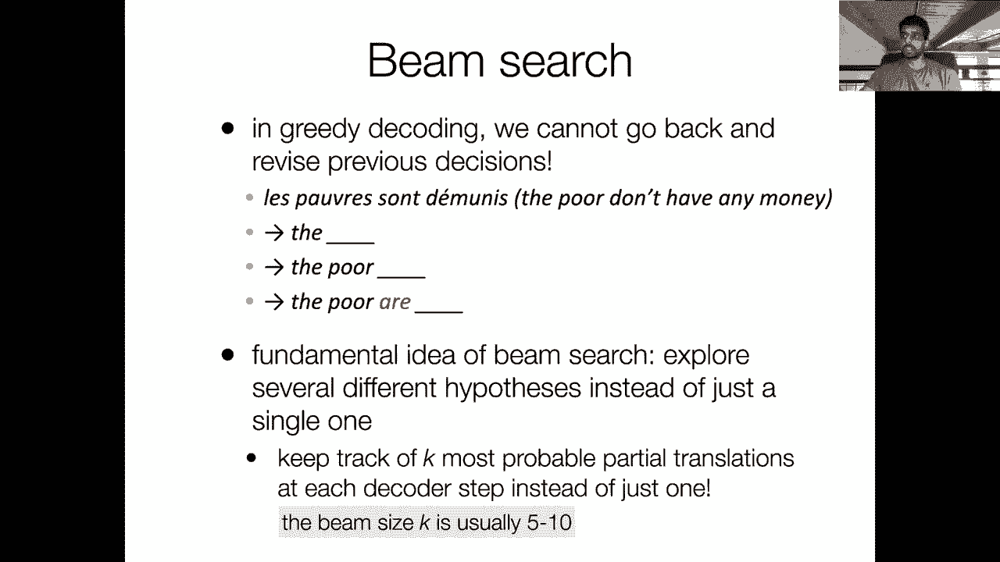

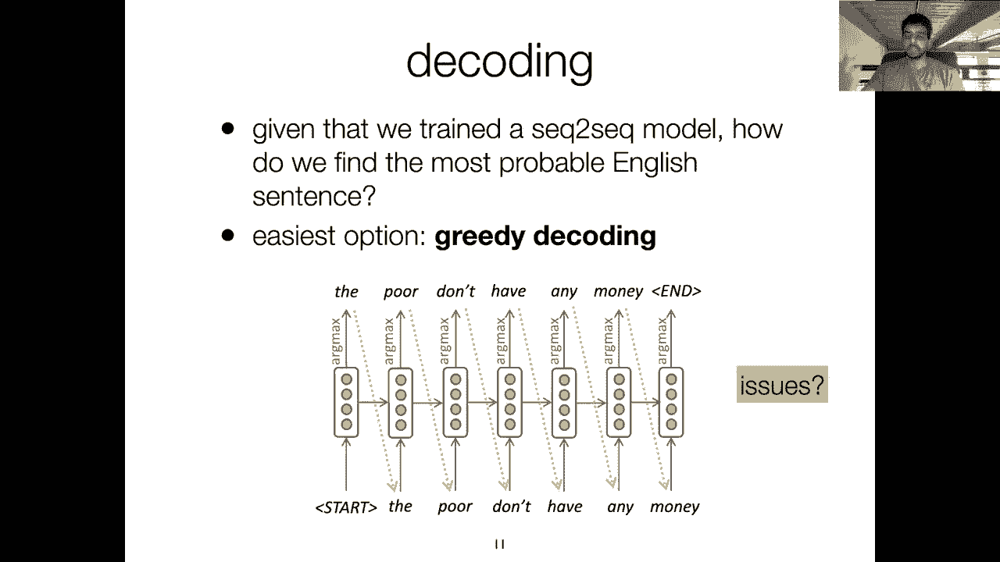

So yeah， the intuition behind beamM search is instead of just taking the RMax at every step。

 we're going to keep track of a small number k most probable partial translations instead of just one and so it's usually you know between five and 10。

 maybe but it kind of depends on your model size， your training data size and also your task。

 this could differ a lot between like translation and something like sumization or story generation or something like that。

😊。

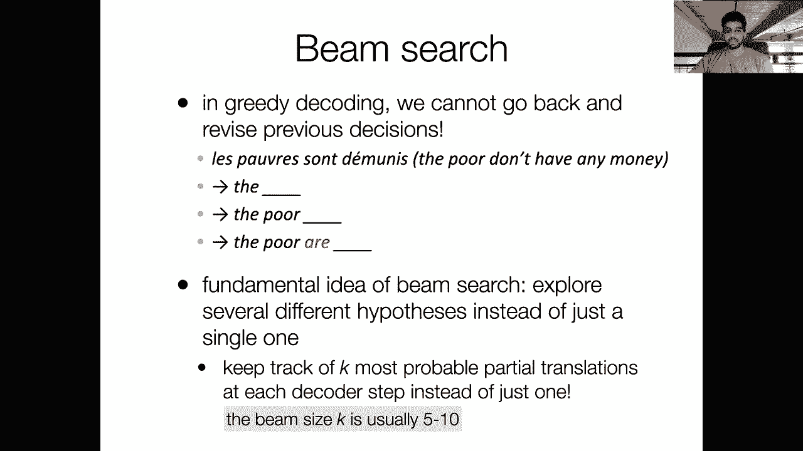

So let's walk through how beam search works and so in this example we're going to say that our beam size is two so at each step here you can think about this as corresponding to one time step of this decoder network so at the start I receive the start token and input and remember now I compute my hidden state and I compute using the softmax layer a distribution over my target words。

😊。

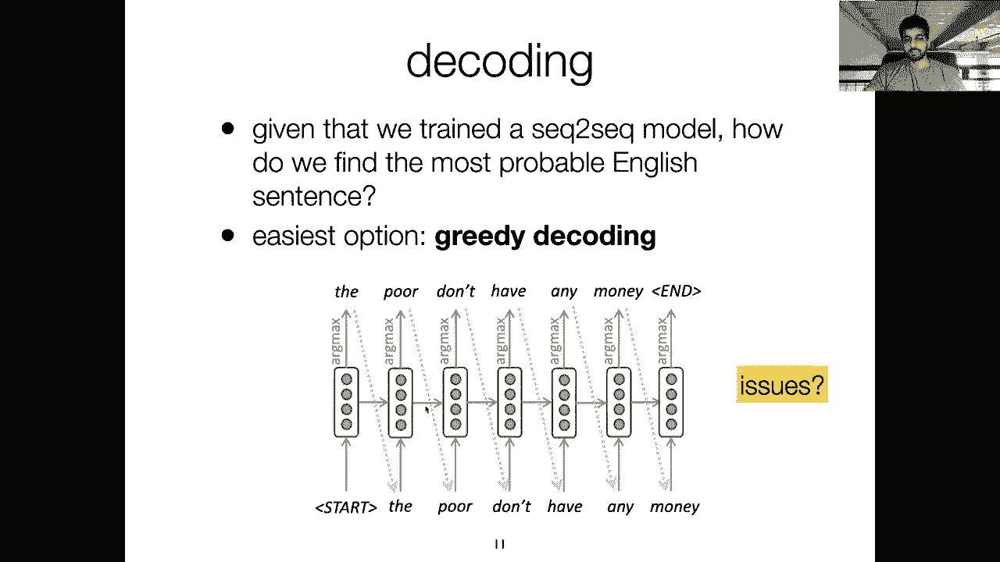

So with my beam size of two at this first step I'm going to just take the two most probable words given the start token and also of course the encoder' representation and I'm going to put them in as my two candidate translation so I have one sentence that starts with the and one sentence that starts with a so these are my two candidates at this point。

 so here we're showing the log probability。😊，Okay， so then I'm going to decode both of these paths。

 so I'm basically going to for the next time step look at the continuations for the so sorry start the and start and'm I get a predicted probability distribution for each one of these and I'm going to。

😊，Take for each one， look at the probable words and to keep my beam size2。

 I'm going to prune these candidates here， so I'm going to take the two candidates that have the most the highest log probability here。

 so that would be poor and poor， so my two candidates are now the poor and a poor a question are the values of log likelihood of the words。

 Yes， these are the logs， not the raw probabilities， of course。Now I have these two candidates。

 the poor and a poor。 I'm just going to do the same process。

 I'm going to look at the predictions for the poor and a poor。

 I'm going to take the most probable words here。 and I'm going to get the poor R。

 the poor don't a poor person， a poor but。 So a poor butt is clearly bad。

 And now I'm going to rerank these based on their probability and take the two most probable ones。

 And so this time， they both come from this top branch。 the poor R and the poor don't。

 So we're no longer considering any path that comes from this lower branch。

 this has all been pruned out and it won't be explored further。

 So now the only sequences that we're exploring are start the poor R and start the poor don't。

 So again， we get these two probabilities。 sorry， we。

We get the output of the softmax layers for these two sequences and we are going to do the same process and so on until eventually we come up with the final most probable translation that we get out of this beam surge。

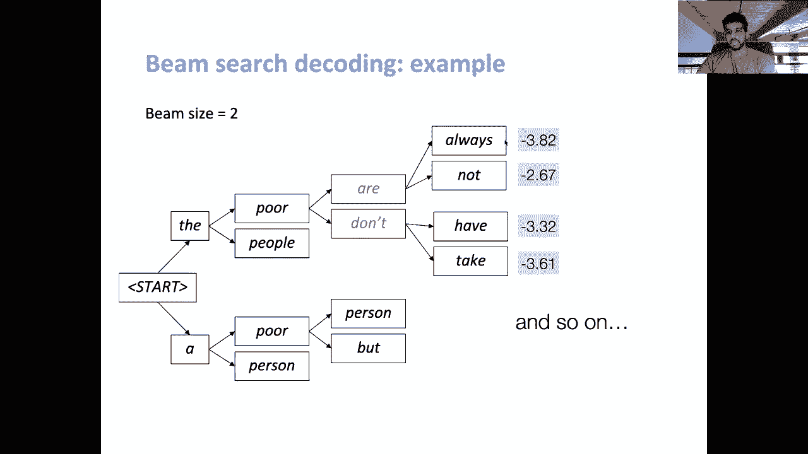

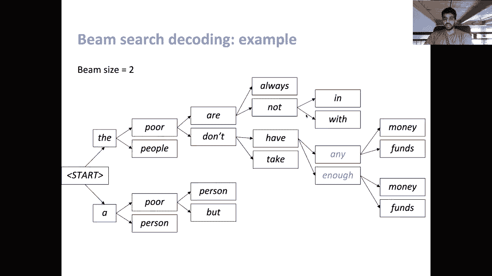

So it's very intuitive， it's simple to implement and for translation at least it results in higher quality outputs compared to greedy search。

 but there are some limitations of beam search so first of all we should consider does it always produce the best translation like does it compute the Argmax？

😊。

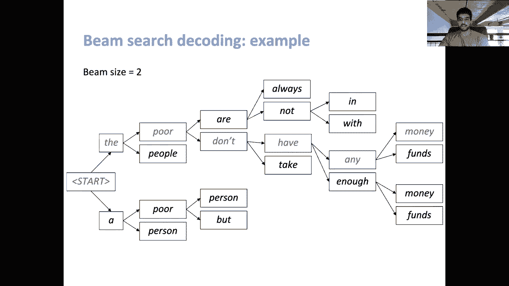

So usually I allow students to come up with answers to these questions but in this case I'm not oh okay so before we get into that there is a question why did we stop considering the lower branch so I was referring to the lower branch as anything starting with the word u and you can see that at this particular stage in this example the two most probable candidate translations are both from this first branch。

 the poor R and the poor dot right you can look at these these log probabilities and if you see here the two candidates on the bottom side a poor person and a poor but both have lower probabilities So in beam search at every stage of the process。

 I'm going to prune the candidates back down to the beam size so I always want to have a beam size of two meaning I have two candidate translations that I'm considering so。

😊。

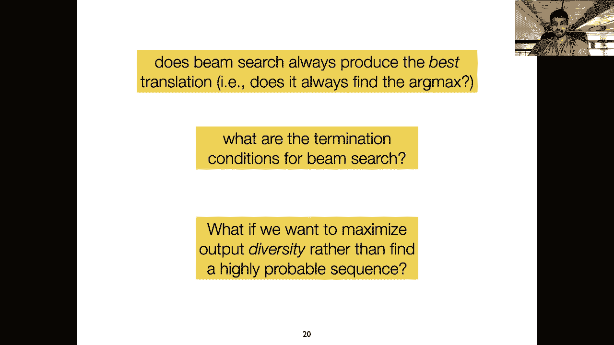

At this point， when I rera all of these probabilities。

 I find that these two are the highest and so since my beam size is two， I no longer consider these。

 I dropped them off my beam and I only expand the two most probable candidates that I have so that's why we only expand here and these ones we no longer consider because they were pruned off at this stage as they weren't as probable as these two hopefully that makes sense。

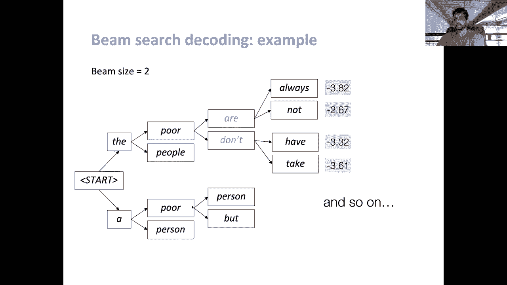

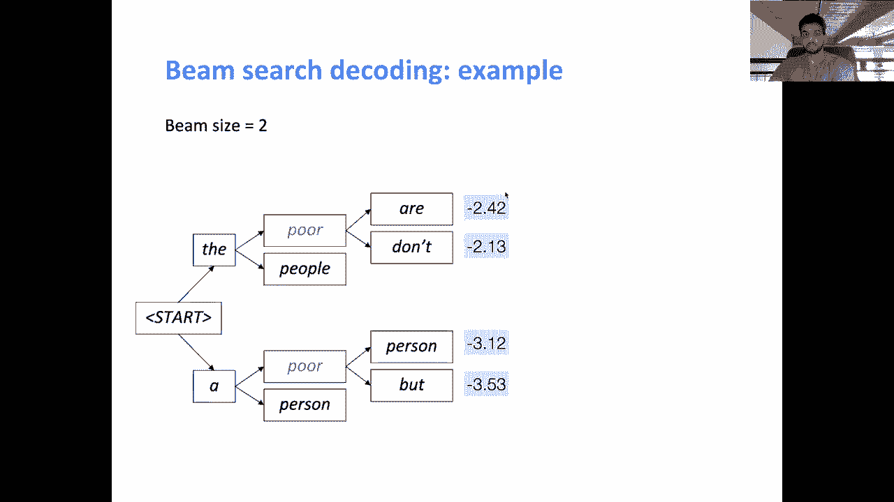

Okay， so back to this question， does beamMsearch always find the Arcmax no。

 this is a search algorithm right it's an approximate search and the search space is huge we're not considering all possible things。

 it could be very possible that some translation that started with a poor person later on ended up being the most probable translation after you decode like I don't know 50 more words。

 but since we pruned it at this stage here， we're no longer considering any translations that start with a poor person and so we're not going to be able to get that translation if it does turn out to be the most probable after some more decoding steps。

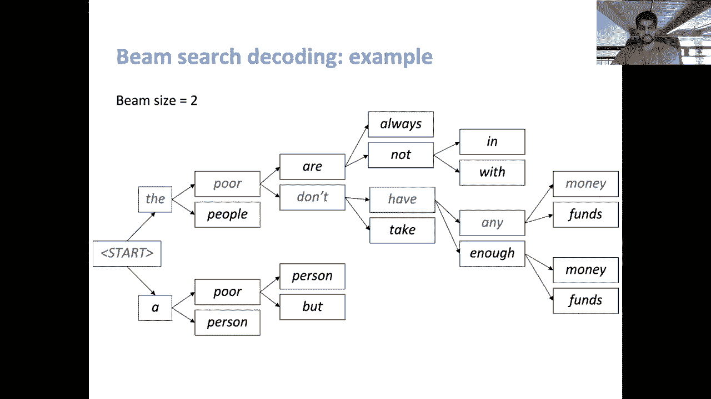

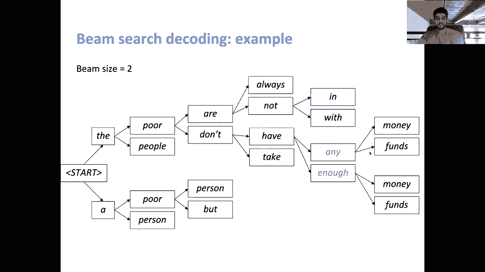

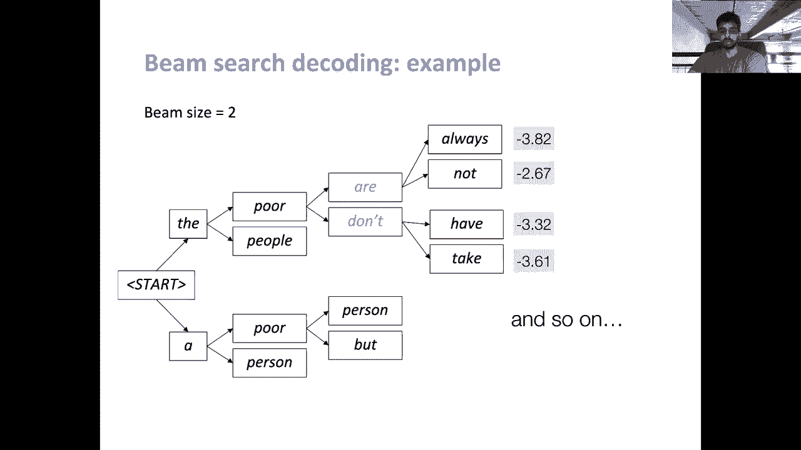

That said， it is a compromise right between the greedy search which only considers one candidate sequence and the exhaustive search which enumerates all possible sequences right at least here we're looking at a couple of different candidates even if it's still approximating the most probable translation and in practice it works pretty well。

😊，Okay， so what are the termination conditions of the beam search right。

 how do we know when to terminate this process So first of all。

 we're going to terminate any candidate translation when we reach the end of sequence token。😊。

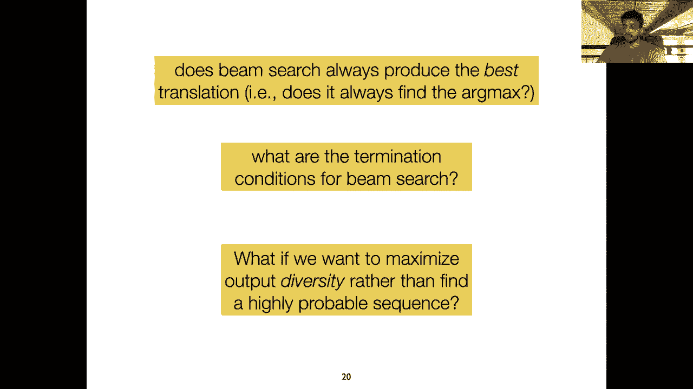

And once we reach the end of sequence token， of course we don't want to continue decoding more tokens right so then we're if there's still some other candidate that has kind of a we haven't produced the end of sequence token for that candidate but we have for another candidate。

 we're going to continue expanding the candidate that has not completed yet and we're going to prune things but always keep the completed translation the one that has terminated on the beam unless something we found is。

Is more probable than that one in which case it could be pruned。 So yeah。

 the beam search terminates once all of the candidate translations have terminated with the end of sequence symbol。

Okay， is there a probability to get equal probabilities for two predictions and if yes。

 then how do we go on to choose one of them that's pretty rare in the case where you have such a huge vocabulary I would say it's incredibly rare it almost never happens in practice。

 but maybe it could happen in some more synthetic examples if that happens you probably would just choose one at random so that's not something that you actually need to implement in your code if you're if you're implementing a beam search。

😊，It's not a practical issue。 Is a log likelihood for the next word。

 just the log likelihood for the next word。 Oh， yeah， that's a great question。 Sorry。

 I should have mentioned。 Yeah， it's a cumulative。 So this is the probability for the entire candidate translation And so this process makes it such that beam search is kind of biased towards shorter sequences right because of course。

 you can imagine as I if you expand with the chain rule， right。

 I'm multiplying probabilities with each other。 So we would expect on average longer sentences to have lower probabilities than shorter ones。

 So there have been some methods proposed to like normalize for length and stuff in beam search。

 But in general， that is something to keep in mind。😊。

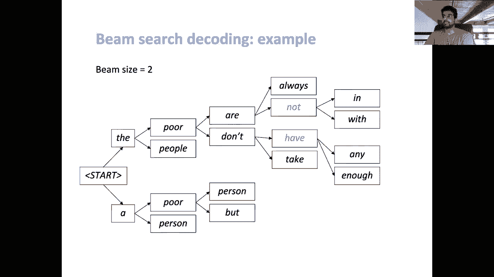

嗯。Okay， and right， the next question has been answered。

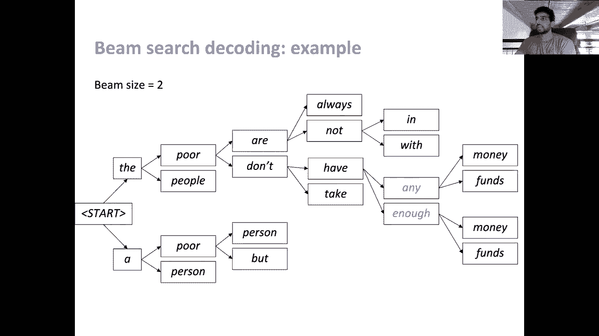

Right， because it is cumulative。

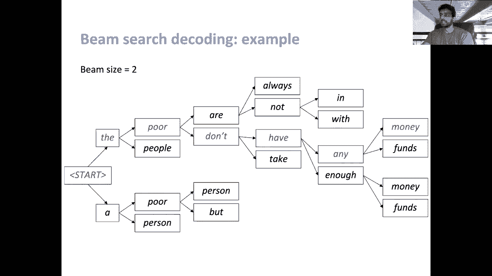

Okay， so this third thing that I wanted to discuss and this kind of segues into the next topic is in translation our goal is to find the most probable candidate translation right but in other applications of text generation we might not necessarily want the absolute most probable output we might actually want to maximize the diversity of our outputs and we might be fine with something that has a relatively lower probability but has some you know interesting words or syntactic structures or something like that so if you imagine a creative text generation task like story generation for instance。

 then it maybe doesn't make sense to decode for the most probable word or sequence。

 but rather you might want something that，😊，you know。

 is interesting or enjoyable and so there is a different class of decoding algorithms that are proposed for this kind of task。

 so not really relevant for translation。😊。

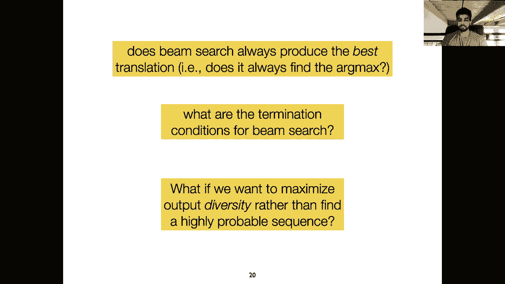

So maybe I'll come back to this and go to that and this is just samplingbased decoding so here we're not doing beam search instead we are and we're doing something that's closer to greedy search and that we have just one candidate but instead of always taking the Arc max probability of the next word were going to sample from the predicted distribution you know if my vocabulary is 50。

000 tokens if I go back to my greedy search figure here so in greedy search on'm taking the arcmax of the distribution but in a samplingbased approach I could sample from the distribution instead so if I do this I'm not always going to predict the most probable word right and is very likely that most of the probability mass is concentrated on other words that are like the rest of the vocabulary。

😊。

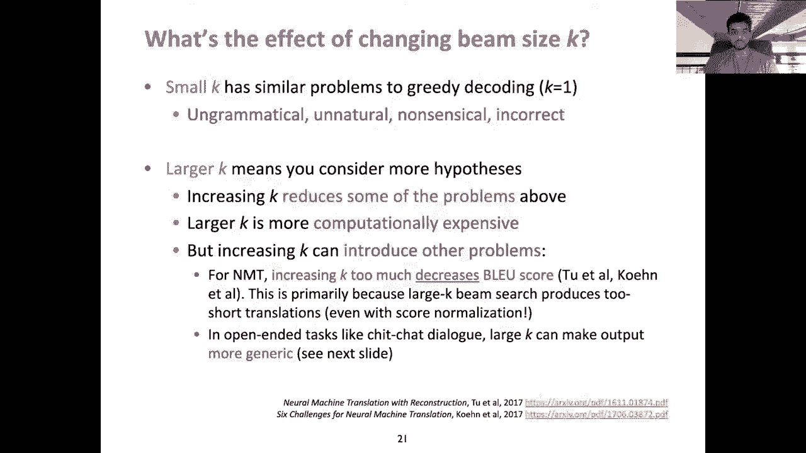

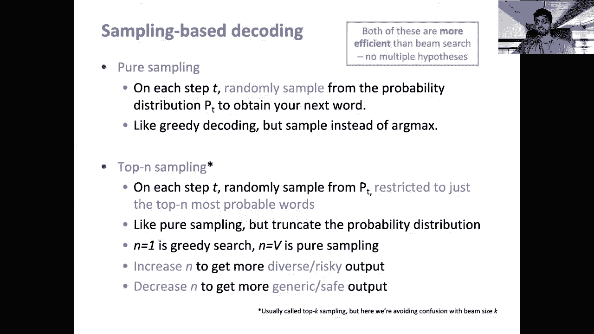

So I might have a good chance of sampling a word that's not the similarly。

 I might sample something that's not poor and so on so since this is less constrained and I could end up sampling on incredibly low probability translation if by random chance I sample some low probability word early on samplingbased approaches are not useful for machine translation however。

 there are some ways that you can modify these sampling strategies to make them kind of produce things that are probable but also diverse and so that's where we get this top end sampling in the literature it's called top K sampling but since we already to use K for beam search。

 we're going to call it top end sampling here and this is kind of a hacky approach to modify this purely sampling based strategy where at every time step I'm going to。

😊。

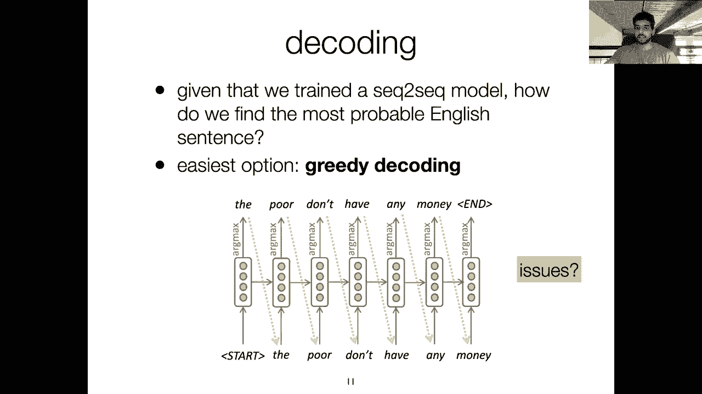

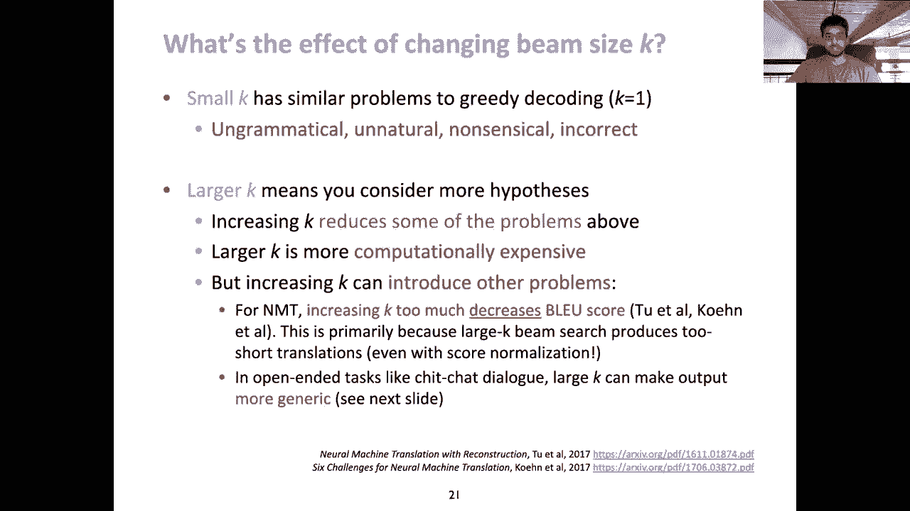

Compute my softm over the vocabulary， then take the let's say。

10 most probable words at a particular time step and sample from those。

 So in this case I am'm guaranteed to be using like some of the most probable words at every time step。

 but I still have like more freedom in what I can produce。😊。

And so you can imagine that if I set n to one here， this is equivalent to greed research。

 I'm always sampling the most probable word and if I set n to the size of the vocabulary than this becomes the same as just the pure sampling approach so if you increase the value of n。

 so you're sampling for more things at each time step， then you're going to get way more diversity。

 but at the cost of possibly getting less probable outputs which could be completely irrelevant to what you want to generate。

😊，And so this is the danger with translation where you really want to be faithful to the meaning of the input。

 so increasing these diversity is too risky and in contrast。

 if you go to something like greedy search， you're going to get more generic outputs so that takes me back to the effect of beam size because again。

 in a beam search， if you think of a beam size of one that's equivalent to the greedy decoding that we've talked about。

😊。

And practically speaking， if you decode from models using greedy decoding。

 you tend to get ungrammmatical and nonsensical continuations。

 These are kind of artifacts of the the modeling process and the I mean。😊。

Some of the issues that people have noticed with greedy decoding include repetition。

 so the model tends to repeat things that it's already produced over and over and over again。

 There' are some interesting papers on why this happens and also a very interesting recent paper on the amount of probability mass that is assigned to non-terinating sequences。

 So sequences that just the model repeats and repeats and repeats over and over again without ever producing an end of sequence token and sequences that actually terminate so if you're interested in that I'll put a link to that in on the web page after this。

😊，So the intuition behind beam search is that by considering more candidate translations。

 we're reducing the incidence of some of these issues with greedy search of course it's more computationally expensive to do beam search now we have to evaluate these multiple probabilities one for each of the candidate translations and there's also some other issues that are kind of interesting with beam search so you might imagine that increasing the value of k。

 the beam size is always going to benefit me right because I'm going to try as many possible translations as I can as I can computationally handle this will let me get the highest probability output。

😊，But this doesn't work out in either machine translation or in these more creative text generation tasks so in machine translation there have been several papers that show that if you at some point if you increase your beam size too much。

 the blue score which we're going to talk about later。

 the measure that we have of translation quality decreases and a lot of this is due to the bias of beam search to favor short translations and it's kind of hard to get rid of that even with some sort of length normalization。

😊，On the more creative generation tasks， if you increase your beam size。

 your output becomes more and more generic so as an example of that here are some responses in a chatbot using different beam sizes so in in a chatbot setting your inputs are just like what someone has like some user has written into the chat box yeah whatever and your sequence to sequence model takes as input the users utterance and outputs something conditioned on that so obviously a much less constrained task than。

😊。

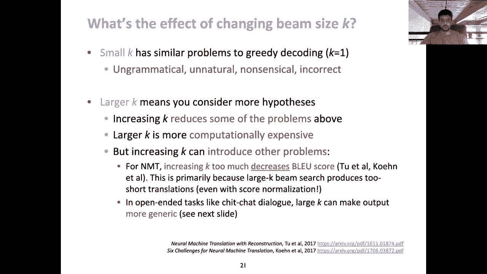

Machine translation。 So here we have this human who said I mostly eat a fresh and raw diet so I save on groceries。

 and then we have a model that's trying to respond to that。 So you can see that the greedy decoding。

 beam size of one says I love to eat healthy and eat healthy。 So this， you know， I mean。

 it's obviously repeating itself。 it loves to eat healthy twice raw food。

 I don't know why a nurse can't eat raw food， but at least it's still like kind of on topic。

 but then things kind of devolve here。 So with beam size of four， I am a nurse。 So I' am a nurse。

 no one would say this in response to this input， and you can see that as I increase the beam size。

 I get more grammatical and less repetition， but I kind of diverge from the topic。

 So do you have any hobbies just ignoring this input。 What do you do for a living and so on。

 So this is a known phenomenon。😊，These kinds of open ended generation problems。

 we really don't like using beam search for these tasks and prefer the sampling based approaches。

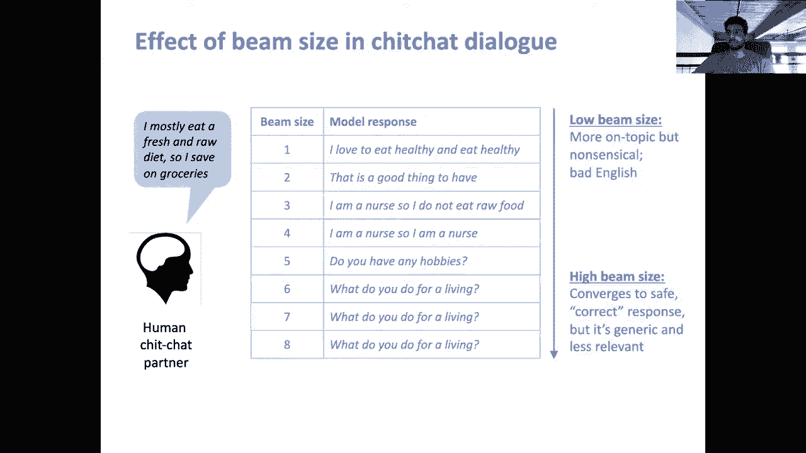

So let's take a look at some of the sampling based outputs。

 so this these examples here are from a recent paper that came out earlier this year。

 which is proposing a new sampling strategy。😊。

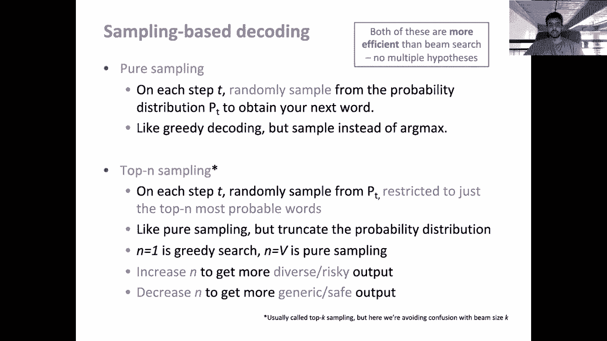

I hope you guys can read this all right， but essentially there's a prompt an unprecedented number of mostly young whales have become stranded on the West Australian coast since 2008 and so the examples in the previous slide were from an older model like maybe one or two years ago these models these examples were generated from GPT2 so not GPT3 but still like a very strong language model。

And we were just going to look at a bunch of generations using different decoding strategies。

 So with a beam search of beam size of 16， the model generates the number of stranded whales has increased by more than 50% in the past year with the number of stranded whales in the West Australian coast increasing by more than 50% in the past year。

 the number so you can see that in the text highlighted in blue here indicates repetition of the model。

 the model is just repeating something over and over and over again， and it hasn't terminated。

 So this is not what we want in this case。😊，So in contrast。

 we can look at the pure sampling strategy， which remember we are just sampling from the predicted distribution with no constraints on how many like are we sampling from the most top and most probable or not so in this case we're just sampling from the top V where v is the size of the vocabulary it says the Australian Food Safety Authority has warned Australia's beaches may be revitalized this year because healthy seabirds and seals have been on the move。

 more than 50，000 seabird， sea mammals and seahorses have been swept into the sea by the Holden CSs118 the Adelaide airport 20 and Uma datata migration across Australia is so this has nothing to do with young whales right and it quickly becomes incoherent like an airport somehow sweeping animals into the sea this is also not not great。

So now we can look at top end sampling here， top K， which again is a more more common strategy。

 And here are two different values of K。 So we see K equals 640， which is very large。

 and its it's not great。 it says pumping station number three shutdown due to construction damage。

 It outputs a URL。 and then it has something to do with whales。 So you know。

 it seems to be a little better。 maybe than the sampling strategy， but。

Is still not great When you reduce the value of k to 40。

 you get something that's at least more related to whales。

 The whale's fate was confirmed late last week when the animal was found by fishermen off the coast of Buundndaberg。

 Experts believe the whale was struck by a fishing vessel and died after being sucked into the ocean。

 and then we have it repeated again。 but this one is probably the best one that we've seen， well。

 maybe compared to the beam search one， I don't know。 it still has problems。😊，And finally。

 the approach proposed in this paper is kind of a variant of top K sampling where you instead of selecting a fixed sorry a fixed number of words to sample from like here。

 640 or 40 you instead select the and most probable words such that they form。

 say 95% of the probability mass， so you're selecting a different number of words for each time step in this approach。

 which is called nucleus sampling or top P sampling and you can see that the output here。

 there has been an unprecedented number of cabs caught in the nets of whaling stations that operates in Western Australia。

 I guess WA blah， blah， blah there are still some issues here you can see the red highlighted text those are not about whales anymore。

 they're talking about like a foul so none of these map。Is perfect。

 but with clever tuning of these sampling based strategies。

 you can get pretty high quality text out of these models。

So this is something to consider for any of you who are experimenting with language generation models or language models in your projects。

 the decoding strategy is often just as important as the training process。😊，Okay。

 so I see some questions here。 Let's take them so。If we have a beam search with k equals 2 and one terminates do we set k equals1 from then on yeah I kind of so no you don't do this。

 you are always going to expand so you're going to consider like in your other beam you could potentially get two candidate translations that have higher probability than the one that's terminated so you'd pop the one that terminated off the beam and continue with beam size of two so you don't just switch over to greedy decoding。

😊，Okay， so next question seems like the top end strategy could pull in some branches with very different probabilities。

 Do people also sample the top end most probable branches。

 but constrained within a certain probability difference。 Yeah， so I think this is。

Kind of related to the nucleus sampling approach that I just described where。Well， not really。

 so yeah， I agree that like if one word is extremely probable and the second to1th word are very low probability then it's not great if you get a sample that of course sample one of those very low probability words I'll say in general that that that tends not to happen too much mostly these probabilities are kind of well distributed across a bunch of synonymous words and in the case where there is one word that is you know obviously the next word it gets a very very high probability so in nucleus sampling we kind of address this because if there's one word that has you know 99% of the probability mass word only going to just sample that word but in a case if you know there's like 10 different words that each have like 0。

05 probability or something then we're gonna consider。😊，All of those so yeah。

 nucleus sampling is probably the way to go if you want to address this problem。

And that's the if you wanted to learn more about that。

 you can read the paper that's linked on the bottom of this slide。

Is there any ideal beam size value what factors does a beam size depend on does it vary with a change in task There's no ideal value。

 it's an empirical question you have to try out a bunch of different beam sizes on your own task it does definitely vary with your task and also with your specific data set so you could have a translation data set that even in the same language direction like maybe French to English where one data set maybe it's bigger or it has longer sentences or something like that requires a larger beam sized than another one。

 so yeah it's kind of something you have to tune。😊。

How would this generalize to different kinds of texts， say fiction or scientific papers？Yeah。

 so in scientific writing or any writing where you need to produce facts。

 you probably want to be a little more strict on any sort of sampling strategy that you're using so if I'm doing like pure sampling right I'm likely to produce a lot of incoherent or just nonsensical facts like this airport in this random number or whatever hold in CS118 is but in fiction you know maybe that's fine as long as the text is coherent in general and grammatically correct and kind of relevant that could be okay we'll talk more next week about longform text generation in the issues there with maintaining coherence and stuff like that。

 but yeah it's kind of hard to say would say，😊，The decoding approach definitely should be considered as。

Like you should pick based on your task but I can't really suggest anything more than trial and error here and I think that's what people in general do。

 So finally a question about this task on this slide this is just a language modeling task so the prefix here is this bolded text and these are just the next words that the model predicts so similar to what we saw in the last class its it's just a simple language model where we've seeded it with some content and the prefix。

😊。

Okay。Great， so just to summarize， probably never want to use greedy decoding。

 it's very rarely going to give you the best quality outputs beamm search is good for tasks like translation or maybe more domain specific tasks where it's very important to produce things with high probability and sampling methods are better for creative tasks or things that are more open-ended like chat bots or poetry generation or something like that and even within the sampling methods。

 there are variants that allow you to kind of biased outputs towards things that are more probable by using top K sampling etc。

😊。

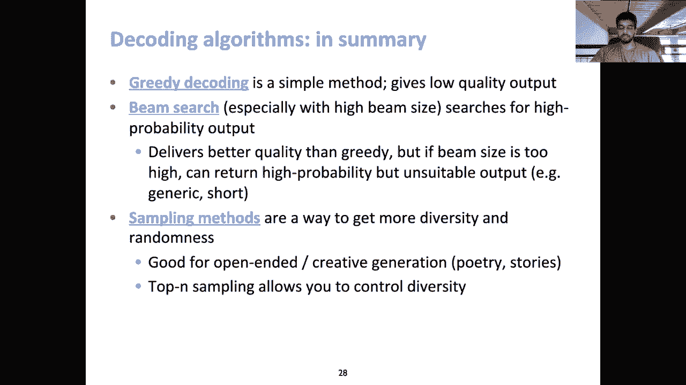

Allright， so that's all I wanted to say about decoding now I want to get to evaluation so we're going to focus mainly on translation as an example。

 but the metric that we're going to talk about here is used very commonly for many other text generation tasks。

 even in cases where it shouldn't be。😊。

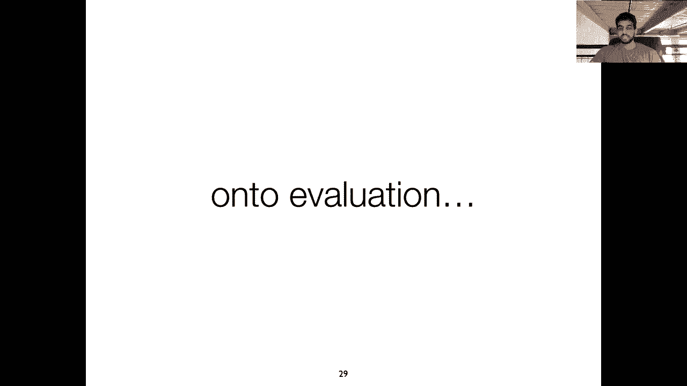

So the problem with translation and more broadly with more text other text generation problems is that there's no one right answer right so in this example I'm not sure exactly what this Chinese sentences but there are multiple candidate translations in English。

 Israeli officials are responsible for airport security is is in charge of security at this airport there's a many many paraphrases of this initial translation that could be acceptable in this case and my model is going to produce one of these using whatever strategy that I am using right beam search or greedy decoding or whatever so should I really be penalizing it for producing say one of these and not another。

😊。

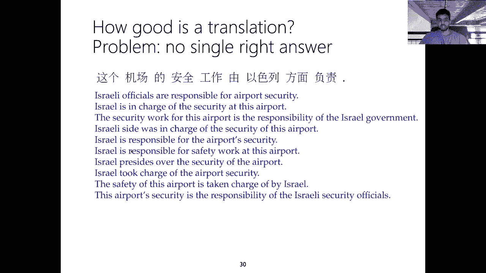

And more generally， how do I know whether my translation that my model produced is good or not？

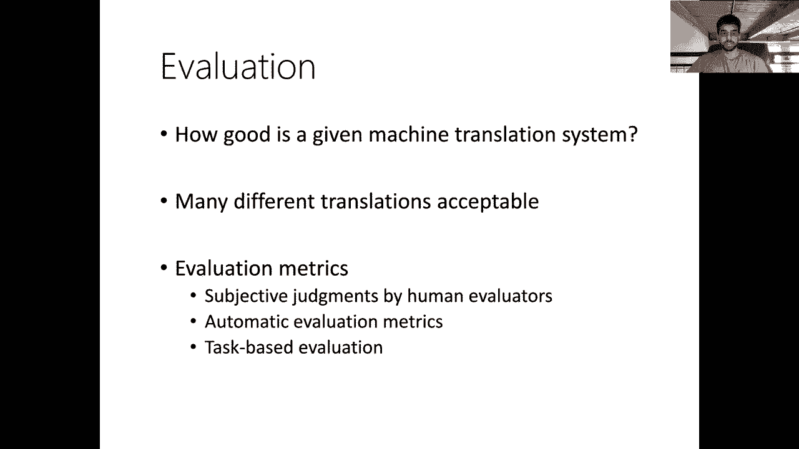

So there are two basic ways in which we want to evaluate the outputs of a translation system and also other text generation tasks and these are on adequacy and fluency so adequacy measures essentially does the output in machine translation have the same meaning as the input sentence right so if parts of the sentence。

 the semantics were dropped or some new information was hallucinated we want to give it a low score on adequacy。

The second dimension is fluency right so is the output grammatical does it look natural and yeah so that's also of course important so a translation could be adequate without being fluent right it could have some minor syntactic issues but for a human reader it could be fine you can still make out the meaning even though there's some issues with them again。

😊，Okay， it said I disconnected and has now been reconnected。

Hopefully that wasn't a big interruption to you all。So as I was saying。

 the other dimension here is fluency and you can have a perfectly fluent generated output that has nothing to do with the source sentence right so this would be bad and we would want our adequacy score to be low in this case。

😊。

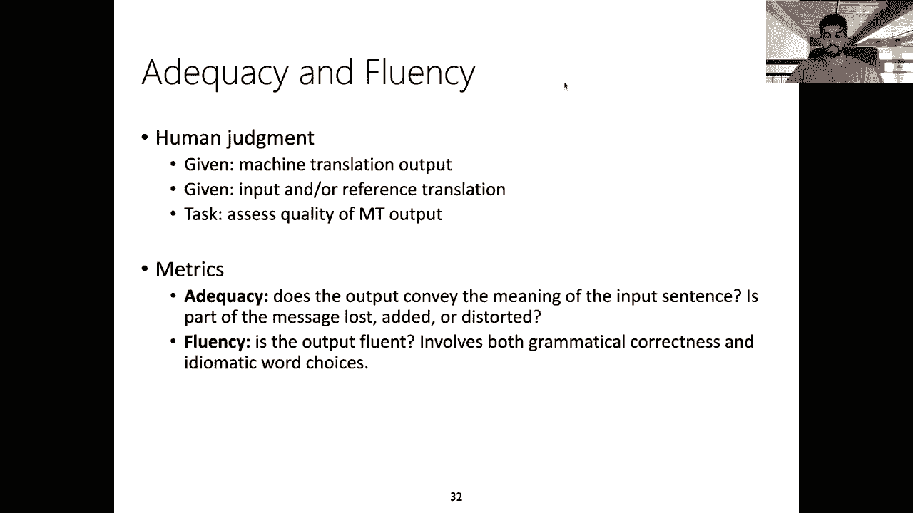

Okay， so one way you could think about doing this is performing a human evaluation。

 so in a human evaluation you would have translators who are maybe familiar with both languages and ask them to evaluate the model generated text on both of these dimensions using some sort of scale right so these are some examples from one to five rate how adequate the text is and how fluent it is。

😊。

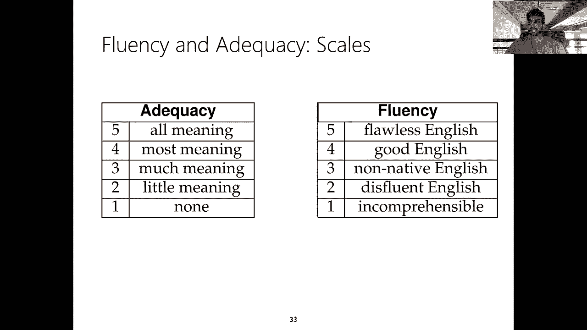

And so you can， you know， devise some interface like this in which humans can rate candidate translations。

 especially you can make it easier for them by giving them a reference translation。😊。

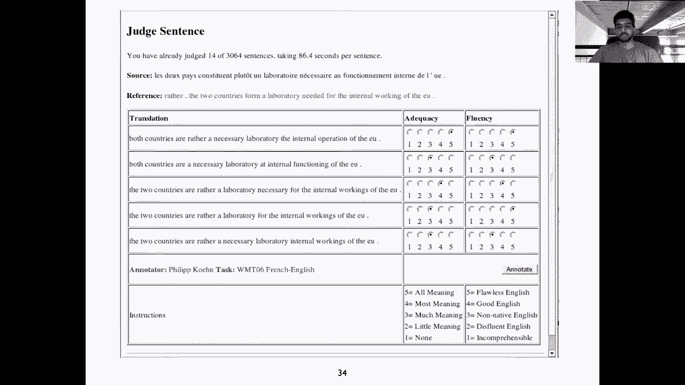

So yeah， at this point I would allow you all to vote on these translations。

 but let's just go through some of them。 so we have this French so sentence and the ground truth translation here。

 the reference is is there not an element of hypocrisy on your part。

 and so we have three system outputs here， system one would it not as a wave of hypocrisy on your part so this seems not very fluent and maybe also not adequate like a wave of hypocrisy doesn't seem to be conveying the same meaning。

 although you can probably roughly tell what the meaning here is。😊。

So maybe I'd give this like a three or four on adequacy system too is there would be no hypocrisy like a wave of your hand This one doesn't seem adequate at all a wave of your hand was just inserted in here and it's also not fluent is there would be as obviously ungrammatical and is there not as a wave of hypocrisy from you So like these would be examples where you know this is a subjective task right what does it mean to be three on this adequacy scale as opposed to four So you would want to have a lot of rateers and compute their you know agreement or average score or something like that。

😊。

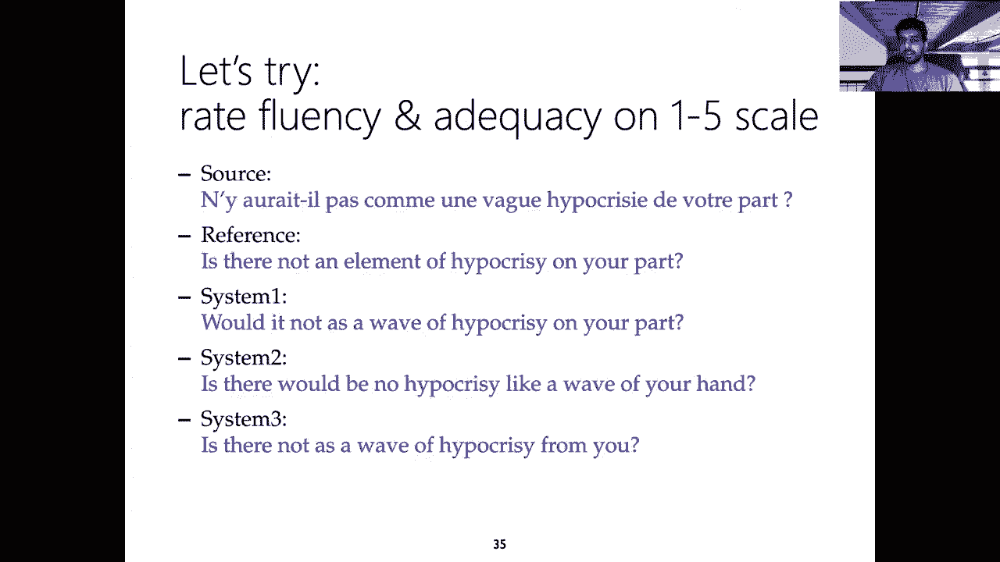

Of course there are many issues with human evaluation of generated text in addition to it being subjective。

 it's also very expensive right so I can't actually expect my human evaluators to evaluate like millions of model outputs and I don't want something that takes up a lot of time as well so I want ideally some score that is a cheap and free and has the least time investment possible for me to decide how well my model is doing and that's why we kind of turn to automatic evaluation metrics。

😊。

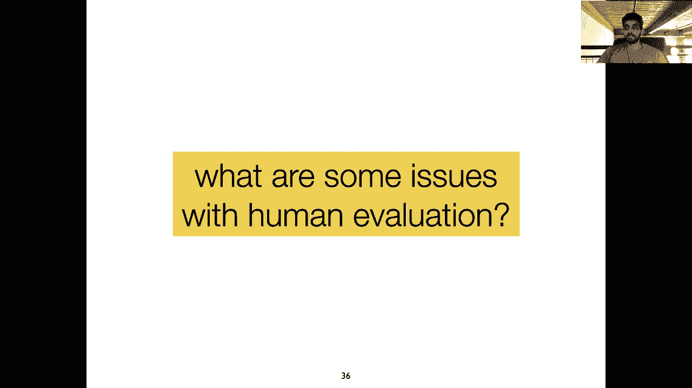

So here we have some sort of automatic computerized way of evaluating the quality of a generated text and one way you could think about doing this is just simply calculating the precision and recall when compared to some reference sentence so here if my system produced Israeli officials responsibility of airport safety and the ground truth translation was Israeli officials are responsible for airport security I could just look at word level overlap right so。

😊。

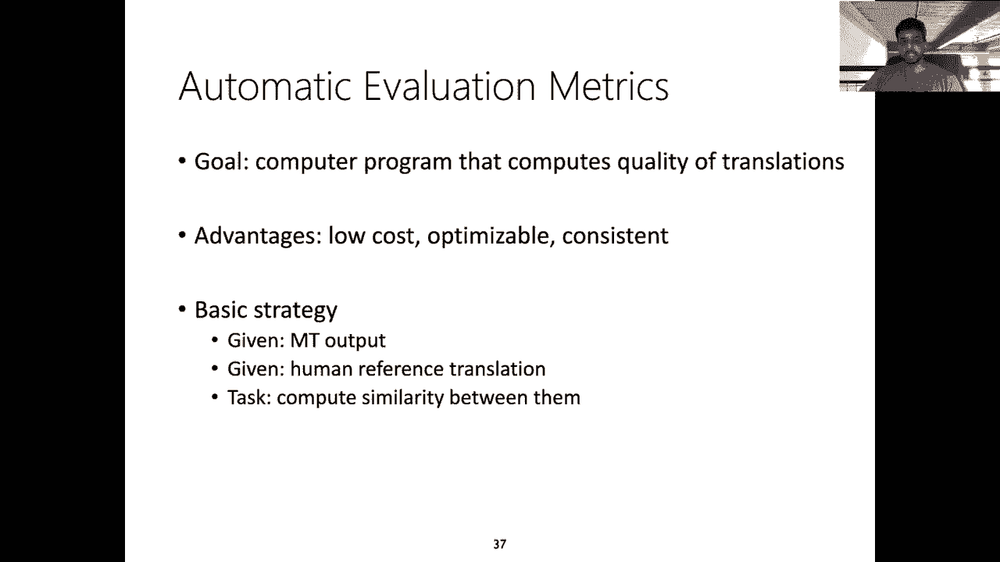

In my system output， I see Israeli officials in airport are all words that occur in the candidate translation。

 so when I compute my precision， I get 50% precision because these three words were not present in the reference。

 I can compute my recall， so how many words in the generated text were sorry。

 how many words in the reference were present in the generated text and then I can do some aggregate of these compute the F score to get some idea of how my model is doing。

😊，But this is not a great way of evaluating these translations right because it doesn't consider the order of the words at all。

 and so that might be bad if I'm interested in also measuring fluency， right？😊。

So as an example of this， I have two system outputs here。

 Israeli officials responsibility of airport safety and also airport security Israeli officials are responsible。

 so I think here we would like to say that I mean it's a little unclear which one of these is better。

 but if you use the metrics that we've defined here which simple precision in recall of the words system A is scored much lower than system B and system B actually achieves 100% F measure on this task。

😊，And that's not good， right， because system B is not generating a fluent piece of text。

 it actually generates this fragment airport security period。

 and then Israeli officials are responsible。 So oh， that's not a period anyway。

 this is not a grammatical sentence and there's no way this this should be。Getting 100 per。

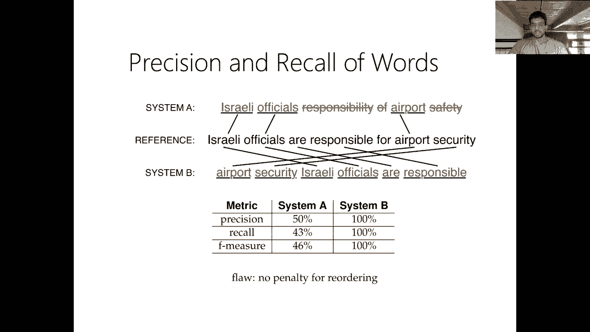

So this issue kind of motivates the metric that is most commonly used in machine translation。

 which is the blue score and so blue stands for bilingual evaluation understudy。

 it is very similar conceptually to what we just described except we're going to be calculating the precision of ngrams。

 not just unigrams or single word so the idea is that if I'm considering ngrams from size1 to four。

 like a foregram to have a matching foregram that means that at least some local syntax is matched here。

 and so I get some representation of fluency beyond what I get from just single word matching。😊。

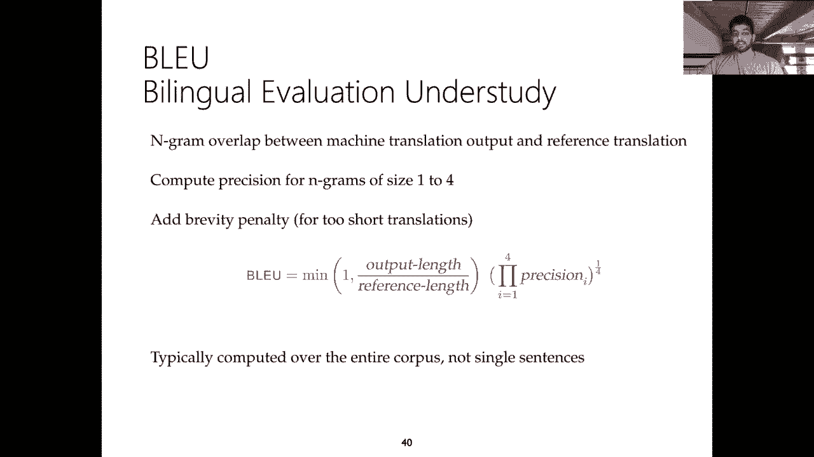

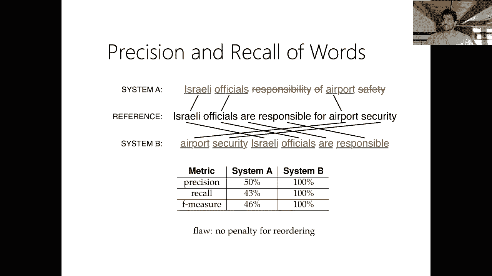

Okay， so in the blue score we don't actually explicitly encode the recall so if you remember here we computed the recall of these words here we're going to add this brevity penalty instead which is going to penalize translations that are too short so we're going to take this geometric average of the ngram and precision going from one to four that's described here and then we're going to multiply it by this brevity penalty as well that penalizes translations that are too short and so one question you might have is why do we do this brevity penalty thing instead of just computing the recall and then using the F score as our measure。

😊。

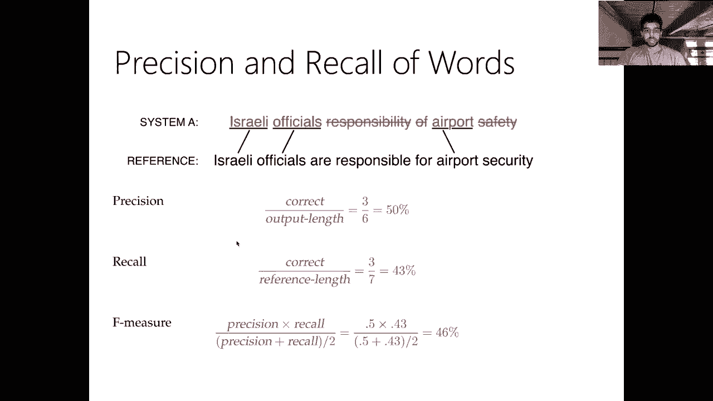

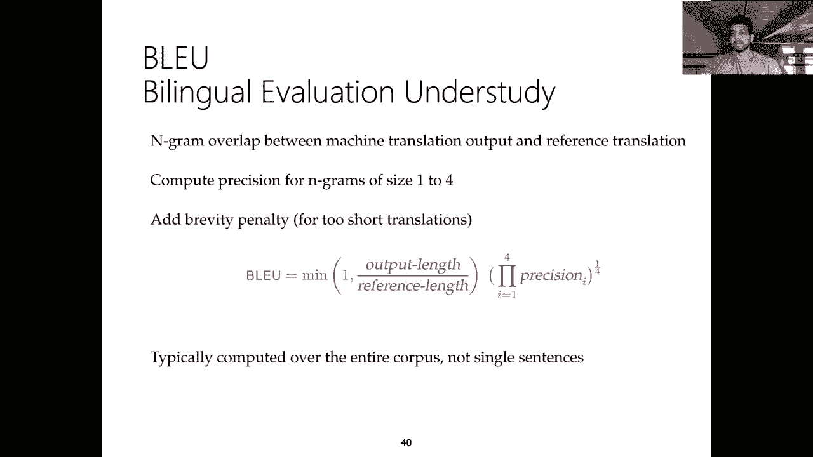

And the reason is that blue is designed to work with multiple reference translations。

 So as we mentioned before， there's not just one single translation that is like the the best one and no other translation is adequate There's actually several adequate paraphrases of a single translation So if you have a data set with multiple references。

 So in this case here I have four different reference sentences for this translation I can actually compute my precision using all of these references right so here I see Israeli officials is matched in this first sentence。

 So I get a bigram match that counts for my blue score this bigram responsibility of was matched in the third reference。

 I get some points for that Air was matched here。 unfortunately I don't have any forgram matches right Israeli official responsibility of。

😊，ã‚？That doesn't occur in any of these references， so I don't get points for that。But yeah。

 if you look at the precision here of these different ingrams， you see that system A here。

 this one gets zero because there's no matching for gras right so I didn't actually get to match any of the Israeli officials responsibility of or official responsibility of airport or responsibility of airport safety。

 none of these were matched in my references， so I don't include them。

 I get zero points for for gra precision and as such I have a0% blue score。😊。

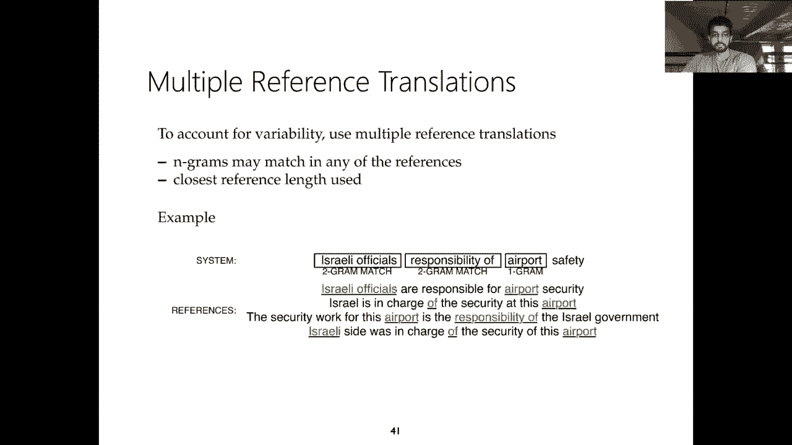

System B on the other hand， actually does contain a foreground match， Israeli if responsible。

 you can see that here Israeli officials are responsible occurs in the first reference and so it gets a blue score but remember that our previous metric here was giving it 100% and we see that the blue for this this sentence generated by system B is 52。

 so it's saying that this translation is not perfect it still has some flaws which as we can see it clearly does。

😊。

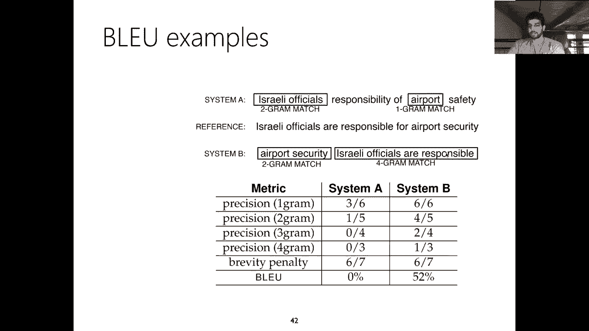

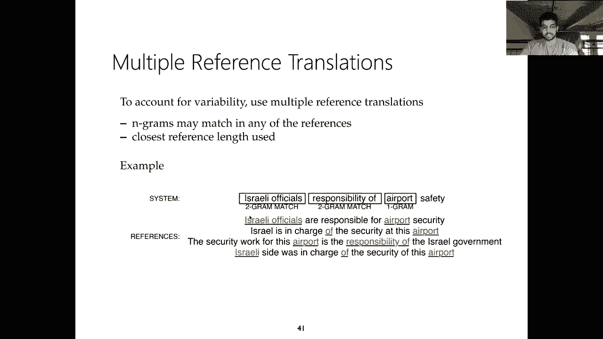

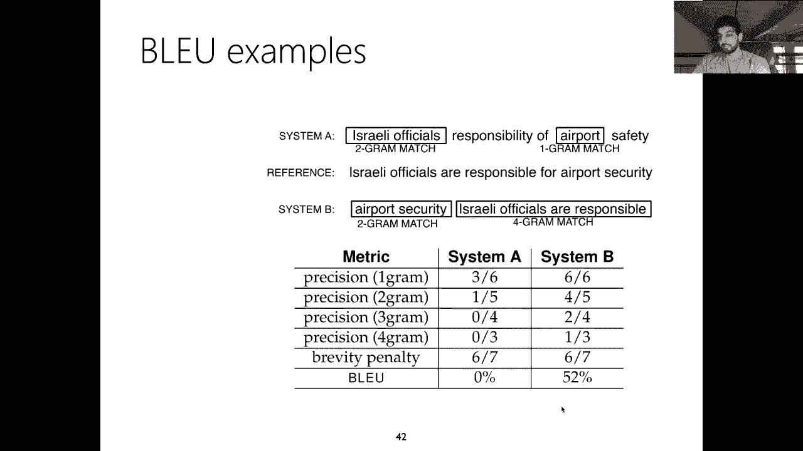

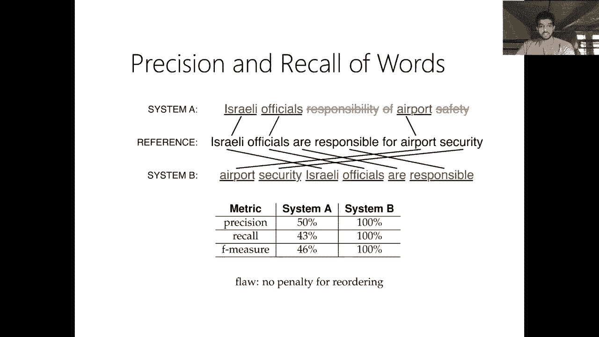

So recall in this setting is hard to compute because we have multiple references， right so it's。😊。

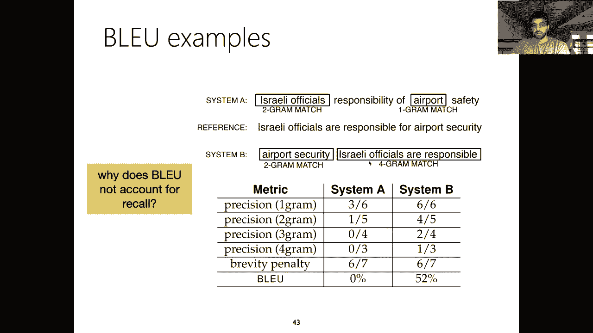

There's a lot of wind。It it's a little unfair of us to ask the model to match every single ngram that occurs in every single reference right that that's unfair。

 we only have a single translation so it doesn't make sense to include recall as part of this computation。

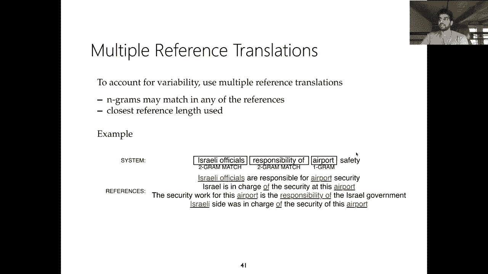

嗯。

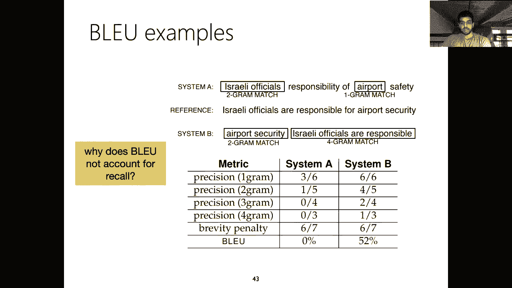

Okay， great， so that's blue and one of the downsides of blue is that it treats all words and ngrams as equally relevant and meaningful when certain ngrams or certain words might be much more semantically informative than others so this is one issue and another thing is it's still operating on this local level so the biggest contiguous。

😊，I don't know if you guys can。然呃。Okay， just like a hailstorm。I may lose power， I don't know。Okay。

I guess I will wait until this stops for。Continuing。All right， that was。Crazy。Back to blue score。U。

So I， as I was saying， the。What was I saying right。

 we're only looking at the max of a foreground here。

 so we're not considering like the global sentence coherence in blue and human translators also score fairly low on blue。

 which indicates that maybe it's not perfect。😊，All right， so some questions。

Why are part of speech tags not a part of these metrics or are there any that do include part of speech tags it's not clear that part of speech tags are a useful way of evaluating the generated text I'm not sure how you would incorporate that into something like translation quality。

😊。

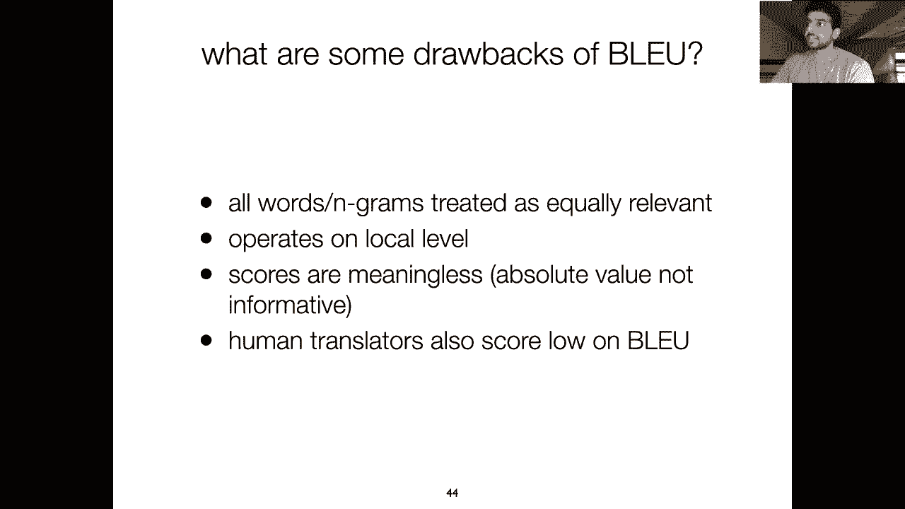

What would you use it for has the model generated the right number of nouns and verbs。

 maybe that could be a reasonable thing， but in general you care more about the actual words themselves that the model is producing right for example here if I produced like submarine instead of airport I would get the same part of speech tag but the meaning is completely different so yeah in general we don't incorporate part of speech into these evaluations。

😊。

And Andy asked， you usually have parallel data with multiple references。

 yeah sadly no you don't blue is designed for this ideal setting but most translation data sets have just a single reference translation and in other tasks like story generation or whatever you have also just a single or like chit chat you have a single reference。

 so yeah it's really designed for multiple references but we normally use it with just a single reference。

😊。

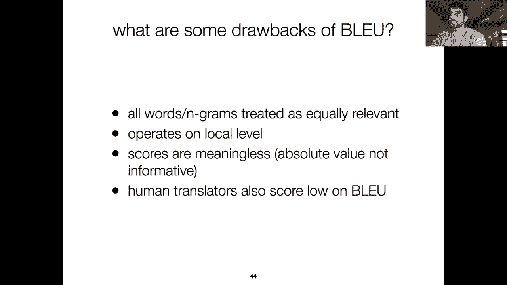

So yeah， it has many flaws but people have shown that it does correlate with human judgments。

 which is why people still use blue， it's also very。

 very easy to implement their standard packages that you can use to measure a blue score。

 so yeah overall it's a good thing to do。

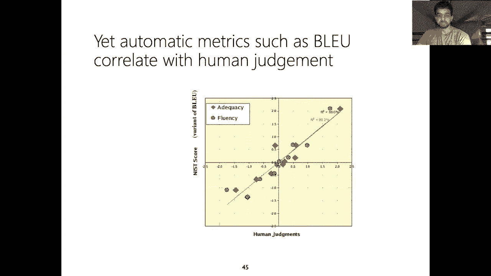

Okay， so just to conclude really quick here， I don't know for how much longer I'll have power the way this is going。

😊，One thing that more recently people have been looking into is trying to get some of our more fancy models like BerRT and these other huge scale language models into the evaluation process right because we know that these models have you if not。

 they don't understand language， obviously， but they certainly are doing something that's more complex than simple Ngram matching or word matching。

😊。

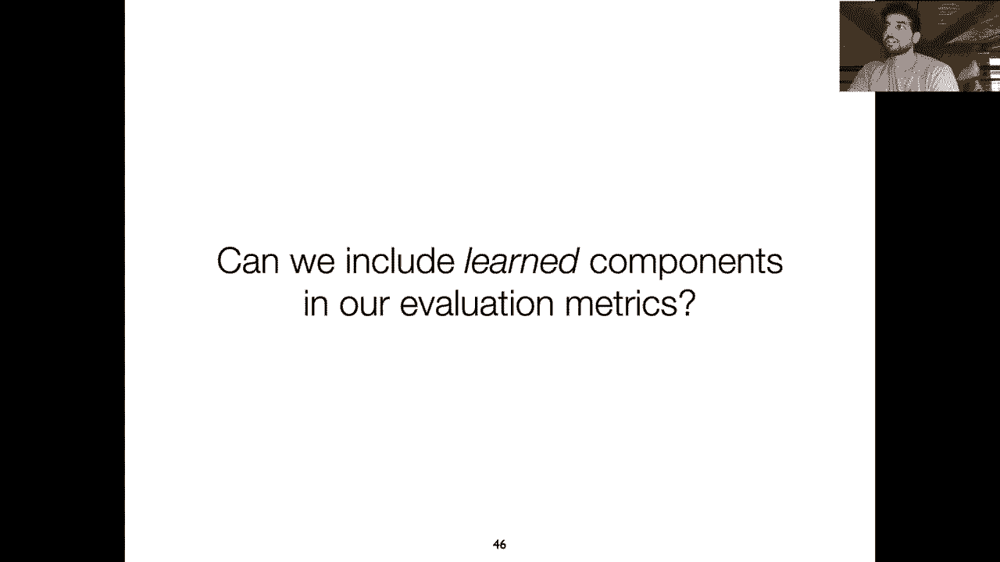