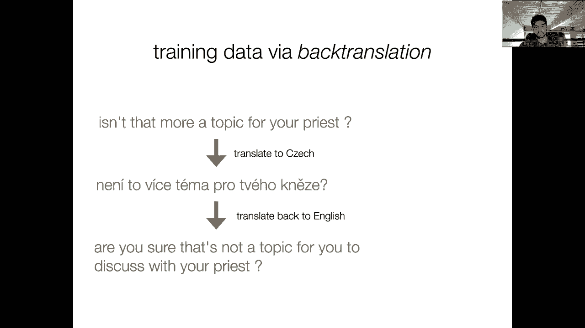
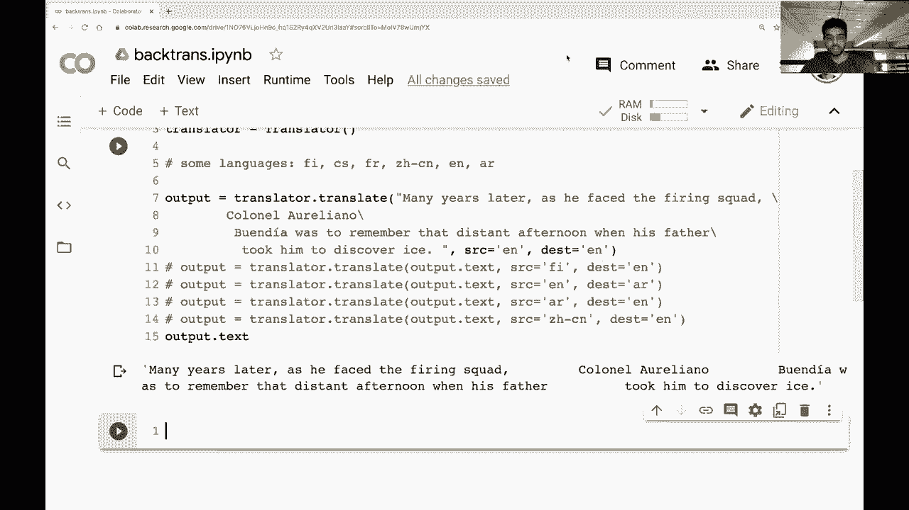
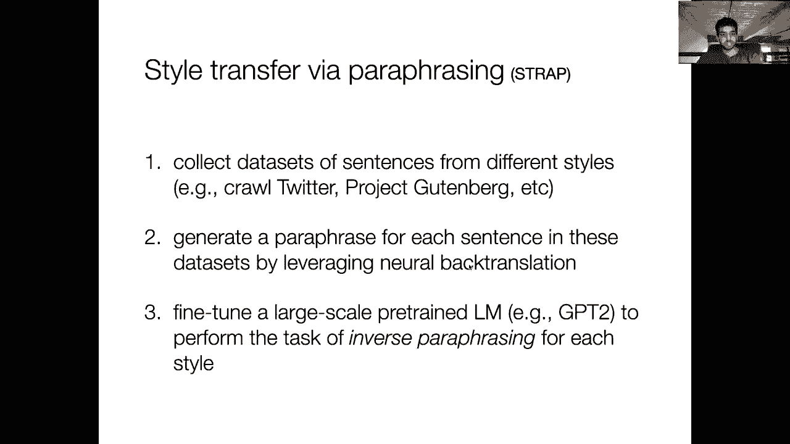
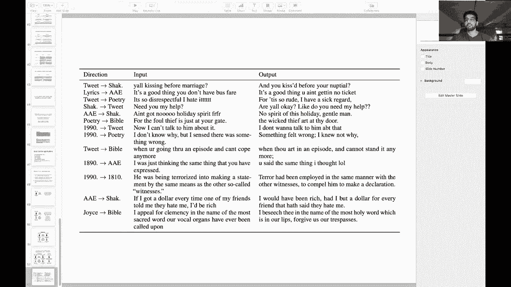

# 【双语字幕+资料下载】马萨诸塞CS685 ｜ 自然语言处理进阶(2020·完整版) - P16：L13- 释义生成 - ShowMeAI - BV1BL411t7RV

All right， hey Ri， I think I'm live so today we're going to be talking about paraphrase generation and a couple of its different use cases so we're going to talk about using paraphrases to produce adversarial examples and we'll go over what that means shortly we're going to talk about using them for data augmentation and you'll also see instances of that in your homework and finally we're going to talk about using paraphrases for style transfer so paraphrase generation is really quite an interesting and upcoming area and LP research so it's I think pretty important to learn about at this point。

😊，It also ties nicely to some of the things we talked about last week related to machine translation and evaluation so right。

 as usual if you have any questions about logistics stuff or。😊，The material。

 write them in the chat box。So homework one was finally released I would highly recommend starting early there's we tried to make it such that you don't have to do a lot of implementation yourself there's quite a lot of scaffolding code that you can rely upon and。

😊，We originally had， yeah a lot more implementation than what currently is in the homework。

 but that said， I think this will be useful for many of you who want to play around with these models in your project to get a sense of how to use them and some different ways of applying them to different tasks。

So。Yeah， we release the homework。 It's due October 28。

 so we give you a couple extra days over two weeks to to finish it。

 The exam now has an official date of November 5 and 6。 so the plan is we will release the exam。😊。

On November 5th and give you 48 hours to complete it。So。Yeah， again。

 it'll be open book and open internet and everything， although yeah no collaboration。

And you'll get more about that over the next couple of weeks。

Okay so let's get into the topic of the day， which is adversarial examples， paraphrases and so on。

 So before we start， we need to at least define what an adversarial example is So a common task in computer vision is image classification and that's where this whole line of work kind of aose and now has made its way over to NLP but a way of kind of diagnosing your models and seeing if they're able to you know be as robust to natural image inputs as humans are is to do something like the falling so first of all。

 we take this image of a panda the model predicts the correct label for this panda with you know 60% confidence and then the classic setup in computer vision is you add a very tiny amount of noise to this original image such that the resulting。

😊，To a human eye is it looks identical to the original right we added a tiny amount of random noise we can't really tell as humans what the difference between these two images is but for neural network image classifier。

 the second image here gets predicted as a givenbb with 99% confidence so it's obviously not working on this adversarial example even though as humans we know that this image still contains a panda in it right so we would like to design models that are robust to this kind of these small。

 imperceptible perturbations in the input。😊，嗯。So the interesting problem then is how do we do this for text right in images we have。

 you know， an image is just a bunch of pixels and these have you know numerical value so I can add actually a small amount of noise to each pixel and I'll get a new image's output。

 but how does this work for text right， I have some sentence and I can't just like naively add noise to it right that doesn't make sense。

😊，And so just to kind of motivate this problem of adversarial examples for NLP right I just forget for a moment about how we produce these things。

 they do exist and their prevalent even with the huge scale models that we've seen up till this point in the class so I wanted to introduce task that we haven't talked too much about the semester just because it's a good example for the kinds of adversaries that we'll be talking about。

 so textual entailment is basically a pairwise sentence task in which we're given two sentences and were asked whether the first sentence implies the second sentence as an example in this visualization comes from the Aen NLP demo we have two sentences they're called a premise and a hypothesis so two women are wandering along the shore drinking ice tea So this is our first sentence。

😊，And then the second one is two women are sitting on a blanket near some rocks talking about politics and we're asked to judge whether the second sentence is implied by the first sentence or not。

 obviously in this case the first sentence kind of contradicts the second one right because the first one says the two women are wandering the second one says they're sitting so this is a Roberta classifier trained for this task it correctly judges that the second sentence sorry I've got my sentences backwards the premise is here contradicts the hypothesis so the first sentence contradicts the second one。

However， this model doesn't work perfectly。 and I had made these slides like last year。

 where the model on Ellen NLP was not using one of these huge scale language models。

 but I tried it again today just to update these models and I'm using this model is a fine-ted Roberta。

 So it is basically the state of the art。 And if you give it a premise of the dog ate all of the chickens and the hypothesis of just chickens。

 It says that the premise entails the hypothesis right even though this doesn't make any sense these two。

 first of all， the hypothesis is not even a reasonable sentence and second of all。

 it definitely does not follow from the premise which involves the dog and eating， etcter。😊。

As another example， this， again， with the Roberta model。

 we have the red box is in the blue box and the hypothesis sentence of red is blue。

 and the Roberta model judges that the premise sentence here entails a hypothesis sentence。

 these sentences obviously to a human， right， Chis and red is blue。

 we know just without even thinking that they're not even close to being the same thing。

 the semantics of these sentences are completely different， but for a model， it's not so clear。

 And one possible reason is that the model hasn't been trained to see examples of negative sentences or neutral sentences like this。

 right， Chiickens is not a wellform sentence。 possibly red is blue is out of distribution for this data set it might be much shorter than other sentences。

 It's also kind of a。Yourd sentence that doesn't really make sense but。In any case。

 the model should judge this as if anything neutral， right。

 so it's not behaving the way a human would when confronted with these examples。So in general。

 adversarial examples has been a popular topic in NLP since about 2017， so it is pretty recent。

 again it followed from the foundational work in computer vision。

 but there have been workshops dedicated specifically to developing these adversarial examples that break existing models。

 and you can do this in several interesting ways， this build it break it workshop focused on creating adversaries that are kind of linguistically interesting perhaps you come up with some syntactic construction that hasn't been seen before in the models training data in the Roberta case we would have fine tuning data obviously。

 so yeah maybe in these cases the the training data is insufficient to capture all of the interest。😊。

linguistic variation that might be associated with a particular task and also we know like from many different results that our NLP systems are quite brittle。

 especially with kind of rare constructions， rare words。

 things like that and human language users on the other hand。

 are very robust to even things that they haven't seen before。😊，Okay， great。

 so so far I see no questions in the chat box， which is fine。

 but I'm not sure if it's working or not because it has not worked in the past。 So yeah。

 anytime anyone has any question just again， feel free to write。Okay。

 so let's move on to how we might create an adversarial example in the NLP context。

 so probably the dumbest way possible to think about this is to just do synonym replacement right so I could take up theaurus or something like that and pick a word in my input sentence and then replace it with a synonym。

😊，So we have here exactly the kind of unexpected delight one hopes for every time lights go down。

 this is a sentiment analysis example and the model predicts positive。

 but and this is a real adversarial example， if you replace the phrase unexpectedex delight with thrill。

 the sentiment model predicts negative here even with this very simple method of just doing simple synonym replacement。

 the model gets confused。😊，There is another class of adversaries called syntactic adversaries。

 So in this case， we don't prioritize lexical substitution。

 So lexical is referring to this word level modification。

 here we're going to change the actual structure of this sentence。 So here we have a sentence。

 American drama doesn't get any more meaty and muscular than this which the model predicts as positive。

 But when you restructure the sentence。 So you put this part here first。

 So doesn't get any more meaty and muscular than this American drama the model the sentiment model predicts negative sentiment here。

😊，So one thing that we might want to do is figure out for any given model what is a set of adversarial examples on which humans have a very easy time making a prediction but the model fails and once you have this set of examples。

 you can imagine augmenting your training data set with these adversarial examples such that the model is retrained or fine- tuneuned on these adversarial examples with the idea that if it sees them during training。

 then it won't get them wrong again when we go to test it。😊。

So you can imagine this kind of iterative process where we create adversarial examples for a given model。

 we retrain the model on its original data set plus adversarial examples。

 and its robustness will increase and we can repeat this process as long as we wish。

So if we want to combine both of these things together。

 like lexical adversaries and syntactic adversaries。

 and we want to do this without you know relying on some external rules or thesaurus。

 we might want to reformulate this task as one of paraphrasse generation。So in paraphrase generation。

 we take an input sentence and we want to produce an output sentence that has the same semantic meaning as the input。

 but might have some sort of diversity either lexically or syntactically or both。

So what are the qualities of a paraphrase model that introduces some sort of syntactic diversity into these paraphrases We obviously want them to be grammatically correct and fluent in whatever the language of the input sentences right and not only should they be fluent but they should also be retaining the semantic meaning of the original input sentence so if they're producing something that's completely diverges from the meaning of the original sentence that it's no longer a paraphrase and we can't really call it an adversarial example because we're not going to be able to preserve the label associated with that sentence right so I know that this second sentence has the same label as the first sentence because it's a paraphrase of the first sentence right so I know that the model when it gets it wrong that this is something to be concerned about because this one should have the same label as the original sentence。

😊，う。So I might also want to improve diversity right I might want to do a lot of this kind of reordering with the idea that the model might not be robust to certain constructions。

 it might not have seen you know this syntactic construction that many times compared to this more standard simple sentence here。

😊，So as an example of the kinds of paraphrases that we might want for an adversarial example generator。

 if we have the sentence， usually you require inventory only when you plan to sell your assets。

 just some examples of things that we might want are usually you required the inventory only if you were planning to sell the assets。

 So here we've added a comma， which kind of changes the structure here or this more significant reordering。

 when you plan to sell your assets， you usually require inventory or you need inventory。

 when you plan to sell your assets。 there are many different ways I could phrase this sentence。

 And we saw something similar to this with the。😊，Machine translation evaluation， right。

 We saw that there's not just one single reference translation， right， But there's rather many。

 many different paraphrases of the reference that could all be valid translations。

 And so we might want a metric that evaluates a system output against all of the reference paraphrases。

 which kind of motivated the。The blue score that we were talking about last time。So again。

 these sentences are grammatical， they're syntactically very diverse。

 and they all preserve the meaning of the inputs。So this problem of paraphrasing has been worked on a lot in natural language processing not just recently。

 but over the past few decades， even so we started with these rule template theaurusbased approaches and you can even do syntactic paraphrasing using rules right we haven't talked too much about parsing。

 but you could imagine writing rules on top of parse trees to kind of reorder various chunks of a sentence to accomplish possibly syntactic paraphrases like this。

 but it becomes a little harder when you have more complicated sentences that don't necessarily match your rules right so you're limited in these approaches by having to first spend the time and effort to create these rules which is not trivial。

 you might need some linguistic expertise and secondly。

 you're only going to have paraphrases when you have a sentence。😊，That matches one of your rules。

 so you're going to get very low output diversity here。😊。

In contrast and what we're going kind of talk a little bit more about now is translation based paraphrasing So this kind of builds on what we talked about last week。

 but Michigan translation systems kind of naturally encode some linguistic variance when you do the translation and so we can actually get a lot of uncontrolled paraphrases out of。

😊，And existing machine translation systems。So here over historically you can get a lot of diversity。

 so many different variants of the same sentence that differ quite substantially in terms of their syntax。

 but with traditional machine translation systems like before the state of the art ones that we have these days。

 you get pretty low grammaticality and you don't actually have a way of controlling the syntax of the output right so you can't tell it you know generate a sentence with this specific structure given this input。

😊，Okay， and and now we're going to， you know talk about this translation based method。

 but link it up to the deep learning neural network stuff that we've seen in this semester。

So one model for this task which I'm going to talk about here is called a syntactically controlled paraphrase network。

 which I help develop。 but there are many other more recent models for this task。

 and towards the end， I'll talk about an even simpler approach to leverage some of the huge scale models language models like G3 that we've seen recently to further improve on this kind of thing。

 But in this setting， there' is essentially three steps。

 So first we create a parallel data set of paraphrase pairs。 So remember in machine translation。

 we have a parallel data set of source language paired with the target language asc sentence and source language。

 I have a corresponding sentence in the target language and I train my translation system in this way。

 so I can create the same sort of data for paraphrasing right here's a sentence and here's a corresponding paraphrase。

😊，Sent， I mean， these will be in the same language， of course。

 but I can still construct such a parallel data set if I have a way of getting a paraphrase in the first place right so paraphrases don't just naturally occur in the wild right It's very rare to have someone you know sit down。

 take a sentence and write several different versions of it。

 So it's harder to get paraphrase critical for you know， say United Nations proceedings。

 you have many people speaking different languages， they all need to communicate。

 there are huge amounts of ground truth expert translations that are available for us to train our systems。

 but for a paraphrase we don't have anything like that。😊。

So we're going to automatically create a parallel data set of paraphrases using a process called back translation。

 which I'll explain a little later， once we have these back translated pairs。

 we can kind of view these as uncontrolled paraphrases。

 we haven't specified like generate a paraphrase with this particular syntactic structure。

 but just using a huge data set of these automatically generated paraphrase pairs。

 we can start to create labels for an eventual model that can produce these kinds of controlled paraphrases。

😊，So I want to spend quite at least some time on this process of back translation because it's increasingly important。

 not just for paraphrasse， but also just as a general augmentation strategy and it's used in unsupervised machine translation。

 which we'll talk about next week。 So it's a very useful thing to know especially these days。

 but the basic concept is simple。 So I take a sentence， let's say a sentence in English。

 In't that more a topic for your priest。 I'm going to translate it to some different language using some pretrain machine translation system。

 So maybe I have an English to check system。 I'm going to translate it to this check sentence。

 and then I'm going to translate it back to English。 So when I do this。

 I may not get the exact sentence that I passed in as input back right。😊。

There might have been some words dropped in this Czech translation。

 or maybe I didn't get a perfect translation。 Maybe the order。

 the syntax of these languages is very different。 So it's not natural to translate to English in this way。

 And so in this example， I get something like are you sure that's not a topic for you to discuss with your priest right。

 which looks very different than the input sentence。

 So I now have both lexical and syntactic variation from this process of back translation。😊。

So your homework one includes a component of back translation。

 I just wanted to give you some insight into how this works。

 so I made this simple collab notebook which kind of copies some of the code from your homework one。

 can I go full screen。

Yeah， okay， and maybe I'll increase the font。Okay， I wish I could do word wrap here。 whatever。

 So I have this sentence。 This is the first sentence from the book，100 years of solitude。

 And you can see that it's fairly complicated， right， It has a lot of different clauses。

 and it's a pretty long sentence， right， many years later。

 as he faced the firing squad Colonel Oriano Wewia was to remember that distant afternoon。

 when his father took him to discover ice。And so in this example。

 we're just going to use Google Translate， which we're also going to use in your homework。

 But you can imagine using some huge scale neural network specialized for particular language direction in general。

 it's kind of interesting in Google Translate is much better than any model that you could train yourself Google has access to you know tons of proprietary translation data that's not publicly available。

 So their translation systems are better， which means there's often less noise in the translation。

 So you often do get the exact sentence back。 But let's see what happens。 So so far。

 I've written this command to translate the sentence into finish。

 I think so let's see what happens when I do this。😊，So I assume this is a reasonable translation。

 I don't speak Finn。 In general， when we're doing back translation。

 we call this intermediate language， the pivot language。 So here if I。Okay。

 so let's say I'm going to translate this back to English now。嗯。Oops， put that text。

SoSo the source language is now finished right I have this finished translation and I'm going to translate it back to English so let's see what happens here。

oops。It's late to translate。Okay， so if I look at the result。

 it's actually different than the original sentence， right， I see many years later。

 when he encountered a shooting group， right， So firing squad got converted a shooting group。

 Colonel Or Oreliano Buweia had to remember that distant afternoon when his father took him in search of ice。

 So here to discover ice has been replaced within search of ice。

 But the rest of it is pretty similar。So one way you could think of to add more noise to this process。

 and I think this is a pretty reasonable paraphrase， right？

 You could imagine adding a second pivot language。 so maybe we can。Before we go back to English。

 we can translate this finished sentence to， let's say， Chinese。

And then we'll translate the Chinese to English。Okay， so here we get some more differences。

 So we now see years later， we still see the shooting group part。

 but the rest of the sentence is kind of unchanged。So let's see if we can。

Add some more stuff into here to。Add more noise。 But you see the the general process， right。

 as I kind of mess with this sentence and add more pivot languages。 So here I'll translate to check。

Maybe I'll just go all out and translate。The checkzech to Arabic and then the Arabic to Chinese。

 Okay， this should be。Okay， so our final version here， years later， when he met a shooting group。

 Colonel Orlano Wend must remember that distant era when his father was looking for him on the ice。

 So we see that through this process， we've actually corrupted the semantics of the sentence。

 we've gone from his father took him to discover ice to his father was looking for him on the ice。

 So this is one of the disadvantages and what I was trying to show through this process is that sometimes the noise that's injected can be so much that it warps the semantics of the sentence。

 but sometimes he can actually tolerate quite a bit of semantic warping in this adversarial example case。

 right， as long as it doesn't change the label of the sentence in the downstream task。

 it's probably a reasonable example。 But ideally， we would want it to be a paraphrase。 Okay。

 I see a number of questions here。😊，Are there some languages that work better than others for English paraphrase generation This is a great question I think it's an important research question that hasn't been well studied because just for the fact that it's very hard to control this task so ideally you would have you know a couple paraphrases you generated by through finish some through check。

 some through Arabic， some through Chinese and you would compare their quality somehow but the problem is that the data sets that you have for the translation task right I need to get this translation model in the first place。

 you can't really control for the size of those data sets so for example。

 we have a huge amount of English to check parallel data we don't have as much English to finish parallel data and you can't just say okay。

 let's use a fixed number of training sentences for each language pair。😊。

That's kind of unfair for different languages because some languages might just be very dissimilar to the source language and require more training examples。

 So yeah it's very unclear what what languages work better than others for you know adding diversity while still maintaining the semantics intuitively it could be possible that languages that have a very different structure overall from the source language could be good pivots。

 but I don't think this has been proven yeah。😊，Okay， so another question。

 how about English to finish to English to Arabic to English， Sure， let's try that English to finish。

Finish to English。English to Arabic， Arabic to English。

And get rid of this one let's see see what happens here。Oh， this one has， yeah， some more。

Several years later， when faced with a group shooting。嗯。Yeah， but this， this part is interesting。

 His father escorted him in search of ice。 So at least it doesn't make the same error as before。

Can't we translate from English to English， Well， like， what does that really mean， right。

 How are you going to get data for English to English translation。

 that's kind of what I was talking about earlier that there is a lot of parallel data for translation between different languages just in the wild right people have to create translations of various documents。

 But there isn't that magnitude of data for just paraphrases， right。

 So English to English is just a paraphrase task。 But you rarely see like here's one document。

 Here's the same document， completely paraphrased， right that that's not a natural task for humans to do。

 And it's very difficult to obtain that kind of data。 So yeah， actually。

 I do wonder what happens if you do English to English translation here not to labor this point。😊。

Yeah， it just outputs the exact same sentence， so it probably。

 it's definitely not using some model to do this。

Okay， great， so back to the slides。Oops， how do I play sledge and do okay？

So again， in your homework you'll get a chance to play around with it's a kind of open- ended problem we've asked you to figure out some back translation strategy that kind of works best for the specific downstream tasks that we've given you so you can experiment with a bunch of different pivot languages and pick some strategy that seems to work best and also try and explain why that's working better than other things that you've chose。

😊，Intuitively， though， you want to maximize the diversity both lexically and syntactically while still maintaining at least reasonably the semantics of the sentence。

Okay， so this back translation process that I've just shown you is an instance of uncontrolled paraphrase generation right there's no way for me to tell the translation model I want a specific syntactic construction to be produced out of this back translation process right。

 the back translation process were just kind of at mercy of whatever these translation models have learned and whatever the inductive biases we've put into our models and whatever kind of training distribution we've observed in the translation data。

😊，But in the case of adversarial examples， we might want to achieve some level of precise control over the syntactic form so that we can tell the model。

 I want you to produce an instance of this like very rare construction。

 because we might suspect that the model is not robust to that。

So let's just say we have a huge corpus， a data set that we've constructed through back translation of paraphrase pairs。

 So one way I can come up with a controlled paraphrasse generation system is to label these paraphrasse pairs with different kind of properties of the transition between them right。

 So I might have a paraphrasse pair that I've generated through back translation that is like she drives home versus she is driven home。

😊，Actually， I don't。Know of this is active to。 Yeah， this is an active to passive transformation。

 right， So the first sentence is written in active voice。Oh no， this is not。 Sorry。

 This example is bad。 These two sentences mean different things。Okay。

 I can come up with I'll fix this on the slides， but right， I could。Or I guess maybe she is。Okay。

 I can't think of the passive transformation off the top of my head。 Anyway。

 So like you could imagine if I had a valid example here that I could mark these two sentences as。😊。

Like the first one is written in active voice。 The second one is written in passive voice。

 and then I can train a supervised model to given in this first sentence and some label。

 like passive， produce the second sentence。 The problem is。

 it's hard for me to come up with a lot of these rules。

 And I might want some more general way of controlling the the model。

So another way to do it is use a kind of full syntactic parse as supervision to this model。

 So if I have a sentence， like， isnn't that more a topic for your priest and my back translation system produced。

 Are you sure that's not a topic for you to discuss with your priest。

 I can extract some sort of syntactic form for each of these sentences。

 and then tell the model that given sentence 1， I'm going to generate sentence 2 conditioned on the syntactic form of sentence 2。

So we haven't again talked a lot about parsing， but again， you know。

 sentences follow this kind of tree structure in a common grammar。

 we have constituents that are common to many different sentences， for example。

Joe and Jill here is a type of noun phrase， We shopping is a verb phrase and so on。

 so I can kind of get a tree structure for any sentence by passing it through syntactic parser。

 and I can use the output of the parser like all of these little labels here and the structure as a form of supervision to tell my paraphrase model that I want to generate a paraphrase with this specific tree structure。

 that's essentially the intuition here。😊，So if I give it， isn't that more a topic for your priest。

 and then I give it the syntactic parse of the second sentence。 Now。

 you can imagine that this model is a little more constrained because it has this syntactic input。

 and it's more likely to generate this sentence versus in the back translation case。

 there's no way for us to specify that we want to get this this sentence as output。

So the kind of intuition here， the exact details are not or too important。

 but the distinction is that back translation produces uncontrolled paraphrases and we can get controlled paraphrases on top by kind of labeling the output of a back translation system。

Okay， so。What if we don't have a paraphrase with a given tree structure， That's the thing。

 So these paraphrases here， isn't that more topic for your priest。

 And are you sure that's not a topic for you to discuss with your priest。

 These two sentences are created by sorry， the second sentence is created through back translation。

 So we use it as a kind of pseudopar data here that we have this original sentence。

 We create the second sentence through back translation。 Then we parse the second sentence。

 So we get we get the tree structure of the second sentence。

 Then we train a different model to conditioned on the parse that we have the ground truth parse for the second sentence to produce a second sentence。

So we always know that we have a paraphrase with this tree structure because we got the ground tree paraphrase from the back translation。

 that's the intuition。How do we input these conditions for the syntactic control。

 Do we have a model that gives a syntactic structure of a given sentence？ Yeah。

 so I haven't talked about that here， but the thing that produces this tree is an external parser。

 So these are tools that are available in say Spacey。

 which is a common NLP library that people use a lot。

 it produces structure like this from any sentence that you given in addition to lots of other types of preprocessing。

 you could imagine doing the same thing with a part of speech tag sequence or something like that as well。

😊，Okay， so I'm going to actually gloss over the model here or maybe I can go through it fast。

 So if we have these two sentences， the man is standing in in the water at the base of a waterfall and the man at the base of the waterfall comma is standing in the water。

 We know first of all that the second sentence was produced by back translation process。

 we've parsed both of these sentences。😊，And now our goal is given the first sentence and the syntax of the second sentence。

 produce the second sentence。So you can already with all of this stuff that you've learned so far build a system to do this very easily and using the Hugingface library that you're using in Home One。

 it should be fairly straightforward to set up this model。

 but essentially we're going to first encode our input sentence right we know various ways of encodecoding sentences at this point。

 I can use Elmo， I can use B， I can use Roberta or whatever right so some method to encode the meaning of the first sentence。

😊，We also want some way of encoding that parse form right so in our work， we used a recurrent model。

 but you could also imagine just fine tuning Bt on this new vocabulary of syntactic constituents。

 just something to give you representations of these different parts of the parse。

 and then you can tie everything together with a decoder。

 so this is essentially a sequence to sequence model here。

 we have a decoder that's producing the man at the base of the waterfall stain in the water。

 the second sentence。 It's conditioned on both the encodeder and the parse encoder here。😊。

And so we obviously know many different ways of decoding right， we can use a transformer。

 we can use just substitute a pretrain language model here and fine to unit it for this task there are many different ways of hooking up all of these different modules together so I've just given some examples here。

😊，Okay， so I'm going to skip over this template thing。Essential for usability。

 you might not want to put in a full parse right at test time。

 it's kind of hard for a human to come up with this。

 but we can relax this to just a high level template form of the sentence right so instead of saying she drove home is like this long bracketed tree structure。

 we can just say it's a simple sentence。 There's a noun phrase she and a verb phrase drove home。😊。

Okay， so how do you evaluate paraphrases right， we know for a machine translation that we have the blue score。

 but we may not want to use blue score for paraphrase evaluation so it's probably a good exercise to think about why but just off the top of your head right it's obvious that。

😊，Any paraphrase system is going to produce words or even engrams that are very likely to overlap with the input sentence just based on the definition of paraphrasing。

 but that doesn't necessarily mean that the sentence that you've output is preserving the semantics of the original sentence。

So paraphrase is generally evaluated through human evaluations rather than automatic ones and a common scale that people use is this three point scale so here a score of zero means that the output sentence has no semantic relation to the input that it's completely warp the semantics and a score of one means that you did kind of preserve the semantics but your paraphrase was not fluent it was ungrammatical and then a score of two which is what you want is your paraphrase was both grammatical and it preserve the semantics of the input sentence。

😊，Okay， so this controlled model that I just described gets a two a score of two which is what you want about 60% of the time this back translation here NMT BT BT stands for back translation performs about similarly。

 so I would expect this has been about two years since we got these numbers nowadays the problem the。

😊，Percentage of paraphrases that score a2 is probably much higher than 65 due to a lot of advances in model scale and training data size。

 as we've seen with things like GPT2。Okay， but more interestingly。

 can we use these paraphrases to see like how many of them break our models in the setting of adversarial examples？

😊，So what do we mean by break， basically just looking at the examples from before。

 if I have some held out example that the model originally predicts correctly。

 but for at least one paraphrase that we generate the model predicts it incorrectly。

 then we consider this example to be broken。And we evaluate this on sentiment analysis and textual entailment。

 but I just wanted to show some examples just to give you an idea of how you can use paraphrase for this problem for adversarial examples here we have this sentence I'd have to say the star and director are the big problems here and so this is obviously has a negative sentiment right they're criticizing the acting and directing of this movie you can feed this to this controlled paraphrase model and then you get some result。

 by the way， you know the star and director or the big problems。😊，Obviously。

 the sentence has not changed as semantics or at least a sentiment related part of the sentence in any meaningful way。

 but the model predicts positive for this paraphrase and negative for the original sentence。

 So we can say that this paraphrase is an adversarial example。Similarly， for the case of entailment。

 we have the man is standing in the water at the base of a waterfall。

 and a man is standing in the water at the base of a waterfall。

 So this pair of sentences was marked as there is an entailment relation between these two sentences。

 They're basically identical。But if you rephrase this first sentence。

 so you see we move this clause at the base of the waterfall into the middle of the sentence using the syntactic paraphraser。

 now the entailment is no longer predicted and it's a neutral sentence。Okay。

 so we show that you can you know break a huge portion of a lot of these data sets in this way。

 which means that our models are not robust to all paraphrases of a given input sentence right and you need to be aware of the training distribution。

 the like distribution of syntactic forms， the distribution across your vocabulary and this is a good avenue to explore what type of augmentation might be best for your data set taking a step back if you are using an NLP model for some task and it gets some certain performance and you want to try and improve it。

A natural way is to figure out what kinds of inputs it fails on and then add instances of those kinds of failures to your data set so that it won't make those errors anymore。

And just as an example， if you do simple data augmentation where you just add these adversarial paraphrases into your training data and retrain your model。

 the percentage of examples you can break in this way decreases。

 although it's still a nontribual percentage。😊，Okay， and finally， just to show some examples of this。

And also some failure cases here。 we have this sentence。

 you seem to be an excellent burglar when the time comes and you can put in these various kinds of syntactic forms like here you want some dependent clause followed by a comma than a simple sentence and it does this kind of reordering when the time comes。

 you'll be a great thief but you can even extend this to like more bizarre form。

 So here this form has some quotation marks， like it wants to put in some dialogue。

 I guess and the model just hallucinates phrases or words to fill in this form right it adds quotes。

 it's kind of quoting the second person you here， this is obviously changing the semantics of the sentence。

 but it's doing you know a reasonable job with this input construction you can also ask the model to make this into a question which you might want to do I guess for some purposes can I get a good burglar when the time。

😊，You know， it's obviously not a paraphrase of this sentence you can't really get a paraphrase of the sentence in a question form but it's doing a good job and there are obvious failure cases here look at the time the thief comes If you provide some form that's completely unsuitable for the input sentence So this is just an idea like one specific instance of paraphrase generation in this SCPN framework。

Well， okay， I wanted to。Kind of there are more examples that you can look at in the slides。

 but for the sake of time， I just wanted to spend the last few minutes here talking about a different use case of paraphrase。

 So we've so far focused on this adversarial example generation and data augmentation angle。

 but there are newer instances of using paraphrase generation in NLP research that I want to discuss。

 but before that。😊，There's a question do we have a public collection data set of adversarial examples generated through paraphrase to test our model or do you have to generate them yourselves that's a good question So this original workshop the build it break it workshop that I mentioned at the beginning of the lecture they did release a couple examples of adversaries that break their models。

 but it's challenging to have this public data because a lot of these adversaries are specific to certain models。

 certain model architectures in certain data sets like downstream data sets so yeah it's not really something that is a static collection since our models are consistently getting better and very rapidly getting better getting trained on bigger and bigger data sets it's not clear that those adversaries will generalize to different kinds different settings。

😊，No， there's no like large publicly available collection of adversaries。

 you should generate them yourselves if you're interested in this kind of。Analysis。Okay。

 so another task that has over the past two years seen a lot of attention within NLP is very related to paraphrase generation is the task of style transfer。

 it's another instance of controlled paraphrase generation so we're asked to given an input sentence basically generate a paraphrase of that sentence but also modify the output to contain some certain stylistic properties。

😊，And at this point you might wonder what is a stylistic property and that's a great question which I can't answer and many different fields have studied。

 you know what exactly style is some fields don't even have a distinction between the style of a sentence and its semantic meaning。

 this is a common view in sociolinguistics。😊，but here and in general。

 we're going to consider style to just loosely represent lexical and syntactic patterns that are associated with some particular collection of documents。

And you know， it's hard to define， but it is kind of something that we know at least extreme examples that when we see it。

 we we can easily recognize it right these are two examples of different styles。

 Shakespeare is the first right we can see that if we are familiar with Shakespeare。

 this is obviously Shakespeare and not modern text right the syntactic constructions are not patterns that we use these days the lexicon here is different right we don't use tis anymore right we would say whether it is I guess that's what tis is。

😊，Yeah， so right， no one no one speaks like this or writes like this anymore。

 This is clearly an instance of the style， whether it's specific to Shakespeare himself or that time period how people were writing in that time and placeClearly it's a distinct style on the second hand。

 on the other hand， we have you know， just tweets so I collected some random tweets today here and we can observe that this is completely different than Twitter right we have these。

😊，You know， things that are not。Gramatical， we have lots of fragments， abbreviations。

 dropping of punctuation， right， The apostrophe is dropped。 We have slang language。😊，And so on。

So again， a very distinct style。And this task of style transfer has a lot of applications kind of related to all of the applications that paraphrase has。

 but I haven't talked about some of these so I just wanted to highlight them So you've seen data augmentation text simplification is another very useful application of these things so you might write some sort of Shakespearean sentence and then realize that your audience is not gonna to appreciate that right maybe you want to tweet it out So mean okay that's an extreme example。

 but maybe you want to simplify your writing make it easier to understand and more readable to a more general audience it could also help with writing assistance maybe your style is yeah again。

 not suited for a particular audience you can get examples of sentences that you write that are in a different style that might be more desirable。

😊，An interesting application is author anonymization。

 so you might want to write something without anyone being able to tell that you actually wrote it。

And actually machines are very good at detecting or doing author identification this is one of the few tasks at which machines are actually better than humans at performing。

 so things like author identification so telling predicting who wrote a particular text or deception detection is another interesting example where machines are much more reliably able to detect whether say a yelp review is fake or real。

 compared to humans。😊，And there are many other applications of this kind of thing。

So how do we use paraphrase models for style transfer and in this project we're going to also integrate in these huge scale language models that we've seen in the past so the first thing to do is collect data sets of sentences that come from different styles right so I could crawl Twitter I could download all of Shakespeare's plays I could do many different things to get different data sets of stylistically distinct text。

😊，And again， just like with paraphrase generation we have the same problem with style transfer right no one is going to sit down and translate this like broron haters and shambles into Shakespeare language right so I'm not going to be able to get publicly available parallel data of style transfer right so I need again to create my own parallel data using the tools that I have access to and specifically back translation again is the way that people nowadays turn to when they want to create this kind of pseudopar data。

😊，So I could create， I could crawl Twitter， I could take all of these tweets that I've collected and I could run them through a back translation system right so I could do exactly what I did in that coab notebook。

😊，Actually， not to waste too much time， but I am kind of interested in knowing what would happen if I put like this sentence into that。

Translation thing， right， because the translation systems are not trained for texts like this。

 They're trained on like European parliamentary proceedings or movie scripts and stuff like that， so。

Oh， hopefully you can see my screen still but。Okay， so I'm going to translate this to say。Finish。

Let's just pass it through this whole block of。Translations that we have here。嗯。疲れ Chinese。😀呵。😊，Okay。

 so it actually didn't do a terrible job。Braron haters are confused about wishing his retirement so bad。

That is much better than I expected it to be。Okay， but anyway。

 you can see how I could come up with a paraphrase of even a tweet through the same process。

 even though these models aren't trained on tweets。

 they still can output reasonable predictions about。Things that they're not trained on。

 I think Google Translate is probably particularly good in this regard。嗯。Ohpe， whoops。

Sorry about that。Okay， whatever we can just stick with this So anyway I have created this data set of paraphrased stylistic sentences and now I'm just going to fine tune some existing huge scale language model to perform a task of that we call inverse paraphrasing。

😊，So how does this work step one we just saw in the collab notebook， I take a sentence。

 this one is written in Shakespeare， why Uncle Tis a shameme and I feed it through my back translation process。

 I get an output like it's a shame uncle。In the second step we train a model to perform inverse paraphrasing。

 so we train essentially a reverse model to go from the output of the back translation process to the original sentence。

And in this process， this inverse paraphrase model is going to learn properties of the original style in which this input sentence was written。

 right， If I force this inverse paraphraser to always generate a sentence that's in Shakespearean text。

 it's going to naturally learn all this stylistic or many stylistic properties associated with Shakespeare。

So I can do this for not just Shakespeare， right I've also collected some Twitter data sets。

 So the second group of arrows here， I have the sentence no lie， I would jump in。

 I back translate it， that's this plaque arrow and I get something like I jump in there no doubt。

 and then I'm going to inverse pair ofphrase it。 So during training I'm going to train a separate model to convert。

 I jump in there， no doubt back to no lie I would jump in。

And then the interesting thing is at test time， so now I have two separate models。

 two separate inverse paraphrasers， I have the inverse paraphraser for Shakespeare that's only producing output paraphrases in Shakespearean style and I have my output paraphraser for Twitter so at test time I can actually kind of mix and match these things。

😊，So if I have this sentence， oh wilt thou leave me so unsatisfied。

 I'm going to back translate it as usual。 Oh you're going to leave me unsatisfied， right。

 But now instead of using the Shakespeare inverse paraphraser。

 I can do style transfer from Shakespeare into Twitter by swapping out the inverse paraphraser with the Twitter inverse paraphraser that I trained over here and I get something likeoo。

 y'all will leave me unhappy LoL。 So in this example。

 I've actually translated I've done style transfer from Shakespeare to Twitter while still kind of reasonably retaining the semantics of this original sentence。

😊，Okay， so we have a question do we have a publicly available model for style transfer can we use any style in it or are theres some standard styles that these models can do transfer to So there are many models that have been made available for very specific instances of style transfer so one is like polite sentences to informal sentences or Shakespeares sentences to modern English but like as far as a general purpose style transfer system you can if you're interested in getting access to a model that can do something like this。

 I would recommend talking to the T Colpeche who actually develop this model that I'm presenting here and his model is or will soon be available and we can get you access to that if you want to play around with it。

 but it can basically do style transfer between like 11 different styles。😊。

What is a style of the output text we get from the example of broze haters。

 what if we want the output text from back translation in a specific style So switching back to the coab notebook here。

Already that。So remember that in this back translation process。

 we have no level of control as to what is spit out by this process， right。

 So I've fed this through you know， numerous different language pairs and I don't know what's gonna happen。

 Like I literally didn't know what was going to happen when I put this sentence into this this pipeline here。

 So I have no way of telling the back translation system to produce something that looks Shakespearean。

 The back translation， you can kind of view as like a black box。

 It just kind of adds some noise syntactically and lexically to the original sentence。

 and it kind of normalizes its style， right， So here it's unclear of this sentence as a Twitter。

 a tweet right， or could be a tweet。 I mean， I guess you could。😊。

Reasonably predict that it's something you could see on Twitter， but compared to this input sentence。

 which is， you know， so obviously from some sort of social media platform。

 this one is is more formal in gramizing， sling and so on。

 So it kind of accomplishes a process of normalization， but going back to this。😊。

In this pipeline that I described， we essentially just need the back translation to modify the input sentence in some way and then the role of the inverse paraphraser is to inject the stylistic information into its output。

 so the inverse paraphraser is where the style actually is encoded in the models that we're learning。

😊，Do we need to make sure that paraphrase is not in Shakespeare Twitter style Do you mean the output of the back translation system Because if so remember that this is happening at scale right so we have you know potentially hundreds of thousands of tweets that we fed through back translation process and yeah。

 in general it's fine if some of the time this back translation process fails and it fails to like normalize the text so maybe like some of the time this sentence could also look Shakespearean but as long as for some amount of some number of instances there's a significant change in the backtransd paraphrase that gives the inverse paraphras or enough signal to learn the。

😊，嗯。To inject some stylistic information。Is this style transfer similar to that used for neural style transfer for art or images Not really so the neural style transfer for computer vision works very differently in that you actually can take the layers the layerwise representations of a convolutional network and kind of modify forward pass of one function of one image as fed through a convolutional network using the representations that you get from a style specific image like a texture or a painting or something but in this case you're actually training a model in the image case。

 at least for the original style transfer stuff you didn't need to train anything at this scale。😊。

For some regional languages like African English， I guess you mean Africanam Americanan English can you can style transfer work for converting basic standard English to African or Philippine English yeah so actually one of our results is doing something like this so this is just a table of a bunch of different style transfer directions so here we have one data that comes from an existing data of African Americanican English tweets so you can see that it does inject some common forms of Africanam Americanan English into the output there's also things like you know converting a sentence that was written in 1990 to the style of an English sentence in 1810 so you can see significant lexical and syntactic differences。

😊，Or converting a tweet to biblical text right so here when you're going through an episode and can't cope anymore as a tweet。

 when thou art in an episode and cannot stand it anymore more semi say what the model produces in this kind of biblical format。

I kind of missed it， but how is the neural the finetu back translation better than just repeated Google translation Oh well Google Translate requires you to use this API right and make API calls you don't actually have direct access to the model itself so it's kind of expensive to do this at scale in this approach that I've just mentioned we don't use Google translate。

 that's just something that we're using in your homework to make things a little easier but yeah in general you want control of your models so not only because it's faster to generate these back translated paraphs but you can also do a lot of filtering on top of the output of these models to for example。

 incentivize diversity lexical diversity or syntactic diversity you can similar to how we went through the syntactically controlled。

😊，Paraphrase model， you can also fine tune a paraphrase system on back translated data to kind of emphasize diversity lexically and syntactically so。

😊，Yeah， actually， it's unclear if using Google Translate would be better than using you some existing pretrain back translation system that yeah。

 someone might want to try that in the future。Okay so I guess that's all I wanted to say next time we're going to switch gears and talk about kind of the root of all NLP。

 which is data data creation collection and specifically how you kind of proper ways of doing this in a crowdsourced setting using say mechanical Turk so this has become increasingly more important nowadays as we try and create more and more complicated data sets for to test out the abilities of our model like we went through you know GT3 can do all of these fancy can reason at a fairly high level can it solve this task can it solve this task and as we've seen examples of these tasks are hard to get just naturally in the wild examples of paraphrases for example。

 it's hard to get so yeah。Often resort to crowdsource data collection for this and that's what we'll be talking about next time。

 so slightly different less technical topic than other lectures but also very interesting and important。

Okay。