# 【双语字幕+资料下载】马萨诸塞CS685 ｜ 自然语言处理进阶(2020·完整版) - P17：L14- 众包文本数据收集 - ShowMeAI - BV1BL411t7RV

Okay hey everyone， so today hopefully we can have a slightly shorter lecture than the last couple of times。

 I know things have been getting a little long recently。

 but today's topic is something pretty different than the things that we've been looking at to this point in the semester。

 we've been mainly focused on models and training and different ways in which we can squeeze out more points in this transfer learning paradigm。

 but now we're going to switch over to the actual way in which many maybe most NLP researchers and also in industry get their data for training these models。

And I should mention that。We're talking mainly about the fine tuning process here in our standard pretrain and fine tune paradigm。

 we， of course， don't need to collect any labeled data for the pretraining part。

 We've gone over a variety of different selfsupvised objectives for doing that。

 but the thing that we're focused on here is how do you get labeled data to fine tune your BerRT or Roberta or whatever model。

All right， so before we get into the topic for the day。

 we didn't have much from last class other than to say that we have a couple of free class yeah a couple of free lectures currently on the schedule。

 so please do suggest topics on the anonymous form or on Piazs or whatever for things that you would like to see covered in the class we have one person already suggested that we do something on text summarization。

 so could definitely do that， but we would like to hear from more people before I think there's probably two or three free slots right now。

Okay， and as usual， feel free to write questions in the chat。Al right， so what is crowdsourcing。

 it basically is a way for you to take some very simple or short labeling task or you know short writing task and get a lot of different workers to perform this task in a short amount of time。

So when you do this you have， of course， to pay these workers right so there's a cost but the idea is that you're going to collect a much larger amount of data than you would if you yourself or you and your like final group project members。

 for example， were to manually set out to create a data set yourselves because here you can have potentially hundreds or thousands of different workers performing this tasks simultaneously so you can get a lot more done in the same period of time and of course this is very useful when we have these models that are fairly data hungry that require thousands or tens of thousands or whatever depending on the tasks complexity examples to learn a good model right so we really need to get you know high qualityality data but also a high quantity of data so this pair。

may change over the next couple of years where we've already seen that GPT3 can generalize from a very small number of examples without even any additional training。

 but even in the standard pretrain fine tune paradigm。

 which I should note the few shot learning results of GPT3 has not outperformed at least consistently across a variety of tasks it's still important to have substantial amount of labeled data for the fine tuning process。

So here are some examples of NLP tasks that can be crowdsourced pretty effectively so sentiment analysis is pretty straightforward right I can give a worker a sentence and ask them to label it positive or negative S。

 the QA data set that we went over was collected in a crowdsourced setting workers were given a paragraph and asked for questions about the paragraph like where the answer to the question is within that paragraph。

😊，We also talked a bit about textual entailment in the last lecture right this is you know given two sentences does the first one entail or contradict the second one these data sets were also created through crowdsourcing so here and in squad workers had to write actual text。

 but they're pretty short right in S it's a shortish question in these entailment data sets。

 it's a short simple sentence usually。😊，Image captioning， we haven't covered this in the class。

 but MS Coco， which is I think still the most frequently used dataset for image captioning was created by crowdsourcing and also visual question answering so ask questions about an image those data sets all created through crowdsourcing so this is a hugely important part of setting up a problem right if you want if you just have the idea of a task that you want to solve the very first thing you need to do before you even get into your Bts and Roberttos and whatever is to figure out where am I going to get the data to solve this task how high quality is it how much do I think I need and oftentimes if you're working on something sufficiently complex you will need to resort to some sort of crowdsourcing。

So just some added， of course this is not a technical topic I mean there are many technical papers about various things related to crowdsourcing but we're just going to be talking about the the way it works and how you can set up tasks and all of that so in that sense it's kind of different than what we've covered so far but as I said before it's super important we at this point have covered basically all of this state of the art models in NLP right we've talked about how you know before things like BerRT and Elmo there were all of these task specific models in the QA lecture showed you a picture of the squad leaderboard pre and postBt and there were like these hundreds of different or neural architectures that had all been kind of rendered obsolete by BRT so in terms of。

The last few years of NLP， we really consolidated around a very small set of models。

 things like BRT and GPT for the language modeling and and we've really spent more time on creating new data sets to challenge these models and see if you know do they solve all of these tasks or is there some tasks that they fail on that could inform future modeling advances。

 so at least in research the shift towards new tasks and new data sets and away from new models has been very apparent over the past couple of years？

And another reason why this is a very important topic。

 as we'll show later in this lecture is that it's often not done properly。

 the crowdsourced data collection and this means that the models trained on data that is not collected properly are going to have all sorts of weird artifacts associated with them and eventually they might not even be doing the task that you want them to do but doing some other task that is not actually related to what you want So yeah。

 all of these reasons make crowdsourcing very important to learn about I see there's a question by workers。

 do we mean like actual human labor being engaged if yes won't have the risk of including human bias in the data yes。

 so sorry to not make that clear we are talking about actual human workers who are performing these labeling task and yes。

 there is a risk and in some cases it's。😊，S risk of human bias creeping into the data set。

 especially when you have tasks in which workers are writing actual text there's fewer constraints。

 right。😊，So you can imagine there are you know in a sentiment analysis task in which you have to write a sentence from either positive or negative。

 there's not that much room for human bias to creep in because they have a very small set of choices。

 but you can imagine another task where you ask them you know read this article and write a paragraph summarizing your thoughts afterwards right now here they can write anything and so there's a lot more room for their own personal biases to creep in so we'll talk a little bit about things related to this towards the end of the lecture。

😊，So the most popular platform by far to collect data in a crowdsource manner is Amazon's mechanical Turk and so here you're paying again。

 actual human workers to do tasks that you've designed so in the mechanical Turk convention we call these human intelligence tasks or hits and so most of the data sets that I showed on this page。

 I think probably all of them were collected on Amazon mechanical Turk I should also add that if you're an industry like an LP engineer scientist at a company you might have access to your own internal crowdsourcing worker pool so Google for example。

 has their own alternative to mechanical Turk Facebook has their own thing Amazon itself has a different。

😊，Internal tool for collecting data that's not the same as the public pacing mechanical Turk so yeah you could see in different companies your you might have a different source of workers but all of the principles that we'll talk about here still apply and it's not like the pay is much different across all of these sources。

 Google doesn't really pay their their workers， at least to my knowledge significantly more than you know the average mechanical Turker makes for similar tasks。

Okay， so if you want to you know build a hit a human intelligence task on mechanical Turk。

 there are some premade templates that you can choose for many tasks and they kind of encompass many different tasks I'm calling these easy tasks so there are things that like text classification or you know write a sentence about this content this context or something like that where you can get away with just using mechanical Turks built in interface and it's very easy to get started here so we'll cover this and towards the end we'll talk about well what if you have a more complicated task where you can't like squeeze it into the templates that mechanical Turk has provided in that case there are alternatives that you can choose。

😊，So there are a couple of steps that you need to take before you can actually launch your task to workers and have them complete them and in particular there are many different parameters that you need to choose like how much are you going to pay。

 how many workers are going to do each task and where are these workers going to be from what languages should they speak。

 all of these kinds of things and once you've done that you can also you also have to kind of define your tasks UI。

 the user interface， so how is your task going to look。

 how are they going to interact with the various inputs。

 how are they going to provide their output and what are the instructions。

 what kinds of examples are you going to show them all of this is hugely impactful in many cases things like the UI。

The wording of the instructions and the examples can make a big difference as to how effective the workers are at kind of understanding what you intend them to do。

 because if you're unclear， then workers are just going to do their own thing and that's going to give you basically garbage data。

Okay， so once you've designed your task you're going to next upload a data file and so this data file is just a CSV。

 it's going to contain a bunch of fields， these fields are going to be kind of inserted into your UI so I can say like sentence as a column in my CSV and then my HTML template can include this sentence as a variable so it can kind of fill it in with one entry from the。

From the data file that that you upload。So once you upload your data files。

 it could be you know like 10，000 sentences that you want labeled with their sentiment。

 then you're going to pay Amazon so Amazon takes， I think a 20% cut of so you're gonna pay the workers X dollars and then Amazon is going to take add on 20% more so they make quite a bit off of this and then the final step is so you've launched your task and you're getting results back from the workers Amazon makes you approve or reject all of the workers responses before they actually get paid and this is actually quite important on mechanical Tu if you're a worker and you receive a rejection this hugely impacts your ability to work on future tasks so it's very common to filter out workers by。

acccept sorry rejection rate right so you want workers that have say 95 or 99% of their hits accepted and a lot of the time people who are creating the hits so they're called requesters like researchers they reject work from Turkers so Turks are what you call the workers on mechanical Turk a lot of the time requesters will reject hits for kind of flimsy reasons and oftentimes it's the requester's fault for not clearly specifying what they want the workers to do so in general it's a good idea to never reject hits and instead you can send the offending worker message tell them you know if you this is not what。

if you keep submitting stuff like this where you can threaten a rejection or you can just assign them a qualification which will prevent them from working on the task so they're kind of different ways of getting around this weird ecosystem in which a single rejection can really affect the workers hourly pay。

By limiting the number of tasks that they can work on。

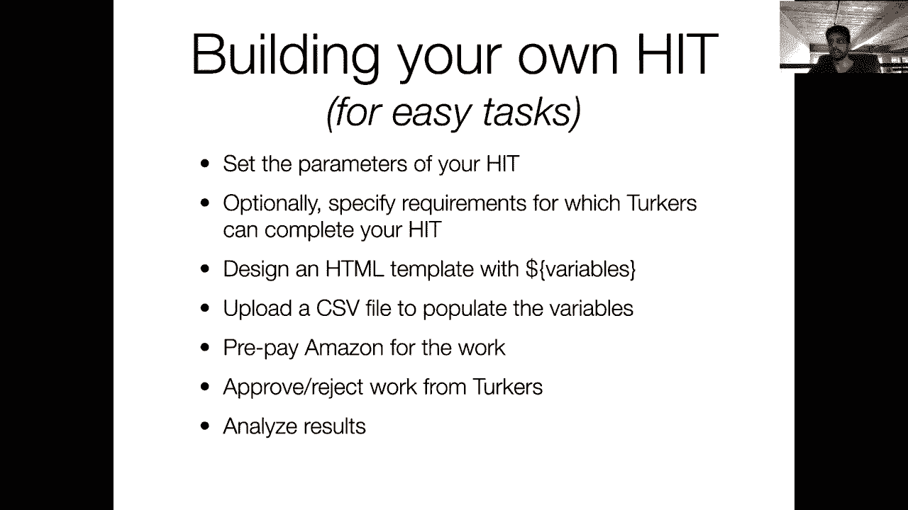

Alright， so I see some questions for more subjective tasks sorry my slack is still open for more subjective tasks。

 there can be multiple correct answers， which might differ from the one included in the data set。

 How do we deal with this yeah， so I guess we'll talk about this a little bit more later on。

 but usually this process of validation， which is kind of implicit in this approve or reject process is。

😊。

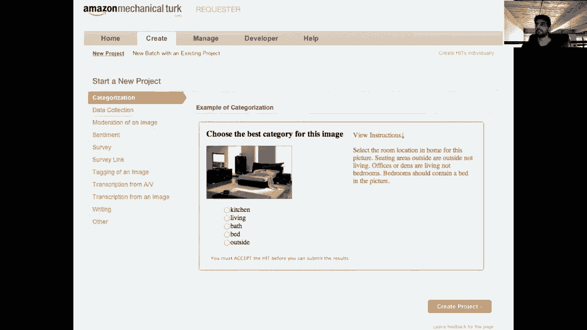

Yeah， for subjective tasks， it's very hard to do right So if I ask you to share an opinion that you have about some context。

 I'm not going to be rejecting your work based on like correctness right that doesn't make sense。

 I might reject your work， if it's ungrammatical or if it's clearly relevant to the context or for other like surface level reasons。

 but yeah， it's definitely not good practice to reject work that especially for subjective tasks or maybe not what you would put down as a requester。

 And yeah， in general， like validation。 So this process of deciding which hits are good and which ones to reject this is。

Largely done automatically， but again， you need to lean towards being lenient。

Even if a worker is flagged for blatantly ignoring the instructions without first messaging them and interacting with them and you know specifying the instructions more clearly or whatever。

 it's it's not。Not good to reject their work and I should add that it's not just like an ethical thing it's also the workers themselves keep ratings of different requesters so there are sites that have all of the different requesters and the workers who participate in their hits rate them on different dimensions like how well do they pay or you know how easy to understand or their task do they reject your hits for no reason often and if you are a requester who's constantly abusing the system you're not going to get high quality workers to accept your hits so it goes both ways and there's a lot of forums and other kinds of sites where requesters and workers kind of interact together to iron out various issues it's obviously highly recommended if you want to use mechanical Turk to join one of these forums and get feedback。

On preliminary task designs before spending thousands of dollars on the site。Okay， another question。

 just curious have someone used GP2 to pretend to be human labor and profit that way or sorry， G。

I mean， if someone has， I'm not aware of it， but I think it's probably possible for。

 for many of these tasks， right， if you imagine， you know， like。Yeah。

 rate the sentiment of something you could potentially set up like some fine tuned BRT model to hook up to the UI and do the task。

I know that some workers do write scripts to automate a lot of the tasks。

 so that's something that many requesters like to avoid because of course you want the actual human to be looking at each example。

 and there are different ways in which you can try and detect that mechanical trick tells you for example。

 how much time on average as a worker taking to complete each task and you can even set like they need to take at least this many minutes per task before they're allowed to do another one。

 so there are different ways in which you can try and detect this， but yeah。

 I mean people have been doing things like using scripts to automate the labeling process I don't know about using language models I'm not sure how profitable that would be for this malicious worker but you know it's definitely possible。

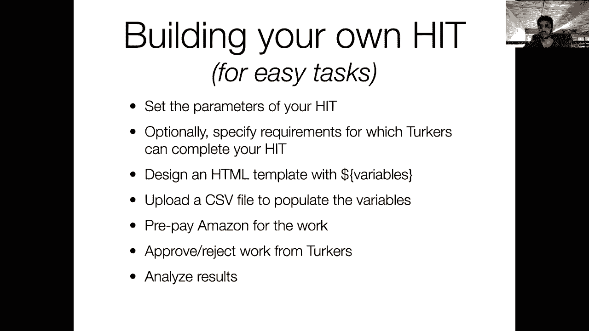

Okay so the mechanical Turk interface， like this is what you would see if you log in as a requester。

 you can see that on the left here we have a bunch of different tasks so I can do like moderation of an image I can do sentiment I can do image tagging transcription from audio writing and so other so this as a whole encompasses quite a few different NLP tasks and you can maybe convert all of them into or sorry all the ones that I've mentioned before into an instance of one of these templates so let's say we want to do a sentiment task so this is a design of a sentiment task where it's actually on five different there's a five point scale instead of just a binary positive or negative scale and here。

😊。

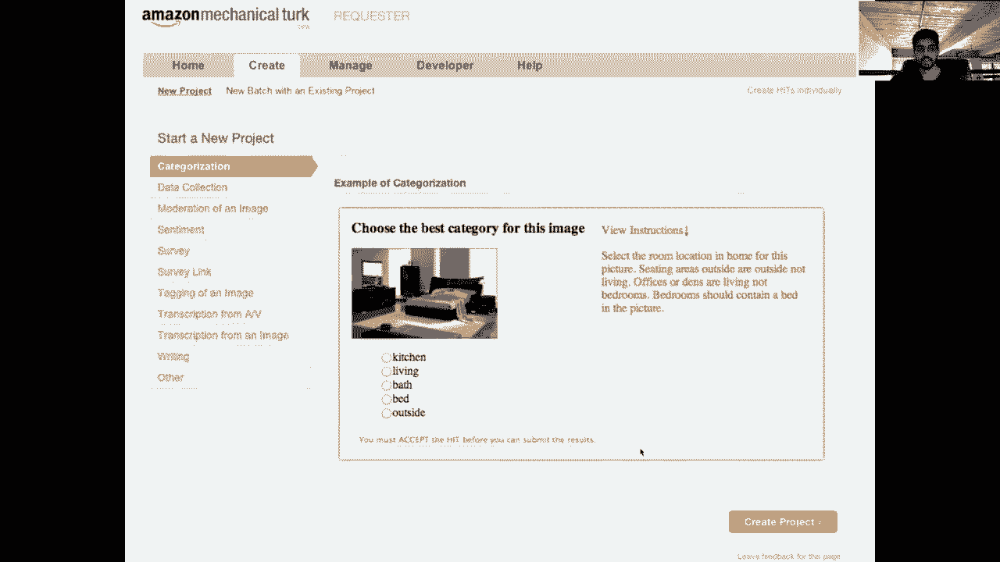

Because you have such a five point。 you have a finegrained task。

 you need to clearly define what you mean by strongly positive versus positive right This is kind of subjective And so you can see an example of how this might look。

 you have your input sentence accessible because this allows you to compute inner annotator agreement right so if if I have this sentence and five different workers rated it strongly positive。

 I'm going to be pretty confident that this sentence is strongly positive right but if I had say five different workers and one of them marked it strongly positive and the other four marked it as negative。

 then maybe I'm a little skeptical of that one worker who marked it as something completely different and I can use this information to kind of identify this worker and look at their other annotations and maybe eventually。

😊。

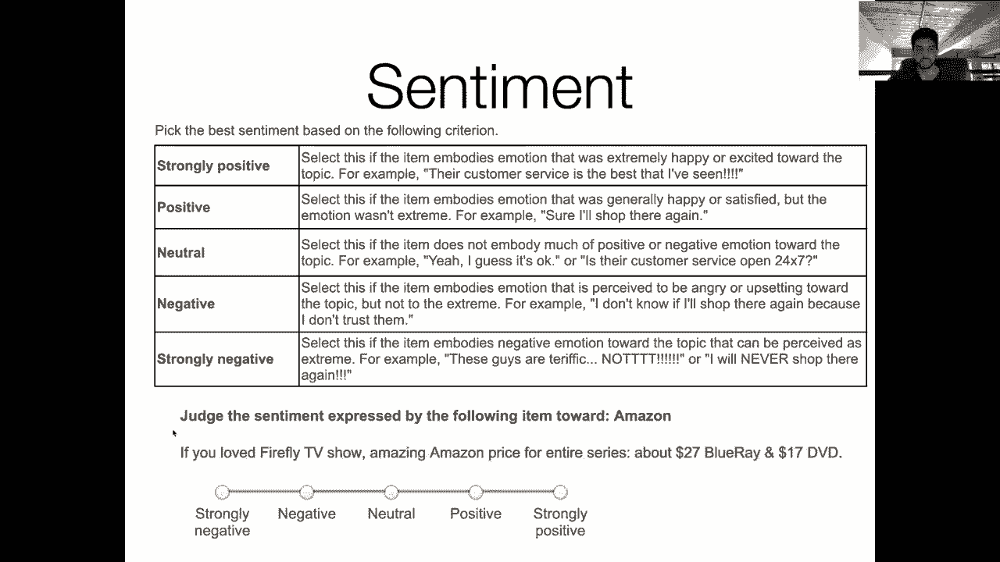

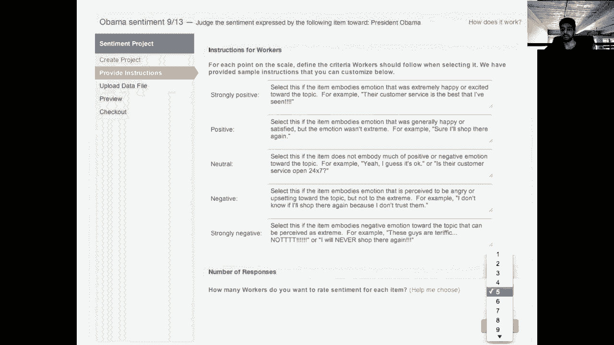

We remove their annotations from some data set that I collect。

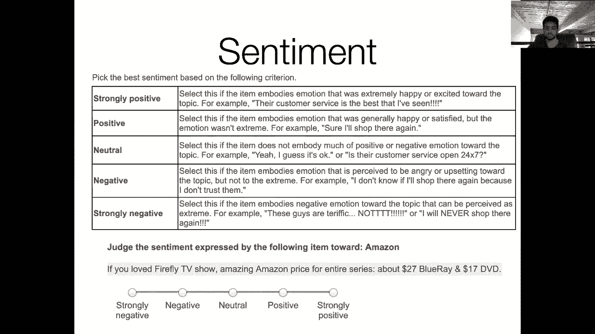

Okay， so there is that part。 And then once you've。

Oh， looks like there was some buffering issue， sorry about that。Hopefully it's back to normal now。

Okay， so once you've if you missed anything， it probably wasn't super important。

 I was just talking about how you write the instructions and pick how many workers you want per instance。

 and then the next thing you're going to do is just upload your data file so here we uploaded something called tweetets。

csv which has just a column of sentences。

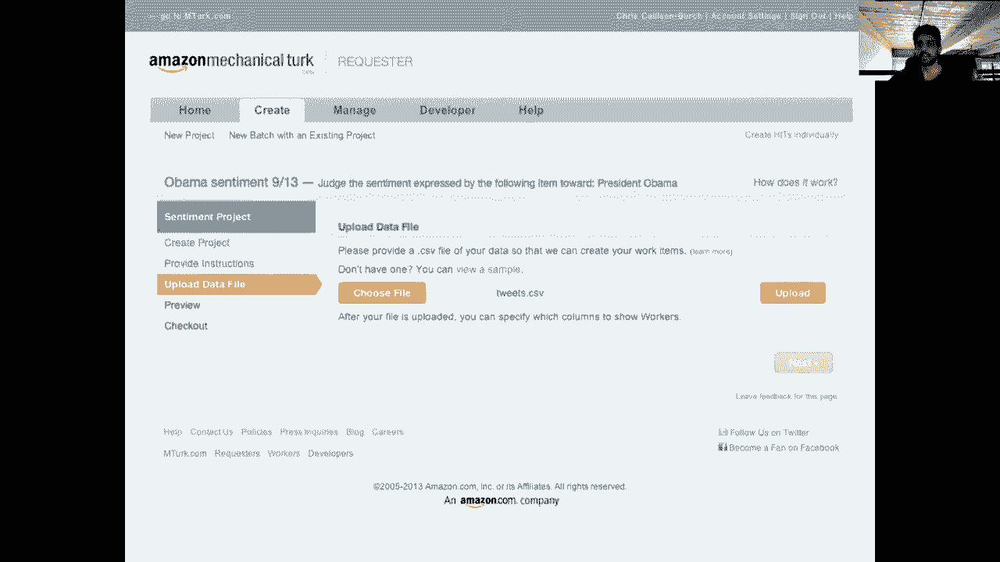

Or tweets in this case。 So yeah， this file actually has two columns tweet and user and the user column is not going to be shown to the workers only the tweet column is。

And now you get to the part where you're going to set all of these different parameters for the task。

 so you're going to write the title， the description。

 some keywords and then you're going to start with these numerical parameters like how much do you want to pay per task and so in this case each task is going to be。

😊，Sorry， yeah， each task is just going to be one instance of labeling the sentiment of this tweet and so you're going to pay $25 cents per one of these and in general it's good to pay you know roughly minimum wage or try to pay that much for tasks that are much harder and require kind of more cognitive load on the part of the worker you should definitely pay more but for simple tasks that don't take too much thought you want to aim for you know 15 bucks an hour。

Whi is rarely done， but at least you should try and aim for that， I mean。

 even the estimation that you do when you try and get to something like $15 an hour is is really hard because you assume that the workers are going to do this task nonstop for an hour with no breaks and they're going to spend you know roughly I don't know 10 or 20 seconds per sentiment label but in reality。

 of course， no one is going to be able to keep that pace up for a while。

 so it's always good to be generous with your payment that also helps you attract better quality workers。

So here I've said 10 different workers per task and they have a maximum of two hours per task and yeah。

 some other stuff。So eventually I'm going to get to the payment page you can see that mechanical Turk is taking quite a big cut here。

 it looks like more than 20% I wonder how that happened maybe they've increased things recently and anyway。

 once you do this you have launched your task officially so now you're you can look at on the mechanical Turk interface some aggregate stats so for this particular example you've received three positive labels and two negative or sorry two neutral labels from the workers it's usually good to just download the results from mechanical Turk and write your own analysis script so you can get more specific information as to the current progress of the annotations。

It also shows you something like the effective hourly rate。

 so you might have estimated that your payment scheme would be roughly minimum wage。

 but this is showing you that on average， you're just not paying that。

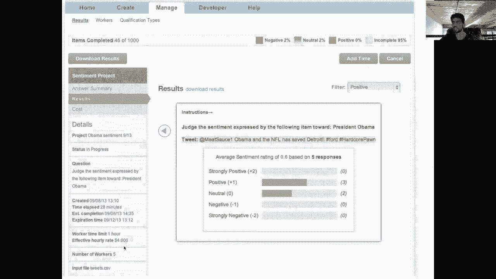

So the task is taking far longer than you expect。So again， we were talking about this before。

 I think maybe when the video is buffering， but it's always good to have as many people annotating your each example as possible。

 So the more annotators you have the higher confidence you can have and say the majority label。

 it also helps you identify workers who are consistently giving different answers from the majority and it also helps you。

😊，呃。Okay， I forgot what I was saying， but obviously very helpful in general。Right。

 so oftentimes there are two different ways in which you can kind of deal with the multiple annotations for a single instance you can the simple way is just assign its label as the majority vote so if three people in this example said that this tweet was positive and two said it was neutral were just going to consider it positive Another way is to only consider examples that have 100% agreement so like all five workers agree and for every other example。

 there's clearly some uncertainty and might be caused by workers just spamning random labels or it might be caused by there actually being some uncertainty in the sentence itself and you might want to get rid of that you might also want your model to explicitly predict the distribution over the worker labels rather than just a single one so。

😊。

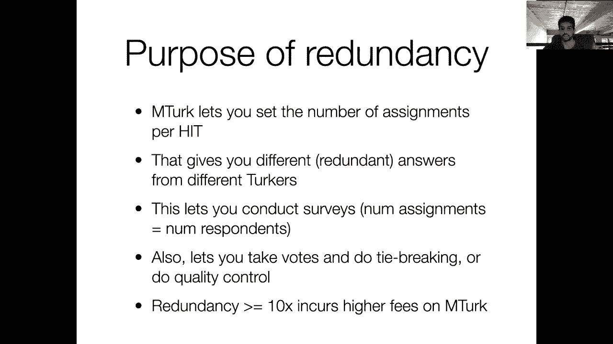

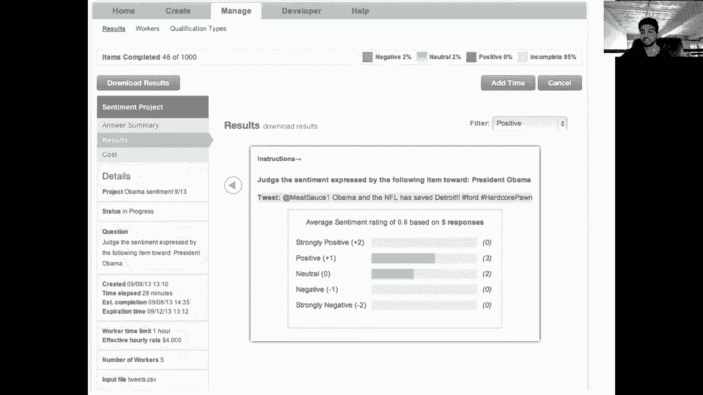

There are many different ways that you can do this。

And use these multiple answers the downside of course。

 is that you have to pay more right so if you want 10 different workers you're going to pay 10 times as much so that's always a limiting factor。

😊。

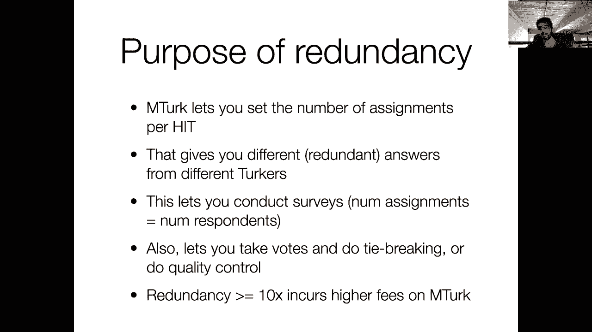

Okay so one thing I haven't mentioned is how you filter out workers and this is very important。

 so in general you want workers who are experienced who have you know performed similar tasks before and have a fairly high approval rate for their hits so you can see here that for this task I've specified that my workers must be located in the United States。

 you can also specify languages that they should speak I've specified that their approval rate for their hits must be greater than 80 which is actually a very low threshold。

 usually we use things like 90 or 90 or 95 or even 99 The downside of using higher and higher numbers is that you're going to be filtering out a larger percentage of the workforce so your task your overall data collection is going to take longer if you course only highqu workers to do it。

嗯。You can also filter based on the worker's experience。

 so if a worker has just joined the platform and they've never done a hit before you can filter them out through this number of hits approved there are many other criteria。

 you can also do custom criteria so you can say I want a worker to have worked on one of my tasks before and maybe you're confident that theyre you know good workers since you've had experience with their annotations before so you can give workers things called qualifications which are kind of like you badges that they can accumulate and if they have a particular qualification you can add that as a criteria like if they have this qualification。

 then they're allowed to work on my tasks so that's a very common way of if you want a small set of expert workers who you trust you can do that here as well。

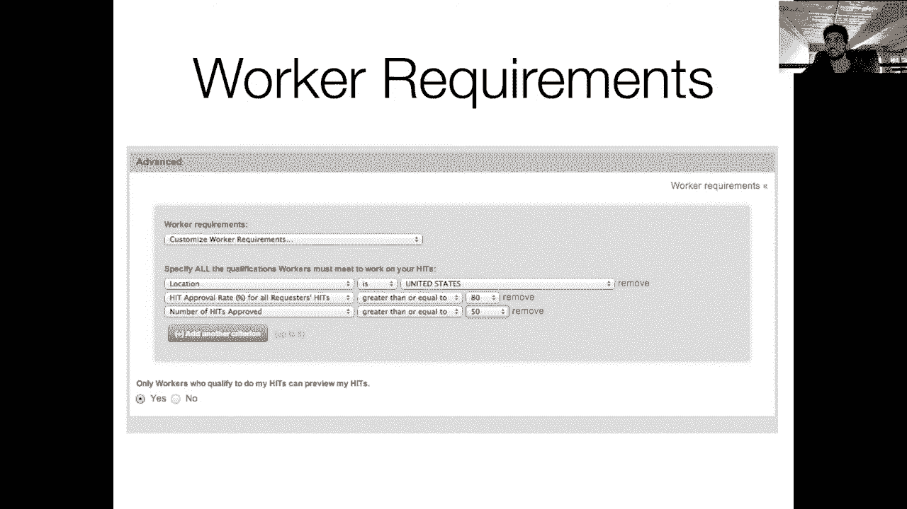

Okay so so far we've talked about just using mechanical Turk for data set collection。

 but in NLP it's also very， very evaluating the output of models specifically models that generate text right and so this is an example from one of my groups crowdsource tasks on mechanical Turk where we were just looking at paraphrase generation and evaluating that on the three point scale that we discussed last lecture so here we have the original sentence and the model generated sentence and this is essentially a categorization task right so the workers have to click on one of these depending on their judgment of whether this is a paraphrase or not。

😊，So here we're not trying to collect data to train a model。

 but we're rather collecting worker judgment of our model's output and we're going to use this to evaluate how well the model did。

And remember again， that for text generation tasks。The automatic metrics are quite limited， right。

We talked about the blue score which is based on word and N Graham overlap。

 but it's not doing any sort of deep semantic analysis of the text that you've that the model has generated so the best bet in evaluation of text generation is to do human evaluation human evaluation at scale basically means you have to resort to mechanical Turk so another reason why this is so important。

Okay， so that's essentially how you quick overview of all the things to be aware of when you're creating a simple mechanical jerk task now I want to kind of describe some instances of things that could happen if you're not careful at setting up your task properly and also even if you are careful。

 your task might just not be well designed and oftentimes it's due to differing incentives between workers and requesters。

😊，So we're going to start with the entailment task， which we talked about earlier。

 it's both the Stanford NLI and the multinLI MLNLI data sets。

 both were created through mechanical Turk， both cost you know probably tens of thousands of dollars to create。

 and in this setting， workers were shown a single sentence and asked to write a sentence that entails that。

 a sentence that's neutral in a sentence that contradicts it。

So imagine you're a worker here and you're receiving some like small amount of money for everything every sentence you write and your goal and not just for this task。

 but in general， is to of course， get the most money that you can right So that basically means you want to。

 on average， complete each task as quickly as you can So the incentives for workers are really how can I you know get all my hits accepted。

 but also complete them in the fastest possible way。

 so I can earn the most money in whatever time I've set aside to do this。😊。

Remember that most Tuers are not this isn't their fulltime job。

 they could be you know people who are you know at their normal job but have some free time security guard for example。

 or they could just be bored and looking for a little extra cash on the side。

 but yeah it's hard to you know rely on working for mechanical as a full time job just because so few tasks even pay close to the minimum wage but those are the incentives for the workers on the other hand you have their requesters who you know for NLP researchers they want to get you know as many examples as they can。

 but also they want those examples to be reflective of the actual。

Like task that they want to solve right， So in this case for entailment。

 you really want examples that test a model's understanding of the semantics of both of these sentences。

 right。However， it turns out that for this data there are very common strategies that workers tend to resort to to know write these sentences as quickly as possible so a very common strategy for writing a sentence that entails another one is to be kind of vague or more general about different facts that are present in the the input sentence so here you have a woman selling bamboo sticks talking to two men on a loading dock and a very easy way to write an entailing sentence is just to say oh well there's three people on the loading dock so there are at least three people on the loading dock so you can see that we became more general in terms of both the quantity the number of people and we also use this term people instead of the more specific terms woman in two men right so we've kind of made this sentence more general and this was a very easy way to produce it。

Entailment without you know even thinking too much about maybe a more challenging sentence。

 right because for a requester， you ideally would want workers to produce sentences that are kind of challenging for a model and not easily solvable through some simple heuristics。

So an easy strategy to create a neutral sentence was just to copy a large portion of the original sentence。

 but then add some irrelevant reason or like cause effect type information to the sentence。

 So here a woman is selling bamboo sticks。 This is exactly copied from the premise。

 but then you just add some reason that's not present in the in the premise right so the premise sentence does not say why this woman is selling bamboo sticks。

 So you can just make up something and this becomes a neutral sentence。😊。

And contradiction is probably the most obvious in how you can generate one。

 And that's just by negating something that's happening in the premise sentence。

 right So a woman is selling bamboo sticks， you can say a woman is not selling bamboo sticks and you generated a contradiction and you know。

 you didn't have to spend too much time thinking about it。

 So it turns out that a lot of workers followed these simple heuristics to generate the data set。

 and this meant interestingly， that models that were trained on just the hypothesis sentence。

 So the one that the workers generated and did not see the premise sentence at all。 So again。

 this is a task that requires modeling two different sentences and measuring the entailment relation between them。

 But if you only have the sentence that the worker wrote and you don't even have this。

Pmise sentence you can get 67% accuracy with a simple classifier on the Stanford NLI data set and note that this is a threeclass classification problem。

 the majority class baseline is about 34% so this is showing that you know there's a huge percentage of examples that can be predicted correctly without any sort of information about the actual premise sentence and this kind of gets to the point that you need to be very careful when you're talking about when you're thinking about the incentives of the workers and how they are aligned and not aligned to your own and to avoid cases like this may need to tweak your task design。

 your instructions， your validation process to get examples that will actually challenge the model to some degree。

Another so just to follow up on that in these tasks it's very common to provide some examples of each label and so these are the examples at least some subset of the examples that were provided to the workers for this entailment task so you can see that there are actually instances of everything that we looked at in these real examples from the data set right the example for entailment is making the words more general so instead of saying dogs we're going to say animals and of field we're going to say outdoors for the neutral setting we've added you know this fake motivation for the dogs this is exactly what a lot of the workers were doing in their hits and for contradiction we didn't explicitly negate the premise here with adding a knot or a dozens or something like that。

We used a word like sitting， another word could be sleeping that kind of negates any activity that could be happening in the premise。

 so these are all the examples that the requesters provided in the setting influence the workers to use those same strategies when they were writing their own hypotheses sentences。

 which in turn influence the models to latch on to these simple heuristics and maybe not perform the actual entailment task to the degree that we want。

So this is a clear example of this whole pipeline right and why it's important to not just focus on the modeling perspective。

 but there could also be these artifacts in the data itself that result from this mechanical Turk process。

😊，Just to make this more clear and these tables and examples are all from the reading for today。

 the annotation artifacts and natural language inference paper here you can see the top like most indicative words for each label you see that outdoors is most frequently used in entailments rather than in any of the other two labels we saw as an example here outdoors is actually in the examples as kind of generic word we see for contradiction a lot of negating words like nobody know never know nothing non it's very easy to write a contradiction if you just use one of these words。

😊，Okay， and the final thing that I wanted to point out is that the sentence length in this data set is correlated to the label。

 which means specifically here that sentences that were labeled as entailing the premise sentence are on average shorter than sentences that are neutral neutral sentences tend to be longer。

 perhaps because the workers are adding some extra。

Arbitrary text about the motivation of some of the subjects in the sentence。Okay。嗯。Great。

 so the other paper that was assigned today was on。

Question answering and some adversarial examples there so here in the squad data we see these kinds of artifacts where models trained on this data' they're not able to differentiate between thecants like Tesla moved to the city of Chicago versus Tadakatsu moved to the city of Chicago and this is because the way in which the workers created the questions that they wrote。

 I mean it's partly because of this the way in which the workers created the questions that like or paired with the passage was to essentially match a lot of the strings a lot of the words in the passage reuse them in the question and asked very。

 very simple questions on top of that that could be solved with essentially basic string matching so the paper points out that it's very easy to fool these models by simply adding an obvious。

😊，incorrect sentence to the passage and then asking the model the same question。

 So here we have this question， what is the name of the quarterback who was 38 in Super Bowl what is this 33 and we have in the passage the past record was held by John Elway。

 who led the Broncos to victory at age 38 right so this is clearly the right answer but if we insert the sentence quarterback Jeff Dean had Jersey number 37 and Champbu 34。

 we get the model ends up predicting Jeff Dean instead of John Elway and so no model that is understanding what is said in this paragraph should be predicting Jeff Dean here right It's so clearly the answer like all of the facts here are mentioned in the sentence and you might think why is this happening Well。

This latter sentence mentions the word quarterback right and the sentence that is about John Elway does not mention that word。

 so possibly the simple copying of the word is influencing the model to make the wrong prediction and one way in which this could be remedied is to have more challenging questions in which there is very little overlap between the question and and the answers that the models are not forced to the models are not kind of encouraged to just learn these simple string matching strategies。

Okay， so I don't see any questions， I'm assuming that this chat is still working but。

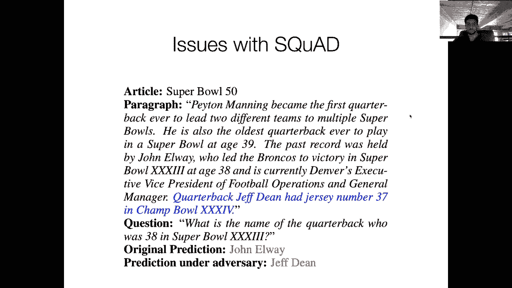

That's also fine So just to conclude this part， at least crowdsourcing works when you have very simple tasks that are easy to explain。

 they don't take a lot of time for workers to complete and they don't cost that much and so it's best if you're able to easily aggregate information across multiple workers so things like you know label the sentiment of a sentence is very easy things like right you' how do you feel about this particular event。

😊，Right， I guess what I and right， there's also， you know。

 the instructions and examples can hugely influence how the workers tackle your tasks。

 So you need to spend some time and make sure that those are clear and the best way to do this is through pilot tasks So this basically means you're going to take a very small number of examples with a particular set of instructions。

 you're gonna launch this task， it's not going to cost that much。 you're gonna analyze the results。

 see if there are， you know any artifacts or what is the percentage of spam annotations or whatever。

 make some tweaks to the task design， maybe you have to pay more。

 maybe you have to add more constraints on your workers launch another pilot task。

 see what happens there and then kind of keep going right so only when you're confident in。😊，Oh。

 whoops。think。Okay， so， sorry， this page is refreshed only when you're。

Only when you're confident in the task design should you proceed to launch a huge scale task。

Al right， so I do see a question for a particular task。

 open source data sets plus data augmentation verse crowdsource data set。So in general。

 it's always good to use existing data sets whenever possible。

 and if you have a task for which there is one or many existing data sets that already are very relevant to that task like if you wanted to do sentiment analysis there's a ton of different sentiment analysis data sets that you could use right so you might only have to collect a very small number of domain specific sentiment examples。

 even if if that right you might not even have to collect any data yourself so yeah， in general。

 like you should always try and leverage existing data sets to the maximum that you can but like in many cases you might want to do a completely new task which hasn't been done before and there isn't any data that does exactly what you want and so in that case it's going to be。

😊，super difficult to know get away without any label data at all。

 and that's more the realm of crowdsourcing so that's where you would want to use it。Okay。

 so this is not going as quickly as I planned。But I guess I wanted to conclude with talking about how you do more complicated tasks。

 so so far we've just looked at you know simple labeling tasks or write a sentence， blah， blah， blah。

 these can be done easily on the mechanical Turk interface， but it's very increasingly common。

 nowadays in the research community to focus on more complicated tasks that they're not easy or in some cases impossible to handle on the mechanical Turk platform。

So the way you get around the limitations of the mechanical Turk interface is to host your task on a separate web server that you have access to and then your hits are actually just links to your server and these links could have know like different codes or worker IDs embedded in them but workers can join your server through the mechanical Turk interface they can do whatever complex task you have is on that interface and then at the end of that you can give them some sort of code which they can paste back into the mechanical Turk interface and then you can pay them that way there's a lot of APIs that you can use to like automate a lot of this on your own server so you don't need to be like manually approving things or anything like that but this is definitely the way to go for anything that's not。

Super simple task。So one example of a task that I worked on that used this method was this quack data set and so this couldn't be done on the mechanical Turk interface because it involved two different Turkers talking to each other right it was kind of an example of dialogue and question answering and there's no way to do that on the mechanical Turk platform easily So we set up a server where you know two different workers would join they would get paired up one of them would be a student so they would see a different page they would see a page maybe about。

😊，Like with a topic that they're going to try and learn about and they're going to ask questions about this topic and a teacher is another Turker who sees a different interface。

 they see a Wikipedia article about that topic and they're asked to reply to the students questions with answers so and this is a kind of conversation that progresses for many different turns and so these two Turkers are talking to each other back and forth。

😊，So you can imagine that the payment here is not trivial right you want to pay them you know maybe by how many questions as a function of how many questions that they write or how many answers that they give。

 but you don't want to you know force them to ask a particular number of questions so you might need some dynamic pay scale。

 there's all sorts of other complexities at org here that kind of make it not feasible for launching on the mechanical Tu interface。

So we had to build this external server that handled the matching of two workers so in general you would have you know like say 100 Turkers join the server。

 you would have to match each one， a student and teacher launch them in their own separate like chat window things and handle the dialogue and the payment and so on and。

when we did this， we sort of built on the Stanford Coco Library which is set up to collect dialogue data from mechanical Turk。

 you can launch a server through this and direct Turks to it and it works pretty well。So again。

 this data data collection project was it took like months and months to pilot。

 we did probably like 15 I don't know how many pilot tasks we did both on mechanical Turk and amongst ourselves with other researchers and so on。

 the task design kept changing for months before we got something that we thought was resulting in you know pretty reasonable question and answers and all in all the whole data set cost about $65。

000 to collect， that's just on mechanical Turk fees so if you're going to scale up to this level you really need to get everything right or be as confident as you can there are no obvious issues that are going to show up when you train a model and it kind of picks out these heuristics rather than learning。

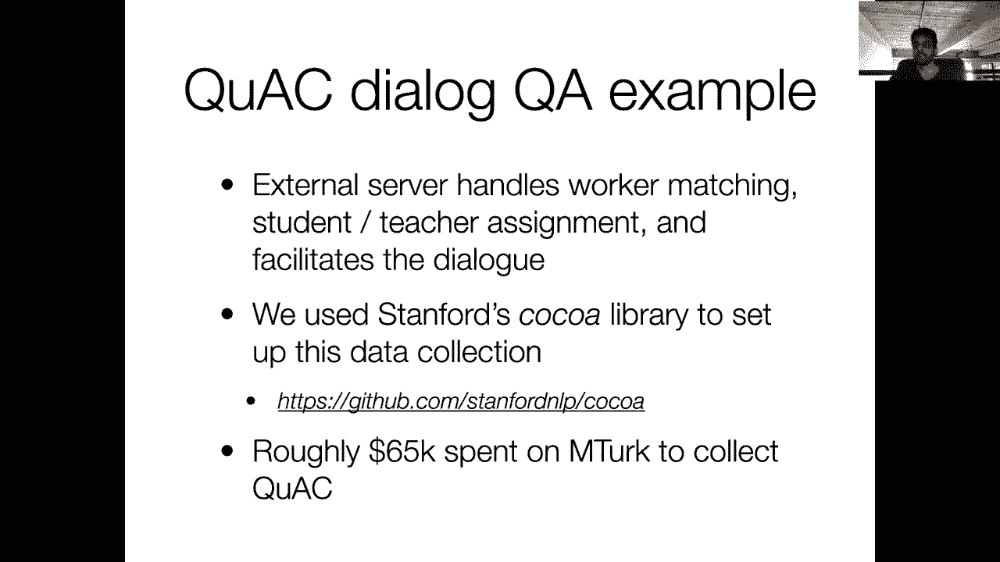

The thing that you actually wanted to learn。Okay， and you know there are many issues that you get in these more specific cases。

 the major one we encountered was lag time， so if you have two workers interacting with each other and one of them in the middle of the conversation decides to watch a YouTube video。

 the other worker is going to be mad right and they're going to probably stop working on our task and because they're essentially just sitting there waiting。

 they're wasting time that they could be getting paid from by doing other tasks right？

So there's lots of different issues with that， there was also cheating issues where the student person was actually going to Wikipedia to learn to get some ideas of what questions to ask。

😊。

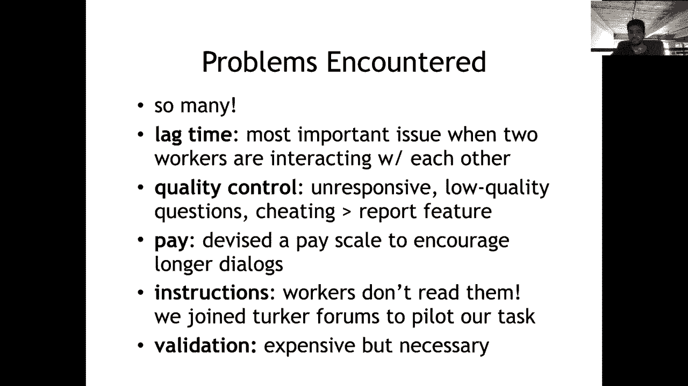

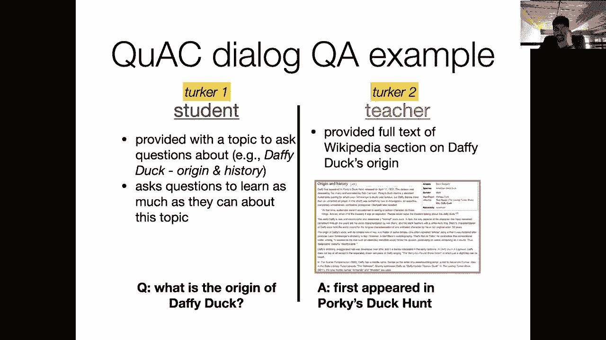

And in our experience， we found that workers， if your instructions are too long。

 they won't read them because that also is taking time away from getting paid right so workers really like tasks that are very。

 very simple to understand and clear and they can get away with you know just clicking accept and figuring it out on the fly but for a complicated task this might not be possible right so there is again this mismatchching incentives。

😊。

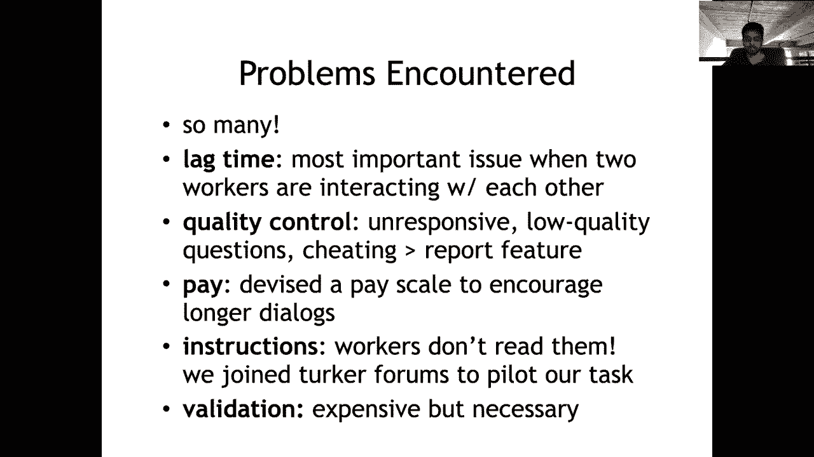

Right， so yeah， I guess that's all I wanted to say about crowdsourcing。

 I see there's another question， does Amazon get to keep the data collected over mechanical Turk or is it the property of the task owner？

That is a good question so I know for other sites so other crowdsourcing platforms there used to be one called Crowdflower in certain plans。

 in certain data sorry， requester plans they would allow you to use their platform only if you agreed to make your data publicly available So in that case。

 I assume Crowdflower has some ownership data on mechanical Turk， there's no such thing。😊，However。

 your data for all of your tasks， it still exists on their servers。

 although if you do something like what we did for quack。

 the the data that we collected was all on our own server。 So Amazon never got to see it。

 So they have no ownership in that case。 but I'm not sure about things that are collected on their interface。

I imagine there's something written on their terms of agreement that is related to this。

 but I'm not sure， so yeah。Okay， so that's all I wanted to talk about for this class and our next lecture will be focused on a more technical topic of model distillation。

 so making your models smaller and more efficient while still retaining most of their performance。呃O。

So see then。

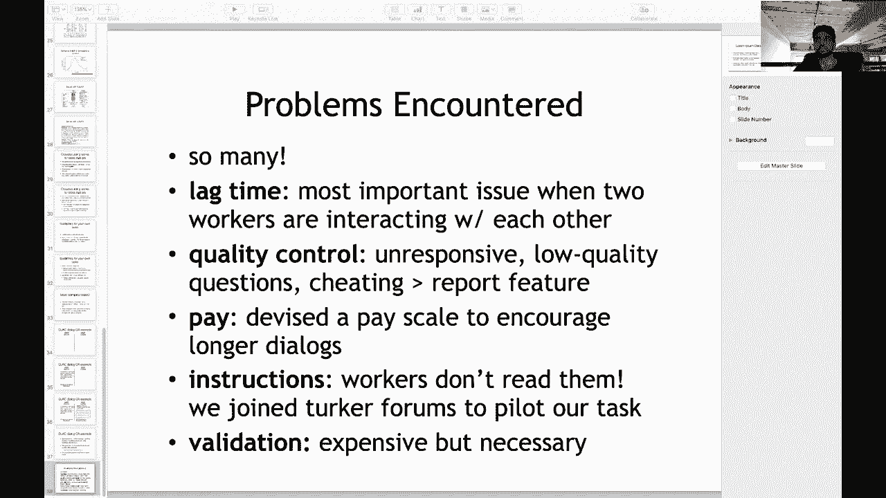