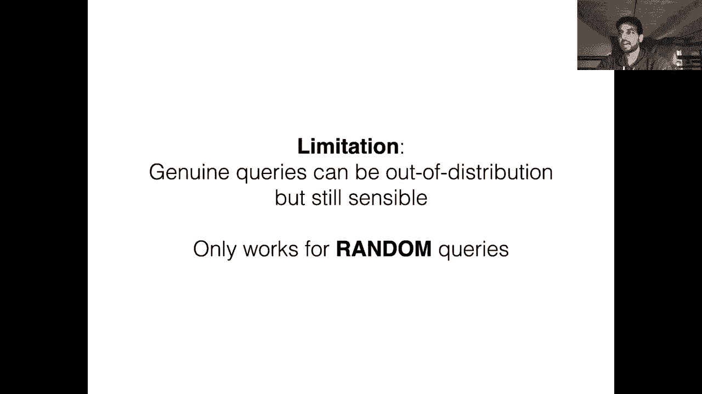
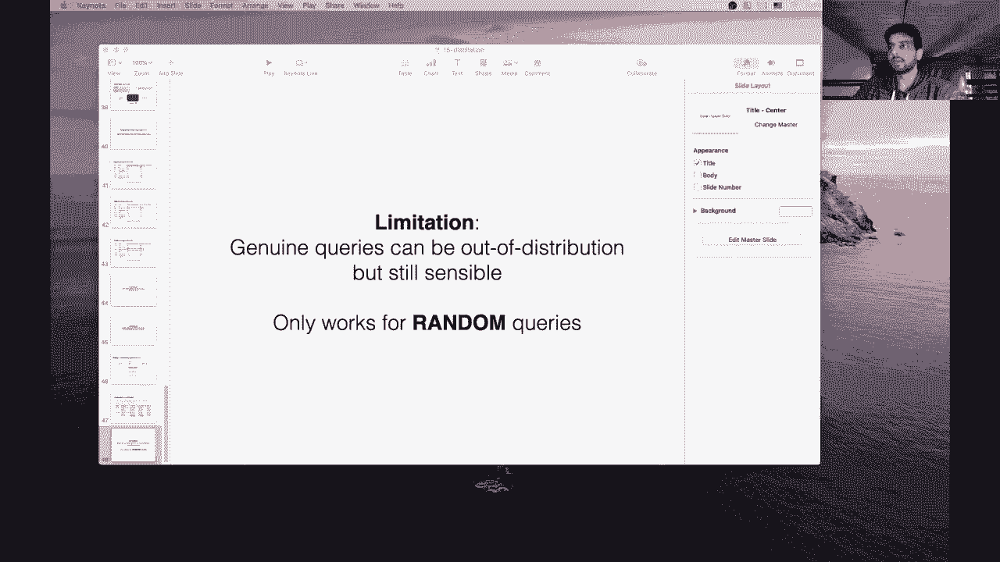

# 【双语字幕+资料下载】马萨诸塞CS685 ｜ 自然语言处理进阶(2020·完整版) - P18：L15- 模型蒸馏和抽取 - ShowMeAI - BV1BL411t7RV

Okay looks like I am live so great let's get started today we're going to be talking about a couple methods of distilling models and in essence we're interested in first compressing our models so can we get much smaller models that perform similarly or slightly worse than much larger pretrain models like those that we've seen so far and so before we start it might be good to think about why we might want to do this and the main reason is that we care about the latency of our models at inference time so if I have you know some Bt based QA task and I want to deploy that as a service to customers if I'm use。

😊，Say Bt large， this is a 24 layer transformer right so it might you know take a significant amount of time to even return the answer to a single query and now if I have thousands or tens of thousands of users potentially querying it simultaneously I'm going to need a lot of compute to be able to efficiently serve this model without ruining the user experience So one way in which I can speed up these models at test time is to make them smaller we know that as we reduce say the number of layers in the transformer we're getting rid of a lot of computations that could be causing a slowdown at test time also it makes us more memory efficient we can potentially use a larger batch size if we're batch serving our queries at。

Test time。 So there's a number of benefits that are speed and memory related associated with making your models smaller。

 But， of course， our models are large because we get better performance when we make them large。

 right， We know that， for example， Bt base compared to Bt large。

 There's a pretty large performance gap。 Oh， it looks like my。😊，嗯。Things are no longer streaming。嗯。

Am I connected to them。Oh， okay。Okay， I do seem to be connected to the internet。

Could you type in the chat if you can hear me。 All right， I think I was not streaming for。

A large amount of time there。Okay， so it says it should be back。Right now。All right。

 I'm just going to proceed， I think it's now working， hopefully that doesn't happen again。All right。

 so。Right， let's so basically we want to make our models smaller。

 but still have them retain the same performance of larger models。All right。

 so before we jump into it， we did get quite a few people requesting topics on both piazza and also the anonymous form one of those topics seemed quite important for just to make sure that you properly understand the transformer it might be good to also see it in code or at least a simplified version of it encode code next to the equations and architecture diagrams that we've already covered so we're going to do that on Wednesdays and we'll see how far I can get through a collab notebook and also your homework one。

 the due date is coming up in I don't know like nineish days for that we've made a couple of small modifications there was a bug in one of the the final problem which we've fixed so you should be able to。

Oh， looks like it's buffering again。Okay， yeah， I don't know what's going on with my internet connection today。

Anyway， we fixed a couple of bugs in the last problem of homework one， and yeah。

 I think it should be going pretty smoothly。All right so our method of making our model smaller is called knowledge distillation so this was proposed many years ago originally。

 but has recently become very popular as our models are quickly growing you know out of hand in terms of size for serving them efficiently so in knowledge distillation we assume that at training time we've already trained or we have access to some huge model which we'll call the teacher and we're going to start with this teacher model and we're going to use it to train a much smaller model called the student model the student is going to be trained to mimic the predictions of the teacher model so it's kind of different than just taking a tiny model and train it from scratch on。

😊，Say that you could pretrain it if you're trying to mimic BRT。

 you could take you know like a three layer transformer and pretrain it using the mask language modeling objective on three billion words or you could take the standard Bt 12 layer transformer and somehow use that to guide the training of your three layer transformer and this second approach works a lot better than training your tiny model just from scratch and so we'll go over how this process works it was originally proposed and shown to work on vision tasks but is now also obviously important for NLP。

And again， I mean I don't think we need to go over this at this point。

 we've seen a bunch of these models but this is just a figure from a recent paper called Distill Bt。

 which is one of many efforts to you know make Bt smaller but preserve its performance this plot is basically showing the number of parameters of a couple different models that have been proposed in the last two years。

 so we see Elmo is over here also the earliest model on this chart at around 94 million parameters。

 we got to GT1 Bt large then we had GPT2 which was a billion parameters， 1。

5 billion we had a bunch of models， Roberta， etc ce。

 GPT3 is like off the chart it has way more parameters than anything else we've seen but the method proposed in this paper distill。

BRTIt has only 66 billion parameters， so it's definitely smaller than something like Bt。Okay。

 so let's go through this process of knowledge distillation。 It's actually very。

 very simple and we've already learned all of the components of this process in previous classes。

 so it should be very straightforward to understand let's assume we have our teacher model。

 so we'll call it Bt sorry I guess this is the Bt large pretrain model has 24 layers right so we like the performance of this model。

 but we don't like that it's so big and it's so slow at test time。😊。

So we know that Bt works by this mask language model objective right so I give it some input with a mask token Bob went to the mask to get a buzz cut and the model is going to produce a probability distribution over the words sorry over the words that could fill in this mask token right so maybe barbershop and barber and salon and styllist or all with some probability and other words that are not important or not relevant to this context get a low probability here。

😊，So for every mask token we can get a predicted probability distribution like this over our entire vocabulary using our teacher model right so we just assumed that we have this teacher model。

😊，And so we're going to call the predicted distribution of our teacher model soft targets。

 So note that if I'm training my teacher model， I use the cross entropy loss。

 computed against the ground truth word that fills in this mask token。

 right So maybe in our training data， we observed Bob went to the barber shop to get a buzz cut。

 So now my ground truth probability distribution is this one hot vector， right。

 It's putting 100% of the probability mass on barbershop and 0% of the probability mass everywhere else。

 right。😊，In contrast， we can view the predicted distribution produced by our teacher model as another kind of ground truth distribution for training a student model。

 So now if I have a student model。Instead of predicting barbershop with 100% probability。

 I'm instead going to predict this entire distribution that comes out of the teacher model。

 so I want my model to produce 54% probability of barbershop 20% probability of barber 6% probability of salon and so on right so this is very different than a oneho target where all of those components of the loss drop away except for the negative log probability of the correct word so in this example barbershop in this case every single word in your vocabularies contributing some amount to your loss right so I want my model to predict that styllist has a 4% probability and we'll go through a little later why this method of training with soft target is potentially more informative than just training our。

😊，Even model with hard targets。So we've got these soft targets which are just the predicted probability distributions over these masked words and now we're going train a student model so in distill Bt this is a six layer transformer so smaller of course than our teacher model and we're going to give it the same training data so Bob went to the mask to get a buzz cut but here the student model instead of predicting 100% probability on barbershop。

 it's going to predict this entire distribution these soft targets and the loss function is exactly the same as what we were doing when we had the hard target right just the 100% probability on barbershop it's the same equation for the crossenttropy loss that we've seen but note that now the T subi comes from these soft targets and T subi is no longer zero for all of the other non-barbershop elements in the vocabulary。

😊，So I get， you know， if I'm at the word for Barber， this would be 0。

2 log and then the prediction of the student model for the predicted probability for Barber。

So this is the general process of knowledge distillation。

 we're using the predicted distribution of the teacher to train our student model instead of just relying on the hard targets Now in distillberrt and in many other cases of knowledge distillation。

 you train with a combination of soft targets as well as hard targets so this model is also going to get a separate component of its loss。

 also using the crossenttropy loss with just the 100% of the probability focused on the correct word barbershop。

 but you're going to do a weighted average of the hard target loss with this loss over the soft targets which are produced by the teacher model。

😊，Okay so that is the general principle of knowledge distillation let's we have a couple of questions here so what are the measures for stating or classifying a model as small or large That's a good question going back to this plot when Elmo is released it was considered a pretty large model in its own right so it really depends on kind of the hardware limitations of the current time period something like Bt large was considered huge when it was released but is now just like a normal model that everyone is able to fine tune on you know just coabab GPUs。

 for example， something like GT3 obviously is completely infeasible to fine tune on one or a few GPUs so that is considered large but yeah it's just a function of kind of hardware。

😊，Avances in GPUs and what can and can't fit or be fine tuned with a reasonable number of consumer grade GPUs。

Okay， so other questions are soft targets produced after training is complete for the teacher model Yeah so you assume that you've pretrained this teacher model and it's of course pretrained using the standard mask language modeling objective and it's you treat it as fixed so it's just it sole purpose in the distillation process is to produce probability distributions of these mask tokens and those are then used as the ground truth for the student model。

😊，Can you please explain the difference between this is your standard pretrained BRT it's trained only using hard targets and what I mean by that is if this sentence in the training data was Bob went to the barbershop to get a buzz cut and barbershop got masked out to create this training example then when we predict the masked word here。

 our cross entropy loss our ground truth distribution is going to consider barbershop with 100% probability and a0% probability to all of the other words in the vocabulary right that's the one hot distribution that we're doing a pretraining time。

So we call this a hard target in that only one word is correct and all of the other words have zero probability。

 The difference between a hard and soft target is when we use a soft target to train。

 we're actually using distribution， the predicted distribution over the entire vocabulary as training。

 not just this one hot distribution where all of the probability mass concentrated on a single word。

 So here like if we use the teachers predicted distribution over this mask token as soft targets。

 then we have a predicted probability for every single word in the vocabulary。

 So we're going to force the student model to predict not just that barbershop should have a high probability。

 but also that these other words like barber and salon and stylus should also have probabilities that are higher than other words that don't make sense at all within this context。

😊，So that's the general intuition here you can think of it as soft targets have the probability mass distributed across all of the items in the vocabulary and hard targets just have them concentrated on the single correct word。

😊，Hopefully that cleared it up。If we have the hardware to run the large model。

 why not just use that So there are many considerations right if you have the hardware to run the large model but maybe you don't have the hardware to scale it up to you know like1000 or 10。

000 queries at coming in at the same time right， then maybe you benefit from having a smaller model that you can scale to the actual practical use case that you have。

 I mean this is a very important problem in industry。

 I personallym working with some companies who are very interested in using distillation to make their models more efficient so that if you have them in something like a customer facing chatbot or some kind of API。

 you're not going to need to use as much compute to serve these models。😊，Your target audience。

And another response to that question is you might have the hardware to you know run the model with some reasonable latency with a batch size of one。

 but maybe it breaks down once you have a harder sorry a larger batch size right and there are all other types of kind of peri that you need a vary dependent depending on your practical use case and in general。

 like if you have a smaller model you're going to have end of the day。

 making things faster is always going to be good for。😊，Yeah。

 like decreasing the costs that are associated with serving this model。

So this distillation is sort of like function approximation， yeah。

 so you're trying to approximate the predictions of the teacher model， right？

So in a way we're saying that capturing a soft target distribution is in some sense simpler No not really So what we are saying though。

 is that the soft targets are more informative than the single hard target right so if you look at the top four words in this simple example here you see that they're all related to barber haircut type of things and if I just have a hard target I have 100% of my mass focused on barbershop。

 I miss out on all these like synonymous words that are also reasonable things to put into this context so the soft target is not simpler to predict。

 but it does contain more information than just the simple oneho target which is the intuitive reason why doing this training with soft targets is better than just training your small model from scratch。

😊，On the hard target。Okay， so for training the student。

 we run a forward pass through the teacher then use the stop targets to train the student network。

 This happens for every data point in our training test in our training。I guess I mean set Yes。

 so you can make this more efficient right because you if you're training your student model。

 you may not want to run a forward pass through the teacher model at every batch So instead what you could do is do a single preprocessing step essentially where you run all of your training data through the teacher model and cash the predicted distributions and then use those to train your student model。

 So there's no actual forward pass of the teacher model during the training process。 but yeah。

 I mean， if it's fine， if you don't care about training time。

 you a simpler solution might be to just not do any caching and do a forward pass through the teacher model to get the soft targets。

 But in principle you're right， that's what's happening。😊。

Do we reuse the fine tuning data that we use for the teacher for training the student？ Yeah。

 so that's a good question。 There are many different points at which this distillation can be done right so what I've shown here is distilling this mask language modeling objectives so the pretraining step there's no downstream task used here So the expectation would be you take the distilled Bt model。

 distill Bt and then you're gonna to fine tune it on the downstream training data set as you normally would but you could also at a distillation step at the fine tuning phase where you make the model predict the same probability distribution over the downstream task that you would that the teacher model does like a finet teacher model there are many variants of this you can check out the papers that were assigned for reading for more details but they give a good empirical comparison of all of these different points at which you could add distillation。

😊，All right， even though soft targets are more informative。

 are we expecting our small model with lower capability or capacity to be able to be trained equivalently to a larger model Yeah。

 so this is a good point。 No， we don't expect it to be perfectly able to predict these probability distributions。

 but that's not our goal here so in essence， if you're going into distillation with the goal of getting a smaller model you're always going to be tolerant of some level of performance loss you're just hoping to keep that the difference in performance from the student and teacher model as small as possible and having it predict these more informative soft targets is a better way of like preserving as much information of the teacher model as we can。

😊，Okay。So just to kind of reinforce some of the stuff that I've already mentioned in answers to your questions。

 these soft targets are more informative than just the correct word or the hard target that we train our teacher model on。

And as an intuitive reason right， let's consider two words from this example that weren't shown right that are probably low probability given this context right so one word could be church and the other word could be and So if we look at filling in this mass token with those two words we have Bob went to the church to get a buzz cut just kind of low probable but you know at least it makes sense and it's like grammatical and a church is a location that Bob could feasibly go to there could be some world in which some church was you know。

 giving out buzz cuts for whatever reason， but if you compare that to Bob went to the and to get a buzz cut。

 that's not grammatical at all right So even though both of these words will have a very low probability from the teacher model we would expect church to have a higher probability than and right So even though there's very little probability。

😊，Ass to these the relative order of these words and the relative difference and probability is very meaningful right it tells us that and is much。

 much less likely to fill in this mask than church so we get all of these kinds of comparisons even with low probability words in the soft targets that we aren't getting from the hard targets。

😊，So for example， this distinction church and end， its telling us it's telling the student model that this mask is likely to be a noun。

 it's also likely to be a location it's not likely to be a function word。

 so all of this kind of information we get just from a single predicted distribution which we don't get from the hard target。

😊，What kind of trade off between the performance and the size of the smaller model and comparisons into to the bigger model do we expect Are there any tasks where we would prefer using the smaller model That's a good segue to the next slide。

 So these are the results from distill Bt。 they say that in general。

 it retains 97% of Bt performance on downstream tasks。😊，So you can see here they have a table。

 these are all of the tasks in the glue benchmark， which is a kind of standard classification benchmark for NLP。

 we've seen some of these tasks before like MNLI is the entailment task SST is a sentiment analysis task so we see here Bt base which is a 12 layer transformer its you know it's of course better than this small distill Bt model across the board but the differences aren't that large and in some cases distill Bt is actually better although these data sets are very。

 very small so I don't expect these differences to be significant at all。😊。

You can see that some tasks there are huge gaps and on other tasks like sentiment analysis。

 the distillberr does just as well but。You know， you might be wondering at this point。

How well do I do if I just take the distilled birdt architecture， so again。

 that's the six layer transformer， it's one and half the size of birdt base and what happens if I just train a six layer transformer from scratch like just a birdRT model and then evaluate a fine unit for all these downstream tasks。

So oh sorry before I do that I wanted to mention that there are other works that try and distill other components of the model。

 not just the final predicted proba， so these I think are quite interesting approaches this paper that I've referenced here introduces this model called tiny Bt where in addition to doing the distillation over the vocabulary they do distillation on the hidden states and the attention matrices at each layer of the transformer so very interesting it's basically saying we want the hidden states of our small model to be kind of predictive of or be similar to the hidden states that you observe from the teacher model we want the attention heads to be looking at the same places in the teacher model that they do in the student model so you can get pretty inep。

😊，With how much you're going to apply distillation and what components of the model you're going to apply it to。

So this tiny bird does a lot more distillation than the distilled bird model does and these loss functions。

 of course the hidden state one can't really be a classification loss right。

 it's a regression loss so you can use like the square loss which we went over when we were introducing back prop as to kind of make the teacher hidden state and the student hidden state as close to each other as possible。

😊，Okay， so now I'm want to get back to the thing I was talking about before。

 which was what happens if you just train the student model from scratch instead of doing distillation So there's this paper which is called well read students learn better which compared a bunch of different variants of distillation to this training from scratch methods So if you see on the slide this bottom line here。

 the dash dotted line with the x's， this is a model where you just train birdt from scratch with a much smaller architecture so they tried a bunch of different architectures。

 tiny mini small medium base， you can see the number of layers in the hidden states here sorry the hidden dimensionality here So and these three other lines。

 the orange blue and green line represent different types of distillation and the red line。😊。

The red dotted line at the top is the teacher model， so this is kind of the upper bound。

So you can see that all of these different variants of distillation are significantly in most cases outperforming the training from scratch method and in some cases this difference is really large right so if you look at sentiment analysis our teacher model is like about 94% accuracy our train from scratch model isn't really improving even if we make it bigger and it's also stuck around like 82% accuracy so that's like pretty huge difference right meanwhile。

 we see these distillation models。😊，They actually improve as you make the model bigger and bigger。

 the student model。And they're coming closer and closer to the teacher's performance and in some cases even outperforming the teacher。

So， all right， we have a question here when hidden states are compared considering the number of hidden states are different。

 Oh， I guess you mean the dimensions model。 So in this case。

 you're assuming that the hidden size is the same for both teacher and student and you're just cutting down the number of layers。

 essentially。 so but， but like the attention head size。 Everything is the same。

 you're just compressing the model by reducing the number of layers。 So you can say， you know。

 I'm going to remove every other layer。 And then I can have。😊。

Each layer predict like the one of the layers from the teacher model I'm not sure exactly what procedure that they followed to align the teacher and student models in this paper。

 but you should check it out if you're interested， but yeah if you're going to do this kind of hidden state similarity distillation。

 you're going to need to have some kind of alignment here。Al right。

 so one thing that's interesting from this paper is how like。

 what exactly is the method used to get this green curve， Because this is the。Oh， I。Okay。

 I guess I missed when it was buffering then fortunate， hopefully it's better now， sorry about this。

 I can't really control my internet being bad。Right。

 so what is this green curve here so in this this paper Well read students learn better。

 they propose this method called pretrained distillation。

 which is supposed to be better than the method that we showed with distill B。

 So essentially you start with a small student model and you train it from scratch using the hard targets with on your pretraining data。

 So let's say I have a Bt teacher model that was trained on Wikipedia using the mask language modeling objective。

 This is gonna to be my teacher model。 Now I'm going take a much smaller Bt architecture。

 say like a three layer transformer， I'm going to pretrain it using hard targets on the same exact training data。

 So say Wikipedia。 So that's this first gray box here。 I've now pretrained my small model。😊。

Now in the next step， I'm just going to do distillation。

 so I'm going take the parameters of my small model and I'm just going basically fine tune it using the distillation objective using the soft targets from the teacher So I'm starting with a small model that's already been pre-trained and now I'm fine- tuning it to make it predicted distributions look more like the large teacher models so you can see the arrow here from the large teacher into this distillation step and finally now this is my final pretrain model and now I can just finet this on labeled data if I want to use it on a downstream task and this is the process that is reflected by this screen curve and outperforms you know kind of doing both of these distillation and pre-training steps at the same time or just doing distillation from scratch without doing this pre-training step。

😊，So if you're interested in this， you should check out this paper if you're interested in using these techniques。

 but it's a very simple method to maximize the effectiveness of your distillation and as you can see from these graphs。

 it has quite a significant improvement over the more naive methods of distillation。

So as layer one compared to layer  one， I don't actually know。

 So I assume you're talking about this tiny bird setup。

 I'm not actually sure how they aligned the layers of the。Teacher and student。

 so you would have to go check out this paper for more details。

 but I assume they have some method of doing this alignment。

What is the intuition behind pretraining Well of course we know that pretraining is you know basically the thing that makes NLP work these days and it is yeah I guess pretraining to convergence using hard targets results in the the small model having a a good initial set of parameters right as opposed to just randomly initializing them and then doing the distillation from scratch so yeah I think probably the gap here is because pretraining gives you a much better starting point for the distillation。

😊，What about the case that the student is better than the teacher。

 I honestly don't know what to say about that。 I don't know how you can really explain that。

 It might be some random effect in general， you should not expect a smaller model to be better than a larger one。

 although I will note that at least for this case， the size of the model is the same as the size of the teacher model but yeah。

 even in this medium case， there's a slight increase in performance。 I honestly can't explain that。

 I'm not sure why that's happening what is the unlabeled transfer data and distillation right。

 I imagine this is the difference between the soft targets and the hard targets。

 So here when we have unlabeled language modeling data。

 this is just the hard targets and unlabeled transfer data is referring to the soft targets that you're getting from the teacher model。

😊，Okay， so that is the process of distillation and its many variants you can of course explore just doing things at the output layer using the predicted probability over the vocabulary you can also think about distilling different components of the model there's a lot more work to be done here。

😊，I wanted to briefly switch over to another very interesting recent development in the machine learning community。

 which is the lottery ticket hypothesis， which is kind of another approach to obtain a smaller model that doesn't rely on distillation。

So this paper was published last year is called the lottery ticket Hypoth。

 and it states that a randomly initialized dense neural network contains a sub network that is initialized such that when train in isolation。

 it can match the test accuracy of the original network after training for at most the same number of iterations So what this is saying is that there is some if you take like a much some huge network。

 there is some subset of the parameters of this network that are responsible or can reach the same performance as that full huge network if you remove all of the other parameters and just train this new sub network from scratch。

😊，So the process by which they devise to find the subnet is first you take your huge network and you randomly initialize it as you normally would now you train this network for some number of iterations maybe until convergence so you can imagine doing this for BRT right so I randomly initialize my BRT architecture。

 I train it on the mask language modeling objective for some number of epochs and I get some final set of parameters we're going to call it theta subj。

So now once I have my big BRT model， I'm just going to prune away some percentage of its parameters。

 which essentially creates a mask like a binary mask， zero or one for each perimeter in the model。

 is it pruned or is it preserved？And in this paper。

 they use a very simple strategy of pruning weights after the model has been trained。 They just。

 for every layer in the model， remove some percentage of the weights that had the lowest magnitude。

 So this is you know， a very simple heuristic that seems to work。

 There are probably other ways in which you could do this pruning。

 but they just chose this the simple magnitude based method to do it。

So I'm ne prunne for every layer， like 20% or 40 or 60% of the parameters that had the lowest magnitudes in that layer。

Now the very interesting finding here is that now I have some number of parameters that have not been pruned in this way。

 right the parameters that had the highest magnitudes。

 So now I'm going to reset those parameters to their original random initialization and I'm going to train this network from scratch。

 without any contribution from the pruned parameters。

 so those are going to be masked out of this new network and this is called the winning ticket because even though I've removed P percentage of the parameters of this model。

 I end up reaching very close to the the original models's performance So this is at least for me it was quite unintuitive and it just shows the importance of the random initialization right there's some subset of parameters that there。

😊，Initialization is somehow contributing to making the optimization easier。

 maybe or making them play a more important role than other parameters。

 and you can detect these parameters by just pruning from a pretrain model。😊。

So there's this paper that was assigned on the website。

 Lotery tickets for BRT Network that explores this hypothesis using the BRT models。

 so I just took their result table just to show the results of applying this pruning strategy to BRT base so these are all of the glue tasks again。

 and here they're showing differentrs sparsity values on each of these data sets so 70% means that they prune 70% of the parameters of this model for something like squ they were only able to prune say 40% of the parameters versus for。

😊，This QQP data set they could proverune 90%。So you can see the performance of the BRT base model here is reported in this row。

 and the performance of their approach， which is just taking this mask and multiplying it with the random initialization and then retraining that model from the original initialization。

 they are able to almost exactly match the performance of the Bt base model。

In some cases with quite a high amount of sparsity。

 so this is super interesting and just to evaluate， they also try taking a random mask。

 so instead of selecting a mask that corresponded to removing the weights that had the lowest magnitudes you could also just randomly mask out P percent the parameters and you can see that these randomly massed networks perform really poorly on the downstream task。

 so this indicates that this heuristic of selecting the weights that have the highest magnitudes is actually quite important and there is these results do show that there is a lottery ticket the metaphor at least holds here So yeah this is perhaps another route that you can go if you're interested in making your models faster。

😊，Okay， so some more comments， I can imagine that pruning can be done based on the task at hand for yeah。

 so you could definitely use some gradient based method to figure out which parameters are maybe contributing the most to the loss function or a particular prediction they didn't do that I think they tried in this paper。

 some other methods of pruning， but yeah this method seems to be quite effective。

It would be interesting to try other methods， though， I agree by pruning。

 do we mean just removing the parameter from the model altogether or just set them to zero and no training happens to them。

 I mean， I'm not actually sure what the implementation looks like。

 I imagine it's the ladder where they those parameters as you can see here you're just multiplying this binary mask to the parameters。

 So I imagine that those parameters are just set to zero。

 but like if you are really interested in a more efficient implementation you would just remove them altogether。

 So yeah， I think those two things are equivalent， but or actually maybe they're not equivalent。

 but you you probably get some sparsity sorry some speed ups during training just by making your your computation sparse but I'll have to look into yeah exactly what the implementation so those do。

😊，That's a good question。Okay， oh， wow， it's been 45 minutes。 Alright。

 so maybe I'll try and go a little faster over this next part。 with lost connection again。😊。

All right， hopefully it comes back。Z。嗯。Okay， so it seems like it's recovered。

Sorry again about the buffering。那。Al right， is it。It just hasn't recovered。Okay， finally， back。

 I think。Sorry about that。Okay， so。Right， as I was saying。呃。

So there is an interesting connection between the process of distillation and the。

The a couple of security vulnerabilities in these models。 And so let's assume that you're a company。

 let's say you're Google， for example， and you're serving a model like Google translate， say。

 so your customers who are using this model。 They don't have access to the predicted probability distributions that your model is producing right。

 they don't have access to。😊，These full probability distributions。

 Google Translate will just give you the actual words that correspond to your translation。

So even if you don't have access to the full distribution。

 you just have access to the say AGmax prediction of the teacher model it turns out that you can still using a process similar to distillation。

 extract a model that performs very similarly to the teacher model so this is a case of an attack against one of these pretrain language model。

 it's called a model extraction attack， and so instead of calling it a teacher model we'll call it a victim model。

 it's a model that an attacker wants to steal maybe I mean you could come up with all sorts of reasons why someone might want to steal Google translate right if you steal a Google translate model。

 then you don't have to pay Google for using it to you know translate your own data right so there are many advantages。

😊，That you as a malicious attacker or as a competitive company。

 can apply these kinds of attacks to models that are publicly served behind APIs。Okay， so this is。

 I just wanted to maybe wrap up quickly by describing some work that one of our TAs actually Colpeish did on this using process similar to distillation。

 but I've also linked a paper on the website showing how the same process can be applied to stealing Google Translate successfully。

 but we'll just go over some simpler data sets here。Okay so again。

 this is called a model extraction attack and I'm just going to outline the basic framework by which we perform these attacks so we have a victim model in our distillation terminology。

 this would be called the teacher model which is being served by some black box API so what that means is I as a customer am able to put in some text and it sends it over to this server the prediction happens on the server side and then it sends back its predicted AGmax prediction on on the input so if I had a sentiment analysis model。

 I would have something like this is a great movie which I feed into this API and it gives me positive。

 it may not even give me the probability associated with this prediction it might just tell me that the sentence is positive not that it's you like 78% positive or something like that。

😊，This is the only information that I， as an attacker who's trying to steal this model have access to。

Okay， so right this model is released as an API so I can submit as many questions to essentially form a training data set for my own stolen model so that's generally how this process works you can view the stolen model as the kind of analog of the student in the distillation process。

😊，嗯。So here for my queries， I in our work， we experimented with like the most naive strategy possible。

 which is just randomly sample words and concatenate them together to form inputs that you can send over to these models so for this sentiment analysis model I generate this query 173 period Miles Vegas it's ungrammatical。

 it makes no sense but you know this black box model is going to spit out some prediction positive or negative。

 even if the input doesn't make sense， So maybe it predicts positive on the sentence and for this one circle forward had support why rulers broken Jan family it predict negative。

😊，So I can submit as many of these queries as I want using whatever process I want to generate these inputs that I send over to the model and I'm collecting for each query。

 the corresponding label。 So in the end， I get the set of like gibberish sentences paired with what the model the victim model predicted for each of these gibberish sentences。

So now I'm basically just going to kind of replicate the distillation process but using hard targets instead of So targets so I'm going to take my pretrained burnRT model。

 and I'm going to fine tune it on the gibberish data set that I've collected by doing this process of querying the victim model。

So I'm fine tuning my bird to be able to， given 173 miles Vegas predict positive。

 This seems like a meaningless task to a human。 but it turns out that even though you use these gibberish queries to fine tune your stolen model。

 it actually turns out to work pretty well on real English data， which is is kind of crazy。

 So now I have my fine tune stolen model， which we call the extracted model。

 and it actually is able to make legitimate predictions。

 despite not even seeing a legitimate instance of the sentiment task at the fine tuning during the fine tuning process。

 So this extracted model can predict， given this is a great movie that this。😊。

ASent has positive sentiment。So of course this is a huge problem right because as an attacker。

 I didn't even have to think about anything to accomplish this process。

 I submitted completely random inputs， I didn't have to use any strategy to cleverly construct inputs designed to reveal the most information about this victim model I didn't care at all about that I just like submitted random gibberish got back on predictions and if this model is able to work well。

 then this is a very， very low cost attack right So we did these attacks on like estimated their costs using Google's they have an NLP API that serves a bunch of these models and it's actually quite cheap So if you wanted to use Google's NLP API it's about a buck for a thousand inputs or 1 thousand00 API calls So if you wanted to。

😊，Extract a sentiment analysis model and say you wanted to use the same number of inputs as there are training examples in the original data set。

 this only costs you $62。 so it's very， very feasible to do these attacks right and once you've extracted this model you can then serve it yourself and charge other people to use this right so that's kind of crazy from a competitive standpoint。

I see a good question here。 Do we need to make sure the victim model has the same architecture with the extracted model。

 No， it's not necessary actually， So we did some experiments that I'm not going to talk about where these were mismatched。

 So like this model， victim could be something like X net and the extracted model could be Bt and it actually works pretty well。

 in fact， if your victim model is some like really， really huge scale model。😊。

Even if your extracted model is smaller， it seems to work even better than if both the architectures were matched。

 so yeah there's some very interesting results here which are kind of favorable from the attacker's point of view right they don't even have to know what the underlying black box model looks like。

😊，And so we had this estimated cost for translation。

 but the paper that I linked on the website actually did this for translation and stole a Google Trans model that had very similar blue scores to the actual Google Trans so you know Google Translate is a very。

 very valuable model right and the fact that it can be easily stolen in this way is definitely concerning。

😊，So compared to the distillation process that we went over in the beginning of the class here。

 we're not assuming that we even have access to the original training data of the victim model so if we go all the way back to this example。

 we were assuming that both the teacher and the student have the same training data right and we're just varying the labels that the student model is being trained on。

But in this extraction case， we don't even make that assumption right。

 this model just observes this random gibbish text and it's still able to work despite not seeing a real example of a sentiment like positive negative sentence。

😊，And here， like we don't care about compression， we're simply trying to maximize the performance of our stolen model。

So in this paper we tried it out for sentiment analysis， NLI。

 which we've seen before and Sd style QA， we used two really stupid input generators。

 one was a random gibber sequences that we looked at before。

 the other one was trying to at least use more grammatical sentences。

 we just sampled random sentences from Wikipedia so like even if they had no sentiment in them。

 we would just randomly sample one and feed it into the model。

So for something like Squa there's actually two inputs right there's a paragraph as well as a question so we had like these two settings where in the random setting the question was a subset of the random words in the paragraph because we know that there's some kind of relation between question and paragraph there was another variant we tried where we added some sort of questionish words to the random sequence so we had this random question caim Kzim further as and gloworm we just added the word what and a question mark at the end。

 but I mean these are also very easy heuristics for an attacker to add in if they know that they're trying to stealke a QA model。

😊，So let's look at some results Our victim model was getting an F1 on squad of 90。

6 so this is like a BRT pretrain model the random model was not doing so well if we limited the number of queries to the same number of examples that are in the original squad training sets of like 100000 but it improves significantly if you multiply the number of random queries by 10 times so if you use say a million queries here。

 you are able to close this gap we didn't try any more than that but we assume that as you add more and more you can close the gap further the strategy of just sampling a random Wikipedia sentence and if you do it with a million random Wikipedia sentences you get very very close to the performance of the victim model without having seen a single legitimate instance of a question。

age pair。You can see that on sentiment analysis， the gap is similarly small and on MMLI。

 it's a little harder to match the performance of the victim model。All right。

 doesn't seem like there's any way to prevent this。 Yeah。

 we'll talk about that briefly a little later， but in general， that is true。 Yeah。

 there is not a single method that you can use to prevent these kinds of attacks。

A industry level pre trained birdss readily available because if they are。

 aren't we really only stealing the feed forward layer？Well， I mean。

 all of the models that are served by these APIs are they have to be state of the art。

 the way that we know to get state of the art performance right now is through fine tuning pre-trained language models。

 so it's easy to assume that all of the models that are being served by state of the art APIs are using this kind of pretraining in some way right we already know that Google search has now switched over to using BERT to do the rankings。

 So I think this is a pretty fair assumption for most like state of the art APIs。😊。

Is it possible that Google Translate is just so good that we are essentially learning from a near human level parallel data instead of stealing the model？

Well， it depends on how you're constructing your queries to Google Trans right Of course。

 if you put in like random sequences of words， you will be learning the one to one mappings between like different languages at a word level right so you'll at least be getting some alignment if you then just put in like you know Wikipedia sentences now you're learning some grammar as well and yeah。

 you're just assuming that Google translate is is doing such a good job actually there's an interesting anecdote I heard about this apparently so Google oftentimes minds like parallel data from the web and they like periodically retrain their models on more and more data that they've collected and someone was telling me that they noticed I think this was。

😊，A couple of years ago， they noticed that some of the text that they were getting was not actually like human written parallel text。

 but text that other people had passed through Google Trans and then posted on the internet so they were like training their models on worse versions of Google translate outputs。

 so they had to develop some method for like filtering out。

Text that was generated from older versions of Google Translate。

 which I thought was pretty interesting， but it's kind of not the problem with people attacking or stealing the model。

 but rather their own previous iterations of the model were making the current model worse。

 which is interesting。Does this signify that the underlying model does not matter that much， I mean。

 of course， you want it to be powerful enough that its predictions are at least somewhat meaningful on queries that have some signal that is kind of related to the task that you care about。

 but yeah， I mean， the experiments that we've done show that it doesn't really matter if your underlying model is like B or X net or Roberta large or whatever。

 as long as it's producing reasonable predictions， youre pretty you have a good chance of success from stealing it。

😊，Okay， so let's just conclude briefly by talking about some possible defenses。

 although they are very limited。 So there， too that we explored。

 one is called API water marking and the other is membership classification。

 So we'll briefly talk about both these。 The first is water marking。

 So here you as the person training and hosting the victim model。

 you understand and acknowledge that there are going to be people who are trying to steal it。

 And so what you're going to do is from some very small fraction of queries。 So maybe like 0。1%。

 you're going to intentionally return incorrect output。So for example， let's say on this example。

 Ccle Ford had support， the model might predict 29% positive， 70% negative。

 so instead of returning what the model predicted I could just flip its prediction and return positive here even though it predicted negative。

😊，So we're going to call this a watermark because we're going to kind of store this in a database that for this particular user。

 we returned the wrong label on this query that that user submitted and so now if attacker is going to finet their model on the the data that they get out from the victim model。

 they're going to include some of this watermark data in their fine tuning process right and we know from things like GT3 that these models are incredible at memorizing their training or fine tuning data so it's very likely that if an attacker were to finet their model on watermark data that the model would memorize that for this particular watermarked input the model would return not the the prediction。

Of the victim model， but the opposite of that prediction or something like that。

So if this is happening because we know that these models are memorizing can memorize what they see in their training data。

 then we have now a method of potentially detecting models that have been extracted from our victim model so what I want to highlight is if you fine tune on a watermarked version of the MNLI task where you have 0。

1% of the queries that are watermarked， the model memorizes the wrong label for 87% of the watermarked queries so now you have a clear way of detecting whether or not a model has been extracted from your victim right because if the model is performing at if it's predicting the wrong label for the watermarked data on a large percentage of those examples。

 it's very likely that it's memorized stuff from the，Um the outputs that you gave it。

 and so you can maybe try and take some legal action against the the whoever extracted this model。

Of course， there's a huge limitation with this approach。

 which is that you're requiring the attacker to make their stolen model publicly available right。

 so maybe this makes sense， Oh， I see I'm buffering again sad。Okay， let's wait for it to。Correct。

All right， looks like it's working again。嗯。Yeah， so I was basically saying that the big limitation of the watermarking approach is that if the attacker doesn't make their model publicly available。

 like maybe they're using it for some private， nefarious purpose。

 you're gonna have no way of knowing if they've stolen your model or not。

 because it's really it only makes sense if maybe in a setting where your company and you believe that another company is serving a model that was extracted from your API and you can test out whether this is true by measuring that other company's model on your watermark data。

 but many， many use cases of stolen models don't fall into this So this is a very limited approach there's also strategies that people have proposed since then to even even if you're going to make your model public。

 you can get around this approach if you know that watermarking is a potential defense。Okay。

 the second approach is also similarly flawed it's membership classification。

 so in this case we are basically saying that we're going to try and detect inputs that seem like they're not really associated with a task。

 so if I have like a random sequence of words， I might want to have a classifier to predict oh this looks like it's a kind of weird input that seems kind of useless for any real customer so maybe I'm going to return a random label or prediction for this weird example and as such an attacker that's using this random strategy is not going to be able to extract a useful model。

😊，And so you can train you know models to detect whether the some attacker is randomly sampling sentences or sampling them from Wikipedia or whatever but this is really not a feasible defense because you're really limited by the performance of this classifier there can be many legitimate queries that can be out of distribution for your training data maybe someone wants to use your sentiment analysis for like legal documents or social media or something that gets flagged by this membership classifier and your model start turning random labels you're going to make the customers mad right so really this is not a feasible defense either and in general。

 yeah so far there is no real defense against these kinds of extraction attacks。Okay。

 so before we conclude last question， is the watermark just the incorrect label or the exact probability distribution。

 I believe you can do both， I assume it works better with the exact probability distribution。

 but most of these APIs don't produce the exact probability distribution。 So yeah， I mean。

 it also works if you watermark with just the Argmax label。

 but you likely need a much larger number of watermark examples to be able to accurately determine if a model has been stolen from your victim model or not。

All right， so that's that's it for today sorry again about the internet issues。

 hopefully they don't occur on Wednesday Yeah and on Wednesday we'll be going over。

