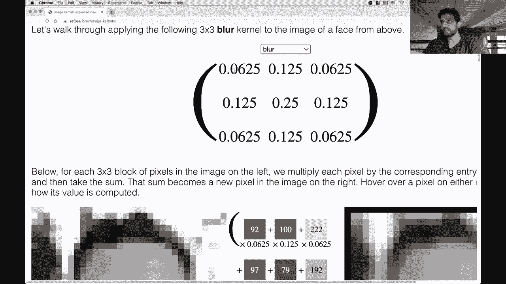
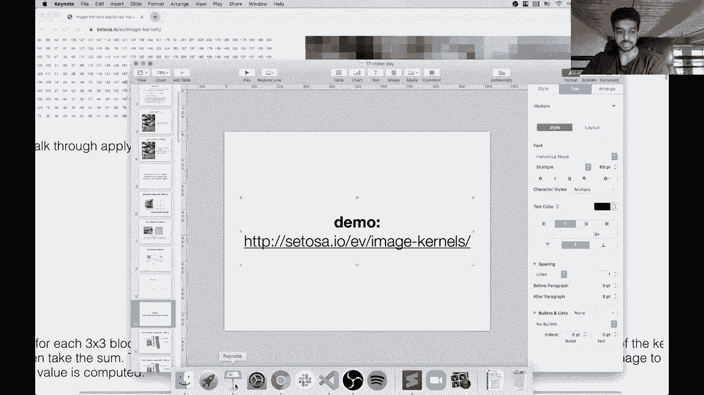
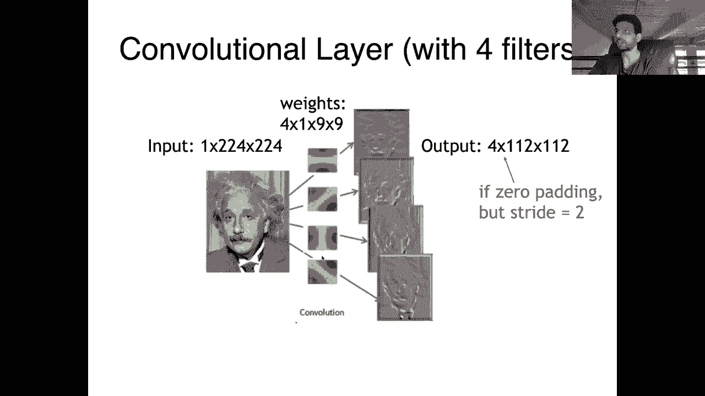
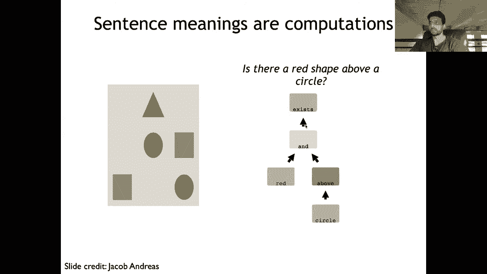

# 【双语字幕+资料下载】马萨诸塞CS685 ｜ 自然语言处理进阶(2020·完整版) - P21：L17- 视觉与语言模型 - ShowMeAI - BV1BL411t7RV

。Okay。嗯。Hey everybody。Hopefully today we don't have many internet interruptions。

 my internet provider claims to have improved things， although。We will see。All right。

 so the topic for today is multimodal NLP， specifically the interaction between vision and language。

We'll cover some basics on how you use neural networks to represent images and then connect those models to standard models that we've seen before to。

Seve tasks such as captioning and question answering。All right。

 so before that some stuff about next week so first of all， of course your homeworks are due today。

 I think so make sure to get those in next week is basically exam week So what I tend to do on。

Like in normal semesters as the class before the exam will do a review so I think I'll do that again this semester we'll basically go over some important topics that we've covered through throughout the course of this class we'll go over the answers to some of the quiz questions as well as relevant previous exam questions although I should mention that just because I'm going over it on Tuesday does not mean that it will show up on the exam it also doesn't mean that all of the topics that will be on the exam will be covered on Tuesday so you should make sure to be familiar with all of the highlevel concepts that we've covered in this class the exam will not cover any stuff on vision and language which is the subject of this lecture so I mean not that that's not important but。

Yeah， the example would cover it。Allright and then so your exams will go out on Thursday so we're not going to have class then instead we'll give you the full time to just work on your exams how we're planning to do this is we'll release an overleaf link with the exam and so like what we would strongly prefer is that if you just you know copy that overleaf into your own thing and complete the exam using lateek but I mean we'll accept any typed answers this makes it easier for us to check for plagiarism etc cea for some of the problems if you need to though you can feel free to write your answers by hand and。

And submit like a scanned version， make sure that if you do do this。

 please make sure the quality of the files you upload is good and we can read everything because yeah。

 that's going to interfere with grading otherwise。So the exact plan is we'll release the exams at 8 am Thursday。

 not this Thursday， next Thursday， and they'll be due 8 a。m on Saturday US Eastern Time。

And you'll just upload them on Grcope， we'll also ask you to mark the problems。

 the pages that correspond to each problem to make it easier for us to grade。Okay。

 so there's a question should we review the readings for the exam or the exams mainly in the lectures and video Yeah I mean some of the papers that we that you were assigned like for example。

 the Bt paper might be good to review and make sure you understand the concepts there but all of the important stuff will be in the lectures and videos and remember that this is an open book and open internet exam so you can always go back to some of those readings during the course of the 48 hours that you have if you know you forgot something or need to look something up so this also affects the type of problems that are on the exam I should mention at this point that the exams that I have given out in the past generally have fairly low averages maybe median in the。

or60sNot sure of what's going to happen with this exam since it's open book and internet and you have way more time to do it。

 but it'll be a similar length to the previous exam so I mean it's not intended for you to take two whole days to complete it。

Also before continuing， I guess CICS has been running some sort of survey of various classes and they periodically report to me what you all have been saying about the class so this week's survey there were you know a few of you who said the class was going well which is great and a few of you who said you were worried about failing so I just want to oay those concerns that I mean if you do all the assignments and you put in a decent effort on your project。

 you're not going to fail the class and I generally give out all A's and B's except for very rare instances of people not doing the work so don't worry about it even if the exam is difficult。

😊，The grades tend to be pretty high。All right， so that's all I wanted to say about that unless there are any other questions。

 we will proceed to our topic for the day， which is again， vision and language。

 So the first task that we're going to be considering is image captioning so just as high levell description here you're given your model is given an image is input and it's asked to produce a piece of text that describes what's happening in that image so here we would have a red truck is parked on a street lined with trees or something like this。

😊。

嗯。In the visual question answer in case your input is an image as well as a natural language question and the answer is I mean。

 you can view the answer in many different ways， it could be a generation task where your model actually has to produce like a sentence or a paragraph in response or it could just be a simple like yes。

 no answer or a single word answer， which is what the current popular data sets are kind of like。

 so questions like these which require some reasoning over the image but can be answered in very simple language are what we will be talking about mainly towards the end of this lecture will discuss a more interesting I mean these tasks are interesting of course。

 but personally more interesting tasks that involve kind of。😊。

und navigation in kind of visual environments and there's a lot of cool work in this direction that unfortunately we won't have time to cover since we have to cover all the fundamentals here。

 but I would highly encourage you to check out some of the papers that were' assigned for reading for more exciting problems in this space。

Okay， so before we can get to all of these applications。

 one thing that we need to do first is talk about how we get representations of images so we've seen。

 of course many ways of computing representations for sentences right so for example。

 Bert or Elmo or using some enormous GPT type language model but images are a little different right they're not composed of words or characters but they're rather made up of pixels so if you take the simplest type of image a grayscale image this is just can be represented as a matrix of pixels so from0 to 255 and an entire image is just completely defined by these pixels。

😊。

So provided you have something like this we if we want to move to a color image。

 it's essentially the same thing except instead of just having one matrix full of pixels we have three different well I mean for an RGB image will have three different image here。

 sorry matrices and together they form this three dimensional tensor where the first dimension here channel corresponds to the color so usually we use red greeneen and blue。

 but there are alternate color spaces which some of which are very useful for different tasks for example the lab encoding encodes lightness as one value and then color is another value so this is a popular encoding or color space for tasks like colorization but in general we'll stick with this RGB。

😊。

Um color space。Okay， so the fundamental operator in computer vision。

 or at least what has been the most commonly used and most useful operation in computer vision has been the convolution over the past decade or so。

 I will say that nowadays very recent research is trying to replace convolutional networks for vision with self-at based ones like transformer Eque networks。

 so it is unclear what will happen in the future， but just to let you know that the selfat stuff we covered is also very relevant for computer vision。

Not just for NLP。But the convolution at its core is very simple， so we start with this kernel。

 it's like a small matrix， you can think about it like that。

 also sometimes called a filter so that's this K thing here and what we're going to do is just take this filter and slide it across every part of the image so in this example here my filter is centered at this particular gray square and I'm just going to essentially do this multiplication and sum with the filter and all of the pixel values here and that will give me the value that I put into the corresponding cell with this center of the place that the kernel is。

😊，So that was a bad description let me show you an actual demo or oh okay。

 maybe this will be clear but then there is a nice demo that I want to show you to make this more clear but here our kernel is centered around the pixel with value0 so we're going to take this element wise product of each pixel's value with the corresponding element in the kernel so this is six times zero seven times 07 times 0 here we have three times 1 so we have a non-ze element in our kernel and we have one times1。

😊，Um， so then we basically do this whole thing， sum up the result， and put it into the output。

 the corresponding location in the output cell。So let's take a look at， oh， whoops。

 that did not open in the right window。

All right， yeah， here it is。Okay， so hopefully you can see this， maybe I'll make it a little bigger。

Okay， so this site is a pretty cool demonstration of so here's a picture and these are kind of blurry。

 but you can see these different numbers here， each of them correspond to the pixel value of this grayscale image。

So now we're going to look at this particular kernel which is supposed to do sharpening。

 so you see that it has a high value associated with the center pixel and it's actually trying to negate the values of these border pixels and zero of the ones of these。

Okay， so hopefully this is visible here， but we can slide this kernel around this image and see what's actually happening here。

 so you can see all the computations which is proceeding like I mentioned and you can also see the output of the the convolution applied to this particular point on the right hand side。

 so if you look at say this cell here which corresponds to this person's right eye。

 you can see that we are。😊。

In the middle here， multiplying each of the pixel values that are in this red box with the corresponding element of the kernel。

 So the value 53 here， which is the darkest cell in this whole window is multiplied by five and every other pixel is multiplied by either0 or negative one。

 And so this has the result of once you do these multiplications and sum up all the results。

 you get -164， which is this very dark number。 sorry， this very dark color。

 and you can see it over here on the right。 I'm not sure if this is visible， but like over here。

 it's become much darker than in the input image。 So by defining various types of kernels you can get different types of outputs by doing this convolution operation。

 So if you look at the blur kernel。 Now this is basically just taking。😊。

weightighted average between all of the nine pixels in this window and it's kind of an almost equal average。

 maybe some pixels are getting a little more weight than others。

 but everything is contributing positively so you can see on the right here just by implying this simple three by three kernel across the entire image I get this very blurred thing on the right hand side。

Maybe you can look at one more。Maybe outline whoa， Okay。

 so what is the outline kernel So it looks like it's negative for every element except the center one。

And that results in this particular image。So a lot of basic things that you might want to do over an image。

 things that you might see on Photoshop， for example。

 are actually like pretty straightforward to define through just simple kernels that you can apply to the whole image。

Does the order that you pass the kernel over the original image change the output No I mean there there are orders that are used in standard libraries for efficiency purposes although in in general this is all done at once in parallel so you can see that the the output of this particular。

Window here doesn't depend on any other convolution operation， right。

 I'm only looking at these nine pixels at the top left corner and I'm doing this multiplication in sum and those in the end。

 give me the value of this one pixel over here on on the right hand side。

 So I can do all of these multiplication in sums in parallel。

 like we discussed with other types of models， it's always good to do as much as as you can in parallel And so there's in some sense。

 no like order in which you're doing this provided you can parallelize the whole computation。😊，Okay。

 but like intuitively， you can think of it as sliding this window over the input。All right。

 so yeah there's some stuff that you might have to deal with with the edges。

 so here like if you notice these pixels on the border。

 my window is going off the image and so usually you will add some padding over the edges to account for this so you can get some values here。

Yeah， and I guess that's all I wanted to show so basically convolutions are a good way of naturally and easily computing a bunch of simple image transformations and so far we've been looking at these fixed kernels where I've just been manually assigning values to each of the things in the kernel and it's producing some input but the insight behind convolutional neuro these weights and the network itself will learn like what type of transformation is most useful for a particular task and then of course the second advance is we can stack multiple convolutional layers on top of each other to get more and more different transformations that eventually will help you perform some downstream task。

😊。

So that's the rough intuition there， whos。

Hang on me。Put this into better。

Screen and so one other thing is that in a convolutional layer。

 we don't just use one kernel or filter。 we use many different ones that are applied to the same input。

 So here we have four different kernels that have been applied to this image I'm feeding in one image per batch my batch size is one。

 which is why you see this dimension one here and my image is 224 by 224 pixels。😊。

So now I apply these four kernels。And assuming that the stride as one here。

 we'll talk about that in a bit， I'm going to get four different 224 by 224。

Like resulting outputs as after applying these four kernels。嗯。

So this is only what's going to happen if we did the padding as I described before。

 to account for the pixels on the edge and also we used a stride of one。

 which means we are actually sliding this pixel over every single sorry sliding this kernel over every single pixel in the input image Oftentimes you might not want to use a stride of one It might be easier for you to do stride of two to reduce the dimensionality of your feature maps。

 which is what we call these resulting outputs， so here you might reduce the dimensionality to 112 I essentially。

So there's lots of other things that if you're interested in working with CNNs。

 you're going to need to learn about， but in general， these are the important things。

 so the learned parameters of a convolutional neural network are in these kernels。

 the filters of the convolution。

So in many networks we additionally have what's called pooling layers which don't have any parameters associated with them。

 but their purpose is to reduce the dimensionality of the output of the convolution layer。

 so we already talked about the convolutional convolutional layers， but the pooling layers。

 they're very easy to explain so if I have a resulting image or feature map that looks like this。

 I can divide it into a bunch of regions and then apply some sort of pooling operator over each region。

 so max pooling is a very common operation which means for each of the regions here we just have these two by two regions。

 I'm just going to take the max value and store that in a new reduced size matrix。

 and I'm going to drop every other value from this region。😊。

So I'm only looking at the max value in each of these regions and I get this two by two matrix and of course reducing the dimensionality helps keep the size of your network down。

 it also kind of forces the model to learn to encode all the important information into a kind of bottleneck representation。

 which is smaller than the size of the original image。

 so you might expect this to induce some sort of abstractions of higher level concepts and so on I should say as an aside that convolutional neural networks are more interpretable than the ones that we have in NLP like transformers and so on。

 you can actually correlate many of the low level filters in a CNN。

 the lower layer ones to like different low level。😊。

Functions that you might want to run over an image so for example edge detection or low level shape detection those that tends to happen in the lower layers and then the higher layers tend to model more abstract concepts so like you know objects that are in an image or actions or so on so lots of cool work has been done on analyzing and probing what has been learned by CNNs。

After the exam， we look at some similar work that does this in NLP with some of the models that we've been talking about like BERT。

 but it's not as satisfying as the vision work， I would say。

So a bit of history， the whole like deep learning revolution essentially started with this paper called AlexNet informally。

 which was the first paper or I guess among the first papers to show that deep convolutional neural networks can。

really reach high acuracies on image classification tasks and after this paper was released。

 there were many works scaling this up to deeper and deeper convolutional neural networks then we had all sorts of other architectures come out the advances bled over to NLP and eventually we get to the current state of research where both fields are basically fully subsumed by deep learning。

😊，So what is this task if you look at the title of this paper， it's an imagenet classification INe。

 you can argue is a data is the data set that kind of made this revolution possible it is essentially an image classification task where there's roughly 1 thousand0 possible classes in the basic version of the task so your goal is given an image classified into one of these categories and the categories are they can be very specific like a specific type of cat or dog they could also be other things。

 animals， objects， instruments and so on so given this picture you might expect a model to produce something about cats and probably nothing about foxes but you know animals reasonable so this had about 1。

2 million images which was a ton for that time nowadays。We see we have much， much larger data sets。

 but IageNet is still used as a benchmark data set for testing out different computer vision architectures。

And the Alexette architecture was pretty straightforward now we've learned about these convolutional layers。

 so it had five of these with the different sizes of feature maps。

 so we see we were going from five by five feature kernels here to three by three kernels here here and here and we were applying pooling operators at every step here to reduce the dimensionality and finally we finish this network with a couple of feed forward layers before you get your final softmax classification layer over a thousand different classes。

😊，So this is how this original network looked。And we see that whenever we're changing the dimensionality here。

 we are likely doing some sort of pooling operation and yeah the linear layers here do take up a lot of parameters so that's also something to keep in mind and in subsequent research people have gotten rid of these entirely and just focused on the have a fully convolutional network with just a softm layer on top。

😊。

So this is what I was alluding to before， you see that some of these kernels are picking up on edges or doing edge detection。

 then at a higher level， a higher layer， you have combinations of edges。

 you can start to see some like face type shapes here and finally we we can even look at the the network itself and visualize the kinds of objects that it's picking up on。

So that was Alexnet， which was eight layers that I've shown you since then and of course this figure only goes up to 2015 but these bars are plotting the error rate on imageNe so we see that every year from 2010 to 2015。

 we've made significant progress in reducing this imagenet error rate and this model that's obtaining some of these low scores is 152 layers so it's a residual network we've already talked about these residual connections and I'm sure there are many deeper ones since then I haven't been keeping up with the work。

😊，But just like we saw in NLP where more data has obviously made our models better on many different downstream tasks and also enabled some new capabilities like the few shot learning of GPT3 the same was shown earlier than in NLP with computer vision where。

There was a network trained in this plot shown on Instagram images where you have 3。

5 billion images and I believe they used tags or something like that on Instagram as supervision so they're asking the model to predict the tags given the image and this was a kind of order of magnitude bigger data set it was almost a billion images。

 yeah you see it in this plot 940 million images and 1。5。

000 tags and so you can of course train a much bigger model on this and it can learn more stuff。

Okay I see a question in the Alexnet architecture let's go back to that It looks like the filter sizes were same for C3 and C4 is there any way to combine these two into a single layer no because these are all nonlinear transformations right so usually you have some activation function that kind of goes on top of the output of the convolution and if you do that then you you can't just combine these two layers into one so even though these two are using the same size filters there's an advantage to making your network deeper right it becomes more expressive and is capable of potentially modeling more nonlinear interactions between the input and output so yeah。

 I mean you know this network architecture was probably reach through a lot of two。😊。

and examining the validation performance and how it's impacted by these different decisions。

 but I imagine it was also informed a lot by the memory limitations of the GPUs that we had back then。

 which were not anything close to what we have now so yeah， I mean， it's hard to say， but in general。

 the deeper the network you can usually expect it to perform better provided you have enough data to take advantage of that。

All right， so at the end of the day， if we look at this even this alisonette architecture right。

 we have this softmax layer， but the layer immediately preceding that one is just a 4096 dimensional vector and so we have this convolutional network which we've trained on ImNe and the result of it if if we just ignore this softmax layer is that we have a function that takes an image as input and produces a 4096 dimensional vector as output and we can expect this vector to encode a lot of properties about that image。

😊。

So provided that we have this and so in this picture here we've just kind of abstracted away and said we have this big CNN。

 it takes us input this image and it produces this vector as output now we have an easy way of plugging this thing into the existing architectures that we've talked about for various language tasks right so because this is just a vector。

 we can of course use any sort of composition function that we know about to combine it with other vectors derived from text and then use these kind of merged vectors to solve a bunch of multimodal tasks。

😊，So in the imagenett case， we have our CNN we get this vector and then we feed it through a softmax layer to predict like truck probably would be the class of this image。

 but this is an instance of transfer learning when we start using this for different tasks right so if I wanted to use it for say image captioning then I would take a pre-trained CNN from imagenet use it to get a vector of the image and then feed that vector into some sort of language generation model like an RN or a transformer to produce the words of the caption so here we've transferred the parameters of the CNN that were trained on imagenet to and use them for the downstream task of image captioning。

😊，So the transfer learning revolution happened in computer vision much earlier than it happened in NLP and this method of pretraining a large CNN on Imnet and then fine tuning it on downstream tasks was very popular for many years prior to things like ElLMmo。

Okay， so this is a good slide for an in-person class with audience participation。

 I think due to the delay here， this is not a good idea to ask you guys questions so instead if you think about a visual question answering task you can maybe formulate this as a classification problem so given a question and a fixed set of answers so this could be like yes。

 no red， blue green and some simple objects， maybe that could be used to answer those simple questions that we saw from before。

 how would I design a model to do this。😊，And so we have two components of our input。

 We have an image， and we have a question， and we already know good ways of encoding both of these things。

 or at least now we do。 So for our image， we can take our pre trained image net CNN。

 pass the image through that CNN and get a vector。😊。

So that we'll call this I vector here and then for our question。

 I mean we know so many different ways of getting a representation for some text right for a question I could say pass it through Bert and use the CLS token as the representation I could feed it through some RNN and train the RNN from scratch if I wanted to。

 but why would I want to do that when I have something like Bert but anyway I can get a vector for the question。

😊，And so then one way to just predict the answer is to apply a softmax layer to the concatednation of my image vector and my question vector。

However， this is a terrible way of doing visual question answering and the reason is because we are not allowing the question to influence our image representation and we're not doing the reverse direction either we're not allowing the image to influence a representation of the question so we're basically computing these representation separately and then feeding them through a classifier which is going to have to decide how to integrate the two sources of information。

 but we confuse these two sources of information much earlier in the network which will allow us to learn essentially a contextualized representation of the image given the question and possibly also contextualized representation of the question given the image。

😊。

So one way to do this， at least the former of contextualizing the image is to use visual attention。

 which operates basically identically to the attention mechanisms that we looked at for text。

 except we're now dealing with the outputs of convolutional layers of these feature maps instead of the positions at different time stepss that we have in the NLP case。

😊，So imagine I have this picture and I have the question how many benches are shown？

So I can get a representation for this question， say from Bert。

 So I get a single vector for the question。 And I might want to use that vector to kind of filter out different parts of the image。

 right， So a large majority of this image is irrelevant for answering this question， right。

 Anything without a bench in it is irrelevant。 So I。

 it would be really nice if I could just focus on the part of the image that had benches in it。

 because then it would presumably be easier for my classifier to answer this question。😊。

So let's say that I have this vector that I've derived from whatever method birdt like method that I want。

Now the standard way， or at least back in like 2015 of doing this would be to divide your feature map into smaller regions so here I've divided it into this like four by six grid and now I can get a vector representation of each of these grids separately and I'm going to use that as a keys for my attention computation and use the question representation as the query。

So when I do this and I am going to compute the softmax over all of the 24 boxes here。

 ideally I want to get something that has high probabilitybabilities on the regions that contain benches or bench like objects and low probability on like sky or ground or things that don't have benches on them so in practice at least one implementation of this was done over the attention was done over 196 of these regions。

 not just 24 like I've shown here。😊，But once you have this。

 you can now take a weighted average of the region level vectors using the attention probabilities as your weights。

 you'll get out a single vector as output for the image。

 and then you get the answer from this or you can concatenate it with your question vector and try and predict the answer that way。

 but either way， at least you're getting an image through this process。Okay。

 so here I've shown you soft attention， which we've already seen it's here just doing something like a dot product and then taking the softm on top so you can see that although I do have some zeros that I've shown here I am putting a small amount of probability on some of the boxes and it's not like I'm just selecting a single one of these regions attention computation so in vision there has been some work on what's called hard attention where I have basically a constraint that only one of the regions can be active and it gets100% of the attention probability and every other region will get0% probability so this is very useful if you know that you're asking about some like small part of the image and you you know。

😊，that everything else is oh this should not be 0。05 that should be 0 you can ignore that but you know that every single other part of the image is irrelevant this kind of hard attention might be very useful and so to implement heart attention unfortunately you have to use reinforcement learning reinforcement learning in these kinds of problems is really not very reliable so there have been papers that have proposed different variants of this kind of hard attention but I'm not convincingly outperforms the standard simple soft attention that we've learned and that's trainable through just straightforward gradient descent and backpro so yeah it's something that you should be aware of but probably is not very practical for many problems。

Oh， I see my Internet has died。 So I guess the。Providers didn't fix my internet， after all。

不れ。Okay。So the task that I just mentioned here was。

The simplest instance of visual question answering where you're basically asking for these you know yes or no questions is this object present in the image and so on but there's some synthetic QA tasks that actually try and focus on a level of reasoning that's required beyond these kinds of simple problems like counting a bench so one example of this is this kind of synthetic problem with different shapes where you ask a question like is there a red shape above a circle and here the image understanding problem is very straightforward this is a synthetic image these are perfect shapes。

 there's no occlusion or anything like that， but it does require me to perform on straightforward steps of reasoning and potentially more complicated。

😊。

right first I I have to detect the circle， all circles in the image。

 then I have to look at the objects above the image。

 then I have to look at the color of those objects and only then can I answer this question。

So we obviously have ways of， if I'm given a question like this。

 kind of learning what these words mean， like what is a circle， I can get a vector for this。

 and then I can do some mapping to the image to identify like here are regions where circles are present。

One thing that we haven't talked about in this class but is very cool and relevant for QA tasks and especially is semantic parsing where I have a question like this and I might want to convert it into some sort of logical form instead of just vectorizing it and then trying to make the network learn to perform all of these steps so I might convert this into some sort of like sQLish representation and then try and execute it over some sort of database。

😊，So we probably won't talk about that this semester。

 but I've done some work in that area before and it's very interesting。

 especially the machine learning methods that are used there。But this this part of the lecture。

 I just wanted to introduce this concept of the neural module networks， which was proposed。

 I think back in 2015 and is a pretty cool。😊，Kind of method that combines both the lexical grounding of words and in the question。

 as well as the combination of different words and actions into some sort of interpretable is program。

 essentially。So how does this work if we have this question， is there a red shape above a circle。

 the what I want to do is basically turn this into a program where I have red exists above and then I apply this to each of the shapes that are determined to be circles。

😊，And the idea behind these neural module networks is that I'm going to have a separate like mini network that is going to learn how to do each of these different like either these predicates or like learn what red is or learn what above is and so for some small amount of sorry small number of words in my vocabulary or concepts I can associate them with different networks and I have a model that basically learns how to combine these different networks together in a way that will give me the answer to the question provided that they can learn the concepts that they're associated with so here I have like red the red network and above network and so on。

And the image goes in as input here， we feed it through this structure of different modules。

 and finally I get as output the answer。So you need to have a way of parsing the question into some sort of sequence of modules so that's where the semantic parsing component comes in so here I would parse this question into something that looks like this and there are many methods that you can use to get to something that looks like this you have to specify a lexicon usually of like what are functions in your language and what are important concepts that you need to model and then you have to have a parser that is able to structure them in this way。

 so there are different variants of this strategy in which you have some supervision for these structures and you can train a supervised parser to do this or you have no supervision and you have to use something like reinforcement learning to learn these structure induce these structures without any sort of labels。

So these kinds of networks have been shown to be very useful when solving these synthetic tasks that require reasoning that said they so far haven't really cracked the real worldorld analog of these more complicated visual question answering type tasks so in this example this is called the NLVR data set by people from Cornell and you can see that it's much more complicated than the simple questions that we talked about earlier in this lecture so here I'm given two images。

😊。

And I'm asked just a true or false question。 So this is a binary classification task， but it's very。

 very difficult。 If you look at what the statement is。

 the left image contains twice the number of dogs as the right image。 So that seems to be true。

 and at least two dogs in total are standing that also seems to be true。

 but some of these are not easy for humans。😊，And it requires quite a bit of reasoning。

 so this is kind of a challenge task for these vision NLP systems。And so far。

 I think the best performance on this is around like 65 or 70% accuracy。

 and keep in mind that if you had a completely random guess， it would be 50， 50% accuracy。

So we're not close to solving this problem。All right。

 so let's switch over now from visual question answering to image captioning。And image captioning is。

A very straightforward task I think we've already learned all of the components to generate text any conditional language model architecture will do here。

 The only thing that we change from say a sequence to sequence model is the encoder so the encoder here conceptually you can just think about it as removing the encoder architecture of say a machine translation model and replacing the output of the encoder with the output of a convolutional network that's run over the image So this figure makes that kind of clear。

 I have this image of the guy wearing a hat it goes into my CNN I get the vector out as output of the CNN and then I use that to initialize the hidden state of some recurrent neural network language model that's going be predicting words like given the start token and given the image representation predict straw given straw。

😊，Predt hat given hat， predict the end of sequence token so this is all super straightforward and it's made this easy by the fact that we can get vector representations out of an image and then it just turns into how do we incorporate this vector into our language model。

😊。

So just to make this more clear here we have another image， another guy wearing a hat。

 and we pass it through this network and we extract this 4096 dimensional representation of the image again this is a pretrain image net CNN。

😊，And then we're going to just use that as the initial hidden state of some RNN decoder。

 so the first image captioning work all use these recurrent neural network decoders nowadays of course we would use transformers。

So here。We。Also have a slight modification to our recurrent update equation where every decoding step we are conditioning our hidden state on the vector。

 the image vector at every time step， not just the first time step。But other than that。

 it's super straightforward。

So yeah and here you can use beamm search like we've talked about that's the most popular thing for image captioning if you use some sort of sampling process you'll probably get more diverse outputs but at the cost of not being faithful to the original image some of the time。

Okay， so here are some example captions and this is from kind of。Like 2015 or 2016 systems。

 so I imagine they've gotten better， but the image captioning task is pretty simple for any images that are in domain of the training data set that's used。

 which if you're interested is usually MS Coco， which is a data set of images and captions released by Microsoft。

 I believe。

And there's lots of failure cases that are associated with more complex images when usually when there's a couple of different things going on or certain objects are small。

 like too small for the CNN to represent adequately then we get some errors。

 so here like this is of course not a bird， but a spider web。

 but possibly it was too faint or something for the the network to adequately represent。

Here a woman is holding a cat in her hand， possibly the fur on her coat， misled the model somehow。

And this image is an instance of there's a couple of different objects here。

 right there's this laptop， there's this whatever USB driver or whatever that is and a phone。

 and it says a person holding a computer mouse on a desk。

 which it just gets confused about what this phone is。So okay， I see there's a question。

 can we say that beam search will describe the central theme of the image and sampling the different aspects of the image？

😊，嗯。So I mean， maybe you could say that in general。

 but intuitively beam search is trying to or produce the approximation of the most probable caption given the image right that's not the goal of sampling sampling is going to prioritize diversity so when you say sampling can describe different aspects of the image。

 sampling could also hallucinate things that are not in the image or incorrectly describe things that are in the image。

 so since you have this element of randomness， there's a lot that could go wrong in image captioning use cases you generally want to remain faithful to the original image so things like beam search are more commonly used but as you can see these outputs all produced by beam search and still have major errors。

😊，But I actually haven't kept up with the captioning research over the past couple years。

 I imagine these errors no longer happen， but there's still other errors that are。

How do we make sure the output sentence is coherent。

 do we have a pre-trained language model so in this work there was no pretrained language model this RNN decoder was trained from scratch on the MS Coco data set so you have a training data set of images and ground truth captions and that's what's used to train the model but yeah in practice nowadays of course we would initialize our decoder with a pre-trained language model like GPT2 and automatically get like coherent inent sentence level outputs then we would fine tune that language model on the data set to make those outputs relevant to the image。

Do we know if the model actually associates objects in an image with a word That's a maybe good segue into the next part here。

 which is image captioning with attention。 So here， of course。

 just like we can add attention in a sequence to sequence model here we can add attention over the image like we described in the visual QA tasks so I have my image I extract this kind of region different regions of the feature map。

 not just the single vector representing the entire image and now I can have my RNN attend over different parts of the image。

😊。

And I can actually look and see at each time step which part of the image was being focused on by the attention。

 So this exactly addresses your question although you probably won't be satisfied with the results。

 So there are some like good results， I'm not really sure if this is one of them。

 a bird flying over a body of water。 So here the lighter part of the image is where the model is focusing its attention。

 So like you can see this at a high level and this is a very simple image。

 but when it's producing things related to a bird and flying， it's focused on the bird。

 the attention and when it's talking about the body of water。

 you can see that the attention kind of shifts from the bird and moves into the background of the image or the water。

😊。

And there's other examples where when the model is producing the word Frisbee。

 it's focused on this like Frisbeish region， when it's producing the word dog。

 it's focused on the dog， and it's producing stop sign it focuses on the stop sign and so on so these images all come from this show attend and tell paper which introduced the concept of hard attention。

 was also probably the most successful image captioning or at least the one that made the most impact in this field of image captioning。

😊，That said， these instances are cherry picked and if you just did this on a random image。

 you probably would not be able to make sense of the attention maps So for some reason it works really well on stop signs。

 but there have since been papers that show that the attention is not exactly interpretable。

 oftentimes it focuses a lot on just the center of the image regardless of what object is there because a center overall is more salient than the border of the image and getting really crisp attention maps like this。

 at least with these simple models is not trivial。 so these are all examples where this works well。

 but for each of these examples I could give you another one where the attention in this example might be focused on like the the child here instead of the Frisbee。

 So yeah I am curious to know how。This has developed over the years。

 but I imagine we still have the same kinds of issues。

So I wanted to wrap up now with just a couple of more recent works in this area and one of them and this is just one instance of a vision in language version of Bt but there have been like probably 10 of them released over the past year but essentially the goal of work like this is to have a pretraining strategy that works for kind of images that are paired with text like captions or Instagram images paired with comments or whatever so here in Vilbert there are essentially two pre-training tasks。

 one of them is the same masked word prediction we see over here we have an image it's paired with a caption and the right hand side here is standard CLS token。

😊，and separator token， etc ce we have a couple mask tokens and we ask the model to predict the missing tokens here man shopping but the kind of vision analog of this is you take different regions of the image and you mask out some of the regions and ask the model to predict like I think it's like some sort of text description of what the region is so there's like a fixed number of types of regions and the model asked to predict which region type is the one that's being masked here and you have access to all of the unmasked regions of the image in order to contextualize this prediction you also have access to all of the unmasked words in the language side so in case the caption is helpful。

So you can use image captioning data to do this pretrain。

 but you do need paired data for this kind of task， however。

 you can of course pretrain the language side of your Bt using just raw text and then fine tune it using the caption data。

The second task here is kind of given an image and a caption。

 just try and predict if the two match or if the caption is associated with a different image。

 so it's kind of like the next sentence prediction in a way of the original bird task。

And so if you do this pre training， this actually helps quite a bit on visual question answering tasks and probably also for captioning。

 although I haven't looked too closely at that。So this is at a high level just to show that this kind of pretraining strategy that we've seen in BRT with mask language modeling can also apply to images more generally where you're masking out parts of an image instead of masking the the words in a sentence and yeah I think someone should probably do this for the Instagram data set since it's much bigger it would be cool to see what happens there。

Okay， so finally I wanted to conclude with just a couple slides on some of the more complicated tasks in this space that people are working on like nowadays。

 so this is one of the tasks that kind of focuses on navigation within visual environments where an agent is trying to navigate using natural language instructions。

 so this data set is called serial bar， it's made by the same Cornell people who made the NLVR data。

And in this particular data， you have two humans who are placed into this virtual environment。

 one of them is a leader who is able to access like this whole high level information of this map and the other one is called a follower and they can only see like limited first person view of where their agent is currently located within the map to the leader with knowledge of the entire map is trying to you know give commands to the followers to navigate through this environment to pick up certain items which give them scores and so on。

 so you can see some examples here， turn left and head toward the yellow hearts。

 but don't pick them up yet， I'll get the next card first and then okay。

 pick up yellow hearts and run past me the Bush sticking out on the opposite side is three green stars So here we have instructions that are being given to these agents。

😊，And we can of course replace these human participants with computer models and see if they can learn to follow these instructions properly。

 and this requires navigating around this virtual environment where you might not have perfect information it's not just one image that you're getting here but you can kind of pin your camera and get many different shots of different objects and angles of those objects you have to learn how to orient yourself in this environment。

 so this is a much more complicated problem than something that just takes in like a static image input like visual question answering and here you're not actually asking the model to predict like a single answer or produce a single caption but rather the model actually has to produce actions that are going to be followed。

by the agent right so it could be like move one step forward or turn the camera to the left or stuff like that so in the end to perform an action like turn left and head toward to the yellow heart you might have to perform a whole sequence of lowleve actions to get to this point so in general this kind of work that situates an agent within 3D or some sort of virtual environment and asks it to perform various tasks within that environment given just language is an example of the kind of grounding problem that we were talking about when we discuss GT3 this is a neat way of kind of pushing more in that direction。

So the models for this usually use something like reinforcement learning。

 I just wanted to highlight that given this kind of language command we vectorize it。

 we have some sort of way of getting features out of the image using some sort of convolutional network and at the end of the day after we do all this modeling our goal is to produce these kinds of actions like left then go forward。

 then go forward and the ultimate goal is to carry out this command so pretty cool line of work that will likely be seeing a lot more of in the future。

😊，All right， so I don't see any more questions， I guess I will conclude here and yeah again next week is exam week so we'll be doing our review on Tuesday so yeah。

 see you then。😊。

