# 【双语字幕+资料下载】马萨诸塞CS685 ｜ 自然语言处理进阶(2020·完整版) - P24：L19- 探测任务 - ShowMeAI - BV1BL411t7RV

Allright， looks like we're live hey everyone， so today we're going to be covering linguistic probe tasks which is a way in which you can interpret the different types of knowledge that your pre-train Bt or GPT or whatever has encoded in its hidden states so up till this point in the semester we've been mainly focusing on our pretrain models downstream performance when we use them for transfer learning right so you know looking at if I switch from BerRT to Roberta how much does my performance on some sentiment benchmark go up or some entailment benchmark or squad or something like that。

 but we might be interested in knowing more generally if our models are capturing various types of linguistic phenomena。

So that's where these probe tasks come in before we get to that， sorry。Some stuff from last time。

 so just a reminder that the only thing left for you all to submit in this class is your final project report。

I hope that most of you have at least started working on your projects， but if not。

 you should get it together because you have less than a month to submit this report and it's a big chunk of your grade。

😊，So some people asked about pass fail request， we're just going to make December 4th。

 also the deadline for pass fail request so if you want to be switched to pass fail。

 then send us an email on the instructor's account by December 4th。

So also next week is the last week of classes and next Wednesday we're going to be having like a kind of guest lecture where PhD student Lorraine in Andrew Mcalum's lab is going to be talking about。

 I believe， common sense reasoning we haven't yet worked out how this is going to work on the live stream。

 it might be that。Both her and I are on a call together and we stream that and I can be asking her questions and of course she can also take questions from the chat。

 but yeah it's an exciting topic and there's a lot of new work going on in common sense reasoning so it should be fun。

Okay， great， so let's move on right。

It' a nice picture here we're interested in figuring out what kinds of knowledge has been encoded by our BRT models right so you can think of this as Btology。

 there's a paper and library called Btology that tries to help you understand what's going on。😊。

And so what we when we talk about like examining how BRT is working。

 we have to look at the different types of representations that we can get out of Bt right so we have of course a sequence of token level hidden states at every layer of the model so we can investigate what each one of these layers is learning that is maybe unique to that layer and not encode it as well by other layers we could also examine the attention。

 remember in a transformer we have multiple attention heads at each layer so maybe we can try and interpret what each one of those is doing and so on so there's many many different angles in which we can we can try and interpret BRT。

😊。

So as I was mentioning， there's this Btology toolkit from Huging F。

 which is a popular library which we used for homework One。

 it lets you access all of the things that you might want to analyze about BRT so this could be the hidden states。

 the attention weights and scores， and even the gradients with respect to different representations in the network。

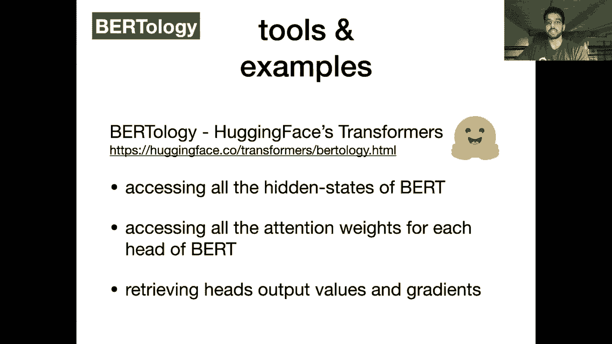

It's kind of hard to know what to do with all of those values though。

 right Bert is a huge model if you really extract all of the hidden states。

 how are you going to proceed and analyze them right so that that's still I'm clear especially since these things are you know hundreds or thousands of dimensions each hidden state if you have you know a sequence of 512 tokens。

 you're going to have 512 I would say00 dimensional vectors at every layer of the model it's just too much information。

😊，So there's been some work on trying to prune parts of BRT at test time so you can get rid of components that are not necessary this paper are 16 heads really better than one at test time removes a large percentage of the attention heads so you can really kind of prune down your network to just the attention heads that are contributing to your performance on some downstream task I think this paper looks at machine translation。

Okay and before we get into the actual probes and visualizations。

 another tool similar to the Brtology thing is Alan NLP's interpret so this lets you look at the importance of various words in a particular example so here you see this mask language modeling input。

 the mask rush to the emergency room to see her patient and of course Bert here is asked to predict what goes into the mask token you can see it's predictions over here。

 nurse， woman， doctor， etc， but the gradient of the loss with respect to each word representation or each subword representation here can be informative when you're trying to figure out what is the most important context token for making this prediction of the mask token so here I think。

😊，In their simple gradient visualization， they just take the norm of the gradient with respect to each of the input tokens。

 token embeddings， and you can see that the words with highest norm are emergency and her。

 which makes sense。Okay， I see there's a question if we know that we can prune Bert at test time。

 what's the justification for having the heads there at training time Well。

 you can't actually train Bert to achieve the same performance with just like one head at each layer。

 so the redundancy seems to be important a training time。

 but at test time you can get rid of a lot of those heads and this could be related somewhat to the stuff we talked about regarding the lottery ticket hypothesis where maybe if you have if you start training time with just you know like one head in each layer you really need like a good initialization to reach the same performance that you could get after you。

 for example， train model that has 12 heads per layer and then prune it down at test time。

 maybe there's you know a higher chance of you getting one head with。😊。

with a good initialization or something like that， but yeah。

 you need at least at this point to still train with all of the components there and then remove them at test time。

 which gives you speed ups without you significantly influencing your performance。Allright。

 so let's dig a little deeper， there are two methods in which you can try and understand what kinds of knowledge that your models are encoding so we'll briefly talk about the first one visualization because it's actually really hard to use this in a meaningful way so probably the most prominent example of just using simple visualizations to uncover what your model is doing is this sentiment neuron work by open AI so they basically just trained a recurrent language model on what was a lot of data at that time and I guess a fairly large model size and then they manage to find just a single neuron whose weight is predictive of the sentiment of an input review So this is like kind of the ideal scenario if you're trying to interpret。

Your neural networks， you find there's just a single neuron that is that correlates really。

 really well with some property that you care about。 so like in this case， sentiment in practice。

 however， this is a kind of rare result it's hard to replicate it for other parameters because there is nothing in the training process of Bt that's saying that a single neuron in isolation should be meaningful in some way or should be correlated to some property right it's way more likely that groups of neurons maybe even across different layers all contribute together to encoding some particular property and that can't be picked up by just looking at the values of each neuron in isolation and trying to draw some correlations there yeah。

 this kind of visualization is not really used currently to interpret your networks just because。

Moels are deeper， they have way more parameters， and it's really unlikely that you can draw interesting correlations to just a single neuron。

Okay， so like maybe expecting something like this with every model you have is unreasonable but what if you actually visualize different groups of neurons so this is a screenshot from LSTM Viz which is an interface built to visualize recurrent models and it has a lot of nice features that let you like click on different words in your input and kind of filter out neurons whose activations are below some threshold but you know just looking at this you can see that it's very hard to make sense of anything or draw any meaningful patterns from the neurons activations and you know with longer input sequences and more parameters。

 more layers doing visualizations like this is just not feasible so this was from 2017 when we still had fairly。

😊。

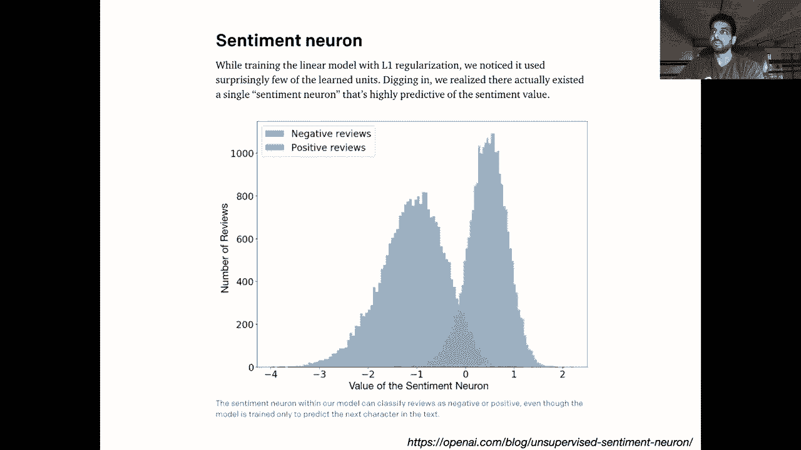

reasonably sized models， but now with the explosion and model size and so on it becomes， yeah。

 really impossible to use these kinds of visualizations。

So the other way in which we can try and interpret what's going on is through linguistic probe tasks so here we're going to take some model that we want to analyze。

 let's say， for example， we want to use BRT we're going to train classifiers on top of the representations output by Bt to predict various properties of the text that we're interested in and then we're not going to train Bt during this this process by which we're learning our classifier because Bt is what we're trying to analyze so we're going to freeze Bt。

 we're not going to do any gradient updates to it it's just going to be like a fixed feature extractor that is going to give us a representation for some text and we're going to learn a classifier on top of that to predict these various properties。

😊，So in one of the first papers that proposed these probe tasks there were a couple different tasks proposed and let's go over some of them so we're going to start with our sentence representation this thing could be derived from Bt or derived from whatever model you want to study Roberta now we're going to feed this representation as input to a classifier so this classifier could look like you know a feed for neural network it might have one layer or two layers or whatever the parameters of this classifier are trained from scratch and the parameters of the model that's giving you the sentence representation are fixed so that this is the setup for a probe task and then you're going to train your classifier on some kind of objective so here we're going to train to predict the length of a sentence right so maybe。

😊，Given Bert's CLS token， can you predict the length of the sentence that CLS token represents。

 so this would be a reasonable setup for a probe task。I'm going to apologize in advance。

 I think I'm really messed up the animations here， so we're going to just have to keep seeing this and over。

 but yeah the Bt CLS representation is kept frozen and this classifiers a feed forward network train from scratch。

And then of course， we would measure the performance of this classifier on some validation set of like sentences we didn't see during training to see if it can predict their lengths as well。

Allright， great， so another probe task that was proposed in this paper was word content So in this task we have two different types of inputs we have the sentence representation which again is derived from Bt and now we have a word representation and this could be derived from Bt it could be derived from some external word embedding like word devec or anything else that can give you a word representation and this task is called word content。

 it's basically given a sentence representation and the representation of a word predict whether that word appears in the sentence or not so God we're going to use the same setup the Bt CLS representation is kept frozen maybe we use a subword embedding for the representation of the word that we're trying to query this is also kept。

😊，At training time and again the only thing we train are the parameters of this classifier。

 so that's a word content task。And finally there's a word order task so here this is a little more involved than the word content task we're going to give you as input。

 the sentence or representation and the word representation of two different words and we're going to ask if the sentence representation encodes some information about the order of those two words so whether the first word embedding here comes after the second word in the sentence that the CLS token represents so you can see how these are very。

 very simple tasks you can easily get data for this just by creating it from unlabeled text and it gives you some insight into whether Bert is encoding any of these kind of fundamental properties of language。

😊。

Allright， we can go beyond this and try and incorporate some external labels and data sets into the probe tasks so for example we can do part of speech tagging here we're gonna to make use of the Bt's token level representations not just the CLS token so for each token in our input we can extract the final layer hidden state that we get from Bert we can feed all of these to a classifier to predict the part of speech token sorry the part of speech tag at each token of the input sentence and we can train our probe task using an existing part of speech tagging data set so we can do the same thing with named entity recognition to see if our model has picked up on the distinction between names of people。

 places， objects and other non-entity words and again。

 there are many data sets out there that allow you to train models for。😊，entity recognition。

 which we can use for our probe tasks。We can get even fancier as we'll talk about a bit later and try and predict syntactic structure from our token representations。

 we could predict things like in a binary task， whether or not in a ground truth parse tree of a sentence。

 there is an arc between two words， we can also predict like things like the path length or so on。

 but there's lots of ways in which you can formal or set up a probe task to capture different types of linguistic knowledge。

😊。

Another representation which is maybe even more involved than the other ones is coreference。

 so you can say here's a sequence of tokens and here are two windows of text that are associated with mentions of you know possibly related to some entity and your task is to determine whether the two windows of text that are marked refer to the same entity or not。

 so the co-reference task essentially， so here you might have some sort of composition function that allows you to get a single representation out of the full sequence of token level representations for this window so that could be something like average pooling or you could even learn some model as part of your probe tasks as we'll talk about later that you want to keep your probe tasks as simple as possible。

 more complicated probe tasks。😊，And learn to pick up on all sorts of correlations， which。

Might lead you astray if you're trying to interpret the findings of your probe tasks。

 so we will start discussing that in a bit。Okay， so just to sum up。

 we've now looked at a couple different types of probe tasks varying in how complex they are。

 but the overall idea is if our classifier that we train on the probe task is able to successfully generalize to some validation set that means that the property that of interest。

 whether it be part of speech or sentence length or word order。

 that information is encoded somewhere in the representation。😊。

So compared to the visualization approach here， we're not getting at which neuron exactly is responsible for this property or which group of neurons it's a more higher level of conclusion we can draw that there is some subset of neurons in this model that are encoding information about this particular property So it's maybe less specific but also you can't really get the same level of interpretation from a visualization right there's just too many combinations of things that you might have to look at。

😊，And if our classifier is unable to predict a certain property right maybe it doesn't encode part of speech very well this means that I mean。

 it doesn't mean that the model doesn't have it hasn't like your burnt model hasn't learned part of speech tags。

 it just means that your probe task was unable to recover that information from your pretrain model and like if you're unable to recover this information。

 even with a pretty complicated probe network， that indicates that that that information is probably not readily accessible or you know encoded in a useful way for downstream tasks if you can't even recover it through a fairly large probe network。

😊。

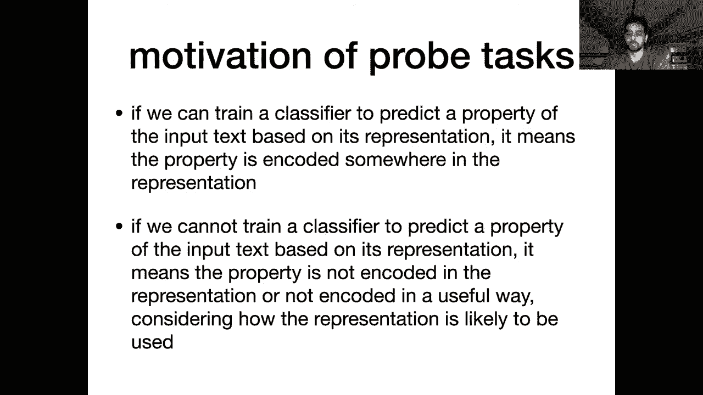

All right， so in general， probe tasks are usually formalized as classification problems。

 all the ones we've seen so far are classification problems。

 you can also have simple regression problems as well， and they are usually very simple。

 so things like basic linguistic properties， part of speech et cetera。

 or even more basic like how long is the sentence。😊，Yeah。

Also important is that you can have a model that does really well on these probe tasks but does not do well on a particular downstream task of interest。

 So obviously it would be good if a model that does well on some downstream task is also good at all downstream sorry what did I just say let me say that again。

 a model that's good at downstream tasks is also performs strongly on your linguistic probe task。

 but you know maybe some linguistic information is just not relevant for you know some downstream task for sentiment analysis for example。

 word order is not very important for the vast majority of examples because if I see a sentence that has the word awful in it。

 I don't really need to know much about the rest of the sentence right just having the word awful there is a huge indicator that this will have negative sense。

Of course， you can argue that that could be negated or part of a longer sequence that flips the sentiment some other way。

 but that's relatively rare。

Okay， so again， this is just reemphasizing the structure of a probe task。

 we're taking our BRT which is in this blue box here and we're freezing it as you see with this snowflake here so this the network that we're probing is not going to be changed at all during the training of this probe task the classifier in this red box is the only thing that's being updated and it's being updated to predict whatever property we care about。

😊。

Okay， so let's look at some other probe tasks so here I think this is like just a high level slide we'll get into all of these more in detail。

 but we can probe things like numeracy so whether the model has understood numbers and how how they can be manipulated or arithmetic and so on。

 we can look at syntactic structure as I was mentioning before and also related to the problem four on your exam we can look at whether or not these models have learned facts that occur in some existing knowledge base。

😊。

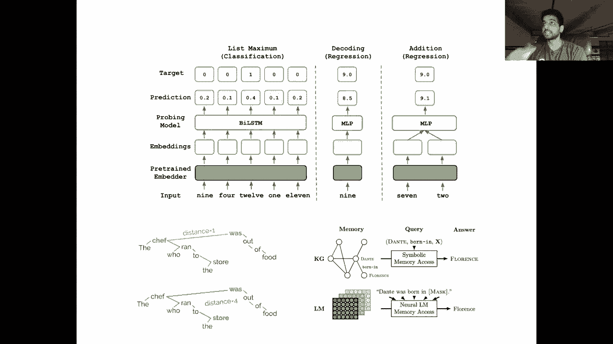

Okay， in general， there have been a lot of papers published about probe tasks over the past couple of years and most of them have focused on Bt and Bt like models in general。

 the findings are that I mean they're kind of intuitive lower layers tend to focus more on local syntactic information while you get kind of high level semantics about different concepts or ideas that are represented in a sentence or some input text those tend to be encoded at higher up layers So you can see in this example I think this was for and Elmo or sorry an LSTM model and here we see a transformer model these are probing representations at different layers of these models for the task of part of speech tagging so which layers encode the most information about part of speech you can see with。

😊，LSTM， the part of speech tagging performance at layer one is higher by about less than a point than layer4 I think this is one of the issues with probe tasks is that you might see these differences but at different layers but they're not huge and it's hard to tell if these are meaningful right if your layer4 is still getting 96 or 97% accuracy on part of part of speech tagging。

Can you really conclude that the bottom layer is learning or focusing more on local syntax。

 It's clear that the top layer is also aware of this kind of syntactic information。

 just maybe a bit less， so。嗯。Yeah， so this slide also has some results for constituency parsing and co reference resolution as different probe tasks。

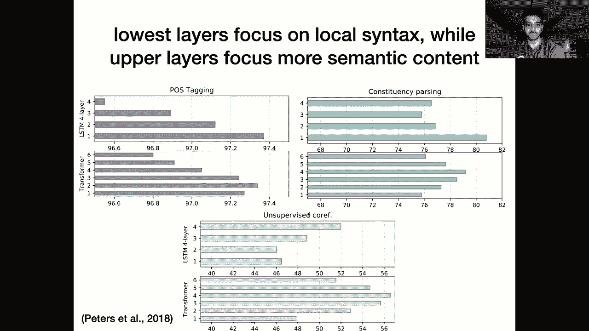

There was this paper last year that does a similar analysis showing that Bert kind of learns these traditional NLP pipeline components like part of speech tagging。

 parsing entity recognition and semantic role labeling so this plot just shows essentially the layer at which the probe model performs best。

 and this is with a 16 layer model we see that part of speech tag and constituents and dependency parsing。

 these are all they have the best performance at lower layers of the network。

 but then higher up we get things that are associated more with semantics like relation extraction or co-reference resolution or so on。

 but again these differences are not huge， so it is a little misleading to look at a plot。😊。

Like this and say， oh yeah， Bt's lower layers are only about syntax and B's higher layers are only about semantics。

 the truth is much more murky， there's all of the layers are encoding a mixture of both syntax and semantics。

Okay， so let's and I see there have been no questions for a while， which is fine。

 but I want to make sure I'm not ignoring any， you refresh this。So yeah。

 let's look a little more closely at how you might investigate how well Bert has encoded these tree like parse structures of sentences。

So here we have the chef who ran out to this the chef who ran to the store was out of food。

 we're going to pass this sentence through Bert and see if it can recover the ground truth three structure of this sentence。

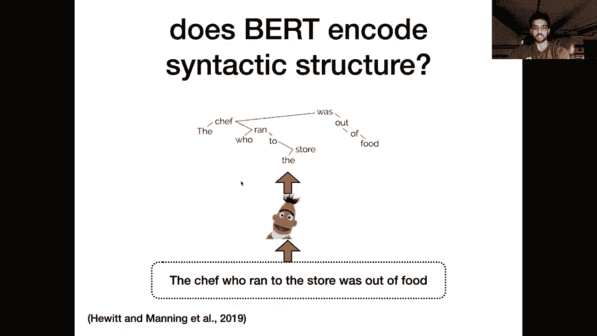

嗯。Okay。And， you know， just as a refresher， this kind of syntactic information is very useful in understanding。

 you know， what this sentence is actually saying， right。

 This is a kind of strange sentence because if you， if you read it closely。

 the chef who ran out of food was。😊，The chef who were into the store was out of food。

 the thing that's a little confusing is where this was out of food phrase attaches， right。

 is it attached to the chef or the store and of course。

 if you think about it more it seems clear that it's attached to the chef right the chef was out of food So he ran the store But if you're trying to figure out you know which of these two sentences is likely to follow next。

 It requires understanding this attachment right， was out of food modifies the chef and therefore this option two is correct。

 he bought a bunch of ingredients at the store and now return to the restaurant。

 you can see that this information is also encoded in the tree structure right the distance in terms of number of edges between the word chef and was is one right。

 indicating that was out of food is。😊，Modifying Che， whereas the distance from was and store。

 which is our other candidate in in the ground truth tree is four there are four edges between was and store So you can see that this kind of distance in the tree is a proxy for these attachment decisions。

Okay， so the paper we're talking about now this Hewitt and manning paper from last year。

 they designed a method to probe these birdt embeddings。

 the token embeddings for tree structures and essentially there going to be trying to measure given two words can you predict the path length the number of edges between each of these words in the tree and can you also predict given a word what depth in the tree it is so like Che or sorry was is the root note of this tree。

 something like store is far down in a lower levels of the tree。

 so you can kind of think about words that are higher up as more informative in some ways。

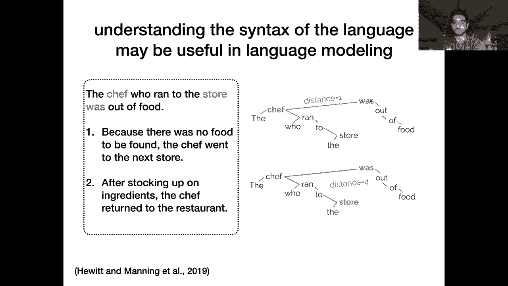

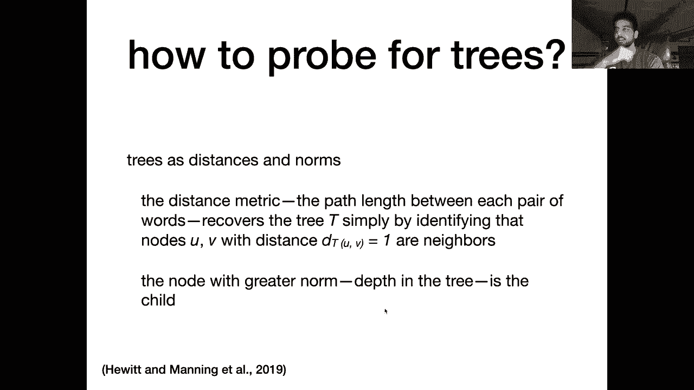

So yeah these were their two probe tasks and I should emphasize that from these probe tasks you can actually recover a tree right。

 given probe task one， you can get a bunch of predicted distances between every single word in the sentence and then use that to you can you can do like a minimum spanning tree to recover a predicted tree structure and then compare it to a ground truth tree structure。

😊。

So this is what they do and I would encourage you to look more at this paper if you're interested in all of the details I haven't even covered their probe formulation。

 which is a little different than the simple classifiers that we've seen so far。

 but the conclusion is to some extent， Bt has encoded the syntactic tree structure when compared to gold trees。

 this is an unlabeled attachment score which shows that Bt large is encoding more syntactic structure than Elmo or Bt base。

😊，So yeah， this is one way in which you can probe for more fine grain and syntactic structure。

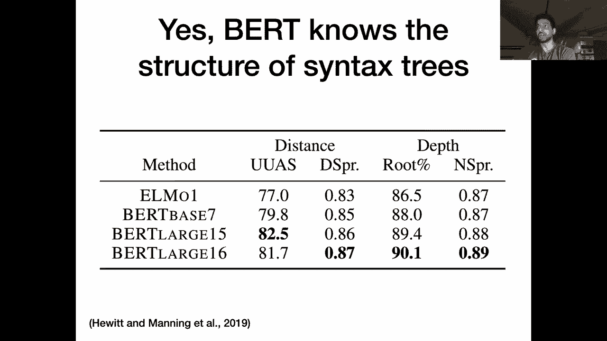

Okay， so let's switch over now to numeracy so we've seen I mean。

 a lot of this might not be surprising now because we already saw that GT3 can do lots of impressive things regarding arithmetic。

But a paper that came out before then explicitly probed Bert for its knowledge of numbers。

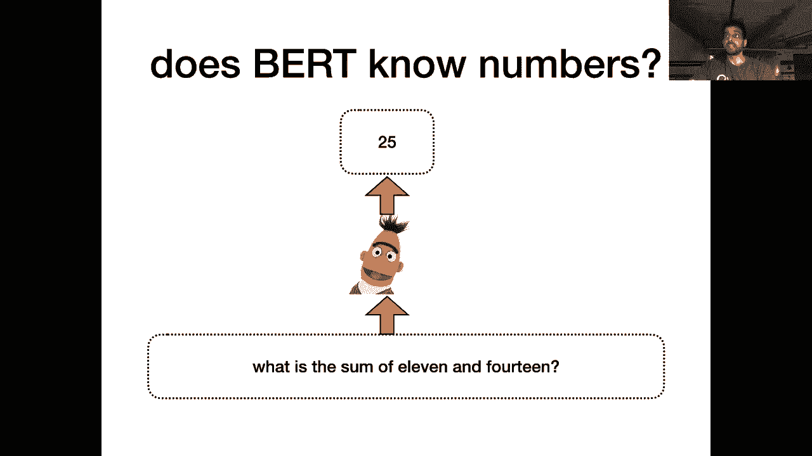

And so there were a couple different tasks that were proposed in this paper by Eric Wallace and some co-authors where in this first task they just put as input to Bt a list of numbers like written out in natural language。

9412111 they pass that through their BRT model they get the embeddings， they have some probe model。

 which here you need to actually model the sequence so they put in a recurrent model on top。

 this could be a small transformer as well， then they predict for each token whether it's the maximum of the list or not。

 so the ground truth here you can see is a one for 12。

 which is the max in this list and a0 everywhere else and they get out the predictions of the model and use this to determine if the model has learned this capability of figuring out。

Which number in a sequence of numbers is the max？Another task is just trying to transform natural language numbers into the actual numerical value of that number。

 So here the input is just the word9 that gets embedded through some kind of composition or pre-train model like birds or Elmo and then this is formulated as a regression so here you're asking the model to predict a single number that's close to the value of the number that's input。

 so the ground truth here is9， the model predicted 8。5 which is pretty close。

 we would train this using the square loss as we saw for example in problem 3 of the exam。😊。

You can get a little more complex now you can pass in two numbers and ask the model to add them and also treat this as a regression problem as well note that this is different than how GPT3 formulated these experiments in GT3 it was just a language modeling tasks so you would feed in7 plus2 as a prefix and then ask the model to generate the like character 9 the period and then the zero right so it's a different setup here。

And so this paper found that ElLmo is actually better than BerRT at understanding numbers。

 so you can see here， I mean this is a lot， but let's look at the list maximum task。

 so if your numbers are from zero to 99 you can see that ElLMmo gets 98% accuracy while BRT gets 95% accuracy。

 if your numbers get a little bigger like 0 to 999。

 the gap kind of widens and if the numbers are even bigger the gap， I mean ElLMmo also deteriorates。

 but BRT gets pretty bad there。And you can see similar trends for the other two tasks as well。

 So this is you know， might be on its face interesting。

 but there's a very simple explanation for why we're seeing this and it's because in Elmo the first layer to this model is a character level convolutional neural network I don't remember if we actually covered this or not。

 but Elmo does not use subword embeddings， it uses character level embeddings at the first layer and this makes sense right at least for this number task because Bert might be splitting something like 9989 into a bunch of different sub wordss at various locations depending on its tokenizer right so it might not be doing these splits at the right places whereas Elmo doesn't。

😊。

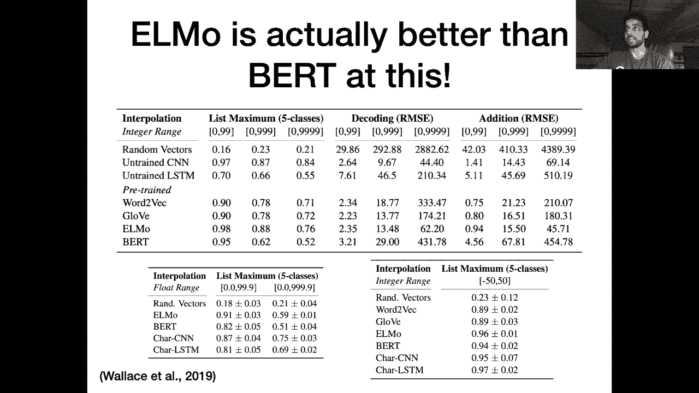

Have to deal with with that as much。 And it turns out that the subword encoding is not a great way of encoding digits。

 So yeah， this was one result that was found by this paper。

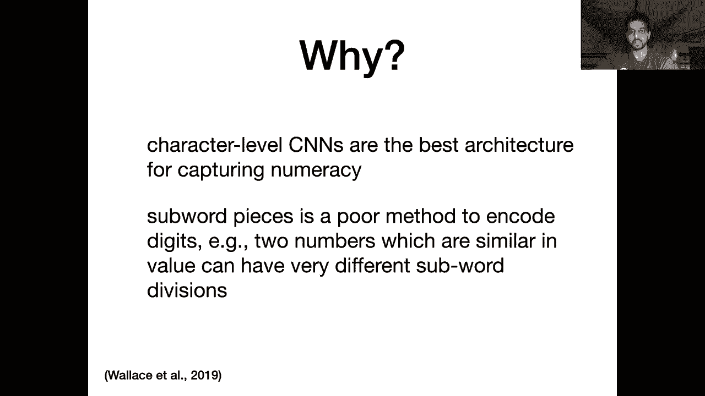

All right， so finally we can look at whether Bert can serve as a knowledge base so this again is following from your question four of your exam so we would like to be able to issue queries like you know where was Dante born to our model and hopefully its predictions would be actually factual。

😊。

So there is this Lama probe task which focuses specifically on this kind of probing so normally if you had some sort of knowledge graph you could query it by these kinds of triple so you have two entities and you have a relation and in this query you're given one of the entities and the relation and you're asked to predict the other entity so if you wanted to replicate this in a Bt like setting。

 you would reformulate your query as a sentence with a mask in it right this is just like Harry Potter's social security numbers blah。

 blah， blah and then you're going to see what goes into that mask token。😊，Now。

 of course this setup has a lot of issues with subword tokenization。

 what if Florence was not just one word in the vocab， but it was multiple subwards。

 then it becomes a little trickier to do this， but I believe this probe task is set up to avoid that issue。

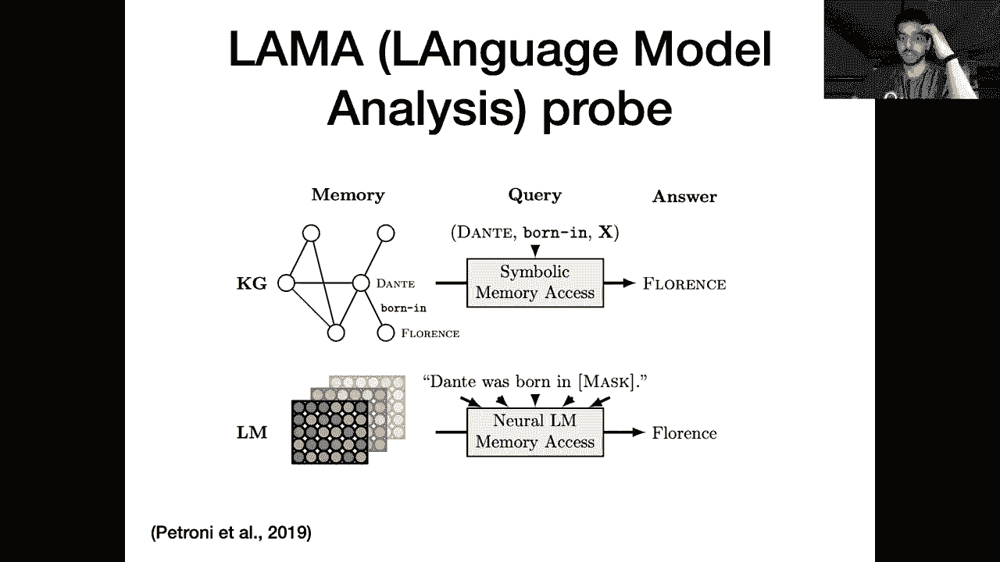

Okay， so yeah， in this task they defined a bunch of templates that kind of map from one of these triple based queries to an actual natural language sentence with a mask token in it。

 for example X was born in S was born in O would be the equivalent of a place of birth relation。

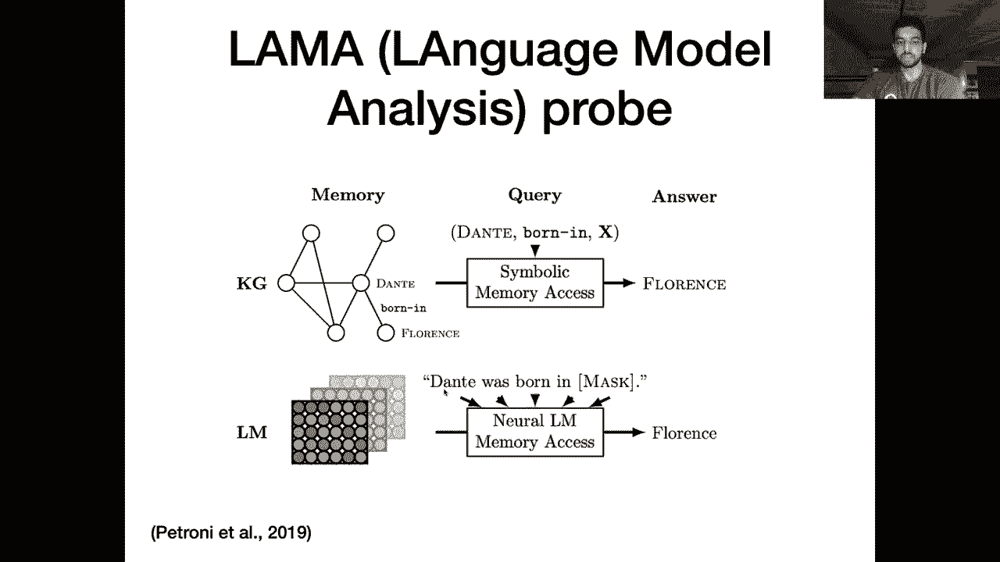

And yeah， then in some sort of ground truth， data set， let's say Wikipedia。

 you would find sentences that have both the subject and the object in one of these triples and then mask out one of the two。

 you hear the object to kind of train this probe task。

Allright， so let's look at some examples here there are a couple of different types of relations。

 so iPod touch is produced by and you have the ground truth answer Apple and you have the model's predictions So here the model gets this right but for something like。

😊，I don't know。 Let's see here a joke would want would make you want to blank。

 The correct answer here is laugh， so this is not。嗯。Like。A kind of knowledge base fact。

But more of a common sense kind of knowledge。And here the model that they're acquiring actually puts cry as more probable than laugh。

 which is kind of bizarre。And， you know， some of these are kind of open ended。

 so typing requires blank， the correct answer is speed， but of course patience。

 precision accuracy are all viable here registration is a little confusing。😊，And yeah。

 so you can see that all the ones in the top half of this table are directly related to entities and their relations and some of them might still be vague。

 like Kenya maintains diplomatic relations with blank I mean they could have these relations with multiple countries and there was just one sentence that had Uganda as the object here。

 but you know all of these could be feasible or reasonable candidates， so this method is not perfect。

 I guess is what I'm trying to say， but with some careful curation of your probe examples。

 you can at least get some idea of what kind of knowledge your or model is encoding。😊。

And I'm not going to go through this table， but nowadays these kinds of burntbased models are actually competitive with the symbolic knowledge bases。

 the ones that encode all this knowledge like entities and relations in a graph so this requires either someone to manually construct and maintain this knowledge graph or for pretty complicated knowledge graph induction methods it's much simpler to just train a huge language model on unlabeled text and then query it in this way to recover facts and we're probably going to be seeing this more over the next couple years。

 the standard symbolic knowledge bases replaced with these huge scale language models which I mean they obviously take a lot of compute to train。

 but they encode not only facts but they're flexible as we've seen。😊。

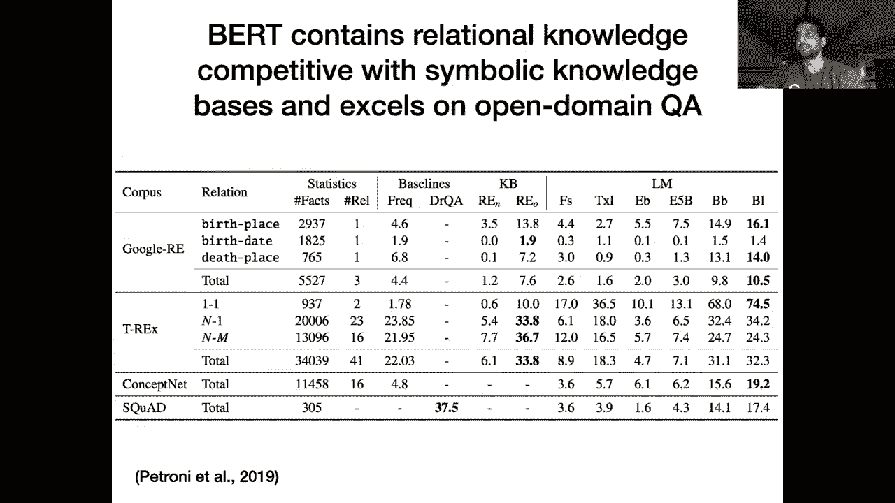

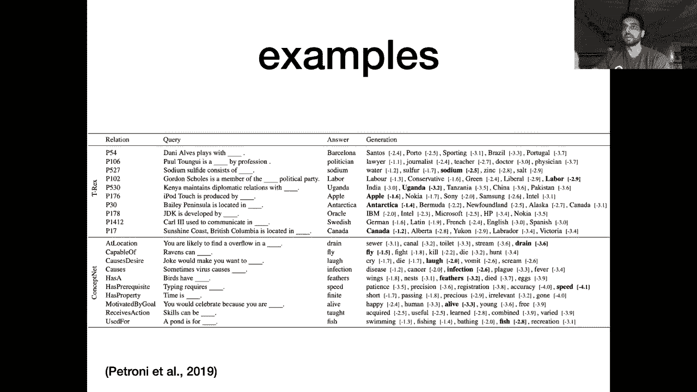

And you know， throughout the semester， they can be used to solve a variety of different downstream tasks。

 so yeah you can probably be on the lookout for it。

For more of this kind of fork over the next year or two。

All right， so let's wrap up by talking about the thing that we've avoided so far。

 which is the architecture and complexity of our probe network。

So one thing that we've sidesteppped is whether it's basically how how many parameters should we have in our probe network and there's kind of probes and cons for both if you have a very simple probe task and maybe you have just you know like a single softmax layer over your BRT representation this model is unlikely to be able to find information that is encoded you know in a highly nonlinear or inaccessible way whereas a complicated probe task that has multiple layers or more complex architecture might be able to uncover this information if it's like somehow deeply embedded within the representation On the other hand。

 if a simple probe task can recover the information that might be a sign that that information is very easily and readily accessible within the representation because even such a simple。

😊，Net could pick it out of the network。 So pros and cons to both。

And one thing that you really need to consider and this paper came out last year when you're developing a new probe task is adding a control task and this lets you kind of account for the confound of your probe complexity because if your probe network is you know super complicated and has a lot of parameters。

 it can actually learn most functions so in these control tasks。

 what you do is you take the vocabulary of your model and then you randomly assign certain words to certain labels。

So let's say I'm interested in doing a part of speech tagging probe task。

 I'm going to make a control task where I select random subsets of my vocabulary and assign them to random labels。

 So here the exclamation mark and the word after are assigned a label 42 the words the and ran are assigned to label 10 Quick and dog are assigned to 15。

 These are just a random subsets。 So there's no reason why we're doing this。😊。

Compared to a part of speech tagging data set where cat and dog would be in the same label right they're both nouns and exclamation point and period would be in the same cluster because they're punctuation marks。

 here there's no reason behind the labeling of the control task。

So you can see now I have two different tasks， one is predict the part of speech tags given the BRT representations of say the cat ran quickly。

 this is a determiner noun verb and adverb so this is the ground truthop part of speech tag sequence that the model is predicting。

 but now we also have our control tasks so we're asking the model to predict these like random assignments of various words。

😊，So like the and RA have the same label in the control task。

 but of course they're very different words， so the idea is that a complex probe network could even learn the mapping between control task labels and the words。

 even though they're completely random， given enough parameters。

 the the control task could also be solved。😊。

And so right， this， I've just explained how you get the control task。

 it's just making random assignments to words in your vocabulary。

So the idea behind this method is that you have your normal probe task。

 but you also measure the performance of your control task so in this plot you see a proxy measure of the complexity of the probe task just like the number of hidden units in the probe network and on the y axis you see the accuracy of the probe task and here we're plotting two different probe task one is the part of speech tagging and the other is our control task with a random labels。

So we see with the less complex probe network with just two hidden units。

 our part of speech tagging performance is somewhere near like 85。

 but our control task performance is way down at like 35% so there's a big gap between the part of speech tagging probe task and the control task。

 this indicates that the probe task， the probe network was unable to learn the random mapping of the control labels and it was able to learn the part of speech tags which indicates that that part of speech information is really helping the model。

 this simple model achieve a good accuracy。😊，So they define a selectivity as essentially the difference between the probe network and the control tasks。

 so if the difference is large， then the model is more selective and if the difference is small。

 the model is the probe network is less selective。😊。

So the idea is that you kind of want to maximize your probe task performance so you can see that with 10 hidden units。

 I get up to like 95% accuracy and part of speech tagging and my accuracy in the control task although it's improved is still much worse it's below 70% so this might be an ideal complexity of the probe network to choose。

 you can see that if I increase the complexity of my probe network to say100 hidden units。

 now both networks， both probe tasks are doing about equally well。

 like the accuracy of my control task， which again is using completely random labels is almost equivalent to the accuracy of my part of speech tags data set which obviously has sensible and meaningful labels to us。

😊。

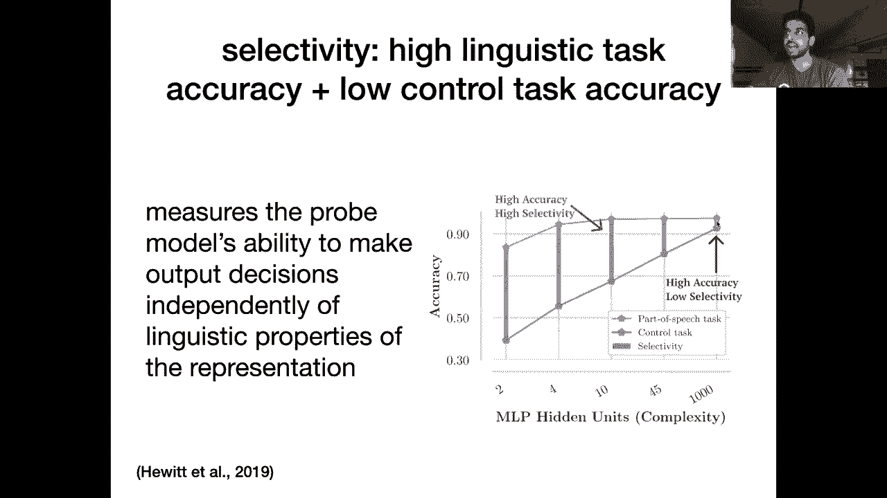

So this is important if you are thinking about doing some probe tasks in your final project。

 make sure you do a control probe， it's very straightforward to set up and you can make a plot like this to kind of validate your choice of probe architecture。

And yeah， the message here is just be careful about your probe acuracies right you can have a very。

 very high accuracy on the probe task that you care about。

 but its it might be misleading if the accuracy in a control probe is also very high with the same network。

So for part of speech tagging， for example， a single layer network is better than a network with non nonlinearity and one hidden layer。

 as you can see they achieve similar acuracies on part of speech tagging but the one with only one layer is much more selective meaning the control task performs much worse than when you have an additional layer here。

😊。

Okay， so I see there's a question when doing queries in case they are not clear to Bert。

 I wonder if adding a sentence describing the keywords helps Yeah that is definitely true and this is something that will probably see more of as models like GT3 become increasingly available right you know that the knowledge might be encoded in there somewhere。

 but you may not know the exact way to query the model to get that knowledge out of the network。

 so you might want to do things like you know paraphrase your query or add more context to it。

 retrieve information that's relevant about keywords or so on all of those are reasonable things to try Yeah so good point。

😊，Okay， so let's wrap up here one thing you can do once you've implemented a probe task just to analyze your model is you can actually try and improve your BRT model if you see that it's lagging behind on a particular probe task and the way you can do this is simply just add your probe objective to your normal BRT objective and then basically just fine tune it so the idea is that if you add this objective during BerRT's pretraining process then that information will be encoded in a easier to represent way in the final hidden state。

So one example of this is this Nobert paper from last year in which the idea is just adding more information about entities in the text into the Bt processing So here we have a sentence print saying purple rain these red networks are all from Bt you know self-attention computations in Nobert。

 we extract the vectors that correspond to entities。

 So prints and purple rain and then we kind of augment these representations with representations about those entities。

 So for example， purple rain album， film song， I can have separate entity embeddings for each of these that have been trained through some separate process。

 similarly print musician obviously the one being referenced here。

 So if I have an entity embedding for for prints， then I can just simply add it。😊。

to the vector for that I got out of my contextualization process。

 I think in this paper they use a more complicated composition function。

 but once you you add in all of this information about these entities from some static set of entity embeddings。

 you can then apply another layer of self-atten to recontextualize the information with the new information you got from your knowledge source。

 so this is an example of improving BRT's ability to capture relations between entities in its vectors。

Okay， so I think that's all I had for today and yeah， look forward to seeing you next Monday。

