# 【双语字幕+资料下载】马萨诸塞CS685 ｜ 自然语言处理进阶(2020·完整版) - P25：L20- 语义解析 - ShowMeAI - BV1BL411t7RV

Okay， hey everyone， so welcome to the last week of class today's topic is semantic parsing with a focus on question answering。

Wops， all right。So I know we covered question answering before at a kind of high level with a focus on reading comprehension style QA。

 but today we're going to talk about something a little different。

 a little more interesting from the machine learning perspective。So before we get into that。

Some logistics stuff， so you have a quiz， do this Friday。That'll be， of course。

 the last quiz of the class。Your homeworks are in the process of getting graded。

 so hopefully you'll have those grades soon。 The past fail deadline December 4， the same day your。

Project reports are due， so if you want to switch to pass failil or I guess S on set or whatever they call it。

 you need to send an email to the instructor's account with your request by that deadline and we'll take care of it。

Other than that， again， just a reminder， your exams will be graded by the end of the month so still a while to ago and the last class of the semester on Wednesday will be a guest lecture with a PhD student Lorraine who's going to be talking about common sense reasoning and may touch on some topics related to knowledge graphs as well for those of you interested in that。

Okay， so what else did I have to say。Oh yeah right just as some added comfort for some of you who are worried about your grades。

 this is the grade distribution of people from last semester's class actually I think this is from 2018 regardless the point is that most people get pretty good grades so you shouldn't stress too much about your grades and you also have the past fail option if you want to take advantage of that。

So regarding the threshold for pass fail that will be determined after all of the final grades are are in。

 but I think what。From Elliott's email， it's anything above a C so you can see from this picture that most。

 if not all people will pass。

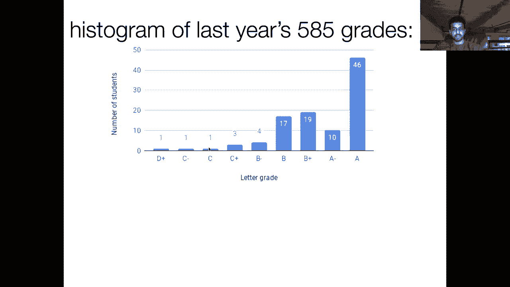

Allright， so let's get into the topic of the day。 So semantic parsing is a task by which you take a natural language sentence and you convert it into some sort of intermediate logical representation that is then executed by some external module to produce a final output。

 So let's take a look at a practical example So here I might have a question how many people live in Seattle。

 And so we've looked at many ways in which we could devise models to answer this question。

 right probably the most straightforward would be at this point to feed the sentence into something like G3。

 just a left or right language model and see what kind of number or response it produces。

 or you could， you know， do the same thing with Bert maybe with some sort of mask for the answer。

 But you know， this is really kind of in。😊。

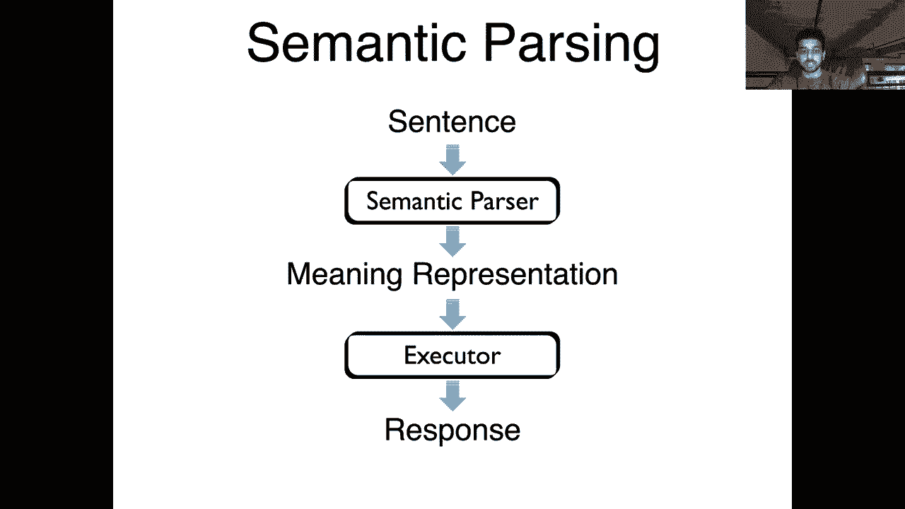

if you think about it， because maybe we can assume that we have access to some sort of external database or table that contains a bunch of cities and their populations right And so instead of actually trying to generate an answer to this question or even retrieve it from some like Wikipedia passage what if instead we were able to create a query from this natural language question that was able to be executed over some external database or knowledge source。

 So here we have an example where we convert this question into SQL。

 So here I have select population from city data， this is like some table where the city equals Seattle。

😊，And then some database software will execute this and return the answer directly from the database。

 So if I can figure out a reliable way of converting my questions into queries that can then be that are valid and can be executed by this executor model module then I'm in good shape to leverage the external resources that I have like this database right。

 and in many cases， this might be an ideal scenario for how you want to approach this kind of QA task but this semantic parsing concept is not just applicable to QA it's also applicable to things especially involving robots and instruction following right I might want to tell a robot go to the third junction and take a left right and maybe I don't just want to give it a burnt representation of this instruction because then it has figure out how exactly to。

😊。

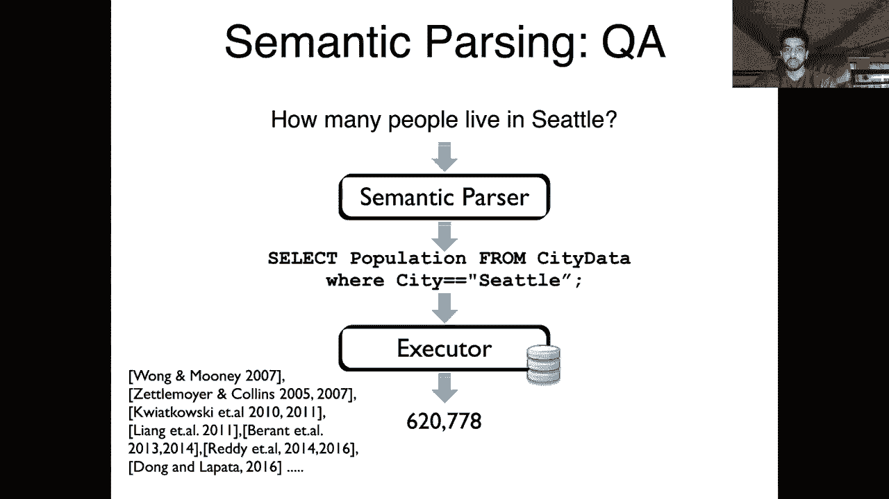

You know extract the relevant instructions from this dense vector representation instead it's very likely that my robot has some sort of primitive language that it operates using right like move to or forward lo or you know turn right right these primitive commands that it knows how to execute with its internal software。

😊，And maybe I can take this natural language instruction and just convert it into a sequence of instructions that the robot actually understands and then it's easy for the robot to execute right so here go to the third junction and take a left。

 I've kind of rewritten this in this robot's language and if this parsing step happens correctly。

 then my robot will learn to navigate to the correct place right so this is a very practical application of semantic parsing。

😊。

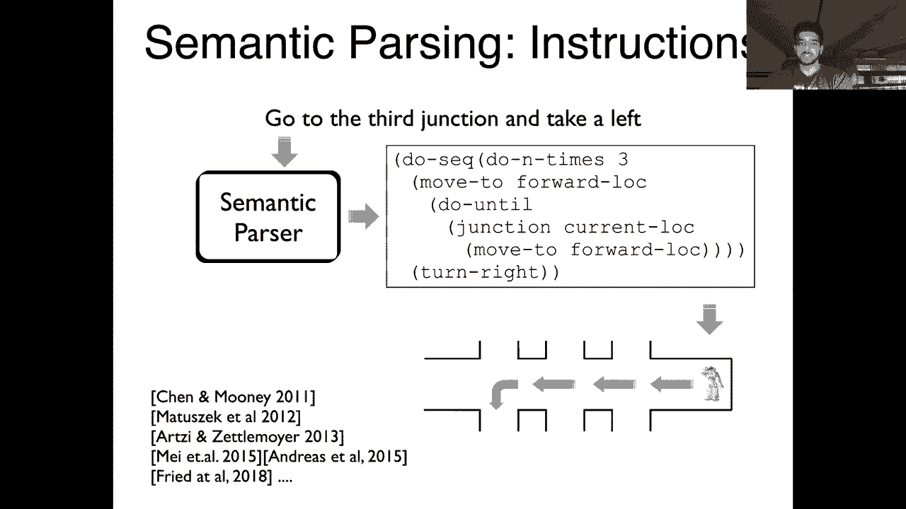

All right， the the challenge and what makes this a fun problem from a machine learning perspective is that。

Usually our data for semantic parsing looks like the input， natural language。

 sentence or question or whatever paired with the actual output from the executor model right module。

 So here I might observe this question and this ground truth answer。

 but I may not be able to get access to the ground truth logical form that Im my semantic pars is supposed to produce。

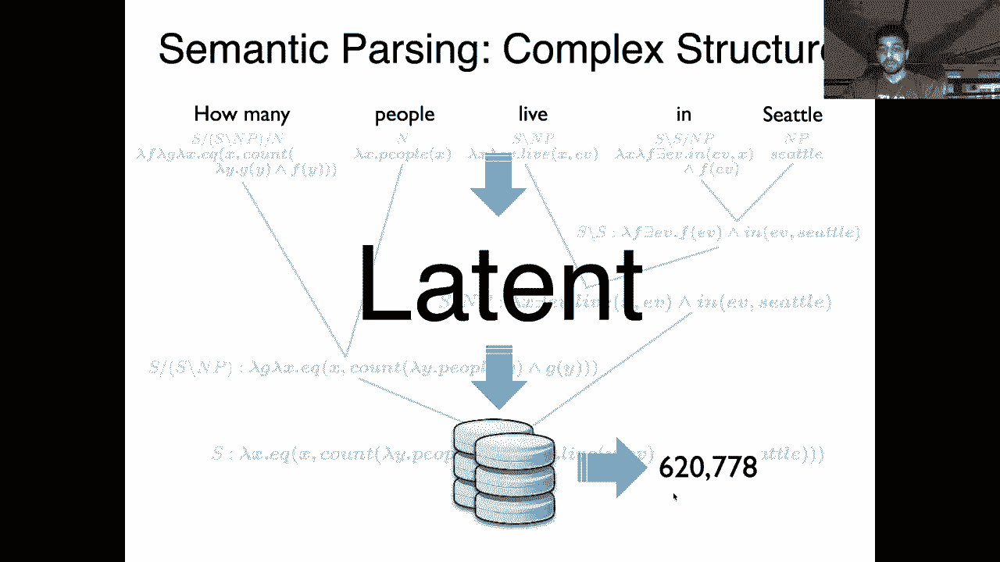

If you think about this， it's very easy for me to set up a crowdsourcing task where I tell people to answer。

 come up with answers to these questions so maybe a mechanical Tuer seeing this question would go to Google or something and pull up this answer and then add it as a response to this question if I tell a mechanical Tuer on the other hand。

 right a SQL query that allows me to access this answer from this database that is you know a lot of domain expertise is required to do this reliably and so it's really not very feasible or cost effective for most tasks。

😊。

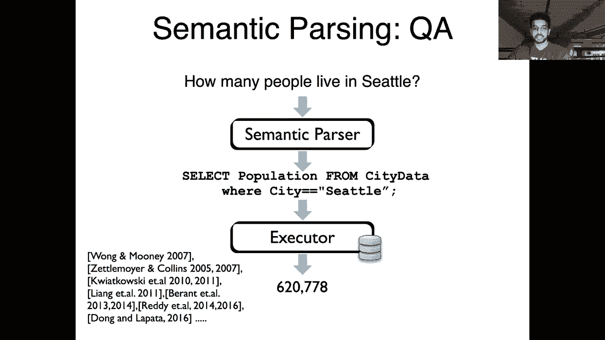

And even in this kind of instruction following case right getting these kinds of instructions is difficult right imagine asking someone to produce the ground truth program that is going to show this robot moving in the right direction instead you might have the instruction and you might have the start position like an image and an end position right this is much easier for for like a mechanical Turk worker or someone else who's doing these annotations to produce quickly。

😊。

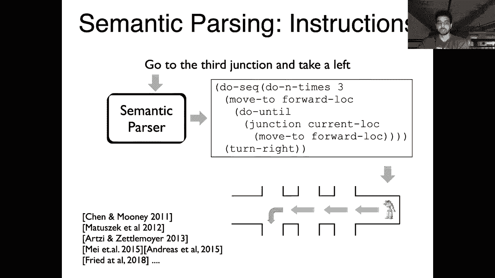

So normally we assume that we don't have access to the ground truth logical form。

 and this means that this part where we are actually trying to convert。

 we're building a model to convert our natural language into a logical form。

 we don't have supervision， so this becomes a latent problem。

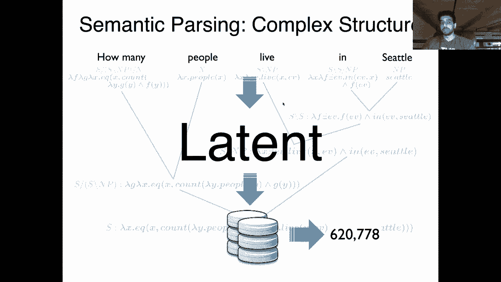

So just a little bit about how this problem has been treated historically semantic parsing for many years was the domain of CCG parsing。

 so I know we didn't talk much about parsing or at all really about parsing in this class。

 but essentially this approach relies on hand engineering like a grammar and a lexicon of things that you think our important say in the instruction following case like move is an important action I might want to have representation of move in my lexicon with particular semantics that kind of define how move is to be combined with other words in the sentence similarly I might have a rule saying you know chair is a noun if I see a noun next to some sort of determiner then I'm going to convert those into a noun phrase eventually my。

😊，Action move is going to require a noun phrase or sorry like a prepositional phrase to kind of guide it or modify it to tell it where the movement is actually happening and eventually I can get a complete parts of this sentence where if I'm grounded each of these items in some low level instruction then I can combine them into more complicated。

😊，More complicated actions like move to the chair。

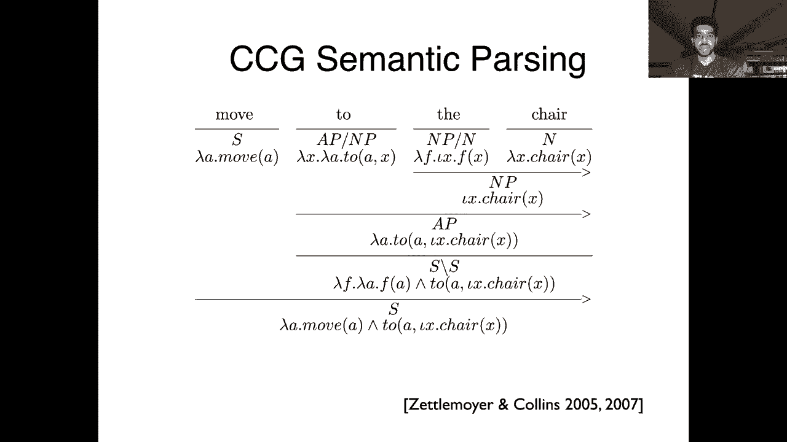

So as of 2016， this was the classic approach because since then it's kind of been largely replaced with neuralral approaches as you know most things in NLP have。

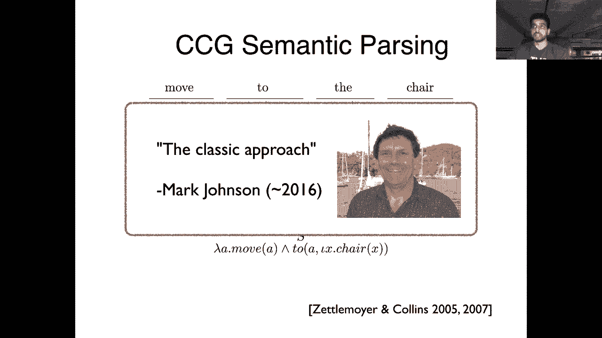

And one of the main drawbacks of this approach is the grammar engineering that has to go into getting these things to perform well。

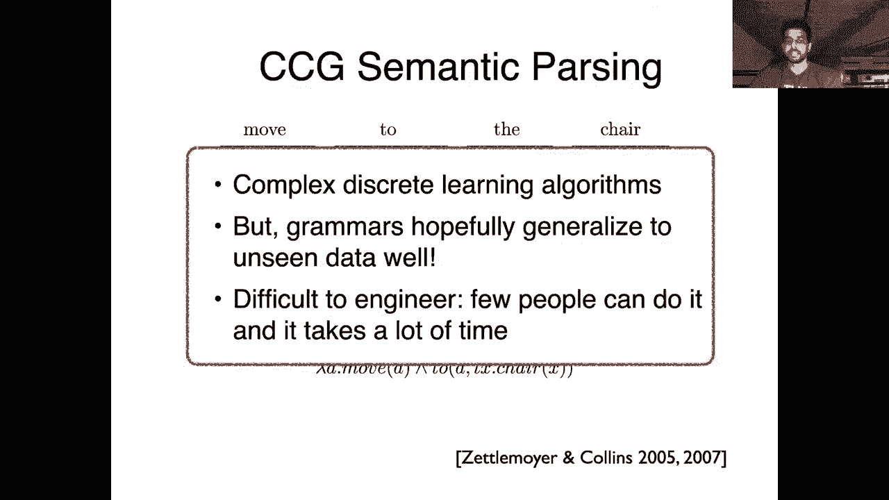

Okay， so in 2016， there was one of the initial attempts to treat this not as a kind of CCG parsing problem。

 but rather as a neural sequence to sequence problem。

 So here I have his input something like what Microsoft jobs do not require a BSCS。

 I pass this through my encoder decoder model， and my decoder is asked to produce the logical form like the tokens left to right of the logical form。

And so this actually performed similarly to the existing classical approach and it was really easy to build right because all I have to do is apply it off the shelf machine translation toolkit and just change the input and output to instead of being like English to French。

 it would be natural language to logical for。😊，So you know you can add attention。

 do whatever you know model these encoder and decoder with transformers， etcter。

 but there are some issues if you just naively port this task over to the sequence to sequence setting so let's take a look this is one of the actually one of your you're only reading for this class which I know all of you probably didn't do was the Wiki table questions paper so this paper introduces a questionansing data set where all of the questions are about a single HTML table from Wikipedia so here we have this table from like the Olympics athlete Nation Olympics medals and the questions are all guaranteed to have are not guaranteed but most of the questions are their answers ourselves in the table some of them might require aggregating。

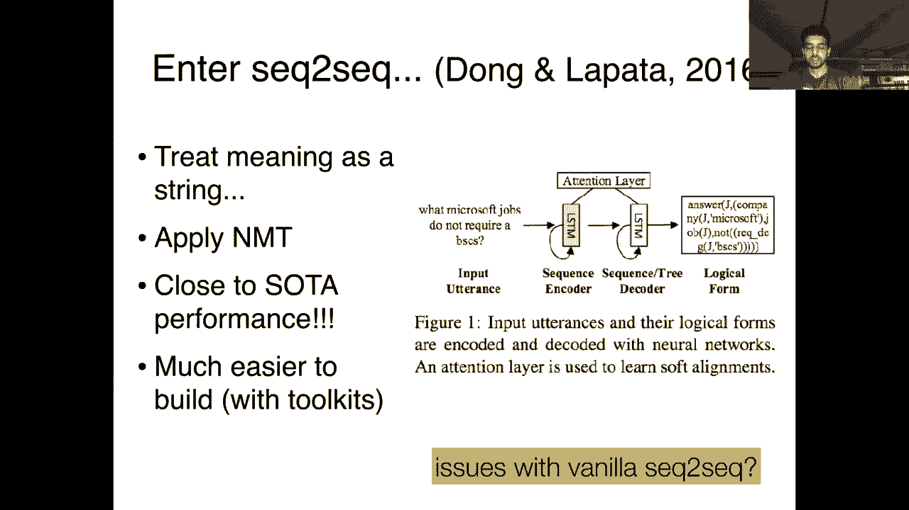

like maybe how many total medals were awarded to these are all different countries were awarded how many total medals were awarded。

 right would just require summing over the medals column。

 but the questions are guaranteed to be about a single specific table。

And so here we might have which athlete was from South Korea after 2010 So is not a great question because there's only one athlete from South Korea。

 but you could imagine converting this question into some sort of logical form。

 possibly like a SQL statement here in this paper they use a different kind of formal language。

 but essentially you're selecting this athlete column and adding a filter like a where statement in SQL。

 where the nation is South Korea in the year is greater than or equal to 2010。😊。

So this is what you want to produce and then execute over this table。

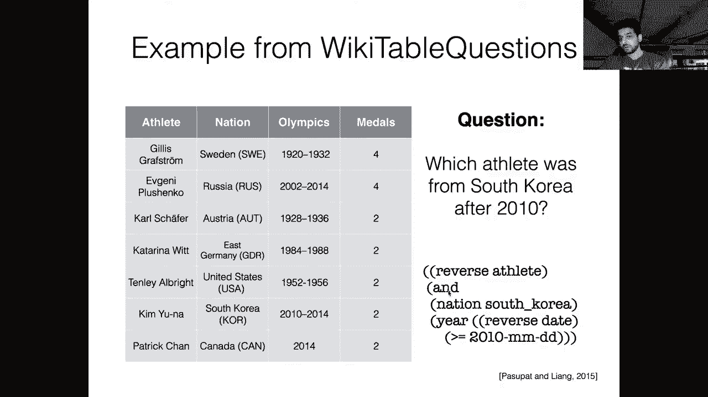

So let's think about what happens if we model this problem as a sequence to sequence problem。

So here we have one encoder in this example we're using an LSTM。

 which again is the type of recurrent network， but this slide was made probably before the popularity of transformers。

And the purple cells are the decoder right， we're going left to right one token at a time and each time step we have our full vocabulary of different word types in our vocabulary that we can choose to produce right So let's think about this if we look at this logical form and we think about this reverse operation is essentially a select statement。

😊。

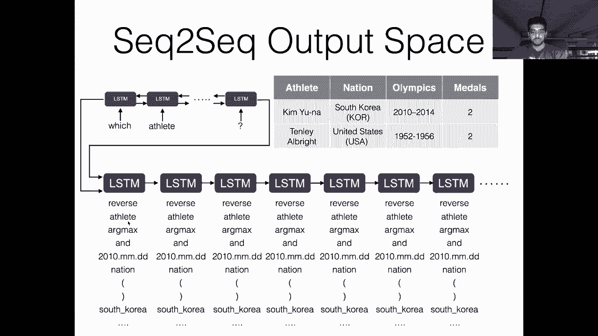

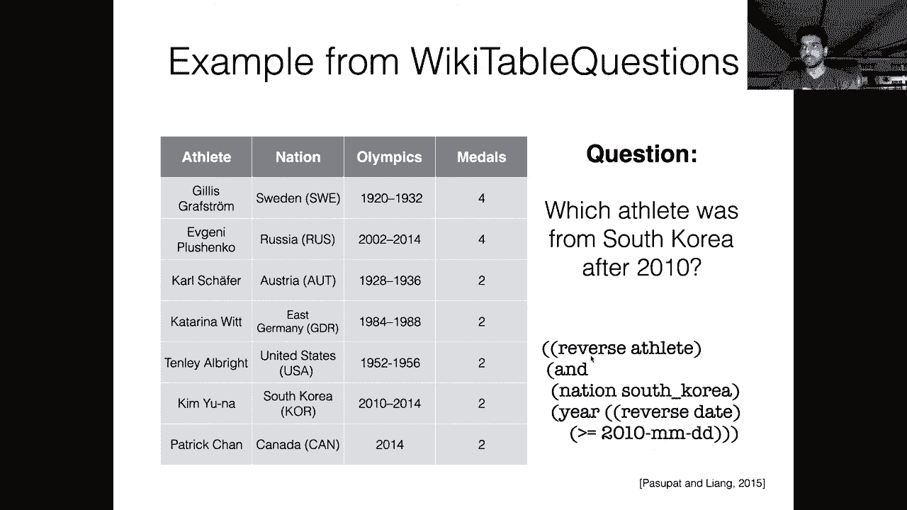

It doesn't make sense in many cases to use the full vocabulary to decode a particular time step right so if we look at this logical form。

 the first two tokens are parentheses right open parentheses and you can just assume that this is true of all statements in this formal language they're all wrapped in parentheses and so maybe you know like you have some prior knowledge that at the first time step I'm always going to produce in open parentheses。

😊。

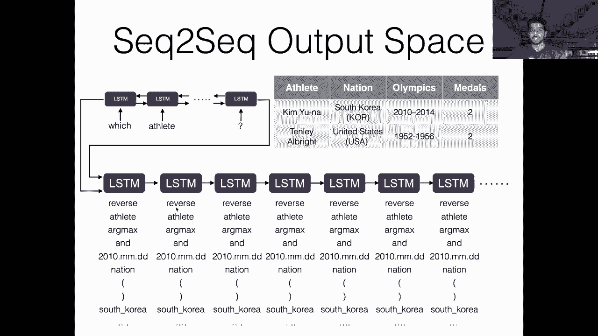

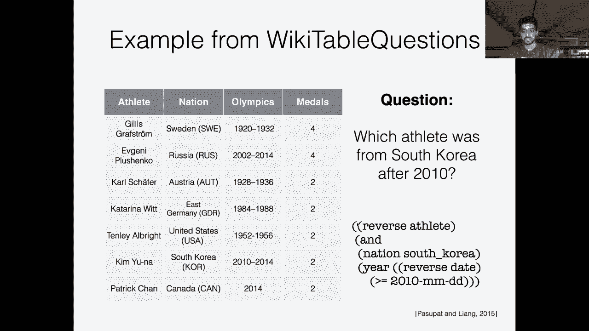

And maybe you know other things right， you know that after an open parentheses。

 I can only produce an action or an operator in in the formal language。

 I can't just put in a column name or cell name from the table right so I can't really choose something like South Korea to go next here because the formal language doesn't allow for that kind of usage right the grammar of these things is very restrictive and so if I select something like reverse again。

 similar to the select operation now I know that the next thing that I have to decode has to be one of the column headers right which is telling me what column I need to select so this obviously cannot be a cell it can't be you know like a closed parentheses right all of these things are not correct syntax in the formal language。

😊，So one of the issues with using normal sequence to sequence decoding is that at each time step。

 only a small subset of the vocabulary might be syntactically valid to output at that particular time step。

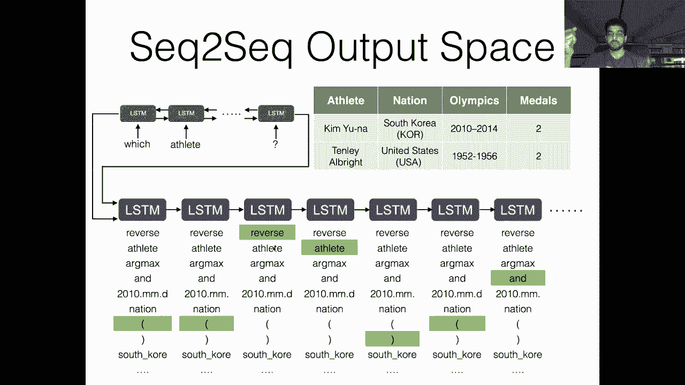

And this figure shows that more clearly， like at the first time step you can only really output an open parentheses。

 everything else in red here is should not even be considered by your model。

 and so you can see that the red cells here， especially at some of the time steps are vastly outnumbering the valid cells that you can actually choose from so you might want to do some sort of constrained decoding to take an account of the syntax of your formal language。

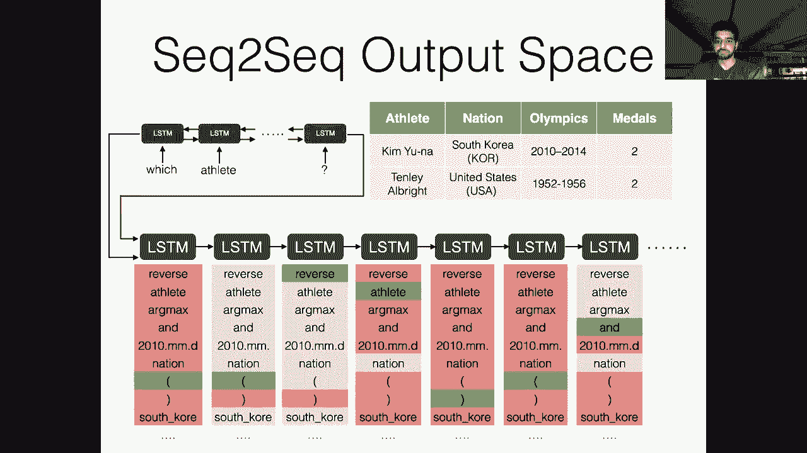

So constrained decoding is very， very simple to implement in these kinds of decoder language models all you have to do is define some rules that constrain your vocabulary based on the previous tokens that you observed right so and also possibly on the exact time step that you are so you can write a rule like if time step equals zero。

 then I will only be able to produce an open parentheses right so I'm not going to waste my time you know looking at the other items in the vocabulary because they can't even be produced。

😊，So there are two ways in which you can do this constrainbased decoding。

 the one we've just discussed is token based decoding so at every single time step you're constraining the vocabulary space to only tokens that are valid to produce within the syntax of the formal language。

 there's also grammar-based decoding where instead of producing actual tokens。

 you can produce these kinds of grammatical rules or sorry。

 just rules that you can have non-terminals that can be expanded into terminals or further nontermins。

 but your decoder will be producing these rules instead of actually producing the individual tokens of the logical form directly。

😊，And there's been work on both of these types of things。

 I should say that the token based decoding approach is definitely more simple and straightforward。

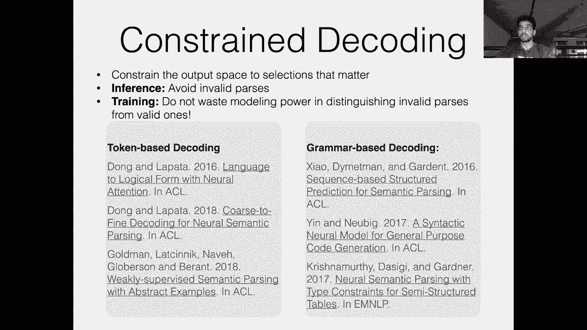

So one example of this kind of token- based decoding and this also gets a little bit of hierarchical structure into the decoder is the sequence to tree set up of Donan Lapata in 2016 so here you have a kind of travel booking task this is another case where semantic parsing is very useful so you might have like some user ask an automated travel agent show me all flights leaving from Dallas after four in the afternoon。

😊，And since there's not an actual human on the line， this automated agent needs to parse this。

 whatever the user said， into the phone， for example。

 into some sort of SQL statement that it can execute over its database of flights。So in this case。

 we're going to do again， this model produces all of the tokens of the logical form。

 but it does so in a kind of interesting tree like way。

 So it'll first produce a high level template of the logical form so you see that here again。

 this is another different kind of formal language。

 So don't worry if you don't quite understand what each of these operators is doing but here we produce some high level template。

 and then we have this kind of filler token here， this and in brackets。

 this indicates that at this particular time step， I want to expand this into further like。😊。

Tokens or sorry， word types in the vocabulary or possibly also more of these filler tokens that can be expanded themselves later。

Right so we see here that this token is expanded into the end and then a bunch of blank tokens。

 which are going to be the expansions of these two clauses in the logical form。

 So here you can see finally at the lowest level of this tree， the departure time。

 the most nested thing here is getting decoded。😊，But all of this is implemented with a decoder in which we are doing some kind of special modeling to connect hidden states that are at a higher level of the hierarchy down into expanding them into the lower level parts of this logical form。

But this is a pretty straightforward way to have like both the global knowledge of the structure of the query。

 as well as being able to decode all the way down into these low level statements。😊。

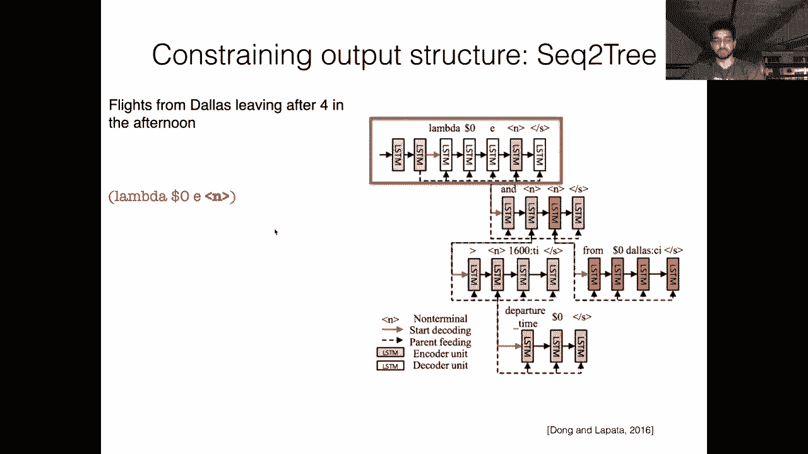

So this is just a demonstration of that。Okay， so now let's turn to the interesting question of how do we train a semantic parser？

So I hope the chat box thing is working properly， I don't see questions， which is fine。

 but I want to make sure I'm not missing any。So of course， if this。

 if you have supervision for the logical forms and remember I mentioned before that we usually don't have this kind of ground truth logical form。

 then it's very easy to train this right I can just train it just as I would a machine translation system using the ground truth logical form as the reference in the decoder。

😊，So this is not interesting， but it's also not very practical because it's hard to get these logical forms to train against。

So the more likely case is the weekly supervised case。

 So here I might have something like which athlete was from South Korea after 2010 and I might have the actual answer to that question。

 right which cell in the table answers this question， This is something that a mechanical Tuer。

 for instance， can easily do right， Just click the cell in the table that answers this question。

 What they can't do is produce the actual logical form that leads to this cell when it's executed over the table。

😊，So if I have the question and the ground truth answer， but no logical form。

 this is a weekly supervised problem because the goal of my semantic parser that I'm training is to produce the tokens of the logical form。

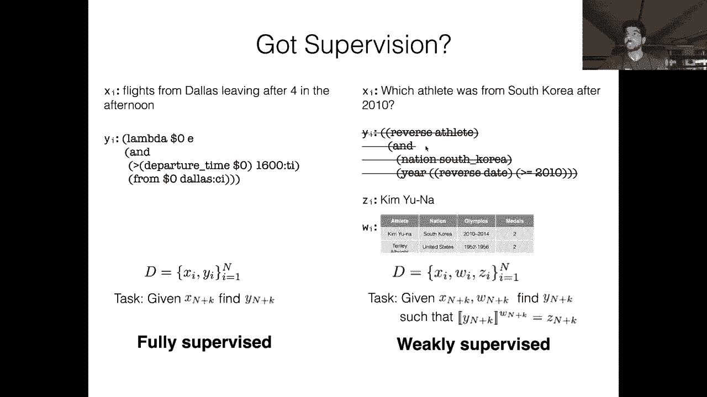

Okay， so there's roughly three different training methods and we'll go over each of them a little bit briefly。

 but just to get the high level intuition of what's going on here。

Because I know we haven't covered in detail at all any like reinforcement learning or even structured learning。

 so this is just for you to get a flavor of the different kinds of methods that are useful in these kinds of scenarios。

 especially because on the methods side we haven't actually talked about too much too many algorithms beyond you know just like backpro and yeah。

 like gradient descent right everything we've seen to this point is' pretty easily solved with backpro。

 gradient descent， maybe using some sort of beam search at decoding time the actual training algorithms themselves are not that interesting right what we have focused a lot on is how we design our models。

 different types of architectures， different objective functions that are used to you know compute the gradients for things like backpro。

😊，For this kind of weeklyly supervised semantic parsing problem， things are not as simple。

 and this is because we don't have the ground truth supervision of the logical form。

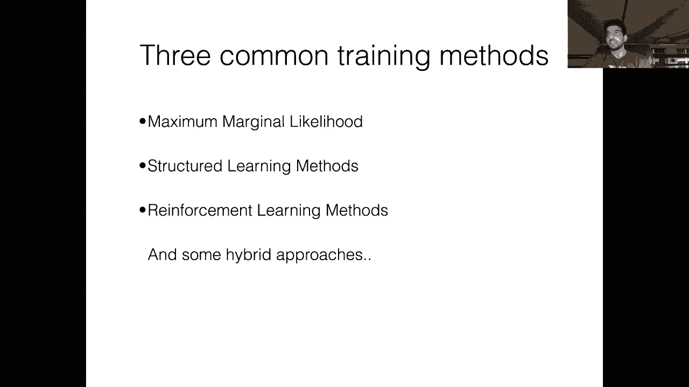

So let's take a look at maximum marginal likelihood training so here we are given。

 remember let's get some of the terminology straight so x refers to the natural language sentence or question Z refers to the ground truth answer of that question like possibly the cell in the table and y refers to the logical form So in our setting we do not know y and that's what we actually so of course we want some sort of model that gives us the correct answer Z Z given the input question X but we're not just directly computing some function that takes as input X and produces Z as output right we instead are have some function that's taking X producing this logical form Y which is then handed over to some like executor model to get the Z so importantly。

😊。

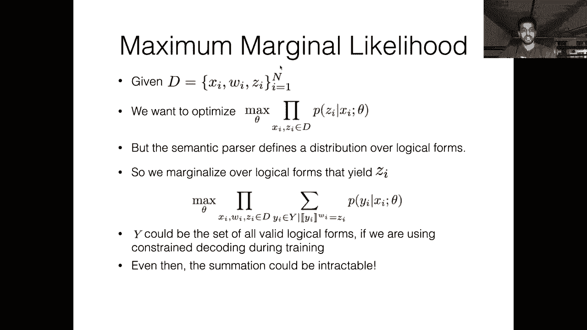

That second step of taking the Y and going to the Z that's not something that we can normally backpro through right we don't really know what the SQL thing is I mean it's just executing some code to run our command over the database right that's not a trainable part of our pipeline so the only thing we can train here is the thing that produces the Y。

 the logical form given the X， the natural language question。

So this equation is then what we end up optimizing right we're going to marginalize over all possible logical forms that could ever be created and are valid in our formal language and we're going to look at all of those that result in the correct Z when executed by the executor model and we're going to optimize our model this way so you can see here this why the capital y is the subset of sorry that's the space of all possible logical forms and here this y subi is part of the subset of these logical forms that when executed by the executor leads to Z subi the answer in our example Kim Uno。

😊，So the the problem with this kind of formulation is that figuring out all possible logical forms that when executed lead to this answer is usually intractable and also just like enumerating all possible logical forms instead in in most settings other than like really。

 really synthetic and small settings just not feasible。😊。

And so this approach is generally not used directly， but this formulation is used。

 but we're going to do some approximation to this subset of logical forms。

 like instead of using all possible logical forms that execute to the answer。

 we're going to do a search and maybe find some logical forms that execute to the answer or even execute to something similar to the answer。

 even if they don't directly execute to the answer and we can use those to guide our training。

 So our training signals in this approximate search process might be a little noisy。

 but we're hoping that they give us enough signal to train our semantic parser。😊。

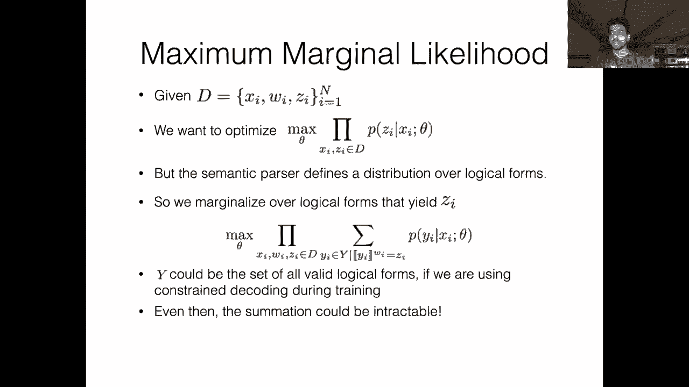

So these kinds ofs involve some sort of heuristic search over the state space of all possible logical forms。

 and we might take some sort of subset of the logical forms that we found and use margin based loss functions to train our semantic parser。

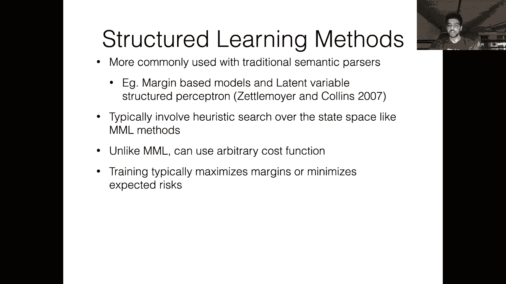

So when we're approximating this set of logical forms， this capital Y， we of course。

 want to find logical forms that are either directly executed to the answer or are close closely related to the answer right so maybe you have a logical form in this example like which athletes participated in the Olympics after 2010 right And so this question would return not only Kim Yuna。

 but also other athletes in the table who participated after 2010。 So in this case。😊。

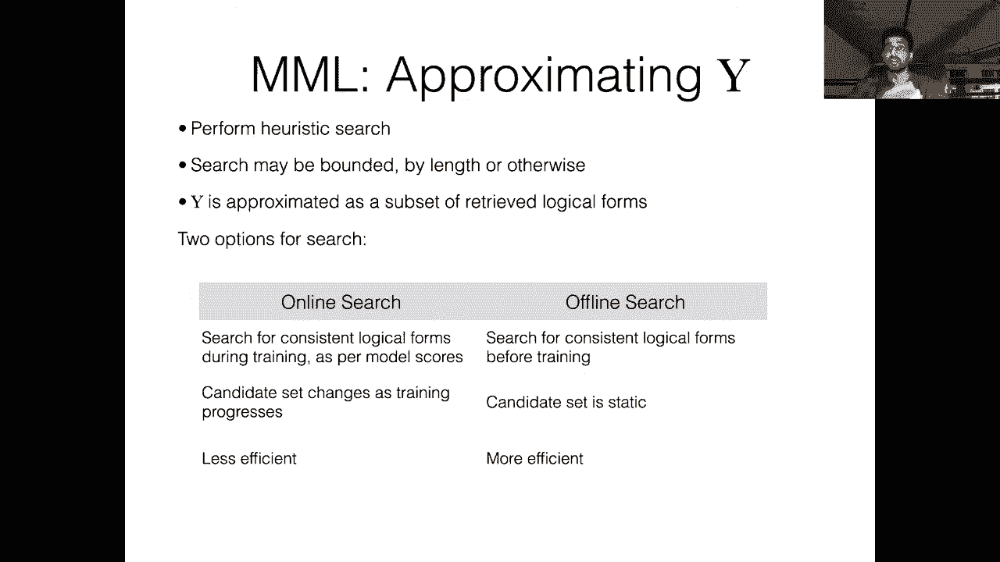

If I find a logical form that executes to a bunch of other athletes and including Kim Yuna。

 it might not be answering this exact question， but it still gives us some useful signal， right。

 It's returned part of the way to what we want。 and maybe we just need some further filtering to get to our correct answer。

 but this could still be useful when training our semantic parser。

So we can use you know different ways of pruning our search space。

 we can look at you know overlap between the you know current logical forms that we have in the ground truth answer and set some thresholds that way or we can use actual search we can use another sorry another alternative is use like just sort of overlap between the answers that are retrieved after executing these logical forms and the question。

 there's many things that we could use to narrow down our search space。

And so generally there's two ways of doing this search。

 one is online in which case every time you see a question a training。

 you're going to do a search just for that question to get a set of logical forms that are then going to be used to update your model so this is usually good because your candidates can generally become closer and closer to the correct logical forms as training goes on and but it's also not very efficient because you actually have to do this search for every question the offline search for in contrast this means that you just do the search offline。

 you not not during training and so you have a static set of candidate logical forms。

 so obviously this is more efficient because you're not searching during training but it's also less likely to work well unless you have a really good way of doing this search without any sort of train model。

The mix generally it's hard to find these logical forms so if you could do them using some sort of heuristic and you get a set of logical forms where it's usually the case that some or all of them execute to the correct answer then your problem might not be as complex as you think it is and so generally the methods for more challenging types of questions use online search。

😊。

All right。I still see no questions。 So I assume everyone is。Fling along。

Or it's just the last week of class and people don't care anymore。Anyway。

 so the third strategy here is reinforcement learning again conceptually this is just a method of approximating the search space of logical forms but here instead of doing a search to kind of find relevant or you know logical forms that exactly evaluate to the answer we're going to use sampling instead so we're actually going to have some sort of function that we're using to assign you know probabilities to different types of operators or arguments and sample the logical form guided by this function and we're going to train this function using a reward signal which is did this logical form execute to the correct answer or not。

😊，Reinforcement learning in practice is kind of difficult to get to work well for these kinds of problems because you have to make a lot of incremental decisions right the process of coming up with a logical form like this is actually decomposed into a sequence of token level predictions right and so if I'm doing a sampling at each stage of my decoder I have a lot of different decisions that I'm making and this can lead to problems with credit assignment right I may not know which decision that I made which particular token that I sampled is causing me to have you know zero reward。

😊。

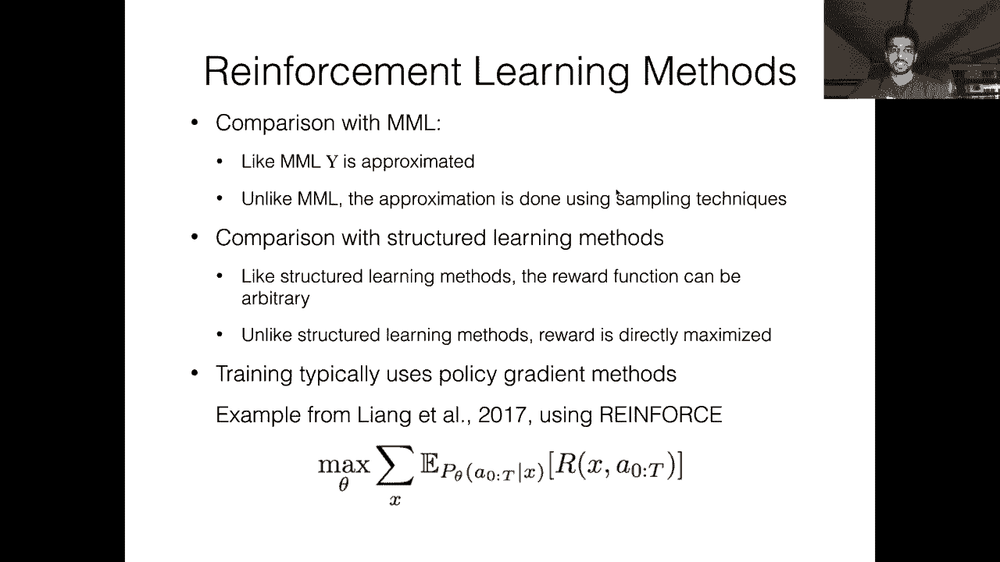

And that's the other thing in many of these problems。

 if you make even one small error in your logical form。

 you're going to get zero reward in that your answer may not match exactly the correct Z sub I for that question In that case you just don't get a reward you can get a little clever about designing your reward such that you give some sort of partial credit。

 but it's really task dependent。So yeah， there are also methods that are that kind of hybridize different strategies that we've discussed here like search and reinforcement learning。

 and we'll look at an example of that a little later but yeah the machine learning for these kinds of problems is very interesting and this is also related to some attempts in NLP to train machine translation models using just something like the blue score reward。

 not the maximum likelihood against the reference sentence。

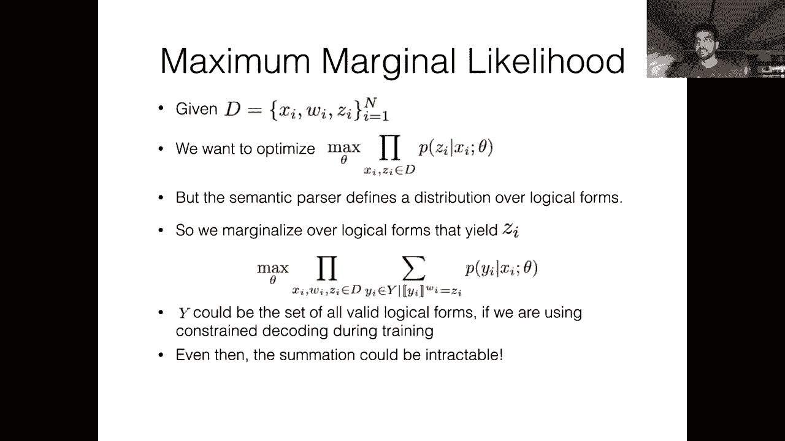

So。Yeah， if you're interested in that， there are some nice papers to check out。

That I can share later。

Okay， so let's take a step back。嗯。We've looked at these kinds of sequence to sequence approaches for semantic parsing。

 so you are trying to convert these kinds of questions or programs or whatever to sequences of actions in a logical formal language。

And if you're going to implement this with sequence to sequence modeling。

 you should know what kinds of actions are valid at each time step and what subset of your vocabulary should never be produced at a particular time step。

Usually you need a way to execute these programs right。

 you need an executor model that's going to tell you whether or not a particular logical form gives you the same answer as your reference or not。

And finally， in the most practical setting where you don't have reference logical forms。

 you're going to have to use one of these strategies that we've just described。

 reinforcement learning or search to actually feasibly train your model。

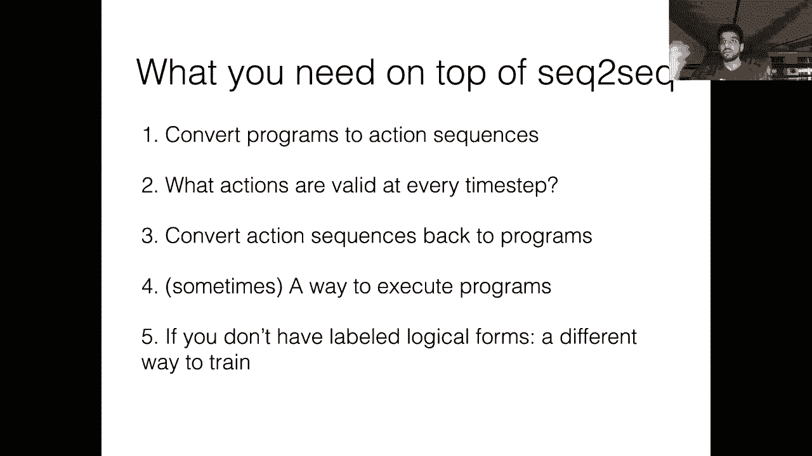

Okay， so the last thing I wanted to discuss was one of the projects that I worked on as a grad student that was related to semantic parsing and QA and kind of combines a bunch of these methods together and again we're just going to do this at a fairly high level since we have not gone through the proper background to go in。

In full detail。So here we have tasks like。Conversational semantic parsing question answering。

So you can imagine you know asking your Alexa or something how much protein is in an egg and of course she would likely be able to answer that correctly。

 but then you might want to continue on that line of questioning right and ask you know a follow up question how many carbs are in an egg and for the conversational agent to correctly answer this question。

 it needs to be able to know that there's an implicit reference to an egg in the follow up question right。

😊，And that is not actually egg is not mentioned in this follow up question， but it's implied。Okay。

 so we look at this this conversational QA problem in the grounded in these tables from Wikipedia。

 so it's very similar to the Wiki table questions data set that we looked at briefly。

So here I might have a table like this， this women's water polo World Cup and I have a question like which nations competed in the FEA Women's water polo Cup so of course。

 to answer this question， if I were to be using some sort of sQL like language。

 I would just issue a statement like select N to my executor which would select this entire column。😊。

And so in our version of the formal language， Select N is a logical forum that's valid that can be executed to yield in answer。

So then we have these follow up questions right of these nations。

 which ones took home at least won gold medal。 So now these nations are referring to the answer from the previous question and so。

😊，We have this kind of subsequent operator that is able to fetch the answer from the previous question。

 and then we can add some sort of modifier to it right where gold is greater than zero or not equal to zero。

😊，Then I can ask another follow up question， which one's ranked in the top two positions and so here I'm adding another modifier and filtered out this subset further。

Okay， so we collected a data set mechanical Turkers asked these conversational questions。

 and importantly we only know the question and the subset of cells from the table that answer this question。

 we don't know the ground tree logical form， these SQL like statements。😊。

So we use a kind of hybrid of reinforcement learning and structured output learning to solve this problem and let's go over it step by step。

So let's take the question which nations won exactly one gold medal。

 and there's only one answer to this question from the table， and that's H。

 it won only one gold medal。

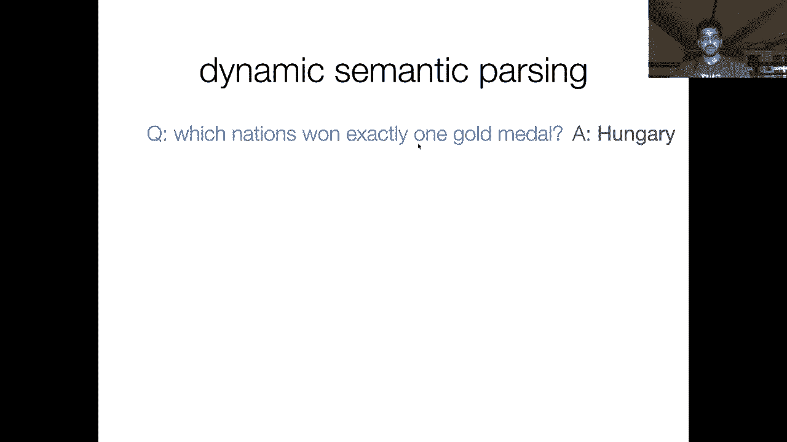

So I want to produce a logical form that looks something like this。

 select the nation column where the conditional column gold is equal to1。

 that's what I want to produce， but I don't know this ahead of time I don't have this reference to train my model。

So what we're going to do is some kind of guided search where we're going to start from substar state and we're going to search through our space using a kind of policy function that guides us and tells us like with some probability you should pick this particular action。

And so here maybe we sample two different actions here I've just written it select nation select rank as single actions to be concise so here we select nation select rank these are two samples obviously when we're looking at this we know that select rank is going to be completely wrong right there's no way I can get hungry from a SQL statement that begins select rank to a completely different column。

😊，But our model doesn't know that， right， so it has to learn these things from this kind of search process。

So I'm going to sample one action， then I'm going to feed in the current state to my function and sample another action here I condition on the gold column。

 I just sampled equals one and at the end when I've completed sampling an entire logical form I can execute it over my table。

And so when I execute select rank condition gold equals1 on this table。

 select rank where rank equals or sorry， where gold equals 1， I get rank four， right？

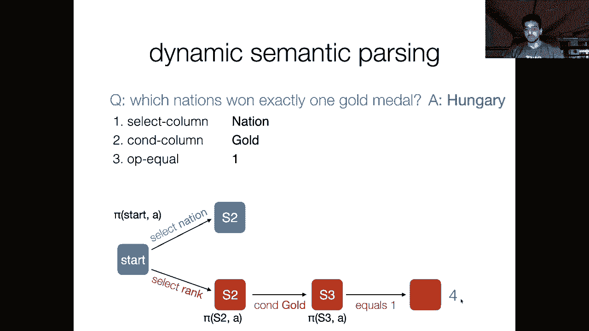

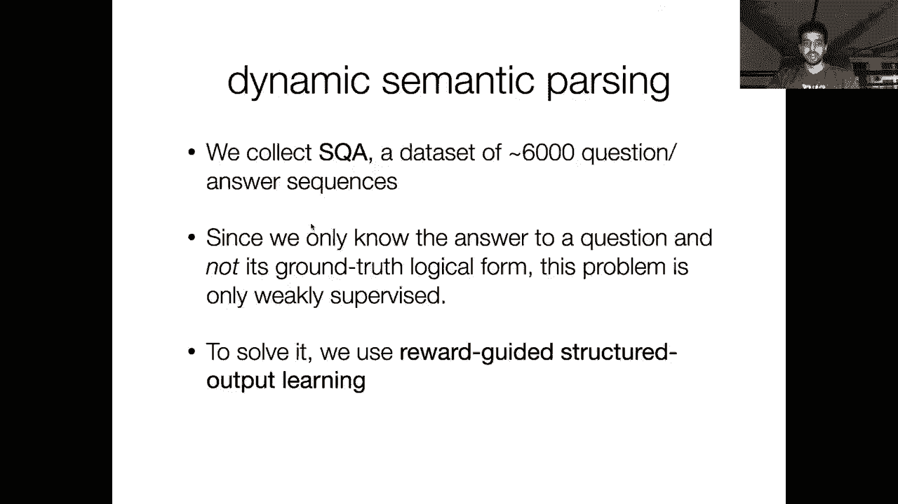

And so what do I do with this， Well， there's no overlap between four and Hungary right。

 so it's very likely that this path here is not going to be a good candidate for me to keep in the logical forms that I'm using to update my model。

I want to minimize the score of this path for future occurrences of this question where I want the model to learn never to sample this rank column right it's always going to be wrong。

 So I want to down weight the score of this path and in contrast。

 I think select nation is going to be a good starting point and remember at each of these steps I'm sampling multiple paths So we've just shown three total paths here。

 one of them is the correct path。 This is the one that we want to kind of maximize the score of select nation condition gold equals one。

😊，But one problem that I wanted to highlight in this figure is that we can also have path logical forms that are not- they don't correspond to the question。

 but they evaluate to the same answer。So here， select nation where the rank equals four also gives me hungry。

 even though this obviously does not match the question right， if I wanted this logical form。

 I might have asked the question， which nation had a rank of four but instead I asked the question which nations won exactly one gold medal and the top path here is the one that I want to maximize for that。

Unfortunately， these two paths， the model can't distinguish between them， right。

 they both evaluate to the correct answer， and the model could treat each one of these as a correct answer。

And so that's why when we train this model， we're going to maximize a score of the approximately correct path。

 so it could be that our model sampled this path and not this one。

 and then it chooses to maximize the score of this path even though it's incorrect just because it evaluates the correct answer So this is one of the dangers with this kind of weakly supervised problem is that you have all these kinds of spurious logical forms in the search process that due to like whatever heuristic you're using to decide whether a path is good or not it might not be powerful enough to detect these kinds of。

😊，Differences， you could， of course， add some more heuristics or rules to like if you find multiple paths that executed the same answer。

 pick the one that has a most string overlap with the question or something like that。 But， you know。

 this gets a little clumsy after a while with more complicated problems。😊。

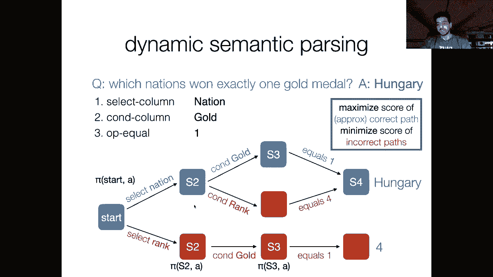

嗯。Oh， right。 Sorry， This is a value function pi not a policy function。 Anyway， so this is。

 this is the thing that's scoring these different actions。

 And our training process is going to maximize the summ score of all the decisions made during one of the the production of one of these correct paths。

😊。

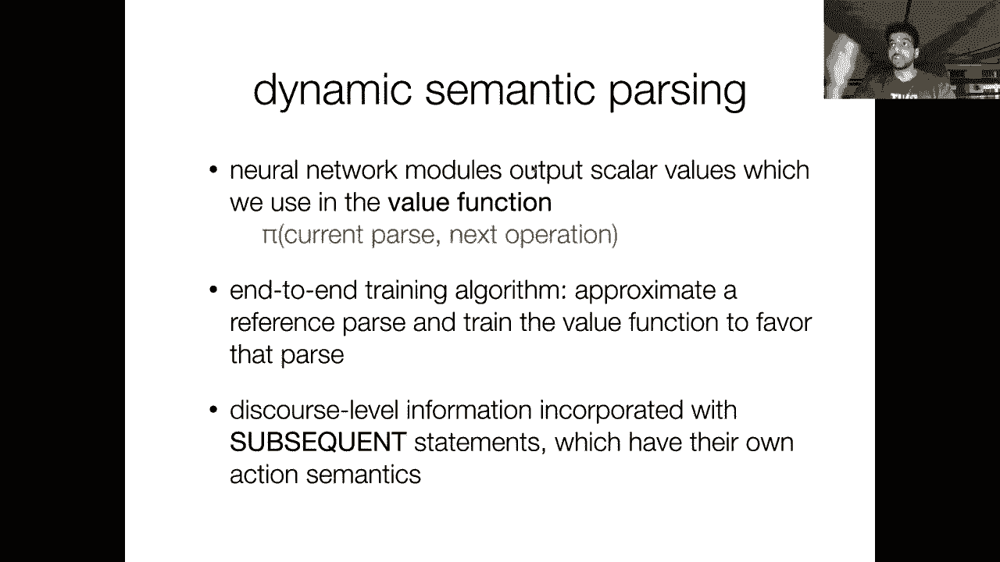

Okay， so then how do we actually implement this value function we basically have a single implementation or sorry a different module for every type of action so that is going to take in the question as input the you know candidate argument for a particular operator and then produce a single score for that so this is kind of analog to the neural module networks that we discussed in I believe the vision and language。

😊。

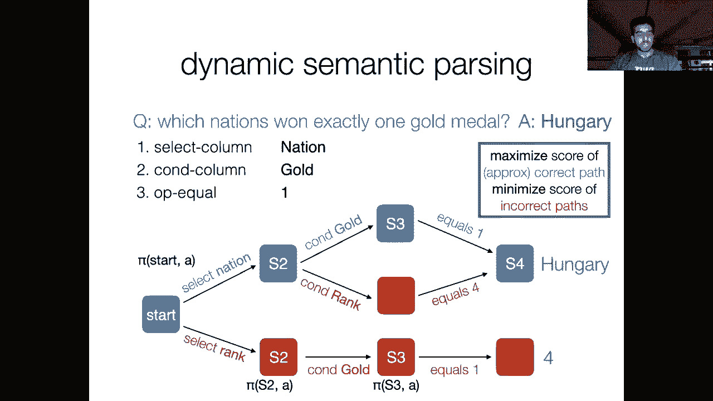

The vision and language lecture， Okay， I finally see a question。

 I'm a little confused about the heuristic of you changing the task。

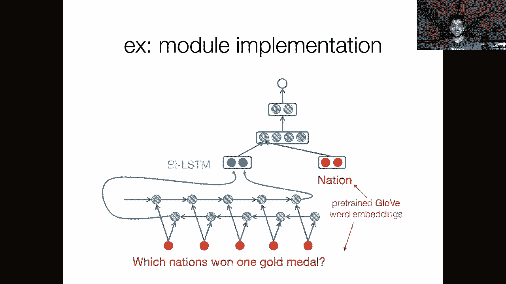

To maximizeimize the score of the correct path， aren't you giving it the answer implicitly。

 So remember， we know the ground truth answer， right。

 We just don't know the ground truth logical form， the sequence of decisions that leads to producing the correct logical form。

So my model does not have any way of distinguishing between this top path and the second path here。

 they both evaluate to the correct answer and my heuristic which is going to tell me whether or not a path is good is in this case on the slide just does the answer that I get after executing this logical form。

 is it equal to the ground truth answer that I have。So if yes。

 then I'm going to maximize the score of that path， If no， like in this bottom path here。

 I'm going to minimize its score。 So we assume that we have the question and the answer and we're missing this why the logical form。

 I hope that that clears things up。

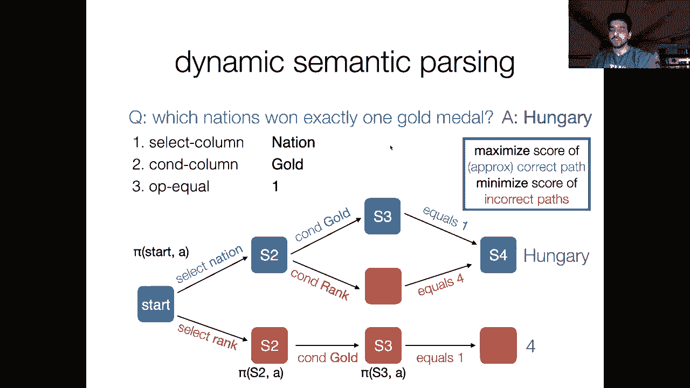

嗯。All right， so yeah that was just a high level run through of an implementation of a model for a semantic parsing task if you're interested you can check out this paper for more details。

 but yeah this is again a very important problem for not only question answering but also interfaces of robotics and NLP where robots for example are following human written instructions and I think it'll just continue to get more important over the coming years so it's good to know about the the techniques used to solve these kinds of problems。

😊，All right， so that wraps up today's lecture and remember that on Wednesday we'll have a guest lecture on common sense I think I'm going to set this up as。

😊，Just to avoid any streaming issues on Lorraine's and I'll just have a kind of zoom call or something and stream it from my computer and I can ask your questions as well as ask some questions of my own。

 maybe we'll make it more like a discussion or something， but should be fun， so yeah。

 please do attend and I should also mention that it would be good if if after Wednesday lecture。

 if you had any feedback for Lorraine on her presentation or the way in which she went over the material or her slides or whatever。

 please do send her that it'll be valuable for improving her teaching moving forward。

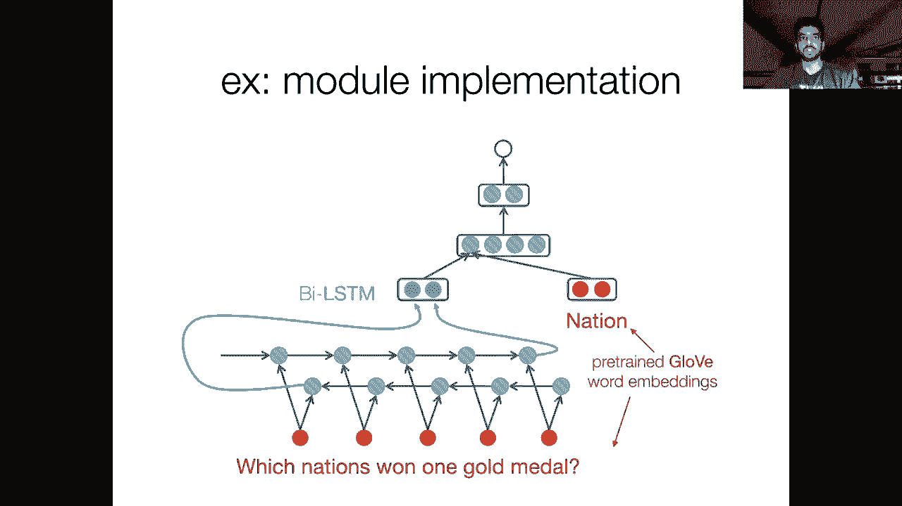

So yeah， see you on Wednesday。