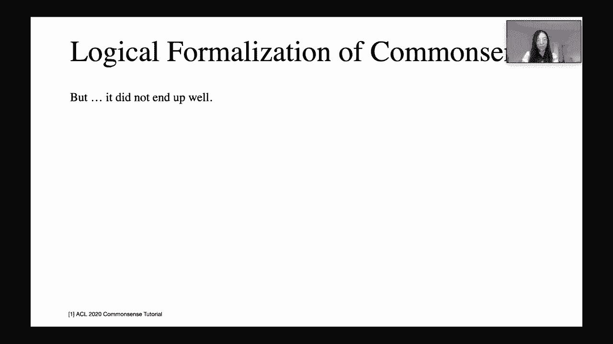
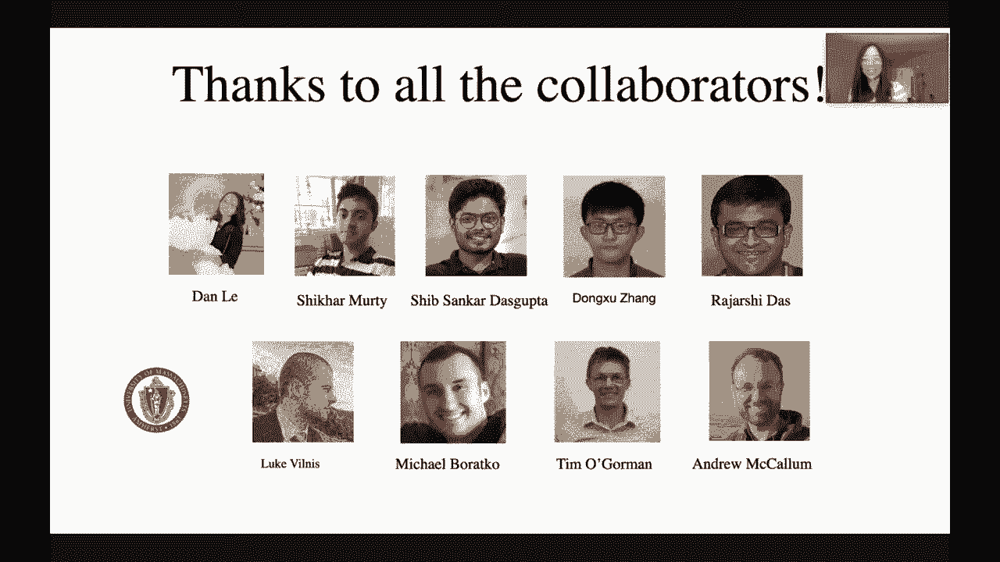

# 【双语字幕+资料下载】马萨诸塞CS685 ｜ 自然语言处理进阶(2020·完整版) - P26：L21- [客座讲座] 常识推理 (Lorraine Li) - ShowMeAI - BV1BL411t7RV

Okay， hopefully this works。Okay， we are now live so oh wellow16 people people are excited for this topic so hey everyone today we're having our guest lecture from Lorraine on common sense and before we start I just wanted to let you know that we have an extra credit assignment Lorraine would really appreciate some feedback on her lecture。

 the pacing the content how useful you thought it was and whether you had the right background to understand everything so there's a feedback form in the LinkedIn Piazza and also on the website which you can click and complete write some comments about the lecture and if you do that by next Monday we'll give you a small amount of extra credit so this is not this will be on top of your existing current。

😊，Extrare credit assignment。Other than that， yeah， I mean。

 obviously your only remaining deadline other than the quiz is the final project report。

Make sure you're working on that and finally for this lecture， if you have any questions。

 I'll be monitoring the chat window so whenever you have a question just write it in there as normal and I will ask it to Lorraine。

😊，So okay， with that out of the way when don't you go ahead with the lecture Lorraine。

Thanks so much for the introduction Mo ahead and thanks for having me here。

 I'm really excited to be here and giving this lecture giving this guest lecture。

 you can stop me at any time during the lecture of with questions if there is any you don't have to save them up So let's get started。

 I'm learning a fifth year PhD student working with Andrew Mcallum at easel and my research interest lies mainly around common sense reasoning ranging from learning a good representation that has the correct inductive bias towards representing certain kind of common sense knowledge to how can we design benchmark data to evaluate models with certain kind of common sense knowledge。

😊。

So first of all， what do we mean here by saying common sense knowledge？

One type of knowledge as shown in this example is it is obvious for us to know that a lake were divided into two lakes when the water level is full。

 so a five year old would probably know this and some other things a five year old would know is when they're playing this kind of brick toys if you don't place it correctly then the brick is going to fall down。

So learn what do we mean here by common sense knowledge， it's a sound practical judgment。

With concerning everyday matters and。ItIt's about someone's basic ability to perceive。

 understand or judge certain situations， and it is also shared commonly to nearly all people。

So what are we defining here is apparently we're not referring to everyone in the world because if it's a child who grows up in Amazon Jungle who would never played this kind of fancy toys ever。

 so sadly with that in mind， we're not referring to every single person in the world。

 but instead we're referring to nearly all people， we're targeting this group of people。

And then specifically in NLP， it's actually everywhere， for example， in machine translation。

 when we tries to translate an English sentence to a German sentence。

 so software or the tool needs to understand what the word working mean here because there is different two words for working in German。

 either it means a labor or profession such as the electrician is working。

 or another another meaning would be the telephone is working， meaning is functional properly。

 So those aret actually different to words， the software needs to know what this English working actually meaning here in order to get the correct translation in German。

And furthermore， in smart home assistant like Google Home。

 this is the real example I saw someone posted on Twitter the other day。

 this person is not able to find their phone， so they ask for help。 He said， hey， Google。

 can you call me please and Google said you sure this person， yes， I'm sure and then Google said。

 okay， yeah， I will call you please from now on。So this is apparently a misunderstanding and but from our point of view。

 it's actually really easy to understand this， but it's kind of just really hard task for machine to do this。

So since it is so important， there must be previous attempt that tries to solve it。

There has been big effort， has been pushed in the 70s or 80s by researchers of using logical formulation to represent common sense knowledge。

And the Turing Award winner John McCarthy is one of the frontiers that formalized commonis sense as a logical based problem。

He published several papers using logic system to represent Common sense knowledge。

In one of his first papers， this paper called Program with Common S。

This paper is especially important because it was probably the first paper on logical AI back in 1959。

And it is also the first paper pointing out common sense reasoning as the key ability for AI system to have。

So in this paper， he said， in order for a program to be capable of learning something。

 it must first be able to be capable of being told it。

 That's why we need this logical formulation to tell the machine that this is the kind of knowledge you have to know。

So in this paper， he proposed something called advice taker。

 which represent knowledge in the following way， it's almost like a triple like I at desk desk at home。

 it's very similar to the knowledge based representation right now。

 but I think it very different in a number of different ways。

But this is one of the first attempts to representing logic comm sense knowledge using logical formulations。

And there after that， there has been many logical systems being applied in the domain of common sense。

And this is probably an incomple list of all these different logic systems。

 but just to give you idea of how diverse these logic systems are。

With propositional logic as a start and you can do different modifications on top of that that gives you first order logic or mod logic these are all deductive reasoning logics and apart from this there are also plausible reasoning logics。

 including non monoonic logic probabilistic logic or fuzzy logic。

With this many different logic systems have been proposed or have been tried。

 there was some progress with modeling common sense knowledge back in the days。

 but the overall story is it did not end up well。

As said by Ye Jin Cu， who is currently a professor in University of Washington and is one of the professors who is now actively working on commonis sense recently these days。

 she said in her PhD time， she was told not to speak of the word commonis sense。

 which is at around 2000 at the start of 2000 or sometimes like that。

But she also concluded that the past failure of common representing common sense knowledge is inconclusive。

 including the following reasons。 but this is not an exhaustive list of the following reasons。

 But these reasons probably contribute to the failure of the common sense reasoning part。

 There are not enough computation powers。 There was not GPSus available。

 and not so much data and there's no like a tool called mechanical Turk。

 such that we can gather enough informations from people to annotate this data for us。

And also theres not at strong computation models like there was neural networks。

 but due to the following the above two reasons neural network actually was not working great。

And also， there is no ideal concept transition or representations to represent this kind of knowledge。

So with that in mind， I think we can have a brief outline of today's lecture。

 I've been talked about common sense knowledge and we said there is not enough there is no correct representation。

 so the next part will be how can we learn the right representation and we'll also introduce some common sense knowledge in whether there are common sense knowledge between language models or not and then finally we'll talk about how to build benchmarkmarkg data for evaluation？

So how can we learn the kind of representation or what is the kind of right representation to represent certain type of knowledge？

In LLP， we typically learn a vector representation of words as in Wordtuva or like bird representations。

And this learned represent vectors showed word semantic similarity through this distance between words as a result of that。

 similar words will get clustered together， as you can see here。

 there is an animal cluster and there is a furniture cluster。

But if we look closer to rabbit and mammal， mammo is a much general concepts。

 including lots of small concepts like rabbit， but this point representation cannot capture the size of the region referring to the word where the size of the region represent the number of concepts can be expressed using this word。

And moreover， rabbit is a mammal， but mammo is not grait。

 The kind of naive score function like dot product cosine similarity between vectors cannot capture this asymmetric relationships。

So our lab， proposed in 2014， proposed to expand this point of representation into a Gaussian distribution。

 so the representation will now become region based。

It is also asymmetric because the rabbit Gaussian， as we can see here。

 will be inside of the mammo Gaussian to refer that rabbit is a mammal but not vice versa。

Furthermore， it can express the the jointness between concepts。

 as there are no region overlap between deer and rabbit if we give certain threshold to the Gausian distribution。

But one drawback of this representation is that they're not closed under intersection。

The intersection between two Gausss are not necessarily a Gaussian distribution。

 which makes the model is really hard to train and the computation really hard as well。 Lorraine。

 can I interrupt really quick？ There's there's one question about your example that you showed a while back with the brick。

And。I guess there's a comment， is this really common sense understanding or more observation based understanding of the like physics of our world since there are programs or graphics engines。

 stuff like that that have encoded these kinds of physics based behaviors already into their system。

Yeah， this is a great question and I think by seeing common sense reasoning it's actually a big umbrella term that involves a lot of different types and physical common sense is definitely one type of them。

 one thing would fall down naturally that the gravity would tell you that that's definitely one type of common sense。

And there has been active areas in vision or A working on this as well Do you I guess there's a follow up question from the same person。

 have there been any methods in NLP for a common sense reasoning that explicitly encode this kind of information about like physical behavior physics etca into the model？

Yeah， that that's that's a great question。 Follow up question。

 because there is definitely benchmark data that targeting this kind of physical common question answer in task。

 which I would introduce later。 So I believe then the models who get really good scores on that dataset will have a way of encoding this physical knowledge into the model in order to perform well for that data。

 cool。いや。So yeah， back to our representation learning。

 we have this Gaing representation and as we said， there is one drawback of this representation because they're not closed under intersection。

And then after that， in 2015， another representation comes out。 corn representation。

 me to this problem by representing each concept， using a coin。

Referring to the region towards infinity。 And now it is closed under intersection because the intersection between two cons is still a cone。

And in 2017， there is another paper extend this representation to a probabilistic model by constraining the space into a unit space and assigning less density to each column as the coin extend to infinity。

Lorraine， sorry， sorry to interrupt again， there's a clarification question on the Gaussian embeddings。

 why， why are these regions called Gausian， I'm familiar with the term in probability distributions。

 data sets， but I'm not sure what it means in the context of regions。 that's the question。😊。

Great， sorry for not making it super clear， but in this representation here。

 we actually represent each concept using a Gaussian distribution。

 So if you want to make it super specific， it's two vectors。

 one vector represent me and the other vector represent the variance of of this distribution。

So it's literally a Gaussian distribution for each world。

These are great questions。 feel free to yeah ask more。And。Where were we。

 we have this probabilistic notion of this con embedding grid。 So yeah， the probability。

 now we have this probability cone embedding representation and the probability of each concept will equals to the volume of the cone integrated under this exponential function。

 but each con will still extend to infinity。An immediate concern is that we cannot make rabbit and deer in this case。

 disjoint anymore。And however， the situation will get even worse。

 Conition on one or more variables will always increase the probability。For example， here。

 assume the probability of being a rabbit is like 12 point point off。

 and we want to get the probability of rabbit condition on deer。

If you want to guess the probability of rabbit conditional deer should be zero because if you're a deer。

 there's no way you can be a rabbit。But for this model， after conditional on deer。

 the universe of this calculation becomes the debox， which will gives us like， for example，0。

4 probability， conditional probability， which doesn't make sense at all is this is a bigger。

 this is a very bad thing for a probabilistic model。

So following up this work in 2018， we propose we try to fix this problem in a natural way by giving the upper bound to coin embedding。

So， and to by representing each concept using a。Aes aligned hyper rectangs。Boxes， in other words。

 boxes。 And this is a 2D illustration。In this representation。

 it is region based and it can represent asymmetric relationships because one can inside of another to represent is asymmetric。

And they're also disjoint because they're also closed under the intersection because the intersection of two boxes will still be a box。

More importantly， these concepts like rabbit and deer can be represented。Now。

 the probability of rabbit given deer should be 0。So I think you addressed this question mostly in what you just said。

 but if you go back to that previous slide， there's a question on why is it necessary for these concepts to be represented such that the properties like region asysymmetricmmetry disjointness。

 et cetera， are held。Like why are those properties important in this kind of representation good good good question so region because we want as we said。

 the vector representations memo and rabbit will have the same representation there is no notion of how general this concept is so we kind of want this region representation to represent how general this concept is and how can I refer can I using this word to refer more general things or I can you only use this where to refer very specific stuff。

That's why we want region and asymmetric is。For is this kind of is relations， Rabbit is a mammal。

 We want to have。 Rabbit is a mammal， but mammo is not rabbit。

 This relationship between these two words are not symmetric。And theness， as we said。

 because that probabilistic model will not give us if you condition on one thing。

 its the probability of deer given rabbit will becomes bigger。

 which means something can both become a rait and a deer， it's a very unintuitive thing。

 I don't think that's commonissance。 and why they're closed why do we want closed under intersection。

 because that makes the calculation extremely easy easy because in the end we want to get the representation of these things。

 So there are two more questions。 One regarding closed under intersection。

 Could you please explain what that means。 closed under intersection means if we take two two of these regions and we take the intersection of these two regions。

Are they still the same unit representation you was working on before， Like boxes。

 you take the intersection of two boxes， It's still a box cons。

 you take the intersection of two cons。 It's still a cone。

 That's what do we mean by that's what we mean by closed under intersection。Great。

 and the second question is， is the region based representation similar to doing something like a hypernym discovery on vectors space。

That's a great question。 That's how we get motivated。

 And this kind of region representation should works extremely well for higher radical relations。

 which is hypernams。Great。Yeah， those are all great questions。

And now we have this box representation。And it can。Yeah。It can represent this strong concept。

 That's why we want this destroyedstredness。 We don't want anything。 Give you a。

 give me a probability of rabbit given deer。 We don't want it to be more than 0。And as we said。

 this is good for common sense representation。 What can we do with this。

 We also try to use this box model to model common sense。 And as a first step。

 we train the LTM to take arbitrary short phrase as input and then output the box。

This is an illustration of foxes trained on an enitment task。

And as shown in this cherry picked example， if something is beyond on bench。

 it's likely you are sitting down。 But if you sit down。

 there is much less probability of you are sitting down on a bench because there are lots of other things you can sit it down。

In addition， if we add the third box of man relax， it is going to intersect with be on bench and sitting down by or a small portion。

 but it's going to be a big box because there are lots of other different ways for a person to get relaxed。

To give you more intuition of how this model is getting trained。

 I want to show you this video of training a 2D boxes on seven movies。😊。

Even though movie are not not common sense knowledge。

 but boxes is like more general than only representing common sense knowledge。

 it's a representation can be viewed as a probabilistic model that can capture any kind of joint distribution with for binary random variables。

So the goal here is we want to see similar movies should end up having a similar box representation and the size of the boxes represent how many people have rate this movie in a relatively high score。

As you can see， all the boxes are initialized randomly。And。After a while of training。

 we can see similar movies get cluster together， liing and alling their overlapping with each other a lot。

😊，And Forreest Gump is a pretty big box because presumably a lot of people just like this movie and read it pretty high in the high school。

Also rear window north by one Northwet are both movies directed by Hitchkirk。

 they probably have the same group of audience as well， and also the lot of learning series。

There's a question， could you clarify again how the box representation is defined mathematically。

 is it a matrix or a bunch of coordinates， what is it？Great， it's a bunch of coordinates。

 because if you can see here， we actually represent the boxes using a lower left coordinate and the upper right coordinates。

 So in when you actually do the training， it's two vectors。😊。

But it has certain like geometric constraints， like the upper right has to be bigger than the lower left。

So that it won't violate this， you actually have a size of their boxes。Great。

But there is training difficulties with this model。If we the current model。

 if one box is inside of another and the goal of the training objective is to make them disjoint。

One thing we cannot do， or it's really hard to do， is to。To deal with this kind of situation。

 Because imagine， no matter how you move this purple box。

 a blue box inside the gradient of the the intersections。

 that the box' intersection size will not change。 So as a result of that， the loss will not change。

 So you will get  zero gradient。And yeah， hard box training result will be like this。

And this is just one case， another case would be what if two boxes are disjoint and the goal is for them to intersect with each other。

It's the we're in the similar situation， no matter how you move these two boxes。

 the intersection doesn't change so that your training result will still probably look like this。

There are lots of local minimums in this training objective。 So as a follow up， we proposed。

This is a loss function of the original box paper。 As we can see， there is a big drop， but。

Within all， if you're outside， it's all the same。 If you're inside， it's all the same。

The eye clear paper in 2019， we tries to solve the sp problem on the outside。

And then in the NewOs paper， which is coming out in this year's New。

 we represent boxes using a gumbo distribution where we have gumbo boxes。 and now we just can。

 there is a smooth loss function everywhere。And these are。Like it's very high level。

 And if you're interested， you can always contact me for more details of how do we do this gumbo box and smooth box。

😊，But in general， we what we want to domestic we want to convey here is it's a good representation。

 And now it doesn't have this， all this kind of training difficulties anymore。

As we propose the different ways to represent common sense knowledge。

 let's look like let's look at a properly training example。

 See that example is before the probability of being there。

If you condition on different things， you will get different probabilities。Like not white。

 you will get a little bit higher if it's an animal， is's gonna be much higher。

 And after you condition， if it's hub ofvo。 and if it's not white， not rabbit， is animal is' a hubvo。

 it's going to be pretty high probability that this thing is a deer。

 But the moment you change ha ofvo to not a hub。 The probability becomes zero。

And this ability of being able to answer queries with negativeg variables is kind of unique to geometric representations because there is no way you can do it for vector representations unless you enter through all the possible possibilities and which is really expensive。

We have one more question。 It seems that the intersection of boxes would have a higher possibility to be smaller in high dimension space。

 Is that right， That's that's great。 Yes， that's correct。

And that can give us some like numer instability when things become super small。

 So you have in the actual implementation， you have to use numer stability functions to avoid this kind of problems。

Makes sense。That's a word example。 And this is a sentence example。

We tried boxes as we should before on sentences by using LTM to output a box representation。

 and this is a data set we tried it on， it's a Fler data set。

 it's an enitment data set containing image of 45 million of image caps and after training on this you can see the probabilities with one condition on another varies from 0。

0 to 1。 1。0。

It's your condition on a blond woman walking down the sidewalk。

 the probability of person walk is one。 And then on the other hand。

 if you say condition on whole instrument， the probability of you being on being in the basement is pretty low。

It's still probable， but you probably it's a very low probability that you're actually in the basement。

So we've talked about how can we learn certain kind of representation that motivated that have this certain inductive bias to represent hierarchtical knowledge and concurrently vector representation have gained a lot of success by training on by training on large compass so now we're going to talk about common sense knowledge in pretrained language molecules。

Before that， do we have any more questions about boxes。I paid to answer more。

I guess I will ask one of my own so we've talked in this class for this whole semester mainly about self supervised objective functions like language modeling or mask language modeling。

 things like that Do you think there are any ways to devise selfsvised objective functions for these kinds of geometric representations that will also give you some of these properties that are you know。

 obviously desirable， but seems like you can only get currently by training on some sort of structured data？

Yeah， we get that question a lot by yeah your representation seems great。

 but what does it perform when you apply it to downstream tasks like can you do language model modeling with it and the current answer is we're still exploring because for vectors you can define the addition and multiplication with vectors pretty easily。

 which is actually the core of neural networks and the core of how all of those language modeling。😊。

But in boxes， it's actually hard to defining those operations。

 What do you mean if you do addition with two boxes and multiplication with two boxes。 So we are。

My advisor， Andrew， is super interested in this， and he's been pushing us for working on deep boxes for a long time so。

 but it's it's not an easy problem， so we're still working on that。😊，可。Yeah， number of things。

 it's a great transition。 You've been talked about a lot about language models。

 Does those language models have common sense knowledge or not。

 That's the next question we're going to answer。We often see a lot of news headlines like a robot wrote this entire article。

 Are you scared yet human， which probably means yeah， the language models works really good。

 And this misleading news concept are giving us a lot of it's almost giving me heart attack。

 Like oh my God am I my researchers just done。 like there's no need talk on this this recently at all。

 So luckily， researchers have have the same question as me as well。

 So their last works trying to answer this question。

Does the pre traineded language model already capture common sense knowledge？

One common approach is that people will take take existing using existing common sense knowledge base to probe language models。

 the way people do it is to take existing common sense knowledge base。

 change that into a natural language template and pass this template to a language model using language models to do query or scoring on your transformed natural language。

There are two papers from these two groups， almost concurrently at EMOP last year。

 and they take the similar approach by both taking knowledge base and language models to do its job。

This is some details， most of them using this data knowledge base called conceptNe。

 which is probably the most user friendly common sense knowledge base data set， knowledge base。

 common sense knowledge base out there and also there are Wiki data or doing some mining from Wikipedia。

 but this is a common sense knowledge base used。They use handcrafted rules to transform triple representation to a natural language。

They evaluate on different models， Elmo or BRT。And here are the conclusions。

D Lamma paper said Bird performs well， but almost all the models performs really poorly in many too many relations。

And then the other paper said this kind of problem performs much worse that supervised method if you try to do a classification task on concept that。

 but it is more likely to generalize to different domains。

As we said， those two papers are all use handcrafted。

Are all using handcrafted templates to transform this relation triple to a natural language。

 So does this prompt that the sentence you give it to the language model matter。 Does this matter。

The answer is， yes， it matters In this year's EMOP， there is this paper called autopro。

 propose a way to generate prompt using automatic method。

The intuition is to generate prompt tokens such that this can make such that the token can make the biggest effect when predicting the label。

And the effect is measured by gradient。 So this is also called gradient guided prompt generation。

One thing to notice here is that this automatic way of generating prompt。

 probably the sentence generated by this is not guaranteed to be grammatical。

 but it can make the most effect on the model predictions。As shown in the result here。

For the same Lama probing as we did before， the Lama paper only gets MR score on 40。

 but this auto prompt gets up to 53 MR score。 So that's saying the the kind of sentences you pass into models definitely matters。

 So keep in mind of that when you try to do some probing into language models。

Another line of research that people have been using to probe language model with common sense knowledge is to check the properties of the concept。

Wait， sorry， one second。 One question I have with that is。

Can you really say that a language model encodes some fact if it only produces it when you probe it with a。

One particular context， and it outputs something completely different with other like different paraphrases of that。

 what does that mean exactly？Yeah I'm not sure whether like the case you said before you said you just mentioned is's a pretty extreme case my guess would be there are certain group of ways of doing formulaized sentence such that it will predict a reasonable answer I won't say there there will be very different predictions。

😊，But it's really hard to say， I think that's something we all need to keep in mind of。

 like it's really hard to say this model has commissance because that's a really hard light until you're trying to make there。

So I think we can all just do a little bit of careful study on that topic。And yeah。

 so this is another line of research people have been use is to check the properties of concept。

They tries to ask two questions here。 Do pre train language model correctly distinguish concepts associated with a given set of properties。

And also， can a pretrained language model be used to list the properties associated with a given concept？

The first question， can the language model distinguish concepts associated with given properties。

 They design this task by giving the model a set of properties and then let the model predict which concept having this property。

So， for example， here， a blank has fur。 You would have lots of different options。 A lion。

 a bear cat dog。 They all has fur。As you gradually add properties to this prompt。

Ha fur is big and has clouds， now you you're supposed to like rule out some of the concepts and as you grow bigger。

 the list grows bigger is an animal， is brown than you only probably left with this one single concept bear。

For the answer of this question in that paper， they said the model generally get good performance and robot performs better than B。

But there are some properties it's easier to distinguish than some other properties。

 like perceptual properties， which requires visual reasoning。And also。

 so perceptual performs worse than all perceptual properties。

And also the highly ranked incorrect answers generated by the model is typically applied to a subset of properties and saying the model is not being like wrong by a large margin is getting some of the stuff correct。

 but not entirely correct。

Now， here is the second question。 Can the， if it can distinguish the properties。

 then can it list the properties associated with this given concept。

For example， here we have bear and everyone， if you give this to human。

 everyone knows that a bear has human response like fur class teeth caused these things。

 And then Roberta said it has teethclo eyes in general。

 it has a low correlation with human illicit illicit properties。

 but they're coherent and mostly verifiable by human， as we can see here。

So I hope now we， based on the probing papers or the pure probing experiments we see before。

 the hypothesisthes might be there is some knowledge in the language model， but。Certainly。

 not all of them。 And then if there is some knowledge。

 can we trust the language the knowledge from the language models。The general answer is， no。

 you should be careful with that。Because there are just two papers saying。

Take different aspects of what kind of wrong facts language models can generate。For example， here。

 Brox's wife is Hillary， which is not correct。 And also， B can talk， but cannot fly。

 These two paper titles just said very clearly of what kind of knowledge wrong knowledge is the model can generate。

 They're either distributionally related but incorrect， or they're syntactically similar。

 but also they're incorrect。

So those are some problembing works that tries to do to check whether there are common sense knowledge in the pret language models or not。

Following that， there， except for this kind of probing task。

 There should always be a benchmark data set for evaluation to tell us。

Are there standard benchmark data to evaluate the model that contains commons as knowledge？

A standard way of doing this is using a question answer in dataset。Besides that。

 you can also do natural language inference as the example we should before a women is walking along the sidewalk can infer a person is walking。

Or reference resolution， like John asked Alex， where is the library。 He said， I don't know。

 Then where does what which， what， who is this he refers to in this example。

And there are also many other ways of designing the benchmark dataset set。

 but these are some like examples。Here I tried to list different types of common sense data set we have in this community。

 and this might be incomplete list， but just give you a sense of how how people have been tried to create such benchmark data。

The first one is hollow sweat。And it's a multi choice question answering problem。

Targeting at grounded common sense。For example， here， a woman is outside with a bucket and a dog。

 The dog is running around trying to avoid a bus。 She。

 you are supposed to choose like the correct answer from this four choices。 She like。

 gets the dog wet and then run away again。 See， is the correct answer。And the best model performance。

 currently the。The model performance to human performance is only not enough。

 like less than 2% difference。That's grounded common sense。

 there is this objective NLI in takes the format of natural language inference。

 but still is a multi choice selection problem iss targeting objective reasoning and the difference is three point difference。

Coss QA targeting reading comprehensions with common sense knowledge。Has around 2% difference。

And physical IQA， as I mentioned， this is a common sense data set。

Target explicitly on naive physical resume。And the performance difference between best model and human is around not even 5%。

And the social IQ， how would you like there is certain aspect people are expecting of when we talk to people。

 So this is about social commons。Again，5% of difference and Win grand。

 which is the co reference resolution problem， as we talked before。

Even for this that it seems a really hard task， there is only three points of difference between human and the best performing models。

And finally， there has been effort trying to combine vision and language together this VCR Bu common since recently。

Even for this， there is only 2% of difference。So， so one thing you probably noticed already is the gap between models and human performance These all very low。

 but doesn' that mean we actually solve this problem。

I would strongly disagree with this argument because if you look at this type of tasks。

 theyre all multi choice selections。You only need to select one correct choice from two to four candidate choices。

But this is not really how we do common sense recently。

 If you ask a human what's the property of a bear， you're not supposed to select between。

 is it brown or is it red， you're not doing that， but instead you're coming up with this word brown or it's big。

 you're making this selection from all your word vocabularies。

s not just a selection between two choices。That means a more natural way of doing such evaluation is probably by generating answers。

 giving me a question quick question， any evaluation data set of logic problems？Yeah， yeah。

 I think there is。Not that I have listed here， but I think I can't remember the name of the data set I can try to find it out later。

 but I think there definitely is I think there's also the like synthetic baby data set from Facebook which。

I don't know if we consider that a real data set or not， but yeah。

 if there were a real natural language version of that， that would be an example yeah。Yeah， yeah。Yep。

But I think there are apart from baby there are all different logical reasoning data set as well I just saw a paper reporting new numbers on that data set but I forgot to include them here there's too many benchmark data。

So but in general， we want to do generative evaluation instead of multi choice selection。

Why haven't people died yet？Because it's a hard way to do it， there are multiple correct answers。

 and when you're trying to do this， the stream matching between two answer。

 your answer and the ground truth answer might not be general enough to capture all the answers。

And in addition， some answers is probably more common than the others。 How can we capture this。

As a first attempt to this in EMOP， we propose this data set called protoQA。

 capture prototypical situations that with generative evaluation。

Like name something that people usually do before they leave the house for work。

There are so many different options you can answer like here we ask 100 people and 4043 of them said shower。

 30 of them at breakfast， and then there are also people saying goodbye， pray getting dressed。

 locked door So those are all available answers and in this data we tries to capture all of this。

So our data set has multiple correct answers for each question， and for each answer， we have a score。

In addition， we propose this generative evaluation that can evaluate multiple correct answers generated by the model As we said。

 stream matching might be not be good enough， so in the paper we also proposed the wordnet matching or you use the vectors。

 the distance between vectors to match the similarity between two words。

And for this generative evaluation， we also tries to reward model has the corrected ranking of dancer list。

 You don't want to the model have the same score if they output shower pre or pre shower because clearly the first one is preferred。

We also reward model with a higher coverage of the athlete。

So this is another of our work at EMOP tries to do this， how does the language models do others？

First of all， we test on question answering data on question answer model。 It's not doing great。

 mainly because this is really an open domain question answering and we don't have ground truth supporting articles。

 We used distant supervised supporting articles， which can be really noisy。

 so that might contribute to why this Q model is not performing great。

GP 2 is definitely doing better than UA。 And in order to to be like to make it fair for GP2 to do the job。

 we change the prompt to name something that you would do to one thing you would do blah， blah is。

So yeah， GPT2 performs a little bit better after fine tuning with our training data。

 GPT2 performs much more better， but one thing I want to stress here is GPT2 did not generalize after reading our training data I think it means it's more like GPT2 is getting used to the task format and the answer is probably already there already is just without fine tuning it's hard for GP2 to understand what you are looking for here。

But still， all the models has a large gap compared to human performance。

 indicating this is a hard task。

And as a summary of today's talk， I talked about common sense knowledge in general and its past。

Failure of modeling， using logical formulation to model to do such modeling and also what kind of representations we can learn in this case。

 box representations to capture certain type of common sense knowledge。And also。

 whether there are commons knowledge in pretrain language models。

 what kind of province we can down and have been done。In the end。

 how can we generate a benchmark data set for evaluation of such common sense knowledge rhythm part？

And that concludes my talk or teaching。

thingsh I talked about some papers I like to send all my collabators and that's it thanks Laorraine。

 I don't see any new student questions， but I guess I will ask one to kind of relate this back to a previous lecture we had where we discussed G3 and also the Emily Bennder and Koler paper on whether a model can learn meaning from just form do you think that like just a language model trained on text alone is going to be able to pick up all of these different common sense facts or do you think we need to have some。

😊。

Way to ground these models and other modalities or experiences for them to properly learn this。

Yeah that's that's a great question I don't I know GP3 is doing extremely well on few short learning。

 which means especially on common sense actually， if you give it a few common sense examples。

 it can capture a lot of stuff。But I do think that being said。

 it captured a lot of knowledge probably already， I myself haven't played your history a lot。

 but that's what I put。But apart from that， I think that we still need different modalities to capture the physical aspect of this common' knowledge and also for rare things that people rarely mention in their text like rabbit is a mammal。

 you would probably never see that in your text and so those kind of things。

Still needs to be either injected or like learn it from a different source， I think。Great， okay。

 now we have more questions。Is the shared info or a common ground between a speaker like two speakers in a conversation。

 is that counted as common sense？I think it's， it。It's like。It's hard to say。 It depends on how。

 how do you want to categorize this paper or something。 But in my shallow understanding。

 I think that's more like a compact right a share。 Okay， there are two background saying。

The the common thing you are having like， for example。It's runninging outside。

 one person said it's runninging outside and the other person said， oh， take your umbrella。

There are a lot of shared things here。 You are assuming when is raining， you need the umbrella。

And you need umbrella to keep you from getting wet。 So that's why I shared information。

 and I would definitely consider that as a commonis source knowledge， but there are also。

More specific domain shares like in this course， we all know we almost know like what the encoder is。

 what the LTM is， I would not consider that as common sense knowledge right add to our definition before it must be commonly known to merely all human。

Great， another question， how was the generative task evaluated？

Oh， they are our product QA data set， great。Its so the model is supposed to give to generate rank the list of answers。

 Then we match this answer screen to some to the ground truth。

 and then you would each answer screen will get mapped to what we call answer cluster where the answer cluster contains all different surface forms of this one concept like shower。

 there are different ways of seeing that， take a shower take a bus。 therere all shower。

 So in this answer cluster， we have all those different expressions to say this。

 So we first match this answer screen to the answer cluster。 Then we compute like reward matrix。

 as you can see here。

The reward matrix gives you a reward of like according to how big the size of the cluster is because that represents how many people is answering the question with this answer。

We want to reward that fact。And after we have this reward matrix。

 we do matching to actually assigning one answer， one one answer screen to a cluster。

 we get a point and then we calculate the two metric here。 Why is max answer。

 you can only give me10 answers and what's your performance over there and also there's max incorrect because you can give me infinite number of answers。

 but after you get three of them wrong， you that's max answer at three so we consider two type of evaluation magic Q。

Okay， great。 I don't see any more questions。 So yeah， thanks。

 Lorraine and for all the students again， if you want to。😊，Oh， sorry。 there are more questions。 Oh。

 let me just ask those before concluding。 So， oh， I forgot to ask this 1。

 I meant to ask it at the end。For your box embedding research。

 did you start this direction with a particular use case in mind， Can you share it if yes。

I think the general answer is yes， because as you can see。

 we derive from a colon embedding which is generally used for representing higher correlations。

So yeah， we targeted on hypernas or enement tasks。Great， and another question， oh， more questions。

 could you please explain again maybe briefly how the box representations are trained？

So in a two dimension case， you would have two vectors。 you yeah。

 we don't even need to make it a two dimension。 It can be like D dimension。

 You have two vectors representing the lower left corner and the upper right corner。

 You initialize them randomly and the training goal is to。

To give give the conditional probability between two boxes。

 which means the sides of one the the volume of intersection box divided by the box you condition on and after doing that。

 you have this box predicted conditional probability。

 you have that in addition you have them to target conditional probability you try to use final cross centraltro P to match them and train them by gradient distance So this is trained in a supervised manner then just to clarify yes。

 correct Okay and okay， fast forwarding back to this this current proto Qa slide regarding the evaluation would you say that the evaluation would give different results if you show the answers to humans and ask them to rate if the answers are reasonable or not just because of the huge subjectivity involved。

Oh， that's a great question。 We tries to mitigate the subjectivity by asking the answer to 100 people。

And we think getting a large pool of samples definitely reduce it。

 That's I think based on our collection， people would because it's not one single people s。 Go it。

Okay， so yeah， let's let's stop here again， if you have feedback or comments or anything or praise even for Lorraine please do send it along on the feedback forum and get your extra credit this is also the last lecture of the semester so thanks everyone for sitting through these videos and asking questions and yeah I think ohops it's。

😊。

It's been a good semester， so I hope you learned something， at least about NLP。

