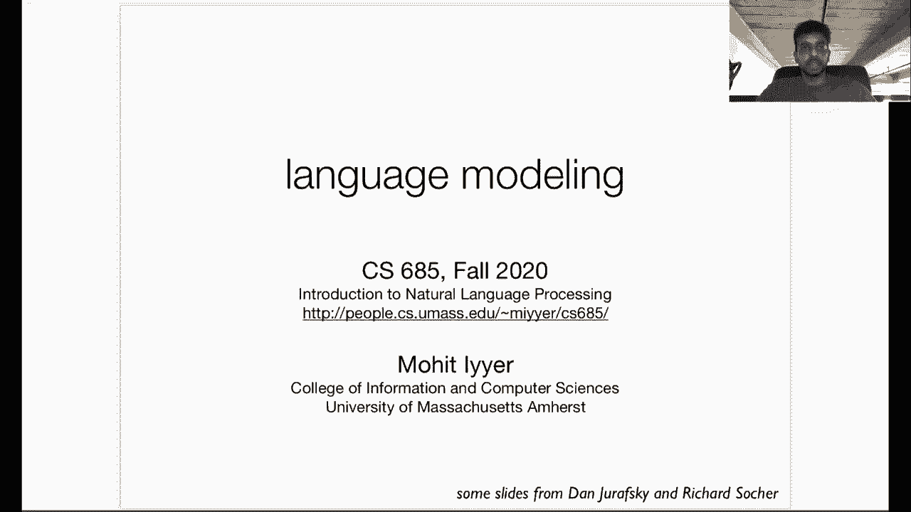

# 【双语字幕+资料下载】马萨诸塞CS685 ｜ 自然语言处理进阶(2020·完整版) - P2：L1- 语言模型 - ShowMeAI - BV1BL411t7RV

All right hey everyone， so today we're going to be talking about language modeling this is the second lecture of CS685 and language modeling is a core NLP task that's becoming increasingly more important over the last couple of years specifically nowadays state of the art models for any downstream NLP task basically all of them use language modeling in some way and this relates to the transfer learning paradigm that we discussed in the previous lecture language modeling is commonly used as a self-supervised component of that paradigm so we'll talk more about what language modeling is how it traditionally has been approached this lecture kind of serves as an introduction to the basic probability and evaluation of language models as well and just as our roadmap for next。

😊，lectures， we're going to be diving into neural language models。

 how we train them the back propagation algorithm and so on。

 so that'll be the second week of our background unit。All right。

 so before I get into the content of this lecture I wanted to answer a couple of questions that people have brought up on Piazza in the anonymous form so the first is regarding the format of the midterm exam so again we are thinking of having take home exam where you have 48 hours upon the time that we release the exam to complete it and this will be an open book and open internet exam someone brought up that they're concerned about people forming groups even though this is a violation of the honor code and working on the exam together we've come up with a couple of ways to lessen the chance that this happens or at least this is productive for those students but at some level were relying on you to you be faithful to the honor code and just don't cheat I mean it's hard for us to enforce all of these things with a remote exam。

But you know， just just don't do it and we'll try and make it hard on you， but yeah。

 you should still follow the honor code， of course。Okay。

 so another question was with regard to the final project group size， so as in past semesters。

 because of the relatively large enrollment of the class。

 these will all be group projects with very few exceptions I've talked about you know PhD students doing NLP related research as the main exception that I've allowed in the past。

 but in the vast majority of cases you should form groups of four which will leave us with around 30ish groups。

 this has been a great size in the past to allow us to give you know detailed enough feedback such that it's useful for you to guide your projects and write up your final report。

😊，So if you haven't checked Piazza， there's a post how to form teams。

 there's basically a thread where you can post things and try and find other teammates。

 it's often productive if you have a particular idea in mind for the final project to write maybe a couple sentences about it and see if anyone else is interested in working on that particular idea and note that you don't have to form your own team if you don't want to or don't find anyone you want to partner up with then we will randomly assign you to a team。

 but there's a Google form you can submit if you manage to find your own team of four and you should submit that form by September 4th。

 otherwise well randomly assign you to a group of four。Okay， so homework zero。

 your first homework is going out today and it's also due on September 4th。

 so you have two things to do by then it is intended to be more of an introduction to the basic coding。

 especially in Pytorch and so if you have a limited coding or math background I know some of you are in linguistics programs。

 I would highly encourage you to start early for those of you who have prior experience with NLP or machine learning。

 this homework might seem relatively straightforward and it is intended to basically get everyone on the same footing so when we start exploring more advanced models everyone will know the you know basic building blocks of the implementations。

😊，All right。So let us switch over to our main topic for today so I wanted to briefly review the transfer learning paradigm to motivate why language modeling is such an important task and so let's say I want to train a model for the task of sentiment analysis we already talked about in the last lecture how sentiment analysis is a task that a lot of companies care about right there's a lot of money put into developing these models that are better predictive of what people are saying about say a company's product。

😊，So in the past， the standard way of doing this was I would train a supervised model on a labeled training data set。

 so I would crawl， say IMDB which contains a bunch of movie reviews。

 so there's like a paragraph or two about the movie and then a corresponding score from one to 10。

 so I might collect you know 100，000 or so of these pairs of review and score and use this as supervision to train a model to give a review predict a score。

😊，So this is how it was done in the past where the model only gets access to data from the supervised training set。

But recently， we've switched over to this transfer learning paradigm。

 which allows us to take advantage of a lot more data than just what is available in our IMDB training set。

 So the first step of this transfer learning pipeline is where language modeling comes in。

 So I basically take a ton of unlabeled text and as we discussed before this kind of text can be just all over the Internet。

 right the common crawl is an example of you know a dump of a ton of web pages on the Internet。

 there's trillions of words available and we would hope that if we have a model that has access to all of those tokens and is able to learn representations of the language in those unlabeled documents。

 then it would learn a lot of useful linguistic properties that would help it when performing the downstream task of sentiment analysis。

 right。😊，If you think about sentiment analysis， some examples can be fairly complicated right。

 if I say something like I really like the acting， but the plot was super horrible this review is on the whole pretty negative but there's you know a bit of positive sentiment conveyed towards the acting。

 and so you might want a model that's aware of this negating this contrastive conjunction。

 but that kind of negates the goodness of this movie and shifts the focus of the sentence over to how horrible the plot was。

 right？😊，So learning complex phenomena like negation from a small set of texts like you might have on IMDB is really challenging。

 but if we have access to you know trillions of words。

 maybe we see a lot of instances of negations and contrastive conjunctions and maybe we're able to learn you know things like negation scope and how a negation interacts with a much larger sentence and so on。

 so this is kind of part of the intuition behind this first stage of transfer learning where we take a ton of unlabeled data and we do this unsupervised pretraining and so the way in which we do this is through self- superervision。

 So if you remember last time we discussed self- supervision as being a way to create labeled data out of unlabeled data and the specific examples that we looked at where language modeling and masked language modeling。

😊，So today we'll be talking about language modeling。And then the next step。

 which we won't be talking about today is supervised fine tuning。

 so I essentially take my giant selfsupervised model that is the output of this pretraining stage and I fine tune it on the small label data that in this example I got from IMDB so this is kind of taking all of the linguistic knowledge that my model has encoded in the first step on as much text as you can get a hold of and then kind of guiding it to complete this task of sentiment analysis in particular。

 but importantly in transfer learning the same base model。

 this model that you get out of the pretraining stage can be used for many。

 many different downstream tasks so you just have to change the data set that you use for fine tuning so it could be sentiment as in this example it could be question answering it could be part of speech。

😊。

Tgging it could be any other task， but this base model can stay the same。

 and it's really the fine tuning phase that's changing it to specialize to some downstream task。

All right， so this is the motivation and language modeling is one of the core objectives that we use in NLP for self supervised pre training。

So language modeling assigns a probability to any given input text。 So if you think about that。

 it's kind of confusing right why would we want to have a model that gives us a probability for a piece of text。

 but then if you think more carefully you might understand that application such as translation and speech recognition can directly benefit from integrating language models into their pipeline。

 so for example in translation if I had two candidate translations where a given source language sentence I flew to the movies and I went to the movies of course I could use a language model to rank the second one higher than the first one right because it's incredibly rare unless I guess you're very rich that you fly to the movies rather than just normally going there。

😊，Similarly in speech recognition， I might have an audio file of an utterance that someone said。

 and I want to convert this audio file into the actual transcription the text that they're saying so two candidate transcriptions could be I saw a van or the second one I of an。

 so they kind of sound the same， but a language model would tell us that the first one has significantly higher probability of occurring than the second one。

😊，So as a side note I'm posting these videos on YouTube and YouTube has this auto captioning feature that you might have seen on the first lecture video and it's really good I was looking through it and it made very few mistakes。

 but yeah， a language model like a textbased language model is a key component of YouTube's captioning system and indeed all captioning systems。

Okay， so these are like direct use cases of language models。

 of course the theme of this whole class is how we can use them in transfer learning setups。

 but we're not going to get fully into that today。

All right， so another application of language models is autocomplete。

 which use you likely use in your phones or in Google search， so it's generally useful， but yeah。

 in this class we'll be focusing more on its transfer learning usages。

Okay， so。These two examples that I've shown to this point， so first we have。

The probability of an entire sentence and then we have the probability of a word following a given prefix。

 So here Air is a word that our language model is predicting when given with a prefix。

 I'll meet you at the these are both things that language models can do。

 So if our goal is to compute this joint probability of a given sentence。

 So let's say our sentence is W1 W2 W3 to WN。 these are the words of a sentence。

I can decompose this joint probability into the product of multiple conditional probabilities。

 So here if I have a model that's able to compute。😊，The probability of word5。

 given all of the words that preceded it， the prefix。

 then I'm also able to compute the joint probability of an entire sequence。So how does that work？

This is just kind of basic probability the chain rule。

 so if we want and here we'll look at a specific example， we have this fragment。

 its water is so transparent that and we want to compute the joint probability of this fragment occurring。

So we can use the chain rule to do this and if you don't remember the chain rule if we look down here at the bottommost bullet。

 it's basically saying that this joint probability is factorized into the product of conditionals。

 so probability of x1 times the probability of x2 given x1 times the probability of x3 given x1。

 x2 and then finally to the probability of the last word given all of the words that preceded it。

So if this looks completely foreign to you， you should review on your own time basic probability。

 it'll be very useful moving forward。Com。

Okay。So if we extend this to the case of language modeling。

 we can factorize this joint probability of W1 W2 to WN。

 the sequence as a product of the conditional probabilities of each word given all of the words that preceded it so the probability of its water is so transparent is the probability of its。

😊，Times a probability of water given its， times a probability of is given its water and so on。

 So hopefully you get the idea。 So the high level thing that you need to take away from is if we set up a language model such that what it does is given some prefix of a text。

 it predicts the next word， this model allows us to compute the joint probability of any text through the chain rule because we can just multiply all of these conditional probabilities。

😊，All right。😊，And if you look in homework zero， I've used this terminology of the prefix to refer to what the model is conditioning its prediction of the next word on。

Okay， so there are many ways in which we can estimate these conditional probabilities and next lecture we'll be looking at fancier and maybe more interesting from a machine learning perspective ways of doing this。

 but in this class will be sorry in this video we'll be looking at what happens if we just count up the occurrences of prefixes and the words that follow them in a large corpus and then normalize so this counting and normalizing approach can be very powerful despite how simple it is。

 especially if you have huge data sets。😊，Of course it's also fundamentally limited so we'll see approximations to this approach in the remaining slides。

 but you can imagine that if I wanted to predict the probability of the word the given its water is so transparent that I have to look in a corpus for all of the occurrences of this prefix and this is a pretty long and maybe relatively uncommon prefix how often would you imagine observing six of these words in a collection of documents probably not very many right and what if this was instead of six words 50 words what if I was or what if it was 500 words。

 I might never observe that segment of 500 words more than one time even if I have the common crawl or some trillion word corpus as my。

😊，あ。As my training data。So this approach is infeasible how it's written here。

 I can't possibly just count up all the prefixes because as they get longer。

 I'll never get enough data for estimating all the words that could possibly follow this。

So we rely on the Markov assumption to simplify things so here instead of counting up the occurrences of its water is so transparent that I'm going to approximate this with the probability of the so the word immediately following this given just the immediately preceding word so that so here I'm completely ignoring the rest of the prefix its water is so transparent。

 but if I do this it gives me a fixed size prefix which is relatively short and so you know I would imagine thered be many。

 many occurrences of the word that in a corpus which would allow me to more accurately estimate the words that come the word that comes after it。

😊，But you know just one word of context that's not very informative right there are numerous words in this prefix that are sorry my highlighting is that are more important than that right maybe water and transparent contain convey the most semantic meaning of any of the words in this six word prefix and if I simplify to just the immediately preceding word。

 I don't get either of those two words in my context。😊。

So maybe a better way to do this is to take a larger number of words as my prefix so in this model this is called a trigram model。

 I have the last two words of context as my prefix so transparent that and the idea is that if I now have this word transparent。

 this is giving a little more constraint to what can possibly follow this phrase。😊。

So there's a tradeoff right if I keep extending this prefix size then at some point it's going to be too specific right if I extended it all the way to this six word phrase。

 I'm not going to see enough occurrences of this in my context to accurately estimate the probabilities。

 but if I use too small of a context， then I'm ignoring a lot of information that is useful to constrain the next word。

😊，So this is the challenge of Ingram language modeling。But yeah。

 just a more formal definition of what I just said。

 the Markov assumption allows us to approximate this conditioning of I if I go back here。

呃。The prefix word1 word2 to word I 1 and predicting word I from that。 Instead of this。

 we're going to take the last K words of context， not all of them。

 So here you see we start from word I minus K and then we go all the way up to I minus1。

 So importantly， this assures us a fixed size prefix for every word that we're predicting。

 We're ignoring all the words beyond the last K words， but we're going to hope that。

If we choose a reasonable value of k for our data set。

 this enables us to approximate these joint probabilities fairly accurately。

Okay， so let's look at some examples。 The simplest case of an Ngram model is a unigram model。

 So here we have no context at all right if you look at this equation where not conditioning this probability of word I on anything that came before it So this is the simplest possible model it has no context and the best that this can do is learn the frequency distribution of the words in a particular data So you'll look at this a little more on homework zero。

 but basically if I have no context， I should kind of upweight words that occur more frequently。

 So words like the or a or and that occur a lot and don't necessarily have much semantic meaning but they occur enough that I should upweight them more over rare words this is basically all a unigram model。

😊，And learn。And so this is an example of text that you can generate from a ungram model。

 you'll notice that it's not grammatical， but it does have a lot of instances of these highly frequent words like and so on。

😊，Okay， so as an aside， an important use case of language modeling is generating text and we'll look at this more in a threeweek unit later on in this class。

 but one fundamental thing to understand is how we can use language models to produce text so if I have a model like this this is basically giving me a probability distribution actually let's not look at the unigram model so if I have a model like this。

 this is giving me a distribution of the next word condition on some context right and so I can generate text from this model by feeding it some context and then sampling from the probability distribution that I get over the next word。

😊。

So we can we'll talk a little bit more about this in the following lectures and a lot more about it in our unit on text generation but just know that it's fairly straightforward to sample from these distributions and there are there is considerable NLP research devoted to better methods of sampling from these models to ensure things like diversity or faithfulness to some input context or stuff like that。

 so we'll look more at those papers later。😊。

All right， so one of the things that I've discussed in the previous slides is that as we add more context。

 right more words to our Ngram model， a higher value of k。

 we get better at approximating these probabilities。

 but this kind of breaks down once the Ngram order increases to such a point where we can't count we can't accurately estimate the probabilities because they're just so sparse we can't count up。

😊，All of the occurrences of these things in a corpus。

So if you look at a language model trained on Shakespeare varying the value of k，1， two，3， and 4。

 we see that the unigram model is。Of course， just like we saw before， completely ungrammatical。

 a bygram model。 So this is conditioning on only the last word of the prefix and ignoring everything else。

 So the immediately preceding word， You can see that it is more grammatical。 Why dost thou。

 Oh why dost stand forth thy canopy。You know， it's not great。

 but it's definitely noticeably better than the unigram model， which you know。

 generates the word which followed by a period。 If you look at the trigram model now we're getting。

 you know， even better fly and will rid me these news of price。 So this doesn't make sense。

 but at least it's somewhat more grammatical than the bygram model and finally， the for gra model。😊。

Is。Well， I can't really tell if it's better or not than the trigram model。

 but it's certainly better than the unigram model。 So this is the effect of increasing the order of your Ngram model。

And as I said， we can keep extending this right we can keep extending our prefix size。

 but at some point we're going to have to stop because we're not going to be able to count up enough occurrences of all of these longer prefixes and the fact that we have to cut it off at some point in these Ngram models cut off the prefix means that we're just fundamentally unable to model long distanceist dependencies。

 so if the prediction of the next were dependented on something that happened 50 or 100 words ago。

 there's no way for these models to take that into account when they're producing a probability of what comes next。

😊，So here's an example， the computer which I had just put into the machine room on the fifth floor crashed and I'm trying to predict this word crashed。

 but if I have a trigram model I'm only going to get fifth floor as my prefix and so crashed as likely very low probability under this model。

 but if I had something that took into account the larger context maybe crashed would be higher probability。

😊，So the next video we'll start looking at some models that they still have this issue。

 but it's not as bad as with NGRA models， so we'll look at models that have context sizes of like 1024 words。

So definitely better， but still not capable of modeling dependencies across entire documents。

Okay， so you can look forward to that， but for the rest of this lecture we'll focus on how do you actually train one of these Ngram models。

 so these are very straightforward as I mentioned before all they require is basically counting and then dividing by other counts。

😊，So look at the bigra model here， remember that the bigra model is predict word I given just what word word I minus one so the word that immediately preceded word I。

So how I'm going to do this is count up all occurrences of word I followed by word I minus1。

 so this is the bigram， this two word phrase。And I'm going to divide by all occurrences of the first word in this two word phrase。

 word I minus1。So let's look at a concrete example here I have three sentences that form my training corpus for this language model。

 I am Sam， Sam， I am， and I do not like green eggs in him。

 You'll notice that there are these special symbols S and N S。

 So this is the start of sequence symbol and the end of sequence symbol。

 So it's important to model things like this because if I don't have， for example。

 the end of sequence symbol， I'm never going to be able to terminate a sequence if I'm generating from my language model。

 and I want to be able to measure the probability of you know this when will the sentence terminate right。

 So it's important to have these symbols in here when you're when you're doing language modeling。😊。

Okay， so let's go over how to count and divide so here if I'm interested in the bigram probability of I given the start of sequence symbol it's pretty straightforward I look for all occurrences of the start of sequence symbol so I see three of them and this is going to be my denominator there's three of them and then I look for all of the words that immediately follow that start of sequence symbol so I see I Sam and I so two of the three times the start of sequence symbol is followed by I so my bigram probability here is two thirds。

😊，So let's take a look at one of these ones that is currently a question marks。

 So what is a probability of Sam given M。😊，So like before I'm going to look for all occurrences of the word M。

 so I see two of them and in one case， M is followed by Sam in another case。

 M is followed by the end of sequence symbol。 So the probability is going to be one half right one of those two times I saw Sam following M。

So I can do this for you know all of the different conditional probabilities that I can estimate in in this with this training data and one thing at this point to mention is that we often refer to word types and word tokens when we're talking about text data so a word type is a unique word in the vocabulary of our training data。

 so here my word types are I am Sam。😊，Do not like green eggs and ham in the start and sequence symbols。

So this is basically my vocabulary and these are unique words right a token is an occurrence。

 any occurrence of any of these word types in the training data。

 so this occurrence of I is a separate token， this occurrence of I is another token this occurrence of I is another token so these are non-un occurrences of the word types。

 so basically types refer to the things that are unique in your vocabulary and tokens refer to all of the occurrences in your training data set of those types。

😊。

All right。So let's go beyond this Dr。 Seuss example， I'm tired of reading those sentences。

 so there's a larger study which you've seen in your reading also on this Berkeley restaurant project sentences。

 data sets， so these are real sentences about restaurants， people asking for advice on where to eat。

So let's say I want to estimate a bygram model in this dataset set and here I've shown just a subset of the bygram table for this data since it's a real data set。

 the vocabulary is far larger than far bigger than eight word types but this is just a small subset we're showing here and so you can interpret this table as the columns are the word that we're predicting word I and the rows are the context word so word I minus1 so I saw 827 occurrences of I want in the data you can interpret it like that。

😊，So I form all of these counts and by simply just counting all bigrams in my data。

 you'll notice that there's a lot of zeros right the phrase want want occurs zero times of course you would never say want want。

 but we'll talk a little bit more about how to deal with these zeros at the end of the lecture。

 it is a problem that needs some specialized methods to deal with because otherwise if you imagine multiplying all these probabilities together when we use the chain rule。

 these zeros will result in zero probabilities which could make the probability of an unseen sentence zero at test time and so we don't want that happening。

😊。

All right， so I've counted up all these bigrams and now I'm just going to divide by the denominator right the unigram count。

 all of the occurrences of word I minus1 in this phrase word I minus1 word I so in my whole data set I let's say for example I found that there were 2500 occurrences of the word I and if you remember in my table from the past I found 827 occurrences of I want so if we divide the count of I want 827 by the count of word I which is 2500 we get 0。

33 so there's a 33% chance this conditional probability want to given I。😊。

Okay， and so we can do this for the rest of our cells in our table and note again that we have a lot of these zero conditional probabilities。

 which we'll deal with later on in this video。😊。

Okay， so right， let's just review again how we use the conditional probabilities in this bygra model to estimate the joint probability of the sentence。

 start of sequence， I want English food end of sequence。

So I'm just going to multiply all of the bigra probabilities that I've computed in my table that correspond to the sentence together。

 probability of i given and start of sequence times probability of want given I blah， blah， blah。

 and in the end I get 0。000031。So you can already see an issue with this setup right if I have if I want to measure the probability of a 500 word chunk of text and I'm just multiplying these probabilities。

 this is going to be a very， very small number right and then I'm going to have a lot of these underflow issues if I start measuring the probability of longer and longer text。

 So the way we handle this is switch over to log space。

 So instead of just looking at the product of the raw probabilities where instead going to look at the sum of the log probabilities。

 and this makes our life much easier。 So if you look at an example from an actual sentiment data So this is with a unigram model if I want to measure the probability of I love love。

 love， love， love love the movie so someone really love the movie that's the sentence。😊。

I could multiply the raw probabilities， the raw unigram probabilities， and I would get 5。

95 times 10 to the minus7 so very small number， or I could add up the log probabilities and I get minus 14 so this is a much more manageable number and this is what we're going to be using throughout the rest of the class for all of the models that you develop that deal with language modeling or text generation you'll be working with log probabilities。

😊，All right， so we've looked at estimating this bygram model and I just wanted to step back and provide some more motivation on why language modeling is such a good task for self-supervision and the primary reason is because it learns all these linguistic properties right so it learns things like to want this infinitive verb construction part of syntax and grammar。

 it learns things about the world， like English and Chinese and if this was a food right it's something about world knowledge。

 people wanting to eat these kinds of cuisines， it learns things again about what words are likely to come first to start a sentence I is likely to follow the start of sequence token。

 it learns things that are ungrammatical， so I'm not likely to see the word want after seeing another verb spin。

😊，And so on so these probabilities are encoding a lot of the layers of the linguistic hierarchy that we talked about in the previous lecture and you can imagine a far more powerful language modeling encoding many。

 many more properties much more in a much better fashion。

 so this is kind of the intuition why language modeling is you know such a such a good task。😊。

Alright， so if you're interested in training NG models。

 there are some existing toolkits that you can use， I would recommend KenLM in particular。

 it's got a lot of cool smoothing features that we actually won't talk too much about in this video but they are crucial to getting good NG models。

😊。

。Okay， so the last thing I want to discuss in this video is how we evaluate language models and in a more general setting。

 how do we evaluate any sort of machine learning model。

 so many of you who have familiarity with machine learning know this paradigm of a train set test set and an evaluation metric but。

😊，For those of you who are unfamiliar in essence， we set aside some large percentage of the data that we have available as our training set。

 so this is going to be data that we estimate the parameters of our models on in the case of a Vigra model。

 this is the data that we're going to use to you form these count tables and estimate these conditional probabilities by counting and dividing。

So we're going to do that on our training set， and then we're going to have a test set which is completely unseen。

 we haven't estimated any of our model parameters on it from training right so in the language modeling case。

 this would be maybe new reviews that are coming in in this or new sentences that I get in this restaurant data set that I haven't estimated on my conditional probabilities on。

And what I want to do is for these unseen sentences， these test sentences， sentences。

 this video is getting long， I want to measure the performance of my model on them using some evaluation metric that tells us how well our model generalizes to data that we haven't yet seen。

So right， we're basically the intuition here is that we want our model to assign a high probability to the words that we see in the test set right these are words sentences that actually were real worldor sentences right that I got from my restaurant data set and they're not just random sequences of words right so I want a model to assign a high probability to real data and this forms the core of our metric that we use to evaluate language models。

😊。

So before we get into the specific metric， I wanted to put in a word of caution for all of you during your final project。

 please do not train on the test set this obviously inflates your score if you estimate your model using the test set then whatever evaluation you use it's going to be greatly inflated because you've seen the test sentences before this is terrible science。

 if you want a good way to get very low score on your final project， you will train on your test set。

 if you want to get a good grade don't do this。😊，Okay and people have done this in the past。

 so I wanted to emphasize it clearly this time to avoid this。

Okay， so let's move on to how we evaluate language models in particular。

 so we're going to use this metric called perplexity。

 which has some nice connections to information theory。

 but the intuition is exactly what I said before， we want a metric assigns that basically ranks models that assign a higher probability to the test set higher than models that assign a low probability to the test set。

😊，So some intuition， let's say I have the sentence I always order pizza with cheese and blank。

 so a good model might put you know like reasonable pizza toppings like mushrooms or pepperoni or anchovies as highly probable continuations here and put things like fried rice or just grammatically things that don't work like and as low probability。

So we want to reward models that produce reasonable predictions like this on unseen sentences and as some intuition unigrams are horrible at this right if you look at the sentence I always order pizza with cheese and blank a unigram model would not produce a distribution like this because it has no knowledge of this entire context right so and would actually score extremely well on sorry it would be assigned a very high probability with a unigram model but a very low probability with something like a trigram or for gra or5 gra model that gets this pizza with cheese and blank into the context。

😊，All right， so intuitively I'm going to score my models by the average probability of the words in the test set。

 so I'm going to take every word in my test set and I'm going to compute its probability and I'm going to then average these conditional probabilities across the entire test set so this one over M here。

 M is a total number of words in the test set。😊。

Okay， but perplexity is not that， although it's just a direct function of that。

 so perplexity is basically an expd version of this averaged negative log likelihood of the words in the test set。

😊，So you can see the equation here， but intuitively minimizing perplexity is the same thing as maximizing the probability of the test set so we use perplexity because it has some nice connections to information theory so in particular you can view it as a branching factor so this means like given some context how many words can feasibly follow this context this prefix so as some intuition let's suppose our training data just contains random digits。

 there's no distinct pattern in them at all and then we have a model that just assigns a probability of 0。

1 to every digit in the vocabulary so if you compute the perplexity of this model you'll see that it's equal to 10 and so this kind of corresponds to the branching factor right so given any prefix in this。

😊，Data set， I'm going to have 10 possible options to continue this prefix。

So ideally a good language model will have a smaller branching factor right that means that it's more constrained and it more it has a better idea of what's going to follow this prefix so the lower the perplexity。

 the lower the branching factor， the better the model and we can see this if we compare n grade models with different orders right different lengths of the prefix。

😊。

So a ungram model trained on the Wall Street Journal gets a perplexity of 962 which is really high。

 you can see that just including one word of context you condition when you're computing these conditional probabilities。

 dramatically lowers the perplexity to 170 and then a trigram model that has two words of context has 109 perplexity and so on。

So the general rule is the larger your data， the higher number of words in your context。

 the larger order of n you can condition on if you have a small data set you might not be able to get around just a bigram or trigram model this general rule doesn't really apply to the models that will' be discussing next class it's mainly for Ngram models。

Okay， so we will conclude today with just a high level discussion of what you do with all those zero probability。

 the zero counts that we saw on that table and the conditional probabilities that are also zero as a result of these counts。

So this kind of breaks perplexity right because if I have a bigram that's unseen in my test data right so I've never seen it before at training time。

 it's going to have a count of0 conditional probability of zero then any text that includes that bygram is also going to have a probability of zero just because we're using the chain rule right so we're going to multiply all of these conditional probability together and if any one of them is0。

 the whole probability is going to be zero then we can't compute perplexity as a result because we can't divide by zero。

😊，So in Ngram models dealing with these zero probabilities is very。

 very important and just to motivate this， if you look at all of the plays and poems that Shakespeare has written first of all you see that there are 884000 tokens so again these are all of the occurrences of words in the data set。

 but there's only 29，000 word types so these are the unique types。

 and we can extend this notion of token and type to bigrams as well so Shakespeare produced 300。

000 unique bigrams so bigram types but there are 844 million possible bigrams that he could have written and the vast majority of those are unseen 99。

96%。😊。

So we're not going to go into the actual algorithms that are methods that are used to deal with this issue。

 but I just wanted to leave you with some intuition on what happens， so skip over this。

 which is essentially that what we do is we steal counts or we steal probability mass from the bigrams and that we've actually observed in our training data set and we give the stolen mass to things that have zero counts。

 so we're essentially artificially inflated the counts of all zero probability bigrams or trigrams in our data set。

 but this helps us get around the problem of having zero probability sequences at test time just because we haven't observed a single bygram or trigram。

😊。

So you can imagine that there could be issues if we steal too much probability mass from the observed data and assign it to the unobserved the zero bigram probabilities。

 and similarly there are issues if we steal too little mass and so there have been many different smoothing approaches proposed to get around these issues like maybe in some cases for some words I can steal more probability mass than others。

 all sorts of things like that， and if you're interested the reading that was assigned the giraffki and Martin book。

 it contains in other chapters more details on various smoothing methods that you can look into。😊。

But for the purposes of this class， we're not going to be looking into this because the next lecture is going to focus on neuralral language modeling where these kinds of smoothing tricks aren't really applicable。

😊。

Okay， so again， just to reiterate our your homework zero will be coming out today and it's do the following Friday on gradecope I will add you all to gradecope at some point between now and then we're gonna have lectures on neural language modeling and also on back propagation that'll be coming next week and yeah。

 please be。😊，Using Piazza to organize your final project teams throughout the next week。

All right。