# ã€åŒè¯­å­—幕+资料下载】马è¨è¯¸å¡CS685 ｜ 自然语言处ç†è¿›é˜¶(2020·完整版) - P3：L2- ç¥ç»è¯­è¨€æ¨¡å‹ - ShowMeAI - BV1BL411t7RV

Okayy everyone， today we're going to be talking about neural language models so continuing the topic from the previous lecture of language modeling。

 but now extending it to a more complex class of models that essentially converts the problem from counting and then normalizing as we saw with Ngram models to learning a model to predict the next word given a representation of the prefix and this is in many ways a more powerful formulation。

 especially for the transfer learning paradigm that we've discussed in the first two lectures。😊。

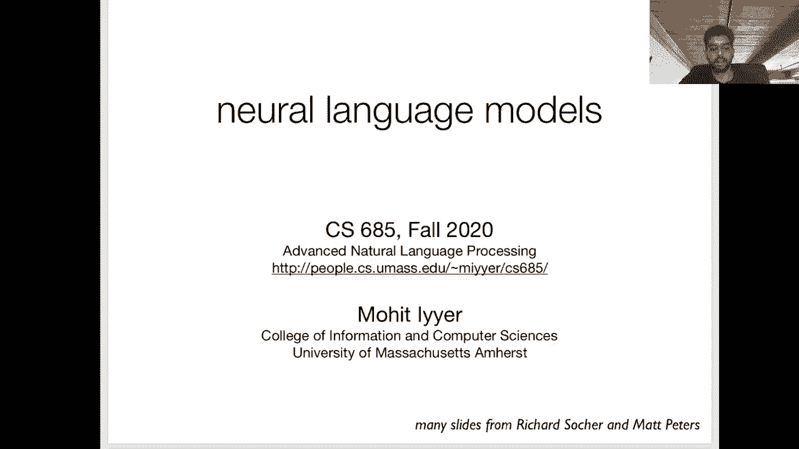

Okay， so before we get into today's topic， I wanted to go over some of the questions that came up from last time。

 so we had a question about the pass fail policy which for graduate students is technically satisfactory or unsatisfactory we are going to allow you to decide whether you want to switch from a letter grade to pass fail at any point between now until the final report deadline。

 which is December 4th， so if you want to take this class pass fail。

 you should send an email to the instructor's account with your request and also make sure to send us a reminder email at the end of the semester oftentimes these emails might get lost if someone doesn't note it down then you want to make sure to reminded us of it because the end of semester it can get kind of hectic。

Okay， so other stuff， your homework zeros do this Friday again。

 if you haven't started it and you little iffy on your programming or math background。

 I would encourage you to start early and finally your final project groups。

 the identity of the members must be formed by this Friday。

 otherwise we'll do it for you so I guess by now you've seen the piazza post by the TA suggesting that these group assignments won't be done completely randomly if you haven't specified your group instead we've collected a bunch of information from you regarding your interests。

 your time zone etc and we'll do our best to make reasonable groups that are you know roughly within the same time zone and also sharing common research interests so it's not a huge deal if you're unable to find a group but of course if you want to pick your own group members make sure to submit the form。

OrBy this Friday。

Allright， so let's launch into today's topic so just as a quick refresher language models are basically trying to measure this joint probability of a given sequence of words so this could be a sentence。

 a phrase， of large document， any piece of text and last time we looked at how we can factorize as joint probability as a product of multiple conditional probabilitybabilities。

 so any model that's able to compute a conditional probability of a word given some number of words as a prefix is also able to compute this joint probability of a sequence via the chain rule which we went over last time。

😊。

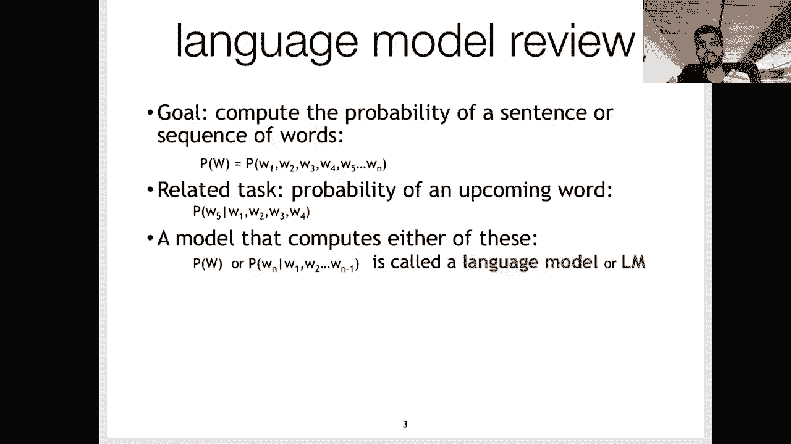

Okay， and last time we looked at Ngram models， which are again very simple methods of estimating these conditional probabilities。

 So in essence you have a training data set of a bunch of text and for any given prefix that occurs in that training data you're going to count up first how many times that prefix occurs and then how many times a particular word occurs after that prefix。

 so it's basically this count and the normalized style way of estimating these conditional probabilities and this is an example of max likelihood estimation。

 So you're maximizing these probabilities on a training data set。😊，Okay。

 so before we get into neural language models， I want to go over some of the issues with Ngri models that motivates more complex models。

So the first issue is this problem of sparsity right so we looked at this briefly last time。

 but let's say this numerator here， the count of students open their W subJ is zero for a particular W subJ that means this whole probability。

 this whole conditional probability is going to be zero and that also means that if we see at test time any documents or sentences that contain this phrase students open their W subJ the probability of that whole piece of text is going to be zero so this is obviously undesirable and we discussed a way of getting around this which is called smoothing so the intuition behind this is that for every count that I actually observe in my training data I'm going to steal some value from each of those counts and assign it to counts that I that are zero right？

😊，If students open their W subJ is0 for a particular W subJ。

 I might add a small value from the observed counts to this unobserved count such that at test time the probability of some document containing this phrase students open their W subJ is no longer zero。

Okay， there's a second problem right What if the entire prefix doesn't appear in my training data so students open there in that case the denominator is zero which is of course bad and so traditionally language modeling in Ngram models get around this using a method called back off so if students open there doesn't exist then I will back off to the bigram students opened if that still hasn't been observed in my data I'll back off to just students so at every point you're kind of getting a worse estimate right because you're ignoring a word because you had no data for it in your training data set but at the end of the day this slides you get around the problem of unobserved prefixes but both of these are kind of hacky methods right and we would love for a model to not have we would love to not have to apply these techniques till。

😊，Language model to get around this problem of zero counts in the numerator and denominator。

Another issue is storage so remember when we were looking at that restaurant review data set we were just looking at a bigram table。

 but we had to form this table of all of the prefixes and then all of the words that follow that prefix and then we count it up you know how many times did this prefix this word occur together and then we normalized by the unigram probabilities of the prefix right that was for a bygram model but imagine now we're doing a seven gra model right so now the rows of this table all the prefixes I now have you know V to the n order rows right so I have a huge number of rows and every time I add one more word to my prefix so if I go from bigram model to a trigram model to a four gra model to five gra model the size of this table grows。

ponentialallySo this really prevents me from estimating huge order ngram models even with large data sets because the I just will run out of memory and the sparsity problems that we discussed before with these zero counts become much greater in settings where you have larger n so if you remember the Shakespeare example that we went over in the last lecture with a four gra model like 99。

9% of the counts in the table were zero so you can imagine smoothing and back off et cea become much more important in these kinds of settings。

😊，So we have basically two key issues so far right one is the sparsity issues。

 a lot of zero counts and the other is memory issues and a third issue which is kind of related to both of these things is that in engrad models all words and prefixes are treated independently right so let's look at our prefix students open there right the one we've been looking at to this point so I count up all occurrences of this particular prefix and the words that follow but this has not influenced my count of pupils open there which is a kind of paraphrase of this initial phrase scholars open there it's maybe not the exact same semantics but it's very close undergrads open there or students turn the pages of there or students attentively perus there right you can imagine you know they don't have to be identical semantic。

😊。

But all of these things are roughly talking about the same topics and the same action。

 and it really makes sense that if we have a model。

 it should be able to share information across these semantically similar or in some cases。

 almost identical paraphrases of these prefixes。

So I guess at this point we'll go over two ways of representing words and first we'll start with the representation method used by engra models and many other bag of word style model so for example。

 the naive base classifier which we're not covering in this class also relies on this assumption and commonly when you're setting up a logistic regression model for NLP you're going to also rely on this bag of words assumption and at the core it's very simple I'm going to represent every word as a vector of zeros with a single one that correspond to the index of that word so if I had。

 let's say this toy vocabulary of six words I hate love the movie film I might represent the word movie as00010 where this fifth dimension here corresponds。

😊，the word movie and I might represent film as 00001 where this last dimension if it's one that means the word is film and so I might represent a phrase by adding these vectors together right so if I had the bigram movie film which of course doesn't make any sense。

 but let's say I had it I would get a vector of 00011 So this is essentially the way in which we're treating words in an Ngram model。

 but importantly we're treating prefixes as kind of separate words in the vocabulary So students open there has a separate representation then pupils open there and scholars open there all of these are separate rows in my Ngramham table and none of these one hot representations are actually sharing information。

😊。

Across each other。So one of the biggest problems of using a oneho representation is that all words。

 phrases， eta are equally dissimilar so a movie and film right we know that they're synonyms。

 but if you look at their two vectors their dot product is zero。

 their vectors are orthogonal they're no less similar to they're no less dissimilar to each other than they are to random other words like any of the other words in my vocabulary。

 I hate love and all words are equally dissimilar in this vector space so I can't really share in any information on occurrences of movie and occurrences of film。

 they don't influence each other。😊。

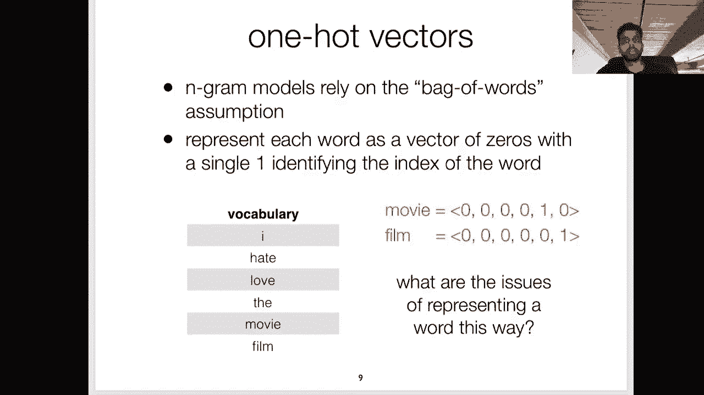

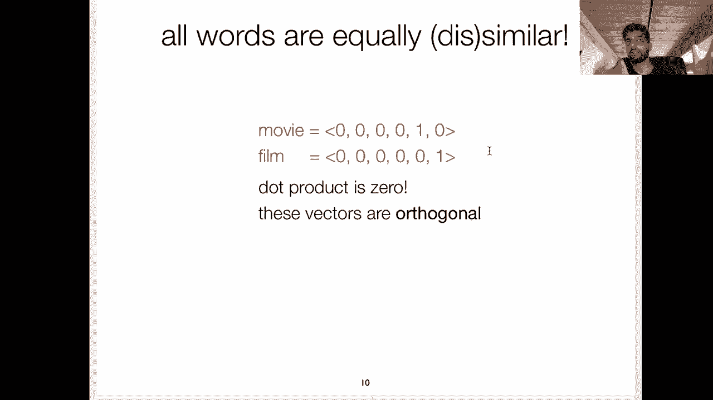

So what we want is a representation space in which all of these you know semantically similar units of text also have similar representations So we're going to move from these one hot vectors to lowdial real valued vector so not just zeros and ones and this is where neural networks enter the picture So in a neural language model I'm going to take my prefix and then I'm going to encode it into these real valued low dimensional vectors and then I'm going to train a classifier to predict the next word from the representation that my model has learned of this prefix So in this setting I'm no longer just counting all occurrences of students open there right instead I'm actually learning a function to transform this prefix into a vector and then I'm learning a classifier to predict。

😊。

A word from this low dimensional representation， so this is the shift from count based to predict prediction based models which really kind of started with at least in modern NLP with word devec which we're not covering here and now has kind of infused the rest of the research community。

😊。

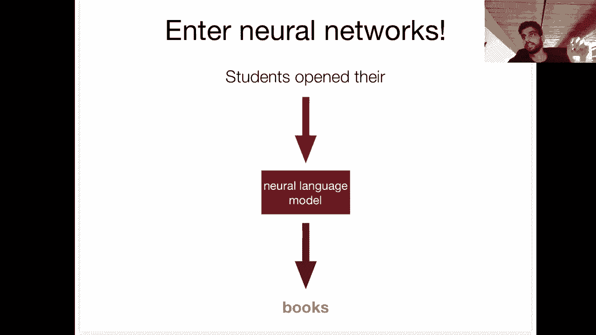

So at a high level in this lecture， we're going to be focusing on the forward pass of these models。

 which means we're just going to assume we have the parameters of a neural language model in existing language model and we're going to go through how we go from the raw text students open there to the prediction of the next word books in the next lecture we're actually going to talk about how we train these models。

 so this is the backward pass how given a training data set。

 we're going to estimate the parameters of our neural network model using the back propagation algorithm and our training objective is also going to use maximum likelihood。

 we're going to maximize the probability of our training data conditioned on the observed prefixes and the parameters of our model。

😊。

Okay。So let's start with words， right， we talked about these oneho representations。

 but now we're no longer going to be using those because as we discussed， they have many issues。

 so we're instead going to be representing words with low dimensional vectors called embeddings。

 And here I should clarify that we are representing word types as vector。

 So every word type in your vocabulary is associated with a separate vector。

 So here the word king might have you know this four dimensional representation。

 This is just an example in practice the dimensionalities of these embeddings kind of ranges from I don't know。

 maybe 50 to 1000 or even more than that dimensions， but it's usually much smaller。

 maybe an order magnitude or two smaller than the size of your vocabulary which is the dimension of one hot representation。

😊，And these are some examples from the original word devek paper。

 which essentially introduced this concept in a predict based learning framework where we see that words that are semantically similar。

 So king and queen walking and up， sorry， man and woman。

They are also close to each other in this vector space and they share certain directions in this vector space right so the relation of gender here is captured in in the vector space by the direction and distance of man and woman from each other there's also syntactic similarity that these words the word embeddings exhibits so walking and walked right they have the same stem if you remember the linguistic level of morphology that we talked about in the beginning the first video of this class here these are just two different tenses of the stem word walk and we see that the same relationship in this vector space holds for swimming and swim。

😊，Finally， there's， you know， country and capital relations that you can see are kind of consistent for different countries and their capitals。

 So these are all just plots showing that if you're able to learn。😊，Powerful word embeddings。

 then you can capture all sorts of semantic and syntactic similarities and stuff like world knowledge in the vector space。

 and so this will enable us to share information between prefixes that contain different word types。

 but share some semantics or even syntax syntactic similarities。😊。

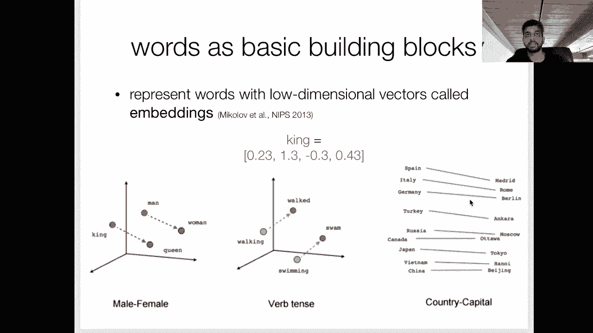

Okay， so we're going to start with word embeddings right so for this prefix students open there I associate you know each of these words with their corresponding word embedding。

 but then we get to this process of composition right for these kinds of models I want a way of taking the sequence of three word embeddings and transforming them into a single vector that I can use for this classification problem of predicting the next word。

So my goal is to predict， say books， maybe books is the word that appeared in my training data set。

 and I'm going to predict this from the composed representation。

So there are a lot of new concepts here that I'm kind of going through pretty quickly。

 so I just want to break this down into smaller pieces。

 so let's start with how this prediction process happens right so now I'm given this composed vector that represents this the meaning the semantics。

 the syntactic structure etc of this prefix students open there it's all been squash together into this lowdiional real valued vector by this neural network function So let's ignore that neural network component for the moment and just look at how we can go from one of these vectors to an actual prediction of a word。

😊。

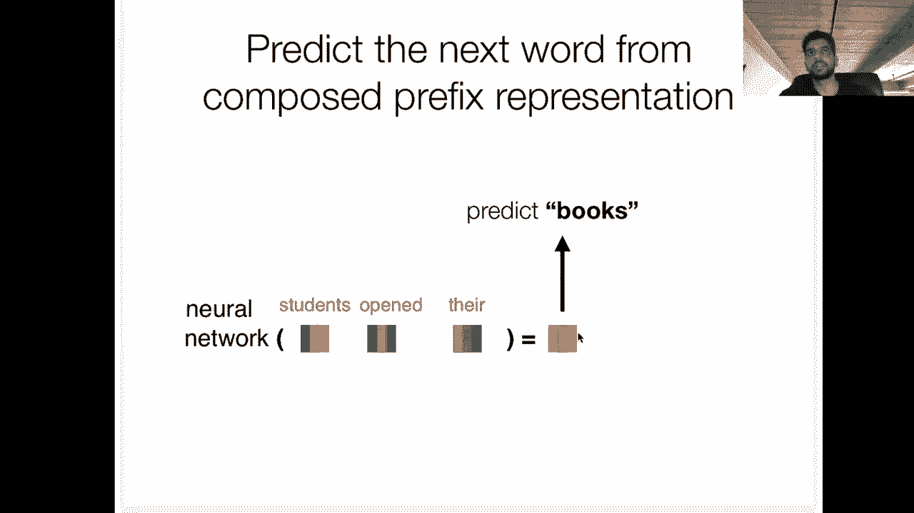

So this is a very important concept that you'll see over and over again throughout this class is that we're going to use a softmax layer to do this and at a high level what this does is it takes is input a vector and it outputs a probability distribution over the entire vocabulary or output space for a more general task。

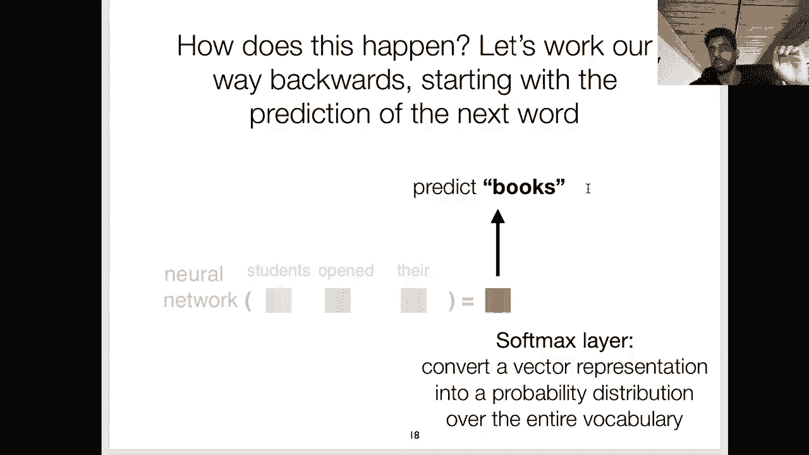

So let's look at that in a little more detail in this particular example if I have my low D representation of students open there。

 so let's say it's this like threedial vector here。

 what I want is a probability distribution over the entire vocabulary right so however many word types there are in my vocabulary and if this is a prefix that I'm observing a test time I of course want the probabilities to be pretty reasonable right so maybe a high probability to something like books and laptops and low probabilitybabilities to words that just don't make sense within this context。

😊，Okay， and this is how we're going to be estimating these conditional probabilities in this neural language model framework。

 so this conditional probability of any word W subi given the vector for students open there is going to be estimated through this learned neural language model so we're no longer just counting and normalizing right we're actually learning a model that predicts this distribution。

😊，Okay so let's go into a little more detail， let's say that our output vocabulary in this example consists of just four words。

 books， houses， lamps and stamps， so of course books is like the only plausible continuation of this prefix I guess maybe houses is plausible in some situations but anyway so this is just a simplified example so we're going to start with our low-diional representation of students open there and what we want is to get a probability distribution over the four words in our output vocabulary so note that to be a valid well-form probability distribution all the elements of this vector need the sum to one and they all need to be positive so between zero and one。

😊。

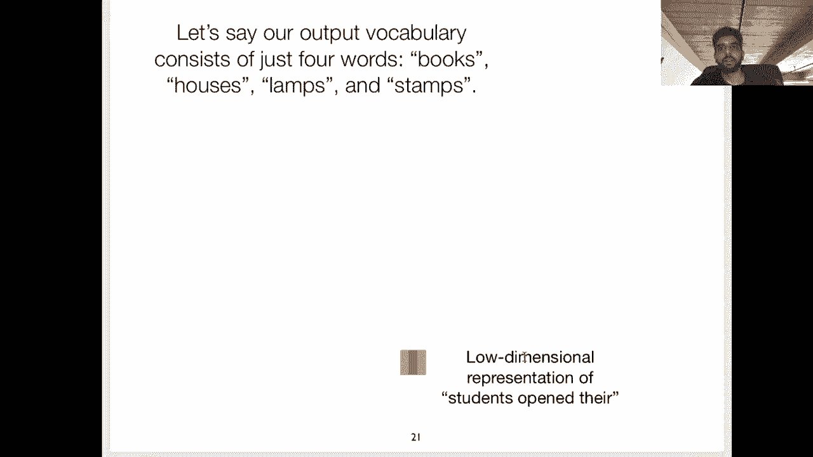

So every dimension， each dimension of this vector is associated with a particular word in my output vocabulary。

 so you can interpret this as a model that producess distribution is giving a 60% probability to books being the next word。

 a 20% probability of houses and so on。😊。

Okay so let's get into an actual specific example so instead of just showing you this picture of a vector。

 let's use this actual example of a three dimensional real value vector negative 2。3。9 and 5。

4 This is going to be the sample representation of my prefix students open there and we're going to call it x in our notation so this is a vector okay and let's say we also have this weight matrix W so we'll get into that in a bit but if you recall our output vocabulary has four words and this is a  three dimensional vector so we need some way of getting from a three dimensional vector to a 4 dimensional vector which is a probability distribution like we saw in the previous slide。

😊。

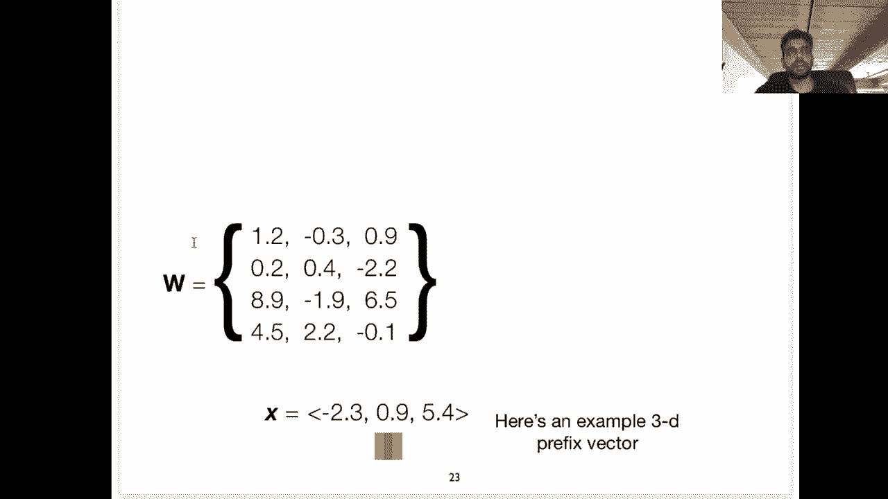

So that's where this weight matrix comes in， it's essentially used to project this three dimensional vector into a four dimensional space and then we're going to use another function to convert the resulting four dimensional vector into a probability distribution So how do we do this projection。

😊。

嗯。Well， okay sorry first let us look at the specifics of what each dimension in this vector corresponds to and also we'll look at what the rows of this weight matrix intuitively mean so you can kind of interpret each dimension of this vector x as a different feature of the prefix。

 remember students open there in our example， this is not exactly analogous to if you're familiar with feature based like logistic regression or log linear models where you manually define features ahead of time and then assign them to specific training or test examples。

 this is not exactly the same because in this scenario the features are actually learned so these features。

 these the values in this vector are if you remember the output of。😊，neural composition function。

 but you can intuitively think of them as different encoding different like linguistic properties of the prefix and similarly oops the weight matrix if you look at that more closely you'll see that it's a 4 by3 matrix right four rows three columns and each row corresponds to the weights of each of these features for a particular word in the output vocabulary so this row corresponds to books。

 this row corresponds to houses， this one to lamps and this one to stamps and you can kind of interpret I guess I can't highlight just a single cell here but like this 1。

2 this 0。28。94。5 these are the weights of the first dimension of the prefix represents。😊。

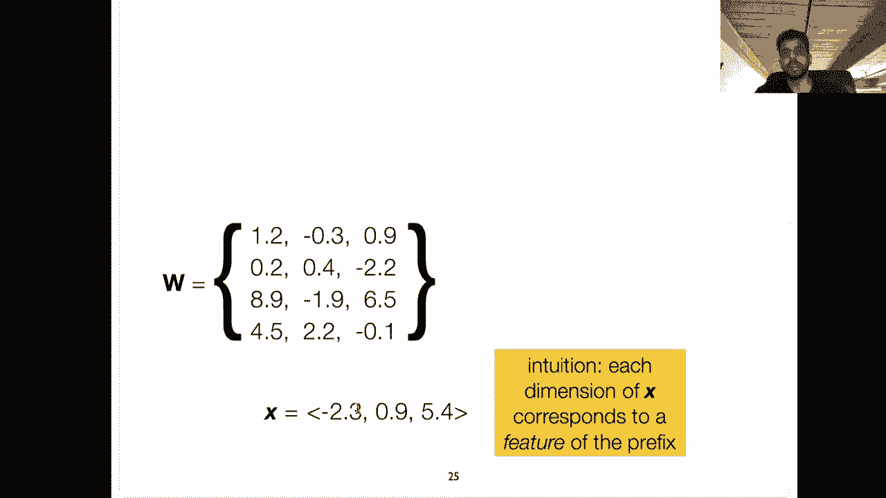

For each of the words in the output vocabulary so for example， if this was negative 2。3。

 it looks like you know for lamps， this is assigning kind of high importance to this this feature versus something like houses where this value is fairly low。

😊，Now you can't necessarily interpret these things in this way， I'm just giving you some intuition。

 but certainly the rows here correspond to specific words in your output vocabulary。

 so that'll be a little more clear when we go over the actual computation。

 but at a high level the dimensions of the prefix or representation correspond to features and the rows of the weight matrix correspond to feature weights for a particular word in the output vocabulary。

😊。

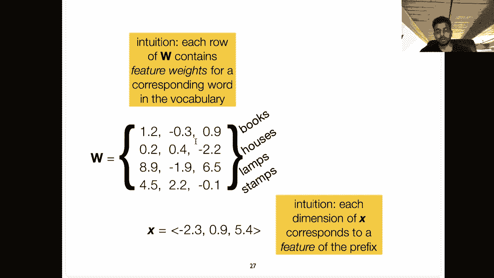

Oh let me move this thing down here right so just another caution。

 these intuitions aren't we can't easily interpret these features in the way that I've described here。

 like we can't say that you know the second dimension of this x vector corresponds to a particular linguistic property we'll get into this more when we talk about linguistic probe tasks which are specifically designed to kind of investigate what linguistic properties are encoded by these these vectors。

 but I think it's a reasonable intuition for people just getting started。😊。

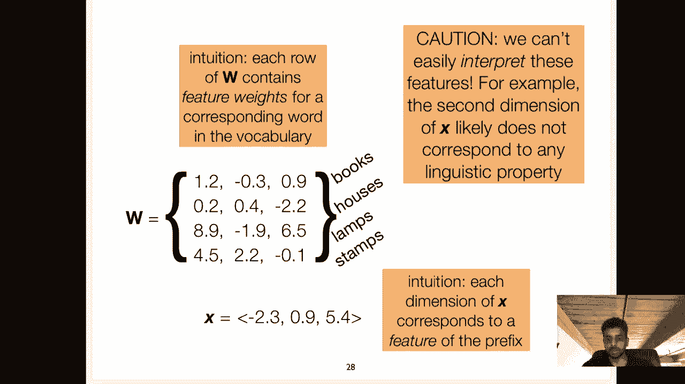

Okay， so we talked about how we want to get from this three dimensional vector to an eventual four dimensional vector。

 which is going to form our probability distribution of the next word。So I。

 if I take this matrix vector product， Wx get a four dimensional vector right because I've multiplied this4 by three weight matrix with this three dimensional vector。

 so the resulting matrix vector product is four dimensions。

 but let's look more closely at what this actually means to kind of connect with the intuition from the previous slide。

 I know that was probably pretty confusing。😊，But let's look at how we got this 1。8 number。

So I'm multiplying each value in the first row with the corresponding dimension in my pre prefix representation right so I get 1。

2 times negative 2。3 this is the feature weight for the first dimension of the prefix representation similarly I add that to minus 0。

3 times 0。9 and 0。9 times 5。4 and so this is essentially just the dot product of the first row in this weight matrix with the prefix representation and that's how I get the first dimension of this matrix vector product so similarly minus 11。

9 results from doing the same thing with the second row of this weight matrix and so on so this hopefully clarifies why I referred to each row here as associated with a particular word。

😊，The output vocabulary right you can see that we're using the first row here only to compute the value of the first dimension in this matrix vector product and if you remember the first dimension here is going to eventually be associated with the probability of the word books。

😊，Okay， so if you look at this matrix vector product here。

 you will notice that it is not a well formed valid probability distribution right。

 the numbers here do not add up to one， they have negative numbers and so I need to still do something to get to a probability distribution。

Okay， and this is where the softmax function comes into play。

 So this is a very important function that you should make sure to understand thoroughly because we'll see it over and over again through the rest of the semester it occurs and things like attention mechanisms and other things as well that will' be covering。

 So if you look at this function it takes as input a vector X and all it does is exponentiate in the numerator。

 So this is going to make all of the values positive and then it's going to normalize by the sum of this vector。

😊。

The expiated vector。So that normalization step makes the sum of this vector of all the elements in the vector equal to 1。

 so this function accomplishes both of our goals right we get a vector where all the elements are positive and also all the elements sum to1。

😊，Okay， so in this example I kind of chopped a little bit off these numbers to make them more reasonable in the previous case here。

 we had negative 11。9 and 12。9 you wouldn't see these numbers in a normal neural language model they're fairly large and these extreme values dominate the softmax computation so I made a little more reasonable just for sake of example here。

 so if you see if you see the matrix vector product is equal to this vector applying the softmax function to this matrix vector product gives us the following vector where the first dimension is 0。

24 so 24% probability for the word books， 0。0006 probability for the next word whatever that was houses 0。

73 probability to stamps and 0。02 to lamps so obviously this is not a great prediction。😊。

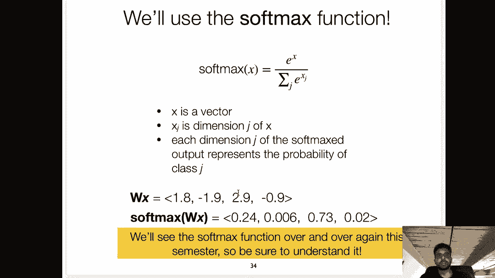

Right it's predicting 73% probability of observing lamps given students open there。

 but this is just an example， so in the next video we're going to talk about how if we have a model that's predicting something wrong like this。

 we can adjust its parameters。😊。

And the parameters of this model that we've seen so far are these weights in this weight matrix here。

 how can we adjust those parameters to make the resulting prediction put more probability mass on the probability for books and less on these other words？

😊。

All right， so this was the the first step of the。Sorry。

 we were working our way backwards so this is actually the last step of neural language modeling how we go from a vectorized representation of our prefix to a prediction of the conditional probability distribution of the next word so just to sum up if we're given such a representation of a prefix we'll call it X we do the following two steps to get converted to this probability distribution we first projected to a v dimensional vector where V is the number of word types in our vocabulary using a matrix vector product as we saw on the previous slides。

 so you might see this called as a linear layer， this is a pytorch terminology or feed forward layer fully connected layer。

 there are many different names for this projection step。

 but here in all cases we're just doing a matrix vector product。😊。

And the goal is to transform this representation that we have as input to a desired output space。

 so in this case we want a V dimensional output space。😊。

And the second step once we get this vector is to simply just apply the Somax function to get it into a probability distribution。

Okay， so now that we've covered how we actually get a predicted probability distribution given a representation of the prefix now let's turn our focus to how do we compute this single representation of the prefix in the first place so as mentioned before。

 we're going to have a neural network that acts as a composition function so it takes as input a sequence of word embeddings so here the embedding for students followed by the embedding for open followed by the embedding for there and squashes it down into a single vector。

😊。

So there are many different ways you can implement this in neural network in your homework we look at element wise addition。

 which means given these three vector representations。

 I'm just going to add them up element wise so I'm going to add the first dimension of each of these vectors to get this the first dimension of my composed representation。

 then add up the second dimension of each of the three vectors is to get a second dimension and so on。

 so this is one of the simplest composition functions element wise addition。

 you can also imagine you know things like multiplication or max or something like that average is also a popular choice。

😊。

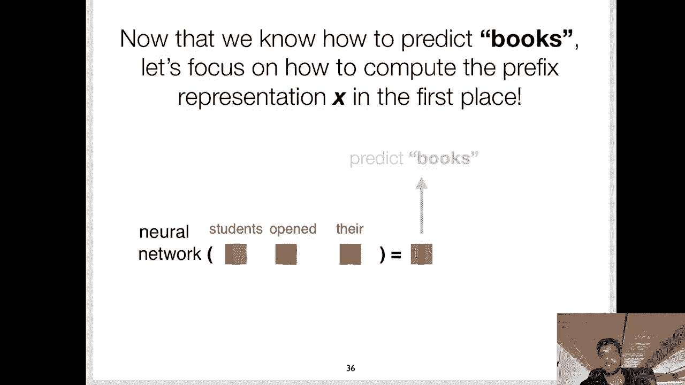

But yeah， this is just one way of composing these functions right so the problem with doing something like elementwise addition is that we ignore the order of the words in the sequence right so my representation for this prefix students open there is going to be the same as the representation for open their students or their students opened or any permutation of these words so it doesn't take into account the order of the words in the prefix which we obviously know is critical right it conveys a lot of semantic and syntactic meaning and so we want to be able to model the left or right order of these words。

😊。

So how can we get around that problem while there are many different ways we can do this。

 a simple approach is concatenation， so we look at this in more depth in a bit but essentially I can just concatenate these three embeddings together and thatll give me if you assume each of these is a three-dimensional vector my composed representation will be nine-dimenional so this has some issues that we'll get into later and those issues kind of motivate the next class of function which are more complicated so we have feed for neural networks。

 convolutional neural networks or recurrent neural networks and finally transformers the latter class of model the transformer has become the most popular neural network architecture and NLP and so our focus is going to be on transformer based architectures for most of this semester。

😊。

In this lecture we'll go over concatenation combined with feed forward neural networks and we'll also look into recurrent neural networks next week after we've covered back propagation。

 we will start looking at the transformer attention mechanisms and then finally get to the overall transfer learning paradigm and specific implementations of that that have been proposed over the past couple of years。

😊，That was random roadmap in the middle of the video。

Okay， so let's look first at concatednation， so we know that concatenation at least preserves the order of the words in the prefix right in contrast to element wise addition or mean pullinging。

😊，So let's say we have our prefix right the students open there will actually treat this in a similar way to the Ngram models in that we're going to consider a fixed window for our prefix so if we had the students open there occurring in the context of the larger piece of text as the proctor started the clock the students open their blank we're going to just discard parts of that that are outside our fixed window so in this case our windows just four words later we'll look at models that don't have this limitation and can theoretically handle unlimited context although practically that's not true。

😊，Okay and we'll call this a fixed window neural language model。

 this model was proposed initially by Yashu A Benggio in 2003。

 it's one of the readings that are on the website for this week's lectures so you should definitely check that out。

😊，Okay， so how does it work We'll start with our word embeddings for each of the four words in the prefix right so in this visualization each word embedding is four dimensions so each of these four circles corresponds to one word embedding and the first step is just concatenate them together so if each word embedding is four dimensions。

 our concatenated representation our x vector here is 16 dimensions。😊。

Now an important concept in any form of deep neural networks is to add a nonlinear function into the mix and so we're going to call this a hidden layer in our terminology。

 but essentially it's a function that takes as input this concatenated representation and produces a new vector as output and we've applied a nonlinearity in the form of this function F as well as a projection matrix a linear layer you can see here we have our matrix vector product like we saw before。

 so if you look at the dimensionality of this new vector here， it's actually 12 dimensions。

 not 16 dimension， so we've projected it down to a lower dimensional space than the initial concateninated representation。

😊。

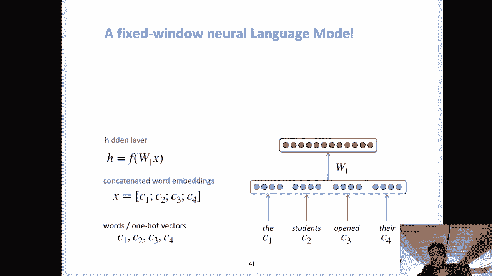

So you might ask what is the purpose of thislineity F right and what is the purpose of this whole hidden layer。

 Why can't I just directly apply my softmax layer to this concatenated representation there's nothing preventing you from just discarding this hidden layer and immediately proceeding with a softmax layer。

 but the point of adding these nonlinearities is to be able to model nonlinear relationships between the input and the output So this is kind of hard to think about in the context of language modeling。

 but a classic problem that kind of motivates the inclusion of these nonlinearities is the X or problem and so you can read more about this maybe I'll put a link to it on the schedule。

 but essentially these nonlinear functions allow for much greater representational capacity and modeling of much more complex relationships than fully linear。

😊，So the state of the art in these kinds of models actually contains stacked layers of these nonlinear projections。

 So each one of these layers is just increasing the complexity and the types of relationships that the model can handle And so what do I mean by a nonlinear function。

 So if you look today at the most popular choices probably the most commonly used one is the rectified linear unit or R。

 So this one is very straightforward。 the function is just L of x where x is a vector is the max of0 and x。

 and this is applied element wise。 So basically any element of a vector that is negative gets converted to0。

 otherwise it remains the same。 It's identity function。 other choices were popular before this。

 such as a10 h and sigmoid， they have issues with gradient saturation that。😊。

Well make more sense after we get into the next lecture。

 but yeah there is you know a lot of research on different types of nonlinear activation functions you might hear these referred to as activation functions when you're doing your readings as well but at the end of the day there is a couple that are kind of standard that everyone uses without the thinking too much about it and yeah the value is one of those。

😊，Okay， so we took our concatenated representation。

 we projected it into this hidden space using a linear layer followed by a linearity。😊。

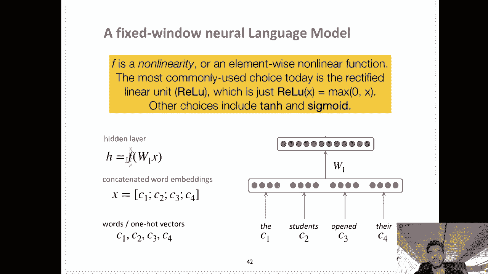

The final step is what we just saw before we apply a softmax layer right so it's a softmax function followed by this matrix vector product with the vector is where the vector H here is the output of the hidden layer computation。

So we note that we have two different weight matrices here right W sub1 is doing this projection from 16 dimensional vector to a 12 dimensional vector and so its dimensionality is 16 by 12 and or 12 by 16 depending on how you set up the computation。

😊，Yeah， in this case， 12 by 16 and the dimensionality of this W sub2 matrix is going to be the size of the vocabulary by 12 right so when I when I multiply this matrix by the 12 dimensional vector H I'm going to get a V dimensional vector which is then projected or converted to a probability distribution via the softax function。

😊，Okay， so again in this lecture we are not going to look at how exactly we train the parameters。

 W sub2， W sub1 and the word embedding C sub1 through C sub4。

 that's what we'll look at in the next lecture but note that all of these the parameters of the model are these weight matrices as well as the word embeddings。

 all of them are learned through this process of predicting the next word on a given training dataset set。

😊，That will hopefully make more sense after you watch the next video。

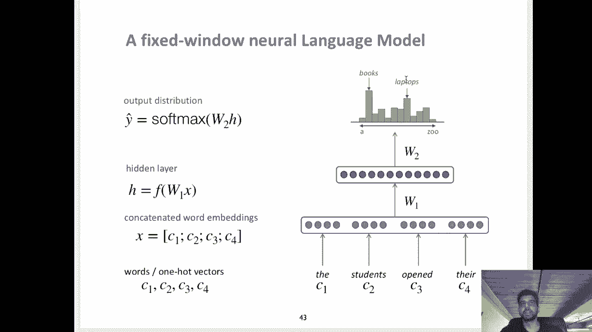

Okay， so let's step back and do some comparisons between this model to our NG model from the previous lecture。

So first of all we don't no longer have the sparsity problem right we're not explicitly encoding this count table anymore right and we're not enumerating all possible prefixes that could be formed in the vocabulary The model size is no longer exponential in the order of the model right the window size but the model still has problems right it hasn't really addressed this fixed window thing right it's still limited to in this case。

 the four words that immediately follow the current word and scaling this model to larger windows is kind of problematic because it grows this concatenated representation right so if I wanted to include the last hundred words I'd have to concatenate 1 hundred of these embeddings together then that makes this weight matrix get a lot bigger and importantly I'm not sharing parameters between。

😊，accross one word and another word right all of these get different weights in this weight matrix and so this can be a challenging optimization problem right if I see the word students and position 83 versus 92 do I really want to use a separate weight matrix or separate weights to handle this or do I want to share weights so the next model will look at the recurrent neural network addresses this problem and the transformer also has its own way of addressing this problem but the recurrent neural network is conceptually much simpler to explain which is why we're going to go into it briefly here。

😊。

So in this model， we no longer have this condition of including a fixed window。

 but just for the sake of demonstration， we're going to just look at the same forward prefix that we've been looking at and to this point the students open there。

😊，So just like before， the first step is to get the embeddings for each of these words， so again。

 we have these four dimensional embeddings， but we're not concatenating them together anymore。😊。

The recurrent neural network is interesting because it proceeds in a series of steps so it processes a single word。

 the first word first， then it incorporates that representation with the next word so that's step two。

 then it incorporates that representation of the students with the word opened and finally the word there so in this sequential processing it kind of operates the same way that humans do when they're reading right we read left to right。

 the recurrent neural network also reads or can creates these representations left to right。😊。

So let's take a look at how that works。We're going to have this same concept of a hidden state except this equation looks different than it did for the fixed window language model。

 so you'll immediately notice that there are actually two weight matrices here instead of just one and we'll look into the actual roles of those in a couple of steps so we're going to first start with an initial hidden state so this is what we have before we've seen any words it's just like our base representation for any sequence。

😊，Now we're going to integrate this representation with the first word of our prefix the。

So this diagram shows that how we're actually applying the two weight matrices。

 W sub H and W sub E to do this integration step， so W sub H is responsible for projecting the previous hidden state into a new space and W sub E is responsible for modeling the word embedding of the current time step。

 so we're going to use this terminology of time steps because this model proceeds sequentially right so in the first time step we are integrating the word the the very first word with the previous hidden state。

😊，So if you look at this equation， W sub H， the matrix vector product is between W sub H and the previous hidden state。

 which for this time step1 is H sub0， the base representation。

 and we're adding that to the matrix vector product of W sub E which is this other weight matrix multiplied by the word embedding at that time step。

 so the word embedding for the。Then we apply our non linearity right this F， which could be the R。

 the T0 h or whatever， and then we get H sub T， so in this case H sub1 our new hidden state that has incorporated one word of this context。

😊，Now that we have this representation， we're going to integrate the next word in the sequence。

 students， so at time step two。We're going to do the exact same computation except the vectors that we're using change Note that the weight matrices stay exactly the same。

 We're using W sub H again and W sub E but the matrix vector product this time is W H times H sub1 right not H0 and the matrix vector product for this term is W sub E times C sub2。

 the word embedding of students， which is the word associated with the current time step。

 the second time step。😊，So you can see here that we're actually sharing the weight parameters across different words which we were not doing in the fixed window case where we had separate weights for every single word in the fixed window here we're using the exact same two matrices for every single time step of this prefix and so our model size is not dependent on the size of the input prefix you can also see how this formulation allows you to model an arbitrarily long prefix right because I'm just proceeding one word at a time I'm using the exact same weight matrices so those are not a function of the time step and so I can just keep applying the same equation as I get one more word in the prefix so I can model has long prefix as I want。

😊，HereI'm going to integrate the third word opened and finally the fourth word there and now this representation H sub4 has information about all four words that occurred in the prefix right。

 this H sub4 is a function of every single word embedding in the prefix as we saw with this recursive equation。

 right。😊，And so H sub4 we're going to treat as our representation of this full prefix。

 so how do we get from H sub4 to a distribution over our vocabulary well we already have seen this now multiple times。

😊，Right， I'm going to simply just use a softmax layer with a separate weight matrix at W sub2 to project this H sub4 into the vocabulary space。

Okay， so one thing that you might want to always， you know， keep in mind is what like。

 what are the dimensionalities of the different parameters that we're working with here。

 So we know our word embeddings are four dimensions each。

And what about these parameters W sub H and W sub E so in this diagram the hidden units are also four dimensions right so W sub H is is just a four by4 matrix right it's not changing the dimensionality of the vector that is getting multiplied it's making it another four dimensional vector similarly W sub E is also a four by four vector right the embedding dimensionality and the hidden dimensionality are the same this doesn't have to be the case it's just the case in this example in practice these numbers do vary and they're treated as hyperparameter so things that you have to decide beforehand before training the model things that you might want to optimize by looking at the n performance of your language model。

😊，Okay， and what about W sub2 well the vector that this matrix vector product includes is H sub4 which is a four dimensional vector and so we want to project this four dimensionmensal vector into a size v vector right where v is the number of word types in our vocabulary so W sub2 in this equation is going to be v by4 so when you multiply this v by4 matrix with this four dimensionmensal vector you get this v dimensional vector which when we then apply the softmax to it gives us this probability distribution。

😊，Okay， so in this lecture， we've covered the forward pass for feed forwardward neural language model and a recurrent neural language model。

嗯。I I realize that this is a lot of information that's been compressed into one video I'd highly encourage you to check out some of the readings that have been posted on the website if you're confused or come to office hours myself and the Ts all of us are very experienced with these kinds of models and can answer or your questions。

 hopefully well enough that you understand whatever confusions you have and again。

 next time we're going be focused on the actual training process of these models so before we conclude let's just take a look at what are the advantages of this recurrent setup over the fixed window feed forward language model that we talked about previously so we've already gone through a bunch of these right we can process any input any length input right because we're operating left to right in this you know one word at a time kind of framework。

😊。

So we don't have to make any preconceived choices as to what the the length of the prefix that we can handle is our model size is not。

It does not depend on the length of the prefix right because we're sharing parameters across the different words of the prefix and right。

 so these are the main advantages compared to the model the fixed window language model we looked at before。

😊，Some disadvantages is that this recurrence is slow， especially during training because well。

 this will be more clear when we talk about back propagation。

 but if you only have an error signal at the output here when you're predicting the next word。

 the error that you make right if the model was assigning a low probability to books and it should have been high。

 that needs to be propagated through all of the time steps that we observed in the sequence and if the sequences along。

 this computation might be slow。😊，Additionally， like we've talked at length about the theoretical ability of this model to handle long prefixes。

 but in practice it really only encodes information about the last like a small number of words that occurred immediately previous to the word you're trying to predict so recurrent neural networks or have a hard time at least in the language modeling case looking beyond say 20 to 30 words and you really need to make them deeper train them on a huge amount of data for for them to be able to actually make use of the extended context but there are a number of optimization challenges with recurrent neural networks which have kind of shifted researchers over to transformers which at least during training are。

😊，Much faster to train， more parallelizable and easier to scale。

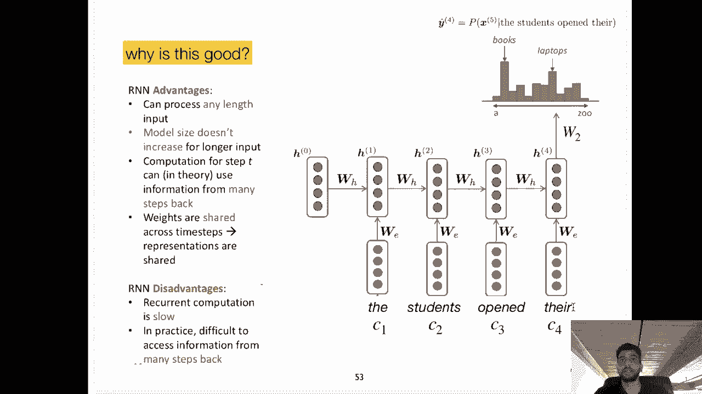

Okay， so finally we're as mentioned before， going to be looking at back propagation next time。

 so how we actually train these networks， how we get the parameters。

 the weight matrices and the word embeddings， and then you can look out for the transformer architecture coming next week。

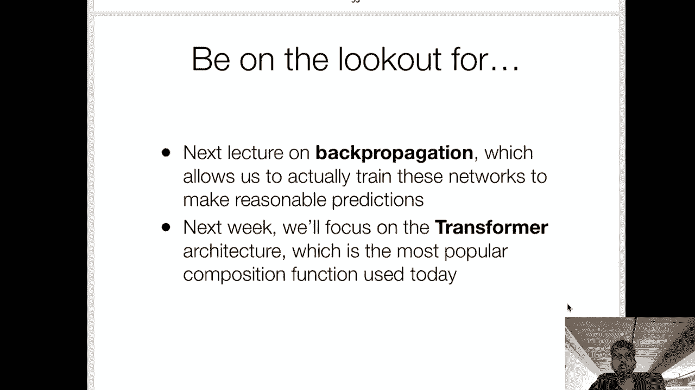

Okay。