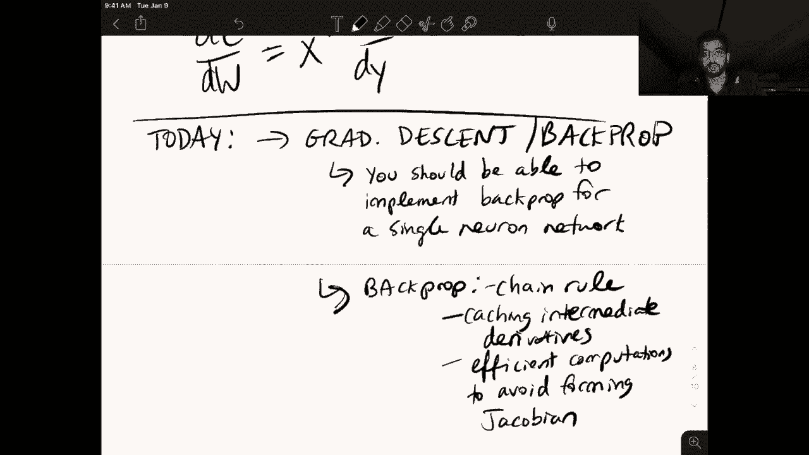

# 【双语字幕+资料下载】马萨诸塞CS685 ｜ 自然语言处理进阶(2020·完整版) - P4：L3- 反向传播 - ShowMeAI - BV1BL411t7RV

Okay hey everyone， so today we're going to be doing something a little different Our topic for the day is back propagation which is an algorithm we use to train our neural networks and we've been talking about neural language models so we're going to look more specifically in that context today but instead of me talking over a bunch of slides I've got this iPad weird and I'm going to be writing on it instead of the standard lecturing so this is my first time doing this I hope it is somewhat watchable let me know on Piazza if I should continue using this format going forward or stick to slides or maybe do some combination of both。

Okay， so let's kind of start with an overview of what we're going to talk about today。

 so first brief review of neural language models focusing on things like what are the parameters and this is going to kind of frame the discussion of gradient descent and back prop later。

Next， we're going to talk about gradient disscent， which is an algorithm that we use to train our neural networks and of course many other machine learning models。

 for those of you who have taken a machine learning class before you are certainly familiar with this concept of gradient descent for others will briefly review the algorithm here。

 and you should also plan to read more about it on your own if after you watch this video you're still confused。

The next thing we're going to talk about is back propagation。

 which is really a way to compute the gradients and we're going to go over this in both a single neuron setting。

 which makes it easy to explain the intuition， as well as a back prop。Of a linear layer。

Which we've seen before in our neural language models。

 the linear layer used to project the concatenated word embedding sequence into a hidden space。So。

These two concepts are used to。Train。And ends， neural networks， and in our context。

 we're going to use it to adjust the parameters of our neural language model such that it makes better predictions of what the next word is。

Allright， so that's a quick overview Now let's briefly review that feed forward fixed window language model and just use it to identify things like the model parameters which we're eventually going to be computing gradients on so if you remember we had this prefix from last time and we started with these word embeddings for each word in the prefix in our feed forward fixed window language model we concatenated them all together and we passed that through a hidden layer then we used the resulting representation to predict the word books and we did this using the Somax layer so we went through the forward propagation phase of this model last time。

 but now I wanted to kind of emphasize，😊，What components of this model are the actual parameters So remember we have the word embedding C sub1。

 C sub2， C sub3， these are associated with each of the words in the prefix and remember they are lowdial real valued vectors So when we start training this model these embeddings are randomly initialized。

 say they don't have any correspondence with the semantics or syntactic role of the word that they're associated with。

 but we would hope that once we train the model adjust the values in these vectors。

That the vector space of the word embedding starts becoming more meaningful。

So remember when we did our hidden layer projection， we used this parametermeter matrix W sub1。

 similarly when we did our softm layer， we used this other parameter matrix W sub2。

So when we wrote down the equations of this model， it looked kind of like this。

 We had H equals F of W sub1 times C1。C 2， C3。 So this is the concatenated representation。

 and let's say we had O， which is our output probability， which is the softmax of W sub2 times H。

Right， so here note that we have two intermediate variables we've got let me use a different color。

 we have H and O， so H and O are not model parameters。😊，big use the same color。

 This color thing is pretty cool。 So H and O， O， is that readable maybe。Or。Intermediate。A yous。Not。

Parameterters。If you look at these equations， they are functions of the model parameters。嗯。Which are。

I'm probably going to go overboard on the highlighting apologies in advance。Oh's not the red color。

 but these the highlighted things are the model parameters。

 So the highlighted things are what we're going to adjust and what we eventually care about is that the output of this softm layer right this probability distribution O is more in line with what we would expect to predict。

 So for this prefix maybe be assigning a high probability to books。😊，Okay， and so here。

We've got our model parameters。2。Mの。Rrims。Now， how do we train them。To yield。Good。Predictions。

Apologies for my handwriting， you're just going to have to deal with that for this lecture and also other lectures in which I use this iPad。

So this is a question， the answer is gradient descent。So。Um。

 we are going to look at gradient descent and it's kind of broken down into three different steps。

So the first step is we need some way of determining how good our current set of parameters is at predicting the next word。

 right， So we need to measure that somehow。 and we're going to do that by defining a loss function。😊。

We'll call it L。And L is a function of our model parameters。

 We commonly use theta to refer to all of our model parameters。

 So if I look at the example from above， we highlighted all of these model parameters for our neural language model。

 So for NLM， we had W1， W sub2， C1。😊，To how many other words are in our vocabulary right so the C's are the word embeddings so that theta in this example would correspond to all of these parameters。

 this is supposed to be an arrow。But I'm writing this now more generally。

 this the could be the parameters of any model。And this loss function， L theta is going to measure。

How bad。嗯。Current。Moel。Is at in our neural language model example， predicting the next word。

But this this objective could be different for different tasks， right。

 it could be you know answering a question or predicting the sentiment or so on。

 You just need some scalar value that defines the current performance of the model。Okay。

 so once you have a way to measure how well your model is doing， the next step is to calculate。

The gradient。Of this loss function with respect to the model parameters。

So we're going to use this notation DLD theta to denote the gradient。

 and we're going to use it for all of the partial derivatives that this gradient encompasses in the future。

Okay， so what exactly is the gradient for those of you who are unfamiliar with it。

 it basically tells us so I have the scalar loss function and let's say I have a particular parameter in my model if I change that parameter if I increase that parameter how much will the loss function increase and in general the gradient is giving us the direction of steepest ascent with respect to all of the model parameters so let me write that down。

😊，The gradient。I mean， intuitively， it tells us。How the loss。Changes。When。We modify。The model。Pms。

Theta and importantly， it gives us direction。Sepest。Theent。Is this important so we will。I write it。

Okay， so I'll give you an intuitive example of this in a bit with a very。You know， simple function。

 but before I do that， so we defined our loss function， we've computed this gradient。

 How do we use the gradient。 What we're going to do is take a step。In the direction。Of the negative。

Graient。So remember that if the gradient is giving us the direction of steepest ascent。

 so increasing the loss， we know that the loss is telling us how bad the model is currently doing right so we want to actually minimize this loss function。

 so going in the direction of the negative gradient will take us in a direction that minimizes this loss function。

😊，So do。Minimizing。The loss。So what does it mean to take a step in the direction of the negative gradient？

So let's say that our model parameters were theta old。

 these are our current model parameters and we want to get a new set of parameters theta new that。

Have that result in a lower loss。So to do this， we're going to take our old parameters and we are going to subtract this eda multiplied by the gradient。

And so what is Ada here， Eda is a variable that corresponds to something called a learning rate。

 which controls。The step size， so how much of a step we want to make in the direction of the negative gradient。

Seems highlighter worthy as well。Okay， so that was a lot of information let's look at a simple example that'll hopefully we make it more clear so let's just look in a two dimensional plot I have one parameter and one loss function sorry I have obviously a scalar loss function so we have our loss on the y axis L sub theta and we have theta here so let's say theta is also a scalar here。

😊，And let's say the loss function looks something like this。

So this is a convex function in practice we won't be dealing with functions like this。

 but we're still going to use gradient descent this is just for demonstration。

All right let me pick a different color， so let's assume that I randomly initialize theta。

 so I have no idea before starting training what the best value of theta is that minimizes this loss function。

So maybe I start up here。嗯。Say this is random。Initialization。

So I set my theta to sum value over here， I compute the loss function over my training data and I find that it's pretty high。

So now I'm going to compute the gradient right and so I compute the gradient at this point。

 it's this line here， this tangent line， and I decide to go in this direction right。

 the direction of steepest descent， So maybe I take a step in this direction。

And I end up over here with my next when I use this update function。 So this one was theta 0。

 our random initialization。 This one is theta 1 after one step。

 And this direction here was given to us by D L， D theta 0。😊，Okay。

 so now we're going to just repeat this process。So I'm going to compute a new gradient， go over here。

 compute a new gradient， go over here， and eventually maybe I finally reach the bottom here。

 the minimum of this function， and I claim that I'm done， I've reached the minimum。嗯。

 so my goal is to get to this point。And the way in which I'm going to do that is by computing these gradients。

 taking a step in the direction of the negative gradient where this learning rate value controls how far I step so as an example of what happens if I have a big learning rate。

 imagine that if I had a huge learning rate and I started back at this point。

 the randomly initialized point， I do run into the danger of completely overshooting the the minimum and ending up on the other side here and that's obviously not good and if my learning rate is too large I might see in。

😊，AKind of。Zigzag pattern of my loss function where eventually I might get to the minimum or I could just overshoot it completely and go somewhere else in the perimeter space。

 which results in a higher loss。 Maybe I'll get rid of these。

 That was just a demonstration of what happens if your learning rate is too high。 So in general。

 a learning rate is part of your model hyper parametersmeter。是。

So a hyperparameter refers to something that is not learned by the model。

 but is rather something that you as the designer of the model set before the training process even starts in general you might have to train multiple different models using different hyperparameters before you can find one that maybe results in the smallest loss。

So hyperparameters are tuned。I mean in most cases， nowadays。

 they're I think still chosen roughly manually， people who have a lot of experience training neural networks tend to know what range of hyperparameters tend to work best for given problems。

 there's also a whole research field on optimizing these hyperparameters automatically。

 but we're not going to talk about that in this class。Okay， so right。

 going back to this you might wonder， well for such a simple function。

 can't I just get to the minimum compute the minimum in a closed form and not have to go through this whole process of iteratively computing the gradient and adjusting my model parameters。

 this is true for simple models like least squares as a famous example that have closed form solutions。

 but in practice when you're dealing with these neural networks that have know highly nonlinear relationships between inputs and outputs we went over that last time there is no closed form solution for computing the best set of parameters all of the loss functions we deal with our nonconvex and we still use gradient descent to approximate the minimum。

 so none of the methods we're using guarantee that we're going to reach the global minimum of。😊。

The set of parameters optimize that reaches the global minimum， but in practice these methods。

 gradient descent seems to give you a reasonable solution in most cases。

I should also mention that this update rule here is just vanilla gradient descent in practice there are several more advanced optimizers。

 things like Adam or Ada grad that people might have seen if you've。😊。

Dealt with neural networks before， they're all kind of just variants on this equation with clever methods of determining step sizes adaptively and so on。

Okay。So that is the high level of gradient descent。

 so hopefully at this point you understand why we are computing these partial derivatives。

 it's because they tell us the direction of steepest asscent and then why we're stepping in the negative direction of that so that we can minimize our loss function so hopefully that's all clear if not。

 I'd encourage you to do more reading on just general machine learning materials and maybe I'll put some links to those on Piazza or the website。

😊，Okay， so now that we've gone over at least this high level process of gradient descent。

 let's look at a concrete example， this one is going to be fairly straightforward。

 but this is also going to serve to introduce back propagation。

 which is a method that we use to more efficiently compute the gradient。😊。

So we'll look at this in a single neuron example， so we'll be dealing with completely with scalrs。

 no matrices or vectors in this example just to make things easy。

So let's depart a little bit from our neural language model framework and because that's kind of hard to do in this toy setting instead。

 let's just say we have a generic problem where we have some input。😊，Our input is a single number。

We multiply that number by some scalar weight， again。

 just a single number to get some hidden representation。嗯。

Then we multiply that with another weight W sub2 to get a scalar output。All right。

 so one question that you should be able to answer at this point or is sorry。

 what are the model parameters？Okay， so in this case， we have just two model parameters。

We have W sub1 and W sub2 x is our input， so x in this case is not a word embedding that's learned by the model X is just a number that we observe in our training data set。

And so maybe I'll make that more clear。Okay parameters are W1， W2 inputs。Or look like。X Y pairs。

 so X is a single number input and y is the target output in our training data set。

 So we're just trying to learn a function to map one number to another number and our loss function is going to be defined by how close is the output O to the target output Y。

But before we get into that， let's look at how we compute these intermediate variables。

 so let's define this first equation as tan0 H of W1x。

 so here we're introducing a new nonlinear function。

 tan0 H is a common activation function used in recurrent neural networks。

 something that you should be familiar with。Okay， and let's say， oh also uses a10 H of this product。

So again here note that we have two intermediate variables right we have H and O。

 these are not our model parameters， they're intermediate variables。

 we don't have to compute derivatives with respect to H and O specifically to do our model updates right our model updates our theta is just W1 and W2。

Okay， so let's state this again a little more concretely just to make the training situation more clear。

 so let's say assume。呃 in。W， that was terrible。All right， inputs。Car。X， Y。Scalar。Pears。And our goal。

 we want。To predict。Why。From X。So what do we do here。

 The first step is something that we've seen before， it's called forward propagation。

So given an output， sorry， an input X。Yeah go。Different highlight。So given。Maybe I'll do this too。

So given an X in our training data set， we will first compute the value of each neuron。

So here I'm using the term neuron to refer to these three like nodes in this graph。So the input。

 the intermediate and the intermediate variables here， O is actually our output。

Compe the value of each。What is it trying to say each neuron？嗯。So these are H and O。Using。

The model equations。Okay， so let us make that more clear。What are the model equations。

 there are these two things。Okay， and next， what are we going to do， We're going to。Predict。

The value。Of why， actually， this is not really a separate step。 but we did it in the first。

 but the first thing， but our O value is going to be the model's prediction of y。嗯。And finally。

 what do we want， what is our goal？哥。Make。Oh as close。To y as possible。Okay。

So this is all stuff that we saw from before， let's look at step two， step。2。Compute loss function。

So this is going to tell us。I don't even know why I'm doing these highlights。

 So this is going to tell us is going to measure that closeness， right。

 So since we're in the simplified case， we'll just use the square loss。😊，In this example。

For simplicity。In the next video， we're going to look at the loss function used for neural language models。

 which is a cross entropy loss。 but here we'll stick to something simple。

The square loss is just defined as follows our ground truth minus our predictions squared。

So obviously， if O and y are close to each other， then this loss function is going to be low。

 If O is a terrible prediction of y， then this loss will be high。 So again， O is the prediction。

Why is the target？And we've observed why in our training data set。Okay， so now the funds。

You can call it fun starts as an aside， when I was doing my PhD。

 we didn't have all these fancy libraries that automatically compute gradients。

 So most of my research time was spent implementing。

partial derivatives of various complicated neural networks。

 but nowadays you don't have to do all of that because there's tools that do it automatically。

 which is really awesome and has contributed a lot to advancing research in NLP over the last couple of years。

So we'll get to that a little bit more in another video where I go through how you actually code up these things in Pytorrch。

Okay， but not to get two off track here in our example， we have just two parameters。

 W sub1 and W sub2， So all we want to do is compute what just happened。1ment， okay。

D L DW sub 1 and D L DW sub 2， right， I want to compute these two partial derivatives。Okay。

 so let's start with the actual math portion here。How do I compute these two things， Let's start。

 let's work our way backwards。 This is generally what we do。 So going from the output。

 we'll go back like this。In that direction and so the first parameter we encounter here is W sub2。

 so let's start computing that derivative first and then we'll get to W sub1。Okay。All right。自己。

s to be consistent。Okay， so start。Well。This one。And an important concept to note here。

 we've already gone over the chain rule of probability。

 but important in these kinds of computations is the chain。Rule of calculus。

So for those of you who have forgotten what this is。

 it basically says if I want to differentiate some function。

That itself is this kind of composed function two functions composed together。

 so here if I want to differentiate G of f of x with respect to x。

 this is equivalent to the derivative of G of x with respect to X。

 sorry with respect to F I just don't do。😊，F times the derivative of F with respect to x。Okay。

 so this is a basic thing that you likely learned in calculus。

But it's going to be incredibly useful for everything we do。After this point in the lecture。Okay。

 and again， this means。This notation means partial derivative with respect to X。Okay。

 so we know our loss function is this。And we also know that O here is a function of W sub 2。Okay。

 so we kind of work our way back， we have this loss function， we go over here。

 then we see that W2 occurs here。So the first thing we're going to do this easier to read is define an intermediate variable。

 which will make applying the chain rule a little more intuitive。We use the same color。Wellow。We do。

Okay， as you can see， I'm still not super。Confident with this interface。Let's say。呃。A equals W2 H。

 where a is an intermediate variable。Now we can rewrite。This equation as o equals 10 h of a。嗯。

Allright， so now let's go through all of this and work our way back and apply the chain rule to actually compute this partial derivative DL Dw2 equals the first thing we encounter is this O right we know O is a function of W sub2 so we're going to do D O and but remember that O is actually two functions right it's this W sub2 times H and then the tan0 H applied on top of that so we introduce this intermediate variable A we're going to take the derivative with respect to A and then finally take the derivative with respect to W sub2。

This whole process。嗯。We use the chain rule to get these equations。

 if you didn't follow that you should go over this to completely understand what is happening here。

All right， so let's start with this derivative here。D LD O， if you look at L。

 this is pretty straightforward， right， we're going to take this exponent。

 multiply it with the one half。 The one half is essentially there to just get rid of this constant term。

 We see that the O is also negated here。 So the derivative。Total is just this。And now D O D A， right。

 So this， we're not going to actually derive。 This is just a little thing that。You should know。

Is that derivative of x， the derivative 10 h of x with respect to x is 1 minus 10 h squared x。

Wait this。So a nice property of this function 10 H is that its derivative is it includes the computation of the original function。

 so there's no need for me to compute 10 h of x again to compute the derivative because all I can do all I have to do is just square it square the original computation。

So based on this equation， all I have to do is1 minus o squared so you can see how I didn't need to do anything fancy here。

 I already computed O in the forward pass and now I just do1 minus o squared in the backward pass to compute this derivative and finally D A Dw2 we know that a is just W2 times H so the partial derivative a with respect to W sub2 is H。

😊，So there you go， this is the full derivative of。The loss function with respect to W sub2。All right。

 so we also have another function right， we have DL DW sub1。And if we look back at our。Diagram here。

 we know that W sub1 is used in the computation of H right this initial computation of H。

 so we need to work our way back one more step from where we were previously and this is where the intuition of back prop comes into play。

 So if we work our way back。😊，Also note that this H again。

 is a kind of composed function of 10 H and the product of W1 and and X。 So before we start。

 let's just。When we do this before， yes。We will introduce another intermediate variable。Enter。Mete。

Variable B equals W1 x。So whatever is inside of this 10 H term for computing H。看看。Okay。

 so now that we have intermediate variable A and intermediate variable B， we can just write this out。

 it's EL D， O， D， O， D A。So we're at this point and now we see that a is W2 H。

 but this time we don't want to differentiate with respect to W sub2 right because we know that H is itself a function of W sub1。

 so here we depart from what we did previously and we do this。

And now we know that H is made up of this intermediate variable。

 which itself includes this computation of Dw sub1。

So if I were to compute all of these individual derivatives and multiply them together。

 I would get the partial derivative of L with respect to W sub1。Okay， so the key point in backpro。

 one of the key points is that if you look at these two equations here。

 there are some common terms right， so specifically these two terms are shared for both computations。

Therefore， I can cache this from。The computation of DL。

 D W sub2 and all I have to do is compute these terms。So you can probably see how if I have a very。

 very long network with many different functions and layers and so on how thistuition helps right because if I can cache a large percentage of the terms in this product。

 then I don't have to do those computations from scratch anymore。

 I save a lot of time and so this is one of the intuitions behind back propagation we start from the very top of the network。

 the output layer and work our way backwards so that we are able to use the cache derivatives of what I've just computed to speedily compute a of a perimeter that's used further down in the network。

😊，So I'll write that again。What is that。Oh no， my pen has failed to write。嗯。O， okay。Okay。

 so intuition。Or。Back。Prorop。Cash。Deririvatives。That appear。Pigher up。In the plant。And。Use the。

To compute。Lower level。Gs。When I say things like high level and low level。

 I'm referring specifically to essentially the distance from the output layer。

 so things that are close to the output layer are up high and things that are farther down are low level So in our neural language model。

 the most low level parameters are the word embeddings themselves right they're the furthest away from the end word prediction。

😊，Okay， so then just as a example of the parameter update step。Remember from before。

 in my gradient descent thing。嗯。Where is that？Ps。Here I have this update equation， right。

 So how do I apply this update equation down here， Now， it's pretty straightforward， right。

 now that I've computed these partial derivatives， I can make a new W sub1 by taking the old value of it subtracting。

😊，Oh， whoops， that's not the right way to write an Eda learning rate times this partial derivative。

 similarly。Word2 new is word2 old minus。BLD等于37。So this is the parameter update stage。Okay。

 so at least this part of I just want to make sure I didn incorrectly okay。So at least to this point。

 things should be fairly clear， we've dealt with a very simple example and the derivatives are also fairly straightforward if you're having some issues with this part。

 you should almost certainly spend the time to understand it because this is essentially the core algorithm that all of the models will be discussing for the rest of the semester use for training。

😊，Okay， so for the last part of this lecture video， I know it's already kind of long。

 hopefully I can get through this in not too much time。

 I wanted to give some intuition on how this works when we're not talking about single neurons anymore。

But we're。Talking about multiple neurons。 So this is much closer to the setting of our neural language model。

 So specifically here， we're going to move away from these scalrs to the matrix vector notation that we saw。

In the slides from last time。So for this part， I just。

 I'm not going to derive the gradient for like the fixed window neural language model。

 I wanted to go over just how do we derive the partial derivative for a very commonly used component in these models the linear layer which we already saw in that model。

So。Linear。Where。Simple。Component。呃。And ends。It used in the neural language model to project that concatenated representation to the hidden space。

 and we're going to look at the definition as follows。呃呃。Here， W is our weight matrix。

And X is a matrix of a training example。 So this also will serve to introduce the concept of batched training。

So here we'll call this the input matrix， I guess。Okay， so now we no longer have scalrs。

 both of these x and W things here are matrices， but W is the parameter that we're interested in。

Okay。So I guess I'll just highlight that linear layer I'm talking about this。

 this is also called feed forward layer or fully connected layer。If so on。Okay。

 you also might see this with the order of the product switch around， so w of Wx， sorry。

 y equals F of Wx， but we're going to go with this because it makes the derivation a little more straightforward。

But yeah， in practice this general concept applies in general So what do I mean by input matrix。

 this is a concept that we haven't talked about to this point。Eh， why does my pen keep breaking。

Start working again。Okay， so what do I mean by input matrix， right， what does this contain？So I。

 I mean， that each row。Of X contains。A vector。It corresponds。To us。Single。Training example。

AndThis whole collection of examples that occurs in X is called a batch。

So that is some terminology that。We'll see over and over again， so in modern neural networks。

 we don't like we did up here。Put single inputs through a model at a time。

 So instead we feed a batch of examples through the model。

 estimate the gradient on that entire batch of inputs and then do the update So this is often referred to as mini batch gradient descent or batch gradient descent and another important hyperparameter here is the batch size of the model。

 which means how many examples are you going to have per batch。

 this is going to determine the number of rows in your X matrix。😊，So what are these vectors。

 it kind of depends on where in the model you are， where this linear layer is in our neural language model example。

 we use a linear layer to project the concatenated representation of the embeddings into some hidden space so in this case the x matrix could contain concatenated representations for a bunch of different prefixes so each row contains a concatenated representation of a different training prefix。

😊，Okay， so let's introduce some variables here， N is a number of examples。Or the。Batch size。

Let's say D is the dimensionality。Of the。Whatever is in the x， the dimensionality of the vectors。

 will'll just say dimensionality of hidden space。And。Okay， let's say。All right。

 maybe we'll make this more similar to the example and say D is a dimensionality of。

Ebeddings and M is dimensionality。Of hidden。The actual。For this example。

 this these two don't matter this is a more general example。 So let's say we have a toy example。

Where N is2， D is also2， and M is 3。 So this example is inspired by one of Justin Johnson's notes。

 He's a professor in computer vision at Michigan。But I think this is a great example to demonstrate some of the tricks that are incorporated into back propagation when you go from scalarrs to the matrices。

Okay， so let's say we have。A matrix X， in our case， X。

 the input matrix is a number of examples in the batch， which is n by the dimensionality of， say。

 the embeddings is could just be the input。 So it's a two by two matrix。

 And if we write out each element of the matrix， we get something like this that's a2。😊。

Let's also say we have a W matrix。 So this W is trying to project these x vectors into this hidden space of M dimensions。

 Therefore， W is a 2 by three matrix。 So it looks like。1，1， W1，2， W 1，3， W 2，1。W2，2。W2，3。

This is the two。 Okay， And let's say just to make things easy that this F is going to be an identity function。

F of x equals x。 So we're not going to have to deal with chain ruling another nonlinear function。

Okay， so we're interested in this y， right， Y is the output and what does y look like since it's the product of x and W。

嗯。If we write out the terms and y， first of all， what is its dimensionality。

 you've now seen this in homework 0 right， we're taking this two by two matrix multiplying it by a  two by three matrix。

 therefore the resulting matrix is also a two by three matrix。😊。

So when we compute this product we get x11 times w11 right these two plus x12 w21 and this is the first element of our matrix here。

 so let's look at the second so here we are multiplying this row by this column sorry this first row by this column。

So it's x1，1， W1，2 plus x1，2， W22， and so on。And at the bottom。

 let's just fill in the last cell here， it's x21， W1，3 plus x2。X2，2， W2，3。Okay。

 so this is what Y actually looks like， right？And let's。Assume。We're given。嗯。D L， DY。

So this is the partial derivative of some loss function with respect to why so we're ignoring all of the rest of the computations in this network。

 let's just assume we've already computed this through backpro and now we're at the point。

And let's say we want to compute。Want to compute。I mean， there are two things of interest here。

 DLDX and DLDW。Right？How do we do this？Let let's look at this one first。

 we know through the chain rule that DLDX simply is DLDY， which we said we already had。

 and we multiply that by DY Dx。Right， so this follows from the chain rule and this term here is called the Jacobian。

So the Jacobian matrix is essentially every element of y differentiated with respect to every element of x。

 And so in practice， actually forming the Jacobian matrix can be impractical， right？

 Let's think about the size of this matrix since it's every element of y， right。

 How many things are in Y。 Y is an N by M matrix， and then every element of X。

 which is an N by D matrix。😊，Right so you can imagine on the scale at which modern neural networks neural language models are trained at。

 we don't want to be forming this kind of matrix where we're going to run out of memory pretty fast with deeper models and so the whole point of this current exercise is to show you how you can compute DLDX without explicitly forming DYDX。

呃。Oops。Sorry， the per is acting up。很疼。Okay， there it is。I guess I will edit that out。

 but the point is， we can compute。嗯。D， L， T， X， without。Forming。D， Y D X， of course。

 to demonstrate this because in this toy example， it is feasible to look at this Jacobian matrix。

 Let's just proceed by forming D Y D X。 And then this will give you some intuition on why we don't have to form it in the future。

So DL Dx equals so remember this is what we want to compute this is our goal。 first of all。

 the partial derivative of the loss with respect to sum perimeter is going to be the same dimensionality as that perimeter so since x here is a2 by2 matrix DL Dx is also going to be a2 by2 matrix and we can explicitly represent each element of this matrix with these scalrs。

D， L， D， X1，1， D， L， D， X 1，2， and so on。So we're interested in computing these four elements and let's look at what actually happens if you want to individually compute each of these four numbers。

So we can start with this one， DL， D X 11。And so we know from our equation up here that this is the same as a multiplication of。

DL DY times D Y D X 11。 so note that L is a scalar here and x is a scalar。

 so this whole thing is also a scalar and we want a way to get a scalar out of this and we know that DL DY is going to be a3 by2 sorry a 2 by 3 matrix because it's the same shape as y and we can also write this term here as a 2 by3 matrix and compute this this scalar with a element wise product of these two。

I'm sorry， the dot product。 So if we go over here。Let's expand out what this term looks like。

 I said we can represent it as a two by3 matrix。 So if you look at the elements of y。

 which we wrote up here， you'll see that we have if we're differentiating with respect to sorry x11 this is an x11 and this is an x11 and it also occurs here。

 So the occurrences of x sub11 are all in the top row of this y matrix and you can look at what is being multiplied with x11 to get an idea of what the derivative is。

 So here it's w11 here W12 and in this case， W13。So we get W1，1， W1，2， and W1，3。

And in the second row， note that there are no occurrences of。X1，1 right now we're in the second row。

 so we're looking at x21 instead or x22， x23， so all of these terms are0。Okay。

 so if we do the same exercise for x， say1， two。嗯。We。Can expand out this x12 term here。

 and it looks like this。Oops， that is it2 on2。These are all zeros， similarly， if we do。

Let's look at one of them on the bottom row。 So x 21。And this term looks like this。

 So here the top elements are0。The bottom elements are this。And finally， let's just not even。Well。

 I guess we can do the last one。And what is this thing。It's again， zeros in the top。

 but we have this on the bottom。So。We've computed these elements of the Jacobian。Okay。

 so we've looked at the second term of this product right， of these products。

 these elements of the Jacobian。 Now let's look at what this is， this DLDY。

So remember that we're given this， right， so we can also just break this down into a bunch of different elements。

TheLDY11， remember， this is going to be a two by three matrix。Because y is a two by three matrix？

This one2，1。6。To。All right， so now we're just going to take the dot product of these two things。嗯。

So we have this up here。And if we do D， L， D， Y times D， Y， D， X 1，1， we get。D， L， D， Y 1。

1 times W 1，1。 right， This the first element here。嗯。And then we're going to add that to D L， D Y 1。

2 times W 1，2 plus D L。E， by，1，3。W1，3。Okay， so at this point。

 we can substitute this into the first element of our DLDX matrix。

 so let's make that more clear with some highlighting so this term here。

Is now replaceable with this term here。So if we rewrite now this DLDx。Using what we've just computed。

 first， we'll plug in the screen part。And then the second element it kind of just follows we're now using this matrix for the Dx sub12 so that one maybe I can。

Be more economical in how I write it is DY11。W 2，1 plus。E D， U I 1，2， W 2，2 plus， okay。

 looks like I can't。3。Okay， so similarly， let's just write the Okay， so this is supposed to be。

AndSo here， let me just divide these to make it more clear and we can also just write out this one in case you want to go back and make sense of this。

B， Y 2，2， W 2，2 plus D， L， D， Y 2，3。W2，3， Larry。 That's a little messy。Okay。

 so we get this this derivation of DL D X。 and we did this by forming these intermediate matrices here。

 But the key intuition here， the takeaway is that this can just be rewritten。😊，As matrix。Yes。

The matrix product。嗯。Of。D L DY。Which were given again。The L DY 2，1， the L DY 2，2。

W and the transpose of the weight matrix。 So W1，1， W21， W1，2， W2，2， W2，2， W。Sorry， this is。W1，3， W2。

3。So if you go back and look at our original weight matrix here， this matrix is just the transpose。

Over here。And so。Just to be clear， if you look at the first term in this product right this is a two by3 matrix multiplied by 3 by 2 matrix。

 so their end result is a2 by2 matrix， which again is what we want for DLDx and let's look at the first element。

 this thing here， this is just the dot product between this row vector， and this column vector。

And the same is true for all of the other values in DLDX。

So the important thing here is that we can just simply rewrite DLDX as DLDY。Wops。

 times the transpose of the weight matrix。So。And practice。We do this。Instead。Of computing。

The Jacoban。Because this is far more efficient， if you want an exercise， you can compute DLDW。

 the solution is kind of follows from this， it's the transpose of the x matrix times DLDY。Okay。

 so what have we covered today， today？We've covered gradient descent。Right，This is important。

 You should definitely know how this works。 You should。You。Should。Be able。To implement。Back prop。

For a single。Nuron。Network。So this is all scalarrs and you should be able to understand generally what's going on in the matrix vector setting。

 especially this concept of batches we're not going to actually test you on whether you can you know derive these gradients in the matrix vector setting but it's an important concept。

 this is what's happening in the background right so we also covered back prop。

And the key takeaways of back prop are。Chain rule， that's。Major component， and。Also， caching。

These intermediate。Derivatives。And， finally。嗯。Using efficient。Computations。To avoid。

 when you can forming。呃 Jacobcob。So this latter part。

 where we derive these updates for the linear layer。

 these are kind of things that are happening in the background when you use something like Ptorrch to compute derivatives。

 so it's important to know what's going on。Okay， so for next time， next week。

 well be looking at first an implementation of the single neuron case using Pytorch。

 and we'll also go over the loss function training objective that's used for language modeling and we will start our introduction to the transformer model。

 which is the final model that we'll be covering in this semester。

