# 【双语字幕+资料下载】马萨诸塞CS685 ｜ 自然语言处理进阶(2020·完整版) - P5：最终项目 - ShowMeAI - BV1BL411t7RV

Hey everyone， so I wanted to make a short video about final projects since I know a bunch of you have had questions about what the expectations are and how it'll be graded and so on。

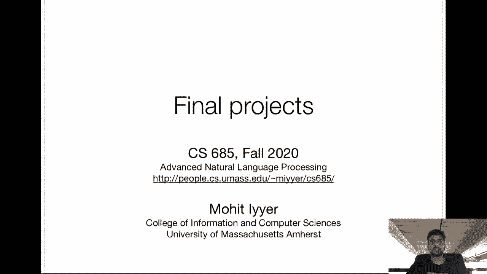

So first， as mentioned in previous videos， we'll have this group formation stage if you want to form your own group。

 you have to submit that form by September 4 for the rest of you you'll be notified of your groups by September 7th and then the first deliverable is a project proposal which is two to four pages in a template that will provide on overleaf we'll provide it within the next week and it'll be due September 21st。

 and then the second deliverable is a final report which is 12 or more pages due December 4。

So in the past we've had a couple of intermediate deliverables like milestone reports。

 we decided to just simplify things this semester one desirable effect of having those milestone reports in the past was to force the groups to actually do some work in the middle of the semester I know many of you have many other classes going on and other homework and projects and stuff and so it's pretty easy to you know just to ignore this until the week of the final report but I want to emphasize that you should not do that it's very easy for us to tell in the final reports which groups have actually put in a significant amount of effort and which groups have kind of mailed it in that's kind of why the report is 12 plus pages it's very noticeable when you add a ton of filler to these things。

Okay， so what kinds of topics and what are the requirements on these projects well we're trying to make them almost as openended as possible。

 but of course this is an NLP class so all of the projects must involve natural language data in some way this kind of goes without saying and secondly all projects should include at least some amount of model implementation so we're going to be talking about a bunch of different types of models throughout the semester and at least some part of your projects should involve playing around with these so that's not to say that all projects have to focus even most of the effort should be focused on modeling that's not the case so you could propose to collect a new data or to replicate some existing study or analyze an existing model。

😊，But all in any case you have to do some amount of modeling so if you collect a new data set。

 run some models on your data to show you know how well current NLP systems perform on your data。

 if you're going to replicate existing models， implement them yourself if you're going to analyze existing models。

 you're going to have to at least run the existing models and maybe write some probe tasks or other stuff to make sense of the internals of the model。

 so these are all examples of how you can integrate modeling into basically any sort of project。

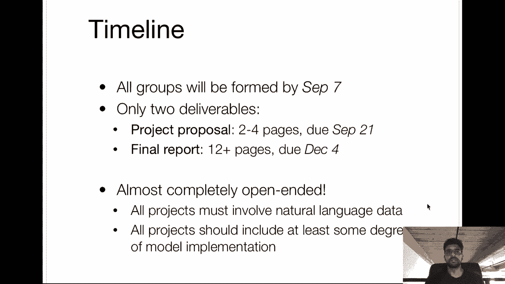

Okay， so roughly there are you know a couple different types of projects so you can build a model that is probably the most obvious one so you take some existing data and you build a model that performs at some level in that data you can also take an existing model and apply it to a bunch of different data sets。

 possibly new data sets that you yourself have created and yeah there's also different types of analyses that you could focus your project around so I want to emphasize that we are not going to penalize you for focusing on something that's not the basic build model apply a data kind of project we encourage any creative projects that involve even majority of the work annotation or manual analysis。

things like that， these are equally important and in the current climate maybe even more important than modeling based research。

 so don't feel obligated to choose a implementation heavy project just keep in mind that at some level you need to show results with some kinds of models on your data。

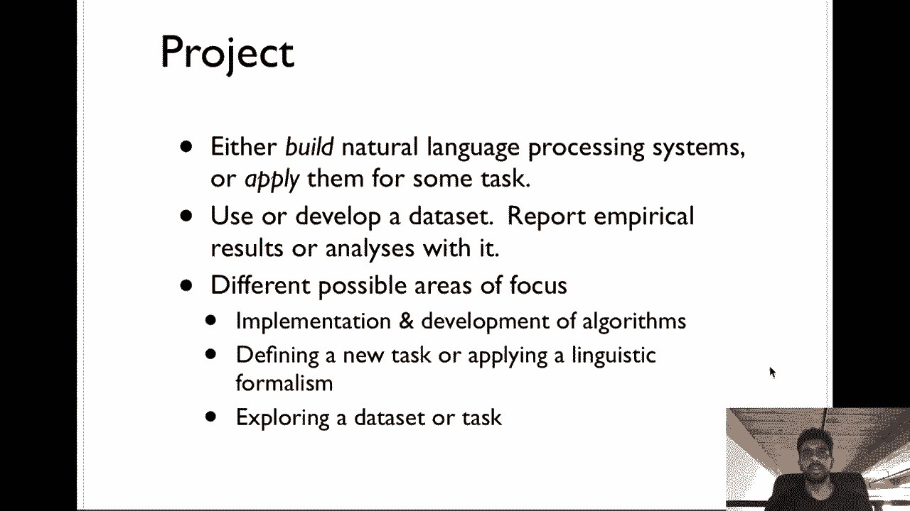

Okay， so for many of you who have limited research experience just coming up with the project idea is going to be challenging and that's doubly true if you have no background in NLP right so generally when you're approaching a new research project you want to know you know what has been done in this area before and so this is a good time to go through you know the conferences that you were linked to on the first homework do Google Scholar searches do a good literature survey to。

😊，kindind of get an idea of what the current state of the art is in whatever area that you're interested in。

 what the current research challenges are and how your project is going to address them。

So once you've established that you have a particular research question and you know what's been done before in that area。

 you need to formulate experiments that your group is going to perform to answer this research question or address this challenge that you've identified and when you do an experiment of course you need to have a way of evaluating it right how did it work or not so if you're doing you know some sort of modeling based project you're likely going to have automatic metrics like accuracy or perplexity we've talked about that before and so on and in some cases you might have chosen a project where these automatic metrics are they don't really apply。

 they're not reliable and in that case you need to you know formalize the set of manual human experiments。

That you were going to do to evaluate your experiments。Also。

 if you're collecting a new data set right， how are you going to make people who you're presenting your research to believe that this data set is of high quality right。

 you can show things like inner annotator agreement or do a fine grainined analysis of your data to show that it contains interesting new phenomena that have not been present in existing data sets。

So yeah， there's lots of things that like this that should go into your proposal that will tell us that you've actually put a significant amount of thought into your idea。

Again， feel free to be ambitious we actually explicitly encourage things that are not you know boring extensions of current work One important thing is your project doesn't need to have to work for you to get a good grade I grade more on like the perceived effort that you put in and of course。

 if you put in a lot of effort and you trained on the test set， you're not going to get a good grade。

 but you know if it's clear that you' spent a lot of time trying to make whatever it is work like maybe you proposed a new model and it didn't work like this happens all the time in research。

 it's not a prerequisite that your model has to be the state of the art for you to get an A on this project So what we're really looking for is that youve spent a lot of time and effort on this project that you carefully analyzed your data。

 that you looked closely，😊，model outputs to see， you know what kind of errors they're making and that you have a good sense of even if your project didn't work。

 what you have to do in the future to improve upon what you've already done。

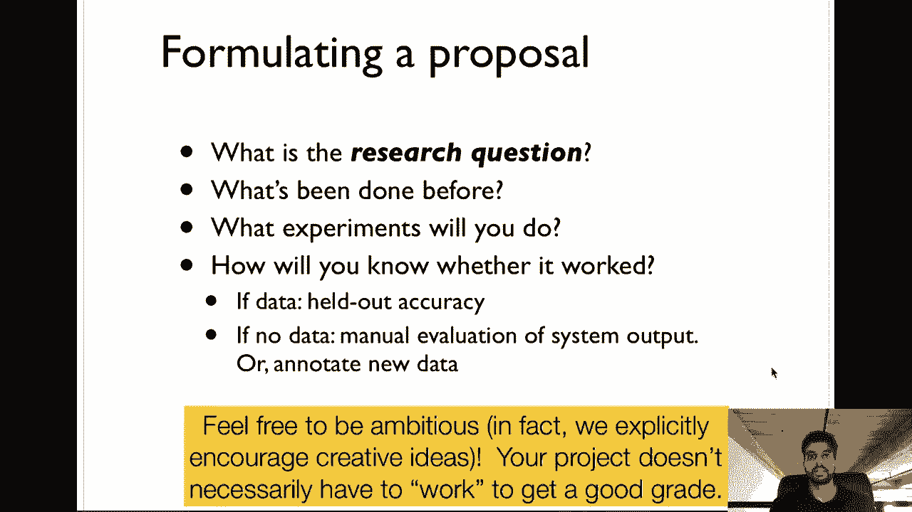

Okay， so go through this pretty quickly， the Himeyer catechism was developed by I think someone in DARPA to assess the different types of project proposals that were made and what DARPA is going to fund and essentially it is a series of questions that you might find worthwhile to ask yourself when when coming up with a project idea so these are also really good tips for organizing your proposal right the first thing what are you trying to do say it very clearly using no jargon kind of like an EI 5。

😊，Or TLDR， make it as easy as possible for someone with no background to understand then the literature review part right like how has this problem been approached in the past。

 what are the limits then go on your approach right what are you bringing that's new to the table and why do you think it's a good idea what kind of impact will it make if it's you know a very ambitious project are there risks obvious。

 what are they you should outline those if you're doing an annotation project on say mechanical Turk which is totally fine by the way you should outline how much it will cost and well I mean。

 depending on how many groups actually want to go this route。

 we will be able to fund some of them if you want to do like you know a medium scale data collection or error。

or something like that make sure that it's reasonable right you have roughly two months to complete this project I think that's right or maybe it's three months September。

Okay， yeah， maybe three months to complete this project so don't propose something that's going to take multiple years right。

 make sure that what you're proposing is reasonable and can be done feasably within a three month period and even though we're not requiring you to have these milestone reports oh be sure to。

I forgot to move my microphone。Sorry about that。Be sure to have some intermediate milestones in place to check to see if your project has succeeded or not。

Um， or like intermediate parts of your project or are they working or not。

 don't just wait till the end， evaluate everything。Okay。

 so this kind of follows from the Hialmiyer catechism and each of these will be like sections in your project proposal that you should fill in on the template that we' provide。

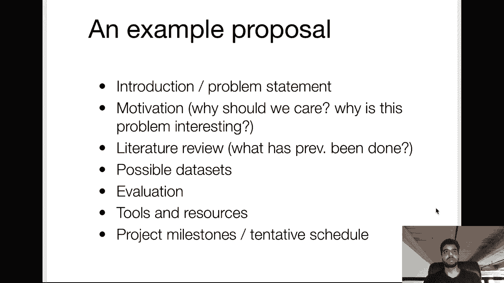

Okay， so as mentioned in homework Ze， NLP research mainly published in conferences like ACL。

 EMNLP and NAL， they're all open access freely available to the public。

 you can look at the ACL anthology and as a good starting point to do your literature survey NLP research doesn't only appear at these places there are also machine learning venues like ICML and Europe's ICA that contain NLP related research that you might find when you're doing you know Google Schar search or Semitic Sch search。

😊，Yeah， so there are a bunch of tips here on doing literature survey that you can read later when I post the slides。

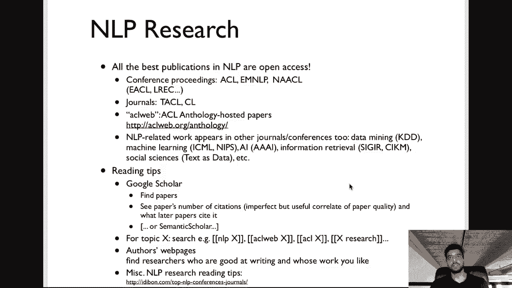

So what exactly are concrete problems that you can work on so again。

 you're definitely not bounded by this list and you should feel free to propose anything even if it's not related to anything on this list。

 but yeah let's get started so there's some detection tasks that these are more like classification。

 sentiment analysis is a sentence sarcastic or not what emotions are expressed in this text。

 there's structured prediction tasks so things like entity or event extraction， relation extraction。

 parsing if you remember the levels of the linguistic hierarchy like what is the tree structure of agiven sentence syntactic parsing。

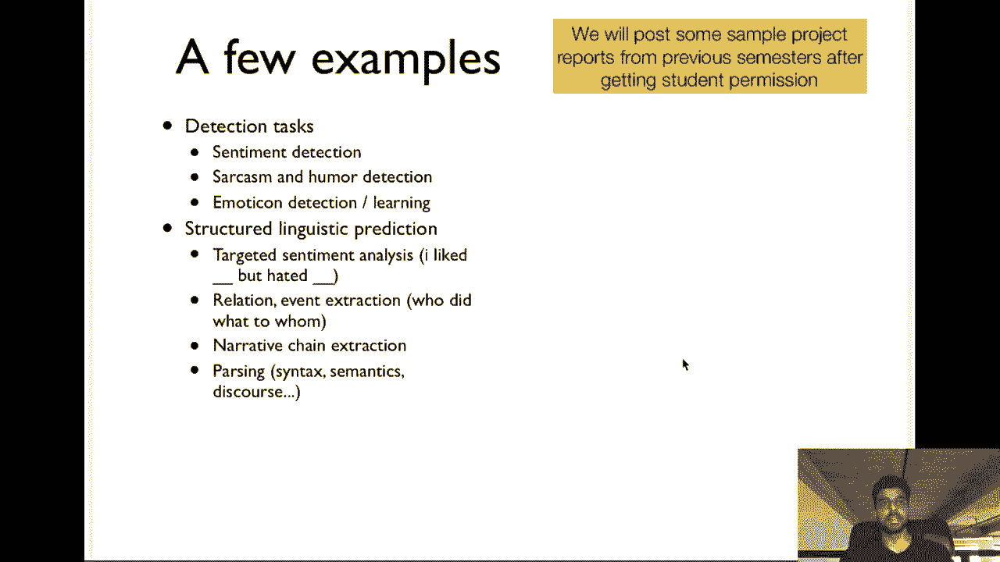

There are text generation tasks， so machine translation， summarization。

 more creative tasks like story generation， there's recent research on things like style transfer or taking text written in one styles and maybe like tweets and then converting them to another style like maybe Shakespeare while still approximately maintaining the semantics。

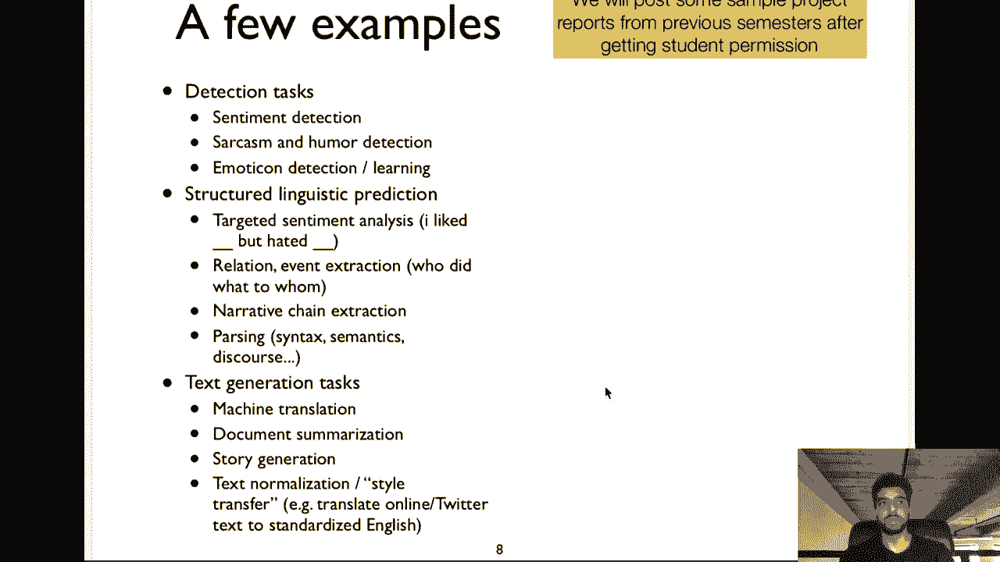

There are you know just purely neural network type systems that you can develop for a question answering or dialogue style systems for some of these things evaluation might be challenging so you should think closely about that and yeah there's other sorts of prediction tasks visualization and exploration of data sets and of course make your own data set or even make your own tasks these are all fine projects so I know many of you will want examples of you know project reports that have been maybe received good grades or are good examples of different types of these projects so we're in the process of getting permission from some of these groups from previous semesters and once we do that we will provide you with a bunch of example。

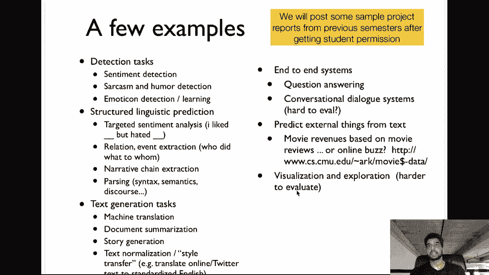

That you can look at to figure out， what are our expectations。 Oh。

 I realized my camera is covering this。

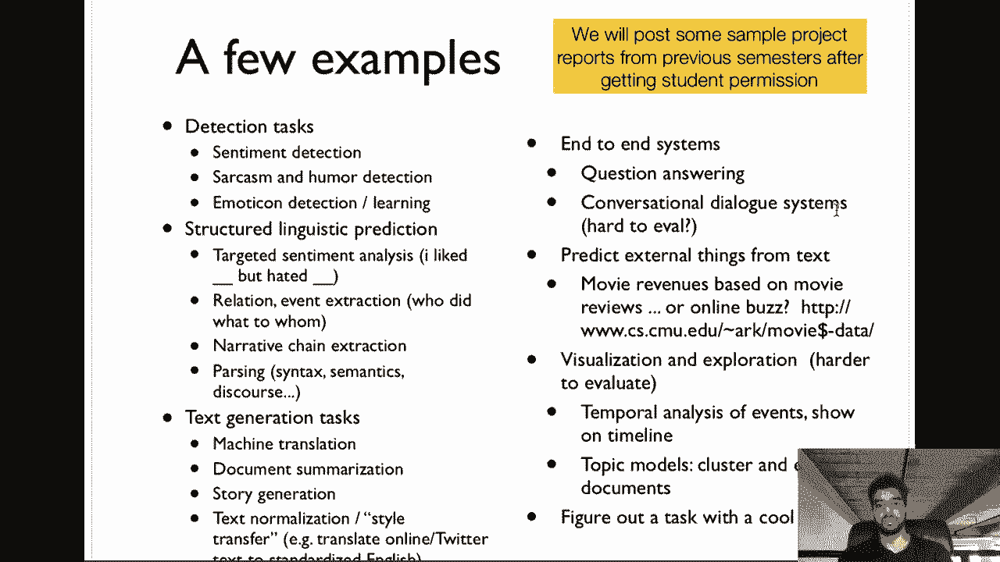

Well， whatever you can also look at it on the slides。

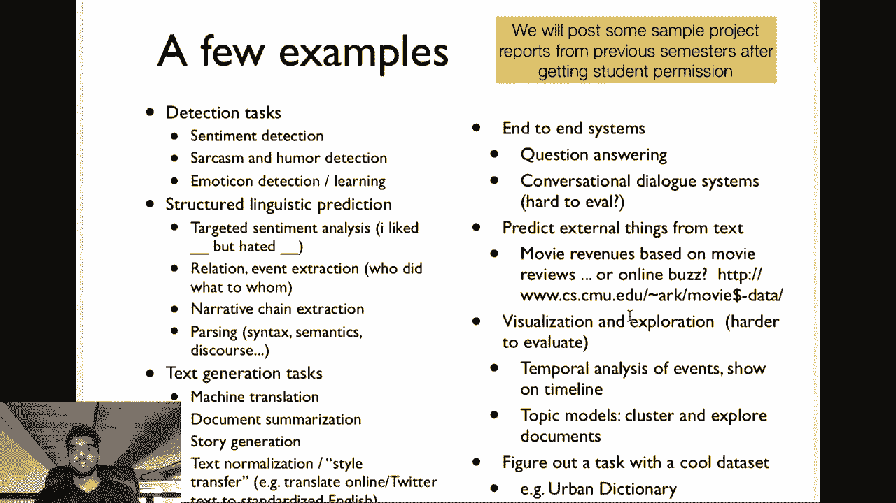

Okay。Maybe one will back up。So just to emphasize all projects must use some sort of textbased data and there's a ton of possibilities for this so if you don't want to create your own data a lot actually most NLP datasets are in the public domain。

 they're freely available especially recent ones and I think most popular datas are available for public download。

 so there are these semival tasks that happen every year with a variety of different downstream applications that could be interesting for people if you're not interested in a specific tasks。

 but rather maybe you're focusing on language modeling。

 you can download know literary data at project Gutenberg， you can download movie reviews。

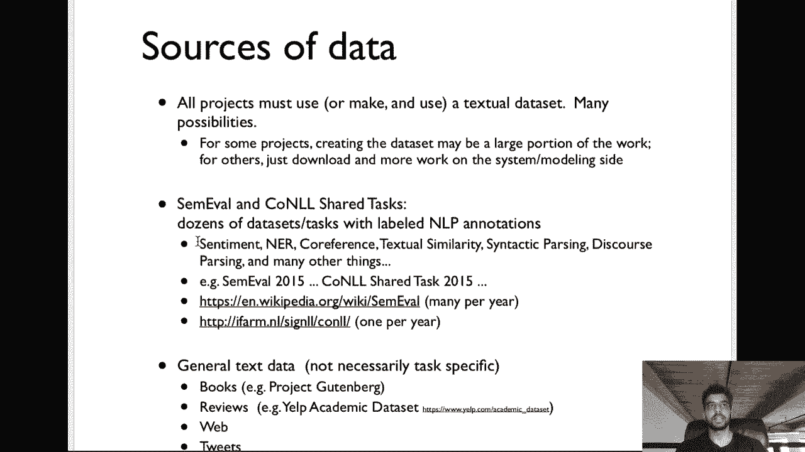

Crawling Yelp or looking for existing sentiment data sets。

 there's just web scale text you can get from the common C or Reddit or you can crawl tweets you know there's so much data text based data that you can you can use in your projects and these are just some of the sources。

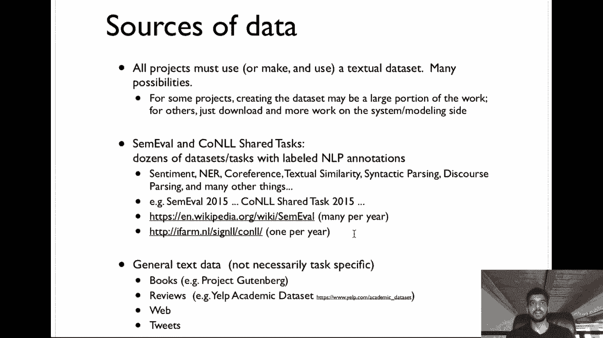

As far as tools， if you're interested in lowlevel NLP processing。

 I highly recommend Spacey for any Englishbased applications。

 Of course you should feel free to focus your project on any language or multilingual projects that are applicable to many different languages。

 but if you're doing something on English space is definitely the easiest thing to use Stanford's core NLP has a bunch of models in different languages that's also very useful there are domain specific tools or for example Twitter that are tuned to those domains that are better to use than things like Spacey and core NLP if you have an esoteric data as far as neural network tools。

 like we're obviously using collabab and all of our codings in Pytorch Allen NLP is。😊。

we'll look at later in the semester， which is a nice library for specifically NLP related neural network modeling Of course。

 there's also Google's Tensorflow， which personally I find a little harder to use for research purposes My group is completely all on board with Pytorch unless we're doing like TPU related things。

 but you won't have to be doing that。 And again， collabab is a great resource for training models。😊。

Yeah there is a restriction of a 12 hour timeout or something like that。

 but if you're not doing huge scale training， Collab is definitely fine and it's work for many groups in the past。

Okay， so that's it and happy to discuss more if you have questions on Piazza or in office hours。

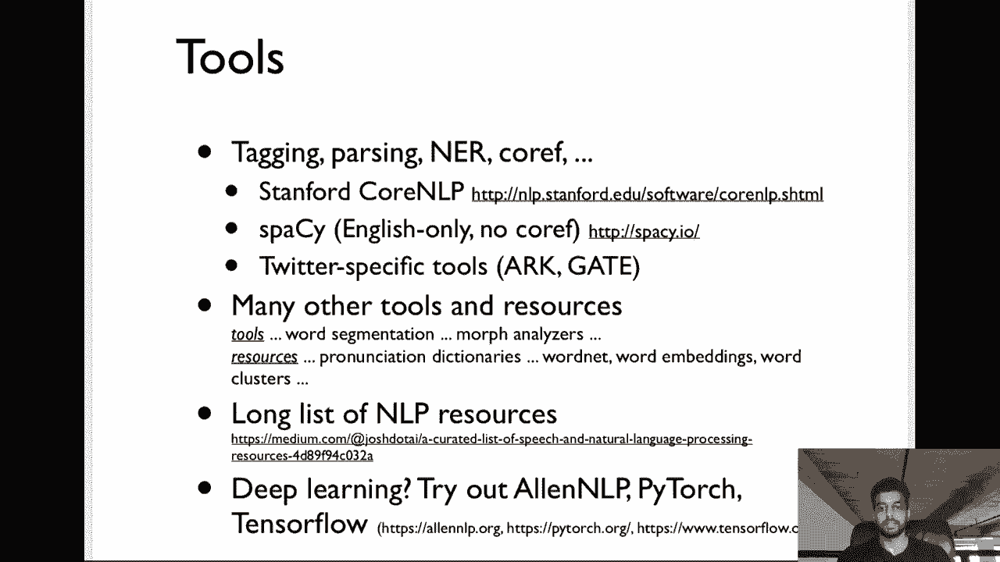