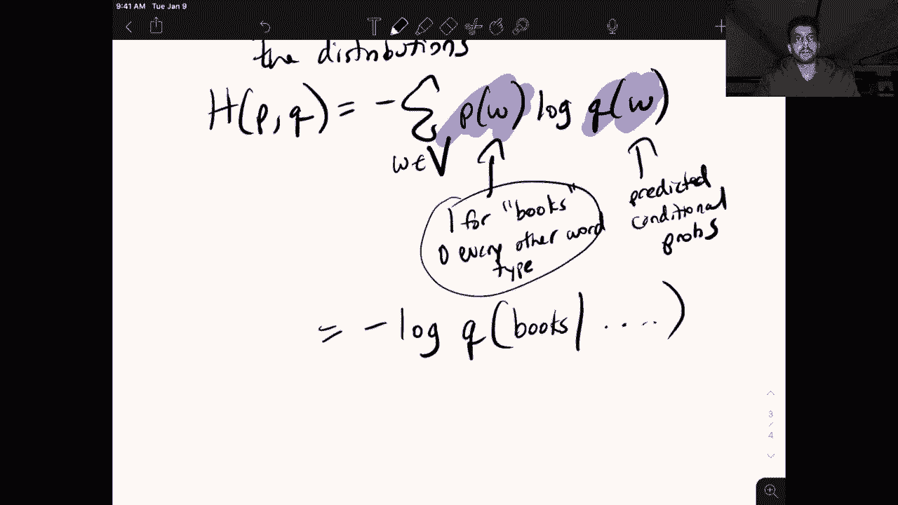
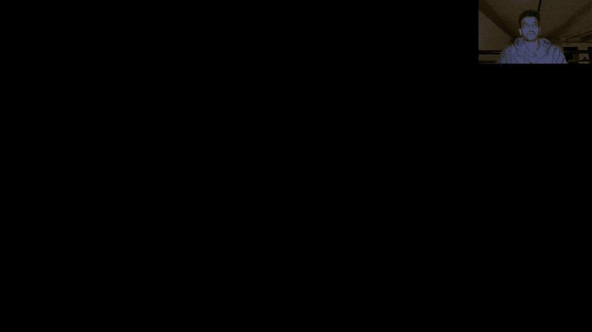
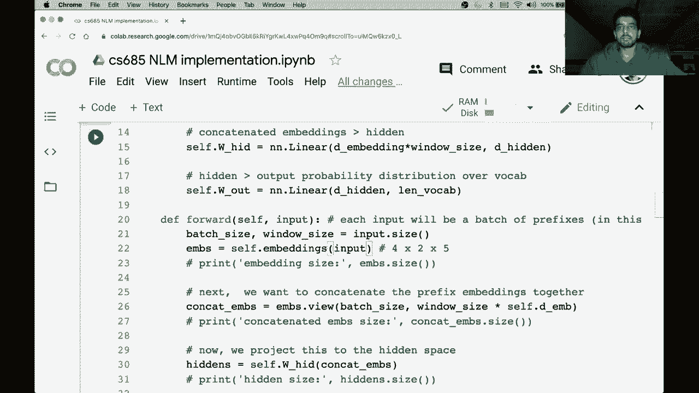

# 【双语字幕+资料下载】马萨诸塞CS685 ｜ 自然语言处理进阶(2020·完整版) - P6：L4- 在 PyTorch 中实现神经语言模型 - ShowMeAI - BV1BL411t7RV

Hey everyone， so today we're going to spend most of our time actually implementing a neural language model in Pytorch and we're going to be switching shortly from this iPad to a Google collab notebook but before we do that there's one more important thing that we need to cover before you're ready to actually understand what's going on when we implement this and that specifically is the loss function that's used in neural language models and more generally for neural classification problems and that is the cross entropy loss。

So again， this is used。Nlms neural language models。As well。As。Other。Classification tasks。

So remember we are treating in the neural language modeling setting this task as a classification problem right given a prefix。

 we're asking the model to predict which word out of the set of all word types in our vocabulary follows this prefix right so it's a classification problem where the labelL space is equal to the size of the vocabulary so it's a large scale classification problem and the loss function that we've seen that we saw previously the square loss is not suitable for such a large scale classification problem and so we're going to review a better one the cross entropy loss before jumping over to the implementation。

😊，Okay， so quick review from last time， what is a loss function？Intuitively。Tells us。How bad。A model。

Is doing。At predicting。The training data。Right so in the neural language modeling setting。

 if I have a model that gets his input the prefix students open there and is predicting the word lamps with a high probability。

 we want a loss function that will assign a high loss to this instance because the models clearly not predicting the training labels if in the training set we saw a lot of examples of students open their books or their laptops or so on。

Okay， so in N LMs， specifically how bad。Is the model。At predictreing。The next word。Okay。

 so let us whoops dive into this by looking again at the example that we've been following for the first few videos here。

Okay， so assume。We have。A training example。Students。Opened。There this is the prefix。

 and it's paired with books。Okay， so we have our inputs。here and our output books。

So the model takes this as input。Ohoops。呃。And this， remember is。Desired。Moel。Prediction。

So remember that our model is actually producing a probability distribution over the whole vocabulary。

 so what we really want is a predicted distribution in which the probability associated with the word books given this prefix is very high。

😊，So to make that more concrete， our model produces。Given。And we want to。Maximize。This probability。O。

So we know that we want to maximize the probability of the correct continuation。

 given the correct continuation， meaning the thing that appears in our training data。

 given our model。So remember that a loss function is a measure of how bad the model's current prediction is。

 so we can rewrite this as we want。To minimize and remember。

 we talked about gradient descent in the concept when we talked about gradient descent。

 we talked about minimizing a loss function， right。

 we use gradient descent to go in the direction of the negative gradient and find some sort of minimum of the loss function so we can easily turn this into a loss function。

 We want to minimize negative。😊，Log probability。So remember again that we work in log probabilities。

 not raw probabilities due to many reasons， practically speaking due to numerical underflow。

 we don't want to deal with these super tiny numbers。嗯。And in our example。

 we want to minimize a negative log probability of books。

 so our loss function is going to look like negative log P of books。Given students open there。

So this is pretty straightforward。But before we continue here。

 it's important to understand why this is called a cross entropy loss。

 So many of you are probably familiar from previous classes。

 machine learning classes or so on with the concept of a cross entropy loss right So why is this called。

😊，The cross interview loss。And remember that the cross entropy loss intuitively gives us a measure of the distance between two probability distributions。

 so if my model， let's say my model gets maybe I'll draw the model to make things more clear so we have students。

😊，Opened。There， remember that I have word embeddings for all these things。

 I combine them into single vector， and I produce a probability distribution， right？

 So what does that actually look like。If we say all of our words are。Books， laptopps， I don't know。

 Maybe you can make up some other words， planes， lamps， etc cetera。

 So all the words in our vocabulary， right， And let's say this is what our model is doing。

 So maybe it assigns some probability to books。 It assigns some probability to laptops。

 some probability to planes， a very high probability to lamps and so on。😊，So in our training data。

 we observe that， of course， the correct continuation of this is books。

So we treat our training distribution， so maybe I will。This is a model。 and let's say this color。

Is used for the model's predicted probability distribution。So next we have our data。And in our data。

 we observe students。Opened。Their books。So in this specific example。

 there is no ambiguity as to what follows students open there right so we consider this as a one hot distribution remember we talked about one hot vectors as a way of encoding words in an earlier video。

So we can have our same distribution here， books。Ptops。Planes。Lamps。

And this model is going to assign all of the probability。 So P works。G们。嗯。There oops。And。

And these are all zero， so let's make this clear， this is what we observe in our data。

The what color I not used of this。So intuitively， we have a model's predicted probability distribution。

 and we have the ground truth probability distribution， which is this one hot vector， right。

 essentially with one at the ground truth continuation。

 and we want to make the models predicted distribution as close to the ground truth distribution as possible。

 So remember that cross entropy loss is defined as。😊，We all go down here。Sorry， the cross entropy。

Of two。Distributions。Let's call them P And Q。This essentially again quantifies。Distance。Between。

The distributions。So if the cross entropy is low， then the distributions are fairly close together。

 if the cross entropy is high， that means that they're pretty far apart。And the equation for this is。

So in our neural language model setting， remember that the different。

Classes that we have are the word types in our vocabulary。Okay。

 and so these are the conditional probabilities that written in short form here。

 so this is we can treat as our ground truth distribution， one for books。0， every。Other。Word type。

 sorry， that should be 0 for every other word type。 And this is our predicted。Conditional。Gs。

So this is the definition of cross entropy loss， which we have ported over to our neural language model setting where P is the ground truth distribution and Q is the predicted distribution。

 so maybe I'll make that more clear using the same colors from above。

 so we used Q sorry P with this color。Q。いか。Okay。So let's take a look。

 go back and take a look at our loss function that we came up with from before。

 which was just followed naturally right， we want to minimize the negative log probability of the word that appears in our training data set。

 books given this prefix if you look at this definition of cross entropy here。

 you will see that since the P term is zero for every word other than books。

 this simply just reduces to exactly what we had before。Given the prefix。

So hopefully this makes sense since this summation is， there's only one non zero term。

 and that's when this W equals books。Okay， so that's a bit of intuition on。

What kind of loss function we're using for neural language models。

 but the important intuition is that you know a loss function in our case is a defining a measure of how close the model's predicted probability distribution is to what we've seen in our training data。

 later on in the semester we'll talk about methods where this here is not a one hot vector so you actually have to use the full definition of cross entropy there are many non-zero terms。

 but for now we're going to stick with the simple case。😊，Okay。

 so that's all I wanted to say about the type of loss function we're using in neural language modeling and now let's quickly switch over here to the collab notebook that I want to share。

 so give me a second to do those。😊。

Okay。Yes。That's too big。嗯。Okay， so now we're going to switch over to the kind of live coding exercise where I will walk you through the implementation of a very simple neural language model on a toy data set of basically I guess like four prefixes and yeah。

 I highly recommend for this to be productive that you open up a collab notebook of your own while I'm doing this and follow along with what I'm doing。

 there are a number of interesting places where you can branch off of the code that I'm writing and implement more complicated networks or training optimizers or architectures or so on so I think you'll learn a lot if you if you code this up along。

With with me when I'm doing it。Okay， so I'm going to click new notebook here。U。Okay。

 this is going slower than I expected， All right， let's name this Cs 685。Nlm。

So let's start by implementing the fixed window feed for neural network that we've seen in a previous video。

 so to begin I'll come up with some sample sentences so let's say my sentences are I don't know。

 we should make them short so maybe like，UBs， sheep。Alice runs fast。Cs 685 is fun。

 hopefully that's true for some of you or all of you。I love Li。Okay， so we have these four sentences。

 They're all three words long。 so we're going to。Let's say do a fixed window neural language model where our prefix size is two。

 so we're going to take the first two words and try and predict the third word。

So maybe I'll write some stuff down in the comments， so given the first two words of each sentence。

We will try to predict the。OopsThird word using a fixed window NlM。 So this is our goal。

But before we do that， we have to start by doing something that you've done in homework 0。

 which is tokenize the input。 So before we start。Any fancy modeling。

 we have to tokenize our input and the second thing we have to do is convert the words to indices。

Remember because our model takes as input sequences of indices rather than sequences of text。

 so we need to do these two things before proceeding any further。😊，Okay， so let's do both of these。

I think the screen is still visible。 Oh maybe I should increase the font size。Of。Okay。

 whatever probably hopefully it's readable。Okay， so let's start by defining an empty vocabulary so this is going to。

Map from word type to index， so every single unique word type in our vocabulary will be assigned a separate index。

 and then we'll have a list of inputs that we're going to store so it's going to be just like the sentences except each of the elements in this list is going to be a sequence of indices rather than a string。

So。U。Sttores an indexified version of each sentence。Okay。

 so a simple way to do this is compute the vocabulary while converting the sentences to indices on the fly so we can loop through our sentences。

Let's say we make a variable for， I don't know， sent indexes。

So these are going to be the mappings for the current sentence， we're going to split on white space。

 so this is something you saw in homework zero。Tokenize with。White space again。

 not the best tokenizer you a lot of you posted on piazza about things associated with you know like new line characters or punctuation being included in the word types and there are much better tokenizers。

 but you know this is a simple toy example， there are only。

 I mean white space tokenization is exactly what we want in this case。All right。

 so we're going to loop through the words。And for every word。

 we're first going to check if that word is in the vocabulary。I'm sorryrry。

 if the word is not in the vocabulary。 So if the word is not in the vocabulary。

 we want to add it to the vocabulary， and we also want to assign it to a unique index。

 So this line of code assigns it to the current size of the vocabulary。

 So it ensures that every new word we add we're basically incrementing the the index that we're。

So the whole。Point of this is to add newer types to the vocabulary and pair them up with indexes and finally we are going to append the index associated with the current word that we're at to the sent IDX's variable。

So。嗯。VabSo this is going to if we're at the word Bob。

 it's going to add a mapping in the vocab dictionary from Bob to0 and then it's going to append a0 to this list that I've created here So once I've looped through all the words for this first sentence I probably have012 because these are the first three words in my vocabulary。

😊，Actually， I've realized that I haven't even shared any words in any of these sentences。

 so I guess there's 12 different。Words， maybe we'll change that。 so I'll make it Alice is fast。

 So now there's two occurrences if the word is。嗯。All right。

 and once I'm done looping through all of the words in this particular sentence。

 I'm going to append the whole sequence， the sent IDX's list to my inputs list。Okay。

 so that was a lot of stuff。 let's see what all of this looks like。

 so first we can look at our vocabulary。嗯。We need to read some of these lines So as a tip。

 if you want to a shortcut to run a coab cell， you can type shift enter。

 at least that's what it is on my Mac and we see that every word type in our vocabulary Bob likes sheep Alice runs fast is blah。

 blah blah is assigned to a particular index in the vocabulary and the word is only appears once right because there are two tokens of is in our data set。

 but only one word type associated with is。Let's also take a look just to be clear as to what the inputs object looks like。

So you see that it's a list of lists and each list contains a bunch of indices right rather than actual words。

 so we see here that oh， I guess I have to run this all again to update。Yeah。

 so we see the first sentence Bob likes sheep is mapped to 012， the second one Alice is fast， 345。

 the third one， CS685 is fun is 647， so note that the index associated with is occurs in two of these examples。

Okay， so we're almost done with our preprocessing stuff and we're almost on to more fun things。

 But before we can actually feed this list of lists into our pytorrch models。

 we need to convert them into pytorch tensor objects so this is also something you saw in homework zero。

 we use the long tensor object for indices So the embedding module in pytorrch expects long tensor indices in the form of long tensors。

 So it's very easy to convert these things， we can simply just cast them into long tensors。

 I'm mean in import torch because I haven't done that yet。😊，呃。Okay， and let's just say。Oh right。

 so the other thing I want to do， so okay， two things。One， convert to long tensors。And two。

 define inputs and outputs。 So right now， these are just sequences， right。

 So I actually want to split them up into given Bob likes the input， predict sheep the next word。

So let's do that first we'll call our inputs the prefixes。

 so we know we can get prefixes by simply just chopping off the last element of each of these lists。

So let's say sent and this slicing in Python， if you're not familiar with this notation。

 you should make sure to understand it， but this。Right here is just indexing everything in this。

This first sequence here except for the last the negative one element。

And I'm going to just loop over all of the sentences in my input。And this is a list comprehension。

 So again， for those of you who aren't familiar with Python or aren't super familiar with it。

 you you should read read about things like list compre list comprehensions and array slicing and so on。

 they're very useful concepts in general。 Okay， so similarly。

 I can create another list with just the label。 So this is the the last word in each sequence。😊。

Like this？So now just to show you what I did if I print the prefixes and the labels。

We so this first thing here is a prefixes， so note that they are just the first two elements of each list chopped with the last element chopped off and the labels are just a sequence of the last element from each list so this is exactly what we want in our language modeling setup。

Okay， so again， to get these into long tensor format is very simple， all I do is wrap this。

Long tensor thing around each one。And now let's say I print prefixes。

You'll see that I have this tensor object and contains exact same data。

 but I can now do all these pytorch operations to figure out what size this is and so on so now we're ready to start building up our model we have our data and input output format in the data structure this tensor thing that Pytorch expects so let's move on to the next cell where we're actually going to define the network。

Onto defining the network。This is where most of the fun stuff happens and before we start let's import just for。

It easier for me to type things with shorthand and so the first thing we're going to do is make a class for our neural language model。

And so all neural networks when you。Build them in Pytorch。

 have to inherit from this NN dot module class。So， yeah。Okay。

 so there's two things that you need to do。If you're going to use Pytorrch to make a neural network。

 so the first thing is write the init function。This initializes all the parameters。Of the network。

 So we'll get to this in a bit。 But remember， we've spent quite some time now in the previous videos identifying the parameters of various models and then。

 of course， computing the partial derivatives of our loss with respect to those parameters。

 The second thing we need to do is a forward function。😊。

So this defines the forward propagation computations。

So this is what we went through before looking at backpro right how you go from the embeddings to the final prediction of the probability distribution and we did this remember through a bunch of linear layers and softm layers and so on so that's it you just have two things to do you might be wondering what about the backpro right we spent all this time learning about how we use backpro and gradient and descent to train our models don't we have to spend time you know actually implementing those derivatives and this is the really nice thing about Pytorrch is that you don't and it computes all the derivatives for you and just one function call so we'll get to that a little later but it's you know incredibly useful you can implement super complicated networks without worrying at all about。

😊，manuallyally deriving the gradient。Okay， so let's start with the in function。嗯。

So there's a couple of things that in our fixed window neural language model we want to define So if you think about the hyperparameters of this model the things that we want to define as the people who are making this network and we don't want the model to learn it itself these are things like the dimensionality of the word embeddings the dimensionality of the hidden state so this is remember when we concatenate all the embeddings together。

 we then project that to a lower dimensional space using a linear layer so this is defining the size of that hidden space we may also want to define our window size for this model which we've already looked at in our training data is too but note that in a standard implementation you won't be making like static training examples like this you。

There be kind of incrementally constructing the window while scanning from left through left to right through a larger document。

 This is just for an example to make the preproces code and the training loop not super complicated。

Okay， and the final thing we might want to do is tell the model how big the vocabulary is right it needs to know this for both the embedding parameter initialization。

 like how many embeddings does it need to create as well as the softm layer right。

 how many word types do I need to predict probabilities for？😊，Al right。

 so the first thing I'm going to do is initialize the super class of this。

 the NN dot module and and anything that's higher up the base module class and then I can proceed with。

Creating parameters that are specific to my network。 So I know that there。🎼3。

 basically three types of parameters in this model。 So the first is the embeddings。

 and we looked at this in homework 0， right， use this an N dot embedding object and it takes as arguments。

 I think it should。Tell me what the arguments are。Okay， maybe not。

 but the arguments are the number of word types in the vocabulary。

 which we are passing in asL vocab and the dimensionality of the embeddings。

 which we're saying is a de embedding。Okay， next up we have our hidden projection right so we're going from the concatenated version of these embeddings to the hidden layer。

 so we'll make a matrix for this or we're actually going to use Pytorrch is built in NN dot linear。

 which does this hidden projection， which is name it W slash Hi。😊。

So we have an NN dot linear and this the arguments here are essentially specifying the shape of the projection matrix。

 so we know in our case that we have thebedding time embedding dimensionality times the window size because that's how big that concatenated representation is going to be and we're going to project that to the hidden dimensionality。

So this thing here is the size of the concateninated representation。Maybe I will。Concatenated。

Ebeddings。🎼To hidden， That's the purpose of this linear layer。

 And the other thing we have is hidden to output probability distribution over vocab。Okay。

 so we can call that self。w sub out， it's another linear layer and goes from D hidden to the vocabulary size。

Okay， so this in our extremely simple neural language model is what we're going to。

 these are the parameters， currently we haven't applied any nonlinearities。

 we could do that and maybe we can do that in our forward function。Okay。嗯。Great。

 so let's move on then to the forward function。And the forward arguments always take an input。

 which is in our case going to correspond to the prefixes。

 So each input will be a batch of prefixes in our case， since we only have four prefixes。

 we're just going to consider a batch of all four of them in practice， of course。

 you would have many， many more sentences and prefixes。

 and so your batches would contain different prefixes per batch。 So。Let's go back down here。

In this case， four。So that's what is going to be in this input。

 So you can think of the input to this forward function as the prefixes variable that we。

We made up here。All right， so I just want to make sure this is recording properly。

 okay looks like it is。嗯。Let's go ahead and start。 So this is fairly straightforward。

 What we're going to do is first， let's just get some statistics about the input。Prefix。

Length equals input dot size。 So again， these are the dimension。 This is the dimensionality of the。

The prefixes tensor that's going to be input here and now let's just go ahead and get embeddings for this input We can do this by simply calling self do embeddings on our input。

Okay， so what does this look like and in general a good way to proceed with building your forward function is to incrementally debug it I know people like to use debuggs and stuff I。

Don't。Really do that and instead just use simple print statements。

 which also works probably not as efficient， but whatever。

 so let's make let's actually construct an instance of this NLM class。😊，So I can do that by。Again。

 this calls the init function。 So I have to specify all of these things。

 Let's say my D embedding is going be。I don't know。 What should it be5。The hidden。Say 12。Window size。

 we defined as2， and when vocabulary equals。The actual length of this vocabulary dictionary。O。

So if I run this， it's going to execute the in function。Okay， so。Let's make sure that it does。

 And there are no errors。 Okay， And next， we are just going to pass our prefixes through this forward function。

 So if I do and you don't even have to call the forward function， you can just。

Write this and it automatically calls the forward function that you've written。

So just to make that clear， if I print the size of this embedding object。I get four by two by5。

 so it's a three dimensional tensor， and let's think about why its these are the this is the dimensionality of this M's variable。

So four we know is the number of prefixes in this tensor right we have four examples so this corresponds to the batch size two is the number of words in our prefix right the number of words in the prefix is two so in the first example our prefixes Bob likes and so we have an embedding for each of those words and five is the dimensionality of our embeddings so for each of the four prefixes and each of the two words in that prefix we have a fivedial embedding。

So that's how you can interpret this。Okay。So now that we have this， what's the next step？

Let's just write the dimensionality out so we can have it as reference for later。

 So in the neural language model， next we。Want to concatenate。The prefix embeddings together。

So here our window size is just two， so we're going to concatenate these two dimensions together and sorry these two embeddings each associated with the prefix together。

 So our ideal expected output is going to have a dimensionality of four by 10 right the first five dimensions of that 10 dimensional vector I'm going to correspond to the prefix embedding of the first word and the second five are going be the embeddings of the second word。

 So in this case we can simply just accomplish this with a reshape operation So if I say the concatet ms equals ms and the view function is a good way of reshaping your data。

 So I've already got this batch size which I know is for。

 but we're just going to use these variables in case you know at some other point。

 maybe a test time I want to use a batch size that's not four right I can use a variable。😊。

Number for my batch size。So I know the first I want to keep the four prefixes distinct from each other and if I put in negative one。

 that's just going to essentially squeeze the rest of the dimensions into a single vector。

 but in practice of course I know that this is going to be window size。😊，Which I did not store here。

 sorry。Can这个。Window size times。Let me just store a variable for the embedding dimensionality。

So dot D。Okay， so this simply takes this embeddings variable and reshapes it to a4 by 10。

 let's make sure this actually worked。Hopefully it did。Okay。

 so I'll put some print statements along the way， so。We can make sense of what's going on。

Embbedding size。 and yeah， as a practical tip， the size。

 the dimensionality of these intermediate variables that youre creating is one of the most useful things that you can look at because a bunch of the errors that you're going to get if you're implementing this and other more complicated networks are going to be maybe you messed up and you didn't keep track of your dimensions properly。

 you swapped around window size and embeing dimensionality。

 And now your matrix multiplications don't work and so on。 So you should always keep track of。😊。

The size of the variables that you're creating in the forward function。 Alright。

 so let's print these things out。 Whoops， what did I call it。Oh， Ds。Okay。

 so we see that the embedding size was4 by 2 by5 and now the concatenated embedding size is 4 by 10。

 so we remove the sequence dimension and just concatenate all of the embeddings associated with the prefix together to form one 10 dimensional vector per input prefix。

嗯。🎼Okay， and maybe we can validate this， right， So if I print the embeddings out for the first prefix in my my batch。

 which corresponds to。Bob likes。嗯。So if I print this out， I get these two embeddings。

 you can see there's two separate embeddings， one on each line。And if I print out。Can cat Ms zero？

You see there's just one 10 dimensional vector where the order here is the same as the order here is just we've squeezed these two vectors together。

Okay， so。Now let's get on with the next computation。Now we project this to the hidden space。

And it's very easy to do this， we can just use our linear layer that we defined previously so I can say hiddens self。

whi。And couldn cat ems。And so now if I want to look at the size of this。

 remember that I've specified a hidden dimensionality of 12 here。

 So hopefully this thing is going to be。A4 by 12。Mattrix， and it is great。 Okay。

 so I've gotten to this point。 Now I'm at the hidden space。 and finally。😊。

Project His to vocabularies。です。And again， we just follow this exec， in fact， I will just copy this。

So we'll call this out。Out equals w out。Hids， and we're going to print。

Output size equals outtop size。And 11， so our vocabulary remember is 11 because there's 11 word types。

 we have this word is that appears twice and all the other words appear just once each。

 so we have a vocabulary size of 11。😊，Okay， so are we done well， if we print out。

We will see that these are definitely not probability distributions， right。

 and the reason for this is because we have not applied the softmax function。

So in practice to compute our loss function， which remember is the negative log probability of the target word。

 we're going to do a log softmax followed by the negative log likelihood。

 but Pytorch actually combines both of these into a single loss function called the cross entropy loss as we'll see later。

 but just as an example。🎼Maybe I want to， you know， show that I can get probabilities out of these。

 these outputs。 so I can do this by。 and you saw this also in。In homework zero。

 I can apply to softftmax to outs and I have to specify the dimension。

 so here I want to take this over the not the batch dimension but the actual the logics。Oops。

 I didn't print it out。So if I did this。Then。The resulting vectors， as you can see here。

 this is for the first prefix， you can just take my word for it that this sums up to one and you can see that all of these numbers are positive。

😊，Actually we can。Even。Show that they sum up to one， so these are the sums of each of the vectors。

Which just enforcing that we can get probability distributions out of these if we want， but for now。

 we're just going to return the unnmalized probabilities。Also known as Los。

 so the logics are the values of this vector before applying the Somax。Okay。

 so now that we're confident that at least the network isn't crashing right when I feed the inputs through it。

 I'm going to get rid of some of these print statements to make it cleaner。😊。

And we get this as output， the logics。 And you'll see here that I have this grad function thing when I print out this out tensor。

 And this is what's going to allow us to perform backpro。 The pytorrch just keeps track of。😊。

All the computations I need to do in order to compute the gradient for everything that I've defined in my forward function。

 so every one of these operations when I embed something or when I reshape it when I apply a linear layer。

 all of these have been in ptorch sort of paired up with the functions that you need to apply to compute the derivatives whenever they're applied and so we because these things are all this functionalities already there。

 we don't have to manually compute the derivatives ourselves。Okay。

 so let's just assume that this network is working， hopefully it is。

 Now let's actually write a training loop to train this model。😊，So to do that。

 I need to define a couple of things。First， I need to define something called the number of epochs that I'm going to train my model。

 So let's say。U。Set it to 10。 So an epoch is essentially one pass through the training data。

 So the number of epochs defines how many times we are going to go through our entire training data set。

 In this case， it's just four prefixes。 This is a， again， super simple toy example。

 The next thing we want to do is define our learning rate。 Remember。

 when we're doing gradient descent， We need to define the step size。

 How big of a step do we want to take in the direction of the negative gradient。😊。

We can maybe we'll set it to 0 one。 again， this is a hyper parametermeter so we we can。

Modify this if training isn't。Converging， etc ce， we saw some of the failure cases associated with big learning rates。

 you might see the loss zigzagging around or going up in some cases if your learning rate is too big。

 so it's important to you mess with it until you see a nice smooth curve in your loss function that's decreasing。

So Pytorch defines this cross entropy plus， you can see it here。

 and this applies the log Softmax function and then applies a negative log likelihood computation which accomplishes exactly what we went through on the iPad。

 it computes the negative log probability of the target word and averages it across all of the examples in the batch。

So average。Cross entropy loss over each prefix in batch。Okay。

 and the last thing we need to do is select an optimizer so we went over simple gradient descent to get that we can do torch。

opim。sgdstochastic gradient descent all optimizers require you to pass in the networks parameters which you can do by just doing network do parameters。

😊，Not too difficult， and then we have to pass it in our learning rate， which we specified up here。

Okay， so。Alright， maybe I will。We will use vanilla gradient descent。You can experiment with others。

Adam。And stuff simply by just changing the so you have atom， AM max， others， these are all different。

 more complex and sometimes better variants of SGD that help for particularly complicated networks。

Okay， so next we're going to write our training loop。So this this loop will pass。

 it'll be over the number of epochs loopops for IN。Range epochs。

 we're going to loop over their training set。We're going to compute these logics， right。

 I'm returning those in the forward function。So I will call my network on the what did I call this thing prefixes。

 Yeah， the prefixes， the input tensor that I've made。嗯。

And then I'm going to compute my loss function， The cross entropy loss， very easy to do this。

 I will pass in the logics， and I will also pass in。😊，The labels， which contain the。

 the words that I'm supposed to predict。Okay， so I have computed the labels。And no。

Let's update our PRs to make the loss smaller。 So before we do this。

 maybe we can just print the loss。 first， I want to see if this was working and I didn't make any dumb errors。

 And secondly， we should observe the loss is not changing。

So why isn't the loss changing because we haven't actually updated the parameters using our optimizer。

 So when we do this， hopefully our loss will start going down。So the first thing we have to do。

 remember is。Step one， compute to gradient。Okay gradient。嗯。

Partial derivatives of loss with respect to parameters。

And I remember before I told you this was just one line and it's literally this simple。

 I just type lost stop backward and done I have the gradient I have the partial derivatives with respect to every peri and next。

Update perms using gradient descent。To do this， I take my optimizer that I've created from before and just type step。

嗯。I think I also want to zero the gradients。So this will。Step  three。

 zero out the gradients for the next epoch。All right， let's put some spaces make this more readable。

So if I don't do this， the optimizer is going to accumulate the gradients across every epoch which we don't want。

 So after we make one step， we want to go back， use our new model parameters to compute a new loss function。

 recompute the gradient， take another step。 So this zero grad。

 make sure we don't accumulate gradients across the different epochs。Allright。

 so let's go ahead and also print out our loss function。

 So I will print out the epoch that we're on and the loss。And I'll make the loss a little readable。

Los， all right， so whoops。What did I do here？Not all arguments converted during string， okay。

 whatever。Maybe I will just。Oh， I forgot a。Percentage sign。O。Great， so we see the loss is going down。

 it started at 2。64 and now it's at 1。27。 let's see if we can make it get to zero so let's train it for maybe 20 epochs。

All right， so it's getting down pretty close to 0， we started at 2。24。

 this is the average loss across all the elements in the prefix and we got down by Epoch 20 to 0。17。

 so huge reduction in the loss。So to conclude。Let't say。呃。Our loss has dropped to close to zero。

 but are we confident that this is actually working， So we would be confident if I can put in。

 say Bob likes into this model and observe that it predicts sheep with a very high probability right。

 or if I put in Alice is and it predicts fast。So is this actually happening or？

Is our loss low but our model still isn't predicting reasonable。Conditional probabilities， let's see。

But is it actually working？Let's see。Okay， so note that up till this point I've been working entirely with the indices corresponding to the words。

 but now I might want to actually see like the probability that the model assigns to a particular word following the prefix so to make this easy I can define this reverse vocabulary mapping。

😊，P's。First， define。A reverse。🎼Vocabulary mapping。From I from index to word type。

We can call it Rev vocab and I can do this by simply iterating over all of the items in my vocab dictionary。

嗯。Okay， did this work？I think I， oh， whoops， I forgot a。Items， so that should work。

And let's just see what this looks like to be clear。

So it's just the reverse of the vocab zero is mapped to Bob， one is mapped to likes and so on。Okay。

 so let's just see what happens when I put in Bob likes。

 I know that's the first element of my prefix tensor so。

Ill just call this variable above like equals prefixes zero。🎼So prediction equals。Network。

Bob likes and since my model is set up to take in two dimensional inputs right where the first dimension is the batch size。

 I need to feed it if I'm interested only in this bo likes prediction。

 I need to feed it a 2D matrix not just a single vector and so I need to make this batch size dimension one so right now where am I。

Down here， this bo likes variable if I print its size。It's just a two dimensional vector， right。

 because it has the indexes for Bob and likes。 And what I'm going to do is unsqueeze。

Which means I create a new dimension and I put it in the first dimension and this is going to be the equivalent of my batch size and unsqueeed just makes the new dimension size one。

 So if I do this now you see it's a one by two and now I can pass it into my model。😊，So if I do this。

 now I get a prediction， let's see what the prediction looks like。Again。

 these are the unormalized logics， so maybe to make this more readable。

 let's go ahead and apply the softm function。I already imported this， right？

Softm prediction equals one， let's just call this probabilities。Call it pros。 we'll call this los。

 We'll call it this。Logets， and I have to specify the dimension of one。 So if we print pros。

Now we get the actual probability distribution。 These are not the log probabilities。

 just to be clear， these are the。The raw probabilities。 and if you'll notice this is also a 1 by 11。

 so if I want to get it into if I want to flatten it。

 so basically do the reverse of this unseze operation I can do squeeze。

 which gives me just a single vector。And now I can find the index that has the max probability。

 right， This is what the model is actually predicting so I can。😊。

rite out the AGm index equals just use the AGmax function。And if I want to get。

 so this is going to return a tensor object， if I want to actually use this to index into my revv vocab mapping。

 I have to use the dot item， which will get it back into just a Python number。So。Let's go ahead and。

🎼Make this more specific。 So given Bob likes， the model predicts。The word as the next word with。

Let's give it。Let's say。The precision。Probability。And we will。嗯。The rev vocab of the Agm index。

 So this is going to reverse， map the Argm index into a word in our vocabulary。

 And let's also look at the probability of that word。Okay， hopefully this worked It did not。God。

 I'm really struggling with the O。What have I done wrong here， Oh， I forgot parentheses。Okay。

 so given Bob likes， the model predicts sheep as an next word with 0。7851 probability。

 get rid this to make it easier。And this is this is not great， right？

 There's only there's four prefixes in here， so I would hope that this can get closer to one。

 And maybe if I train for more epochs， I will。 So let's go ahead and train this for 100 epochs。😊。

Okay， my loss is now at 0。02， so it's very low。 I expect this to be a much higher probability。

 all right，98。93 probability。 So you see that as a loss gets lower and lower。

 the probability of predicting the right continuation increases。All right， so just to summarize， oh。

 this video has gone。Much longer than I anticipated as usual， I guess， in this notebook。

 we've gone from brass， just text of four different sentences to a fixed window neural language model that can predict the next word given any of these four prefixes。

 So， of course， this is not a usable model， right， It's a very simple vocabulary。

 We are evaluating the model on our training data， which you know。

 I said was one of the things you definitely should not ever do。 this is just a demonstration。

 there's no expectation that this model is going to generalize to anything outside of its training set。

😊，And so yeah， in practice， you would want to have a separate test set that you're evaluating your model on that it hasn't seen before。

Okay， so with this， we've concluded， we've kind of synthesized all of the concepts that we've talked about till this point right this notion of tokens and types。

 the idea of going from words to indices which then allow us to index into an embedding matrix which is then composed using a neural network architecture in this case a very simple one to get an output probability distribution right and how do we actually train the model to produce a better estimate of these conditional probabilities we first define a loss function that tells us model how bad the model is doing。

 we compute the loss on our training data we compute the partial derivatives I didn't actually get to show you much regarding this step because it's again one line。

 so。😊，We compute the we do back propagation on this one line。

 and we do gradient descent in this line。And once we loop over our training data a bunch of times。

 we get a model that achieves a very low loss。 and we see that the model is doing a pretty good job at predicting。

What it sees in its training data， Bob likes sheep。Okay， so for next time we're going to focus on。

The actual architecture that goes into the forward function here so we talked about two different ones in addition to this fixed window model。

 we talked about the recurrent neural language model。

 but for next time we're going to move to the state of the art composition function which is the transformer so we're going to start with selfattention。

 which is a basic building block of the transformer and then move on to how the forward propagation actually looks in the transformer this is all setting up for next week where we talk finally about the applications of largescale transformer language models for solving NLP tasks that are not language modeling you all are probably sick of just looking at language modeling by this point。

 but I promise soon we will advance past this but it's very important to get familiar with how，😊。

These models work and how they're trained and so on。All right， great。

