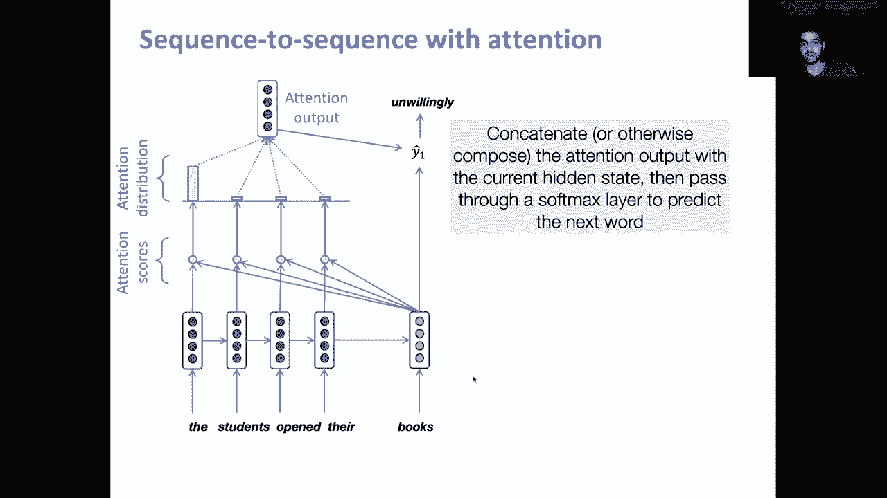
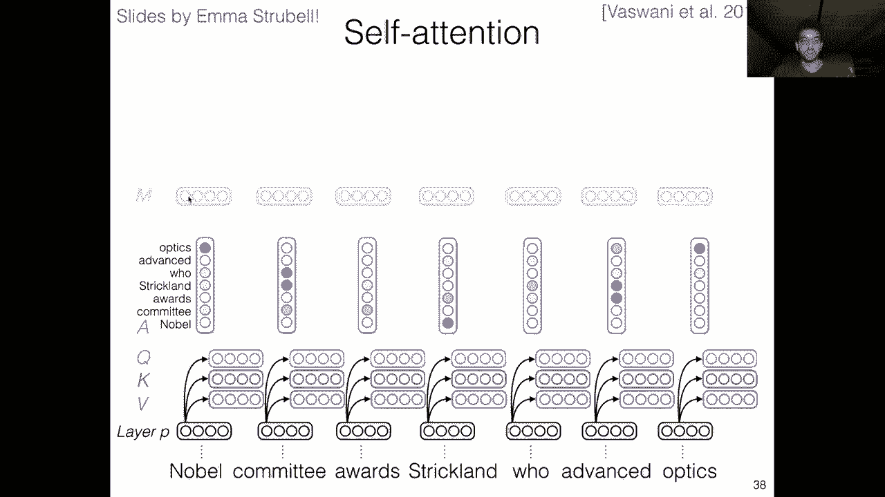
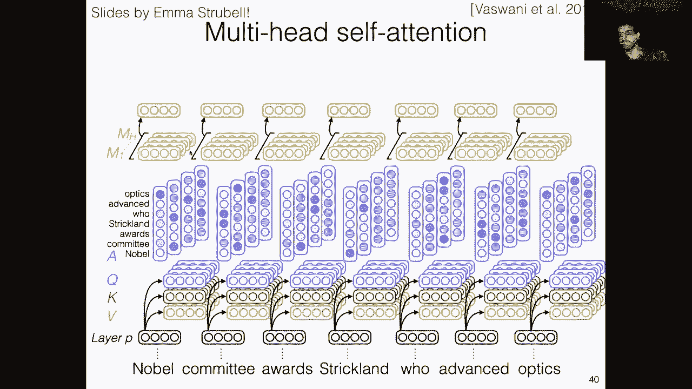

# 【双语字幕+资料下载】马萨诸塞CS685 ｜ 自然语言处理进阶(2020·完整版) - P7：L5- 注意力机制 - ShowMeAI - BV1BL411t7RV

Okay hey everyone， so today we're going to be going over the concept of attention mechanisms。

 so these are a core building block of modern day NLP systems， specifically the transformer model。

 so we'll start by introducing attention mechanisms in the context of recurrent neural networks which we covered in a previous video and then we'll switch over to the self-atten mechanism which powers most of our modern models。

Before we do that。

We had a couple things from last time first your homework zeros should hopefully all be submitted by now。

 we'll have the grading done by sometime next week homework one you should also look out for that it'll be released within the next couple of weeks and the purpose of this homework is to get you acquainted with using some of these neural language models specifically in the context of transfer learning which will be our topic for next week。

嗯。And finally， all of the group assignments for your final project have been finalized at this point and your proposals are due September 21t。

 I'd highly encourage you to come to office hours if you're unsure about your current idea or how feasible it is either come to mind office hours or any of the TAs。

 so all of us should be able to give you useful feedback。

Okay so with that out of the way let's get into our topic for the day so this is just a refresher of the recurrent neural language model so remember we saw this a couple lectures ago as an alternative to the fixed window feed forward network and this model again precedes left to right word by word so we first compute a representation of this prefix of the sentence with just the word the so that's this hidden state then we compute one for the students that's hidden state number two H sub2 and the students open then the students open there so this representation H sub4 contains all of the information that we need to know about this prefix in order to predict the next word so in the immediately preceding video to this one we looked at the cross。

😊，Entropy loss as a way to actually train these neural language models to predict the next word specifically we do this by minimizing the negative log likelihood of the correct word so in this case if we observe the students open their books we would minimize the negative log probability of books and that's our loss function we went over and implementation of a fixed window feed forward language model in the previous video as an exercise it would be you a useful thing to do to take that collab notebook and replace the architecture with a recurrent one so you understand how the sequential prediction works。

😊。

Okay， so this was just a review and just to go over the advantages and disadvantages of this model again。

 first， unlike the fixed window feed forward model。

 the recurrent neural network or RN can theoretically handle context of any length because it proceeds left to right。

 there's no concept of a window size in an RN and because it shares parameters right so this WH and this W sub E。

 these are shared across all the time steps so we're not adding any extra parameters。

 the more words we process unlike the fixed window model in which we have to make our projection matrix larger every time we increase the window size。

😊，Okay， but so these are all good things but why don't people use RNNs much these days anymore so there's a couple of reasons one is that this kind of recurrent computation is slow especially at training time and you'll note that the computation of H sub3 here depends on the computation of H sub2 so I can't compute H sub3 without having first computed H sub2 without having first computed H sub1 and so in training I can't compute all of these hidden states at parallel right I need to wait for the first one to have been computed before I can get to the second one and the class of models that we'll be getting into next enables us to compute all of these time steps in parallel which is one reason why we prefer it over the recurrent neural network。

Another reason is that although theoretically the recurrent neural network is able to handle arbitrarily sized context in practice this isn't actually true。

 because of the left to right nature of this model we tend to notice that more recent words so like words that are closest to the current time step。

 they tend to be overrepresented in this representation words that are far away。

 so maybe there were like 10 sentences before this one。

 the words in the first sentence here is are unlikely to significantly influenced this representation this is due to a number of issues perhaps most importantly the vanishing gradient issue。

 so。😊，What that means is the signal that we get for predicting this word books is a direct function of this time step H sub4。

 which in turn is a function of all the previous time steps。

 but as we went through the back propagation algorithm。

 you'll note that to compute these gradients that are farther away from the error signal。

 we have to do more and more matrix multiplications。

 so here we see repeated multiplications with for example。

 the transpose of these weight matrices and the derivatives of the non nonlinearities that are used in this so the vanish and gradients problems suggest that once you have these longer chains of products。

 the derivative signal starts to vanish which means that if I have a time step that's 50 words in the past。

 it's going to receive very little error。Signal as to how that particular time step influence the prediction of a word 50 time steps in the future。

So I'll put some more links to read about the vanish ingredient problem in Piazza or on the website。

 but these are two of the motivating reasons why we might want to try a different kind of model architecture。

Okay so before we get into that one thing that just to kind of reiterate the points that were made in the previous lecture about how to train these models。

 we looked at training in the context of the fixed window language model in our coab example but how does it actually work for a recurrent neural language model we're still going to use the same cross-enttropy loss right so the negative log probability of the ground truth word and we're going to average this loss across all of the token level predictions in our training data so to be more clear。

 let's take a look at an example So here I have the students opened their exams as my input the same example we've been looking at before except we've been switching this word exams for books。

 laptops， other things so instead of doing what we did in our exercise before in this setting we're going to predict all of the words in this。

😊。

Sequence just using one left to right computation process。

 So as soon as I produce the hidden state associated with the first time step here。

 this word I'm going to put a softmax layer on top and predict the next word students Then I'm going to process the word students I'm going to compute a new hidden state and I'm going to use that with the same softmax layer。

 you see the weight W sub2 is shared across all of the time steps。

 I'm going to use that to predict the next word opened and so on。 So at every time step here。

 I get a loss from this softmax layer that's telling me how bad did I do it predicting the ground truth next word So that's this J in the slide and I'm going to simply store up all of these losses at every time step and once I'm finished with this entire sequence。

😊。

Just going to average the token level cross entropy loss across all time steps and that forms my total loss for this sequence。

 So in the coab exercise we looked at the concept of batching So in batching I might have multiple different sequences in one batch that are all being processed s simultaneously So this also is true for RNNs。

 I can have multiple different sequences in the same batch and I'm going to average my loss is going to be the average cross entropy for every single token in that batch。

Okay， so this is just a way of taking what we learned from the previous lecture and applying it to RNNs。

 the concept is exactly the same right we're using the crossenttropy loss to measure how good our model's prediction was in this case we're just applying the softmax layer over every time step of the RNN to predict the next word in this language modeling setting。

All right， so let's get into one of these issues that we discussed。

 which is that RNNs have this problem of recency bias right they encode a lot of information about the words that are closest to the current time step but not much about the words that are farther away and to generalize this is an example of the bottleneck problem。

 the problem is that we're forcing this model to represent the entire context that it's seen up till this point into a single vector right the time step。

 the hidden state at the previous time step。So if we have this sequence。

 the students open there this representation here H sub4 has to encode all of the information。

 all of the relevant linguistic properties of this context the students open there maybe this isn't such a big issue with just a four word context like we have in this example。

 but imagine if our sequence was actually like 500 words along right now we have one vector。

 the hidden state at the 500 time step which is supposedly representing every word that it's seen in the past and in practice like the longer these sequences again。

 the less able the model will be to encode all of the relevant information about the context also you know longer sequences are more complex there's many more interesting linguistic properties than might be useful for this next word prediction。

😊，If I have multiple sentences， maybe I want to model the discourse relations between those sentences and so on。

 so you're asking a lot from your model to stuff all of the relevant information about the context into one low dimensional real value vector。

Okay， and theres a now famous quote by Ray Mooney who's a professor works on NLP at UT Austin。

 you can't cram the meaning of a wholebleeping sentence into a single bleeping beer。

 this quote has become so popular that some paper titles actually quote part of this in NLP conferences。

 and it is kind of a motivating quote for the attention mechanism although originally it wasn't intended as such。

So the idea behind the attention mechanism is what if we go from representing a context with a single vector to using multiple vectors。

 so right now with what we've learned so far， we represent this entire phrase the students open there with this the fourth hidden state right the single vector。

But what if we instead decided to represent this phrase with a function that takes in all four hidden states as input and kind of gives each of them equal opportunity to contribute to the representation of this phrase？

😊，So how does that actually work？

And the solution is the attention mechanism， so this was originally proposed as a way to combat this problem of long sequences not being translated well and the problem with the vanishing gradient it was originally proposed for machine translation and the idea there is that attention between the target language and the source language can pick up things that are similar to word alignment so like maybe you have a word in German that always translates to some word in English maybe you always when you're about to translate that word in English want to look over at the German equivalent in the source sentence so this was the original intuition but it was so useful in machine translation that it kind of crept over to other problems within NLP and now it's pretty much used in。

😊，Literally every single NLP application。

Okay， so how does it work， The basic concept is that so remember we're now going to represent our phrase with all of the hidden states associated with the words in that phrase。

 So to generalize we're going to have a single query vector and we're gonna to have multiple key vectors and the goal is to score these key vectors using the query vector。

 So that's kind of highlel summary let's make it more concrete by looking at our neural language model setting。

 So if you think about it， we can say that the query of our neural language model is the current hidden state and the keys are all of the hidden states that came previously to that one and so if I have a scoring function that is a function of the query。

 the current hidden state and the keys all of the previous time states sorry the current。😊。

Hidden state and the previous hidden states， I now have a way of kind of upweighting keys that occur far in the past。

 right because if my query and some key that happened to be a hidden state like 500 tokens ago had a high score。

 however we define our scoring function， then I'm going to have a resulting representation that upweights that token from 500 words ago in my new representation。

😊，So let's take a look at a concrete example to see if this makes more sense。

So let's look at this example， the students opened their books。

So here we're going to take the query vector to be the hidden state at the point where we have seen the word books and now we want to go ahead and predict the word that comes after books so before we do that before we get to our softmax layer。

 we're not going to just say that this single representation。

 this green one contains all of the information we need about the students open their books。

 we're now going to allow some of these vectors that occur in the past like this first one to have a chance to contribute more than the recurrent computation would normally allow them。

So how do we do this， We take our query and our keys remember are these red vectors。

 the previous hidden states， the things that we've observed in the past。

 so a simple way to do this is just take a dot product between this query vector and each of these key vectors so that's going to give me a single scalar score for every single key vector right and we can interpret these scores as kind of how important is the current time step sorry how important is a particular time step in the past to making the prediction of the next word given that we've now seen the word books。

😊，So we get these scores， one for each key vector by taking the dot product between the query and the key vectors。

And the next thing we do is normalize these scores。 So currently I take the dot product right。

 there's no guarantee that the scale of these these scores is meaningful or consistent there could be negative numbers。

 There could be positive numbers， the softm function。

 as we've already seen is a useful way to turn any vector of numbers into a probability distribution。

 which is certainly more interpretable for us right So we're just going to apply the softm function over these a vector formed by these four scores and we're going to get a probability distribution。

 So maybe in this case for whatever reason the model decided to place a high probability on the word on the hidden state associated with the word the So the first hidden state and a low score。

 a low probability on all of the subsequent hidden states。😊。

So we've now gone from our query key formulation to a set of actual scores each associated with a key a previous hidden state of the recurrent model。

So how do we convert this attention distribution into a representation of the previous context that we've seen？

And the way we do this is very simple。 We just take a weighted average of all of our key vectors。

 So remember our key vectors again， are previous hidden states using these probabilities that we got as the weights。

 So if I do this in this example that means I'm multiplying this hidden state with this probability。

 which as you can see is higher than all of these I'm then adding that term to this hidden state multiplied by this low probability and so on with all of these other keys。

 So in the end in this example the first hidden state because it was multiplied by presumably quite a high probability score is going to be overrepresented in this final weighted average while all of these hidden states are going to be lower right they're not going to be as prominent。

😊，And so you can see that this kind of gets it allows the hidden states that occur far in the past to contribute a lot more to the current sorry。

 to the next word prediction。Okay， so this is kind of an intuitive explanation of what's happening here and note that I mentioned when we first went over the softmax function that it's useful for things just beyond getting final output probability distribution over your labels。

 and this is one of the examples， right the softm function in here is used to get a probability distribution over previous hidden states。

 which are then used to compute this weighted average。😊，Okay， so now it's kind of interesting right。

 we have the current hidden representation for books。

 this green vector which is which was computed by just using our normal recurrent computation or normal recurrent update equation。

 but we also now have this attention output which is a function of all of the previous hidden states。

 how do we combine these together to get a final representation that we can pass through a softmax layer。

😊。

So the original attention papers just simply do this with concatenation， so I take this vector。

 this attention output the red vector at the top I concatennate it with this green vector。

 the current hidden state and then I pass those through a softm layer which will predict the next word so let's say the next word was unwillingly so how does this proceed to predict the following word after unwillingly。

 well we just compute our。

Oh， what just happened？Oh here we go whoops So we just compute the next hidden state using our recurrent update equation then we compute new sorry we compute a dot product using the new hidden state as the query and all of these hidden states as keys sorry there should also be an arrow here to the books hidden state。

 this one which I forgot to put in here but yeah there should be five scores here instead of four and so just imagine there's five scores we get a distribution over all five of the previous hidden states and maybe the second one。

 the one associated with students is the one that is most probable here So when we compute the attention weighted average the hidden state associated with students is going to contribute the most to this average we're then going to。

😊，ate this red vector with the green vector for unwillingly and feed that test softax layer to predict the next word and so on。

So this is an explanation of how attention works in neural language models。

 specifically recurrent neural language models。But as we'll see one interesting question is。

 is the recurrent step actually needed at all right so the recurrent step we already noted has some issues with being unable to parallelize the computation of all of these steps right because the hidden state at one time step depends on the hidden state of the previous time step and if we get rid of this recurrent computation right all of these left to right arrows。

 then there are no such dependencies and we can compute all of these representations in parallel。😊。

So this is kind of the intuition of the transformer model。

 but we'll talk more about that in the following video。

Okay， so let's summarize this implementation of attention within recurrent neural language models。

Attention solves this bottleneck issue right so instead of forcing all of the information of the previous context into a single vector now we get to look at all of the previous words through attention。

😊，Right so it kind of allows equal opportunity for words in the past to contribute more to the current words prediction it also like in this process contributes to the kind of mitigating this vanishing gradient issue because now my time step 500 words ago is not only connected to the current prediction through the recurrent computations which as we said results in the vanishing gradient as we get farther and farther away from the error signal but now the attention component allows us to be connected to all of the hidden states at all time stepss right so my current when I'm predicting the current word I now have direct access to each of the previous time stepss through the attention function so of course if the attention is small I'm probably not going to have a huge error。

😊，signal to whatever time step it is， but since the whole point of attention is that we can get we can go beyond just focusing on the immediate preceding like three or four words and focus on some words that are well in the past this helps in reducing this issue。

A third thing that is kind of questionable given new research is that attention provides some level of interpretability into our model so because these attention the scores are actually a probability distribution over the previous words that we've observed。

 we can actually look at that distribution and see what the model is focusing most of its attention on。

 and we can maybe use that to understand how or why the model is making certain predictions。

 although we need to be very careful with that， some new work has shown that which we'll get into later in the semester has shown that attention is not a good proxy for an explanation of the model's behavior。

😊，In fact， you can significantly modify the attention weights of a model and force it to focus on something completely different and still have it spit out the same predictions。

 which is a concern if you're trying to explain your model through attention。

So in the machine translation context and this is something we'll talk about a little later in the semester when we switch over to text generation tasks is that because in machine translation you have a source sentence in a source language so here the poor don't have any money and you have it target sentence right the translation that you want to produce。

 I'm not going to try and say these French words， you can actually see that the alignments from the source to the target are kind of reflected in the attention scores。

 so here the dark gray out squares represent higher scores。

 you can see that the wordpo gives high attention to I assume it's French translation。😊。

So the concept of word alignments between different languages is something that attention has been shown to pick up in machine translation。

Okay， so we haven't actually talked too much about the implementation of attention。

 We've just so far focused on the dot product， right， this third line between the query and the key。

 but there have been many， many different variants。Proposed for the scoring function。

 the thing that comes before the softne。Right I can really use anything that given a query vector in a key vector will give me a single scalar score。

 so the original formulation of this a of Q of a is the attention function Q is a query key Q is a query K is the keys in the original formulation it was basically a feed forward layer that takes as input。

 the concateninated query and key representation multiplies that by a weight matrix。

 then applies a non nonlinearity， then multiplies it by a weight vector to get a single scalar score so this vector is the same dimensionality as the projected query key concateninated vector。

😊，So this one was originally proposed maybe because they felt like they needed to get some learned parameters separately into the attention computation there have since been simpler version so this is just the biline product。

 it's basically like the dot product with an extra projection matrix in there then just the dot product it also works fairly well and the one that's most commonly used nowadays is a scaled dot product。

 So you take the dot product and the scale it by the magnitude of the key vector this is to combat the observation that if you have queries and keys that are larger in dimensionality。

 the dot product also tends to be bigger so you might want to normalize out that effect。😊，Okay。

 but remember that to compute attention， these are you can think of as the way of getting the unnormalized logics as we looked at in the previous video and we apply the softmax to get the actual probability distribution on top of the keys so you can wrap any of these functions in the softmax to get the full attention equation。

Okay， so before we switch over to selfatten， I also wanted to point out so there are many。

 many different use cases of attention， there's also。

 I mean it's useful in multimodal applications with images and text you can use attention to given like some text input focus on a particular region of an image that contains some relevant information。

 but I wanted to highlight that attention can also be used to copy tokens from the context in our language modeling setting。

😊，So this is also known as a copy mechanism and to explain this note that the only way that we've seen so far in this class to predict a word is to compute the softmax over the entire vocabulary right so this is what we have down here at the bottom the softmax RNN box we see that you know AV has some predicted probability Bernanke has some predicted probability。

 zebra has some probability and so on so here I probably have a distribution over you know tens of thousands of word types in my vocabulary。

😊，One observation in language modeling on a document is that words that I've already seen in the same document are probably likely。

 more likely than not to appear again in the document。

 so in this example I have document that contains feded chair， Janet yellen， blah， blah， blah。

 raised rates period and the current word that we've observed as miss and the model is asked to predict the next word。

😊，And so if you see something like this as a human。

 you might be inclined to fill in the next word with an entity。

 a name that you've already seen in the previous document right。

 and so maybe you would want to put in Yelleen if Jane and Yelleen is the one being referenced to in this context。

So one issue is that if you're using this probability distribution over your vocabulary and Yelleen is an entity。

 it's a person's name， it's probably very low frequency in your training data might only appear in this document。

So if that's the case， then it's going to be hard to actually predict this word given that you've seen it very rarely in your training data or even not at all so you might want a way to up kind of upwe the probability of yelling in this document given you've already seen it before and that's where the attention distribution comes in so at this point at the current time step associated with the word miss I can do attention over all of the previous hidden states right and maybe my attention score for the word yelling the hidden state associated with that is quite high so that's what's shown in this pointer box up here so maybe the probability of yelling in my attention computation is high so this is a good way of possibly up。

😊，Waiting the probability of predicting this word as the continuation of this prefix。So in effect。

 I have two distributions right， I have one produced by my softmax and I have one produced by my attention over the previous time steps and a copy mechanism essentially averages these two distributions together。

 so I take the probability of yellen for my attention score。

 I average it with the probability of yelln predicted by my softmax layer and that forms my final prediction probability for the word yelln。

😊，So there are clever ways of like learning in what instances should I rely more on the attention weights and what instances should I rely more on the predicted SoOmax output。

 but we're not going to get into those， at least in this lecture。

But I just wanted to know that you attention has more uses than just as a way to up the contribution of certain hidden states to the current prediction。

 it can also be used to just directly influence the prediction of certain words。

Okay， so now let's move on to the concept of self attention。

 so we already talked briefly about how if attention is so powerful。

 do we even need the recurrent step that goes from left to right as that has all sorts of issues with speed training and so on。

So the concept of self attention is that if I have a sentence or some piece of text。

 I can get rid of all of the occurrence and instead just make the representations of each of the words in the sentence。

 exclusively a function of attention mechanisms。So here you see that if I have the sentence this as an example。

 I'm going to make each word a query as well as a key and so when I look at the word this used as a query。

 I'm going to use it to score the key vectors of all of the other words in the sentence and including this and maybe I find that I'm going to upweight the contribution of the key vector of the word this I'm going to maybe do the same thing for all of the other words in the sentence。

 so use their query vector to score all of the key vectors in the sentence and then I'm just going to take a weighted average of the key vectors or as we'll see later another projection of the original embeddings。

 the value vectors， to form our final representation of every word in the sentence。😊，So importantly。

 in this framework， word， every representation is a function of all of the other words in the input。

 so each representation is fully contextualized， no left to right aspect of self attention。😊。

So to be more clear， let's look at the particular formulation of self-attention that's used in the transformer and to do this we will we'll look through some slides that were made by Emma Sbel。

 Emma is currently a professor at Carnegie Mellon， she was previously a PhD student of Andrew McCallum here at UMass。

 she made these awesome slides to explain self-attention and Transformers and yeah。

 there's nothing better I've seen to explain this， so yeah， let's say we're given this sentence。

 Nobel committee awards Strrickland who advanced optics。😊。

So let's assume this was our prefix， right？From what we've learned so far with a recurrent neural language model。

 I would get a representation of this entire context by first looking at the word embedding for Nobel。

 and then applying my recurrent update equation， then looking at the embedding for a committee。

 integrating that into my current hidden representation using the recurrent update and then proceeding left to right。

 and finally I get a vector associated with every word in this sentence。

So selfat works a little differently， so we still start with the word embeddings right but the next step is this projection into three different vector spaces。

 so because in self attention the queries and the keys come from the same text so here we have a separate query projection。

 we have a separate key projection and a separate value projection So all of these projections are just linear layers on top of the original word embeddings。

😊，So we have essentially three different weight matrices that are projecting the word embedding into three different spaces。

Okay， so let's say we have all of these vectors now what do we actually do to compute the attention scores？

So let's start with this word Nobel， we're going to take its query vector that we've computed。

 and we're going to take the dot product between this query vector and each of the key vectors in this sentence。

So and actually in the transformer， we'll be using the scaled dot product variant that I mentioned before。

Okay， so when we do this， we get an attention distribution right that after we apply that Somax。

 and we can similarly do this with every single other word in this sentence just by using the query vector for that word and take the dot product to all of the key vectors in the sentence。

😊，So I get a separate attention distribution for every single word in this sentence。

 Now what do I do？It's exactly what we saw before in the recurrent network， right。

 I'm going to take use this distribution to take a weighted average of but the key difference here is now I'm not taking a weighted average of my hidden states。

 I'm instead taking a weighted average of these value vectors。

 So why do we have these value vectors Why can't we just average the key vectors。

 you probably actually could I think this was just a way to get some more parameters into the model because otherwise。

 like you know in the recurrent model， we have all these weight matrices that are defining our update equation here。

 if we're just taking you know the dot product of linear projection with the output of another projected vector you know。

 maybe the original designers here thought that there weren't that many parameters。

 there have since been abllationations that show that many of these components aren't necessary。

 but intuitively you can just think of the value vectors as。😊。

The one that are getting average together， the query and the key are used to compute the attention。

 the value vectors are used to compute the attention weighted representation。😊，Okay。

 so I am now just going to do this for every single word in my sentence， right。

 I'm going to take the weighted average of the value vectors using this distribution as the weights。

😊。

So after this， I have a single representation of each word in the sentence， and importantly。

 this representation is completely contextualized right。

 So the representation here of Nobel actually has information about all of the words in the sentence right in a recurrent neural network。

 this isn't the case right because when I start with Nobel， I then have to。😊。

MyMy hidden state at the first time step only knows that I've seen the word Nobel， right。

 It hasn't seen any of these other words before because it proceeds left to right， right。

 So the recurrent the hidden state at this time step does not have all of the information about the rest of the sentence。

 unlike the attention weighted representation that we get here。Okay。

 so we've done this and in the transformer model we're actually going to expand this to multiple heads so what that means is that we're going to have many different projection matrices to get into so maybe we have four different query vectors。

 key vectors and value vectors and we're going to compute an attention distribution for each of these sets of query key value pairs and the intuition here is that each head so each head is just basically a different projection of the queries and keys is going to allow us to look for different sorts of linguistic information that might be important for creating a representation of the current token so maybe you know this first head could look for other nouns in the sentence the second head could look for words that are。

😊。

a close by to this word the third head could look for I don't know some other part of speech or look for just named entities that occur so on so this is kind of the intuition in practice it's very hard to tell what each head is doing and if they have like interpretable behaviors but the intuition is clear right its it's there to allow the model to learn to specialize heads to particular information that might be useful。

So in the end， I have now not just one attention weighted representation of each token。

 but H where H is the number of heads in the model。

So I'm now just going to pass all of these through a feed forward layer。

 you can use whatever composition function you want。

 I believe in the transformer they simply just concatenate all of the head representations and pass them through a feed forward layer to project them back down into the same dimensionality as the input word embeddings。

So we saw an example of this in the fixed window feed forward model。

 this concept of concatenation followed by projection。

And finally， we're going to apply another feed forward layer and we get the final output of the self attention layer so you can see that。

😊，These representations include like a variety of different combinations of all of the words in the sentence。

 and if we're doing language modeling here， note that if we want to predict the next word。

 we can put a softm layer over the this final representation of what we've seen up till this point and similarly to a recurrent neural language model。

 the input to our softmax layer is just this final token level representation。😊，Okay。

 so you can kind of make this more abstract and replace all of this with just like composition function right so we've seen now fixed window language models recurrent neural networks and now this kind of self-at way of getting representations for for language right sequences of word embeddings so this is an alternative to the recurrent neural network because it's just purely attention。

 there's no left to right connections here and we'll talk more next lecture about how actually you can make this work right one thing you might notice now is that there's no concept of position right the model because it just sees these query key value vectors。

 it doesn't have any concept that you know committee came after Nobel or that optics is the last word in this prefix。

😊，or so on， so there are ways to get around this through things called position embeddings which we'll talk more about next time。

 but in general， the transformer model essentially is just a bunch of stacked layers of the self-atten computation followed by feed forward layers so you can stack these up to you know insanely large depths and train these on you know billions of words and you get pretty powerful language models。

😊。

Okay， so hopefully this lecture has demonstrated the value of attention。

 we'll go over some of the parts associated with self-atten again in the next lecture when we switch over to focusing on the transformer architecture specifically but yeah。

 this is very important concept in modern NLP， we'll also when we talk about the transformer introduce the concept of the encoder decoder paradigm which so far we've just looked at language neural language models which comprise the decoder portion of the this paradigm but for things like machine translation where you have a distinct input and output。

 it's useful to think about breaking these into two different distinct components and finally the other。

😊。

For next week after we covered the Transformer is getting to transfer learning。

 so now that we've learned basically all of the concepts that are underlying these state of the art methods such as Elmo and BerRT。

 we're actually going to go over them and that's going to form the base for the rest of the semester。

Okay。