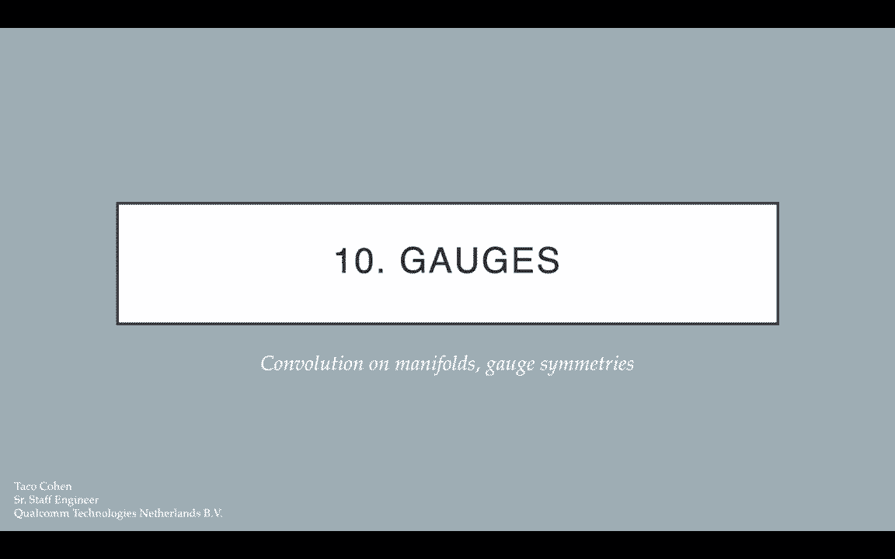
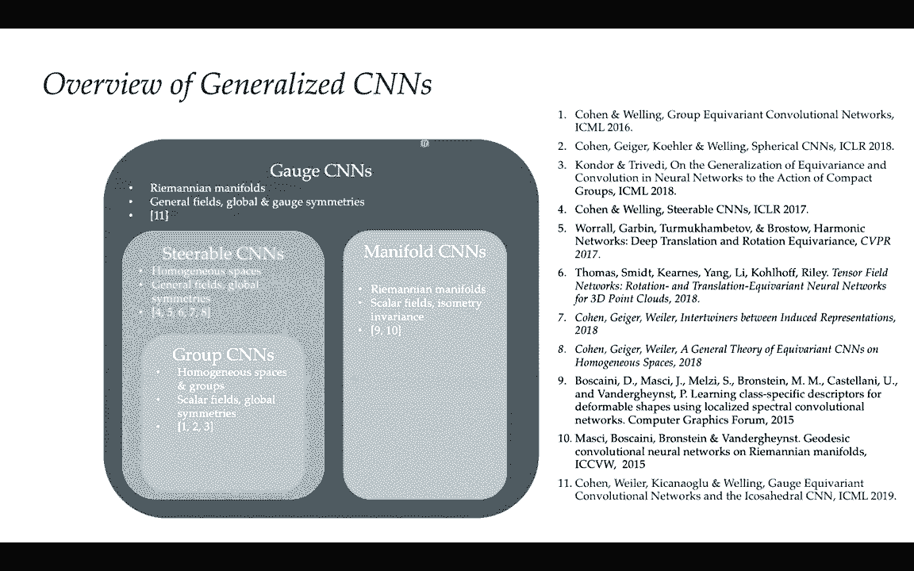
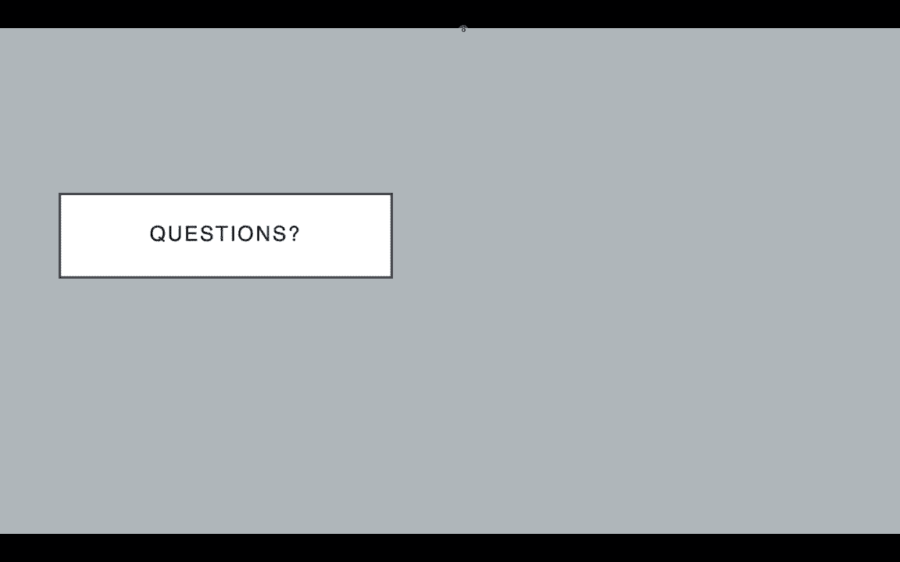

# P10：L10- 仪表 - ShowMeAI - BV1af4y1w75v

close today with one area that was，seemingly neglected and isn't as easy to，unify with。

the blueprint as the other domains that，we have studied，during the course and specifically i'll。

be talking about processing data that，lives on sequences，especially under uh time warping。

transformations，and this will lead us to a discussion of，recurrent neural networks and。

the various types of recurrent neural，networks and especially we will show a，very。

uh interesting and potentially，surprising result that，an entire popular class of recurrent。

neural networks，will arise as a result of requiring，warping，operation so without further ado。

let's start with a brief recap from what，we've seen in previous lectures。

through various lenses and guises we've，seen the geometric deep learning，blueprint in action。

and specifically as a direct consequence，of the analysis coming from the，geometric blueprint。

we have derived several uh deep uh，learning architectures that are more or，less popular。

and specifically we've covered a wide，spectrum including deep sets graph，neural nets，cnn。

spherical cnns and intrinsic mesh cnns，so，quite a wide quite a wide spectrum but。

if you look at what i showed you at，the start of the sets and graphs。

lectures uh the list of popular，architectures is instances of the，blueprint。

and if you look at what we have covered，in lectures so far here i've annotated，the table with uh。

what lecture roughly covered which，architecture you will see that we still，have one。

very very famous architecture the long，short-term memory or lstm。

that is uh missing from the picture and，it is actually somewhat harder to。

squeeze into the blueprint compared to，the other ones，but some fairly recent research on time。

warping and variants gives a very nice，way，to observe uh lstms and similar。

recurrent models through the lens of，invariances to，certain transformations and this is。

exactly what we will be studying today，so one very important distinction。

from what we'll be doing today and what，we've been doing in previous lectures。

is that so far we've sort of always，assumed a sort of spatial geometry，across the domain。

so you know the the graph defined the，particular geometry within its topology。

uh images and grids and so on defined a，particular geometry around。

around a certain space and similarly，meshes and the manifolds define also a。

certain more complex geometry，however in many cases of interest，you won't just have spatial。

configurations of your input，such as video text and speech，and here i've given just you know two。

examples of，cars going on a road which is a typical，video input where every single frame。

might be an image，that conforms to grid equivalence or，invariants，but it also has this temporal uh。

movement，and on the right hand side you might see，an audio waveform。

which typically arises when you record，sound and，how it has different entries at，different scales。

so what this means for us mathematically，is that we will assume that we have an。

input that consists of several steps and，at each step，of this input we will have a signal。

that's represented，with this capital x of t once again i'm，assuming。

a discrete domain meaning that i can，represent，my input signals using a matrix and。

at time t i will have signals coming，from a certain input space，over a domain at time t and。

note that what we'll be studying here is，what happens as these，inputs change through time so we have。

kind of a one directional arrow of time，and you know that seems inherently。

asymmetric right so time goes forward，time doesn't really go backwards and。

therefore it begs the question of do，there even exist，any useful geometric symmetries that we。

can use there given that，it only ever goes in one direction and，when i say。

useful symmetries i am not counting any，symmetries that are already present。

in the individual snapshot domains of，omega t so，beyond those domains we want to see if。

there's anything else that we can，exploit，and one very important distinction we。

need to make before we go any further，is does this domain over which we define，our signals。

also evolve with time together with the，signals，and in general this is very much，possible however。

throughout this lecture i'm going to be，assuming a much more simple case。

where the domain is assumed to be kept，static throughout the entire。

observation period so we will assume，that all omega ts are actually equal。

and they're equal to a particular domain，omega that will store our signals，throughout all time。

and this might never be，an okay inductive bias in terms of like。

ground truth behavior but in many cases，it's a very okay approximation to use。

and if you want to ask yourself the，question of when do i need to model the。

domain changing together with the signal，it really depends on the time scales at，which。

the signals x change as opposed to the，time scales at which the domain omega，changes。

so for example imagine you have a road，network data，so cars move a lot around the road。

network and you get snapshots of the，road network at every point in time。

now road networks are not static they do，change over time，different roads get built blocked or。

demolished but，usually the rate at which the roads，change is much much slower than the rate。

at which traffic moves，so for all intents and purposes you can，assume when you're analyzing road。

traffic data，that the road network is fixed even if，in principle it might change over time，domain。

consider，events such as different users connected，on a graph，of you know different friendships or。

following，and typically it's assumed that the，engagement of users such as writing。

posts or retweeting different，tweets will happen a lot more frequently。

than the changes to the social network，itself such as，different people following each other or。

unfollowing each other，so once again in some cases it might be，okay to treat。

the social network as a static graph and，just analyze the signals on that graph。

in other cases that may not be the case，and i will just note that。

if you are interested to go beyond the，content of this lecture，and find out a bit more about how。

the mains can change dynamically it is，actually an exciting emerging area and。

there's already some research going on，that you might want to consider here one，particular example。

that is interesting a piece of research，that came out from，from twitter last year is the temporal。

graph network which analyzes the，information，on various social networks and keeps。

track dynamically of different links，forming or disappearing on the social，network as time goes on。

so that can be a pretty good reference，to consider if you're interested to find，out more。

but for all intents and purposes here we，will be assuming，that the uh that the domain is always。

fixed，and it's equal to a particular omega and，as i said，what we're interested in this lecture is。

not what are the symmetries in omega，that's something that we've already。

assumed to have covered in previous，lectures hopefully，as long as omega is a common enough。

domain like a mesh or a video，or a or a graph and，therefore we want immediately from the。

get go to abstract away，any symmetries that omega might contain。

and what we're going to do basically is，there's going to be some encoder，function。

f which will be invariant or equivariant，to the，uh specific symmetries that omega has，and it will。

encode for every single input step，a k dimensional real vector okay。

so for every time step information，will call，z of t and，this can still work if you want a vector。

in every single node of your domain，in this case we will replace the。

invariant f with an equivariant f，and then it will give us a capital z。

with a vector for every single，node of the domain but for now just to，that。

f is an invariant function that attaches，a vector，to every single time step and that f。

will be learned together with anything，else that we stitch into this，architecture。

but the point here is that once we have，applied f，all the symmetries contained in omega。

have already been exploited，and now our only remaining task is to，summarize the z vectors。

so the domain that we'll be looking at，here is a form of 1d，grid but with an arrow of time going。

forward，so just to kind of make this super，video，of some cars moving in traffic and here。

i've given like four frames of such a，setting，and those are the capital x's that i've。

just told you about so those are the，different video frames，uh we take some uh。

for example translation invariant cnn，and we transform all of those capital，x's。

into a summary vector z t for every，single time step of the video。

and now our question is what do we do，with those，z's this is this is going to be the main，topic。

of the lecture today and uh，since i said that these sets basically，live on a one-dimensional grid。

this means that you can process them，with any of the previously covered。

architectures that will operate over，grids so，convolutional neural networks or even，transformers。

could be a good fit here but，we are not going to be dealing with，those models today and that is。

partly because they will not satisfy a，certain thing that，we actually would really want to have。

over temporal signals，even though such models are getting more，and more popular with。

their scalability we want to study a，model that will explicitly mimic the，arrow of time，have。

data arriving online because you can，imagine that with this model you have，already。

processed the sequence up to time step t，and then when time step t plus one comes。

in you can very quickly combine it with，everything that's arrived before。

so this kind of model is going to be，perfectly suited for that，and you might have heard about this。

model it is uh，known as the recurrent neural network，and，at its core is this so-called update。

function，which we will denote with capital r and，it consumes，a vector this z vector corresponding to。

the current time step，and it maintains another vector which is，m dimensional。

and we call it the summary vector h，and combining the previous summary，vector。

with the current input vector z，it updates the summary to produce the，next h。

at the next time step so h of t is，computed by applying，r to z of t and h of t minus one。

now if you analyze the data flow of a，model like this you realize that we have。

to seat it somehow we have to provide an，h of 0 from which all of the computation，will emerge。

and without any additional priors people，tend to set this h vector to just 0，but actually。

before we dive into some in very，interesting properties that r can，satisfy。

uh we can first see how a special choice，of h of zero can，already make rnn's uh have interesting。

symmetries that are，basically very similar to the ones we've，seen in cnns。

so let's start by asking the question，are recurrent neural networks，translation equivalent。

because you know they operate over a，grid they process this grid sequentially。

it might be tempting to just naively，extend any results we had for cnns being。

translation equivariant，and apply them to rnns because they're，both on a grid。

but actually rnns are generally not，translation equivalent，so let me just perform a left shift of。

my sequence by one step so i have this，new sequence，z，of the time step ahead and let's try。

showing that，once we process this z prime using our r，and n，the h prime will be the same as the。

initial h is shifted by one this is what，shift equivalence would imply。

and well let's see what happens when we，set t equals one so we want，h prime of one to be equal to h。

just，expanded out the rules uh of r and how，they combine，and what you can see is that if we want。

h prime of 1 to be equal to h of 2，we need the initial summary vector h0。

to be equal to the recurrent model，applied to the，time step 1 and h of 0。 and。

actually is there any way that we can，guarantee this so this is a。

necessary condition for our rnn to be，translation equivalent is there any way，we can guarantee that。

well the problem is that h of 0，is a sort of hyperparameter you need to，decide it up front。

and it cannot really have knowledge，of of the input time step right so。

you set h of 0 without any knowledge of，what's going to be in the input。

and when you perform this left shift，operation in order to be able to show，equivariance。

you've actually destroyed that of one，you're not ever feeding zf1 into the，model again，as。

starting from useful data and that's it，data，and therefore equivariance cannot happen，so。

we have to study a slightly different，problem and then，we will be able to show equivariance。

specifically what we need to do is we，need to make sure that this left，shifting，and。

accordingly what we can do is left pad，the sequence by zeros，so we create this new padded sequence。

z bar which has zeros for the first，t prime steps and then afterwards the，original sequence。

now what we can do is we can actually uh，shift uh z bar by up to t prime steps。

without losing any information about our，original sequence，and actually if you study shift。

equivariance over z，bar rather than zed it is actually，possible to guarantee。

shift equivariance for rnns however，there is a condition that h of 0 must，satisfy。

and what i would like，like basically the way in which you're，going to get these conditions。

is by running the same line of reasoning，as we did here，only replacing zed with zbar and。

uh yeah i think it should be a nice，exercise to go through those steps。

and figure out what are the conditions，that the initial summary h of zero needs，to satisfy。

and as a bonus uh part of that exercise，uh could you tell me if there are any，conditions。

on the recurrent network r for such an，h0 to exist，so i will leave this as an exercise。

because it should be more or less the，same line of reasoning，as what you've seen in the previous。

slide but，it's it's an interesting exercise to，show nonetheless，okay so we've shown that。

if we squint hard enough and we，transform the problem to suit our，purposes。

we can actually make rnn's equivalent to，translations，but it certainly didn't feel as natural。

as cnns，and unlike cnns that you just apply in a，same way across the grid and you can。

just parallelize very naturally，rnn's are actually inherently sequential。

so data goes in one step at a time and，you cannot process，step at t plus one before you've plus。

process the step at time t，so this you know the fact that iron ends，can be made。

translation equivalent doesn't，necessarily matter much，in the long run uh there is like there。

would need to be some deeper appeal and，the reason why we're still using rnns。

if if not for the efficiency so online，data processing is one，particular aspect where rnns have。

traditionally been very useful because，if you just have to process a very long。

stream of data where the data doesn't，arrive all the time at the same rate。

then rnns are a pretty good choice for，that because you can very quickly update。

them with incoming data，but is there any other kind of deeper，theoretical appeal to using rnns。

and the answer is actually yes and this，will be the core，part of our lecture today actually if。

you set up the iron properly so under，certain conditions on their update rule。

rnns can support a very very useful kind，of symmetry，and that symmetry arises from just。

asking the question of where do time，series usually come from，so when you have a data which is。

organized in a time series，typically that data is not naturally a，time series。

it is some kind of continuous process，that you're sampling from，right so there's a continuous time。

signal and you're taking samples from，that signal，and you're presenting those those。

signals to a discrete model like an rnn，and you know one very important question。

is in general can we actually，really thoroughly control the sampling。

rate at which the data points are coming，can we even guarantee it's fixed one。

example that is extremely sparse is，if you have patients in the intensive，care unit。

of a hospital you will typically only，record，certain parameters from those patients。

when it's relevant，for whatever their condition is or their，diagnosis is。

so there could be like really long，periods over which you don't have any。

information about a particular patient，parameter，and you know the rate at which you will。

get that kind of information may vary，drastically depending on，what kind of measurements are being。

taken and when are they being taken，so that is just one simple example of a，like。

oxygen saturation or blood pressure or，something like this and，you don't necessarily have that data。

point at regular intervals，you there might be a day gap during，which you don't have any measurements。

and then suddenly，there's a huge stream of data where they，get measured every five seconds or。

something like that，so the sampling rate at which you，observe this data can vary a lot。

and one thing that we would very much，like our deep learning models to be able，to do。

is to allow us to，within some reasonable space of sampling，rates change the sampling rate。

dynamically and still be able to fit，something like this with our model so is。

it possible for our model to be，resilient to drastically changing，sampling rates。

and how can we make it super formal，mathematically what does it mean for a，sampling rate to change。

well what it means is in some sense，modifying the unit of measurement。

and it's going to be much easier to，reason about this if we assume that time，is continuous。

so within the space of continuous time，we can define a so-called。

time warping operation tau the reason，why we use tau is because it matches our。

notation for automorphisms and tau is，certainly an automorphism of time。

and it takes time steps to time steps so，positive reals to positive reals。

and it must be monotonically increasing，and differentiable so it must be a，smooth transformation。

of time and i just given here on the，right hand side a very simple example of。

a time warping operation a so-called，time rescaling，where you have a constant factor alpha。

multiplied with your time so here，you have an example of the same signal，which is warped。

with a time warping function 0。7 times t，so here you have the original signal in，red at the bottom。

and the time warped signal in blue，and i've drawn these sort of gray。

parallel lines to show to you how the，flow of time is faster in the red curve。

compared to the blue curve，and what would this mean in a discrete，setting is that you get。

a new input like an input that is new，time，series every 1。43 steps。

but just to be clear rescaling is only a，very simple special case where this。

where there's a fixed sampling rate and，it changes but，actually what might happen in real life。

is that sampling may freely accelerate，or decelerate so it might this tau。

might be a way more complicated function，than just alpha times t。

the only condition it needs to satisfy，is it needs to be monotonic and，differentiable okay。

so what we want as i said is we want，uh，exact time warping function that happens。

when we sample data in the real world，so what we would really really like is。

a class of models that will be invariant，the time warping so。

what this means is that for any sequence，i have and any time warping applied to，that sequence。

there exists some model that will，process the warped sequence the same way。

it would process the original one，so this means that basically if we have。

the right class of models we don't have，to worry about，which time warping was applied so this。

kind of invariance is a，potentially super useful one to have and。

hopefully it's not too hard to see that，convolutional neural networks are not。

time warping invariant here i've given，one simple example of a 1d。

convolution neural network with a kernel，of size three，and here you can see for you have like a。

time series of 16 steps and，uh from inputs i to outputs o and you，can see how say a four layer cnn。

the output at time step 16 can only see，steps from 12 to 16 like in terms of。

just pure reachability in red，and now what happens if i warp the。

sequence i put a lot of zeros in between，all of my inputs，suddenly i can just put enough zeros so。

that the output point 16 will not be，able to see，see，able，to be resistant to this kind of time。

warp and you'd have to change the，architecture of the cnn，so this is the cnns are not a good。

example and they don't satisfy the time，warping and variants，uh that being said people have been。

aware of this problem in cnns，and they found a very cost efficient way。

to make them far more resilient to such，changes and in particular one very。

popular approach to making them more，resistant，is the so-called dilated or sometimes。

at-home which is，the the french term for withholds uh，convolution neural networks which uh。

basically what they do is，the first layer of dilated components，starts the same way as normal ones。

but now you can see how uh as the layers，go up，kernels，more and more spread apart by basically。

inserting artificial zeros，in the in the kernel and the rate at，which this grows is exponential。

so here now suddenly after only four，layers and the 16 step，now。

actually observe the entire sequence so，no matter，how much you intersperse it with zeros。

unless it gets really intense it will be，able to see，what's going on within it so this。

observation was super helpful when cnns，were used to model，uh waveforms like raw audio waveforms。

and this kind of layer actually forms，the essence of，deepmind's wavenet model which is。

currently powering the，text to speech systems inside google，assistant so whenever you talk with。

google assistant，a convolutional model like this is，producing the waveform。

one sound data point at a time that，you're listening to，and okay it's still it provides an。

exponentially increasing receptive field，but in principle once you choose a。

convolutional dilated architecture it，still has a fixed receptive field so。

there is still a possibly huge number of，zeros i can insert，after which i will lose visibility of。

some part of my sequence and i will not，be resistant to that kind of time，warping so。

once again from an empirical point of，view something like this definitely，helps。

but it doesn't theoretically solve the，problem you can still，dilate the sequence sufficiently to。

beat any fixed receptive field size，and then recently transformers have been。

getting more and more popular for，handling these，at，every point every step of the sequence。

will have full context，of the rest of the sequence but as you，remember from previous lectures。

transformers，inherently do not operate on a grid they，operate over complete graphs and they。

don't support，translation equivariance they support，permutation equivariance。

so as a result they're not assuming，their nodes to be in any order we have。

to feed the temporal order through，implicit features that are put。

as positional embeddings to every node，so，while transformers may be able to get a，decent feel for。

what the what the temporal alignment in，the sequence is，they certainly are not invariant to time。

warping because inherently they're not，designed to be resistant to any grid，operations。

so they may be attractive but once again，theoretically they are not what we want。

in this particular case，so okay we have exhausted all of the，obvious choices we are just left with。

recurrent neural networks and，uh what uh the basis of our discussion，today is going to be。

is this uh seminal paper from cohenton，talek and，jan olivier on can recurrent neural，networks warp。

time that was published at the iclear，conference in 2018，which actually showed that under certain。

constraints，on recurrent neural networks they can be，invariant to time warping operations and。

this was a very important result because，it showed how，just starting from the principles of。

what we want such a model to achieve，we can show that the class of recurrent。

neural networks that was already the，most power，uh popular one um actually is exactly。

the class that satisfies these，constraints，been，have been able to show this。

so as mentioned before time warping is，something that is very naturally defined。

in the continuous domain and things，start to get a bit weird whenever you，try to move back。

from continuous to discrete so i'm，actually going to start the analysis。

of time warping and variance by uh，starting in the continuous domain so。

whenever you see bold face h and z of t，that is a discrete vector signal at time，step t。

whenever you see uh you know just italic，h and z of t，that is a function a continuous function。

that's defined for every，of，analog of a discrete rnn which is called，the cont which。

which we can call a continuous rnn that，takes an，input continuous signal z of t and。

computes a summary signal，h of t and the way in which we're going，to link。

the continuous and the discrete is by，looking at these，so called the taylor expansions around，time t。

so specifically uh we're going to see，what does h of t how can h of t roughly，be approximated by。

a degree one uh polynomial，and uh especially around time t，uh a one step taylor expansion。

tells us that h at a point t plus delta，is approximately equal uh up to a，certain error term。

uh to h of t plus delta times the，derivative of h of t，with respect to t and well now。

if i just take this taylor expansion and，i set delta to 1，then this gives me a relationship。

between h of t，plus 1 to h of t and this in a way is，network，update r does so just doing a bit of。

algebra and swapping things around and，setting delta to one，we can find that uh the。

recurrent update rule of r and ns，satisfies the following ordinary，of。

the summary d h by dt is equal to，the application of the recurrent network，to z of t plus one。

and h of t uh subtracted，[Music]，from the uh the h of t so，that。

every recurrent network should roughly，satisfy，based on the taylor expansion property，okay。

so now we have a good starting point，that links the continuous，h and z of t signals to the recurrent。

update，r and now we're in a position where we，can try applying a time warp。

tau to the signal and see how it，processes，if our model class is time warping，invariant。

then when it observes a warped signal z，of tau of t，of t，this would imply that it's time warping。

invariant，so if you use the same taylor series，argument and，obtain an ode that this model must。

satisfy，you get basically the same equation as，we had before，the only difference is that now you're。

taking a derivative with respect to the，warped time，tau of t but otherwise the expression is。

exactly the same，but because you're taking this，derivative with respect to the warped，time。

you're taking it with respect to you，know the time，which this warped model observes。

you're not taking into account the fact，that this rate got changed from the，original signal。

so what we actually want is the，derivative of，the warped summary h of tau of t with。

respect to the original flow of time，dt and what this means is that we need，to combine。

the rule we have above with an，rule，so uh you know if i want to compute。

d h of tau of t by dt that is the same，as taking the derivative of h of tau of，t。

by the warped time and the derivative of，the warped time with respect to the time。

and combining these two with the，equation that we had before so。

d h by d tau we have already computed in，the previous slide，now we just have to multiply that。

expression with the，warping derivative d tau by dt，and as a result we will get this ode。

here so the derivative of the warped，time with respect，sorry of the warped signal with respect。

to the original time，must be equal to the warping derivative。

times the recurrent network rule applied，to the warped inputs and the previous，warped summary。

minus the warping derivative times the，previous warped summary，if our recurrent neural network can。

satisfy this，ode then it will be time warping and，variant，okay so for now we have。

expressed the requirement that the rnn，must have，for this uh for this time warping and。

variants to be satisfied，but we've stayed in continuous space so，we need to now。

make the leap from continuous space into，discrete space，and specifically what we can do is once。

again just start from a taylor series，and in this case it must be a warped，summary so。

h of tau of t plus delta，can be uh you can take the the linear，taylor expansion。

which is a decent approximation under，certain properties that we will mention。

and that taylor expansion is roughly，equal to the warped summary plus。

delta times the warp the warped summary，derivative，and now once again you can set delta to。

one and remark that，uh the the discrete rnn，sees z of t which is in the warped case。

z of tau of t and computes，h of t which is h of tau of t，this then like taking the previous uh。

equation and using the facts we showed，before and i've，left this as an exercise you can take。

the facts from the previous slides and，at，this particular equation so the time，warping invariant rnn。

must implement an equation like this at，the bottom of this particular slide。

so the way in which you derive your next，step summary，must be a time warp derivative。

times the update of the rnn of the，current step in the previous summary。

plus 1 minus the time warping derivative，of the previous value of the summary。

so i've left it as an exercise for you，to drive this rule using all the。

equations that we've shown before，in this deck and it's a very useful。

exercise to do i would recommend doing，it，and okay so i've just restated that。

equation here so we can，observe it while we draw some，conclusions from it so we want our rnn。

to be able to implement something like，this，for any time warping operation tau of t，that is。

decent enough and，one way in which you can interpret this，rule because you have you know a。

warping derivative here and the one，minus time warping derivative here。

is that what you want is for the，derivative of the time warping to，control。

how much of the previous summary you，should overwrite，so the more the stronger the derivative。

the faster the time moves，the more relevant the current signal is，for the summary。

and you should use more of it and use，less of the previous summary，and what's very important is that。

we don't assume that we know tau of t up，front，okay so this is the thing which is。

making the implementation tricky，if we knew the derivative immediately we，could just。

swap it into the rule and obtain a，recurrent neural network model that will。

that will fit it properly right，and specifically one uh one of the，earliest。

applications where rnns were introduced，is the so-called simple rnn model。

which was independently in various forms，introduced by，jordan in 1986 and elman in 1990。

which just does a simple mlp to update，the summaries so for them the rnn，computes。

h of t plus 1 as some activation，function of，input，previous summary and some bias vector。

so these w u and b are just learnable，parameters you can think of this as a，multi-layer perceptron。

applied to z and h and，z，t plus one and h of t are giving you and。

you're taking that as your next summary，so there's no explicit residual term。

that preserves the previous ht so if you，remember the form for time warping and，variance。

you need to have some residual term here，that will allow a part of the old h of t。

to be preserved so if that term does not，exist，then you know that these simple r n's。

are actually implicitly assuming that，the time warping derivative is always，one。

and if the time warping derivative is，always one that means that there's。

actually no warping tau of t，is equal to t so simple rnns，only theoretically work in the scenario。

where there's no time warping，and as a result they are not invariant，to time warping。

so this is very important to note you，cannot just plug any rnn，and expect it to be time warping and。

variant we need to be very careful with，what kind of update we do to znh，okay so as i said we cannot。

actually expect to know the time warping，derivative up front unless。

it's actually given to us so what we，have to do in general，is we learn a neural network that。

approximates this derivative，so based on the current z and h，this new function gamma will try to。

approximate the real value which will，tell you what's the warping derivative。

in this particular point，and it's once again sufficient for this，gamma to just process。

z of t plus 1 and h of t because they，store everything that you've observed so，far。

and if you plug this learnable gamma，into the form that we know that time。

warping and variant models must have，of t，plus one is equal to gamma times the。

output of the recurrent model，plus one minus gamma times the previous，summary。

okay so so far so good this looks like，this looks like a nice roll that we can。

use and once again you can see，how simple rnn's arise when you just set，gamma always equal to one。

and are there any other constraints that，we can attach to gamma，well actually yes because。

there is a very important assumption，that i've been making，throughout this lecture ever since i。

used the first，taylor approximation and that is that，the taylor approximation。

is a good enough approximation and in，principle，there will be a small enough error term。

in the taylor approximation，as long as the time warping derivative，is not very large。

specifically as long as d tau by dt is，this，warping，shouldn't become very fast it should not。

over contract，time because if the sampling rate，becomes，uh so bad that you are going to actually。

miss a particular time point in the，middle，uh you would end up over contracting。

time too much and you'd have no hope of，processing the two sequences in the same，way。

however arbitrary time dilations are，completely allowed，and this is very important for rnn。

processing because very often you'd，expect them to have to capture，information at very。

long time scales and you can think of，information at long time skills。

as information to chart that starts on，short time scales and then a very long，dilation is applied。

so since we know that the warping，derivative，as long as we're assuming data hasn't。

been destructively lost，is not too large so it doesn't exceed，one and we also know from our initial。

assumption that you know the time must，be monotonically increasing it cannot。

we cannot go backwards in time so the，derivative of tau can，never be less than zero and it can never。

be equal to zero either time cannot，stand still either，so basically we know that the value of，these。

of these gamma function always has to be，between zero and one，for the reasonable scenario that we're。

that we're that we're looking at，and actually if we have a function gamma，that takes some inputs and。

produces an output between zero and one，this is something that。

we can interpret as a so-called gating，in，various architectures such as gru's or，lstms。

and how we normally arrive at gating，mechanisms in deep learning is we。

typically use the logistic sigmoid，activation so that's the，the standard activation that gives you。

entropy，uh problem so simple like uh，binary logistic regression so some kind，of mlp。

applied to zeds h's with some biases，and weight vectors and then you apply。

the logistic activation to the result to，get the value between zero and one。

and now that can be a great way to model，gamma and，any recurrent neural network that uses。

such a gamma somewhere，is called a gated rnn and，so far i've been implying that you know。

the only requirement we have is for，gamma to output a single scalar。

but in principle most of these gated，rnns，try to increase their expressivity by。

making gamma output a vector，of 0 1 probabilities and what this means。

semantically is that you can choose to，overwrite dimensions of h of t，this。

allows you to more easily separate，processing of data at different time，scales。

and in fact gated rnns you might have，heard of them because they are the。

dominant variant of recurrent neural，networks nowadays，so models such as the long short-term。

memory or lstm or，the gated recurrent unit or gru are both，special cases of the gated rnn。

architectures because they feature gates，in various parts，so what i want to show just kind of to。

close off the discussion and to finally，link it back to an actual architecture。

is to show you just quickly if you，haven't seen it before the long short。

term memory architecture and how it，relates to this blueprint，so lstms you probably heard of them。

they're one of the oldest and most，popular gated rnns，and they use an explicit memory cell cft。

that persists，data across different time steps and，i've shown that only one gate is in。

principle enough，to model the time warping derivative but，lstms you know。

they take several steps further than，that they actually use gating。

extensively and they decide several，things in a gated manner，how much of the new features that come。

at time step t plus one should be，allowed in the cell，how much of the previous cell vector to。

forget and then once you finally，computed the output based on all that。

how much of the output vector should be，allowed out of the lstm。

originally they were proposed with the，motivation of modeling and addressing。

the issue of vanishing gradients，and essentially because they have all，these gates the lstm。

decides how much of the data should，vanish in a way that's purely data，driven。

and because they fix the vanishing，gradient problem that，many of these sigmoidal functions like。

logistic or hyperbolic tangent have，typically in lstms you're allowed to。

freely use the tang activation and，they're the more common choice so this，is the summary of the。

most commonly used lstm equations that，you might have come across before。

so first based on just like we did in，simple rnns，based on the current time step in the。

previous summary we compute some vector，of candidate features which we call c。

tilde that should enter the memory cell，and then，you compute various gates input output。

and forget gates，based on the current time step in the，previous summary。

which tell you all of these various，design decisions，and finally using these gates and the。

candidate features you can compute，the what's the next value that should be，placed in the cell。

so the next value to go in the cell is a，combination of，some level of these new candidate。

features modulated by the input gate，and some level of the previous cell。

features modulated by the forget gate so，the forget gate tells you how much of。

the previous context should you forget，finally once you have these cell vectors，updated。

you can do one last step of processing，by applying attached to them。

and multiplying them with the output，you should let，out of the cell and that is your summary。

vector at time step t，now this is a lot of equations and if，you haven't seen it before it might be a。

bit tricky to visualize them all at once，so i've prepared this particular kind of。

data flow diagram so you can see，how the data moves so the lstm cell，starts with inputs。

z of t h t minus 1 and also there's a，memory cell which stores a previous。

cell state ct minus one and first，based on h and z we compute the values。

of these various gates and also the next，step features，c tilde c tilde is multiplied by the。

input gate，the previous cell state is multiplied by，the forget gate those two are added，together。

and fed back into the cell and finally，there's a tange applied，which gets multiplied with the output。

gate to produce，the next step outputs if，this is a lot of content and you haven't，seen lstms before。

i have shared a handout on on campus，wires you can take a look and。

consult this diagram again just to be，sure that all the different pieces are，clicking。

and now that i've showed you the generic，form of，gate rnn's and how they satisfy time。

warping and variants，and lstms is a special case which is，very popular。

it's worth to pause and reflect on what，we've done today，what we wanted is a model class that's。

resistant to any，shown，how previous models that might be，applicable on grids such as cnns or。

maybe even transformers，are in principle theoretically unable to，do so。

and then we derived what is needed for a，discrete recurrent neural network to。

satisfy this invariance，and it turns out as long as it uses some，form of a gating mechanism。

it has all the power it needs to，explicitly model the time warping，derivative。

so starting from the basic principles of，invariance，we've derived an entire class of gated。

rnns which satisfy that in variants，and it happened that this class of。

models actually matched what were the，most popular，rnn models so lstms gru's and so on。

so the purpose of this gating mechanism，now you can interpret it as not just。

you know dynamically learning how much，to forget it actually has a very，explicit purpose。

to fit whatever is the time warping，derivative with which you're sampling，your data and。

one very important thing to note is that，what we've derived is not the invariance。

in the sense that we've seen in previous，lectures，it's a form of so-called class。

invariance and it's distinct to the ones，we've seen before because。

what we're not saying that if i train an，rnn to produce，h of t from z of t that that same r and。

n will produce，h of tau of t from z tau of t no matter，what how i choose。

actually that kind of zero shot transfer，is usually not possible。

because h because z of t and z of tau of，t are not，the same time series they're not going。

to have the same inputs so you cannot，very easily guarantee that。

the the outputs will follow that same，that same pattern，what class invariance actually says is。

the following assuming that there is，an rnn architecture that will produce a。

desirable h of t from a zft，then there must exist another rnn with。

exactly the same architecture so from，the same class same hyper parameters。

but potentially different weights okay，that will produce，the desirable warped summary from a。

warped input for any towel，and what this is is a sort of peace of，mind result。

that's very useful to us when we want to，apply a model like this。

because it says no matter how we warp，the signal as long as we haven't warped。

it in a destructive way so no matter how，much we dilate the sampling for example。

there will exist a recurrent neural，network with the same architecture that。

will fit it in the same way，as the ideal unwarped sequence and this。

is a very strong property that motivates，multiple time-scale learning properties。

of rnns and are the reason why they're，such a popular model nowadays。

and just to highlight there actually，exists one case，where we can zero shot an rnn that was。

learned on one warping to another，and specifically when one time warping。

is a rescaling of another so there's，just the coefficient of alpha in front，of the time warp。

that means we can get uh we can get，uh exactly the same processing if we，just modulate the gates。

so if we make the gamma function for，gate 2 for time warping 2 alpha times。

whatever was the gating function learned，for time warp 1，that will give us perfect invariance so。

this is one case where we don't have to，change the weights we just have to。

change the function of the gating，so what have we covered in today's，lecture。

is the final big missing piece to our，geometric deep learning blueprint which。

is processing data on these temporal，grids or sequences，we've discussed recurrent neural。

networks as a canonical method in this，space，and we've shown if you squint hard。

enough rnns can support，translation equivariance but a much，better and much deeper motivation which。

cnns or transformers cannot satisfy，is they're able to cope with varying，sampling rates。

specifically because they are a model，class that's invariant，time warping and by analyzing the。

requirement of time warping，to that，invariants and specifically we've shown，that lstms are。

one specific instance of gated rnns that，are very popular and how they fit within，the blueprint。

so what we've done now over the space of，the previous，six lectures or so is we've covered the。

entire table of key，gdl architectures and，for the final lecture that michael will。

be given in a few hours we will survey，some of the impactful applications of，geometric deep learning。

and give an outlook of how we believe。

