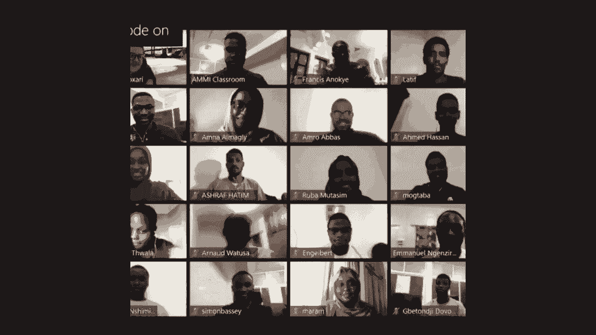

# P13：研讨会：GDL和强化学习 - ShowMeAI - BV1af4y1w75v

all right，um well my name is uh elisa fallopoul，thanks for organization for inviting me。

i'm going to be talking a little bit，about the geometric deep learning，at。

amlab which is at the university of，amsterdam，where i work on the structure and。

symmetry reinforcement learning，i'm currently also interning at the deep。

mines multi-agent team so i'm actually，before my pc i did the masters in ai。

um also in amsterdam and i graduated on，the topic of，cooperative deep reinforcement learning。

uh in the multi-agent setting，um if after the talk you're interested。

in learning more or you want to chat，please hit me up online you can email me。

or contact me on twitter or something，in the meantime please feel free to，interrupt at any point。

if some things aren't here or you have，so before i get to uh to the research，a quick。

introduction to reinforcement learning，and specifically，mdps markov decision processes i've。

adapted this from some slides from，i've not assumed any reinforcement。

learning knowledge on your part，so if you do already know most of this，stuff。

please consider the refresher and it's，so if we look at the field of machine，learning we can。

kind of divide it into three different，parts so we have the supervised learning。

the unsupervised learning，and reinforcement learning and while，they all sort of。

share and exchange techniques they all，have their，kind of personal challenges i would say。

and i think reinforcement learning is，really the odd one out here。

it has a very different approach and it，also has very different challenges。

for example you supervise and，unsupervised learning you have static，data sets。

that you're then trying to learn，something from whereas in reinforcement，learning。

you have to figure out how to get the，right data in the first place which。

makes the whole problem a lot，some examples of places where you could，apply reinforcement learning。

are of course alphago which，made quite a splash at the time it's a，reinforcement very system。

that beats the world champion of gold，gold um which was super impressive at，the time。

an achievement that was supposed to be，quite far away so it's very impressive，that it worked out。

there's also for example work on，autonomous，helicopter flying which if you have time。

to look at the videos it's，kind of cool but you can also imagine。

that it could be useful for robotics，like healthcare robotics or。

maybe you want someone to help you in，the kitchen so you don't have to cook，for yourself。

and finally something that a lot of，people are also interested in。

so in reinforcement learning we tend to，focus on sequential decision-making，problems。

so we have some environments um that can，be the real world，it can be a great world it can be the。

internet，it's just some kind of environment that，we're acting in sequentially。

in order to maximize some long-term，so some key features here are the，reinforcement learning。

that you try to learn to take the best，action by trial and，error so you take some actions in the。

world and then you evaluate how good，were those actions，the problem here is that your reward can。

be delayed so，let's say you're trying to navigate a，maze you you'll only get like a positive。

reward at the end of the days，and until you reach it you won't know if，the actions you're taking。

have been good or bad additionally we，might have to sacrifice immediate，rewards。

in order to gain more reward later so，it's definitely a problem where you also。

have to take the future into account，something contrast reinforcement。

learning to supervise learning setup，in reinforcement learning we take our。

current input for example an observation，that we have over the world。

we make a decision and then the next，thing we see depends on the decision we。

made before whereas in supervised，learning if you misclassify your dog as，a cat。

that only affects your score but it，doesn't affect what you're gonna see in，the future so it doesn't。

really do too much to influence your，future decisions，so it's a matter of learning to do or to。

so a typical reinforcement learning，class，that we look at simplified versions of a，lot。

is we have some robot in amaze and it's，trying to，fight the shortest route to the goal so。

this is sort of a classic problem，if we already know a priori how to，divide the states up。

into like small discrete iterable things，and we already have discrete actions，like go left go right。

then we can apply classic planning，however in real robotics this is usually，not the case。

instead of knowing exactly where we are，we usually have some kind of center，sweep of the environment。

um our actions are not discrete nice，clean actions，instead we have something like uh move。

the wheel by this degree to the left or，to the right for example。

so this is something where applying this，planning algorithm is much harder。

we can formalize these kind of decision，making processes as mark of decision。

making processes so that's just a，mathematical framework，to model sequential decision making。

tasks we have some environment，that gives us some observation the state，of the world。

in response the agent takes an action，and in response to the action the。

environment changes again and，the agent receives a new state new。

so yeah you can call this a sequential，interaction flow，um it's a it's a feedback loop where。

you're trying to make sure that，over time the cumulative reward is。

okay i'm gonna try this slide without，full screen because the part is not，working。

so an mvp is a is a tuple，that consists of a set of states so，those are just the states that the。

environment can be，uh can be in a set of actions，that the agent can take a reward。

function that maps from，the joint state action space to some，scalar rewards。

now the rewards could also be a factor，if you're in ability objective problem。

but that's uh far beyond the scope of，this uh this talk i'm afraid。

um there's a transition function that，for a given state and action。

returns to you the next state of the，world and this can be either，deterministic or stochastic。

and so can the reward function can also，be stochastic，and finally we have a discount factor。

which will make life easier，later on so the reward function and the。

transition function if we take them，together，are what we usually describe as the。

the goal in the market decision process，is to find a，policy that maps from states to actions。

so the policy can also be deterministic，or stochastic，um in the deep learning era we very。

often model it as a，vector representing a distribution and，so if we let me just try if i can。

maximize it again，it's just working yeah so if we go back，to the robot in the maze。

example then in this case for example，the states would be，all the possible locations that the。

agent can take in the maze，the actions would be rotate the left，wheel by，be。

okay we get zero everywhere and then we，there are some assumptions that we make。

when we model some things as，uh as mvps so one is that the time steps，are discrete so we have like。

one action per time step and the other，one is that we're fully observable。

so what does that mean it means that，the probability of the next state is。

determined only by the current state and，the current action，so we don't have to take histories into。

account so you would have，partial observability for example let's，say you're。

driving you're a little robot driving，along a corridor and there's a bunch of，identical doors。

then if you look directly at a door you，only know which store it is。

if you remember which doors you've seen，before so that's an example of partial。

so we're interested in finding policies，and a policy，is a function that represents the。

agent's behavior so it's a mapping from，states to actions，and it's very often known as a。

so for example in the maze problem it，will be something like，what's the route towards the goal that。

maximizes the rewards，and in order to take the correct route，we have to。

know what is the optimal policy at each，state，so in order to determine。

which policy is optimal or which policy，is better oh i'm just seeing。

oh you can yeah okay so maybe i can ask，the full observability is it in terms of。

the states or the actions，of both both okay，uh right so if we want to talk about um。

optimal policy we first have to have a，notion，of how to compare policies like which，policy is best。

so given this very simple great world，with some，okay so we have a blue route that goes。

like we go to the right first，and we have a black route and we go down，first so the question is。

um which action should this robot take，so this is a question of。

i'm able to i think that whenever i put，latex on the slide it's not letting me。

maximize it so that's too bad so we're，gonna do it like this，um to measure how good a policy is you。

need a notion of，uh the discounted return so what we're，gonna do is we're gonna accumulate。

we're gonna compute the cumulative，discounted rewards uh，over time so that's just saying okay。

we're in some time step and then，the cumulative return will be the reward，that we get next。

plus a discounted version of the reward，that we get after that plus a twice。

discounted version of the reward we get，after that，um and so on and so forth。

so in this problem that we just looked，at with the，grid worlds at every time step we have a。

reward of minus one if we reach the goal，we have a reward of plus ten。

and a discount factor for making，computation easier we，we now set to one this would usually be。

something like 0。9 or 0。99，so if we take as first the move right，and then we follow the rest of this。

route，or we take the move down and then we，follow the rest of this route if we，compute the return。

then we see that if we go right and，follow the policy we will get。

a higher return so that would be the，so this is just like，in a sense this is just one sample of a。

return under this policy，if the policy is stochastic or the，transition function is stochastic or the。

reward function is stochastic，this is not good enough to say which，policy is better。

so what we end up doing is we end up，computing the expectation of the return。

under the policy so what that what that，just means to say okay。

given that we have this policy what is，the expected return，that we would get if we follow it from a。

given state，and that gives us the value of a state，we can also compute a q value function。

which is kind of the same as a regular，value function except，except it's defined over state and。

action pairs so，we we look at what is the expected，return，starting in a given state and starting。

from a given action，future，yes okay so how can we get good policies，in。

this presentation to uh to go for the，entire field because it's huge。

but there's a nice overview that i think，hector both made，so if you know the dynamics of your。

environment and your environment is，discrete and not too large you can use。

dynamic programming algorithms，such as policy iteration or valid value，iteration。

so these depend on just iteratively，updating estimates of the，if you only have your environment you。

can sample data from it，and then by data we mean state action，reward next stage tuples。

then what you can do is kind of two，different things，from your。

input like for example directly learning，a value，or q value function so what you would do。

for example in deep learning is you，would take your state，maybe that's an image of an atari game。

you push it through the network and then，you output，either a q function or you。

directly output a distribution over x，and solve policy，and then you can just define a loss。

function that optimizes，either the the value function or the，policy directly。

and then it's just a matter of changing，your neural network，so if you're not interested in the deep。

learning part of it you can also maybe，use tabular methods so，you could use stability q learning or。

sarsa for example，things like policy iteration value，iteration and q learning and sarsa are。

very well described，in introduction to reinforcement，learning by sutton and barto。

which i'll have on another slide if，you're interested，if you're more interested in the deep。

learning part of things then you can，check out for example at dq learning dqm。

or reinforce and its derivations if you，want to optimize your policy directly。

and these are examples of model 3，reinforcement learning，so they're model-free because we're not。

building a model of the environmental，so this gives you a hint we can also。

learn a model of the environmental，dynamics，way，of dealing with a problem because we can。

reuse the data，both to update the policy and also to，update a model and we can use the model。

and this is what we call model based，reinforcement learning not the。

most creative name do keep in mind that，not all reinforcement learning can。

then should be modeled as a markov，decision process，so for example if you have a multi-armed。

bandit problem，it kind of looks like a reinforcement，learning problem but your actions don't。

influence the states you see next，so it kind of means that you don't have，to care about transitions。

but you're still interested in finding，the action that maximizes the cumulative，reward。

and you still have to come up with a，smart way to try all the actions。

uh in order to be able to find a good，another example is as i mentioned before。

partially observable problems，in partially observable problems you。

have to reason about the histories that，you've seen，this is classically done by considering。

something called a belief state，it's kind of a summary i view it kind of。

as a summary of what you've seen before，but nowadays we keep learning there are。

also stuff where they use for example，recurrent networks，to do this finally。

multi-agent problems if they're not，fully cooperative you shouldn't，model them as mdps but as games。

and if you're interested in this then，there's a book a concise introduction to，multi-agent systems。

by flosses which i think is available，online，um it's i found it very useful when i。

so if you want to get started with，reinforcement learning then there are a，few。

really nice really nice resources online，there's reinforcement during an。

introduction there's david silver's，course on rl which i，personally haven't really looked at but。

a lot of people really like it，and then there's spinning up in deep，reinforcement learning。

which dives a bit more into the，so do keep in mind that universal，learning is。

far from perfect both as a field but，also as a，from the technical side of things it。

takes a long time to train，anything um compared to，sort of problems of comparable。

difficulty in for example computer，vision，so you need a lot of data mostly because。

the problem is just very hard，with the future taking the future into，account and。

the the long-term impact of every action，that you can take，as a result the the methods tend to be。

very high variance and，can also be quite unstable and deep，reinforcement very。

notoriously sensitive to hyperparameter，choice，really in a way that something like。

supervised learning really isn't，if you want to see a little bit more。

about this there's this paper called，deep reinforcement learning that matters。

that i think lays out the problems，quite nicely also for example in terms。

of what's the effect of the random seed，on the performance of your algorithm，which is quite。

quite intense right so before i move on，to research i think this is。

a nice point if you have any questions，about the enforcement learning part。

so as i mentioned uh briefly in the，is，really data hungry so a few years。

back i plotted this this graph where we，take the number of samples for。

famous computer vision data sets so we，have mnist cfar，ms coco and image。net of course imagenet。

is the biggest one，and then i uploaded at the time a few，popular model-free reinforcement，learning。

approaches and we see that this dwarves，imagenet，so there's a lot of samples that you use。

to get any kind of，good performance on in this case atari，games。

but this extends to other difficult rl，problems as well，of course this is a little bit of an。

unfair comparison because，we don't know what computer vision。

people would do if they could sample new，data all the time，and that's definitely the case in。

reinforcement learning，but i do think this illustrates quite，nicely why this is uh。

so what can we do well i'm personally，very interested，in the observation that uh not every。

data sample that you take in，reinforcement journey is unique，so i've i've shown here a few examples。

so here we have a state in pong the，target and we have a similar。

but quite different state in the same，game，so if you take a naive model free。

reinforcement learning approach，these two samples are not the same so，there are different samples。

it's the same in the classic purple，control task so you have a little card，that drives。

left to right and you have to balance a，pole on top of the card so you have to。

move the card just right，so the pole doesn't fall over um，in a normal model 3 algorithm these are。

two different samples，it's the same for this little bit world，here that i've dropped that i've drawn。

um it's just a great world with a guy in，a specific cell，and here in the the blue version of the。

problem is the same guy in the same cell，but for a reinforcement learning。

algorithm these would be very different，different samples so。

i'm very interested in looking at things，where we can exploit。

samples that maybe look different if you，look at them easily but if you consider。

the structure of the data a little bit，more you can actually gain a lot。

and the way i do that is by looking at，equity variances and invariances in the。

so you might already have gotten，some lectures on equivariance and。

invariants but i'll just repeat it here，so that you know，um what i mean when i talk about them。

so let's say we have a dog that's our，input，and we apply a transformation g for。

then if f maps the dog to latent space，uh do if f maps the rotated block to，latent space。

or f maps the original doculate in space，we want there to be some equivalent g，g。

such that we end up in the same space in，latent space，so this is a commutative diagram that。

goes like this，so it doesn't really matter which route，you take to get there but you will end。

up in the same point，and this is equivalent so we say，f of g x is the same as g prime of f x。

and this is an equivalence constraint，that you see a lot in the equivalence。

invariance is a very related concept，except it's a little more yeah strict or，maybe not strict but。

it's just different so we have the same，dog，but now instead of mapping to a related。

point in latent space，we just map to the same point delays in，space and this is very useful for。

something like supervised learning，where you don't actually care if the dog。

is rotated it's still a dog so you want，to，classify it as a dog regardless of，rotation。

and reinforcement learning however is a，bit more subtle，so if we look at this data for example。

this one，if we flip over the horizontal axis then，we're kind of at the same state again。

however if we take the same action，that's probably not a great idea。

because here we need to go down and here，we need to go up so，a flip of the input space it also。

induces a permutation in policy space，it's the same for carpool as we flip，over the vertical axis。

instead of going left we now have to go，right，so these are examples of equivalence in。

reinforcement learning，if we look at this the spirit world，example with the。

with the little guy then it's actually，an invariant，under changes of color so we don't。

actually care about the color of the of，the state we just care where the guy is。

in the great world so this is an，invariant because the action doesn't，change。

so i want to introduce the concept of an，ndp homomorphism before i move on。

i won't go into the technical details，you can look them up in this。

in one of referendum and parto's papers，if you're interested，suffice to say that if you have an。

mvp for example in this case we have a，carpool which has a flip symmetry over，the vertical axis。

so an lep homomorphism is a map from our，original problem，onto a reduced problem so in a reduced。

problem we've，kind of folded over the symmetries in，the original problem。

so what does this give us well mbp，homomorphism preserves the dynamics of，the original problem，know。

learn a policy uh in the reduced problem，and then you can sort of。

bring the policy back to the original，space and act optimally there。

so that's very attractive if you can do，that because it means that you know。

you just save a lot of time by um not，having to go over all the。

of course it has hasn't really taken off，in the past，mostly because finding the mdp，homomorphism。

can be quite expensive and you need to，another example of what an ndpr，amorphism would do so。

let's say we have this great world with，the symmetry over that diagonal what we。

do is kind of fold over，the grid world so that you only have to，plan a route。

from the a b point to the goal rather，than from a，right um so for reasons of data。

efficiency i've been very interested，in model-based reinforcement learning。

so why is that interesting um so i think，if you're doing model-free reinforcement。

journey you're actually trying to solve，a，very difficult problem so you're。

learning a policy directly from the，reward signal，what that means is you have to figure。

out vision so what do different elements，in the，let's say you have an image based input。

what do the different elements in the，image mean，you have to figure out the dynamics so。

how do the important elements change，as i apply certain actions and then you，have to do planning。

on top of that to find a good policy，uh into the future and that's quite a，difficult problem。

to do end to end so what you can，definitely do is find some，some good actions if you've seen。

something uh often enough，but it's not the most data efficient way，to solve the problem i think。

so the advantage of mobile free，reinforcement learning is that we，optimize。

for maximizing the return directly and，the disadvantage，is that it can be quite data hungry so。

what we can do，with moodle-based reinforcement learning，is we separate the learning。

of the vision and the dynamics from，the planning which makes me make the。

problem a little bit simpler，and that's a more efficient use of our，data。

but if you have a bad model then your，planning，is also going to be bad because you're。

planning in a different mvp than the one，you're actually trying to solve。

so it's quite important to get a good，model so some people have been working。

around this by using for example，model learning as an auxiliary loss for，model 3。

approach so you can kind of side step to，right so i wanted to talk about this。

we've called it bannable approximations，to mdp homomorphisms，and it's about considering equity。

variances on their actions，um of the mvp so，action equivalence can be a little。

confusing if you've already talked about，group theory because they're。

actually mean something different here，we're talking about the action。

that you take as an agent in an mvp，so we're basically saying um we're in，some state。

then if the agent takes some action it，will transition into a different state。

then if we map it to latent space we，should end up at the same point as if we。

map the latent space directly，and then take an equivalent action so。

this again actually very useful strain，and this is again the commutative，diagram。

so what's nice here if we enforce these，action equivalence constraint the，map and。

with structure preserving i mean it，preserves the structure of the original，mvp。

and we show for deterministic mvps that，this actually，uh becomes an mdp homomorphism which is。

nice because，as i've studied before and epomorphism，right so we use these constraints um to。

in order to preserve the structure of，the original mvp，on top of that we also added reward laws。

so we're trying to make sure that，we work in the original state and in the。

latent state are matched so this is also，however if your if your reward is sparse。

meaning that you get no reward in most，places except maybe a reward of plus one，at the end。

then this loss is not very informative，which means that this part of the loss，dominates。

and it's a really good solution to this，loss function to just predict the same，state everywhere。

or we can as late in space collapse so，what we do to prevent，this is uh take negative samples so。

there's like contrastive loss or triplet，loss，now to evaluate the model there are。

multiple things you can do，i was personally very interested in，seeing if we can do exact planning in。

the latent mvp，just because exact planning doesn't，really allow you to make。

mistakes in your representation so what，we do is we，do a little bit of an ad hoc。

discretization of the latent space，then we plan in the latent mvp with。

value iteration so a standard dynamic，programming，approach and we evaluate the found，policy。

in the original ntp and this is nice，because it allows us to evaluate the，quality of the。

so if we evaluate the learned，representations in terms of planability。

so some meaning can value iteration find，a good policy，then this approach trains a much fewer，epochs。

than a baseline for example that uses a，reconstruction type method。

so you can see that here so here we have，a problem where the task is to get the。

key and deliver it to a corner，it's a very simple task however。

if you're training an auto encoder type，approach，on on a given data set sampled from this。

environment，it takes a lot of time to to get，anywhere mostly because it's spending a。

lot of time on getting good at，reconstructing the states，so it has to train an entire decoder。

however if you take a different approach，and we just take like negative samples。

combined with this mvp homomorphism loss，then the average episode length so。

the number of time steps it takes us to，solve the problem，uh drops dramatically and much faster so。

i think this is a nice，uh demonstration that this actually，helps compared to。

autoencoders which are still a little，bit popular to use，is，actually has continuous state space but。

we can discretize it，and plan with value iteration and，actually get pretty good policies。

in only 100 trajectories，and we are also able to generalize over。

new imagery presentations of the of the，mdp，and also to new reward functions and，goals。

and here we also plotted different，representations they're learned by，different。

approaches where every dot is a state，and，the edges are predicted transitions and。

the color is the value function，so you see that an auto encoder is not。

so great at making like an intuitive，so to wrap this one up um we're using，external variants for。

learning representations in model-based，reinforcement learning。

this contrastive approach allows us to，learn mvp homomorphism of the original。

mdp which gives us better exact planning，compared to reconstruction baselines or。

basins that don't use，contrastive coding if you want to know，so the second thing that i wanted to。

discuss was the the，nerves paper that we published last year，which is called。

mbth homomorphic networks group，symmetries and reinforcement learning。

and here we go back to the earlier，observation that there are symmetries of。

reinforcement during problems，so for example cardboard that we already，discussed。

which has a horizontal clip symmetry，but also for example in a navigation，task like a grid world。

there's rotational symmetry right if we，rotate the state by 90 degrees。

then we turn the up action into a right，so we can write this down with another，commutative diagram。

so we say okay we take a state of purple，and then we flip it with l then。

compute the policy and by compute the，policy id，we push the inputs through a network。

and then output a policy factor，this should give us the same thing as。

when we map the policy space directly，and then we permute the left and right，action with each other。

so this is a commutative diagram and，another equivalence equation。

and it's basically saying that if you，have a state action pair that is，symmetric。

like this state and the，left action or this state and the right，action。

then they should have the same policy，file now if you write your policy down，as a factor。

then you can also see that computing the，policy of the flipped state。

is the same as permuting the policy of，so what we do here is we call this an。

mvp homomorphic network because it's an，equivalent network，that enforces an ndp homomorphism and we。

can use these to exploit symmetries in，so we make an explicit connection。

between the mvp homomorphism，formalism and the extensive theory on。

on equifarian networks and i think，that's nice because，you can you can use one for the other，now。

so again an empty thermomorphism is a，map from the original，ndp to a reduced mdp in this case it's。

a problem with symmetries and we fold，we create deep networks that are。

constrained by mdp homomorphisms，and they enforce us to be epic variants，to the inputs。

in terms of the output so if we flip the，input state then we permute the output。

policy we also introduced a new method，that we call the symmetrizer，that allows you to automatically。

construct equivalent network weights，i'm not going to go into that today um。

but i think it's nice because，the reinforcement learning the，symmetries tend to change。

based on which problem you're looking at，so if you want to use this stuff in。

reinforcement during maybe you don't，want to sit down，and derive the constraints by hand every，time。

so the code for this is online with a，oh okay good i'm glad it's interesting。

uh right so if you want to use this then，the code is online，for the the other stuff of the paper it。

codes also online，and for the previous paper it's also，have a look，right so we evaluate these mvp。

homomorphic networks，on a bunch of different reinforcement，learning problems。

that exhibit such symmetries so what we，do is just we use a normal model-free，approach。

except that the neural network in the，middle is now an mdbiomorphic or a。

variant network so we evaluate on purple，on the grid world with 90 degree，rotation symmetry。

and on foam and here higher is better，on the y-axis because it's the average。

return which was the thing we're trying，to maximize，and on the x-axis is the number of time。

steps that we spend in the environment，because that，it means you've used less data basically，and。

the green uh graph here are the，equivalent networks，the red ones are the sort of standard。

networks which is an mlp for cardboard，and a standard convolutional network for，the other two。

you can see that you know it helps to be，more data efficient，if we exploit symmetries that we know。

are in the data，we also compared to different forms of，data augmentation for。

bone and we show that this definitely，helps，because you're still somewhat exploiting。

the symmetry in the problem，but it doesn't help as much as enforcing，it。

one caveat here if your problem does not，have these symmetries。

you should probably not use this um why，because you're essentially constraining，yourself to。

only the class of symmetric policies so，if the optimal policy for your problem，is an asymmetric one。

you would exclude the optimal policy but，if you do know that you have synergies。

right so to wrap this one up we need，fewer interactions to obtain good，policies。

if we use mdp homomorphic networks or，equity variant networks basically。

they're useful in reinforcement learning，problems that exhibit group symmetry，and we also。

introduced symmetrize that automatically，it will start to activate layers。

if you want more details just please，online，so i think we've only stretched the。

surface of what we can do here i think，especially in reinforcement learning。

which is extremely data hungry，methods such as um i mean group equity。

variants but also other types of，invariances equity variances or，exploiting。

the geometry of the problem can be super，effective，just because the problem is so difficult。

that any primaries that you put in，uh can help you so i think some things。

that i would definitely be interested in，looking at are for example。

uh putting sort of group structured，networks in self-supervised learning so，we're trying to find uh。

you know symmetric representations in，some way，what if we have equivariance that is not。

group structure so let's say you're，driving along a road，and suddenly it starts snowing maybe it。

doesn't really matter which road you're，on but if it's snowing you always want，to drive。

slow more slowly um because the road，gets slippery，uh another thing that i think is。

interesting is looking at for example，rotational symmetry in factored entities。

so for example we have multiple objects，that interact with each other。

how can you exploit those what can you，do when you have partial observability。

so you need to be symmetric over，entire history what if you have multiple，agents。

um what if you know there's a symmetry，you want to exploit but it's very hard。

to define maybe you want to learn it，maybe you want to exploit the symmetry。

that's only approximate so，it's not exact but it's kind of there so，you kind of want to。

to use that information i think those，are all super interesting research，directions。

so to wrap up the uh the whole，presentation，um in variances and equivariance in。

market decision processes can help you，improve data efficiency。

and also help you learn representations，from mobile-based rl，these are all ways of encoding prior。

knowledge into neural networks，there are many open challenges and i。

think there's a lot of work to be done，in this space，so if you're interested definitely hit。

me up either email or twitter，or have a look at my website，involved based rl the learned model will。

not be perfect，to deal with this there is some work，that uses model uncertainty estimate to。

know where the model is not sure about，its prediction，how can you deal with this when you use。

equivalent networks with model based rl，um i think you can kind of do the same。

thing but now your uncertainty is sort，of shared between，the different symmetries of the state。

action space so maybe you're uncertain，about，about a specific state action pair now。

you would also be uncertain about，you，reduce your uncertainty on one part of。

the symmetry then you also reduce your，uncertainty about the other part that's，often。

okay um i have a question um i think on，the first slide um you showed。

on the equivalence and variance so，let's say if you apply some，transformation on a function um do we。

necessarily want，to preserve the the distance between the，um the the functions in the latent space。

so like um i think in that diagram you，had um some dotted lines so。

do we necessarily want the dotted lines，to be the same，oh i would say no。

yeah oh yeah okay provided um at least，the we don't，have overlapping functions there yeah。

yeah so i think what's important if you，have a group structured equivariance。

that g and g prime are just maybe，group，elements but that doesn't necessarily。

mean that they have to have，all right thank you and one other thing，is um。

at there specific kind of problems you，are interested in specific um。

kind of symmetries in this case um so，initially i was thinking that uh for。

graph neonatrix for instance you want to，model some complex environment and that。

would be kind of your learning process，for the model，but um in this case looks like we are。

taking a slightly，maybe different end because we are you，we are only using。

geometric deep learning as a proxy to，lend some symmetries that will help us，to be。

more data efficient so um，in cases where we are not learning the，model itself like the model 3。

do do these some techniques still apply，yes so actually the second paper that i。

presented is a model three approach，so the only prior knowledge that we put。

in is the knowledge of the symmetries，we're not actually learning a model of。

okay yeah i think there's one more，question in the chats，all right what will happen if we apply。

to continuous environment without，discretizing，does the in an equivariance assumption。

still hold is helpful，i'm it depends so if you want to use，value iteration。

out of the box you got to do some，discretization，so if you don't do that then you can't。

really use that，approach i would say i think in，continuous environments the。

the invariance and equity variance，definitely still helps，um but you're just you you have a。

symmetry of our over continuous states，so cardboard for example has a，continuous state space。

and the symmetry there if you have，effective representation of the problem。

if you flip over the vertical axis that，means you just multiply everything by，minus one。

that's just the way it's represented in，the in the environment。

so for continuous places this this still，helps，yes you mean only the，group action will change。

yeah yeah exactly so you can still apply，discrete symmetries to continuous，problems。

and still the efficiency will stay as，i mean efficiency will still be the same，in the scenarios。

yeah so it it depends um so are you，talking about the bono based，reinforcement learning。

or the the mvp homomorphic network，yeah yeah so there we go we also tested。

on purple which is continuous problem，so i mean it's the state space is of，course continuous。

but you can still sort of fold it in，okay so okay there's another one by，romney。

how can we scale that to high，dimensional problems where state action。

symmetries are complex or not clear，nice question are there specific。

okay so yeah okay like walking around，yeah that's that's a tough one uh i。

think so you can definitely do it，so if you have for example a robotic。

locomotion task or you're looking at，pujoko，then you definitely have the symmetries。

over the let's say you've got the robot，in half then the left and right。

limbs are kind of mirrored versions of，each other you can definitely do it but。

it's it's a lot harder，to specify the symmetries because you。

got to mess around with your quaternions，and stuff i think what you need is a。

good engineer and then you can，if the if the symmetries are just things，that you。

you have no way of knowing then you end，up in the point where you need to think。

about how you can learn these images，yeah no worries，i think it's oh sorry let me read the。

question um how about the applicability，of this in real world physical systems。

i think it's actually i think people，actually use，stuff like this in robotics where they。

um for example when they build，controllers for，one，from scratch for every uh for the left。

and right leg right they，they would probably also mirror the，use。

this uh deep reinforcement learning in，such systems i think，is um that's a good question i don't。

i haven't done much robotics so it's，hard to answer but i think in those，cases you could still get。

some gain from exploiting the symmetries，okay i have maybe one naive question，absolutely can we。

can we create some symmetries can we，induce them，so um we we could maybe say that um we。

have a network that is，trying to create certain sort of，symmetries in order to make our。

learning robust to other um maybe maybe，uh seen symmetries，interesting um do you have an example。

no no not really okay，so um so，are you thinking of enforcing symmetry，for example in the learn free。

presentations if even if it's not，necessarily there in the original，problem。

yes instead of learning pre-existing，symmetries can we kind of create。

them to make to kind of create some，robustness in our，learning model perhaps。

it's a question i've been thinking about，too i think it would be super cool if，you could say like。

i don't know if you would necessarily，call that creating the symmetries as，much as saying okay。

if we want to robust want to be robust，to certain，transformations then maybe the。

maybe the things that we care about in，our problem are kind of invariant。

to those right so if you would say i，want to be，i want to build in that i don't care。

about color for example，then maybe the problem we care about is。

already invariant to color but just not，the way it's specified，when we get the data does that answer。

your question，yeah it gives me a lot of ideas i i，don't，know i can't think of any answer to the。

the question，well if you if you come up with a better，answer then i would love to hear it。

yes um does anyone has a question，okay okay looks like，so um yeah thank you very much elise。

i think a lot of okay i think there's，one from romney，sorry oh yeah，are we using only visually clear。

symmetries like the left right side of a，robot how about，symmetries in hidden state action space。

position velocity，as long as you can build a，representation of the group。

that acts on this space then you can，you can build a network that exploits。

this symmetry so it's definitely，possible，um it might take you to you might have。

to know your data well and be a good，engineer to make it work but it's。

yeah you're welcome no worries，um，could we kind of use um this kind of，ideas to，[Music]，in。

in that sense so um so instead of having，to，learn what every agent is capable of，doing。

in a particular situation to rather look，out for these，symmetries to aid the interruption，process。

yeah definitely so there's there's a lot，of work on the permutation in variance。

and equity variance in multi-agent，systems，where you kind of say okay if all my。

agents have kind of similar role，roles then we can kind of，exchange the parameters that they use。

so if you learn something in this agent，then this agent can probably also。

take the same action in a similar，situation so there's a lot of work on，that's，that's maybe next。

okay um so i mean um if you look what，you just said um，where you have agents who um could be。

randomly permitted and，we know um some of their capabilities，from these symmetries。

um can we also still maintain certain，unique capabilities for each of these。

systems not just the permutation if you，permute them then you probably，or。

kind of their capabilities but if you，kind of have these agents they have。

their own properties and certain things，they can do but there are，some actions that are maybe um。

invariants for for this um set of，groups so in in that case um，so do you have an example of a system。

where you would want this，so so like um you have maybe two agents，and this one have some physical。

similarities，but they choose to do the same things at，the same time。

right right yeah so if you talk about，the permutation then it，could be like um we maybe um exchange。

a one for the other we pay we randomly，maybe permute their，um upstates at some point。

yeah but that would be like um a full，transfer of their capabilities right，we。

maybe learn about certain physical，properties and not ideas to to maintain，others in。

in that sense so i'm just thinking，permutation invariance might not be。

i'm sorry i missed the last part of it，so permutation is not enough in the。

context so you have two agents，they have not the same physical system，but they have。

comparable actions yes，ah okay so correctly if i'm，misunderstanding your question but i。

would think that you could maybe find，a shared representation space for both，agents。

action spaces so let's say you have a，robot arm that has to pick up a cup and，they have a。

regular bipedal robot that also has to，pick up the cup，maybe you want to find a shared。

representation space where they both，have some kind of，action called pickup cup and depending。

on what the physicality，is of the robot you can exchange the，okay so um that is shared representing。

like shared representations for them，instead yeah，okay yeah i mean that that will be my。

first uh my first guess，if i understand you correctly yeah okay。

yeah yeah i think i'll follow up on that，i will read a little bit more about that，thank you。

okay sure um，how about multi-task reinforcement，learning same environment different，thoughts。

right so there's some some work on，if you learn a model that has a。

separate transition and reward function，then you can，keep your transition function and just。

throw out the reward function and for，example learn a new reward function or。

insert a new reward function if your，goal changes，ram is it okay okay，yeah okay um elise。

thank you very much for your time you，really appreciate it and thank you taco，for inviting elise。

thanks for having me yeah and many of us，are very interested in this and will。

definitely um follow up we would maybe，reach out to you，at some point oh yeah please do i always。

love hearing，interesting people yeah definitely so，thank you very much elise。

all right have a nice day yeah you too。

