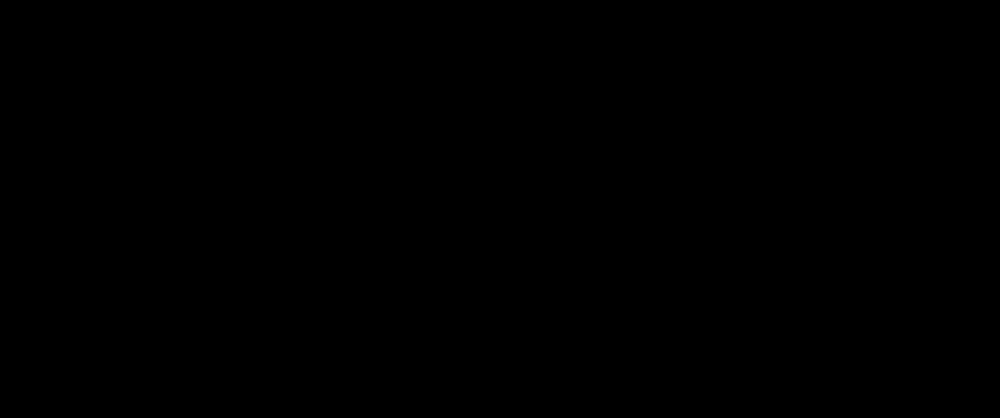

# P3：L3- 几何先验1 - ShowMeAI - BV1af4y1w75v

all right。

uh good then we're ready to get started，for，uh for joining uh very exciting excited，to uh to be here。

uh i'm going to give present the third，lecture in our series on geometric deep，learning。

with the topic geometric priors part one，john will do part two so in this lecture，we're going to。

uh look at or take a bit of a closer，look，at some of the geometric priors namely。

symmetry and skill separation，that will allow us to to better tackle，these，dimension cursed problems。

and specifically we're going to take a，look at some of the underlying。

mathematical ideas such as groups，representations invariants and，equivalence。

so the outline for today is that i'll，first，discuss the notion of domains and，signals。

domains being things like grids graphs，manifolds and so on and the signals，being the data that lives。

on those on those domains then i'll talk，about symmetries，uh various ways in which symmetries。

appear in machine learning in general，and in geometric deep learning。

in particular we'll study some of the，mathematical concepts like groups。

group actions and group representations，and how this group acts on the on the，space of signals。

and then we'll talk about how to use，this in deep learning，using the concept of invariant and。

equivariant，functions or network layers，so let's begin with a quick recap from。

from the last lecture by，john where we talked about learning in，high dimensions。

so we saw that in general uh learning，and meaning in this case supervised，learning。

in high dimensions is intractable the，number of samples，grows exponentially with dimension i。

in geometric deep learning however that，we don't just deal with。

generic data arbitrary distributions of，points in a high dimensional space，some kind。

of space and because，of this fact and because these spaces，and thereby the。

the spaces of signals have certain，structure，learning can become tractable via the。

principles of symmetry，which i'll cover in this lecture and，skill separation which will be covered。

in the in the next lecture，so also remember that，as johan discussed there are three，sources。

of error in uh uh learning that we，all there's，approximation error uh so if your。

your function class uh is too small，uh so that the true function that you're，trying to estimate。

is far outside of this this class you'll，have a high approximation error。

so this suggests that you want to have，a large function class on the other hand。

there's statistical error，which means that given a finite sample，you're going to。

likely not find the true function，there's going to be some kind of error。

and this kind of error will grow as you，grow your function class so from that。

perspective you'd like to have a small，function class，and finally there's optimization error。

which relates to，how well you can actually find the，optimal hypothesis in your hypothesis。

class with some some data，and although that is a very important，and interesting topic we're，uh。

it seems although this is not fully，understood it seems like。

actually many deep networks although the，loss functions aren't convex we can，actually。

solve this optimization problem quite，well，now what we're going to do with these，geometric priors。

is that by using geometric priors for，instance by using equivariant networks。

networks that respect the symmetries of，our problem，we can decrease or the size or，complexity。

for for instance only admit equivalent，neural nets，which will decrease the statistical，error。

hopefully smaller hypothesis class，smaller statistical error，less risk of overfitting and hopefully。

it'll do that without discarding useful，hypotheses，so if we know for sure that the true。

function we're trying to approximate，respect to symmetry is x variant then。

limiting to equivariant functions would，not increase the approximation error。

and at least not if our function class，is a universal approximator of，atmospheric functions。

okay so let's look at these geometric，domains so in geometric deep learning，the data，example。

where it's not true basically always，lives on a domain that we will，denote by omega so some examples。

are grids groups graphs and，manifolds where you deal with geodesics。

and gauges you know we couldn't use，manifolds because it's not this doesn't，start with the g。

so that's why we have these the domain，is always a set，that's that's typical。

in mathematics your domain is some kind，of set but it may have different kind of，structure。

so for instance in the case of a grid uh，you might think of that as having。

neighborhood structure just like in a in，a graph you can say。

which nodes are connected to which nodes，and you might also endow it with。

uh really a metric structure，saying how what is the distance between，points。

the same you can do on a on a manifold，like this sphere or this。

this human figure you can measure the，distance of points，along the along the surface that's part。

of the structure，so the key message of geometric deep，learning is that we want to。

design neural networks uh for uh，for processing geometric data if we want，to do that。

those networks should respect the，structure of the domain whatever the，structure may be。

there are many choices and as we，we will show in this course many of the，popular architectures。

although it's not always described in，this way they implicitly assume，then。

the the the these networks actually，respect that that structure。

and that's one of the reasons why they，work well，all right so we've discussed the，couple of，data。

is not a domain itself，our data isn't the grid it's the signal，on the grid or signal on some other。

space，so what's the signal well signal，essentially is just，a function we typically denote it by x。

uh it's a function that takes this input，an element of our domain omega and it，outputs。

a vector in some vector space c，uh where the dimensions of c are，typically called。

channels so simplest and most，common example is where our domain，is uh a grid so we can。

mathematically describe that as uh zn，times zn zn being the set of integers。

zero up to n minus one the cartesian，product give you，gives you a grid and a signal is。

described as a function taking some grid，point，and mapping it to r3 a space of rgb。

values similarly we can do，the same for a graph so here we have a，molecular graph。

where now our domain is this set of，nodes which we could for instance。

label by the numbers 1 through n and，in this example if we just ignore the，geometrical positions。

uh we we could say that um，this molecule is described as a function，from this graph。

to the set of or sorry to to，a vector space of dimension m where m is，the number of。

atoms that uh we can uh uh we can just，that we that we care about in this，problem so um。

the uh there might be carbon atoms，nitrogen oxygen，and for each node in the graph each atom。

you assign a one-hot vector that tells，you which kind of atom，uh so the we then have the the space。

just，well the set of all functions of this，signature of，all kinds of uh signals on this space。

sometimes you，want to include some regularity，conditions as well but we won't。

want to go into that here so that's our，data space，it's denoted by this this script。

x and sometimes we'll indicate，the domain and the，space of channels it's omega and c。

sometimes we'll leave that out if it's，if it's clear but x，now this space of signals has an。

interesting structure，so if we think about the domain，the domain could be a vector space。

for instance if you have a continuous，planar continuous plane r2，it could be the the domain。

that you use to to model uh images，there you can add points but if you have。

say a graph we don't have any notion of，addition of nodes in a graph。

and nevertheless the space of signals，will always have，a vector space structure that is to say。

we can always，add two signals and we can always，multiply，signals by a scalar so mathematically。

this is described by the equation that，we have here，we have two signals x and y shown here。

as the two，images these two squares，and we have scalars alpha and beta real，numbers。

and then we can form the signal alpha x，plus beta y，we can evaluate it at a point u that's a。

point in the in the plane，and this addition is just defined point。

y so we evaluate the first function at u，and the second function y at u and we。

linearly combine these，numbers uh with alpha and beta and，adding them。

and you know the result is just a，composition of these two，images as you see，that。

the space of signals uh is a vector，space，if the domain itself has an infinite。

number of points then this will be an，infinite dimensional vector space but a，vector space。

nonetheless and of course whenever we're，to have to，now there's more because this。

vector space we can typically also make，it into an inner product space or。

a hilbert space if you want to use a，so to define this we need two。

ingredients first of all we need to，start with an inner product，on the space of channels so that's。

typically very easy，the the channels is typically finite，dimensional vector space。

rn so you can just use a standard inner，product there，and we also need something namely a，measure on。

omega and a measure is something that，allows you to essentially，uh well measure the size of sets uh。

subsets of omega，and using that kind of structure you can，define an integral，the。

uh on signals you know the inner product，between x and y，as the integral over omega of the。

inner product between this the the，feature vector at u，of x and the feature vector of at u of。

y uh where this integral is defined with，respect to this，this measure now that's a whole lot of。

complicated uh，uh mathematical setup that we have here，but uh in most cases it boils down to。

something pretty simple so in particular，if omega，is a finite set uh then you can use。

something called the counting measure，a，sum over omega and in that case i think。

you you can quite easily recognize，uh that this looks like this equation。

here looks like an inner product，on a finite dimensional vector space。

because we're summing over the points of，omega just like you're summing over the，dimensions。

of a vector space when you do an inner，summing，a product uh in this case inner product。

of the feature vectors，and you can check that this indeed，satisfies the actions of the inner，product。

and the reason we need this is that we，want to do，pattern matching right when we do a。

linear layer when we do a convolution，we somehow need to compare our signal x，to some kind of filter。

y all right so conclusion，the space of signals is a hilbert space，as long as we can define these two。

ingredients in the product on c，all right then there's another layer of，subtlety。

we won't really be using this in this，lecture but，i think it's important to at least be。

aware of this，so so far what i've said is that a，signal，is a function on omega so what does a。

function do well it takes an element u，of omega，and it maps it to some element x of u。

in c for every pixel，it assigns an rgb vector for example，now there's something slightly more。

general which is，called a field in physics or in，mathematics it's called a section。

of a bundle of a vector bundle to be，precise，function，where instead of mapping u in omega。

to some x u in fixed space，c you're mapping it to，a an element of a vector space c。

that's indexed by u so，to make that more intuitive we can look，at this figure。

here of a vector field on a on a mesh，so vector field assigns to each point，lies。

in the tangent plane to that point，so every point on the manifold has a。

tangent plane you can see that uh，drawn here on the sphere the the the。

best linear approximation of the of the，manifold there is one way to think about，it。

and the vector of the vector assigned to，the point u has to lie，in that uh in that tangent plane but。

there's a different tangent plane for，every point so essentially you're，be。

modeled using the theory of fiber，bundles，but as i mentioned we're not going to。

talk too much about that just good to be，so uh in some cases so so far i've said。

that the data are signals on our domain，there are some cases where actually the，domain itself。

is the data so uh one example would be a，mesh，so you can think of your yeah your mesh。

is a is a domain，um but where we just want to process the，mesh itself。

another example could be point clouds，where each point just has a position in，space。

and no other associated features，so to deal with this there are some some。

tricks people like to use such as for，example，uh using the graph adjacency matrix。

so the matrix with n of size n by n，where n is the number of nodes，uh where you have an entry one in。

position i j，if note i is connected to node j and，zero otherwise you could think of that。

as a signal on omega times omega so the，the space of，pairs of nodes in your graph。

if you have a manifold or a mesh you can，use something called the metric tensor。

and this is this is an intrinsic，quantity associated with the the the。

the mesh uh you can view that as a，signal，so there are ways to turn the domain，into a。

okay so now we get to the to the core of，this lecture，we're going to talk about symmetries so。

what's a symmetry，well here's a simple definition a，symmetry of an object。

is a transformation of that object that，leaves it unchanged，so here's a very visual intuitive。

example，if our object here being referred to is，a triangle，we can do certain transformations to the。

triangle that don't change it so we，could rotate it，by two pi over three uh and that will，just。

place every point in the triangle onto，another point in the triangle。

and the shape overall is unchanged we，can also flip，it horizontally via in let's say。

in a vertical line，and again it doesn't change the object，so we're going to talk about these kinds。

of diagrams in a second but，what you see already is that we have，here six possible。

configurations of the of the triangle uh，and they're related，these transformations uh these。

symmetries they can be somehow composed，for instance we can，start at the top and apply rotation。

another rotation，and another one and we get back to where，we started，the。

structure uh of the of the of this，set of symmetries called the group，uh all right um so。

symmetry so so so here we have a very，visual example right this is this is。

intuitive we're all familiar with uh，symmetry，of this kind but in mathematics in。

physics and also in geometric deep，learning，uh the the word symmetry takes on a。

slightly more abstract meaning，because this word object that we have。

here in our definition can also be，interpreted，in a much more abstract way so we're。

going to look at a couple，of examples of how symmetries appear，in machine learning so the first one。

is actually not going to be a focus of，this lecture but it's interesting to，know about i think。

this is what we call symmetries of the，parameterization，so we have a couple of ingredients we。

have again our input space，x this could be space of signals but for，for this。

slide it doesn't matter what it is it's，some vector space x，we have some output space y say a space。

of labels，and we have a space w of weights or，parameters，then we have a model typically let's say。

neural network，that maps an input point and a weight，vector，to a label then we would say that a。

transformation，g which maps the weight space，to itself is a symmetry of the，parameterization。

if this equation holds if it is the case，that，um that，[Music]，if we apply g to our weight vector。

and then do a feed forward pass using，this input x we get the same。

as if we did the forward pass using the，original weights，so one example of how this happens is。

if we have a neural network here's a，very small simple network，and we can we could swap the nodes。

and their associated incoming and，outgoing connections，we can permute them for the neurons。

within a single layer，and you can see that this will will，of the，uh you know the final outputs are。

computed by adding，over all the input connections and then，the order。

uh of the of the inputs doesn't uh，doesn't matter，the the eternal the hidden units。

and it won't change the function being，being learned now this could be relevant。

if for example you're doing something，like bayesian inference，uh if you're doing bayesian inference。

you might have a prior，over your weight space you might say i，think this。

kind of weight vector is more likely，than，than this one but if those two weight。

vectors actually specify the same，function it doesn't really make sense to。

say one is more likely than the other so，you might want to deal with that。

symmetry it's not something widely，appreciated at this point but i think it，might be uh uh relevant。

uh then we get to uh another kind of，symmetry，uh as it appears in machine learning uh。

this is a symmetry of the label function，this is what we'll be talking about，data。

our input space and uh y or output space，and now we consider the label function。

the true function that we're trying to，approximate which maps inputs to。

outputs to labels and then we have a，transformation g，now it doesn't act on the weight space。

but it acts on the input space，g，could be a rotation of the image。

and we will say that g is a symmetry of，the label function，if you know remember the definition if。

it leaves this thing，unchanged so if we pre-compose l with，g that is to say we first apply。

transformation and then we compute the，label，that should be the same as just。

computing the label right away，if this holds we say g is a symmetry of，this label function。

so we know many symmetries like this in，in problems like，computer vision rotating translating，images。

scaling them etc typically doesn't，it turns out that actually you can think，of all learning。

as uh or at least all supervised，learning as learning about symmetries，space。

x that's the gray set and let's say we，have two classes，uh with the two different colors and。

within these classes live a bunch of，points those are，that，any invertible map on the space x。

that respects the class boundaries，class，to another point in that class will be a，symmetry。

of the label function so，if we knew all the symmetries of our，label function l。

then we would effectively know these，classes because we could start。

at one point and we could apply one，symmetry a bunch of times and maybe，another symmetry。

and so on and we would reach every other，point in that same class and so。

in this way we can learn that all of，these points should have the same label。

and so at least up to uh you know，permutation of the classes up to，actually figure out what。

what label should belongs to each of，these two sets in this case。

uh we solved the problem if we know all，the symmetries so that tells us，something。

it's first of all it's kind of an，interesting way to think about。

learning but it also tells us that if，our learning problem is non-trivial that。

is to say if we actually believe we need，learning to solve this problem。

we can't hand code it then we should，also not be not expect，that a priori we can know all the。

symmetries because it's essentially，equivalent，to knowing the label function at least。

up to a permutation of the of the，classes，so if we can't know all of the。

symmetries of our label function a，priori what are we going to do。

well it turns out that at least in a，large class of problems，the ones that we refer to as geometric。

deep learning problems，uh there's a there's a source of，symmetries that comes from。

the domain on which the data moves，so here we are again we have our domain，omega。

and uh we say that a transformation，g of this space omega is a symmetry of。

omega if it preserves the structure of，omega，so that is deliberately vague you could。

using very abstract mathematics make，precise what we mean by structure but。

for now i'll just give a bunch of，examples，so if our domain is just a set。

uh then you know what is the structure，of a set well set membership。

is uh is all you can say you can only，only say whether an element。

is part of the set or not nothing about，the order，nothing about the relation between。

different elements in the set，and uh so a permutation of the elements。

of the set preserves the the structure，here if we have a euclidean space。

such as omega equal to r to the d，let's say a plane and let's say we。

we consider this not just as a manifold，but we consider it as a metric space so，we。

we can we think the distance between，points is uh，is part of the structure of this this，space。

then the symmetries would be euclidean，isometries，i。e distance preserving maps things like。

translation，rotation reflection you can easily，visualize and see that these don't，change the。

the distances between points，if on the other hand we consider r2 or，really any manifold。

uh only as a as a smooth manifold so we，don't，end out with a metric uh then。

any kind of diffiomorphism any kind of，sort of smooth，warping of the domain can be considered，on。

what you define exactly to be the，structure of your domain，now we can observe a couple things。

about symmetries what we're going to do，is we're going to consider this。

a single object or single domain let's，say and then we consider the set of。

all symmetries of this uh of this object，so we can observe a couple things about，this set。

first of all we observe that the，identity transformation，is always a symmetry if we don't。

change anything of course nothing，changes，then we can see that given two symmetry，transformations。

their composition so doing one after the，other is also symmetry，so if uh we think about the triangle。

again for instance，uh we rotate it by two pi over three，that leaves the triangle invariant if we。

do it again，uh that still loses the variance so uh，the rotation by，uh 2 times 2 pi over 3。

is also a symmetry so composition of，symmetry is a symmetry，so it's also in the set of all。

symmetries of the object，and finally given any symmetry it's，inverse，is also a symmetry if we have。

uh the object our grid if we shift it，clearly both of those are our symmetries，so we can formalize。

this uh and the the object that，formalizes this this，these uh these uh properties uh。

is called a group we will denote it with，this uh，factor letter g so，a group is a set g with a binary。

operation，which we just denote by putting one，letter after the other just the position。

uh satisfying the following properties，so first of all，associativity um。

that the the order of multiplication or，where you put the brackets uh is，irrelevant。

in either case if you have g h and l，this means first you do，identity so this is our first。

observation on the previous slide，the every group every symmetry group has，to have。

a unique element e in the group，that satisfies uh this equation if we do。

any transformation followed by the，identity，or it's the same as doing the identity。

followed by that transformation is the，same as just doing that transformation。

and inverses so meaning that for every，element g，there exists a unique inverse which。

satisfies the equations for an inverse，uh and closure so every pair g and h in，our group。

the composition or the the group product，applied to these，two elements is also an element of the。

group so this is essentially an，abstraction of，the the set of all symmetries of any，given object。

so it's good to keep this uh a couple，different notions，straight so first we have this idea of a。

symmetry group，uh so a common way to define that，is to say a symmetry group is a group。

host whose elements，are actually transformations they're，functions of some。

domain and then the group operation is，the composition of maps。

you know you learn this when you study，functions you know how to compose maps。

and this is always associative，and，[Music]，this is so this is one natural way to。

define a group operation，but in the abstract study of groups，which you might run into when you。

look at some mathematical text the，elements of the group are not assumed to。

be functions they're just，elements of a set uh and we have some，synthetic。

composition rule that satisfies the，group action，those are the group actions and then。

finally if you if you use that approach，you can define you you you can define。

something called a group，action uh which is a function that takes，a group element。

and an element of uh the，of the domain omega and maps it to a new，element of the main omega。

satisfying certain natural actions，but regardless we'll mostly be thinking，about。

the concrete crate the case of symmetry，groups，where we think of our group elements as。

so here's a here's a simple example of a，group action，so we can think we could take the。

example of uh，the euclidean group so an element of，this，of the euclidean group in。

two dimensions has rotation，components let's say you call it as an。

angle theta and a translation component，in the x and y direction。

and we apply it to a two dimensional，point x comma y，well one way to do it is to form this。

matrix which has a rotation matrix here，and a translation part here，to。

produce the rotated and translated uh，version of this of this point yeah and。

you can it's a nice exercise to verify，that this indeed satisfies the actions。

all right so if our group is finite，and discrete we we can，there's a there's some there's two nice。

ways and can，think about the structure of this group，so here again we have this。

figure for the group of symmetries of a，triangle，and this kind of figure is called the，kali diagram。

so every every node in this diagram，is some configuration of the object。

but we can also identify it with a group，element so if we take this top。

element and we identify it with the，identity element we say this is sort of，the canonical。

orientation of this object then we can，take for example the the rotation。

group element and apply it to the，triangle and we see we get to the。

rotated triangle which as a triangle is，unchanged although the corners as you，can see get。

permuted so we might also associate this，triangle here with the rotation element。

r we can apply it again and we get we，get to the element，r squared r times r which is an element。

of our group and so on and we get back，to the identity，and you can see how these。

transformations compose in an，interesting wave，for example if we start at the identity，and we flip。

and then rotate we end up here if on the，other hand we，first rotate uh。

let's see am i i think actually there's，a mistake in this diagram yeah。

uh sorry about that so for this group it，should be the case that if you flip，if you。

first rotate and then flip um，you end up in a different position this，shows the non-commutative。

nature of this，uh i hope i'm not making any mistakes，here but，that's you see the structure of the。

group reflected in diagram，another way to think about the structure。

of the group is fierce multiplication，table so what we have here is on the。

other on the uh in the in the rows，uh we have every element of the group。

and also in the column again we have，every element of the group and looking，at any。

uh any entry in the interior of this，table，we see what you get if you multiply uh。

two of these things so for example，uh if we have a rotation and，the rotation twice done twice we。

multiply them we get to the identity，so that that makes sense right that's。

this rotate rotate and rotate to get，back to where you started。

all right so this is a nice way to get，some intuitive understanding of finite。

groups but there are actually many kinds，of groups and most，of them are not finite and not even。

discrete in some cases so very broadly，we can divide groups into two kinds we。

can think about discrete groups，and continuous groups and maybe even，differential or。

lead groups so in the discrete group you，could have finite groups like this。

group of let's say rotational symmetries，of the triangle，or rotational reflection symmetries that。

we looked at on the last，slide and the set of discrete groups，also includes。

infinite ones like countably infinite uh，discrete groups such as translations。

of the uh of the set of integers，or the infinitely extended grid is，z by z continuous groups can be。

divided into compact groups，things like two-dimensional rotations，such as。

continuous translations or rotor，translations，are into the d or sc and especially，including。

rotational translations there are even，non-locally compact groups which are。

intuitively you can think of it as，um well i'm not going to try to，define that but but uh。

there's for instance this infinitely，dimensional，group of diffiomorphisms which are sort。

of the hardest，to get a mathematical handle on and for，all of the above。

cases uh you can think about commutative，cases，like the group of two-dimensional。

rotations in two dimensions where the，order doesn't matter，or non-commutative ones such as。

rotations in three dimensions，where the order does matter all right so，as i mentioned。

symmetries acting on our domain omega，will also，uh immediately act on the space of，signals。

uh this is defined uh via this equation，so we have our signal，x and we have an uh element g，g。

on uh signals x and，this transformed signal if we evaluate，it at a point u in the domain。

it's equal to the original signal x，evaluated at，g inverse u so。

x please excuse the hand-drawn figure，we're still working on this book and，working on better figures。

but what this signifies is that we have，our group and we start off with。

a group action on the domain which could，be grid，sphere graph manifold etc。

and from there we get a an action on the，on the space of，uh of signals so let's look at an。

example translating an image，uh so here g is a translation with some，x and y component。

we have here our image this is the uh，on the right we have here our original，image。

uh and we see that this bug is going to，move from the left hand side of the。

image to the right hand side，so that's a t is some positive，number translating along the x。

direction and to get the，value of the translated image gx，at the point u which is somewhere let's。

say on this on this bug，what we have to do is we have to uh look。

in the original image at the point uh，u minus t to to see what the value was，there。

because this value u minus or this point，u minus t is going to translate。

to the point uh u if we apply a，another reason why we have this inverse。

so in this case the minus and in the，previous equation here we have this g。

inverse is that without it uh you，wouldn't satisfy the actions of。

the axioms of a group action and that，is another exercise that you can you can，try to show that。

uh with this definition here we get a，valid group action，now one interesting observation。

is that again whereas the domain may not，have any kind of vector space。

structure the space of signals always，has a vector space，structure and this group action that we。

just defined，is actually linear in the signal so here，we have uh。

i've repeated the definition of a group，action，on signals and here i've written the，condition。

for linearity so what this means is，if you have some linear combination of，signals and that we apply。

our transformation g to that that should，be the same as applying g to the，individual。

signals and then linearly combining，those signals and so here we see that we，have one signal，we now。

go to the bottom of the figure we apply，a translation in this case。

uh vertical translation uh we see that，while applying this vertical translation。

this vertical translation and then，adding，is the same as first adding the images，on the top。

and then translating the resulting image，so you see the action on signals。

is linear now linear group actions，are also known as group representations。

so here's the definition an，n-dimensional real，representation of some group g is a。

mapping row that takes an element of our，group g，and maps it to an n by n matrix in the，case of。

at least a finite n-dimensional vector，space，and so this assigns a matrix this matrix。

is always invertible，kind of，homomorphism property as it's called you。

can check again that the definition i，just gave for how the group acts on the，space of signals。

uh satisfies this this condition so，that's a good representation，could be。

the set of integer translations in one，five，these kinds of things the group。

operation is given by plus by the，addition，of integers as our domain we can take，the set。

z5 zero one two three four uh，maybe this is uh well it's artificially。

short but it could be some audio，signal for example domain of or the。

sample points of an audio signal，and we have an action over group g where，now the elements of。

this group g are integers n uh，we have an action on omega that sends，each point to that point。

plus n mod five so we have sort of a，cyclic shifting，operation here and then the，representation on。

signals on omega so first of all this，space，is five dimensional space because we。

have in this case five，sample points in our domain so it's a，five by five matrix。

and here it is again we saw it in the，first lecture it's the shift operator。

and if we want to do uh you know，represent the element，n we would take the shift operator and。

take it to the nth，matrix power and the way it acts on our，signal is if we have a five-dimensional。

vector，we apply let's say row one and it，performs a cyclic shift on those those，values。

so the important thing here to notice is，that our group，may have some number of elements in this。

case infinite，sometimes it's a finite group sometimes，it's a，continuous group with a certain number。

of dimensions，but this is completely independent the，size and structure of the group of the。

dimension，of the representation the dimension of，the representation is the dimension。

so we can look at a couple examples of，symmetries，for the different g's so in the case of。

the group is the symmetric group not to，be confused with symmetry group it's a。

symmetric group the group of，permutations on and，elements the domain uh could be the。

set of nodes or vertices or possibly，also instead of edges，uh and we can distinguish three kinds of。

graph features uh each one corresponding，to a different，representation of this symmetric group，sn。

so first of all for let's say we're，classifying the graph，then for the output we will have one。

number and clearly if we permute the，nodes of the graph it's still the same，graph so we want。

that to not change so this can be，captured by choosing for the output，space。

the uh something called the trivial，representation，uh，if we give it some permutation say。

permutation that swaps the first，and second element of the set of nodes。

uh and we apply it to s that's a vector，uh in our space of signals in this case。

a one dimensional vector，this，trivial representation still satisfies，is。

what you would want the output space to，uh to transform like then if you have，some。

features associated with the nodes let's，say here we have a graph with four。

nodes so we have four four dimensional，signal，then uh the representation row one。

uh of of this permutation，uh is just this permutation matrix，applied，to our vector of mode features。

and finally if we have edge features，or let's say an adjacency matrix or，something like this。

we would use something called a tensor，feature，where the representation row 2 of this，permutation。

acts on the matrix m in this way and，again you can check that the actions of，a group representation。

realize，is that there are really two kinds of，symmetries，at play here so first note that a graph。

or even just a set，is actually an abstract object what we，have in our computer。

is just a sequence it's essentially a，description，of the set uh but it has some extraneous。

properties like the order，of the uh of the elements of the set or，the nodes of the graph。

and usually we're interested in the，symmetries of this description。

rather than the symmetries of the object，itself，so to explain that a bit i have this，this graph here。

and if we choose labels for the nodes if，you choose an ordering。

we can write this graph as an adjacency，matrix like this，the ijth entry says that has a 1 if。

node i and j are linked by an edge，then if we apply some permutation we'll，permute the rows and。

the columns of this matrix and we get a，different matrix，so this is a symmetry of the of the。

description we have here a different，description of the same graph。

that's what we want our network to be，invariant or acting variant to。

but there are some but you can also see，that this graph itself。

has some kind of symmetry so if we swap，if we do another permutation。

where we just swap node three and four，both of which sort of play the same role，in this graph。

you see actually that the the，representation，uh doesn't change the adjacency matrix，is the same。

so that's another way another notion of，symmetry here that's a symmetry of this。

particular instance rather than，our way of encoding graphs，it's good to keep those straight all。

right for grids，we have as groups discrete translations，rotations flips。

the domain is the set of grid points not，shown in the diagram but，you know what what we mean and our。

representation is a regular，representation so we could shift and，these cases can be generalized to。

the setting of general groups and，homogeneous spaces which we'll cover。

in lecture eight so their g is uh uh，it could be essentially any group。

typically we choose locally compact，and we have a space called the，homogeneous。

space which means that for any two，points in this space there's at least，one symmetry that。

maps one and pointed to the other and，for these cases we can give a very，general。

uh uh discrete uh general theory of，secondary，nets and finally there's。

manifolds or geodesics and gauges if you，want to stick with the 5g。

theme so here the group g is the group，of gauge transformations，frames。

of these feature spaces so here we have，our again our vector field。

remember a vector field assigns to each，point in the manifold a vector in the，tangent plane。

at that point but to represent such a，vector numerically you need to choose a，frame。

in the tangent place a plane and，changing this frame，will change the numerical representation。

of your data，so that's called the gauge，transformation because and。

we'll cover that in one of the later，so i'm running a bit short on time so，i'm actually。

going to skip this slide，we're going to talk about invariance and，equivalence so。

we let's say we have a，symmetry of the label function here，we're trying to classify。

letters a and b the letters might appear，in different fonts and also different，orientations。

so we have our symmetry uh corresponding，to rotations of the digits。

and clearly if we know that this is a，symmetry of the label function。

then it would be nice if we can form，some invariant representation where each。

of the rotated versions of the same，letter，is represented by one uh，one kind of feature vector。

then our problem becomes easier you can，see here we only have four points in our，space。

whereas here we have four times four，points so the learning problem should。

become easier if we have an，invariant representation however in deep，learning。

uh it's often not a good idea to build，an invariant representation at least not。

too soon so the reason is the following，so to recognize a whole object。

we first need to recognize the parts of，that object，but if we make the intermediate。

representations the representations of，the parts if we make those invariant，uh。

so if we have an image and we rotate the，whole image，then you know this identity is is，preserved。

but if we rotate the parts clearly this，is no longer，uh a correct phase because the the。

the parts are in the wrong relative，spatial configuration，so if we were to form a representation。

of this，image of the that is invariant，has an invariant representation of each。

of the parts so we have here we detect，an i，regardless of its orientation and those。

here regardless of the orientation etc，then this kind of image would yield the。

same representation we just rotated each，part，but clearly something is wrong about。

this is no longer a proper，phase so we want to exploit the symmetry。

but we don't want to make an invariant，representation of the parts，uh and to make an invariant。

representation of the whole we first，need to recognize the parts so so what，are we gonna。

do well the solution，as many have noted is to use，general，setup for an equivarian network we have。

our feature spaces，uh x0 that's the input space we have x1，x2 x3，f2，f3 it could be linear layers。

couple，extra ingredients beyond what you have，in the normal neural network。

then first of all there's a symmetry，group，and secondly for each feature space i。

there's a representation row eye of that，feature space that acts on it。

so the simplest example might be an uh，planar image，and you have let's say an rgb input so。

we have n by n pixels，and three channels so feature space x is。

n by n by three so we have an n by n by，group，g which could be translations and maybe，our x1。

is the output of a convolution layer，with 64 channels and so now，our feature space is n by n by 64。

dimensional so that's a different，representation，of the same group g of translations。

and we say that the network is a variant，if this equation is satisfied。

if we which you can also understand from，this diagram if we start say here at x0。

we apply a transformation using row zero，let's say we shift the image。

and then apply the first layer we should，get the same thing as if we first，applied the first layer。

and then applied the same transformation，but now acting via the，representation that we have in the。

feature space to produce，x1 these two things should be the same，give the same result。

if f1 and f2 and all all of the，layers of the network satisfy this uh，property。

then we say the network is actually，variant and you can show that，if each layer satisfies the active。

variance then also their composition，satisfies this is equivalent，so here's what it looks like a。

convolution layer is translation，equivalent i think we're all familiar，the convolution is standard。

convolutional network，is not rotation equivalent so that's，visualized here we have。

an image and we're going rotation and，here's a feature map produced by the。

the network and it seems maybe at first，sight to be rotating a little bit but。

it's also morphing in some weird ways，and that we see if we stabilize，this feature map i。

e if we undo the，rotation，in the feature space we see that this，thing is changing so this neuron is。

detecting，different things depending on the，orientation maybe in one orientation，another。

orientation it likes to detect buildings，or something like this，in a gcnn a rotation equivalent。

convolutional net，you can see that that the feature map，actually does undergo a rotation and。

stabilized view，so here's one way that we can，can understand the equivalence we have。

again here our equation，uh and we have again our problem of，classifying digits。

now on the bottom here we see our input，space with two marked points，x and y there are two signals。

and they lie on what's called an orbit，so if we take this letter a。

and consider all the rotated copies of，called，the orbit of this ladder and in。

particular there another there's another，point，uh row one g of x uh which corresponds，the。

of the a and similarly f4y，now we also have our network which maps，this input。

to some feature vector this feature，vector here is，symbolized by this generic letter a。

because we assume in this example that，the network has learned that it's a good，idea to map。

x this letter and why this other，font of the same letter a to this，generic a。

because it's maybe it should classify，the digit regardless of the of the font，so these are the same。

now in a non-equivariant network it，could be that，for the rotated versions of this these。

ladders they actually get sent，to different points in the feature space，by our network。

but you can see that if this were the，case the network could not possibly be，we take。

x and transform x and then apply our，layer，we should get the same as applying our，layer and then。

transforming but the same should be true，for y we transform and we get to，different points。

but if we first apply our layer we get，to the same，point as x is map2。

so it's unclear where where row 2 should，be sending this，generic letter a so another way to。

phrase that，is that an equivariant network was，generalized in a way that's consistent，with the。

symmetry if we think x and y should be，mapped to the same points then also。

their transformed versions should be not，to the same points，um i often get asked about。

uh you know why not use data，augmentation，of course data augmentation is very，widely used。

and uh it's easy，various，advantages and disadvantages the most。

important argument i think in favor of，equivariance is that with certain。

problems where you really have，symmetries like say medical image，segmentation let's say。

histopathology slides you really have，translation and rotation symmetry。

in those cases we actually see that，equivalent nets just get way better，performance。

they get up to 10 times better data，efficiency，and so why could that be well one。

potential explanation，is that an equivariance constraint acts，in a layer wise fashion，you。

uh that that constrains the network as a，whole，the downside is that equivalent nets you。

you actually need to，think about how to implement it，depending on the particular method it。

can be very complicated，or just a little bit extra work whereas，augmentation tends to be very easy。

i should say that there's of course，train time augmentation the most common，where you augment。

training data as you're training and，there's test time augmentation where you，take a。

test image or test input and you apply，all possible transformations you feed，them all forward。

through your network and then you，this approach gives you guaranteed，active variance。

for test time augmentation and also for，equivariant networks。

but train time augmentation does not and，you can actually verify this you can，test。

a network trained with data augmentation，and you will see，it's not typically not equivalent this。

probably has to do with the fact that，you cannot show，every possible input combined with every。

possible transformation，to the to the to the network during，um maybe to in the interest of time i'll。

go quickly so，for uh one other downside of，augmentation is that it just doesn't。

work for very large groups so if you，have a graph with n nodes and being，large。

the symmetry group sn has a factorial，number of elements and so it's totally。

impossible to sample every permutation，not during training and certainly not，all of them。

for every test image so，in this case yeah everybody uses graph，networks that are。

ethnic variant because it's just，completely infeasible to，use augmentation all right so i'm going。

one i'll make a quick comment about this，which is that，there's some interesting research for。

instance from the clarity，team at openai that has found that，conventional networks uh typically。

trained with the data augmentation，actually learn to be at the variant，at least to some degree and。

interestingly the way that，these networks implement the，aquavariants in their weights。

is the same as what the theory which i，haven't covered yet but the theory of。

group equivalent convolutional nets，uh suggests uh for how to implement it，so that's uh。

some interesting background reading if，you if you uh if you're curious，uh。

symmetries are transformations that，leave some object，invariant there there's this notion of。

group which formalizes the properties of，the set of all symmetries of an object。

a couple actions like associative，activity identity，closure under composition and closure on。

the inverses，in machine learning we care about，symmetries of the parametrization。

and most of all about symmetries of，label function，and particularly the symmetries of the。

label function that arise from the，symmetries of the domain，these symmetries that of the domain act。

linearly on the space of signals，via something called a group，we。

use equivalent networks in an equivarian，network，each feature space is associated with a。

group representation，telling you how the group acts on this，feature space。

and each layer is equivariant with，respect to，these representations now invariance is，a special case。

where the trivial representation is used。

all right that's it and i'm happy to。

