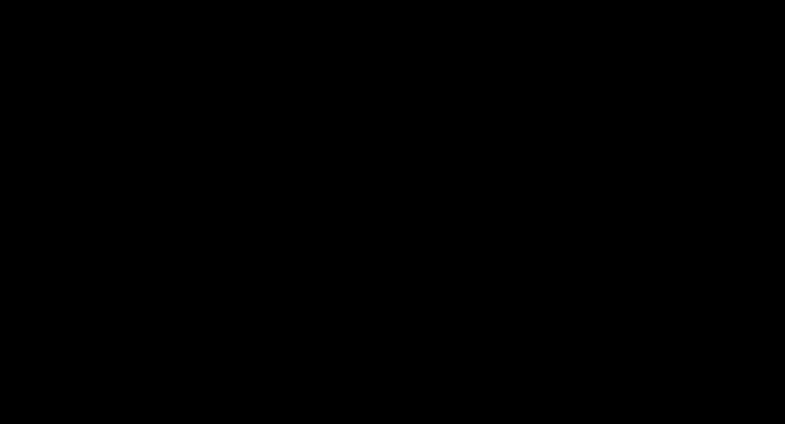
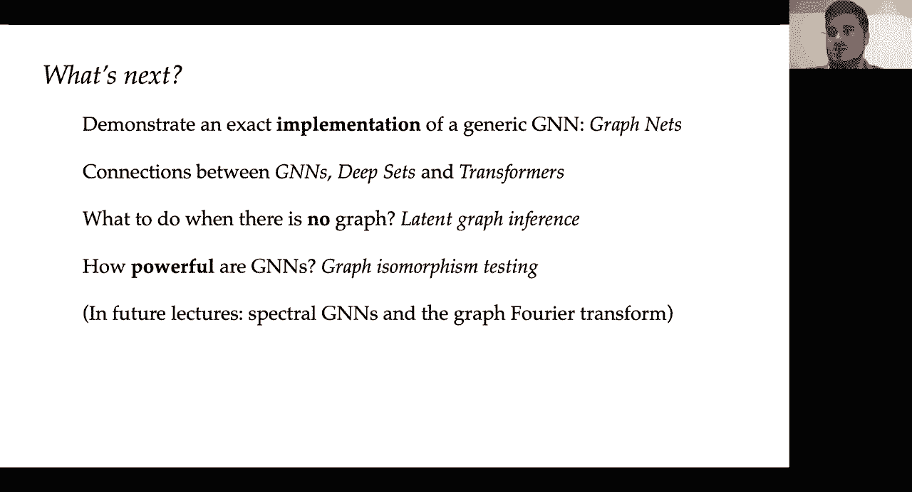
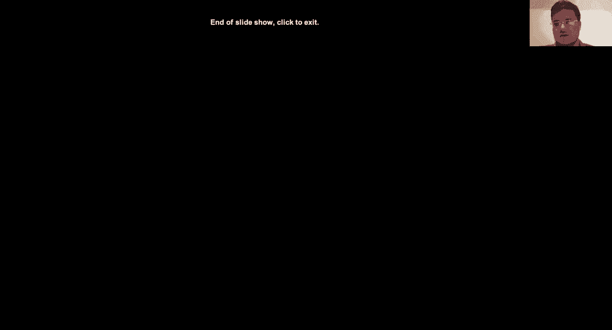
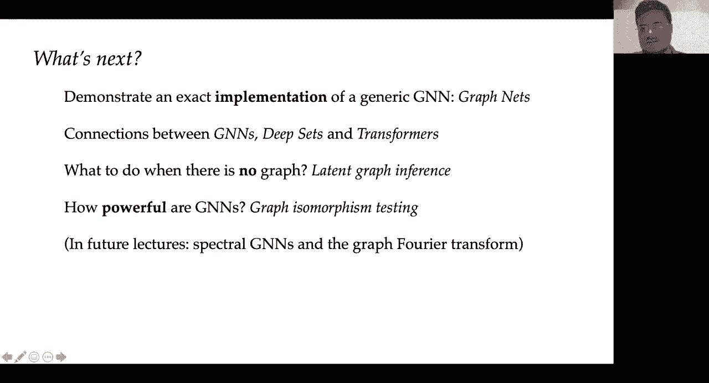
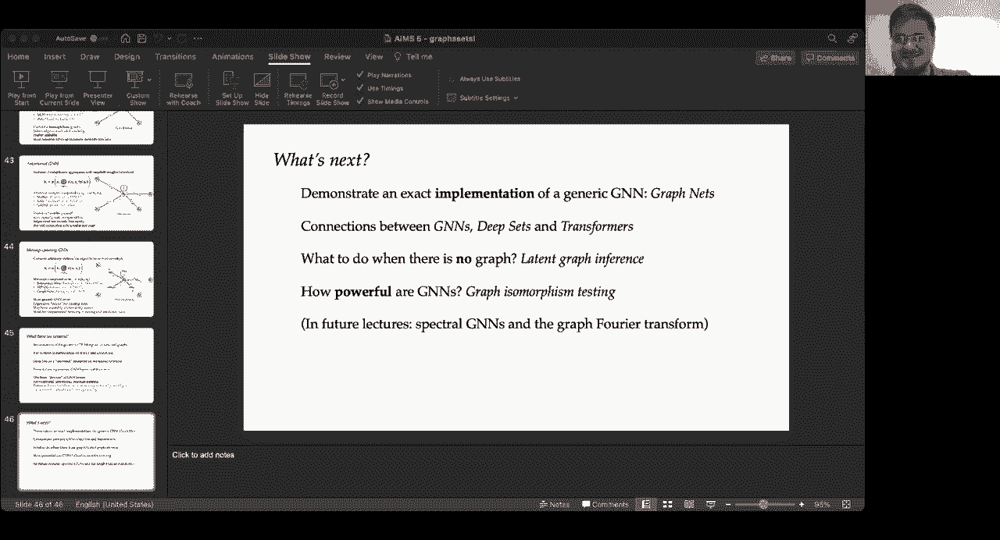
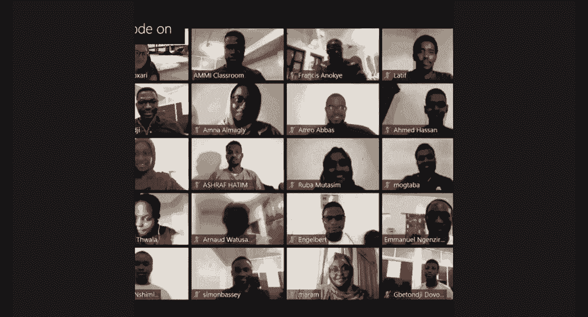

# P5：L5- 图与集1 - ShowMeAI - BV1af4y1w75v

uh so uh hey everyone thank you all for，uh coming to this uh lecture today。

on uh graphs and sets uh my name is，peter velikovic i'm a senior research，scientist at deep mind。

and uh over the course of today's two，lectures i'll be talking to you about。

permutation invariance and equivariance，and how it relates to。

processing data that lives on graphs and，sets，before we dive into these topics i will。

start by just giving a brief recap of，what we already saw，in previous lectures specifically。

you will have seen how to use a small，set of guiding principles，such as symmetries equivariance。

invariants locality and scale separation，and using those guiding principles you。

showed how it was possible to synthesize，and steer the design of deep learning，architectures。

which is potentially quite useful，because，using such a blueprint we might be able。

not only to make sense of，all the variety of deep learning，architectures being proposed today。

but also to reason about and propose，any new architectures that you might uh。

come across in the future，and the general blueprint that we have，derived in this sense。

uh concerns a set of uh，layer uh kinds of layers such as，equivariant layers which。

are in an equivariant way resistant to，transformations of a certain symmetry，group。

and also potentially with the addition，of，local pulling layers that can help you。

course in the domain，if that is required and finally as，equivalent layers give you answers or。

outputs for every single element of the，answer，over the entire domain uh we we can，often put。

an invariant or so-called global pulling，layer at the end，which will aggregate information from。

the entire domain and give you an answer，on the level of the entire domain and。

this is just uh a recap of the，uh of the building blocks，of the geometric deep learning blueprint，so。

uh it covers stuff like linear g，equivalent，layers that satisfy uh linearity。

and uh satisfy resistance to group，action in an equivariant way no matter。

which symmetry group transformation g，you take and featurization function x。

and the reason why we're okay to stay，with linear equivariant layers rather。

than some more complicated ones is，because in deep learning we typically，of。

uh point-wise non-linearities such as，sigmoid functions or tange or rayleigh。

and when you compose linear g equivalent，layers and non-linearities，you'll end up with universal。

approximators over the domains so，therefore this is a sufficient，construction that's。

employed by most geometric deep learning，architectures today，and as mentioned sometimes it might be。

useful to course in the domain so go，from，an initial omega to an omega prime which。

is slightly smaller and contains the，previous domain within it。

and if we need answers on the level of，the entire domain，we can use a global pulling layer which。

is invariant to the symmetry group，transformation，this should all be stuff that you have。

already seen in previous lectures from，michael taco and john so。

this slide is mostly there to kind of，make sure we're all on the same page，as we start to dive into。

the specifics of the blueprint，and one specific thing you might have，seen is that。

now with this blueprint in hand and with，the right choice，of a domain to run over and the symmetry。

group to use，uh you can actually rederive all of the，popular architectures such as cnns deep。

sets transformers lstms graph neural，nets，but also you gain access to a wealth of，information about。

all of these neural network，architectures that lie in the middle，such as。

spherical convolutions or mesh，convolutions that we will be talking，about in more detail。

as as we proceed with the course so，it's a very powerful blueprint not just。

for making sense of and unifying，everything that you might have seen，before。

in deep learning but also something that，might help you expand your views and，reason about。

domains that are not necessarily that，standard nowadays，and what we'll be focusing on today is。

showing this geometric blueprint in，action so we're going to deeply dive。

into how the blueprint works on the，domain of，graphs and sets this means we'll be。

studying models such as graph neural，networks for gnns，deep sets and transformers。

and there's a question here to be，answered immediately because you know if，you。

start to learn about deep learning，typically the first architectures you，will encounter。

are you know multi-layered perceptrons，and then potentially，convolutional neural networks or。

recurrent neural networks potentially，transformers，but you know all of these uh have been，such。

as simple grids and arguably it's，potentially，easier to specify a layer like this but。

there's a very specific reason why in，this course we're going to start。

by demonstrating the blueprint on graphs，and that is because graphs and sets。

give us a very nice discrete domain with，see，exactly what those assumptions are in a。

bit and this makes，uh models and graphs and sets very easy，to analyze。

like it's going to be much easier to，reason about their properties than。

when we move on to domains with a bit，more geometric constraint。

and also kind of conversely because if，you squint hard enough，literally every domain you'll ever。

encounter can be seen，as a graph and as a result pretty much，all the architectures we're going to。

derive in this，course can be seen as instances of graph，neural networks。

so therefore also from a generality，point of view it makes sense to start，with graph neural networks。

and then retroactively as we go through，the course，show how many of the existing。

architectures relate to graft neural，networks and，exactly because of this generality for。

many many years，when people thought about geometric deep，learning or used the term geometric deep。

learning，it was nearly synonymous with graph，representation learning。

so also from a historical perspective it，makes sense to start with something like，this。

and there is a lot of motivation just in，general why we might want to study data。

that lives on graphs，and that is because graphs are pretty，much all around us。

in fact they can be seen as the sort of，main modality of data that you can，encounter from nature。

because for example you have molecular，graphs，where nodes are atoms and edges are。

bonds you can have transportation，networks such as the london tube map。

here and then also social networks such，as the facebook friendship graph。

or even connectome networks in the human，brain so，regardless of where you look it can be，seen as。

the modality of data that nature throws，at us is very often，graph structured and besides。

this like besides the fact that this，kind of input comes a lot in nature。

it's also coming a lot in various，industrial and scientific applications。

and as a result even though they are a，fairly recently emerging field。

graph neural networks are already，affecting，the lives of all of us everywhere。

in a sense that graphene networks are，already used to discover powerful，antibiotics。

uh they are currently used uh to，uh power food recommendations within。

uh uh social networks like uber eats，they are since quite recently used to。

design the latest generation of machine，learning chips，so google ai is using graph new networks。

to design，optimal layouts for tpu chips and as a，result，many machine learning practitioners will。

directly，reap the benefits of outputs of a graph，neural network。

and also a project that i was personally，involved in within deep mind。

we have used graph neural networks as，part of a system that estimates uh the。

travel time from point a to point b，which is a very important。

output that google maps can give you and，this system is now deployed worldwide。

and compared to the previous，baseline machine learning model that，google maps was using。

in some cities we have improved the，travel time estimates by up to a。

50 relative increase so uh because it's，currently serving all queries worldwide。

it is basically uh the outputs of graph，neural networks are impacting。

billions of users and enterprises on a，daily basis，so it's certainly a pretty exciting time。

to be studying graph neural networks，and the fact that，uh graphs occur so often，naturalistically。

is something that's been known to us for，a very long time，in fact here i have the quote from jay。

wright forester from the 1970s，where he says that all of the image of。

the world we see around us which we，carry in our head is nothing but a model，to be。

is a bunch of concepts and relationships，between them，and based on that we represent our。

entire knowledge about the world，and if you look at this concepts and，relationships idea。

you can see that graph the graph，representation is，a very natural way not only to represent。

data that comes from nature but also a，way to organize data when we're doing，reasoning。

and as a result if we do well in graph，representation learning。

will likely do really well on the path，to artificial general intelligence。

so also from a general kind of，improvement of artificial intelligence。

standpoint graph representation，learning is likely to be a very，important topic。

okay so hopefully this shows you why，it's a good idea to study data that，lives on graphs。

now what we're going to do is we're，going to discuss how exactly to process。

data that lives on graphs，but i'm actually going to start with a。

somewhat simpler domain i am going to，start with graphs that have only nodes。

and no connections between them you，might know such a structure as。

a unordered set there's a few reasons，why we're going to start with sets。

the first one is it's a simpler domain，so it's going to be much easier to，analyze the。

geometric architectures that arise many，of the conclusions that we get from sets。

will naturally carry over to graphs we，just have to incorporate the edges，somehow but。

most of the math will end up very，similar and，even if you restrict yourself completely。

to processing data on sets，this is still a super relevant area，because，point。

clouds or lidar sensors is naturally，represented，as the form of set and here you can see，a demo。

excerpt from a weimo video which shows，their self-driving car，and how it reasons about the world。

around it typically by using these，sensors that detect uh the shape of the，surroundings。

by basically a various number of points，which are fed back to the model so。

in order to decide how to act in a，self-driving vehicle，you need to make sense of this massive。

collection of points，and decide which of these points，represent uh other traffic signals which。

of them represents different，and then，use all of this to try decision making。

so even if we completely stay within the，realm of sets and don't introduce graphs。

we're still solving a potentially very，important problem，okay so as i said we're going to assume。

that we have a graph with no edges，nodes，v and in geometric deep learning。

we typically want to deal with，featurizing this domain in some way，so we will assume that node i has。

features，x i which is a real valued vector with k，dimensional uh features。

uh in the words of our geometric，blueprint，this corresponds to our feature space c。

so k dimensional real vectors are the，feature space that we'll be using。

and once you have these features a，typical way in which，you process data like this is you stack。

the node features into a node feature，matrix，x such that the i throw of this。

node feature matrix corresponds to the，features of the ith node。

now there's one very important thing to，note here in that，the very moment you've done this the。

very moment you've stacked the note，features in some way，you've specified an ordering of the。

notes and what i've said at the，beginning is we assume the sets to be，completely unordered。

so what we want what we kind of，naturally want of a neural network that，operates on。

x is that it should not depend on the，order of the rows in x，what i。

what we want there imagine i have an，unordered set of five nodes so x1 x2 x3，x4 x5。

and the x's are their features，and i want to learn some kind of。

functions some kind of neural network，that will take the features of these，individual nodes。

and give me an output on the level of，the entire set that i care about。

and what i want of this function f is，for it to be resistant，to the order in which i fed these。

features so，in case i completely perturb the order，in which i give the set elements but。

it's still exactly the same set，i want my function f to give me exactly，the same y。

and in terms of the geometric deep，learning blueprint，this translates to using the n element。

permutation group，as our symmetry group g and the，different，group elements uh within this symmetry。

group will be permutations so，the permutation will change the order in，which we see。

the elements in the set and we want our，neural networks to be，resistant to this so。

it will be useful in order to kind of，concretely，quantify this it'll be useful for us to。

think about what are the operators that，change，the order of the nodes and as just。

mentioned such operations are known as，permutations and for a set of n elements。

there will be n factorial many of them，and what's very fortunate for us。

is that we can stay completely in the，realms of linear algebra when we're，talking about permutations。

because every n element permutation，defines a unique，n by n matrix which is known as a。

permutation matrix，and such matrices have zeros almost，everywhere they have exactly one。

one in every row and column and the，exact positions of the，ones are corresponding to the order of。

the nodes in the permutation，so here you have an example of a，permutation matrix for the permutation。

two four one three and here you have，exactly，in the second fourth first and third。

column as you go down the rows，there are ones and the only effect that，this permutation matrix has。

is that when you left multiply it with a，node feature matrix like the one we，talked about before。

the only effect is that it's going to，permute the rows so there will be no，changes。

to the features themselves they will，just occur in different positions。

and if you remember our previous，discussion about，group actions row this permutation。

matrix is exactly，the representation of the group action，of the permutation，so i can use this。

matrix representation to reason about，permutations and stay completely in the。

realms of linear algebra，which is going to make all of the，subsequent analysis a lot easier。

so now we're ready to invoke the first，important part of our geometric，blueprint which is invariance。

so what we want is as i said functions f，x that operate over these。

set node features that will not depend，on the order of the nodes，or equivalently if you apply a。

permutation matrix to the，to the nodes features it shouldn't，change the result。

and this gives us pretty much by direct，application of the geometric deep，learning blueprint。

permutation invariants as something，that's desirable for set neural networks。

we say that the set neural network f x，is permutation invariant if no matter。

what permutation matrix i choose，the result is the same regardless of。

whether i've applied that permutation，matrix or not，so if our neural network f satisfies。

this property，then we say it is permutation variant，to have，if we assume that our domain is。

unordered sets，so you can compare this with our，requirement in the graph。

in the geometric deep learning blueprint，for g invariant layers，and specifically in this case our f。

and，the group action g corresponds to，applying a permutation matrix so there's。

a one-to-one correspondence with what we，said in the blueprint already。

now there's one very generic way to，uh perform representation learning on。

sets in a way that's permutation，invariant and it's known as the deep，sets model。

which is going to be very important for，our discussion in both of the lectures。

the way in which it proceeds is it，applies a，pointwise neural network psi。

on every single node features in，isolation，so typically this psi will be just some。

multi-layer perceptron applied to every，node in isolation，and then what we do in order to。

guarantee permutation variance，is we sum up the features of all the，nodes in the set。

and we finally transform that with，another mlp，phi and the critical part。

which makes this thing permutation and，variant is the sum，because when i perform a sum of various。

rows of a matrix，it does not matter in what order i've，given the rows of the。

matrix i'll always get exactly the same，result for every permutation。

another thing that this implies is that，you don't have to use the sum，aggregation to guarantee。

permutation and variance you can use，other kinds of aggregators such as，maximization or。

averaging and as a result i will for now，stop using the sum operation and i will，use this。

generic o plus operator and whenever you，see that you think of，anything which is permutation and。

variant over its arguments so，summing maximizing averaging all of，these things work。

as as opposed so the the only reason why，i'm putting it there is because，and。

uh it's it's better to think about it uh，in terms of just generic operators，because it。

allows us to think about these things a，bit more broadly，okay now permutation invariance which we。

just covered，is a great tool if you want outputs on，the level of the entire set。

but very often we actually want answers，but，at the level of individual nodes in the，set。

and what this implies is that，we would want to still be able to，identify node。

outputs and this permutation and，variance summing would potentially。

destroy that or at least make it really，hard to recover，so what we want instead are functions。

that rather than，giving the same answer for two different，orders。

now it's okay to give different answers，for two different orders。

but we want to do it in a way that's，predictable we want to do。

a function that doesn't change the node，order as part of running it。

which means that if we were to permute，the nodes it does not matter when we do，it before or。

after applying the function and this，gives us once again a direct，application of the geometric deep。

learning blueprint the notion of，permutation，equivariance where we say that a。

function f of x is permutation，equivalent，if no matter what permutation matrix i。

choose it doesn't matter if i apply it，at the，input level or the output level i will，still get。

exactly the same results and，the reason why we're now doing a capital，bold face f。

is because the output of such a function，in order for，this kind of linear algebra writing to。

make sense in the first place，it now has to return a matrix rather。

than a vector so we're using the capital，bold face f just to。

make it super clear that the function is，taking a matrix and returning another。

and as mentioned you can look at this，formula for a little bit and compare it，against。

what our requirements in the gra in the，geometric deep learning blueprint are。

and you can see that our g equivariant，layer b matches very nicely with this。

f and the group action g once again，corresponds to a permutation。

so so far so good we have been able to，derive the two key elements of our。

geometric blueprint in variants and，equivariance，on the specific case of sets and we saw，how it。

very naturally relates to the，kind of constraints we would expect of a。

neural network that processes things on，sets，but as discussed in previous lectures。

strict resistance to symmetries is not，the only thing that we want，we also want our neural network's。

predictions not to completely，blow up when we do something which is。

not quite a symmetry transformation but，instead distorts the input a little bit。

so and that's because nature usually，doesn't transform data in a purely，symmetric way。

very often when we observe information，from nature there will be some level of。

noise just associated with our，measurement，and we want our neural network to not。

look at this noise and go completely，haywire，like we want the predictions to still be，stable。

and uh if you recall the previous，lectures，particularly the ones regarding scale，separation。

we have derived that it is super useful，if you want to obtain，this level of resistance it is super。

useful，to compose local operations to model，large scale ones，because if you have an operation that's。

totally local，then any errors will not be globally，propagated，and this is why for example when you。

build convolutional neural networks，very often you build them with very。

small kernels like three by three，but make them super deep similarly what，we would want。

also of our set and eventually graph，neural networks，is for the layers to be local with。

respect to the structure of the domain，and we can now ask ourselves the，question。

what does it mean for an equivariant，layer on sets，well uh there's one very obvious way we。

can enforce locality，in set functions we just have，a shared function and we apply it to。

every node's features in isolation so in，this case，we have h i uh the latent features of。

a particular node which are computed as，a result，of applying a function psi。

on that node's features and that's it，like we just have one function and we。

apply it on every node in isolation，and then if we want to like explicitly。

write out the permutation equivalent，function that results as a result of，this，order。

in which we stacked the original x's and，this gives us a matrix h which is。

considered to be the output of our，function f，okay so this seems like uh。

a very simple and natural way to enforce，our equivalent layer to be local。

just stay within that one node you're in，and don't go anywhere else。

and in fact if we recall the general，formulation of deep sets。

we can see that it very closely follows，what our geometric deep learning，blueprint would have us。

construct because we have this，pointwise function which corresponds。

exactly to a local equivariant function，over sets，and then just in case we're interested。

in predicting something on the level of，the entire set，we can stick a global pulling tail at。

the very end so this permutation variant，aggregator with phi，is something that you stick at the very。

end of the architecture if，by any chance you're interested in，the note。

level and if you think long and hard，enough，you might end up realizing that this is。

actually as far as we can get with sets，probably，because anything else like any kind of，more broad。

layer psi that would act on individual，nodes and potentially consider some，other nodes。

if you want to keep it local you would，have to assume，some kinds of relationships between your。

nodes and we said up front，our assumption when we're dealing with。

set data is that there are absolutely no，additional edges no additional structure，in this domain。

so we're just thinking of it as a，completely isolated set of elements。

and as a result this is probably the，best and most general possible form of a。

neural network that operates on sets，so this is a very important point。

because directly by following the，prescriptions of the geometric deep，learning blueprint。

and just by intuitively reasoning about，what it means for something over sets to。

be permutation equivariant and invariant，set，neural network and related it directly。

to the blueprint and this is something，that，just goes to show how powerful the。

blueprint can be on a wide variety of，domains，but we're not here to。

study just learning on sets the the，graphs are，the the main show event for today so。

i think that now that we've demonstrated，invariance，equivariance and locality over sets。

now we can think about how do we，generalize all those terms，in the sense when we don't just have a。

set of nodes，but we also have a set of edges between，them and that means we will consider，graphs。

g which are usually represented as a，tuple of nodes v，and edges e where the set of edges e。

is just a subset of the cartesian，product with the nodes in this。

and themselves so it specifies which，pairs of nodes are connected。

in this graph structure and there's many，many ways in which you can represent。

the edges within a graph and，because i want to stay within the realms。

of linear algebra that's going to be the，easiest for，all of us to follow these notions of。

invariance and equivariance as before，i'm actually going to use a matrix。

representation for the edges so，you might have come across the adjacency，matrix before it is。

in our case just going to be a binary，matrix that gives you，zero or one entries uh dependent。

on whether or not a particular edge is，inside the graph，uh and i apologize there's an error on。

this slide the one and the zero，somehow ended up flipped so it should be，a one if。

i and j are in the graph and 0 otherwise，and basically，this matrix a is of shape number of。

nodes times number of nodes，and it's in our case just the binary，matrix that tells us which。

which of these pairs of nodes are，connected and，one very important thing to note here is。

that by doing this，edges have now become a part of the，domain，and any further additions like。

edge features or edge weights or，something like this，are possible they're very much possible。

especially if you're doing things like，computational chemistry，but just for the sake of keeping the。

math as simple as possible i will be，ignoring them for now at least until the，second lecture today。

now that doesn't mean that i'm making，the problem any，simpler most of the mathematical。

constructions will derive with a simple，binary，adjacency structure will carry over to。

the cases where we have edge features or，anything like this，so for now we'll just stay in this in。

this，in this realm of uh every edge is just，a binary indicator of whether or not two。

nodes are connected，so one thing that's very important to，note is that。

if we don't assume any additional，geometry the main desired errata we had。

on sets so we wanted our set neural，networks to be，resistant to permutations through。

permutation invariance and equivariance，it is actually exactly the same on。

graphs we also want our graph neural，networks to be，resistant to permutations of the nodes。

and edges inside the graph，back，the previous desired errata we had on，sets like。

we want our set neural network to give，us the same output regardless of how i。

permute the order of the nodes，and while the only thing that's really，changed in the case of graphs。

is that now i assume there's some，connectivity structure between my nodes。

and therefore when i permute my nodes i，also must permute my edges in exactly，the same way so。

here if you stare hard enough at the two，graphs that i've given at the bottom。

you will see that they are actually，exactly the same graph i just chose to。

present it in slightly different ways，it is what we call in in，graph theory as two isomorphic graphs。

and uh as a result we want，our permutation and variant graph neural，network to still be。

resistant to something like this，okay so the main difference then。

is that any permutation that we apply on，the node features，now must also accordingly act on the。

edges that is the adjacency matrix，and if i told you that the adjacency。

matrix is of the shape number of nodes，times number of nodes then permuting the，nodes corresponds to。

permuting both the rows and the columns，of the adjacency matrix，and that means that if i'm using a。

permutation matrix p to permute my nodes，p，a p transposed the first p is。

responsible for permuting the rows，the p transpose is responsible for，permuting the columns。

and you plug this additional part，as input to your functions because now。

edges are a non-trivial part of the，domain and therefore，any function over them must be mindful。

of them，and we recover basically the same rules，as we had for，sets so our graph neural network is。

permutation in there if，no matter how i permute the nodes and，edges as long as it's done，[Music]。

consistently i，should get exactly the same results for，permutation equivariance，um regardless of。

which permutation matrix i choose it，shouldn't matter，whether i've applied the permutation。

matrix before or，after applying my function so the only，different thing now is that。

we got we have the adjacency matrix a as，an extra input to the function。

uh and we transform it in a slightly，different way then we transform。

x but in all other senses the uh，these two concepts carry over very，naturally from sets。

but okay invariance and equivariance，carry over straightforwardly，one thing which carries over in a。

slightly more generic fashion，is locality so as mentioned before on，set we start off by assuming no。

structure no relationships between the，different nodes，on graphs we actually have a slightly。

broader context，which is a node's neighborhood and that，means we don't have to transform every。

node just in isolation，so for a node i we can derive for，example it's one hop neighborhood，nodes。

j which are connected to i with an edge，and once you have a set of neighboring，nodes。

you can also extract a set of neighbor，features，x and i which is just this multiset of。

the x vectors for all the nodes that are，in my neighborhood，and now i can do something more generic。

than just having a pointwise local，function，i can have a local function that。

operates over not just the node itself，but also all the features in its，neighborhood。

and once we have a local function phi，like this，we can actually construct permutation。

equivalent functions，by just as we did for sets really apply，this phi on every single node。

in this case its neighborhood in，isolation and then stack the results，into a new node feature matrix。

now if you want to ensure that this，thing is equivariant，we need to do to do just one more thing。

because now our local function phi，takes as its input a set capital x and i。

is a set of all the neighbor features，and as a result，we want to be resistant to the exact。

order in which we feed the neighbors of，that set，and therefore phi should be designed to。

be permutation invariant that is，if we can guarantee that phi is。

permutation invariant we can guarantee，that capital f，will be permutation equivalent and i。

think it's a very useful exercise to，prove this，and i will uh leave this for you to do。

uh after the lecture，i very much recommend you do this it's a，great way to check that you fully。

understood the，the concepts behind behind permutation，variance and equivalence especially on，graphs。

and i do realize that doing all of these，things，with math for so many slides。

might potentially muddy the waters a，little bit because，uh every single step of the way the。

concepts might have made sense but i've，introduced a lot of new notation。

so i thought now is a pretty good time，to take a brief pause，and just take a look visually at。

everything we've done so far，in the domain of graphs so we have，defined our permutation equivalent。

functions on graphs，as uh built using，a local permutation invariant function，phi。

which acts on a particular node and all，the features of the nodes in its。

neighborhood so in this case for node b，the neighbors would be a b c d and e we。

often add the node itself to its，neighborhood，it just gives extra context and based on。

this entire set of features and the，features of the node itself which gives。

a nice sort of skip connection，the graph neural network computes new，features。

for that particular node uh h v in this，case，and now what you do is you apply this。

function phi separately，uh in parallel to every node's，neighborhood obtaining the h vectors for。

every other node，note i haven't told you yet how to build，phi and this is going to be。

a very exciting part of this lecture，series in general，but for now just uh the point that i。

want you to，to to remember is that if i have a，permutation invariant local function phi。

that acts on the set of all of my，neighbors，in the graph then i can apply that phi。

to every neighborhood in，isolation to construct permutation，equivariant。

graph neural networks and this is a very，very，very common way to build graph neural，networks。

but before diving into the specifics of，that layer，i just want to take a step back and。

look at the broad geometric deep，learning blueprint，and see how we can use what we just did。

like how we can use，the um uh this graph neural network，layer that we just derived。

to do meaningful tasks over graphs so，imagine i give you a graph。

with uh input features x such that x i，are the features of node i and some，adjacency structure which。

just for convenience i will encapsulate，within an adjacency matrix a。

after i run a graph neural network over，this i will update，my features from the x's to the h's。

and i will do so in a way that depends，on the node's local neighborhoods so all。

the features of the nodes that are in，the vicinity，the adjacency structure typically。

doesn't change as a result of，applying this gnn layer but we will，discuss some interesting ways to。

modulate the graph structure for the，second lecture today，but for now we assume that a always。

stays the same it's just the node，features a change，and once you have this you can do all。

sorts of interesting tasks on a graph，if you're interested in classifying。

individual nodes you can learn a，classifier，on the individual node features to。

predict any node level outputs that you，might care about，if you're interested in classifying。

entire graphs this is now a prediction，on the level of the entire domain so。

thinking back to the geometric blueprint，what you need to do is you need to，somehow transform。

your node features in a permutation，invariant way and as we've seen in deep。

sets one very simple way to do that，is to just for example sum up or，otherwise aggregate。

the individual hi vectors and then learn，a graph classifier over the aggregated，feature vector。

there's one very interesting thing that，comes up in graphs and doesn't come up。

in sets and that is because now edges，are an important part of our domain。

we can also have prediction tasks over，edges，so edge classification and edge。

regression are totally possible，and a very common instance actually。

predicts whether or not an edge should，exist between these two nodes at all。

which is a task known as link prediction，and under certain circumstances and gnn，architectures。

you can set up an edge classifier or，link predictor，as some function that considers the。

features of the sender and the receiver，node so h，i and h j for an edge i j and。

potentially any edge features you might，have between them，and based on these information your。

classifier will predict for example a，zero one，as to whether or not that edge should。

exist or maybe some other property above，this edge，now we've just covered a lot of ground。

and came up with this generic graphical，network architecture and。

related it pretty much all the way to，instances of the geometric deep learning，blueprint。

so it's a great validation that the，blueprint makes sense in these two，domains。

but there's one thing that i haven't，told you much about，and it's going to be pretty much the。

to work，on graphic presentation learning and，that is this，local permutation and variant function。

phi i've sort of just，mentioned it and i said that you know，it's something that we will need to。

build and that will specify，everything else in terms of permutation，equivariance。

and actually in common lingo we might，refer to this function f as the gnn，layer。

but this phi depending on which，literature you read can be called，diffusion。

propagation message passing and it's，in my opinion one of the most intense，areas of research。

how to build good candidates for phi，and while there is a lot of research。

being put out every single day，proposing various kinds of fis。

what we have synthesized and discovered，as part of，writing our proto book is that very。

fortunately for us，almost all of these phi's at least 95，percent of them。

can be classified across three spatial，flavors，of graph neural networks okay and。

this is probably going to be a very，useful tool these three flavors as you。

start to navigate the field more，and here is a bird's eye view of the，three flavors。

so you have convolutional graph neural，networks attentional graph neural。

networks and message passing，graphical networks i will go through。

them one at a time here i've just given，kind of a pictorial representation of。

all of them along with the equations，neighboring，excise um but one thing that's very。

important to note is that as you go from，left to right，the um space of functions that you can。

represent，grows so you can represent convolutional，layers as a special case of attentional。

layers and you can represent attentional，layers as a special case of message，passing layers。

and that typically means the further，right you go you can fit，more interesting or more complex kinds。

of problems，but there is the cost of scalability and，there is a cost potentially to。

overfitting that you must，take into account so it's a bit of a，trade-off as to which exact flavor。

you'll end up choosing，so on that note let's start with，convolutional graph neural networks。

and they realize that it's a big problem，to decide exactly how to aggregate all，of these neighbors。

in the neighborhood because for every，node the neighborhood could have a。

completely different size so you cannot，really be pragmatic，that much about some size dependent。

filters or something like that，so what the convolutional gnns do is，they just。

up front say i'm going to say this is，how much，a particular neighbor is important to me。

and those will be specified in terms of，these fixed，weights cij and what i'm going to do is。

i'm going to，pointwise transform all of my node，features just like we did in deep sets。

and then every node will compute，a weighted combination of all of its，neighbors based。

on these c coefficients so you basically，compute for example a sum。

of all of your neighbors where each，neighbor is multiplied by the，corresponding weight。

and the key part is that these weights，are specified in advance before you。

ever apply the graph neural network and，typically this is done in a way that。

directly depends on the adjacency matrix，for example c i j can be 1 divided by，the degree。

of the node j and as a result，um and as a result it will compute the，average。

over all of the neighbors some popular，instances of these kinds of layers，include chebyshev networks。

the graph convolutional network of kif，and welling which is currently the。

top-sided graph neural network paper，and the simplified graph convolution，which or as you。

see which has shown just how simple，these layers can get，and you can still recover a lot of the。

benefits for many graphs you encounter，in the wild，so because they upfront specify the。

weights and they're usually some，function of the graph topology。

these kinds of models are super useful，when your graphs are homophilus that is。

when your edges encode label，similarities so，if an edge between a and b says that a。

and b should likely，share the same label then this kind of，averaging approach is actually a pretty。

good regularizer it basically，robustifies your features based on the。

features of all of your neighbors，and therefore you're more likely to。

share the same label with the majority，of your neighbors，and because the coefficients are。

specified up front this，equation for computing h i can be，computed very efficiently as a sparse。

matrix multiplication which makes it，highly scalable，and actually most industrial。

applications of graph neural network，works on really large graphs，so for companies such as pinterest。

will，typically use convolutional graph neural，networks，now sometimes it is not enough to。

pre-specify a coefficient of interaction，and it's certainly not appropriate to。

take the average of all of your，neighbors because，links don't necessarily have to encode。

label similarity，for example if i am a member of a social，network such as twitter。

and i retweet i share somebody's post on，twitter，this does not mean that i agree with。

that person necessarily，in fact i could be strictly disagreeing，with that person。

so giving me the same label as that，person is not necessarily the right way，to go。

and there exist more uh complex，graphical network architectures。

that explicitly try to take into account，the fact that different neighbors could。

be valued differently，and this could be done in a feature，pure，graph topology related manner and。

one very natural way to do this is by，using an attention mechanism。

so what happens here is that previously，for convolutional graph nets，you had a fixed coefficient of。

interaction now this coefficient of，interaction is computed，based on the features of the sender and。

the receiver node so we've replaced the，cij，constant with an attention function that。

takes features of x and xj and produces，a scalar，that we often call alpha ij。

and there's a few very popular models，that tried to deploy attention-style。

ideas within the graph domain，some special cases include the mixture，model cnns or monets。

the graph attention network which we，have proposed at iclear 2018。

and a more recent uh improvement to the，graph retention mechanism the so-called，gat v2。

which fixes the static attention problem，in graphical and graphic tension，networks。

and you can see how such an approach is，a potentially very useful middle ground，because it。

allows you now to learn a different，amount of interaction you want from。

every one of your neighbors and，therefore，you no longer require the edges to，encode for homophily。

but you're still only computing just one，scalar per edge so there's not a lot of，scalability cost。

associated with this once you compute，the features it is still just。

once you compute these scalars it's once，again just a sparse matrix multiply。

and as a result these kinds of potential，models tend to be quite popular as a，middle ground。

where you do expect some kind of complex，behavior along your edges。

but you still do it in a way which，doesn't completely require the full，be。

harder to scale and we will see in the，second lecture，how it's exactly in this space where。

some of the most popular，machine learning models nowadays live，including the transformer。

and finally in the most generic form of，graph neural network layer which is the。

message passing graph neural network，we can actually compute arbitrary，vectors。

so-called message vectors to be sent，across edges so，note that in the previous layers like。

the convolutional and attentional，we still computed something in our。

neighbor and then we aggregated that in，a weighted combination，now it's not just the neighbor that。

decides what gets aggregated it's also，the receiver，that is asked so we replaced the，previous。

psi function that acted only on the x i，nodes，with the psi function that acts on both，the sender。

and the receiver node and they，collaborate together to compute，a message vector m i j which then the。

receiver node aggregates in some，permutation，in variant way there's a lot of popular。

layers that propose message passing，computation，uh interaction networks uh message。

passing neural networks or mpn's and，deepmind's graph nets which we will。

study in more detail uh later today，are three specific instances that you。

might want to take a look at，now in terms of one hop spatial gnns。

this is the most generic layer you can，have，and it no longer assumes that。

your edges encode for certain weighted，combinations that need to be computed。

edges just give you a recipe to pass，data，and the message function decides what is。

the actual data that needs to get passed，as a result they're a bit harder to。

interpret they're a bit harder to scale，up and they might be a bit harder to。

learn because there's a lot more，parameters within this side than there，used to be and。

there's a lot more incoming signal that，the receiver node has to deal with。

but because of that kind of expressive，power they are，the ideal choice if you want to do。

computational chemistry reasoning tasks，or simulation tasks because，those kinds of tasks actually。

necessitate，edges as a recipe for passing messages，this actually covers the。

last part of the first lecture that i，want to，go through with you today so i'll just。

do a quick recap，of what we have done we've looked at how，this geometric。

deep learning blueprint that you've seen，in an abstract way over the previous，lectures。

can be specifically applied to the，domain of sets and graphs，and within this domain we came up with。

the key notions of permutation and，variance and equivariance that we，typically want。

all set neural networks or graph neural，networks to satisfy，and then we found that on the level of。

set neural networks the deep sets model，can be seen as a universal blueprint。

which very naturally follows our，geometric blueprint，and then we studied various。

permutation equivalent layers for graphs，the so-called gnn layers，and how they are used both。

scientifically and industrially，and perhaps most importantly in order to，navigate the field better。

we have came up with this three flavor，categorization of graphene neural，network layers。

into convolutional attentional and，message passing layers，and another exercise that i think would。

be very useful for you to complete，uh over the next few days，just to verify that you understand the。

representational containment of these，models，is prove that you can use an intentional。

graph neural network to represent a，convolutional one，and then you can use a message passing。

graphical network to represent an，intentional one，therefore showing that there is a，containment so。

uh the set of functions are presentable，by convolutional gnns is less than or。

equal to the one representable by，attentional，and less than or equal to the ones。

representable by message passing，and to give you a taster of what's to，come later today。

we will try to lift as many restrictions，we had before as possible so。

we're going to stop assuming we don't，have edge features，we're going to also incorporate some。

kinds of graph features and we're going，to really dive into，how complicated this message passing。

system can get，through the uh through a detailed，implementational view。

of the graphnets model that was proposed，most，generic forms of spatial gnns then once，we cover that。

we will see how we can connect graph，neural networks to，first the deepsets model that we saw。

before and then also the transformer，model which，for now i've only hinted is sort of。

related to graphical networks but i，haven't yet said，exactly how that relation will happen。

and later today we'll make that，connection very clear，then we will attack one of the main。

assumptions that we had all along which，is that the graph is given to us。

and actually unfortunately very often，nature is not kind enough to give us a，graph。

so we will talk about latent graph，inference as a very important。

emerging area for doing machine learning，on graphs when there is no graph。

and lastly time permitting we will talk，at length about，how can we quantify the expressive power。

of graphical networks and what are the，things they can do and the things they，cannot do。

and it turns out that the perspective of，graph isomorphism testing will be a very。

important one for doing this，and as a result we'll have a detailed。

discussion on isomorphism testing and，how it relates to uh graphical networks。

and something that we won't cover today，but will be touched upon by jean。

in the upcoming lecture on grids，is how we can approach graphical，networks from a spectral angle。

and derive a graph version of a fourier，transform，which might let us talk about a more。

broader set of graph neural network。

architectures，than the simple three flavor view that，we had here。

lecture，and i believe we have about seven，minutes for。

any questions uh from the audience so，thank you very much and i look forward，to discussing with you。

yeah thank you very much peter for the，interesting lecture，so i think there are a few questions in。

the chats you could um take them first，then more would come from campus as well。

sounds good okay so i'll just start by，addressing the questions in the chat，then。

um so first of all uh yeah great great，to meet you too like um，uh the next uh question was。

from uh from jama or yama uh what about，if the graph is extremely big how will。

the permutation variant operation，affect the learning process given that，we have limited resources。

and actually immediately afterwards，the the person suggests that maybe we。

just have to sample nodes which，brings another question on the best way，of sampling and。

in in a way you've just done both sides，of the conversation because yes when the。

graph is extremely big，you actually do need somehow to make the，graph smaller。

before you can run the graph neural，network on it otherwise you will run out，of memory。

and most popular approaches in industry，that apply graph nets over these like。

millions or billion node graphs uh，actually，first subsample the graph so when you。

have to make a prediction in a node，rather than using the entire graph to。

make a prediction in that node，you sub-sample some tiny patch around，that graph。

and you run a graph neural network over，that patch and that's typically how you，do it。

i would recommend reading the graph sage，paper which unfortunately i did not have。

space in the lectures today，to um to to cover um，but uh basically。

uh it just samples uniformly at random，some neighbors and then some neighbors。

neighbors and then uses that，as a graph over which you will do your。

computations to compute the answer for，the central node，and in most cases that actually works。

extremely well，but there is a lot it's a super booming，area of research。

on the best way to do sampling some，approaches you might want to look at。

include fast gcn graph saint ladies，yeah the method is actually called。

ladies i will share i will share some，papers，in campus wire later on so you can take。

a look but yeah that's it's a very，important question，unfortunately not one we had a lot of。

time to cover today but，uh yeah thanks thanks for asking it's a，very important one，um then i see。

there is a question from idris，and uh i want to be sure that i。

understand the question correctly so uh，idris could you unmute yourself。

i think it's about one of the slides，where you showed how a message is，propagated，x。

and the propagated um h the the line，representation h，yeah so you wanted to know the。

difference between the two，sorry okay so basically the x's are the。

input features for your nodes like you，know whatever features you have given to。

you at the input stage，and then the h's are a latent vector so，they are just some representation of。

that node，based on the initial x and also all the，x's，the，the x you can think of as the input。

layer of the neural network，and h as a latent or hidden layer of the，neural network like it's。

well what comes out of a hidden layer of，a neural network and then you can take。

those h's and transform them again to，some new ages and so on you can make。

very deep neural networks in this way，and then finally when you're done，processing you can。

run a classifier on top of the h's as we，said before，to say classify individual nodes or。

classify classifying paragraphs，uh does that uh does that answer your。

yeah sounds good thank you very much，perfect no worries no worries uh so，yeah this once again uh。

the the question from from germa is，self-answering and a very important one。

we could say everything is message，passing and i very much，invite you to do the exercise that i。

suggested at the end to show that you，can represent convolutional and。

attentional as message passing as well，and in fact yes so all of these layers。

are just special cases of message，passing and anything we'll ever see will。

be just special cases of message passing，but the reason why we categorize them in，this way。

is because the exact way in which you do，the message passing。

can impact a lot the implementation cost，and the learning complexity and the，have。

and the kinds of functions you can，represent so it is actually quite，meaningful because。

partly because the graphs domain is a，bit more irregular and generic than say，the image domain。

it actually makes sense to have，different kinds of message passing，flavors。

for different kinds of graph structures，that you're expecting for example。

convolutional graph neural networks are，really useful if you expect your edges，to just tell you hey。

this neighbor of mine should share the，same label as i do，then if you just take the averages over。

your neighbors you do all you want，and you do that in a way that's really。

easily implementable because it's just a，sparse matrix product。

whereas the full message passing layer，requires you to do gathers scatters edge。

level vector messages，a，efficient way so that's the reason why，we have this categorization。

i hope i hope that answers your question，ah great thank you and uh。

finally there was a question on what，about coarsening，uh we are actually not going to talk。

about corresponding on graphs，at all for these two lectures there's a，very important。

reason for that and that is i don't，think we yet，have coarsening layers that actually。

improve significantly over graphenes，that don't have them，so if i start talking about coarsening。

layers i will be，i will end up talking a lot about，something you probably will not find。

useful in the near future，so there is a huge body of literature，about pulling layers in graph neural。

networks，diff pool uh graph class and these kinds，of things，that either use the features to decide。

how to course in the graph or use the，graph topology to decide how to course，in the graph so。

you might say there are some cliques or，something in the graph that you might，want to aggregate。

in a hard way just like in images you，pre-specify which patches of the graph，you're going to pull on。

um so it's definitely possible there's a，lot of really cool research going on，there。

but i made the conscious choice to not，talk about it here because。

of the time constraints and because i，wanted to give you something that's。

going to be immediately useful for the，kind of data we have these days。

so i will definitely share some，references on campus wire but，thanks for asking it is definitely a。

very important part，for，one more question taken online uh，yeah yes hello about this question。

of course you mean for it，so yeah specifically for the for，coarsening graphs there are many methods。

being proposed such as，diff pool or click pulling or graplus，which will decide for you how to。

correspond the graph domain to a more，to a more sparse domain but。

i am not covering them in these lectures，because，at least for the data we have right now。

they're not really giving any，significant benefits to，just doing a bunch of equivariant layers。

and invariant at the end so，okay because it is very important for。

break breakers of that machinery on，balance structure，yes exactly like it is in theory very。

important，in practice for graphs it hasn't shown，to be as important yet that's that's the。

main reason why，okay about also non-linearity i assume，it in the，eye function。

yeah so i didn't put yeah i did not put，non-linearities，because uh they're kind of like you can。

put them as part of the psi and phi，functions but yes relu is what you would，typically use。

in all of these layers yeah thank you no，worries thanks for asking。

yes okay so i have a question about the，um the attention in this case。

um is it a way to look at the signals，coming from the node features and。

um say that probably this one is strong，enough or we are just looking at how。

much they affect the output，is time and we have these specific nodes。

so yeah that's a very good question and，i think uh，attention can be seen as a way to model。

the influence between the different，notes so like，how much is this particular neighbor。

important for your particular prediction，and uh like we will dive into attention。

a bit more in the second lecture，um but yeah like definitely you can。

look at it as a way of computing，influence levels，and even in some cases it can help you。

figure out what the graph is if you，don't know what the graph is。

but uh i'm skipping ahead you will see，that in a few hours，okay great um thank you but um i think。

there's one more question on campus i，don't know if you would like to take it，live or you would um。

check it out on campus but it's up，okay okay yeah i'll quickly say okay so。

there's a question of how can we use，this to model dynamical systems in mdp。

in the setting of rl um there are a lot，of very exciting ways to do that。

and i will share a lot of cool，references on using graph nets for rl。

uh in campus wire i think uh explaining，them in detail，will take a bit too much time for for。

this question session but，it's a great question i will i will put。

okay great thank you very much peter and，see you soon，yeah see you in an hour everyone i hope。

you enjoyed it yeah。

