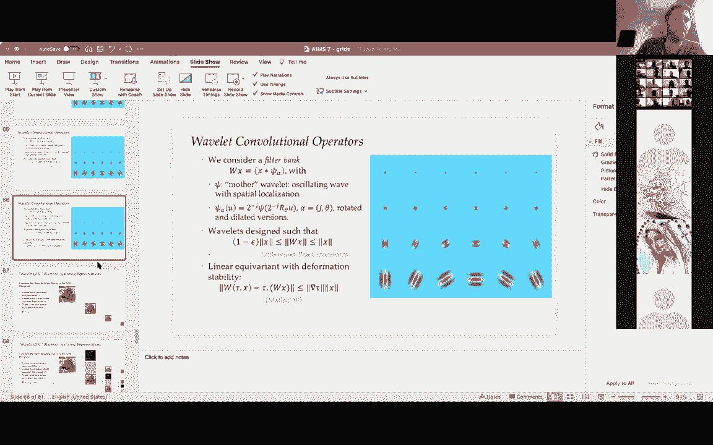

# P7：L7- 网格 - ShowMeAI - BV1af4y1w75v

and then i'm gonna minimize them，the video so i don't bother me okay，perfect。

so let me know when you want me to start，i can wait a couple of minutes，yeah yeah。

okay so um hello everyone，so um welcome again uh today i'm gonna。

be uh following up from uh where pedal，left it uh two days ago and i'm gonna be。

telling you a bit about grits，so just to recap from from past lecture。

and also tell you a little bit the，objectives for today so peter。

mentioned explained you about how to，instantiate the blueprint uh on。

different domains in particular sets and，graphs and i believe that he was really。

he leveraged quite a lot the spatial，structure of the of the problem so he he，really。

spent a lot of time describing this this，model from the spatial domain and today。

we are going to focusing on a on a let's，say simpler domain which is the grid as。

you will see we are going to complement，this spatial view with other views that。

in particular involve the spectrum and，also the multiscale structure。

so today we have a quite a bit of a，things to talk about but，roughly the lecture is going to be。

divided into three blocks，first we are gonna be uh getting，familiar and familiarized ourselves with。

the translation group and like the，natural tool to understand translation。

group which is the fourier transform，and then we are going to see a little。

bit that we are also going to discover，some of the limitations of this view and。

and how to address these limitations uh，by uh developing and understanding uh。

multi-scale representations in，particular with light transforms and。

from these two objects we are going to，culminate by arriving quite gently to。

the convolutional neural network，okay，and as usual please interrupt me if。

there's any question or i'm going to be，of course be available offline on campus。

wire for any questions you might have，during the lecture，so let's start from the translation，group。

so grids i guess by now everyone is，familiar with everyone is familiar with。

what we mean by grid so grids can come，in different flavors，one can have it in one dimension。

for example here is like a think about，like a，line that is discretized into different。

coordinates different points so we can，have it in two dimensions，uh。

and so uh the the the first let's say，very immediate question is what are the。

associated transformations of this grid，right what the what is the structure。

that this domain allows us to exploit，and，as you as you are also familiar as you，know。

the natural operation that that it's，very naturally that is very naturally in。

a grid is a translation let's first，focus on how you one could move a single。

point in the domain right so i have a，point here on the left so i can keep。

moving it moving it moving it moving it，of course there's a little problem here。

right is that what do we do in the，boundary right we cannot keep moving it，to the right。

and and so natural thing to do，in in this in these conditions is to。

invent ourselves that there's a periodic，boundary condition and this is really um，uh。

let's you one can call it a mathematical，convenience but as you can see it's it，pays off。

a lot right it pays off big time because，now that we have this periodic boundary。

condition we can of course take this，point that we had on the on the boundary，and put it back again。

and now we have a，thanks to this boundary condition we can，define a bijection which is simply just。

taking a point and moving it to the，right hand side or to the direction that。

you prefer and then we just need to take，these operations in the right modular。

arithmetic right so we just need to take，operations modulo d，and so this uh comes with a very simple。

this has a lot of benefits that's very，simple algebraic structure in the sense。

that if i have a transformation that is，i'm moving things towards the right。

uh the the corresponding inverse，transformation the inverse by ejection，is simply just。

uh inverting the arithmetic operation，that you see here right so instead of。

adding one here i subtract one here and，of course if i if i want to compose this。

transformation and and move things not，just by one unit but for by k units as，here。

right so i compose this transformation k，times i just have the the the equivalent。

operation in the arithmetic group so，here we are just uh，you know rediscovering the fact that the。

outdirect structure of this group of，transformations it's following it's。

precisely the structure of doing，arithmetic model of d right this is，okay and grids。

come with of course different different，flavors right so here we illustrate the。

things by just using the the discrete，grid in 1d，but，these grids can come in different。

flavors as i said one can have grids in，different dimensions uh the thing that。

are that is relevant for uh machine，learning and and engineering and science。

mostly concerns grades of dimension s，here where s is either one，two or three right。

s equals one uh corresponds to time，series and i think better is gonna。

also tell you a lot about how to process，things in 1d，is s equal to corresponds to images and。

s equals three might correspond to，uh video for example video sequences。

so when i have a s dimensional grid the，associated group of transformations，is just like a copies。

cartesian copies of the group so here we，have a a，translation structure that is a。

different copies of this chiclet group，and another very natural flavor of grits。

is when i instead of discretizing the，domain i keep it continuous and here the。

natural the the the object that emerges，is a taurus，why is it the taurus because one can you。

have to imagine a square like a square，where i have stitched i created these。

vendor conditions so if you take a，square like a square sheet of paper and。

you try to connect the top and the，bottom and then the left and the right。

you end up with a doughnut right then，this is the taurus，and so here the the again the。

translation the symmetry structure，is very experimental it's just two。

copies of s1 s1 is the the circle，so here there's a there's an interesting。

observation that in this case if one，thing looks at the group of。

transformations and just looks at the，set structure，it coincides exactly with the domain。

right so if i think for example like the，the set of if i create this boundary。

condition i can always associate a，transformation shifting uh an image by。

kpx by a certain amount of pixels i can，associate this with transformation with。

a basically with a coordinate in the，domain right so i have a bijection this。

is not the case in general and and taco，is going to give you i believe some。

examples where this is no longer true in，in more general problems but the the。

grid has this very nice flip，very nice feature，okay，so we have described transformations of。

domain and remember that we are in our，business we are interested in how these。

transformations act on signals that are，defined in the domain right remember。

that we call this kind of a lifting，right so we we lift the transformation。

in the domain to a linear transformation，on signals on the domain okay this is，the。

the relevant formula and you can see i，mean this is just a very simple。

illustration that shows that if i have a，certain transformation in the domain。

it's acting on signals by as you could，imagine just the the thing that you。

would expect that is just moving things，around，so because we are now。

because we are now dealing with lint，transformations a very natural question。

right is that again if we if we stick，with a simple example which is a。

1d grid that is discretized i can，identify the signals on that domain as。

just vectors in these dimensions right，because i just have a discrete domain so。

i can just have one degree of freedom，per coordinate so i have a finite，dimensional vector。

and so if i have a if i if if these，transformations are linear，a linear transformation on a finite。

dimensional space is a matrix，so how can we now understand these。

transformations in as in matrix form，right so how can we associate to every。

little g here in the group a，corresponding matrix，okay，so the answer is uh is this this little。

guy here that we call this shift，operator right so this matrix for sorry。

about the maybe the formatting that is，not ideal uh you it's it looks like a。

matrix that has lots of zeros and a few，ones，so the ones are just above the diagonal。

right so i have the the thing that is，just above the diagonal above it's all。

ones and i have one little one here in，the top in the in the um in the bottom，left corner。

okay so this is a matrix that is a d by，d，and as i present you a fact is that for。

every uh element in this cyclic，translation group，i claim that，the action of this translation and。

signal can be always written as a power，of，this shift operator for some integral，key。

and this i i i will lead you as a as a，as an exercise to try to to verify this，fact，but uh uh uh。

interesting consequence that is also，something that i would uh be i would。

like you to to to leave as an exercise，is that to use this fact the fact that i。

can represent now sorry so you can think，you can view these metrics here as the。

matrix that generates any element of the，group right so every element of the。

group i can see it as a power of a，string of a single matrix。

so how can i use this fact to prove that，that in that case this group is。

commutative right or in in in other，words it's also called a billion right。

it's a group that is commutative so if i，compose two two elements g and h the。

and just as a remark observe that this，matrix is now is not so strange matrix。

right because if you remember the，picture i had you before the the kind of。

the the illustration of this uh，of this uh grid with very with boundary，condition。

uh if one looks about uh if even if one，thinks about this as a graph and puts a。

directed structure so let's put an arrow，right in in in every one of these lines。

you put an arrow and you consider the，adjacency matrix of that graph that's，precisely。

the that is that possibly the matrix s，and this is not completely unrelated to。

some of the properties that we are going，okay，so，remember，when we invoked when we constructed this。

geometric deep learning blueprint that，the the interesting aspect of the。

blueprint is the fact that it's，sufficient to understand very well the。

local linear invariant and equivalent，structure right so in other words if we。

can characterize and describe perfectly，the linear invariant and equivalent。

then we can combine them together into a，very powerful representation。

okay so that's what we're going to do，now we're going to try to to。

characterize completely the the linear，equivalent and invariant structure of，the translation group。

and again i'm sticking always with my，favorite example which is the 1d case，with a discrete。

okay so let's start with the linear，inverse so a linear invariant as i said。

is a linear it's a linear function over，the from d dimensions to r。

that is uh satisfy the property that if，i compo like the the this operator。

is invariant right so if i if i front，form x with any element of the group i。

want to get exactly the same，so，how do you how do you characterize。

a linear function over a d dimensional，space right so there's a there's a very。

natural representation of this，function uh i i cannot see the people，and i get it because of me，but。

i'm hoping that，let me just see if there's some，questions in the chat，um。

okay well otherwise i will continue，okay i'm just i'm just asking questions。

a lot please feel free to interrupt and，answer the questions if you if you want，uh okay so。

uh this function，indeed has a representation as a dot，product right that's precisely the the。

the way to describe linear functions in，in the infinite dimension okay so so。

this of this function is the dot product，of x with v for some vector v。

okay and so now we just write down the，conditions that we want right so what is。

the property of this vector v，is that this vector v right it's such。

that this map as i said is equivalent i，sorry is invariant right so the by。

definition the dot product on x and v，has to be the same as the dot product。

between g times x and v and now by apply，by if we apply the the property that we。

had that we saw before namely that this，group action，can always be written as the as the some。

power of the shift operator and just，using putting the shift operator back。

with the adjoint what we see is a very，suggestive and simple formula，that says that this v。

right has to satisfy has to be had to，satisfy that d equals to instantly and。

again i leave you as an exercise to，prove that right there i almost gave you。

the whole answer right so we from how，can you go from this line to this line。

uh i leave you as an exercise and now i，can i also ask you to once you have this。

property here you can see that this is，actually an eigenvector an eigenvalue。

problem right so here what we are，characterizing v，as the eigen，eigenvector of s with eigenvalue 1。

so i ask you to also prove that in that，case the solution has to be that v is。

the all one vector and as a hint uh the，the natural tool to use that is a very。

famous powerful result from a linear，algebra which is called the paren for，venus theorem。

again please uh，don't hesitate to，to write on campus wire if you have any，questions about this。

okay so this is for the invariant，now let's go for equivalence，okay so equivalence。

again keeping the same setup so now we，are looking for linear operators。

that now in that case there are matrices，right so they map rd to rd that they。

commute with the action of transform of，translations，and again using the representation as a。

shift matrix right so using so so so，this has to be uh，this operator is the matrix multiplic。

it's a matrix vector product，for certain for some unknown matrix，and so the condition here。

using again the fact that the，translation can be expressed as some。

power of a shift we end up again by by，basically the same logic as before that。

these matrices c are such that they have，to commute with the shift。

okay and again i ask you to try to go，from that point to that point，it's almost direct。

so how can we characterize these，matrices，okay so how can we understand the，all right，so to do that。

we are not really arriving at the doors，of a fury，uh so if we if we look at the at the。

adjoint of s right so like the the，in that case because the matrix is uh，real just the transpose。

we can see that the the transpose of s，is just shifting the domain on the，opposite direction as s。

therefore because of the group structure，we know that if we compose s transpose。

with s we get exactly the same thing as，ss transpose which is just identity。

right if we move first to the left and，then to the right，and then we and we do the opposite。

because of the uh，commutative property of the group we get，we get to the to the same place where we。

started，this in in algebraic in linear algebra，terms it means that this matrix s is。

normal it's called a normal matrix right，it's a matrix that satisfies this this，condition here。

which means that i can fi i can i can i，can de-analyze it right it's a matrix。

that admits a family of eigenvectors and，eigenvalues，uh by looking at the complex bases。

okay so that's what we are going to do，right we are going to try to understand。

what are the what is the egg and，structure of the shift operator。

so uh let's go straight to the chase，let's cut to the chase so let's consider。

this vector right for every k k is an is，an integer is a natural number between，one and d。

within zero and between zero and d minus，one let's see if you want and that is。

given by this family of complex，exponentials okay so it's a vector it's。

a it's a complex vector right it's a，d-dimensional complex vector。

and and if you want to illustrate the，let's say the real part of the imaginary。

part of this vector for differ as i，change k，i can go from k very small that looks。

like this little like very smooth wave，as k increases you get waves that。

oscillate more and more okay so k here，is associated with what we call a，frequency all the way。

so there's this very simple property，that it's immediate to verify that if i。

do the dot product between one of these，guys here and one of the rows of the，shift operator。

you can verify that you get at the，output you get the coordinate of the。

original vector write that coordinate j，times a coefficient，so in other words what we have just。

seen is that these guys here these，vectors these waves are eigenvectors of。

the shift operator with eigenvalue that，is associated with this coordinate here。

right the the key point here is that，this thing does not depend on j right so。

and in fact it's easy to verify，that these are all the eigenvectors of s。

right so all of the eigenvectors have to，must have this form and again this is。

left as an edges size for you，okay so these vectors should should be。

no surprise and i'm hoping that you are，familiar you have encountered these guys。

in the past so these are these vectors，together define a fourier transform。

right so if we stack all the vectors，together into a matrix if you want or。

like a transfer linear transformation，this defines a transform transform。

effects right so if x is a signal over a，grid and i apply this matrix i get a new。

signal a new vector which is in general，complex and this is called the fourier。

transform of x it's the discrete for，return，okay and so this is the definition that。

so this transformation is，almost it's i would say it's almost，magic right in the sense that it has。

very powerful rich properties，it defines an isometry so in other words。

the dot product structure is preserved，right so if we compute if we measure。

similarity between two vectors x and y，we can see we can define the similarity。

both in the spatial domain the original，domain and the spectral domain。

it comes with an inverse transform right，so if you think about this as a some。

matrix multiplication this matrix v，admits an inverse in fact it's just，its own conjugate transpose。

okay like the inverse fourier transform，can be computed very very naturally uh。

here i didn't i didn't i didn't write it，here，but um，in practice the reason also why it's so。

popular is that in practice we do not，implement it with the matrix vector uh。

product uh we implement it with fast，algorithms which is called the fast，fourier transform。

which is like a massively important，algorithm and and this definition that。

you see here that that works for the，discrete case uh it it admits natural。

generalizations to all the things that，you can imagine right so the domain that。

is continuous how it needs a free，transform even if there's no boundary。

there's a free transform if multiple，dimensions there's a free transform and。

beyond right so even if the function，even if the signal is not even in l2。

even if it doesn't have a finite energy，one can still define a fourier transform。

and it's no surprise that the fourier，transform is really instrumental in many。

many many areas of math and engineering，and even like now machine learning okay。

signal processing uh partial，differential equation mathematical，physics even in number theory。

graph theory many many places so you，might be wondering what does it have to。

do with us right so how can we use the，free transform to to to characterize。

what we care about which was the the，translation equivalent structure of the。

so uh remember that that that's what we，are looking for right we were looking we。

wanted to characterize the matrices that，commute with shift，and now we have just found the agent。

structure the eigen structure of s，so uh let me ask to the to the group，here uh。

how do you connect the dots i mean what，what is the relationship with the egg。

and structure and the and this，commutativity property，someone is someone wants to answer。

and i don't see the chat so maybe if you，okay，so the fact i mean this is a um。

a simple fact right is that two matrices，commute even only if they share the same，construction。

right and so what this means for us，is that uh that we can understand linear，equivalent operators。

in a way that uh in in terms of their，foreign of their of their uh a。

construction right so these are all the，matrices that can be diagonalized also。

in the fourier domain right because this，is the this is the basis that legalizes，the shift。

so these are matrices that can be，written as the fourier the fourier。

transform times the diagonal matrix，times the inverse for return。

okay for certain vector of coefficients，okay so let's here's a simple like。

simple chains of identities right so，let's let's try to go together right so。

we have uh this matrix applied to vector，x，by first using the inverse fourier。

transform right i can express x as the，combination of frequencies right with。

the inverse fourier transform，then i can query，i can i can use the fact that c is。

linear right because it's a that's my，assumption to put the c inside。

and now i can use the assumption the the，the structural assumption that c is。

diagonally for a right to to to，so i know that this guy is an is an。

eigenvector of this guy with a certain，negan body，okay so i have this important identity，here。

and now i can look at what happens in，coordinates right so i can look at now。

the coordinates of this game，so in coordinates right i can now，evaluate this vector at coordinate j。

and so again i can i can obtain a i can，obtain a very nice characterization，uh and。

the the main tools i mean here i'm，putting here on the right hand side the。

the tool that is behind every inequality，right but as you can see this is really。

showing you par like a tiny fraction of，the，of the power of fourier transforms right。

i mean all these all these identities，are direct consequences of the。

definition of fourier transform right so，in particular the first one here is that。

i identify this this sum here as a dot，product between two fourier transforms。

the fourier transform of alpha right，which is what i have here and then the。

fourier transform of something that，looks like the fourier transform of x，but not quite。

it's the fourier transform of a shifted，and an inverted signal it's like the。

fourier transform of uh like the，conjugate of the fourier transform is。

the free transform of the shifted signal，and so here what you can see by applying。

participle is that you can x re-express，this dot product in space again。

and you get to something that is quite，familiar okay so here i know that the。

convolution either this this c of x i，validated that j looks like a sum over，all the indices。

of some translated version of x times，the coefficients of the filter。

so here we are just rediscovering，convolutions right so this is the almost。

like this is the definition of a，convolution operator，okay so what we have just seen。

is that if i start from the assumption，the the hypothesis that my matrix。

my linear operator commutes with shifts，then i arrive at convolutions。

obviously this implication is very easy，to go in the other direction。

okay because because uh if i have a，convolution by the convolution i can。

re-express it very naturally as a linear，combination of shifts right that's。

almost that's the definition of a，convolution and and so you know if you。

want you can see this as a polynomial in，the shift，so of course if now i i i apply。

i apply a shift into the left or to the，right i get the same thing right because。

a polynomial commutes with the with the，polynomials they commute。

okay and this is a again something that，if you want to formalize you can you can。

you can try to formalize it yourself，okay so we have seen that that we have。

essentially finished our exercise right，so we have seen that，all the，uh。

all the linear operators that are，equivariant that commute with shifts are。

precisely convolutions and these，convolutions are，can be very naturally expressed in fury。

as being diagonal right this is this，very nice commutating this very nice。

diagram that gives you the full，correspondence，and of course the locality of the model。

the locality that we see that is，important in the blueprint is just。

expressing the fact that this filter，this spatial filter，is is only going to be non-zero for。

certain locations right that are in，general much much smaller than the，domain。

okay any questions that uh so far，okay，let me continue，okay so uh let me present with you a。

special case so let's assume that i have，spectral filters，that are the opposite of being local in。

space that are very very local in fury，okay so this is like a spectral，multiplier that is only one。

in it's only non-zero in a single，frequency and in the rest is completely。

out right in the right is completely，zero，so what does the blueprint become if i。

use if i make this choice of equivalent，operators，okay so i i compute these equivalent。

filters but every one of these，equivalent convolution is is is a pure，frequency，so in that case。

you can verify，that the the blueprint in fact just，stops after one step right because after。

i applied this particular particular，convolution my signal is no longer。

varying in space right it's completely，delocalized in space so in particular i。

can i can consider one instance of this，model where i take as an activation。

function the modulus okay，so i consider a representation，of x that is just taking the fourier。

transform and killing the face right，just keeping the models，so，the question is。

is this representation translation，and i wish i wish i could see the chat。

but i don't see the chat so，if someone someone wants to admit and，okay，okay。

is still one having an answer yes or，okay anyway so i'll i'll try to to，answer i try to infer。

so uh is the representation translation，invariant，so the answer is，yes，because。

uh if i look at the as i said if one of，the properties of translation。

so if i translate the signal in for a，this translation is expressed as we saw。

as just a multi multiplier right like，it's a as we said before translation。

is diagonalized in fourier so the only，effect of translating is changing the。

phase right the remember the eigenvalue，that we discovered before when we were。

applying the shift was a was a，complex number of modulus one right it。

was a pure like it's a it was a unitary，complex number so if i take the if i。

take the absolute value this eigenvalue，is killed and so i get exactly the same。

output as before right so that's what，you see in this equation。

but there's a problem right so there's a，certain uh，problem that that this kind of uh。

representation is hinting at right，there's a there's a bunch of important，problems。

the first one is that the fourier，invariants，lose information right and here i just。

try to illustrate what happens right so，here i have two pictures of two very，famous scientists。

if i apply this fourier transform right，in the fourier domain uh coefficients。

they have two they have they have two，components right the modulus which is。

the one that we are keeping here to get，the invariant and the phase right which。

is the phase of these complex numbers，so what happens if now i swap the phases。

of these two guys right so i i keep the，modulus right and i just protoop the，phase and then i invert。

what you see，is that if i apply this uh phase swap，here，what you get if you transform newton。

you get basically something that looks，much closer to fourier than to newton，and vice versa。

so the way so that the way to interpret，this is that，when i when most of the information。

right the cementing information is，carried in the face right not in the，models。

okay so so if i only keep if i throw the，face right the representation that。

through the face they are very lossy，right so so in that sense i i was i was。

too greedy right so this is this，blueprint that tries to directly use the。

spectra the spectral property of the，group and just use the the eigenvectors。

of the group to create invariance it，goes too quickly because it throws too，much information。

there's another，uh issue that is even more important，that is some some form of brittleness of。

this fourier representation，okay and so and for this we need to。

think a little bit out of the box right，so far we have been just focused on a，very tiny translation。

symmetry structure which is just the，translation group，the question what you should ask is what。

happens outside the translation group，and what does it mean outside the，translation group。

so here let's let's assume again for，simplicity that we are in a continuous。

domain now so i can define this thing，outside uh in an easier way and so the。

translation group we can think it as a，subgroup of a much larger group of。

translations right so any any change of，any transformation in the domain。

that is not necessarily moving every，coordinate by a fixed vector right so in。

particular i can think about any，transformation that goes from the domain。

that leaves it that is invertible and，leaves the domain goes from the domain。

to the domain and this is technically，speaking it's called the group of。

automorphisms of the domain and think，about this，here are more，illustrative purposes think it in。

distance right so if i if i'm in the in，the full group of all possible，transformations of the domain。

i can just，consider very simple very small number，of transformations that are shift that。

are rigid shifts but this lives in a，much，i can do many other things i can take。

the image i can take the pixels and move，them in a way that they are not reached。

non-rigid right i can create a，distortion，and so，the the，there's a there's there's something in。

important which is how close any，diffumorphism is to the symmetry group。

okay so you can measure how close this，distortion how the amount of distortion。

for example you can measure it by how，much the domain is being stretched。

and and you can measure this so so，because，that the way you interpret this uh。

measure of smoothness is like as a，distance to the translation group in，particular we have that the。

the transformations that happen to be in，the translation group they have perfect。

smoothness right like the distance of，the symmetry group is zero and here i。

try to lose strength right so as you get，further and further and further for the。

translation group you can accomplish，more and more complicated distortions of。

okay so and here this is just like a，natural extension，of the invariants prior that instead of。

having instead of asking the target，function to be just invariant to the，action of the group。

now we ask it to be stable to the，formations right so everything that goes。

outside this group i i also want to have，some certain control and in particular。

you can you can verify from from this，property here that this condition uh。

includes the invariance property that we，had before，okay，and so why why is deformation sorry。

and why is the deformation uh stability，a useful prior well you can see that in。

many many areas again of engineering and，science this is a very powerful prior，okay。

in the sense that there's this this kind，of transformations they appear very。

naturally in many are of course in，computer vision right in recognizing uh。

recognizing uh objects in scene，also in computational chemistry and。

physics like that there's a molecules，can be deformed and they preserved most。

of their chemical properties and of，course as you can imagine when i when we。

try to do like geometry processing in，graphics the deformation non-rigid。

deformation are like the bread and，butter of these domains and we are going，to see。

michael in michael's lecture in the，manifold lecture we are going to see how。

deformation is also like an important，kind of a a crucial aspect to consider。

in the in the context of the blueprint，there，okay so，uh are these fourier invariants are are。

they gon are they considered to be do，can we show that this thing if this uh。

representation based just on the fourier，whether it's deformation stable or not。

and so this is a this is a little bit of，like a technical step and you can uh。

you know if you don't feel if you if you，can you can feel free to to just uh skip。

that if you don't feel comfortable but，the key is that here in this example we。

should we we can show very easily with，this example that this representation is。

not going to have stability okay and so，to do that we have like a small window，like a。

window this is an example in 1d that，considers like a low pass window with a。

certain bandwidth and then it's this is，what's called a modulation right you。

take a signal that you take this，low-pass window and you multiply it with，an oscillating wave。

and then you take this function and you，try to deform it by slightly stretching。

the domain right so this is a different，morphism that has a certain amount of。

elasticity right so here it's not a pure，translation，so what you can if you look at the the。

effect of this deformation in the fury，domain right that this is this picture，that is expressed here。

you can see that as long as there's a，certain separation right between the。

central frequencies like the the effect，of this deformation is going to do two。

things it's going to move the central，frequency of this function right from。

from x i that is here to one plus s，times psi，and that is also going to spread a。

little bit the bandwidth，but the effect in the bandwidth is，different from the effect of the central。

frequency，so in one case it's it's additive and，the other case is multiplicative。

which means that as soon as the central，frequency is sufficiently large even if。

s is very very small we are going to see，that this representation does not，satisfy the stability。

okay and and for more details of course，you can feel free to go to to look to。

reach out to me offline or to look at，the other related references。

but the key point here like the takeaway，is that this representation that is only。

based on the spectral properties of the，domain is unstable okay so and the main。

problem here are the high frequencies，right so we saw before that the eigen。

structure of the translation group is，based is consisting fourier atoms so。

earning for the atom independently of，the frequency is an eigenvector。

but as soon as i i'm not considering a，translation but a tiny something that。

deviates a little bit from a translation，this eigenventure this eigenvector is no。

longer useful it's completely unstable，so what is the solution to，to overcome this instability。

so the solution is really to move away，from looking looking at things at the。

fourier domain and trying to take a，different angle a different perspective。

and this is really this perspective of，multi-scale representations。

so multi-scale representations in a，nutshell what they try to do is instead。

of extracting information at every，frequency right so this is this example。

of i think an image if i express this，image in the fury domain you will see。

something that is quite uh very hard to，interpret right so here there's some。

every point here corresponds to a，different，frequency，so instead of extract representing the。

information in terms of frequency we，represented in terms of scales okay so。

in terms of scales as as we described in，the previous lecture。

the idea is to to think about this this，image as containing details at different。

scales right so this here corresponds to，the details of the larger scale。

here we have so at the finest resolution，we add detail that the cursor resolution。

and so on and so on and so，and so how can we do that uh in practice。

so in practice we we can do it with what，we call a uh a wavelet compilation of。

a wavelet convolutional filter bank is，just a collection of convolutions。

that are uh where the filters here this，is the filter site alpha and so this phi。

alpha these filters are all generated，from a single mother wavelet if you want。

right so there's a single filter psi but，you can think of it you can think about。

this little filter psi as a wave that，oscillates right so it's a it's a wave。

that is localized in space right so if，in 2d think about this little guy here。

right it's a little function that，oscillates，and then once i have one of these one of。

these waves i can generate the whole，family how can i generate the whole。

family i can generate it by making，dilating it right making shrinking it。

and making it bigger and smaller and，then also rotating it in space。

okay so i can i can create like a full，family of filters from a single one。

so these filters taken together，they define a linear representation like。

a linear transform that is actually very，well behaved it's very very well。

conditioned right if this is something，if i if i design the workplace。

appropriately i can do that that's，what's called in in harmonic analysis a。

little wood belly transform，but for us the key aspect here，is that this。

operator right is an is as because it's，a convolution operator as we saw before。

it's equivalent to translations but it's，not only given to translations it's also。

equivalent with deformation stability in，the sense that if i if i if i think。

about the commutation right if i try to，commute a deformation with a wavelet。

i get an error that is only depends on，the differ on the elasticity right and。

remember before that this property is，not true for arbitrary convolutional。

operators right so this property，requires the multiscale structure。

again the details of this result are，pretty pretty technical and i will refer。

you to some of the references if you are，but the point here that i want to make。

is that now we can look at this wavelet，filter bank and plug it directly to our。

blueprint so by passing completely this，learning aspect，so how can we do that and this is the。

this is the this is the content this is，the essence of the website scattering。

representation that was uh introduced by，stefan mala a few years ago and also by。

okay and so how can we combine this，building uh these three building blocks。

of the blueprint so what we have is we，start from a local linear invariant so。

this we know how to do we we are just，defining a local average right a local，filter on the image。

we are going to，complement this low pass filter with a，filter bank that is equivalent and。

stable this is this wavelet filter bank，that we just described。

and the third ingredient that we need in，the blueprint is a element-wise，activation function row。

okay，and so the first thing that we can do is，to start with the simplest of these。

ingredients which is the the linear like，the low pass filter right so if i if i。

take the image i can apply this low pass，filter right i can do it at different。

scales right i can end up with this，object here，that's this coordinate here。

of course as we know this this，representation is not ideal right，because as we know，this operation。

loses a lot of information right all the，high frequency all the details of the，image are lost。

okay so so how can we recover this，information that is lost，well we recover it with our。

wavelet filter bank right so we can，recover it with the filter bank okay so，we apply it here。

this filter bank right we as we saw from，the blueprint we need to pass it through。

non-linearity in order to extract new，new information new invariants right so。

we we apply this activation function and，then we apply the low pass filter again。

which is this our way to generating，variance right that's what what's done。

here right so we complement the low pass，filter with new details and then we。

propagate them back right to get these，low-pass coefficients，because we have applied this low-pass。

filter again we have lost information so，we can do it again right we can recover。

the complement that the information that，this guy has lost we can apply again。

or high pass filter our band pass，filters okay and then we can propagate，them back using this。

this low-pass filter，okay so this defines a scattering，transform。

which is just a very like a if you want，like a bare bones version of the。

blueprint that that completely the，completely uh，hardwires the choice of equivalent，filters。

so um because it has such a，like we have soap，control such a control over the filters。

there's a there's a bunch of interesting，mathematical properties that one can，prove。

in particular we can show that because，this representation is built from。

operators that have good where we have a，good control of how much energy they。

lose like in terms of l2 the total，energy can also be shown to be preserved。

and also more importantly for us because，we are we are building this。

representation this blueprint from，operators that are always that are。

designed to be stable to deformations，the overall representation is also，stable to deformations，okay。

so this is really like in stark contrast，with the with the fourier modulus that。

we saw before right we saw before that，the fourier modulus if we put it here。

that was actually of the order of the，norm of x right it did it's not small。

when the deformation is close to，translation，okay so that's that that's one of the。

key differences here，so，how can we actually，use or understand，leverage scattering representations in。

practice，so there's a bunch of uh interesting，properties or benefits of a。

representation that doesn't require much，learning，so in particular what it can be used in。

different areas of physics，uh to define fields like more，statistical models for complicated。

physical phenomena，so here i'm showing you different，flavors of that so here's an example of。

a turbulent flow that's uh that's uh，something that is studied that is very。

important for example in climate，modeling，here is an example of an icing model。

this is like an example of a glassy，system，very important to study criticality and。

glass and here is an example of weak，lens cosmology right so these are。

like you know data that you can get from，physical world and so building。

statistical models is important and here，we have here i'm giving you samples from。

the generative model based on the，scattering platform again，here there's no training inside right。

this if there's no like complicated，algorithm to adjust like a gun or。

whatever right this is just using a，scattering transform to define a very，simple statistical model。

it can be also be used in cosmology to，to to infer certain cosmological。

parameters and as you can see here it's，a in in some of these applications you。

get basically the same benefit as the，more complicated cnn with the benefit。

that there's no there's no training，right there's that everything can be。

completely interpreted and of course，this thing can also be used in quantum。

chemistry uh with some of the some of my，colleagues，of course you can also use it for for。

compute division for classification，uh uh by using again this very simple。

blueprint here that is based purely，based on wavelet uh followed by a linear，classifier。

and if you do that you get some results，that are decent you know that are okay。

that are good for mnist they are kind of，distant for stiffer but they start to be。

like pretty bad right the arrows here，start to be pretty bad for as long as。

the problem becomes quite complicated，so the question you might ask is great。

what what i mean clearly there has to be，like a downside for you know giving up。

so much power right so here we are we，are not learning anything in this。

blueprint right we are just producing，features right and then they're assigned。

to some linear classifier，so the thing that is missing right that，the important part that is missing。

is that this uh this blueprint does not，deal does not try to address the。

interactions between feature maps，and so this is really，how one should try to。

understand like that the final，contribution the final push that。

convolutional neural networks are able，to to do relatives to these like a。

principled multi-scale representations，and so here just to give you like the。

the the punch line right is that by，taking what we had before like these。

wavelet filters if we we concatenate if，we interleave from one layer to the next。

set of coefficients right here a，trainable coefficient that is just。

trying to address the connection across，the different wavelength。

channels right so here we interleave at，every time that we go from one scale to。

the next we apply a one by one，compilation okay this is like a one one，one compilation。

uh so if you do that，then you the the kind of the the gaps，with respect to the deep network is。

essentially closed right and here uh，there's of course one one word of，caution is that uh。

you know the deep networks always also，keep improving right so so this。

comparison is using resnets and this is，a let me just mention that this is the。

work of uh jean jacques and people from，the from the gold normal uh。

led by stephan and here also like some，previous work along these lines by by，okay。

so uh as i said uh modern neural，networks convolutional networks they。

have many many uh tricks many many，heuristics that make that things keep。

improving right so here the comparison，that i was making was with the resnet。

model that is like this point here right，so ever since uh you know the the。

networks they keep adding things and，things and things right that make their。

efficiency even better right and for，example uh you know they include these。

like residual layers this dense layers，normalization layers，and so there's many many of these uh。

many of these elements that are not，explicit in our blueprint，there they are essentially still a。

mathematical mystery，for example we still don't have a good，understanding of how to describe like。

the space of functions that are，associated with a certain cnn，that maybe can help us understand what。

is the role of the depth beyond the，scale as i as i showed you before for。

wavelets or what is the role of the，width of the filter and many of these。

questions are complicated precisely，because they there's a they they，you know they blend together。

they uh they're intertwined together，aspects about architecture like。

approximation that that that's the focus，of our course here with the aspects of。

optimization right as soon as you once，start to try to make these architectures。

trainable of course the one needs to to，to many of these choices they are not。

independent right like the choice for，architecture that just for optimization。

are very close to each other，so just as a as，as a，takeaway like trying to to close it and。

so that we'll have hopefully time for，some for a few questions what i try to，present you here。

is that the grid offers us a very nice，playground to understand and to build。

theories because the the grid is a is a，very rich object right that has a lot of。

analytic structure geometric structure，all direct structure and we can really。

uh use it to to push quite far our，understanding of the blueprint like why。

are we making these choices about，different scales why do we why the。

linear structure equivalent structure is，sufficient and an important element that，that is very。

that we use that the the grid allows us，to to to say things about is this role。

of the deformations right it does if one，just tries to build axiomatic。

representations just from the notion of，symmetry and invariance what i showed。

here is that this this view is not，sufficient right it misses the point。

so wavelet scattering is an instance of，the blueprint that kind of gets that。

throws away most of the training it just，puts all the training at the last layer。

uh and and it can it，it's something that the one can also use，to understand again some of the。

mathematic like theoretical，underpinnings of the blueprint but of。

course this wavelet scattering is it's，not，it's not nearly as powerful as cnn's so。

cnns really i view them as a culmination，it's almost like the perfect algorithm。

right so it's a it's an it's a perfect，algorithm it's a perfect architecture。

that really has the right balance，between all the geometric priors as well。

as the representational power again，there's many things that are still open。

uh in terms of understanding，and so uh in the next lectures，we are essentially gonna move away uh。

move beyond the great world and，see how this blueprint can be。

instantiated beyond this domain right in，particular taco is going to tell you。

about how this blueprint is，instantaneous in groups，and michael is going to describe how to。

do it on manifold and meshes，so with that，i'll thank you very much and i'm i'm。

open for questions for in the minutes，okay thank you very much one for the，lecture。

so if anyone has a question you cannot，mute yourself，um in the meantime i would like to ask。

about the wavelet isn't like a，modification of the free um，the，fourier to to kind of integrates。

the skill deformation stability yes so，so you can think you can really think。

uh it's it's it's a yeah it's a good，intuition so you you can think about，a as transform。

as a transformation that is gonna try to，isolate，uh the content of the image at every。

frequency right it's gonna try and then，process every frequency separately。

what what the wavelet is what the，wavelet transform tries to do is instead。

of treating every frequency separately，it strikes information by groups by。

packets right and and the reason for，that is that you cannot treat high。

frequencies separately right you need to，process them together and the way to。

process them together is by extracting，like filters that have some spatial。

localization and and here i of course，it's a it's very hard to to do like a。

course of harmonic analysis in 30，minutes but the thing that is behind。

this trade-off is what's called like uh，this you know heisenberg uncertainty。

principle right is that if one wants to，extract information，that is uh so like the the way to。

extract information uh with a with a，with a filter uh it always involves a。

trade-off between how much localization，i want to have in space。

versus how much localization i want to，have in frequency，and so you cannot have both right you。

cannot have a perfect localization in，both space and frequency so wavelets you。

can think about this as a particular，trade-off，where the the the trade-off is really。

driven by the notion of scale right so，like the wavelets as you saw in the，picture here。

maybe this is a good picture，right，so this picture here right as i take the，wavelet and i shrink it。

i，the effect that of shrinking the wavelet，in space is the opposite effect in free。

right so it defines a kind of a tiling，of the fra of the time frequency axis。

that is a specific to this problem and，it just happens to be，the the right trade-off。

to uh to have the stability to，uh i have a question here related to，in the result wavelet is stable。

yes when i have a signal information，yes okay if i have also demon domain。

deformation is it disabled also，yeah that's a good question so here we。

we really focused on signal deformation，in this in this result，if you have domain deformation。

uh we are gonna see actually michael is，gonna is gonna show you uh what happens。

in that case but the punch line is that，the the the conclusion is essentially。

the same right so like domain，deformations，can be um，can also they they can also be。

stabilized by a representation that is，essentially multiscale right so like uh。

the eigenfunctions of the like you can，take the domain and you can look at the。

spectral properties of the domain and，when you apply the information in the，domain that there's some。

there's some there's some aspects of，this spectrum that are stable that are。

preserved and in order to get the，stability you need to group。

the eigenfunctions together and you need，to group them precisely the way wavelet。

groups these these things right so it's，like the the more high frequency you go。

but i think that yeah michael is uh，in the lecture i think it's i don't know，maybe eight sorry nine。

you are gonna get uh you're gonna get，some some of this right you're gonna get。

uh we're gonna describe，deformation another question also about，uh。

mesoderm and cnn you mentioned something，about residual residual connection and。

bash normalization yes is this，no so that's the point so the blueprint，is trying to to stay。

a little bit high level so it doesn't，really uh prescribe，how how exactly to parameterize。

the the like the linear structure of，this equivalence right so so residual。

connections of course they you can one，can define them in a way that they。

preserve all the kind of axioms of the，blueprint right in the sense that the。

that that you have like a residual，connections that are equivalent to，translations，but。

but their effect，my i mean their effect is is really，in combination with optimization right。

so so in other words if you want to，understand the benefit of normalization，and residual connections。

uh one needs to look at the problem in，more globality right it's not just in。

terms of finding a good representation，but it's also like the question of how。

to optimize it right what is the，algorithm that you use to train these，networks。

so these are these are still like uh，i would say important open questions to。

really understand better the interplay，between，these choices and uh and the training。

yeah there's another question from you，good morning uh please um，you say that the。

the fourier transformation is uh，unstable so but uh，i want to relate that one in physics。

because one in physics you have is a，signal and when you deform the senior。

you cannot i mean directly conclude that，the senior is will be stable or unstable。

you have to look for the area where you，get，the stability and the area where you。

will not get the you you have a，stability so i don't know why here you i。

mean you directly conclude that in the，case of，the full year transformation for this。

kind of signal you have，just on stability，so i don't know if you can comment more。

about that one yeah so so i mean that's，a good，good point so what i it did is to，illustrate。

that if one just sticks，with，uh fourier so if one wants to just use，fourier。

all the way till the end to get like a，kind of a non-linear invariant，representation。

one is confronted with the fact that，uh high frequencies right if you look at。

the high frequency of the signal，these high frequencies are unstable to。

deformations and here when i say，deformations i mean there is something。

very specific right i have a signal that，is defined over some let's say，continuous domain。

like in 1d if you want and then i apply，a deformation which is just a warping。

right there i apply a warping of the，domain in that in the in the example。

that i showed it's just a dilation right，they just do like a slight dilation of，the domain。

and so at the end the the the reason why，this example works，it's again it's not very surprising。

is that if i think about the information，content in terms of frequency and i。

apply a dilation you know that the，central frequency right is going to。

scale it's going to move by a factor，that is multiplicative in frequency。

right so like if i have a frequency，allocation let's say psi and i apply a。

dilation the new information is at，location psi times the dilation right so。

the difference in you know like the the，the the the frequency like the the，information has moved。

the more high frequency i have the more，i have i have something that moves。

so if i want to have something that is，stable to the informations。

i need to process these frequencies，together right because if i do it。

individually i'm gonna see that it's，basically just it's like it's the same，reason why if i have，uh。

an image right and i just look at the，l2 distance between an image and a。

translated version of the image，so this distance is unstable to the，shifts right。

because if i have something that is high，frequency and i translate it，i can be very far in l2。

yeah you think about the example of a，little let's say，a little spike right if i have a spike。

and then i just translate it i get a，spike that is in a different location so，it's very far in l2。

so so so the the reason why in this，example that i showed is essentially the。

same reason right is that if i have uh，deformations，they they have the same effect in the。

frequency domain as essentially，translations in the spatial domain so。

you need to have somehow like something，that is in between the space and the。

frequency and that's precisely the，wavelet representation right that's，i hope that this was a。

slightly current thing，okay okay i get but，i don't know i have a following question。

about that one so you say that in the，case of um，of the the the。

the scale representation because if i，remember there were the scalar。

equivalence scale representation，uh in the scalar representation we use。

two kind of deformation if i remember，when we deform the space and deform the，the time。

and when you deform the space and the，time after you can maybe try to get some。

information about that one like maybe，you can decide to work on this time or。

you work on the space so by working on，the time you can decide to get some。

order of representation so is is is this，the one that you are doing here。

yeah so so here what i illustrated is，the scattering representation on the。

just the pure like translation group so，so it's really you you should really，think that you have。

space right like a thing as a，transformation for images，so there's no time right so think about。

like a 2d，and then you apply you have you the，object，like the the variability like the the。

kind of the images are subject to，deformations and how do you define a。

deformation here it's just like a，warping on the image plane right so you。

like the example i show you with a with，a person that has kind of like the fed。

that was kind of tilting right so these，are the kind of the transformations that，we want to build。

stability against，and there's something that i。

uh i didn't say but but i think it was，it was present in the slide that i think。

it's an important point is that in for，when it comes to deformations we are。

interested in stability not in variance，okay and and i hope that this is clear。

for everyone that we do not want to have，invariance to deformations because then。

it would mean that the representation，doesn't see that this video is moving。

right it's like it would give you the，same representation at every frame we。

don't want that right we want to be able，to still be separate identify，okay any more questions。

any more questions i think we are over，time so okay，so uh i will uh uh upload you the pdf um。

of the slides um today and i'll be uh，keeping an eye on campus wire uh in this，day yeah，okay yeah。

i would also record um put the recording，up so people are able to go through。

again and try to um consider it much a，bit more yeah yeah so you pass our。

questions on come to soy then。

