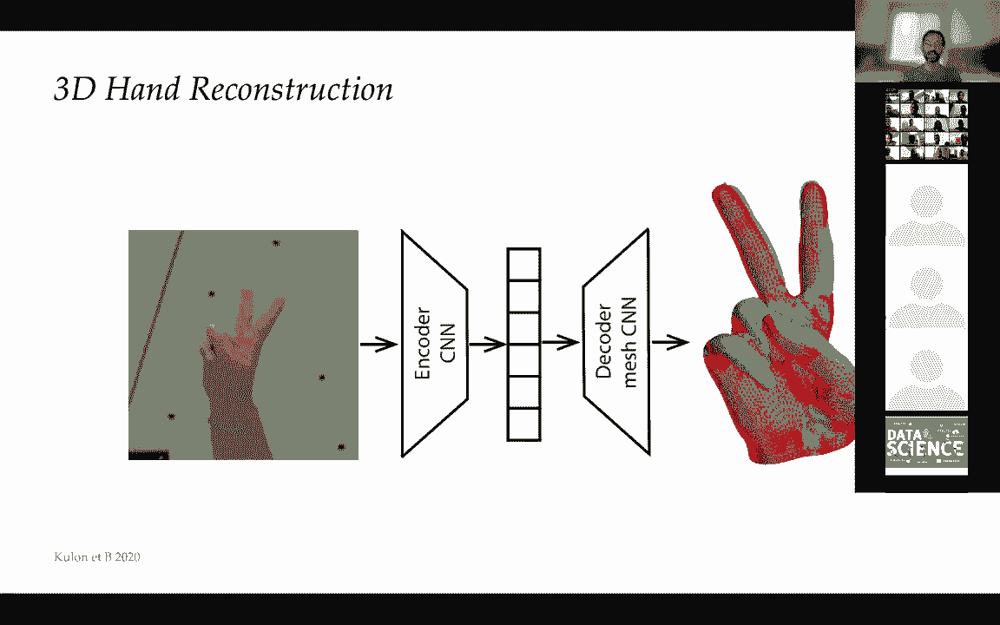
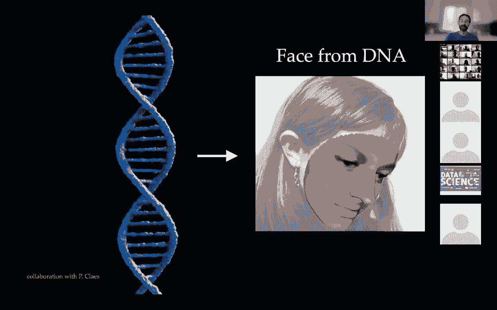
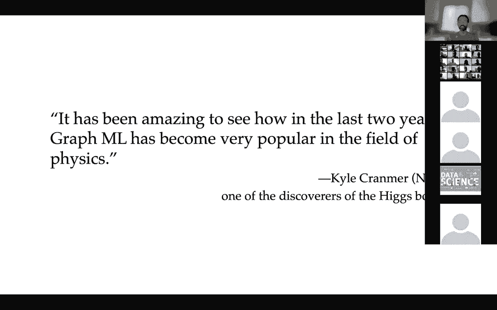
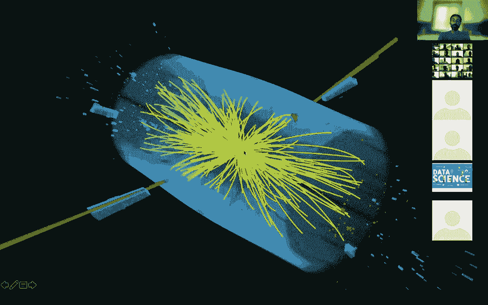
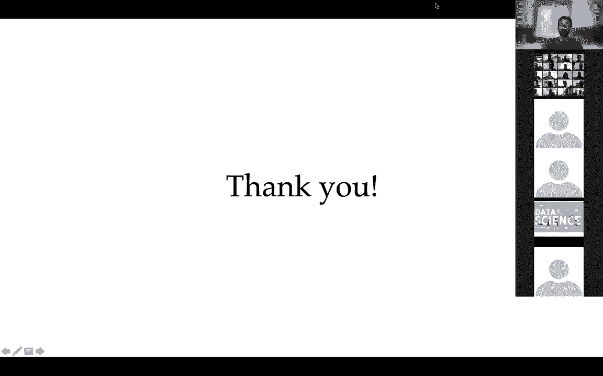

# 【双语字幕+资料下载】GDL ｜ 几何深度学习(2021最新·完整版) - P12：L12- 应用与结论 - ShowMeAI - BV1af4y1w75v

okay so，um i think we got to the last，lecture of this course so it's been，really a pleasure for us。

and um in the last lecture i would like，to talk about，some applications and uh the next steps。

uh in geometic deep learning so，allow me to uh to again overview。

the the structure of this course from，the beginning so，we talked about the geometric principles。

that underlie，deep learning and then we looked at，their，specific implementations and。

uh the key concept，that that unifies deep learning，according to this course is this concept。

of symmetry，that i showed in my first slide in the，beginning and i would like to show it in。

the in the last lecture as well，this quote from vial that symmetry is，wide or is narrow。

uh is one idea by which men through the，ages has tried to comprehend and create。

order beauty and perfection，and we try to comprehend uh deep，learning through this。

lens of symmetry what we call the，geometric deep learning and。

we've seen instances of these principles，on multiple structures whether it's，creeds。

groups graphs and and many phones，and we've seen that basically you can，derive。

from these basic principles some of the，popular architectures such as，convolutional networks。

craft neural networks uh better in his，uh lecture，before showed uh how to derive uh gated。

recurrent networks and the lstms，and before two and three lectures before，we discussed。

mesh cnns and intrinsic learning on on，many phones，and uh meshes and geometric graphs so i。

guess the the，the obvious question is what's next，right so uh。

somehow you can judge about the quality，of a theory or a framework by its。

predictive power and you can you can，argue basically whether this。

uh framework uh is just a pedagogical，instrument to unify，and teach in a better way deep learning。

or whether it will evolve，into some something more substantial and，of course we believe。

that it is something more substantial so，what i would like to show you today is。

maybe a few thoughts about where，i and others believe these fields will，go and what are the。

interesting research directions and open，problems and i，based it roughly on a blog post that i。

wrote in the beginning of the year，by interviewing some prominent，researchers in in the field of。

people，that use these methods in their research，in different fields，and i will quote some people。

from uh from this post so let me start，with will hamilton that i guess。

uh doesn't need any introduction for，people working with graphql networks uh。

he's a professor at mila，and uh he is one of the authors of the，the graph stage which is。

one of the first scalable uh，implementations of craft neural networks，and he said that uh last year。

saw the the field of graphml come to，terms with the fundamental limitations。

of the message passing paradigm and this，is also what，we discussed in depth in the batter's，talk uh。

he in his lecture he discussed the，relation，of craft neural networks to the device，for a lemon。

graph isomorphism test and，what kind of graphs what kind of，structures would。

would not be detectable uh by，by by this the message passing so it is，interesting that。

uh it was in a sense an easy way to find，this connection between craft neural，networks and。

device for element algorithm actually if，you look at the precursors。

of graphical networks they came more or，less from the same domain。

actually vice versa and lemon themselves，were inspired by problems in chemistry。

and uh so it's not this link is not，exactly very surprising，that。

is almost on the surface and it's it's，easy to take advantage of it。

but it has its limitations so the，question is，what could be uh what could be used。

instead of message passing and，uh here we believe that uh，message passing is still a very powerful。

paradigm but maybe we should use some，other structures we can apply。

it to exchange information or maybe，slightly more exotic constructions and。

there are several papers in the past，years that try to go in this direction。

well here of course i'm biased i，i show a picture from uh our own work so，this is collaboration with。

the group of petroleum at cambridge the，work of chris podner and。

fabio frasca who is i think given giving，a seminar，on this topic uh later today so i don't。

want to steal，uh his thunder but basically we，developed uh，vice very lemon-like schemes for coyote。

structures in particular，for simplicial complexes so if you think，of measures that we discussed。

when we talked about many falses，discretization of continuous surfaces。

they technically speaking are what is，called cell complexes，so in addition to nodes and edges you。

also have higher order，structures such as triangles and you can，generalize it further so。

at the next level three-dimensional uh，simplices will be tetrahedra and so on，and so forth。

and cell complexes are even more general，structures so they，basically their implementation of a。

certain discrete topology，and you can show that you can uh by。

doing this kind of higher order message，passing，you can get architectures that are。

strictly more powerful than the，traditional message passing in neural，networks。

and there are many interesting deep，as，some interesting applications for。

example in computational chemistry，and this is probably something that you，also。

explored a little bit in your in your，practical work，is um that that in molecules you have a。

lot of structures that，go beyond graphs actually chemists don't，think of molecules。

as graphs they think of it uh think of，them as some，combination in certain way of。

primitive structures and cell complexes，are one way of capturing these，structures。

then there is an interesting direction，as well so this comes from the work of，kyle cranmer from nyu。

i think it was collaboration with，deepmind and the idea is that，you can instead of using。

generic message passing you can make，this message passing symbolic and in。

particular they were considering，uh physical systems uh multi-particle，systems that interact and the。

interactions are captured by a graph，and you uh you learn a genetic message。

passing neural networks usually，genetic message passing functions，usually these are。

small multi-layer perceptrons and then，you regress，symbolic equations from them and。

replacing these generic message passing，functions with symbolic equations uh，generalization。

but secondly you get the laws of physics，from your problem so and i i think it's。

it's good to look at it in perspective，so i mentioned，uh also in the beginning in the in the。

introduction lecture you johannes kepler，the the german uh astronomer that that。

studied the the the crystal，structure of ice uh in in his work on。

six cornered snowflake but he is also，famous for the kepler's law，that took him his entire life。

essentially between 20 and 30 years，come，up with a formula that explains the，orbits of the planets。

nowadays with this kind of system you，can do it maybe in a few minutes or，maybe even seconds。

so it's it's pretty amazing how science，more，methods，that is called algorithmic reasoning and。

i think patreon mentioned it in his uh，in his lecture as well。

and um we when it comes to abstract data，such as graphs，we do have a very established way of uh。

working with them right so if you want，for example，uh in let's say google map to predict。

the travel time from one point to，another you could apply it something。

like the dijkstra algorithm that，computes the，the length of the shortest path in a，graph so this is。

a standard uh techniques that are used，in in routing and in，in geographic applications and and so on。

and uh if you compare neural networks to，graphs uh sorry to algorithms。

um then um one thing that that you see，that uh，obviously algorithms are extremely。

explainable and they generalize，perfectly，across different different data but they。

don't generalize across tasks，right whereas neural networks they kind，of generalize to data but。

not not not given for granted，and，in many cases these are just black boxes。

but they do generalize across tasks，so it's not uncommon for gumball to，train。

let's say convolutional neural network，on imagenet and then apply it to a，completely。

different zoo of images so i think even，hole，event horizon uh there was uh apparently。

from what i read，a convolutional neural network that was，portrayed on natural images。

so uh algorithmic reasoning tries to to，take，the the the advantages of both worlds。

and uh and fuse them，in in a formal and rigorous way，so there is another interesting topic。

that is especially uh，of interest in biological sciences and，this is causal inference。

and what i show here is also a recent，paper，where they try to uh reconstruct causal，graphs and。

the typical scenario that you you see，here is，some uh gene expression in healthy and，diseased cells。

and you want to understand what causes，the disease so what，the way that you can describe it on the。

on the cellular level is this gene，regulatory network where you say that if。

i have for example a gene that is，expressed or not expressed。

that this is what causes the disease and，you can try to build this graph。

that explains actually the mechanics of，how this disease works or how a therapy。

for example works so this is also very，important and uh，of course in many cases we we must have，this。

uh interpretable result in order to to，understand and take action，uh related to this is also the。

the field of knowledge graphs where i，have these heterogeneous uh。

graphs for example that that tell you，relations between different objects。

uh very common again in biological，sciences and medical sciences so here，you can see。

for example aircraft that describes uh，different symptoms and treatment。

of pneumonia and uh a biological graph，on the right，that relates the different。

uh different mechanisms of different，diseases，and and drugs so another interesting um。

trend as well so this is thomas kipf，from the fame of the gcn architecture，that that。

we we discussed in the recent lecture so，he's currently at google，so he notices this trend in the。

graphimal community，is the separation of computational，structure from the data structure。

and we mentioned it a little bit and i，think better also refer to it in his。

lecture is this idea that you don't，necessarily need to stick to the。

input graph to do your message passing，and here i'm，showing a figure from um from a paper。

from the group of stephan guniman from，munich，where they said that uh if you take a，graph。

you can uh embed it with with，some diffusion process and then rewire，the graph so。

just connect the nearest neighbors in，graph，you will get better performance so the。

paper is called diffusion，improves craft learning so they show，that on a wide variety of tasks and。

graphs，this kind of rewiring is beneficial，and there are many reasons why this is，that。

look at the phenomena for smoothing and，over scratching squashing in graphs。

so these are deep and probably not，completely understood，problems but i think it brings up an。

interesting question is actually，when we talked about graphs and，continuous spaces somehow。

there was this uh deep disconnect so，graphs are discrete，right and in continuous spaces we could。

say that that uh，okay i can discretize this space in many，different ways but somehow。

it it describes the same thing right so，if you think of meshes for example。

that discretize continuous surfaces，there are a zillion，different ways i can i can mesh the。

continuous smooth surface，i can still say that it's the same the，same surface right up to some。

approximation，so there is an interesting branch of，that，brings together this field of，that。

tries to think of graph as a，discretization or a sampling of some，continuous space。

and uh deep results for example you can，show that social networks or what is。

called scale-free networks，where there is this phenomenon of a，small number of degrees of separation。

um can actually be obtained from，sampling of，a space with hyperbolic geometry so if。

you remember again the first lecture，when uh i mentioned some of the the。

non-euclidean geometry models so this，was the first one the，the negative curvature space of。

lobochevsky，the geometry of hyperbolic，of hyperbolic spaces and there is。

an interesting dimension to it as well，uh that can relate，um the the the question of graph graph。

wiring and how to choose，the positional encoding for the crafts。

right so this is also something that we，mentioned，and this is through the uh through the。

lens of diffusion equations and this was，our recent paper at icml that we did。

that we did at twitter and the idea is，that，you can interpret graph neural networks。

as discretized diffusion，partial differential equations so we，call this neural pd's。

and each layer of a graphical network or，a certain architecture of craft neural。

network can be interpreted as，a step of an explicit solver，what is called forward earlier explicit。

scheme，and there are many other solvers that，exist in oracle analysis and we show。

that you can use better solvers with，multi-step uh schemes or for example，with adaptive steps。

step size or uh even implicit solvers，that invert the diffusion operator。

so uh it is interesting because in this，case you don't really have。

any more the notion of layers and that's，you have the notion of diffusion time。

so you have some learnable parametric，diffusion equation that you try to learn。

from a specific task and then，of course the question of uh which graph。

to use is a little bit superfluous，because you can think of it。

as a form of discretizing your spatial，derivative，so if you think of a diffusion equation。

that contains the laplacian operator，right as i showed，when we talked about about manifolds。

there are many ways you can discretize，this little plaster，and this is a kind of intuition that we。

are trying to pursue，there are many interesting deep links to。

differential geometry so in differential，geometries，geometry people like diffusion equations。

so some classical results for example，what is called the richie flow。

which is diffusion equation on the on，the remaining metric on the manifold。

and if you're familiar with the，pancreatic conjecture，this kind of instruments were used。

to prove uh the the the poincare，conjecture so that was the，the groundbreaking result of grigori。

um it is interesting to look also，at the enemy crafts because in many，cases uh the graphs。

are not static so if you think of social，networks so these graphs，change all the time what is。

characteristic is that，different kinds of crafts or different。

portions of the graph maybe or different，structures on the graph。

changing different frequencies so if you，think of，a network such as twitter or facebook。

the follow graph basically the，social relations between users are。

typically not updated that frequently，but the engagement graph or the user，like or retweet。

the content are a much higher frequency，so there are already uh existing models。

that try to generalize graphical，networks to this setting where，when the the graph is not actually a。

static graph but it's，a stream of asynchronous events that add，or delete nodes or edges。

and again here i show a figure from a，paper that we did at twitter，last year so another interesting。

direction，generative model so you're probably all，familiar with guns right so。

and here is a figure i think this is，from uh，good fellows uh talk on the progress in，this field。

how uh how guns，became significantly better over just a，few years。

in generating for example human faces，uh it is much more difficult to generate，graphs。

one of the the issues and the multiple，issues that complicate。

this problem but one of them is that if，you think of an image we have canonical。

order of pixels right so one of the，one of the typical losses that we have。

in this architecture is a reconstruction，loss，when i uh i have a my input image i do。

something to it right so i encode and，then some latent space and then i decode。

and i can compare the input to the，output i can tell that it's。

similar or not right i can just subtract，the two images and take a norm。

with graphs i uh input a graph i do，something to it i outline the graph and。

now what how do we compare them we don't，have a canonical order，and one interesting field of。

applications is the computational，chemistry where you can try to。

generate new molecular graphs and are a，lot of these，potentially and he wants to understand。

how well how first of all how to to，generate these cuffs，and how to even to evaluate whether。

these graphs are，interesting and meaningful so in，chemistry again people don't think of。

graphs as nodes and edges so they try to，think of them as，some higher level structures and this is。

the paper from the the，group at mit of tomi yakov on，junction tree variation of alpha。

encoders that that，one of the methods for generating，molecules。

uh another important topic so this was，this is what one could probably。

fairly say that has been driving driving，many fields in，computer vision and machine learning is。

the availability of，large uh and standardized data sets and，benchmarks。

so some people of course complain that，that a lot of works just，increase by absolute some，[Music]。

some criteria and some benchmark and，become，become a winning paper but it is，important they need。

in this field just a few years ago，everybody was，publishing results on their own data。

center that it was very difficult to，compare，different methods so availability of。

standardized evaluations such as open，craft benchmark，to，existing state of the art it doesn't。

mean i don't necessarily think that，uh achieving uh state-of-the-art results。

on a benchmark or multiple benchmarks，is really the the goal of research。

in this field but it's still important，there are multiple industrial。

applications and well probably too many，to put on the slides so here i just。

uh mentioned one of them so that was，recent work from google，that used graph neural networks for。

better placement of components on chips，and as you，know uh designing uh semiconductor chips。

is a very difficult problem so these are，combinatorial，problems of placement and routing where。

you put different components，in some optimal way and crafting all，networks。

appears to be more efficient in the in，this task，they were used in conjunction with。

reinforcement learning and there is an，entire interesting field of uh relating，graphical networks to。

basically as a way of solving，approximately uh combinatorial and big。

hard problems so there was an entire，workshop on this topic，organized earlier this year at the ipad。

ucla，and talking about hardware actually the，hardware itself，on which uh graphical networks。

run is not necessarily the best for，graph structured data，and for graph ml problems and what。

happens in in hardware is，uh what is nicknamed the hardware，lottery it's a phenomenon where。

certain algorithms win not because they，are ideally suited to solve a certain，problem but because。

they run well on existing hardware and，this magic conjunction happened with，convolutional networks。

that the architecture of cnns and images，is very well suited to the cmd single。

instruction multiple data，architecture of gpus that were developed，for completely different。

kind of applications in computer，graphics for for rendering and texture，mapping。

so this uh this lucky coincidence，uh is uh quoted as one of the reasons。

why deep learning methods became so，prominent because，you could run now a decade ago already。

very deep and very complex models very，efficiently using graphics cards right。

so there are multiple semiconductor，firms that try to，see where the hardware will go beyond。

gpus and one of them in particular is a，unicorn，based in britain called graphcore that。

develops a new kind of，architecture they call the ipu that is，explicitly。

designed for graphs and many other，companies，look in the instruction as well so。

as i said there is a wild zoo of，applications from self-driving cars to，navigation so。

petra was actually involved in a product，that defined it with google。

improving the estimation of arrival time，in google maps so that was quite，dramatic improvement。

and this is already used in google，products，and there are many many uh more。

interesting applications so，them but，let me mention some of those that i，consider to be cool。

and important and exciting so let me，start with social networks well maybe。

this is professional information because，i work at theatre，but in uh in this domain one of the key。

applications，of course is recommender systems right，so this is how。

uh social network companies make money，so they show you content。

they and they they want you to ideally，to look at content，that is most relevant and interesting。

for you so one of the early adopters for，graph neural networks and their，that that。

is an image-based uh social network，and uh they uh，adopted the the graph sage algorithm。

that was developed developed，by will hamilton and and collaborators。

from the group of uh yuri lescott's at，stanford who also happens to be the。

chief scientist so there are many other，follow-up works，from beans from pinterest itself from。

other companies as well so，two years ago uber published a blog post。

where they showed how they use craft，learning to power recommendation with。

ubereats so with uber you not，necessarily only take，a car to go from one place to another。

but you can also deliver food and，basically they have this，recombination system for different kinds。

of foods that you can order from，from restaurants so this is another。

paper this is aligraf so this is alibaba，a chinese，a chinese company that is similar to。

amazon so they're selling products，and in this case they developed a graph。

learning infrastructure that，actually powers many of the applications，of of alibaba。

and uh in particular recommended systems，which can be thought of as a kind of。

edge prediction so you try to，predict links between users and items，and。

again graph neural networks are，prominently used here，another interesting topic and this is。

how i got to twitter，is uh detecting of some malicious，content。

and in particular misinformation and we，try to do it from the，about，so-called fake news and there is。

empirical evidence that the way that，fake news propagate on a social network。

differs from the way that that，normal content propagates so we try to，use craft neural networks。

to detect these kind of patterns and，together with my students i。

founded a company called fabio ai that，was，acquired by twitter two years ago。

and uh you can imagine that for twitter，crafts are one of the core components in。

in in the in the one being content，another one，different flavors and different types of，that。

connects users whether it's engagement，graph that connects users and content。

and some other crafts that twitter，doesn't uh expose publicly。

so i mentioned also uh some applications，in the vision and graphics and this is。

related to our discussion about uh about，many phones right，with geometric data multiple ways of。

representing your data so of course you，can think of it for example it's volumes。

and this might be useful in medical，imaging where you're interested what's。

inside you might think of your data just，sets maybe with some extra features such。

as normals and color，or as meshes which are discrete，manifolds。

and for example in self-driving cars the，the natural representation of data that。

comes from lighter sensors，is point clouds so maybe point clouds，with some extra information。

you can also get orientations，normals for example from doppler imaging，and so on。

and uber has recently been using graph，neural networks，for self-driving applications for。

example for predicting，trajectories of car in a crowded，environment where you have multiple cars。

that drive in different directions，and you try to predict where they would，go and for example if。

in an accident is likely to happen，so i also showed in the in the first，lecture this video。

of a 3d avatar that that，markerless motion capture that uses a 3d，sensor。

so that was a technology that is now，being used by apple，in their in their iphone but。

uh we've been working quite extensively，in other groups as well。

on uh different flavors and different，versions of，of geometric neural networks for uh，of。

humans human body and human face so here，on the left you see，i think it's the first instance of a。

mesh variation out in color，that we use for for shape completion，that's so that's a paper from。

almost four years ago and now there are，much better results，and more recent paper on face modeling。

so in this case the input for example，can be，a point cloud and uh we also worked with。

modeling of hands so in this case the，input is just two-dimensional image that。

is encoded by a standard cnn and then，decoded by a mesh cnn。

synthesizes correctly not only the pose，but also the shape of the hand。

and we used it in collaboration with a，british startup called very ai。

to do these detailed avatars of humans，with，with elaborate hands and ariel was。

acquired by snap last year so，these are the guys that are behind it，jason's kokinos。

is a colleague and culture and i，i was one of the investors in the。

company so now you can already find the，technology in，in snap products so here's another，example。

of talking about exotic shape from x，problems so what you see on the right，the image。

on the left but it's actually not，reconstruction from image，it's reconstruction from dna so it is。

possible in some instances to，discover to recover the structure of a，human face。

from genetic information so you can，imagine from applications in forensics。

where you can try to identify the，suspect or a victim of a crime，or you can also think of maybe。

historical or archaeological，applications where，it is important to reconstruct the face，of a person。

that lived in the past i'm not，necessarily saying that that，this is a solved problem it's it's very。

complicated，and my collaborator peter klies who，works on this in belgium。

they actually apply geometric diplomatic，technique techniques to。

the prediction of genetic syndromes uh。

that sometimes are manifested uh，in certain facial fissions，so another interesting field of。

application is physics，and here i will quote kyle cranmer，he is a professor of physics at nyu and。

was one of the authors of，the paper announcing the discovery of，the higgs boson。

in the large cardron collider and he，says that it has been amazing to see how。

in the last two years graphml has become，very popular，in the field of physics and i think the。

field of physics is very broad so i will。

just，give you a few examples so this is the，large hadron collider it's actually not。

the collider itself，it's a small part of the detector so you。

can see a human figure here for scale so，this is，probably the largest and most expensive。

machine that humans have ever built，and uh you need these kind of large，detectors and large。

equipment to uh accelerate particles，to near the speed of light and then at，very high energy。

uh bump them together and as a result uh，new particles are created and then you，you look for。

some interesting physics some，interesting particles that might。

have not been observed before and that's，exactly how the the higgs boson that was。

hypothesized theoretically，was discovered in in an experiment。

so what you see here is uh these jet of，particles that are generated by a。

collision event in the in the，in the hydro collider and uh graphs are，very initial。

way of representing this kind of this，kind of structures，and indeed in uh in this field of。

experimental，particle physics they have been explored，for a variety of applications。

one of them for example is particle jet，reconstruction segmentation when you，have some。

readout readings from from the from the，different detectors，the。

the the registered event in the detector，where it belongs from so essentially，this is。

uh the very basic pre-processing step，that you need to do in order to，understand。

so to make any order in this kind of，messy shower of particles。

that that is generated and detected in，the collider，another interesting problem is detecting。

actually events and detecting and，modeling detectors，and what you see here is a different，kind of。

called，the ice cube and this is probably the，case where the expression。

uh the tip of the iceberg can be taken，literally because，this is a cubic kilometer。

of ice that is used as a detector so，it is carved into the into the ice shelf，of the the。

of the south pole and you can see here，the eiffel tower this little blob for，scale。

so this is the detector so it has，a different density of photomultipliers，that pick up。

a visible light uh or what is called，sharing code radiation，as a result of interaction of neutrinos。

and neutrinos as you may know there are，particles that are very elusive so they。

probably we are now penetrated by by，billions of，neutrinos per second that come from our。

sun and and other stars，and we never perceive them because they。

they just pierce us and don't interact，and they are used in a novel kind of。

astronomy that is called multi-messenger，astronomy where you look for uh。

for streams of neutrinos from distant，objects in，galaxies far away and then you try to。

correlate it with，some traditional astronomy but for these，purposes you need to。

detect the neutrinos and it's very，difficult that's why you need。

these very large detectors and a paper，that we did with，with joanna and his students back three。

years ago，we used graph neural networks to model，the detector and。

classify the events in in this detector，basically here he wants to distinguish，between background。

events and neutrinos that come from us，from physical sources that are very，energetic。

and the problem with this with this，application that have a lot of noise，rare。

even with this huge defector，so another completely different，application so this was a paper from。

deepmind last year and they used，craftable networks for，fluid simulation so you have a large。

particle system，that can be can be used to model，simulated fluids and of course there are。

applications besides physics also，applications in computer graphics。

where these particle systems are used to，model water，smoke and anything basically。

so the field of structural biology here，again i will quote，uh one of the the contributors to the。

beginning，bruno correa my colleague from epfl he's，in charge of the lab doing。

protein design and he says actually two，things that，in 2020 exciting progress has been made。

in protein structure prediction，which is a key problem by informatics。

and ultimately the chemical and，geometric patterns displayed at the。

surface of these molecules are critical，for protein function。

so two problem structure and function so，i don't know how much you know about，me。

describe in two minutes uh what's all，about，right and why proteins are really a big，deal。

so sometimes people call proteins the，molecules of，life and i think it's not an。

exaggeration because we don't know，any other life that is not protein-based。

well maybe we'll discover something on，other planets but on earth，from。

uh huge mammals such as elephants and，whales，to uh the even something that is，borderline life。

such as viruses they're all based on，proteins，so the way that it works our dna our。

genetic code and of other animals as，well，basically it's a long sequence of what。

is called nucleotide，there are four nucleotides that are，encoded by these，four letters a t g and c。

and uh each triplets of such nucleotides，contains uh an encoding it's an encoding，of an amino acid。

so we have uh well hundreds of amino，acids but only 20，amino acids what is called proteinogenic。

amino acids that form uh，proteins that can be synthesized by，cells in our body。

so basically what the cell does it reads，out this dna well，it has to transcribe it into rna that。

then，becomes synthesized into amino acids and，here you can see a table。

of how different triplets of nucleotides，are translated into an amino acid into a。

basic building block of a protein，it's interesting actually why this。

particular encoding and not something，else i think nobody，really knows or at least i have never。

seen anyone，knowing why biology or nature decided to，encode，amino acids in this particular way。

so a protein is essentially is is a，polymer so it's a large biological，molecule that is。

is built of small individual，ingredients that are called amino acids，and these amino acids under the。

the influence of physical forces they，fold into complicated structures。

that give the protein in its shape and，the shape，is responsible for its function so a。

good analogy that i，like is this i don't know if you're，familiar this snake toy。

which is a one-dimensional structure but，you can twist it，and you can this way build many。

complicated 3d structures，from just one dimensional thing and the，problem of protein folding is。

predicting the uh the geometric，structure，this three-dimensional configuration。

from the sequence of amino acids，uh，uh hypothesized by uh christian uh。

anfinsen it was a nobel laureate in，chemistry，that uh protein folding is entirely，determined by the。

amino acid sequence of course in a given，environment so temperature acidity and，so on and。

uh this postulate was exploited for，nearly 50 years，with um entire competitions that were。

established，similarly to the competitions that are，used in computer vision and，improve。

the predict the predictive uh the，prediction of the structure for protein。

given an amino acid sequence and the，moment uh，similar to image that uh that happened。

in structural biology was，in 2018 so this is called the cusp，competition。

where uh a newcomer not from a，biological lab so that was deep mind，with alpha fault algorithm that。

significantly outperformed，all the other competitors and it was a。

big gap compared to the results in the，previous years，and finally last year alpha fault two。

uh achieved uh significantly better，results that are already on par。

with crystallographic uh resolution of，getting distractions from x-ray，crystallography。

now i should say that well this was，definitely a major breakthrough，i should say that there are many。

complicated things in alpha fold，so it for example it uses multiple，sequences。

of proteins that are related，evolutionarily so as you know，we all evolve so as a result some of our。

proteins，might change so the sequence of amino，acids might change。

and uh notwithstanding these changes，still somehow the structures of these。

proteins tend to be the same because the，protein，needs to work usually they're used as。

for example it's enzymes，that catalyze chemical reactions and if，the structure is not correct。

then it simply doesn't work in this，organism cannot live so it will。

simply not be born and uh so there is，some some uh some conservation of of。

certain properties in these proteins，so alpha fold i think really if you if，you think of。

just one example of an application that，that could motivate why geometrically。

running is important it's this one so，you you we talked about，uh。

alpha fold calls it environment point，attention so it's a special kind of uh。

geometric attention network，that is used uh for predicting the the。

the folding structure of proteins so i，would consider it one of the triumphs。

of these ideas so i should say that，this is a very fast moving field so just。

preparing these slides uh，know well，um muhammad al-kirasha who is now in，colombia。

so he was one of the competitors in the，cusp，18 competition and he didn't perform as，well。

with his method that he calls recurrent，geometric network which is also。

also implement some ideas in geometric，deploying but it's a little bit more，similar to lstm with。

some geometric structures so he he，now，the two year two two days ago they。

published on a buy archive a paper，uh that that i signed here and uh don't。

take me by the word i haven't read it i，just just briefly skim through it。

so they claim to have a single sequence，protein structure prediction that，doesn't use。

any protein evolution so it's a，combination of this geometric network。

and the language model for for protein，sequences，that can predict the structure from a。

single sequence，and they claim that on some cases they，outperform alpha fold。

so this is this is how fast this field，evolves，and why proteins are at all a big deal。

well they are everywhere in our body，whether it's，defense mechanisms so antibodies that。

act against pathogens that enter in our，body，whether it's storage uh of for example。

oxygen and it's transported to the，uh to our cells so chemoglobin is a。

special kind of protein that binds，oxygen，and is contained in our red blood cells。

whether it's transport of stuff，different chemicals across the cellular，membrane so calcium pump。

you can guess it it's protein and also a，large part of the membrane is also built，from proteins。

different communication inside our body，many hormones，such as insulin are proteins。

that was actually i think one of the，first proteins for which the 3d，structure was discovered。

catalytic reactions so all reactions in，our body，are catalyzed they would not happen，otherwise and。

the substrate for these reactions is，provided by，enzymes or these are biological，catalysts that are。

also proteins and so on and so forth so，even，the structure of our skin is due to。

a special protein that is called，collagen that we lose when we age that's，why we have wrinkles。

on our skin so being so ubiquitous，obviously proteins are a common target，for drugs。

i think uh well don't take me by the，world but i will say that，the majority of drugs try to target。

proteins and typically the way that it，looks like，is uh you look for pockets so you say。

that the protein，target is draggable it has a pocket-like，hole in it in its more accurate surface。

and you try to，develop or discover a small molecule，that will fit into this。

this hole and will disable some some，interaction，of the protein with some other proteins。

or some other molecules，process，and will cure the cause of disease，so unfortunately many interesting。

targets do not look like this so they，don't have，these holes and in particular what is，interesting。

more recently the pharma industry is，interested in what is called protein to，protein interactions。

when they have two proteins that bind，together that attach to。

each other chemically and usually there，are interfaces they don't have holes，they look flat。

and by by traditional standards of，of small molecules these would be very，unlikely to be draggable。

and in this case an interesting approach，is actually to，develop a drug that is protein itself so。

these drugs are called biologics or，biological drugs，and a good metaphor here is this lock。

and key metaphor so this is due to，another lobular，emit fissure that uh you can think of。

some kind of geometric and and chemical，complementarity between。

between two protein surfaces that make，them attach and bind，together and uh one uh。

one very prominent application where，this kind of mechanism is used。

is in what is called immunotherapy so，this was recognized by the nobel prize，in medicine。

in particular for the the discovery of，what is called program death。

ligand complex so it's a complex of，proteins called，pd1 pdl1 and the idea is that。

we do develop cancer cells in our body，all the time，so why don't we die from cancer。

because most of them are just killed by，normal functioning of our，immune system what happens is that。

uh cancer cells sometimes uh develop，expressive protein that inhibits the t，because，that's。

their way of distinguishing between，harmful and and，and and our own body tissues。

is uh this protein that tells don't，attack me i'm uh，i'm a friend and not a phone and so。

cancer pretends to be a healthy cell，and the idea of immune therapy you you，block some of these。

uh some of these proteins so this is，called the，you，give control back to the immune system。

and that allows to destroy the cancer，cells，so bottom line you need to design a。

small protein or peptide，that attaches to either pd1 or pdl1 and。

blocks it for a certain amount of time，and gives the control back to the immune，system。

and in this case in a sense the，protein design problem you can think of。

it as a kind of inverse folding，so you know how the structure should。

look like right or at least you know the，the target the complementary structure。

how it should look like，you try to come up with a sequence of，amino acids。

that will have certain 3d conformation，that can，combine to this structure and in this，case。

uh methods such as alpha folder are not，immediately applicable because most of。

these proteins never existed，in nature so you cannot leverage the，evolutionary history。

so that's why you need to leverage，something else and，maybe a simplified and naive way of。

thinking of proteins that you have，you start with a sequence of amino acids。

and the conjecture is that the sequence，entirely gives you the structure and，then the structure。

endows the protein with its function for，example what it binds to。

this is of course a simplified picture，because you can find，proteins that have nearly identical。

sequence but they're very different，structures so，it might be that you protect just one。

amino acid and suddenly the thing falls，into a different shape you also find。

proteins with same structure，but very different sequences that，generate this structure。

and you can also find proteins that do，the same function they bind to the same，thing but。

evolutionary they come from a completely，different，history and therefore the structure and。

the sequence of these，of these proteins is completely，different so they're completely，unrelated。

and what we conjecture is that you can，use actually the，the geometric structure of the protein。

molecular surface，to predict its function in particular，the binding properties。

and this was my collaboration with the，group of bruno korea at epfl，uh we developed uh developed。

a mesh based architecture that we call，massive for protein function prediction。

in particular predicting binding，so here you can see an interface score，so this is。

red tells you that this is where the the，protein will likely，bind attached to some other protein。

and we use this architecture to design，the novo or from scratch potential。

binders or inhibitors for this，oncological target pdl one，so these actually these are the three。

designs that you see here they're，already，confirmed by by x-ray crystallography so。

we know that they look exactly like this，and we know that they bite。

i'm not saying that from here to the new，drug，that will cure cancer it's it's a short，way but。

it's still interesting direction so this，was a paper that appeared。

on the cover of nature methods last year，you know，developing new drugs is a very long and。

very expensive business and，one of the reasons is that uh，it takes a lot of time to to test that。

it actually does the right thing but it，uh，it attaches itself to the right target。

it's not it's not toxic，it's not harmful it might cure cancer，but also kill the patient so it's of。

course it's not，a good drug and um if you look at the，space of uh。

small molecules that you can at least in，principle synthesize in the lab。

it's extremely large so i think the，estimate is about 10 to the。

to the power 60 and of course this is，way beyond anything that you can。

test in the lab right so in the lobby we，can test maybe，hundreds or thousands or maybe tens of。

thousands of molecules right so，now uh there is also some automation。

in this in this domain and you have，high throughput robotic clubs that can。

uh test for example binding of，different molecules with high throughput，but it's still。

a huge gap between the the number of，synthesizable molecules and testable。

molecules so this gap can be breached，computationally and graphical networks，have shown themselves。

amazingly well in predicting some，properties of molecules and，uh well it's not surprising again。

because，as i mentioned in the in the，introduction that actually there。

was a parallel history of developing，craft neural network-like。

architectures in the chemical community，and more or less uh around the same time。

as graphql networks started，so uh some of the actually the，well-known。

architecture such as best passing neural，networks justin gilmer from google。

they uh were developed with uh with，quantum chemistry，and uh virtual screening of drugs in，mind。

and probably the let's say the point，where，this became already off a level that。

is interesting for the pharma industry，is when the the group，of jim collins at mit uh used craft。

neural networks in this virtual，screening pipeline，to find antibiotic compounds uh。

that can treat uh antibiotic resistant，uh bacteria，and you may know that this is one of the。

probably upcoming，if already not uh not，existing urgencies in in the healthcare。

field it's not a question of if it's a，question of when，one will have this new infection that。

defies all our arsenal of existing，antibiotics，so i'm actually proud to be a professor。

at imperial college where，penicillin was first discovered by，alexander fleming so it gave us about a。

century of，remarkable progress in medicine so the，life expectancy that。

increased dramatically globally，is in part probably one single factor，that you can attribute。

it is the discovery of antibiotics so we，are running out of steam。

with antibiotics and you can imagine，easily a pandemic，that that that becomes worse than。

the current coronavirus situation that，for which that is caused by by bacterial，infection。

and cannot be cured by antibiotics so，long story short they，uh were able to discover a molecule that。

was，an experimental drug considered for，diabetes，but was found not to be effective。

against diabetes but it was found，to be effective against different，different kinds of。

bacteria that cannot be treated with，other antibiotics and this is just one。

example you can do a lot of things，so this virtual screening pipeline it of。

course depends on the data on which you，train so here it was trained。

on uh on a date of antibiotic antibiotic，resistance you can also。

predict a lot of properties so as far as，i know，many pharmaceutical companies are trying。

to adopt these，these technologies in their pipelines，so another interesting direction is。

actually not developing a new drug，because it's very，difficult and very expensive and very。

long but take an existing drug，and try to repurpose it for a different，target or for a different。

different disease and this is what is，called drug repositioning。

and in many cases these drugs are taken，together in synergy and in。

what you try to get is some kind of，non-linear effect，that will be stronger than the effect of。

each of these drugs，separate the linear combination and，of course what comes in this case is。

some adverse effects so，some combination of drugs might be，potentially dangerous and harmful。

and there was this beautiful work of，malinka's ethnic also，a postdoc of yuri lesquez from stanford。

where she tried to to predict drugs or，drug interactions，as a way of basically with graph neural。

networks that predict edges，in uh this uh this graph so here there。

are actually multiple graphs so there is，the protein to protein。

interaction graph that models at a very，high level of abstraction the。

the human biology so proteins are the，targets in this case and。

how they interact to each other so there，are multiple pathways。

and if you're if you touch one protein，it will have some kind of frequent。

effect through the the through the spi，network，then the drug to protein interaction。

actually explains the，the mechanism of action of a drug what，kind of protein it binds to。

and uh you you ideally in the ideal，world you would like to think of a drug。

as something that is very precise that，targets just one，specific target it was developed for。

unfortunately this is not the case and，i think on average i again don't don't。

hold me by this number but，something like 40 or 50 uh molecules are，affected by a single drug。

so it's only one that you want to target，all the side effects，that's why we're still very far from。

from having this，precise therapeutics and finally the，dragon drug interaction is the graph for。

where you don't know the edges and you，try to predict them with。

the graphical network and this paper has，had，a lot of follow-up so marina is now a。

professor at harvard，at the medical school and i would like，to mention。

one uh work that i'm involved in it's a，collaboration with，colleagues at empire college from from。

the faculty of medicine where we try to，take these ideas，of drug repositioning and repurposing to。

the domain of food，and when you when you you think of food，ingredients especially from the。

they contain a lot of molecules that，look like drugs and，it's it's not surprising that actually。

many drugs were discovered first in the，in the plant kingdom and this is also，encoded in their。

historical names so if you take i don't，know something，name is，still salicylic acid and uh salicyl。

comes from the the latent name of the，willow tree，uh the saliche。

and um because this compound was first，discovered in the park of this tree and。

the people from ancient times knew that，that if you，if you use if you use the bark of the。

wild tree it has an，energetic effect and indeed it is now，used as one of the popular painkillers。

and so on and so forth so so there are，other substances such as。

for goblet composition uh four of its uh，synthetic analogues are used as potent，anti-cancer drugs。

and it also comes from a tree that grows，in china，unfortunately most of these the，compounds that we。

take together with food that come with，food they're completely unknown so if。

you go to a supermarket and you buy，packaged food you will see that the，content of。

proteins and fats and and and，carbohydrates maybe some，not，see anything about the content of let's。

say flavonoids or，indoles or terpenoids and so on and so，forth so these are the bioactive，molecules。

that exist there nobody knows how much，which molecules so it's really the dark，matter of nutrition。

and many of these molecules may be in，tiny quantities they have therapeutic，effect。

that is similar to for example，anti-cancer drugs so it is very，important to understand。

which of these uh which of these foods，might have this this content so in our，paper we。

uh we used craf graphamel methods to，to discover these these compounds and of，course。

in order to publish it in anything that，would be taken seriously。

by uh by biologists and medical experts，you also need to explain，so，but。

probably the coolest part of it is that，chefs，that took the compounds that we，identified。

and turned them into into tasty dishes，and this is bruno barbieri one of the。

most famous chefs in italy，and he used the compounds that we，identified to。

to cook some dishes for christmas，last year so i think i like to end my，talks。

on this tasty note so i will not make an，exception here，uh i hope that you enjoyed the course it，was。

definitely great for us to teach it for，the first time in this。

in this way and i think we we made a big，big journey from symmetry groups。

to all these exciting applications from，from classifying cats and dogs to。

to developing new drugs and even，healthier，nutrition so thank you very much please。

