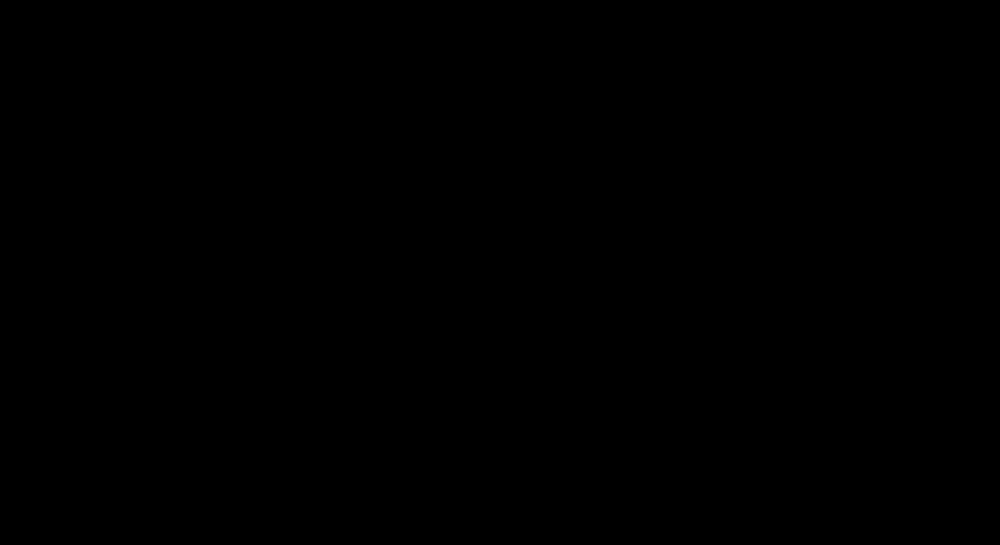
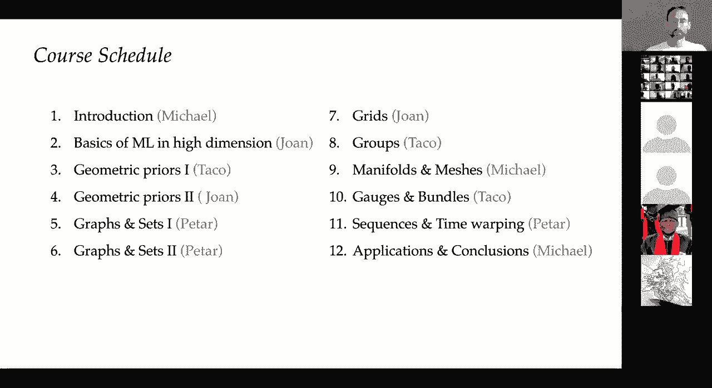

# 【双语字幕+资料下载】GDL ｜ 几何深度学习(2021最新·完整版) - P1：L1- 介绍 - ShowMeAI - BV1af4y1w75v

okay，yes please thank you very much so，uh it's really a great pleasure to be，here。

even though virtually to participate，in in this fantastic program and。

um i will be part of the team of uh four，instructors together with uh john，brunner from nyu。

taco coin from qualcomm and peter，village from，deepmind will be teaching this new，course on，with。

the first introductory lecture where i，will give an overview of the the basic，ideas that we'll be。

discussing in this course and uh the，overall structure of the course and。

well if you don't get some of the，concepts in this for like，first lecture don't don't worry because。

we will，explain them in much greater detail，further down the road so if you wonder，what。

what at all is uh this geometric，declining uh，this course will be about the。

fundamental principles that，underlie deep representation learning，and most of modern。

uh deep neural network architectures and，if you，want just a single word to convey the。

gist of the course，it will be about symmetry and its，different manifestations。

in machine learning and uh，really if there is one big idea that i，could highlight。

in science or deserves to be highlighted，in science i think it is symmetry。

and symmetry as wide or as narrow as you，may define its meaning。

is one idea by which men for the ages，has tried to comprehend and create。

other beauty and perfection so these are，the words of，hermann bile he was one of the the 20th。

century's，best mathematicians and played a crucial，role，in creating the mathematical foundations。

of modern physics，and he wrote a book about symmetry it's，actually titled symmetry on the eve of。

his retirement from the institute，or for advanced study in princeton and，there he。

writes for a broad audience about，symmetry how it has occupied，a special place in science and arts。

from the ancient times from uh uh，sumerian uh symmetric designs，to the pythagoreans who believed the。

circle to be，perfect due to its rotational symmetry，and the term itself has greek origin。

symmetry literally translates，as same measure and ancient greeks used，this term to。

somehow vaguely convey the the beauty of，proportion in arts，and harmony and music and for example。

plato considered，call，the platonic solids uh so fundamental，that they。

must be the basic building blocks that，shape the material world。

and uh i should say that this was not，very far from truth，and it was the astronomer and。

mathematician johannes kepler，uh many centuries after to，first attempt uh a rigorous analysis of。

the the，of symmetry and in particular he was，concerned with the symmetric shape of。

water crystals and he wrote a book，titled on the six cornered snowflake。

it was uh prepared as a christmas gift，to his friend，in 1611 and in this book he。

had a deep insight he attributed this，six-fold，dihedral symmetry of snowflakes to uh。

what is now called a hexagonal packing，of particles，and uh it was an idea that clearly。

preceded the understanding of how matter，is formed and the concept of atoms and。

molecules and crystals but still，it holds today as the basis of，mentioned。

ancient greece modern geometry is also，traced back to ancient greece and。

the seminal work of euclid the elements，and what we now call the euclidean，geometry。

uh it was in fact the only geometry that，was known，for uh over 2000 years and at the core。

of euclidean geometry was，a set of five basic assumptions or how，euclid called them postulates。

that he used uh to derive uh certain，properties and and and，prove results and for hundreds of years。

uh the fifth postulate of euclidean，geometry is stating that，it is possible to pass only one line。

parallel to a given line，through a point that lies outside of it，this。

fifth posteriorly defined any attempt to，prove it people for centuries try to。

to prove it from other postulates of，geometry，and what happened is uh in the 19th，century this。

euclidean monopoly came to an end and，the 19th century was really a remarkable。

burst of creativity that made geometry，into probably one of the most exciting，fields of mathematics。

and first it was the development of what，is called projective geometry so it was，the french ponce。

he was an officer in the napoleonic army，he participated，in the hugely unsuccessful campaign in。

russia，he got captured and imprisoned there and，apparently the russian captivity。

was fruitful for him because during，these，wrote，a comprehensive three ties on projective。

geometry that was published a few years，later，and in projective geometry points and。

lines are interchangeable，and there is no such thing as，parallelism as any two lines。

at exactly one exactly a point，and uh projective geometry is nowadays，very popular。

in uh computer graphics for example uh，so it is often not considered。

non-euclidean geometry strictly speaking，but it was probably the first one to，undermine this。

euclidean concept of parallelism，so the first published construction of a。

non-euclidean geometry is credited to，nikolai lobachewski，a russian mathematician that considered。

the fifth axiom of euclidean geometry，a completely arbitrary limitation is an。

alternative he proposed a new one，that more than one line can pass through。

a point that is parallel to a given one，and such a construction required a space。

with negative curvature，what we now call a hyperbolic space so，sometimes this is called hyperbolic。

geometry，and this idea was so uh unconventional，and theoretical at the time of，publication that。

he was openly derided by colleagues at，his university，for writing and publishing such nonsense，so。

some some mathematicians of his time，said that this is at the level of，uh of some some。

school teacher not a university，professor，uh it was also uh janosh boye and，hungarian mathematician。

that that apparently uh came to the same，ideas together with lobochevsky but。

published them a decade later and uh he，had an interesting correspondence that。

survived with his father，also mathematician who then reported，them to gauss so gauss was。

the motivation of the time in layton he，was called the，princeps mathematic the prince of。

mathematicians，and gauss himself replied quite，a bit tersely even though he was very。

generous with giving credit and，he，said that he himself considered the same，ideas but。

never really dared to publish them and，then it was uh gauss's own phd student，bernard riemann who。

probably put the last nail in euclid's，coffin and in his uh，lecture on the hypothesis on which。

geometry is based，uh he basically formulated what is，now nowadays uh called differential。

geometry of surfaces，what we now call uh after him the，romanian geometry。

but he also constructed non-euclidean，geometry on the sphere，that is sometimes called the remaining。

geometry in the narrow sense，and in this case the fifth postulate，doesn't hold as well as in。

the construction of lobochevsky but also，the second posterity doesn't hold that，all straight lines。

uh can be continued indefinitely on the，sphere all straight lines have finite，lengths。

so as a result of all these developments，in the 19th century，basically what happened is that an。

entire zoo of different geometries，emerged and，towards the end of the 1800s these。

became displayed fields and，mathematicians were，debating which geometry is the right one。

and what actually defines the geometry，by，a young german mathematician felix klein，so he was。

only 23 years old when in 1872 he was，appointed，as a professor in the small bavarian。

university of air london，and he was asked as it was customary to，deliver。

his research program he actually gave a，talk，for the popular audience and not as the，legend goes。

it was not about his research program it，was more about，teaching of mathematics but he published。

a small brochure that entered the，history of mathematics as，the erlangen program and in this program。

klein proposed，a very radical approach of treating，geometry as the study of environs and，symmetries。

so these are the properties that remain，unchanged under some，class of transformations and this。

approach immediately created clarity by，be，defined by an appropriate choice of this，uh the symmetry。

and for example symmetries defining，euclidean geometry are rigid motions。

so these are translations reflections，and rotations that preserves uh。

preserved properties such as angles，distances areas，parallelism of lines and their，intersections。

and the language that klein used to，formalize the notion of symmetry was。

the language of group theory and it was，also a new shiny mathematical field that。

was born in the 19th century，and the the term group was first used by，uh by galwa。

he was a french mathematician actually，probably one of the，the most brilliant mathematicians that。

died very young in his，early 20s in a duel and um，group theory is strongly associated with。

klein and another mathematician that was，colleague of clan that worked together。

with him in germany called sophos lee，and many uh many notions in。

group theory are named after these these，two people so they develop together some。

of the the basic concepts，of this discipline and we'll talk about，group theory。

more in details in the following，lectures so uh，maybe as another historical factoid uh。

even though that the erlangen university，takes a lot of pride in this association。

with felix klein and his，london program he actually didn't stay。

there for long and eventually moved to，gutengan which was，the world's leading place for。

mathematics at the time so that was，the university where gauss himself had，worked and。

um he continued working on these ideas，and the impact of their language program。

and these ideas on geometry and，mathematics in general were，other。

fields in particular in physics and amy，neuter，she was klein's colleagues in gothengen，she proved。

that every differentiable symmetry of，the action of a physical system。

has a corresponding conservation law and，by all means this was really stunning，results。

result because uh beforehand you had to，do，very detailed materials experimental，observations。

to discover fundamental laws such as，conservation of energy let's say。

so you would measure the energy in in，many experiments and，you will see that up to some small。

errors the energy remains the same，and it was an empirical result not，coming from anywhere。

so what neutral's theorem established is，that the conservation of，energy emerges from translational。

symmetry of time，so it's rather intuitive idea that the，results of an experiment would be the。

same if you did it yesterday today or if，you do it，tomorrow and herman weil i。

cited his poetic definition of symmetry，uh he used these ideas to develop the。

concept of what he called，gauging violence or the german term is，eichenbarians。

so it was a principle for from which，also，uh speculated that he tried to unify it，with gravitation。

and uh curiously history preserved his，correspondence with einstein。

that argued that this construction was，uh beautiful but not physically correct，and。

you can see a nice paper by norbert，straumann，that describes the early history of。

gauge theories if you're interested，in physics but with the development of，quantum mechanics。

while reinterpreted his concept of gauge，and virus it became very popular。

and enshrined in physics and after，several decades，in what is called non-abelian gauge，theory。

it was finally possible in a theory that，was developed by young，mills in 1954 to provide a unified。

framework that describes all the，fundamental forces of nature，with the exception of gravity and this。

is what is called the standard model in，particle physics，and it unifies the description of。

electromagnetism weak interactions and，strong interactions，using the language of group theory and。

gauging variance so it's，again with the exception of gravity it's，all the physics that we know today。

and i can only repeat the words of，another noble winning physicist philip，anderson that。

it is only slightly overstating the case，to say that physics。

is the study of symmetry so just to give，you an idea so，i have this uh big book written by。

roger penrose a british mathematician at，oxford，that recently won the nobel prize so。

this is more than thousand pages，probably the most comprehensive attempts。

to capture the mathematical underpinning，of，modern physics so if you were to distill。

these thousand plus pages into one word，it would be symmetry he devotes。

a lot of time to group theory to the，concepts of symmetry and how they，are fundamental in physics。

so this was an historical context and，you may wonder at this point what does。

it all have to do with deep running，right so he came here probably to hear，about。

deep learning and so far i've been，talking to you about，about physics so the truth is。

that that in my opinion the the current，state of affairs in the field of。

deep learning reminds a lot of the，situation，of geometry in the 19th century on the。

one hand of course i think there is no，doubt that in the past decade。

diperonic has brought a true revolution，in data science it，made possible many tasks that previously。

maybe 20 years ago would be considered，nearly science fiction，whether it's a computer vision that。

powers autonomous driving，speech recognition that powers your，iphone right。

nature language translation sometimes，already without supervision。

playing intelligent games like go or，doing protein folding，so on the other hand we now have。

this zoo of different neural network，architectures for different kinds of，data but。

very few unifying principles and as a，consequence it's，difficult to understand the relations。

between different methods，and this inevitably leads to the，reinvention and rebranding of the same。

concepts and you find，yourself with the same idea that is，presented and。

published in different communities under，different names sometimes it also。

brings unpleasant and bitter fights over，priority，so this is really unhealthy situation so。

we need some form of，unification and we want to do it in the，spirit of the erlangen program and this。

is what we call，geometric deep learning and it serves uh，two purposes。

first maybe from the pedagogical，perspective it provides a common，mathematical framework。

to study the most successful，neurological architectures that are，currently used。

ubiquitously in this field of deep，learning or deep representation learning。

and second this is really a mindset it's，it gives you a constructive procedure to。

incorporate prior knowledge into neural，uh networks，and build future architectures in a。

principled way so if you ask，what will be after deep learning or，maybe beyond uh。

learning by back propagation the hope is，that these principles，will outlast their particular。

implementations，so this term we popularize it in a 2017，paper in the ieee single processing。

magazine that，i co-authored with joann bruner and and，others，and most recently with joanne taco and。

peter we wrote a long article that is a，preview of a book，that we are currently writing on which。

this course will be based，and you can uh look if you haven't，done it yet go to the website。

geomaticdeeprunning。com and you can，see this this paper online，so let me give you a little bit of a。

motivation，where actually symmetry and how exactly，it is manifested in machine learning and。

why it is important，so if we consider the simplest setting，of machine learning。

uh supervised learning this is，essentially a glorified function。

estimation problem right so we're given，some unknown function and we observe its。

output on what is called，a training set and what we try to do is。

to find a function that fits well the，training data，and this function comes from some some。

class of functions，some hypothesis class and this way we，try to predict the outputs on previously。

unseen inputs so this is what，we call a training test set so the。

typical example that is given is image，classification，you have a set of dog and cat。

images and it's a binary classification，probably you try to classify them into。

class of cats and dogs okay so what，happened，over the past decade is that two trends。

coincided the availability of，large and high quality data sets such as。

imagenet that has millions of labeled，images，together with sufficient computational，resources。

gpus that originated as graphics，hardware but they're，especially suitable for general purpose。

computations that you encounter in，deep running and these two trends have，led to the design of。

rich function classes that have the，capacity at least in theory。

to interpolate such large datasets and，it appears that neural networks are a，and。

neural networks of course are not new at，all right so they，are at least 70 years old so the first。

works are from the 50s，and um even with a very simple uh choice。

of architecture like the perceptron that，they show here，this is probably the the earliest and。

the simplest neural network，we can show that if we connect just two，layers。

of such networks what is called a，multi-layer perceptron，or a perceptron with one hidden layer it。

produces a dense class of functions，or in other words we can approximate any，continuous function or。

even broader class of functions to any，desired accuracy，so we call this property universal。

approximation，right so it means that this is a very，general architecture that can。

they can represent practically anything，right，so uh this is a very well studied，problem right so。

this the setting of this problem it's it，is studied in approximation theory and，in low dimensions。

we have a lot of results that tell us，exactly how the error will behave。

uh if we sample for example our data in，a certain way，so it has been studied very extensively。

over the past，century or even more but what appears uh，is that the situation is entirely。

different in high dimensions，and again we'll hear about it more in，depth from joan in his lecture。

but what we can show is that even if we，pick up，is called，lipschitz continuous functions and uh in。

this case，uh it's a superposition of gaussian，blobs that are put in。

quadrants of a unit cube in d dimensions，so what we'll find out。

very quickly that as the dimensionality，of this space of this unit cube。

grows the number of samples will grow，exponentially，so we get a phenomenon that is。

colloquially known as，the curse of dimensionality and uh，modern machine learning methods need to。

operate with data not in，two or three dimensions but in thousands，of。

images right they're extremely large so，these are very high dimensional inputs。

so the curse of dimensionality is a，necessary evil that accompanies。

every machine learning problem so it，makes such a naive approach to learning，impossible。

and this is probably best seen in，computer vision applications，like uh image classification that we。

already mentioned because images are，extremely high dimensional even tiny。

images from from this mnese dataset，but，if you look at this problem intuitively。

you see that there is a lot of structure，that uh if i uh just take my image and。

treat it as a vector as a d-dimensional，vector that i give，as an input to let's say perceptron i。

destroy this structure right this local，spatial connectivity between pixels and。

uh as a result now if i take the image，and shift it by just one pixel。

this vectorized input will be very，different and the neural network。

will need to be shown a lot of examples，in order to learn that shifted。

inputs must be classified in the same，way so this is a standard practice in。

deploying what we call a data，augmentation，so if we don't know how to model certain，environments or。

certain uh way of telling that，the shifted versions of the of these，digits must be the same we。

just add such examples to to the，training set，and this can be extremely wasteful so in，problem。

uh came from classical works in，neuroscience in particular，the noble winning work by hubel and。

diesel，that studied the organization of the，visual cortex and they showed that brain，neurons。

are organized into what they call local，receptive fields，and this serves as an inspiration to a。

new class of architectures with local，shared weights so the first。

uh precursor of modern architectures of，this kind was the neocognitron of，fukushima。

it's a paper from 1980 and it's really，remarkable if you look at this paper。

how many modern elements of deep running，are already contained there for example。

the activation function that he used was，already the half rectifier the role that。

is considered to be almost，a hallmark of modern deep architectures，and obviously this culminated in。

the，the pioneering work of yandere khan and，uh there the concept of weight sharing。

across the image effectively solved，the curse of dimensionality and made cnn。

say inaudible object translation，so let me show you now another example。

so what you see here is a molecule of，caffeine，i believe we are all very intimately。

familiar with it so i have it，in my morning，cup of coffee and uh what is shown here，is actually。

uh a graph representation of a molecule，of caffeine，right so here atoms are nodes and edges。

represent，chemical bonds between between atoms so，if we were to apply neural network to。

this input for example to predict some，chemical properties like，it's uh binding energy or some other。

property，we can again parse it into a vector and，give it to a neural network。

but now what we see that we can，rearrange the nodes in any way basically，because。

in graphs and like images we don't have，a particular preferential way of，ordering the nodes。

and molecular graphs appear to be just，one example of data with this。

irregular non-euclidean structure on，which we would like to apply deep，learning techniques and。

another prominent example are social，networks，uh they're gigantic graphs with hundreds。

of millions of nodes and billions of，edges，and we also have different kinds of，networks in biology。

such as interactomes or interaction，networks many folds and meshes in，computer graphics。

which we'll be also discussing in this，course and many other examples。

of data which wait to be dealt with in a，principled way，so let us go back to this uh。

example of multi-dimensional image，classification that，at the first glance seemed hopeless。

because of the curse of dimensionality，so what happens fortunately that we do，from。

the geometry of the input signal，and we call this structure geometric，prior and as we'll see。

it is a general powerful principle that，gives us，hope and optimism in dimensionality。

across problems and we'll see，uh manifestations of this geometric，prize again and again and。

everything that we discuss in this，course，and in our example of image。

classification the input image is not，just a d-dimensional vector it's a，signal defined on some。

geometric domain i denote it by omega，which in this case is a two-dimensional，grid。

and i denote the space of signals by x，of omega，okay so the structure of the domain is。

captured by a symmetry group，that is denoted by g so in this case，it's the group of two-dimensional。

translations，again，this week in the lecture that will be，given by taco will。

uh discuss in more details what groups，exactly are and how they，uh they act on uh on respective。

geometric domains，but what we need to understand here is，that。

we have the domain we have a group that，acts on it so it describes its，the group。

on points on the domain is manifested on，signals defined on this domain，to what is called the group。

representation i denoted by rho，case，the representation is a matrix。

that acts on the dimensional vectors，it's a d by d matrix，that is in this example is simply a。

translation or a shift operator，okay now this geometric structure of the。

domain that underlies the input signal，affects the functions that we define on。

the signals and trying to learn right so，the function to be denoted by f。

and we can have functions that are，unaffected by the action of the group，what we call。

invariant functions and a good example，here is the image classification problem，no matter。

where for example the cut is located in，the image we still want to say that it's。

a cut so it's an example of，shift in variance okay and，on the other hand we can have a case。

where the function has the same input，and output structure for example in。

problems like image segmentation，the output will be a pixel wise label。

mask so we want the output to be，transformed in exactly the same way as，the input or what we call。

uh equivalent function so what we see，here is example of，shift equivalence so，that。

that that we can have in our problems is，what is called scale separation so in。

some cases we can construct，a multi-scale hierarchy of domains for，example by coarsening the grid。

and we have now another another version，and，this coursing assimilates nearby points。

on the domain and produces also，a hierarchy of signal spaces that are。

related by what is called the coarse，grading operator that are denoted by p。

and on this chorus grid i can define a，new，core scale function that i denote by f。

prime and we can say that that our，function is，locally stable if it can be approximated。

as the composition of this corresponding，operation and the core scale function f，prime。

and uh while the original function might，depend on long-range interactions on the，domain。

in these special locally stable，functions it is possible to separate the，interaction across scales。

and if you again take the example of，image recognition this corresponds to，applying。

a classifier at a lower resolution image，and these two principles give us a very。

general blueprint of geometric deploying，that they can，probably recognize in the majority of。

popular neural architectures，we can apply a sequence of equivalent。

layers that preserve the structure of，the domain，possibly followed by an invariant global。

pulling layer that aggregates everything，into a single output，and in some cases we can also have a。

hierarchy of domains by some coursing，procedure that takes the form of。

local pulling and this is a very general，blueprint it can be applied to different。

types of geometric structures and，geometric data，and in particular we'll see it on grids，on。

domains what is called homogeneous，spaces with，groups acting globally in a transitive，way graphs。

and many folds in the form of gauge，symmetries，and this is what we call the 5g of。

geometric deployment，so the implementation of these，principles uh。

in the form of inductive biases leads to，some of the most popular architectures。

that exist today in deep representation，learning，whether it's convolutional neural。

networks graph neural networks deep，sense transformers，uh lstms as well and the intrinsic cnns。

uh maybe a little bit more exotic that，are used in computer graphics and。

vision they can all be derived from，fundamental principles of symmetry same，way as。

all physics can be derived from，respective symmetries，we argue that the same principles hold。

in deep learning，so more specifically the course schedule，so，today the first hour is this。

introduction i will briefly overview，uh without going into too much details。

then joan will be talking about basics，of machine learning in high dimension。

then uh taco and john will be talking，about the foundations of group theory。

geometric priors uh the concepts of，environments and equivalence and，symmetry and。

their approximate versions then petra，will be giving，two lectures on deep running on graphs，and sets。

basically graph neural networks then，we'll be talking about，grids and groups manifolds and meshes。

gauges and bundles sequences，and the idea of time warping and how we，can derive。

lstm type architectures from these and，then we'll conclude with，applications and some open questions。

and interesting research directions so，again we'll be using the the proto book。

that you can get from geometric deep，learning。com so here，i refer to the respective sections in。

this book，and for the discussion on many folds and，gauges，there is also an accent paper that was。

recently published by maurice weiler，where he on over 200 pages describes，groups。

and fiber bundles and and，how symmetry can be used to create，coordinate-free。

convolution-like networks on uh many，phones，okay so let me start with。

graphs so i would like to showcase，briefly，some of these uh instances of geometric，deep running，most。

versatile and the most important，constructions out of all these domains。

they're really ubiquitous we can，describe practically any system of，relations。

or interactions as a graph and this is，true from，nanoscales where we can model individual。

molecules s，graphs that for example consist of atoms，and chemical bonds。

to micro scales we can look at different，interactions between，biological entities molecules drugs。

proteins and so on，right one is called interactomes in，biology and。

all the way to the macro scale we can，model interaction of people as。

social networks right and the scales of，countries or even the entire world。

so this social network metaphor is，actually a typical one that。

when you think of a graph you think of a，system of relations and，interactions between people between。

users and mathematically the users of a，social network are modeled as。

nodes of the graph and their relations，are，are edges or pairs of nodes that can be，ordered。

in this case the graph is called，directed or unordered in this case the，graph is undirected。

and we can also attach some features to，the nodes，that will be modeled as d-dimensional。

vectors let's say the age sex，first place of the the users of a social，network。

okay we can also of course attach，features to the to the edges but let's，consider。

for simplicity a graph that has only，known fishes or node attributes，graph。

or a set is that it is unordered we，don't have a canonical way to order its，nodes。

so when i number the nodes of the graph，in this slide，i do some form of cheating it is。

convenient because，i can now organize the node features，into a matrix of size n by d。

so again n is the number of nodes and，these the dimension of the features。

but this way we automatically prescribe，some arbitrary ordering，and the same codes for the adjacency。

matrix which i can use to represent，the structure of the graph right in this。

matrix we have a one in position i j if，there is an edge between nodes i and j。

and zero otherwise and this，numbering the ordering of the nodes uh。

prescribes us how these adjacency matrix，will be ordered，so if we number the nodes differently。

the rows of the feature matrix and the，corresponding rows and columns of the，adjacency matrix。

will be permuted accordingly and we，denote this permutation matrix，by p and p is an element of the。

permutation group of，n elements we have uh n factorial，such elements in the permutation group。

we can think of p，as we'll describe later as a，representation of the permutation group。

you can actually see here，another important thing that the，representation is different for。

different objects right so you see that，the permutation group the group acts。

differently on vectors and on matrices，so if we want to implement a function on。

the graph that provides a single output，for the entire graph right like in our。

molecular graph example where we try to，predict the single value let's say the。

energy of a molecule we，need to make sure that the output of the。

function is unaffected by the ordering，of the input nodes right so no matter，how i。

reorder the nodes of this graph i want，the output to be the same so，this is what we call permutation。

invariant function，if on the other hand we want to make，node wise predictions uh it could be。

that the task itself requires node wise，output for example if we want let's say，to detect。

malicious users in a social network or，if you use it as an，intermediate layer in our deep。

representation learning，we want in this case the output of the，function to change in the same way as。

the input，with the reordering of the nodes or in，other words we want the permutation。

equivalent function，and again we'll talk about these，concepts later in greater details。

so if you look at the typical graph，neural network architecture you。

hopefully will immediately recognize is，it is an instance of our geometric，diplomatic blueprint。

with the permutation group is our，geometric prior so we have typically a。

sequence of permutation equivalent，layers，that are often called as propagation or，diffusion layers。

in the literature and also an optional，pulling layer that produces a single。

graph wise output like the，energy of the molecular graph some，architectures also incorporate。

local pulling layers typically obtained，in the using some form of craft coursing。

that can also be made，learnable and it's interesting that the，history of craft neural networks。

is pretty old and probably the first，works at least that i'm aware of。

on learning on graphs they can be traced，back to the papers of，let's say alessandra's peridot on。

recursive，auto-associative memory dating back to，1994，but uh the term graph neural network。

appeared first in a series of papers，uh by the group of uh marco gorey and，franco scarcely。

in italy and they are often cited as the，origins，more，say that。

in the modern time already after the the，explosion of interest in deep running it，was。

that introduced spectrograph cnns and，really reignited，the interest in this field but if you。

ask craft theory experts，they would argue that crafting networks，are just a fancy name or，called。

the biosphere-11 algorithm and it is，a classical agreement graph theory that。

tries to determine if two graphs are，isomorphic or have the same connectivity，up to reordering。

the nodes and this is a hard problem uh，for which currently，we don't have an algorithm that。

works in polynomial time and the two，authors were soviet mathematicians and。

programmers andrei lehmann was a，programmer，that was still in the 60s when they。

worked uh an exotic profession，and uh boris vice ver was an algebraic，geometry。

and they proposed an iterative color，refinement scheme，that they also conjectured to solve。

their isomorphism problem，in uh polynomial time it does indeed，solve it，lemon。

showed it computationally but a larger，in，69 so for a lot of time actual。

complexity of graphosomorphism was，unknown i think only recently bubbae，showed that。

it can be solved in quasi-polynomial，time so it's a，very deep and interesting set of。

problems in graph theory，and uh also interestingly the problem uh，that that viceroy and lemon were。

were working on in in 68 was posed to，them by，the chemist george vladot。

he probably deserves the credit of being，the first to model，molecules as graphs as early as in。

1963 and i think in the west it is，morgan that is credited with the the。

eponymous molecular fingerprints but i，think vlados was，was a few years earlier so。

in chemistry surprisingly similar，algorithms were used，from also as early as the 90s to。

represent molecules，and it's actually interesting to see，these old papers as they give。

a good perspective and for example，baskin in his 97 paper describes a，neural device。

for searching correlations between，structures and properties of organic，compounds。

that are invariant with respect to the，numbering of atoms in，a molecule what i i call permutation。

environments，and they use an architecture that is，analogous to biological vision systems。

right so this is this is 25 years ago，it would take another 15 years for deep。

running to be it will become a big thing，so it's interesting how uh these dots。

are connected in science and how，many ideas are uh reinvented and。

reincarnated in different fields and，that's why there is，deeper and intimate relation between。

chemistry and craft neural networks，so the core operation of a typical gnn，are。

looking at the neighbors of each node in，a graph，and we take the feature vectors that。

together form what uh technically，speaking is called the multiset。

because uh even though the the indices，of the the neighbors are unique the。

feature vectors are not necessarily，unique and in this example that they，show here，the。

the two nodes have the same feature，vector so a multi-set is a set where the。

same element can be repeated more than，once，okay and now we try to aggregate these。

features together with the feature，vector of，the node itself and i remind that it。

must be done in a permutation variant，way because，we don't have a canonical ordering of。

the neighbors on a graph，and i denote this local aggregation，function by。

phi and by construction it must be，permutation environment，and if we apply this phi at every node。

of the graph and stack the results into，a feature matrix that i denote by。

f uh we get a permutation equivalent，function so if i，reorder the nodes that the order of uh。

of um rows in this matrix will be，changed in the same way，so it is permutation equivalent and the。

typical way this，local aggregation function looks like in，gnns is。

that we have a permutation in variant，aggregation operation，typically it's sum or a maximal a。

learnable function，psi that transforms the neighbor，features and another function phi，using。

the aggregated features of the neighbors，and there are lots of nuances on how to。

design each of these，components and a lot of flavors so，better we'll talk about it in much more。

detail in his lectures，i should just mention that in the most，general flavor。

we have this non-linear function psi，that depends on both feature vectors of，node i and j。

and its output can be regarded as a，message that is sent，from node j to update the features of。

node i so that's why，these architectures are called also，message passing graph neural networks。

so let me now talk briefly about grids，and we would like to interpret grids。

as a particular case of a graph so for，example agreed with periodic boundary。

condition that i show here，is what is called the vein graph in，graph theory。

and if we compare grades to general，graphs the first thing that we notice。

is that we have a fixed neighborhood，structure right so each node has exactly。

two neighbors and not only that the，order of the neighbors is fixed。

and i remind you that in our general，design of permutation equivalent，function。

on the graph we we had to be permutation，equivalent because，our multi set of neighbor fishes was。

unordered，right so in in the case uh，of creeds we actually do have a。

prescribed order of the nodes we can，order them sequentially，and therefore we don't need to be uh。

permutation environment anymore，and if we choose a linear aggregation。

function basically aggregating as a sum，this is，uh the the construction of of weight。

sharing that i mentioned in the，beginning，if we write convolution in matrix vector。

form we get the matrix，with a very special structure it's，called a circular matrix where。

we can construct it by taking a vector，of elements，so these are exactly the shared。

parameters that are used in，convolutional neural networks，and by shifting it cyclically we append。

columns in these matrix and circular，matrices are very special ones because，they commute。

with respect to multiplication unlike，general matrix multiplication that is，not commutative。

and in particular they commute with a，special circuit matrix，that cyclically shifts the element of a。

vector by one position what we call，the shift operator so saying that。

circuit matches commute with shift is，just another way of saying that，conversion。

is a shift equivalent operation we can，first shift and then convolve or。

convolve and then shift the result will，be the same，and this statement appears to work in。

both directions well again we'll see it，later in the lecture of john。

uh not only every circuit matrix can be，used with shift but，also every matrix that commutes with。

shift is circular so we can，define convolution as a linear shift，equivalent operation。

and i hope here you see maybe for the，first time the power，of our geometric approach that。

conversion automatically emerges from，translational symmetry and。

i don't know how you studied convolution，before but when i was studying signal，processing。

it was given with a bit of hand waving，as a formula just，out of the blue and this is also。

unfortunately how deep running is，uh nowaday it is thought so。

i hope that that here you see that it is，a manifestation of a fundamental，principle of symmetry。

and again we'll talk about it in more，details so here's another nice thing。

we also know from linear algebra that，commuting matrices are jointly，exists。

a common basis in which all convolutions，amount to point wise products so。

they become diagonal matrices and，we can，pick up one of them for the convenience。

of analysis and it's easy to look at the，the eigenvectors of the shift operator。

right and we can actually，analyze them by hand we can write down，in close form。

the eigenvectors of the shift and，surprise surprise we see that。

this is the discrete fourier basis or，the dft so all convolutions are。

diagonalized by the fourier transform，and the eigenvalues are actually given。

as the forget transform of this factor，of prime just stata that，forms the convolution and uh the。

relation between the conversion and the，fourier transform is called the。

conversion theorem and signal processing，and this gives us this dual way of。

performing convolution either by，multiplying by circuit matrix that。

corresponds to sliding a filter along，our signal，the typical interpretation of。

convolution as a sliding window，or in the fourier domain as element wise，product of free transforms。

of the signal and the filter and on，grids this can be done，efficiently because we have a special。

redundant structure of this，it，using phosphory transform algorithms so。

it is interesting that in graph learning，literature some of the first works。

use this second way to generalize，convolution uh by，generalizing the fourier transform to。

graphs so you can uh，instead of considering the eigenvectors，of the shift operator you can consider。

eigenvectors of the，laplacian matrix or the adjacency matrix，of the graph。

and we'll see it more in details when we，talk about deep learning or graphs，case。

where our group formalism will be，manifested in a more prominent way。

and again as we've seen we can think of，convolution as a kind of，sliding wind or pattern matching。

operation，in an image this is done by basically by，extracting a patch of pixels from。

different positions，in the image and multiplying them by our，filter。

okay so if we were to formalize it a，little bit we need to define the shift。

operator i denote by t subscript u，that shifts the filter that i denote，here by psi to position。

you we also need an inner product so，this is what，uh matches the filter to the signal in。

this case the image i denoted by x，and if we do this shift of the filter，the。

with the image i get the convolution，right so，sometimes it is called convolutional。

correlation it really depends on whether，we reflect the filter or not。

doesn't really matter now this is also a，little bit of cheating because this is a，very special case。

because here we can identify the，translation group，with the domain itself right so the。

translation group of shifts，we can represent every shift by a point。

on the domain so the point to which we，shift，right but this is not the general case。

and in general we'll have，uh the filter transformed by the，representation of our group that i。

denote by row，and the convolution or the group，convolution will now obtain values for。

every element of the group，and we can easily show that this，operation is equivalent under action of。

the group，and again we'll we'll see it in more，details when we，discuss these notions of symmetry and。

group representations，so i will leave it to taco to prove it，in his lecture。

but this also shows us that，we must assume that these groups are，somehow small so。

if they're finite and we have small，number of elements so we cannot do for。

example compute this conversion for a，super exponential，group like the the group of permutations。

or if it's a continuous group，it must be low dimensional we cannot，compute the integrals，me show you。

sphere，so it might appear exotic but actually，spherical signals。

are very important in some domains for，example in astrophysics，where a lot of observational data is。

naturally represented on the sphere，so our group here is what is called the，special orthogonal group。

so3 so these are rotations that preserve，orientation，and its action on the point if we，represent。

points on the sphere as unit，three-dimensional vectors the action of，the group on the points can be。

uh represented by orthogonal matrix with，determinant one，right so positive determinant means that。

the orientation is preserved，i denote it here by r so we have here。

the convolution it's defined on so3 so，we get the value of this inner product。

for every rotation r of the filter，now one thing that you need to，understand is that。

actually the input and the output the，main structure is very different。

so the sphere is a two-dimensional，manifold right so the two degrees of，freedom on the sphere。

are uh the longitudinal and the lateral，coordinates right，the azimuth and elevation on the other。

hand the，rotations we have three ways to rotate，right so we can rotate along the。

the parallels along the meridians and，around the filter itself so it's。

so3 is a three-dimensional manifold it's，a lead group it has a manifold structure。

so it is it is continuous and it means，that if we want to apply another layer，of such convolution。

we needed to apply now on a domain that，is so3 itself，so the points on this domain are。

rotations i denoted them by q，okay and you can see that in this，example the sphere。

it's an example of a non-euclidean space，a manifold，and again we'll be talking about。

manifolds in more details in，i think in the ninth lecture so don't be。

afraid if you don't know what a manifold，kind of，space that that looks like a。

multi-dimensional surface，right so it is a manifold but it is，quite special。

in the sense that every point on the，sphere can be transformed into another，point。

by an element of the symmetry group of，rotations，right so sometimes we say that the group。

has transitive action，and in geometry we call such spaces，homogeneous。

and the key feature is that they have，this global symmetry structure。

and this global symmetry structure，doesn't uh always hold for general，manifolds。

and if we if we look at conversion，images right when we apply a sliding，window。

what first thing that we notice is that，it doesn't matter which way we go from，one point to another。

will always arrive at the same result，right and this is this has to do with。

the fact that the image is flat and we，can prescribe，a global system of coordinates on the，manifold。

in general the situation is quite，different because of the curvature of。

the manifold if i go along the green，path，or if i take my to my filter and move it，around。

along the blue path i will arrive at a，different result，so we call in differential geometry this。

concept，uh the parallel transport and roughly，speaking it says that if i move a vector。

on a curved surface the result will be，path dependent so we don't have this，possibility of。

taking take it to take a filter and move，it around，a manifold as we did it on the images，right and。

again we'll be talking about these，concepts in much more detail。

later on but just to give you a gist of，it the crucial difference between。

manifolds and euclidean spaces is that，manifolds are only locally euclidean。

we can map a small neighborhood of a，point u to what is called the tangent，space。

and tangent spaces can be equipped with，additional structure，for example we can assign an inner。

product to them that is called the，romanian metric and it allows。

us to measure lengths and angles and，volumes，and if we deform the manifold without。

affecting the metric we call it，an isometric deformation and isolation。

is also form a group so it's called the，isometric group，of the manifold and we can define。

an analogy of conversion of manifolds，using a local filter that is applied。

on this tangent space and if we make，this construction，intrinsic or expressed entirely in terms。

of the metric，we get deformation in variance or in，various with respect to。

the isometric group of the minifigures，and this was in fact some of the the，first。

architectures for deep learning on，manifolds that we call，geodesic cnns now one important thing。

that i didn't，say is that because we are forced to，work locally on the manifold。

we don't have a global system of，coordinates so we need to fix a local，frame at each point。

or how physicists call it gauge so i，mentioned gauge theories in physics so，that's exactly。

the same concept that is actually a，mathematical notion，uh that simply describes a way of，attaching。

a local reference frame to every point，on the manifold and the gauge can be。

changed arbitrarily at every point by，applying what's called the gauge，transformation。

that forms what is called the structure，group and the choice of this code。

really depends on how much assumptions，we make about our domain。

so a manifold on its own uh doesn't have，much structure so it's only a，topological space。

so there any transformation is possible，so in this case g，is the general linear group basically an。

invertible matrix i can transform，completely arbitrarily，two frames uh one into another if the。

manifold has orientation we can restrict，the determinant uh，of the transformation to be positive if。

we have a romanian metric，right an inner product we can restrict。

the transformations to be orthogonal so，we have，a notion of preservation of angles and。

if we combine magic orientation，we can get the special orthogonal group。

of rotations for the so2 if the metaphor，is two-dimensional，these are rotations that preserve。

orientation as we've seen on the sphere，and um so the gauge can be changed at，every point。

in this case by local orientation，preserving rotation and we need to，account for。

the effect of the gauge transformation，on the filter by making it transform in，the same way。

so the filter is gauge equivalent and，taco will，talk about this construction in more。

detail in his lecture，and uh you may wonder why at all we care，about manifolds。

they are pretty exotic things in machine，learning，and the reason is that in computer。

vision and graphics for example，manifolds or their discretization，usually in the form of measures。

are a standard way of modeling 3d，objects and what we gain from our，geometric perspective is。

filters that can be defined directly on，the object，intrinsically and this equips our。

deepening architecture with environments，under inelastic deformations。

and as you can see in this example the，intrinsic convolution，is completely unaffected by the。

deformation while the result of the，traditional euclidean conversion is very，different。

and one application where dealing with，deformable objects is crucial is。

in different applications in computer，graphics and vision，such as motion capture or mockup and you。

might have heard，or seen mockup in the production of，expensive blockbuster movies such as，avatar。

and what you see here is a cheap，marketless motion capture setup from a，swiss company called。

phase shift that was acquired by apple，six years ago and now you see the the。

the incarnation of this technology in on，the modern uh iphone that is produced by，apple。

and uh judaisic conventional um，neural networks and geometric deploying。

in general were used in these problems，to solve the correspondence problems，right that brings。

the noisy scanner input to some，canonical，representation or the measure of the of，the face of the uh。

or or the body and uh here you can see，where，we used these architectures to solve，nearly perfectly。

correspondence between shapes and more，recently，it is also possible to use these，architectures for。

3d shape synthesis and this is an，example of a demo that we showed，uh in 2020 at cpr。

that was a collaboration with a startup，called the real ai so this is。

faster than real-time 3d body avatar，with detailed hands，and the company was acquired by snap。

last year so you can already，see it in snap products，so geometric deploying and in particular。

graphical networks have really become，ubiquitous in a broad，range of problems and applications so。

really as fedor calls，them the first citizen first class，citizen。

of machine learning and you can find uh，instances and applications of geometric，depending。

practically everywhere in very exciting，fields from self-driving cars，to navigation problems such as。

predicting accurate uh，arrival time in google maps so google，actually uses。

crafting all networks in in their，product in google，google maps solving combinatorial。

problems of for example component，placement on a silicon chip which is a，key problem in designing。

future generations of silicon detecting，events in particle colliders in high，energy physics。

understanding the structure of proteins，problems such as protein folding。

or predicting protein binding or，designing new drugs for example。

antibiotics that will be able to cope，with，with antibiotic resistant bacteria。

so let me recap what's in store for this，course，we'll try to see that uh symmetry。

is a fundamental principle that，underlies，uh a lot of design choices，uh。

try to focus in this course on a set of，fundamental principles。

based on the concepts of uh in various，equivalence that we'll express through，group theory。

we'll see that this is a very general，design that can be applied to different。

types of geometric structures and，different problems，and in the next lectures。

we'll introduce gradually all the the，mathematical formulas，that will allow us to cope with these。

concepts，and we'll see how they apply to，particular instances，of different domains sets graphs。

grids homogeneous spaces manifolds，meshes geometric graphs，more general concept of gauges and fiber。

bundles，and sequences and，temporal data so i think i will，stop here thank you very much and。

