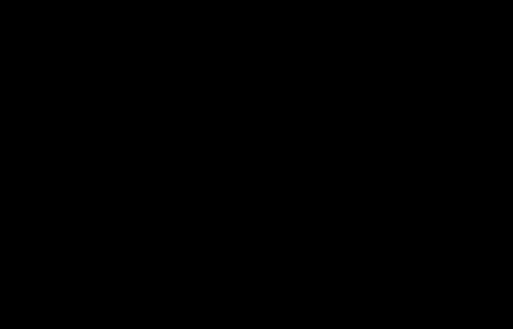

# 【双语字幕+资料下载】GDL ｜ 几何深度学习(2021最新·完整版) - P2：L2- 高维学习 - ShowMeAI - BV1af4y1w75v

so we may start now please yeah okay，um so hello everyone um，um my name is juan and i'll be giving。

you uh，today's second lecture after michael's，introduction，so i'm very happy to be here my name is。

juwan bruna，and i'm a professor at nyu new york，university，so today we are going to be spending a。

few minutes，talking about some basic principles of，learning in particular。

all the considerations that emerge as，one learns in high dimensions。

and please uh uh as i guess michael also，reminded if there's any question or。

something just feel free to interrupt，and also try to be i'll try to check a，campus wire afterwards。

okay so at the outline of the lecture，today we are gonna，uh discuss uh three stories three three。

three uh snippets of a high dimensional，learning the first one is um。

i wanted to give you kind of the few，basic elements so，just so that we can agree in notation。

and the concepts，on basic basic notions of statistical，learning。

then we are going to describe some of，the phenomena that is particularly。

adversarial that emerges in these，problems as one，looks at this the input space has become。

more and more high dimension，and then we are going to try to see a，possible outcome。

a possible way out in the third part of，the lecture where we are going to try to。

address the curves and this is really，going to be the，a good backdrop for the the next of the。

class right where we're going to really，be insisting，on this like possible way out okay。

so um i'm not sure you you had in this，master series，a dedicated class on statistical，learning i。

probably yes but here i i will just want，to try to keep things pretty high level。

and give you kind of what what i think，are in a nutshell if i had to summarize，it in one slide。

what are the main ingredients of，statistical learning like，like understood as the the task of。

extracting information，from possibly high dimensional and noisy，data。

there's basically four main ingredients，the first one is the，data distribution uh。

the next that thing that we need is some，kind of model，to extract like to to process。

information right so this typica，model can be a you know like a linear。

regression it could be like your neural，network，it could be a kernel machine that's the，model。

then we have some way to compare to or，to classify，choose good models from bad models。

that's the error metric，and then of course we need an algorithm，right that we need to some procedure。

that we can implement on a computer，to actually find this estimate right so，these are。

the the the first uh the you know the，main ingredients in this，in this task so why is it that the。

distribution，and i guess here um again uh，you probably have thought about this。

question quite a lot so，data distribution uh in the case of，supervised learning that um。

we're gonna be mostly focusing this，lecture contains，uh two sorts of inputs right the the x i。

that we're going to call the，inputs to the algorithm and y i that，could be。

can be the function that we want to，predict right the label for example。

and so here we are going to assume that，the labels have no nodes。

right so so the label y i you can always，assume that it's，some unknown function uh it's like i。

promise you that there's some，f star which is some function that is，hidden somewhere。

that is producing the labels and so now，we have really two ingredients in the。

data right so the first ingredient，is what we the data distribution in，which we draw the examples。

right so this is drawn from distribution，mu that is defined over a high。

dimensional space and then f star，is the target right the the thing that。

reduces the levels just two things，give things a bit more concretely uh。

for example uh s star could be uh if you，are working in a problem in chemistry。

uh it could be the the excitation energy，of a certain molecule。

x or if you are thinking about a binary，classification problem，that could be you know like the。

conditional probability，of certain class given and so，um as you know also。

these assumptions in the data and having，to make these models in the data。

is really essential right it's really，like the first step of，any kind of uh analysis of what happens。

in machine learning，because as you know there's no freelance，right there if there's no assumption on。

the data，uh coming either from the new，distribution or the target。

there's no way there's no way we can，actually generalize right so so，core。

of anything that we do in particular，also of what we're doing in this co in。

this context of geometric diploma，and as i said before please uh interrupt，me or。

feel free to ask any question even if，it's like a notation question or，whatever。

okay the second ingredient is the model，and so the model uh has also can be uh。

you know there's many synonyms to the，model uh you can maybe have heard it，like hypothesis class。

or the function approximation if you are，thinking more in context of。

personal learning so this is really just，a subset，of functions right so it's like mappings。

that go from the input space，capital x to the target space that here，i'm simplifying it。

just to that we are just predicting real，numbers，okay and so just to give some examples。

of what this thing could be，i mean you can think about hypothesis，classes that are i would say。

you know old style uh polynomials for，example of the greek，could be like you know pretty nice acute。

hypothesis space，but you of course you can make these，hypothesis classes a bit more。

fancy by maybe maybe trying to model，functions mappings，that involve neural networks like the。

this cute example that i'm showing here，in the box and so uh what we're going to。

be using at this lecture，and it's also something that that might，not be always explicit。

when you uh when you run your algorithms，but it's certainly always there。

is this notion that there's a complexity，measure，a complexity measure is always going to。

be there right and so，what is a complexity measure is think it，as a as a norm。

or like some quantity that you can，evaluate in your hypothesis，that is meant to organize to try to。

divide your hypothesis into those that，are simple，and those that are complicated and just。

to give examples of what this complexity，measure could be，in different situations for example if。

the complexity measure could be，how many neurons i have in my neural，network so smaller neurons。

might capture hypotheses that are，simpler than，networks that require many many neurons。

or if you are thinking，about problems that are a bit more uh，connected。

with uh let's say harmonic analysis，the another valid notion of complexity。

is this quantity that is that you see，here which uh，is if you have never seen it uh this is。

called the solo left norm，for a corresponding for a certain uh，index of derivatives first so here。

what this the the the what this quantity，would be telling you is that if this，quantity is very。

small it means that my function is，simple and what is it what this simple。

mean in this context of several spaces，it means that the function is very very。

very smooth right if i have a function，that has，many ripples and many complicated things。

i'm going to pay，i'm going to pay a price and here in，that case this norm is going to be，locked。

so obviously the algorithm the learner，will try to find hypotheses that have，small complexity。

and we are going to see why in just a，second，the third ingredient is the aerometric。

right and what is the aerometric，again this is a i'm hoping that i'm just，saying things that are。

quite familiar with for to everyone so，how do i construct the metric uh given，some。

i had even some initial notion of，comparing errors like the quality of my，output。

for example i could think about a loss，that is just a square，measuring the square distance right so。

if you are thinking about like，predicting，an energy is how far i am from the，ground truth right so。

and you can measure how far you are from，at the，the at the average square distance so。

once i have this uh pointwise，measure which means it's a measure that，i can evaluate at every point。

for every possible output i can now，consider the average，right the average and and there's two。

fundamental notions of average，in machine learning that are incredible。

that are intricately connected，right the first notion of average is。

what we call the population average，right and what is the population average，is the expectation。

for the data of this point wise measure，right so it's how well。

am i going to do on average with respect，to this data distribution。

and then there's another notion of，average that is the empirical average，right which is the。

the in the sense the training loss right，so it's like the，replacing the expectation over the data。

with the empirical expectation，and so obviously the all the headaches，of machine learning。

they emerge because we are trying to，solve，we are trying to make the population。

error small but we cannot use the，population error we have to use the，empirical layer。

right and so uh how far and you might be，at you might be interested in asking how，related。

right how how do they how do these two，notions of average relate to each other。

so the first thing that one that you can，that one can do of course is that。

if i if i fixed the hypothesis right if，i fix the function，f here if i look at this func at this。

quantity，with f fixed well this is just a，an average of iiv quantities right so，everyone every。

every one of these excise is a is，distributed iid from the distribution。

so by just the basic elementary，probability statistics，we know that the the expectation of the。

population of，the expectation so this quantity here，right this quantity is a random quantity。

right it depends on the training on the，draw of the training set。

so if i compute the expectation this，quantity，has the same expectation as this object，here which is。

deterministic so it's an it's called an，unbiased estimator，and the variance is something that i can。

compute point-wise right it's just the，the variance of a random variable that，is just obtained。

by composing uh this quantity f of x i，right uh sending the expect the random，variable x。

i through the function f right so if f，is fixed，this object is something that can be。

explicitly computed right the variance，has the this traditional dependence that。

you know from basic statistics right，because just i'm averaging iad，of uh。

of fluctuation right this this，relationship，between the training and the and the，testing error。

i cannot make it point once why，because i cannot afford the luxury。

of fixing my hypothesis to be fixed，right so like the，the function f is a function that i will。

be i will be using the training set to，find a better one，right so this notion of uh how。

the training and the tests relate to，each other i cannot make it point wise i。

need to do something instead that is，called a uniform，right so i would like to have a。

certificate a certificate some kind of，guarantee，that these two functions right if i look。

at these objects here，not as a random variable and an，expectation。

but just function like a random function，an expectation of a random function。

these these two objects as as functions，they should be close to each other。

and this is something that requires a，bit more um，a bit more than elementary statistics it。

requires actually empirical process，theory and you might be，you might have heard about rather marker。

complexities it's，one possible way to actually control，these two functions。

in a way that is valid for machine，learning，okay so this is the for the loss uh。

and now we have the fourth the last，ingredient，which is the algorithm，and so uh the again。

uh in terms of algorithms here we are，going to stick with uh very very simple。

basic objects so we are going to，describe uh empirical risk minimization，which i'm assuming uh，have。

heard it before so and i repeat what is，the goal of machine learning。

at least in the supervised sense is to，minimize，this function which is deterministic。

with only access to this，random function which is a hopefully。

not too bad estimator of the population，loss，and so as i said before we need to we。

need to be able to have，control of the fluctuations we need to。

we need to control the distance between，these two functions，in a way that it has to go beyond the。

point wise control，so predict is actually useful to uh，consider。

instead of the our holes the whole space，of our hypothesis that we call this，capital f。

before now we are going to consider not，all the hypothesis，but only those that have complexity that。

is not too large，so visually you can you can really，visualize this。

as i have a space of all possible you，know functions that i can implement from。

you know if you are using a neural net，for example，so you have all the space of all。

possible functions that i can express，with the neural net，and i'm only going to study for now。

focus on those that i can express with，small complexity，right and this is the delta here i think。

i think it has a，some kind of radius some kind of norm，right maximum norm that you can afford。

so once i have this uh set of a small，hypothesis like a hypothesis that has，more complexity。

now i can i can consider an algorithm an，estimator，that is called the empirical risk。

minimization and i'm just considering，i'm just here using the kind of a simple，uh。

in the simple form which is what's，called a constraint form，okay so here what is what does it what。

does it mean it means that in that set，i'm going to be picking a function here。

that can be i can write it as like this，f hat，delta right which is a function that is，in that ball。

that happens to minimize the empirical，risk，so if you have experience a little bit，in optimization。

you might be able to move it frowning um，when i present a constraint optimization。

an optimization problem in constrained，form right because it's a。

you know this constraint even though uh，in many cases this is a constraint that，is。

convex right so this is a convex，it might not be supernatural it's very，easy to use in practice。

so that's why maybe you might have seen，in other texts in other in other。

expositions that instead of using the，constraint form，we can also consider the penalized form。

right which is a，like you introduce a lagrangian，multiplier where the constraint now，becomes。

part of the optimization objective right，and so now we have a hyper parameter，here lambda。

that of course controls indirectly，the strength of the regularization right。

so this thing about this lambda this，delta，and this lambda as being a dual guard。

and then yet another uh form in which we，can actually do learning and critical。

risk minimization that is，maybe a bit popularized uh recently by，very large neural networks。

it's what's called an interpolation form，so what is the interpolation form。

it's a very natural estimator right so，i'm going to find a hypothesis。

and what does this hypothesis want to do，so because i，if i have if think about that i have a。

hypothesis space like functions that are，very expressive，right very very i can have many many。

many many functions i can choose from，so i can even afford to find functions。

that completely fit the data right so，having an empirical risk，that，so what so empirical risk。

zero what do you think let's think about，like risk works，this is equivalent to saying that。

for all i my my function，is equal to the target right this is，equivalent to saying that your。

l2 error empirically is here，so i can find amongst all the functions，all the hypotheses that。

pass through the data i'm going to，choose the one that has smallest，complexity。

and these if you if you try to do that，uh you know to a serious statistician，he。

he might be a little bit horrorized，because in general this is this。

assumption is actually this is something，that you can do，only if i promise you that there's no。

noise in the data right like the label，that we observe，here have no noise right and that's。

sometimes the luxury that we can make，in certain data sets like in imagenet or。

you know c4 etc sometimes we，life，that's not something that you would like。

to do right if you are working in you，know problems in computational science。

it's very rare that you can completely，trust the labels right but but。

if you if you have the luxury to do that，then you can consider this interrupt。

okay and so now we have uh the four uh，i spent a little bit of time trying to，describe。

this four main actors in the，in the in supervised learning，now let's try to see if together we can。

uh use them combine them to um，uh you know to say something meaningful。

about uh uh any guarantee of learning，and this is actually something that um。

um yeah it's a it's a it's a very simple，exercise but i'm hoping that uh at this。

point and we can try，still try to derive all of it together，okay。

so here's how we start we start from an，some，space like in in some ball in my。

hypothesis space and has certain，and now what we are trying to do is we。

are going to try to give you like a，guarantee，right we are going to try to say okay。

you have chosen this hypothesis，what can you tell me in terms of how。

well is it going to do in the test set，right so what is the risk what is the，population error。

that this hypothesis is going to，that，that's the population error of your，hypothesis。

the first thing i do is i subtract the，base line right and what is。

this baseline just to try to write it to，you it's the infimum，over all the hypotheses of the。

population right so，in other words this term that is in，yellow is the best you could possibly do。

a posteriori，right so if you had some oracle，that would give you as many samples as。

you want and you could have like，infinite computational resources you。

could have selected your the best，hypothesis in your quest after the fact。

that would give you this error okay，so let's try to look at this difference。

and and this uh this kind of like the，composition of errors，uh that the trick here is always the。

same，is that you have something that you want，to control and，and you want to and the way to intro to。

actually，make progress is always the same is to，add and subtract the。

the appropriate quantity right so we，need to take this difference。

and we need to break it like we need to，transform it into，multiple differences right so that we。

can start interpreting things，so any ideas of which term you would you，like to add and subtract here。

i'm just opening the floor for possible，otherwise i'll just move on that if，okay well i'll move on。

i hope that i hope that people are，following and i have no way to actually，check。

um i i think adding the infinite wave of，delta，okay yeah delta has to be played as we，hear very good。

thank you mohammed indeed so the first，thing we do，is that we take this difference and we。

add and subtract the best we can do，by restricting the complexity right so。

now we have a new term that appears here，which is this one that is subtracting。

and then we add it again，okay and now we have a one object that，we can start to interpret。

right so this object here what is it，telling us，what is this object here is the。

difference between the error，if i look at if i minimize it over the，full class f。

minus the error that i get if i only，look at the complexities，there's a，there's no。

nothing there's no empirical there's no，hats right it's a purely it's a pure，term。

that that is completely connected with，what we call approximation。

right so this is really a term that is，going to be of course if delta is very，very very large。

this term is going to get smaller so，this is actually what we call an，approximation error。

problem now let's continue，now we are going to introduce the，training right we need to introduce the。

empirical objective here，and so how are we going to introduce。

this empirical objective we are going to，over，of the test error over this ball we are。

going to add and subtract the infimum，of the training error in this ball okay。

so that's this new term that you see，here right it's，here subtracted and here it's added。

and i am also gonna i'm gonna add and，subtract，the empirical uh test like the empirical，uh。

like the training error right so here we，have this training error that appears。

and here it's subtract right so i i'm，not cheating，i'm just adding i'm adding and，subtracting terms。

okay so now we can start to interpret，again can someone tell me，what is this green term capture what。

does this green term tell us，it's the empirical is a training error，of my hypothesis。

minus the best training error in my ball，so if i'm able to solve the empirical。

base minimization problem，how much what is this term how long how，much does this term。

uh cost if i'm able to solve the，okay so this term is going to be zero。

right because the uh precisely i mean，if this estimator that i pick here，arbitrary is in fact。

the solution of the erm that's precisely，the definition of here，right so this term think about think。

it's like，that if i'm good at optimizing things，this green term is going to be small。

now i'm left with two terms here，that really smells that really look like。

something that compares that relates，the population objective with the。

training objective right so here you，have a point wise difference between。

r of f hat minus f r hat of f hat，and here you have a lot also like a，difference of minimizes。

of the loss functions so it's not，it's actually not hard to see that these。

two terms we can pack them together，right we can we can upper bound these。

two terms by basically the the two times，the largest the two times。

the largest fluctuation between the，training，and，one of these two turns right one of the。

two comes directly from this term，and the other one comes from this term，okay。

and you can actually very easily see，that if i have two functions right and i，want to minimize。

like the difference between this，minimizer and this minimizer。

i can always upper bound this difference，right this difference here so i can，always upper bound it。

by this difference right just because，this this point，is this minima is smaller than this。

point right and this is，also like a point-wise difference right，so i have two times the point the。

maximum point was difference，and now we are basically done because we，have a。

expressed over uh error or a test error，as a the error that we make at this time。

is actually a contribution of three，different sources of error，the first one is what we call the。

optimization error，right it's measuring our ability to，solve this of this empirical risk。

minimization efficiently the second one，is the statistical error which。

is some is a term that penalizes uniform，fluctuations，over the ball between the true function。

which is the test function，and the random function which is the，training error and then the。

approximation error，which is the the term that again，controls how well we can actually。

approximate the target function f star，with small complexity right i think that，i was actually just。

giving you the summary here and that's，and just also let me mention right that。

there's one term that here we put in，yellow that，you know it's not very important because，here like。

if you consider like a hypothesis spaces，that are very very very large。

for example neural networks the best you，can possibly do right like。

if so basically this is just that，if if the if the hypothesis space is。

stands then it means that the infimum，from f equal from f of the distance，between f star minus f。

this is it right so this is again is uh，equivalent，to this property here what is that this。

is actually a people understand that，okay so and and just as a wrap-up so。

actually uh the thing that we need，if we want to be able to learn in in，higher dimensions right。

well is that we need to be good at these，three errors at the same time。

so we need to have a small approximation，error and this，is something that we need to be uh try。

to exploit as much as we can the，hypothesis，like the prime information we have on。

the target function，we need to actually consider uh，hypothesis spaces。

where we can actually control these，fluctuations uniformly right and this。

again is a is a very beautiful，and deep uh topic aspect of statistical，learning theory that。

really tries to to to control this bound，for example with i said with the marker，complexities etc。

and then we also need the optimization，error right so you need to be able to。

to solve these optimization problems，efficiently，okay and so of course the the million。

dollar question，is uh how can you control this source of，error，at the same time uh when the problem。

like when the data，lives in a high dimensional space，okay now it's a good time for me to ask。

questions because uh，you can it's a good time to to stop and，ask questions。

i i'm not seeing the chats let me see if，okay i don't see any question there okay，so i will move on。

okay so now we are gonna try to to to，describe，how you know how some of these questions。

look or you know transform themselves as，one goes into more and more high，dimension。

and and you might have heard this term，of the curse of dimensionality。

i could hear some kind of echo but i，don't know i don't hear you now，okay。

okay okay so uh the curse of，dimensionality was the first uh。

coined by richard belmont in the context，of actually dynamic programming。

and optimization and has ever since，become，almost like a synonymous of uh，statistical。

high dimensional statistics and uh in，particular，learning uh。

yeah she's asking for the empirical risk，do we always need to have a convex，constraint。

uh good question uh for the analysis，that i'm making here，the the yeah the hypothesis phase that。

i'm considering，is always going to be um hypothesis，space，that is going to be convex and think。

about like uh in the context of neural，networks，this means really considering the，fault。

of all possible neural networks that you，can make and and this。

is synonymous to thinking about neural，networks having the last layer to be。

very very wide right as wide as you can，in the context when you are you are not。

your hypothesis space is not，complex then i mean any of the，many of the things that i'm describing。

here are still very very，very they can still be defined and and，these different flavors of empirical。

risk minimization are the same，and the philosophy is still the same。

right that the if you are able to，minimize the empirical base minimization。

then you can query this decomposition of，that right the composition of error。

does not require complexity it's it's，something that is used for convenience。

so that you can actually uh discuss，optimality and global global。

optimality in particular but that's a，that's an important question，thank you okay so uh course of。

dimensionality，so what is the course of dimensionality，and why do we care。

so weaker because uh the the basically，the the basic principle of learning。

is really grounded in interpolation，right if you if you see now。

this my screen you are going to see a，bunch of dots，uh maybe two different colors and i。

guess everyone，here could try to infer what is the，right structure right that might be uh。

you know corresponding to let's say，class one and plus two right maybe you。

think about something that does，something like this，right and i guess that everyone okay，maybe the。

you know the sketch would not be exact，for all of us，but we would all pretty much be agreeing。

that that's the structure that is，kind of hidden by in the data right。

that's the structure that the algorithm，needs to find out，and that's about a very powerful uh。

sorry yes yeah i will take you back a，bit，um so there's a question can you relate。

the effect of dimensionality to the，previous equation，i think one of the equations you。

presented earlier uh，so in the equations i presented are，completely uh dimension-free right so。

like all the decomposition of error that，i introduced，really has no uh i mean it's a it's a。

very general principle，and and now the question about，dimensionality is how。

do all these particular terms that we，have identified，how do they behind behave as a function。

of the dimensionality of the input right，but this decomposition of error that we，introduced。

is something that that is completely um，uh completely agnostic the dimension，there's one。

one and maybe the question was in that，direction that maybe something i forgot。

to mention that is actually important，is that if you look at if we look at。

this decomposition of error，there's one hyper parameter like one key，hyper premise。

which is delta right，the learner can choose delta and maybe，the question what in that direction is。

is how does the how does delta depend on，dimension，that's actually a very important point。

and many of the analysis that we are not，going to cover in this lecture but。

many of the if you are interested in，more like this statistical analysis and。

more the theory indeed delta，is something that is typically being。

optimized with respect to dimensions and，it depends on the dimension but it also，depends on。

on finer properties of the functional，class，so if someone is interested in knowing，more。

please maybe we can we can connect on，that offline and i'll give you some。

okay so i was here and uh and so，um yeah so i was as i was saying that，this principle of learning。

is really based on a very fundamental，property，that we are able to extract structure。

like to find structure，based on the proximity between the，training and the test。

right so like when we see things that，are somehow similar，something close it's very it's very。

tempting for us，to just uh you know，propagate the information that we。

observed to the propagation from nearest，from from neighbors the problem of。

course is that the notion of similarity，um this principle of learning by。

basically finding patterns and finding，things that are similar，is something it's a principle that。

suffers quite a lot，in high dimensions and so and and we are，going to um。

try to i will try to give you like a，very like a hint，of why this problem becomes complicated。

by just focusing on what we call，lipschitz functions，so uh i don't know if it's easy to call。

people but uh，i mean are people familiar with the lips，what does the lipstick。

property mean uh maybe i can just get，like a，it's，[Music]，yes yes yes perfect perfect okay。

i see a lot of yes that's good great so，legit functions，so why do so legit function it，encapsulates。

the notion of locality right it's a it's，a hypothesis of a function。

that is just basically it's like the the，elementary fundamental regularity that。

only depends on locality，in the sense that it tells me that the，value of the function at one point。

uh is not going to be far from the value，neighbor，right so if x and x prime are small then。

f of x and，f x prime are close to each other，okay so it's really like that if you。

want to understand the role of locality，in learning，that's the function that you need to。

understand right that's the good source，of inspiration，and so now here's my question for you。

i tell you i i promise you that uh，you know the data is generated by a，function f star。

and the only thing i tell you is that，this function is one digit。

nothing else and the data distribution，let's say that i make it。

things quite simple is going to be like，gaussian distribution，gaussian distribution with a like。

standard covariance，so just as a as a rule of thumb，how many samples do you think you need。

to be able to estimate，the target f star up to error epsilon，so any guesses do you think that you。

need i don't know，this sample d squared，d to the 10 d to the seven uh。

how many samples do you think you need，and i don't know，some answers here yes exponentially good。

okay someone already uh knows the answer，indeed the the the thing here that this，question here。

really smells that you will need to have，many many samples，and somehow these samples will scale。

badly with damage right that's that's，why we are talking about the cause of，dimensionality。

and so and just to try to i mean i was，planning to just uh，go with you with a little uh derivation。

i don't know if there's uh how am i，doing in time okay i'm doing，relatively well so maybe i can just。

start i will try to sketch，uh some arguments and then perhaps if，people are interested uh。

you know you want to work out the，details and we can uh see them。

you know in the following lectures so，how can we first uh indeed uh verify。

that with the not some post we are going，to be able to learn right so remember，like the setup。

is that here we have a bunch of samples，okay and assume that they have n samples。

and so uh let's first describe an upper，bound right so let's first。

invent an algorithm an estimator and see，that this estimator，is going to do well given that provided。

that then is，the，what is our choice of estimator so first，let me just uh introduced notation so。

here remember that this our hypothesis，space，are，going from rd to r and。

let's just let me just assume that f is，going to be bounded because the beta is，bounded so why not。

and in fact one can show that this space，that i introduced，okay so this means that in this means。

that it has a right，it's norm so it means that it has a，notion of complexity。

that comes quite naturally for free，and what do you think is the notion of。

complexity that we can choose to，organize functions in that hypothetical，space。

a very natural notion is the liquid's，constant right if a function has very。

small lips differences constant，is simpler than a function that has very，large switches。

right because it oscillates less right，in the interpolant form all right so。

remember what is the interpolant form，so we're going to define f hat that is。

of the liquids constant such that，we go through the points all the points，right so that f of x i。

okay so，how do we complete the error between，this estimator，and the ground truth all right so now。

x that is drawn from the distribution，and we want to compute f of x。

and so remember again i i told you that，there's basically one trick。

to compute bounds in machine learning so，here we need to introduce the same trick，again。

and it might be helpful to uh draw，little points right so this is let's say，that this is your space。

these are the points that you have drawn，right so these are the xi's。

and that's the point that i'm just，drawing here x is going to be，what is the correct way to add and。

subtract so，we can call it this add and subtract，so we are going to consider the point。

that is closest from the point cloud，to x right so let's call this point，let's call it i i。

x i z right this is what this is one，over something，so we are going to add it and subtract。

it so what do we get，we get that this is smaller than f hat，of x，minus f hat of x of i zero。

we also add the difference between f of，zero minus f star x y zero，plus f star of。

x y zero minus f star of x，okay so we have added one subtractor as，other and added。

and subtracted both f hat off，at that point and f star at that point。

okay so now what can you tell me about，someone has an idea on how to bound。

we can start from the one in the middle，the one in the middle what do you think。

okay maybe someone wrote in the chat，no so the term in the middle。

it's zero because this point i pick it，from the training set，right and by definition i know that my。

interpolant，passes through all the points right so，this term，by construction this is zero and。

what about the third term f star between，x y zero and x，f star is selections yes。

and f hat is all selected because i，choose it to minimize the lipsticks，constant。

and in particular it's not only a，lipstick but the lipstick's constant of。

x star sorry of f hat is at most，the one of f star because f star is an，interval。

right so this in fact is just two times，the distance between，okay so now we basically we are。

basically done，because now uh what we can，obtain and again i might need to add the，next。

page i don't know how to do that um okay，continue here um doesn't matter。

now what we have is that the expectation，with respect to x，f um x minus f star。

of x this is just upper bounded，by four and here i just choose the the。

lipschitz constant to be one so just，four times the expectation over x，of x minus x i。

right and this is this is defined by，definition of the closest point，from the constant so。

for those who are familiar and i believe，that maybe this，um this is something that might not be。

directly，um obvious to you，this this object this quantity here is，actually a well-known quantity。

right i have a data distribution right，i have a sample of n points。

and i'm asking the question now i draw a，new point，and i look at the the smallest distance。

that i need to travel，from this new point to one of the points，on the sample。

so this is actually a bonus question i，mean if someone knows what this term is，about，actually。

is a is a quantity that is a，you know very fashionable these days in，machine learning。

it's called the facetime distance right，this is the transport distance so this，is the。

square of assistant distance between the，gaussian distribution，and its empirical version，[Music]。

and so uh unfortunately we know that，this distance，uh actually this distance is well。

studied how it become i how it how it，depends on the dimension and n。

and in fact this distance is actually of，the order，okay so of course if you want to make。

this thing equal to epsilon，right that's our target you see that the。

epsilon needs to be exponentially，limited right so this implies that，epsilon，needs to be sorry。

n needs to be，excellent to the minus t right which is，unfortunately what we need to do for the。

lower bound，uh on the interest of time i'm not gonna，i'm not gonna do it，to，to think about how to。

establish that this number of samples，is not only sufficient but it's also，necessary。

right in the sense that one cannot learn，with less number of samples than，exponential implements。

um so for the lower bounds，if someone is impressed that i will be。

happy to follow up on thank you as well，okay uh so now let's uh，so this was actually a course of。

dimensionality that emerges，in the in more it's more like a，statistical flavor right that was like。

identifying a function from two samples，in fact this curve of dimensionality。

appears in many many many other，appear，in just the pure approximation and just，to illustrate。

uh why the course is everywhere i want，to focus on for now，only。

it's a model of neural networks where，there's only one hidden layer。

and this is these are the functions the，function class of the function that i，can write。

as a linear combination of activation，functions right there of simple，activation。

and so this class this hypothesis class，has a very natural notion of complexity。

that is how many neurons i have right so，like the width of the，of the hidden layer acts as a very。

okay，um what we know and maybe you have heard，is that there is a like a you know this。

class is interesting because it comes，with this again seemingly。

powerful positive result namely that i，can use this class to approximate，anything i want。

because if i if i consider an activation，function here that is not a polynomial。

then i can approximate any continuous，function，arbitrarily well uniformly over any，contact。

okay that's very good but the the real，question here，is what is the rate of approximation。

right so as i said before we are，interested，in approximation errors that work at。

finite delta right so we want to control，the complexity right we remember that we。

wanted to look at the difference between，approximation or the full hypothesis，space。

minus approximation over a subset of the，hypothesis space that has small，complexity。

right so here is really it really，contains a question of how can we，approximate functions。

with a small number of units，so unfortunately these rates of，approximation，course。

this depends on on many things but so if，we took for example，a very simple classic functions that。

contain，uh what's called solar life functions so，these are functions。

that are uh that are square integral，and they have s derivatives that are，square integrated。

right so if the function has let's say，10 derivatives，it would belong to this h with s equal，10。

so what you know is that if i look if i，try to approximate a function in。

in a solo left space with a neural，network cellular network，i'm going to indeed this error is going。

to go to zero when n goes to infinity，but it's going to go to zero extremely。

slowly right it's going to go to zero at，the rate that is minus s over d。

so unless s is of the order of dimension，right so if this，fraction here is unless unless edge is。

of the order of d，this is going to be very very very slow，convergence right in other words i will。

need i will need an exponential number，of neurons，to approximate this function at。

prescribed procedure，so this is very not this is not very，very useful so there's a。

nice uh alternative that was introduced，by andrew baron，in the 90s that you might have heard is。

that okay you can what if we restrict，the class of target function right。

instead of us trying to approximate any，function that is in that class right。

how about we look for for a smaller，simple set of functions，of course if you make this simple set of。

phones if you make your target space to，be smaller and simpler。

you're going to be able to approximate，it better why because uh i mean。

it's almost like a tautology right if i，try to only learn a function that is，constant。

i will be able to learn a function that，is constant right because i make my，hypothesis space。

very small so here we have a we can，indeed baron show this very nice result。

that if my function is what's called in，the baron class which is a set of。

functions that are lift sheets，and they have a certain property very。

fast decay of the fourier transform，right the the the norm of the and this。

is really like an l1 norm of the pure，transform，if the l1 over the free peritoneum is。

bounded then we can approximate them，well，uh in in the shallow in this uh uh space。

of neural networks，with the number of neurons that does not，uh depend on dimension right so here the。

rate of approximation，is dimension point that's good but the，downside here。

again is that the these these benefits，here，they come at the expense of making a。

very strong assumption right and we are，going to，hopefully see more of this during this。

lecture series，there's another curse that appears that，that is a，also pervasive here in our problem。

there is the course of dimensionality in，optimization，so as you know if i give you this。

function let's say that i give you this，landscape on the right hand side and i，what do you do well。

i mean a priori you have no other choice，than to just visit every possible point，and just。

remember where is the where was the，smallest location，right so in other words you need to read。

the space and，and and just evaluate every possible，point and just。

find them with this mass of course this，has exponential dependency。

in dimension and is again the same story，right if you have a space of hypothesis，or a stage of。

like domains or parameters that you need，exponential number of balls to cooperate。

something you're gonna take right you're，gonna there's an exponential blow up。

of complexity so how do we in practice，overcome this curse in optimization。

so luckily many problems in machine，learning the landscape doesn't look like，this。

it's more like a nice landscape you know，from a nice，summer vacation at least that's how you。

imagine it it might be like non-complex，that are，you know possibly rugged but you know。

water when it rains there's water that，falls everywhere，and water some most of the time finds。

its way to the sea right so it means，that there's，always a descent path that somehow。

brings the water to the ground state，right so in other words i mean these。

in more mathematical terms many of the，landscapes that we care about。

they don't have many many bad local，meaning right so in other words the。

the the places where i'm going to be，stuck in the landscape，they're not very not very large right。

it's not like in the worst case that，where i have an exponential number and。

so this in a sense releases the problem，if if we can reduce to understanding how。

expensive it is to find a local minimum，on a function right so instead of like。

finding a global minimum that we know in，the worst case is exponential。

how about finding a local minimum，so do you think that finding a local，minimum function，easy。

easy okay yes，obviously should be easier than finding，a global right so。

quantitatively indeed we can quantify，that right so，so gradient descent can find local，minimum。

efficiently and what do we mean，efficiently here again we state it in。

terms of like iteration complexity，right so we if we want to find a point。

that is an approximate second order，stationary point that's the terminology，for local minima。

uh that has error epsilon you know like，like epsilon approximate statistics and，all the points。

we need a number of iterations that is，of the order，of one over epsilon squared and here。

this uh this uh，notation here this o tilde uh it means，there's，things that might depend on dimension。

but only logarithmically what it means，is that，the num if we want to want to find a。

second order stationary point up to some，error epsilon，we can run it for number of iterations。

that is of the order of one over epsilon，squared，and the dimension can be a million a。

billion a trillion，this doesn't change which means that，this algorithm that's why。

in fact it's so pervasive and so you，know versatile in high dimensions。

because of this problem of course，this is with a big big if right is that，in the case，right that。

i still before i mean that's not true，all the time right i mean。

there's there's still many many problems，in machine learning，where the assumption that there's no。

butt like a minima is not true，and so but in fact but in a sense，provided that drm has no bad local。

minima，uh we have no depend no dependence no，dimension dependence。

in finding lot of meaning which is in a，sense like a pretty good。

good news for for the optimization side，of things，so the summary so far and it's almost。

the end of the lecture，is that uh if we look at the lipschitz，class of functions。

this is this class is too large right we，are we are cursed by statistics like the，statistical error。

is caused by dimension and and you can，visualize this by imagining。

how many of these functions like i can i，can consider like a heat map。

in a dimension in a sphere of dimension，d and as long as the you know like the。

trying to identify a heat map there's no，other way than just trying to。

evaluate this heat map at all the points，right if i unless i，greet the space i cannot learn this。

function，if i try to make assumptions stronger，solutions about the regularity for。

example i can ask for more movements，right i can add more derivatives to be，to be uh。

to be defined or i can have this，borrowing condition，this indeed breaks the course of，it's like。

okay we you know trying to make the，thing easier and easier and easier。

at the end you just destroy the beauty，of the problem right just because。

it just becomes a problem that is a bit，boring right and there's not so many。

things that you can approximate with，such strong smoothies，so really like the point is that we need。

to basically break，this paradigm right we need to think，about function spaces a little bit out。

of the box，and so how to do that and so the the，the key observation right and this is。

really by no means uh，you know like a regulatory thing i mean。

that has been absorbed by many engineers，before the theories you should，understand yeah the。

the data that we are looking for in，practice right this is like the。

we which i try to i gave you at the，beginning an illustration，where the data were points in a high。

dimensional space，right every point was an input but in，fact，every point here you know it's not just。

a point in a high dimensional space，in fact every point itself is a signal。

right so when we look at a point here，like a horse right or like。

anything that you visualize itself is a，function right so like that。

in a sense this high dimensional space x，is hiding inside its，tail a low dimensional structure right。

be，as here illustrate the dome like a grid，that is in 2d，or as you will see later in the lecture。

series this low-dimensional structure，can be a group，for example like a sphere can be a graph。

can be a geometric object like a mesh et，cetera，right and so the the key question here，right is that。

can we now exploit this geometric domain，to find new notions of regularity that，we can use to。

kind of overcome this these limitations，that i just，showed you on classical spaces functions。

so so just as a takeaway and this is，this this is the last slide。

uh what i what we thought well we talked，about in this first lecture。

is that high-dimensional learning is an，impossible problem，right unless we have assumptions and the。

course of the nationality，is a is a you know beautiful yet，pervasive effect that makes this choice。

complicated right in particular，guaranteeing that we can have a，simultaneous。

handle on all those resources of error，that's，in some extents to like a pretty much an，open question。

what we see for sure is that this，work，so if we make just lip sheets。

assumptions that's not sufficient，if we make very strong smoother。

assumptions from solverless classes，that's too strong so uh because。

by trying to realize by realizing that，the inputs in many of the problems in。

machine learning are not just pointing，high dimensions in space，but signals that define our low。

dimensional manifold，domains we are going to see in the next，lectures。

how this geometric structure can be used，to define，new hypothesis bases for example using，invariance。

using symmetrics and using scale so we，are going to see these in the next level。

and so with that i'll thank you very，much and i believe i need to stop the。

