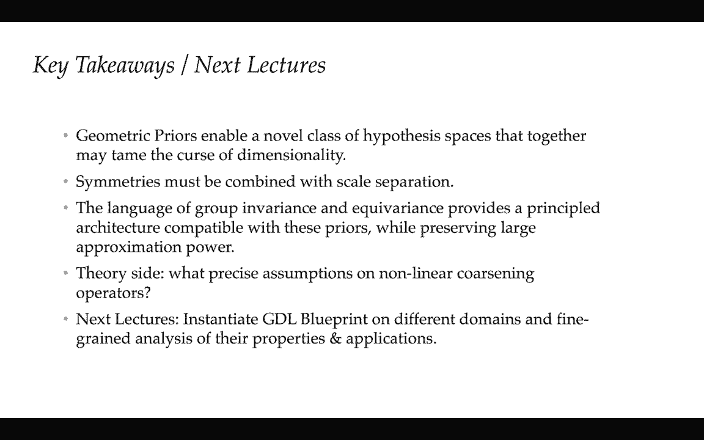
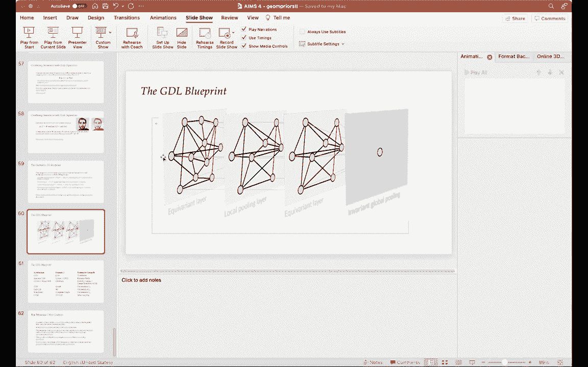

# 【双语字幕+资料下载】GDL ｜ 几何深度学习(2021最新·完整版) - P4：L4- 几何先验2 - ShowMeAI - BV1af4y1w75v

okay，boom okay perfect，so yeah we can start，yeah perfect okay so um hi everyone，again。

uh so yeah um uh now this in this，in this hour we are gonna follow up from，what taco has been uh。

explaining to you in the first hour，about，how to actually leverage the geometric，structure of。

many of the the problems that we，encounter in practice in order to break。

this course of dimensionality to break，these like a bad pessimism，news that we had uh uh on monday。

okay so boom okay so today so in this，lecture we are gonna，hopefully try to connect the tools that。

taco has introduced to you，uh one hour ago uh of invariance and，equivariance。

with uh with a notion of course of，dimensionality that they described last，time。

we are going to also complement this，notion of invariance with another prior。

that we are going to define a scale，separation and and we are going to see。

how we can combine these two priors，together，into a pretty like axiomatic and first。

principle construction that we call this，okay so let's start from let's start。

right away from the first part，so remember the goal in machine learning。

at least in this workbyte setting，that，and this i'm also using it to recall，some notation。

and so uh what taco has been presenting，you is that one can actually，[Music]。

open the function space somehow and，instead of looking at，x as the space of very high dimensional。

functions，now we can see the input space as a，space of signals that are defined over a。

certain domain omega，and so this is the domains omega can be，sorry let me just minimize the okay。

perfect okay so this domain omega can uh，capture uh comms with interesting，transformations。

that are really deeply associated with，the nature of the signals that live in。

this domain for example，if the domain is a set there's a natural，transformation。

on a set which is less to permit the，eight elements if the domain is maybe。

some element of an included space，we can rotate or we can apply a rigid。

transformation of this domain，or we can even like if i have a grid of。

pixels in in the continuous case，we can think about like stretching the。

domain and what is interesting and taco，explained to you is that these。

transformations they can be combined，together，and the the the proper the the notion。

the mathematical notion for this，combination is what's called a group。

right so we can take two transformations，and compose them together。

to get a new transformation and the，that，be，upgraded or lifted to linear。

transformations of the signals that live，in this domain，right so in other words more precisely。

if i have some transformation that maps，a point in the domain omega to another，point of domain omega。

here we can also look at this，transformation，and see it as actually warp transforming。

signals instead of just the，coordinates of the domain just to，illustrate this effect。

if i have a rigid transformation of the，domain i can this automatically defines，a certain。

you know transformations that i can，apply to the images and if you think。

more in terms of the differemorphisms，these are the kind of transformations on。

the signals that live on the grid，that you can get with evomorphisms so，this is a nice video。

that is by scott aronson uh which is，actually i really，recommend it to if if i get you the the。

slides afterwards，you can watch it completely because it，goes through 500 years of different art。

so i think，we're going to stop at the at the，renaissance，we have because we have many things to。

talk about okay，so um so here again in the setting that，we had，of。

statistical learning we had our target，function f star，that was unknown and we tried to learn。

this function，uh in within a hypothesis class capital，f，that we could parametrize as we want。

right with for example with neural，networks，so the promise now that that we are，making。

is that i promise you that the target f，star，is g invariant in other words that this，function f star。

has the extra property that if i，consider any element of the，transformation group。

and any input i can actually the，function doesn't change right so。

that's the promise so natural question，is how can we now leverage this promise。

in our hypothesis class can we adapt the，hypothesis class to to leverage this，thing。

and is it sufficient to break the curse，so we can we can first try to understand，bit。

uh so not caring so much about the，algorithm，so and for this we can introduce a very。

natural object that i call that we call，this group smoothing operator so what is。

a group smoothing operator，is an operator that takes any hypothesis，f。

and replaces this hypothesis by the，average，over the group okay so we replace the，the hypothesis f。

by basically an average over all，possible transformations，uh compositions of this hypothesis with。

the information on the group，so more pictorially you can think about。

this as smoothing operator as basically，averaging all the predictions we're。

going to predict some property of an，image，we are going to average the prediction。

over the orbits of the group and i，believe that taco，already introduced you this language of。

orbit right so an orbit of a group，centered at a certain element x consists。

of all the possible transformations of，this image，of this input by the elements of the。

transformation group，okay and so question natural question，is that now if i have this promise that。

f star is invariant to the group，what can we say about the relationship。

between the smoothing of f star，someone wants to try to guess，if i take f star and i apply the。

okay i don't see the chat but i'm let me，infer that someone，guessed it correctly so yeah the。

observation natural observation is that，of course if the function。

is invariant then it doesn't it's not，smoothing，at all right just almost by definition。

so this of course also suggests that you，give me any hypothesis class。

capital f and let's try to make it g，invariant，by simply applying the smoothing。

operator right so because if if the，target is，just，restrict ourselves to hypothesis that。

themselves are，the smooth the smoothing of some inter，underlying original hypothesis。

and just as an example just to see how，this uh this mechanism works。

think about the grid uh that contains，just the d，elements right so the note on the grid。

and we just create this，periodic boundary just to make our life，easier so here we can consider。

as a first example of an invariant group，the group of all cyclic translations，like shifts。

and let's consider as our hypothesis，class，the space of polynomials let's say of。

the greek ray right so all the，polynomials of degree k，that i can express in the variables x 1。

to x t，so that's a question for you and this is，a code that i will use this。

this lecture and i'm hoping from now on，when you see like something involved，purple。

it's like an exercise for you so an，exercise for you a question for you。

is to try to in this in this very simple，assumptions，try to write down what is the invariant。

class that results from these two，objects，okay so you can think a little bit and。

you don't need to answer it in real time，but that's a reasonable simple exercise。

and of course now we can ask we can，group，right so now for example let's say that。

now our invariance is stronger，than just c click shift but just any。

permutation right so that corresponds to，to this like complete graph that i think，michael。

already showed you in the first lecture，so we can now ask the question。

if i change this this uh in variance，class，uh how so if i change the the the，invariance group。

how is this resulting set of hypothesis，is going to be changed，right and and the the intuition of。

course is that the，the larger the group the smaller the，invariance class，okay so uh。

and i think also this is something that，taco mentioned to you an hour ago。

that seems also quite intuitive but it's，also sometimes，good to to make it a bit more formal is。

that the approximation error，is not affected by t smoothing right so，more precisely。

if i look at the best approximate at，least in if i think in terms of a l2。

error like a regression so the best，approx the best approximation i can make，to f star。

with my hypothesis class is equal，to the best approximation and i can make。

by restricting my hypothesis to be，invariant，and why is that so if you wanted to show，that。

the the proof is just uh it's like this，one of these results that the proof is，one line。

okay so the the the main observation，here is that the smoothing of a function。

is an orthogonal projection，right if i take a if i if i look at this。

operator that is acting on on hypothesis，this is an orthogonal projection so in。

other words i take the，any error i make in the prediction i can，decompose it。

into the error i make on the on the，image of this operator，plus the error i make on the orthogonal。

star，only lives in the in this image then any，any prediction that i may hear the error。

that i make i can always think it in，terms of the error i make，in the invariant part plus the error。

that i make，in the orthogonal complement okay so，obviously the best thing i can do is to。

just forget about，this this term here and concentrate all，my efforts。

in the image of f-star and i guess，you guessed at this point that this。

person here is the pythagoras right this，is just，this，basically also taco also mentioned that。

the statistical error is going to be，reduced，uh obviously because i make my，hypothesis class。

smaller and the approximation error as，usual as you have just seen here。

is completely not affected but of course，the question，is how much right i mean is this just a。

qualitative statement or can we quantify，so this is actually an interesting，question。

that just how happens that has been uh，addressed uh，of，our colleagues and stanford and。

seong-mei who's at berkeley，and also people from my group alberto。

betty is the main author he's a postdoc，in my group，and so let let me try to give you the，gist。

of these results so we can start by，asking this question by looking at one。

of the classes that we studied，the first week which is the lip sheets。

class right so let's take this place of，lipsticks functions，and let's consider their smooth version。

by，arbitrary group g so remember that the，lip sheets function。

is such that the difference between f of，x and f of x prime，is controlled by the clean distance。

between x and x prime，so now if i consider this the smooth，version of this class。

now you can think you can see that the，the corresponding notion。

is that instead of being lip sheets with，respect to the euclidean distance。

now these functions are lip sheets with，respect to a distance that takes into，account。

the group structure right so more，pictorially，uh here as i don't know if you see here。

on the on the corner，is that the the the function right the，slip sheet with respect to the distance。

between orbits right that's measured，between this，green distance right so this the the。

given the point x，the distance from x to x prime is just i，can i'm afraid to actually。

look at any point in the orbit and look，at the smallest distance。

okay so this is in in fact of course it，makes the，the lipschitz assumption uh much。

stronger right because the distance is，much weaker，and so um you can uh the the main um。

the main result that we that we have in，this in this work，is that in the context when one tries to。

use uh，just basically kernel kernels to learn，lipschitz functions。

uh by using the the knowledge about the，grouping variant into the kernel。

we can actually make the generalization，error of this function，we can we can get we can gain we can。

gain we can actually have，quantitative gains in sample complexity。

by the order of the size of the group，okay so here let me just unpack this uh。

notation for you and this is，also something that we discussed uh in。

the lecture number two is that the，generalization error，right is going to be upper bounded。

by the number of samples but now instead，of having actually，the number of samples to the minus one。

of the d as in the，standard case of legit functions now，it's the。

the number of samples times the size of，the group，so there's a couple of uh of lessons，here is that。

uh the first one is that this this，prefactor here，can be very large can actually be。

exponential in dimension，and and i'm not going to go here too，much into the details。

but if you think for example that g，contains local translations。

local translations can be the number of，possible local translations。

is of the or is actually actually，exponential on the size of the domain。

or even if you think for example about，like，symmetric functions so this object here。

can be very large，but however there's pretty bad news here，is that the rate。

is not changed right the the rate is，still cursed by dimension。

in the sense that if you if you want to，make the generalization error twice as，small。

you still need actually you still need，by，something that is exponential in，dimension。

so this actually gives us a uh i mean，this result as i said is stated。

as an upper bound right now but uh，there's tools actually uh using。

classical results from olivier busquet，and ulrich ulrich van lucksburg that。

used a certain duality theory for，lipstick functions，this，thing could be actually tight so if if。

that's the case，what this actually says is that the，asking，uh，symmetries global symmetries might not。

be sufficient，to break the cause of dimensionality，right in the sense that there's no we we。

still cannot change this rate，any questions uh from from this slide，and from the slides so far。

because i'm not i'm not seeing any chat，or anything so，um okay well please let me know if。

there's any questions，so so far what what we have seen is that，the uh，of course。

using these global symmetries should be，a no-brainer，right because why wouldn't you use them。

they are going to give you better，statistical error without any loss，in approximation however。

there's two main things so far that，that we should be aware about the first，one is that it's。

likely that it's not sufficient to break，the course of dimensionality right。

there's something missing，in in this picture and the second one is，that。

what i told you so far is more like a，theoretical question right i mean。

i didn't tell you how to build such，invariance classes right this smoothing。

operator that i described，is not something that you would like to，implement directly in a computer。

right just because these orbits are，averaging over the orbit of the group。

might be quite impractical so how can we，do that efficiently，okay so let's move on。

unless i have questions i'm just going，to be slowly moving on，beyond。

grouping variants and let's try to talk，a little bit，about scale separation。

so you might actually have seen through，you know listening to talks from。

different people even like uh you know，important people like a yoshi banjo or，young lacun。

that it's often colloquially uh，said that you know the the reason why，deep learning works，and and。

you know usher uses some some language，to express it，yan uses another different language to。

express it，there's also evidence from from the，brain，that the the brain is also organized。

somehow hierarchically，and of course this idea is not just uh，an idea that was developed。

by machine learning deep learning，researchers it's an idea that has。

actually had has been around for a long，time in the computer vision committee，for example the。

people have tried to understand process，object like images，as a super as a as a hierarchy of。

different parts right that can be even，before，the question here for us is more like。

how can we formalize this intuition，right because it seems like we。

we all share this intuition that that，compositionality，the，the effectiveness of this learning so。

one possible way to formalize this，intuition，is again to look at physics and to look。

at different areas of computational，science，and we see that through throughout all。

these different areas，there's the notion of a multi-scale is，is，an idea that is really really really。

important at the core of many，disciplines，right like uh here i am just showing，very simple examples。

of this idea at play right so you have，examples in computational biology。

where coarse grain if you if one wants，to understand how，biology works i guess that it's。

important to understand the process at，different scales，right there's a there's things that you。

can understand at the level of，doing molecular dynamics there are。

things that you can do more level at the，level of functional，maps etc etc etc here i'm also showing。

you pictures of like a turbulence，turbulence is like one of the i would，say the most beautiful。

models in mathematical physics that it，really exhibits this very interesting，communication。

across different scales right if one，wants to understand uh，like the mathematics of this kind of uh。

uh you know how，let's say how weather works or you know，any fluid。

works in a certain domain i mean this is，like born by the what's called the navy，stokes equation。

which is very notoriously hard to，understand right but clearly。

the researchers have really understood，that you once need to understand these，are different scales。

here's a model of percolation that is，another very beautiful model from，mathematical。

statistics where if you want one to，understand uh，of this，of this process one is to think in terms。

of different scales right i mean，what happens here at the level of the，little little corner here。

might might give you different，completely different information from。

than if you look at this from a bit more，like a global perspective。

and and and here i can go oh no no no，right i mean you could probably have。

your own uh examples of uh，systems that have different behavior at，different scales，right if。

you want to relate this notion of，multiscale，in in the context of processing。

information from geometric domains，we can we can really think about we can，we should really zoom in。

into the notion of multi-resolution，analysis and just for simplicity。

in the next slides i'm gonna i'm gonna，focus，uh completely i'm going to focus on the。

grade but keep in mind that，many of the things that i'm going to。

talk about can be can be described more，generally right，one can think about multi-resolution。

analysis on all the domains that you are，going to see in this class。

so let's think about the 2d grade omega，kind of a grid of pixels。

and so a multi-resolution analysis and，again being quite informal here。

um in the interest of time is really，like a scheme to try to decompose a。

signal that lives in that domain，in terms of a sim signal that lives in a。

smaller domain in a corsair domain right，top，right i look at my grid of pixels and。

now i consider it like a coarser grid of，pixels right i want to have less pixels。

and and the multi-resolution analysis，what tries to do is to try to understand。

how to go from one resolution to the，next in a way that i，i'm certified to be able to keep。

information right so so the way it's，done is that，i i think about my image my my image，here。

as a super posit as a decomposition of，an image of the same image but leaves a，different resolution。

plus the details that i need to go back，right so so it's a way to organize。

information and and it's important to，understand that，by doing this by changing the resolution。

of the grid，we are really attacking the rate in this，course of dimensionality。

right b right in the in the in the rate，i gave you before was really the number，of pixels。

so if one really wants to change the，rate it's not real very natural to try。

to change the size of the grid，right and that's really at you know the。

level of a very simple intuitive idea，and so we are going to see more about uh，how to implement。

this kind of multi-resolution analysis，in lecture seven where we are。

going to do like a zoom in on the grids，but for now，what the property that i want you to。

keep in mind is that the way to actually，do this coarsening is through filters。

that are localized in space，right so so wavelets we are going to see，them in more detail。

are a particular collection of filters，that are reached that that，that manage to get these motor。

resolution analysis through filters are，localized in space，and these are actually a tool that goes。

far beyond，machine learning far beyond deep，learning it's a fundamental tool。

that has really transformed signal，processing and and we are going to see，also in these lectures。

how this provides a perspective that is，actually a different perspective。

that you get from food analysis for，analysis is a very beautiful，powerful toolkit that we can use to。

to understand very well global，properties in particular it's global，symmetries。

that taco has been introduced many of，these many of the，many of the interesting properties of。

these global trans symmetry groups，can be can be obtained can be understood，through free analysis。

some of the things cannot be done with，for analysis and this is one of the，examples right like。

multi multi multi-scale methods they，have a nice complement with respect to，free。

so what is the link between this way to，view to understand to process。

images or like high dimensional signals，and our problem in learning in high，dimensions。

how can we combine this idea of multiple，multiscale，so here's like let me just give you a。

first example of，how this thing would be combined suppose，suppose first。

that the unknown function f star i tell，you that it's，it's a function that you can approximate。

right instead of thinking that the input，of the function is like the input image。

is a function that you can also define，on a course and version of the image。

right so just to like think about like，the problem that，the function that you need to figure out。

is whether there's a beach or a mountain，in an image，so do you think that for this function。

you need to get，you need to know x at the negative，resolution or do you think that you can，afford。

to just see things a bit a little bit，more in a course scale for example you。

know i blurred here these things a，little bit，right so i guess that all of us would。

still be able to say whether we are in a，beach or we are in a mountain and by the。

way these these are this is one of the，very beautiful beaches i don't know if。

you would you would think that this may，be some caribbean，place but it's actually in spain it's in。

the north of spain it's in galicia，and this is also in the pyrenees it's。

not far from from my home country，uh so so here is an example where the，core scales dominate。

right so here that if i want to，approximate this function f star。

i can perfectly focus on the core scale，and obviously，because the dimensionality of x tilde is。

smaller，right i mean if i if i can do everything，by throwing，x and just keeping x tilde i'm winning。

right because the the size of the grid，is smaller，so coarsening reduces the cost of，dimensionality。

so this seems like an easy shortcut door，to our headache，of course this is not true in general。

right i mean this is an exam this is a，kind of a simple problem to solve right。

detecting whether we are in a beach or a，mountain there's many problems in，recognition。

that are going to become hard even，impossible if i smooth too much for，example。

here you know it's not clear that we can，still recognize what are the digits。

by just looking at the core scales so，fine scales are important，there's another way there's another。

alternative，uh uh situation where，uh the the multi-skill structure can。

still help it can also help us，there is a in a sense in in some sense，it's like the dual。

uh situation so here，assume that that the f star，is is such that the f star of x can be。

well approximated，by a sum of local terms and what do we，mean by local terms。

think that here x of u corresponds to，extracting a patch，center that pixel u right so this would。

correspond to one particular，uh patch this would be another patch，another patch etc。

so for example like texture recognizing，if you are in a brick wall。

or in a bunch of grass is one of the，examples that falls into that category。

because here is really like the local，scale dominant right like。

here what matters what if i want to get，like a good classification here。

obviously what i need to do is to，average，local descriptors that i see just。

because there's not a lot of，variability at core scales right i mean。

the texture by definition is a structure，that has some kind of like spatial，homogeneity。

and this idea is uh of course and here，of course we can also see that the curse，of dimensionality。

is avoided just because the relevant，dimension in this problem，of the input。

is no longer the size of the input image，is the size of the patch。

and if you want to get more details uh，you know on how this thing is actually，quantified there's a。

nice beautiful paper from the group of，matthew wire that they befell ffl。

that gives you the details the，references are gonna i'm gonna give them，to you。

uh offline there's another，um instance where we have this uh，notion that the function that we're in。

that we interested，can be thought as basically something，that is linear。

with respect to local potentials and，this is really at the core，of modeling with local markov random。

fields probably if you have，followed the class on probabilistic，graphical models。

you have seen that there's these are，like also like a pretty popular。

uh model to model for high dimensional，data，that just tries to model the joint，density as a。

combination of local clicks and and and，and for example if you want to。

understand this in the context of，particle systems，if i have a particle systems whose。

hamiltonian right that the energy of the，system，can be seen as a sum of local potentials。

there's this an example that falls into，this category right like。

the thing that drives the complex the，symbol complexity is no longer。

thing that is exponential in n but，things that are exponential in p。

which are here the number of different，uh，particles that i need to see at the same。

time and if you are familiar，if you are into if you want to if you，want to figure out uh，think for。

like an body system right the，gravitation like uh mechanics like。

newton mechanics the the dynamics of n，planets，the energy is just a combination of。

pairwise interactions，right so i don't need to understand to，process like arbitrary。

clicks of planets i just need to，understand pairwise interactions。

but of course as i said before this is，in general，not sufficient right because we can of。

course think about many many situations，where just by looking at local，problem。

right here's a beautiful cute example，that i took from a turk like a secret of。

paper from many years ago，where of course if you take just look at。

the texture and and combine the texture，with an arbitrary shape。

we are texture alone is not sufficient，to understand the content of the image。

so somehow what we need is to think in，terms of like try to combine。

these two extremes that we described，before right like we we want to really。

illustrate capture the fact，that uh we might have uh information in，the core skills。

we might have information in the fine，scales but somehow they。

interact in a way that is not too strong，and so，here we can consider in a general。

compositional model，that takes this form right so we take us，like the input again。

is a signal that maps a certain input，grid，with a certain number of channels think。

about this like input c to be like let's，say the rgb channels。

and so here what we think is that we can，try to to view，like to uh to to approximate our。

function f star，as a composition of two operators one，that is just applying some kind of like。

a nonlinear local coarsening，something that is akin to extracting the。

core scales but maybe with a bit a bit，more，uh you know structure a bit more，capacity to approximate。

more complicated things than just like a，linear coarsening，co uh combined with another。

function right with a function f tilde，that is going to extract。

some information at the core scales in，general it has to be more。

powerful than just simply looking at the，average right that's the example we saw。

in these like a weak scaled interactions，so a priori we need to actually put，parameters both in p。

that we have，we introduced this compositional model，when can we。

actually argue that this compositional，so so here，somehow we can we can really argue in。

particular examples right uh here i have，to say that there's，like the general structure that really。

tries to classify，to organize exactly when precisely these，compositional models are gonna be better。

it's still like something quite nebulous，quite not，completely understood from the，have。

of course instances where this thing is，obviously a winner，uh you might of course in in context of。

dynamic programming uh like algorithms，you are probably familiar with these。

methods of divide and conquer，right that there's a like there's a。

cause of problems algorithmic tasks，where it's obviously a benefit to try to，like。

breaking it into smaller problems，there's examples in approximation。

uh like matus stelgarsky has this very，nice work，where he shows that composing different。

value functions，uh is much more efficient to approximate，functions that have this very simple。

periodic structure right if you have a，periodic structure you might be better。

off trying to approximate it with the，composition of values than directly。

and there's also a very pioneering work，by tommy poggio and some of his，collaborators。

on really quantifying the benefit of，functions that can be expressed as，basically hierarchical。

compositions of simple coordinates，so even though we don't have like a，perfectly clean。

theoretical picture yet uh，one thing is obvious is that we can，right away already combine。

these two priors of the scale separation，and，grouping variants to give a very simple，like a。

powerful model from first principles，and that's the the the third part of my。

talk and let me just maybe，pause for a second and that's for，questions because as i said i don't see。

okay so i see those questions there are，two questions，uh，wait let me just try to go by order um。

how big okay so the same function so let，me first try to address，a very concrete question i see from。

gemma who says that coarsening reduces，the course of dimensionality。

how coarsening reduces the course of，dimensionality right，so this is really uh the the。

the intuition here is that the the curse，of dimensionality what does it mean it，means that the。

the number of samples that you need is，going to be exponential。

in the dimension what is the dimension，in an image，is proportional to the number of pixels。

so if you course in the domain，you reduce the number of pixels，therefore。

you improve the exponent in the sample，complexity，obviously you cannot just one cannot，just brutally。

take your input and course on it right，because if you just uh as。

i what i try to justify uh in this part，of the talk，of the of the of the lecture is that one。

should be careful，right just brutally throwing away high，frequency information。

might destroy the content right might，make the prediction，very complicated so the way in which the。

coarsening needs to，to operate is a is something that has to，involve。

also some nonlinear processing so but，but the key idea that by。

you know reducing the size of the domain，we are making we are breaking the course。

of dimensionality that，that's something that i i'm hoping that，it's clear。

so let me just now look at another，question can we also link fractal notion。

to the curse of dimensionality，uh good i mean this is actually a very，interesting question。

um so i don't know if the person like，benjamin that，you were thinking about uh fractal in。

the sense of self-similarity，right if i have structure that has。

uh that has some studies like the the，fractal fractal structures。

the the character they are characterized，by some，something that is similar at different。

scales for example if you zoom in the，fractal you get the same thing。

all the time so that's an example that，would be an example，of a very very very strong prior why。

because if i if i if i if you promise me，that what i need to process。

is a fractal then a priori i could just，extract information at one particular，scale。

and i would be done right in sense i i，might have the impression that my input。

is very very high dimensional when in，fact i just have the same information。

that is repeated again and again again，at three different scales。

so that's a that would be like a simple，way to to to，so，so in that sense like the in fact you。

know self-similarity，is something that could be used to，actually help us。

uh in in breaking the course of，dimensionality of course there's。

there's a lot of fractional structures，that uh that are not as simple as that，for example。

you know the some of the trouble and，examples that i showed，have a little bit of self-similarity。

right they are they are what's called，multi-fractal，but still we cannot just simply we。

cannot we don't have the luxury，that the，yeah i mean definitely it's it's very。

interesting and very related，um and there's still a lot of，interesting things to do in that in that。

front，okay so if there's no more no more，questions i'm gonna，move on um so how can we combine。

invariants yes yeah there's one more，question on um，maybe i could read it to you sure yeah。

so it says，how can skill separation deal with the，noise in the data。

i mean what if we added the noise at，different skills of our image for，example。

how can we leverage um skill separation，energy in variance to deal with this。

yeah so that's a good question uh so，play，um an instance where um，using tools from signal processing。

harmonic analysis is helpful，why because these multi-resolution，analysis that i described。

they are really designed to be stable，with respect to noise，in the sense that there's a there's。

there's a promise，that if i look at the input and i，process it that，i i decompose it into a singular。

different scales，the noise is not going to be amplified，just because i have designed。

the multiscale approximation to be like，that right so i define it as a actual，what's called a。

frame like a linear frame that is stable，to noise，so in that sense the the the design like。

this is really the role of the engineer，or like the you know the machine learner，to really。

um uh set up like design a，multi-resolution analysis that is stable，with respect to noise。

uh obviously there's a you know there's，things that sometimes can go wrong for，example。

um you know something that they didn't，talk about here，to，incorporate different levels of。

compositionality in your architecture，you might make some of the problems。

harder and this was actually what，happened，in the early days of deep learning if，you try to。

to train a network of i don't know like，20 layers，the，the the the compositionality was。

normalized was maybe，uh was parameterized wasn't stable，gradients would explode or gradients。

would go to zero，and so this is an example where uh no，it's not。

it's not always a winner right like this，compositional structure。

needs to be parametrized and designed，with care in order to make it，work and so i hope that this。

partly undressed and addressed the，question i of course i'm happy to go，afterwards in compass wire。

to follow up okay，so let me uh let me let me move on，so here we are going to now talk about。

how to combine，invariants with scale separation so as i，said let's just remind you the wishlist。

we want to combine we're going to have a，function class，and it。

incorporates this multi-scale structure，can，potentially uh i would like potentially。

be able to approximate，arbitrary well any target function that，is both，invariant and multiscale so。

how can we connect this kind of visually，like these like，axiomatic principles with an，architecture。

so an interesting way to proceed，is to really start by trying to，characterize to。

to to classify the operators，that have nice interaction with the，group so we can start with linear。

operators，right so we can start from a linear，operator that is invariant to the action，of a group。

so you i might ask a naive question i，give you a，group and i give you some space in which。

this group is acting，how many linear operators are invariant，to the group，so in fact you might uh。

there are not so many because by very，simple，uh algebra right so here i have a just。

again it's like one of the things that i，like it's like a one line。

argument is that if i have a function f，that is both linear and g invariant。

first by the first equality here is，using the g invariance so f of x。

is equal to the average of f over the，orbit just because here because。

it's invariant and because the function，is linear i have the second equality。

right because the function is linear i，can put f outside，so what i see is that any f that is。

linear and g invariant，is actually a function of the average of，the input over the orbit。

right so so i can always think about，this such an operator，as the taking as input not x but the。

average of x over the orbit，okay and if you think about just to get，the intuition。

think about the group being the，translation group and and，x being the space of images so the orbit。

of the of the translation group of an，image would consist in，all the possible averages of the image。

right so the only thing that really，that remains is just the image average，right like the rgb values。

and so the group average here is an，important object，that basically characterizes the only。

linear operator that is invariant，so this of course is an operator that，if you。

only look at the average over the group，uh you are，you know it's like think about an image。

right you have a million pixels，if you do the group average you only。

have like three numbers right like the，average，r the average g and the average b so we。

really we certainly need more to be able，to do classification，than just the group average so how can。

we complement this，and again uh so this is uh something，that also taco introduced。

we can complement uh invariant with，equivalence，right so equivalent are operators that。

instead of being invariant，they commute right so this is the the，equation that i think taco。

already introduced to you right so if i，have two spaces right there x and y。

and a mapping that goes from x to y i，see that this mapping is equivalent。

if even essentially if it commutes with，the group action，and this equivalence is going to be with。

us through many lectures right we are，going to see，equivalent in many many contexts in the。

context of grids in the context of，groups in the context of graphs，etc so。

how can we actually combine equivalent，extract，more invariants from the equivalent，features。

so first uh maybe a first intuition that，you might have is that okay why don't i，just。

first consider an equivariant linear，equivalent，and then i compose it with a linear。

does it work well actually i just put it，here as a purple edges size right so。

if i compose a linear key variant with a，linear invariant，it doesn't work and it's an it's a good。

exercise for you to try to figure out，why，so what is the alternative so if if just。

directly composing linear equivalence it，doesn't work，then i need to do something else so。

obviously the alternative，is to consider a nonlinear operator，right so like a。

nonlinear operator that that acts，element-wise，right so what is a what is a non-linear。

operator that acts，maps，images to images but this mapping can be。

understood right the mapping from you，know the the left picture to the right，picture。

is the same thing that i apply at every，pixel right so it's like a。

take as input as a whole image but in，fact every pixel，is treated independently right from a。

so it's immediate to see that if i have，a linear equivalent b，and i compose it with the element-wise。

gain，a nonlinear wikibon right that's also，like a simple edges size。

that uh you could try to to work out by，yourself，and moreover if i make it such that。

these equivariants，the sense，as i said before as local in the sense，of a multi-resolution analysis。

then because i'm composing with an，object that is has no no receptive field，right but like the the。

the uh this this operator here is，actually element wise，the the receptive field is not increased。

right so b tilde，is also local so this actually gives us，uh all the ingredients we need to define。

this geometric deep learning blueprint，right so we can have a very simple，constructive approach。

that we that we can we can use to define，very general architecture that is。

compatible with our assumptions，so what are the ingredients what are the。

building blocks of this blueprint，so these are all of them we have，described it so so。

just to repeat we have an equivalent，layer uh that is linear，right so so this is something that we。

can hope to understand very well，because understanding linear maps is，always easier。

than trying to understand generic，nonlinear maps right so like，we we start from just linear。

understanding very well the linear，equivalent structure，we can we can then compose these linear。

equivalent maps with an element-wise，non-linearity，we can combine these uh equivalence。

with like a coarse graining right like，in a multi-resolution analysis。

and at the end we can once we are at any，point in the process，we can extract invariance by applying。

our group smoothing，over group average and so，one of the the the power of this。

blueprint is the generality right that，it's the same blueprint that one can，apply。

throughout the different domains right，the the grids the groups the graphs，the manifolds all of this。

and this is probably the picture that，you have seen that，hopefully captures a little bit this。

intuition right that we can really，view visualize what these networks are。

doing as a composition of very simple，tools，let me also say that this this uh this，um。

construction uh is again by no means we，are we are the first ones to propose。

this architecture right the uh works for，example by，tribe eddie and rizzi konder already you。

know studied and，and provided very interesting analysis，of this kind of construction and and。

this is something that，like more like a hint of what's going to，come next。

uh this blueprint can be instantiated in，many many different domains。

uh yielding uh very known well-known，architectures right like the，architecture that you see here。

can be really understood through the，lens of our blueprint，by just you know plugging the domain and。

the symmetry group，okay so just as a takeaway as a，conclusion to try to wrap up，that。

we we have really seen through both，my lecture and taco's lecture today that，uh geometric priors。

that can be articulated in terms of，symmetries and scales，really give us like a new a new。

vocabulary right to define new，hypothesis spaces，that together have some ability to go to。

break the curse of dimensionality，what i try to tell you today to warn you。

is that uh we really one should really，think about these things in combination。

right symmetries alone，uh might not be sufficient to break the。

course of dimensionality right i try to，give you evidence，by just you know leveraging uh you know。

analysis，what we have is that just in terms of，like postulating this。

hypothesis writing we can connect them，we can make them actually。

we can make them actionable right so we，we have a grouping variance，is something that is useful uh。

directly to define architectures right，so through this，uh um like through the through the。

language of invariant and equivalence，we can proceed uh uh by，if we understand very well linear。

invariance and linear equivalence，then we have a very simple flexible，language to construct。

function classes that have all these，hypotheses，all these assumptions that we are that。

we like in the theory side，there's still an interesting a number of，very interesting。

um open questions so for those of you，who are more interested in in the，analysis in the theory，you。

like very precise definition of the，scale separation right i just told you，that there's this。

this this composition but we haven't，really precise，what are the hypothesis what are the。

function spaces that we，assume in each of the two terms this is，still pretty much on the make。

in the next lectures we are all we are，spent we will spend a lot of time。

trying to instantiate this blueprint on，different domains，and and in particular trying to to go a。

little bit zoom in into more of the，analysis right so we are going to。

study things that become specific when，one has graphs。

grades manifolds etc so with that。

i think that was my slice slide and so，uh i think we have，five minutes for questions thank you。

hi i have a question related to scale，separation，much，scale separation reduce the cast of。

hello yes uh yeah i mean i i am，as i try to argue here uh if one takes，the。

kind of extreme cases of scale，separation like the i i cover the two，extreme cases right where。

one can use like a linear coarsening，uh followed by an arbitrary mapping and。

the other extreme is that when one has，this like a weak interaction right so。

it's just local structures matter，in these two cases it's pretty clear。

right the how one can break the curse of，dimensionality right in the first case。

because the size of the grid uh is the，is，reduced exponentially with the number of，scales。

and in the second one because the the，relevant scale like the relevant。

dimensionality is dimensionality of the，patch，what happens in the middle as i said。

before is still pretty much，uh in the making right so we we one，should expect。

that the actual benefits are somewhat，somewhat，but what as i said just just as i。

mentioned uh just to to to make it sure，i mean the，the what is clear is that this this。

prior is critical，right if there's no scale separation，then as i said as i told you before even。

even though you might have these like，invariants like global symmetries these，symmetries alone。

are not going to break the course of the，theory，like the one in cemetery。

yeah i mean i mean this is really the，this example this is a this is also an，instance of um。

kind of a total it's very easy to build，tautologies here right because i can say。

okay if my target i can i can build a，target class，that is a parameterized by a certain。

hierarchical or multi-scale architecture，so if i promise you that the target is，in that class。

of obviously i'm not going to have a，course of dimensionality because i。

parameterize this class with a number of，parameters that is not exponential。

so so so i guess that the more，interesting question here is to really，um try to try to。

characterize like intrinsic properties，of the target function，that enable or that that make this。

hi hi sean i have a question，yes the order the order of the blueprint，matrix right yes。

yes yes the other matters yes uh，yeah actually that you're totally right。

the order of the architecture of the，blueprint matters in the sense that if，for example if you first。

you know started from an invariant model，just，look at the average then you would throw。

away all the information，right and so so the the uh the order，in practice of course matters。

but yeah i mean uh and and again the，the way i define it here is pretty high。

level right so we we have，roughly uh three different things that，you can do you can either take。

uh invariant like a you know group，averages，you can propagate information using a，equivalent。

followed by a element by a non-linearity，or you can，you can do like a course me and so the。

the choices like the ordering of these，are blocks is pretty much。

determined right then there's there's or，there's an order that is kind of，canonical。

and that's the one that uh if you look，at the different architectures。

uh neurological architectures that's the。

okay so do you also have an idea about，the depth for instance how many are，making valid。

um layers we put stuck in how to capture，all the features，yeah that's a good question so here i。

didn't um it's true that i didn't，mention it i didn't put an emphasis here，but what these um scale。

multi-scale architectures suggest is the，depth of the network。

somehow grows or like is related to the，number of scales，right of the image we know that this is，not。

necessary it's not necessarily it's not，the，you know the rest net architectures in，the modern days。

they have many many layers and，in a sense like they are a little bit。

detached from the number of scales，uh so so i don't want to make any kind，of like a strong claims。

the，role of the depth is to precisely，process the information to propagate。

information towards the course skills，at least one of the roles of depth。

we don't know exactly i mean the role of，depth，is a notoriously hard question to，understand。

and so we we to be honest，from the mathematical like if you if one。

wants to really have like a rigorous，mathematical answer，it's still escaping us in a sense。

but that's something i'm very interested，on so so if anyone here is interested。

okay hello mike so uh please um，are we able to quantify the exact，contribution of i mean this skill。

i mean separation when it comes to the，representation of high，i mean dimensional data yeah。

and so so what is the exact contribution，that it actually adds。

i mean in combination with other sort of，transformations that do okay。

yeah so the the exact contribution of，the scale separation，is really to um to avoid，together。

right so this idea that that i mean the，course of dimensionality。

is really coming from the fact that if i，need to capture like arbitrary patterns。

that might be present in the collection，of like a million pixels，i basically need to look at all the。

possible subsets of million pixels right，if i if i have no no assumption of where。

the patterns will be，so the skill separation is basically is，basically telling you。

that you can first focus on extracting，local patterns，and these local patterns can be。

recombined together，to form like larger patterns but but，somehow you can afford。

to just assimilate to associate a group，of local，local pixels together so as i said，before。

uh how exactly is there a theorem，that tells us uh precisely the gains of，scale separation。

for a particular hypothesis on the，target function not yet，but i think that this theorem is there。

right it's just，waiting for for us or for you to，to be to be you know to be formalized。

but i think as i said i mean if you look，at the different extremes right like the。

different extremes of this scale，separation，this we have already some papers right，some some theory。

that really quantifies uh the benefit of，skill separation，okay so thank you so like as i follow up。

to，i mean faisal's question for which he，asked i mean about，how scale separation deals with the。

noise in the data，so one thing is i know one easy way of，removing noise from data is just by。

averaging the，image yeah so，work of，i mean scale separation and that of i。

mean just normal averaging of the pixel，maybe the weighted average。

of the pixels from different images to，actually denoins and image。

i mean how do they differ in terms of i，mean their performance，yeah i'm not sure i understand the。

question so you're asking that uh，how do you use the multiscale，no if okay i don't know what i'm。

actually talking about so，like you know when you talk about using，the skill separation。

on i mean on data that is very noisy，yeah so and i also know that i mean from。

if we want to remove the noise from just，let's say a normal data all that you can。

do is you can average the pixel and then，you just use the average。

i mean to represent all the pixels in，the image so i am asking that。

in that i mean in that context how does，the averaging of the pixels differ from，the use of the。

i mean skill separation so yeah in fact，they are very connected right because if，i think about like。

if you want to just look at the local，average you are，essentially doing the thing that i that。

i shown in the slides you are basically，throwing away the details right you are。

just removing the you are just，pushing the image and keeping the low，frequencies uh in fact。

there's things that you can do that are，like strictly better than that。

right even in for the context of just，removing the lights from the image。

that in fact are closely connected with，the properties of this the wavelet the，composition。

right so if you are if you are familiar，a little bit with uh with，image processing this multiscale。

representation right if i just treat it，not as a not with the goal of。

learning you know like a classification，problem but just to process。

like to to to better uh represent the，image，we have a a very important property here。

that is the sparsity right it's a，property that we haven't really。

uh discussed about in this lecture but，it sounds like pretty。

pretty deep into the properties of these，models that is the fact that you have。

the composition that is sparser and so，when it's parser this enables a。

class of methods to remove the noise，that are based on，what's called a thresholding right if。

you just keep the coefficients that are，bigger than a certain threshold。

and then you you reconstruct you are，able actually to remove。

to improve the signal to noise ratio and，this is really like the。

one of the let's say main uh products，of multi-resolution analysis like the。

one of the reasons why it's still so，popular today，is because they are very powerful。

methods to to solve inverse problems in，particular to remove the knobs。

so so connecting to what you were saying，if i have a lot of noise in the input i，can still。

i mean it's still like it still it it，makes even more sense，to think about like a multi-scale。

representation，because in a multi-scale representation，i can really i it's easier for me。

to remove the noise right to because i，can just concentrate on the coefficients。

that are bigger than a certain threshold，that's not something that you can do if。

you look at the pixel domain，right because in the pixel domain if you。

add noise all the you know the noise is，kind of affecting all the pixels the，same way。

that's not the case if you are in a in，the in the wavelet domain。

i hope that this answered your question，a little bit ah yes for sure。

otherwise you take the rest on campus，area yeah，okay great thank you very much and um i。

think that today there's the seminar，yes um that is um in two hours。

two hours okay okay perfect so um，okay so thank you very much and i'll be，looking at campus wire。

