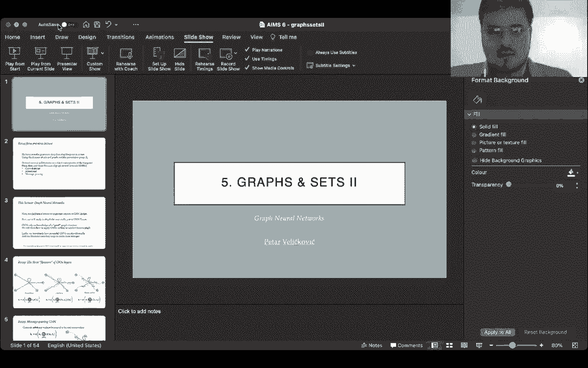
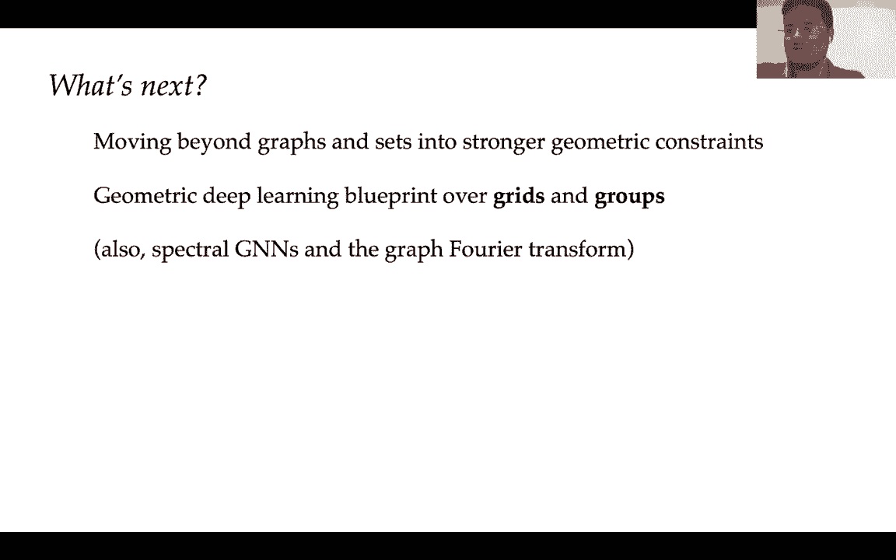
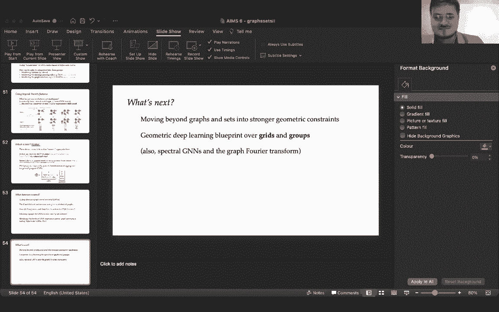

# 【双语字幕+资料下载】GDL ｜ 几何深度学习(2021最新·完整版) - P6：L6- 图形与集合2 - ShowMeAI - BV1af4y1w75v

all right，thank you so much and uh，hello again it is uh，my great pleasure to be continuing on。

the thread of the previous lecture on，graphs and sets，and moving into some more uh。

topical issues surrounding graph neural，networks which we have。

in the previous lecture introduced only，uh superficially，for now i would just like to note that。

i'm very happy for all the questions you，had on campus wire and zoom and。

please keep them coming i will be sure，to answer to all of them as soon as i，get the time。

and they already touched upon some of，the very important topics some of which，we're going to cover。

right now some of which we're not，covering as part of this course but i'm。

happy to share a lot of interesting，references for everyone，so um without further ado let's dive。

into some more specific aspects of，done，a few hours ago is we've seen the。

geometric deep learning blueprint in，action，and if we use the domain of sets and，graphs。

and choose the symmetry group of，permutations，sigma n we were able to derive。

the key properties of sets neural，networks and graph neural networks。

and as a direct consequence we've，already derived several architectures，such as deep sets。

and the three flavors convolutional，attention and message passing of graph，neural nets。

so we've seen a very first example of，how the geometric deep learning。

blueprint can help us categorize，or even completely synthesize an entire。

field of learning on certain domains，and now after we've introduced all the。

necessary components of a graph neural，network，we're going to dedicate an entire。

lecture to important aspects of their，design，and what we'll do first is i'll try to，lift as many。

restrictions and assumptions we had，before for example the lack of edge，features。

and we will study in depth one maximally，potent flavor of graphene networks。

and after that we'll dive into two very，important and very related，bleeding edge areas of graphical。

networks that you might want to think，about when applying these methods。

on practical problems the first one is，we've carried around this assumption of。

the graph structure being given to us as，part of the domain，and will actually show that you can。

apply graph neural networks without，knowing the graph up front you just have，to be。

really careful about how you go about，doing that，and lastly we will look at an。

algorithmic lens from which we will，try to assess just how powerful，graphical networks are。

we will identify some key limitations，that graphical networks have in terms of。

problems they cannot solve，and as a result will actually illustrate，some key directions we can use。

to make graph neural networks stronger，in the future，now one aspect of gnn design that is，geometric。

blueprint but i'm explicitly not，covering it here，are core sending methods for graphs i。

will share in campus wire，a lot of interesting references for，these kinds of approaches。

but so far i don't think we have come，across a data set in graph，representation learning。

where coarsening was actually necessary，to achieve a strong performance so。

for all intensive purposes we will for，now omit questioning and，we can discuss it more offline。

so as a recap we have three flavors of，graph neural network layers that。

categorize about 95 percent of the，approaches，of graph representation learning，nowadays and uh。

left to right you go from convolutional，through attentional to message passing。

and as you move to the right you're，relaxing the assumptions on the，underlying graph structure。

increasing the complexity of the model，whereas in convolutional。

graph nets you're often assuming that，edges encode for label similarities。

as you move more towards message passing，your edges just become a recipe for。

passing data around the graph，and as a result you can fit a broader。

class of problems more accurately，but you run the risk of scalability，first。

are this most expressive flavor of，because，as one of the questions in the previous。

lecture completely accurately pointed，out，you can look at basically everything。

everything we're going to talk about，today，as a special case of a message passing，gin。

so in this flavor we are computing a，message to be sent across from one node，to the other。

by considering as input the features of，the sender node as well as the receiver，node。

and as a result a message vector m is，computed which goes along that，edge and then the receiver node。

aggregates all of the message vectors，sent to it，to compute its next level features h。

and we mentioned that there are a few，uh interesting models that were early。

pioneers of these kinds of approaches，such as interaction networks message。

passing neural networks and graph nets，and specifically uh one thing that。

becomes quite interesting as you scale，up graphics to this level，is the fact that so far we've only。

really looked at node features，and i've kind of hand waved away edge，features and。

these kinds of information because i，said that the math will not change too，much。

well i do think it's very important for，any application you might hit in the。

future especially if it's dealing with，things like computational chemistry，where。

edges will have very rich information，attached to them，it's quite useful for you to see what a。

maximally expressive maximally，attributed graph neural network might，look like。

and as a result i will assume this，very generic set of attributed graph，data。

we will start off with as before，assuming that i have some node features。

xu in each one of my nodes and，uh i'll just give the enough keep going。

the analogy to computational chemistry，because，there you can easily reason about what。

could be good node features and so on so，if your inputs are molecules you can。

expect the different nodes to correspond，to atoms，and therefore the node features could be。

the atom type the atom charge the number，of hydrogens connected to it and so on，and so forth。

then we can move on from node features，and also，incorporate information at the various。

edges and i will denote edge features by，x subscript uv for the edge connecting，node u to node v。

and in the case of chemicals you can，think of edges，being bonds and then you could say is。

this a single double，ring，and so on and so forth lastly and，sometimes quite usefully。

we could also attach flat features to，the entire graph，and this is what the xg vector is。

corresponding to，so it's exactly one vector on the level，of the entire graph and it represents。

some global attributes of the graph in，the case of chemicals this could be say。

the overall molecular weight，of the molecule or maybe some，print information that identifies key。

structures in that molecule or something，like this，and you know you go from input features。

as a result of applying graph neural，networks we typically want to go towards。

latent features that we can then use for，all kinds of classification and，regression tasks。

and therefore for every x there is a，corresponding，h so starting from the x's。

we're going to compute the h's as the，result of applying our graph neural，network layer。

now one thing i will note here is that，even though i've uh，praised this as the maximally general。

attributed graph neural network setting，it is actually possible to go even。

further than this and the key assumption，here was that edges only ever connect，two nodes together。

in principle edges can connect multiple，nodes together and，you get what's called a hyper edge and。

the corresponding graph is called a，hypergraph，and you can imagine many cases where。

it's not just pairs of entities that are，related but actually triplets or。

four tuples or something like this but，one thing that，is going to become evident as you study。

such models in more detail，is that even when you do have a hyper，graph you can。

carefully rewrite the way in which you，do the message passing and the way in。

which you set up the nodes，such that you can model hyper graphs，often。

using the blueprint that we're about to，show you so，even though it's possible to go beyond。

for all intents and purposes，this setting will be enough for now，and specifically we will define。

a general blueprint for a spatial，message passing graph neural network。

which will generalize all of these three，flavors we talked about before。

and just as a personal preference i'm，going to choose the graph network model。

from uh deepline to describe this，because it operates over generic。

attributed graphs by design like it，starts by assuming you have all of these，features as inputs。

and that you want to maintain all the，latents for all of these different。

elements of the graph most other message，passing layers being proposed。

will for example assume that there are，no graph level features or there are no。

edge level features or，or you don't need to maintain edge，latency or something like this。

and the overall data flow we're going to，follow one step at a time is。

once we have all of those inputs for，nodes edges and graphs，we're first going to update what our。

features in the edges are，based on the features of the whole graph。

and the relevant nodes adjacent to that，edge，then once we have updated edge features。

they can be propagated into the nodes，that are receiving them。

just like we did before and finally once，we've updated both our edge and node。

features we can use the，permutation and variant part of our，geometric blueprint。

to update the graph features using，and，as always we will make extensive use of。

these skip connections，so we'll often be feeding the previous，input of a particular node edger graph。

as an extra input when computing its，corresponding latent，just to make sure that by doing all。

these aggregations we haven't，lost a lot of information so，first thing we do update the edge。

features based on the graph，features and the relevant nodes and the，skip connection。

so in this case i'm going to update my，edge features into latent features。

huv using the individual features of，nodes u and v，which naturally belong to this edge the。

features that edge had before，and the features on the level of the。

graph so this makes extensive use of all，of the information we have。

pertaining to this particular edge once，then，send those as messages towards the nodes。

and therefore update the node features，using basically something very similar。

to the equation we saw before，so we are updating the node features。

based on a combination of that node's，previous features which is the xu the，skip connection，the。

messages that are sent to it and as we，said here the messages are the edge，features。

so we just perform some combination like，sum or，average or max over all of our。

over all of our incident uh edge，features，now this is uh once again really。

important that this aggregation is，permutation invariant because if it's。

not we're not going to be able to，guarantee，equivariance of the whole layer and，finally。

we put the graph features in once again，because in principle the graph features。

can condition everything，you can even think of them as one node，which is connected to all the other。

nodes and it stores the features for the，entire graph and，finally once we have updated both the。

nodes，and the edges we can now use those，to update the features on the level of。

the entire graph and once again，i'm using the skip connection so hg。

will depend on xg but also it will，depend on the aggregation of，all the node features and the。

aggregation of all the edge features，once again we need to do this in a，permutation in variant way。

otherwise our entire layer will not be，permutation equivalent。

and as mentioned already a very similar，formulation which achieves more or less，the same outcome。

is uh if you don't have the graph，features，but you invent an extra master node，which。

is connected to all of the other nodes，okay so these three equations completely。

specify the graph network model，and pretty much any spatial graph，network you can come up with。

can be expressed with the right，combination of functions，psi phi and rho for updating the edges。

the nodes and the graph okay，now let's pictorially see what's going，on here。

so imagine i have some features on the，level of my entire graph that's the xg。

and i have an edge in the graph that，connects node u to node v and i have。

features xu and xv in those two nodes，and i also have features xuv。

on the edge connecting them okay so the，first step of the graph network pipeline。

is updating the edge features based on，all the relevant nodes in the graph。

so we invoke the function psi，based on the features of the two nodes，the features of the edge。

and the features of the graph to compute，the updated features。

of that particular edge so we go from x，to h on，every edge in isolation okay。

now once we have computed the updated，edge features，we can aggregate all the edges that come。

into a particular node to update the，node features，so in the next step we update the node，features。

based on the previous features of that，node the features of the graph。

and the aggregate that's why i put the o，plus in here，the aggregate of all the edge features。

that go into this particular node，and as a result the function 5 will give，us。

the corresponding updated node features，now once we have updated the node。

features and the edge features，we can now use them to update the graph，features。

and the graph features are updated，through a combination of，the previous features of the graph the。

aggregate of all the node features in，the graph and the aggregate of all the。

edge features in the graph，once again i put the o plus to signify。

that this is actually aggregated over，all relevant nodes and edges and these。

aggregates together with the previous，graph features go inside the row，function。

to compute the updated features of the，graph hg，now the key part here so this specifies。

the entire data flow of the graph，network model，the key point here is that we have。

extensively featured the geometric deep，learning blueprint in all of these，different links。

specifically every layer which doesn't，involve an aggregation was equivariant。

and every layer that uh requires you to，aggregate，nodes con edges coming into a node or。

all the edges in the graph or all the，nodes in a graph are invariant to，permutations。

and therefore basically this entire，computational graph that you needed to，do。

can be completely expressed using the，building blocks that we have already。

put forward in the geometric blueprint，so even this most，expressive graph neural network spatial。

architecture，can be put together using using the，building blocks we already discussed。

and one thing that i think is a very，important exercise to do。

is think about how would you specify the，functions，psi phi and rho to obtain your favorite。

graph neural networks in the literature，for example graph convolution nets graph。

attention nets message passing neural，nets，but under the assumption that edge and。

graph features are given and should be，processed so，most of these graphical networks have。

been previously proposed without the，explicit assumption of edge features。

and therefore this is an interesting，exercise to see，how you could use this graph network。

blueprint to extend them to handle edge，features，but still have the same computational，spirit。

okay so this hopefully gives you a view，of what's the most generic，computation i can do in a message。

passing sense and，as we will see this generally，is sufficient to express pretty much any。

architecture that you can come up with，in graph representation learning but one。

very important point that we've，completely avoided so far，and i think is really important to，address。

is something that at first glance might，seem super innocent like we assume that。

the edges are given to us，that the ground truth graph is given to。

us and as a result we don't have to，worry about it at all we just use it as，it's given to us。

however we will unpack just now how，far from innocent this claim actually is，and the fact that。

in many cases we have to be very careful，about what the graph is。

will lead us into an emerging area of，graph representation learning known as，latent graph inference。

and which is something that in my，opinion is going to probably become one。

of the most important areas in graph，representation learning in the years to，come。

in practice even if i give a graph to，you，it may be completely suboptimal for the，task。

that you are doing and one，very simple example of this is if you。

want to do connectivity queries on a，graph so，i give you a graph and i tell you。

two nodes i give you features and two，nodes to tell you，i want to know if these two nodes are。

connected so we need to answer a yes or，no，graph，you can imagine how there could be a。

very long path between two nodes，so in order to answer that connectivity。

query correctly you need to run a big，number，up to linear time message passing steps。

and this is something that is，potentially really hard for gnns。

but if you've taken a algorithms or data，structures class，you might know about data structures。

such as the disjoint set union，which represent connected components in，a completely different way。

which is dependent on the edges of the，original graph but uses a completely，different set of edges。

and if you use that particular set of，edges you're able to answer connectivity，queries in almost。

constant time in an amortized sense so，actually，huge，impact on how efficiently you can solve。

your problem，so this is just from a computational，perspective not even talking about。

what's the ground truth connectivity，that we should be looking at。

and we can take this to the extreme like，okay we could be given a graph that's。

suboptimal but maybe we can still work，with that，but what do we do when there's no graph。

to begin with but we，assume that one should exist so in this，case。

we can assume that we're just given a，node feature matrix just like we did，when we dealt with sets。

but there is no adjacency matrix，information，we'll also ignore edge or graph features，but。

they can also be included if we have，them and you know，we've actually through the previous。

lecture already seen one solution，on what to do in this case when there is，no adjacency。

specifically the deep sets model is one，possible solution you can just take a。

super pessimistic approach and say，the graph is completely disconnected and。

i'm not going to model any kinds of，connections between the nodes，so in this case we can assume the。

adjacency matrix is the identity so，nodes are only connected to themselves，or equivalently。

the neighborhood of a node is just that，node itself with nothing else。

and therefore we can see that aggregated，neighborhood features the thing that we。

keep doing within graph neural network，layers，are equivalent to just the receiver。

nodes features and therefore，it's equivalent to the skip connection，which we had in our model before。

so any graph neural network flavor，regardless of whether it's attentional。

convolutional or message passing amounts，to deep sets，under such a graph so if you assume your。

adjacency matrix to be the identity，no matter what graph neural network you，you use over that graph。

it's going to end up being deep sets，like the final，features of every node will be computed。

conditionaled only based，on that particular node's features，okay so we could just uh call it a day。

here and say this is enough because deep，sets are universal approximators。

however usually this will discard some，very critical information that we'll，need to get things done。

actually and uh there is a，diametrically opposite option which，arguably。

is the most popular one and for small，enough graphs is probably just what you，need。

and as a so-called lazy approach of just，assume up front that the graph is fully，connected。

so every two pairs of nodes are，connected with an edge，so in this case you can represent the。

adjacency matrix as a full matrix of，ones，which can be represented as an outer。

product of a one vector with itself，or equivalently the neighborhood of，every single node。

is the set of all nodes now，since i'm not i'm assuming i'm not，giving you any edge features that you。

can use to distinguish these pairs，convolutional graphical networks over，the complete graph。

are going to have to be equivalent to，deep sets，and i think it's a very useful exercise。

for you to try to prove this so，show that if i assume the graph is fully，connected。

and i assume there's no edge information，will，end up doing exactly the same thing as，group sets so。

if we do com genens we haven't really，moved from the status quo。

of using deep sets in the first place so，what we need to do over these complete。

graphs is use a more expressive flavor，of graphene neural networks，let's take a crack at attentional。

networks，attentional graph networks well if you，remember the expression。

we compute our updated features h as，some function，and，the aggregated weighted combination of。

all the neighbors，where the weights are computed by an，attention mechanism。

and in particular here you aggregate，this attended combination，over all the vertices in the graph so。

the neighborhood is，all the vertices in the graph now，if you've done certain kinds of say。

natural language processing，you will have probably seen an equation。

that's very similar to this before，like something that for every pair of，nodes。

computes an attention coefficient and，then aggregates based on those attention。

coefficients something that was locally，transformed，well uh you've probably guessed it i've。

just described the transformer to you，and actually under this lens。

transformers are a special case of graph，neural networks，the equation of what a transformer does。

is exactly a fully connected graph over，which you're running，an attentional genome and。

this is part of the reason why，transformers are as popular as they are，it's simply because。

you can use them to，strike a good balance between the，maximally expressive message passing，flavor。

and also something that you can scale，because you're only computing。

one number per every pair of uh of，vertices，and uh the thing which might seem，confusing at first。

is transformers were originally proposed，to model text，like sequences so how does it make sense。

to apply them on a graph structure，well the way in which the positions in。

the sequence are injected into a，transformer，is not done through uh。

the computation of the neural network，it's done by adding extra features。

okay these so-called positional，embeddings which，are a complex combination of sines and。

cosines that tell you，what position is this node in the，original sequence so。

the thing which makes transformers，sequence based has nothing to do。

with the function that they compute it's，got everything to do with the features，you put in the nodes。

if you drop those features you end up，network，just just as usual uh，so transformers have a very deep。

connection with graphical networks in，fact they can be seen as a special case。

and another very important point as to，how this relates to，inferring a graph to use is that because。

every attention coefficient，will give you a scalar value for an edge。

in your graph you can think of an，attention，mechanism as inferring a soft adjacency，matrix。

over your nodes right the stronger the，attention coefficient，the stronger the influence between the。

two nodes and therefore more likely that，them，so in effect these kinds of approaches。

just let the graph neural network choose，its own edges，if you'd like to read a bit more about。

the deep connection between transformers，and graph neural networks。

uh chitanya joshi has put out a really，useful blog on this topic which he。

published in the gradient it's called，literally transformers or graph neural。

networks so i invite you to check that，out if you'd like to explore the，connections。

a bit more deeply now，okay let's recap what we've done so far，to do。

reasoning over an empty graph and we've，looked at something like transformers。

as a method to do reasoning over a fully，connected graph，now these are both at extremes the empty。

graph ignores，a wealth of information even though it's，super efficient to implement。

the full graph because it's quadratic，space and the neighborhoods get larger。

it can be much harder to scale or，extrapolate with it，so the truth like the kind of。

best agnostic approach lies probably，somewhere in between，so what we want to do is actually figure。

out an adjacency matrix a，somehow using a neural network ideally。

and then use that adjacency matrix as，hard edges for a graph neural network。

and this is what we commonly termed，latent graph inference and it's a super，super super hard problem。

because choosing edges like you know，committing whether or not i'm going to。

use an edge for my graphite，is a discrete decision like you either，put an edge or you don't。

and the problem with that is that the，moment you have to make a hard decision。

inside a neural network，back propagation becomes much more weird，to do because。

these kinds of operations are typically，not differentiable，and what i will do for the。

following five to ten minutes is outline，some recently proposed ways。

of choosing hard edges but also being，able to back propagate。

through those decisions the first option，which is a paper on neural relational。

inference from thomas kiff，eaton fattah and others is，taking a very probabilistic approach to。

the whole thing，so uh if you've come across some kind of，bayesian learning or variational。

learning before，you'll have heard about the concepts of，a prior and the posterior。

so especially a prior encode some，prior assumptions that you have about。

your objects in this case the objects，are edges，and the the specific things you want to。

model is what's the probability that the，particular edge exists so what's the，uv。

is equal to one and you can specify up，front a prior distribution saying。

what do you believe is the probability，that a particular edge will be one。

and already at this stage you can，promote，the resulting graph structures that are。

sampled from this probability，to be sparse by just setting the。

probability of no edge to be very high，now what you do in this approach。

is you then run a graph neural network，over the fully connected graph，which has node features。

x u as before and，if you remember what the graph network，does is it updates。

not just node features to hu but it also，computes，edge features huv and graph features hg。

and in this particular case the nri，model uses，these huv vectors the edge features to。

decode a posterior probability，distribution so，having observed the x's i can update my。

probabilities of different edges，existing，by just running some neural network。

followed by a sigmoid or a soft max，over the over these edge features。

so basically this updates my probability，that a particular edge，exists based on the features of。

that particular pair of nodes as derived，by a fully connected graph network。

once you have a posterior like this you，can sample edges from it so you can。

just sample uh like flip a coin and if，what you get is uh yes then you take the。

edge otherwise you don't take the edge，and the probability of flipping heads or，tails is。

specified by the value that comes out of，the posterior，once you've sampled these edges you can。

use them for a second graphical network，to compute the outputs that you care，about。

and at training time you can actually，back propagate through such decisions by。

using the so-called gumball trick，which heavily relates this kind of。

approach to variational autoencoders or，vas，and basically the idea of the gumball。

trick is at training time you don't make，any hard decisions，you take a little bit of every edge and。

you use the posterior probabilities，to scale up how much you take of every，single uh edge。

so at training time we actually do fully，both at，the encoding part and coding part。

and then at inference time we can，actually sample graphs out of this，so this is a schematic of the。

of the layer of the layers employed by，nri you can see the encoder part which，computes。

node and edge features repeatedly and，then，from that it derives this posterior。

probability of every single，edge in the graph whether it exists or。

not and then this dashed line says you，sample，some edges based on this posterior and。

then those edges are used as edges for a，graphical network that computes any。

outputs that you might care about，now this gives us a nice and，probabilistic way to reason about the。

graph structure，but it hasn't solved any of our，scalability issues，because to compute the the edge。

probabilities and everything we still，needed to run，over a fully connected graph neural，network so。

this doesn't necessarily fix our problem，of wanting sparsity or。

wanting better scalability so what we，without，ever running on a dense graph to begin，with and this。

is something that makes it super tricky，and the current，workhorse behind many approaches。

proposed to do this，is the k nearest neighbor or k n graph，the way in which this approach works is。

if you maintain，features hu in every one of your nodes，you connect those nodes only to their k。

nearest neighbors in the h space for，example based on some euclidean distance，metric。

and this tends to be with some，modifications，the principal way in which latent graphs。

are sparsely inferred nowadays，it's still very much an open problem as，to can we or even。

should we do better than this，specifically，k nearest neighbor graphs are reasonably。

decent to implement，like and they can be reasonably scalable，um however they obviously don't。

represent the ground truth data，structure，and in some areas what we care about is。

less the downstream predictions and more，the actual graph that was used to make，those predictions。

i anticipate that in biology or medicine，this would particularly be the case，us。

ground truth graphs like it gives us，some k regular graphs which。

reasonably cover the nodes in a sparse，way such that you can propagate。

information where it needs to go，in the fastest way possible and you know。

if you set up those k nearest neighbor，edges reasonably enough。

information will travel along the graph，how you want it to and you'll get really，good performance。

so there are there is this big question，of is it possible to do better than this，in the general case。

and even if it is should we bother with，it if we don't necessarily care about。

interpretability but just the，stream performance that being said i。

will outline three different ways in，graphs，to support inferring latent graphs and。

doing machine learning on top of them，the first one，uh the dynamic graph cnn or dg cnn。

uh uses the dot product between the，nodes or something similar as a measure，of how。

similar two nodes are so the more these，two node vectors，point in the same direction the bigger。

their dot product is going to be and，therefore，the bigger the chance that they are。

going to be connected，and once you've computed this at every，graph neural network layer you can。

recompute what your neighbors are for，every node，just you know the top k nodes。

with which you have the highest stop，product and now that neighborhood can be。

used as edges for the next graph neural，network layer，this is a super convenient approach。

implementation wise because，it it's non-parametric there's no，additional parameters you're using to。

infer the graph，and even though it's this simple i'm，why，it is still powerful specifically here。

on top is the schematic of the original，dg cnn architecture when it was used。

for point cloud inputs but what i really，want you to focus your attention on。

is the figures at the bottom especially，in point cloud data where，points have their you know xyz。

coordinates，as features you may be interested in，classifying different。

parts or segments of an object or，classifying an object and imagine you，want to classify this table。

or this chair and it's known that it has，to have a certain number of legs and，of。

a certain kind of shape if you just use，euclidean distance to define your graph。

in the original xyz coordinates you get，something like the picture on the far。

left where for a particular point in the，point cloud which is marked in red。

you will have this like diffusion，spreading，from like the nearest regions and so on。

onwards to the rest of the table，and i hope we can immediately see how。

this is not the most effective way of，inferring semantically what's going on。

because uh this leg will just，see the rest of its leg and then it will。

slowly propagate the rest of the graph，and as a result，you will know that the object has a leg。

but it won't tell you anything about the，layout or configuration of the legs。

which can be very useful for classifying，a table against classifying a chair for，example。

whereas if you have these two legs that，are symmetric，they could be far away so messages may。

not reach them easily if you do pure，positional distance to infrareds。

if you instead do first the graphical，network layer in the local。

point proximity space and then infer a，new graph based on how similar the。

resulting feature vectors are，you could actually end up with something，like the figure on。

the middle right which actually has this，point only uh like sending messages。

across to the same points on the other，away，but in terms of the actual features。

computed on top of them，they will end up being very similar，because they're structurally very。

similar，and i hope you can see how just this，simple modification can help you a lot。

to classify what's the underlying object，because unlike just blindly propagating，information。

in spatial wise and going as far as，possible there，this kind of approach will immediately。

allow information in one leg to send，information to the other leg。

and as a result you can quickly robustly，conclude that，the object has this many legs the legs。

are arranged in this particular way，and you can very quickly and more。

accurately predict that indeed you are，looking at a table，on the right hand side you can see a。

similar kind of analysis for a node，that's on the edge of the table，once again using the semantic。

information，of the intermediate latent vectors and，connecting the graph only based on them。

will actually allow you to have a much，better feel for what the neighborhood，should be。

because the node on the edge will only，attend to other nodes on the edge so you。

can get a much better feel for the shape，pure，euclidean space diffusion where the snow。

that the edge of the chair will，pretty much spread everywhere else in a，kind of diffuse manner。

so hopefully you can see how even with a，purely non-parametric model like just。

take the k closest points to me in the，output，h space you can already strengthen。

predictions of these uh，graph neural networks substantially and，things start to get even more。

interesting when you actually include，some parameters in there and try to。

train them in a particular way，one popular approach that was recently。

proposed is reinforcement learning，and it actually makes a lot of sense。

because uh since we're making discrete，decisions and，rl is all about sequential decision。

making it aligns up reasonably nicely，so once again in this differentiable。

graph module paper by anis kazi and，others，you can use these like dot products or。

something as a measure of how，similar two nodes are and then at every。

graph neural network layer you can say，the probability of some edge existing is，proportional。

to some function over a dot product of，some transformed features of u and v。

these sine phi can by the way be，something like the key and query，functions of a transformer so。

very often this will be implemented as a，transformer，and once you have these probabilities。

rather than just you know taking the top，k probabilities like what we did before。

you can use these probabilities as a，policy function for reinforcement，learning so an rl agent。

selects k edges and the probabilities by，which it selects them。

are governed by these p's and once you，have selected a certain set of edges you，run a g n over them。

and you keep doing that again and again，and again and you make some downstream，predictions。

and okay you can update using standard，gradients you can update through the，edges you've selected。

but it's also useful to reward the rl，agent itself for what it's done。

and for that you can in absence of any，other information about how faithful。

your graph is you can use some，accuracy measure or some other，downstream performance you got as a。

measure of how good were your edges，and that part can be optimized using。

your standard policy gradient，methods such as reinforce and this is。

once again a schematic of what happens，within the differentiable graph module。

you start up with some node features and，the graph feature learning module。

updates these node features，then based on them you look at pairwise，similarities to。

figure out what are the top k edges i，should select from every one of my nodes。

to have this probabilistic subgraph，and then this rl agent's actions go into。

the second layer of a graph neural，network as the specific edges that were，selected。

lastly in a very specific case that you，actually have some beliefs about what。

the ground truth edges are or at least，some estimates on which edges might be，useful。

for example is roll outs of a data，structure over your data，you could directly supervise your。

edge choices your policy function to，imitate the edges that you know。

and this is what we did in our pointer，graph networks paper which was published。

in europe's last year and，rather than just learning to blindly，imitate。

the edges that were given we found that，such a model especially when，extrapolating。

can deviate quite a bit from the ground，truth edges，it actually learns to take this guidance。

take the good parts of it and then，specialize some parts of it to be for，example。

more amenable to gpu computation because，these data structure rollouts were often。

derived with a cpu in mind and，here is the layout of the architecture。

unfortunately i don't have a lot of time，to dive into the specifics of it。

but i would invite you to take a look at，the paper if you're interested。

okay the last topic i would like to，cover，today is the on the on the area of the。

expressive power of genens，so as we've seen both by the scope of，the scientific。

and industrial applications of genens，they're a super powerful swiss army。

knife for processing real-world graph，data，but this doesn't mean they will solve。

any tasks specified on a graph，accurately，and one canonical example that we use to，assess this power。

is the decision of graph isomorphism，specifically we ask can our graph neural。

network distinguish two graphs that are，not isomorphic so，if i say compute graph features as part。

of my graph network architecture，graphs，i will get different vectors because if，i cannot do that。

any task that deals with discriminating，these two graphs is hopeless because。

i'll have to attach exactly the same，label to both of them，because they have exactly the same。

features and that's why we often in，graph representation learning use，their。

expressive power so we check what are，the graphs that these graph neural。

networks are able to distinguish，and to make this very formal we're going。

to study a very popular graph，isomorphism test，which is the one wifi layman test。

and it corresponds to a simple but very，powerful way of distinguishing。

non-isomorphic graphs which is to just，pass random hashes of sums of node，features along the edges。

and you basically keep iterating this，coloring procedure until the hashes，don't change。

and then you stop and output a histogram，of the colors you get。

and if the colors if the histograms of，the colors are the same you say the。

graphs are possibly isomorphic，otherwise you say they're not isomorphic，so。

just to illustrate this let's run the，wise filer layman test，on this particular graph here initially。

so，every node has exactly the same feature，which i'm coloring blue，the。

wise filer test i can see that，i have two cases either a note has two，blue neighbors。

or it has three blue neighbors and in，those two specific cases i will end up。

with two different colors，so after one iteration of y's file or，lemon。

i will have three nodes that are colored，green and i will have two notes that are，colored say。

yellow note that the exact choice of，colors isn't important，as long as we use different colors to。

denote different things，happen，in the next iteration you can observe。

we have some green nodes with one green，and one，yellow neighbor we have green nodes with。

two yellow neighbors，and those might be some special cases to，consider。

so the yellow nodes actually have，exactly the same local neighborhoods so。

they will stay the same color which we，can now call red for example。

and the green nodes have two cases that，branch off，one which changes to like the purple。

color for the top node，and the two bottom nodes will stay the，same color which now we can call gray。

and if you try to run the wise filer，iteration one more time you'll actually，see that。

the colors do not change anymore and you，can just stop and output a histogram。

so you have one purple two red，to gray okay now if i were to run the。

wise filer test on something that i know，is isomorphic to this graph for example，this graph below。

you can stare at these graphs for long，enough you'll see that they're exactly，the same。

and you can see that running exactly the，same procedure will will yield exactly。

the same histogram of colors，so as a result the wise father test，stops and says these two graphs。

are possibly isomorphic like it hasn't，been able to attach them a different，representation。

and because all we're doing here is，passing these，injective combinations of hashes along。

the edges of the graph，there was a very clear connection to be，spotted to convolutional gnns and。

it was spotted very early actually，already by the graph convolution network，paper of kip van welling。

and it also gives a pretty good，justification for why，and this is very unique to graph。

representation learning i think，untrained graph neural networks can work。

really well and be a super strong，baseline，because untrained graphical networks。

already correspond to passing random，hashes，along the graph because it's uh in，principle the edge。

the weights of the neural network are，sampled at random，so it seems like a very powerful and。

very simple layer，of a graph neural network that's why his，father tests。

and it's important to know that you know，we we do know that graph isomorphism is，still not known uh。

to be solvable efficiently so there are，certainly cases where this test is going，to fail。

and here i've given one very simple case，where the wise filer test will fail。

it cannot distinguish a six cycle from，two，triangles so the red graph and the blue。

graph would not be distinguishable，by the wise filer test and this is an，example。

that is very important we will revisit，it in a few slides time。

just want you to keep in mind that the，test does fail in some very simple，instances。

so okay i said the test fails for some，really simple graphs，and i've said that uh it can be linked。

to a randomized，graph neural network almost so it might，be surprising for you to find out that。

graphical networks are actually no more，powerful，than this wise phyllo layman test at。

least over discrete，features so we're assuming no continuous，features in the nodes。

the graphical network cannot do anything，that the wise phyto element test，cannot do and。

in fact there's a very strict condition，on achieving this maximal expressive，power。

you want your aggregation function to be，injective，in this particular case with discrete。

features you want to be summing them up，to achieve this effect so if i have this。

like neighborhood of，four blue nodes and two red nodes taking，their sum。

will preserve the information about the，cardinality of all of the different。

nodes and that's important，if i take the average it will tell me。

something about the distribution like，the ratio between the blues and the reds，is two to one。

but it doesn't tell me about the exact，cardinality so i've already dropped some，information。

and taking the element-wise maximum will，eliminate，any multiplicity information and just。

tell me i have a blue note here i have a，red note here，know that in this case this is basically。

equivalent to keeping the blues and the，reds as one hot features，or，setting。

and as a result proposed a simple，maximally expressive graph neural，network。

that follows the principle of using，injective sum aggregations to achieve，this result。

of course this isn't the whole story，because just because i said that。

graphical networks can never achieve a，bigger power than this test doesn't mean。

we cannot analyze the failure cases of，the test to make graphene networks，stronger。

and this area which sometimes is called，higher order gnns，is a super active area with many。

interesting open problems，and we can start thinking about them，just by looking at the case that i。

showed you before so the case of the six，cycle versus two triangles。

and specifically gnns cannot detect，close triangles because if you look at。

the specific case and the perspective of，what a gnn sees in a。

particular node's neighborhood they will，see exactly the same neighborhoods with。

exactly the same cardinalities so，to the g and n all the nodes will look，the same。

uh i will let you think about，some ways in which we can fix this。

and i will give one way which is the，it's，it's as trivial as just put a random，number。

a randomized number feature in every，single node，so put this random color and now as a，result。

i can detect if i'm in a cycle of a，certain cardinality，because i can see myself that number of。

hops away，we，previously saw had exactly the same，neighborhoods analyzed by gnn。

now can check do they see themselves，three hops away and therefore tell if。

they're in a triangle or they're in a，six cycle，and this very simple addition along with。

some theoretical analysis，was enough for uh ryoma sato and his。

collaborators to publish a paper at sdm，so you can see how in this area even by。

just very carefully studying certain，failure cases and coming up with。

principled ways to deal with them，you can actually end up with top tier，publications。

and this randomized feature idea，can be extended more generally to，positional features where。

you don't just put arbitrary numbers but，you put numbers that depend，on a certain kind of positional。

information，in the graph so rpg and ns pg and ns are，two very popular examples of this。

and also if you know that certain，substructures for example，rings in chemistry are going to be super。

them，and add that as extra features within，your within your，input nodes and this is exactly the。

subgraph isomorphism counting approach，and just generally as i mentioned。

looking at these failure cases of the，one wise father layman test and fixing，them with ngns。

yields these classes of higher order，gnns and depending on，how you do it you can categorize the。

approaches into three broad groups，you can either do as we did above and。

modify the features of the graph，so put randomized features or positional。

features or count interesting subgraphs，or you can use the graph structure to。

modify the message passing rule like，directional graph networks，which use the graph laplacian。

information to change how the messages，are passed，or and in my opinion this one is the，most exciting。

you can actually use the structure of，the graph and the information on what。

you want to do with the graph，to modify the graph over which you're，doing the message passing。

so uh structures such as one through one，two three g and ends that。

the compute messages not only for the，nodes but also compute them over。

tuples of nodes are strictly more，powerful than the wise filer test and。

obviously a bit harder to scale but，present one particular way in which you，can。

go about doing this in an efficient and，principled way，and very briefly i'd like to remark that。

everything we've said here about the one，wise father lemon text and so on。

assumes that the features are discrete，but very often in the real world。

features that you have are not going to，be discreet they're going to be，continuous。

either as part of latent states or gnn，or just，generally noise you get from the real。

world and actually，if features are continuous the proof of，the sun being the best one the injected。

one，and on which all this expressivity，claims hinge falls apart，and here i've given you just a few。

examples of where，the features within a neighborhood are，just arbitrary scalers。

and depending on how you lay up the，neighborhood，you could end up having the some。

aggregator fail to distinguish them，and in some cases you might be able to。

get away with doing minimizing，maximizing or taking the standard，deviation or something like this。

so it seems like depending on how you，set up if your underlying features are，real numbers。

well you won't be able to use just the，sun aggregation to deal with it and。

there doesn't seem to be a winner even，in this case，and in fact in our pna paper which we。

published at last europe's，we prove that there isn't a winner，aggregator。

in fact if you want to discriminate，between neighborhoods of size n。

whose underlying feature set is the set，of real numbers you need at least n，propose。

to combine various aggregators to reap，as much of the theoretical benefits of。

doing multiple aggregations so，use means standard deviations maximum，and minima as a sort of bases。

and compute all of them at once and，concatenate the results，so uh i think this was the last。

thing that i wanted to cover for today，so just to recap we've done a deep dive。

into graph neural networks，showed the graph network architecture，how it runs over generic attributed。

graphs，and specifically we've shown how，transformers and deep sets。

fit within the flavors that we described，and we looked at how can we use latent。

graph inference to infer，a graph for a gene and to use and then。

by studying graph isomorphism testing，and higher order gnns and pna。

we've shown how we can break the limits，of graph neural network expressive power。

for the next set of lectures we're going，to now move beyond graphs and sets and。

have some much stronger geometric，constraints，specifically we're going to look at。

geometric deep learning uh over，grids and homogeneous groups and you can。

also expect to hear a bit more about，spectral gnns and the graph fourier，transform in。

john's upcoming lecture on grids so，thank you so much for listening uh we，have a bit of。

time to answer questions online but i。

will get to everything on campus wire，anyway so uh，yeah thank you so much and uh i hope you。

thank you very much peter so yeah if，anyone has a question，i'm not sure if there were questions in。

i can start with the with the first one，uh regarding the order of the operations。

of graph networks so，should we always update edges first and，then update the nodes and so on。

um in this particular setting，uh it makes the most sense to update the，the edges first。

because the edges are only specified by，the two nodes that are adjacent to it so。

it's always a fixed number of things，that go into computing an edge feature。

whereas when you're updating a node，you're typically seeing the node as the。

combination of all the edges，incidents to it so just from a，cardinality perspective it makes the。

most sense，that being said you can change the order，of the various operations。

uh however i think what you'll end up，with is，basically i think in the end like you。

have to do all these three，anyway somehow and then you have to，stack more layers like this。

and i think you'll end up with something，that's basically equivalent even if you，change the order so。

yeah this is this was just the principal，order that，seems to make the most sense。

implementationally but yeah，uh okay and uh，right so rami i believe your question。

on why does hg depend only on hu and huv，uh it is from the illustration i did，right it was。

yeah okay so uh basically，um the uh the re what i did there，was basically just to uh illustrate。

on like a single set of like one edge，feature one note feature and so on。

uh to draw a diagram to show how these，pieces of information relate uh hg，definitely does depend。

arrow，in order to make the the diagram more，easy to read，if you remember how i actually drew it。

next to the arrow going into hg i put，the o plus like i said it's the，aggregate of all the nodes。

so yes it depends on hu and，hv and all the other h nodes actually so。

i just yeah i didn't draw that arrow，explicitly so，does that does that answer your question。

were there any other questions i think，we have time for maybe one more。

i better hello about layers connectivity，how is it here oh we need any，so how much is so。

much enough to live with，performance so uh when you say，uh layers connectivity uh do you mean。

something like um like the the，the the edges in the individual layers。

or are you referring to something else，no this，okay i mean connecting different layers。

uh-huh so something like skip，connections and stuff like that。

okay yeah so basically typically the way，in which you will do these kinds of，computations is。

uh in something that's known as encode，process decode so，there will be an encoder we need k-hops。

neighbors yes yes exactly so if you want，to see k-hops away，you'll need k layers to achieve this yes。

yes，that's a good question so i would say，that generally this is a hyperparameter。

that you need to carefully tune，one thing that's interesting about the。

graph network model as well is that，because you have the hg，and you can imagine it as a node that's。

connected to all the other nodes，that effectively shortens the diameter，of any graph to just two。

so in principle two layers are enough to，cover everything，when you have the global vector the hg。

so that can be one heuristic like you，can see if，adding two layers helps and then from。

there you can try going deeper until it，plateaus but usually you won't see any，extra information。

like in principle when you go beyond two，layers but yeah generally it's a hyper。

parameter that you need to carefully，okay thank you yeah so maybe one more，question。

um that's all the um there's successful，part of um all um，techniques of deep learning applied to。

gnn equally，like i'm stacking multiple layers doing，skip connection and the rest。

yeah that's a very good question thanks，for asking uh first，i would say that skip connections are。

absolutely necessary，as soon as you go a little bit deeper，because graph neural networks suffer。

from this，over smoothing problem where if you're，not careful enough and you stack a lot，of layers。

your features will just converge to，exactly the same features in all the，them。

so the skip connection is absolutely，necessary to avoid，losing the context about the node and。

going deeper especially because of this，problem it used to be really hard。

to go deeper okay and recently we're，discovering that if you're very careful。

with some kind of denoising，regularization，which i think is also borrowed from。

other areas of deep learning，it is possible to train graph neural。

networks up to 100 or even 1 000 layers，if you search for graphene networks with。

1000 layers you'll see some papers about，this recently，but uh yeah like depth has traditionally。

been much harder like it's possible but，you have to be really careful and it has，to be on the。

right kind of problem i would also note，that in convolutions because you can。

think of the grids right，the images as a graph where every pixel，is connected to the neighbor pixels。

the diameter of this graph is really big，so to go from one corner of the image to。

the other you have to traverse a very，long path，and as a result you actually need to。

stack many deep convolutional layers to，reach，the other nodes and with graphs。

it's more irregular and most social，network graphs are actually，super low diameter like there if you。

might have heard of this like high six，theorem that says that，any two people in the world are。

connected by at most six other people in，between，so actually from a very few number of。

message passing steps you're already，covering the entire graph，so that's another reason why depth is。

not always completely necessary，but yeah great question i hope that，answers it。

yeah thank you very much i have，follow-ups but i'll i prefer putting，them on campus layer。

yeah yeah happy charts for there yeah so，thank you very much for。

today yeah i hope you enjoyed it and uh，yeah i look forward to uh seeing you at。

uh the time warping lecture next week，yeah yeah yeah okay so have a nice um，have a nice day。

