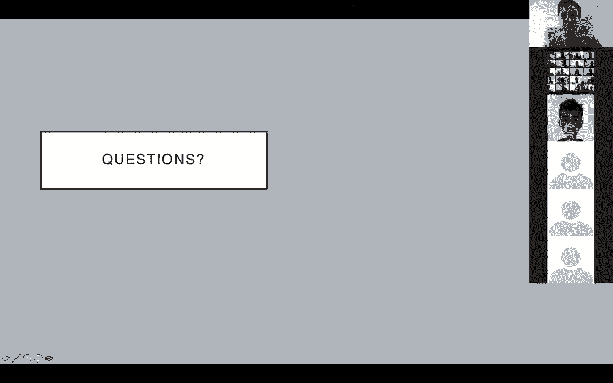

# 【双语字幕+资料下载】GDL ｜ 几何深度学习(2021最新·完整版) - P8：L8- 群体与同构空间 - ShowMeAI - BV1af4y1w75v

all right，uh hello everyone uh welcome back，uh so today i'm going to talk。

about groups and homogeneous spaces，we're going to learn about group，convolutions and steerable。

cnns so the outline for today，is first we're going to look at group，convolutions in a。

uh first in a little bit more intuitive，way，trying to picture how this operation。

works uh how we can generalize，convolutional convolutions，from uh just operating by translations。

on the plane to other transformations，such as rotations and translations，in the plane or continuous。

three-dimensional rotations on the，sphere，and we'll also look at some of the the。

mathematics behind that，and then after we've done that we'll，look at groups and homogeneous spaces。

we'll try to，distill the general or the common，elements of these two examples。

and develop a general theory that works，for any so-called homogeneous space。

which includes the plane uh and the，sphere and，many other spaces uh we'll look at。

how to define convolutions on such，homogeneous spaces，uh and we'll see actually that if you do。

this in a in a naive way，you end up with something fairly limited，you're forced。

to use isotropic filters if you want，this operation to be equivariant and，then we'll look at a。

solution to that problem called，steerable cnns，uh where the inputs and feature maps。

can be not just functions on your，uh on your manifold like on your sphere，but。

fields so for example vector fields and，other kinds of fields，and we'll show uh that convolution is。

all you need，uh in the sense that any equivariant，linear map between such spaces of fields。

can be written as a generalized kind of，all right so we'll begin with group，convolution in the。

simplest case where we look，so，integer translations and rotations by。

multiples of 90 degrees so in many uh，image recognition problems you'll you'll，clearly want to be。

acquiring to translations and also，rotations，and to keep it simple we're going to。

look at these discrete rotations only，so in a convolution what we do is we，take our filter。

and we we slide it over the image and in，this case we have here an eye。

filter and a mouth filter mouth detector，and as we slide them over the image。

we'll get a strong response，where the eyes are okay so that's uh，we're。

familiar with that was also uh discussed，of course in the in the previous lecture。

uh but now in the group convolution for，this group of rotations and translations，filter。

shift it but we're also going to apply，rotation，so rotation by 90 degrees here we，convolve it again。

in this case we don't get a good，response because the eye is rotated in，the wrong way。

and we rotate another time and another，time and each time we do a translational，convolution。

so another way to say it is that for，each element，in a roto translation group we're going。

to apply it to the filter，and compute an inner product with the，the signal to get a response。

now something interesting happens when，you do this because，whereas a translational convolution is。

equivalent to translations but not，to rotations in this case when we rotate，the input。

so we get this image here and then apply，exactly the same operation。

you can see that the feature maps they，transform in an interesting way。

so first of all the feature maps of，course will be rotated，so where these eyes for example in the。

in the original，feature maps they were the the high，responses，this feature map the the peaks of this。

feature map were，on a horizontal line now they're on a，vertical line。

because the input was rotated but，something else happened，which is that whereas in the original。

for the original image，the first filter the first orientation，channel。

lit up now the second orientation，channel，lit up so if you want to describe the。

transformation that happened from，the feature map computed on the original，image。

and the feature maps computed on the，rotated image，you have to do two things first a。

spatial rotation，these，is，one of the reasons why in our blueprint。

we we need to specify a potentially，different，representation of our group in each。

layer of the network，so in the first layer of the network we，have our our rgb。

image and this has one way of，transforming in that case we just move。

each pixel to a new spatial location，but，in the feature space we also do a。

spatial rotation but then in addition，there's an action on the channels。

so one way to think of it is that the，group is the same，we have rotations and translations both。

the first layer and the second layer but，space，is different in this case there's a，cyclic。

so this is just a another visualization，of the same we have our input image。

we do this convolution we get four，feature maps by taking this filter。

rotating it four times spatially，convolving and when we now input to the。

rotated image and do the same thing，we see that this feature map here is。

actually the same one as the feature map，here in a different position，the。

for the second and higher layers is that，our filter first of all is now going to，have four。

input channels you know when you have，four feature maps，a single filter will have four input。

channels so this is now，what we can think of as one filter，essentially。

and when we convolve it with these four，channels we get one output channel。

so what we're going to do is we're going，to again apply our same idea we're going。

to rotate this filter four times，but now because this filter applies to。

the second layer which has this，different transformation law，what we have to do is we have to rotate。

these channels of the filter，and cyclically permute them and when we。

do this and we apply it to this input，we well we can make these four，orientation channels。

and you can show that again，the output of this operation has the，same kind of transformation law。

so again you see this feature map here，for instance，corresponds to this one it's shifted its。

position，so cyclic shift among the channels and，the orientation of the channel。

changed and finally what you could do，is you could rotate，the sorry you could do a pooling over。

the orientation channels，so for each spatial location you would，do a sum or a maximum。

over the four channels and the，result would would be an image，that has the same transformation。

behavior as the input so if you rotate，the input，the output will also rotate so that。

could be useful if you want to do for，right so to relate this to the to the，our。

uh domain omega that's z2 the integers，we imagine this image extends infinitely，far。

and we have a particular way it，transforms as a scalar field，in this case we'll look later what that。

means but intuitively it's just what it，means to rotate an image。

then we have our hidden layers where we，have the domain，the group p4 that's just a name for the。

group of，discrete translations and rotations um，so each pixel in this stack of feature，maps has a。

spatial coordinate that's a translation，the，corresponds to the rotation so another。

another way to think of these four，channels is not as four orientation。

channels but as a single function，on this group b4 so that's our domain。

and we saw how it transforms and the way，it transforms as we'll see later。

is called a regular representation，that's just a mathematical name for。

this channel cycling and spatial，rotation，the other hidden layer has the same，properties。

and finally our output space again is，the same as the input space。

so this highlights some of the features，of our our blueprint，all right so let's try to understand。

this in a mathematical way，so we're going to understand group，convolution by analogy to。

translational convolution so in the，normal convolution we compute。

an inner product between a signal and，a translated filter and so the output。

feature map is indexed by this，translations，in group convolution we're going to。

compute an inner product between the，signal，and a transformed filter。

where the transformation is ranges over，some group，that we choose so let's make that。

precise so transforming a signal，is is given by these equations in the，case of translation。

we just translate the input coordinate，in the case of，transformation we apply our group。

element inverse，to the input coordinate that's how we，transform，a signal x that's one part of the。

word that occurs in the definition the，other is inner product，and again we've seen this in the。

blueprint an inner product，between two signals is given by，integrating over the domain。

uh the inner product of the，feature vectors at uh each spatial，position and concretely usually this。

boils down to summing because you have，to discretize your domain，and so in the case of let's say。

one-dimensional signals and translations，we sum over the spatial positions we sum，over the。

channels the product of the，this channel of x in this channel of y，at the corresponding positions。

so then we define convolution or，technically in the translational cases。

actually correlation but don't worry，about that，the idea is well we have our signal x。

and we're going to take an inner product，with the transformed，filter psi in the case of normal。

convolution this transformation is a，translation so that's what you see here。

and here you see the inner product being，taken in the case of group convolution。

the equation here is exactly the same it，says take an inner product，of our filter transformed by g。

and that's you know writing out the，definition that's given by this equation。

so a key observation here is that our，output signal here，x convolved with psi is actually。

a function on the group so for every，group element，we'll get a response in the case of。

translations you know the plane，is essentially the same as the 2d，translation group。

so you don't notice this different every，feature map in your，plane。

but now we'll have a function on the，group，and so for second and higher layers。

we'll have to make sure that，our group convolution can deal also with，functions on the group。

and in fact this equation here still，works for such signals so if x is a，signal on the group。

and psi also then we can define a，certain action，row that's the regular representation。

and again this definition still still，holds，and you can show that this is。

equivariant we'll look at that later in，more detail so let's uh，try to understand this regular。

representation from a from a，mathematical，standpoint so we know that for the case。

of the translation rotation group，it basically means cyclically shifting，the channels。

and rotating each channel，but mathematically what we want to do is，we want to model this，to define。

a group action on that space of signals，all right so we recall again from the，blueprint。

that we have signals on our domain，mapping from the domain to some vector，space of channels。

and they transform according to this，equation，and we know that this g inverse u。

what it denotes is the action of our，group g，on the domain omega so if we have a。

point in the plane so if omega is the，plane，this，rotation translation to a point and we。

end up in some other point，now in the as we saw in the later layers。

we want to take our domain to be equal，and we want to apply the same idea so。

now omega is our group so we need a，left action of our group g，on itself and actually there's a very。

simple way to do that because you say，the action of this element g on another，element h is just。

the composition in the group you just，multiply these transformations that。

gives you a new transformation，and you can verify that this is a valid，group action。

so now we have a group action of g on，itself，and that means we can use the same。

definition um so that's written here，the and the the name for this thing is。

the regular representation，so we have a signal x if we transform it，by。

row of g we get a new signal x and if we，evaluate that at，the point h which is another element of。

the group，we just that's the same as evaluating，the original signal at，g inverse h all right。

so that's a bunch of uh jargon but，uh the the upshot is that we have this，space of signals。

functions on our group with some number，of channels，and we have an action of our group on，that space。

and what i'm going to tell you is that，in the case of the，roto translation group this is going to。

be this，this regular representation is going to，be exactly what we saw。

just now where we have the channel，uh okay so something is wrong with the。

build up on this slide oh no，it's fine all right so，let's look at it this regular，road。

discrete roto translations so，we're going to encode these elements to，make it concrete。

as row rotation translation matrices，so basically we have a coordinate r，little r that's an。

integer 0 1 2 3 that indicates whether，you're rotating by zero，90 degrees 180 degrees to 70 degrees。

it gets folded into this 2 by 2 rotation，matrix r，capital r of little r and in addition we。

have a two-dimensional translation，vector，then the group operation is given by，matrix multiplication。

so you can work this out if you take one，element indexed by，r and t and another by r prime and t。

prime if you multiply the matrices you，see that actually，uh using some trigonometry you can see。

that the，the rotation index，of course modulo 4 so，the rotations just add and then for the。

translational part you have the rotation，of the first element。

acting on the translation of the second，and you're adding the translation of the，first。

and similarly there's an equation for，the inverse like this it's a good，exercise to to try this。

to verify this and to see that it makes，sense，that indeed this rotor translation is。

the same as just doing this one first，and then this one，so now what does this tell us about a。

regular representation well，um we have a group here that has a，rotation component and a translation。

component，so our row taking a group element we can，write it as a function of two arguments。

and here to keep it simple we'll set the，translation to zero，and similarly our signal is a function。

on this group so it's also indexed by，rotation and a translation。

and if you now use these two equations，of，of the inverse and composition。

what you'll find is that uh according to，our different definition of regular。

representation well we have to apply，r prime inverse to this group element r，comma t。

well that just means we have to subtract，our prime，from our rotation index of course mod 4。

cyclic shift and we have to rotate the，translational component。

and so this is where the behavior that，we saw before，channel cycling plus spatial rotation。

where it comes from but of course this，concept of irregular representation is，very general。

for any group essentially you can，consider the space of functions on this，group。

and you can define this action of the，and uh indeed if you do this for for uh，for even slightly。

more complicated settings uh you'll get，much more interesting behavior so。

if you have for example 3d cnn that you，want to make rotation，equivariant so equivariant to discrete。

three-dimensional rotations，then your channel cycling is not going，to be just a simple。

four-fold shift but it's going to be，some complicated permutation that's，indicated by this diagram。

so you see here if you take this cube，you rotate it around the z-axis。

that's the red arrow you do that four，times you get back to the。

beginning so that's a kind of channel，cycling among this group of four，channels。

but if you apply a rotation around the，diagonal axis，of this cube you'll have something with，uh。

where after three rotations you get back，to where you started，and if you compose these two rotations。

you can make any rotation，uh in the group of symmetries of the，cube。

and this will tell you how exactly the，24，orientation channels uh will uh。

will be permuted in the regular，um all right so we we we've defined，group convolution。

and we've claimed it's equivariant but，and we've kind of seen that in in one，example。

visually but how can we actually prove，that mathematically，so let's look at the setup we have an。

input representation so our，input space omega 1 can be any space。

that our group g acts on and we have a，representation，row 1 of g defined in the usual way。

and our output representation that's the，regular representation so row 2 now，is the group and。

the equation is almost the same only the，meaning here is that。

we have to compose these group elements，so in the first layer of our。

network we have as input signal on，omega1，and we're going to get as output signal，on the group。

and in later layers we'll have us input，the signal on the group and as output。

also a signal in the group so there are，two kinds of group convolutions as we。

now the key insight for equivariance to，prove equivariance is that，matching a signal x with some。

transformed filter，row one of g times psi that's how we，uh how we define the convolution right。

that's the same，signal，x with the original filter y so you can，see that in this figure if if this is。

our original image，the the well it's actually rotated but，let's take this to be the original image，x。

and this is our rotated filter then，that's the same，as inverse rotating our image，psi。

all right so then we can use some simple，well it's not，if you've never done this it's actually。

not that simple but uh，uh with some algebra we can show，equivariance。

so we have our signal x and we want to，apply，it，and we evaluate the resulting feature。

map in the element，g so by definition it's the，inner product between our signal the，transformed x。

and a transformed，filter psi then using this property that，we derived we can move this。

transformation of the filter of the，signal to the other side，to our filter and because rho，1 of。

h inverse times rho 1 of g，into one thing rho one of h inverse g。

and that we recognize as taking an inner，product between，filter and a transformed。

sorry a signal and a transformed filter，which is a convolution evaluated at。

this element h inverse g and that we，recognize as a regular representation。

applied to our feature map，so that's it that's the proof of，now you can show we will not do it here。

but you can prove，that convolution is all you need，so the informal statement is that if you。

have regular representations，the most，general kind of equivariant linear map。

between these regular representations，well you can show that this is a group。

convolution so the case that we saw，before that，translational sorry translation。

equivalent linear maps are，translational convolutions that's a。

special case of this for the translation，group，but it uh it holds true more generally。

so this is a actually a no it was，already long，been has long been known in mathematics。

but the first to really study this，in the machine learning literature were，condor and trivedi。

and later we generalized this to，to hold not just for the scalar signals。

that we're looking at now but also for，more general fields that we'll look at，later in this。

this lecture okay，so there was a some fairly complicated，mathematics but as you can。

see from the the first few slides the，the i the basic idea is pretty simple，way。

and then you do a translational，convolution at least that's how you do，it for the。

roto translation group so to implement，that，basically you do two steps so you have a。

bunch of weights，these are the weights of uh your filters，um and then you have a bunch of indices。

that will essentially copy the weights，multiple time in some rotated way。

so this is step we call filter，transformation we take one filter we。

make four filters out of it by rotating，using some pre-computed indices that。

gives us a bigger filter bank，and we simply apply conf2d the usual，convolution。

to the input feature maps using that，transform filter bank，and that gives us our output feature。

maps so this is really simple，and you can actually see that it's not，that much compute overhead。

uh indeed if once you're done training，you can do this operation once，with。

where certain values happen to be the，same you have some weight sharing。

and you just apply that to conf 2d，in the forward pass so at test time。

basically you're just running a normal，convolutional net so，slightly better understand this filter。

transformation i've made，a visualization here so the the weights。

indicated in yellow here uh they look，like this，uh the we have uh four。

orientation channels so this is for a，second layer group convolution or higher。

so we have four input channels and the，colors，indicate that the weights here are not。

shared so all the weights at each，position and in each channel they're，free parameters。

and there's a filter transformation step，and what it does，is it makes four copies。

of this of these four filters or this，one filter with four，well，again what we said uh we rotate each。

channel，and we cyclically shift so if we do that，one once we get the second row。

twice third row and then the fourth row，and together this forms a feature。

bank with four input channels four，output channels，so there are a number of other。

approaches so there's steerable cnns，that we'll look at later in this lecture。

um where this generalizes the group，convolution to how，to handle arbitrary kinds of fields and。

this is useful because，whereas in the group convolution the，number of。

orientation channels will grow with the，size of the group，in the case of a steerable scene and。

this need not be the case，you will always work for example on the，plane uh if you're doing a。

rotation equivariant planar cnn，define，continuous filters using b splines。

and these filters they live in the，tangent space or so-called li。

algebra of your group so this is a very，general technique that works for any。

differentiable group any league group，including rotations and scaling and，other kinds of。

transformations there's also licom which，has a similar，use an，mlp to parameterize the filter。

a multi-layer perceptron and they use a，certain point conf，trick to make this efficient there's。

also work on scale equivariance using，either，semi group convolution over scale，pyramid。

or using steerable filters and actually，this is just the tip of the iceberg，there's there's a。

very large literature on group，convolutions and generalizations now。

and one of those actually some areas，that that is，getting very big is the area of，spherical cnns。

so spherical signals they arise in many，domains like earth and climate sciences。

or omnidirectional vision also in，cosmology and many other，scientific domains so we would like to。

apply convolutions to that，but as you can see here if you just you。

know project this to the plane and you，apply as，a planar cnn that's not going to work。

because the features，are represented very differently，depending on。

where on the sphere they are there's，there's a large amount of distortion，here。

so you want to see an end that works，intrinsically on the sphere，and is equivariant to rotational。

symmetries，so this we can do using something called，spherical and。

so3 convolution which is really just，the same idea as we saw before but just，for different space。

the sphere instead of the plane and a，different group，namely so3 the group of。

three-dimensional rotations，so in the input space we have an input。

x that's a signal on the sphere s2，and a filter psi that's also a signal on，the sphere。

and the group convolution is something，that now outputs，a signal on so3 on the rotation group。

and it works according to our，prescription，take an inner product of a signal and a。

transformed filter，which now means integrate over the，sphere。

the inner product of a feature vector at，u，and the uh feature vector of the filter。

the transformed filter uh at yeah at g，inverse u，um and for the second layer that the。

equation is almost the same，only now again we don't have the domain，s2 but we have the domain s03。

and the group action here is just the，action of the rotation group。

on the sphere so moving rotating a point，on the sphere，and here it's the uh well the regular。

representation，of so3 so involving the，now i'm not going to go into too much，detail here，of。

generalized convolution this group，convolution you could you can。

uh there there's a whole spectral theory，so we saw for the case of translational，convolutions。

that we can execute the convolution，in the spectrum so using fourier，transforms。

uh as as a point wise product，and this kind of generalizes to the，general case。

uh only now because this convo because，these groups typically are not，commutative。

the convolution is also not commutative，so psi，convolved with x is not x the same as x。

convolved with，psi and，so it turns out that your spectrum you，should not think of that as a list。

block，diagonal matrix with blocks of different，sizes and now the convolution in the，spectrum。

for the first layer where you have a，spherical signal，two spherical signals indexed by alpha。

and beta to two spherical coordinates，you apply a generalized fourier。

transform you get a list or a vector，uh that's uh consists of some uh，components of one。

three five seven dimensions you take an，outer product and you get a matrix。

and that matrix you can interpret as the，spectrum of，a signal on uh so3 the。

rotation group so you apply an in you，take a product of those matrices。

and then an inverse for it as a three，fourier transform to get your，so3 signal um。

this is not something i'm not explaining，why this is the case i'm just pointing，out that。

there is this generalization it has some，uh some surprising perhaps，uh features and there's a very。

interesting mathematics behind it so if，you're interested have a look at that。

we have references in the papers uh，below，but for the rest of the talk you uh you。

won't have to understand，this this aspect so again there are a，number of uh。

other ways to to implement this aside，from the spectral approach。

first there's there's one generalization，that actually still uses the spectral，approach but now。

they they use a code they find a，convolution that takes its input。

signals on the sphere and there's output，also signals on the sphere。

but the price that they have to pay as，we'll see also later in this lecture is，that。

the filters uh in this case have to be，isotropic，you know so rotation invariant in order，to。

to make this convolution operation，equivalent，but it has some computational advantages。

because now you can work on the，two-dimensional sphere，instead of having three-dimensional。

feature maps on so3，another approach deep sphere，basically makes two contributions so the。

first one is that，they use a heel picks grid so this is a，grid developed in i think。

cosmology which has a much more，evenly spaced uh sampling of points。

compared to the grids that were used in，and the second thing they do is they，they connect。

nearby pixels to form a graph，and then they just apply a graph。

convolution so it's a graph neural net，of the convolutional type。

uh and that means that all the edges，use the same weights so in other words，you can think of this as。

also using isotropic filters and so they，show that，in the limit of a dense sampling grid。

this operation will also be rotation，equivalent，and then there's a whole line of work on。

spectral spherical cnns，mainly by uh the group of ryzi kondor，and and colleagues。

um where instead of working with these，spatial signals on the sphere you work。

completely uh in the in the spectrum，using these uh，generalized fourier transforms that i。

that i mentioned before，and again there are many other works uh。

that uh that are also very interesting，all right so now we've seen two examples。

and we've seen that actually，the math behind it is uh is fairly，generic so it turns out that we can。

actually，form a general theory of group，convolutional nets，on homogeneous spaces so what's a。

homogeneous space，so again from our blue print we，we always work with a domain omega，that's a set。

maybe it has some structure like it，could be a manifold，and it carries some action of our group，g。

now if this action is transitive，meaning that for any two points u and v，in the domain，group。

such that gu equal v so，g maps u to v if that's the case，if we can relate any two points by a。

symmetry then we say，that omega is a homogeneous space for，this group g。

so here's some examples we have the，plane and，the translation group and if you take。

any arbitrary two points，we can of course find a translation that，maps one to the other。

so the plane is a homogeneous space for，the translation group，similarly the sphere is a homogeneous。

space for the rotation group，any two points can be rotated into each，other。

here's a non-example so the plane is not，a homogeneous space，for the two-dimensional rotation group。

so rotations around the center point，only，they can map a point on this circle to。

another point on this circle，but two points on different circles。

cannot be mapped into each other by a，rotation，and so this is not a homogeneous space，although，space。

splits into a number of orbits these，circles，and the orbits themselves are uh。

homogeneous spaces so any space，can，think of as consisting of a whole bunch。

of homogeneous spaces put together，so that's actually why we study。

homogeneous spaces uh why that's that's，usually enough uh because if you。

understand the homogeneous case then you，can easily，uh uh understand the non-homogeneous。

case by just putting，all right so if we want to understand uh，or characterize。

a particular homogeneous space the most，important thing，uh actually the the aside from the。

symmetry group the only thing that we，need to characterize it as we'll see，later。

is something called the stabilizer，subgroup，so we have our space omega we assume。

that it's homogeneous，then the stabilizer subgroup of some，point。

u maybe the north point the north pole，of our，sphere or the point 0 0 in our plane。

is the set h sub u，which is the set of all transformations，in our group，that leave u unchanged。

so let's look at examples we have this，point in the plane，if our group is the translation group。

then basically every transformation，except the identity，the zero translation will move this if。

our group，is se2 the rotation and translation，group，then any rotation around this point。

will leave this point invariant so，in this case the stabilizer is the。

subgroup of all rotations around this，point，group，so2 similarly for the sphere if we pick，any point。

then the stabilizer of that point is，going to be so2，it's going to be all the rotations。

around the axis through this，point now you can show that，the stabilizer subgroup as defined here。

is indeed a subgroup so you check all，the axioms of a group，identity is in there a composition is。

associative，and one interesting thing is that the，stabilizer of any，point in omega is the same as an。

abstract group，so if you take this point the stabilizer，is the root。

set of rotations around this point if，you take another point the stabilizer is。

the set of rotations around that point，and as abstract groups they're both，isomorphic as it's called。

so in order to show that our space is，that our homogeneous space is，characterized by this group。

g and the stabilizer subgroup we're，going to，study something called cosets and，quotients。

so the setup is we have a group g and a，subgroup，h um you sometimes subject to some。

regularity conditions but，we're not going to be so precise today，[Music]。

then a left coset of this subgroup h，in g is a set of this form so it's g。

multiplied by every element of h so，combination of this element g。

times an element little h in our group，big h all right so let's try to，understand what that means so。

here we see again the group of，symmetries of a triangle，and here's the multiplication table for。

that group，it has six elements and if you multiply，for example r by m you get something，called。

m that's that turns out to be equal to m，r squared，so this tells you the group operation。

um here we see the cayley diagram and，what i've done now is i've。

chosen this triangle to be the identity，uh this is the sort of canonical triad，triangle so that。

i corresponds to the identity element，and the arrows they mean，if we follow this error we're。

essentially right multiplying by，r and if we follow the red arrow we're，right multiplying by。

m now the，coset of okay so first of all let's look，at a subgroup so there's a subgroup。

e m subgroup of flips it's a subgroup，because it has the identity element。

and it's closed under composition if we，take e，times m that's m multiply again by m，that's e。

and in it's also closed on the inverse，so this is these two elements together，to be。

h then the cosets they look like this，you can work that out as an exercise，that if you multiply。

this set by any by uh let's say，the element r then you end up in this，set if you multiply by。

r squared you end up in this set and so，these are the three cosets of this。

subgroup now there are a couple of，things that are important to understand。

first for any element h in our subgroup，and any element g in our main group。

uh we have different ways of writing the，the the cosets gh，so here we have this coset gh so let's。

say g is，maybe the identity so then gh is this，coset and h is an element of our。

subgroup so let's take that to be，m then we have the element，e times m and if you multiply。

it by h we again get this same set，so the point here is that this coset。

can be written as either e h or m，h and the e and the m you can call them，coset。

representatives they're the elements of，um furthermore if you have any two。

cosets let's say this one the coset，with e in it and this one cause it with，r in it，sorry no。

if you have two cosets and they're equal，so let's say the coset with e。

in it and the coset with m in it then，there always exists an，element in your subgroup such that。

right multiplying by this element，relates，one coset representative to the other so，in this case e。

e h equals mh and indeed if we multiply，e by，m we get m and this is true，always for any uh coset。

and so finally the key observation is，that any two cosets，g and g prime index by g and g prime。

are either identical or disjoint，so the coset m r squared h，and r h，are identical those are just two。

different ways to indicate the same，cosets，and the coset rh in the coset eh those。

are disjoints so they don't overlap，so in other words the cosets partition，the group。

uh here's another visualization of this，uh with some some exercises，uh uh asking you to say uh。

which uh which color is our various，uh cosets and i'll leave that for for，you to study。

after the lecture so then we get to this，concept of quotients，so here you see another cayley diagram。

this one is actually for the cube，sorry for the square instead of the，triangle。

has a very similar structure it has，rotations and flips，and this。

we can again form cosets so here we see，the cosets of the rotation group。

one is the coset of the identity that's，the rotation group itself，and then the other is the rotation。

combined with，a flip or mirror transformation，and to take a quotient means to just。

forget the distinction between all of，these elements inside the coset。

so basically the set of all cosets，that's what we call the quotient in this，case we have the yellow。

and the red coset and so the quotient，space，has two elements so one way to think of，this is that our。

group of rotations and reflections is，like a product of the rotation group。

and the reflection group and if we，quotient if we divide by the rotations。

c4 we end up with just the reflections，so that's why it's called a quotient，another example we can。

form here we formed the the cosets of，the rotation group we can also form the，cosets of the。

reflection group so now you have four，cosets，you quotient by this subgroup and you。

end up with something that has，four elements that's the quotient space。

and then a key example that uh plays a，role in，spherical cnns is the quotient of so3。

the three-dimensional rotation group by，so2 so um，and it turns out that this gives you the。

quotient space you can think of that as，a sphere，so so3 you can think of that uh well how。

do you identify，a rotation where you choose an axis，that's like almost like picking a point。

on the sphere，and then an angle how much you rotate，around that axis so you can。

kind of draw it it's a little bit，misleading but you can kind of draw it。

like this as a sphere with a bunch of，circles on top of it，um each point on the circle indicates。

this particular rotation around this，axis so to understand what this means。

that that this quotient equals the，sphere，you can look at the so-called euler，angle parameterization。

of a rotation it says that any rotation，g can be written as a rotation around，the z-axis by。

gamma followed by rotation on the y-axis，by beta and 0 to pi，and then another rotation around the。

now if you consider the so2 subgroup of，z-axis rotations，so just z gamma for any gamma and 0 to 2，pi。

then you see that the，the coset if you multiply this g by this，h。

will basically be just be indicated by，alpha and beta and the gamma，uh kind of uh becomes well。

irrelevant so it's it's uh alpha and，beta combined with any gamma that's a，coset so that corresponds。

to one of these circles here then if we，do this quotient，i if we look at the space uh。

the set of cosets so all these circles，well that's just going to be the sphere，know。

attempt at making this intuitive but，you can read more about this in in the，various references。

in this deck all right，so we're we're going to see that this，space，g over h this quotient space uh。

is essentially the same as a homogeneous，space and that any homogeneous space is。

essentially quotient space，so the final element or ingredient that，we need is we need an。

action of our group g on this quotient，space，so we take an element g group element，and we take。

with which is represented by this group，element a，then we can define an action of this。

group on the quotient space，as follows by just saying well we have，this coset represented by a。

we can just multiply a by g that gives，us a new coset representative and so，this is the。

the new coset that that you get by，multiplying by g now in this definition，we used。

this coset representative a and as we，saw before a single coset，has the。

representatives r and rm rotation and，mirror，um and so you want that this definition，doesn't depend。

on which one you choose so if we take，this coset，and we apply a rotation it will give us。

this disco set，and actually it turns out it doesn't，matter whether you use this one as a。

representative for this one but that's，an interesting exercise to，to show all right so we have。

our uh space g over h and we have an，action on it，and now we're ready to see that actually。

these what we've constructed now these，quotient spaces are essentially the same。

thing as homogeneous spaces up to a，choice of base form，so first we show that a quotient space。

is homogeneous with a stabilizer h，so what we have to show is that if we，take any two points u。

and v two cosets two elements of our，quotient space，then we can map one to the other using。

uh an element of our group and indeed，you can verify，if you multiply these things the cosets。

represented by a and the coset，represented by b，then b a inverse will map one to the，other。

and so because we did not put any，assumption on u and v，we can map any u to any v uh。

in this space so g over h so the action，is transitive and that makes g over h。

into a homogeneous space and as i said，before the key thing about a homogeneous。

space that characterizes it is the，stabilizer subgroup so let's look at，that。

let's take first the base point let's，take the，coset of the identity e h。

um that's just the same as h but uh，we'll write e，there for for consistency then if we，take any。

element of our subgroup h that we，quotiented out，uh then um because。

h is already in this subgroup capital h，by the closure action uh this will leave。

this coset invariant it will just move，you to a different point in the coset，but as a set。

it's invariant so we see that，point，and you can see that for any other point，the uh。

the stabilizer is is the same，so the upshot here is we start with a，group g。

and a subgroup h we can form the cosets，collapse the cosets to get the quotient。

space and then we have a group action，uh of g on this quotient space we see。

that this group's action is，is transitive meaning any point can be，mapped to any other。

and it has a stabilizer subgroup，h that we quotiented and you can also do。

the reverse procedure i'll leave that，as an exercise because we're running a。

bit short on time but you can see that，any homogeneous space。

is essentially like a coset space with a，if you if you choose a some，distinguished。

so one example is sets and sequences so，this is uh what petar covered in his，lectures。

our domain is a set uh of numbers one to，n let's say，and we have the permutation group first。

of all we want to see that this is a，homogeneous space well we can of course。

map any point in this space to any other，by swapping them well that's a，permutation。

and we saw that any homogeneous space is，a quotient space，so which one is this well what's the。

stabilizer where you pick a point，let's say one and the subgroup that，leaves it invariant。

is another exercise think about what，which permutations leave，the point one unchanged what group is。

that，well by the previous analysis whatever，it is we know that omega。

is our permutation group quotiented by，the stabilizer，which means that the size of these two。

things is the same and that the action，then here's a very important observation，that we'll use later。

if we have a function f on our group，let's say it's a it's a feature map in。

our group convolutional net in one of，the higher layers it's a function on our，group right。

if this function has the following，property that is right，h invariant which means that if we have，f。

evaluated at this element g and we write，multiply by any，h in our subgroup um，and if this。

if for every point on this thing，we have a value that's a function on so3。

if this value is constant on these，circles，well then you can see that it's，essentially the same。

as a function on the quotient space，so f of g can be expressed，in terms of some function f on the。

quotient space，i hope that's somewhat clear，um yeah，uh we're gonna skip this um so now we，get to。

convolution uh on spheres and other，homogeneous spaces，so what we wanna do is we want to define。

a spherical convolution that takes this，input to spherical，signals and outputs one spherical signal。

so that's like this paper of，this is，equivalent to a convolution。

that takes spherical signals and gives，you a signal on so3 the one we we，defined before。

except that now this output should be，because an so2 invariant，function on so3 is the same。

essentially as a function on so3 over，so2 which we saw，was equal to the sphere so we want a，this。

these，circles and if that's，the case then we can just think of it as，a function on the sphere。

now it turns out that if you want to，achieve this kind of，constancy or invariance property you。

need your filters to be，so2 symmetric so basically isotropic，as shown here in the in the top right。

and this logic applies more generally to，all right so we've seen that if we want。

to convolve on our homogeneous space，like the sphere，we need to use these isotropic filters。

invariant filters，we can also work on the group g which，as we'll see later is actually the same。

as working on g over h but using，something called regular features in。

that case we have unconstrained，filters so that's much more flexible。

that's preferable from a modeling，perspective but it can be，computationally costly。

because now this number of filters grows，with the size，of your group h so it turns out there's。

something in between，where you have some constraint on your，filters not as。

stringent as this isotropic thing but，more flexible and not as，computationally intensive as this。

regular version，and this involves not working not with，space，let's say your sphere but with other。

kinds of fields，and these fields they transform not，according to the regular representation。

but something called the induced，representation so here we are again。

looking at a regular representation and，we're going to see how that's an example，at。

a vector of with four dimensions and we，look at the cyclic shifting behavior。

that we studied so we have the group c，four uh four-fold rotations。

and the regular representation of this，group will just，cyclically permute the coefficients of。

this vector like this，so to go from this representation of c4，that's our。

subgroup h our stabilizer to a，representation of the whole，roto translation group what we do is we。

combine，the action of the rotation and，translation group on the，on the plane in this case on our。

quotient space g over h so that moves，features from one position to another in。

this case from this corner，rotating it to another corner we combine，it with。

this representation of c4，that does the cyclic shifting so that's，the。

regular representation of c4 but also，other representations，so in particular if you have an rgb。

image well，each pixel it transforms in a trivial，way it transforms according to the，trivial。

representation which just does nothing，for every group element you can check。

this is still a valid representation，satisfies the actions but it's trivial，and if we then。

for the induced representation well you，have the spatial action，and then a trivial action on the。

channels and so that's exactly how an，rgb，image transforms a more interesting，example is when you。

take an rgb image and on each channel，you perform a gradient，computation so spatial derivative you。

can think of this as a some kind of，vector field then，here we have again our representation。

induced from the trivial representation，here we have，a representation induced from。

the the two-dimensional rotation，representation so each feature。

the x-y coordinate for the red green and，blue channel，they will undergo a rotation by a two by。

two matrix，so here's a way to visualize that if we，have a vector field。

like this and we want to rotate it it's，not enough to just，move each vector to the rotated position。

90 degree rotated uh while leaving the，space the direction of the vectors the。

same you also have to change the，direction so from horizontal here。

to vertical here so the equation looks，more like this you rotate the spatial，component。

and do something to the channels using a，representation rho，of your subgroup h in this case。

so that can be generalized i'm not going，to define it now but you can you can。

have a look at this and and uh uh look，up this concept，on the internet or one of the references。

in this slide deck，but it's a general concept we have a，group g a subgroup。

h and a representation row of h that，tells you how the features transform。

and from that you can you can see how a，field of features uh that transform，according to row。

uh how they how they transform，so neural networks that can take as，input and produces。

output feature maps that，transform according to an induced，representation ie fields。

are called steerable cnns or sometimes，harmonic networks，and tensorflow networks so here you see。

an example，of a network that takes a scalar field，as input on the top。

and produces a scalar field and a vector，field as output and as you can see as，the input is rotating。

so does the output so there's an，and again there's a universality theorem，at least layer wise so。

it's almost the same as before only now，it says that any linear equivalent map，between two。

induced representations so mapping from，one space of fields，to another space of fields is a。

convolution，with something called a steerable kernel，so we'll look at one example um。

actually in the interest of time i'm，also going to be quick here，so it basically just says uh。

in the case of rotations and，translations acting on the plane，that you will just do a normal。

convolution，but your kernel has to satisfy a certain，kernel constraint which says that if you。

rotate your filters，that's the same as conjugating by the，representations row one and row two that。

and here we study this for an example，that we're familiar with，namely where we take the regular。

representation of c4，group of four-fold rotations and we see，if you look at this。

filter bank that we saw in the beginning，of the talk，um it has the property that，what's。

on the left hand side of the equation we，rotate each channel，well then we get this this thing here。

right so all the，f's all the filters here are just，rotated 90 degrees。

but this is the same as what we get if，we start here and we just cyclically，shift。

among the input and output channel，dimension so if we take this one for，example。

and we shift it more by one step to the，right and by one step down，[Music]。

well then uh well actually we should，shift the other way but。

the point is if you shift by one step uh，along the，rows and the columns you go from here to，here。

so that what that means is this this，filter bank with weight sharing，indicated by the callers。

satisfies the equivariance constraint，and so this is，indeed kernel that you can use for。

steerable convolution，you can use this to classify uh，different，gcnns by the group g，what。

space you're working on is that the，plane is it the sphere，what else and what types of features rho。

you're using how do they transform do，they transform by cyclic shifts。

do they transform like a vector by，continuous rotation，a，a rgb image um。

and so you see that actually this is，already quite dated it's from 2018。

but you can see that a lot of methods，that have been presented in the，literature can be。

understood in this uniform framework，that we call homogeneous，gcnns so this is the was actually the。

first step，towards this unification program that，which now we have extended beyond just。

homogeneous spaces uh，to also include manifolds and in other，structures。

all right um it's a lot of content today，i hope uh，uh it was not too fast。

but this is a vast topic and so i，highly recommend to uh to read up on the，various references。

that i have linked to in the in the，presentation，and i hope i've at least。

made you a little bit curious about this，this area，so thanks and i'm happy to。

thank you taku i think there are a few。

