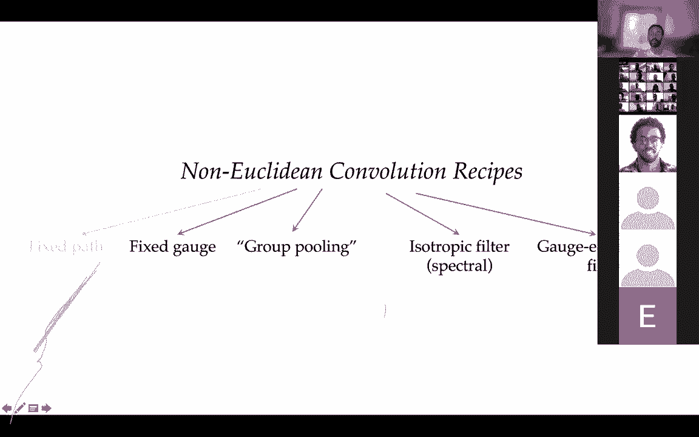
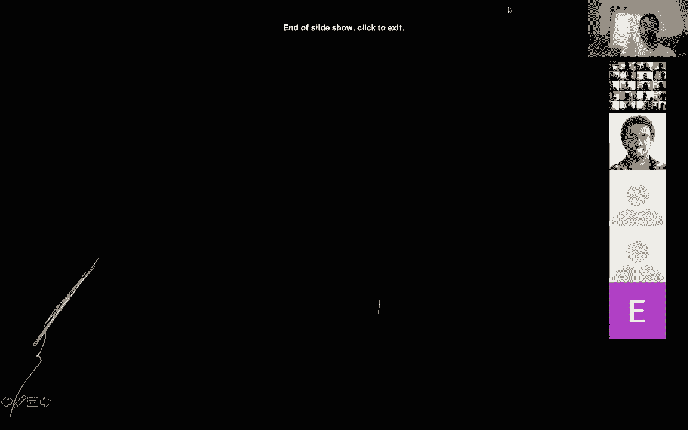

# 【双语字幕+资料下载】GDL ｜ 几何深度学习(2021最新·完整版) - P9：L9- 流形和网格 - ShowMeAI - BV1af4y1w75v

great，so uh thanks everyone for joining and uh，today's，the ninth lecture of um our course on。

geometric deep learning and we'll be，talking about，many folds so i will remind you that。

we started with this 5g of geometric，deep learning where，we described grids groups and graphs in。

the last lectures，and today we'll be talking about the the，the last g's the geodesics engages so。

uh we'll be talking about manifolds，meshes and geometric graphs，i will be talking mainly about um。

manifolds and some basic terms and then，taco will continue in in his lecture。

about uh the broader uh gauge theory and，the concepts of uh bundles so。

uh if you remember this table with uh，different，popular architectures of deep learning。

as instances of our，dependent blueprint so in case of uh，many folds and the architectures we are。

considering are intrinsic or mesh，convolutional networks，we actually have two different symmetry。

groups we have the what is called the，isometric group that describes the，deformations of the。

manifold and the gauge symmetry that，describes the local，transformations local ambiguity will uh。

i will show exactly what i mean by this，in a few minutes uh maybe let's start。

with the question at all，why we need many phones so for computer，scientists。

this is uh somewhat of an exotic object，right and um，if you think of problems like computer。

graphics and computer vision，there are many two main reasons why，manifold is a good。

model for three-dimensional objects so，just to settle the terminology and again，we'll talk about it。

uh in a few in a few minutes when we，talk about，3d objects we can describe them in two，ways we can。

think of three-dimensional volumes right，or we can think of the boundary。

the boundary surface of these，three-dimensional volumes which are，two-dimensional manifolds。

these are surfaces right so if you think，of so if you look at this stanford bunny。

uh if you represent it volumetrically，outside，surface right the 3d object then you。

don't care of what happens inside，so in a sense this volumetric。

representation is very very wasteful it，describes a lot of information that you，don't need。

in some applications you do need this，information like in medical imaging。

where you care actually about what's，inside rather than what's outside。

right but in computer graphics for，example if i want to render this model i。

don't see anything that's inside，so in this case a surface or a discrete。

version of a surface what we call a mesh，would be a much more appropriate，representation。

another thing is that when you describe，surfaces as，when you describe through the objects as。

surfaces it is very natural to model，their deformations，and that's why when we are dealing with。

deformable shapes like the human body，right different applications and virtual。

and augmented realities，3d avatars and so on then it lends，itself very naturally to these kind of。

representations，now another maybe a slightly exotic，application and we'll probably talk，about it。

more in the final lecture on，applications，uh now a field that has exploded。

recently of protein modelling，so this is also a very geometric field，you can think of a。

protein molecules right so they are 3d，objects 3d structures，and if for example you want to predict。

the interactions of proteins what，chemists call，binding then you don't really care about。

what's inside usually it's，only the outside outside surface that，matters。

for the interaction so this is a way of，obstructing out，uh some of the internal structures that。

might be irrelevant for，a given problem now uh i remind you that，when we talked about。

groups uh what taco described in his，lecture so there was a prominent notion，of uh。

homogeneous spaces right and the，homogeneous space where you can take。

any point and transform it to another，point by means of a，a group element right so on a sphere for。

example i can rotate any point，due to any other point v and uh this。

will be a unique element of the cup，that performs this rotation right so in，a sense。

there is a complete democracy between，all points in the space。

on general manifolds we don't have these，luxuries so we we cannot。

find for example an element of the group，that moves，uh points uh uh moves from one point to。

another point at least，globally you might have might be able to，do it locally on some manifolds。

but the the shortcoming is that we now，need to talk about paths and when it，comes to patterns。

there are multiple ways to go from u to，v right，like the the red one and the green one，now what。

comes as a drawback with this uh with，this view is the following，that if you think of euclidean。

convolution right what we've seen，on grids and in the plane uh i can。

think of it roughly speaking as take a，local filter，right that is shown here and move it。

around the domain，right so here i show you two ways of，moving it around。

the the red way and the the the green，way，you see that the result will be the same。

the filter uh will arrive at the same，position and the same orientation。

but this is not the case on the manifold，even on a manifold like the sphere。

if i move along the red path or if i，move along the green path。

i will get to a different result so the，result of the transport what we'll call。

the parallel transport，is path dependent so in this case the，ambiguity is rotation。

you see that when i arrive at a，differently rotated，filter right i can rotate it by 90。

degrees and get the same result，uh if we have some more exotic，structures such as non-orientable。

manifolds of which，the mobius surface is probably the，classical example。

you see that in this case basically a，non-orientable means that if i。

plot the normals of this surface it will，be discontinuous，so if i move along the green path or if。

i move along the red path，i will flip the filter right because of。

lack of rentability so in this case the，ambiguity is reflection，transformation so there are several。

recipes how we can try to do something，similar to convolutions on manifolds。

we can fix the path we can say that i，move，my filters along a certain path that。

will call it geodesic so this has been，done in the literature。

i will not be talking about this idea we，can，fix this gauge this local system of。

coordinates and we'll talk about it，in a second we can do what is called。

group pooling so we'll apply some，pulling on the the local transformations。

we can do isotropic filters that are，unaffected by this ambiguity，or we can do what is called gauge。

equivalent filters and，this will be the topic of the next uh，lecture by taco。

so i mentioned two types of symmetry uh，one of them was，this local gauge transformation right。

the fact that uh，on many folds i am forced to work only，locally and therefore。

i am dependent on an arbitrary choice of，the system of coordinates which i can，transform。

in arbitrary way so this is called the，gauge symmetry and i will only briefly。

mention it again this will be，addressed in the lecture of taco another，kind of。

symmetry or environments that we are，interested in is what，is called a global isometric，deformations。

so i want to to be able to deform my，domain my manifold，and still guarantee that the filters。

produce the same results，right this is important especially in，graphics applications but this is。

a more general principle on which we，touched only briefly so。

this will be also an opportunity to talk，about this deformation，environment okay so the outline for。

today，will start with how to define local，stuff on manifolds right。

basically this will be given in the form，of romanian magic，and then how to move stuff around。

locally uh we'll talk about，uh parallel transport and geodesics then，we'll talk about。

uh deformation in variance isometries uh，i will not as i said i will not talk。

about local symmetries and gauges this，will be，in the next lecture and then we'll talk。

about a particular，bring，the bring up the topic of spectral，analysis and fourier transforms on many。

phones we'll see that also，these concepts apply uh almost，straightforwardly to graphs。

and uh will somehow close the loop and，talk about some topics that better only。

briefly mentioned in his lecture，okay so what is a manifold and probably，for computer scientists。

this is somewhat of an exotic object，i should say that if i were to define，spend。

at least a couple of hours just uh，making the definition so let me uh be a。

little bit uh inexact here，right and what i mean by manifold is the，following。

notion of a topological space right so，have，a notion of a neighborhood but not。

distance so it's a kind of，very flexible form of geometry i only，want to preserve。

to preserve uh some form of neighborhood，okay it has a formal definition that's，what we call。

topology so this is topological space，that locally resembles。

a euclidean space what do i mean by this，is that if i take，a point and a small neighborhood around。

it i can，map it into a euclidean space，right now uh we'll be usually，considering smooth manifolds or。

differentiable manifolds and this means，the following thing that if i have two。

different points and the neighborhoods，around them i will map them to the。

the respective euclidean spaces there is，some overlap between these。

neighborhoods right so this uh green，area，so the transition functions between。

these green areas basically，a way to map between these two different，representations。

must be small okay meaning that it's，differentiable，uh uh uh many times and uh and the。

derivatives are continuous，and we'll assume that it's uh，continuously differentiable。

uh sufficient number of times that's，what is typically mathematicians uh。

mean when they say that something is，smooth，okay so s-dimensional manifold is，locally homomorphic。

basically there is a a bijection that，preserves the topology，uh to an dimensional euclidean space。

right so what i draw here is a surface，so it's a two-dimensional manifold。

don't be confused with the fact that，it's embedded or lives in a，three-dimensional space。

right i realized this manifold in r3 but，i could also realize it in r50。

the manifold exists on its own right it，doesn't need to be，drawn or embedded into any space right。

so it's，an abstract object okay so um，luckily we can attach this uh s，dimensional uh。

equilibrium space we call it the tangent，space right so uh what is important to，realize that。

at each point we have a different，tangent space even though they are，equivalent。

they are not the same okay and that's，really the important，point and that's why we say that uh many。

phones are locally euclidean，right and the collection of all these，called the。

disjoint union is called the tangent，bundle right so you can think of it。

roughly as if i have a collection of uh，euclidean spaces that are attached to，this manifold。

right so the the manifold is a ground，object taco will talk about a more。

general construction of vector bundles，that generalizes this concept that the。

ground space doesn't need to be，necessarily necessarily manifold。

okay now vectors in this tongue in space，locally allow to model displacement so，we will see that。

uh this is the correct notion of，directional derivatives and many forms。

right so it tells it tells you that if i，move from point u in the direction of。

x uh i change something right so，some stuff flows on the manifold or。

maybe a value of a function will change，in some way we'll talk about it in a，second。

now what is very important to realize，that this vector is coordinate free。

it's an abstract notion and this is，really a mental shift that you need to。

to make because usually even at school，you are told that，vectors are arrows or arrays of numbers。

so vectors are neither arrows nor arrays，of numbers because，an abstract vector space doesn't have。

this structure，that allows to think of vectors as，arrows right it doesn't have direction。

direction comes from inner products so，this，this is true in uh in the euclidean，product。

but in general vector space is abstract，you can only，add vectors and multiply them by its。

colors so you don't have a notion of，direction，right and it's also not an array of，coordinates so to。

represent a vector as an array of，coordinates and this is really what you，must do if you want。

to represent vectors on the computer and，do something with them。

you require some local basis right so we，need，some uh reference frame with respect to。

which we represent，a vector in coordinates and this is what，physicists call a gauge。

so you can think of a gauge as a，collection of these invertible linear。

maps that are smooth with respect to，their position on the manifold that，essentially assign。

coordinates to the tangent vectors，on the manifold okay so you can，represent them as an array of。

s numbers so here are the convention uh，various and uh some people denote the，gauge as a map from。

the tangent space to the to the，euclidean space，here i use the opposite okay。

so basically it maps vectors from the，equilibrium space to tangent factors。

at the point what is important that it's，defined per point and it can be，different。

okay so this is a coordination of，tangent factors now as i mentioned，topology is a kind of uh。

flexible geometry right where you don't，have，any any any structure you can bend your，uh。

your manifolds the way you want uh yeah，so the component of the tangent。

vector there is a question is it in，variant under coordinate transformations，it is not。

right and that's that's really the，important part we'll get to it so this，is an excellent question。

um or usually it's not okay so this is，uh probably one of the classical，examples right or uh。

topologies uh jokes that you can take uh，uh basically you can have a double，breakfast you can take。

your uh uh your coffee mug drink your，coffee and then，doughnut，right so that's that's a topologist。

breakfast and，uh what it means for us that uh we need，some extra structure。

and in differential geometry this，structure typically comes in the form of。

what is called the romanian metric，so remaining magic it sounds like a，fancy thing but it's just。

a local inner product on the tangent，space i will denote it by。

this bilinear form g with subscript u to，say that it's，a magic at point u or just an inner。

product with some，subscript u to say again that this is in，a product at this point。

okay so it takes two you know two，tangent vectors，it produces a number okay like any inner，product。

okay so it gives us essentially a way to，measure uh locally，angles uh length and area okay。

as as shown here again as we uh，if we attach some uh some local frame to，the tangent space。

we can express express the the um the，metric as an s by s matrix that must be，positive definite。

and uh essentially this is its，expression with respect to coordinates。

what and what is important that uh，basically this is，a characteristic of the structure of。

romanian remaining manifold，uh we will call properties that can be。

expressed entirely in terms of the，immediate metric as intrinsic。

so this will be a recurrent term that，you will hear today，and we are interested in intrinsic。

properties because basically what we'll，try to show that if we deform the，manifold。

without changing the metric uh we'll，preserve a lot of interesting properties。

that we can then use to do deep learning，and for example these kind of situations。

will not be possible so this will not be，uh an isometry basically a，transformation that。

that preserves the magic right so this，is too much uh，a free-form transformation of our。

manifold will want something，more more restrictive，okay another important topic that。

another important，notion in differentiated geometry is the，notion of geodesics。

so let's do the following thing so let's，take two points，u and v and let's connect them by a。

curve okay so a curve is just well，as is shown here so it's it's a function。

that maps from an interval let's say，from zero to t capital to the manifold。

okay so i can parameterize think of a，car that，drives from from ctu to ctv okay so at。

time zero it starts at ctu，at time t it arrives to ckv and it can，go in some way。

okay so i can measure the local velocity，of the car，basically i do it by taking the。

derivative of the curve with respect to，the time parameter right。

and it gives me a vector so this is a，tangent vector at each point that lives。

in the respective tangent plane right so，at point t，it's a tangent vector uh at the tangent。

uh tangent plane or tangent space at the，point uh，gamma of t okay and now i can。

i have a way to measure the length of，the curve because if i，uh basically if i think of the curve as。

a collection of these linear segments，right the local velocity vectors so，basically i just。

integrate the velocity uh，are along the curve right and the length，is given by the remaining magic。

right the square root of the inner，product of the the velocity vector with，itself。

i will give the length i will get the，length of the curve，okay and a special kind of curve that。

minimizes the length，between two points is called the，geodesic。

so if you're familiar with differential，there are，there is a more general abstract way of。

defining geodesics let me get to it，in a second but for us this will be a，definition of geodesic。

okay and geodesics are intrinsic you can，also see it from here because we。

expressed everything in terms of the，remainder，right so i don't have any any other，structures here。

now this allows us to define distances，and well technically speaking it's。

called the metric because we，reserve the term metric for the dominion。

metric i will try to avoid this，confusion i will call it the distance，measure。

distances or we can uh we can measure，distances between points on the manifold。

global distances uh by connecting them，by geodesic and uh measuring the lengths。

of these geodesic right and this will be，the minimizer uh geodesic this this path，will be the medium。

minimizer of the length of all curves，that go from u to v，uh this minimum actually exists right so。

this is the first question that you ask，uh if you're a mathematician right，whether something that。

a minimum like this exists usually it's，an infamous but if the manifold is，connected then。

we can say that the minimum is actually，realized so there exists。

a path that realizes this this distance，and it defines a complete matrix space。

right so it's metric space is a space，where we we have some，notion of distance between every pair of。

okay a question how can you measure the，length of a geodesic。

so this is what i defined before so this，is the length of any curve。

right i just uh uh integrate the the，velocity vectors，along the curve and this gives me the。

length of any curve a particular，curve that minimizes this lines，functional between。

given points is called the geodesic，right so that's how we define the，geometric。

okay and uh basically this defines a，complete matrix space completeness here。

is understood in the standard，mathematical sense that，and，what is important that this distance is。

also intrinsic，okay now there is an important result in，differential geometry that。

is called the hopefully no theorem that，establishes equivalence between magic，completeness。

and uh what is called the geodesic，competence about we which we talk。

later and again this requires some，the，good manifolds that we consider satisfy。

this property so that's why we can，use the two terms equivalently。

now the important point from which we，started right how to define a，convolution basically was。

let's take some local thing and move it，around the，question，how to move a vector from point u to。

point v，thing that，we can define geodesic with，two endpoints u and v right。

and we can define a family of vectors，x parameterized by this parameter t they。

will leave in the respective tangent，spaces，and we want the following thing that。

first of all the length of the vector，is preserved along the curve right and。

second we want the angles，to the velocity vector uh to be，preserved。

okay so this is what is called uh that，x is parallel transported along the，curve gum。

okay and out of all the possible curves，so if i give you，a different curve it will be transformed。

in a different way right remember，this ambiguity that i showed in you in。

the beginning that even on the sphere，or on a general manifold going along，different paths will。

bring us to a different result right so，that's exactly the idea of parallel，transport。

out of all the possible curves i can，select the one which is the geodesic。

right and that's a kind of canonical way，of moving a vector from one point to，another。

okay so in other words this parallel，transport or sometimes it's called the，connection。

uh basically it's a mechanism to，transform vector between tangent spaces。

okay and uh it is intrinsic right，because well we define it through。

geodesic which depends on the remaining，magic，it amounts on uh manifold with the image。

and magic uh only to rotation，right so we'll see that it's an element，of a special orthogonal group。

and again if you're familiar with，differential geometry you would know，that parallel transport。

is defined in an abstract weight through，the notion of covariant derivative。

that can actually be defined，independently of the remaining metric。

and what we defined here is a special，kind of，uh connection or parallel transfer that。

is called the living chivita connection，that distortion free and compatible with。

the remaining metric and，there is a fundamental theorem that，establishes that there is。

a unique such connection so what we，defined here is，the way of transporting vectors on the。

remaining manifold，okay now once we have a geodesic，basically what we know that locally。

around the point，uh it is always possible to to define a，geodesic that will start at that point。

and will go，in certain direction right so that the，velocity vector。

at the point you will be given to some，tangent vector，that i chose right so basically i can。

shoot geodesic，starting from a point and going in，certain direction。

now it doesn't mean that i can do it，indefinitely but if i can do it，i will say that the manifold is。

geodesically complete right so that's，the notion of geodesic completeness that，i mentioned before。

that the hopefriend of theorem told us，that it's equivalent of。

metric completeness okay so basically i，can，i can start with a point in the。

direction i can travel on the manifold，as long as i can，until i get tired infinitely long okay。

and this allows us to create a，very useful construction that is called，the exponential map。

that is defined by basically taking a，unit step along the geodesic。

in certain direction and this takes us，from a tangent，tangent space to a manifold so basically。

i can what i can do with exponential map，i can work in the tangent space and then。

go back to the manifold，right or i can do the other way around i，can say i have a function on the。

manifold，i can bring it back to the tangent space，locally right around the point so。

it's it's a natural way of mapping，between these two spaces it is intrinsic，right we define it in。

in terms of geodesic but uh what is，important to understand that，the that the geodesic completeness。

doesn't guarantee that exponential map，is a nice map so it's not necessarily a。

global different morpheus，even though i can travel along geodesic，as much as i can。

uh if i apply this uh exponential map，globally to map a tangent vector to the，manifold。

it might look ugly right so it might be，non-smooth and，therefore we want to localize it and the。

radius，for which this uh a small region of，radius r，magic ball of radius r around the point。

is mapped uh diphomorphically，is called the injectivity radius so it's。

a local property of the manifold，and this is why we will need to work，locally on many folds。

okay so this brings us to the notion of，basically why we started all this stuff。

right how to do conversion and，maintenance，so conceptually we can do the following。

thing so we have a signal on the，manifold right some，function we have some local filter we。

can define it on the tangent space，and naively right we can say that okay，let's。

map the function locally to the tangent，space at point u using an exponential。

map so here it is i compose，x my signal with exponential map and now。

i express everything in the dungeon，multiplied by the by the local。

version of this function and then i，integrate everything do you think that，works。

so the answer is it doesn't right，because here again i remind you these，are abstract factors。

i have no way basically if i want to，represent it on a computer i have no。

idea what to do with this file，right so i really need to represent it，in coordinates as。

arrays of numbers right and this，requires me to express my vectors with，respect to some gauge。

with respect to some local vocal，reference right so this integral is well，defined。

the problem is that if i change this，gauge right so this convolution，i must specify that it's given。

a certain gauge if i choose a different，gauge i will get a different result。

so somebody asked the question whether，the，whether the expressions will be the same，no。

right there is no reason whatsoever why，the gauge，the result will be the same if i uh。

locally transform my，uh my my system of coordinates okay，and this is a big problem so maybe a。

more general uh，this，nice recent paper by maurice weiler and，others that。

uh writes on 250 pages about um，intrinsic conversions on manifolds so，the gauge is defined up to a。

transformation so this transformation，it's called the gauge transformation uh。

we can think of it as a，group right so it's called sometimes the。

structure group of of the manifold or，the tangent bundle，and it really depends on what kind of。

structure you assume，so if you assume a naked manifold，without any matrix structure right so。

just of logical space then this，transformation can be anything right so。

any invertible matrix what we call the，general linear group，if we have uh oriented manifold right so。

it's manifold，with orientation so it excludes this，kind of pathologies like the mobius，surface。

then it's uh what is called gl plus so，it's invertible matrices，with positive determinant so we have。

some fixed orientation but again，my my system of uh coordinates can be。

transformed in any way right i can skew，want，i only preserve the handedness right so。

i introduce some extra thing，now if we also have a volume form right。

if i can measure volumes on the manifold，it can be done without remaining metric。

we can define an abstract volume form，then we have，what is called the sl so it's matrices。

with determinant equal to one，right again there is a lot of degrees of，freedom within it。

if we have a metric then we can measure，uh angles，and now we can talk about uh orthogonal。

transformation of our frame，right but orthogonal images include。

rotations and reflections right so i can，change the handedness，so again if i add to matching the。

orientation i have orthogonal meshes，that preserve the orientation so。

they have determinant one right and，that's what we have with remaining magic。

because remaining magic provides us both，volume and，we assume that the manifold is oriented。

finally if i have some prescribed frame，field，if i can attach a gauge to the manifold，in some way。

then we don't have any ambiguity in this，case the group is just an identity。

right so i have the way the canonical，frame，right and here's an example so on a。

general manifold that has orientation，uh my ambiguity is s of two right i can，rotate locally。

my local frame any way i want if i have，some non-orientable surface like the。

mobius i can also have reflections，and if i have a fixed gauge like on the。

sphere for example i can derive a，canonical parametrization，with the exception of the two poles。

basically i have no ambiguity at all，okay，so as i said on remaining many folds we，are not interested。

in the the more general cases we are，interested only in rotations。

or the case where we can attach the，canonical frame field，so in theory uh we cannot really define。

such a field，in practice we can right so that's the，idea of assigning a fixed gauge and。

there are multiple ways of doing it so，you can actually，define uh stable procedures for for。

uh for determining local frames one of，them was described，in in our paper in cvpr uh two years ago。

we call it，g frames and the idea is to take an，intrinsic function，such as for example uh one of the。

eigenfunctions of the plus and we'll，talk about it，in in a few minutes and then take its。

intrinsic gradient，again we'll talk about what intrinsic，gradient is in a few minutes。

so it doesn't really give you a，completely unique gauge because there。

might be some points where it's not well，defined so and，actually results in differential，geometry。

guarantee you that you must have such，points if you're familiar with the。

poncare theorem what is called the，heribo theorem so，anything that looks like a sphere，topologically。

cannot have a small tangent field，attached to it，right so if you think of of my hair。

right if i try to comb it，there will be one point where i have a，vortex right where this field must。

finish，this is actually one of the reasons why，when you have these confinement chambers，for plasma。

they must have toroidal shape you cannot，have uh，you can comb by tauros you cannot combo。

sphere they cannot be spherical chambers，okay so another alternative。

uh this is what we did actually this was，the first uh，paper on intrinsic conventional networks。

on manifolds，is a procedure that we call angular，pulling and for two-dimensional，manifolds。

you can express everything in local，polar coordinates so you have a distance。

from a point and an angle and here the，filter is defined in the polar。

coordinates and what you do is you，basically apply a rotating filter and，then take the maximum over。

all the possible orientations right，and the final option is to do uh，isotropic filters so in this。

case the filter depends only on the，radius so basically，it has no sense of direction it uh。

it looks like concentric circles，i think there is a question if one in。

one manifold we might then end up using，many different transformations can we。

generalize that to one transformation，for efficiency purposes，okay so it's not many transformations。

it's the ambiguity so it's a kind of uh，built-in property in the manifold so，what he wants to do is。

somehow to deal with this ambiguity，right so and these are the。

exactly the the different solutions so，you can either fix a gauge right。

and uh up to some ambiguities and the，definition of the gauge and。

the entire possibility of doing it you，can say i fixed the gauge and i。

i now work with this canonical gauge，right another possibility for example to，say okay my filter。

is not dependent on the orientation so，it doesn't，suffer from this ambiguity and that's。

exactly what spectral analysis will do，so this will be isotropic filters what。

taco will show in his lecture that he，can actually define a filter that。

transforms the same way as you transform，your local coordinates。

so if i rotate my local frame the filter，will rotate in the same way。

right same way as we have for example in，convolutional networks。

when uh if i shift my filter the output，will be shifted in exactly the same way。

right so the notion of uh of group，equivalence，that we had before okay so。

of course the deficiency of isotropic，filters is that even though they。

get rid of this ambiguity they lose，discriminative power，because you use uh maybe more boring。

than less informative filters，okay so let's now talk about deformation，environment so they said。

i mentioned it as the second kind of，symmetry right or second kind of，environs。

that we have in our application and i，think this video describes it。

nicely here i define an intrinsic filter，on the on the surface and i want。

the result of the filter to be，unaffected by deformations，right or at least by certain class of。

deformations，okay so let's uh let us formalize it a，little bit more so let's say that we。

start with this manifold right or，domain omega and we have another domain，so i deform。

omega into omega wave and i describe，this deformation，by a map eta between omega and omega，wave。

okay what i now i will try to do is to，locally characterize what this omega。

does to the structures on this domain，right so tangent，tangent vectors the metrics and so on to。

distances，so just a reminder uh，what we want to do is the following，thing and this is the。

this is the classical case of the，euclidean space so if i have。

some function that goes from one domain，to another right，bit，from the point u to a point u plus x。

right，i can say that now it will be mapped to，eta of u plus x，and what i can do i can linearize my。

function so i can say that there，will be a new displacement that i can，describe uh。

right we're ignoring some higher order，terms or if x is small then this will be。

this would be an accurate representation，by uh，some uh operation that we call the the，jacobian。

right and that you know here by nabla of，atom，so uh on manifold we cannot do anything。

like this right i cannot add two points，on the manifold，so i i cannot you can already anticipate。

that we'll need to work locally in the，tangent space with tangent pictures。

but just to give you uh an important，definition so this，difference between the uh the value of。

the function，at point u plus x and the value of the，function at u。

is called the differential right as the，name suggests it's，the difference in the values of the。

function as a result of a small，displacement，and you can see that i can describe it，as an。

operator that acts on the displacement，right so i moved by x i will move。

in the output of the function by a new，displacement vector y that is given as，the this。

d eta of x that depends on the position，view，okay so back to our many fonts as i said，we cannot say。

something as naive as u plus x right we，don't have this spectral space structure。

but we have it locally so we have，tangent space around，point u right we have tangent space on。

the new manifold the round point at of u，okay now the differential or what is。

called the push forward，map defines a map between the two，tangent spaces。

right that's why we denote it by d at a，subscript u，to say that it's the differential point，u okay。

essentially what it allows us to do is，to map tangent vectors，from one manifold to another。

okay now if i take two tangent spaces，tangent vectors uh i can basically use，the。

metric the inner product，defined locally on the tangent space on，uh on omega wave。

to define a metric on the manifold omega，right this is called the pullback matrix，i denote it by。

uh by at a star so，to recap basically we assume that our，eta is a deformation。

some smooth map between between the two，remaining manifolds with matrix。

g and h and they push forward is the，differential，it's it's a map between the the tangent，bundles，as。

a small displacement in the tangent，space from point u，results in this displacement that is。

given by this uh push forward，in the tangent space around the uh atom，view。

and the pullback of the metric is given，in this way right so i，take my tangent vectors i map them。

to the new manifold with the push，forward i compute the metric，on that manifold and this gives me a。

metric on the manifold omega，so we say that we pull back the many the，metric。

h from omega wave to omega，point，with the metric g with the original。

metric that we had on the manifold omega，we say that this is an isometry i will。

say that it's an immediate isometric to，distinguish it，from a different notion of isometric。

that i define in a second，okay is this notion clear so i apologize，it's a little bit。

cumbersome but that's the level of，detail that you need，to to go into in order to define what。

does it mean that，that the metric is the same at every，point right。

so basically what what is written here，is that the metrics on，omega and omega wave are the same。

okay that this map preserves magic，that's why we call it isometry isometry，means。

right so again the pullback and the，push forward so the differential of the，map。

maps uh tangent vectors is this clear，right so it tells you that if i displace，a little bit。

from point u it will result in a small，displacement，from the point at a u right and these。

displacements are，different creatures they live in，different spaces right so。

one lives in the tangential space on the，one manifold another one leaves in the。

tangent space on another manifold，so if i now they take two vectors two，tangent vectors i can map。

them to the new manifold and i can apply，to them the remaining magic of that，manifold。

so this way we define the metric on the，original mean fold and this is what we。

call the pullback matrix，okay so that's the idea and if the，pullback magic coincides with the magic。

that we had originally in the manifold，we say that this，map is an isometric okay。

now we also have another notion of，metric right what we definitely call the，geodesic distance。

and here given two remaining matrix g，and h，i can define the shortest path between。

two points u and v，right and measure the length of these，paths and this is my distance。

right and now i have a map between magic，spaces，and if this map preserves distances or，preserves。

the magic right or if i compose，my magic with this with this map and i，get the same result。

i say that this is a metric isometry，right so it's a map that preserves your，basic distances。

now why i uh not insist i，uh on this distinction within magic，isometry and remaining isometry。

is the following result so obviously in，one direction，erimanian isometry necessarily implies。

the magic case of it right because，the the geodesic distance is intrinsic。

it's defined purely in terms of freedom，and magic so if i have something that。

preserves the romanian metric，then the geodesic distances will be。

preserved and it will be automatically，magically，right so somehow remaining isometry，seems to be。

a stronger condition but there is a，result that is called the myostine rod，theorem。

that claims that on connected manifolds，the opposite direction also works so a。

magic isometric is also remaining in，isolation in other words。

the two notions are equivalent right so，that's why you can talk about，an isometry in general。

now i should say that isometries we can，also define them from the manifold to，itself。

and this is what is called intrinsic，symmetries so these are，some kind of structure preserving。

automorphisms right and in，this case the structure is either the，the remaining metric。

or the geodesic distance which are，equivalent，and uh we can on manifold we can define。

continuous symmetries that are generated，by，special fields that are called killing。

fields so these are the local，generators of the isometric group on the。

meaningful right so there is an entire，theory basically a group theoretic，perspective on uh。

on water isometries and many forms allow，me not to go into this，into this topic because we have many。

other things to cover，you，uh before when we talked about environs，and equivalence。

we had the following idea right so we，had a signal that is defined on some，domain。

and we applied to it some group we，domain，right that in the space of signals was。

uh manifested through the group，representation so some linear operator，that we applied to the signal。

like the shift and we said that we want，a function that is for example。

invariant to this to these to these，operations right，group equivalent function okay now here。

we have a different situation so，here we have instead of signal。

deformation we have a domain deformation，so here we have uh now a different，domain。

omega wave and now we are interested in，a function that，will be unaffected by the deformation of。

this domain right so and here what we，showed is that，if our deformation is an isometric then。

we must guarantee that we have，an intrinsic function it will be，automatically isometric environment。

that's why i insist on，defining everything intrinsically okay，and of course this can be。

extended to an approximate case like we，had the notion of，approximate group environments and。

equivalence，we could say that if i have an operator，that is，not exactly an element of the group but。

close enough right like remember this，warping of the images that john showed。

we can actually measure how far it is，from a group example we can measure the。

the directional energy of some some，smooth deformation field，so here we can do the same thing right。

we have a recipe here，to quantify the distortion of this map，basically we can measure how。

far it is from an isometry and there are，multiple ways of doing it。

so allow again to skip this detail，and what is important to say is that uh，intrinsic filters。

are invariant and uh isometric，deformations of the manifold，we can also show that they are。

approximately environment，under approximate isometries so in case，of two-dimensional surfaces。

isometries are inelastic deformations so，a good model is a piece of paper。

you can bend it you cannot tear it you，cannot stretch it，right paper is not stretchable so if the。

paper had a little bit of elasticity if，it was a rubber plate。

i could probably stretch it a little bit，so that would be an approximate isometry。

and then the filters will，not be exactly the same but they will be，approximately the same。

okay and this is important in，applications such as computer vision and，graphics。

where for example we want to find，correspondence between the formal，shapes we want to do for example。

different avatars of，three-dimensional humans right what you，can see here。

the two poses on the left are，approximate isometries，and a different person for example you。

see that the person has，slightly fatter body so this is not an，asymmetry so there is some distortion。

here，okay now let's talk about the manifold，fourier transform and。

we talked a little bit about isotropic，filters，so that will be the idea behind these。

spectral construction of filters so to，remind you in the euclidean case。

we had um a proof that convolutions，commute right we could represent them as，circular matrices and。

uh we knew also that commuting matrices，case，roughly speaking they have same。

eigenvectors and we could pick one of，these matrices the shifts operator。

for which we could actually show by hand，derive eigenvectors and show that they。

are equal to the discrete fourier，transform and，therefore the conclusion was that。

convolutions are diagonalized by the，frequencies form，okay now instead of the shift breaker。

operator we could pick up any，circumference matrix，any convolution for example we could。

pick up the opposite，the opacity or pressure these，that，every convolution is diagonalized by the。

eigenvectors of the laplacian operator，so we can use the laplacian。

eigenvectors as the fourier transform，now in the equilibrium case it doesn't，matter which matrix we。

choose in the non-euclidean case it does，so here's a few facts about the，laplacian。

so we can again think of three basis，functions that will pass in，eigenfunctions let me write it。

in the continuous case right what is，laplacian in 1d，is just second order derivative so if i。

apply it to the complex exponential，right or the，the basis factors of the fourier，transform。

i will get back the same eigenvector，scaled by some，some scholar right here it appears with。

minus sign so that's why uh in some，references it's convenient to define the。

laplacian less than negative derivative，so it is a positive similar different。

equation now we can also interpret the，fourier basis as an orthogonal。

basis that minimizes the directional，energy so we can say that。

basically when we build it progressively，the first，eigenvector it has unit length right。

it's our normal basis，and it's the smoothest so what is the，smallest division energy it's zero right。

when the vector is constant the next one，must be orthogonal to this previous，next。

uh smallest directional energy so，orthogonality means，that it must be orthogonality to the the，over。

means，uh that uh it must be periodic function，like sine，right and that's how we get the。

different frequencies，of uh in the fourier transform so，we can think of it as the smoothest uh。

smoothest orthogonal basis，and finally we can interpret it as a。

kind of local difference from neighbors，so if we look at the discrete laplacian，you can see that。

well up to normalization what i do is，essentially i take，the average of my neighbors to the left。

and to the right and subtract for it，the value at the point itself at the，point i right。

so bear in mind this kind of definition，or kind of intuition。

we'll get back to it in a second this is，actually important，okay so we need to define a few。

more things before we we can define the，analogy for possible manifolds。

and the first is the notion of films so，this color field is just a real function，on the meaningful。

right so think of a temperature so i，have a surface，and i can measure temperature at，right。

it's a number real number，now we can also have vector fields so，it's a function that。

uh takes every point and assigns uh，this point to a vector in the respective，tangent，roughly。

visualize it as a kind of a lot of，arrows，locally that indicate local directions。

okay that's exactly the kind of，intuition of what vector field is you，can describe。

the flow of stuff on the manifold now，the fields can be anything so we can。

talk about tensorflow so metric，uh the remaining matrix that we defined，before is a tensorfield。

and so on and so forth okay，so we can also equip these spaces with，inner products so。

technically speaking this makes them，into hilbert spaces right and that's the，the。

way to define an inner product between，scala fields they just multiply。

the point wise values of the scar fields，and integrate over the manifold。

okay uh with vector fields these are，directions so i need to。

uh to compute inner product within these，scar，i will use the remaining metric so。

that's exactly what's written here，the remainder matrix between x at point，u and y at point u。

and here i use the convention to denote，scalar fields by，lowercase letters and vector fields by。

uppercase letters，okay so，now let's ask the question how do we，measure the direction of the steepest。

increase of a function or a field，at point q right so we know that uh。

in classical calculus uh you probably，know it better than me that。

this is exactly the notion of a gradient，and you probably also remember that the，gradient。

is a vector of uh array of partial，derivatives of function，right so how to do something similar on。

the meaningful，so first of all we already know how to，do a directional dft right so remember。

the notion of，differential so in this case we have a，function not between two manifolds。

we have a function from a manifold to a，euclidean space right so this is our。

scalar field so essentially the，differential here can be interpreted as。

a directional derivative how much，my temperature changes if i make it。

displacement uh along the tangent vector，y at point u right so i apply this，differential。

on this vector so，the differential is a linear functional，that acts on tangent vectors。

so this is what is called a dual vector，so it's a linear functional。

that takes a vector and speeds out a，scalar，we know from uh from functional analysis。

this is a result that is known as the，that，every such linear function can be。

represented as an inner product，or the primal inner product with some。

vector the tangent vector and this，special vector has a name，the representation of the the。

differential we call this vector a，gradient，so this is called the intrinsic gradient。

in differential geometry okay，how，the function changes as a result of a，displacement in direction y。

i can do it by taking an inner product，of the gradient with this direction。

right what is important that this，displacement is local，the inner product here is given by the。

immediate metric but otherwise，it's exactly the gradient that you know。

right so you probably know that，the right way of thinking of the，gradient is uh。

from the linearization of a function，right so it's not again。

it's not an array of partial derivatives，of function because。

partial derivatives depend on the choice，of the basis，right here we define it in an abstract，way。

so the intrinsic gradient is just a，vector field，of the steepest increase of its color。

field x right so，we can define a gradient operator it's，an operator that。

makes color fields into vector fields by，basically by，producing these arrows that indicate。

locally into the direction in which，this function increases the most same，way as the standard。

euclidean gradient does okay now we can，define，another operator that does the opposite。

it turns vector fields into scar fields，and what it measures，is the flow of a vector field for some。

infinitesimal bulb，right so again think of some water，flowing on your surface and you can。

measure whether，water uh emanates from a point or it，sinks，right so sources and things are measured。

by the divergence，and what is important to realize that，the divergence and the gradient。

operators are a joint，so meaning that i can move them under，inner product now pay attention that the。

inner products on the left and the right，are not the same，the inner product on the right is。

inappropriate in scholar fields，and the versions of a vector field gives。

me a scalar field that i can，take in a product with the scalar field，x。

and the inner product on the left is in，a paragraph between vector fields。

right i need to take a point-wise，remaining magic and finally we define。

the laplace below pressure as and sorry，that i didn't write it as the。

divergence of the gradient so it's an，operator that takes，me from scholar fields to scholar fields。

and it computes，the local difference between the，function the point and its average。

neighbor value and we can prove it in r2，you can also prove that it's a，rotational environment in r2。

what is important about the possible，trauma or the laplacian that it's，intrinsic。

it is self-adjoint or symmetric right if，we，described it as a matrix it will be。

symmetric matrix as a result it has，real eigenvalues and orthogonal，eigenvectors。

okay and it's named after uh two people，uh piasimon de laplace and。

eugenio beltrami and i i would say，without exaggeration this is probably，one of the most important。

operations that exist in mathematical，physics and you find it everywhere。

in differential equations that govern uh，diffusion processes uh quantum mechanics，uh uh。

fluid mechanics and so on and so forth，so let me just give you one example。

or actually two examples so one of them，is the heat equation，you probably know it from some basic。

course in differential equations what it，encodes essentially is。

what is what is known as the newton law，of cooling so that was a paper that。

newton published anonymously in 1701，and basically it states that the rate of，change of temperature。

of an object is proportional to the，difference in the temperatures between。

the object and its environment，so if i take a hot object and they put，it in the cold room。

then the speed at which it will uh it，will cool，will depend on the difference between。

the between the the，the temperature of the object and the，environment so this is the differential。

way of，expressing this uh this law so the rate，of change is the temporal derivative。

x here is a family of functions，that give the temperature at point u on，the domain at time t。

right so the rate of change is temporal，derivative the difference from the，environment locally。

is exactly the opposite and right，because of this uh，geometric interpretation and the。

proportion coefficient，is what is called the thermal，diffusivity now here's another。

differential equation，where the laplacian appears this is the，wave equation right。

where does it come from how you can，derive the wave equation in 1d。

you can think of it as a collection of，masses connected by spring，system。

is newton's law that tells you that the，acceleration is equal to the to the，force。

uh multiplied by the mass right and you，can express the force。

uh in this case the force of elasticity，through hooke's law，uh again locally it will be given by the。

laplacian and the，the proportion coefficient here will be，the wave propagation speed。

right so this is the wave equation it，first，in one d it was first discovered by by，the number。

and then in multiple dimensions by，leonard euler，so let's do this experiment i don't know。

if you can hear it but what you see here，is a metal plate on which we put a thin。

layer of sand and now we apply，vibrations to it so underneath the，display。

there is a vibrating mechanism for which，you can change the frequency。

and you see that as we change the，frequency at some special frequencies，these patterns。

form you see so these are standing waves，now these kind of experiments i'm just，reproducing。

uh with modern technology what was shown，in 1794，by german physicist ernst cladney who。

thought of this，as a cute way of uh trying to understand，how，sounds look like it looks like and he。

conjectured that，for example great violence by stradivari，for example。

would uh look differently with this，experiment from let's say a cheap violin，that doesn't sound well。

now at that time he didn't really，understand what's going on，but now of course we do so uh what。

happens here is again the wave equation，so here i'm showing the，simple wave equation with unit。

propagation speed so the way we solve it，is by separation of variables so we。

assume that the solution，is given by the product of a spatial，by phi。

and tau and if we plug it into the，equation and rearrange the terms，i get this right so this must be。

true for every t and every u so we can，just call it a constant as i denote by，lambda。

okay and what is written here in the，right hand side，is that uh the laplacian of phi equals。

lambda phi，so physics is called this the helmuth's，equation so this describes the spatial。

part of the solution，and this is essentially the laplacian，eigen function right。

so these standing waves that we observed，in this experiment，are essentially the vibration modes of。

the plate and，the lambdas are the vibration，frequencies so what happens is that at。

some resonant frequencies，uh you you get standing waves so these，are the zero crossings。

of the eigenfunctions where the the，grains of sand do not jump，that's why you get these standing。

patterns okay，and this is how we can do of course we，cannot maybe do this experiment with。

center but we can compute the eigen，functions of the opposing。

on any surface or any domain and this is，how they look like so well。

some technical detail that if the，manifold is compact，in other words its。

compactness is a little bit elaborate，notion but roughly speaking，every physical object is a compact。

manifold，it has countable organic composition so，it has discrete frequencies。

it doesn't have any continuous frequency，and what is important that again。

a laplacian is intrinsic operator so，it's eigen functions are intrinsic。

they do have some ambiguity for example，there might be some sign flips。

but there are isometric environments at，least in theory right so if i deform，this shape。

i will get the same lattice and，eigenvectors again in theory，we'll actually see that this is not the。

case because we never really have，exact isolations and they appear to be，quite unstable。

under approximate asymmetries okay so，this allows us，we have an analogy now of the fourier。

basis so this allows us to define，the fourier transform and manifolds and。

apologize that i'm running a little bit，out of time i'll probably need。

uh 10 more minutes so hopefully it's，okay，so same way as we have the fourier。

transform which is essentially an inner，product，of a signal with the basis function so。

here it is it's an inner product of a，signal with，the laplacian eigen functions the。

inverse fourier transform will be，uh just the uh summation of these。

uh fourier coefficients multiplied by，the uh by the basis functions right same，way as we had before。

so it allows us to decompose scalar，fields and orthogonal bases and，essentially。

work with these coefficients now we，forget about the manifold right。

so once i computed the fourier transform，once i computed the laplacian and it's，eigen bases。

i can project my signal on these spaces，i don't need to think of the manifold，anymore。

right i now work with this coefficient，so this is the really the the greatness。

and the convenience of free analysis，that it completely abstracts out the，underlying object。

now of course the drawbacks that that，you can already see that。

the notion of frequency here right the，frequency here is，the eigenvalue of the l plus n it。

doesn't have any directionality，it's one-dimensional so there are some，attempts to。

attach some more interesting geometry to，the to the spectral domain。

or on non-nuclear spaces but it's，complicated and，uh it is not natural so initially you。

can just order the eigenvalues in the，increasing，order and that's why they are one，dimensional。

so this also gives us a way to define，convolution what we call spectral，convolution。

same way as we have this property that，uh，that fourier transform maps convolutions。

into pointwise products，products，of fourier transforms right like shown，here。

now there are some drawbacks we'll see，that when we discretize it。

we will not have any free fast fourier，transform algorithm so it will have，quadratic complexity。

uh there is one drawback as well that，typically uh，you cannot easily guarantee that filters。

are localized，right well we can but it's not，straightforward。

and the filters are isotropic so because，we don't have the notion of direction。

this is how the filter will look like in，in the plane，and，of course we said that it is isometric。

variance but in practice we don't，really have two isometries so it is，unstable under deformations。

and let me show you what i mean by this，so let's say that this is our manifold。

the horse here we have a signal so we，have some spots，on the on the horse right now let's do。

some filtering so we do spectral filter，as i described before so this will do。

some form of edge detection right so i，define，the coefficients of this filter that i，denote by alpha。

that they will take this signal into，this signal okay，now what in your opinion will happen if。

i start deforming this domain，even approximately isomatic，isometrically so i will。

allow the course to run what you will，see that the result of the filter is，completely different。

it completely breaks down so again i，have a different domain as a result。

different opacity and different，eigenvectors，but i apply the same spectral，coefficients alpha。

so you see that the result is，dramatically different，and this is exactly manifestation of。

this instability，now that's why fourier transforms are，rarely used in this way or at least。

you cannot transfer coefficients from，one domain to another，there are better ways so one of the ways。

is to think of a spectral transfer，function，apply to，my laplacian operator and when i say。

that i apply a function to the operator，i don't mean that i apply to element。

element y is applied to its eigenvalues，so it's a kind of，as you have，on your equalizer in the audio。

system right so you have for example in，negalizer you can uh，you can reduce or enhance certain。

frequencies right so if i want to，enhance the buses，of my music this is the kind of filter i。

will apply right so i have，enhancement of the buses here i have，some drop in the mid frequency and i。

have enhancement of the high frequency，right so this is the kind of filter so，we can interpret this。

p hat in this way as a transfer function，now uh i can also interpret it as。

basically this is a way of prescribing，my coefficients so this is exactly the。

same spectral convolution i had before，and we see that it's a deformation，environment right。

so this way if i define this filter and，it has some nice properties it's。

for example it is it is smooth in this，case i defined it as a low pass filter。

that decays with frequency i will get，something that is stable。

now another way to interpret it is the，following so if i write the inner。

product explicitly and exchange some，with the integral，what i get here is this kind of kernel。

psi of uv which you can think of it as a，kind of conversion kernel that is，position dependent。

right so i don't have a true conversion，because conversion is。

same shared filter here it is different，it depends on you，but i can localize it at every point。

and just as a semi check when i have the，euclidean case my laplacian eigen，functions。

will become the complex exponentials and，because of their，uh their associativity i can bring them。

together now the，the kernel psi will depend on the，difference between u and v。

yeah so there is a question about the，direction should it be the same so you。

don't have any interaction you see that，basically it spreads uniformly in every，direction。

so i should say that we can define，anisotropic filters on，on many phones but it requires some。

notion of，local interaction or a gauge so we are，back to the to the previous。

to the previous problem so the moment he，wants to to have any directionality。

you need some form of a local reference，frame，okay so let me move on。

uh let's say a few words about the，discretization so in practice of course。

you don't have many folds so you need to，discretize them，a standard way to do it is using meshes。

and particular triangular meshes，so triangular mesh is a graph with some。

extra structure so in addition to nodes，and edges we also have faces。

so remember nodes are points edges are，pairs of points in this case undirected。

faces are triplets of points，such that every element，in this in this triangle is a node。

and every side of the triangle is an，edge，okay and we also need the normal。

differential geometry to be discretized，correctly we also need to guarantee。

a manifold this property which means，that uh，each edge must be shared by exactly two。

faces and the boundaries of all，triangles，that are incident on the node must form。

a single loop so just to give you an，example，what i show here on the left are。

manifold meshes what i show on the right，are non-main foundations they have these，dj erasers okay。

now i can also embed my image and that's，that's exactly when i say that i have a。

two-dimensional surface，in three-dimensional space i can attach，coordinates to my。

to my nodes and by virtue of these，coordinates i can also measure the，length of the edges。

simply using the euclidean metric right，and now we have a discrete metric the。

the length of the edges i can say that，intrinsic properties are properties that。

are expressible in terms of this l，and isometries are deformations that，preserve l so。

here allow me to reveal a secret there，are no isometric，deformations except trivial ones for。

meshes except，some unique pathological examples so，meshes or polyhedral surfaces in general。

tend to be rigid so that's why we don't，have two isometries i cannot really，deform this horse。

preserving the length of the edges，that's why this，deformation stability is crucial。

in meshes in graphs as well，passenger，right so that that's a proper。

discrimination of the of the passenger，operator on meshes，so i can uh oops。

somebody's drawing here so uh um，basically i took the i take the。

difference between the the coordinates，of uh，at point u and point v and multiplied by。

uh a weight that i attached to each edge，now the way that i define this edge，determines。

the kind of laplacian i uh i define，right and there，uh that's why there is no i don't say，there are。

many laplacians that you can define and，actually none of them you can prove that。

none of them uh can satisfy all the，properties of the continuous one。

so there is this result from 2007，uh proven by max fordetsky they call it，the no freelance theorem。

now if you look at this sum if i write，it slightly differently，you see that i can take the x u。

out and uh this is called the degree，the sum of the the weights of the edges。

that emanate from node u，and you can see that this is the value，up to some normalization the value。

of the function at point u minus the，average again weighted average。

of the neighbors right so that's exactly，the geometric interpretation of the，laplacian，its。

local average yeah okay so，thank you for allowing me to take take，some more time。

i i don't need more than five minutes，okay and that's why we can express the。

laplacian as an n by n matrix，in this case it's just a degree matrix，right the diagonal matrix。

which collects the degrees of each node，minus the matrix of the weights。

okay and it is typically sparse at least，for meshes measures are sparse so it has。

order of the number of edges uh，non-zero elements right so it will，contain mostly zeros。

that's why multiplying by this matrix is，typically computationally efficient。

so a particular kind of laplacian that，cotangent，actually，the first uh reference that i am aware。

of when it was derived was by mike neil，in his phd thesis，from 49。 so he used an。

analog electronic computer uh to do some，computations with，with circuits and he used this formula。

in that application but，modern uh inclination of this formula is，uh。

from the papers from the 90s by pinkel，and pokhia，so cotangent formula tells you that the。

weight should be，the average of the cotangents of the two，angles of the triangles opposite。

to the edge and that's where manifold，this is important because，we know that there are exactly two。

triangles that share this edge，okay and i normalized by the area，of the local area element which is。

usually computed as，uh the area of the polygon，that is formed by the various entries of。

the channels or alternatively you can，compute it as one third of the sum of。

the areas of the triangles，using some simple euclidean geometric。

identities now at the first glance this，formula，contains some information that is not。

intrinsic right what is a cotangent of，an angle i have no idea。

what it is but uh you can show that you，can express this formula entirely in，terms of the。

of the discrete magic of the length of，the edges so it's completely intrinsic。

as well as the uh as the um，uh the uh the area element uh there is，uh ancient formula from。

uh from ancient greeks current，semi-perimeter formula where you can，express。

the area of the triangle using the，semi-perimeter，of this triangle the expression that。

they give here so bottom line it's，intrinsic，therefore if i were able to deform the。

mesh without affecting affecting the，discrete magic，o i would get exactly the same opacity。

as a result the same，eigenvectors the problem within practice，of course it's never a troisometry。

that's why we have these disasters，that we've seen okay now there is。

nothing really specific to a mesh here，and i can compute laplacian。

on a graph and typically it's computed，using the adjacency weights。

so if i have a graph with adjacency，let's say ones，if i have an edge and a zero if i don't。

have an edge，it's defined in exactly the same way，right，and you can see here i remember what。

petra described in his talk，this linear local permutation，environment aggregators。

uh that we denoted by phi that，uh um that that，takes the features of the neighbor nodes。

and aggregates them with efficience of，the of the node itself，so here is a particular way a linear。

application，that that we do here we take our node，u take its features multiply by the。

degree and subtract the weighted average，of the neighbors，you see that it's also a symmetric。

function right it's permutation，environment when i average my neighbors，they can。

average them in any order they want and，as a result，laplacian of a feature matrix is。

a permutation equivalent linear function，that can define on the graph。

so it's a particular instance basically，it's a convolutional flavor。

so i should say that this link between，spectral analysis on graphs or on，manifolds。

and graph neural networks is old and，has been explored in previous works so，some of the early。

papers i'm aware about spectral，filtering on meshes，in computer graphics probably the works。

of gabrielle taubin from the 90s，and that sahih karni and craig godzilla，from 2000。

there is an entire field of craft signal，processing with uh，important representatives uh for example。

pierre van der geins and，andre zemura they have two，position papers on on this topic from，2013。

and actually this was the first approach，joan's paper，on uh spectral graph neural networks，that was。

at least to me a revival of interest in，graphical networks in the modern。

uh era of deep learning uh used exactly，the cuff rear transform with the。

drawbacks that i described that it has，high computational complexity。

and this lack of stability under，perturbation so the polynomial filters。

right the spectral filter that i，described，or the the chebnet the work of mikhail。

de ferrar from 2016，very popular paper in the field we also，had a version where we used instead of。

polynomial，functions we used rational functions，that was the work of。

ron levy from 2018 and also a bunch of，results，on the stability of such spectral。

filters meaning that，if i perturb the graph a little bit i，can show that the filter will not change。

dramatically，so we don't have these disasters that，happen as i showed in the。

example of the galloping horse，okay so this is the graph free transform，as。

i uh showed before let me just now，express it with，matrices so i can decompose the。

laplacian into orthogonal organic，composition，phi will be the orthogonal matrix。

containing the eigenvectors as columns，lambda is a diagonal matrix containing。

the eigenvalues and i can define the，graph frequence form，as just projection basically inner。

product through this matrix，it has a squared complexity right it's a，dense matrix i don't have。

any redundant structure so i cannot use，an fft，the computation of the eigenvectors the。

diagonalization of the opacity，is almost n cube complexity so i should。

add to it some precomputation that is，even more expensive，inverse graph fourier transform i。

multiply by phi instead of phi transpose，and spectral convolution is uh again is。

the point-wise product of the fourier，transforms，so i have the filter and the signal i，compute。

their fourier transforms dots them and，then complete the inverse for transform。

a way of writing it is arranging the，coefficients of the free transform of，psi。

into a diagonal matrix and multiplying，the fourier transform of x。

by this diagonal matrix and then taking，the inverse fourier transform，n，and not n squared so。

well if i count the inverse fourier，transform then it's n squared。

so if we use this different approach of，applying spectral transfer functions so，a particularly。

convenient choice is a polynomial filter，so that was the work of deferral。

where they use polynomial of degree are，applied to the graph of plasma。

so i remind you that when i say that i，apply a polynomial to a matrix。

it means that i need to apply it to the，eigenvalues of the matrix。

and that's how it looks like right so i，have the，eigenvectors and here because the matrix。

is diagonal，i can apply it to every element of the，matrix which is essentially。

the same as taking lambda the，the matrix of eigenvalues to the power l，in this polynomial。

and you can see that because of，linearity i can rearrange the terms here。

it's essentially equivalent to taking，the powers，the l power of the opposite so you see。

that i don't need any explicit organic，composition anymore，right because i can write it like this。

it simply amounts to applying powers of，the graph of plus and then because。

usually the graph of opacity is sparse，right so it has，uh uh roughly order of n。

non-zeros right or more correctly order，of the number of edges。

i need to do it r times and i can store，my previous results，we use them so apply the laplacian each。

time，uh just just the one power of the，opacity and so，it's r uh multiplied by the number of，edges。

but we also guarantee that the filters，are local because the plus n is local。

and its rs power means that i have our，support，for uh for the the kernels obtained this，way。

and it's also nicely stable under，deformations as was shown，in multiple papers and we can also see。

that these，spectral filters essentially boil down，to simple local averaging so it's。

the convolutional flavor of graphical，networks so some，some references make this distinction。

between spectral graphical networks，and spatial graphical networks you see。

that there is no difference so it's，exactly the same thing，it's just a different way of looking at。

the same thing，now let me finish with one last，observation so in graph signal，processing。

there is uh these uh these two schools，um which in euclidean says a sense um。

nuclear illegally in case the case do，not make any distinction but here they，do。

uh remember that we could say that we，of，any uh circular matrix so we could took，we could take the。

the shift operator or we could take the，opposite，right so we took the opposite and this。

uh this is what i described in the last，half an hour，we could do another thing so this is our。

shift operator，right this is how it looked like you can，see essentially that the shift operator，is。

the adjacency matrix of this ring graph，do you see it here right so this is how。

the justice it looks like it's，directly a graph so it's not it's not，symmetric。

now what i can if i look at a，convolution so this is my second matrix，i can represent it as a linear。

combination of the powers，of the shift operator so convolution，essentially it's。

uh shift multiply by a coefficient shift，multiply by coefficient and then。

add everything up so that's exactly what，you see here，so and because of this uh。

identity between the the adjacency，matrix and the shift operator i take，here the powers。

of the adjacency matrix so what i write，here is a polynomial，with respect to the adjacency matrix so。

it's exactly the same what i showed you，before right so，before we apply the polynomial to the l。

plus n here i apply the polynomial to，the adjacency matrix，it produces different results because i。

use here a different matrix but the idea，is exactly the same，so that was the the approach that was。

adopted by by mura in，in in their approach to craft single，crossing and it also gave rise to some。

popular uh crafty life architecture such，as the gcm graph convolutional network。

the work of thomas keefe and max wedding，that，was they presented actually as a。

simplified version of the chebyshev，network，but this is probably the simplest uh。

model you can imagine for graph neural，networks that is used as one of the，standard baselines。

and the idea here is the following that，if you arrange，the node wise features into a matrix x。

right which i remind you requires some，ordering of the nodes you can do two，things you can。

transform each node feature vector，by a shared matrix of weights。

in a linear way right so it's node-wise，transformer denoted by w，this amounts to right-wise。

multiplication of the matrix x，and then you can diffuse these features，on the graph by。

left-wise multiplication by the，graphoplasia or the adjacency matrix。

right so this is how the simplest，convolutional layer，of a graphical network might look like。

and you can of course apply，multiple such layers by just，with，a non-linear function and here's an。

example of a two-layer graph neural，network，that does not wise classification with，softmax。

okay so one thing that you can see，is that if you remove this non-linearity，and the。

node-wise transforms and basically you，get a power，of the of the diffusion matrix。

basically you diffuse twice if you want，and then of course，they learn learnable weight matrices can。

be absorbed into a single one，so you have a single w and this is。

called simplified graph convolutional，network，this，idea to the extreme we said what if we，have。

multiple such operators doesn't need to，be they don't need to be powers of。

of the justice it can be anything，actually here we can incorporate some。

directionality for example looking at，some graph substructures for graph，motifs。

right so for each of these operators we，have a different，set of weights and what is nice that we。

can pre-compute these，pre-defused features and from here on，once we did this pre-computation。

all the rest looks like a multi-layer，perceptron，so this is a single convolutional layer。

graph neural network，we call it sign because it resembles，inception。

modules in in a google cnn architecture，and surprisingly it produces very，competitive results。

even though it's extremely scalable，extremely fast trained because，essentially it's a multi-layer。

perceptron with just some，nice，baseline it's not of course，state-of-the-art but it is very easy to。

implement，and you can find it in pytorch geometric，so to summarize these are the different。

recipes that we've seen for，non-nucleated convolution so i talked，about。

fixing the gauge we're doing pulling，locally，doing isotropic filters and doing。

spectral analysis manifolds，so in the next lecture paco will，describe uh。

in full-blown theory of kj equivalent，filters，and how it generalizes beyond many，phones。

so i will stop here thank you very much。

