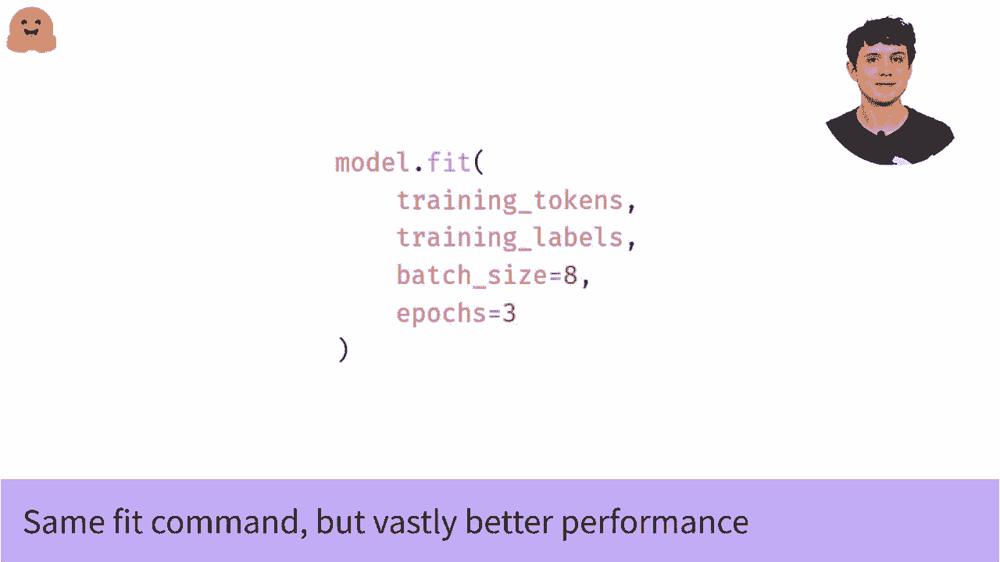

#  Transformers 原理细节及 NLP 任务应用！P28：L4.5- 使用 TensorFlow 进行学习率调度 

在我们其他的视频中，我们谈到了如何使用 Tensorflow 微调语言模型的基础知识。每当我提到视频时，我会在下面链接它们。但仍然，我们能做得更好吗？所以这是我们模型微调视频中的代码。虽然它能工作，但我们绝对可以调整几个地方。

最重要的是学习率。在这个视频中，我们将讨论如何改变它，这将使你的训练更加一致成功。😊实际上，我们想改变默认学习率的两个方面。首先，对于我们的模型来说，它的值太高了。因此默认情况下。

Adam 使用的学习率是 10 的 -3 次方，对于训练变换器来说非常高。我们将从 5 乘以 10 的 -5 次方开始，比默认值低 20 倍。其次，我们不仅仅想要一个恒定的学习率。如果我们将学习率逐渐降低到一个很小的值，甚至在训练过程中降到 0，我们可以获得更好的性能。所以这就是这个多项式衰减调度的作用。

所以这个名称可能让人望而生畏，特别是如果你只模糊地记得来自 Atslas 的多项式是什么样子。那么我会在稍后给你展示这个衰减的样子。但首先我们需要告诉调度器训练将持续多长时间，以便它以正确的速度衰减，这就是这段代码的作用。😊

因此，我们在计算模型在整个训练过程中将看到多少个小批次。为此，我们取训练集的大小，除以批次大小，得到每个 epoch 的批次数，然后将其乘以 epoch 数，以获得整个训练过程中的总批次数。😊所以一旦我们知道了多少批次。

我们要进行的训练步骤数量，我们只需将所有这些信息传递给调度器，就准备好了。那么多项式衰减调度看起来是什么样的？使用默认选项时，它实际上只是一个线性调度，因此看起来像这样。它从我们的初始值开始，即 5 乘以 10 的 -5 次方，或者 5 e -5，然后以恒定速率衰减，直到在训练结束时达到 0。那么为什么叫它多项式而不是线性呢？如果你调整选项，可以得到一个更高阶的真正多项式衰减调度，但现在没有必要这样做，默认情况下。

你会得到一个线性调度，如果你知道线性函数是多项式的特殊情况，你可以感到骄傲。😊那么，撇开这些，我们如何实际使用调度器呢？我们只需将其传递给 Adam。你会注意到第一次我们编译模型时，我们仅仅传递了字符串。Curris 会识别常见优化器和损失函数的名称，所以用字符串传递可以节省时间，避免导入。

如果你只想要默认设置。但我们现在是专业的机器学习者，拥有自己的学习率调度，所以我们必须做好事情。我们做的第一件事是导入优化器。然后用学习率参数初始化它。接着，我们使用新的优化器和你想要的任何损失函数编译模型。

我们将保持不变。这将是稀疏分类交叉熵。如果你在观看微调视频时长时间跟随。但它可以是你自己使用的任何东西。😊。所以现在我们有一个准备好的高性能模型。剩下的就是像之前一样拟合模型。请记住，因为我们已经用新的优化器和新的学习率编译了模型。我们实际上不需要对调用的拟合做任何更改。我们只需在这里调用与之前视频中使用的完全相同的命令。😊。

但是现在我们得到了一个美丽的训练，顺畅而良好。一个好的初始学习率和稳定的学习率衰减。因此你将获得更好的性能。

。

