#  Transformers 原理细节及 NLP 任务应用！P34：L6.2- Lewis 的在线直播讲解 

所以这次会议的基本目标是一起阅读第二章，在这一章中，我们将深入探讨变换器库的内部，特别是我们将关注模型的类型。有一组模型 API 我们将要查看，同时也会看到我们在将文本转换为模型可以处理的格式时所依赖的分词器。

在第一课中你看到我们有一个管道 API。这个管道 API 基本上封装了文本的预处理和后处理的所有复杂性，同时也将其适配到模型中，这样你只需要简单地给它一句话，然后就可以进行分类。

比如情感分析。今天我们希望解读这个函数内部发生了什么，并理解你可以采用的一些不同方法来对文本进行分词，以及如何保存和加载模型和标记。

我们将通过查看在处理长度不同的句子或文本时需要做的事情来结束这节课。因为在 pytorch 和 Tensorflow 以及大多数深度学习框架中，我们需要一种标准化的矩形输入格式供我们的模型使用。基本上我们将通过讲解各个部分然后暂停提问来进行。

但在此期间，如果你有一些非常紧急的问题想要询问，Omar 会在这里提供指导。所以让我给你一个高层次的概念，展示我们将要覆盖的内容。变换器库中的每一个模型都有一个相应的建模文件。例如，我现在查看的是 BERT 的建模文件。

这个文件包含了所有不同任务的源代码，你可以使用 BRT。例如，如果我查找 Vt 模型，这就是我们今天要关注的基本类，它负责基本上创建输入的上下文嵌入。那么我们如何创建一些具有意义的文本的数值表示呢？这个类相对简单，它只有嵌入层，你在第一章看到过，所以我们在进入变换器堆栈之前传递的内容，然后我们有一个编码器，这个编码器本质上负责将这些标记或标记嵌入转换为这些上下文化的表示。

我建议你对这些代码进行一些研究，因此今天我们使用的任何类，例如BERT模型，都可以查看其源代码，这真的有助于理解transformers的工作原理。对我来说，只有逐步了解所有输入如何通过前向传递，才能真正理解transformer的所有工作机制。

这只是一个小插曲。因此，为了开始，或许我们可以看看在pipeline后面实际发生了什么，来启动这个视频。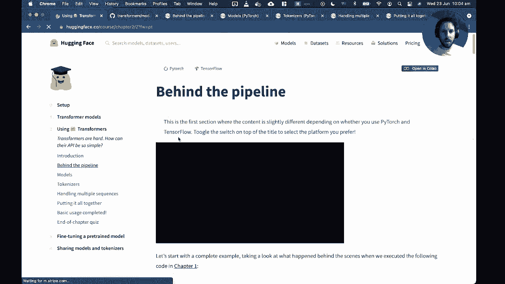

`pipelinebra`函数内部发生了什么？在这个视频中，我们将深入探讨使用transformers库的pipeline函数时实际发生的事情。我们将特别关注情感分析pipeline。它的正面和负面标签对应于以下两个句子的分数。

正如我们在演示中所说，pipeline中有三个阶段。首先，我们使用分词器将词汇转换为模型可以理解的数字。然后，这些数字通过模型输出。最后，第一步处理将输出转换为标签和分数。

让我们详细了解这三个步骤以及如何使用Transformers库复制它们，首先是分词阶段。该过程有几个步骤，首先将文本拆分为称为tokens的小块。这些可以是单词、单词的一部分或标点符号，如果模型预期的话，分词器会添加一些特殊的tokens。

这里，中间模型期望在句子开头有一个起始token，句子末尾有一个分隔token。最后，分词器将每个token映射到其在模型词汇中的唯一ID。要加载分词器，transformers库提供了Utokenizer API。这个类中最重要的方法是from_pretrained。

它将下载并缓存与给定检查点相关的配置和词汇。在这里，情感分析pipeline默认使用的检查点是distilbert-base-uncased-finetuned-sst-2-english，听起来有点复杂。我们实例化与检查点相关的token，并将其输入到两个句子中。由于这两个句子大小不同，我们需要对较小的句子进行填充，以便构建数组。

这是通过分词器以padding选项完成的。使用truncation=2，我们确保任何超过模型最大处理能力的句子都会被截断。最后，return_tensors选项告诉分词器返回批次张量。结果，我们看到我们有一个字典，其中两个键input_ids包含了两个句子的ID，零则是填充的位置。

第二个关键注意力掩码指示已经应用了哪种处理，以便模型不对其进行关注。这就是took步骤中的所有内容。现在我们来看看第二步。三ほど。作为一个提供预训练方法的notomodal API，它将下载lu并缓存模型的配置。

以及pertrain权重。然而，Automod API只会实例化模型的主体。即在去除pro traininging头后剩下的模型部分。它将输出一个高维张量，表示句子的过去，但对于我们的分类产品并没有直接用处。这里的张量有两个句子。

每个16个标记，最后一个维度是我们模型的印度大小768。为了获得与我们的分类问题相关的输出链接，我们需要使用Automodal进行序列分类类。它的工作方式与您使用的模型类完全相同，只是构建了一个带分类头的模型。😊。

对于transformers库中每个常见的NLP任务，赞扬一个自动分类。在这里，给出两个句子的所有模型后，我们得到一个2x2的结果，每个句子和每个可能的级别。这些输出还不是概率，我们可以看到它们的总和不为1。这是因为transformers库中的每个模型返回的是look it。

要理解look it，我们需要深入管道的第三个也是最后一个步骤。加上处理。要将LoAT转化为概率，我们需要对它们应用softmax层。正如我们所见，这将它们转化为一个正数，总和为1。所以最后一步是知道这些对应于正标签还是负标签。

这是由模型conflictg的IT2lipal字段给出的。第一个概率是index0，对应负标签，第二个index1对应正标签。这就是我们构建的分类器如何使用管道函数与标签进行交互并计算这些分数。😊，现在您知道每个步骤是如何工作的，您可以轻松地根据需要进行调整。

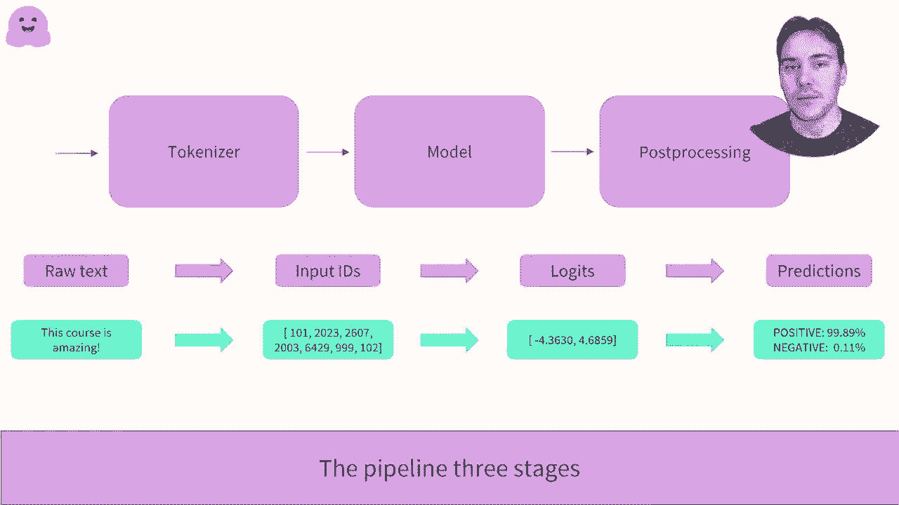

。

那么。让我们看看。好的，所以在这个阶段我们对管道还有什么问题吗？

所以我们看到的一件事是有这三种成分。这里有一个预处理阶段。好的，太好了，所以我们第一个问题是能否请您解释一下BRT SST2英语检查点背后的直觉是什么，以及有哪些不同类型的检查点可以使用，为什么我们选择SST2。好的，总的来说，每个transformer模型。

他们有预训练的基础或预训练的骨干，我想你在第一章看到了。然后我们通常会对像BERT和GP这样的模型进行下游任务的微调。所以基本思路是，你拿例如在维基百科和书籍语料库上进行预训练的BERT，然后说。好的，我现在想进行分类，所以我将基本上使用原始模型中的这些权重，然后添加一个分类头，它基本上是一个线性层，可以让我们进行分类任务，然后我们在特定任务上进行微调。

所以如果你想了解一下如何进行。

模型的工作原理或模型的描述。如果我们看看Bert，这家伙叫什么来着。这是Bt。三八八八。无大小写，微调。无大小写。未微调。嗯。那么它是S。那是什么。微调的distber，好吧。仍然是无大小写，微调。我这里漏掉了什么？😔。Distill B面和大小写功能指示。如果我们看看这个。

然后我们可以看到这是一个在特定任务上进行微调的检查点。所以这个任务叫做T bank任务。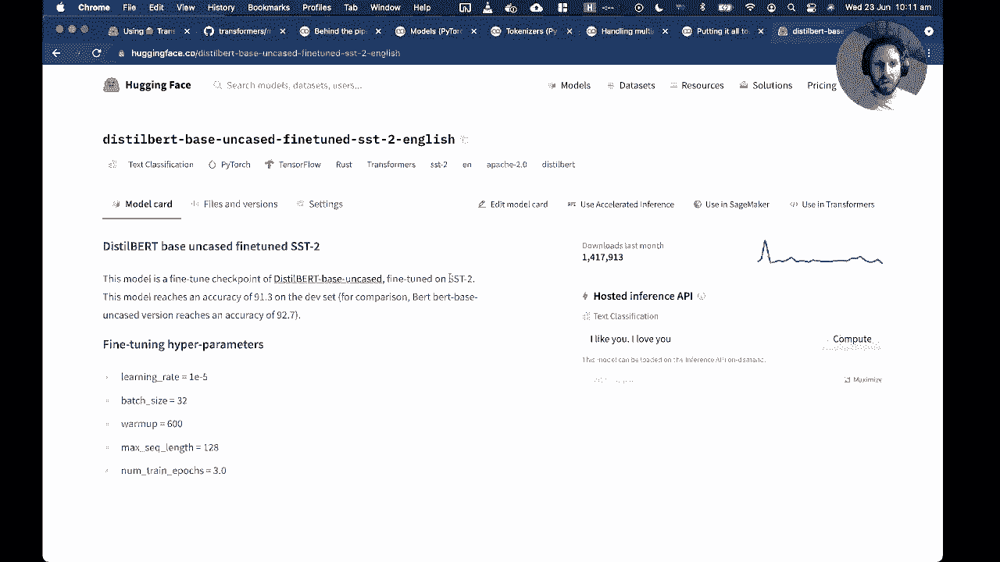

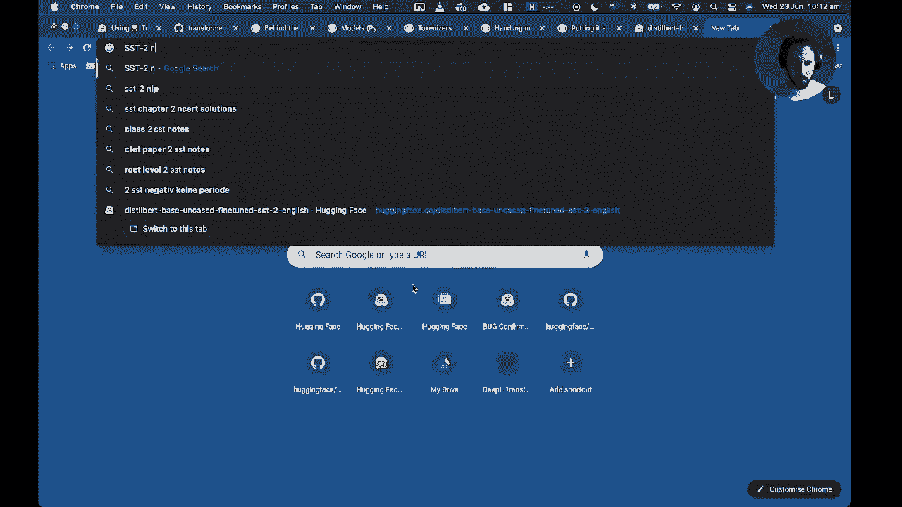

二元分类基准，我记得这就像一个情感分析任务，只有两个标签，如正面或负面。我们选择这个的基本原因是，我们只是想展示情感分析的管道如何工作，这是一个非常适合该任务的模型。

所以我希望这能回答你的问题，DK creative。然后我们还有另一个问题，就是在这种情况下。我们假设只有两个类别用于分类。我们如何指定多类别问题，以及会使用什么检查点？好的，很好。这是一个非常好的问题。所以也许我们可以看看这一章的内容。

在这里，我们有一个情感分析管道。显然，它只会预测两个类别。现在我将实例化分词器。下面是模型。好的，如果我们看看模型。😊，每个模型都有一个配置。这个配置告诉你一些信息，例如类别数量。

所以你可以看到这里有两个类别。当你实例化模型时，可以定义你希望的类别数量，用于文本分类。为了给你一个例子。假设我使用一个多类别的检查点。现在我要做两件事，我将首先展示给你。

我们如何让模型以便我们能够自己微调。然后我会展示一个更简单的案例，即我们有一个现有的预训练模型。如果我没有，假设我只有自己的数据集，而在中心没有适合我想做的模型。那我可能会说，好吧，我要使用distillbert base uncased。

这只是预训练模型，没有什么特别之处。我仍然需要做一些工作。然后我可以说，好吧，我要做的第一件事是从transformers导入一个自动模型，但现在我要为序列分类来做。

所以在处理文本分类或多类多标签时，这是一个序列分类任务。接下来我会使用我的序列分类模型。然后我可以从预训练开始。我拿到我的检查点，现在是这个新的模型。

然后我可以传递关键字参数，这将指定我正在处理多少个标签，所以想象一下我的数据集有六个类别。我可以说标签的数量是六。那么接下来会发生什么呢？

它会下载distillvert的基础模型或预训练模型，然后在这个模型上添加一个分类头，并用正确的类别数量进行配置，以便我们能够适当地进行微调。所以现在如果我们查看配置，你会发现它已经用六个不同的类别初始化了模型。

我们还不知道标签，因为我们还没有提供自己的数据集和标签约定。但我们可以做到这一点。然后从这里我们可以微调和训练模型，就像我们已经做的那样，或者在下一章中我们将要做的那样，所以这是一种方法。现在，问题的另一部分是，我如何从中心获取一个预训练模型或微调模型？

这就有点难以弄清楚，哪个模型适合你的任务。所以我通常的方法是，举个例子，查看文本分类。所以我在这里对文本分类进行过滤。然后我问自己，好吧，也许我正在处理，让我们看看。现在，这不是那么容易找到一个多类的例子，所以。我想。

一般来说。是的，所以。实际上，找到适合你任务的多类模型需要一些工作。我是说，也许奥马尔已经知道一种快速获取的方法，但一般来说，我们这里所有的模型在某种意义上都是针对一个任务进行了微调的。例如，这个德国情感Bt，可能有两个类别，一种快速检查的方法是查看文件和版本，看看配置中有多少个标签，在这个案例中有三个标签。

但实际上在 H 上有效地搜索这个，我不确定，也许有办法做到这一点。或者也许这是我们应该在中心添加的一个好功能。我是霍姆斯，我希望这部分回答了你的问题。如果没有，那就请随时在聊天中写下你的问题。是的，没错，我们应该添加一个功能，基本上我认为我们想要的是一个过滤器，可以在二元分类、多类和多级之间进行过滤，这样我们就能更好地细化内容，问题很好，太棒了。

😊 好的，在我们更深入地看一下代码之前，还有关于管道的其他问题吗？

好的，在这种情况下，让我们通过这个管道的示例来更深入地理解发生了什么。所以我们有了这个示例，我们基本上正在下载情感分析管道。

现在我们有了分类器，可以将你在前面的章节中看到的这两段文本输入进去。但现在我们想做的是理解到底发生了什么，所以请记住，我们需要处理或预处理这些原始文本，因为。

基本上所有神经网络都无法对原始文本进行操作，想象一下，你想进行矩阵乘法。你如何在字符串上做到这一点？所以我们可以用分词器来解决这个问题。

你应该记住的一个关键点是，如果你正在进行任何形式的微调，或者任何推断或预测，确保你在这里使用的检查点与分词器和模型是相同的，这很重要。因为当这些变换器在一个大型语料库上进行预训练时，会有一个相应的分词器，也在某种意义上进行微调以学习该语料库的词汇，所以如果你混合使用一个分词器的检查点和模型的不同检查点。

基本上你会在词汇表中遇到不匹配，然后你的输出中会出现一些垃圾信息，所以这是需要注意的一点。好的，我们有了一个分词器。😊 现在我们得到了这些相同的原始输入。如果我们将这两句话输入到分词器中，通常有两件事情你需要记住。

你将会得到一个叫做输入 Is 的东西。这些输入 Is 基本上是将我们序列中的每一个标记映射到一个唯一的数字，或者更准确地说是一个唯一的整数。这基本上是在词汇表中的一种映射，所以想象一下我在思考整个英语语言时，只是在处理单词，那么我可能会在我的词汇中有好几十万个单词或标记，然后如果我得到像“whole”这样的词。

我希望能够将其与词汇表中对应于此映射的数字进行匹配。但正如我们在第一章中看到的，实际上我们今天可能也会看到，这种按词进行的标记化并不是很高效，因此我们通常会做一些更聪明的事情。但基本的想法是，输入中的每一个标记都将映射到一个数字，然后这些数字使我们能够区分序列中的不同标记。

所以这就是输入 ID 的含义。今天你将更详细地看到的另一件事是被称为注意力掩码的东西。我稍后会更详细地解释这实际上是做什么的。但你可以已经看到，它在序列的某些部分放置了一堆一，而在序列的末尾放置了一堆零。这一点稍后会变得更清晰。好的，我们有了分词器。

所以我们现在已经将原始文本转换成了这些可以操作的数字。然后让我确保我在这里加载了正确的检查点。现在我们要加载模型，这将处理这些输入。让我先删除这个。好的，那么问题是，如何将输入传递给模型，最简单的方法就是直接使用我们这里的这个字典。

它有两个键，分别是输入 ID 和注意力掩码。然后我们可以使用标准的 Python 解包操作符将所有的键和值传递给模型。当我们这样做时，基本上会将输入传递到模型的前向传播中以生成输出。我认为我们可以这样来看这个问题，如果我们查看前向传播。

你可以在 CoLab 中看到，它基本上向我们展示了这个前向传播可以接受的参数。因此，它告诉我们可以接受输入 ID，可以有注意力掩码，然后还有一些更复杂或高级的东西我们也可以提供，但今天我们不需要处理这些，不过请你知道，还有其他你可以做的事情。

所以你可以看到，我们需要提供至少这些输入 ID 和注意力掩码。😊。因此，当我们像这里那样进行解包时，这基本上会运行前向传播并生成一些输出。正如我们在视频中看到的，这些输出基本上被称为隐藏状态，而这些隐藏状态只是某种压缩的文本表示。所以我们先将原始文本转换为数字，然后将这些数字再转换为密集向量，因此每个标记现在都与一个向量相关联。

在这种情况下，我们每个句子有16个向量，每个向量有768维。这只是因为Bt或Distill Bert的预训练方式。所以让我们看一下这些向量之一，我们得到了输出。所以我将取第一句话，这就是第一个索引。

我将查看这个句子的第一个标记，所以如果你看这个。它们必须是切片或整数。我需要处理最后的隐藏状态。好的，很好。实际上，让我们退一步，如果我们只看原始输出。你可以看到在变压器中，模型的所有输出通常都是包装在一个对象中的，这个对象我们可以根据属性名称进行索引。在这里，我们有一个叫做基础模型输出的东西，在这种情况下，它有一个属性叫做最后的隐藏状态和张量。

所以如果我想访问这个最后的隐藏状态。现在我得到了一个张量。它包含我想要做的东西。所以我要获取第一句话。我将获取第一个向量或第一个标记。抱歉，是对应于第一个标记的向量。现在这个就是，你知道的。

你知道的，这是一大堆数字，从负到正。这应该有768的大小，我们在哪里？是的。所以这基本上是我们传入的第一个序列或第一句话中第一个标记的数值表示。好的，让我们检查一下是否有任何问题？好的，很好，继续。好的。这基本上是模型生成的数值表示。

然后正如我们在视频中看到的，这些数值表示本身并不能让我们进行文本分类。它们只是说这个标记的数值表示是 blah。如果我们想进行分类，我们需要将那个向量或这些特征向量与分类头进行相加或结合。因此，整个Transer库就是围绕着像这样将任务X的模型进行构建，而任务X可以是诸如序列分类这样的事情。

问答、摘要、翻译等等。在这种情况下，当我们实例化一个序列分类模型时，正如我们之前看到的，这现在将创建一个模型。它有多个标签。因此你可以看到这里我们现在有一个有两个标签的模型，因为这就是这个预训练检查点所具备的。

然后当我们查看输出时。我们现在得到的不是仅有这些最后的隐藏状态。我们得到了logits。这些logits基本上是将这些特征向量输入到这个线性层后的结果，这将把这些768维的向量压缩为两个数字，或投影为两个数字。这些就是我们可以用来推导概率的东西，例如。

哪个类最有可能，所以你可以看到这里这个比这个更可能，反之亦然，因为我认为第二个示例像是负面情绪。好的，所以这就是我们如何看待模型输出与带有分类头的模型之间的关系。

在这里我们可以看到，如果我们想将我们的逻辑转换为概率。我们可以直接对它们进行 softmax，你可能还记得 softmax 基本上处理所有输入。它对它们进行指数运算，然后通过所有指数的总和来标准化，所以你最终得到的范围是从零到一。所以它是一个很好的概率候选。如果我们这样做。

然后我们得到每个情绪的概率。现在我们也可以看到这是我们可以在标签 ID 之间映射的方式，它表示。你知道零在某种更有意义的东西中是什么意思？好的。那么我们来看一下。好的，太好了，我们有一个来自 SRM Sumya 的问题。

这表示分类模型应该接受来自蒸馏模型的输出，这正是正确的，实际上我们来看看这个。如果我们看一下。类，我为 Bert 做这个，但对于 dist Bt 也是一样。所以如果我们拿 Bt 模型。全序列分类。所以如果你看看这个模型实际包含什么，它包含我们在示例中看到的 BRT 模型或蒸馏的 Bt 模型。

然后它只需应用 dropout 和线性层。线性层的维度是 768 的隐藏大小。然后它将把这个压缩成仅由标签数量定义的两个数字。因此，如果我们往下看，在前向传递中发生了什么。

我们首先得到 BRT 模型的输出。这些只是特征向量，这些 768 维的向量。然后你可以跳过大部分这样的内容。主要的观点是。在这里。我们。但是不用担心端口输出，主要是我们将这些输出输入到分类头中以产生逻辑。

这是个好问题。是的。嗯。这这。好的，我们有一个来自 Platin Chiba 的问题。我们如何查看标记表示在文本中的意义？所以。很好，或许只是为了展示给你。比如。我们可能有点急于求成，但这没关系，好的。我们有这些原始输入，它们由这些字符串给出。

然后我们得到这些输入 ID，就像这样，对吧？所以我们可以做一件事。如果你想要回退，我们稍后会看到这一点。但我可以这样做。我可以说好吧。Tokenizer，我要解码，所以我要做我之前所做的事情的相反。现在我要拿我的输入 ID。希望能成功。这需要输入。Hies。

现在你可以看到，通过使用这个解码方法，我们能够逆转广泛文本的过程。但它的作用是引入一些特殊的标记，其中一个称为 CLS 标记，它表示句子的开始。然后我们有一个 Sep 标记，它基本上用于区分句子对之间的区别。

所以这是一个可以回到你开始的地方的模型。如果你有更多问题，我们可以在进行时解决。好的，酷，所以这就是关于管道如何在内部工作的初步观察。现在我们可以做的，是更详细地看看模型。所以我将开始观看这个视频，然后我们将暂停以提问，再看看一些代码。

如何实例化一个变换模型。在这个视频中，我们将看看如何从 Transformers 库创建和使用模型。正如我们之前看到的，Automod 类允许你从 I face 应用的任何检查点实例化一个预训练模型。它会从库中选择正确的模型类，以实例化适当的架构，并加载预训练模型的权重。

正如我们所见，当给定一个鸟类检查点时，我们最终得到了一个鸟类模型，对于 GPT2 或 part 也是类似的。在后台，这个 API 可以接收地球上的检查点名称，在这种情况下，它将下载并缓存配置文件以及模型权重文件。你还可以指定包含有效配置文件和模型权重文件的本地文件夹路径。

要实例化之间模型，Automodal API 首先会打开配置文件，以查看应使用的配置类。配置类依赖于模型类型，例如 B、GPT2 或 part。一旦有了合适的配置类，它就可以实例化该配置，这是一种知道如何创建模型的蓝图。

它还使用这个配置类来找到适当的模型类。然后将其与加载的配置相结合，以加载模型。它的模型尚未成为预训练模型，因为它刚刚用随机权重初始化。最后一步是从模型文件中加载权重到该模型中。

为了轻松加载来自任何检查点或包含配置文件的文件夹的模型配置，我们可以使用 autoconfig 类。像 Automod 类一样，它将从库中选择正确的配置类。我们还可以使用与检查点对应的特定类，这样每次想尝试不同的模型架构时，我们就需要更改代码。

正如我们之前所说，模型的配置是一个蓝图，包含创建模型架构所需的所有信息。例如，与基于鸟的案例检查点相关的鸟模型有12层，隐藏层大小为768，词汇量大小为28996。一旦我们添加了配置，我们可以创建一个与检查点具有相同架构但随机初始化的模型。

我们可以像任何其他模型一样从头开始训练它。我们还可以通过使用关键字参数更改配置的任何部分。因此，这段代码片段实例化了一个随机初始化的具有10层的布局模型，而不是12层。一旦模型经过微调，保存它是非常简单的。我们只需使用保存方法。

在这里，模型将保存在当前工作目录中的名为My beltt model的文件夹内。这样一个模型可以通过from between方法重新使用。要了解如何轻松访问这个模型，请查看推送到视频。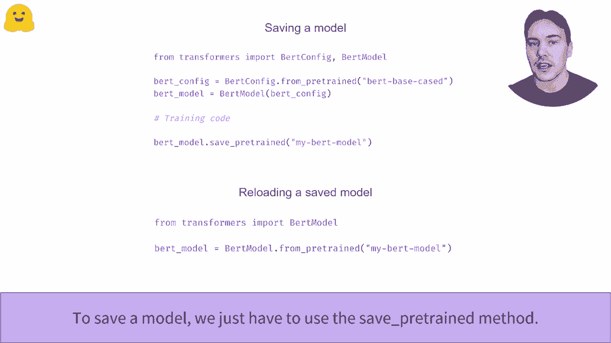

到目前为止关于模型加载和保存模型的任何问题吗，在我们深入一些代码之前？

所以，为了总结一下我们在视频中看到的内容。每当我们使用预训练的方法时，我们首先需要获取一个配置，然后我们刚刚看到的配置在几分钟前定义了标签到标识符的映射、模型的标签数量以及所有相关信息。

多少层等等，然后该配置用于加载模型的权重，以确保一切以正确的方式配置。然后，一旦我们有了这个模型，我们就可以保存它并用于其他事情。所以。

如果现在没有什么紧急的问题，我来看看模型的代码。正如我提到的，你可以在自己的时间观看这些视频，并通过这类文本进行学习。但我认为如果我们直接看一下可能更有用。

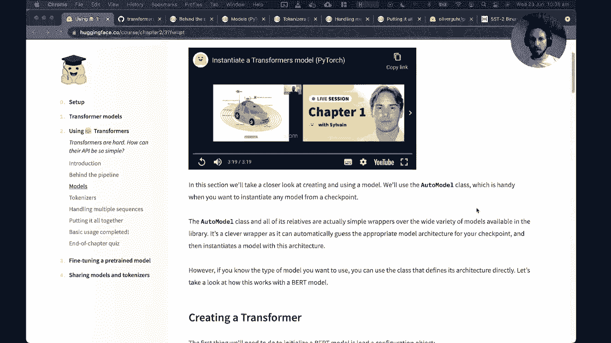

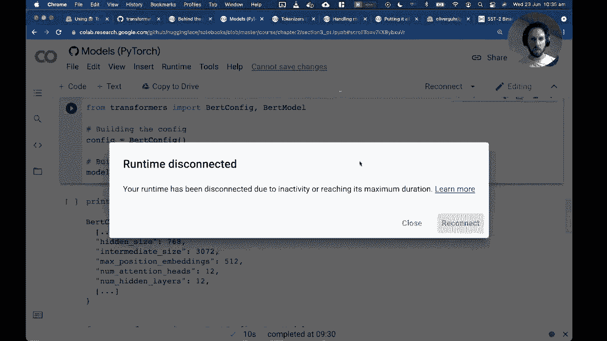

在代码处，嗯，但让我们检查一下，我可以运行transformers。好的，所。一件值得提及的事情是，你可能会发现自己处于一种非常常见的情况：基本上你已经训练了一个模型，现在想以某种方式分享它，而这种分享通常是在我之前工作的公司中。

这更多是关于部署这个模型，以便你可以为其他服务提供服务或生成预测。因此，一旦你保存了模型，问题是，好的，我到底该如何处理这个东西？😊。正如我们所看到的，这个保存功能基本上会保存两个对象。它会保存一个配置JO文件，并且还会保存一个Pytorch模型的do bin文件。

这在 Pytorrch 中被称为状态字典，它提供了所有层和权重的信息。因此，如果我们想用这个来生成预测，我们需要做的第一件事就是像以前一样获取输入文本，将其转换为输入 ID，然后将这些输入 ID 转换为张量。

然后我们可以将这些张量提供给模型。之前我们使用的是分词器，这正是你在实际中会做的。但在这个例子中，我们只是展示了分词器的输出。让我们看看代码中那是什么样子。检查一下有没有问题，好吗？好的，嗯。😊，嗯。😊。

也许快速总结一下，我们可以使用两种不同的方式加载配置。你可以直接从库中的默认配置加载模型，这将为你提供有关隐藏层大小等的*摘要*。

但是如果你这样做，模型将会完全随机初始化，这意味着所有权重都是随机的，这个模型将毫无用处，它不会帮助你做出任何好的预测。实际上，这是你在想要对模型进行预训练或者从头开始训练模型时所做的事情。嗯。因此在实践中，大多数时候，你真正做的是使用预训练的模型，这将用预训练权重和需要的正确头初始化模型。

如果我们想进行预测，我先实例化一下。假设我已经有了我的模型并且对它满意，因此我想保存它以便可以部署到某处。让我们等待模型下载。好的，好的。那么我可以做的就是保存我的模型，这只是你机器上的一个路径。

如果我们现在查看文件系统，可以看到我计算机上有一个名为 directory 的目录。那么现在如果我查看那个目录里面有什么，我有这两个文件，一个是 config Jason，另一个是一个名为 Pythtorage model 的二进制文件。因此，我们现在可以把那个文件夹打包，压缩。

放到一台机器上。如果我们想获得新的预测，那么我们要做的是获取我们的分词输入，然后将这些输入转换为张量，因为所有的 ptorch 模型都期望输入张量。所以如果我们查看这个模型输入，它只是一个张量。然后我们将这些输入提供给模型，这样就构成了一个预测。

然后你可以对这个预测做任何想做的事情，可能用它来做某种决策，或者用来输入到仪表板。基本上是没有限制的。这就是生成预测的过程，*非常简单*。所以让我们来看看。

我们这里有一个问题。出于兴趣，从头训练Bert需要多长时间？你可以在coab上做到吗？

好的，所以我认为这真的取决于你想使用的语料库的大小。例如，如果我没记错的话，Bert是在整个英语维基百科和一个称为Books corpus的语料库上训练的，后者是扫描过的图书馆书籍。而且。我想想。所以，你知道，让我们这样做，为什么不现场找到答案，因为我不记得他们花了多长时间去做这个。

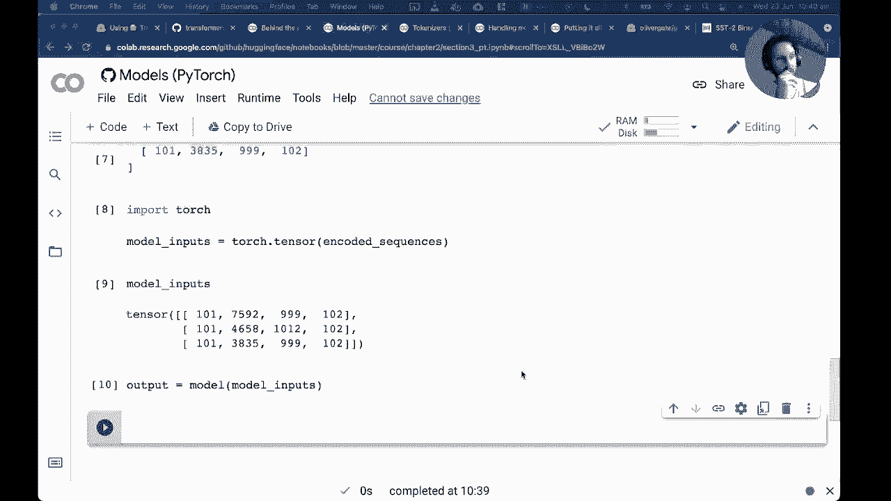

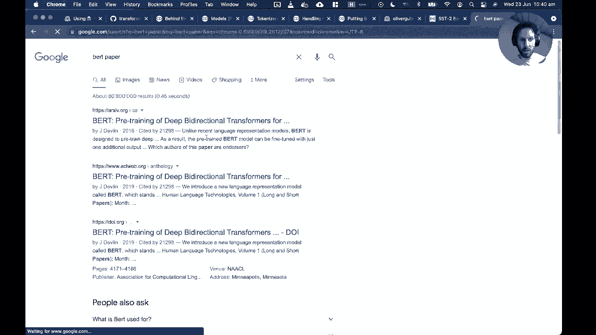

没有什么比现场阅读论文更好的了。

好的。😊那么，这是书籍论文。让我们来看一下，我猜他们使用TPU。好的，他们在这里说他们在四个云TPU上训练了BERT基础版，所以这就是16个TPU芯片。每次预训练需要四天才能完成。所以。我记得，coabab上的云TPU只是一个TPU芯片。因此，大致来说。

这可能需要你大约16天，16乘以4。所以64天，在curtL上训练。你知道的。嗯。😊但是。我不这么认为。是的，我不确定是否有快速的Bt训练。不过，我会给你展示一些东西。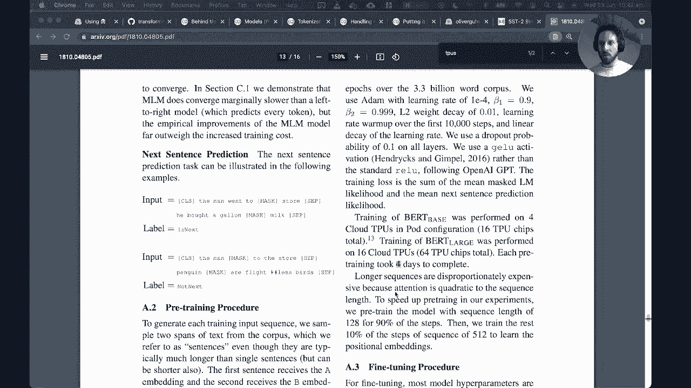

Hugging Face有一篇关于训练的博客文章。让我们看看。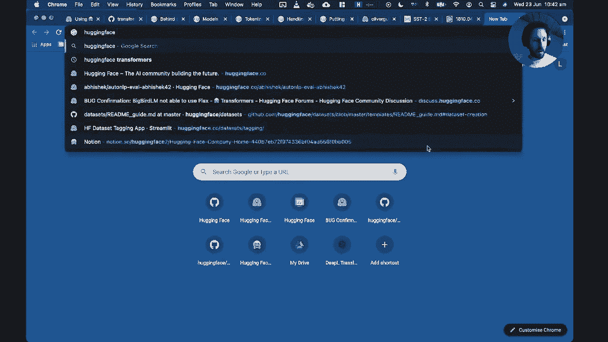

一个关于世界语的模型，所以我把这个扔进聊天中。那么。我可以这样做吗？好的，这篇博客文章。它使用了稍旧的API，但基本的想法是告诉你，只要你的语料库不是太大，你实际上可以在coab上训练一个BERT模型。所以这是世界语，它是一种特殊的语言，文本量远少于英语。但我记得，这是在一个半小时内训练完成的，也许几个小时。所以让我们看看。

ちて。好的，也许我们在这里看不到。我们只需查看coab。嗯。让我们看看。那么这个模型的训练。好的。所以是的，这次训练花了将近三个小时。所以这真的取决于你的语料库的大小，所以原则上你可以。但如果你想做一些像Bert那么强大的事情。

那么你将需要一些更强大的硬件。好的。嗯。还有另一个问题，我明白迁移学习或使用预训练模型是更好的选择，是的。这正是正确的，所以像如今的变压器和自然语言处理的真正力量在于，我们并不想自己进行预训练，因为这既昂贵又耗时，因此我几乎总是会使用预训练模型，如果可以的话。

你真正可能会陷入困境的唯一时刻是当你处理的领域与任何现有的预训练模型非常不同的时候。例如，假设我试图在源代码上训练模型。你知道，在转换器的早期阶段，没有任何预训练的源代码模型。例如，理解Python语言，那么你知道在英文的BERT基础上进行转移到源代码可能会有点棘手，可能不会给你非常好的结果，因此如果你在源代码语料库上训练，会得到更好的结果。

另一个通常需要寻找替代方案的例子是当你处理一种不常见的语言时。例如，我了解到非洲有许多语言在维基百科上并没有得到很高的代表性，因此这让人们训练模型或转换器时变得困难，通常需要一些技巧，比如使用多语言的BERT版本，试图以某种方式将其适配到你的语言，但这些通常是更高级的内容，我们可以稍后讨论。

好的。那么。我们来看看。那么我们到哪儿了？我们已经看过了另一个问题。我们可以更改预训练模型的配置参数并使用它吗？诶。可以，但有一些注意事项。所以。比如说。让我们想想我们能改变什么，不能改变什么？嗯。我想确保我不会说一些愚蠢的话。让我们看看我们这里的模型配置。

这是与Bert Bates相关的配置。这里可以看到一堆与该模型预训练相关的超参数。所以。例如。让我们看看。所以我怀疑如果我们更改许多这些东西。

我们将以一种非平凡的方式打破模型。不过，让我想想。如果我们改变隐藏层的数量会发生什么？😔，所以你知道吗？让我们尝试一下深度学习中的常规做法，就是试试。因此，我打算进行更改。Bt有多个注意力头。

所以我想看看会发生什么。如果我将注意力头的数量从12减少到6。让我们看看。如果这能工作。让我们查看配置，确保更改成功。所以现在我们有六个注意力头。那么，如果我们尝试给这个模型输入一些内容，会发生什么呢？

好的。😊，好的，所以。有趣。好的，所以。似乎我们可以更改配置，且一切都能正常工作，意味着没有错误。但我怀疑在预训练模型中进行这种黑客行为会以某种非平凡的方式影响性能，因为。

如果我们思考一下做文本分类时发生了什么，我们就会把整个BRT基础模型拿来，然后在上面叠加分类头。如果我开始分解Bt成不同的部分，减少注意力头或改变变压器层的数量。

所以Bert有12个编码层。我怀疑这可能会对我想要微调的下游任务（如分类）产生一些非平凡或负面的影响。但也许Omar在这方面有不同的见解。好的。这是个好问题，我实际上从未以这种方式破解过预训练模型。也许你可以试试看，做一些实验，比如如果我完全改变层的数量、注意力头的数量，尝试进行分类，比如情感分析，会发生什么。

我的性能会更好还是更差？我感觉可能会更差，但这确实是个很酷的事情。如果你检查了，请在论坛上分享。好的。这是我们如何生成预测的回顾。现在让我们更详细地看看分词器。希望互联网仍然有效。

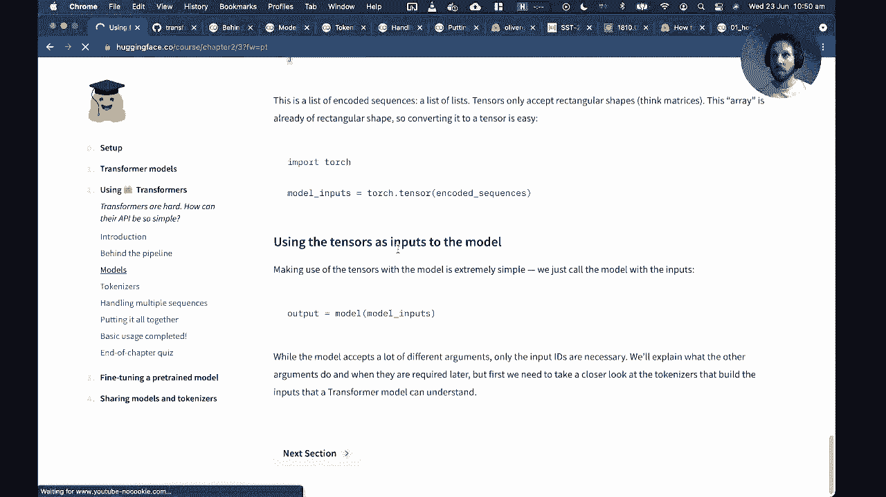

好的。

在接下来的视频中，我们将关注令牌。在自然语言处理过程中，我们处理的大多数数据由原始文本组成。然而，机器学习模型无法以原始形式读取或理解文本。它们只能处理数字。因此，分词器的目标是将文本转换为数字。

有几种可能的转换方法，目标是找到最有意义的表示。我们将查看三种不同的组织算法，逐一比较。我们建议你按以下顺序观看视频，首先是基于词的。

接下来是基于字符的，最后是基于子词的。😊。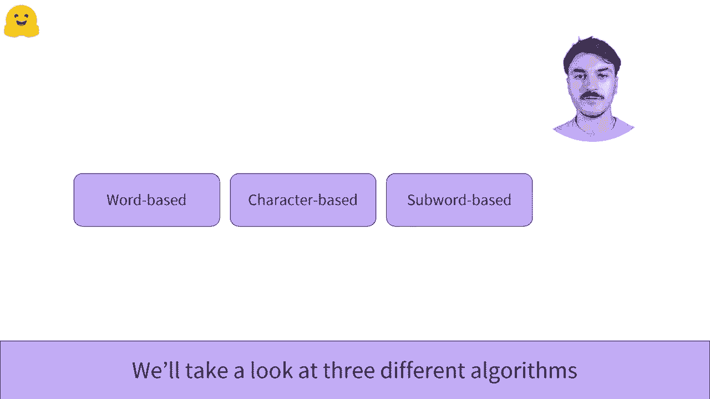

是的。

嗯，好吧，所以。这是我们讨论的高层次概述，关于将文本转换为数字的过程。这一部分有许多视频展示不同的分词方式。嗯。😊，我没问题吧。你们能看到我吗？可以吗。好的，很好。哦，太好了。是的。😊，在家办公的乐趣，好的。😊。

我所说的是，有不同的分词策略，优缺点取决于你感兴趣的应用。所以我不会逐个视频讲解，你们可以自己观看。

但让我们快速看看三种最流行的方法。首先，我可能会想象，如果我有一段文本，比如“吉姆·亨森是一个木偶师”。然后我可能会说，好吧，我只想把这段文本拆分成单词。在英语中，简单的方法就是在空格上拆分。因此，在英语中大多数时候。

如果有空格，那就是单词之间的边界。然后这会转换。例如，吉姆·亨森是一个木偶师，将其分为这五个标记，因此在这种情况下，单词就是一个标记。但是在几种语言中，这种方法是个糟糕的主意，例如，如果你学习过日语，你会发现汉字没有空格的任何单词，只是一系列的汉字，并且通常是从上到下书写，而不是从左到右。

因此，这种基于空格的拆分或标记化根本无法实现。另一种替代方法是尝试字符基础的方法。所以想象一下，你将英文序列中的每个字母拆分成自己的标记。这样做对日语也很有效，因为每个字符都是一个汉字，我们可以用标记来表示。

你可以看到的事情是，标记化策略确实似乎依赖于我们研究的语言。因此，许多研究致力于寻找一种在单词标记化和字符标记化这两种极端之间提供良好折衷的方法。

在我们深入讨论之前，我还应该提到几个缺点。因此，基于单词标记化的一个缺点是，这将创建一个词汇表，其大小等于我们语言中的单词数量。因此，如果我们假设只标记英语，那么我们需要为每个英语单词创建一个标记，这通常是几十万个标记，这在计算上非常昂贵。

但另一个不太理想的地方是，它没有区分类似的词，比如狗和狗狗，这些词是相似的，而我们现在将它们表示为两个独立的标记。

这是基于单词的方法的缺点，而基于字符的方法的缺点是模型必须学习一个单词实际意味着什么，因为它得到的只有字符或字符标记。然后，它必须通过训练弄清楚，好的。

如果我将这些字符按这个顺序组合起来，这似乎代表了一个更抽象的对象，比如一个单词。因此，至少对于英语来说，这不是一个好的策略。大多数分词器使用一种称为子词分词的方法。基本的想法是，不仅仅在单词边界或字符上进行分割，而是将一个单词分解为子词。这里的一个例子是。

我们以“annoyingly”为例，“annoyingly”可以表示为可能两个子词。 “annoying”和“ly”。然后我们可以收集这些子词的频率，然后用这些频率来基本上找出语言中最常用的子词，然后我们可以用这些子词重新构建完整的单词。

所以如果你知道你有“annoying”和“ly”，那么你可以从这两个组成部分重新构建“annoyingly”。我想这里有个例子，你可以将分词分成这些子词，这样你可以看到这是一种单词与子词混合的情况。而且我们还将感叹号视为一个单独的标记。

你会看到的最常见的分词器，大概有一个好问题。我会提到的有称为 word piece 的方法，这是 Bert 使用的，或者是 sentence piece，这是 GT 和 GPT 模型通常使用的。所以这是个很好的问题。你如何设计子词边界，是手动的吗？

所以这在某种程度上是由你选择使用的算法决定的。我认为。一般来说，这是一种手动规则与从语料库学习的结合。所以我们快速看一下。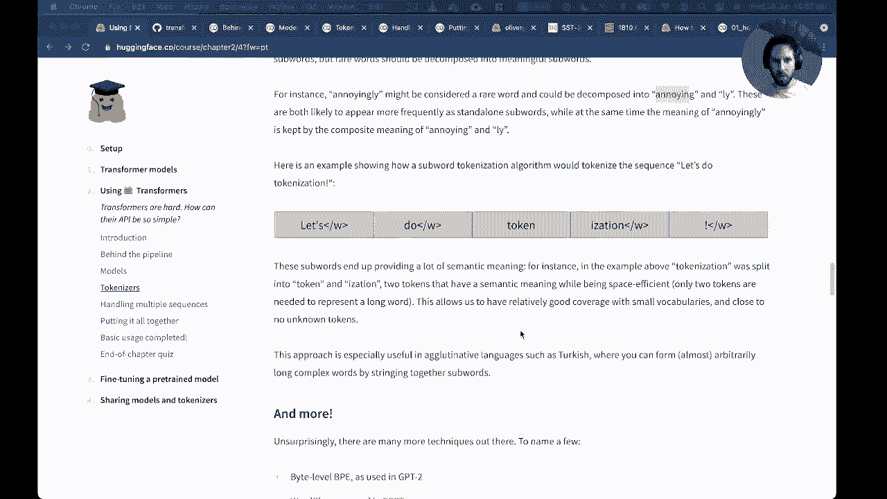

让我看看，我认为这是 sentence piece 论文。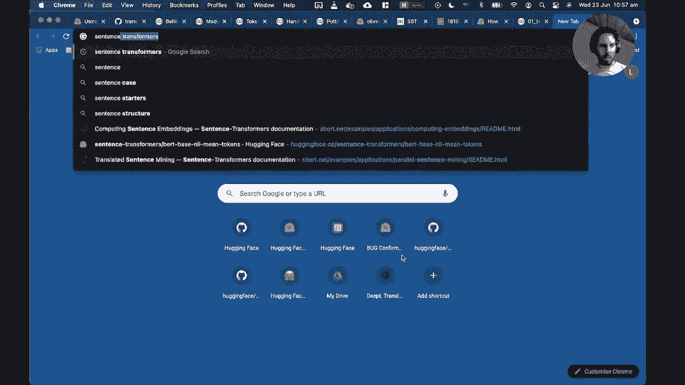

这这这。所以这是，我要把这个放在聊天中。好的。这是关于分词的最著名论文之一。我们快速看一下。那么这些边界是怎样的。好的。嗯。是的，没错。😊这是我从这篇论文中记得的。所以他们说，从历史上看，大多数分词算法。

他们使用了手动规则，这个问题当然在于，对于每种语言，你都需要一套规则，这真的是个麻烦事。要维护和扩展这些规则。如果我没记错的话，sentence piece 就像是一个学习的分词器。

所以你实际上有一个优化目标，然后你就像训练模型一样训练这个模型，通过在你的语料库上进行训练。你实际上学会了单词的边界。嗯。😊但是我已经好几年没看过这个了。可能会忘记一些东西，但。是的，这是个好问题，我认为这可能是我们可以在未来版本中添加的内容。好的。😊那么。我们在哪儿？我们在看这些不同的分词策略。

那么我们也许可以看看 CoLab。嗯。所以。我经常喜欢做的一件事是捕获我在 CoLab 中的管道工具的输出，这样我就不需要有这个巨大的。没。安装的内容。好的，所以你在这里看到的是我们之前讨论的内容。

这是如果你只是进行单词的词块分割，哦，对不起，是将文本切分成单词，现在我们可以看看 BERT 分词器是如何工作的。有两种方式可以在 transformers 中做到这一点。你可以指定你想要使用的具体类用于 tokennova。如果你恰好在做一些非常特定的事情，并且你真的想确保你获得了合适的组织者。

但我个人一直使用的方式是自动分词器，因为这会自动将分词器转换为这个类。所以如果我提供一个检查点，并且它能够识别出来，它就会以这种方式自动加载。

好的，所以如果我们获取一个分词器。它将文本转换为这些输入 ID。但现在让我们看看这里的某些内容。那么我们为什么要做两次？😔，好的。好的。那么我们在这里做的只是获取一段文本，然后将其提取为一个标记列表，所以你可以在这里看到。在 BERT 的情况下，它使用这个 word piece 分词算法。

它区分单词和子词的方式是使用这个双哈希符号。所以你可以在 BERT 分词器的词汇表中看到，它已经学会了在 trans 和其他内容之间分割单词，如果我们想要重建这两个单词，我们只需要知道这个双哈希意味着前面的内容属于 trans，以构建 transformer。

因此，重建句子的一种方式是你可以获取你的标记，并将它们转换回输入 ID，像这样。所以这将创建这些 ID，然后你可以解码这些输入 ID 以重建原始字符串。另一种方法是让我们看看我们有的输入。とて 왜。好的。那么另一种方法是如果我获取我的分词器。我只是对我的序列进行分词。

然后这会产生我们之前看到的内容。接下来我可以做的是使用 tokenizer.decode。我输入我的输入，而我的输入是。这应该返回我们之前看到的内容。现在你可以看到这种方法和这里的方法之间的区别是我们没有这些特殊标记，所以如果你不希望这些存在，我认为我们可以将 skip special tokens 设置为 true。

然后这将给我们返回原始序列。酷。这基本上就是对分词器的一种深入探讨。嗯。😊。也许值得提到的一件事是，让我们看看另一个分词器，这样你就能对你可能看到的内容有个了解。那么让我们找一个不会阻止 colab 的 GPT 模型。所以，G to。

那么我们做这个吧。我将只是拿一个小的GPT。你也可以复制检查点的名称，这很方便，所以我们在这里。那么我想做的就是展示GPT模型与它的分词方式之间的区别。希望这样能成功。是的，GPT有一种非常古怪的处理方式。

分词器使用这个奇怪的符号，就像一个上面有小思考的G。它用来表示这个标记与那个标记之间有空格。所以你可以看到它在说，好的，使用，然后有空格，然后是R，然后有空格，然后是trans，但是former没有空格，因此如果我们想重构这个。

我们只需将其拼接回去。但是那样网络之间有空格等等。所以你可以看到这与Bt模型有很大不同，后者基本上将每个标记视为有相应的空格，除非我们有两个井号。

而GPT2则是另一种情况。假设没有空格，除非我放入这样的特殊符号。好的。那么关于分词器有什么问题吗？好的，好的，现在我们来看看如何处理多个序列。我将开始这个视频。

如何将输入批量处理在这个视频中，我们还会看到如何将两个批量输入序列结合在一起。我们想通过模型传递的所有句子并不都具有相同的长度。这里我们使用在情感分析管道中看到的模型，并希望对两个句子进行分类。当对它们进行分词并将每个标记映射到其对应的输入ID时。

我们得到两个不同长度的列表。尝试从列表创建一个密集数组或Mbi数组会导致错误，因为所有数组和密集数组应该是矩形的。克服这个限制的一种方法是通过添加一个特殊标记，使第二个句子的长度与第一个句子相同，添加必要的次数。

另一种方法是将第一个序列截断到第二个的长度。但是你会失去很多可能对正确分类句子必要的信息。一般来说，只有当句子超过模型能处理的最大长度时，我们才会截断句子。用来填充句子的值不应该随机选择。

模型已被描绘为具有特定的填充ID，你可以在tokenazizer中找到。现在我们有了p个句子，我们可以用它们创建一个批次。如果我们单独将两个句子传递给模型并进行拼接，我们会注意到，对于填充的句子，第二个句子得到的结果不一样。这是变换器库中的一个bug吗？现在如果你记得，变换器会让用户轻松使用注意力层。

这应该并不令人完全惊讶。当计算每个标记的上下文表示时，注意力层会查看句子中的所有其他单词。如果你只有一个句子或者句子中有几个填充标记，那逻辑上我们不会得到相同的值。为了获得相同的结果，无论有无填充。

我们需要向注意力层指示应该忽略那些填充目标。这是通过创建一个注意力掩码来完成的，该掩码与输入 ID 具有相同的形状，里面是系列的 0 和 1。1 表示注意力层应该在上下文中考虑的标记，而 0 表示我们应该忽略的标记。现在，将这个注意力掩码与输入 ID 一起传递，将给我们与将两个句子单独发送给模型时相同的结果。

这一切都是由标记器在你将多个句子应用于填充标志时在后台完成的。它将为较小的句子应用适当的填充值，并创建相应的注意力掩码。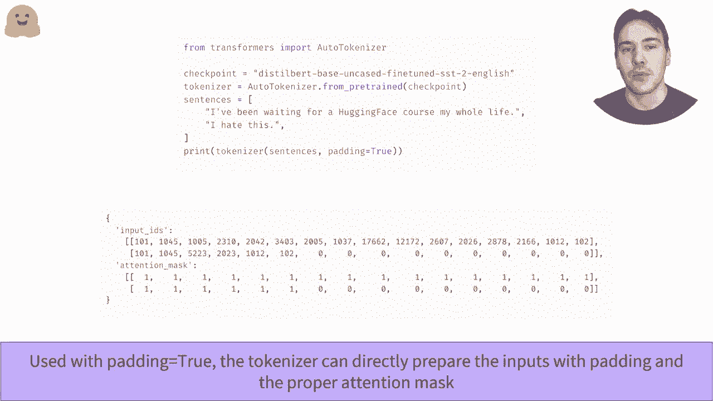

是的。好的，我看到我们有几个问题，所以第一个问题来自 IM homesmes。我不明白为什么我们需要额外的维度。根据返回的错误消息，你会如何排查以确定你需要另一个维度？好的。所以我认为查看这个的最佳方式可能是一些代码，所以我们去这里。😔，并。

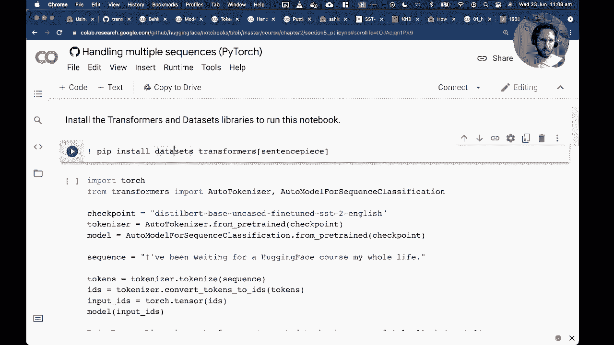

安装 transformers。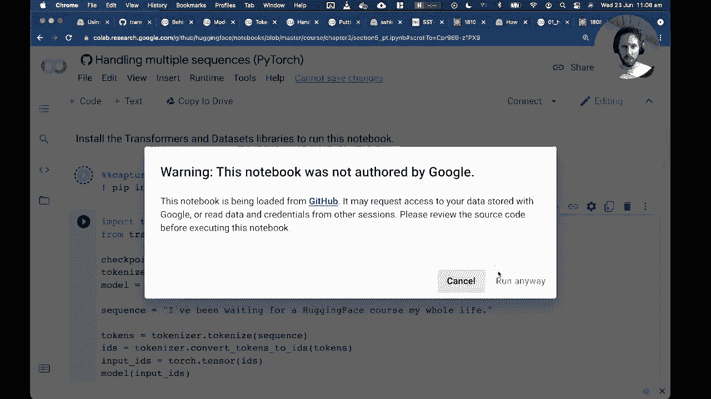

好吧，所以。如果我理解 O homes 的问题，你在谈论这个错误消息。让我们看看它是否可以重现。好的，很好。所以我想你在谈论这个索引错误。我们在这里得到的。让我们看看我们可能如何调试这个。错误是说维度超出范围。我们预计它应该在 -1 到 0 的范围内。

但是得到了一个。所以让我们看看我们的输入是什么形状。这大概是我调试这个消息的方式，所以。好的，我们可以看到。输入 ID 的大小只有 14，这仅仅表示在对序列进行标记时我们获得的 14 个标记。嗯。😊，所以我将向你展示大多数软件工程师调试内容的一个小秘密。

所以你拿这个。然后你在谷歌上查一下。然后你就会说，啊，这看起来像个 PyTorch。然后我们看看有没有人能解释发生了什么。抱歉。你可以看到一些消息，有人这里有个东西，遇到了一些维度范围错误。嗯。然后好吧，这看起来像是在 PyTorch 中的一个更深层次的问题，可能会有帮助。

但也许让我们看一下堆栈溢出，这通常是你能找到好答案的地方。有人遇到了同样的错误，让我们看看别人给他们的答案。他们说你给了这个东西一个1D张量，但它期望这种类型的对象。让我们看看这是否和我们正在做的相关。所以。如果我们查看这里的错误。

它说在堆栈跟踪的某个点。我们试图通过获取输入的大小来计算序列长度。然后我们实际上试图访问输入ID的第二个维度。所以如果你看一下。我们提供的大小，它只有一个维度。因此，基本上。我可以访问。大小0，因为那是可用的第一个维度。

我不知道为什么coab这么慢。然而，如果我尝试访问一维对象的第二个维度，那么这是不可能的，所以它会抛出这种错误。不知道为什么。CoAab的反应真的很慢，我就要重启它。看看能不能做到。这更有趣。让我们看看，这是否有意图。很有趣，所以coabab，好的。让我们看看。我再启动一次curl。

也许我打开了太多颜色。好吧，再试一次。所以。你去。Andst这个，好吧。祝好运，希望这能奏效。抱歉，好的。我们正在尝试调试这个错误，我们看到堆栈跟踪告诉我们是在这里。问题是我们正在尝试确定大小，或者基本上我们在尝试挑选输入ID第二个组件的维度的大小。

但我们面临的问题是输入是。我只有一个维度。所以它们的大小是14。如果我们访问第一个元素，我们得到14，这很好。但如果我们访问第二个，我们会得到相同的错误。因此，我们看到的问题是，我们基本上需要提供一个批处理维度，说明我们正在处理一个句子。

这两个序列的长度都是14。所以基本上大多数输入。输入是。ID应该有。形状。匹配大小。然后像这样的秘密。没有。这回答了问题吗，我是霍姆斯？

我认为这是一种有点复杂的调试方式，但这大致就是我会怎么做。嗯。很好，还有一个来自SRM Sma的问题，关于我们是否可以修改填充技术？

所以答案是肯定的，让我们看看在哪里进行填充。啊，好的。我只是随便想的。好吧，让我们看看。我有一个分词器。如果我只取这样一个序列，我会得到这些输入ID。那么问题可能是，如果我添加一些填充。

那么，我的输入会发生什么，基本上在这种情况下，这应该不提供任何填充标记。所以我将创建两个序列。我的狗叫照片。然后另一个序列，像我的猫是。是冷的。真的很酷，比如。我知道，伊丽莎。所以现在我有这两个序列。

一条比另一条短。所以现在如果我将这些传递给我的分词器并设置填充为真。你可以看到发生的情况是，在第一个序列中，它采用了正常的标记。然后在末尾添加了一堆零。它添加的零的数量正是为了匹配输入中最长序列的长度。现在问题是，我们可以采取什么策略？来做到这一点。

让我们看看，我想我们可以做到。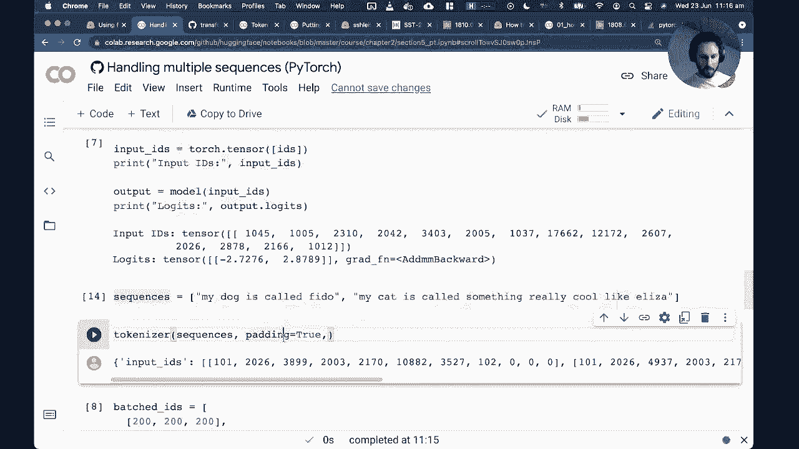

所以我接下来要做的就是找到我需要的实际参数，我将去transformformers。

我将查看填充，因为我不记得我是如何在左侧进行填充的。那么也许是。预训练的填充参数。去。好吧。看看源代码。好的。所以我可以做最长最大长度。有趣，所以好的，这只会给我们选项。例如，如果我做。最大长度。那么这将填充到整个模型的最大长度，也就是Bt模型。

可以处理512个标记。所以这将处理大量的零，一直到512的长度。我们在这里的另一个选项是最长，这就是输入中最长示例的默认值。但是让我们看看我们是如何在左侧填充的。嗯。我记得。我们可以做到。うん。好的，所以。让我们看看。所以我们可以输入。填充策略。和。多个。嗯嗯。我之前是。

我很确定我可以在两侧进行填充。所以，让我们看看。谢谢，Oma给出了答案，太好了。😊，所以。那么我们可以这样做。我们做填充为真。然后，填充侧。等于左侧。有趣。我做错了吗？也许这仅适用于某些。分词器，我们可以做到。好的，所以填充侧。在这里我们可以看到，默认值应该填充为右侧或左侧。

这是针对预训练的分词器。有趣，好的，让我们这样做。让我们看看。抱歉进行现场黑客。让我们看一下。如果我们查看分词器的一个属性。它被称为填充侧。在这里默认是右侧。所以我可以通过设置为左侧来覆盖这个属性。所以这不是一个关键字参数。

这是分词器的一个属性，这正是我所缺少的。所以现在你确实可以看到。我们可以在左侧填充。因此，我认为这应该回答SRM游泳者的问题。非常感谢你的帮助。嗯。😊，嗯。谢谢Dk，疯狂，你是否看到现实世界的真实样子，好吧，所以让我们看看，后续问题是它会对注意机制产生影响吗？这是个非常好的问题，所以。

😊，我们有的原因是，这里有两件事情发生，一方面。嗯。😊。有填充，我们需要这样做，以确保所有输入基本上是一个矩形数组。这就是我们需要进行矩阵修改等操作的方式。在网络中。所以一旦我们引入了填充。

我们介绍了Sylvan在视频中提到的问题。即注意力掩码，或者说一般的注意力将关注输入中的每一个标记。所以在这种情况下，这里的每一个零原则上都是一个具有自己嵌入的标记，然后当我们计算注意力时，基本上是将每个标记与序列中的每个其他标记进行成对相乘。这将是一个问题，因为这会对模型说，嘿。

我有这三个标记，它们似乎彼此相关，然后当我在编码器末尾构建我的表示时，这将有一些填充的人工信息，而我们并不希望这样，因为填充是我们人为注入的东西。

所以Sylvan提到的事情是我们通常会得到一个叫做注意力掩码的东西。所以我就叫它我的分词过的输入。对的。所以如果我看我的输入，我有输入ID，还有一个注意力掩码。这个注意力掩码在我们内部计算注意力时会使用。

它会说每当你看到一个零时，完全忽略那个标记。所以你可以看到分词器正确地意识到，如果我说左边的pat，那么确保对前三个元素或前三个填充标记有一个掩码。因此，这些零基本上会对注意力计算说，忽略这个。

只计算我们关心的实际单词的注意力。回答你的问题，Sm Ser。它没有影响，因为注意力掩码处理了这一切，都是通过分词器自动完成的。谢谢你，Hol，真好。我下周还有一个，所以我认为第三节你可以来参加。😊好的，让我们看看。

我认为我们这里有最后几节的内容。把它全部结合起来，所以。嗯。让我们看一下这一节的代码，这将把我们在本节中学到的所有内容结合起来。我将逐步浏览代码。所以，想法是。

只要记住我们在这一章中做的事情，我们在解构管道，查看所有组成部分。现在我们将把这一切结合起来，构建自己的自定义管道。第一件事是加载检查点、分词器并提供一些输入。事实上，我要做的这个将生成两个序列。

现在我们可以看看不同的填充方式。所以这是。我想我们之前见过这个。模型输入现在将有填充标记，直到最长序列匹配。所以在这种情况下，这是最长的输入。第一个没有填充标记，但第二个则得到所有这些额外的零。

正如我们之前看到的。注意掩码会添加所有这些额外的零，表示。不要关注那些文档。然后，正如我们之前看到的。我们可以设置最大长度。然后这将。至外交。这现在将。给所有东西加上一堆零。所以我们看到的所有这些零。所以这上升到512个额外零用于bird。M长度。

然后你还可以配置你想要添加填充的距离，如果你想的话。到目前为止，我没有真正提到的另一件事是截断的概念。所以让我们看看这如何工作，基本上。通常会发生的事情，除非你在处理像推文那样的内容。

很短的文本，很多时候你的输入将超过变换器可以处理的最大长度。因此，这实际上是变换器的主要挑战之一，因为它们在处理短到中等长度的输入时表现非常好。

但是当我们处理非常长的序列时，会有两个问题。第一个是注意力计算密集且昂贵，第二个是大多数模型在预训练阶段只预定义输入的最大长度，一旦你定义了，就不能超过它。

在这种情况下，我想给你展示如果我们这样做会发生什么。所以我将取一个序列，然后说我不知道。让我们拿这个家伙。然后，我要尝试打破这个，所以我将其乘以。'这里有这个Pro 14个标记。让我们乘以1000。所以现在我有了一个非常长的序列。我想看看。

如果我尝试传递。这个序列。哎呀。给我的分词器。你知道的。如果我什么都不做，会发生什么？好的，所以现在你可以看到我们得到了一个警告。序列中的标记长度超过了该模型的最大序列长度。在哪里的消息。它在说，我们有。你知道，远远超过我们拥有的标记。

然后你会说，哦，好吧，我不在乎警告。所以我将说。谁在乎。我将尝试返回张量。好的，所以这似乎有效。那么如果我。拿一个。我们有模型吗，不好。所以从transformers导入自动模型。那么如果我尝试。我们有检查点吗？😔

我的检查点在哪里？是的，我检查过了。让我们尝试加载我的模型。所以我在这里想做的是，我想看看。如果我们天真地尝试传递一个14000。长序列给两者。现在，如果我没搞错，我们的输入。应该打破模型。确实。

在这里，我们可以看到我们遇到了索引错误，索引错误超出范围。基本上这是在告诉我们，看，你试图在代码的某个地方执行这个嵌入操作。你正在尝试传递一个违反模型约束的输入。因此，这是一个例子，我们就这样打破了模型，因为我们给了它过长的东西。

解决方案是使用截断父参数并将其设置为true。这样做将会处理我们的输入并进行截断。所以我们先获取输入ID，然后是大小。现在这已经将它们转换为模型的最大大小或截断到最大大小。因此我可以将其输入到我的模型中，它会很高兴。

这是一种处理文本过长问题的方法。你可以直接截断它。根据我的经验，截断通常对分类任务效果不错。所以如果你做的是多类任务，通常很多信息实际上在评论或推文的开头。但对于问答这类任务就不应该这样做，因为答案可能在文本的后面，如果截断了就会丢失，之后我们可能会在其他地方看到。

课程的迭代，你是如何处理的？还有在总结时。这有点取决于具体情况，有时我能截断文本并得到不错的结果，但有时你需要做一些巧妙的事情，比如把文本分成不同的部分。截断这些部分，然后再汇总结果。好的。

所以这是截断和填充。嗯。是的，我认为。这基本上是我们需要做的。那么这个阶段有没有问题？好的。我想提到的一件事是。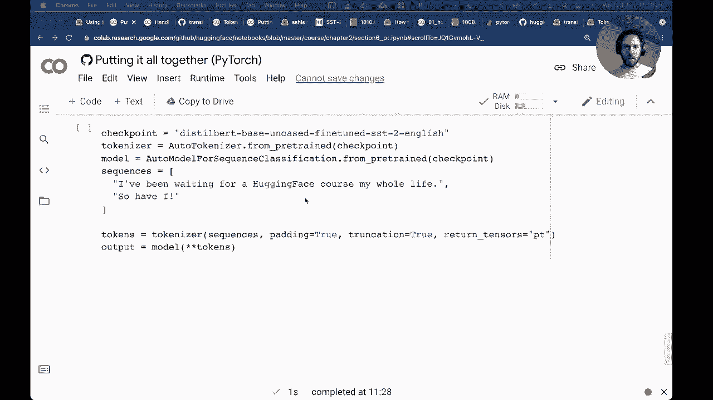

你可能已经看到我们有论坛，在论坛上，我们有一个课程分类。

所以如果你在这次会议后想到任何问题，或者一般关于变压器的问题，可以在这里询问，我们中的一个人会回复你。如果你有时间，分享你的项目是一个很酷的事情。实际上，我们可以看到DK Cr De在这里分享他出色的数据集，用于模型中心。

当你开始学习变压器时，获得反馈的一种很酷的方法就是分享你的工作，至少对我个人而言，我来自非计算机科学背景，我学习了物理，然后决定转向机器学习。

这种分享是一种非常有效的方式，可以获得社区的反馈，同时也在学习如何沟通。这是进行任何数据科学工作非常重要的一部分。所以，比如，今天汤姆被问到的一个有趣实验是，改变模型的配置会发生什么，它会出错吗。

这是一个展示的酷点，或者一般来说。你知道，任何你进行的训练实验都会揭示出非常棒的内容。继续。好的，还有一个来自拉什·马希克的最后一个问题，如何检查默认模型。好的。我们来看一下这个。好的，所以让我们拿一个管道。

所以我可能需要从transformers导入管道。然后我将创建一个情感分析的管道。例如。问题是，我们如何检查正在使用的模型，因此管道对象有许多不同的属性，而有趣的属性是模型。在这种情况下，所以如果我们看看这个，它会告诉我们，好的，输出是这样的。

但也许我们可以先查看模型的配置。然后我们可以看到，在这种情况下，默认用于情感分析的模型是distillbert，这正是我们在课堂上看到的那个检查点。所以我希望这能回答拉什·马希克的问题，你可以对任何其他管道做这个。我们快速看看如果我进行问答会发生什么。ううい。

所以在问答中的默认模型将是Distillber基于squad的案例。这就是我们所拥有的。酷，所以还有另一个问题，西尔万的第一场会议的录音是否可用。我在YouTube频道上找不到它，我相信。😊，会有的。但我想我得稍后和西尔文确认。所以我很确定我们尽量将能放上YouTube的内容都放上去。

所以，我会让你知道这个情况。所以非常感谢你们提出的非常酷的问题。能够与大家互动真是一种快乐，否则我就只能一个人对着屏幕说话。感谢你的参与。我们下次见。所以西尔万明天会进行会议，这和今天是一样的，下周我们将开始第三章。

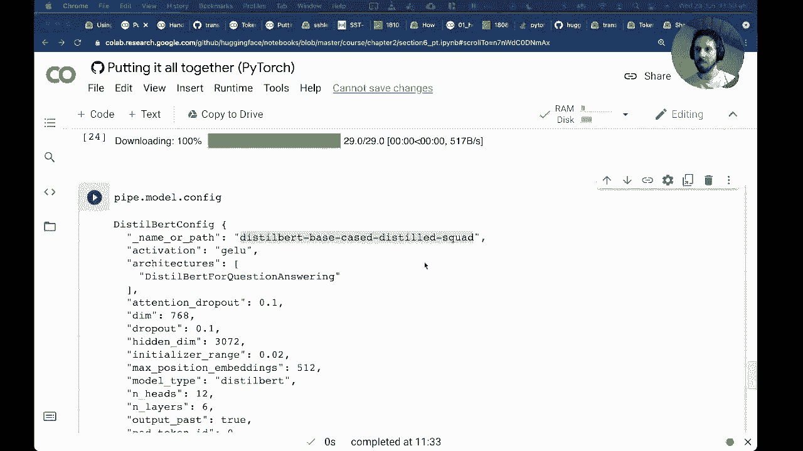

아。
