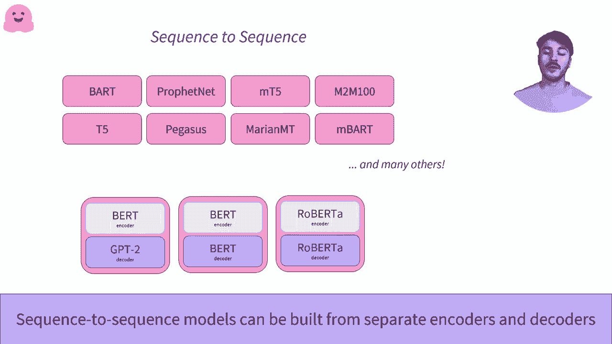

#  Transformers 原理细节及 NLP 任务应用！P7：L1.7- Transformer：编码器-解码器 

在这个视频中，我们将研究编码器-解码器架构。一个流行的编码器-解码器模型的例子是 T5。为了理解编码器-解码器的工作原理，我们建议您查看关于编码器和解码器的独立模型视频。

理解它们各自的工作原理将有助于理解编码器-解码器的工作原理。让我们从我们所了解的编码器开始。编码器将单词作为输入，经过编码器处理，并为每个经过的单词检索一个数值表示。我们现在知道这个数值表示包含关于序列意义的信息。

让我们把这个放到一边，给图表添加解码器。在这种情况下。我们以一种前所未见的方式使用解码器。我们将编码器的输出直接传递给它。此外，除了编码器输出之外，我们还给解码器一个序列。当请求解码器输出没有初始序列时。

我们可以给它一个表示序列开始的值。😊。这就是锚点装饰魔法发生的地方。😊，编码器接受一个序列作为输入。它计算一个预测并输出一个数值表示。😊。然后将其发送给解码器。从某种意义上说，它已经对该序列进行了编码。然后解码器。

反过来，使用这个输入和它通常的序列输入将尝试解码序列。解码器解码一个序列，并输出一个单词。到目前为止，我们不需要真正理解那个单词，但我们可以理解解码器本质上是在解码编码器的输出。这里的开始序列，这里启动序列的单词表明它应该开始解码序列。

现在我们有了编码器的数值表示和一个初始生成的单词。我们不再需要编码器。正如我们之前看到的，解码器可以以自回归的方式工作。它刚刚输出的单词现在可以用作输入。这与编码器输出的数值表示相结合。

现在可以用来生成第二个单词。请注意，第一个单词仍然存在，因为模型仍然输出它。然而，我们已将其灰化，因为我们不再需要它。😊，我们可以继续下去。例如，直到解码器输出我们认为的停止值，比如一个句号，表示序列的结束。在这里，我们看到了编码器-解码器变换器的完整机制。

我们再回顾一次。我们有一个发送到编码器的初始序列。😊。然后，该编码器输出被发送到解码器进行解码。虽然在单次使用后它可以丢弃编码器，但解码器将被多次使用，直到生成所需的每一个单词。

让我们来看一个具体的例子，关于翻译语言建模，也称为转导。这是翻译一个序列的行为。在这里，我们想把这句英语序列“welcome to NYYC”翻译成法语。我们使用一个专门为这个任务训练的变换器模型。我们使用编码器来创建英语句子的表示。

我们通过使用起始序列单词将其传递给解码器。我们请它输出第一个单词。它输出“B avenue”，这意味着欢迎。然后我们将“B avenue”作为解码器的输入序列。这个与编码器的数值表示结合，允许解码器预测第二个单词“a”。

在英语中，这是两个单词。😊 最后，我们请解码器预测第三个单词，它预测了“NYC”。这是正确的，我们已经翻译了这个句子。编码器和解码器真正出色的地方在于，我们有一个编码器和一个解码器，它们通常不共享权重。因此，我们有一个完整的块，即编码器，可以被训练来理解序列并提取相关信息。

对于我们之前看到的翻译场景，例如，这意味着解析和理解用英语说的内容。这将意味着从该语言中提取信息，并将所有这些信息放入一个信息密集的向量中。😊 另一方面，我们有解码器，其唯一目的是解码编码器输出的数值表示。

这个解码器可以专门用于完全不同的语言，甚至是图像或语音等模态。编码器和解码器有几个特别的原因。首先，它们能够管理像我们刚刚看到的翻译这样的序列到序列的任务。其次，编码器和解码器部分之间的权重不一定是共享的。

让我们再举一个翻译的例子。在这里，翻译变换器在法语中很强大。首先，这意味着从三个单词的序列中，我们能够生成四个单词的序列。有人可能会争辩说，这可以通过一个以自回归方式生成翻译的解码器来处理。他们是对的。另一个序列到序列变换器出色的例子是摘要生成。

在这里，我们有非常非常长的序列，一般是一整篇文本，我们想要对其进行总结。由于编码器和解码器是分开的，我们可以有不同的上下文长度，例如，编码器处理文本时的非常长的上下文，以及解码器处理摘要序列时的较小上下文。序列到序列模型有很多。

这包含了一些在变换器库中流行的编码器-解码器模型的示例。此外，你可以在编码器-解码器模型中加载编码器和解码器。😊 因此，根据你所针对的特定任务，你可以选择使用在这些特定任务上证明其价值的特定编码器和解码器。

。

