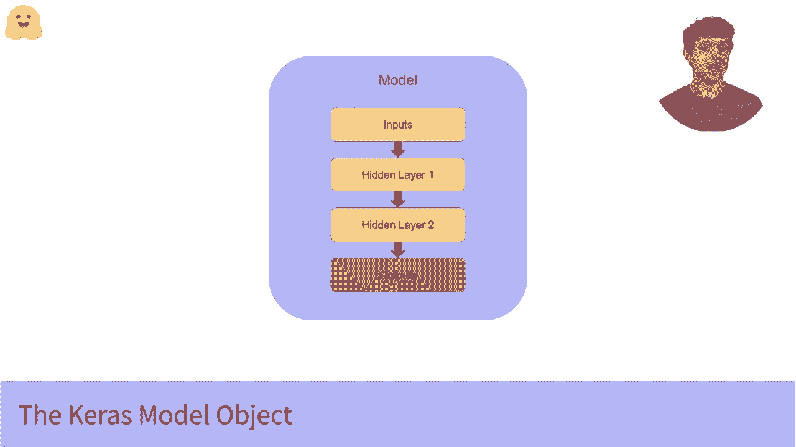

#  Transformers 原理细节及NLP任务应用！P26：L4.3- Keras介绍 

在这个视频中，我将给你一个关于我们的 Transformer 模型如何与 TensorFlow 和 Keras 协同工作 的简要介绍。非常简单的解释是，我们所有的 TensorFlow 模型也是 Keras 模型对象，因此它们拥有标准的 Keras 模型 API。😊 如果你是一个有经验的机器学习工程师，已经频繁使用 Keras，那可能这就是你开始与之合作所需知道的一切，但对于其他人来说。

包括那些回归的浪子 PyTorch 工程师。我将迅速介绍 Keras 模型以及我们如何与它们合作。在我下面链接的其他视频中，我将更详细地讲解 Keras 模型的训练，但首先，从高层次上看，Keras 模型是什么？

因此，你的模型基本上包含了整个网络。它包含这些层和层的权重，并且还告诉模型如何处理这些权重。因此，它定义了从输入到输出的整个路径。如果你以前使用过 Keras，可能是通过手动构建模型对象来开始的。

你可以一个层一个层地添加，也许使用 model.dot.add 或功能性方法。这没什么错，很多出色的模型都是这样构建的。但你也可以一次性加载整个模型，包括权重。这非常有帮助，因为如你所见。

如果你尝试阅读论文或查看代码，你会发现 Transformer 的内部结构相当复杂，从头开始编写并准确实现这一切对于一位有经验的机器学习工程师来说也是一项艰巨的任务。但因为这一切都打包在模型内部，如果你不想担心那种复杂性，你就不需要担心。如果你是一名研究人员，想深入探讨，当然可以。

你还可以仅用一行代码加载一个预训练的、预配置的 Transformer 模型。😊。

当我早些时候提到 Keras API 时，它的优势在于，无论你是从头开始编写自己的模型，还是加载一个预训练的模型，你都通过相同的 API 与模型互动，因此你使用的正是那些少数相同的方法，你会一次又一次地看到这些方法，比如 fit。

编译和预测，正如我提到的，我们将看到具体的示例，展示如何在我下面链接的视频中使用这些方法。现在，要从这个视频中带走的关键点是，如果你以前从未见过Keras，那么这种整洁的封装意味着庞大的神经网络的所有复杂性变得可管理，因为你以完全相同的方式与之互动，使用完全相同的方法。

无论是一个巨大的预训练语言模型，还是你手动编写的简单模型。

。
