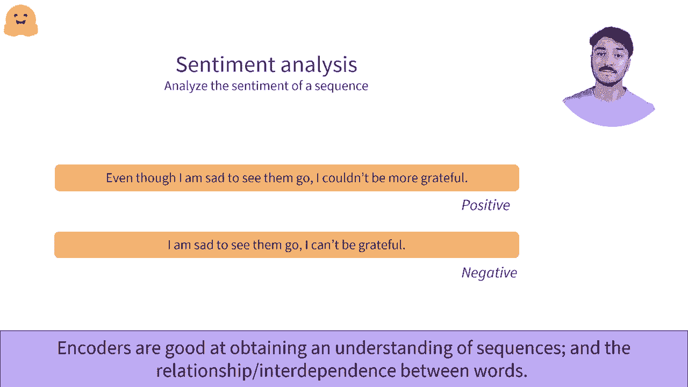

#  Transformers 原理细节及NLP任务应用！P5：L1.5- Transformer：编码器 

在这个视频中，我们将研究编码器架构。一个流行的独立架构的例子是Bt，它是该类型中最受欢迎的模型。让我们先了解它是如何工作的。我们将使用一个小例子，使用三个单词作为输入，并将它们通过编码器传递。

我们检索每个单词的数值表示。例如，这里编码器将这三个单词“欢迎来到纽约”转换为这三个数字序列。编码器为每个输入单词输出一个数字序列。这个数值表示也可以称为特征向量或特征张量。

让我们深入研究这个表示。它包含每个通过编码器传递的单词的一个向量。每个向量都是所讨论单词的数值表示。该向量的维度由模型的架构定义，对于基础Bert模型，它是768。这些表示包含了单词的值，但在上下文中。例如。

分配给word2的向量不仅是两个单词的表示。它还考虑到周围的单词，这就是我们所称的上下文。它查看左侧上下文，即我们研究的单词左边的单词。在这里是“欢迎”这个词，以及右侧的上下文，这里是“纽约”这个词。

它为给定上下文的单词输出一个值。因此，这是一个上下文化的值。😊可以说，768个值的向量在文本中承载了单词的意义。它是通过自注意力机制实现的。自注意力机制与单个序列中不同位置或不同单词相关联，以计算该序列的表示。

正如我们之前所见，这意味着单词的最终表示受到了序列中其他单词的影响。😊我们在这里不会深入这些细节，但如果你想更好地理解其内部机制，我们会提供一些进一步的阅读资料。

那么，什么时候应该使用编码器呢？编码器可以作为独立模型在多种任务中使用。😊例如，Bert，毫无疑问是最著名的变换器模型，是一个独立的基准模型。在发布时，它在许多序列分类任务、问答任务和掩蔽语言建模等方面处于最先进水平，仅举几例。😊

这个想法是，编码器在提取携带序列有意义信息的向量方面非常强大。然后，这个向量可以由后续神经元进行处理，以理解这些信息。让我们看看一些编码器表现出色的例子。首先，掩蔽语言建模或MLM。这是预测序列中隐藏词语和单词序列的任务。在这里。

例如，我们隐藏了“my”和“is”之间的词。这是Bert训练的目标之一。它被训练用于预测序列中的隐藏词。编码器在这个场景中特别出色，因为双向信息在这里至关重要。如果我们没有右边的单词“is Silva”和句号。

那么Bt几乎没有可能能够识别“name”作为正确的单词。编码器需要对序列有良好的理解，以便预测一个被屏蔽的词，因为即使文本在语法上是正确的，它在序列的上下文中也不一定有意义。正如之前提到的，编码器擅长进行序列分类。😊

情感分析是序列分类的一个例子。模型的目标是识别序列的情感。它可以用于评估分析时给序列打分（从一到五颗星），或对序列进行正面或负面的评价，这就是这里所展示的。例如，给定这两个序列。

我们使用模型来计算预测，并将序列分类为这两类：正面和负面。虽然这两个序列非常相似，包含相同的单词，但意义完全不同，而编码器模型能够抓住这种差异。

。

