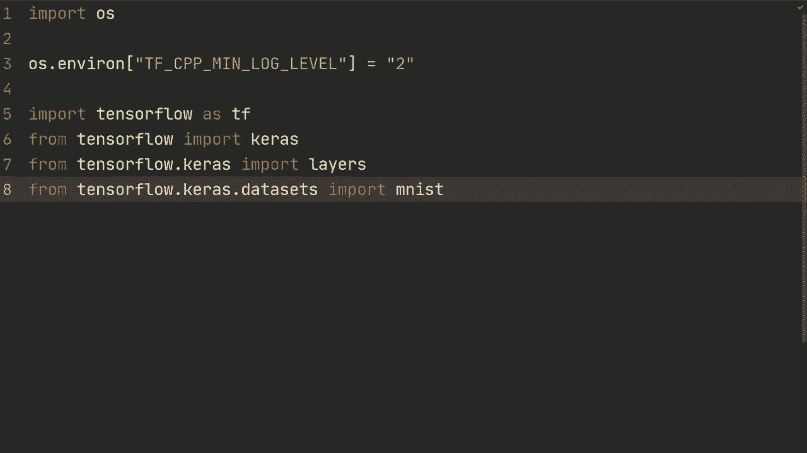

# [双语字幕+资料下载]“当前最好的 TensorFlow 教程！”，P15：L15- 自定义模型与拟合 

好了，伙计们发生了什么。 欢迎回来看另一个视频在这个视频中。 我们将探索如何构建更灵活的训练循环。 到目前为止，我们一直在使用模型适合，如果您可以使用模型适合那是很棒的。 但有时候你需要更多的灵活性。 所以在这个视频中我们将看看如何自定义模型适合。

然后在下一个视频中，我们将看看如何从头开始构建自定义训练循环。 

好的，首先，这里只是一些基本的导入，你们以前都见过这些。 然后我们只需加载Ms数据集。 所以我们不会做任何复杂的事情。 我只是想向你展示一般结构，然后可以应用于许多不同的问题。 好吧，我们要xtrain y train，x 测试，y 测试，我们只是要M加载数据。

然后我们要做 xtrain 是 xtrain 点重塑然后我们只会有。 我猜所有的例子减去1，然后28281，我们在这里做重塑只是为了添加这个频道。 然后作为类型转换为流32，然后通过除以255来规范化。 所以让我们复制这个，让我们换一行。 干 X 测试。 测试，并且。 让我们创建我们的模型。

首先，所以模型等于ks顺序。 然后我们要做的层输入。 然后输入的形状是28,281。 层来到64,3内核大小，我填充相同，所以我只是快速地通过这个。 这实际上不是视频的最重要部分。 😔，所以现在我们有了一个模型。

我们要创建一个类，我们要称它为自定义适合。 然后我们要从Kaosta模型继承。 然后我们要做的第一件事是我们要创建一个init函数，我们要发送到这里的所有东西都是模型。 所以我们要首先调用超级来继承Kaosta模型。 所以我们要做的是自己然后在这里。 然后我们要做的是将模型设置为模型。

然后我们要做的是定义一个训练步骤，这将在模型点拟合中使用。 所以我们的目标基本上是。 我们想做像训练一样的自定义，等待自定义。 那模型的什么自定义适合。 我们要送进那个模型。 然后我们将做训练点适合，我们将送入 x 训练，Y 训练。

然后批量大小和vpos数量通常是这样的。尽管这个适配将以自定义方式进行，我们将定义我们想要如何执行。因此，我的意思是，有很多用例需要自定义训练循环，尽可能使用模型Efi，当不能时尝试自定义你的模型，这就是我们在这个视频中所做的。为了获得最大的灵活性，你从头开始训练循环，但实际上需要这样做的一个例子是生成对抗网络。我并不假设你熟悉这个，只是说有很多这样的例子。

这很有用。好的，那么我们进行一次训练步骤。我们将发送数据，然后我们将得到一个x和y的元组。所以我们只需让x和y等于数据。接着我们将使用TF梯度记录作为记录。

我们这样做的原因是因为现在我们将进行前向传播和损失函数。当我们在那个上下文中进行操作时，它将记录所有执行的操作，这将有助于计算反向传播的梯度。

基本上，我们要做的y预测是一个自我点模型。我们将发送x。我们会指定训练为真，然后对于这个损失函数，我们将做损失等于自我编译的损失。然后我们将发送y和y预测。

这将在编译中完成。所以在这里，我们将进行训练编译，我们将发送。在这里我们将发送优化器为Kara的Oprs，Adamom。然后我们将发送损失为Kara的损失，稀疏的分类交叉熵。逻辑等于真。然后我们还将做指标为准确性。

所以这是我们第一次进行编译的情况。我还将向你展示如何进行自定义编译。但让我们逐步进行。因此我们现在将继续在这个编译下进行训练步骤。自我编译的损失使用这个稀疏分类交叉熵来自训练编译。

在那之后，我们基本上想要获得梯度，对吧，我们现在完成了前向传播。这部分是前向传播，我们在这个记录下进行所有操作。然后我们将训练变量设置为自我可训练变量，这些变量都存储在这个父类中。这辆车的模型，因此我们不必担心这个，然后我们想要获得梯度。

我们将执行带有梯度的记录。然后我们将做损失和训练变量，对吧。所以我们正在获得相对于训练变量的损失梯度，这正是我们想要改变的。接着我们将进行一步，优化器步骤，一个梯度下降步骤，我们将执行自我优化器的应用。梯度。

然后在这里我们将执行zip梯度和训练变量。接下来我们将自我编译的度量更新状态Y和Y预测。这将用于准确率。最后，我们将返回M.name。你会看到它的含义，M.name M.result对于自我度量。

所以我们获取MD.name，这将是损失，比如说。然后我们获取结果，即当前损失，然后我们为所有度量执行这一步，这将是损失和准确率。在这种情况下。我想这就是第一步的全部内容。我们现在应该能够运行这个。如你所见，它似乎有效。

是的，所以基本上。接下来的步骤是我们想要进行自己的编译。所以我们要在这里定义编译。我们将传入优化器和损失。然后我们将执行自定义的编译。所以，是的。

然后我们将自我优化器等于优化器，自我损失等于损失。然后我们只需做基本上相同的事情，训练.tcomp。除了我们不在这里传入度量，所以我们只使用优化器和损失。

现在基本上就是这样，我们只需将这个地方改为编译后的损失。我们将使用存储在这里的自我损失。所以自我损失，然后让我们看看，是的，我们仍然可以使用自我优化器，然后让我们重新运行它。现在，如你所见，我们没有得到准确率。

所以我们需要自己跟踪这个度量。我们可以，比如说，在这里创建。我们可以做。准确率度量是。Ca us那个矩阵spae类别准确率。我们就叫它名字。's看名字等于。准确率。然后，在这里，在编译的度量内。

我们要做的是准确率度量的更新状态。我们将传入Y和Y预测，然后我们可以去掉这个编译的度量。嗯。所以希望这就是全部。让我们看看能否运行这个。好的。既然我们自己在跟踪准确率。

我们在这里将明确写出。所以我们将做损失在这种情况下，就是损失。然后我们将做准确率。是。准确率度量.result。希望现在我们可以得到损失和准确率。是的。这看起来和我们之前做的很相似。

只是现在我们完全由自己来进行 compile。好的，所以现在我们得到了 compile，得到了训练步骤，我们通常会在训练结束后执行训练的评估，然后是 x test 和 y test，接着我们指定批量大小。我们说 32。这里有一件事是，这个 dot fit 在训练步骤上有效，而 evaluate 则在测试步骤上有效。

为了使这个工作，我们实际上需要定义另一个函数，并且我们需要执行测试步骤，尽管这个步骤会稍微简单一点，因为首先我们将解包数据，然后计算预测，因此我们的预测将是 self。

我们在指定训练为 false 的同时使用 t model X。我们所做的是，如果我们使用批量归一化或 dropout，那么在测试和训练期间它们的行为是不同的，我们只是告诉模型现在是在测试模式。因此，请确保这些在不同情况下有不同行为的模块设置为测试模式或评估模式。

然后我们将计算损失，即 y 预测的子损失。接着我们将进行准确性对称更新状态 y y 预测。最后，我们将返回一个包含损失的字典，损失就是 loss，准确性则是 accuracy。我们正在执行对称的结果，一切都很好，因此这与训练步骤非常相似。

虽然它被大大简化了，因为我们没有进行梯度下降更新，所以我们不需要跟踪这个 tape 来确保我们拥有所有的梯度等等。因此，让我们运行这个，大约两个 epochs，然后进行评估。好的。

所以在这之后，我们看到在 test set 上得到了 93，第一次是 0poC，97，然后几乎达到 98。不过，我想我们想在这里建立的是，这似乎确实在训练并且运行良好。所以这就是如何创建你自己的，指定训练步骤和测试步骤，从而覆盖训练的 fit，然后进行评估。这样，你可以在训练步骤中构建更复杂的模型，但仍然拥有执行训练 dot fit 的灵活性，这意味着你仍然可以使用训练 dot compile，尽管在最后一次我们进行了覆盖。

compile，但你明白我的意思，你仍然可以使用他们的 compile 和所有那些指标。如果你有任何问题，请在下面的评论区留言，非常感谢你观看这个视频，希望下次再见到你。

