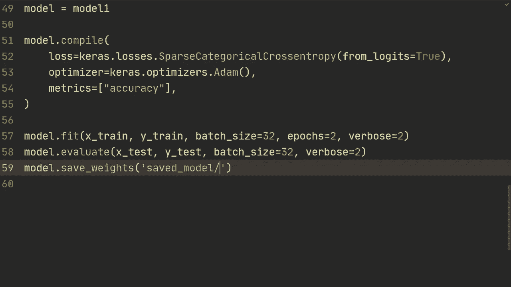
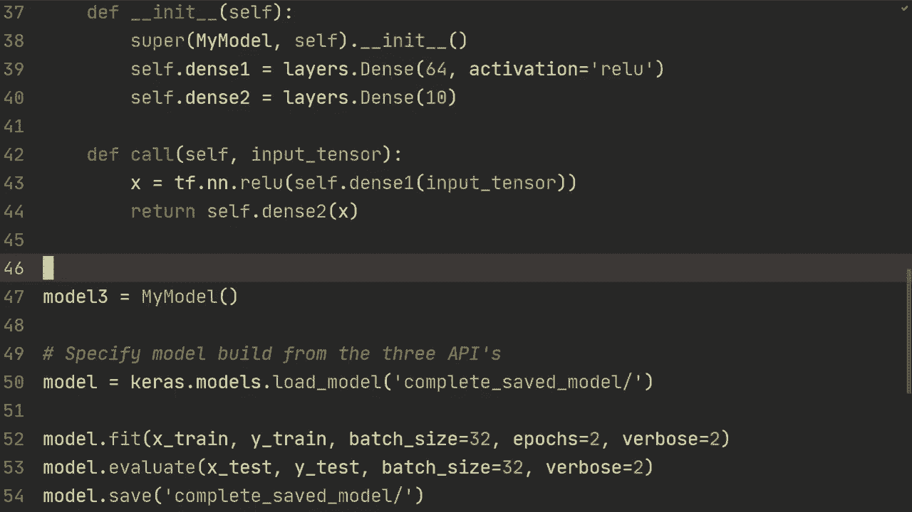

# 【双语字幕+资料下载】“当前最好的 TensorFlow 教程！”，看完就能自己动手做项目啦！＜实战教程系列＞ - P10：L10- 保存和加载模型 - ShowMeAI - BV1em4y1U7ib

In this video we're going to explore ways to save and load the model weights and then also how to save the entire model and do something that's referred to as serializing a model。

Alright， so here we have some code that should hopefully feel familiar from previous tutorials。

 so we just have some basic imports and then we're loading the Ms data set And then what I've done here is that I've created three different models。

 They're all the same model architecture just using the different APIs。

 So the first model is using the sequential API which is two dense layers with 64 nodes and then 10 output node and then similarly model2 is gonna create the same model just using the functional API。

 and then lastly we're doing it using subclassing。 So let's first of all。

 just create an outline for what we're gonna do in this video So first of all。

 I'm going show you how to save and load model weight And then secondly I'm going show you how to save and load。

Entire model， and this is called serializing model。

So when we're saving and loading the entire model it's going to be saved as a data structure and this means that it can be loaded on different TensorFlow frameworks like Tensorflowlow JavaScriptscript。

 Tensorflowlow light and so for example you could train a model on your PC and then let's say you want to put it into production and create an app then you could just load that model that you previously trained and you don't have to do any conversion and also additionally so what this will do is it will save the weights it will also save the model architecture so you don't have to actually have the code for the model and then it's also going to save the training configuration so this would be why you send into model model。

 compile。And then lastly， it's also going to save the optimizer and state。 So for example。

 if you're using the item optimizer， it's going to keep track of the exponential weighted averages and that's internal to the optimizer So for example if you're just saving the weight then the optimizer states are going to be reset every time you load from load the weight from the model。

 All right， so let's start with how to save and load the model weight where you're going to do is after training so let's do it after the model let's evaluate it we're going to do model that save weight and then we're just going to specify folder。

 let's do save model and then if we now run this So if we now open up that folder where we're running the script and then inside that one there's gonna to be another folder called save model and then that's where the files are going be that are saving the weight。

And so what you would do now to just load the model is you would do model that load weights and you would specify that folder so save the model and then you would just have to run that and also so after the first epoC previously I think it was about 90% accuracy and so what we can see now that it's after one epoch it's 97。

 meaning that it's actually loading the weights from previously So one thing here to keep in mind is that you can't actually swap and load the weights for the different implementations so for example。

 if we run this using model too， which is from the functional API then it's going to give an error saying that they aren't compatible so a general rule here is that you need to load the model using these exact same way as you saved it so there might be some work around in that you can still load the weights if you have done a sequential or functional API and if you do know how to do that then please leave a。

And then that might be helpful for some。 but anyways， as a general rule。

 you need to load it exactly the way that you saved it。

 So if you created the model and save the model using sequential then when you're loading the model it needs to be in that form as it was when you saved it Now there are also some different format that you can use when saving the model So for example I think there's a you could do specify I think it's a save format you could specify different like H5 so there are two different ways format that Tensorflowlow saves it's in the Tensorflow default format and then it's HD HDF5 format and the HDF5 format was what they previously used in Tensorflowlow 1 and then since Tensorflowlow 2 they've used I guess TensorFflow default saving format So yeah you could check out the official documentation for how to save and load using that specific file format I'm just going show you how to do it in。

In the default one so for the second thing， when we want to actually save and load the entire model and serialize the model。

 So what we we're going to do is model dot save and then we're just going to do we're going to do complete saved model or something like that。

And it's going to save it inside of that folder。And yeah。

 so we're gonna get this error this warning and that's from Tensorflow back in。

 so there's nothing you can do about this。 if you do get it， then just ignore it。

's from my understanding there's nothing that we're doing wrong and this should hopefully be fixed in a future version but anyways you're saving the model here and now what you're going to do is you can actually remove this entirely so you can remove the model do compile and you can specify just model equals ksmod load model and then we're just going to specify that directory complete saved modelright so that's going to save the load the entire architecture。

 So what you could also do here is that you could remove so you could remove the code for the model that you're now loading from and that's going to be also done inside of this load model and then it's going to also load the training configuration So the model compile that's why we could remove that part and now。

We just rerun this。We can see that it's continuing training at that point and then we're getting this error again because it's saving the model and this works regardless of using sequential functional or subclassing and there so previously when you save as default in the HDF55 format。

 you had to do some I guess some annoying things and you had to create a defined get config function here and you would also need to create one from config file but in the new format。

 you don't have to do that。 So if you're using the old format I'm going refer you to the official documentation for how you would do that but this is how you save and load models both the weights and then the serialized model version using Tensorflow from Tensorflow to and up hopefully this video was useful if you have any questions and leave them in the comment below。

 thank you so much for watching and I hope to see you in the next video。

